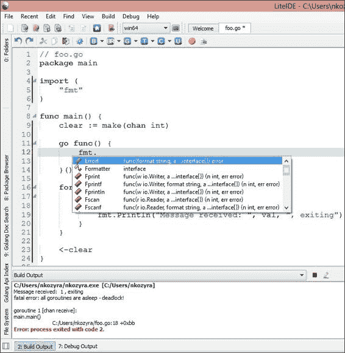

# 第九章。Go 中的日志记录和测试并发

在这个阶段，你应该对 Go 中的并发感到相当舒适，并且应该能够轻松地实现基本的 goroutines 和并发机制。

我们还涉足了一些分布式并发模式，这些模式不仅通过应用程序本身管理，还通过第三方数据存储管理网络应用程序的并发操作。

在本书的前面，我们研究了一些初步和基本的测试和日志记录。我们研究了 Go 内部测试工具的简单实现，使用 race 工具进行了一些竞争条件测试，并进行了一些基本的负载和性能测试。

然而，这里还有更多需要考虑的地方，特别是与潜在的并发代码黑洞有关——我们已经看到了在 goroutines 中运行的非阻塞代码之间出现了意外行为。

在本章中，我们将进一步研究负载和性能测试，在 Go 中进行单元测试，并尝试更高级的测试和调试。我们还将探讨日志记录和报告的最佳实践，并更仔细地研究 panic 和 recover。

最后，我们将看到所有这些东西不仅可以应用于我们独立的并发代码，还可以应用于分布式系统。

在这个过程中，我们将介绍一些不同风格的单元测试框架。

# 处理错误和日志记录

虽然我们没有明确提到，但 Go 中错误处理的成语性质使得调试自然更容易。

在 Go 代码中，任何大规模函数的一个良好实践是将错误作为返回值返回——对于许多较小的方法和函数来说，这可能是繁琐和不必要的。但是，每当我们构建涉及许多移动部件的东西时，这都是需要考虑的问题。

例如，考虑一个简单的`Add()`函数：

```go
func Add(x int, y int) int {
  return x + y
}
```

如果我们希望遵循“始终返回错误值”的一般规则，我们可能会诱使将这个函数转换为以下代码：

```go
package main
import
(
  "fmt"
  "errors"
  "reflect"
)

func Add(x int, y int) (int, error) {
  var err error

  xType := reflect.TypeOf(x).Kind()
  yType := reflect.TypeOf(y).Kind()
  if xType != reflect.Int || yType != reflect.Int {
    fmt.Println(xType)
    err = errors.New("Incorrect type for integer a or b!")
  }
  return x + y, err
}

func main() {

  sum,err := Add("foo",2)
  if err != nil {
    fmt.Println("Error",err)
  }
  fmt.Println(sum)
}
```

你可以看到我们（非常糟糕地）在重新发明轮子。Go 的内部编译器在我们看到它之前就已经杀死了它。因此，我们应该专注于编译器可能无法捕捉到的事情，这可能会导致我们的应用程序出现意外行为，特别是在涉及通道和监听器时。

要点是让 Go 处理编译器会处理的错误，除非你希望自己处理异常，而不引起编译器特定的困扰。在真正的多态性缺失的情况下，这通常很麻烦，并且需要调用接口，如下面的代码所示：

```go
type Alpha struct {

}

type Numeric struct {

}
```

你可能还记得，创建接口和结构允许我们根据类型分别路由我们的函数调用。这在下面的代码中显示：

```go
func (a Alpha) Add(x string, y string) (string, error) {
  var err error
  xType := reflect.TypeOf(x).Kind()
  yType := reflect.TypeOf(y).Kind()
  if xType != reflect.String || yType != reflect.String {
    err = errors.New("Incorrect type for strings a or b!")
  }
  finalString := x + y
  return finalString, err
}

func (n Numeric) Add(x int, y int) (int, error) {
  var err error

  xType := reflect.TypeOf(x).Kind()
  yType := reflect.TypeOf(y).Kind()
  if xType != reflect.Int || yType != reflect.Int {
    err = errors.New("Incorrect type for integer a or b!")
  }
  return x + y, err
}
func main() {
  n1 := Numeric{}
  a1 := Alpha{}
  z,err := n1.Add(5,2)	
  if err != nil {
    log.Println("Error",err)
  }
  log.Println(z)

  y,err := a1.Add("super","lative")
  if err != nil {
    log.Println("Error",err)
  }
  log.Println(y)
}
```

这仍然报告了最终会被编译器捕获的内容，但也处理了编译器无法看到的某种错误：外部输入。我们通过接口路由我们的`Add()`函数，这通过更明确地指导结构的参数和方法提供了一些额外的标准化。

例如，如果我们为我们的值输入用户输入并需要评估该输入的类型，我们可能希望以这种方式报告错误，因为编译器永远不会知道我们的代码可以接受错误的类型。

## 打破 goroutine 日志

保持关注并发和隔离的消息处理和日志记录的一种方法是用自己的日志记录器束缚我们的 goroutine，这将使一切与其他 goroutines 分开。

在这一点上，我们应该注意到这可能不会扩展——也就是说，创建成千上万个拥有自己日志记录器的 goroutines 可能会变得昂贵，但在最小规模下，这是完全可行和可管理的。

为了单独进行这种日志记录，我们将希望将一个`Logger`实例绑定到每个 goroutine，如下面的代码所示：

```go
package main

import
(
  "log"
  "os"
  "strconv"
)

const totalGoroutines = 5

type Worker struct {
  wLog *log.Logger
  Name string
}
```

我们将创建一个通用的`Worker`结构，讽刺的是它在这个示例中不会做任何工作（至少在这个示例中不会），只是保存它自己的`Logger`对象。代码如下：

```go
func main() {
  done := make(chan bool)

  for i:=0; i< totalGoroutines; i++ {

    myWorker := Worker{}
    myWorker.Name = "Goroutine " + strconv.FormatInt(int64(i),10) + ""
    myWorker.wLog = log.New(os.Stderr, myWorker.Name, 1)
    go func(w *Worker) {

        w.wLog.Print("Hmm")

        done <- true
    }(&myWorker)
  }
```

每个 goroutine 通过`Worker`都负责自己的日志例程。虽然我们直接将输出发送到控制台，但这在很大程度上是不必要的。但是，如果我们想将每个输出到自己的日志文件中，我们可以使用以下代码来实现：

```go
  log.Println("...")

  <- done
}
```

## 使用 LiteIDE 进行更丰富和更容易的调试

在本书的前几章中，我们简要讨论了 IDE，并举了一些与 Go 紧密集成的 IDE 的例子。

在我们审查日志记录和调试时，有一个 IDE 我们之前并没有特别提到，主要是因为它是为一小部分语言——即 Go 和 Lua 而设计的。然而，如果你最终主要或专门使用 Go，你会发现它绝对是必不可少的，特别是因为它与调试、日志记录和反馈功能相关。

**LiteIDE**跨平台，在 OS X、Linux 和 Windows 上运行良好。它以 GUI 形式提供的调试和测试优势是无价的，特别是如果你已经非常熟悉 Go。最后一部分很重要，因为开发人员在深入使用简化编程过程的工具之前，通常会从“学习艰难的方式”中受益最多。在被呈现出漂亮的图标、菜单和弹出窗口之前，了解某件事情的工作原理或不工作原理是几乎总是更好的。话虽如此，LiteIDE 是一款非常棒的免费工具，适用于高级 Go 程序员。

通过从 Go 中形式化许多工具和错误报告，我们可以通过在屏幕上看到它们来轻松地解决一些更棘手的调试任务。

LiteIDE 还带来了上下文感知、代码完成、`go fmt`等功能到我们的工作空间。你可以想象一下，专门针对 Go 调优的 IDE 如何帮助你保持代码的清晰和无错。参考以下截图：



LiteIDE 在 Windows 上显示输出和自动代码完成

### 提示

LiteIDE 适用于 Linux、OS X 和 Windows，可以在[`code.google.com/p/liteide/`](https://code.google.com/p/liteide/)找到。

## 将错误发送到屏幕

在本书中，我们通常使用`fmt.Println`语法处理软错误、警告和一般消息，通过向控制台发送消息。

虽然这对于演示目的来说快速简单，但最好使用`log`包来处理这些事情。这是因为我们在`log`包中有更多的灵活性，可以决定消息的最终目的地。

就我们目前的目的而言，这些消息都是虚幻的。将简单的`Println`语句切换到`Logger`非常简单。

我们之前使用以下代码来传递消息：

```go
fmt.Println("Horrible error:",err)
```

你会注意到对`Logger`的更改非常相似：

```go
myLogger.Println("Horrible error:", err)
```

这对于 goroutines 特别有用，因为我们可以创建一个全局的`Logger`接口，可以在任何地方访问，或者将记录器的引用传递给单独的 goroutines，并确保我们的日志记录是并发处理的。

在整个应用程序中使用单个记录器的一个考虑是，我们可能希望单独记录每个过程，以便更清晰地进行分析。我们稍后会在本章中更详细地讨论这一点。

要复制将消息传递给命令行，我们可以简单地使用以下代码：

```go
log.Print("Message")
```

默认情况下，它的`io.writer`是`stdout`——回想一下，我们可以将任何`io.writer`设置为日志的目的地。

然而，我们还希望能够快速轻松地记录到文件中。毕竟，任何在后台运行或作为守护程序运行的应用程序都需要有一些更持久的东西。

## 将错误记录到文件

有很多种方法可以将错误发送到日志文件中——毕竟，我们可以使用内置的文件操作 OS 调用来处理这个问题。事实上，这就是许多人所做的。

然而，`log`包提供了一些标准化和潜在的命令行反馈与错误、警告和一般信息的更持久存储之间的共生关系。

这样做的最简单方法是使用`os.OpenFile()`方法（而不是`os.Open()`方法）打开一个文件，并将该引用传递给我们的日志实例化作为`io.Writer`。

让我们在下面的示例中看看这样的功能：

```go
package main

import (
  "log"
  "os"
)

func main() {
  logFile, _ := os.OpenFile("/var/www/test.log", os.O_RDWR, 0755)

  log.SetOutput(logFile)
  log.Println("Sending an entry to log!")

  logFile.Close()
}
```

在我们之前的 goroutine 包中，我们可以为每个 goroutine 分配一个自己的文件，并将文件引用作为 io Writer 传递（我们需要对目标文件夹具有写访问权限）。代码如下：

```go
  for i:=0; i< totalGoroutines; i++ {

    myWorker := Worker{}
    myWorker.Name = "Goroutine " + strconv.FormatInt(int64(i),10) 
      + ""
    myWorker.FileName = "/var/www/"+strconv.FormatInt(int64(i),10) 
      + ".log"
    tmpFile,_ :=   os.OpenFile(myWorker.FileName, os.O_CREATE, 
      0755)
    myWorker.File = tmpFile
    myWorker.wLog = log.New(myWorker.File, myWorker.Name, 1)
    go func(w *Worker) {

        w.wLog.Print("Hmm")

        done <- true
    }(&myWorker)
  }
```

## 将错误记录到内存

当我们谈论将错误记录到内存时，我们实际上是在谈论数据存储，尽管除了易失性和有限的资源之外，没有理由拒绝将日志记录到内存作为一种可行的选择。

虽然我们将在下一节中看一种更直接的处理网络日志记录的方法，但让我们在一个并发的分布式系统中划分各种应用程序错误而不费太多力气。这个想法是使用共享内存（比如 Memcached 或共享内存数据存储）来传递我们的日志消息。

虽然这些技术上仍然是日志文件（大多数数据存储将单独的记录或文档保存为 JSON 编码的硬文件），但与传统日志记录有着明显不同的感觉。

回到上一章的老朋友 CouchDB，将我们的日志消息传递到中央服务器几乎可以毫不费力地完成，这样我们就可以跟踪不仅是单个机器，还有它们各自的并发 goroutines。代码如下：

```go
package main

import
(
  "github.com/couchbaselabs/go-couchbase"
  "io"
  "time"
  "fmt"
  "os"
  "net/http"
  "crypto/md5"
  "encoding/hex"
)
type LogItem struct {
  ServerID string "json:server_id"
  Goroutine int "json:goroutine"
  Timestamp time.Time "json:time"
  Message string "json:message"
  Page string "json:page"
}
```

这将最终成为我们将发送到 Couchbase 服务器的 JSON 文档。我们将使用`Page`，`Timestamp`和`ServerID`作为组合的哈希键，以允许对同一文档的多个并发请求在不同服务器上分别记录日志，如下面的代码所示：

```go
var currentGoroutine int

func (li LogItem) logRequest(bucket *couchbase.Bucket) {

  hash := md5.New()
  io.WriteString(hash,li.ServerID+li.Page+li.Timestamp.Format("Jan 
    1, 2014 12:00am"))
  hashString := hex.EncodeToString(hash.Sum(nil))
  bucket.Set(hashString,0,li)
  currentGoroutine = 0
}
```

当我们将`currentGoroutine`重置为`0`时，我们使用了一个有意的竞争条件，允许 goroutines 在并发执行时通过数字 ID 报告自己。这使我们能够调试一个看起来正常工作的应用程序，直到它调用某种形式的并发架构。由于 goroutines 将通过 ID 自我识别，这使我们能够更加精细地路由我们的消息。

通过为 goroutine `ID`，`timestamp`和`serverID`指定不同的日志位置，可以快速从日志文件中提取任何并发问题。使用以下代码完成：

```go
func main() {
  hostName, _ := os.Hostname()
  currentGoroutine = 0

  logClient, err := couchbase.Connect("http://localhost:8091/")
    if err != nil {
      fmt.Println("Error connecting to logging client", err)
    }
  logPool, err := logClient.GetPool("default")
    if err != nil {
      fmt.Println("Error getting pool",err)
    }
  logBucket, err := logPool.GetBucket("logs")
    if err != nil {
      fmt.Println("Error getting bucket",err)
    }
  http.HandleFunc("/", func(w http.ResponseWriter, r *http.Request) {
    request := LogItem{}
    request.Goroutine = currentGoroutine
    request.ServerID = hostName
    request.Timestamp = time.Now()
    request.Message = "Request to " + r.URL.Path
    request.Page = r.URL.Path
    go request.logRequest(logBucket)

  })

  http.ListenAndServe(":8080",nil)

}
```

# 使用 log4go 包进行强大的日志记录

与 Go 中的大多数事物一样，在核心页面中有令人满意和可扩展的东西，可以通过第三方（Go 的精彩日志包真正地与**log4go**结合在一起。

使用 log4go 极大地简化了文件记录、控制台记录和通过 TCP/UDP 记录的过程。

### 提示

有关 log4go 的更多信息，请访问[`code.google.com/p/log4go/`](https://code.google.com/p/log4go/)。

每个`log4go Logger`接口的实例都可以通过 XML 配置文件进行配置，并且可以对其应用过滤器以指示消息的去向。让我们看一个简单的 HTTP 服务器，以展示如何将特定的日志定向到位置，如下面的代码所示：

```go
package main

import (
  "code.google.com/p/log4go"
  "net/http"
  "fmt"
  "github.com/gorilla/mux"
)
var errorLog log4go.Logger
var errorLogWriter log4go.FileLogWriter

var accessLog log4go.Logger
var accessLogWriter *log4go.FileLogWriter

var screenLog log4go.Logger

var networkLog log4go.Logger
```

在前面的代码中，我们创建了四个不同的日志对象——一个将错误写入日志文件，一个将访问（页面请求）写入到一个单独的文件，一个直接发送到控制台（用于重要通知），一个将日志消息传递到网络。

最后两个显然不需要`FileLogWriter`，尽管完全可以使用共享驱动器来复制网络记录，如果我们可以减轻并发访问的问题，如下面的代码所示：

```go
func init() {
  fmt.Println("Web Server Starting")
}

func pageHandler(w http.ResponseWriter, r *http.Request) {
  pageFoundMessage := "Page found: " + r.URL.Path
  accessLog.Info(pageFoundMessage)
  networkLog.Info(pageFoundMessage)
  w.Write([]byte("Valid page"))
}
```

任何对有效页面的请求都会发送消息到`web-access.log`文件`accessLog`。

```go
func notFound(w http.ResponseWriter, r *http.Request) {
  pageNotFoundMessage := "Page not found / 404: " + r.URL.Path
  errorLog.Info(pageNotFoundMessage)
  w.Write([]byte("Page not found"))
}
```

与`accessLog`文件一样，我们将接受任何`404 /页面未找到`的请求，并直接将其路由到`notFound()`方法，该方法保存了一个相当通用的错误消息以及无效的`/`丢失的 URL 请求。让我们看看在下面的代码中我们将如何处理非常重要的错误和消息：

```go
func restricted(w http.ResponseWriter, r *http.Request) {
  message := "Restricted directory access attempt!"
  errorLog.Info(message)
  accessLog.Info(message)
  screenLog.Info(message)
  networkLog.Info(message)
  w.Write([]byte("Restricted!"))

}
```

`restricted()`函数和相应的`screenLog`表示我们认为是*关键*的消息，并且值得不仅发送到错误和访问日志，而且还发送到屏幕并作为`networkLog`项目传递。换句话说，这是一个非常重要的消息，每个人都会收到。

在这种情况下，我们正在检测尝试访问我们的`.git`文件夹，这是一个相当常见的意外安全漏洞，人们已知在自动文件上传和更新中犯过这种错误。由于我们在文件中表示明文密码，并且可能将其暴露给外部世界，我们将在请求时捕获这些并传递给我们的关键和非关键日志记录机制。

我们也可以将其视为一个更开放的坏请求通知器-值得网络开发人员立即关注。在下面的代码中，我们将开始创建一些日志记录器：

```go
func main() {

  screenLog = make(log4go.Logger)
  screenLog.AddFilter("stdout", log4go.DEBUG, log4go.NewConsoleLogWriter())

  errorLogWriter := log4go.NewFileLogWriter("web-errors.log", 
    false)
    errorLogWriter.SetFormat("%d %t - %M (%S)")
    errorLogWriter.SetRotate(false)
    errorLogWriter.SetRotateSize(0)
    errorLogWriter.SetRotateLines(0)
    errorLogWriter.SetRotateDaily(true)
```

由于 log4go 提供了许多额外的日志选项，我们可以稍微调整我们的日志轮换和格式，而不必专门使用`Sprintf`或类似的东西来绘制出来。

这里的选项简单而富有表现力：

+   `SetFormat`：这允许我们指定我们的单独日志行的外观。

+   `SetRotate`：这允许根据文件大小和/或`log`中的行数自动旋转。`SetRotateSize()`选项设置消息中的字节旋转，`SetRotateLines()`设置最大的`行数`。`SetRotateDaily()`函数让我们根据前面函数中的设置在每天创建新的日志文件。这是一个相当常见的日志记录技术，通常手工编码会很繁琐。

我们的日志格式的输出最终看起来像以下一行代码：

```go
04/13/14 10:46 - Page found%!(EXTRA string=/valid) (main.pageHandler:24)
```

`%S`部分是源，它为我们提供了调用日志的应用程序部分的行号和方法跟踪：

```go
  errorLog = make(log4go.Logger)
  errorLog.AddFilter("file", log4go.DEBUG, errorLogWriter)

  networkLog = make(log4go.Logger)
  networkLog.AddFilter("network", log4go.DEBUG, log4go.NewSocketLogWriter("tcp", "localhost:3000"))
```

我们的网络日志通过 TCP 发送 JSON 编码的消息到我们提供的地址。我们将在下一节的代码中展示一个非常简单的处理服务器，将日志消息转换为一个集中的日志文件：

```go
  accessLogWriter = log4go.NewFileLogWriter("web-access.log",false)
    accessLogWriter.SetFormat("%d %t - %M (%S)")
    accessLogWriter.SetRotate(true)
    accessLogWriter.SetRotateSize(0)
    accessLogWriter.SetRotateLines(500)
    accessLogWriter.SetRotateDaily(false)
```

我们的`accessLogWriter`与`errorLogWriter`类似，只是它不是每天轮换一次，而是每 500 行轮换一次。这里的想法是访问日志当然会比错误日志更频繁地被访问-希望如此。代码如下：

```go
  accessLog = make(log4go.Logger)
  accessLog.AddFilter("file",log4go.DEBUG,accessLogWriter)

  rtr := mux.NewRouter()
  rtr.HandleFunc("/valid", pageHandler)
  rtr.HandleFunc("/.git/", restricted)
  rtr.NotFoundHandler = http.HandlerFunc(notFound)
```

在前面的代码中，我们使用了 Gorilla Mux 包进行路由。这使我们更容易访问`404`处理程序，在基本的直接内置到 Go 中的`http`包中修改起来不那么简单。代码如下：

```go
  http.Handle("/", rtr)
  http.ListenAndServe(":8080", nil)
}
```

像这样构建网络日志系统的接收端在 Go 中也非常简单，因为我们构建的只是另一个可以处理 JSON 编码消息的 TCP 客户端。

我们可以通过一个接收服务器来做到这一点，这个接收服务器看起来与我们早期章节中的 TCP 聊天服务器非常相似。代码如下：

```go
package main

import
(
  "net"
  "fmt"
)

type Connection struct {

}

func (c Connection) Listen(l net.Listener) {
  for {
    conn,_ := l.Accept()
    go c.logListen(conn)
  }
}
```

与我们的聊天服务器一样，我们将我们的监听器绑定到一个`Connection`结构，如下面的代码所示：

```go
func (c *Connection) logListen(conn net.Conn) {
  for {
    buf := make([]byte, 1024)
    n, _ := conn.Read(buf)
    fmt.Println("Log Message",string(n))
  }
}
```

在前面的代码中，我们通过 JSON 接收日志消息。在这一点上，我们还没有解析 JSON，但我们已经在早期的章节中展示了如何做到这一点。

发送的任何消息都将被推送到缓冲区中-因此，根据信息的详细程度，扩展缓冲区的大小可能是有意义的。

```go
func main() {
  serverClosed := make(chan bool)

  listener, err := net.Listen("tcp", ":3000")
  if err != nil {
    fmt.Println ("Could not start server!",err)
  }

  Conn := Connection{}

  go Conn.Listen(listener)

  <-serverClosed
}
```

你可以想象网络日志记录在哪里会很有用，特别是在服务器集群中，你可能有一系列的，比如，Web 服务器，你不想将单独的日志文件合并成一个日志。

## 恐慌

在讨论捕获错误并记录它们时，我们可能应该考虑 Go 中的`panic()`和`recover()`功能。

正如前面简要讨论的，`panic()`和`recover()`作为一种更基本、即时和明确的错误检测方法，比如`try`/`catch`/`finally`甚至 Go 的内置错误返回值约定。按设计，`panic()`会解开堆栈并导致程序退出，除非调用`recover()`。这意味着除非你明确地恢复，否则你的应用程序将结束。

那么，除了停止执行之外，这有什么用处呢？毕竟，我们可以捕获错误并通过类似以下代码手动结束应用程序：

```go
package main

import
(
  "fmt"
  "os"
)

func processNumber(un int) {

  if un < 1 || un > 4 {
    fmt.Println("Now you've done it!")
    os.Exit(1)
  }else {
    fmt.Println("Good, you can read simple instructions.")
  }
}

func main() {
  userNum := 0
  fmt.Println("Enter a number between 1 and 4.")
  _,err := fmt.Scanf("%d",&userNum)
    if err != nil {}

  processNumber(userNum)
}
```

然而，虽然这个函数进行了健全性检查并执行了永久的、不可逆转的应用程序退出，`panic()`和`recover()`允许我们从特定包和/或方法中反映错误，保存这些错误，然后优雅地恢复。

当我们处理从其他方法调用的方法时，这是非常有用的，这些方法又是从其他方法调用的，依此类推。深度嵌套或递归函数的类型使得很难辨别特定错误，这就是`panic()`和`recover()`最有优势的地方。你也可以想象这种功能与日志记录的结合有多么好。

## 恢复

`panic()`函数本身相当简单，当与`recover()`和`defer()`配对时，它真正变得有用。

举个例子，一个应用程序从命令行返回有关文件的元信息。应用程序的主要部分将监听用户输入，将其传递到一个打开文件的函数中，然后将该文件引用传递给另一个函数，该函数将获取文件的详细信息。

现在，显然我们可以直接通过过程堆叠错误作为返回元素，或者我们可以在途中发生 panic，恢复回到步骤，然后在底部收集我们的错误以进行日志记录和/或直接报告到控制台。

避免意大利面代码是这种方法与前一种方法相比的一个受欢迎的副作用。以一般意义来考虑（这是伪代码）：

```go
func getFileDetails(fileName string) error {
  return err
}

func openFile(fileName string) error {
  details,err := getFileDetails(fileName)
  return err
}

func main() {

  file,err := openFile(fileName)

}
```

有一个错误时，完全可以以这种方式处理我们的应用程序。然而，当每个单独的函数都有一个或多个失败点时，我们将需要更多的返回值以及一种将它们全部整合成单个整体错误消息或多个消息的方法。检查以下代码：

```go
package main

import
(
  "os"
  "fmt"
  "strconv"
)

func gatherPanics() {
  if rec := recover(); rec != nil {
    fmt.Println("Critical Error:", rec)
  }
}
```

这是我们的一般恢复函数，在我们希望捕获任何 panic 之前调用每个方法。让我们看一个推断文件详细信息的函数：

```go
func getFileDetails(fileName string) {
  defer gatherPanics()
  finfo,err := os.Stat(fileName)
  if err != nil {
    panic("Cannot access file")
  }else {
    fmt.Println("Size: ", strconv.FormatInt(finfo.Size(),10))
  }
}

func openFile(fileName string) {
  defer gatherPanics()
  if _, err := os.Stat(fileName); err != nil {
    panic("File does not exist")
  }

}
```

前面代码中的两个函数仅仅是尝试打开一个文件并在文件不存在时发生 panic。第二个方法`getFileDetails()`被从`main()`函数中调用，这样它将始终执行，而不管`openFile()`中是否有阻塞错误。

在现实世界中，我们经常会开发应用程序，其中非致命错误只会导致应用程序的部分功能停止工作，但不会导致整个应用程序崩溃。检查以下代码：

```go
func main() {
  var fileName string
  fmt.Print("Enter filename>")
  _,err := fmt.Scanf("%s",&fileName)
  if err != nil {}
  fmt.Println("Getting info for",fileName)

  openFile(fileName)
  getFileDetails(fileName)

}
```

如果我们从`gatherPanics()`方法中删除`recover()`代码，那么如果/当文件不存在，应用程序将崩溃。

这可能看起来很理想，但想象一下一个用户选择了一个不存在的文件作为他们没有权限查看的目录。当他们解决了第一个问题时，他们将被呈现第二个问题，而不是一次看到所有潜在的问题。

从用户体验的角度来看，表达错误的价值无法被过分强调。通过这种方法，收集和呈现表达性错误变得更加容易——即使`try`/`catch`/`finally`也要求我们（作为开发人员）在 catch 子句中明确地处理返回的错误。

### 记录我们的 panic

在前面的代码中，我们可以很简单地集成一个日志记录机制，除了捕获我们的 panic。

关于日志记录，我们还没有讨论的一个考虑是何时记录。正如我们之前的例子所说明的，有时我们可能遇到应该记录但可能会被未来用户操作所缓解的问题。因此，我们可以选择立即记录错误或将其保存到执行结束或更大的函数结束时再记录。

立即记录日志的主要好处是我们不容易受到实际崩溃的影响，从而无法保存日志。举个例子：

```go
type LogItem struct {
  Message string
  Function string
}

var Logs []LogItem
```

我们使用以下代码创建了一个日志`struct`和一个`LogItems`的切片：

```go
func SaveLogs() {
  logFile := log4go.NewFileLogWriter("errors.log",false)
    logFile.SetFormat("%d %t - %M (%S)")
    logFile.SetRotate(true)
    logFile.SetRotateSize(0)
    logFile.SetRotateLines(500)
    logFile.SetRotateDaily(false)

  errorLog := make(log4go.Logger)
  errorLog.AddFilter("file",log4go.DEBUG,logFile)
  for i:= range Logs {
    errorLog.Info(Logs[i].Message + " in " + Logs[i].Function)
  }

}
```

这里，我们捕获的所有`LogItems`将被转换为日志文件中的一系列好的行项目。然而，如下代码所示，存在问题：

```go
func registerError(block chan bool) {

  Log := LogItem{ Message:"An Error Has Occurred!", Function: "registerError()"}
  Logs = append(Logs,Log)
  block <- true
}
```

在 goroutine 中执行此函数是非阻塞的，并允许主线程的执行继续。问题出在 goroutine 之后运行的以下代码，导致我们根本没有记录任何内容：

```go
func separateFunction() {
  panic("Application quitting!")
}
```

无论是手动调用还是由二进制文件本身调用，应用程序过早退出都会导致我们的日志文件无法写入，因为该方法被延迟到`main()`方法结束。代码如下：

```go
func main() {
  block := make(chan bool)
  defer SaveLogs()
  go func(block chan bool) {

    registerError(block)

  }(block)

  separateFunction()

}
```

然而，这里的权衡是性能。如果我们每次想要记录日志时执行文件操作，就可能在应用程序中引入瓶颈。在前面的代码中，错误是通过 goroutine 发送的，但在阻塞代码中写入——如果我们直接将日志写入`registerError()`中，可能会减慢我们最终应用程序的速度。

如前所述，缓解这些问题并允许应用程序仍然保存所有日志条目的一个机会是利用内存日志或网络日志。

## 捕获并发代码的堆栈跟踪

在早期的 Go 版本中，从源代码正确执行堆栈跟踪是一项艰巨的任务，这体现了用户在 Go 语言早期对一般错误处理的许多抱怨和担忧。

尽管 Go 团队一直对*正确*的方法保持警惕（就像他们对其他一些关键语言特性如泛型的处理一样），但随着语言的发展，堆栈跟踪和堆栈信息已经有所调整。

# 使用 runtime 包进行细粒度堆栈跟踪

为了直接捕获堆栈跟踪，我们可以从内置的 runtime 包中获取一些有用的信息。

具体来说，Go 语言提供了一些工具，可以帮助我们了解 goroutine 的调用和/或断点。以下是 runtime 包中的函数：

+   `runtime.Caller()`: 返回 goroutine 的父函数的信息

+   `runtime.Stack()`: 为堆栈跟踪中的数据分配一个缓冲区，然后填充该缓冲区

+   `runtime.NumGoroutine()`: 返回当前打开的 goroutine 的总数

我们可以利用前面提到的三种工具来更好地描述任何给定 goroutine 的内部工作和相关错误。

使用以下代码，我们将生成一些随机的 goroutine 执行随机的操作，并记录不仅 goroutine 的日志消息，还有堆栈跟踪和 goroutine 的调用者：

```go
package main

import
(
  "os"
  "fmt"
  "runtime"
  "strconv"
  "code.google.com/p/log4go"
)

type LogItem struct {
  Message string
}

var LogItems []LogItem

func saveLogs() {
  logFile := log4go.NewFileLogWriter("stack.log", false)
    logFile.SetFormat("%d %t - %M (%S)")
    logFile.SetRotate(false)
    logFile.SetRotateSize(0)
    logFile.SetRotateLines(0)
    logFile.SetRotateDaily(true)

  logStack := make(log4go.Logger)
  logStack.AddFilter("file", log4go.DEBUG, logFile)
  for i := range LogItems {
    fmt.Println(LogItems[i].Message)
    logStack.Info(LogItems[i].Message)
  }
}
```

`saveLogs()`函数只是将我们的`LogItems`映射到文件中，就像我们在本章前面做的那样。接下来，我们将看一下提供有关我们 goroutines 详细信息的函数：

```go
func goDetails(done chan bool) {
  i := 0
  for {
    var message string
    stackBuf := make([]byte,1024)
    stack := runtime.Stack(stackBuf, false)
    stack++
    _, callerFile, callerLine, ok := runtime.Caller(0)
    message = "Goroutine from " + string(callerLine) + "" + 
      string(callerFile) + " stack:" + 	string(stackBuf)
    openGoroutines := runtime.NumGoroutine()

    if (ok == true) {
      message = message + callerFile
    }

    message = message + strconv.FormatInt(int64(openGoroutines),10) + " goroutines 
        active"

    li := LogItem{ Message: message}

    LogItems = append(LogItems,li)
    if i == 20 {
      done <- true
      break
    }

    i++
  }
}
```

这是我们收集有关 goroutine 的更多细节的地方。`runtime.Caller()`函数提供了一些返回值：指针、调用者的文件名、调用者的行号。最后一个返回值指示是否找到了调用者。

如前所述，`runtime.NumGoroutine()`给出了尚未关闭的现有 goroutine 的数量。

然后，在`runtime.Stack(stackBuf, false)`中，我们用堆栈跟踪填充我们的缓冲区。请注意，我们没有将这个字节数组修剪到指定长度。

所有这三个都被传递到 `LogItem.Message` 中以供以后使用。让我们看看 `main()` 函数中的设置：

```go
func main() {
  done := make(chan bool)

  go goDetails(done)
  for i:= 0; i < 10; i++ {
    go goDetails(done)
  }

  for {
    select {
      case d := <-done:
        if d == true {
          saveLogs()
          os.Exit(1)
        }
    }
  }

}
```

最后，我们循环遍历一些正在执行循环的 goroutines，并在完成后退出。

当我们检查日志文件时，我们得到的关于 goroutines 的详细信息比以前要多得多，如下面的代码所示：

```go
04/16/14 23:25 - Goroutine from + /var/log/go/ch9_11_stacktrace.goch9_11_stacktrace.go stack:goroutine 4 [running]:
main.goDetails(0xc08400b300)
  /var/log/go/ch9_11_stacktrace.goch9_11_stacktrace.go:41 +0x8e
created by main.main
  /var/log/go/ch9_11_stacktrace.goch9_11_stacktrace.go:69 +0x4c

  /var/log/go/ch9_11_stacktrace.goch9_11_stacktrace.go14 goroutines active (main.saveLogs:31)
```

### 提示

有关运行时包的更多信息，请访问 [`golang.org/pkg/runtime/`](http://golang.org/pkg/runtime/)。

# 总结

调试、测试和记录并发代码可能特别麻烦，尤其是当并发的 goroutines 以一种看似无声的方式失败或根本无法执行时。

我们看了各种记录方法，从文件到控制台到内存到网络记录，并研究了并发应用程序组件如何适应这些不同的实现。

到目前为止，您应该已经可以轻松自然地创建健壮且表达力强的日志，这些日志会自动轮换，不会产生延迟或瓶颈，并有助于调试您的应用程序。

您应该对运行时包的基础知识感到满意。随着我们在下一章中深入挖掘，我们将深入探讨测试包、更明确地控制 goroutines 和单元测试。

除了进一步检查测试和运行时包之外，在我们的最后一章中，我们还将涉及更高级的并发主题，以及审查一些与在 Go 语言中编程相关的总体最佳实践。
