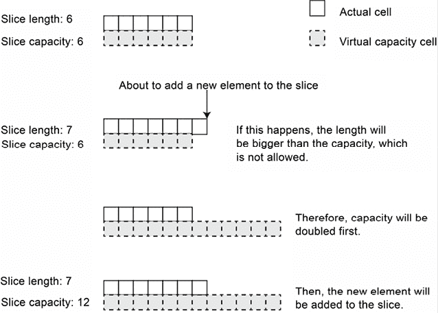
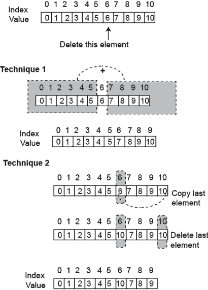
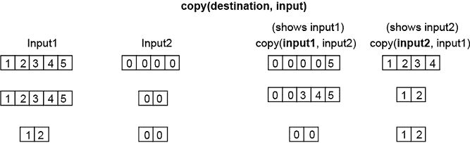
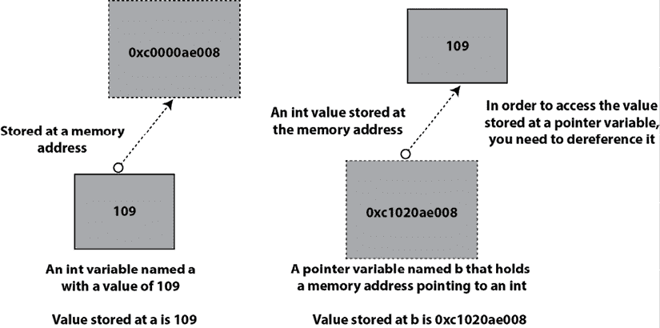

# 第二章：基礎 Go 數據類型

數據存儲和操作在變數中——所有 Go 語言的變數都應該有一個數據類型，這個數據類型是顯式聲明或隱式確定的。了解 Go 的內置數據類型可以讓你理解如何操作簡單的數據值，並在簡單數據類型不足以或不高效於某項任務時構建更複雜的數據結構。**Go 作為一種靜態類型和編譯的編程語言**，允許編譯器在程序執行前進行各種優化和檢查。

本章的第一部分全部关于 Go 语言的基礎數據類型，第二部分則合乎邏輯地接續，涵蓋了允許你將同種數據類型的數據分組的數據結構，這些是數組和功能更強大的切片。

但讓我們從一些更實際的內容開始：想像一下你想讀取命令行參數中的數據。你如何確保你讀取的是你期望的內容？你如何處理錯誤情況？那麼，只讀取數字和字符串，而不是從命令行讀取日期和時間呢？你是否需要為處理日期和時間而編寫自己的解析器？

在 *第一章*，*Go 快速入門* 中，我們包含了所展示的源文件的完整代碼。然而，從本章開始，這不總是這樣。這有兩個目的：第一個是讓你看到真正重要的代碼，第二個是為了節省書籍空間。

本章將回答所有這些問題以及許多其他問題，例如使用 `unsafe` 包、切片的內部結構以及切片如何與數組相關聯，以及如何在 Go 中使用指針。此外，它還實現了生成隨機數字和隨機字符串的公用程序，並更新統計應用程序。因此，本章涵蓋了：

+   錯誤數據類型

+   數字數據類型

+   非數字數據類型

+   常量

+   將相似數據分組

+   指針

+   數據類型和 `unsafe` 包

+   生成随机数

+   更新統計應用程序

我們以 `error` 數據類型開始本章，因為錯誤和錯誤處理在 Go 裡扮演著關鍵的角色。

# 錯誤數據類型

Go 提供了一種特殊的數據類型，稱為 `error`，用於表示錯誤條件和錯誤信息——實際上，這意味著 Go 將錯誤視為值。**要在 Go 中成功編程，你應該了解可能發生在您所使用的函數和方法中的錯誤條件，並相應地處理它們**。

如你所知，Go 遵循有关错误值的特定约定：如果一个`error`变量的值为`nil`，则表示没有错误。作为一个例子，让我们考虑`strconv.Atoi()`，它用于将`string`值转换为`int`值（`Atoi`代表*ASCII to Int*）。根据其签名，`strconv.Atoi()`返回`(int, error)`。具有`nil`错误值的表示转换成功，并且如果你想使用，你可以使用`int`值。具有非`nil`错误值的表示转换失败，并且字符串输入不是一个有效的`int`值。

如果你想了解更多关于`strconv.Atoi()`的信息，你应该在你的终端窗口中执行`go doc strconv.Atoi`。

你可能会想知道，如果你想要创建自己的错误信息会发生什么。这是可能的吗？如果你想返回一个自定义的错误，你可以使用`errors.New()`函数，它来自`errors`包。这种情况通常发生在`main()`函数之外的函数中，因为`main()`函数不向任何其他函数返回任何内容。此外，定义你自定义错误的好地方是在你创建的 Go 包内部。

你很可能会在你的程序中处理错误，而不需要`errors`包的功能。此外，**除非你正在创建大型应用程序或包，否则你不需要定义自定义错误信息**。

如果你想要以`fmt.Printf()`工作的方式格式化错误信息，你可以使用`fmt.Errorf()`函数，它简化了自定义错误信息的创建——`fmt.Errorf()`函数返回一个`error`值，就像`errors.New()`一样。

现在，我们应该谈谈一些重要的事情：你应该在每个应用程序中有一个全局的错误处理策略，这个策略不应该改变。在实践中，这意味着以下内容：

+   所有错误信息都应该在同一级别处理，这意味着所有错误要么应该返回给调用函数，要么在它们发生的地方处理。

+   临界错误的处理应该有明确的文档。这意味着在某些情况下，临界错误应该终止程序，而在其他情况下，临界错误可能只是在屏幕上创建一个警告消息并继续。

+   被认为是一种好的做法，将所有错误信息发送到机器的日志服务，因为这样可以在以后检查错误信息。然而，这并不总是正确的，因此在设置时请谨慎——例如，云原生应用程序就不是这样工作的。对于云原生应用程序，最好将错误输出发送到标准错误，这样错误信息就不会丢失。

`error`数据类型被定义为接口——接口将在*第五章*，*反射和接口*中介绍。

在你最喜欢的文本编辑器中输入以下代码，并将其保存为`error.go`，放在你放置本章代码的目录中。使用`ch02`作为目录名是个好主意。

```go
package main
import (
    "errors"
"fmt"
"os"
"strconv"
) 
```

第一部分是程序的序言部分——`error.go` 使用了 `fmt`、`os`、`strconv` 和 `errors` 包。

```go
func check(a, b int) error {
    if a == 0 && b == 0 {
        return errors.New("this is a custom error message")
    }
    return nil
} 
```

前面的代码实现了一个名为 `check()` 的函数，该函数返回一个 `error` 值。如果 `check()` 的两个输入参数都等于 `0`，则该函数使用 `errors.New()` 返回一个自定义错误信息；否则它返回 `nil`。

```go
func formattedError(a, b int) error {
    if a == 0 && b == 0 {
        return fmt.Errorf("a %d and b %d. UserID: %d", a, b, os.Getuid())
    }
    return nil
} 
```

前面的代码实现了 `formattedError()` 函数，该函数使用 `fmt.Errorf()` 返回一个格式化的错误信息。除此之外，错误信息通过调用 `os.Getuid()` 打印出执行程序的用户的用户 ID。当你想要创建一个自定义错误信息时，使用 `fmt.Errorf()` 可以让你对输出有更多的控制。

```go
func main() {
    err := check(0, 10)
    if err == nil {
        fmt.Println("check() executed normally!")
    } else {
        fmt.Println(err)
    }
    err = check(0, 0)
    if err.Error() == "this is a custom error message" {
        fmt.Println("Custom error detected!")
    }
    err = formattedError(0, 0)
    if err != nil {
        fmt.Println(err)
    }
    i, err := strconv.Atoi("-123")
    if err == nil {
        fmt.Println("Int value is", i)
    }
    i, err = strconv.Atoi("Y123")
    if err != nil {
        fmt.Println(err)
    }
} 
```

前面的代码是 `main()` 函数的实现，你可以看到多次使用 `if err != nil` 语句以及使用 `if err == nil`，后者用于确保在执行所需代码之前一切正常。

请记住，尽管前面的代码比较了一个错误信息，但这被认为是一种不好的做法。更好的做法是在不是 `nil` 的情况下打印错误信息。

运行 `error.go` 产生以下输出：

```go
$ go run error.go
check() ended normally!
Custom error detected!
a 0 and b 0\. UserID: 501
Int value is -123
strconv.Atoi: parsing "Y123": invalid syntax 
```

现在你已经了解了 `error` 数据类型、如何创建自定义错误以及如何使用错误值，我们将继续介绍 Go 的基本数据类型，这些数据类型可以逻辑上分为两大类：*数值数据类型* 和 *非数值数据类型*。Go 还支持 `bool` 数据类型，它只能有 `true` 或 `false` 两个值。

# 数值数据类型

Go 根据它们消耗的内存空间支持整数、浮点数和复数值，具体版本各异——这有助于节省内存和计算时间。整数数据类型可以是带符号的或无符号的，而浮点数则不是这样。

下表列出了 Go 的数值数据类型。

| **数据类型** | **描述** |
| --- | --- |
| `int8` | 8 位带符号整数 |
| `int16` | 16 位带符号整数 |
| `int32` | 32 位带符号整数 |
| `int64` | 64 位带符号整数 |
| `int` | 32 位或 64 位带符号整数 |
| `uint8` | 8 位无符号整数 |
| `uint16` | 16 位无符号整数 |
| `uint32` | 32 位无符号整数 |
| `uint64` | 64 位无符号整数 |
| `uint` | 32 位或 64 位无符号整数 |
| `float32` | 32 位浮点数 |
| `float64` | 64 位浮点数 |
| `complex64` | 带有 `float32` 部分的复数 |
| `complex128` | 带有 `float64` 部分的复数 |

`int` 和 `uint` 数据类型是特殊的，因为它们是在给定平台上带符号和无符号整数最有效的尺寸，每个可以是 32 或 64 位——它们的大小由 Go 根据 CPU 寄存器大小自行定义。`int` 数据类型是 Go 中最广泛使用的数值数据类型，因为它具有多功能性。

下面的代码展示了数字数据类型的使用——你可以在书籍 GitHub 仓库的`ch02`目录中的`numbers.go`文件中找到整个程序：

```go
func main() {
    c1 := 12 + 1i
    c2 := complex(5, 7)
    fmt.Printf("Type of c1: %T\n", c1)
    fmt.Printf("Type of c2: %T\n", c2) 
```

之前的代码以两种不同的方式创建了两个复数变量——这两种方式都是完全有效且等效的。除非你对数学感兴趣，否则你很可能不会在你的程序中使用复数。然而，对复数的直接支持展示了现代 Go 语言的特点。

```go
 var c3 complex64 = complex64(c1 + c2)
    fmt.Println("c3:", c3)
    fmt.Printf("Type of c3: %T\n", c3)
    cZero := c3 - c3
    fmt.Println("cZero:", cZero) 
```

之前的代码通过添加和减去两个复数对继续使用复数。尽管`cZero`等于零，但它仍然是一个复数和一个`complex64`变量。

```go
 x := 12
    k := 5
    fmt.Println(x)
    fmt.Printf("Type of x: %T\n", x)
    div := x / k
    fmt.Println("div", div) 
```

在这部分中，我们定义了两个名为`x`和`k`的整数变量——它们的数据类型由 Go 根据它们的初始值确定。两者都是`int`类型，这是 Go 首选用于存储整数值的类型。此外，当你除以两个整数值时，即使除法不是完美的，你也会得到一个整数值。因此，如果你不希望这样，你应该采取额外的措施——这将在下一段代码示例中展示：

```go
 var m, n float64
    m = 1.223
    fmt.Println("m, n:", m, n)
    y := 4 / 2.3
    fmt.Println("y:", y)
    divFloat := float64(x) / float64(k)
    fmt.Println("divFloat", divFloat)
    fmt.Printf("Type of divFloat: %T\n", divFloat)
} 
```

之前的代码使用`float64`值和变量进行操作。由于`n`没有初始值，它自动被分配了其数据类型的零值，对于`float64`数据类型来说，这个值是`0`。此外，代码展示了一种将整数值除以得到浮点结果的技术，这就是使用`float64()`：`divFloat := float64(x) / float64(k)`。

这是一个类型转换，其中两个整数（`x`和`k`）被转换为`float64`值。由于两个`float64`值之间的除法结果是`float64`值，所以我们得到了所需的数据类型的结果。

运行`numbers.go`会生成以下输出：

```go
$ go run numbers.go
Type of c1: complex128
Type of c2: complex128
c3: (17+8i)
Type of c3: complex64
cZero: (0+0i)
12
Type of x: int
div 2
m, n: 1.223 0
y: 1.7391304347826086
divFloat 2.4
Type of divFloat: float64 
```

输出显示，`c1`和`c2`都是`complex128`类型的值，这是在执行代码的机器上首选的复数数据类型。然而，`c3`是一个`complex64`类型的值，因为它使用了`complex64()`创建。`n`的值是`0`，因为`n`变量没有被初始化，这意味着 Go 自动将其数据类型的零值分配给了`n`。

## 避免溢出

由于每个变量都存储在内存（位）中，因此我们对变量内存空间中可以存储的信息量有一个限制。尽管在这个小节中我们将讨论整数，但类似的规则适用于所有数字数据类型。Go 语言在`math`包中提供了代表整数数据类型最大和最小值的常量。例如，对于`int`数据类型，存在`math.MaxInt`和`math.MinInt`常量，分别代表`int`变量的最大和最小允许值。

`overflows.go`中的重要部分可以在两个`for`循环中找到。第一个循环是关于确定最大`int`值：

```go
for {
    if i == math.MaxInt {
        break
    }
    i = i + 1
} 
```

在之前的代码中，我们不断增加`i`的值，直到它达到`math.MaxInt`。

下一个`for`循环是关于找出最小`int`值：

```go
for {
    if i == math.MinInt {
        break
    }
    i = i - 1
} 
```

这次，我们不断减小 `i` 的值，直到它达到 `math.MinInt`。

运行 `overflows.go` 产生以下输出：

```go
$ go run overflows.go
Max: 9223372036854775807
Max overflow: -9223372036854775808
Min: -9223372036854775808 
```

因此，当前平台（配备 M1 Max CPU 的 MacBook Pro）上的最大 `int` 值是 `9223372036854775807`，最小 `int` 值是 `-9223372036854775808`。当我们尝试增加最大 `int` 值时，我们将会得到最小 `int` 值！

在了解了数值数据类型之后，现在是时候学习非数值数据类型了，这是下一节的主题。

# 非数值数据类型

Go 支持字符串、字符、`rune`、日期和时间。但是，Go 没有专门的 `char` 数据类型。在 Go 中，日期和时间是同一回事，由相同的数据类型表示。然而，是否一个时间和日期变量包含有效信息取决于你。

我们首先解释与字符串相关的数据类型。

## 字符串、字符和 `rune`

Go 支持使用 `string` 数据类型来表示字符串——字符串被双引号或反引号包围。Go 字符串只是一个 *字节的集合*，可以作为一个整体或数组来访问。单个字节可以存储任何 ASCII 字符——然而，**通常需要多个字节来存储单个 Unicode 字符**。

现在，支持 Unicode 字符是一个常见的要求——Go 的设计考虑到了 Unicode 支持，这也是为什么有 `rune` 数据类型的原因。`rune` 是一个 `int32` 类型的值，用于表示单个 Unicode 代码点，这是一个用于表示单个 Unicode 字符或，较少情况下，提供格式化信息的整数值。

虽然 `rune` 是一个 `int32` 类型的值，但你不能将 `rune` 与 `int32` 类型的值进行比较。Go 将这两种数据类型视为完全不同。

你可以使用 `[]byte("A String")` 语句从一个给定的字符串创建一个新的 *字节切片*。给定一个字节切片变量 `b`，你可以使用 `string(b)` 语句将其转换为字符串。**当处理包含 Unicode 字符的字节切片时，字节切片中的字节数并不总是与字节切片中的字符数相对应，因为大多数 Unicode 字符需要多个字节来表示**。因此，当你尝试使用 `fmt.Println()` 或 `fmt.Print()` 打印字节切片的每个单独字节时，输出不是以字符形式呈现的文本，而是整数值。如果你想以文本形式打印字节切片的内容，你应该使用 `string(byteSliceVar)` 或使用 `fmt.Printf()` 并带有 `%s` 来告诉 `fmt.Printf()` 你想打印一个字符串。你可以使用类似于 `[]byte("My Initialization String")` 的语句来初始化一个新的字节切片。

我们将在 *字节切片* 部分更详细地介绍字节切片。

你可以使用单引号定义一个 rune：`r := '€'`，并且你可以打印组成它的字节的整数值，作为 `fmt.Println(r)`——在这种情况下，整数值是 `8364`。将其打印为单个 Unicode 字符需要使用 `fmt.Printf()` 中的 `%c` 控制字符串。

由于字符串可以作为数组访问，你可以使用 `for` 循环遍历字符串中的 runes，或者如果你知道它在字符串中的位置，可以指向特定的字符。字符串的长度与字符串中找到的字符数相同，这对于字节切片通常不成立，因为 Unicode 字符通常需要多个字节。

以下 Go 代码说明了字符串和 runes 的使用以及如何在你的代码中处理字符串。你可以在本书 GitHub 仓库的 `ch02` 目录中找到整个程序作为 `text.go`。

程序的第一部分定义了一个包含 Unicode 字符的字符串字面量。然后它像数组一样访问其第一个字节：

```go
func main() {
    aString := "Hello World! €"
    fmt.Println("First byte", string(aString[0])) 
```

下一个部分是关于处理 runes：

```go
 r := '€'
    fmt.Println("As an int32 value:", r)
    // Convert Runes to text
    fmt.Printf("As a string: %s and as a character: %c\n", r, r)
    // Print an existing string as runes
for _, v := range aString {
        fmt.Printf("%x ", v)
    }
    fmt.Println() 
```

首先，我们定义一个名为 `r` 的 rune。使它成为 rune 的是 `€` 字符周围的单引号。rune 是一个 `int32` 值，并且由 `fmt.Println()` 以这种方式打印出来。`fmt.Printf()` 中的 `%c` 控制字符串将 rune 打印为字符。然后我们使用带有 `range` 的 `for` 循环将 `aString` 作为切片或数组迭代，并打印 `aString` 的内容作为 runes。

```go
 // Print an existing string as characters
for _, v := range aString {
        fmt.Printf("%c", v)
    }
    fmt.Println()
} 
```

最后，我们使用带有 `range` 的 `for` 循环将 `aString` 作为切片或数组迭代，并打印 `aString` 的内容作为字符。

运行 `text.go` 产生以下输出：

```go
$ go run text.go
First byte H
As an int32 value: 8364
As a string: %!s(int32=8364) and as a character: €
48 65 6c 6c 6f 20 57 6f 72 6c 64 21 20 20ac
Hello World! € 
```

输出的第一行显示我们可以将字符串作为数组访问，而第二行验证 rune 是一个整数值。第三行显示当你将 rune 作为字符串和字符打印时应该期待什么——正确的方式是将其作为字符打印。第五行显示如何将字符串作为 runes 打印，最后一行显示使用 `range` 和 `for` 循环将字符串作为字符处理时的输出。

## 将 int 转换为字符串

你可以将整数值转换为字符串的两种主要方式：使用 `string()` 和使用 `strconv` 包中的函数。然而，这两种方法在本质上是有区别的。`string()` 函数将整数值转换为 Unicode 码点，这是一个单独的字符，而像 `strconv.FormatInt()` 和 `strconv.Itoa()` 这样的函数将整数值转换为具有相同表示和相同字符数的字符串值。

这在 `intString.go` 程序中得到了说明——其最重要的语句如下。你可以在本书的 GitHub 仓库中找到整个程序。

```go
 input := strconv.Itoa(n)
    input = strconv.FormatInt(int64(n), 10)
    input = string(n) 
```

运行 `intString.go` 生成以下类型的输出：

```go
$ go run intString.go 100
strconv.Itoa() 100 of type string
strconv.FormatInt() 100 of type string
string() d of type string 
```

输出数据类型始终是字符串，然而，`string()` 将 `100` 转换为 `d`，因为 `d` 的 ASCII 表示是 `100`。

现在我们已经了解了如何将整数转换为字符串，现在是时候学习如何处理 Unicode 文本和代码点了。

## Unicode 包

`unicode`标准 Go 包包含各种方便的函数，用于处理 Unicode 代码点。其中之一，称为`unicode.IsPrint()`，可以帮助你识别字符串中可打印的部分。

以下代码摘录展示了`unicode`包的功能：

```go
 for i := 0; i < len(sL); i++ {
        if unicode.IsPrint(rune(sL[i])) {
            fmt.Printf("%c\n", sL[i])
        } else {
            fmt.Println("Not printable!")
        }
    } 
```

for 循环遍历一个定义为 runes 列表的字符串（`"\x99\x00ab\x50\x00\x23\x50\x29\x9c"`）的内容，同时`unicode.IsPrint()`检查字符是否可打印——如果它返回`true`，则 rune 是可打印的。

你可以在书的 GitHub 仓库中`ch02`目录下的`unicode.go`源文件中找到这段代码摘录。运行`unicode.go`会产生以下输出：

```go
Not printable!
Not printable!
a
b
P
Not printable!
#
P
)
Not printable! 
```

这个实用工具在过滤输入或过滤数据以便在屏幕上打印、存储在日志文件中、在网络中传输或存储在数据库中时非常方便。

在下一小节中，我们将借助`strings`包继续处理文本。

## Strings 包

`strings`标准 Go 包允许你在 Go 中操作 UTF-8 字符串，并包含许多强大的函数。其中许多函数在`useStrings.go`源文件中有展示，该文件位于书的 GitHub 仓库的`ch02`目录中。

如果你正在处理文本和文本处理，你需要学习`strings`包的所有细节和函数，所以请确保你尝试所有这些函数，并创建许多示例来帮助你澄清问题。

`useStrings.go`文件最重要的部分如下：

```go
import (
    "fmt"
    s "strings"
"unicode"
)
var f = fmt.Printf 
```

由于我们将会多次使用`strings`包，我们创建了一个方便的别名`s`——请注意，这被认为是一种不好的做法，我们在这里这样做是为了防止代码行太长。我们对`fmt.Printf()`函数也做了同样的事情，创建了一个全局别名，使用变量`f`。这两个快捷方式减少了长代码行的重复。你可以在学习 Go 时使用它们，但在任何类型的生产软件中都不推荐这样做，因为它会使代码的可读性降低。

第一段代码摘录如下：

```go
 f("To Upper: %s\n", s.ToUpper("Hello THERE"))
    f("To Lower: %s\n", s.ToLower("Hello THERE"))
    f("%s\n", s.Title("tHis wiLL be A title!"))
    f("EqualFold: %v\n", s.EqualFold("Mihalis", "MIHAlis"))
    f("EqualFold: %v\n", s.EqualFold("Mihalis", "MIHAli")) 
```

`strings.EqualFold()`函数在不考虑字符串大小写的情况下比较两个字符串，当它们相同返回 true，否则返回 false。

```go
 f("Index: %v\n", s.Index("Mihalis", "ha"))
    f("Index: %v\n", s.Index("Mihalis", "Ha"))
    f("Count: %v\n", s.Count("Mihalis", "i"))
    f("Count: %v\n", s.Count("Mihalis", "I"))
    f("Repeat: %s\n", s.Repeat("ab", 5))
    f("TrimSpace: %s\n", s.TrimSpace(" \tThis is a line. \n"))
    f("TrimLeft: %s", s.TrimLeft(" \tThis is a\t line. \n", "\n\t "))
    f("TrimRight: %s\n", s.TrimRight(" \tThis is a\t line. \n", "\n\t ")) 
```

`strings.Index()`函数检查第二个参数的字符串是否可以在第一个参数指定的字符串中找到，并返回第一次找到的位置索引。如果搜索失败，则返回`-1`。

```go
 f("Prefix: %v\n", s.HasPrefix("Mihalis", "Mi"))
    f("Prefix: %v\n", s.HasPrefix("Mihalis", "mi"))
    f("Suffix: %v\n", s.HasSuffix("Mihalis", "is"))
    f("Suffix: %v\n", s.HasSuffix("Mihalis", "IS")) 
```

`strings.HasPrefix()` 函数检查给定的字符串（第一个参数）是否以第二个参数中给出的字符串开头。在前面的代码中，`strings.HasPrefix()` 的第一次调用返回 true，而第二次返回 false。同样，`strings.HasSuffix()` 检查给定的字符串是否以第二个字符串结尾。这两个函数都考虑了输入字符串和第二个参数的大小写。

```go
 t := s.Fields("This is a string!")
    f("Fields: %v\n", len(t))
    t = s.Fields("ThisIs a\tstring!")
    f("Fields: %v\n", len(t)) 
```

方便的 `strings.Fields()` 函数根据 `unicode.IsSpace()` 函数定义的一个或多个空白字符将给定的字符串分割开，并返回在输入字符串中找到的子字符串切片。如果输入字符串只包含空白字符，则返回空切片。

```go
 f("%s\n", s.Split("abcd efg", ""))
    f("%s\n", s.Replace("abcd efg", "", "_", -1))
    f("%s\n", s.Replace("abcd efg", "", "_", 4))
    f("%s\n", s.Replace("abcd efg", "", "_", 2)) 
```

`strings.Split()` 函数允许你根据所需的分隔符字符串分割给定的字符串——`strings.Split()` 函数返回一个字符串切片。使用 `""` 作为 `strings.Split()` 的第二个参数允许你 *逐字符处理字符串*。

`strings.Replace()` 函数接受四个参数。第一个参数是你想要处理的字符串。第二个参数包含一个字符串，如果找到，将被 `strings.Replace()` 的第三个参数替换。最后一个参数是允许发生的最大替换次数。如果该参数为负值，则没有替换次数的限制。

```go
 f("SplitAfter: %s\n", s.SplitAfter("123++432++", "++"))
    trimFunction := func(c rune) bool {
        return !unicode.IsLetter(c)
    }
    f("TrimFunc: %s\n", s.TrimFunc("123 abc ABC \t .", trimFunction)) 
```

`strings.SplitAfter()` 函数根据作为函数第二个参数提供的分隔符字符串将第一个参数字符串分割成子字符串。分隔符字符串包含在返回的切片中。

最后一行代码定义了一个名为 `trimFunction` 的 trim 函数，该函数用作 `strings.TrimFunc()` 的第二个参数，以便根据 trim 函数的返回值过滤给定的输入——在这种情况下，由于调用了 `unicode.IsLetter()`，trim 函数保留所有字母而忽略其他所有内容。

运行 `useStrings.go` 产生以下输出：

```go
To Upper: HELLO THERE!
To Lower: hello there
THis WiLL Be A Title!
EqualFold: true
EqualFold: false
Prefix: true
Prefix: false
Suffix: true
Suffix: false
Index: 2
Index: -1
Count: 2
Count: 0
Repeat: ababababab
TrimSpace: This is a line.
TrimLeft: This is a      line. 
TrimRight:      This is a        line.
Compare: 1
Compare: 0
Compare: -1
Fields: 4
Fields: 3
[a b c d   e f g]
_a_b_c_d_ _e_f_g_
_a_b_c_d efg
_a_bcd efg
Join: Line 1+++Line 2+++Line 3
SplitAfter: [123++ 432++ ]
TrimFunc: abc ABC 
```

访问 [`pkg.go.dev/strings`](https://pkg.go.dev/strings) 上的字符串包文档页面，以获取可用函数的完整列表。你将在本书的其他地方看到 `strings` 包的功能。

关于字符串和文本的内容就到这里，下一节将介绍在 Go 中处理日期和时间。

## 时间和日期

通常，我们需要处理日期和时间信息，以存储条目在数据库中最后使用的时间或条目被插入数据库的时间。

在 Go 中处理时间和日期的王者是 `time.Time` 数据类型，它以纳秒精度表示时间的一个瞬间。每个 `time.Time` 值都与一个位置（时区）相关联。

如果你是一个 UNIX 用户，你可能已经了解 UNIX 纪元时间，想知道如何在 Go 中获取它。`time.Now().Unix()`函数返回流行的 UNIX 纪元时间，即自`00:00:00 UTC, January 1, 1970`以来经过的秒数。如果你想将 UNIX 时间转换为等效的`time.Time`值，可以使用`time.Unix()`函数。如果你不是一个 UNIX 用户，那么你可能之前没有听说过 UNIX 纪元时间，但现在你了解了它！

`time.Since()`函数计算从给定时间以来经过的时间，并返回一个`time.Duration`变量——`Duration`数据类型定义为`type Duration int64`。尽管实际上`Duration`是一个`int64`值，但你不能隐式地将持续时间与`int64`值进行比较或转换，因为 Go 不允许隐式数据类型转换。

关于 Go 语言和日期时间的最重要的话题是 Go 如何解析字符串以将其转换为日期和时间。这之所以重要，是因为通常此类输入是以字符串形式给出的，而不是有效的日期变量。用于解析的函数称为`time.Parse()`，其完整签名是`Parse(layout, value string) (Time, error)`，其中`layout`是解析字符串，`value`是要解析的输入。返回的`time.Time`值是一个具有纳秒精度的时刻，包含日期和时间信息。

下一个表格显示了用于解析日期和时间的最常用的字符串。

| **解析值** | **含义（示例）** |
| --- | --- |
| `03` | 12 小时制值（12pm, 07am） |
| `15` | 24 小时制值（23, 07） |
| `04` | 分钟（55, 15） |
| `05` | 秒（5, 23） |
| `Mon` | 星期简称（Tue, Fri） |
| `Monday` | 星期（Tuesday, Friday） |
| `02` | 月份中的日期（15, 31） |
| `2006` | 四位数字的年份（2020, 2004） |
| `06` | 最后两位数字的年份（20, 04） |
| `Jan` | 月份简称（Feb, Mar） |
| `January` | 月份全称（July, August） |
| `MST` | 时区（EST, UTC） |

之前的表格显示，如果你想解析`30 January 2023`字符串并将其转换为 Go 日期变量，你应该将其与`02 January 2006`字符串匹配，因为该字符串表示输入的预期格式——在匹配类似`30 January 2023`的字符串时，不能使用其他任何内容。同样，如果你想解析`15 August 2023 10:00`字符串，你应该将其与`02 January 2006 15:04`字符串匹配，因为这指定了输入的预期格式。

`time`包的文档([`pkg.go.dev/time`](https://pkg.go.dev/time))包含了关于解析日期和时间的更多详细信息——然而，这里提供的应该已经足够用于常规用途。

现在我们已经了解了如何处理日期和时间，是时候学习更多关于处理时区的内容了。

## 处理不同的时区

所提供的实用程序接受日期和时间，并将它们转换为不同的时区。当您想要预处理来自不同来源且使用不同时区的日志文件时，这特别有用，将这些不同的时区转换为公共时区。再次强调，您需要`time.Parse()`在执行转换之前将有效输入转换为`time.Time`值。这次输入字符串包含时区，并由`"``02 January 2006 15:04 MST"`字符串解析。

为了将解析的日期和时间转换为纽约时间，程序使用以下代码：

```go
 loc, _ = time.LoadLocation("America/New_York")
    fmt.Printf("New York Time: %s\n", now.In(loc)) 
```

这种技术在`convertTimes.go`中多次使用。

如果命令行参数包含任何空格字符，您应该将其放在双引号中，以便 UNIX shell 将其视为单个命令行参数。

运行`convertTimes.go`生成以下输出：

```go
$ go run convertTimes.go "14 December 2023 19:20 EET"
Current Location: 2023-12-14 19:20:00 +0200 EET
New York Time: 2023-12-14 12:20:00 -0500 EST
London Time: 2023-12-14 17:20:00 +0000 GMT
Tokyo Time: 2023-12-15 02:20:00 +0900 JST
$ go run convertTimes.go "14 December 2023 19:20 UTC"
Current Location: 2023-12-14 21:20:00 +0200 EET
New York Time: 2023-12-14 14:20:00 -0500 EST
London Time: 2023-12-14 19:20:00 +0000 GMT
Tokyo Time: 2023-12-15 04:20:00 +0900 JST
$ go run convertTimes.go "14 December 2023 25:00 EET"
parsing time "14 December 2023 25:00 EET": hour out of range 
```

在程序的最后一次执行中，代码必须将`25`解析为一天中的小时，这是错误的，并生成`hour out of range`错误信息。

与时间和日期解析相关的已知 Go 问题，您可以在[`github.com/golang/go/issues/63345`](https://github.com/golang/go/issues/63345)了解更多信息。

下一个子节是关于常量值。

# 常量

Go 支持常量，它们的行为类似于变量，但无法更改它们的值。Go 中的常量是通过`const`关键字定义的。常量可以是*全局的或局部的*。然而，如果您正在定义太多具有局部作用域的常量值，您可能需要重新考虑您的做法。

您在使用程序中的常量时获得的主要好处是保证它们的值在程序执行期间不会改变。严格来说，常量变量的值是在编译时定义的，而不是在运行时——这意味着它包含在二进制可执行文件中。在幕后，Go 使用布尔型、字符串型或数值型作为存储常量值的类型，因为这使 Go 在处理常量时具有更大的灵活性。

常量的可能用途包括定义配置值，如最大连接数或使用的 TCP/IP 端口号，以及定义物理常量，如光速或地球上的重力。

下一个子节讨论了常量生成器 iota，这是一种创建常量序列的便捷方式。

## 常量生成器 iota

*常量生成器 iota*用于声明一系列相关的值，这些值使用递增的数字，而无需显式地指定每个值。

与`const`关键字相关的概念，包括常量生成器 iota，在`constants.go`文件中有说明。

```go
type Digit int
type Power2 int
const PI = 3.1415926
const (
    C1 = "C1C1C1"
    C2 = "C2C2C2"
    C3 = "C3C3C3"
) 
```

在这部分，我们声明了两个新类型`Digit`和`Power2`，它们将在稍后使用，以及四个新常量`PI`、`C1`、`C2`和`C3`。

Go 类型是一种定义新命名类型的方式，它使用与现有类型相同的底层类型。这主要用于区分可能使用相同类型数据的不同类型。`type` 关键字也可以用于定义结构和接口，但在这里不是这种情况。

```go
func main() {
    const s1 = 123
var v1 float32 = s1 * 12
    fmt.Println(v1)
    fmt.Println(PI)
    const (
        Zero Digit = iota
        One
        Two
        Three
        Four
    ) 
```

上述代码定义了一个名为 `s1` 的常量。在这里，你还可以看到基于 `Digit` 的常量生成器 iota 的定义，这相当于以下五个常量的声明：

```go
const (
    Zero = 0
    One = 1
    Two = 2
    Three = 3
    Four = 4
) 
```

虽然我们是在 `main()` 内部定义常量，但常量通常可以在 `main()` 或任何其他函数或方法外部找到。

`constants.go` 的最后一部分如下：

```go
 fmt.Println(One)
    fmt.Println(Two)
    const (
        p2_0 Power2 = 1 << iota
        _
        p2_2
        _
        p2_4
        _
        p2_6
    )
    fmt.Println("2⁰:", p2_0)
    fmt.Println("2²:", p2_2)
    fmt.Println("2⁴:", p2_4)
    fmt.Println("2⁶:", p2_6)
} 
```

这里还有一个与之前不同的常量生成器 iota。首先，你可以看到在常量生成器 iota 的 `const` 块中使用下划线字符，这允许你跳过不想要的值。其次，iota 的值总是递增的，并且可以在表达式中使用，这正是这种情况。

现在我们来看看 `const` 块内部真正发生了什么。对于 `p2_0`，iota 的值为 `0`，`p2_0` 被定义为 `1`。对于 `p2_2`，iota 的值为 `2`，`p2_2` 被定义为表达式 `1 << 2` 的结果，二进制表示为 `00000100`。`00000100` 的十进制值是 `4`，这是结果和 `p2_2` 的值。类似地，`p2_4` 的值是 `16`，`p2_6` 的值是 `64`。

运行 `constants.go` 产生以下输出：

```go
$ go run constants.go
1476
3.1415926
1
2
2⁰: 1
2²: 4
2⁴: 16
2⁶: 64 
```

## 类型化和非类型化常量

**常量值可以有数据类型**。这可能会很限制性，因为具有数据类型的常量值只能与相同数据类型的值和变量操作，但它可以让你避免错误，因为编译器可以捕获这种情况。

从 `typedConstants.go` 的代码片段中将展示类型化常量与非类型化常量之间的区别：

```go
const (
    typedConstant   = int16(100)
    untypedConstant = 100
)
func main() {
    i := int(1)
    fmt.Println("unTyped:", i*untypedConstant)
    fmt.Println("Typed:", **i*typedConstant**)
} 
```

因此，`untypedConstant` 没有与之关联的数据类型，而 `typedConstant` 有。如果你尝试运行 `typedConstants.go`，编译器将无法编译它，并产生以下错误输出：

```go
$ go run typedConstants.go
# command-line-arguments
./typedConstants.go:13:24: invalid operation: i * typedConstant (mismatched types int and int16) 
```

错误条件的原因可以在生成的输出中找到：`mismatched types int and int16`。简单来说，`i` 是一个 `int` 变量，而 `typedConstant` 是一个 `int16` 值，Go 无法执行它们的乘法，因为变量的数据类型不匹配。另一方面，`i*untypedConstant` 的乘法没有问题，因为 `untypedConstant` 没有数据类型。

拥有数据是好的，但当你拥有大量相似数据时会发生什么？你需要有很多变量来存储这些数据，还是有一种更好的方法来做这件事？Go 通过引入数组和切片来回答这些问题。

# 对相似数据的分组

有时候，你希望将相同数据类型的多个值放在单个变量下，并使用索引号访问它们。在 Go 中，最简单的方法是使用数组或切片。*数组*是最广泛使用的数结构，由于它们的简单性和访问速度，几乎可以在所有编程语言中找到。Go 提供了一个名为*切片*的数组替代品。以下的小节将帮助你了解数组和切片之间的区别，以便你知道何时使用哪种数据结构。简而言之，**你几乎可以在 Go 的任何地方使用切片代替数组**，但我们也在演示数组，因为它们仍然有用，并且因为切片是 Go 使用数组实现的！

## 数组

我们将开始讨论数组，首先检查它们的核心特性和限制：

+   当定义一个数组变量时，你必须定义其大小。否则，你应该在数组声明中放置`[...]`，让 Go 编译器为你找出长度。因此，你可以创建一个包含 4 个字符串元素的数组，既可以写成`[4]string{"Zero", "One", "Two", "Three"}`，也可以写成`[...]string{"Zero", "One", "Two", "Three"}`。如果你在方括号中不放置任何内容，那么将创建一个切片。由于它包含四个元素，该数组的（有效）索引为`0`、`1`、`2`和`3`。

+   创建数组后，你不能更改其大小。

+   当你将一个数组传递给一个函数时，**Go 会创建该数组的副本**并将其传递给该函数——因此，你在函数内部对数组所做的任何更改，在函数退出时都会丢失。

因此，Go 中的数组并不十分强大，这是 Go 引入名为切片的额外数据结构的主要原因，它类似于数组，但本质上是动态的，如下一小节所述。然而，数组和切片中的数据访问方式是相同的。

## 切片

Go 中的切片比数组更强大，主要是因为它们是动态的，这意味着它们可以在创建后根据需要增长或缩小。此外，你在函数内部对切片所做的任何更改也会影响原始切片。请注意，这通常是情况，但并不总是如此——如稍后讨论的，所有切片都有一个用于存储数据的底层数组。只有不会导致底层数组分配的更改才会反映回调用函数。然而，处理切片的函数通常不会更改切片的大小。

但这是如何发生的呢？严格来说，**Go 中的所有参数都是按值传递的**——在 Go 中没有其他传递参数的方式。然而，你可以显式地传递一个变量的指针以按引用传递。**切片值是一个包含指向实际存储元素的底层数组的指针、数组的长度以及其容量**——切片的容量将在下一小节中解释。请注意，切片值不包括其元素，**只包含指向底层数组的指针**。因此，当你将切片传递给函数时，Go 会复制该头并传递给函数。这个切片头的副本包括指向底层数组的指针。这个切片头在 `reflect` 包（[`pkg.go.dev/reflect#SliceHeader`](https://pkg.go.dev/reflect#SliceHeader)）中定义为以下内容：

```go
type SliceHeader struct {
    Data uintptr
    Len  int
    Cap  int
} 
```

传递切片头的一个副作用是，将切片传递给函数更快，因为 Go 不需要复制切片及其元素，只需复制切片头。

你可以使用 `make()` 或不指定大小或使用 `[...]` 创建切片，就像数组一样。如果你不想初始化切片，那么使用 `make()` 更好更快。然而，如果你想在创建时初始化它，那么 `make()` 就帮不上忙了。因此，你可以创建一个包含三个 `float64` 元素的切片，如 `aSlice := []float64{1.2, 3.2, -4.5}`。使用 `make()` 创建具有三个 `float64` 元素空间的切片与执行 `make([]float64, 3)` 一样简单。该切片的每个元素都有一个值为 `0`，这是 `float64` 数据类型的零值。

切片和数组都可以有多个维度——使用 `make()` 创建具有两个维度的切片与编写 `make([][]int, 2)` 一样简单。这返回一个具有两个维度的切片，其中第一个维度是 2（行），第二个维度（列）未指定，在添加数据时应显式指定。

如果你想同时定义和初始化一个具有两个维度的切片，你应该执行类似于 `twoD := [][]int{{1, 2, 3}, {4, 5, 6}}` 的操作。

你可以使用 `len()` 函数找到数组或切片的长度。你可以使用 `append()` 函数向满切片添加新元素。`append()` 会自动分配所需的内存空间。请注意，你应该将 `append()` 的返回值赋给所需的变量，因为这并不是原地更改。

下面的示例将阐明许多关于切片的知识点——请随意尝试。输入以下代码并将其保存为 `goSlices.go`：

```go
package main
import "fmt"
func main() {
    // Create an empty slice
    aSlice := []float64{}
    // Both length and capacity are 0 because aSlice is empty
    fmt.Println(aSlice, len(aSlice), cap(aSlice))
    // Add elements to a slice
    aSlice = append(aSlice, 1234.56)
    aSlice = append(aSlice, -34.0)
    fmt.Println(aSlice, "with length", len(aSlice)) 
```

`append()` 命令向 `aSlice` 添加了两个新元素。如前所述，`append()` 的结果不是原地更改，必须赋给所需的变量。

```go
 // A slice with a length of 4
    t := make([]int, 4)
    t[0] = -1
    t[1] = -2
    t[2] = -3
    t[3] = -4
// Now you will need to use append
    t = append(t, -5)
    fmt.Println(t) 
```

一旦切片没有更多空间添加元素，你只能使用 `append()` 向其添加新元素。

```go
 // A 2D slice
    twoD := [][]int{{1, 2, 3}, {4, 5, 6}}
    // Visiting all elements of a 2D slice
// with a double for loop
for _, i := range twoD {
            for _, k := range i {
                fmt.Print(k, " ")
            }
            fmt.Println()
    } 
```

上述代码展示了如何创建一个名为 `twoD` 的二维切片变量并初始化它。

```go
 make2D := make([][]int, 2)
    fmt.Println(make2D)
    make2D[0] = []int{1, 2, 3, 4}
    make2D[1] = []int{-1, -2, -3, -4}
    fmt.Println(make2D)
} 
```

前一部分展示了如何使用 `make()` 创建一个二维切片。使 `make2D` 成为二维切片的是在 `make()` 中使用 `[][]int`。

运行 `goSlices.go` 产生以下输出：

```go
$ go run goSlices.go 
[] 0 0
[1234.56 -34] with length 2
[-1 -2 -3 -4 -5]
1 2 3 
4 5 6 
[[] []]
[[1 2 3 4] [-1 -2 -3 -4]] 
```

## 关于切片长度和容量

数组和切片都支持 `len()` 函数来找出它们的长度。然而，切片还有一个额外的属性称为 *容量*，可以使用 `cap()` 函数找到。当你想要选择切片的一部分或想要使用切片引用数组时，切片的容量很重要。

**容量显示了切片在不需要分配更多内存和更改底层数组的情况下可以扩展多少**。尽管在切片创建后，切片的容量由 Go 处理，但开发人员可以在创建时使用 `make()` 函数定义切片的容量——之后，每次切片长度即将超过当前容量时，切片的容量都会加倍。`make()` 的第一个参数是切片的类型和其维度，第二个是它的初始长度，第三个是可选的，是切片的容量。尽管切片的数据类型在创建后不能改变，但其他两个属性可以改变。

写出 `make([]int, 3, 2)` 会生成错误信息，因为在任何给定时间，切片的容量（`2`）不能小于其长度（`3`）。

下面的图示说明了切片中长度和容量是如何工作的。



图 2.1：切片长度和容量之间的关系

对于那些喜欢代码的人来说，这里有一个小的 Go 程序，展示了切片的长度和容量属性。将其输入并保存为 `capLen.go`：

```go
package main
import "fmt"
func main() {
    // Only length is defined. Capacity = length
    a := make([]int, 4) 
```

在这种情况下，切片 `a` 的容量与其长度相同，都是 4。

```go
 fmt.Println("L:", len(a), "C:", cap(a))
    // Initialize slice. Capacity = length
    b := []int{0, 1, 2, 3, 4}
    fmt.Println("L:", len(b), "C:", cap(b)) 
```

再次强调，切片 `b` 的容量与其长度相同，都是 `5`，因为这默认行为。

```go
 // Same length and capacity
    aSlice := make([]int, 4, 4)
    fmt.Println(aSlice) 
```

这次切片 `aSlice` 的容量与长度相同，不是因为 Go 决定这样做，而是因为我们已经在 `make()` 调用中指定了它。

```go
 // Add an element
    aSlice = append(aSlice, 5) 
```

当你向切片 `aSlice` 添加新元素时，其容量加倍并变为 `8`。

```go
 fmt.Println(aSlice)
    // The capacity is doubled
    fmt.Println("L:", len(aSlice), "C:", cap(aSlice))
    // Now add four elements
    aSlice = append(aSlice, []int{-1, -2, -3, -4}...) 
```

`...` 操作符将 `[]int{-1, -2, -3, -4}` 扩展为多个参数，并且 `append()` 将每个参数逐个追加到 `aSlice` 中。

```go
 fmt.Println(aSlice)
    // The capacity is doubled
    fmt.Println("L:", len(aSlice), "C:", cap(aSlice))
} 
```

运行 `capLen.go` 产生以下输出：

```go
$ go run capLen.go 
L: 4 C: 4
L: 5 C: 5
[0 0 0 0]
[0 0 0 0 5]
L: 5 C: 8
[0 0 0 0 5 -1 -2 -3 -4]
L: 9 C: 16 
```

如果预先知道切片的正确容量，这将使你的程序运行更快，因为 Go 不必分配新的底层数组并将所有数据复制过来。这在处理非常大的切片时非常重要。

使用切片是好的，但当你想要处理现有切片的连续部分时会发生什么？有没有一种实用的方法来选择切片的一部分？幸运的是，答案是肯定的——下一小节将简要介绍如何选择切片的连续部分。

## 选择切片的一部分

Go 允许你选择切片的一部分，前提是所有需要的元素都相邻。当你选择一系列元素且不想逐个给出它们的索引时，这会很有用。在 Go 中，你通过指定（直接或间接）两个索引来选择切片的一部分，第一个索引是选择的开始，第二个索引是选择的结束，不包括该索引处的元素，两者之间用 `:` 分隔。

如果你想要处理一个实用工具的所有命令行参数（除了第一个，即它的文件路径），你可以将其分配给一个新的变量（`arguments := os.Args`）以方便使用，并使用 `arguments[1:]` 表示法跳过第一个命令行参数。

然而，有一种变体，你可以添加第三个参数来控制结果切片的容量。所以，使用 `aSlice[0:2:4]` 选择切片的前 2 个元素（在索引 `0` 和 `1`），并创建一个最大容量为 `4` 的新切片。结果的容量定义为 `4-0` 的减法，其中 4 是最大容量，0 是第一个索引——如果省略第一个索引，它将自动设置为 `0`。在这种情况下，结果切片的容量将是 `4`，因为 `4-0` 等于 `4`。

如果我们使用了 `aSlice[2:4:4]`，我们将创建一个新的切片，包含 `aSlice[2]` 和 `aSlice[3]` 元素，并且容量为 `4-2`。最后，结果的容量不能大于原始切片的容量，因为在这种情况下，你需要一个不同的底层数组。

将以下代码输入你喜欢的编辑器，并保存为 `partSlice.go`：

```go
package main
import "fmt"
func main() {
    aSlice := []int{0, 1, 2, 3, 4, 5, 6, 7, 8, 9}
    fmt.Println(aSlice)
    l := len(aSlice)
    // First 5 elements
    fmt.Println(aSlice[0:5])
    // First 5 elements
    fmt.Println(aSlice[:5]) 
```

在这部分，我们定义了一个名为 `aSlice` 的新切片，它有 10 个元素。它的容量与其长度相同。`0:5` 和 `:5` 两种表示法都选择切片的前 5 个元素，即索引 `0`、`1`、`2`、`3` 和 `4` 的元素。

```go
 // Last 2 elements
    fmt.Println(aSlice[l-2 : l])
    // Last 2 elements
    fmt.Println(aSlice[l-2:]) 
```

给定切片的长度（`l`），我们可以通过 `l-2:l` 或 `l-2:` 来选择切片的最后两个元素。

```go
 // First 5 elements
    t := aSlice[0:5:10]
    fmt.Println(len(t), cap(t))
    // Elements at indexes 2,3,4
// Capacity will be 10-2
    t = aSlice[2:5:10]
    fmt.Println(len(t), cap(t)) 
```

初始时，`t` 的容量将是 `10-0`，即 `10`。在第二种情况下，`t` 的容量将是 `10-2`。

```go
 // Elements at indexes 0,1,2,3,4
// New capacity will be 6-0
    t = aSlice[:5:6]
    fmt.Println(len(t), cap(t))
} 
```

`t` 的容量现在是 `6-0`，其长度将是 `5`，因为我们选择了切片 `aSlice` 的前五个元素。

`partSlice.go` 的输出以小部分呈现：

```go
$ go run partSlice.go
[0 1 2 3 4 5 6 7 8 9] 
```

上一行是 `fmt.Println(aSlice)` 的输出。

```go
[0 1 2 3 4]
[0 1 2 3 4] 
```

上两行是由 `fmt.Println(aSlice[0:5])` 和 `fmt.Println(aSlice[:5])` 生成的。

```go
[8 9]
[8 9] 
```

类似地，前两行是由 `fmt.Println(aSlice[l-2 : l])` 和 `fmt.Println(aSlice[l-2:])` 生成的。

```go
5 10
3 8
5 6 
```

最后三行打印了`aSlice[0:5:10]`、`aSlice[2:5:10]`和`aSlice[:5:6]`的长度和容量。

## 字节切片

字节切片是`byte`数据类型（`[]byte`）的切片。Go 知道大多数字节切片用于存储字符串，因此使得在`byte`类型和`string`类型之间切换变得容易。与其他类型的切片相比，访问字节切片的方式没有特别之处。特别的是，**Go 使用字节切片来执行文件 I/O 操作，因为它们允许你精确地确定要读取或写入文件的数据量**。这是因为字节在计算机系统之间是一个通用的单位。

由于 Go 没有用于存储单个字符的数据类型，它使用`byte`和`rune`来存储字符值。单个字节只能存储一个 ASCII 字符，而`rune`可以存储 Unicode 字符。因此，`rune`可以占用多个字节。

下面的小程序演示了如何将字节切片转换为字符串以及相反的操作，这对于大多数文件 I/O 操作是必需的——将其键入并保存为`byteSlices.go`：

```go
package main
import "fmt"
func main() {
    // Byte slice
    b := make([]byte, 12)
    fmt.Println("Byte slice:", b) 
```

空字节切片包含零——在这种情况下，12 个零。

```go
 b = []byte("Byte slice €")
    fmt.Println("Byte slice:", b) 
```

在这种情况下，`b`的大小是字符串`"Byte slice €"`的大小，不包括双引号——`b`现在指向与之前不同的内存位置，即`"Byte slice €"`存储的位置。**这就是将字符串转换为字节切片的方法**。

由于像`€`这样的 Unicode 字符需要多个字节来表示，字节切片的长度可能与存储的字符串长度不同。

```go
 // Print byte slice contents as text
    fmt.Printf("Byte slice as text: %s\n", b)
    fmt.Println("Byte slice as text:", string(b)) 
```

上一段代码展示了如何使用两种技术将字节切片的内容作为文本打印出来。第一种是通过使用`%s`控制字符串，第二种是使用`string()`。

```go
 // Length of b
    fmt.Println("Length of b:", len(b))
} 
```

上一段代码打印了字节切片的实际长度。

运行`byteSlices.go`产生以下输出：

```go
$ go run byteSlices.go 
Byte slice: [0 0 0 0 0 0 0 0 0 0 0 0]
Byte slice: [66 121 116 101 32 115 108 105 99 101 32 226 130 172]
Byte slice as text: Byte slice €
Byte slice as text: Byte slice €
Length of b: 14 
```

输出的最后一行证明了尽管`b`字节切片包含 12 个字符，但它的大小却是 14。

## 从切片中删除元素

在不使用如`slices`之类的包的情况下，从切片中删除元素没有默认函数，这意味着如果你需要从切片中删除元素，你必须编写自己的代码。然而，从 Go 1.21 版本开始，你可以使用`slices.Delete()`来达到这个目的。因此，本小节在使用较旧的 Go 版本或当你想手动删除元素时是相关的。

从切片中删除元素可能很棘手，因此本小节介绍了两种删除元素的技术。第一种技术将原始切片在需要删除的元素的索引处虚拟地分成两个切片。这两个切片都不包含将要删除的元素。然后，它将这些切片连接起来，创建一个新的切片。

第二个技术将最后一个元素复制到要删除的元素的位置，并通过从原始切片中排除最后一个元素来创建一个新的切片。然而，这个特定的技术改变了切片元素的顺序，这在某些情况下可能很重要。

下一个图显示了从切片中删除元素的两个技术图形表示。



图 2.2：从切片中删除元素

以下程序展示了可以从切片中删除元素的两个技术。通过输入以下代码创建一个文本文件——将其保存为`deleteSlice.go`。

```go
package main
import (
    "fmt"
"os"
"strconv"
)
func main() {
    arguments := os.Args
    if len(arguments) == 1 {
        fmt.Println("Need an integer value.")
        return
    }
    index := arguments[1]
    i, err := strconv.Atoi(index)
    if err != nil {
        fmt.Println(err)
        return
    }
    fmt.Println("Using index", i)
    aSlice := []int{0, 1, 2, 3, 4, 5, 6, 7, 8}
    fmt.Println("Original slice:", aSlice)
    // Delete element at index i
if i > len(aSlice)-1 {
        fmt.Println("Cannot delete element", i)
        return
    }
    // The ... operator auto expands aSlice[i+1:] so that
// its elements can be appended to aSlice[:i] one by one
    aSlice = append(aSlice[:i], aSlice[i+1:]...)
    fmt.Println("After 1st deletion:", aSlice) 
```

在这里，我们将原始切片逻辑上划分为两个切片。这两个切片在需要删除的元素的索引处被分割。之后，我们通过`...`的帮助将这两个切片连接起来。

Go 支持使用`...`操作符，它在将切片或数组展开为多个参数以附加到现有切片之前使用。

接下来，我们看看第二个技术的实际应用：

```go
 // Delete element at index i
if i > len(aSlice)-1 {
        fmt.Println("Cannot delete element", i)
        return
    }
    // Replace element at index i with last element
    aSlice[i] = aSlice[len(aSlice)-1]
    // Remove last element
    aSlice = aSlice[:len(aSlice)-1]
    fmt.Println("After 2nd deletion:", aSlice)
} 
```

我们使用`aSlice[i] = aSlice[len(aSlice)-1]`语句将我们要删除的元素替换为最后一个元素，然后使用`aSlice = aSlice[:len(aSlice)-1]`语句删除最后一个元素。

运行`deleteSlice.go`会产生以下类型的输出，具体取决于你的输入：

```go
$ go run deleteSlice.go 1
Using index 1
Original slice: [0 1 2 3 4 5 6 7 8]
After 1st deletion: [0 2 3 4 5 6 7 8]
After 2nd deletion: [0 8 3 4 5 6 7] 
```

由于切片有九个元素，你可以删除索引值为`1`的元素。

```go
$ go run deleteSlice.go 10
Using index 10
Original slice: [0 1 2 3 4 5 6 7 8]
Cannot delete element 10 
```

由于切片只有九个元素，你不能从切片中删除索引值为`10`的元素。

## 切片如何连接到数组

如前所述，在幕后，**切片是通过底层数组实现的**。底层数组的长度与切片的容量相同，并且存在指针将切片元素连接到相应的数组元素。

你可以理解，通过将现有数组与切片连接，Go 允许你使用切片引用数组或数组的一部分。这具有一些奇特的功能，包括切片的变化会影响引用的数组！然而，当切片的容量发生变化时，与数组的连接就会终止！这是因为当切片的容量发生变化时，底层数组也会发生变化，切片与原始数组之间的连接就不再存在了。

输入以下代码并将其保存为`sliceArrays.go`：

```go
package main
import (
    "fmt"
)
func change(s []string) {
    s[0] = "Change_function"
} 
```

这是一个改变其输入切片的第一个元素的函数。

```go
func main() {
    a := [4]string{"Zero", "One", "Two", "Three"}
    fmt.Println("a:", a) 
```

在这里，我们定义了一个名为`a`的包含 4 个元素的数组。

```go
 var S0 = a[0:1]
    fmt.Println(S0)
    S0[0] = "S0" 
```

在这里，我们将`S0`与数组`a`的第一个元素连接起来，并打印它。然后我们改变`S0[0]`的值。

```go
 var S12 = a[1:3]
    fmt.Println(S12)
    S12[0] = "S12_0"
    S12[1] = "S12_1" 
```

在这部分，我们将 `S12` 与 `a[1]` 和 `a[2]` 关联。因此 `S12[0] = a[1]` 和 `S12[1] = a[2]`。然后，我们改变 `S12[0]` 和 `S12[1]` 的值。这两个变化也将改变 `a` 的内容。简单地说，`a[1]` 取 `S12[0]` 的新值，而 `a[2]` 取 `S12[1]` 的新值。

```go
 fmt.Println("a:", a) 
```

我们打印变量 `a`，它以直接的方式完全没有改变。然而，由于 `a` 与 `S0` 和 `S12` 的连接，`a` 的内容已经改变！

```go
 // Changes to slice -> changes to array
    change(S12)
    fmt.Println("a:", a) 
```

由于切片和数组是连接的，您对切片所做的任何更改也会影响数组，即使这些更改发生在函数内部。

```go
 // capacity of S0
    fmt.Println("Capacity of S0:", cap(S0), "Length of S0:", len(S0))
    // Adding 4 elements to S0
    S0 = append(S0, "N1")
    S0 = append(S0, "N2")
    S0 = append(S0, "N3")
    a[0] = "-N1" 
```

随着 `S0` 容量的变化，它不再连接到相同的底层数组（`a`）。

```go
 // Changing the capacity of S0
// Not the same underlying array anymore!
    S0 = append(S0, "N4")
    fmt.Println("Capacity of S0:", cap(S0), "Length of S0:", len(S0))
    // This change does not go to S0
    a[0] = "-N1-"
// This change goes to S12
    a[1] = "-N2-" 
```

然而，数组 `a` 和切片 `S12` 仍然连接在一起，因为 `S12` 的容量没有改变。

```go
 fmt.Println("S0:", S0)
    fmt.Println("a: ", a)
    fmt.Println("S12:", S12)
} 
```

最后，我们打印 `a`、`S0` 和 `S12` 的最终版本。

运行 `sliceArrays.go` 产生以下输出：

```go
$ go run sliceArrays.go 
a: [Zero One Two Three]
[Zero]
[One Two]
a: [S0 S12_0 S12_1 Three]
a: [S0 Change_function S12_1 Three]
Capacity of S0: 4 Length of S0: 1
Capacity of S0: 8 Length of S0: 5
S0: [-N1 N1 N2 N3 N4]
a:  [-N1- -N2- N2 N3]
S12: [-N2- N2] 
```

下一个子节将展示一种在切片上尽早捕获越界错误的技术。

## 捕获越界错误

在本节中，我们介绍了一种捕获越界错误的技术。该技术通过两个函数来展示。第一个函数如下：

```go
func foo(s []int) int {
    return s[0] + s[1] + s[2] + s[3]
} 
```

在 `foo()` 的情况下，对切片 `s` 不执行边界检查。这意味着我们可以使用任何索引，而不确定我们最初是否会得到那个索引，也不需要编译器执行任何检查。

第二个功能如下：

```go
func bar(slice []int) int {
    a := (*[**3**]int)(slice)
    return a[0] + a[1] + a[2] + a[3]
} 
```

请记住，编译器不会检查传递给函数的切片。然而，编译器将拒绝编译前面的代码。生成的错误将是 `无效参数：索引 3 超出范围 [0:3]`。错误被捕获的原因是，尽管我们从 `slice` 中获取了三个元素并将它们放入 `a` 中，但我们使用了数组 `a` 的四个元素，这显然是不允许的。

让我们现在讨论 `copy()` 函数的使用，在下一个子节中。

## `copy()` 函数

Go 提供了 `copy()` 函数，用于将现有数组复制到切片或现有切片复制到另一个切片。然而，`copy()` 的使用可能很棘手，因为如果源切片比目标切片大，则目标切片不会自动扩展。此外，如果目标切片比源切片大，则 `copy()` 不会清空目标切片中未复制的元素。这将在下面的图中更好地说明。



图 2.3：`copy()` 函数的使用

以下程序说明了 `copy()` 函数的使用——将其输入您喜欢的文本编辑器并保存为 `copySlice.go`：

```go
package main
import "fmt"
func main() {
    a1 := []int{1}
    a2 := []int{-1, -2}
    a5 := []int{10, 11, 12, 13, 14}
    fmt.Println("a1", a1)
    fmt.Println("a2", a2)
    fmt.Println("a5", a5)
    // copy(destination, input)
// len(a2) > len(a1)
copy(a1, a2)
    fmt.Println("a1", a1)
    fmt.Println("a2", a2) 
```

在这里，我们运行`copy(a1, a2)`命令。在这种情况下，`a2`切片比`a1`大。在`copy(a1, a2)`之后，`a2`保持不变，这是完全合理的，因为`a2`是输入切片，而`a2`的第一个元素被复制到`a1`的第一个元素，因为`a1`只有一个元素的空间。

```go
 // len(a5) > len(a1)
copy(a1, a5)
    fmt.Println("a1", a1)
    fmt.Println("a5", a5) 
```

在这种情况下，`a5`比`a1`大。再次，在`copy(a1, a5)`之后，`a5`保持不变，而`a5[0]`被复制到`a1[0]`。

```go
 // len(a2) < len(a5) -> OK
copy(a5, a2)
    fmt.Println("a2", a2)
    fmt.Println("a5", a5)
} 
```

在最后一种情况下，`a2`的长度短于`a5`。这意味着由于有足够的空间，整个`a2`被复制到`a5`中。由于`a2`的长度是`2`，因此只有`a5`的前两个元素发生变化。

运行`copySlice.go`产生以下输出：

```go
$ go run copySlice.go 
a1 [1]
a2 [-1 -2]
a5 [10 11 12 13 14]
a1 [-1]
a2 [-1 -2] 
```

`copy(a1, a2)`语句不会改变`a2`切片，只会改变`a1`。由于`a1`的大小是`1`，因此只会从`a2`复制第一个元素。

```go
a1 [10]
a5 [10 11 12 13 14] 
```

类似地，`copy(a1, a5)`只改变了`a1`。由于`a1`的大小是`1`，因此只有`a5`的第一个元素被复制到`a1`。

```go
a2 [-1 -2]
a5 [-1 -2 12 13 14] 
```

最后，`copy(a5, a2)`改变了`a5`。由于`a5`的大小是`5`，因此只有`a5`的前两个元素被改变，并成为`a2`的前两个元素，`a2`的大小为`2`。

## 排序切片

有时候您想以排序的方式呈现您的信息，并希望 Go 为您完成这项工作。在本节中，我们将看到如何使用`sort`包提供的功能对各种标准数据类型的切片进行排序。

`sort`包可以在不编写任何额外代码的情况下对内置数据类型的切片进行排序。此外，Go 提供了`sort.Reverse()`函数以逆序排序。然而，真正有趣的是`sort`允许您通过实现`sort.Interface`接口来编写自己的排序函数以用于自定义数据类型——您将在*第五章*，*反射和接口*中了解更多关于`sort.Interface`和接口的一般知识。

在 Go 泛型中，`slices`包被引入到标准 Go 库中——`slices`包在*第四章*，*Go 泛型*中进行了讨论。

因此，您可以通过输入`sort.Ints(sInts)`来对保存为`sInts`的整数切片进行排序。当使用`sort.Reverse()`以逆序对整数切片进行排序时，您需要使用`sort.IntSlice(sInts)`将所需的切片传递给`sort.Reverse()`，因为`IntSlice`类型内部实现了`sort.Interface`，这允许您以不同于通常的方式排序。同样适用于其他标准 Go 数据类型。

创建一个包含以下代码的文本文件，以说明排序的使用，并将其命名为`sortSlice.go`：

```go
package main
import (
    "fmt"
"sort"
)
func main() {
    sInts := []int{1, 0, 2, -3, 4, -20}
    sFloats := []float64{1.0, 0.2, 0.22, -3, 4.1, -0.1}
    sStrings := []string{"aa", "a", "A", "Aa", "aab", "AAa"}
    fmt.Println("sInts original:", sInts)
    sort.Ints(sInts)
    fmt.Println("sInts:", sInts)
    sort.Sort(sort.Reverse(sort.IntSlice(sInts)))
    fmt.Println("Reverse:", sInts) 
```

由于`sort.Interface`知道如何对整数值进行排序，因此以逆序排序它们是微不足道的。

```go
 fmt.Println("sFloats original:", sFloats)
    sort.Float64s(sFloats)
    fmt.Println("sFloats:", sFloats)
    sort.Sort(sort.Reverse(sort.Float64Slice(sFloats)))
    fmt.Println("Reverse:", sFloats)
    fmt.Println("sStrings original:", sStrings)
    sort.Strings(sStrings)
    fmt.Println("sStrings:", sStrings)
    sort.Sort(sort.Reverse(sort.StringSlice(sStrings)))
    fmt.Println("Reverse:", sStrings)
} 
```

当排序浮点数和字符串时，同样适用这些规则。

运行`sortSlice.go`产生以下输出：

```go
$ go run sortSlice.go
sInts original: [1 0 2 -3 4 -20]
sInts: [-20 -3 0 1 2 4]
Reverse: [4 2 1 0 -3 -20]
sFloats original: [1 0.2 0.22 -3 4.1 -0.1]
sFloats: [-3 -0.1 0.2 0.22 1 4.1]
Reverse: [4.1 1 0.22 0.2 -0.1 -3]
sStrings original: [aa a A Aa aab AAa]
sStrings: [A AAa Aa a aa aab]
Reverse: [aab aa a Aa AAa A] 
```

输出说明了原始切片在正常和逆序下的排序情况。

下一个部分将讨论 Go 中的指针。尽管 Go 不支持指针的方式与 C 相同，但 Go 允许你与指针和指针变量一起工作。

# 指针

Go 支持指针但不支持指针算术，这是 C 等编程语言中许多错误和 bug 的原因。指针是变量的内存地址。你需要*取消引用指针*以获取其值——取消引用是通过在指针变量前使用`*`字符来执行的。此外，你可以使用`&`在变量前获取普通变量的内存地址。

下一个图显示了`int`指针和`int`变量的区别。



图 2.4：一个`int`变量和一个`int`指针

如果指针变量指向一个现有的普通变量，那么你使用指针变量对该存储值所做的任何更改都将修改普通变量。

内存地址的格式和值可能在不同的机器、不同的操作系统和不同的架构之间有所不同。

你可能会问，当没有指针算术支持时，使用指针有什么意义？从指针中获得的主要好处是，将变量作为指针（我们可以称之为引用）传递给函数时（当函数返回时），不会丢弃你在该函数内部对该变量值所做的任何更改。有时你希望有这种功能，因为它简化了你的代码，但为此简单性付出的代价是必须格外小心地处理指针变量。

记住，切片在传递给函数时不需要使用指针——是 Go 将切片的底层数组指针传递过去，而且无法改变这种行为。

除了简单性的原因之外，还有三个更多使用指针的原因：

+   指针允许你在函数之间共享和操作数据，而无需显式地将值返回给调用者。然而，当在函数和 goroutine 之间共享数据时，你应该格外小心处理*竞态条件*问题。这允许多个函数同时尝试更改相同指针变量的值，这会导致该指针变量的最终状态出现不可预测的行为。

+   当你想要区分变量的零值和未设置的值（`nil`）时，指针也非常有用。这对于结构体尤其有用，因为指针（以及因此结构体的指针，这在下一章中会全面介绍）可以有`nil`值，这意味着你可以比较一个结构体指针与`nil`值，这对于普通结构体变量是不允许的。

+   支持指针，特别是结构体指针，使得 Go 能够支持诸如链表和二叉树这样的数据结构，这些在计算机科学中得到了广泛应用。因此，你可以将 `Node` 结构体的结构字段定义为 `Next *Node`，这是另一个 `Node` 结构体的指针。没有指针，这将很难实现，可能也太慢了。

以下代码演示了如何在 Go 中使用指针——创建一个名为 `pointers.go` 的文本文件并输入以下代码：

```go
package main
import "fmt"
type aStructure struct {
    field1 complex128
    field2 int
} 
```

这是一个有两个字段名为 `field1` 和 `field2` 的结构体。

```go
func processPointer(x *float64) {
    *x = *x * *x
} 
```

这是一个接收 `float64` 变量指针作为输入的函数。由于我们使用指针，函数内部对函数参数的所有更改都将持续存在。此外，不需要返回任何内容。

```go
func returnPointer(x float64) *float64 {
    temp := 2 * x
    return &temp
} 
```

这是一个需要 `float64` 参数作为输入并返回 `float64` 指针的函数。要返回常规变量的内存地址，你需要使用 `&` (`&temp`)。在这种情况下，Go 足够智能，能够意识到 `temp` 的指针会逃逸，因此其值将在堆上分配，确保调用者有一个有效的引用来工作，而不是在栈分配中，当函数返回且栈帧被消除时，引用将无效。

```go
func bothPointers(x *float64) *float64 {
    temp := 2 * *x
    return &temp
} 
```

这是一个需要 `float64` 指针作为输入并返回 `float64` 指针作为输出的函数。`*x` 符号用于获取存储在 `x` 中内存地址的值，这被称为解引用。

```go
func main() {
    var f float64 = 12.123
    fmt.Println("Memory address of f:", &f) 
```

要获取名为 `f` 的常规变量的内存地址，你应该使用 `&f` 符号。

```go
 // Pointer to f
    fP := &f
    fmt.Println("Memory address of f:", fP)
    fmt.Println("Value of f:", *fP)
    // The value of f changes
    processPointer(fP)
    fmt.Printf("Value of f: %.2f\n", f) 
```

`fP` 现在是指向 `f` 变量内存地址的指针。对存储在 `fP` 内存地址中的值的任何更改都会影响 `f` 的值。然而，这只有在 `fP` 指向 `f` 变量的内存地址时才成立。

```go
 // The value of f does not change
    x := returnPointer(f)
    fmt.Printf("Value of x: %.2f\n", *x) 
```

`f` 的值没有改变，因为函数只使用了它的值。

```go
 // The value of f does not change
    xx := bothPointers(fP)
    fmt.Printf("Value of xx: %.2f\n", *xx) 
```

在这种情况下，`f` 的值以及存储在 `fP` 内存地址中的值都没有改变，因为 `bothPointers()` 函数没有对存储在 `fP` 内存地址中的值进行任何更改。

```go
 // Check for empty structure
var k *aStructure 
```

`k` 变量是指向 `aStructure` 结构体的指针。由于 `k` 指向无地方，Go 使其指向 `nil`，这是指针的零值。

```go
 // This is nil because currently k points to nowhere
    fmt.Println(k)
    // Therefore you are allowed to do this:
if k == nil {
        k = new(aStructure)
    } 
```

由于 `k` 是 `nil`，我们可以将其赋值给一个空的 `aStructure` 值，使用 `new(aStructure)` 而不会丢失任何数据——`new()` 分配所需的内存并将指针设置为该内存。现在，`k` 已不再是 `nil`，但 `aStructure` 的两个字段都拥有它们数据类型的零值。

```go
 fmt.Printf("%+v\n", k)
    if k != nil {
        fmt.Println("k is not nil!")
    }
} 
```

上述代码只是确保 `k` 不是 `nil`。你可能认为这个检查是多余的，但双重检查并不会有害，因为如果你尝试解引用一个 `nil` 指针，你的程序将会崩溃。

运行 `pointers.go` 生成以下类型的输出：

```go
Memory address of f: 0x140000180d8
Memory address of f: 0x140000180d8
Value of f: 12.123
Value of f: 146.97
Value of x: 293.93
Value of xx: 293.93
<nil>
&{field1:(0+0i) field2:0}
k is not nil! 
```

我们将在下一章讨论结构体时重新审视指针。

## 将切片转换为数组或数组指针

在本小节中，我们将学习如何将切片转换为数组或数组指针。`slice2array.go` 的第一部分如下：

```go
func main() {
    // Go 1.17 feature
    slice := make([]byte, 3)
    // Slice to array pointer
    arrayPtr := (*[3]byte)(slice)
    fmt.Println("Print array pointer:", arrayPtr)
    fmt.Printf("Data type: %T\n", arrayPtr)
    fmt.Println("arrayPtr[0]:", arrayPtr[0]) 
```

在前面的代码中，我们将 `slice` 转换为一个指向具有 3 个元素的数组的数组指针。

`slice2array.go` 的其余代码如下：

```go
 // Go 1.20 feature
    slice2 := []int{-1, -2, -3}
    // Slice to array
    array := **[****3****]****int****(slice2)**
    fmt.Println("Print array contents:", array)
    fmt.Printf("Data type: %T\n", array)
} 
```

在前面的代码中，我们将切片转换为一个具有 3 个元素的数组。

运行 `slice2array.go` 产生以下输出：

```go
$ go run slice2array.go
Print array pointer: &[0 0 0]
Data type: *[3]uint8
arrayPtr[0]: 0
Print array contents: [-1 -2 -3]
Data type: [3]int 
```

输出的前三行与切片到数组指针的转换有关，而最后两行与切片到数组的转换有关。输出第二行验证我们正在处理一个指向具有三个元素的数组的指针（`*[3]uint8`），而最后一行验证我们正在处理一个具有三个元素的数组（`[3]int`）。

接下来，我们将讨论数据类型和 `unsafe` 包。

# 数据类型和 `unsafe` 包

Go 中的 `unsafe` 包提供了执行破坏 Go 类型安全保证的操作的功能。它是一个强大但可能危险的包，在大多数 Go 代码中不建议使用。因此，`unsafe` 包旨在用于特定情况，在这些情况下需要低级编程，例如与非 Go 代码接口、处理内存布局或实现某些高级功能。

在本节中，我们将讨论与字符串和切片相关的 `unsafe` 包的四个函数。你可能不需要经常使用它们，但了解它们是有好处的，因为它们在处理大型字符串或占用大量内存的切片时提供了速度，因为它们**直接处理内存地址**，如果你不知道自己在做什么，这可能会非常危险。我们将讨论的四个函数是 `unsafe.StringData()`、`unsafe.String()`、`unsafe.Slice()` 和 `unsafe.SliceData()`。你可以使用 `go doc` 了解它们使用的更多详细信息。

请记住，`unsafe` 包之所以被称为 unsafe，是有原因的，而且在大多数情况下你不应该使用这个包！

`typeUnsafe.go` 的第一部分包含两个函数：

```go
func byteToString(bStr []byte) string {
    if len(bStr) == 0 {
        return ""
    }
    return **unsafe.String(unsafe.SliceData(bStr),** **len****(bStr))**
}
func stringToByte(str string) []byte {
    if str == "" {
        return nil
    }
    return **unsafe.Slice(unsafe.StringData(str),** **len****(str))**
} 
```

这两个特定的函数分别使用 `unsafe.String()` 和 `unsafe.Slice()` 将字节切片转换为字符串，反之亦然。

`unsafe.String()` 函数需要一个指针参数和一个长度值，以便知道它将从指针开始走多远以获取数据。`unsafe.SliceData()` 函数返回函数参数切片的底层数组的指针。

`unsafe.Slice()` 以类似的方式操作，并返回一个底层数组从给定指针值开始，其长度和容量等于作为其第二个参数传递的整数值的切片——重要的是要理解，当通过指针和`unsafe`包处理内存地址时，我们需要指定需要走多远。

由于 Go 字符串是不可变的，`unsafe.StringData()` 返回的字节不应该被修改。

`typeUnsafe.go` 的第二部分如下：

```go
func main() {
    str := "Go!"
    d := **unsafe.StringData(str)**
    b := **unsafe.Slice(d,** **len****(str))**
// byte is an alias for uint8
    fmt.Printf("Type %T contains %s\n", b, b)
    sData := []int{10, 20, 30, 40}
    // Get the memory address of sData
    fmt.Println("Pointer:", unsafe.SliceData(sData)) 
```

`typeUnsafe.go` 的最后一部分如下：

```go
 // String to Byte slice
var hi string = "Mastering Go, 4th edition!"
    myByteSlice := stringToByte(hi)
    fmt.Printf("myByteSlice type: %T\n", myByteSlice)
    // Byte slice to string
    myStr := byteToString(myByteSlice)
    fmt.Printf("myStr type: %T\n", myStr)
} 
```

`typeUnsafe.go` 的输出如下：

```go
$ go run typeUnsafe.go
Type []uint8 contains Go!
Pointer: 0x1400001e0c0
myByteSlice type: []uint8
myStr type: string 
```

记住，使用 `unsafe` 包最常见的目的是在处理大量数据时提高速度，因为它允许你在不进行类型安全检查的情况下执行指针算术和不同指针类型之间的转换。在处理大量数据时，指针算术可以加快速度。

接下来，我们讨论生成随机数和随机字符串。

# 生成随机数

随机数生成既是计算机科学中的一个研究领域，也是一种艺术。这是因为计算机是纯粹的逻辑机器，结果发现使用它们来生成随机数极其困难！

Go 可以使用`math/rand`包的功能来帮助你。每个随机数生成器需要一个种子来开始生成数字。种子用于初始化整个过程，并且非常重要，因为如果你总是从相同的种子开始，你将总是得到相同的伪随机数序列。这意味着每个人都可以重新生成那个序列，而那个特定的序列最终并不是随机的。

然而，这个特性对于测试目的非常有用。在 Go 中，`rand.Seed()` 函数用于初始化随机数生成器。

如果你真的对随机数生成感兴趣，你应该从阅读唐纳德·E·克努特（Donald E. Knuth）的《计算机编程艺术》（The Art of Computer Programming）的第二卷开始，这本书由 Addison-Wesley Professional 于 2011 年出版。

以下函数是位于书籍 GitHub 仓库`ch02`中的`randomNumbers.go`的一部分，它用于生成 `[min, max)` 范围内的随机数。

```go
func random(min, max int) int {
    return rand.Intn(max-min) + min
} 
```

`random()` 函数完成所有工作，通过调用 `rand.Intn()` 在 `min` 到 `max-1` 范围内生成伪随机数。`rand.Intn()` 生成从 `0` 到其单个参数值减一的非负随机整数。

`randomNumbers.go` 工具接受四个命令行参数，但也可以通过使用默认值使用更少的参数。默认情况下，`randomNumbers.go` 会生成 100 个从 `0` 到包括 `99` 的随机整数。

```go
$ go run randomNumbers.go 
Using default values!
39 75 78 89 39 28 37 96 93 42 60 69 50 9 69 27 22 63 4 68 56 23 54 14 93 61 19 13 83 72 87 29 4 45 75 53 41 76 84 51 62 68 37 11 83 20 63 58 12 50 8 31 14 87 13 97 17 60 51 56 21 68 32 41 79 13 79 59 95 56 24 83 53 62 97 88 67 59 49 65 79 10 51 73 48 58 48 27 30 88 19 16 16 11 35 45 72 51 41 28 
```

在以下输出中，我们手动定义了每个参数（最小值、最大值、随机值的数量和种子值）：

```go
$ go run randomNumbers.go 1 5 10 10
3 1 4 4 1 1 4 4 4 3
$ go run randomNumbers.go 1 5 10 10
3 1 4 4 1 1 4 4 4 3
$ go run randomNumbers.go 1 5 10 11
1 4 2 1 3 2 2 4 1 3 
```

前两次的种子值是 10，所以我们得到了相同的输出。第三次种子值是 11，这生成了不同的输出。

## 生成随机字符串

假设你想生成用于难以猜测的密码或测试目的的随机字符串。基于随机数生成，我们创建了一个生成随机字符串的工具。该工具实现为`genPass.go`，可以在书籍 GitHub 仓库的`ch02`目录中找到。`genPass.go`的核心功能在下一个函数中：

```go
func getString(len int64) string {
    temp := ""
    startChar := "!"
var i int64 = 1
for {
        myRand := random(MIN, MAX)
        newChar := string(startChar[0] + byte(myRand))
        temp = temp + newChar
        if i == len {
            break
        }
        i++
    }
    return temp
} 
```

由于我们只想获取可打印的 ASCII 字符，我们限制了可以生成的伪随机数的范围。ASCII 表中可打印字符的总数是 94 个。这意味着程序可以生成的伪随机数的范围应该是从 0 到 94，不包括 94。因此，`MIN`和`MAX`全局变量的值，这里没有显示，分别是 0 和 94。

`startChar` 变量保存了工具可以生成的第一个 ASCII 字符，在这种情况下，是感叹号，其十进制 ASCII 值为 33。鉴于程序可以生成高达 94 的伪随机数，可以生成的最大 ASCII 值是 93 + 33，等于 126，这是波浪号的 ASCII 值。所有生成的字符都保存在`temp`变量中，一旦`for`循环退出，就返回该变量。`string(startChar[0] + byte(myRand))`语句将随机整数转换为所需范围内的字符。

`genPass.go` 工具接受单个参数，即生成的密码长度。如果没有提供参数，`genPass.go` 将生成一个 8 个字符的密码，这是`LENGTH`变量的默认值。

运行 `genPass.go` 会产生以下类型的输出：

```go
$ go run genPass.go
Using default values...
!QrNq@;R
$ go run genPass.go 20
sZL>{F~"hQqY>r_>TX?O 
```

第一次程序执行使用生成字符串长度的默认值，而第二次程序执行创建了一个包含 20 个字符的随机字符串。

## 生成安全的随机数

如果你打算使用这些伪随机数进行与安全相关的工作，那么使用 `crypto/rand` 包非常重要，该包实现了一个密码学安全的伪随机数生成器。使用 `crypto/rand` 包时，你不需要定义种子。

下面是 `cryptoRand.go` 源代码的一部分，展示了如何使用 `crypto/rand` 的功能生成安全的随机数。

```go
func generateBytes(n int64) ([]byte, error) {
    b := make([]byte, n)
    _, err := rand.Read(b)
    if err != nil {
        return nil, err
    }
    return b, nil
} 
```

`rand.Read()` 函数随机生成填充整个 `b` 字节切片的数字。你需要使用 `base64.URLEncoding.EncodeToString(b)` 对字节切片进行解码，以获取一个没有控制或不可打印字符的有效字符串。这种转换发生在`generatePass()`函数中，这里没有显示。

运行 `cryptoRand.go` 会创建以下类型的输出：

```go
$ go run cryptoRand.go   
Using default values!
Ce30g--D
$ go run cryptoRand.go 20
AEIePSYb13KwkDnO5Xk_ 
```

输出与`genPass.go`生成的输出没有不同，只是随机数生成得更安全，这意味着它们可以在需要安全性的应用中使用。

现在我们知道了如何生成随机数，我们将重新审视统计应用。

# 更新统计应用

在本节中，我们将提升统计应用的函数性和操作。当没有有效输入时，我们将使用十个随机值填充统计应用，这在需要将大量数据放入应用进行测试时非常方便——你可以根据需要更改随机值的数量。然而，请注意，这种情况发生在所有用户输入都无效时。

我过去随机生成数据，以便将样本数据放入 Kafka 主题、RabbitMQ 队列和 MySQL 表中。

此外，我们还将对数据进行*归一化*。官方上，这被称为*Z 归一化*，有助于更准确地比较值序列。我们将在后续章节中使用归一化。

数据归一化的函数实现如下：

```go
func normalize(data []float64, mean float64, stdDev float64) []float64 {
if stdDev == 0 {
    return data
}
normalized := make([]float64, len(data))
for i, val := range data {
    normalized[i] = **math.Floor((val-mean)/stdDev*****10000****) /** **10000**
}
return normalized
} 
```

从函数的参数中，你可以看到`normalize()`在归一化之前需要样本的均值和标准差。除此之外，还有一个使用`math.Floor()`的小技巧来定义归一化`float64`值的精度，在这个例子中是四位数字。要获得两位数字的精度，你应该将代码更改为`math.Floor((val-mean)/stdDev*100)/100`。

此外，生成随机浮点数的函数实现如下：

```go
func randomFloat(min, max float64) float64 {
    return min + rand.Float64()*(max-min)
} 
```

`rand.Float64()`函数返回从`0`到`1.0`的值，不包括`1.0`。`randomFloat()`函数返回从`min`到`max`的值，不包括`max`。

你可以通过查看`stats.go`的源代码来了解剩余的实现细节。与前一章的版本相比，主要区别在于我们现在使用一个名为`values`的切片来存储所有正在处理的有效值。

运行`stats.go`会产生以下类型的输出：

```go
$ go run stats.go 3 5 5 8 9 12 12 13 15 16 17 19 22 24 25 134
Number of values: 16
Min: 3
Max: 134
Mean value: 21.18750
Standard deviation: 29.84380
Normalized: [-0.6095 -0.5425 -0.5425 -0.4419 -0.4084 -0.3079 -0.3079 -0.2744 -0.2074 -0.1739 -0.1404 -0.0733 0.0272 0.0942 0.1277 3.78] 
```

虽然随机生成的值可能并不总是完美的，但它们通常足以用于测试目的。

# 摘要

在本章中，我们学习了 Go 的基本数据类型，包括数值数据类型、字符串和错误。此外，我们学习了如何使用数组来分组相似值，以及如何使用切片。最后，我们学习了数组和切片之间的区别，以及为什么切片比数组更灵活，以及如何生成随机数和字符串以生成随机数据。

你应该从本章记住的一件事是，如果切片的长度等于 `0`，则切片为空。另一方面，如果切片等于 `nil`，则切片为 `nil`——这意味着它指向没有内存地址。`var s []string` 语句创建了一个不分配任何内存的 `nil` 切片。`nil` 切片始终为空——反之则不一定成立。

关于 Go 字符串，请记住双引号定义的是解释过的字符串字面量，而反引号定义的是原始字符串字面量。大多数情况下，你需要使用双引号。

最后，请记住，使用 `unsafe` 包可能会导致微妙的错误和内存安全问题。Go 语言鼓励类型安全，`unsafe` 的使用应限制在存在明确风险理解且没有更安全替代方案的情况下。

下一章将讨论 Go 的复合数据类型，即映射和结构体。映射可以使用不同数据类型的键，而结构体可以组合多个数据类型并创建新的类型，你可以将其作为单个实体访问。正如你将在后面的章节中看到的，结构体在 Go 中扮演着关键角色。

# 练习

尝试以下练习：

+   修正 `typedConstants.go` 中的错误。

+   创建并测试一个将两个数组连接成新切片的函数。

+   创建一个将两个数组连接成新数组的函数。不要忘记用各种类型的输入测试它。

+   创建一个将两个切片连接成新数组的函数。

+   运行 `go doc errors Is` 以了解 `errors.Is()`，并尝试创建一个小型 Go 程序使用它。之后，修改 `error.go` 以使用 `errors.Is()`。

+   修改 `stats.go` 以接受随机生成值的数量作为命令行参数。

+   修改 `stats.go` 以始终使用随机生成数据。

# 其他资源

+   `sort` 包文档：[`pkg.go.dev/sort`](https://pkg.go.dev/sort)

+   `time` 包文档：[`pkg.go.dev/time`](https://pkg.go.dev/time)

+   `crypto/rand` 包文档：[`pkg.go.dev/crypto/rand`](https://pkg.go.dev/crypto/rand)

+   Go 1.20 版本发布说明：[`tip.golang.org/doc/go1.20`](https://tip.golang.org/doc/go1.20)

+   `math/rand` 包文档：[`pkg.go.dev/math/rand`](https://pkg.go.dev/math/rand)

# 加入我们的 Discord 社区

加入我们社区的 Discord 空间，与作者和其他读者进行讨论：

[`discord.gg/FzuQbc8zd6`](https://discord.gg/FzuQbc8zd6)


