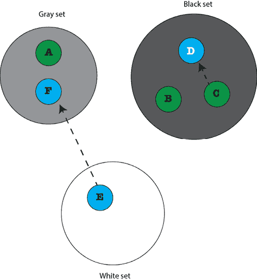

# 附录

# Go 垃圾回收器

本附录的主题是 Go **垃圾回收器**（**GC**）的操作。需要注意的是，GC 的细节和性能特性可能会随着每个新的 Go 版本而演变。

开发者通常不需要直接与 GC 交互，因为**它在其自己的 goroutine 中以自动方式在后台运行**。然而，了解其行为对于优化内存使用和避免与内存管理相关的常见陷阱是有益的。对于最新和最详细的信息，建议参考官方 Go 文档和发布说明。

首先，让我们讨论一下垃圾回收的一般情况。之后，我们将深入探讨 Go 垃圾回收的细微差别。

# 垃圾回收

垃圾回收是释放未使用内存空间的过程。换句话说，GC 看到哪些对象已超出作用域且无法再被引用，并释放它们所消耗的内存空间。这个过程在 Go 程序运行时以并发方式发生，而不是在程序执行之前或之后。Go GC 实现的文档中说明了以下内容：

> “垃圾回收器与 mutator 线程并发运行，类型准确（也称为精确），允许多个 GC 线程并行运行。它是一种使用写屏障的并发标记和清除。它既不是代式的也不是压缩式的。分配是通过每个 P 的分配区域按大小分离来进行的，以最小化碎片化并消除常见情况下的锁。”

# Go 垃圾回收器的关键特性

Go 垃圾收集器的关键特性如下：

+   **并发和并行**：Go 垃圾回收器与 Go 程序的执行并发运行。它与应用程序的线程并发运行，这意味着 GC 可以在不停止正在执行的应用程序的情况下执行其工作。此外，GC 的某些阶段可以并行化，以利用多个 CPU 核心和现代 CPU。

+   **代收集器**：Go 的垃圾回收器使用代垃圾回收策略，将对象分为两代：年轻代和老年代。大多数对象分配到年轻代，大部分垃圾回收工作都集中在那里。老年代包含寿命较长的对象，这些对象不太可能被垃圾回收。

+   **三色标记和清除算法**：Go GC 使用三色标记和清除算法。该算法在标记阶段使用三种颜色（白色、灰色和黑色）来跟踪对象的状态。白色对象尚未被访问，灰色对象正在被访问过程中，黑色对象已被访问。

+   **写屏障**：Go 使用写屏障来跟踪堆中更新的指针，以在垃圾回收期间保持一致性。写屏障确保 GC 了解指针的变化，允许它准确地跟踪对象依赖关系。

+   **垃圾回收触发器**：Go GC 基于内存分配和堆大小触发。当分配的内存达到某个阈值或堆大小超过指定的限制时，GC 被触发以回收未使用的内存。

+   **手动控制**：虽然 GC 被设计为自动且对开发者透明，但有一些方法可以提供提示并控制垃圾回收过程的某些方面。例如，可以使用`runtime.GC()`函数请求显式的垃圾回收周期。

我们将在不久的将来重新审视 GC 的大部分特性。

# 了解 Go GC 的更多内容

Go 标准库提供了允许你研究 GC 操作并了解更多关于 GC 秘密做什么的功能。这些函数在`gColl.go`实用程序中得到了说明。`gColl.go`的源代码在此以块的形式展示。

```go
package main
import (
    "fmt"
"runtime"
"time"
) 
```

我们需要`runtime`包，因为它允许我们获取有关 Go 运行时系统的信息，其中包括 GC 操作的信息。

```go
func printStats(mem runtime.MemStats) {
    runtime.ReadMemStats(&mem)
    fmt.Println("mem.Alloc:", mem.Alloc)
    fmt.Println("mem.TotalAlloc:", mem.TotalAlloc)
    fmt.Println("mem.HeapAlloc:", mem.HeapAlloc)
    fmt.Println("mem.NumGC:", mem.NumGC, "\n")
} 
```

`printStats()`的主要目的是避免多次编写相同的 Go 代码。`runtime.ReadMemStats()`调用为你获取最新的垃圾回收统计信息。

```go
func main() {
    var mem runtime.MemStats
    printStats(mem)
    for i := 0; i < 10; i++ {
        s := make([]byte, 50000000)
        if s == nil {
            fmt.Println("Operation failed!")
        }
    }
    printStats(mem) 
```

在这部分，我们有一个 for 循环，创建了 10 个每个 50,000,000 字节的字节块。这样做的原因是，通过分配大量内存，我们可以触发 GC。

```go
 for i := 0; i < 10; i++ {
        s := make([]byte, 100000000)
        if s == nil {
            fmt.Println("Operation failed!")
        }
        time.Sleep(5 * time.Second)
    }
    printStats(mem)
} 
```

程序的最后部分进行了更大的内存分配——这次，每个字节块有 10 亿字节。

在具有 32 GB RAM 的 macOS Sonoma 机器上运行`gColl.go`会产生以下类型的输出：

```go
$ go run gColl.go
mem.Alloc: 114960
mem.TotalAlloc: 114960
mem.HeapAlloc: 114960
mem.NumGC: 0
mem.Alloc: 50123152
mem.TotalAlloc: 500163016
mem.HeapAlloc: 50123152
mem.NumGC: 9
mem.Alloc: 121472
mem.TotalAlloc: 1500246248
mem.HeapAlloc: 121472
mem.NumGC: 20 
```

`mem.Alloc`的值是已分配堆对象的字节数——所有 GC 尚未释放的对象。`mem.TotalAlloc`显示为堆对象分配的累积字节数——当对象被释放时，这个数字不会减少，这意味着它会持续增加。因此，它显示了程序执行期间为堆对象分配的总字节数。`mem.HeapAlloc`与`mem.Alloc`相同。最后，`mem.NumGC`**显示了完成的垃圾回收周期总数**。这个值越大，你就越需要考虑如何在代码中分配内存，以及是否有优化这一点的途径。

如果你想获取更多关于 GC 操作的详细输出，可以将`go run gColl.go`与`GODEBUG=gctrace=1`结合使用。除了常规程序输出外，你还会得到一些额外的指标——这将在以下输出中说明：

```go
$ GODEBUG=gctrace=1 go run gColl.go
gc 1 @0.004s 2%: 0.008+0.34+0.042 ms clock, 0.081+0.063/0.51/0.18+0.42 ms cpu, 3->3->0 MB, 4 MB goal, 0 MB stacks, 0 MB globals, 10 P
gc 2 @0.009s 3%: 0.097+0.93+0.049 ms clock, 0.97+0.20/1.0/0.84+0.49 ms cpu, 3->3->1 MB, 4 MB goal, 0 MB stacks, 0 MB globals, 10 P
.
.
.
gc 18 @35.101s 0%: 0.13+0.15+0.009 ms clock, 1.3+0/0.22/0.007+0.095 ms cpu, 95->95->0 MB, 95 MB goal, 0 MB stacks, 0 MB globals, 10 P
gc 19 @40.107s 0%: 0.091+0.38+0.011 ms clock, 0.91+0/0.54/0+0.11 ms cpu, 95->95->0 MB, 95 MB goal, 0 MB stacks, 0 MB globals, 10 P
gc 20 @45.111s 0%: 0.095+0.26+0.009 ms clock, 0.95+0/0.38/0+0.092 ms cpu, 95->95->0 MB, 95 MB goal, 0 MB stacks, 0 MB globals, 10 P
mem.Alloc: 121200
mem.TotalAlloc: 1500245792
mem.HeapAlloc: 121200
mem.NumGC: 20 
```

和之前一样，我们有相同数量的完成的垃圾回收周期（20）。然而，我们得到了关于每个周期堆大小的额外信息。因此，对于垃圾回收周期 20（`gc 20`），我们得到以下信息：

```go
gc 20 @45.111s 0%: 0.095+0.26+0.009 ms clock, 0.95+0/0.38/0+0.092 ms cpu, 95->95->0 MB, 95 MB goal, 0 MB stacks, 0 MB globals, 10 P 
```

现在我们来解释上一行输出中的 `95->95->0` `MB` 三联组。第一个值（`95`）是 GC 即将运行时的堆大小。第二个值（`95`）是 GC 结束操作时的堆大小。最后一个值是活动堆的大小（`0`）。

## 三色算法

如前所述，Go GC 的操作基于三色算法。请注意，三色算法并非仅限于 Go，也可以用于其他编程语言。

严格来说，Go 中使用的算法的官方名称是 **三色标记-清除算法**。它与程序并发工作并使用写屏障。这意味着当 Go 程序运行时，Go 调度器负责调度应用程序以及垃圾回收器（GC），后者也作为一个 goroutine 运行。这就像 Go 调度器必须处理一个具有多个 goroutine 的常规应用程序一样！

该算法背后的核心思想来自 Edsger W. Dijkstra、Leslie Lamport、A. J. Martin、C. S. Scholten 和 E. F. M. Steffens，并在一篇名为 *On-the-Fly Garbage Collection: An Exercise in Cooperation* 的论文中首次阐述。

三色标记-清除算法背后的主要原则是，根据算法分配的颜色将堆中的对象分为三个不同的集合，颜色可以是黑色、灰色或白色。黑色集合中的对象保证没有指向白色集合中任何对象的指针。另一方面，白色集合中的对象可以指向黑色集合中的对象，因为这不会对 GC 的操作产生影响。灰色集合中的对象可能指向白色集合中的某些对象。最后，白色集合中的对象是垃圾回收的候选对象。

因此，当垃圾回收开始时，所有对象都是白色的，GC 会访问所有根对象并将它们标记为灰色。根对象是可以被应用程序直接访问的对象，包括全局变量和堆栈上的其他东西。这些对象主要依赖于特定程序的 Go 代码。

之后，GC 选择一个灰色对象，将其变为黑色，并开始检查该对象是否指向白色集合中的其他对象。因此，当灰色集合中的对象被扫描以查找指向其他对象的指针时，它会被染成黑色。如果这次扫描发现这个特定的对象有一个或多个指向白色对象的指针，它就会将那个白色对象放入灰色集合。这个过程会一直持续到灰色集合中存在对象为止。之后，白色集合中的对象是不可达的，它们的内存空间可以被重用。因此，在这个时候，白色集合中的元素被认为是垃圾回收的。请注意，没有任何对象可以直接从黑色集合转到白色集合，这允许算法运行并能够清除白色集合中的对象。如前所述，黑色集合中的对象不能直接指向白色集合中的对象。此外，如果在垃圾回收周期中的某个时刻，灰色集合中的对象变得不可达，它将不会在该垃圾回收周期中被回收，而是在下一个周期中回收！尽管这不是最佳情况，但也不是那么糟糕。

在这个过程中，运行中的应用程序被称为突变器。突变器运行一个名为**写屏障**的小函数，每次堆中的指针被修改时都会执行该函数。如果堆中对象的指针被修改，这意味着该对象现在是可以到达的——写屏障将其染成灰色并将其放入灰色集合。突变器负责确保黑色集合中没有元素指向白色集合中的元素。这是通过写屏障函数实现的。未能实现这一不变性将破坏垃圾回收过程，并且很可能会以非常糟糕和不受欢迎的方式使你的程序崩溃！

因此，总结一下，有三种不同的颜色：黑色、白色和灰色。当算法开始时，所有对象都被染成白色。随着算法的进行，白色对象会被移动到另外两个集合中的一个。留在白色集合中的对象是那些将在某个时刻被清除的对象。下一图显示了包含对象的三个颜色集合。



图 A.1：Go 垃圾回收器将程序的堆表示为图

当对象**E**（在白色集合中）可以访问对象**F**时，它不能被任何其他对象访问，因为没有任何其他对象指向对象**E**，这使得它成为垃圾回收的完美候选者！此外，对象**A**、**B**和**C**是根对象，总是可以到达的；因此，它们不能被垃圾回收。

你能猜到接下来会发生什么吗？好吧，算法将不得不处理灰色集合的剩余元素，这意味着对象**A**和**F**都将进入黑色集合。对象**A**进入黑色集合，因为它是一个根元素，而**F**进入黑色集合，因为它在灰色集合中不指向任何其他对象。

在对象**E**被垃圾回收后，对象**F**将变得不可达，并在 GC 的下一个周期中被垃圾回收，因为不可达的对象不能在垃圾回收周期的下一个迭代中神奇地变得可达。

Go 的垃圾回收也可以应用于诸如通道之类的变量。当 GC 发现通道不可达时，即通道变量无法再被访问时，即使通道尚未关闭，它也会释放其资源。

Go 允许你通过在 Go 代码中放置`runtime.GC()`语句来手动启动垃圾回收周期。然而，请注意，`runtime.GC()`会阻塞调用者，它可能会阻塞整个程序，尤其是如果你正在运行一个非常繁忙的 Go 程序，并且有很多对象时。这主要是因为当其他一切都在快速变化时，你不能执行垃圾回收，因为这不会给 GC 提供清楚地识别白色、黑色和灰色集合成员的机会。这种垃圾回收状态也被称为垃圾回收安全点。

你可以在[`github.com/golang/go/blob/master/src/runtime/mgc.go`](https://github.com/golang/go/blob/master/src/runtime/mgc.go)找到 GC 的较长且相对高级的 Go 代码，如果你想要了解更多关于垃圾回收操作的信息，你可以研究这段代码。如果你足够勇敢，甚至可以修改这段代码！

## 关于 Go GC 的操作更多

本节将更详细地讨论 Go GC，并展示其活动的一些额外信息。Go GC 的主要关注点是低延迟，这基本上意味着在操作中保持短暂的暂停，以便实现实时操作。另一方面，程序一直在创建新的对象，并通过指针操作现有的对象。这个过程可能会导致无法访问的对象，因为没有指针指向这些对象。这些对象随后成为垃圾，等待 GC 清理并释放其内存空间。之后，释放的内存空间就可以再次使用了。

标记-清除算法是使用最简单的算法。该算法为了访问程序堆中所有可访问的对象并对其进行标记，会停止程序执行（**停止世界 GC**）。之后，它清除不可访问的对象。在算法的标记阶段，每个对象被标记为白色、灰色或黑色。灰色对象的子对象被着色为灰色，而原始的灰色对象随后被着色为黑色。当没有更多灰色对象需要检查时，开始清除阶段。这种技术之所以有效，是因为黑色集合中没有指针指向白色集合，这是算法的一个基本不变量。

尽管标记-清除算法很简单，但在运行时它暂停了程序的执行，这意味着它给实际过程增加了延迟。Go 试图通过将 GC 作为并发进程运行以及使用上一节中描述的三色算法来降低这种延迟。然而，当 GC 并发运行时，其他进程可以移动指针或创建新对象。这个事实可能会给 GC 带来困难。

因此，允许三色算法在保持标记-清除算法的基本不变量的同时并发运行的基本原则是，黑色集合中的任何对象都不能指向白色集合中的对象。

解决这个问题的方法是修复所有可能对算法造成问题的案例。因此，新对象必须进入灰色集合，因为这样，标记-清除算法的基本不变量就不会被改变。此外，当程序中的指针移动时，您将指针指向的对象着色为灰色。灰色集合在白色集合和黑色集合之间充当屏障。最后，每次指针移动时，都会自动执行一些 Go 代码，这就是前面提到的写屏障，它进行一些重新着色。执行写屏障代码引入的延迟是我们为了能够并发运行 GC 而必须付出的代价。

注意，Java 编程语言有许多垃圾收集器，这些收集器可以通过多个参数进行高度配置。其中之一是 G1，它适用于低延迟应用。尽管 Go 没有多个垃圾收集器，但它确实有一些旋钮，您可以使用这些旋钮来调整应用程序的垃圾收集器。

下一个部分将从一个垃圾收集的角度讨论映射和切片，因为有时我们处理变量的方式会影响 GC 的操作。

# 映射、切片和 Go GC

在本节中，我们讨论 Go GC 与映射和切片的关系操作。本节的目的让您编写使 GC 工作更简单的代码。

## 使用切片

本节中的示例使用切片来存储大量结构，以展示切片分配与 GC 操作的关系。每个结构存储两个整数值。这通过`sliceGC.go`实现如下：

```go
package main
import (
    "runtime"
)
type data struct {
    i, j int
}
func main() {
    var N = 80000000
var structure []data
    for i := 0; i < N; i++ {
        value := int(i)
        structure = append(structure, data{value, value})
    }
    runtime.GC()
    _ = structure[0]
} 
```

最后一条语句（`_ = structure[0]`）用于防止垃圾回收器过早地回收结构变量，因为它在`for`循环外部没有被引用或使用。接下来的三个 Go 程序也将使用同样的技术。除了这个重要的细节外，`for`循环用于将所有值放入存储在结构切片变量中的结构体中。另一种实现方式是使用`runtime.KeepAlive()`。程序不生成任何输出——它只是通过调用`runtime.GC()`来触发垃圾回收。

## 使用指针映射

在本小节中，我们使用映射来存储指针。这次，映射使用整数键来引用指针。程序名为`mapStar.go`，包含以下 Go 代码：

```go
package main
import (
    "runtime"
)
func main() {
    var N = 80000000
    myMap := make(map[int]*int)
    for i := 0; i < N; i++ {
        value := int(i)
        myMap[value] = &value
    }
    runtime.GC()
    _ = myMap[0]
} 
```

程序的操作与上一节中的`sliceGC.go`相同。不同的是，它使用映射（`make(map[int]*int)`）来存储`int`的指针。与之前一样，程序没有生成任何输出。

## 不使用指针的映射

在本小节中，我们使用一个直接存储整数值的映射，而不是存储整数值的指针。`mapNoStar.go`中的重要代码如下：

```go
func main() {
    var N = 80000000
    myMap := make(map[int]int)
    for i := 0; i < N; i++ {
        value := int(i)
        myMap[value] = value
    }
    runtime.GC()
    _ = myMap[0]
} 
```

同样，程序没有生成任何输出。

## 分割映射

在最后一个程序中，我们使用了一种称为分片的不同技术，其中将一个长映射分割成映射的映射。`mapSplit.go`的`main()`函数的实现如下：

```go
func main() {
    var N = 80000000
    split := make([]map[int]int, 2000)
    for i := range split {
        split[i] = make(map[int]int)
    }
    for i := 0; i < N; i++ {
        value := int(i)
        split[i%2000][value] = value
    }
    runtime.GC()
    _ = split[0][0]
} 
```

代码使用了两个`for`循环，一个用于创建映射的映射，另一个用于将所需的数据值存储在映射的映射中。

由于所有四个程序都使用大量数据结构，它们消耗了大量的内存。消耗大量内存空间的程序会触发 Go GC 的频率更高。下一小节将介绍对所提出技术的评估。

## 比较所提出技术的性能

在本小节中，我们使用`zsh(1)`命令的时间命令（与 UNIX 命令`time(1)`非常相似）比较这四种实现的性能。比较的目的是了解分配技术和使用的数据结构如何影响程序的性能。

```go
$ time go run sliceGC.go
go run sliceGC.go  0.61s user 0.52s system 92% cpu 1.222 total
$ time go run mapStar.go
go run mapStar.go  23.86s user 1.02s system 176% cpu 14.107 total
$ time go run mapNoStar.go
go run mapNoStar.go  10.01s user 0.53s system 98% cpu 10.701 total
$ time go run mapSplit.go
go run mapSplit.go  11.22s user 0.44s system 100% cpu 11.641 total 
```

结果表明，**所有映射版本都比切片版本慢**。不幸的是，对于映射来说，由于哈希函数的执行和数据的不连续性，映射版本将始终比切片版本慢。**在映射中，数据存储在由哈希函数输出确定的桶中**。

此外，第一个地图程序（`mapStar.go`）可能会触发一些垃圾回收（GC）的减慢，因为获取`&value`的地址会导致它逃逸到堆上。其他所有程序只是使用栈来存储那些局部变量。**当变量逃逸到堆上时，它们会导致更多的垃圾回收压力**。

访问映射或切片的元素具有`O(1)`的运行时间，这意味着访问时间不依赖于映射或切片中找到的元素数量。然而，这些结构的工作方式会影响整体速度。

# 其他资源

+   Go FAQ：我如何知道一个变量是在堆上还是在栈上分配的？[`go.dev/doc/faq#stack_or_heap`](https://go.dev/doc/faq#stack_or_heap)

+   可用的`-gcflags`选项列表：[`pkg.go.dev/cmd/compile`](https://pkg.go.dev/cmd/compile.dev/doc/faq#stack_or_heap)

+   如果你想了解更多关于垃圾回收的信息，你应该访问[`gchandbook.org/`](http://gchandbook.org/)

# 留下评论！

喜欢这本书吗？通过留下亚马逊评论来帮助像你这样的读者。扫描下面的二维码，获取你选择的免费电子书。


