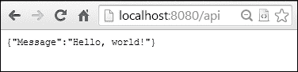
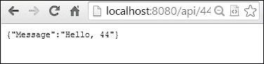
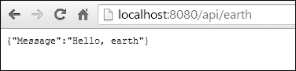
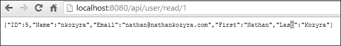

# 第一章：我们在 Go 中的第一个 API

如果您花费了时间在 Web 上开发应用程序（或者说，不管在哪里），您很快就会发现自己面临与 Web 服务或 API 进行交互的前景。

无论是您需要的库还是必须与之交互的另一个应用程序的沙盒，开发世界在很大程度上依赖于不同应用程序、语言和格式之间的合作。

毕竟，这就是我们拥有 API 的原因——允许任何两个给定平台之间的标准化通信。

如果您在 Web 上花费了很长时间，您会遇到糟糕的 API。所谓的*糟糕*是指不全面、不遵循最佳实践和标准、在语义上令人困惑或缺乏一致性的 API。您会遇到一些 API 在某些地方随意使用 OAuth 或简单的 HTTP 身份验证，而在其他地方则相反，或者更常见的是，API 忽略了 HTTP 动词的规定用途（我们将在本章后面更多地讨论这一点）。

谷歌的 Go 语言特别适用于服务器。具有内置的 HTTP 服务、数据的简单 XML 和 JSON 编码方法、高可用性和并发性，它是您的 API 的理想平台。

在本书中，我们不仅将探讨强大而干净的 API 开发，还将探讨其与其他 API 和数据源的交互，以及此类开发的最佳实践。我们将构建一个大型服务和一堆小型服务，用于个别、独立的课程。

最重要的是，到最后，您应该能够在 Go 中与任何网络 API 进行交互，并能够自己设计和执行一个完善的 API 套件。

本书至少需要对基于 Web 的 API 有一定的了解，并且需要具备初学者水平的 Go 能力，但是当我们讨论新概念时，我们会进行一些非常简要的介绍，并引导您获取更多信息，以便了解 Go 或 API 的这一方面。

我们还将稍微涉及 Go 中的并发性，但我们不会过于详细——如果您希望了解更多，请查看我撰写的书籍*Mastering Concurrency in Go*，*Packt Publishing*。

我们将在本章中涵盖以下主题：

+   了解要求和依赖关系

+   介绍 HTTP 包

+   构建我们的第一个路由

+   通过 HTTP 设置数据

+   从数据存储器向客户端提供数据

# 了解要求和依赖关系

在本书中深入研究之前，我们最好先检查一下您需要安装的东西，以便处理我们开发、测试和部署 API 的所有示例。

## 安装 Go

不用说，我们需要安装 Go 语言。但是，为了完成本书中的所有操作，您还需要安装一些相关项目。

### 注意

Go 适用于 Mac OS X、Windows 和大多数常见的 Linux 变体。您可以在[`golang.org/doc/install`](http://golang.org/doc/install)下载二进制文件。

在 Linux 上，您通常可以通过发行版的软件包管理器获取 Go。例如，您可以通过简单的`apt-get install golang`命令在 Ubuntu 上获取它。大多数发行版都有类似的方法。

除了核心语言外，我们还将与 Google App Engine 一起工作，并且测试 App Engine 的最佳方法是安装**软件开发工具包**（**SDK**）。这将允许我们在部署之前在本地测试我们的应用程序，并模拟 App Engine 上提供的许多功能。

### 注意

App Engine SDK 可以从[`developers.google.com/appengine/downloads`](https://developers.google.com/appengine/downloads)下载。

虽然我们显然最感兴趣的是 Go SDK，但您还应该获取 Python SDK，因为有一些小的依赖关系可能仅在 Go SDK 中不可用。

## 安装和使用 MySQL

我们将使用许多不同的数据库和数据存储来管理我们的测试和真实数据，而 MySQL 将是其中之一。

我们将使用 MySQL 作为我们用户的存储系统；他们的消息和他们的关系将存储在我们的较大的应用程序中（我们稍后会更多地讨论这一点）。

### 注意

MySQL 可以从[`dev.mysql.com/downloads/`](http://dev.mysql.com/downloads/)下载。

您也可以轻松地从 Linux/OS X 的软件包管理器中获取它，方法如下：

+   Ubuntu：`sudo apt-get install mysql-server mysql-client`

+   OS X 与 Homebrew：`brew install mysql`

## Redis

Redis 是我们将用于几种不同演示的两种 NoSQL 数据存储之一，包括从我们的数据库缓存数据以及 API 输出。

如果您对 NoSQL 不熟悉，我们将在示例中使用 Redis 和 Couchbase 进行一些非常简单的结果收集介绍。如果您了解 MySQL，那么 Redis 至少会感觉相似，您不需要完整的知识库来使用我们为我们的目的使用应用程序。

### 注意

Redis 可以从[`redis.io/download`](http://redis.io/download)下载。

Redis 可以在 Linux/OS X 上使用以下方式下载：

+   Ubuntu：`sudo apt-get install redis-server`

+   OS X 与 Homebrew：`brew install redis`

## Couchbase

正如前面提到的，Couchbase 将是我们将在各种产品中使用的第二个 NoSQL 解决方案，主要用于设置短暂或瞬时的键存储查找，以避免瓶颈，并作为内存缓存的实验。

与 Redis 不同，Couchbase 使用简单的 REST 命令来设置和接收数据，而且所有内容都以 JSON 格式存在。

### 注意

Couchbase 可以从[`www.couchbase.com/download`](http://www.couchbase.com/download)下载。

+   对于 Ubuntu（`deb`），请使用以下命令下载 Couchbase：

```go
dpkg -i couchbase-server version.deb

```

+   对于使用 Homebrew 的 OS X，请使用以下命令下载 Couchbase：

```go
brew install https://github.com/couchbase/homebrew/raw/stable/Library/Formula/libcouchbase.rb

```

## Nginx

尽管 Go 自带了运行高并发、高性能 Web 服务器所需的一切，但我们将尝试在我们的结果周围包装一个反向代理。我们主要这样做是为了应对关于可用性和速度的现实问题。*Nginx 在 Windows 上不是原生可用的*。

### 注意

+   对于 Ubuntu，请使用以下命令下载 Nginx：

```go
apt-get install nginx

```

+   对于使用 Homebrew 的 OS X，请使用以下命令下载 Nginx：

```go
brew install nginx

```

## Apache JMeter

我们将利用 JMeter 来对我们的 API 进行基准测试和调优。在这里您有一些选择，因为有几个模拟流量的压力测试应用程序。我们将涉及的两个是**JMeter**和 Apache 内置的**Apache Benchmark**（**AB**）平台。后者在基准测试中是一个坚定不移的选择，但在您可以向 API 发送的内容方面有些受限，因此更倾向于使用 JMeter。

在构建 API 时，我们需要考虑的一件事是其抵御高流量的能力（以及在无法抵御时引入一些缓解措施），因此我们需要知道我们的限制是什么。

### 注意

Apache JMeter 可以从[`jmeter.apache.org/download_jmeter.cgi`](http://jmeter.apache.org/download_jmeter.cgi)下载。

## 使用预定义数据集

在本书的整个过程中，虽然没有必要一直使用我们的虚拟数据集，但是当我们构建社交网络时，将其引入可以节省大量时间，因为它充满了用户、帖子和图片。

通过使用这个数据集，您可以跳过创建这些数据来测试 API 和 API 创建的某些方面。

### 注意

我们的虚拟数据集可以从[`github.com/nkozyra/masteringwebservices`](https://github.com/nkozyra/masteringwebservices)下载。

## 选择 IDE

**集成开发环境**（**IDE**）的选择是开发人员可以做出的最个人化的选择之一，很少有开发人员对自己喜欢的 IDE 不充满激情。

本书中没有任何内容需要特定的 IDE；事实上，Go 在编译、格式化和测试方面的大部分优势都在命令行级别。不过，我们至少想探索一些 Go 的更受欢迎的编辑器和 IDE 选择。

### Eclipse

作为任何语言可用的最受欢迎和最广泛的 IDE 之一，Eclipse 是一个显而易见的首选。大多数语言都通过 Eclipse 插件获得支持，Go 也不例外。

这款庞大的软件也有一些缺点；它在某些语言上偶尔会出现错误，有些自动完成功能的速度明显较慢，并且比大多数其他可用选项更加沉重。

然而，它的优点是多方面的。Eclipse 非常成熟，并且有一个庞大的社区，您可以在出现问题时寻求支持。而且，它是免费的。

### 注意

+   Eclipse 可以从[`eclipse.org/`](http://eclipse.org/)下载

+   在[`goclipse.github.io/`](http://goclipse.github.io/)获取 Goclipse 插件

### Sublime Text

Sublime Text 是我们特别喜欢的，但它有一个很大的警告——它是这里列出的唯一一个不免费的。

这款软件更像是一个完整的代码/文本编辑器，而不是一个沉重的 IDE，但它包括代码完成选项，并且可以直接将 Go 编译器（或其他语言的编译器）集成到界面中。

尽管 Sublime Text 的许可证价格为 70 美元，但许多开发人员发现它的优雅和速度是非常值得的。您可以无限期地尝试该软件，以查看它是否适合您；除非您购买许可证，否则它将作为催告软件运行。

### 注意

Sublime Text 可以从[`www.sublimetext.com/2`](http://www.sublimetext.com/2)下载。

### LiteIDE

LiteIDE 是比其他提到的 IDE 更年轻的一个，但它值得一提，因为它专注于 Go 语言。

它是跨平台的，并且在后台执行了很多 Go 的命令行魔术，使其真正集成。LiteIDE 还可以在 IDE 中直接处理代码自动完成、`go fmt`、构建、运行和测试，以及强大的包浏览器。

它是免费的，如果您想要一个精简且专门针对 Go 语言的工具，那么它绝对值得一试。

### 注意

LiteIDE 可以从[`code.google.com/p/golangide/`](https://code.google.com/p/golangide/)下载。

### IntelliJ IDEA

与 Eclipse 齐名的是 JetBrains 系列的 IDE，它涵盖了大约与 Eclipse 相同数量的语言。最终，两者都主要是以 Java 为主要考虑因素，这意味着有时其他语言的支持可能会次要。

这里的 Go 集成似乎相当强大和完整，因此如果您有许可证，那么它是值得一试的。如果您没有许可证，您可以尝试免费的 Community Edition。

### 注意

+   您可以从[`www.jetbrains.com/idea/download/`](http://www.jetbrains.com/idea/download/)下载 IntelliJ IDEA

+   Go 语言支持插件可在[`plugins.jetbrains.com/plugin/?idea&id=5047`](http://plugins.jetbrains.com/plugin/?idea&id=5047)上获得

### 一些客户端工具

尽管我们将主要关注 Go 和 API 服务，但我们将对客户端与 API 的交互进行一些可视化。

因此，我们将主要关注纯 HTML 和 JavaScript，但对于更多的交互点，我们还将使用 jQuery 和 AngularJS。

### 注意

我们为客户端演示所做的大部分内容都可以在本书的 GitHub 存储库[`github.com/nkozyra/goweb`](https://github.com/nkozyra/goweb)的 client 目录下找到。

jQuery 和 AngularJS 都可以从 Google 的 CDN 动态加载，这样您就不必在本地下载和存储它们。托管在 GitHub 上的示例会动态调用它们。

要动态加载 AngularJS，请使用以下代码：

```go
<script src="img/angular.min.js"></script>
```

要动态加载 jQuery，请使用以下代码：

```go
<script src="img/jquery.min.js"></script>
```

## 查看我们的应用程序

在本书中，我们将构建许多小应用程序来演示要点、函数、库和其他技术。但是，我们也将专注于一个更大的项目，模拟一个社交网络，在其中我们通过 API 创建和返回用户、状态等。

尽管我们将致力于构建一个更大的应用程序来演示每个部分的拼图，但我们也将构建和测试独立的应用程序、API 和接口。

后一组将以快速入门为前缀，以让您知道它不是我们更大应用程序的一部分。

## 设置我们的数据库

如前所述，我们将设计一个几乎完全在 API 级别上运行的社交网络（至少起初是这样），作为本书中的*主要*项目。

当我们想到主要的社交网络（过去和现在），它们中有一些无处不在的概念，如下所示：

+   创建用户并维护用户资料的能力

+   分享消息或状态并基于它们进行对话的能力

+   表达对所述状态/消息的喜好或厌恶，以决定任何给定消息的价值

这里还有一些其他功能，我们将从这里开始构建，但让我们从基础知识开始。让我们按以下方式在 MySQL 中创建我们的数据库：

```go
create database social_network;
```

这将是本书中我们社交网络产品的基础。目前，我们只需要一个`users`表来存储我们的个人用户及其最基本的信息。随着我们的进展，我们将对其进行修改以包括更多功能：

```go
CREATE TABLE users (
  user_id INT(10) UNSIGNED NOT NULL AUTO_INCREMENT,
  user_nickname VARCHAR(32) NOT NULL,
  user_first VARCHAR(32) NOT NULL,
  user_last VARCHAR(32) NOT NULL,
  user_email VARCHAR(128) NOT NULL,
  PRIMARY KEY (user_id),
  UNIQUE INDEX user_nickname (user_nickname)
)
```

在本章中，我们不需要做太多事情，所以这就够了。我们将拥有用户的最基本信息——姓名、昵称和电子邮件，没有太多其他信息。

# 介绍 HTTP 包

我们的大部分 API 工作将通过 REST 处理，因此您应该对 Go 的`http`包非常熟悉。

除了通过 HTTP 提供服务外，`http`包还包括许多其他非常有用的实用程序，我们将详细了解这些实用程序。这些包括 cookie jars、设置客户端、反向代理等。

但目前我们感兴趣的主要实体是`http.Server`结构，它提供了我们服务器所有操作和参数的基础。在服务器内部，我们可以设置 TCP 地址、用于路由特定请求的 HTTP 多路复用、超时和标头信息。

Go 还提供了一些快捷方式来调用服务器，而不是直接初始化结构。例如，如果您有许多默认属性，您可以使用以下代码：

```go
Server := Server {
  Addr: ":8080",
  Handler: urlHandler,
  ReadTimeout: 1000 * time.MicroSecond,
  WriteTimeout: 1000 * time.MicroSecond,
  MaxHeaderBytes: 0,
  TLSConfig: nil
}
```

您可以简单地使用以下代码执行：

```go
http.ListenAndServe(":8080", nil)
```

这将为您调用一个服务器结构并仅设置`Addr`和`Handler`属性。

当然，有时我们会想要更精细地控制我们的服务器，但目前这样就够了。让我们首次将这个概念输出一些 JSON 数据通过 HTTP。

## 快速入门-通过 API 说 Hello, World

正如本章前面提到的，我们将偏离原题，做一些我们将以**快速入门**为前缀的工作，以示它与我们更大的项目无关。

在这种情况下，我们只想激活我们的`http`包并向浏览器传递一些 JSON。毫不奇怪，我们只会向世界输出令人沮丧的`Hello, world`消息。

让我们使用所需的包和导入来设置这个：

```go
package main

import
(
  "net/http"
  "encoding/json"
  "fmt"
)
```

这是我们需要通过 HTTP 输出简单的 JSON 字符串的最低要求。编组 JSON 数据可能比我们在这里看到的要复杂一些，所以如果我们的消息结构不立即让人明白，不要担心。

这是我们的响应结构，包含我们希望从 API 中获取并发送给客户端的所有数据：

```go
type API struct {
  Message string "json:message"
}
```

显然这里还没有太多东西。我们只设置了一个消息字符串，显然命名为`Message`变量。

最后，我们需要设置我们的主要函数（如下所示）来响应路由并提供一个经过编组的 JSON 响应：

```go
func main() {

  http.HandleFunc("/api", func(w http.ResponseWriter, r *http.Request) {

    message := API{"Hello, world!"}

    output, err := json.Marshal(message)

    if err != nil {
      fmt.Println("Something went wrong!")
    }

    fmt.Fprintf(w, string(output))

  })

  http.ListenAndServe(":8080", nil)
}
```

进入`main()`后，我们设置了一个路由处理函数，以响应在`/api`处初始化一个带有`Hello, world!`的 API 结构。然后我们将其编组为 JSON 字节数组`output`，并在将此消息发送到我们的`iowriter`类（在本例中为`http.ResponseWriter`值）后，将其转换为字符串。

最后一步是一种快速而粗糙的方法，通过一个期望字符串的函数发送我们的字节数组，但在这样做时几乎不会出现什么问题。

Go 通过将类型作为环绕目标变量的函数来简单处理类型转换。换句话说，我们可以通过简单地用`int(OurInt64)`函数将`int64`值转换为整数来进行类型转换。当然，也有一些例外情况——一些类型不能直接转换，还有一些其他陷阱，但这是一般的想法。在可能的例外情况中，一些类型不能直接转换为其他类型，有些需要像`strconv`这样的包来管理类型转换。

如果我们在浏览器中输入`localhost:8080/api`（如下截图所示），您应该会得到我们期望的结果，假设一切都正确：



# 构建我们的第一个路由

当我们谈论 Go 术语中的路由时，我们更准确地讨论的是多路复用器或`mux`。在这种情况下，多路复用器指的是将 URL 或 URL 模式转换为内部函数。

您可以将这看作是从请求到函数（或处理程序）的简单映射。您可能会设计出类似以下的东西：

```go
/api/user  func apiUser
/api/message  func apiMessage
/api/status  func apiStatus
```

`net/http`包提供的内置 mux/router 存在一些限制。例如，您不能为路由提供通配符或正则表达式。

您可能期望能够像下面的代码片段中所讨论的那样做一些事情：

```go
  http.HandleFunc("/api/user/\d+", func(w http.ResponseWriter, r *http.Request) {

    // react dynamically to an ID as supplied in the URL

  })
```

然而，这会导致解析错误。

如果您在任何成熟的 Web API 中花费了一些时间，您会知道这是行不通的。我们需要能够对动态和不可预测的请求做出反应。这意味着无法预料每个数字用户与函数的映射是不可行的。我们需要能够接受和使用模式。

对于这个问题有一些解决方案。第一个是使用具有这种强大路由功能的第三方平台。有一些非常好的平台可供选择，所以我们现在快速看一下这些。

## Gorilla

Gorilla 是一个全面的 Web 框架，我们在本书中会经常使用它。它具有我们需要的精确的 URL 路由包（在其`gorilla/mux`包中），并且还提供一些其他非常有用的工具，如 JSON-RPC、安全 cookie 和全局会话数据。

Gorilla 的`mux`包让我们可以使用正则表达式，但它也有一些简写表达式，让我们定义我们期望的请求字符串类型，而不必写出完整的表达式。

例如，如果我们有一个像`/api/users/309`这样的请求，我们可以在 Gorilla 中简单地路由它如下：

```go
gorillaRoute := mux.NewRouter()
gorillaRoute.HandleFunc("/api/{user}", UserHandler)
```

然而，这样做存在明显的风险——通过让这一切如此开放，我们有可能遇到一些数据验证问题。如果这个函数接受任何参数，而我们只期望数字或文本，这将在我们的基础应用程序中造成问题。

因此，Gorilla 允许我们使用正则表达式来澄清这一点，如下所示：

```go
r := mux.NewRouter()
r.HandleFunc("/products/{user:\d+}", ProductHandler)
```

现在，我们只会得到我们期望的——基于数字的请求参数。让我们修改我们之前的示例，以演示这个概念：

```go
package main

import (
  "encoding/json"
  "fmt"
  "github.com/gorilla/mux"
  "net/http"
)

type API struct {
  Message string "json:message"
}

func Hello(w http.ResponseWriter, r *http.Request) {

  urlParams := mux.Vars(r)
  name := urlParams["user"]
  HelloMessage := "Hello, " + name

  message := API{HelloMessage}
  output, err := json.Marshal(message)

  if err != nil {
    fmt.Println("Something went wrong!")
  }

  fmt.Fprintf(w, string(output))

}

func main() {

  gorillaRoute := mux.NewRouter()
  gorillaRoute.HandleFunc("/api/{user:[0-9]+}", Hello)
  http.Handle("/", gorillaRoute)
  http.ListenAndServe(":8080", nil)
}
```

### 提示

**下载示例代码**

您可以从您在[`www.packtpub.com`](http://www.packtpub.com)的帐户中下载您购买的所有 Packt 图书的示例代码文件。如果您在其他地方购买了这本书，您可以访问[`www.packtpub.com/support`](http://www.packtpub.com/support)并注册，以便直接通过电子邮件接收文件。

通过这段代码，我们在路由级别上进行了一些验证。对`/api/44`的有效请求将给我们一个正确的响应，如下面的屏幕截图所示：



对`/api/nkozyra`之类的无效请求将给我们一个 404 响应。

### 注意

+   您可以从[`www.gorillatoolkit.org/`](http://www.gorillatoolkit.org/)下载 Gorilla web 工具包

+   其 URL 多路复用器的文档可以在[`www.gorillatoolkit.org/pkg/mux`](http://www.gorillatoolkit.org/pkg/mux)找到

## 路由

来自`drone.io`的 Routes，明确且专门用于 Go 的路由包。这使它比 Gorilla web 工具包更加专注。

在较小的应用程序中，URL 路由大多数情况下不会成为瓶颈，但随着应用程序规模的扩大，这是需要考虑的事情。对于我们的目的，例如 Gorilla 和 Routes 之间的速度差异是可以忽略不计的。

在 routes 中定义您的`mux`包非常干净简单。这是对我们的`Hello world`消息的一个变体，它响应 URL 参数：

```go
func Hello(w http.ResponseWriter, r *http.Request) {

  urlParams := r.URL.Query()
  name := urlParams.Get(":name")
  HelloMessage := "Hello, " + name
  message := API{HelloMessage}
  output, err := json.Marshal(message)

  if err != nil {
    fmt.Println("Something went wrong!")
  }

  fmt.Fprintf(w, string(output))

}

func main() {

  mux := routes.New()
  mux.Get("/api/:name", Hello)
  http.Handle("/", mux)
  http.ListenAndServe(":8080", nil)
}
```

这里的主要区别（与 Gorilla 一样）是我们将我们的`routes`多路复用器传递给`http`，而不是使用内部的多路复用器。与 Gorilla 一样，我们现在可以使用可变的 URL 模式来更改我们的输出，如下所示：



### 注意

您可以在[`github.com/drone/routes`](https://github.com/drone/routes)了解有关路由及其安装方法的更多信息。

运行以下命令安装路由：

```go
go get github.com/drone/routes

```

# 通过 HTTP 设置数据

现在我们已经研究了如何处理路由，让我们尝试直接从 REST 端点向数据库中注入数据。

在这种情况下，我们将专门查看`POST`请求方法，因为在大多数情况下，当可能传输大量数据时，您希望避免`GET`请求所施加的长度限制。

### 提示

从技术上讲，`PUT`请求是在**创建-读取-更新-删除**（CRUD）概念中用于创建数据的语义上正确的方法，但多年来，`PUT`在很大程度上被边缘化为历史脚注。最近，一些支持将`PUT`（和`DELETE`）恢复到其适当位置的做法已经开始流行。Go（和 Gorilla）将乐意允许您将请求委托给任何一个，并且在我们继续前进时，我们将朝着更符合协议的语义发展。

## 连接到 MySQL

Go 具有一个内置的通用数据库连接设施，大多数第三方数据库连接包都会让步于它。Go 的默认 SQL 包是`database/sql`，它允许更一般的数据库连接，并具有一些标准化。

然而，我们暂时不会自己编写 MySQL 连接，而是使用第三方附加库。有几个可用的库，但我们将选择`Go-MySQL-Driver`。

### 注意

您可以使用以下命令安装`Go-MySQL-Driver`（需要 Git）：

```go
go get github.com/go-sql-driver/mysql

```

在本例中，我们将假设您的 MySQL 在标准端口`3306`上以 localhost 运行。如果它没有运行，请相应地进行必要的调整。这里的示例也将使用无密码的 root 帐户，以便清晰起见。

我们的导入基本上保持不变，但有两个明显的添加：`sql`包（`database/sql`）和前面提到的仅用于副作用的 MySQL 驱动，通过在其前面加下划线导入：

```go
package main

import
(
  "database/sql"
  _ "github.com/go-sql-driver/mysql"
  "encoding/json"
  "fmt"
  "github.com/gorilla/mux"
  "net/http"
)
```

我们将使用 Gorilla 设置一个新的端点。您可能还记得，当我们打算设置或创建数据时，我们通常会推动`PUT`或`POST`动词，但出于演示目的，通过附加 URL 参数是推送数据的最简单方式。以下是我们设置这个新路由的方法：

```go
  routes := mux.NewRouter()
  routes.HandleFunc("/api/user/create", CreateUser).Methods("GET")
```

### 注意

请注意，我们正在指定我们将接受此请求的动词。在实际使用中，这是推荐的`GET`请求。

我们的`CreateUser`函数将接受几个参数——`user`、`email`、`first`和`last`。`User`代表一个简短的用户名，其余的应该是不言自明的。我们将在代码之前定义一个`User`结构体，如下所示：

```go
type User struct {
  ID int "json:id"
  Name  string "json:username"
  Email string "json:email"
  First string "json:first"
  Last  string "json:last"
}
```

现在让我们来看一下`CreateUser`函数本身：

```go
func CreateUser(w http.ResponseWriter, r *http.Request) {

  NewUser := User{}
  NewUser.Name = r.FormValue("user")
  NewUser.Email = r.FormValue("email")
  NewUser.First = r.FormValue("first")
  NewUser.Last = r.FormValue("last")
  output, err := json.Marshal(NewUser)
  fmt.Println(string(output))
  if err != nil {
    fmt.Println("Something went wrong!")
  }

  sql := "INSERT INTO users set user_nickname='" + NewUser.Name + "', user_first='" + NewUser.First + "', user_last='" + NewUser.Last + "', user_email='" + NewUser.Email + "'"
  q, err := database.Exec(sql)
  if err != nil {
    fmt.Println(err)
  }
  fmt.Println(q)
}
```

当我们运行这个时，我们的路由 API 端点应该在`localhost:8080/api/user/create`可用。尽管如果你看一下调用本身，你会注意到我们需要传递 URL 参数来创建一个用户。我们还没有对我们的输入进行任何合理性检查，也没有确保它是干净的/转义的，但我们将按照以下方式访问 URL：`http://localhost:8080/api/user/create?user=nkozyra&first=Nathan&last=Kozyra&email=nathan@nathankozyra.com`。

然后，我们将在我们的`users`表中创建一个用户，如下所示：


# 从数据存储中向客户端提供数据

显然，如果我们开始通过 API 端点设置数据，尽管很简单，我们也希望通过另一个 API 端点检索数据。我们可以轻松地修改我们当前的调用，使用以下代码包括一个提供数据返回的新路由：

```go
func GetUser(w http.ResponseWriter, r *http.Request) {

  urlParams   := mux.Vars(r)
  id       := urlParams["id"]
  ReadUser := User{}
  err := database.QueryRow("select * from users where user_id=?",id).Scan(&ReadUser.ID, &ReadUser.Name, &ReadUser.First, &ReadUser.Last, &ReadUser.Email )
  switch {
      case err == sql.ErrNoRows:
              fmt.Fprintf(w,"No such user")
      case err != nil:
              log.Fatal(err)
  fmt.Fprintf(w, "Error")
      default:
        output, _ := json.Marshal(ReadUser)
        fmt.Fprintf(w,string(output))
  }
}
```

我们在这里做了一些新的和值得注意的事情。首先，我们使用了`QueryRow()`方法而不是`Exec()`。Go 的默认数据库接口提供了一些稍有不同的查询机制。具体如下：

+   `Exec()`: 该方法用于查询（主要是`INSERT`、`UPDATE`和`DELETE`），不会返回行。

+   `Query()`: 该方法用于返回一个或多个行的查询。这通常用于`SELECT`查询。

+   `QueryRow()`: 该方法类似于`Query()`，但它只期望一个结果。这通常是一个基于行的请求，类似于我们在之前的例子中所做的。然后我们可以在该行上运行`Scan()`方法，将返回的值注入到我们结构体的属性中。

由于我们正在将返回的数据扫描到我们的结构体中，我们不会得到返回值。通过`err`值，我们运行一个开关来确定如何向用户或使用我们的 API 的应用程序传达响应。

如果我们没有行，很可能是请求中存在错误，我们会让接收方知道存在错误。

但是，如果有 SQL 错误，我们现在会保持安静。将内部错误暴露给公众是一种不好的做法。但是，我们应该回应出现了问题，而不要太具体。

最后，如果请求有效并且我们得到一条记录，我们将将其编组为 JSON 响应，并在返回之前将其转换为字符串。我们的下一个结果看起来像我们对有效请求的期望：



然后，如果我们从我们的用户表中请求一个实际上不存在的特定记录，它将适当地返回错误（如下面的截图所示）：


## 设置标题以为客户端添加细节

随着我们继续前进，更多地使用 HTTP 头部来传达关于我们通过 API 发送或接受的数据的重要信息的想法将会更加突出。

我们可以通过对其运行`curl`请求来快速查看通过我们的 API 发送的标头。当我们这样做时，我们会看到类似于这样的东西：

```go
curl --head http://localhost:8080/api/user/read/1111
HTTP/1.1 200 OK
Date: Wed, 18 Jun 2014 14:09:30 GMT
Content-Length: 12
Content-Type: text/plain; charset=utf-8

```

这是 Go 默认发送的一个相当小的头部集合。随着我们的前进，我们可能希望附加更多的信息头，告诉接收服务如何处理或缓存数据。

让我们非常简要地尝试设置一些头部，并将它们应用到我们的请求中，使用`http`包。我们将从更基本的响应头开始，并设置一个 Pragma。这是一个`no-cache` Pragma，告诉使用我们的 API 的用户或服务始终从我们的数据库请求最新版本。

最终，鉴于我们正在处理的数据，在这种情况下这是不必要的，但这是演示这种行为的最简单的方法。我们可能会发现，随着前进，端点缓存有助于性能，但它可能不会为我们提供最新的数据。

`http`包本身有一个非常简单的方法，既可以设置响应头，也可以获取请求头。让我们修改我们的`GetUser`函数，告诉其他服务他们不应该缓存这些数据：

```go
func GetUser(w http.ResponseWriter, r *http.Request) {

  w.Header().Set("Pragma","no-cache")
```

`Header()`方法返回`iowriter`的`Header`结构，我们可以直接使用`Set()`添加，或者使用`Get()`获取值。

既然我们已经做到了，让我们看看我们的输出如何改变：

```go
curl --head http://localhost:8080/api/user/read/1111
HTTP/1.1 200 OK
Pragma: no-cache
Date: Wed, 18 Jun 2014 14:15:35 GMT
Content-Length: 12
Content-Type: text/plain; charset=utf-8

```

正如我们所期望的，我们现在直接在 CURL 的头信息中看到我们的值，并且它正确地返回这个结果不应该被缓存。

当然，我们可以发送更有价值的响应头，与 web 服务和 API 一起发送，但这是一个很好的开始。随着我们的前进，我们将利用更多的这些，包括`Content-Encoding`、`Access-Control-Allow-Origin`和更多的头部，允许我们指定我们的数据是什么，谁可以访问它，以及他们应该期望的格式和编码。

# 总结

我们已经涉及了在 Go 中开发简单 web 服务接口的基础知识。诚然，这个特定版本非常有限且容易受攻击，但它展示了我们可以采用的基本机制，以产生可用的、正式的输出，可以被其他服务接收。

在这一点上，你应该已经掌握了开始完善这个过程和我们整个应用所需的基本工具。随着我们的推进，我们将应用更完整的设计到我们的 API 中，因为随机选择的两个 API 端点显然对我们没有太大帮助。

在下一章中，我们将深入研究 API 规划和设计，RESTful 服务的细节，以及如何将逻辑与输出分离。我们将简要涉及一些逻辑/视图分离的概念，并在第三章中向更健壮的端点和方法迈进，*路由和引导*。
