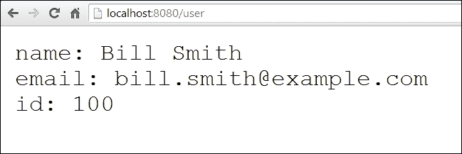
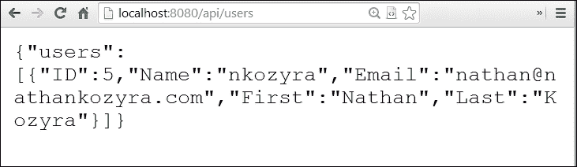

# 第二章：Go 中的 RESTful 服务

当人们通常设计 API 和 Web 服务时，他们通常将它们作为事后思考，或者至少作为大型应用程序的最后一步。

这背后有很好的逻辑——应用程序首先出现，当桌子上没有产品时满足开发人员并不太有意义。因此，通常当应用程序或网站创建时，那就是核心产品，任何额外的 API 资源都是其次的。

随着 Web 近年来的变化，这个系统也有了一些变化。现在，写 API 或 Web 服务然后再写应用程序并不是完全不常见。这通常发生在高度响应的单页应用程序或移动应用程序中，其中结构和数据比演示层更重要。

我们的总体项目——一个社交网络——将展示数据和架构优先的应用程序的性质。我们将拥有一个功能齐全的社交网络，可以在 API 端点上进行遍历和操作。然而，在本书的后面，我们将在演示层上玩一些有趣的东西。

尽管这背后的概念可能被视为完全示范性的，但现实是，这种方法是当今许多新兴服务和应用程序的基础。一个新站点或服务通常会使用 API 进行启动，有时甚至只有 API。

在本章中，我们将讨论以下主题：

+   设计我们的应用程序的 API 策略

+   REST 的基础知识

+   其他 Web 服务架构和方法

+   编码数据和选择数据格式

+   REST 动作及其作用

+   使用 Gorilla 的 mux 创建端点

+   应用程序版本控制的方法

# 设计我们的应用程序

当我们着手构建更大的社交网络应用程序时，我们对我们的数据集和关系有一个大致的想法。当我们将这些扩展到 Web 服务时，我们不仅要将数据类型转换为 API 端点，还要转换关系和操作。

例如，如果我们希望找到一个用户，我们会假设数据保存在一个名为`users`的数据库中，并且我们希望能够使用`/api/users`端点检索数据。这是合理的。但是，如果我们希望获取特定用户呢？如果我们希望查看两个用户是否连接？如果我们希望编辑一个用户在另一个用户的照片上的评论？等等。

这些是我们应该考虑的事情，不仅在我们的应用程序中，也在我们围绕它构建的 Web 服务中（或者在这种情况下，反过来，因为我们的 Web 服务首先出现）。

到目前为止，我们的应用程序有一个相对简单的数据集，所以让我们以这样的方式来完善它，以便我们可以创建、检索、更新和删除用户，以及创建、检索、更新和删除用户之间的关系。我们可以把这看作是在传统社交网络上“加为好友”或“关注”某人。

首先，让我们对我们的`users`表进行一些维护。目前，我们只在`user_nickname`变量上有一个唯一索引，但让我们为`user_email`创建一个索引。考虑到理论上一个人只能绑定一个特定的电子邮件地址，这是一个相当常见和合乎逻辑的安全点。将以下内容输入到您的 MySQL 控制台中：

```go
ALTER TABLE `users`
  ADD UNIQUE INDEX `user_email` (`user_email`);
```

现在我们每个电子邮件地址只能有一个用户。这是有道理的，对吧？

接下来，让我们继续创建用户关系的基础。这些将不仅包括加为好友/关注的概念，还包括屏蔽的能力。因此，让我们为这些关系创建一个表。再次，将以下代码输入到您的控制台中：

```go
CREATE TABLE `users_relationships` (
  `users_relationship_id` INT(13) NOT NULL,
  `from_user_id` INT(10) NOT NULL,
  `to_user_id` INT(10) unsigned NOT NULL,
  `users_relationship_type` VARCHAR(10) NOT NULL,
  `users_relationship_timestamp` DATETIME NOT NULL DEFAULT CURRENT_TIMESTAMP,
  PRIMARY KEY (`users_relationship_id`),
  INDEX `from_user_id` (`from_user_id`),
  INDEX `to_user_id` (`to_user_id`),
  INDEX `from_user_id_to_user_id` (`from_user_id`, `to_user_id`),

  INDEX `from_user_id_to_user_id_users_relationship_type` (`from_user_id`, `to_user_id`, `users_relationship_type`)
)
```

我们在这里做的是为包括各种用户的关系创建了一个表，以及时间戳字段告诉我们关系是何时创建的。

那么，我们现在在哪里？嗯，现在，我们有能力创建、检索、更新和删除用户信息以及用户之间的关系。我们的下一步将是构想一些 API 端点，让我们的网络服务的消费者能够做到这一点。

在上一章中，我们创建了我们的第一个端点，`/api/user/create`和`/api/user/read`。然而，如果我们想要完全控制刚才讨论的数据，我们需要更多。

在那之前，让我们谈谈与网络服务相关的最重要的概念，特别是那些利用 REST 的概念。

# 看看 REST

那么，REST 到底是什么，它从哪里来？首先，REST 代表**表述性状态转移**。这很重要，因为数据（及其元数据）的表述是数据传输的关键部分。

缩写中的**状态**方面有点误导，因为无状态实际上是架构的核心组件。

简而言之，REST 提供了一种简单的、无状态的机制，用于通过 HTTP（以及其他一些协议）呈现数据，这种机制是统一的，并包括缓存指令等控制机制。

这种架构最初是作为罗伊·菲尔丁在加州大学尔湾分校的论文的一部分而产生的。从那时起，它已经被**万维网联盟**（**W3C**）进行了编码和标准化。

一个 RESTful 应用程序或 API 将需要几个重要的组件，我们现在将概述这些组件。

## 在 API 中进行表述

API 最重要的组成部分是我们将作为网络服务一部分传递的数据。通常，它是 JSON、RSS/XML 格式的格式化文本，甚至是二进制数据。

为了设计一个网络服务，确保您的格式与您的数据匹配是一个好习惯。例如，如果您创建了一个用于传递图像数据的网络服务，很容易将这种数据塞进文本格式中。将二进制数据转换为 Base64 编码并通过 JSON 发送并不罕见。

然而，API 的一个重要考虑因素是数据大小的节俭。如果我们以前的例子并将我们的图像数据编码为 Base64，我们最终得到的 API 有效负载将增加近 40%。通过这样做，我们将增加服务的延迟并引入潜在的烦恼。如果我们可以可靠地传输数据，那就没有理由这样做。

模型中的表述也应该起到重要的作用——满足客户端更新、删除或检索特定资源的所有要求。

## 自我描述

当我们说自我描述时，我们也可以将其描述为自包含，以包括 REST 的两个核心组件——响应应该包括客户端每个请求所需的一切，并且应该包括（明确或隐含地）有关如何处理信息的信息。

第二部分涉及缓存规则，我们在第一章中简要提到了*我们在 Go 中的第一个 API*。

提供有关 API 请求中包含的资源的有价值的缓存信息是重要的。这可以消除以后的冗余或不必要的请求。

这也引入了 REST 的无状态性概念。我们的意思是每个请求都是独立存在的。正如前面提到的，任何单个请求都应该包括满足该请求所需的一切。

最重要的是，这意味着放弃普通的 Web 架构的想法，其中您可以设置 cookie 或会话变量。这本质上不是 RESTful。首先，我们的客户端不太可能支持 cookie 或持续会话。但更重要的是，它减少了对任何给定 API 端点所期望的响应的全面和明确的性质。

### 提示

自动化流程和脚本当然可以处理会话，并且它们可以像 REST 的初始提案一样处理它们。这更多是一种演示而不是 REST 拒绝将持久状态作为其精神的一部分的原因。

## URI 的重要性

出于我们稍后将在本章讨论的原因，URI 或 URL 是良好 API 设计中最关键的因素之一。有几个原因：

+   URI 应该是有信息的。我们不仅应该了解数据端点的信息，还应该知道我们可能期望看到的返回数据。其中一些是程序员的习惯用法。例如，`/api/users`会暗示我们正在寻找一组用户，而`/api/users/12345`则表示我们期望获取有关特定用户的信息。

+   URI 不应该在将来中断。很快，我们将讨论版本控制，但这只是一个地方，稳定的资源端点的期望非常重要。如果您的服务的消费者在时间上发现其应用程序中缺少或损坏的链接而没有警告，这将导致非常糟糕的用户体验。

+   无论您在开发 API 或 Web 服务时有多少远见，事情都会发生变化。考虑到这一点，我们应该通过利用 HTTP 状态代码来对现有 URI 指示新位置或错误，而不是允许它们简单地中断。

### HATEOAS

**HATEOAS**代表**超媒体作为应用程序状态的引擎**，是 REST 架构中 URI 的主要约束。其背后的核心原则要求 API 不应引用固定的资源名称或实际的层次结构本身，而应该专注于描述所请求的媒体和/或定义应用程序状态。

### 注意

您可以通过访问 Roy Fielding 的博客[`roy.gbiv.com/untangled/`](http://roy.gbiv.com/untangled/)，阅读有关 REST 及其原始作者定义的要求的更多信息。

# 其他 API 架构

除了 REST，我们还将在本书中查看并实施一些其他常见的 API 和 Web 服务架构。

在大多数情况下，我们将专注于 REST API，但我们还将涉及 SOAP 协议和用于 XML 摄入的 API，以及允许持久性的较新的异步和基于 Web 套接字的服务。

## 远程过程调用

**远程过程调用**，或**RPC**，是一种长期存在的通信方法，构成了后来成为 REST 的基础。虽然仍然有一些使用 RPC 的价值，特别是 JSON-RPC，但我们不会在本书中花太多精力来适应它。

如果您对 RPC 不熟悉，与 REST 相比，其核心区别在于只有一个端点，请求本身定义了 Web 服务的行为。

### 注意

要了解有关 JSON-RPC 的更多信息，请访问[`json-rpc.org/`](http://json-rpc.org/)。

# 选择格式

使用的格式问题曾经是一个比今天更棘手的问题。我们曾经有许多特定于个人语言和开发人员的格式，但 API 世界已经导致这些格式的广度收缩了一些。

Node 和 JavaScript 作为数据传输格式的通用语言的崛起使大多数 API 首先考虑 JSON。 JSON 是一个相对紧凑的格式，现在几乎每种主要语言都有支持，Go 也不例外。

## JSON

以下是一个简单快速的示例，说明 Go 如何使用核心包发送和接收 JSON 数据：

```go
package main

import
(
  "encoding/json"
  "net/http"
  "fmt"
)

type User struct {
  Name string `json:"name"`
  Email string `json:"email"`
  ID int `json:"int"`
}

func userRouter(w http.ResponseWriter, r *http.Request) {
  ourUser := User{}
  ourUser.Name = "Bill Smith"
  ourUser.Email = "bill.smith@example.com"
  ourUser.ID = 100

  output,_ := json.Marshal(&ourUser)
  fmt.Fprintln(w, string(output))
}

func main() {

  fmt.Println("Starting JSON server")
  http.HandleFunc("/user", userRouter)
  http.ListenAndServe(":8080",nil)

}
```

这里需要注意的是`User`结构中变量的 JSON 表示。每当您在重音符号（`` ` ``）字符时，这都代表一个符文。虽然字符串用双引号表示，字符用单引号表示，但重音符号表示应该保持不变的Unicode数据。从技术上讲，该内容保存在`int32`值中。

在一个结构体中，变量/类型声明中的第三个参数被称为标签。这些对于编码是值得注意的，因为它们可以直接翻译为 JSON 变量或 XML 标签。

如果没有标签，我们将直接返回我们的变量名。

## XML

正如前面提到的，XML 曾经是开发者的首选格式。尽管它已经退居幕后，但几乎所有的 API 今天仍然将 XML 作为一个选项呈现出来。当然，RSS 仍然是第一种选择的格式。

正如我们之前在 SOAP 示例中看到的，将数据编组成 XML 是简单的。让我们采用我们在先前 JSON 响应中使用的数据结构，并类似地将其编组成 XML 数据，如下例所示。

我们的 `User` 结构如下所示：

```go

type User struct{
  Name string `xml: "name"`
  Email string `xml: "email"`
  ID int `xml: "id"`
}

```

我们得到的输出如下：

```go

ourUser：= User{}
ourUser.Name = "Bill Smith"
ourUser.Email = "bill.smith@example.com"
ourUser.ID = 100
output，_：= xml.Marshal(&ourUser)
fmt.Fprintln(w, string(output))

```

## YAML

**YAML** 是早期尝试制定的一种类似于 JSON 的人类可读的序列化格式。在名为 `goyaml` 的第三方插件中存在一个友好的 Go 实现。

您可以在 [`godoc.org/launchpad.net/goyaml`](https://godoc.org/launchpad.net/goyaml) 上阅读更多关于 `goyaml` 的信息。要安装 `goyaml`，我们将调用 `go get launchpad.net/goyaml` 命令。

就像在 Go 中内置的默认 XML 和 JSON 方法一样，我们也可以在 YAML 数据上调用 `Marshal` 和 `Unmarshal`。使用我们先前的示例，我们可以相当容易地生成一个 YAML 文档，如下所示：

```go

package main
import (
  "fmt"
  "net/http"
  "launchpad.net/goyaml"
)
type User struct {
  Name string 
  Email string
  ID int
}
func userRouter(w http.ResponseWriter, r *http.Request) {
  ourUser := User{}
  ourUser.Name = "Bill Smith"
  ourUser.Email = "bill.smith@example.com"
  ourUser.ID = 100
  output,_ := goyaml.Marshal(&ourUser)
  fmt.Fprintln(w, string(output))
}
func main() {
  fmt.Println("Starting YAML server")
  http.HandleFunc("/user", userRouter)
  http.ListenAndServe(":8080",nil)
}

```

所获得的输出如下所示：



## CSV

**逗号分隔值**（**CSV**）格式是另一种已经不太流行的老牌格式，但它仍然在一些 API 中存在，尤其是旧的 API。

通常，在当今时代我们不建议使用 CSV 格式，但它对业务应用程序可能特别有用。更重要的是，它是内置到 Go 中的另一种编码格式。

强制将数据转换为 CSV 与在 Go 中将其编组成 JSON 或 XML 没有根本上的区别，因为 `encoding/csv` 包使用与这些子包相同的方法。

# 比较 HTTP 动作和方法

REST 的核心思想之一是数据访问和操作应受动词/方法的限制。

例如，`GET` 请求不应允许用户修改、更新或创建其中的数据。这是有道理的。`DELETE` 也是相当直接的。那么，创建和更新呢？然而，在 HTTP 的命名中并不存在这样的直接翻译的动词。

对于处理这个问题存在一些争论，但通常接受的处理方法是使用 `PUT` 来更新资源，使用 `POST` 来创建资源。

### 注意

这是根据 W3C 协议的 HTTP 1.1 的相关信息：

`POST` 和 `PUT` 请求之间的基本区别反映在请求 URI 的不同含义上。`POST` 请求中的 URI 标识将处理封闭实体的资源。该资源可能是一个接受数据的进程、某种其他协议的网关，或者是一个接受注释的独立实体。相比之下，`PUT` 请求中的 URI 标识了请求中封闭的实体——用户代理知道预期使用的 URI，服务器*不得*尝试将请求应用于其他资源。如果服务器希望请求应用于不同的 URI，它*必须*发送 301（永久移动）响应；然后用户代理可以自行决定是否重定向请求。

因此，如果我们遵循这个规则，我们可以假设以下操作将转换为以下 HTTP 动词：

| 操作 | HTTP 动词 |
| --- | --- |
| 检索数据 | `GET` |
| 创建数据 | `POST` |
| 更新数据 | `PUT` |
| 删除数据 | `DELETE` |

因此，对 `/api/users/1234` 的 `PUT` 请求将告诉我们的 Web 服务，我们正在接受将更新或覆盖 ID 为 `1234` 的用户资源数据的数据。

对 `/api/users/1234` 的 `POST` 请求将告诉我们，我们将根据其中的数据创建一个新的用户资源。

### 注意

把更新和创建方法颠倒是非常常见的，比如用`POST`来更新，用`PUT`来创建。一方面，无论哪种方式都不会太复杂。另一方面，W3C 协议相当明确。

## PATCH 方法与 PUT 方法

那么，在经过上一节的学习后，你可能会认为一切都结束了，对吧？一清二楚？然而，一如既往，总会有一些问题、意想不到的行为和相互冲突的规则。

在 2010 年，有一个关于 HTTP 的提议修改，其中包括了一个 `PATCH` 方法。`PATCH` 和 `PUT` 之间的区别有些微妙，但最简单的解释是，`PATCH` 旨在提供对资源的部分更改，而 `PUT` 则预期提供对资源的完整表示。

`PATCH` 方法还提供了潜力，可以将一个资源“复制”到另一个资源中，并提供修改后的数据。

现在，我们只关注`PUT`，但稍后我们将详细讨论 `PATCH`，特别是当我们深入研究 API 服务器端的 `OPTIONS` 方法时。

# 引入 CRUD

缩写**CRUD** 简单地表示**创建、读取（或检索）、更新和删除**。这些动词可能值得注意，因为它们与我们希望在应用程序中使用的 HTTP 动词非常相似。

正如我们在上一节讨论的那样，大多数这些动词似乎都直接对应着 HTTP 方法。我们说“似乎”，因为在 REST 中有一些点使其不能完全类似。我们稍后会在后面的章节中更详细地讨论这一点。

`CREATE`显然承担了`POST`方法的角色，`RETRIEVE`取代了`GET`，`UPDATE`取代了`PUT`/`PATCH`，而`DELETE`则取代了，额，`DELETE`。

如果我们想要对这些翻译非常认真，我们必须澄清`PUT`和`POST`不是`UPDATE`和`CREATE`的直接类比。从某种意义上说，这与`PUT`和`POST`应该提供哪些操作的混淆有关。这一切都取决于幂等性的关键概念，这意味着任何给定操作应在被调用无数次时以同样的方式作出响应。

### 提示

**幂等性**是数学和计算机科学中某些操作的性质，可以多次应用而不会改变结果超出初始应用。

现在，我们将坚持我们之前的翻译，稍后再回到`PUT`与`POST`的细节。

# 添加更多的端点

现在我们已经找到了一个优雅处理 API 版本的方式，让我们退一步重新审视用户创建。在本章的早些时候，我们创建了一些新数据集，并准备创建相应的端点。

现在你了解了 HTTP 动词的知识后，我们应该通过`POST`方法限制用户创建的访问。我们在第一章构建的示例并不完全只与`POST`请求一起使用。良好的 API 设计应规定我们有一个单一的 URI 用于创建、检索、更新和删除任何给定资源。

考虑到这一切，让我们列出我们的端点及它们应该允许用户实现的功能：

| 端点 | 方法 | 目的 |
| --- | --- | --- |
| `/api` | `OPTIONS` | 用来概括 API 中的可用操作 |
| `/api/users` | `GET` | 返回带有可选过滤参数的用户 |
| `/api/users` | `POST` | 创建用户 |
| `/api/user/123` | `PUT` | 用来更新 ID 为`123`的用户 |
| `/api/user/123` | `DELETE` | 删除 ID 为`123`的用户 |

现在，让我们对第一章中的初始 API 进行快速修改，只允许使用`POST`方法进行用户创建。

记住，我们使用了**Gorilla web toolkit**来进行路由。这对于处理请求中的模式和正则表达式非常有帮助，但现在它也很有帮助，因为它允许基于 HTTP 动词/方法进行区分。

在我们的例子中，我们创建了`/api/user/create`和`/api/user/read`端点，但我们现在知道这不是 REST 的最佳实践。因此，我们现在的目标是将任何用户的资源请求更改为`/api/users`，并将创建限制为`POST`请求以及将检索限制为`GET`请求。

在我们的主函数中，我们将改变我们的处理程序来包含一个方法，并更新我们的端点：

```go

routes := mux.NewRouter()
routes.HandleFunc("/api/users", UserCreate).Methods("POST")
routes.HandleFunc("/api/users", UsersRetrieve).Methods("GET")

```

你会注意到我们还将我们的函数名称更改为`UserCreate`和`UsersRetrieve`。随着我们扩展 API，我们需要易于理解并能直接与我们的资源相关联的方法。

让我们看一下我们的应用程序如何变化：

```go

package main
import (
  "database/sql"
  "encoding/json"
  "fmt"
  _ "github.com/go-sql-driver/mysql"
  "github.com/gorilla/mux"
  "net/http"
  "log"
)
var database *sql.DB

```

到目前为止一切都是一样的——我们需要相同的导入和连接到数据库。然而，以下代码是变化的：

```go

type Users struct {
  Users []User `json:"users"`
}

```

我们正在创建一个用于表示我们的通用`GET`请求`/api/users`的用户组的结构。这提供了一个`User{}`结构的切片：

```go

type User struct {
  ID int "json:id"
  Name  string "json:username"
  Email string "json:email"
  First string "json:first"
  Last  string "json:last"
}
func UserCreate(w http.ResponseWriter, r *http.Request) {
  NewUser := User{}
  NewUser.Name = r.FormValue("user")
  NewUser.Email = r.FormValue("email")
  NewUser.First = r.FormValue("first")
  NewUser.Last = r.FormValue("last")
  output, err := json.Marshal(NewUser)
  fmt.Println(string(output))
  if err != nil {
    fmt.Println("Something went wrong!")
  }
  sql := "INSERT INTO users set user_nickname='" + NewUser.Name + "', user_first='" + NewUser.First + "', user_last='" + NewUser.Last + "', user_email='" + NewUser.Email + "'"
  q, err := database.Exec(sql)
  if err != nil {
    fmt.Println(err)
  }
  fmt.Println(q)
}

```

对于我们实际的用户创建函数，实际上没有太多改变，至少目前是这样。接下来，我们将看一下用户数据检索方法。

```go

func UsersRetrieve(w http.ResponseWriter, r *http.Request) {
  w.Header().Set("Pragma","no-cache")
  rows,_ := database.Query("select * from users LIMIT 10")
  Response 	:= Users{}
  for rows.Next() {
    user := User{}
    rows.Scan(&user.ID, &user.Name, &user.First, &user.Last, &user.Email )
    Response.Users = append(Response.Users, user)
  }
  output,_ := json.Marshal(Response)
  fmt.Fprintln(w,string(output))
}

```

在`UsersRetrieve()`函数中，我们现在正在获取一组用户并将它们扫描到我们的`Users{}`结构中。此时，还没有一个标题给出进一步的细节，也没有任何接受起始点或结果计数的方法。我们将在下一章中做这个。

最后，我们在主函数中有我们的基本路由和 MySQL 连接：

```go

func main() {
  db, err := sql.Open("mysql", "root@/social_network")
  if err != nil {}
  database = db
  routes := mux.NewRouter()
  routes.HandleFunc("/api/users", UserCreate).Methods("POST")
  routes.HandleFunc("/api/users", UsersRetrieve).Methods("GET")
  http.Handle("/", routes)
  http.ListenAndServe(":8080", nil)
}

```

正如前面提到的，`main`中最大的区别在于我们重新命名了我们的函数，并且现在正在使用`HTTP`方法将某些操作归类。因此，即使端点是相同的，我们也能够根据我们的请求是使用`POST`还是`GET`动词来指导服务。

当我们访问`http://localhost:8080/api/users`（默认情况下，是`GET`请求）现在在我们的浏览器中，我们将得到一个我们的用户列表（尽管从技术上讲我们仍然只有一个），如下面的截图所示：



# 处理 API 版本

在我们继续进行 API 之前，值得注意的是对 API 进行版本控制。

当公司更新 API 并更改版本时，他们面临的一个常见问题是在不破坏先前版本的情况下更改版本。这不仅仅是关于有效的 URL，而且还涉及到 REST 和优雅升级的最佳实践。

以我们当前的 API 为例。我们有一个介绍性的`GET`动词来访问数据，例如`/api/users`端点。然而，这实际上应该是版本化 API 的克隆。换句话说，`/api/users`应该与`/api/{current-version}/users`相同。这样，如果我们转移到另一个版本，我们的旧版本仍然受支持，但不在`{current-version}`地址上。

那么，我们如何告诉用户我们已经升级了呢？一种可能性是通过 HTTP 状态码来规定这些更改。这将允许消费者继续使用旧版本访问我们的 API，例如`/api/2.0/users`。这里的请求还将让消费者知道有一个新版本。

我们将在第三章*路由和引导*中创建我们的 API 的新版本。

# 使用链接头允许分页

这是另一个在无状态性方面有时可能难以处理的 REST 点：如何传递对下一组结果的请求？

你可能认为将其作为数据元素做这件事是有道理的。例如：

```go

{ "payload": [ "item","item 2"], "next": "http://yourdomain.com/api/users?page=2" }

```

虽然这样可能有效，但却违反了 REST 的一些原则。首先，除非我们显式返回超文本，否则我们可能不会提供直接的 URL。因此，我们可能不希望将这个值包含在响应体中。

其次，我们应该能够执行更通用的请求，并获取有关其他操作和可用终端的信息。

换句话说，如果我们仅在`http://localhost:8080/api`请求我们的 API，我们的应用程序应向消费者返回有关可能的下一步和所有可用终端的一些基本信息。

实现这一点的方法之一是使用链接标头。**链接**标头只是你与响应一起设置的另一个标头键/值。

### 提示

因为 JSON 响应通常不被认为是 RESTful，因为它们不是超媒体格式。你会发现一些 API 直接在不可靠的格式中嵌入`self`、`rel`和`next`链接头。

JSON 的主要缺点是其无法原生支持超链接。这个问题由 JSON-LD 解决，其中包括联接文档和无状态上下文。

**超文本应用语言**（**HAL**）试图做同样的事情。前者得到了 W3C 的支持，但两者都有支持者。这两种格式扩展了 JSON，虽然我们不会深入探讨任何一种，但你可以修改响应以产生任一格式。

下面是我们如何在`/api/users`的`GET`请求中实现它的方法：


```go

func UsersRetrieve(w http.ResponseWriter, r *http.Request) {
    log.Println("starting retrieval")
    start := 0
    limit := 10
    next := start + limit
    w.Header().Set("Pragma","no-cache")
    w.Header().Set("Link","<http://localhost:8080/api/users?start="+string(next)+"; rel=\"next\"")
    rows,_ := database.Query("select * from users LIMIT 10")
    Response := Users{}
    for rows.Next() {
        user := User{}
        rows.Scan(&user.ID, &user.Name, &user.First, &user.Last, &user.Email )
        Response.Users = append(Response.Users, user)
    }
    output,_ := json.Marshal(Response)
    fmt.Fprintln(w,string(output))
}

```

这告诉客户端去哪里进行进一步的分页。当我们进一步修改这段代码时，我们将包括向前和向后的分页，并响应用户参数。

# 总结

此时，您不仅应该熟悉在 REST 和其他一些协议中创建 API Web 服务的基本思想，还应该熟悉格式和协议的指导原则。

我们在本章中尝试了一些东西，我们将在接下来的几章中更深入地探讨，特别是在 Go 语言本身的各种模板实现中的 MVC。

在下一章中，我们将构建我们初始端点的其余部分，并探索更高级的路由和 URL muxing。
