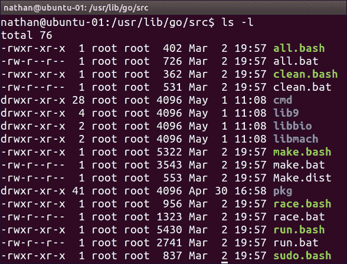
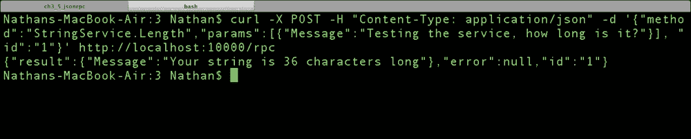
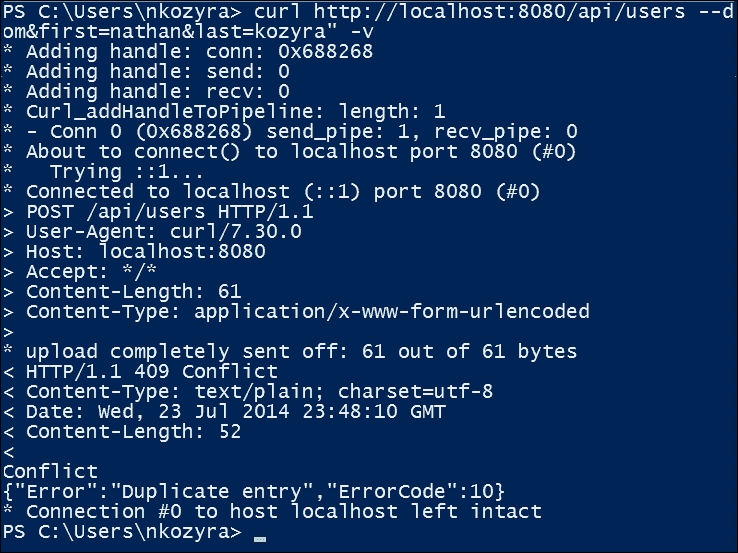

# 第三章。路由和引导

在过去的两章中，您应该已经熟悉了创建 API 端点、后端数据库来存储最重要信息以及通过 HTTP 请求路由和输出数据所需的机制。

对于最后一点，除了我们最基本的示例之外，我们已经使用了一个库来处理我们的 URL 多路复用器。这就是 Gorilla Web Toolkit。尽管这个库（及其相关框架）非常棒，但了解如何直接在 Go 中处理请求是值得的，特别是为了创建涉及条件和正则表达式的更健壮的 API 端点。

虽然我们简要提到了头信息对于 Web 服务消费者的重要性，包括状态代码，但随着我们继续扩展我们的应用程序，我们将开始深入研究一些重要的内容。

控制和指示状态的重要性对于 Web 服务至关重要，特别是（具有悖论性的）在无状态系统中，如 REST。我们说这是一个悖论，因为虽然服务器应该提供有关应用程序状态和每个请求的少量信息，但重要的是允许客户端根据我们所提供的绝对最小和标准机制来理解这一点。

例如，虽然我们可能在列表或 GET 请求中不提供页码，但我们希望确保消费者知道如何导航以获取更多或以前的结果集。

同样，我们可能不提供硬错误消息，尽管它存在，但我们的 Web 服务应该受到一些标准化的约束，因为它涉及我们可以在标头中提供的反馈。

在本章中，我们将涵盖以下主题：

+   扩展 Go 的多路复用器以处理更复杂的请求

+   查看 Gorilla 中更高级的请求

+   在 Gorilla 中引入 RPC 和 Web 套接字

+   处理应用程序和请求中的错误

+   处理二进制数据

我们还将为我们的 Web 应用程序创建一些消费者友好的接口，这将允许我们与我们的社交网络 API 进行交互，以满足需要`PUT`/`POST`/`DELETE`的请求，以及稍后的`OPTIONS`。

通过本章结束时，您应该已经熟悉了在 Go 中编写路由器以及扩展它们以允许更复杂的请求。

# 在 Go 中编写自定义路由器

如前所述，直到这一点，我们一直专注于使用 Gorilla Web Toolkit 来处理 URL 路由和多路复用器，主要是因为 Go 本身内部的`mux`包的简单性。

通过简单性，我们指的是模式匹配是明确的，不允许使用`http.ServeMux`结构进行通配符或正则表达式。

通过直接查看`http.ServeMux`代码的设置，您可以看到这可以使用更多的细微差别：

```go
// Find a handler on a handler map given a path string
// Most-specific (longest) pattern wins
func (mux *ServeMux) match(path string) (h Handler, pattern string) {
  var n = 0
    for k, v := range mux.m {
      if !pathMatch(k, path) {
        continue
      }
      if h == nil || len(k) > n {
        n = len(k)
        h = v.h
        pattern = v.pattern
      }
    }
    return
}
```

这里的关键部分是`!pathMatch`函数，它调用另一个方法，专门检查路径是否与`muxEntry`映射的成员完全匹配：

```go
func pathMatch(pattern, path string) bool {
  if len(pattern) == 0 {
   // should not happen
    return false
  }

  n := len(pattern)
  if pattern[n-1] != '/' {
   return pattern == path
  }
  return len(path) >= n && path[0:n] == pattern
}
```

当然，访问此代码的最好之处之一是，几乎可以毫不费力地扩展它。

有两种方法可以做到这一点。第一种是编写自己的包，几乎可以像扩展包一样使用。第二种是直接修改您的`src`目录中的代码。这种选择的缺点是在升级时可能会被替换并且随后被破坏。因此，这是一个基本上会破坏 Go 语言的选项。

考虑到这一点，我们将选择第一种选项。那么，我们如何扩展`http`包呢？简短的答案是，您实际上不能在不直接进入代码的情况下进行扩展，因此我们需要创建自己的代码，继承与我们将要处理的各种`http`结构相关的最重要的方法。

要开始这个过程，我们需要创建一个新的包。这应该放在你的 Golang `src`目录下的特定域文件夹中。在这种情况下，我们指的是传统意义上的域，但按照惯例也是指 web 目录的意义。

如果你曾经执行过`go get`命令来获取第三方包，你应该熟悉这些约定。你应该在`src`文件夹中看到类似以下截图的内容：



在我们的情况下，我们只需创建一个特定于域的文件夹，用于保存我们的包。或者，你可以在你选择的代码存储库中创建项目，比如 GitHub，并直接从那里导入包，通过`go get`。

不过，现在我们只需在该目录下创建一个子文件夹，我的情况下是`nathankozyra.com`，然后一个名为`httpex`（`http`和`regex`的混成词）的文件夹，用于`http`扩展。

根据你的安装和操作系统，你的导入目录可能不会立即显而易见。要快速查看你的导入包应该在哪里，运行`go env`内部工具。你会在`GOPATH`变量下找到目录。

### 提示

如果你发现你的`go get`命令返回`GOPATH not set`错误，你需要导出`GOPATH`变量。要这样做，只需输入`export GOPATH=/your/directory`（对于 Linux 或 OS X）。在 Windows 上，你需要设置一个环境变量。

最后一个警告是，如果你使用的是 OS X，并且在通过`go get`获取包时遇到困难，你可能需要在`sudo`调用之后包含`-E`标志，以确保你使用的是本地用户的变量，而不是 root 的变量。

为了节省空间，我们不会在这里包含所有必要的代码，以便改装允许正则表达式的`http`包。为此，重要的是将所有的`ServeMux`结构、方法和变量复制到你的`httpex.go`文件中。在大多数情况下，我们会复制所有内容。你需要一些重要的导入包；你的文件应该是这样的：

```go
  package httpex

import
(
  "net/http"
  "sync"
  "sync/atomic"
  "net/url"
  "path"
  "regexp"
)

type ServeMux struct {
  mu    sync.RWMutex
  m     map[string]muxEntry
  hosts bool // whether any patterns contain hostnames
}
```

关键的变化发生在`pathMatch()`函数中，以前需要最长可能字符串的字面匹配。现在，我们将任何`==`相等比较改为正则表达式：

```go
// Does path match pattern?
func pathMatch(pattern, path string) bool {
  if len(pattern) == 0 {
    // should not happen
    return false
  }
  n := len(pattern)
  if pattern[n-1] != '/' {
 match,_ := regexp.MatchString(pattern,path)
 return match
  }
 fullMatch,_ := regexp.MatchString(pattern,string(path[0:n]))
  return len(path) >= n && fullMatch
}
```

如果所有这些看起来都像是重复造轮子，重要的是——就像 Go 中的许多东西一样——核心包在大多数情况下提供了一个很好的起点，但当你发现某些功能缺失时，你不应该犹豫去增强它们。

还有另一种快速而简单的方法来创建自己的`ServeMux`路由器，那就是拦截所有请求并对它们进行正则表达式测试。就像上一个例子一样，这并不理想（除非你希望引入一些未解决的效率问题），但在紧急情况下可以使用。以下代码演示了一个非常基本的例子：

```go
package main

import
(
  "fmt"
  "net/http"
  "regexp"
)
```

同样，我们包含了`regexp`包，以便我们可以进行正则表达式测试：

```go
func main() {

    http.HandleFunc("/", func(w http.ResponseWriter, r *http.Request) {

      path := r.URL.Path
      message := "You have triggered nothing"

      testMatch,_ := regexp.MatchString("/testing[0-9]{3}",path); 

      if (testMatch == true) {
        // helper functions
        message = "You hit the test!"
      }

      fmt.Fprintln(w,message)
    })
```

在这里，我们不是为每个匹配项提供特定的处理程序，而是在单个处理程序中测试`testing[3 digits]`的匹配项，然后根据情况做出反应。

在这种情况下，我们告诉客户端，除非他们匹配模式，否则什么都没有。这个模式显然适用于`/testing123`请求，并且对于任何不匹配这个模式的东西都会失败：

```go
    http.ListenAndServe(":8080", nil)
}
```

最后，我们启动我们的 web 服务器。

# 在 Gorilla 中使用更高级的路由器

现在我们已经玩弄了一下扩展内置包的多路复用，让我们看看 Gorilla 还提供了什么。

除了简单的表达式，我们还可以获取 URL 参数并将其应用到稍后使用的变量中。我们在之前的例子中做到了这一点，但没有提供很多关于我们正在生成的内容的解释。

这是一个示例，我们如何将一个表达式转化为一个变量，用于`httpHandler`函数中：

```go
/api/users/3
/api/users/nkozyra
```

这两种方法都可以作为`GET`请求来处理`users`表中的特定实体。我们可以用以下代码来处理任何一种情况：

```go
mux := mux.NewRouter()
mux.HandleFunc("/api/users/[\w+\d+]", UserRetrieve)
```

然而，我们需要保留最后一个值以供我们的查询使用。为此，Gorilla 允许我们将该表达式设置为映射中的一个键。在这种情况下，我们可以用以下代码来解决这个问题：

```go
mux.HandleFunc("/api/users/{key}", UserRetrieve)
```

这将允许我们通过以下代码从我们的处理程序中提取该值：

```go
variables := mux.Vars(r)
key := variables["key"]
```

你会注意到我们在这里使用了`"key"`而不是一个表达式。你可以在这里都做，这样你就可以将一个正则表达式设置为一个键。例如，如果我们的用户键变量由字母、数字和破折号组成，我们可以这样设置：

```go
r.HandleFunc("/api/users/{key:[A-Za-z0-9\-]}",UserRetrieve
```

而且，在我们的`UserRetrieve`函数中，我们可以直接提取该键（或者我们添加到`mux`包中的任何其他键）：

```go
func UserRetrieve(w http.ResponseWriter, r *http.Request) {
  urlParams := mux.Vars(r)
  key := vars["key"]
}
```

# 使用 Gorilla 进行 JSON-RPC

你可能还记得第二章中我们简要介绍了 RPC，并承诺会回到它。

以 REST 作为我们的主要 Web 服务交付方法，我们将继续限制我们对 RPC 和 JSON-RPC 的了解。然而，现在是一个很好的时机来演示我们如何可以使用 Gorilla 工具包非常快速地创建 RPC 服务。

对于这个例子，我们将接受一个字符串，并通过 RPC 消息返回字符串中的总字符数：

```go
package main

import (
  "github.com/gorilla/rpc"
  "github.com/gorilla/rpc/json"
  "net/http"
  "fmt"
  "strconv"
  "unicode/utf8"
)

type RPCAPIArguments struct {
  Message string
}

type RPCAPIResponse struct {
  Message string
}

type StringService struct{}

func (h *StringService) Length(r *http.Request, arguments *RPCAPIArguments, reply *RPCAPIResponse) error {
  reply.Message = "Your string is " + fmt.Sprintf("Your string is %d chars long", utf8.RuneCountInString(arguments.Message)) + " characters long"
  return nil
}

func main() {
  fmt.Println("Starting service")
  s := rpc.NewServer()
  s.RegisterCodec(json.NewCodec(), "application/json")
  s.RegisterService(new(StringService), "")
  http.Handle("/rpc", s)
  http.ListenAndServe(":10000", nil)
}
```

关于 RPC 方法的一个重要说明是，它需要被导出，这意味着一个函数/方法必须以大写字母开头。这是 Go 对一个概念的处理方式，它在某种程度上类似于`public`/`private`。如果 RPC 方法以大写字母开头，它就会被导出到该包的范围之外，否则它基本上是`private`。



在这种情况下，如果你调用方法`stringService`而不是`StringService`，你会得到响应**找不到服务 stringService**。

# 使用服务进行 API 访问

当涉及构建和测试我们的 Web 服务时，我们将迅速遇到的一个问题是直接处理`POST`/`PUT`/`DELETE`请求，以确保我们的特定于方法的请求能够按我们的预期进行。

有几种方法可以轻松处理这个问题，而不必移动到另一台机器或构建复杂的东西。

第一种方法是我们的老朋友 cURL。迄今为止，cURL 是最受欢迎的一种通过各种协议进行网络请求的方法，它简单易用，并且几乎支持你能想到的任何语言。

### 注意

Go 中没有单独的内置 cURL 组件。然而，这在很大程度上遵循了 Go 开发人员似乎最感兴趣的精简、集成的语言设计理念。

然而，你可以看一下一些第三方解决方案：

+   `go-curl`，由 ShuYu Wang 提供的绑定，可以在[`github.com/andelf/go-curl`](https://github.com/andelf/go-curl)上找到。

+   `go-av`，一种更简单的方法，带有`http`绑定，可以在[`github.com/go-av/curl`](https://github.com/go-av/curl)上找到。

然而，为了测试，我们可以简单直接地从命令行使用 cURL。这很简单，所以构造请求既不难也不费力。

以下是我们可以使用`POST` `http`方法向`/api/users`的创建方法发出的示例调用： 

```go
curl http://localhost:8080/api/users --data "name=nkozyra&email=nkozyra@gmail.com&first=nathan&last=nathan"

```

请记住，我们已经在我们的数据库中有了这个用户，并且它是一个唯一的数据库字段，我们只需修改我们的`UserCreate`函数就可以返回一个错误。请注意，在下面的代码中，我们将我们的响应更改为一个新的`CreateResponse`结构，目前只包括一个错误字符串：

```go
  type CreateResponse struct {
    Error string "json:error"
  }
```

现在，我们来调用它。如果我们从数据库得到一个错误，我们将把它包含在我们的响应中，至少目前是这样；不久之后，我们将研究翻译。否则，它将是空的，我们可以（目前）假设用户已经成功创建。我们说*目前*，因为根据我们的请求成功或失败，我们需要向我们的客户提供更多的信息：

```go
  func UserCreate(w http.ResponseWriter, r *http.Request) {

    NewUser := User{}
    NewUser.Name = r.FormValue("user")
    NewUser.Email = r.FormValue("email")
    NewUser.First = r.FormValue("first")
    NewUser.Last = r.FormValue("last")
    output, err := json.Marshal(NewUser)
    fmt.Println(string(output))
    if err != nil {
      fmt.Println("Something went wrong!")
    }

    Response := CreateResponse{}
    sql := "INSERT INTO users SET user_nickname='" + NewUser.Name + "', user_first='" + NewUser.First + "', user_last='" + NewUser.Last + "', user_email='" + NewUser.Email + "'"
    q, err := database.Exec(sql)
    if err != nil {
      Response.Error = err.Error()
    }
    fmt.Println(q)
    createOutput,_ := json.Marshal(Response)
    fmt.Fprintln(w,string(createOutput))
  }
```

如果我们尝试通过 cURL 请求创建重复的用户，它看起来是这样的：

```go
> curl http://localhost:8080/api/users –data "name=nkozyra&email=nkozyra@gmail.com&first=nathan&last=nathan"
{"Error": "Error 1062: Duplicate entry '' for key 'user nickname'"}

```

# 使用简单的接口访问 API

我们还可以通过一个简单的带有表单的网页迅速实现命中我们的 API 的接口。当然，这是许多 API 被访问的方式——直接由客户端访问而不是由服务器端处理。

尽管我们并不建议这是我们的社交网络应用程序在实践中应该工作的方式，但它为我们提供了一种简单的可视化应用程序的方式：

```go
<!DOCTYPE html>
<html lang="en">
  <head>
    <meta charset="utf-8">
    <title>API Interface</title>
    <script src="img/jquery.min.js"></script>
    <link href="http://maxcdn.bootstrapcdn.com/bootstrap/3.2.0/css/bootstrap.min.css" rel="stylesheet">
    <script src="img/bootstrap.min.js"></xscript>
    <link rel="stylesheet" href="style.css">
    <script src="img/script.js"></script>
  </head>
  <body>

  <div class="container">
      <div class="row">
  <div class="col-12-lg">
        <h1>API Interface</h1>
    <div class="alert alert-warning" id="api-messages" role="alert"></div>

    <ul class="nav nav-tabs" role="tablist">
      <li class="active"><a href="#create" role="tab" data-toggle="tab">Create User</a></li>
    </ul>

    <div class="tab-content">
      <div class="tab-pane active" id="create">

      <div class="form-group">
      <label for="createEmail">Email</label>
      <input type="text" class="form-control" id="createEmail" placeholder="Enter email">
      </div>
      <div class="form-group">
      <label for="createUsername">Username</label>
      <input type="text" class="form-control" id="createUsername" placeholder="Enter username">
      </div>
      <div class="form-group">
            <label for="createFirst">First Name</label>
      <input type="text" class="form-control" id="createFirst" placeholder="First Name">
      </div>
      <div class="form-group">
      <label for="createLast">Last Name</label>
      <input type="text" class="form-control" id="createLast" placeholder="Last Name">
      </div>

      <button type="submit" onclick="userCreate();" class="btn btn-success">Create</button>

      </div>

    </div>
  </div>
  </div>

  </div>

  <script>

  function userCreate() {
    action = "http://localhost:8080/api/users";
    postData = {};
    postData.email  = $('#createEmail').val();
    postData.user  = $('#createUsername').val();
    postData.first  = $('#createFirst').val();
    postData.last = $('#createLast').val();

    $.post(action,postData,function(data) {
      if (data.error) {
        $('.alert').html(data.error);
        $('.alert').alert();
      }
    },'jsonp');
  }

  $(document).ready(function() {
    $('.alert').alert('close');

  });
  </script>
  </body>
</html>
```

当这个被渲染时，我们将有一个快速的基本可视化表单，用于将数据输入到我们的 API 中，以及返回有价值的错误信息和反馈。

### 提示

由于跨域限制，您可能希望从与我们的 API 服务器相同的端口和域运行此文件，或者在服务器文件本身的每个请求中包含此标头：

```go
w.Header().Set("Access-Control-Allow-Origin","http://localhost:9000")
```

这里，`http://localhost:9000`代表请求的来源服务器。

我们渲染的 HTML 演示如下：

使用简单的接口访问 API

# 返回有价值的错误信息

在上次请求中返回错误时，我们只是代理了 MySQL 错误并将其传递。不过这并不总是有帮助，因为似乎至少需要对 MySQL 有一定的了解才能为客户端提供有价值的信息。

当然，MySQL 本身有一个相当清晰和简单的错误消息系统，但关键是它是特定于 MySQL 而不是我们的应用程序。

如果您的客户端不理解“重复条目”是什么意思怎么办？如果他们不会说英语怎么办？您会翻译消息，还是会告诉所有依赖项每个请求返回什么语言？现在您可以看到为什么这可能会变得繁琐。

大多数 API 都有自己的错误报告系统，即使只是为了控制消息。虽然最理想的是根据请求头的语言返回语言，但如果不能，返回错误代码也是有帮助的，这样你（或其他方）可以在以后提供翻译。

然后还有通过 HTTP 状态代码返回的最关键的错误。默认情况下，我们使用 Go 的`http`包生成了一些这样的错误，因为对无效资源的任何请求都会提供一个标准的 404 **未找到**消息。

但是，还有一些特定于 REST 的错误代码，我们很快就会介绍。目前，有一个与我们的错误相关的错误代码：409。

### 注意

根据 W3C 的 RFC 2616 协议规范，我们可以发送一个表示冲突的 409 代码。以下是规范的说明：

由于资源的当前状态与请求的冲突，请求无法完成。此代码仅允许在预期用户可能能够解决冲突并重新提交请求的情况下使用。响应正文应包含足够的信息，以便用户识别冲突的来源。理想情况下，响应实体将包含足够的信息，以便用户或用户代理程序解决问题；但这可能是不可能的，也不是必需的。

冲突最有可能发生在对`PUT`请求的响应中。例如，如果正在使用版本控制，并且`PUT`的实体包含与之前（第三方）请求所做的更改冲突的资源更改，服务器可能使用 409 响应来指示它无法完成请求。在这种情况下，响应实体可能包含两个版本之间差异的列表，格式由响应`Content-Type`定义。

考虑到这一点，让我们首先检测一个指示现有记录并阻止创建新记录的错误。

不幸的是，Go 并没有返回特定的数据库错误代码，但至少对于 MySQL 来说，如果我们知道使用的模式，提取错误就足够简单了。

使用以下代码，我们将构建一个解析器，将 MySQL 错误字符串分割成两个组件并返回一个整数错误代码：

```go
  func dbErrorParse(err string) (string, int64) {
    Parts := strings.Split(err, ":")
    errorMessage := Parts[1]
    Code := strings.Split(Parts[0],"Error ")
    errorCode,_ := strconv.ParseInt(Code[1],10,32)
    return errorMessage, errorCode
  }
```

我们还将用错误状态码来增强我们的`CreateResponse`结构，表示如下：

```go
  type CreateResponse struct {
    Error string "json:error"
    ErrorCode int "json:code"
  }
```

我们还将把 MySQL 的响应和消息转换成一个`CreateResponse`结构，通过改变`UsersCreate`函数中的错误响应行为：

```go
    if err != nil {
      errorMessage, errorCode := dbErrorParse( err.Error() )
      fmt.Println(errorMessage)
      error, httpCode, msg := ErrorMessages(errorCode)
      Response.Error = msg
      Response.ErrorCode = error
      fmt.Println(httpCode)
    }
```

您会注意到我们之前定义的`dbErrorParse`函数。我们将从中获取的结果注入到一个`ErrorMessages`函数中，该函数返回有关任何给定错误的细致信息，而不仅仅是数据库错误：

```go
type ErrMsg struct {
    ErrCode int
    StatusCode int
    Msg string
}
func ErrorMessages(err int64) (ErrMsg) {
    var em ErrMsg{}
    errorMessage := ""
    statusCode := 200;
    errorCode := 0
    switch (err) {
      case 1062:
        errorMessage = "Duplicate entry"
        errorCode = 10
        statusCode = 409
    }

    em.ErrCode = errorCode
    em.StatusCode = statusCode
    em.Msg = errorMsg

    return em

  }
```

目前，这还比较简单，只处理一种类型的错误。随着我们的进展，我们将扩展这一点，并添加更多的错误处理机制和消息（以及尝试翻译表）。

关于 HTTP 状态码，我们还需要做最后一件事。设置 HTTP 状态码的最简单方法是通过`http.Error()`函数：

```go
      http.Error(w, "Conflict", httpCode)
```

如果我们把这放在我们的错误条件块中，我们将返回从`ErrorMessages()`函数接收到的任何状态码：

```go
    if err != nil {
      errorMessage, errorCode := dbErrorParse( err.Error() )
      fmt.Println(errorMessage)
            error, httpCode, msg := ErrorMessages(errorCode)
      Response.Error = msg
      Response.ErrorCode = error
      http.Error(w, "Conflict", httpCode)
    }
```

使用 cURL 和 verbose 标志（`-v`）再次运行这个命令，将会给我们提供关于错误的额外信息，如下面的截图所示：



# 处理二进制数据

首先，我们需要在 MySQL 中创建一个新的字段来容纳图像数据。在这种情况下，我们可以选择`BLOB`数据，它接受大量的任意二进制数据。为此，我们可以假设（或强制）图像不应超过 16MB，因此`MEDIUMBLOB`将处理我们提供的所有数据：

```go
ALTER TABLE `users`
  ADD COLUMN `user_image` MEDIUMBLOB NOT NULL AFTER `user_email`;
```

现在我们的图像列已经就位，我们可以接受数据。在我们的表单中添加另一个字段来存储图像数据：

```go
<div class="form-group">
<label for="createLast">Image</label>
<input type="file" class="form-control" name="image" id="createImage" placeholder="Image">
</div>
```

在我们的服务器中，我们可以进行一些快速的修改来接受这个数据。首先，我们应该从表单中获取文件数据本身，如下所示：

```go
    f, _, err := r.FormFile("image1")
    if err != nil { 
      fmt.Println(err.Error())
    }
```

接下来，我们想要读取整个文件并将其转换为一个字符串：

```go
    fileData,_ := ioutil.ReadAll(f)
```

然后，我们将把它打包成一个`base64`编码的文本表示我们的图像数据：

```go
    fileString := base64.StdEncoding.EncodeToString(fileData)
```

最后，我们在查询中加入新用户图像数据：

```go
sql := "INSERT INTO users set user_image='" + fileString + "',  user_nickname='"
```

### 注

我们将在我们关于安全性的最后一章中回顾一下这里组装的一些 SQL 语句。

# 总结

三章之后，我们已经有了一个简单的社交网络应用程序的框架，我们可以在 REST 和 JSON-RPC 中复制。我们还花了一些时间来正确地将错误传递给 REST 中的客户端。

在我们的下一章中，《在 Go 中设计 API》，我们将真正开始完善我们的社交网络，并探索其他 Go 包，这些包对于拥有一个强大、健壮的 API 是相关的。

此外，我们将引入一些其他库和外部服务，以帮助在用户和他们的关系之间建立连接时提供详细的响应。

最后，我们还将开始尝试使用 Web 套接字，以便在 Web 上为客户端提供更交互式的体验。最后，我们将处理二进制数据，允许我们的客户端通过我们的 API 上传图像。
