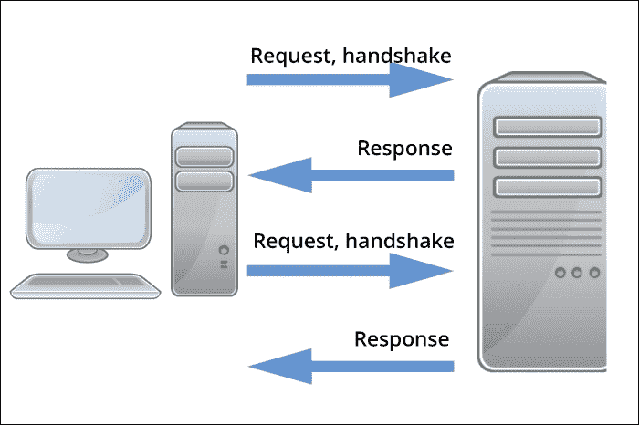
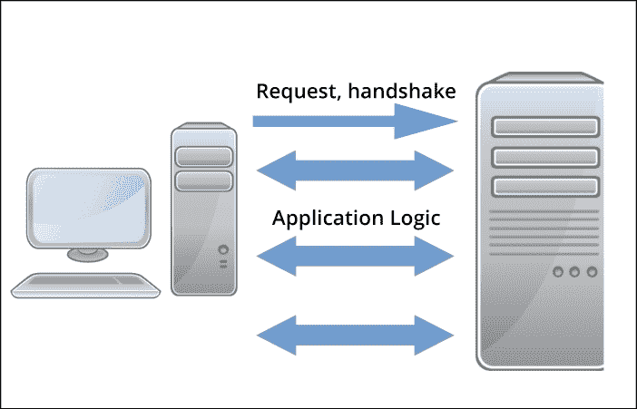
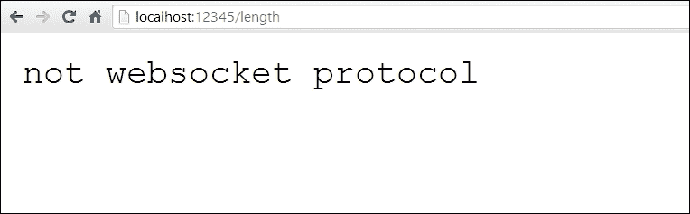
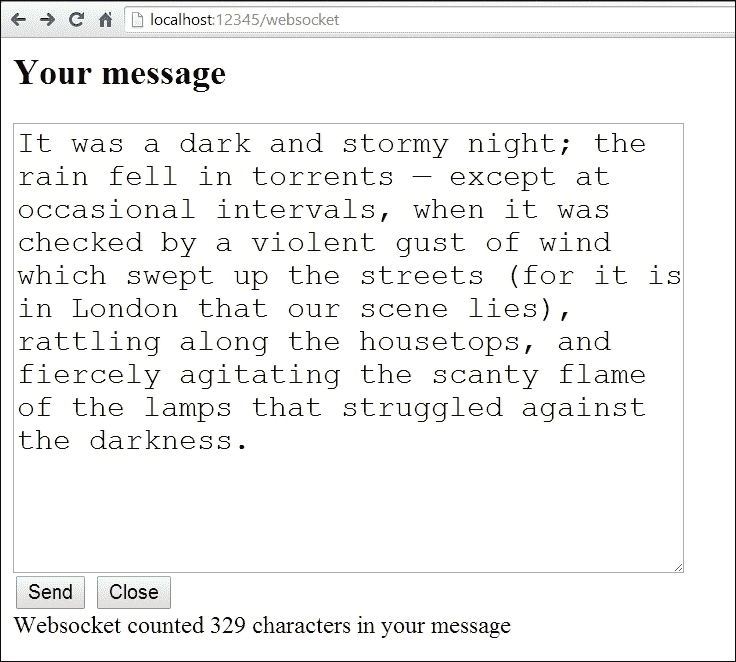

# 第四章：在 Go 中设计 API

我们现在已经完成了 REST 的基础知识，处理 URL 路由和在 Go 中进行多路复用，无论是直接还是通过框架。

希望创建我们的 API 的框架已经有所帮助和启发，但是如果我们要设计一个功能齐全的符合 REST 标准的 Web 服务，我们需要填补一些重要的空白。主要是，我们需要处理版本、所有端点和`OPTIONS`头，以及以一种优雅且易于管理的方式处理多种格式。

我们将完善我们想要为基于 API 的应用程序制定的端点，该应用程序允许客户端获取关于我们应用程序的所有信息，以及创建和更新用户，并提供与这些端点相关的有价值的错误信息。

在本章结束时，您还应该能够在 REST 和 WebSocket 应用程序之间切换，因为我们将构建一个非常简单的 WebSocket 示例，并带有内置的客户端测试界面。

在本章中，我们将涵盖以下主题：

+   概述和设计我们完整的社交网络 API

+   处理代码组织和 API 版本控制的基础知识

+   允许我们的 API 使用多种格式（XML 和 JSON）

+   仔细研究 WebSockets 并在 Go 中实现它们

+   创建更健壮和描述性的错误报告

+   通过 API 更新用户记录

在本章结束时，您应该能够优雅地处理 REST Web 服务的多种格式和版本，并更好地理解如何在 Go 中利用 WebSockets。

# 设计我们的社交网络 API

现在我们已经通过让 Go 输出我们 Web 服务中的数据来初步了解了一些，现在要采取的一个重要步骤是充分完善我们希望我们的主要项目的 API 要做什么。

由于我们的应用程序是一个社交网络，我们不仅需要关注用户信息，还需要关注连接和消息传递。我们需要确保新用户可以与某些群体共享信息，建立和修改连接，并处理身份验证。

考虑到这一点，让我们勾画出我们接下来可能的 API 端点，以便我们可以继续构建我们的应用程序：

| 端点 | 方法 | 描述 |
| --- | --- | --- |
| `/api/users` | `GET` | 返回带有可选参数的用户列表 |
| `/api/users` | `POST` | 创建用户 |
| `/api/users/XXX` | `PUT` | 更新用户信息 |
| `/api/users/XXX` | `DELETE` | 删除用户 |
| `/api/connections` | `GET` | 返回基于用户的连接列表 |
| `/api/connections` | `POST` | 创建用户之间的连接 |
| `/api/connections/XXX` | `PUT` | 修改连接 |
| `/api/connections/XXX` | `DELETE` | 删除用户之间的连接 |
| `/api/statuses` | `GET` | 获取状态列表 |
| `/api/statuses` | `POST` | 创建状态 |
| `/api/statuses/XXX` | `PUT` | 更新状态 |
| `/api/statuses/XXX` | `DELETE` | 删除状态 |
| `/api/comments` | `GET` | 获取评论列表 |
| `/api/comments` | `POST` | 创建评论 |
| `/api/comments/XXX` | `PUT` | 更新评论 |
| `/api/comments/XXX` | `DELETE` | 删除评论 |

在这种情况下，`XXX` 存在的任何地方都是我们将作为 URL 端点的一部分提供唯一标识符的地方。

您会注意到我们已经转移到了所有复数端点。这在很大程度上是一种偏好，许多 API 同时使用（或仅使用）单数端点。复数化端点的优势与命名结构的一致性有关，这使开发人员能够进行可预测的调用。使用单数端点可以作为一种简写方式来表达 API 调用只会处理单个记录。

这些端点中的每一个都反映了与数据点的潜在交互。还有一组我们将包括的端点，它们不反映与我们的数据的交互，而是允许我们的 API 客户端通过 OAuth 进行身份验证：

| 端点 | 方法 | 描述 |
| --- | --- | --- |
| `/api/oauth/authorize` | `GET` | 返回带有可选参数的用户列表 |
| `/api/oauth/token` | `POST` | 创建用户 |
| `/api/oauth/revoke` | `PUT` | 更新用户信息 |

如果你对 OAuth 不熟悉，现在不用担心，因为当我们介绍认证方法时，我们将会更深入地了解它。

### 提示

**OAuth**，即**开放认证**，诞生于需要创建一个用于验证 OpenID 用户的系统的需求，OpenID 是一个分散的身份系统。

OAuth2 出现时，系统已经大规模改进，更加安全，并且不再专注于特定的集成。如今，许多 API 依赖并要求 OAuth 来访问并代表用户通过第三方进行更改。

完整的规范文档（RFC6749）可以在互联网工程任务组的网站上找到：[`tools.ietf.org/html/rfc6749`](http://tools.ietf.org/html/rfc6749)。

前面提到的端点代表了我们构建一个完全基于 Web 服务运行的极简社交网络所需的一切。我们也将为此构建一个基本的界面，但主要是专注于在 Web 服务层面构建、测试和调优我们的应用程序。

我们不会在这里讨论`PATCH`请求，正如我们在上一章中提到的，它指的是对数据的部分更新。

在下一章中，我们将增强我们的 Web 服务，允许`PATCH`更新，并且我们将概述我们所有的端点作为我们`OPTIONS`响应的一部分。

# 处理我们的 API 版本

如果你花费了大量时间处理互联网上的 Web 服务和 API，你会发现各种服务处理其 API 版本的方式存在很大的差异。

并非所有这些方法都特别直观，而且通常它们会破坏向前和向后的兼容性。你应该尽量以最简单的方式避免这种情况。

考虑一个默认情况下在 URI 中使用版本控制的 API：`/api/v1.1/users`。

你会发现这是相当常见的；例如，这就是 Twitter 处理 API 请求的方式。

这种方法有一些优点和缺点，因此你应该考虑你的 URI 方法可能存在的缺点。

通过明确定义 API 版本，就没有默认版本，这意味着用户总是拥有他们所请求的版本。好处是你不会通过升级来破坏任何人的 API。坏处是用户可能不知道哪个版本是最新的，除非明确检查或验证描述性的 API 消息。

正如你可能知道的，Go 不允许有条件的导入。虽然这是一个设计决策，使得诸如`go fmt`和`go fix`等工具能够快速而优雅地工作，但有时会妨碍应用程序的设计。

例如，在 Go 中直接实现这样的功能是不可能的：

```go
if version == 1 {
  import "v1"
} else if version == 2 {
  import "v2"
}
```

不过，我们可以在这方面做一些变通。让我们假设我们的应用程序结构如下：

```go
socialnetwork.go
/{GOPATH}/github.com/nkozyra/gowebservice/v1.go
/{GOPATH}/github.com/nkozyra/gowebservice/v2.go

```

然后我们可以按如下方式导入每个版本：

```go
import "github.com/nkozyra/gowebservice/v1"
import "github.com/nkozyra/gowebservice/v2"

```

当然，这也意味着我们需要在我们的应用程序中使用它们，否则 Go 将触发编译错误。

维护多个版本的示例如下所示：

```go
package main

import
(
  "nathankozyra.com/api/v1"
  "nathankozyra.com/api/v2"
)

func main() {

  v := 1

  if v == 1 {
    v1.API()
    // do stuff with API v1
  } else {
    v2.API()
    // do stuff with API v2
  }

}
```

这种设计决定的不幸现实是，你的应用程序将违反编程的基本规则之一：*不要重复代码*。

当然，这不是一个硬性规则，但重复代码会导致功能蔓延、碎片化和其他问题。只要我们在各个版本中做相同的事情，我们就可以在一定程度上缓解这些问题。

在这个例子中，我们的每个 API 版本都将导入我们的标准 API 服务和路由文件，如下面的代码所示：

```go
package v2

import
(
  "nathankozyra.com/api/api"
)

type API struct {

}

func main() {
  api.Version = 1
  api.StartServer()
}
```

当然，我们的 v2 版本将几乎与不同版本相同。基本上，我们使用这些作为包装器，引入我们的重要共享数据，如数据库连接、数据编组等等。

为了演示这一点，我们可以将一些我们的基本变量和函数放入我们的`api.go`文件中：

```go
package api

import (
  "database/sql"
  "encoding/json"
  "fmt"
  _ "github.com/go-sql-driver/mysql"
  "github.com/gorilla/mux"
  "net/http"
  "log"
)

var Database *sql.DB

type Users struct {
  Users []User `json:"users"`
}

type User struct {
  ID int "json:id"
  Name  string "json:username"
  Email string "json:email"
  First string "json:first"
  Last  string "json:last"
}

func StartServer() {

  db, err := sql.Open("mysql", "root@/social_network")
  if err != nil {
  }
  Database = db
  routes := mux.NewRouter()

  http.Handle("/", routes)
  http.ListenAndServe(":8080", nil)
}
```

如果这看起来很熟悉，那是因为它是我们在上一章中尝试 API 时所拥有的核心，这里为了节省空间而剥离了一些路由。

现在也是一个好时机提到一个有趣的第三方包，用于处理基于 JSON 的 REST API——**JSON API Server**（**JAS**）。 JAS 位于 HTTP 之上（就像我们的 API 一样），但通过自动将请求定向到资源来自动化了许多路由。

### 提示

JSON API Server 或 JAS 允许在 HTTP 包之上使用一组简单的特定于 JSON 的 API 工具，以最小的影响增强您的 Web 服务。

您可以在[`github.com/coocood/jas`](https://github.com/coocood/jas)上阅读更多信息。

您可以通过使用以下命令在 Go 中安装它：`go get github.com/coocood/jas`。以多种格式交付我们的 API

在这个阶段，形式化我们处理多种格式的方式是有意义的。在这种情况下，我们处理 JSON、RSS 和通用文本。

我们将在下一章讨论模板时涉及通用文本，但现在我们需要能够分开我们的 JSON 和 RSS 响应。

这样做的最简单方法是将我们的任何资源都视为接口，然后根据请求参数协商数据的编组。

一些 API 直接在 URI 中定义格式。我们也可以在我们的 mux 路由中相当容易地这样做（如下面的示例所示）：

```go
  Routes.HandleFunc("/api.{format:json|xml|txt}/user", UsersRetrieve).Methods("GET")
```

上述代码将允许我们直接从 URL 参数中提取请求的格式。然而，当涉及到 REST 和 URI 时，这也是一个敏感的问题。虽然双方都有一些争论，但出于我们的目的，我们将简单地将格式用作查询参数。

在我们的`api.go`文件中，我们需要创建一个名为`Format`的全局变量：

```go
var Format string
```

以及一个我们可以用来确定每个请求的格式的函数：

```go
func GetFormat(r *http.Request) {

  Format = r.URL.Query()["format"][0]

}
```

我们将在每个请求中调用它。虽然前面的选项自动限制为 JSON、XML 或文本，但我们也可以将其构建到应用逻辑中，并包括对`Format`的回退，如果它不匹配可接受的选项。

我们可以使用通用的`SetFormat`函数来根据当前请求的数据格式进行数据编组：

```go
func SetFormat( data interface{} )  []byte {

  var apiOutput []byte
  if Format == "json" {
    output,_ := json.Marshal(data)
    apiOutput = output
  }else if Format == "xml" {
    output,_ := xml.Marshal(data)
    apiOutput = output
  }
  return apiOutput
}
```

在我们的任何端点函数中，我们可以返回作为接口传递给`SetFormat()`的任何数据资源：

```go
func UsersRetrieve(w http.ResponseWriter, r *http.Request) {
  log.Println("Starting retrieval")
  GetFormat(r)
  start := 0
  limit := 10

  next := start + limit

  w.Header().Set("Pragma","no-cache")
  w.Header().Set("Link","<http://localhost:8080/api/users?start="+string(next)+"; rel=\"next\"")

  rows,_ := Database.Query("SELECT * FROM users LIMIT 10")
  Response:= Users{}

  for rows.Next() {

    user := User{}
    rows.Scan(&user.ID, &user.Name, &user.First, &user.Last, &user.Email )

    Response.Users = append(Response.Users, user)
  }
    output := SetFormat(Response)
  fmt.Fprintln(w,string(output))
}
```

这使我们能够从响应函数中删除编组。现在我们已经相当牢固地掌握了将数据编组为 XML 和 JSON，让我们重新审视另一种用于提供 Web 服务的协议。

# 并发 WebSockets

如前一章所述，WebSocket 是一种保持客户端和服务器之间开放连接的方法，通常用于替代浏览器到客户端的多个 HTTP 调用，也用于两个可能需要保持半可靠恒定连接的服务器之间。

使用 WebSockets 的优势是减少客户端和服务器的延迟，并且对于构建长轮询应用程序的客户端解决方案来说，架构通常更少复杂。

为了概述优势，请考虑以下两种表示形式；第一个是标准 HTTP 请求：



现在将这与更简化的 WebSocket 请求通过 TCP 进行比较，这消除了多次握手和状态控制的开销：



您可以看到传统 HTTP 呈现了可以妨碍长期应用的冗余和延迟级别。

可以肯定的是，严格意义上只有 HTTP 1 才有这个问题。HTTP 1.1 引入了保持活动或持久性连接。虽然这在协议方面起作用，但大多数非并发的 Web 服务器在资源分配方面会遇到困难。例如，默认情况下，Apache 会将保持活动超时设置得非常低，因为长时间的连接会占用线程并阻止未来的请求在合理的时间内完成。

HTTP 的现在和未来提供了一些 WebSocket 的替代方案，主要是由 Google 主要开发的 SPDY 协议提出的一些重要选项。

虽然 HTTP 2.0 和 SPDY 提供了在不关闭连接的情况下复用连接的概念，特别是在 HTTP 管线化方法中，但目前还没有广泛的客户端支持。目前，如果我们从 Web 客户端访问 API，WebSockets 提供了更多的客户端可预测性。

应该注意的是，跨 Web 服务器和负载均衡器的 SPDY 支持仍然在很大程度上是实验性的。买方自负。

虽然 REST 仍然是我们 API 和演示的主要目标，但在以下代码中，您会发现一个非常简单的 WebSocket 示例，它接受一条消息并返回该消息在传输过程中的长度：

```go
package main

import (

    "fmt"
    "net/http"
    "code.google.com/p/go.net/websocket"
    "strconv"
)

var addr = ":12345"

func EchoLengthServer(ws *websocket.Conn) {

    var msg string

    for {
      websocket.Message.Receive(ws, &msg)
      fmt.Println("Got message",msg)
      length := len(msg)
      if err := websocket.Message.Send(ws, strconv.FormatInt(int64(length), 10) )  ; err != nil {
          fmt.Println("Can't send message length")
          break
        }
    }
```

请注意这里的循环；在`EchoLengthServer`函数中保持此循环运行非常重要，否则您的 WebSocket 连接将立即在客户端关闭，从而阻止未来的消息。

```go
}

func websocketListen() {

    http.Handle("/length", websocket.Handler(EchoLengthServer))
    err := http.ListenAndServe(addr, nil)
    if err != nil {
        panic("ListenAndServe: " + err.Error())
    }

}
```

这是我们的主要套接字路由器。我们正在监听端口`12345`并评估传入消息的长度，然后返回它。请注意，我们实质上将`http`处理程序*转换*为`websocket`处理程序。这在这里显示：

```go
func main() {

    http.HandleFunc("/websocket", func(w http.ResponseWriter, r *http.Request) {
        http.ServeFile(w, r, "websocket.html")
    })
    websocketListen()

}
```

最后一部分，除了实例化 WebSocket 部分外，还提供了一个平面文件。由于一些跨域策略问题，测试 WebSocket 示例的客户端访问和功能可能会很麻烦，除非两者在同一域和端口上运行。

为了管理跨域请求，必须启动协议握手。这超出了演示的范围，但如果您选择追求它，请知道这个特定的包确实提供了一个`serverHandshaker`接口，引用了`ReadHandshake`和`AcceptHandshake`方法。

### 提示

`websocket.go`的握手机制源代码可以在[`code.google.com/p/go/source/browse/websocket/websocket.go?repo=net`](https://code.google.com/p/go/source/browse/websocket/websocket.go?repo=net)找到。

由于这是一个完全基于 WebSocket 的演示，如果您尝试通过 HTTP 访问`/length`端点，您将收到标准错误，如下截图所示：



因此，平面文件将返回到相同的域和端口。在前面的代码中，我们只是包括了 jQuery 和以下浏览器中存在的内置 WebSocket 支持：

+   **Chrome**：版本 21 及更高版本

+   **Safari**：版本 6 及更高版本

+   **Firefox**：版本 21 及更高版本

+   **IE**：版本 10 及更高版本

+   **Opera**：版本 22 及更高版本

现代 Android 和 iOS 浏览器现在也处理 WebSockets。

连接到服务器的 WebSocket 端并测试一些消息的代码如下。请注意，我们在这里不测试 WebSocket 支持：

```go
<html>
<head>
  <script src="img/jquery.min.js"></script>
</head>

<body>

<script>
  var socket;

  function update(msg) {

    $('#messageArea').html(msg)

  }
```

这段代码返回我们从 WebSocket 服务器收到的消息：

```go
  function connectWS(){

    var host = "ws://localhost:12345/length";

    socket = new WebSocket(host);
    socket.onopen = function() {
      update("Websocket connected")
    }

    socket.onmessage = function(message){

      update('Websocket counted '+message.data+' characters in your message');
    }

    socket.onclose = function() {
      update('Websocket closed');
    }

  }

  function send() {

    socket.send($('#message').val());

  }

  function closeSocket() {

    socket.close();
  }

  connectWS();
</script>

<div>
  <h2>Your message</h2>
  <textarea style="width:50%;height:300px;font-size:20px;" id="message"></textarea>
  <div><input type="submit" value="Send" onclick="send()" /> <input type="button" onclick="closeSocket();" value="Close" /></div>
</div>

<div id="messageArea"></div>
</body>
</html>
```

当我们在浏览器中访问`/websocket` URL 时，我们将获得文本区域，允许我们从客户端发送消息到 WebSocket 服务器，如下截图所示：



# 分离我们的 API 逻辑

正如我们之前在版本控制部分提到的，我们实现版本和格式的一致性的最佳方法是将 API 逻辑与整体版本和交付组件分开。

我们在`GetFormat()`和`SetFormat()`函数中看到了一些这种情况，它们涵盖了所有的端点和版本。

# 扩展我们的错误消息

在上一章中，我们简要介绍了通过 HTTP 状态码发送错误消息。在这种情况下，当客户端尝试创建一个已经存在于数据库中的电子邮件地址的用户时，我们传递了一个 409 状态冲突。

`http`包提供了一组非全面的状态代码，您可以用它们来处理标准的 HTTP 问题以及特定于 REST 的消息。这些代码是非全面的，因为其中一些代码还有一些附加消息，但以下列表满足了 RFC 2616 提案：

| Error | Number |
| --- | --- |
| `StatusContinue` | 100 |
| `StatusSwitchingProtocols` | 101 |
| `StatusOK` | 200 |
| `StatusCreated` | 201 |
| `StatusAccepted` | 202 |
| `StatusNonAuthoritativeInfo` | 203 |
| `StatusNoContent` | 204 |
| `StatusResetContent` | 205 |
| `StatusPartialContent` | 206 |
| `StatusMultipleChoices` | 300 |
| `StatusMovedPermanently` | 301 |
| `StatusFound` | 302 |
| `StatusSeeOther` | 303 |
| `StatusNotModified` | 304 |
| `StatusUseProxy` | 305 |
| `StatusTemporaryRedirect` | 307 |
| `StatusBadRequest` | 400 |
| `StatusUnauthorized` | 401 |
| `StatusPaymentRequired` | 402 |
| `StatusForbidden` | 403 |
| `StatusNotFound` | 404 |
| `StatusMethodNotAllowed` | 405 |
| `StatusNotAcceptable` | 406 |
| `StatusProxyAuthRequired` | 407 |
| `StatusRequestTimeout` | 408 |
| `StatusConflict` | 409 |
| `StatusGone` | 410 |
| `StatusLengthRequired` | 411 |
| `StatusPreconditionFailed` | 412 |
| `StatusRequestEntityTooLarge` | 413 |
| `StatusRequestURITooLong` | 414 |
| `StatusUnsupportedMediaType` | 415 |
| `StatusRequestedRangeNotSatisfiable` | 416 |
| `StatusExpectationFailed` | 417 |
| `StatusTeapot` | 418 |
| `StatusInternalServerError` | 500 |
| `StatusNotImplemented` | 501 |
| `StatusBadGateway` | 502 |
| `StatusServiceUnavailable` | 503 |
| `StatusGatewayTimeout` | 504 |
| `StatusHTTPVersionNotSupported` | 505 |

您可能还记得我们之前硬编码了这个错误消息；我们的错误处理仍然应该保持在 API 版本的上下文之上。例如，在我们的`api.go`文件中，我们在`ErrorMessage`函数中有一个 switch 控制，明确定义了我们的 409 HTTP 状态码错误。我们可以通过`http`包本身中定义的常量和全局变量来增强这一点：

```go
func ErrorMessages(err int64) (int, int, string) {
  errorMessage := ""
  statusCode := 200;
  errorCode := 0
  switch (err) {
    case 1062:
      errorMessage = http.StatusText(409)
      errorCode = 10
      statusCode = http.StatusConflict
  }

  return errorCode, statusCode, errorMessage

}
```

您可能还记得这在应用程序的其他组件中进行了一些错误的翻译；在这种情况下，1062 是一个 MySQL 错误。我们还可以直接自动地在 switch 中实现 HTTP 状态码作为默认值：

```go
    default:
      errorMessage = http.StatusText(err)
      errorCode = 0
      statusCode = err
```

# 通过网络服务更新我们的用户

当我们允许用户通过网络服务进行更新时，我们在这里有能力呈现另一个潜在的错误点。

为此，我们将通过添加路由将一个端点添加到/`api/users/XXX`端点：

```go
  Routes.HandleFunc("/api/users/{id:[0-9]+}", UsersUpdate).Methods("PUT")
```

在我们的`UsersUpdate`函数中，我们首先会检查所说的用户 ID 是否存在。如果不存在，我们将返回 404 错误（文档未找到错误），这是资源记录未找到的最接近的近似值。

如果用户存在，我们将尝试通过查询更新他们的电子邮件 ID；如果失败，我们将返回冲突消息（或其他错误）。如果没有失败，我们将返回 200 和 JSON 中的成功消息。这是`UserUpdates`函数的开头：

```go
func UsersUpdate(w http.ResponseWriter, r *http.Request) {
  Response := UpdateResponse{}
  params := mux.Vars(r)
  uid := params["id"]
  email := r.FormValue("email")

  var userCount int
  err := Database.QueryRow("SELECT COUNT(user_id) FROM users WHERE user_id=?", uid).Scan(&userCount)
  if userCount == 0 {

      error, httpCode, msg := ErrorMessages(404)
      log.Println(error)
      log.Println(w, msg, httpCode)
      Response.Error = msg
      Response.ErrorCode = httpCode
      http.Error(w, msg, httpCode)

  }else if err != nil {
    log.Println(error)
  } else {

    _,uperr := Database.Exec("UPDATE users SET user_email=?WHERE user_id=?",email,uid)
    if uperr != nil {
      _, errorCode := dbErrorParse( uperr.Error() )
      _, httpCode, msg := ErrorMessages(errorCode)

      Response.Error = msg
      Response.ErrorCode = httpCode
      http.Error(w, msg, httpCode)
    } else {
      Response.Error = "success"
      Response.ErrorCode = 0
      output := SetFormat(Response)
      fmt.Fprintln(w,string(output))
    }
  }
}
```

我们稍微扩展一下这个，但现在，我们可以创建一个用户，返回用户列表，并更新用户的电子邮件地址。

### 提示

在使用 API 时，现在是一个好时机提到两个基于浏览器的工具：**Postman**和**Poster**，它们让您直接在浏览器中使用 REST 端点。

有关 Chrome 中 Postman 的更多信息，请访问[`chrome.google.com/webstore/detail/postman-rest-client/fdmmgilgnpjigdojojpjoooidkmcomcm?hl=en`](https://chrome.google.com/webstore/detail/postman-rest-client/fdmmgilgnpjigdojojpjoooidkmcomcm?hl=en)。

有关 Firefox 中的 Poster 的更多信息，请访问[`addons.mozilla.org/en-US/firefox/addon/poster/`](https://addons.mozilla.org/en-US/firefox/addon/poster/)。

这两种工具本质上是做同样的事情；它们允许您直接与 API 进行接口，而无需开发特定的基于 HTML 或脚本的工具，也无需直接从命令行使用 cURL。

# 总结

通过本章，我们已经勾勒出了我们的社交网络网络服务的要点，并准备填写。我们已经向您展示了如何创建和概述如何更新我们的用户，以及在无法更新用户时返回有价值的错误信息。

本章在这样的应用程序基础设施——格式和端点——上投入了大量时间。在前者方面，我们主要关注了 XML 和 JSON，但在下一章中，我们将探索模板，以便您可以以您认为必要的任何任意格式返回数据。

我们还将深入探讨身份验证，无论是通过 OAuth 还是简单的 HTTP 基本身份验证，这将允许我们的客户端安全连接到我们的网络服务并发出保护敏感数据的请求。为此，我们还将锁定我们的应用程序以进行一些请求的 HTTPS。

此外，我们将专注于我们仅简要提及的 REST 方面——通过`OPTIONS HTTP`动词概述我们的网络服务的行为。最后，我们将更仔细地研究头部如何用于近似表示网络服务的服务器端和接收端的状态。
