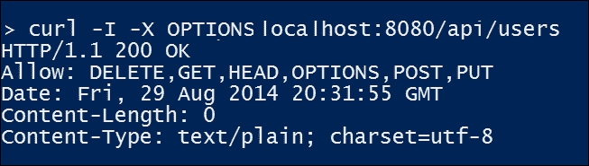
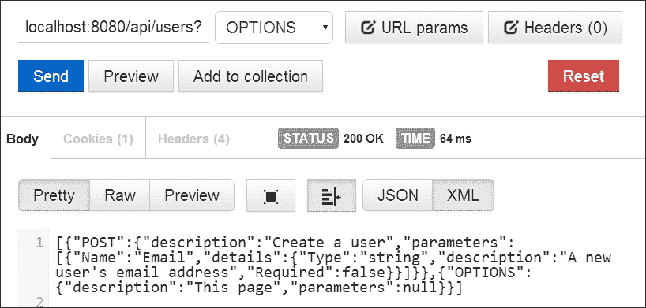
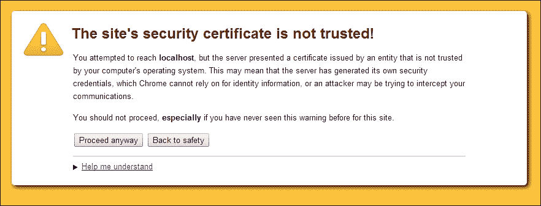

# 第五章：Go 中的模板和选项

在我们的社交网络网络服务的基础上，是时候将我们的项目从演示玩具变成实际可用的东西了，也许最终还可以投入生产。

为此，我们需要关注许多事情，其中一些我们将在本章中解决。在上一章中，我们看了一下如何确定我们的社交网络应用程序的主要功能。现在，我们需要确保从 REST 的角度来看，每一件事都是可能的。

为了实现这一点，在本章中，我们将看到：

+   使用`OPTIONS`提供内置文档和我们资源端点目的的 REST 友好解释

+   考虑替代输出格式以及如何实现它们的介绍

+   为我们的 API 实施和强制安全性

+   允许用户注册以使用安全密码

+   允许用户从基于 Web 的界面进行身份验证

+   近似于 OAuth 样式的身份验证系统

+   允许外部应用代表其他用户发出请求

在实施这些事情之后，我们将拥有一个允许用户与之进行接口的服务的基础，无论是通过 API 直接接口还是通过第三方服务。

# 分享我们的选项

我们已经略微提到了`OPTIONS` HTTP 动词的价值和目的，因为它与 HTTP 规范和 REST 的最佳实践有关。

根据 RFC 2616，即 HTTP/1.1 规范，对`OPTIONS`请求的响应应返回有关客户端可以对资源和/或请求的端点进行的操作的信息。

### 注意

您可以在[`www.ietf.org/rfc/rfc2616.txt`](https://www.ietf.org/rfc/rfc2616.txt)找到**HTTP/1.1** **请求注释** (**RFC**)。

换句话说，在我们早期的示例中，对`/api/users`的`OPTIONS`调用应返回一个指示，即`GET`、`POST`、`PUT`和`DELETE`目前是该 REST 资源请求的可用选项。

目前，对于正文内容应该是什么样子或包含什么内容并没有预定义的格式，尽管规范表明这可能会在将来的版本中概述。这给了我们一些灵活性，可以在如何呈现可用操作方面有所作为；在大多数这样的情况下，我们都希望尽可能健壮和信息丰富。

以下代码是我们目前 API 的简单修改，其中包含了我们之前概述的有关`OPTIONS`请求的一些基本信息。首先，我们将在`api.go`文件的导出`Init()`函数中添加请求的特定处理程序：

```go
func Init() {
  Routes = mux.NewRouter()
  Routes.HandleFunc("/api/users", UserCreate).Methods("POST")
  Routes.HandleFunc("/api/users", UsersRetrieve).Methods("GET")	
  Routes.HandleFunc("/api/users/{id:[0-9]+}",UsersUpdate).Methods("PUT")
  Routes.HandleFunc("/api/users", UsersInfo).Methods("OPTIONS")
}
```

然后，我们将添加处理程序：

```go
func UsersInfo(w http.ResponseWriter, r *http.Request) {
  w.Header().Set("Allow","DELETE,GET,HEAD,OPTIONS,POST,PUT")
}
```

直接使用 cURL 调用这个命令会给我们我们所需要的东西。在下面的屏幕截图中，您会注意到响应顶部的`Allow`标头：



这一点单独就足以满足 REST 世界中`OPTIONS`动词的大多数普遍接受的要求，但请记住，正文没有格式，我们希望尽可能地表达。

我们可以通过提供一个特定于文档的包来做到这一点；在这个例子中，它被称为规范。请记住，这是完全可选的，但对于偶然发现它的任何开发人员来说，这是一个不错的礼物。让我们看看如何为自我记录的 API 设置这个：

```go
package specification
type MethodPOST struct {
  POST EndPoint
}
type MethodGET struct {
  GET EndPoint
}
type MethodPUT struct {
  PUT EndPoint
}
type MethodOPTIONS struct {
  OPTIONS EndPoint
}
type EndPoint struct {
  Description string `json:"description"`
  Parameters []Param `json:"parameters"`
}
type Param struct {
  Name string "json:name"
  ParameterDetails Detail `json:"details"`
}
type Detail struct {
  Type string "json:type"
  Description string `json:"description"`
  Required bool "json:required"
}

var UserOPTIONS = MethodOPTIONS{ OPTIONS: EndPoint{ Description: "This page" } }
var UserPostParameters = []Param{ {Name: "Email", ParameterDetails: Detail{Type:"string", Description: "A new user's email address", Required: false} } }

var UserPOST = MethodPOST{ POST: EndPoint{ Description: "Create a user", Parameters: UserPostParameters } }
var UserGET = MethodGET{ GET: EndPoint{ Description: "Access a user" }}
```

然后，您可以直接在我们的`api.go`文件中引用它。首先，我们将创建一个包含所有可用方法的通用接口切片：

```go
type DocMethod interface {
}
```

然后，我们可以在我们的`UsersInfo`方法中编译我们的各种方法：

```go
func UsersInfo(w http.ResponseWriter, r *http.Request) {
  w.Header().Set("Allow","DELETE,GET,HEAD,OPTIONS,POST,PUT")

  UserDocumentation := []DocMethod{}
  UserDocumentation = append(UserDocumentation, Documentation.UserPOST)
  UserDocumentation = append(UserDocumentation, Documentation.UserOPTIONS)
  output := SetFormat(UserDocumentation)
  fmt.Fprintln(w,string(output))
}
```

您的屏幕应该看起来类似于这样：



# 实施替代格式

在查看 API 格式的世界时，您现在知道有两个主要的参与者：**XML**和**JSON**。作为人类可读格式，这两种格式在过去十多年中一直占据着格式世界。

通常情况下，开发人员和技术人员很少会满意地长期使用某种东西。在计算编码和解码的复杂性以及模式的冗长推动许多开发人员转向 JSON 之前，XML 很长一段时间是第一位的。

JSON 也不是没有缺点。没有一些明确的间距，它对人类来说并不那么可读，这会使文档的大小过分增加。它也不能默认处理注释。

还有许多替代格式在一旁。**YAML**，代表**YAML Ain't Markup Language**，是一种使用缩进使其对人类极易阅读的空白分隔格式。一个示例文档可能是这样的：

```go
---
api:
  name: Social Network
  methods:
    - GET
    - POST
    - PUT
    - OPTIONS
    - DELETE
```

缩进系统作为模拟代码块的方法，对于有 Python 经验的人来说会很熟悉。

### 提示

Go 有许多 YAML 实现。最值得注意的是`go-yaml`，可以在[`github.com/go-yaml/yaml`](https://github.com/go-yaml/yaml)找到。

**TOML**，或**Tom's Obvious, Minimal Language**，采用了一种方法，对于任何使用`.ini`风格配置文件的人来说都会非常熟悉。

# 制定我们自己的数据表示格式

TOML 是一个很好的格式，可以用来构建我们自己的数据格式，主要是因为它的简单性使得在这种格式内部实现多种输出成为可能。

当设计像 TOML 这样简单的东西时，你可能会立即想到 Go 的文本模板格式，因为它本质上已经有了呈现它的控制机制。例如，考虑这个结构和循环：

```go
type GenericData struct {
  Name string
  Options GenericDataBlock
}

type GenericDataBlock struct {
  Server string
  Address string
}

func main() {
  Data := GenericData{ Name: "Section", Options: GenericDataBlock{Server: "server01", Address: "127.0.0.1"}}

}
```

当结构被解析为文本模板时，它将精确地生成我们想要的内容:`{{.Name}}`。

```go
{{range $index, $value := Options}}
  $index = $value
{{end}}
```

这种方法的一个大问题是你没有固有的系统来解组数据。换句话说，你可以生成这种格式的数据，但你不能将其解开成 Go 结构的另一种方式。

另一个问题是，随着格式的复杂性增加，使用 Go 模板库中的有限控制结构来满足这种格式的所有复杂性和怪癖变得不太合理。

如果你选择自己的格式，你应该避免文本模板，而是查看编码包，它允许你生成和消费结构化数据格式。

我们将在接下来的章节中仔细研究编码包。

# 引入安全和认证

任何网络服务或 API 的一个关键方面是能够保持信息安全，并且只允许特定用户访问特定的内容。

在历史上，有许多方法可以实现这一点，最早的一种是 HTTP 摘要认证。

另一个常见的方法是包含开发人员凭据，即 API 密钥。这已经不再被推荐，主要是因为 API 的安全性完全依赖于这些凭据的安全性。然而，这在很大程度上是一种明显的允许认证的方法，作为服务提供商，它允许你跟踪谁在做特定的请求，还可以实现请求的限制。

今天的大玩家是 OAuth，我们很快会看一下。然而，首先，我们需要确保我们的 API 只能通过 HTTPS 访问。

## 强制使用 HTTPS

此时，我们的 API 开始使客户和用户能够做一些事情，比如创建用户，更新他们的数据，并为这些用户包含图像数据。我们开始涉足一些在现实环境中不希望公开的事情。

我们可以看一下的第一个安全步骤是强制 API 上的 HTTPS 而不是 HTTP。Go 通过 TLS 实现 HTTPS，而不是 SSL，因为从服务器端来看，TLS 被认为是更安全的协议。其中一个驱动因素是 SSL 3.0 中的漏洞，特别是 2014 年暴露的 Poodlebleed Bug。

### 提示

您可以在[`poodlebleed.com/`](https://poodlebleed.com/)了解更多关于 Poodlebleed 的信息。

让我们看看如何在以下代码中将任何非安全请求重定向到其安全对应项：

```go
package main

import
(
  "fmt"
  "net/http"
  "log"
  "sync"
)

const (
  serverName = "localhost"
  SSLport = ":443"
  HTTPport = ":8080"
  SSLprotocol = "https://"
  HTTPprotocol = "http://"
)

func secureRequest(w http.ResponseWriter, r *http.Request) {
  fmt.Fprintln(w,"You have arrived at port 443, but you are not yet secure.")
}
```

这是我们（暂时）正确的端点。它还不是 TSL（或 SSL），所以我们实际上并没有监听 HTTPS 连接，因此会显示此消息。

```go
func redirectNonSecure(w http.ResponseWriter, r *http.Request) {
  log.Println("Non-secure request initiated, redirecting.")
  redirectURL := SSLprotocol + serverName + r.RequestURI
  http.Redirect(w, r, redirectURL, http.StatusOK)
}
```

这是我们的重定向处理程序。您可能会注意到`http.StatusOK`状态码 - 显然我们希望发送 301 永久移动错误（或`http.StatusMovedPermanently`常量）。但是，如果您正在测试这个，您的浏览器可能会缓存状态并自动尝试重定向您。

```go
func main() {
  wg := sync.WaitGroup{}
  log.Println("Starting redirection server, try to access @ http:")

  wg.Add(1)
  go func() {
    http.ListenAndServe(HTTPport,http.HandlerFunc(redirectNonSecure))
    wg.Done()
  }()
  wg.Add(1)
  go func() {
    http.ListenAndServe(SSLport,http.HandlerFunc(secureRequest))
    wg.Done()
  }()
  wg.Wait()
}
```

那么，为什么我们将这些方法包装在匿名的 goroutines 中呢？好吧，把它们拿出来，您会发现因为`ListenAndServe`函数是阻塞的，我们不能通过简单调用以下语句同时运行这两个方法：

```go
http.ListenAndServe(HTTPport,http.HandlerFunc(redirectNonSecure))
http.ListenAndServe(SSLport,http.HandlerFunc(secureRequest))

```

当然，您在这方面有多种选择。您可以简单地将第一个设置为 goroutine，这将允许程序继续执行第二个服务器。这种方法提供了一些更细粒度的控制，用于演示目的。

## 添加 TLS 支持

在前面的示例中，显然我们并没有监听 HTTPS 连接。Go 使这变得非常容易；但是，像大多数 SSL/TLS 问题一样，处理您的证书时会出现复杂性。

对于这些示例，我们将使用自签名证书，Go 也很容易实现。在`crypto/tls`包中，有一个名为`generate_cert.go`的文件，您可以使用它来生成您的证书密钥。

通过转到您的 Go 二进制目录，然后`src/pkg/crypto/tls`，您可以通过运行以下命令生成一个可以用于测试的密钥对：

```go
go run generate_cert.go --host localhost --ca true

```

然后，您可以将这些文件移动到任何您想要的位置，理想情况下是我们 API 运行的目录。

接下来，让我们删除`http.ListenAndServe`函数，并将其更改为`http.ListenAndServeTLS`。这需要一些额外的参数，包括密钥的位置：

```go
http.ListenAndServeTLS(SSLport, "cert.pem", "key.pem", http.HandlerFunc(secureRequest))
```

为了更加明确，让我们稍微修改我们的`secureRequest`处理程序：

```go
fmt.Fprintln(w,"You have arrived at port 443, and now you are marginally more secure.")
```

如果我们现在运行这个并转到我们的浏览器，希望会看到一个警告，假设我们的浏览器会保护我们：



假设我们信任自己，这并不总是明智的，点击通过，我们将看到来自安全处理程序的消息：


### 注意

当然，如果我们再次访问`http://localhost:8080`，我们现在应该会自动重定向，并显示 301 状态代码。

当您有访问支持 OpenSSL 的操作系统时，创建自签名证书通常是相当容易的。

如果您想要尝试使用真实证书而不是自签名证书，您可以通过多种服务免费获得一年期的签名（但未经验证）证书。其中比较流行的是 StartSSL（[`www.startssl.com/`](https://www.startssl.com/)），它使得获取免费和付费证书变得简单。

# 让用户注册和认证

您可能还记得，作为我们 API 应用的一部分，我们有一个自包含的接口，允许我们为 API 本身提供 HTML 界面。如果我们不保护我们的用户，任何关于安全性的讨论都将毫无意义。

当然，实现用户身份验证安全的绝对最简单的方法是通过存储和使用带有哈希机制的密码。服务器以明文存储密码是非常常见的，所以我们不会这样做；但是，我们希望至少使用一个额外的安全参数来实现我们的密码。

我们希望不仅存储用户的密码，而且至少存储一个盐。这并不是一个绝对安全的措施，尽管它严重限制了字典和彩虹攻击的威胁。

为此，我们将创建一个名为`password`的新包，作为我们套件的一部分，它允许我们生成随机盐，然后加密该值以及密码。

我们可以使用`GenerateHash()`来创建和验证密码。

## 快速入门-生成盐

获取密码很简单，创建安全哈希也相当容易。为了使我们的身份验证过程更安全，我们缺少的是盐。让我们看看我们如何做到这一点。首先，让我们在我们的数据库中添加一个密码和一个盐字段：

```go
ALTER TABLE `users`
  ADD COLUMN `user_password` VARCHAR(1024) NOT NULL AFTER `user_nickname`,
  ADD COLUMN `user_salt` VARCHAR(128) NOT NULL AFTER `user_password`,
  ADD INDEX `user_password_user_salt` (`user_password`, `user_salt`);
```

有了这个，让我们来看看我们的密码包，其中包含盐和哈希生成函数：

```go
package password

import
(
  "encoding/base64"
  "math/rand"
  "crypto/sha256"
  "time"
)

const randomLength = 16

func GenerateSalt(length int) string {
  var salt []byte
  var asciiPad int64

  if length == 0 {
    length = randomLength
  }

  asciiPad = 32

  for i:= 0; i < length; i++ {
    salt = append(salt, byte(rand.Int63n(94) + asciiPad) )
  }

  return string(salt)
}
```

我们的`GenerateSalt()`函数生成一串特定字符集内的随机字符。在这种情况下，我们希望从 ASCII 表中的 32 开始，一直到 126。

```go
func GenerateHash(salt string, password string) string {
  var hash string
  fullString := salt + password
  sha := sha256.New()
  sha.Write([]byte(fullString))
  hash = base64.URLEncoding.EncodeToString(sha.Sum(nil))

  return hash
}
```

在这里，我们基于密码和盐生成一个哈希。这不仅对于密码的创建有用，还对于验证密码也有用。以下的`ReturnPassword()`函数主要作为其他函数的包装器，允许您创建密码并返回其哈希值：

```go
func ReturnPassword(password string) (string, string) {
  rand.Seed(time.Now().UTC().UnixNano())

  salt := GenerateSalt(0)

  hash := GenerateHash(salt,password)

  return salt, hash
}
```

在我们的客户端，您可能还记得我们通过 jQuery 通过 AJAX 发送了所有数据。我们在一个单独的 Bootstrap 标签上有一个单独的方法，允许我们创建用户。首先，让我们回顾一下标签设置。

现在，`userCreate()`函数中，我们添加了一些东西。首先，有一个密码字段，允许我们在创建用户时发送该密码。在没有安全连接的情况下，我们可能以前对此不太放心：

```go
  function userCreate() {
    action = "https://localhost/api/users";
    postData = {};
    postData.email = $('#createEmail').val();
    postData.user = $('#createUsername').val();
    postData.first = $('#createFirst').val();
    postData.last= $('#createLast').val();
    postData.password = $('#createPassword').val();
```

接下来，我们可以修改我们的`.ajax`响应以对不同的 HTTP 状态代码做出反应。请记住，如果用户名或电子邮件 ID 已经存在，我们已经设置了冲突。因此，让我们也处理这个问题：

```go
var formData = new FormData($('form')[0]);
$.ajax({

    url: action,  //Server script to process data
    dataType: 'json',
    type: 'POST',
    statusCode: {
      409: function() {
        $('#api-messages').html('Email address or nickname already exists!');
        $('#api-messages').removeClass('alert-success').addClass('alert-warning');
        $('#api-messages').show();
        },
      200: function() {
        $('#api-messages').html('User created successfully!');
        $('#api-messages').removeClass('alert-warning').addClass('alert-success');
        $('#api-messages').show();
        }
      },
```

现在，如果我们得到一个 200 的响应，我们知道我们的 API 端已经创建了用户。如果我们得到 409，我们会在警报区域向用户报告电子邮件地址或用户名已被使用。

# 在 Go 中检查 OAuth

正如我们在第四章中简要提到的，*在 Go 中设计 API*，OAuth 是允许应用使用另一个应用的用户身份验证与第三方应用进行交互的一种常见方式。

它在社交媒体服务中非常受欢迎；Facebook、Twitter 和 GitHub 都使用 OAuth 2.0 允许应用代表用户与其 API 进行交互。

这里值得注意的是，虽然有许多 API 调用我们可以放心地不受限制，主要是`GET`请求，但还有一些是特定于用户的，我们需要确保我们的用户授权这些请求。

让我们快速回顾一下我们可以实现的方法，以使我们的服务器类似于 OAuth：

```go
Endpoint
/api/oauth/authorize
/api/oauth/token
/api/oauth/revoke
```

鉴于我们有一个小型的、主要基于演示的服务，我们长时间保持访问令牌活动的风险是很小的。长期有效的访问令牌显然会为客户端开放更多的不受欢迎的访问机会，因为它们可能没有遵守最佳的安全协议。

在正常情况下，我们希望对令牌设置一个到期时间，我们可以通过使用一个带有过期时间的 memcache 系统或密钥库来简单地实现这一点。这样可以使值自然死亡，而无需显式销毁它们。

我们需要做的第一件事是为客户端凭据添加一个表，即`consumer_key`和`consumer_token`：

```go
CREATE TABLE `api_credentials` (
  `user_id` INT(10) UNSIGNED NOT NULL,
  `consumer_key` VARCHAR(128) NOT NULL,
  `consumer_secret` VARCHAR(128) NOT NULL,
  `callback_url` VARCHAR(256) NOT NULL
  CONSTRAINT `FK__users` FOREIGN KEY (`user_id`) REFERENCES `users` (`user_id`) ON UPDATE NO ACTION ON DELETE NO ACTION
)
```

我们将检查详细信息以验证凭据是否正确，并且如果正确，我们将返回一个访问令牌。

访问令牌可以是任何格式；鉴于我们对演示的低安全限制，我们将返回一个随机生成的字符串的 MD5 哈希。在现实世界中，即使对于短期令牌，这可能也不够，但它在这里能够达到目的。

### 提示

请记住，我们在`password`包中实现了一个随机字符串生成器。您可以通过调用以下语句在`api.go`中创建一个快速的密钥和密钥值：

```go
  fmt.Println(Password.GenerateSalt(22))
  fmt.Println(Password.GenerateSalt(41))
```

如果您将此密钥和密钥值输入到先前创建的表中，并将其与现有用户关联，您将拥有一个活动的 API 客户端。请注意，这可能会生成无效的 URL 字符，因此我们将将我们对`/oauth/token`端点的访问限制为`POST`。

我们的伪 OAuth 机制将进入自己的包中，并且它将严格生成我们将在 API 包中的令牌切片中保留的令牌。

在我们的核心 API 包中，我们将添加两个新函数来验证凭据和`pseudoauth`包：

```go
  import(
  Pseudoauth "github.com/nkozyra/gowebservice/pseudoauth" 
  )
```

我们将添加的函数是`CheckCredentials()`和`CheckToken()`。第一个将接受一个密钥、一个一次性号码、一个时间戳和一个加密方法，然后我们将与`consumer_secret`值一起对其进行哈希处理，以查看签名是否匹配。实质上，所有这些请求参数都与双方知道但未广播的秘密结合在一起，以创建一个以双方知道的方式进行哈希处理的签名。如果这些签名对应，应用程序可以发出请求令牌或访问令牌（后者通常用于交换请求令牌，我们将很快讨论更多内容）。

在我们的情况下，我们将接受`consumer_key`值、一次性号码、时间戳和签名，暂时假设 HMAC-SHA1 被用作签名方法。由于 SHA1 发生碰撞的可能性增加，它正在失去一些青睐，但是对于开发应用程序的目的，它将会并且可以在以后简单地替换。Go 还提供了 SHA224、SHA256、SHA384 和 SHA512。

一次性号码和时间戳的目的是专门增加安全性。一次性号码几乎肯定作为请求的唯一标识哈希，时间戳允许我们定期过期数据以保留内存和/或存储。我们这里不会这样做，尽管我们将检查以确保一次性号码以前没有被使用。

要开始验证客户端，我们在数据库中查找共享密钥。

```go
func CheckCredentials(w http.ResponseWriter, r *http.Request)  {
  var Credentials string
  Response := CreateResponse{}
  consumerKey := r.FormValue("consumer_key")
  fmt.Println(consumerKey)
  timestamp := r.FormValue("timestamp")
  signature := r.FormValue("signature")
  nonce := r.FormValue("nonce")
  err := Database.QueryRow("SELECT consumer_secret from api_credentials where consumer_key=?", consumerKey).Scan(&Credentials)
    if err != nil {
    error, httpCode, msg := ErrorMessages(404)
    log.Println(error)	
    log.Println(w, msg, httpCode)
    Response.Error = msg
    Response.ErrorCode = httpCode
    http.Error(w, msg, httpCode)
    return
  }
```

在这里，我们获取`consumer_key`值并查找我们共享的`consumer_secret`令牌，然后将其传递给我们的`ValidateSignature`函数，如下所示：

```go
  token,err := Pseudoauth.ValidateSignature(consumerKey,Credentials,timestamp,nonce,signature,0)
  if err != nil {
    error, httpCode, msg := ErrorMessages(401)
    log.Println(error)	
    log.Println(w, msg, httpCode)
    Response.Error = msg
    Response.ErrorCode = httpCode
    http.Error(w, msg, httpCode)
    return
  }
```

如果我们发现我们的请求无效（要么是因为凭据不正确，要么是因为存在的一次性号码），我们将返回未经授权的错误和 401 状态码：

```go
  AccessRequest := OauthAccessResponse{}
  AccessRequest.AccessToken = token.AccessToken
  output := SetFormat(AccessRequest)
  fmt.Fprintln(w,string(output))
}
```

否则，我们将在 JSON 主体响应中返回访问代码。这是`pseudoauth`包本身的代码：

```go
package pseudoauth
import
(
  "crypto/hmac"
  "crypto/sha1"
  "errors"
  "fmt"
  "math/rand"
  "strings"
  "time"
)
```

这里没有太多令人惊讶的地方！我们需要一些加密包和`math/rand`来允许我们进行种子生成：

```go
type Token struct {
  Valid bool
  Created int64
  Expires int64
  ForUser int
  AccessToken string
}
```

这里比我们目前使用的要多一点，但你可以看到我们可以创建具有特定访问权限的令牌：

```go
var nonces map[string] Token
func init() {
  nonces = make(map[string] Token)
}

func ValidateSignature(consumer_key string, consumer_secret string, timestamp string,  nonce string, signature string, for_user int) (Token, error) {
  var hashKey []byte
  t := Token{}
  t.Created = time.Now().UTC().Unix()
  t.Expires = t.Created + 600
  t.ForUser = for_user

  qualifiedMessage := []string{consumer_key, consumer_secret, timestamp, nonce}
  fullyQualified := strings.Join(qualifiedMessage," ")

  fmt.Println(fullyQualified)
  mac := hmac.New(sha1.New, hashKey)
  mac.Write([]byte(fullyQualified))
  generatedSignature := mac.Sum(nil)

  //nonceExists := nonces[nonce]

  if hmac.Equal([]byte(signature),generatedSignature) == true {

    t.Valid = true
    t.AccessToken = GenerateToken()
    nonces[nonce] = t
    return t, nil
  } else {
    err := errors.New("Unauthorized")
    t.Valid = false
    t.AccessToken = ""
    nonces[nonce] = t
    return t, err
  }

}
```

这是类似于 OAuth 这样的服务尝试验证签名请求的粗略近似；一次性号码、公钥、时间戳和共享私钥使用相同的加密进行评估。如果它们匹配，请求是有效的。如果它们不匹配，应该返回错误。

我们可以稍后使用时间戳为任何给定的请求提供一个短暂的窗口，以便在意外签名泄漏的情况下，可以将损害最小化：

```go
func GenerateToken() string {
  var token []byte
  rand.Seed(time.Now().UTC().UnixNano())
  for i:= 0; i < 32; i++ {
    token = append(token, byte(rand.Int63n(74) + 48) )
  }
  return string(token)
}
```

# 代表用户进行请求

在代表用户进行请求时，OAuth2 过程中涉及一个关键的中间步骤，那就是用户的身份验证。显然，这不能在消费者应用程序中发生，因为这将打开一个安全风险，恶意或不恶意地，用户凭据可能会被泄露。

因此，这个过程需要一些重定向。

首先，需要一个初始请求，将用户重定向到登录位置。如果他们已经登录，他们将有能力授予应用程序访问权限。接下来，我们的服务将接受一个回调 URL 并将用户带回来，同时带上他们的请求令牌。这将使第三方应用程序能够代表用户进行请求，直到用户限制对第三方应用程序的访问为止。

为了存储有效的令牌，这些令牌本质上是用户和第三方开发人员之间的许可连接，我们将为此创建一个数据库：

```go
CREATE TABLE `api_tokens` (
  `api_token_id` INT(10) UNSIGNED NOT NULL AUTO_INCREMENT,
  `application_user_id` INT(10) UNSIGNED NOT NULL,
  `user_id` INT(10) UNSIGNED NOT NULL,
  `api_token_key` VARCHAR(50) NOT NULL,
  PRIMARY KEY (`api_token_id`)
)
```

我们需要一些部件来使其工作，首先是一个登录表单，用于当前未登录的用户，依赖于`sessions`表。让我们现在在 MySQL 中创建一个非常简单的实现：

```go
CREATE TABLE `sessions` (
  `session_id` VARCHAR(128) NOT NULL,
  `user_id` INT(10) NOT NULL,
  UNIQUE INDEX `session_id` (`session_id`)
)
```

接下来，我们需要一个授权表单，用于已登录用户，允许我们为用户和服务创建有效的 API 访问令牌，并将用户重定向到回调地址。

模板可以是一个非常简单的 HTML 模板，可以放置在`/authorize`。因此，我们需要将该路由添加到`api.go`中：

```go
  Routes.HandleFunc("/authorize", ApplicationAuthorize).Methods("POST")
  Routes.HandleFunc("/authorize", ApplicationAuthenticate).Methods("GET")
```

对`POST`的请求将检查确认，如果一切正常，就会传递这个：

```go
<!DOCTYPE html>
<html>
  <head>
    <title>{{.Title}}</title>
  </head>
  <body>
  {{if .Authenticate}}
      <h1>{{.Title}}</h1>
      <form action="{{.Action}}" method="POST">
      <input type="hidden" name="consumer_key" value="{.ConsumerKey}" />
      Log in here
      <div><input name="username" type="text" /></div>
      <div><input name="password" type="password" /></div>
      Allow {{.Application}} to access your data?
      <div><input name="authorize" value="1" type="radio"> Yes</div>
      <div><input name="authorize" value="0" type="radio"> No</div>
      <input type="submit" value="Login" />
  {{end}}
  </form>
  </body>
</html>
```

Go 的模板语言在很大程度上没有逻辑，但并非完全没有逻辑。我们可以使用`if`控制结构将两个页面的 HTML 代码放在一个模板中。为了简洁起见，我们还将创建一个非常简单的`Page`结构，使我们能够构建非常基本的响应页面：

```go
type Page struct {
  Title string
  Authorize bool
  Authenticate bool
  Application string
  Action string
  ConsumerKey string
}
```

目前我们不会维护登录状态，这意味着每个用户都需要在希望授权第三方代表他们进行 API 请求时登录。随着我们的进展，我们将对此进行微调，特别是在使用 Gorilla 工具包中可用的安全会话数据和 cookie 方面。

因此，第一个请求将包括一个带有`consumer_key`值的登录尝试，用于标识应用程序。您也可以在这里包括完整的凭据（nonce 等），但由于这将只允许您的应用程序访问单个用户，这可能是不必要的。

```go
func ApplicationAuthenticate(w http.ResponseWriter, r *http.Request) {
  Authorize := Page{}
  Authorize.Authenticate = true
  Authorize.Title = "Login"
  Authorize.Application = ""
  Authorize.Action = "/authorize"

  tpl := template.Must(template.New("main").ParseFiles("authorize.html"))
  tpl.ExecuteTemplate(w, "authorize.html", Authorize)
}
```

所有请求都将发布到同一个地址，然后我们将验证登录凭据（记住我们`password`包中的`GenerateHash()`），如果它们有效，我们将在`api_connections`中创建连接，然后将用户返回到与 API 凭据关联的回调 URL。

这是一个确定登录凭据是否正确的函数，如果是的话，将使用我们创建的`request_token`值重定向到回调 URL：

```go
func ApplicationAuthorize(w http.ResponseWriter, r *http.Request) {

  username := r.FormValue("username")
  password := r.FormValue("password")
  allow := r.FormValue("authorize")

  var dbPassword string
  var dbSalt string
  var dbUID string

  uerr := Database.QueryRow("SELECT user_password, user_salt, user_id from users where user_nickname=?", username).Scan(&dbPassword, &dbSalt, &dbUID)
  if uerr != nil {

  }
```

通过`user_password`值，`user_salt`值和提交的密码值，我们可以通过使用我们的`GenerateHash()`函数并进行直接比较来验证密码的有效性，因为它们是 Base64 编码的。

```go
  consumerKey := r.FormValue("consumer_key")
  fmt.Println(consumerKey)

  var CallbackURL string
  var appUID string
  err := Database.QueryRow("SELECT user_id,callback_url from api_credentials where consumer_key=?", consumerKey).Scan(&appUID, &CallbackURL)
  if err != nil {

    fmt.Println(err.Error())
    return
  }

  expectedPassword := Password.GenerateHash(dbSalt, password)
  if dbPassword == expectedPassword && allow == "1" {

    requestToken := Pseudoauth.GenerateToken()

    authorizeSQL := "INSERT INTO api_tokens set application_user_id=" + appUID + ", user_id=" + dbUID + ", api_token_key='" + requestToken + "' ON DUPLICATE KEY UPDATE user_id=user_id"

    q, connectErr := Database.Exec(authorizeSQL)
    if connectErr != nil {

    } else {
      fmt.Println(q)
    }
    redirectURL := CallbackURL + "?request_token=" + requestToken
    fmt.Println(redirectURL)
    http.Redirect(w, r, redirectURL, http.StatusAccepted)
```

在将`expectedPassword`与数据库中的密码进行对比后，我们可以判断用户是否成功进行了身份验证。如果是，我们会创建令牌并将用户重定向回回调 URL。然后，其他应用程序有责任存储该令牌以备将来使用。

```go
  } else {

    fmt.Println(dbPassword, expectedPassword)
    http.Redirect(w, r, "/authorize", http.StatusUnauthorized)
  }

}
```

现在我们在第三方端有了令牌，我们可以使用该令牌和我们的`client_token`值进行 API 请求，代表个人用户进行请求，例如创建连接（好友和关注者），发送自动消息或设置状态更新。

# 总结

我们开始本章时，看了一些带来更多 REST 风格选项和功能、更好的安全性以及基于模板的呈现的方法。为了实现这个目标，我们研究了 OAuth 安全模型的基本抽象，这使我们能够使外部客户端在用户的域内工作。

现在，我们的应用程序通过 OAuth 风格的身份验证并通过 HTTPS 进行了安全保护，我们现在可以扩展我们的社交网络应用程序的第三方集成，允许其他开发人员利用和增强我们的服务。

在下一章中，我们将更多地关注我们应用程序的客户端和消费者端，扩展我们的 OAuth 选项，并通过 API 赋予更多的操作，包括创建和删除用户之间的连接，以及创建状态更新。
