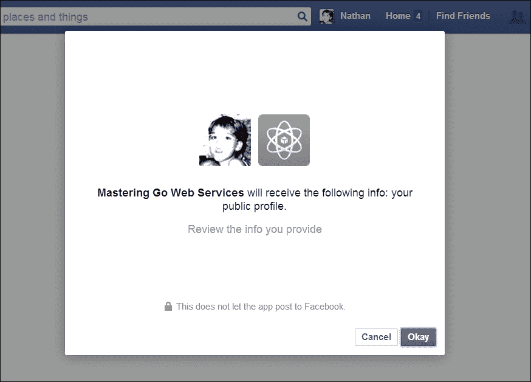
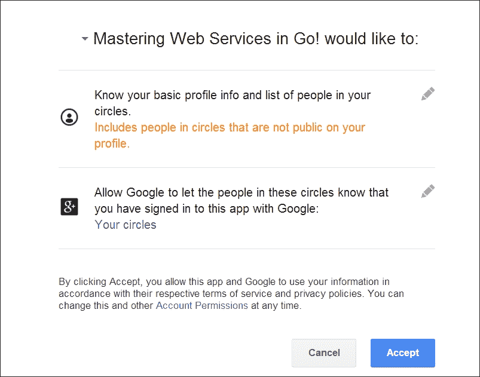
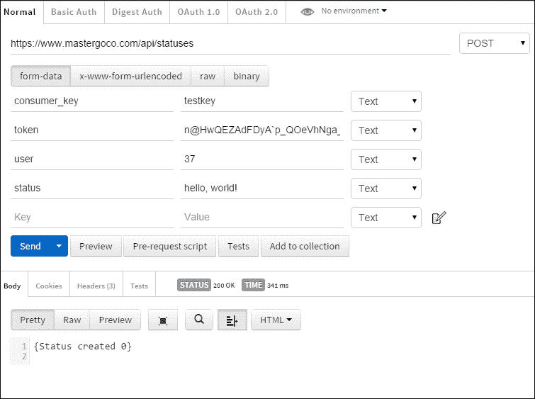
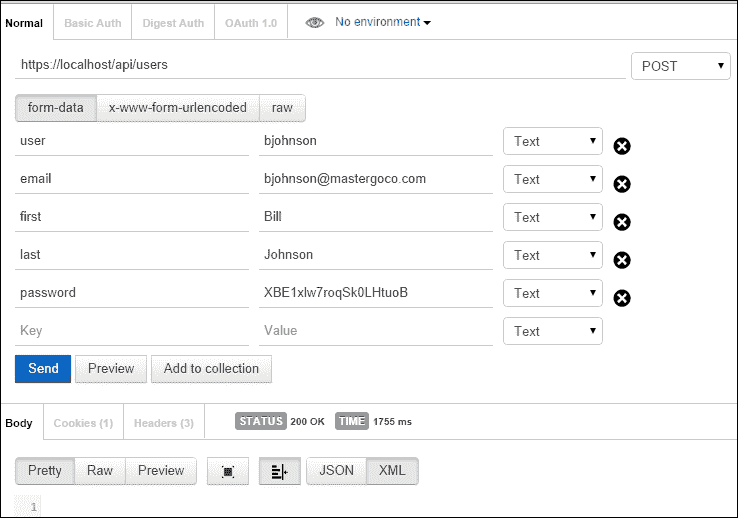

# 第六章。在 Go 中访问和使用网络服务

在上一章中，我们简要涉及了 OAuth 2.0 过程，并在我们自己的 API 中模拟了这个过程。

我们将通过将我们的用户连接到一些提供 OAuth 2.0 连接的现有普遍服务来进一步探索这个过程，并允许我们的应用程序中的操作在他们的应用程序中创建操作。

一个例子是当您在一个社交网络上发布内容并被给予类似地在另一个社交网络上发布或交叉发布的选项。这正是我们将在这里进行实验的流程类型。

为了真正理解这一点，我们将在我们的应用程序中连接现有用户到另一个使用 OAuth 2.0 的应用程序（如 Facebook、Google+和 LinkedIn），然后在我们的系统和其他系统之间共享资源。

虽然我们无法让这些系统回报，但我们将继续前进，并模拟另一个试图在我们的应用程序基础设施内工作的应用程序。

在本章中，我们将探讨：

+   作为客户端通过 OAuth 2.0 连接到其他服务

+   让我们的用户从我们的应用程序分享信息到另一个网络应用程序

+   允许我们的 API 消费者代表我们的用户发出请求

+   如何确保我们在 OAuth 请求之外建立安全连接

在本章结束时，作为客户端，您应该能够使用 OAuth 将用户帐户连接到其他服务。您还应该能够进行安全请求，创建允许其他服务连接到您的服务的方式，并代表您的用户进行第三方请求。

# 将我们的用户连接到其他服务

为了更好地理解 OAuth 2.0 过程在实践中是如何工作的，让我们连接到一些流行的社交网络，特别是 Facebook 和 Google+。这不仅仅是一个实验项目；这是现代社交网络运作的方式，通过允许服务之间的互联和共享。

这不仅是常见的，而且当您允许不协调的应用程序之间无缝连接时，还往往会引起更高程度的采用。从诸如 Twitter 和 Facebook 之类的服务共享的能力有助于加速它们的流行。

当我们探索客户端方面时，我们将深入了解像我们这样的网络服务如何允许第三方应用程序和供应商在我们的生态系统内工作，并扩大我们应用程序的深度。

要开始这个过程，我们将获取一个现有的 Go OAuth 2.0 客户端。有一些可用的，但要安装 Goauth2，运行`go get`命令如下：

```go
go get code.google.com/p/goauth2/oauth

```

如果我们想将对 OAuth 2.0 服务的访问分隔开，我们可以在我们的导入目录中创建一个独立的文件，让我们创建一个连接到我们的 OAuth 提供者并从中获取相关详细信息。

在这个简短的例子中，我们将连接一个 Facebook 服务，并从 Facebook 请求一个身份验证令牌。之后，我们将返回到我们的网络服务，获取并可能存储令牌：

```go
package main

import (
  "code.google.com/p/goauth2/oauth"
  "fmt"
)
```

这就是我们需要创建一个独立的包，我们可以从其他地方调用。在这种情况下，我们只有一个服务；因此，我们将创建以下变量作为全局变量：

```go
var (
  clientID     = "[Your client ID here]"
  clientSecret = "[Your client secret here]"
  scope        = ""
  redirectURL  = "http://www.mastergoco.com/codepass"
  authURL      = "https://www.facebook.com/dialog/oauth"
  tokenURL     = "https://graph.facebook.com/oauth/access_token"
  requestURL   = "https://graph.facebook.com/me"
  code         = ""
)
```

您将从提供者那里获得这些端点和变量，但它们在这里显然是模糊的。

`redirectURL`变量表示用户登录后您将捕获到的发送令牌的位置。我们将很快仔细研究一般流程。`main`函数编写如下：

```go
func main() {

  oauthConnection := &oauth.Config{
    ClientId:     clientID,
    ClientSecret: clientSecret,
    RedirectURL:  redirectURL,
    Scope:        scope,
    AuthURL:      authURL,
    TokenURL:     tokenURL,
  }

  url := oauthConnection.AuthCodeURL("")
  fmt.Println(url)

}
```

如果我们获取生成的 URL 并直接访问它，它将带我们到类似于我们在上一页上构建的粗略版本的登录页面。这是 Facebook 呈现的身份验证页面：



如果用户（在这种情况下是我）接受此身份验证并点击**好**，页面将重定向回我们的 URL 并传递一个 OAuth 代码，类似于这样：

[`www.mastergoco.com/codepass?code=h9U1_YNL1paTy-IsvQIor6u2jONwtipxqSbFMCo3wzYsSK7BxEVLsJ7ujtoDc`](http://www.mastergoco.com/codepass?code=h9U1_YNL1paTy-IsvQIor6u2jONwtipxqSbFMCo3wzYsSK7BxEVLsJ7ujtoDc)

我们可以将此代码用作将来请求的半永久用户接受代码。如果用户撤销对我们应用程序的访问权限，或者我们选择更改应用程序希望在第三方服务中使用的权限，这将无效。

您可以开始看到一个非常连接的应用程序的可能性，以及为什么第三方身份验证系统，例如通过 Twitter、Facebook、Google+等进行注册和登录的能力，近年来已成为可行和吸引人的前景。

为了将其作为我们 API 的附加部分做任何有用的事情（假设每个社交网络的服务条款允许），我们需要做三件事：

首先，我们需要使其不再仅限于一个服务。为此，我们将创建一个`OauthService`结构的映射：

```go
type OauthService struct {
  clientID string
  clientSecret string
  scope string
  redirectURL string
  authURL string
  tokenURL string
  requestURL string
  code string
}
```

然后，我们可以根据需要添加这个：

```go
  OauthServices := map[string] OauthService{}

  OauthServices["facebook"] = OauthService {
    clientID:  "***",
    clientSecret: "***",
    scope: "",
    redirectURL: "http://www.mastergoco.com/connect/facebook",
    authURL: "https://www.facebook.com/dialog/oauth",
    tokenURL: "https://graph.facebook.com/oauth/access_token",
    requestURL: "https://graph.facebook.com/me",
    code: "",
  }
  OauthServices["google"] = OauthService {
    clientID:  "***.apps.googleusercontent.com",
    clientSecret: "***",
    scope: "https://www.googleapis.com/auth/plus.login",
    redirectURL: "http://www.mastergoco.com/connect/google",
    authURL: "https://accounts.google.com/o/oauth2/auth",
    tokenURL: "https://accounts.google.com/o/oauth2/token",
    requestURL: "https://graph.facebook.com/me",
    code: "",
  }
```

接下来，我们需要做的是将其变成一个实际的重定向，而不是将代码输出到我们的控制台。考虑到这一点，现在是将此代码集成到`api.go`文件中的时候了。这将允许我们注册的用户将他们在我们社交网络上的用户信息连接到其他人，以便他们可以在我们的应用程序上更广泛地广播他们的活动。这将带我们到我们的下一个最后一步，即接受每个相应的网络服务返回的代码：

```go
func Init() {
  Routes = mux.NewRouter()
  Routes.HandleFunc("/interface", APIInterface).Methods("GET", "POST", "PUT", "UPDATE")
  Routes.HandleFunc("/api/users", UserCreate).Methods("POST")
  Routes.HandleFunc("/api/users", UsersRetrieve).Methods("GET")
  Routes.HandleFunc("/api/users/{id:[0-9]+}", UsersUpdate).Methods("PUT")
  Routes.HandleFunc("/api/users", UsersInfo).Methods("OPTIONS")
  Routes.HandleFunc("/authorize", ApplicationAuthorize).Methods("POST")
  Routes.HandleFunc("/authorize", ApplicationAuthenticate).Methods("GET")
  Routes.HandleFunc("/authorize/{service:[a-z]+}", ServiceAuthorize).Methods("GET")
  Routes.HandleFunc("/connect/{service:[a-z]+}", ServiceConnect).Methods("GET")
  Routes.HandleFunc("/oauth/token", CheckCredentials).Methods("POST")
}
```

我们将在`Init()`函数中添加两个端点路由；一个允许服务进行授权（即，发送到该站点的 OAuth 身份验证），另一个允许我们保留以下结果信息：

```go
func ServiceAuthorize(w http.ResponseWriter, r *http.Request) {

  params := mux.Vars(r)
  service := params["service"]
  redURL := OauthServices.GetAccessTokenURL(service, "")
  http.Redirect(w, r, redURL, http.StatusFound)

}
```

在这里，我们将建立一个 Google+认证通道。毋庸置疑，但不要忘记用您的值替换您的`clientID`，`clientSecret`和`redirectURL`变量：

```go
OauthServices["google"] = OauthService {
  clientID:  "***.apps.googleusercontent.com",
  clientSecret: "***",
  scope: "https://www.googleapis.com/auth/plus.login",
  redirectURL: "http://www.mastergoco.com/connect/google",
  authURL: "https://accounts.google.com/o/oauth2/auth",
  tokenURL: "https://accounts.google.com/o/oauth2/token",
  requestURL: "https://accounts.google.com",
  code: "",
}
```

通过访问`http://localhost/authorize/google`，我们将被踢到 Google+的中间身份验证页面。以下是一个基本上与我们之前看到的 Facebook 身份验证基本相似的示例：



当用户点击**接受**时，我们将返回到我们的重定向 URL，并获得我们正在寻找的代码。

### 提示

对于大多数 OAuth 提供商，将从仪表板提供客户端 ID 和客户端密钥。

然而，在 Google+上，您将从他们的开发者控制台中检索您的客户端 ID，这允许您注册新应用程序并请求访问不同的服务。但他们并不公开提供客户端密钥，因此您需要下载一个包含不仅密钥，还包括其他相关数据的 JSON 文件，这些数据可能是您访问服务所需的格式类似于这样：

`{"web":{"auth_uri":"https://accounts.google.com/o/oauth2/auth","client_secret":"***","token_uri":"https://accounts.google.com/o/oauth2/token","client_email":"***@developer.gserviceaccount.com","client_x509_cert_url":"https://www.googleapis.com/robot/v1/metadata/x509/***@developer.gserviceaccount.com","client_id":"***.apps.googleusercontent.com","auth_provider_x509_cert_url":"https://www.googleapis.com/oauth2/v1/certs"}}`

您可以直接从此文件中获取相关详细信息。

当然，为了确保我们知道是谁发出了请求以及如何存储它，我们需要一些状态。

## 使用 Web 服务保存状态

在单个 Web 请求中有很多保存状态的方法。然而，在这种情况下，当我们的客户端发出一个请求，然后被重定向到另一个 URL，然后回到我们的时候，情况往往会变得更加复杂。

我们可以在重定向的 URL 中传递关于用户的一些信息，例如，[`mastergoco.com/connect/google?uid=1`](http://mastergoco.com/connect/google?uid=1)；但这有点不够优雅，并且存在一个小的安全漏洞，中间人攻击者可以了解用户和外部 OAuth 代码。

这里的风险很小，但确实存在；因此，我们应该寻找其他地方。幸运的是，Gorilla 还提供了一个用于安全会话的不错的库。每当我们验证了用户或客户端的身份并将信息存储在 cookie 存储中时，我们可以使用这些。

首先，让我们创建一个`sessions`表：

```go
CREATE TABLE IF NOT EXISTS `sessions` (
  `session_id` varchar(128) NOT NULL,
  `user_id` int(10) NOT NULL,
  `session_start_time` int(11) NOT NULL,
  `session_update_time` int(11) NOT NULL,
  UNIQUE KEY `session_id` (`session_id`)
)
```

接下来，包括`sessions`包：

```go
go get github.com/gorilla/sessions
```

然后，将其移入我们的`api.go`文件的`import`部分：

```go
import (
  ...
  "github.com/gorilla/mux"
  "github.com/gorilla/sessions"

```

现在我们还没有对服务进行身份验证，所以我们将在我们的`ApplicationAuthorize`(`GET`)处理程序上强制执行：

```go
func ServiceAuthorize(w http.ResponseWriter, r *http.Request) {

  params := mux.Vars(r)
  service := params["service"]

  loggedIn := CheckLogin()
 if loggedIn == false {
 redirect = url.QueryEscape("/authorize/" + service)
 http.Redirect(w, r, "/authorize?redirect="+redirect, http.StatusUnauthorized)
 return
 }

  redURL := OauthServices.GetAccessTokenURL(service, "")
  http.Redirect(w, r, redURL, http.StatusFound)

}
```

现在，如果用户尝试连接到一个服务，我们将检查是否存在登录，如果不存在，将用户重定向到我们的登录页面。以下是检查这一点的测试代码：

```go
func CheckLogin(w http.ResponseWriter, r *http.Request) bool {
  cookieSession, err := r.Cookie("sessionid")
  if err != nil {
    fmt.Println("no such cookie")
    Session.Create()
    fmt.Println(Session.ID)
    currTime := time.Now()
    Session.Expire = currTime.Local()
    Session.Expire.Add(time.Hour)

    return false
  } else {
    fmt.Println("found cookki")
    tmpSession := UserSession{UID: 0}
    loggedIn := Database.QueryRow("select user_id from sessions where session_id=?", cookieSession).Scan(&tmpSession.UID)
    if loggedIn != nil {
      return false
    } else {
      if tmpSession.UID == 0 {
        return false
      } else {

        return true
      }
    }
  }
}
```

这是一个相当标准的测试，查找一个 cookie。如果不存在，创建一个`Session`结构并保存一个 cookie，并返回 false。否则，如果在成功登录后 cookie 已保存在数据库中，则返回 true。

这也依赖于一个新的全局变量，`Session`，它是新的结构类型`UserSession`：

```go
var Database *sql.DB
var Routes *mux.Router
var Format string
type UserSession struct {
 ID              string
 GorillaSesssion *sessions.Session
 UID             int
 Expire          time.Time
}

var Session UserSession

func (us *UserSession) Create() {
 us.ID = Password.GenerateSessionID(32)
}
```

目前，我们的登录页面存在问题，这只是为了允许第三方应用程序允许我们的用户授权其使用。我们可以通过简单地根据 URL 中是否看到`consumer_key`或`redirect_url`来设置`auth_type`变量来解决这个问题。在我们的`authorize.html`文件中，进行以下更改：

```go
<input type="hidden" name="auth_type" value="{{.PageType}}" />
```

在我们的`ApplicationAuthenticate()`处理程序中，进行以下更改：

```go
  if len(r.URL.Query()["consumer_key"]) > 0 {
    Authorize.ConsumerKey = r.URL.Query()["consumer_key"][0]
  } else {
    Authorize.ConsumerKey = ""
  }
  if len(r.URL.Query()["redirect"]) > 0 {
    Authorize.Redirect = r.URL.Query()["redirect"][0]
  } else {
    Authorize.Redirect = ""
  }

if Authorize.ConsumerKey == "" && Authorize.Redirect != "" {
  Authorize.PageType = "user"
} else {
  Authorize.PageType = "consumer"
}
```

这还需要修改我们的`Page{}`结构：

```go
type Page struct {
  Title        string
  Authorize    bool
  Authenticate bool
  Application  string
  Action       string
  ConsumerKey  string
  Redirect     string
  PageType     string
}
```

如果我们收到来自`Page`类型用户的授权请求，我们将知道这只是一个登录尝试。如果来自客户端，我们将知道这是另一个应用程序尝试为我们的用户发出请求。

在前一种情况下，我们将利用重定向 URL 在成功认证后将用户带回来，假设登录成功。

Gorilla 提供了一个闪存消息；这本质上是一个一次性的会话变量，一旦被读取就会被删除。你可能能看到这在这里是有价值的。我们将在重定向到我们的连接服务之前设置闪存消息，然后在返回时读取该值，此时它将被处理掉。在我们的`ApplicationAuthorize()`处理程序函数中，我们区分客户端和用户登录。如果用户登录，我们将设置一个可以检索的闪存变量。

```go
  if dbPassword == expectedPassword && allow == "1" && authType == "client" {

    requestToken := Pseudoauth.GenerateToken()

    authorizeSQL := "INSERT INTO api_tokens set application_user_id=" + appUID + ", user_id=" + dbUID + ", api_token_key='" + requestToken + "' ON DUPLICATE KEY UPDATE user_id=user_id"

    q, connectErr := Database.Exec(authorizeSQL)
    if connectErr != nil {

        } else {
      fmt.Println(q)
    }
    redirectURL := CallbackURL + "?request_token=" + requestToken
    fmt.Println(redirectURL)
    http.Redirect(w, r, redirectURL, http.StatusAccepted)

  }else if dbPassword == expectedPassword && authType == "user" {
    UserSession, _ = store.Get(r, "service-session")
        UserSession.AddFlash(dbUID)
    http.Redirect(w, r, redirect, http.StatusAccepted)
  }
```

但这样仅仅不能保持一个持久的会话，所以我们现在要整合这个。当在`ApplicationAuthorize()`方法中发生成功的登录时，我们将在我们的数据库中保存会话，并允许一些持久连接给我们的用户。

# 使用其他 OAuth 服务的数据

成功连接到另一个服务（或多个服务，取决于您引入了哪些 OAuth 提供程序），我们现在可以相互交叉使用多个服务。

例如，在我们的社交网络中发布状态更新也可能需要在 Facebook 上发布状态更新。

为此，让我们首先设置一个状态表：

```go
CREATE TABLE `users_status` (
  `users_status_id` INT NOT NULL AUTO_INCREMENT,
  `user_id` INT(10) UNSIGNED NOT NULL,
  `user_status_timestamp` INT(11) NOT NULL,
  `user_status_text` TEXT NOT NULL,
  PRIMARY KEY (`users_status_id`),
  CONSTRAINT `status_users` FOREIGN KEY (`user_id`) REFERENCES `users` (`user_id`) ON UPDATE NO ACTION ON DELETE NO ACTION
)
```

我们的状态将包括用户的信息、时间戳和状态消息的文本。现在还没有太复杂的东西！

接下来，我们需要为创建、读取、更新和删除状态添加 API 端点。因此，在我们的`api.go`文件中，让我们添加这些：

```go
func Init() {
  Routes = mux.NewRouter()
  Routes.HandleFunc("/interface", APIInterface).Methods("GET", "POST", "PUT", "UPDATE")
  Routes.HandleFunc("/api/users", UserCreate).Methods("POST")
  Routes.HandleFunc("/api/users", UsersRetrieve).Methods("GET")
  Routes.HandleFunc("/api/users/{id:[0-9]+}", UsersUpdate).Methods("PUT")
  Routes.HandleFunc("/api/users", UsersInfo).Methods("OPTIONS")
 Routes.HandleFunc("/api/statuses",StatusCreate).Methods("POST")
 Routes.HandleFunc("/api/statuses",StatusRetrieve).Methods("GET")
 Routes.HandleFunc("/api/statuses/{id:[0-9]+}",StatusUpdate).Methods("PUT")
 Routes.HandleFunc("/api/statuses/{id:[0-9]+}",StatusDelete).Methods("DELETE")
  Routes.HandleFunc("/authorize", ApplicationAuthorize).Methods("POST")
  Routes.HandleFunc("/authorize", ApplicationAuthenticate).Methods("GET")
  Routes.HandleFunc("/authorize/{service:[a-z]+}", ServiceAuthorize).Methods("GET")
  Routes.HandleFunc("/connect/{service:[a-z]+}", ServiceConnect).Methods("GET")
  Routes.HandleFunc("/oauth/token", CheckCredentials).Methods("POST")
}
```

现在，我们将为`PUT`/`Update`和`DELETE`方法创建一些虚拟处理程序：

```go
func StatusDelete(w http.ResponseWriter, r *http.Request) {
  fmt.Fprintln(w, "Nothing to see here")
}

func StatusUpdate(w http.ResponseWriter, r *http.Request) {
  fmt.Fprintln(w, "Coming soon to an API near you!")
}
```

请记住，如果没有这些，我们将无法进行测试，同时还会收到编译器错误。在下面的代码中，您将找到`StatusCreate`方法，该方法允许我们为已授予我们令牌的用户发出请求。由于我们已经有了一个用户，让我们创建一个状态：

```go
func StatusCreate(w http.ResponseWriter, r *http.Request) {

  Response := CreateResponse{}
  UserID := r.FormValue("user")
  Status := r.FormValue("status")
  Token := r.FormValue("token")
  ConsumerKey := r.FormValue("consumer_key")

  vUID := ValidateUserRequest(ConsumerKey,Token)
```

我们将使用密钥和令牌的测试来获取一个有效的用户，该用户被允许进行这些类型的请求：

```go
  if vUID != UserID {
    Response.Error = "Invalid user"
    http.Error(w, Response.Error, 401)
  } else  {
    _,inErr := Database.Exec("INSERT INTO users_status set user_status_text=?, user_id=?", Status, UserID)
    if inErr != nil {
      fmt.Println(inErr.Error())
      Response.Error = "Error creating status"
      http.Error(w, Response.Error, 500)
      fmt.Fprintln(w, Response)
    } else {
      Response.Error = "Status created"
      fmt.Fprintln(w, Response)
    }
  }

}
```

如果用户通过密钥和令牌确认为有效，则将创建状态。



通过对 OAuth 的一般工作原理有所了解，并且在我们的 API 中已经有了一个近似的、低门槛版本，我们可以开始允许外部服务请求访问我们的用户帐户，以代表个别用户在我们的服务中执行。

我们在上一章中简要提到了这一点，但让我们用它做一些有用的事情。

我们将允许来自另一个域的另一个应用程序向我们的 API 发出请求，以为我们的用户创建一个状态更新。如果您使用单独的 HTML 界面，类似于我们在早期章节中使用的界面或其他内容，您可以避免返回跨域资源共享头部时遇到的跨域策略问题。

为此，我们可以在我们的`api.go`文件顶部创建一个允许访问我们的 API 的域的切片，并返回`Access-Control-Allow-Origin`头部。

```go
var PermittedDomains []string
```

然后，我们可以在我们的`api.go`文件的`Init()`函数中添加这些：

```go
func Init(allowedDomains []string) {
 for _, domain := range allowedDomains {
 PermittedDomains = append(PermittedDomains,domain)
 }

Routes = mux.NewRouter()
Routes.HandleFunc("/interface", APIInterface).Methods("GET", "POST", "PUT", "UPDATE")
```

然后，我们可以从我们当前的`v1`版本的 API 中调用它们。因此，在`v1.go`中，在调用`api.Init()`时，我们需要调用域列表：

```go
func API() {
  api.Init([]string{"http://www.example.com"})
```

最后，在任何处理程序中，您希望遵守这些域规则，都可以通过循环遍历这些域并设置相关的头部来添加：

```go
func UserCreate(w http.ResponseWriter, r *http.Request) {

...
 for _,domain := range PermittedDomains {
 fmt.Println ("allowing",domain)
 w.Header().Set("Access-Control-Allow-Origin", domain)
  }
```

首先，让我们通过上述任一方法创建一个新用户 Bill Johnson。在这种情况下，我们将回到 Postman，直接向 API 发送请求：



创建新用户后，我们可以按照伪 OAuth 流程，允许 Bill Johnson 访问我们的应用程序并生成状态。

首先，我们使用我们的`consumer_key`值将用户传递给`/authorize`。在成功登录并同意允许应用程序访问用户数据后，我们将创建一个`token_key`值并将其传递到重定向 URL。

有了这个密钥，我们可以像以前一样通过向`/api/statuses`端点发布我们的密钥、用户和状态来以编程方式发出状态请求。

# 在 Go 中作为客户端进行安全连接

您可能会遇到这样的情况，即不得不自行进行安全请求，而不是使用 OAuth 客户端。通常，Go 中的`http`包将确保包含的证书是有效的，并且会阻止您进行测试。

```go
package main

import
(
  "net/http"
  "fmt"
)

const (
  URL = "https://localhost/api/users"
)

func main() {

  _, err := http.Get(URL)
  if err != nil {

    fmt.Println(err.Error())
  }

}
type Client struct {
        // Transport specifies the mechanism by which individual
        // HTTP requests are made.
        // If nil, DefaultTransport is used.
        Transport RoundTripper
```

这使我们能够注入自定义的`Transport`客户端，从而覆盖错误处理；在通过浏览器与我们（或任何）API 的交互中，这不建议超出测试，并且可能会引入来自不受信任来源的安全问题。

```go
package main

import
(
  "crypto/tls"
  "net/http"
  "fmt"
)

const (
  URL = "https://localhost/api/users"
)

func main() {

  customTransport := &http.Transport{ TLSClientConfig: &tls.Config{InsecureSkipVerify: true} }
  customClient := &http.Client{ Transport: customTransport }
  response, err := customClient.Get(URL)
  if err != nil {
    fmt.Println(err.Error())
  } else {
    fmt.Println(response)
  }

}
```

然后，我们会得到一个有效的响应（带有头部，在结构体中）：

```go
  &{200 OK 200 HTTP/1.1 1 1 map[Link:[<http://localhost:8080/api/users?start= ; rel="next"] Pragma:[no
  -cache] Date:[Tue, 16 Sep 2014 01:51:50 GMT] Content-Length:[256] Content-Type:[text/plain; charset=
  utf-8] Cache-Control:[no-cache]] 0xc084006800 256 [] false map[] 0xc084021dd0}

```

这只是在测试中最好使用的东西，因为当忽略证书时，连接的安全性显然可能是一个可疑的问题。

# 摘要

在上一章中，我们已经开始了第三方集成应用程序的初始步骤。在本章中，我们稍微看了一下客户端，以了解如何将一个干净简单的流程整合进去。

我们使用其他 OAuth 2.0 服务对用户进行身份验证，这使我们能够与其他社交网络共享信息。这是使社交网络对开发人员友好的基础。允许其他服务使用我们用户和其他用户的数据也为用户创造了更沉浸式的体验。

在下一章中，我们将探讨将 Go 与 Web 服务器和缓存系统集成，构建一个高性能和可扩展架构的平台。

在这个过程中，我们还将推动 API 的功能，这将允许更多的连接和功能。
