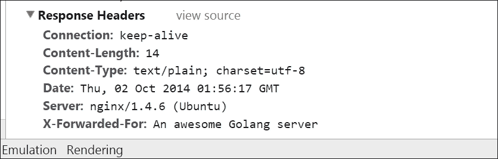
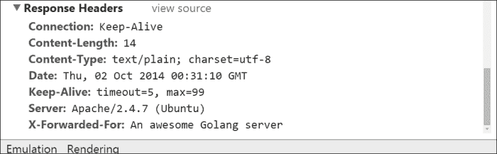

# 第七章。与其他 Web 技术合作

在上一章中，我们看了我们的 Web 服务如何通过 API 或 OAuth 集成与其他 Web 服务良好地配合和集成。

继续这个思路，我们将在开发我们的社交网络服务周围的技术时停下来，看看我们如何还可以独立于其他服务集成其他技术。

很少有应用程序仅在一个语言、一个服务器类型或甚至一个代码集上运行。通常有多种语言、操作系统和多个进程的指定目的。您可能在 Ubuntu 上使用 Go 运行 Web 服务器，这是运行 PostgreSQL 的数据库服务器。

在本章中，我们将讨论以下主题：

+   通过反向代理来提供我们的 Web 流量，以利用成熟的 HTTP 产品提供的更高级功能

+   连接到 NoSQL 或键/值数据存储，我们可以将其用作我们的核心数据提供程序，或者用它来进行辅助工作，如缓存

+   为我们的 API 启用会话，并允许客户和用户在不再指定凭据的情况下发出请求

+   允许用户通过添加其他用户到他们的网络来互相连接

当我们完成所有这些时，您应该对如何将您的 Web 服务与不同于 MySQL 的 NoSQL 和数据库解决方案连接有所了解。我们将在以后利用数据存储来在第十章*最大化性能*中提供性能提升。

您还希望熟悉一些处理 API 的开箱即用解决方案，能够将中间件引入您的 Web 服务，并能够利用消息传递在不和谐或分离的系统之间进行通信。

让我们开始看看我们可以如何连接到其他 Web 服务器，以将一些额外的功能和故障处理引入我们目前仅由 Go 的`net/http`包提供服务的服务中。

# 通过反向代理进行服务

Go 内部 HTTP 服务器最突出的功能之一可能也引发了立即的怀疑回应：如果使用 Go 轻松启动应用程序服务，那么它是否与 Web 服务相关的功能齐全呢？

这是一个可以理解的问题，特别是考虑到 Go 与解释脚本语言的相似性。毕竟，Ruby on Rails、Python、NodeJS，甚至 PHP 都带有开箱即用的简单 Web 服务器。由于它们在功能集、安全更新等方面的限制，很少有人建议将这些简单服务器用作生产级服务器。

话虽如此，Go 的`http`包对于许多生产级项目来说已经足够强大；然而，通过将 Go 与具有更成熟的 Web 服务器的反向代理集成，您可能不仅会发现一些缺失的功能，还会发现一些可靠性。

“反向代理”是一个错误的名称，或者至少是一种笨拙的方式来说明一个内部的、传入的代理，它将客户端请求不透明地通过一个系统路由到另一个服务器，无论是在同一台机器还是网络中。事实上，出于这个原因，它通常被简单地称为网关。

潜在的优势是多方面的。这些包括能够使用一个众所周知、得到充分支持、功能齐全的 Web 服务器（而不仅仅是在 Go 中构建自己的构建块）、拥有庞大的社区支持，以及拥有大量预构建的可用插件和工具。

是否有必要或有利，或者投资回报率如何，这取决于个人偏好和所处情况，但通常可以帮助记录和调试 Web 应用程序。

# 使用 Go 与 Apache

Apache 的 Web 服务器是 Web 服务器中的元老。自 1996 年首次发布以来，它迅速成为了一支坚实的力量，截至 2009 年，它已为超过 1 亿个网站提供服务。自诞生后不久，它一直是世界上最受欢迎的 Web 服务器，尽管一些估计将 Nginx 列为新的第一名（我们将在稍后谈一些关于这个的更多内容）。

将 Go 放在 Apache 后面非常容易，但有一个注意事项；Apache 默认安装时是一个阻塞的、非并发的 Web 服务器。这与 Go 不同，Go 将请求划分为 goroutines 或 NodeJS 甚至 Nginx。其中一些绑定到线程，一些没有。Go 显然没有绑定，这最终影响了服务器的性能。

首先，让我们在 Go 中创建一个简单的`hello world` Web 应用程序，我们将其称为`proxy-me.go`：

```go
package main

import (
        "fmt"
        "log"
        "net/http"
)

func ProxyMe(w http.ResponseWriter, r *http.Request) {

        fmt.Fprintln(w, "hello world")
}

func main() {
        http.HandleFunc("/hello", ProxyMe)
        log.Fatal(http.ListenAndServe(":8080", nil))
}
```

这里没有太复杂的东西。我们在端口 8080 上监听，并且有一个非常简单的路由`/hello`，它只是说`hello world`。要让 Apache 作为透传的反向代理提供此服务，我们编辑我们的默认服务器配置如下：

```go
ProxyRequests Off
ProxyPreserveHost On

<VirtualHost *:80>

        ServerAdmin webmaster@localhost
        DocumentRoot /var/www/html

        ProxyPass /  http://localhost:8080/
        ProxyPassReverse /  http://localhost:8080/

        ErrorLog ${APACHE_LOG_DIR}/error.log
        CustomLog ${APACHE_LOG_DIR}/access.log combined

</VirtualHost>
```

### 提示

默认服务器配置通常存储在 Linux 的`/etc/apache2/sites-enabled/`和 Windows 的`[驱动器]:/[apache 安装目录]/conf/`中。

我们可以通过查看对`/hello`路由的请求的标头来验证我们看到的页面是由 Apache 提供而不是直接通过 Go 提供的。

当我们这样做时，我们不仅会看到服务器是**Apache/2.4.7**，还会看到我们传递的自定义标头。通常，我们会为其他目的使用**X-Forwarded-For**标头，但这足够类似，可以用作演示，如下面的屏幕截图所示：



# Go 和 NGINX 作为反向代理

尽管 Apache 是 Web 服务器的老大哥，但近年来，它在某些方面的受欢迎程度已被 Nginx 超越。

Nginx 最初是作为解决 C10K 问题的方法编写的——提供 1 万个并发连接。这并不是一个不可能的任务，但以前需要昂贵的解决方案来解决它。

由于 Apache 默认会生成新的线程和/或进程来处理新请求，它经常在重负载下挣扎。

另一方面，Nginx 设计为采用异步事件模型，不会为每个请求生成新进程。在许多方面，这使得它与 Go 在 HTTP 包中的并发工作方式互补。

与 Apache 一样，将 Nginx 放在 Go 之后的好处如下：

+   它有访问和错误日志。这是您需要使用 Go 中的日志包构建的内容。虽然这很容易做到，但这是一个更少的麻烦。

+   它具有非常快的静态文件服务。事实上，Apache 用户经常使用 Nginx 专门用于提供静态文件。

+   它具有 SPDY 支持。SPDY 是一种新的、有些实验性的协议，它操纵 HTTP 协议引入了一些速度和安全功能。有一些尝试实现 Go 的 HTTP 和 TLS 包库用于 SPDY，但还没有在 net/HTTP 包中构建出来。

+   它具有内置的缓存选项和流行缓存引擎的钩子。

+   它具有将一些请求委托给其他进程的灵活性。

我们将在第十章*最大化性能*中直接讨论在 Nginx 和 Go 中使用 SPDY。

值得注意的是，异步、非阻塞和并发的 HTTP 服务几乎总是受到技术外部因素的限制，比如网络延迟、文件和数据库阻塞等。

考虑到这一点，让我们来看一下快速将 Nginx 作为反向代理而不是 Go 的设置。

Nginx 允许通过简单修改默认配置文件进行透传。Nginx 目前还没有对 Windows 的原生支持；因此，在大多数*nix 解决方案中，可以通过导航到`/etc/nginx/sites-enabled`找到该文件。

### 提示

或者，您可以通过在`/etc/nginx/nginx.conf`中的`.conf`文件中进行更改来全局代理。

让我们看一个样本 Nginx 配置操作，让我们代理我们的服务器。

```go
server {
        listen 80 default_server;
        listen [::]:80 default_server ipv6only=on;
        root /usr/share/nginx/html;
        index index.html index.htm;

        # Make site accessible from http://localhost/
        server_name localhost;

        location / {
                proxy_set_header X-Real-IP $remote_addr;
                proxy_set_header X-Forwarded-For $remote_addr;
                proxy_set_header Host $host;
                proxy_pass http://127.0.0.1:8080;
                #       try_files $uri $uri/ =404;

        }
```

有了这个修改，您可以通过运行`/etc/init.d/nginx`来启动 Nginx，然后通过`go run proxy-me.go`来启动 Go 服务器。

如果我们访问本地主机实现，我们将看到与上次请求的标头非常相似，但代理服务器是 Nginx 而不是 Apache：



# 为 API 启用会话

大多数情况下，我们会为机器暴露 API。换句话说，我们期望一些应用程序将直接与我们的网络服务进行交互，而不是用户。

然而，情况并非总是如此。有时，用户直接或通过 JavaScript 与 JSONP 和/或 AJAX 请求等方式使用浏览器与 API 进行交互。

事实上，Web 2.0 美学的基本原则在于为用户提供无缝的、类似桌面的体验。这在今天已经实现，并包括许多处理表示层的 JavaScript MVC 框架。我们将在下一章中解决这个问题。

Web 2.0 这个术语已经基本被取代，现在通常被称为**单页应用**或**SPA**。曾经是一种混合了服务器生成（或提供）HTML 页面和一些通过 XML 和 JavaScript 构建或更新的部分，现在已经让位给了构建整个客户端应用程序的 JavaScript 框架。

这些几乎都依赖于底层 API，通常通过 HTTP/HTTPS 进行无状态请求访问，尽管一些较新的模型使用 Web 套接字来实现服务器和表示模型之间的实时通信。这也是我们将在下一章中看到的内容。

无论模型如何，您都不能简单地将此 API 暴露给世界而不进行一些身份验证。例如，如果 API 可以在没有身份验证的情况下从`/admin`请求访问，那么它很可能也可以从外部访问。您不能依赖用户的信息，比如 HTTP 引用者。

### 提示

语法学家可能会注意到上一句中引用者的拼写错误。然而，这不是一个打字错误。在最初的 HTTP 请求评论提案中，该术语的拼写中没有双* r*，自那时以来它基本上一直保持不变。

然而，当用户在每个页面上进行多次请求时，依赖每个 OAuth 请求就有些过度了。您可以在本地存储或 cookie 中缓存令牌，但前者的浏览器支持仍然有限，后者会限制令牌的撤销。

这方面的一个传统而简单的解决方案是允许基于 cookie 的身份验证会话。您可能仍然希望为主应用程序之外的访问开放 API，以便可以通过 API 密钥或 OAuth 进行身份验证，但它还应该允许用户直接使用客户端工具与其进行交互，以提供清晰的 SPA 体验。

## RESTful 设计中的会话

值得注意的是，因为会话通常强制执行某种状态，它们并不被认为是 RESTful 设计的一部分。然而，也可以说会话仅用于身份验证而不是状态。换句话说，身份验证和会话 cookie 可以被单独用作验证身份的方法。

当然，您也可以通过在每个安全请求中传递用户名和密码来实现这一点。这本身并不是一种不安全的做法，但这意味着用户需要在每个请求中提供这些信息，或者这些信息需要被本地存储。这就是存储在 cookie 中的会话试图解决的问题。

正如前面提到的，这永远不会适用于第三方应用程序，因为它们大部分需要某种易于撤销的密钥来工作，很少有用户名和密码（尽管我们的用户名和密码与用户绑定，所以从技术上讲也有）。

最简单的方法是允许用户名和密码直接进入 URL 请求，有时你可能会看到这种情况。这里的风险是，如果用户意外地分享了完整的 URL，数据将会被泄露。事实上，这在新手 GitHub 用户中经常发生，因为可能会自动推送包含 GitHub 密码的配置文件。

为了减少这种风险，我们应该要求用户名和密码通过标头字段传递，尽管它仍然是明文的。假设一个可靠的 TSL（或 SSL）选项已经就位，请求标头中的明文并不是一个固有的问题，但如果应用程序随时可以切换到（或被访问到）不安全的协议，这可能会成为一个问题。这是一个有时间限制的令牌系统试图解决的问题。

我们可以将会话数据存储在任何地方。我们的应用目前使用的是 MySQL，但会话数据将经常被读取。因此，在数据库中存储几乎没有关系信息的信息并不理想。

记住，我们将存储一个活跃用户，他们会话的开始时间，最后更新时间（每次请求都会更改），以及他们在应用程序中的位置。我们的应用程序可以使用这些信息来告诉用户他们的朋友目前在我们的社交网络中做什么。

考虑到这些条件，依赖我们的主要数据存储并不是一个理想的解决方案。我们想要的是更加短暂、更快速、更具并发性的东西，可以在不影响我们的数据存储的情况下处理许多连续的请求。

如今处理会话的最流行解决方案之一是将关系数据库转移到包括文档和列存储或键值数据存储在内的 NoSQL 解决方案中。

# 在 Go 中使用 NoSQL

很久以前，数据存储和检索的世界几乎完全被限制在关系数据库的领域。在我们的应用程序中，我们使用的是 MySQL，主要是因为它一直是快速应用程序的通用语言，而且 SQL 在类似的数据库（如微软的 SQL Server、PostgreSQL、Oracle 等）之间相对容易转换。

然而，近年来，对 NoSQL 进行了大力推动。更准确地说，推动的是依赖于典型关系数据库结构和模式较少的数据存储解决方案，而更多地依赖于高性能的键值存储。

键值存储正是任何使用关联数组、哈希和映射（在 Go 中）的人所期望的，即与一个键相关联的一些任意数据。许多这些解决方案非常快，因为它们缺乏索引关系、减少了锁定，并且不太强调一致性。事实上，许多解决方案在开箱即用时不保证 ACID 性（但一些提供了可选的使用方法）。

### 注意

**ACID**指的是开发人员在数据库应用程序中期望的属性。在任何给定的 NoSQL 或键值数据存储解决方案中，这些属性可能有一些或全部缺失或是可选参数。**ACID**这个术语可以详细解释如下：

+   **原子性**：这表示事务的所有部分必须成功才能成功

+   **一致性**：这指的是事务完成之前，数据库在事务开始时的状态不会发生变化

+   **隔离性**：这指的是防止访问处于事务状态的数据的表或行锁定机制

+   **持久性**：这确保了成功的事务可以并且将在系统或应用程序故障时幸存

NoSQL 解决方案可以用于许多不同的事情。它们可以直接替代 SQL 服务器。它们可以用一些需要较少一致性的数据来补充数据。它们可以作为快速可访问的、自动过期的缓存结构。我们稍后会看到这一点。

如果您选择在应用程序中引入 NoSQL 解决方案，请考虑这可能给您的应用程序带来的潜在影响。例如，您可以考虑 ACID 属性的潜在权衡是否会被新解决方案提供的性能提升和水平可扩展性所抵消。

虽然几乎所有的 SQL 或传统关系数据库解决方案都与 Go 的`database/sql`包有一些集成，但对于需要某种包装器的键值存储来说，情况并非总是如此。

现在，我们将简要介绍一些最受欢迎的键值存储解决方案，当我们在下一节讨论缓存时，我们将回来使用 NoSQL 作为基本缓存解决方案。

### 注意

尽管最近有所复苏，但 NoSQL 并不是一个新概念。根据定义，任何避开 SQL 或关系数据库概念的东西都可以称为 NoSQL，自上世纪 60 年代以来就有数十种这样的解决方案。可能需要提到的是，我们不会花时间在这些解决方案上——比如 Ken Thompson 的 DBM 或 BerkeleyDB——而是更现代的故事。

在我们开始探索各种 NoSQL 解决方案来处理会话之前，让我们通过提供替代的用户名/密码身份验证来在我们的应用程序中启用它们。

您可能还记得当我们启用了第三方身份验证代理时，我们在`CheckLogin()`函数中启用了会话并将它们存储在我们的 MySQL 数据库中。这个函数只会在对`ApplicationAuthorize`函数的`POST`请求的响应中调用。我们将扩展到更多的方法。首先，让我们创建一个新函数叫做`CheckSession()`，如果它不存在的话，它将验证 cookie 的会话 ID，然后根据我们的会话存储进行验证：

```go
func CheckSession(w http.ResponseWriter, r *http.Request) bool {

}
```

您可能还记得我们在`api.go`中有一个基本的会话结构和一个方法。我们也将把这些移到会话中：

```go
var Session UserSession
```

这个命令变成了以下内容：

```go
var Session Sessions.UserSession
```

为了创建我们的会话存储，我们将在 API 的子目录/会话中创建一个名为`sessions.go`的新包。这是一个没有任何 NoSQL 特定方法的骨架：

```go
package SessionManager

import
(
  "log"
  "time"
  "github.com/gorilla/sessions"
  Password "github.com/nkozyra/api/password"
)

var Session UserSession

type UserSession struct {
  ID              string
  GorillaSesssion *sessions.Session
  UID             int
  Expire          time.Time
}

func (us *UserSession) Create() {
  us.ID = Password.GenerateSessionID(32)
}

type SessionManager struct {

}

func GetSession() {

  log.Println("Getting session")
}

func SetSession() {

  log.Println("Setting session")
}
```

让我们看一些与 Go 有强大第三方集成的简单 NoSQL 模型，以便检查我们如何保持这些会话分离，并以一种使客户端可以安全访问我们的 API 的方式启用它们。

## Memcached

我们将从 Memcached 开始，特别是因为它不像我们的其他选择那样真正是一个数据存储。虽然从某种意义上说它仍然是一个键值存储，但它是一个维护数据仅在内存中的通用缓存系统。

由 Brad Fitzpatrick 为曾经非常流行的 LiveJournal 网站开发，旨在减少对数据库的直接访问量，这是 Web 开发中最常见的瓶颈之一。

Memcached 最初是用 Perl 编写的，但后来被重写为 C，并且已经达到了大规模使用的程度。

这些的优缺点已经显而易见——您可以获得内存的速度，而不会受到磁盘访问的拖累。这显然是巨大的，但它排除了使用应该是一致和容错的数据而不经过一些冗余处理。

因此，它非常适合缓存呈现层和会话的片段。会话本来就是短暂的，而 Memcached 的内置过期功能允许您为任何单个数据设置最大年龄。

也许 Memcached 最大的优势是它的分布式特性。这允许多个服务器在网络中共享内存值的数据。

### 注意

值得注意的是，Memcached 作为先进先出系统运行。过期只是为了编程目的而必要。换句话说，除非您需要在特定时间过期，否则没有必要强制设置最大年龄。

在`api.go`文件中，我们将检查一个 cookie 是否与我们的 Memcached 会话代理匹配，或者我们将创建一个会话：

```go
func CheckSession(w http.ResponseWriter, r *http.Request) bool {
  cookieSession, err := r.Cookie("sessionid")
  if err != nil {
    fmt.Println("Creating Cookie in Memcache")
    Session.Create()
    Session.Expire = time.Now().Local()
    Session.Expire.Add(time.Hour)
    Session.SetSession()
  } else {
    fmt.Println("Found cookie, checking against Memcache")
    ValidSession,err := Session.GetSession(cookieSession.Value)
    fmt.Println(ValidSession)
    if err != nil {
      return false
    } else {
      return true
    }

  }
  return true
}
```

然后，这是我们的`sessions.go`文件：

```go
package SessionManager

import
(
  "encoding/json"
  "errors"
  "time"
  "github.com/bradfitz/gomemcache/memcache"
  "github.com/gorilla/sessions"	
  Password "github.com/nkozyra/api/password"	

)

var Session UserSession

type UserSession struct {
  ID              string `json:"id"`
  GorillaSesssion *sessions.Session `json:"session"`
  SessionStore  *memcache.Client `json:"store"`
  UID             int `json:"uid"`
  Expire          time.Time `json:"expire"`
}

func (us *UserSession) Create() {
  us.SessionStore = memcache.New("127.0.0.1:11211")
  us.ID = Password.GenerateSessionID(32)
}

func (us *UserSession) GetSession(key string) (UserSession, error) {
  session,err := us.SessionStore.Get(us.ID)
  if err != nil {
    return UserSession{},errors.New("No such session")
  } else {
    var tempSession = UserSession{}
    err := json.Unmarshal(session.Value,tempSession)
    if err != nil {

    }
    return tempSession,nil
  }
}
```

`GetSession()`尝试通过键获取会话。如果它存在于内存中，它将直接将其值传递给引用的`UserSession`。请注意，在验证以下代码中的会话时，我们进行了一些微小的更改。我们将 cookie 的到期时间增加了一个小时。这是可选的，但如果用户在最后一次操作后一个小时离开，它允许会话保持活动状态：

```go
func (us *UserSession) SetSession() bool {
  jsonValue,_ := json.Marshal(us)
  us.SessionStore.Set(&memcache.Item{Key: us.ID, Value: []byte(jsonValue)})
  _,err := us.SessionStore.Get(us.ID)
  if err != nil {
      return false
  }
    Session.Expire = time.Now().Local()
    Session.Expire.Add(time.Hour)
    return true
}
```

### 注意

Brad Fitzpatrick 已经加入了 Google 的 Go 团队，因此他在 Go 中编写了一个 Memcached 实现应该不足为奇。同样，这也不足为奇，这是我们在这个示例中将使用的实现。

您可以在[`github.com/bradfitz/gomemcache`](https://github.com/bradfitz/gomemcache)了解更多信息，并使用`go get github.com/bradfitz/gomemcache/memcache`命令进行安装。

## MongoDB

MongoDB 是后来 NoSQL 解决方案中较早的大名鼎鼎的一个；它是一个依赖于具有开放式模式的类 JSON 文档的文档存储。Mongo 的格式称为 BSON，即二进制 JSON。因此，可以想象，这打开了一些不同的数据类型，即 BSON 对象和 BSON 数组，它们都以二进制数据而不是字符串数据存储。

### 注意

您可以在[`bsonspec.org/`](http://bsonspec.org/)了解有关二进制 JSON 格式的更多信息。

作为超集，BSON 不会提供太多的学习曲线，而且我们也不会使用二进制数据进行会话存储，但在某些情况下存储数据是有用且节省的。例如，在 SQL 数据库中的 BLOB 数据。

近年来，随着更新、功能更丰富的 NoSQL 解决方案的出现，MongoDB 已经赢得了一些批评者，但您仍然可以欣赏和利用它提供的简单性。

有一些不错的 MongoDB 和 Go 包，但最成熟的是 mgo。

### 注意

+   有关 MongoDB 的更多信息和下载链接，请访问[`www.mongodb.org/`](http://www.mongodb.org/)

+   mgo 可以在[`labix.org/mgo`](https://labix.org/mgo)找到，并且可以使用`go get gopkg.in/mgo.v2`命令进行安装

MongoDB 没有内置的图形用户界面，但有许多第三方界面，其中很多是基于 HTTP 的。在这里，我会推荐 Genghis ([`genghisapp.com/`](http://genghisapp.com/))，它只使用一个文件，可以用于 PHP 或 Ruby。

让我们看看如何从身份验证跳转到使用 Mongo 进行会话存储和检索。

我们将用另一个示例取代我们之前的示例。创建第二个文件和另一个名为`sessions2.go`的包子目录。

在我们的`api.go`文件中，将导入调用从`Sessions "github.com/nkozyra/api/sessions"`更改为`Sessions "github.com/nkozyra/api/sessionsmongo"`。

我们还需要用 mgo 版本替换`"github.com/bradfitz/gomemcache/memcache"`的导入，但由于我们只是修改存储平台，大部分内容仍然保持不变：

```go
package SessionManager

import
(
  "encoding/json"
  "errors"

  "log"
  "time"
  mgo "gopkg.in/mgo.v2"
  _ "gopkg.in/mgo.v2/bson"
  "github.com/gorilla/sessions"
  Password "github.com/nkozyra/api/password"

)

var Session UserSession

type UserSession struct {
  ID              string `bson:"_id"`
  GorillaSesssion *sessions.Session `bson:"session"`
  SessionStore  *mgo.Collection `bson:"store"`
  UID             int `bson:"uid"`
  Value         []byte `bson:"Valid"`
  Expire          time.Time `bson:"expire"`
}
```

在这种情况下，我们结构的重大变化是将我们的数据设置为 BSON 而不是字符串文字属性中的 JSON。这实际上并不重要，它仍然可以与`json`属性类型一起使用。

```go
func (us *UserSession) Create() {
 s, err := mgo.Dial("127.0.0.1:27017/sessions")
  defer s.Close()
  if err != nil {
    log.Println("Can't connect to MongoDB")
 } else {
 us.SessionStore = s.DB("sessions").C("sessions")
  }
  us.ID = Password.GenerateSessionID(32)
}
```

我们的连接方法显然会发生变化，但我们还需要在一个集合中工作（这类似于数据库术语中的表），因此我们连接到我们的数据库，然后连接到两者都命名为`session`的集合：

```go
func (us *UserSession) GetSession(key string) (UserSession, error) {
  var session UserSession
  err := us.SessionStore.Find(us.ID).One(session)
  if err != nil {
    return UserSession{},errors.New("No such session")
  } 
    var tempSession = UserSession{}
    err := json.Unmarshal(session.Value,tempSession)
    if err != nil {

    }
    return tempSession,nil

}
```

`GetSession()`的工作方式几乎完全相同，除了数据存储方法被切换为`Find()`。`mgo.One()`函数将单个文档（行）的值分配给一个接口。

```go
func (us *UserSession) SetSession() bool {
  jsonValue,_ := json.Marshal(us)
 err := us.SessionStore.Insert(UserSession{ID: us.ID, Value: []byte(jsonValue)})
  if err != nil {
      return false
  } else {
    return true
  }
}
```

# 使用用户名和密码启用连接

为了允许用户输入他们自己的连接的用户名和密码，而不是依赖令牌或者开放 API 端点，我们可以创建一个可以直接调用到任何特定函数中的中间件。

在这种情况下，我们将进行几次身份验证。这是`/api/users` GET 函数中的一个例子，它之前是开放的：

```go
  authenticated := CheckToken(r.FormValue("access_token"))

  loggedIn := CheckLogin(w,r)
  if loggedIn == false {
    authenticated = false
    authenticatedByPassword := MiddlewareAuth(w,r)
    if authenticatedByPassword == true {
        authenticated = true
    }
  } else {
    authenticated = true
  }

  if authenticated == false {
    Response := CreateResponse{}
    _, httpCode, msg := ErrorMessages(401)
    Response.Error = msg
    Response.ErrorCode = httpCode
    http.Error(w, msg, httpCode)
   return 
  }
```

您可以在这里看到我们所做的通行证。首先，我们检查令牌，然后检查现有会话。如果不存在，我们检查登录`用户名`和`密码`并验证它们。

如果这三个都失败了，那么我们返回一个未经授权的错误。

现在，我们在代码的另一个部分中已经有了`MiddlewareAuth()`函数，名为`ApplicationAuthorize()`，所以让我们把它移动一下：

```go
func MiddlewareAuth(w http.ResponseWriter, r *http.Request) (bool, int) {

  username := r.FormValue("username")
  password := r.FormValue("password")

  var dbPassword string
  var dbSalt string
  var dbUID string

  uerr := Database.QueryRow("SELECT user_password, user_salt, user_id from users where user_nickname=?", username).Scan(&dbPassword, &dbSalt, &dbUID)
  if uerr != nil {

  }

  expectedPassword := Password.GenerateHash(dbSalt, password)

  if (dbPassword == expectedPassword) {
    return true, dbUID
  } else {
    return false, 0
  }
}
```

如果用户通过`GET`方法访问`/api/users`端点，现在他们将需要一个`用户名`和`密码`组合，一个`access_token`，或者在 cookie 数据中有一个有效的会话。

在有效的身份验证时，我们还返回预期的`user_id`，否则将返回值为 0。

# 允许我们的用户相互连接

让我们退一步，为我们的应用程序添加一些社交网络特有的功能——创建连接的能力，比如加好友。在大多数社交网络中，这将授予与好友相连的数据的读取权限。

由于我们已经有一个有效的视图来查看用户，我们可以创建一些新的路由来允许用户发起连接。

首先，让我们在`api.go`文件的`Init()`函数中添加一些端点：

```go
for _, domain := range allowedDomains {
  PermittedDomains = append(PermittedDomains, domain)
}
Routes = mux.NewRouter()
Routes.HandleFunc("/interface", APIInterface).Methods("GET", "POST", "PUT", "UPDATE")
Routes.HandleFunc("/api/users", UserCreate).Methods("POST")
Routes.HandleFunc("/api/users", UsersRetrieve).Methods("GET")
Routes.HandleFunc("/api/users/{id:[0-9]+}", UsersUpdate).Methods("PUT")
Routes.HandleFunc("/api/users", UsersInfo).Methods("OPTIONS")
Routes.HandleFunc("/api/statuses", StatusCreate).Methods("POST")
Routes.HandleFunc("/api/statuses", StatusRetrieve).Methods("GET")
Routes.HandleFunc("/api/statuses/{id:[0-9]+}", StatusUpdate).Methods("PUT")
Routes.HandleFunc("/api/statuses/{id:[0-9]+}", StatusDelete).Methods("DELETE")
Routes.HandleFunc("/api/connections", ConnectionsCreate).Methods("POST")
Routes.HandleFunc("/api/connections", ConnectionsDelete).Methods("DELETE")
Routes.HandleFunc("/api/connections", ConnectionsRetrieve).Methods("GET")

```

### 注意

请注意，我们这里没有`PUT`请求方法。由于我们的连接是友谊和二进制的，它们不会被更改，但它们将被创建或删除。例如，如果我们添加一个阻止用户的机制，我们可以将其创建为一个单独的连接类型，并允许对其进行更改。

让我们设置一个数据库表来处理这些：

```go
CREATE TABLE IF NOT EXISTS `users_relationships` (
  `users_relationship_id` int(13) NOT NULL,
  `from_user_id` int(10) NOT NULL,
  `to_user_id` int(10) NOT NULL,
  `users_relationship_type` varchar(10) NOT NULL,
  `users_relationship_timestamp` timestamp NOT NULL DEFAULT CURRENT_TIMESTAMP,
  `users_relationship_accepted` tinyint(1) NOT NULL DEFAULT '0',
  PRIMARY KEY (`users_relationship_id`),
  KEY `from_user_id` (`from_user_id`),
  KEY `to_user_id` (`to_user_id`),
  KEY `from_user_id_to_user_id` (`from_user_id`,`to_user_id`),
  KEY `from_user_id_to_user_id_users_relationship_type` (`from_user_id`,`to_user_id`,`users_relationship_type`)
)
```

有了这个设置，我们现在可以复制我们用来确保用户对我们的`/api/connections` `POST`方法进行身份验证的代码，并允许他们发起好友请求。

让我们看一下`ConnectionsCreate()`方法：

```go
func ConnectionsCreate(w http.ResponseWriter, r *http.Request) {
  log.Println("Starting retrieval")
  var uid int
  Response := CreateResponse{}
  authenticated := false
  accessToken := r.FormValue("access_token")
  if accessToken == "" || CheckToken(accessToken) == false {
    authenticated = false
  } else {
    authenticated = true
  }

  loggedIn := CheckLogin(w,r)
  if loggedIn == false {
    authenticated = false
    authenticatedByPassword,uid := MiddlewareAuth(w,r)
    if authenticatedByPassword == true {
        fmt.Println(uid)
        authenticated = true
    }
  } else {
    uid = Session.UID
    authenticated = true
  }

  if authenticated == false {

    _, httpCode, msg := ErrorMessages(401)
    Response.Error = msg
    Response.ErrorCode = httpCode
    http.Error(w, msg, httpCode)
    return
  }
```

这与我们的`/api/users` `GET`函数的代码相同。在查看完整示例之后，我们将回到这里。

```go
  toUID := r.FormValue("recipient")
  var count int
  Database.QueryRow("select count(*) as ucount from users where user_id=?",toUID).Scan(&count)

  if count < 1 {
    fmt.Println("No such user exists")
    _, httpCode, msg := ErrorMessages(410)
    Response.Error = msg
    Response.ErrorCode = httpCode
    http.Error(w, msg, httpCode)
    return
```

在这里，我们检查是否存在用户。如果我们试图连接到一个不存在的用户，我们返回一个 410：Gone 的 HTTP 错误。

```go
  } else {
    var connectionCount int
    Database.QueryRow("select count(*) as ccount from users_relationships where from_user_id=? and to_user_id=?",uid, toUID).Scan(&connectionCount)
    if connectionCount > 0 {
      fmt.Println("Relationship already exists")
      _, httpCode, msg := ErrorMessages(410)
            Response.Error = msg
      Response.ErrorCode = httpCode
      http.Error(w, msg, httpCode)
      return
```

在这里，我们检查是否已经发起了这样的请求。如果是，我们还会传递一个 Gone 引用错误。如果没有满足这些错误条件中的任何一个，那么我们可以创建一个关系：

```go
    } else {
      fmt.Println("Creating relationship")
      rightNow := time.Now().Unix()
      Response.Error = "success"
      Response.ErrorCode = 0
      _,err := Database.Exec("insert into users_relationships set from_user_id=?, to_user_id=?, users_relationship_type=?, users_relationship_timestamp=?",uid, toUID, "friend", rightNow)
      if err != nil {
        fmt.Println(err.Error())
      } else {
        output := SetFormat(Response)
        fmt.Fprintln(w, string(output))
      }
    }
  }
}
```

成功调用后，我们在认证用户和目标用户之间创建一个待处理的用户关系。

您可能已经注意到了这个函数中的代码重复。这通常是通过中间件解决的，Go 有一些可用的选项可以在这个过程中注入。在下一章中，我们将看一些框架和包，它们也可以帮助构建我们自己的中间件。

# 总结

现在我们有了一个功能齐全的社交网络，可以通过强制 TLS 的 Web 服务进行访问，用户可以进行身份验证，并且可以与其他用户进行交互。

在本章中，我们还研究了将会话管理转移到 NoSQL 数据库，并使用其他 Web 服务器代替 Go 来提供额外的功能和故障转移保护。

在下一章中，我们将进一步完善我们的社交网络，尝试从客户端与我们的 API 进行交互。有了这个基础，我们可以让用户直接通过客户端界面进行身份验证和与 API 进行交互，而不需要 API 令牌，同时保留使用第三方令牌的能力。

我们还将研究如何使用 Go 与补充的前端框架，比如 Go 和 Meteor，以提供更具响应性、类似应用的网络界面。
