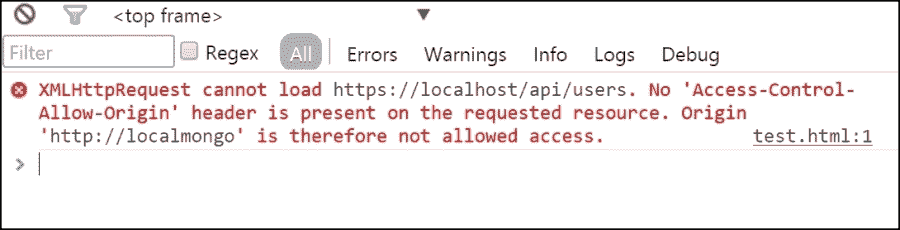
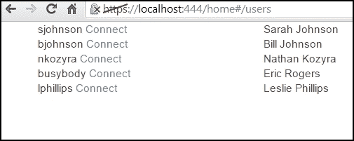
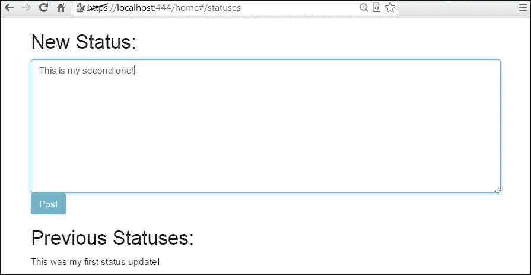

# 第八章。Web 的响应式 Go

如果您花费了任何时间在 Web 上（或者无论如何），开发应用程序，您很快就会发现自己面临从网站内部与 API 进行交互的前景。

在本章中，我们将通过允许浏览器直接通过一些技术作为我们的 Web 服务的传导器来弥合客户端和服务器之间的差距，其中包括谷歌自己的 AngularJS。

在本书的前面，我们为我们的 API 创建了一个临时的客户端接口。这几乎完全是为了通过一个简单的界面查看我们的 Web 服务的细节和输出而存在的。

然而，重要的是要记住，处理 API 的不仅是机器，还有由用户直接发起的客户端接口。因此，我们将考虑以这种格式应用我们自己的 API。我们将通过域名锁定并启用 RESTful 和非 RESTful 属性，使网站能够响应（不一定是移动意义上的响应），并且仅通过使用 HTML5 功能的 API 进行操作。

在本章中，我们将研究：

+   使用像 jQuery 和 AngularJS 这样的客户端框架与我们的服务器端端点相结合

+   使用服务器端框架创建 Web 界面

+   允许我们的用户通过 Web 界面登录，查看其他用户，创建连接并发布消息到我们的 API

+   扩展我们的 Web 服务的功能，并将其扩展为允许通过我们将在 Go 中构建的接口直接访问

+   使用 HTML5 和几个 JavaScript 框架来补充我们的 Go 服务器端框架

# 创建前端界面

在开始之前，我们需要解决浏览器限制客户端到服务器信息流的一些问题。

我们还需要创建一个与我们的 API 一起工作的示例站点。最好在本地主机上的不同端口或另一台机器上进行，因为仅使用`file://`访问就会遇到额外的问题。

### 提示

为了构建 API，与之前的简单演示一样，将接口与 API 捆绑在一起是完全不必要的。

实际上，这可能会在 Web 服务增长时引入混乱。在这个例子中，我们将单独构建我们的界面应用程序，并在端口 444 上运行它。您可以选择任何可用的端口，假设它不会干扰我们的 Web 服务（443）。请注意，在许多系统上，访问端口 1024 及以下需要`root/sudo`。

如果我们尝试在与我们的安全 Web 服务不同的端口上运行接口，我们将遇到跨域资源共享问题。确保我们为客户端和/或 JavaScript 消耗公开的任何端点方法都包括一个`Access-Control-Allow-Origin`头。

### 注意

您可以在[`developer.mozilla.org/en-US/docs/Web/HTTP/Access_control_CORS`](https://developer.mozilla.org/en-US/docs/Web/HTTP/Access_control_CORS)上阅读有关**Access-Control-Allow-Origin**的性质和机制的更多信息。

您可能会诱惑只是使用`*`通配符，但这将导致许多浏览器问题，特别是我们将要研究的前端框架。例如，让我们看看如果我们尝试通过`GET`访问`/api/users`端点会发生什么：



结果可能不可靠，一些框架完全拒绝通配符。使用通配符还会禁用一些您可能感兴趣的关键功能，例如 cookies。

您可以看到我们用来尝试访问 Web 服务以引发此错误的以下代码。该代码是用 Angular 构建的，我们将很快更详细地研究它：

```go
<html>
<head>
  <title>CORS Test</title>
  <script src="img/angular.js"></script>
  <script src="img/angular-route.min.js"></script>
  <script>
    var app = angular.module('testCORS', ['ngRoute']);
    app.controller('testWildcard', ['$scope', '$http', '$location', '$routeParams', function($scope,$http,$location,$routeParams) {
      $scope.messageFromAPI = '';
      $scope.users = [];
      $scope.requestAPI = function() {
        $http.get("https://localhost/api/users").success(function(data,status,headers,config) {
          angular.forEach(data.users, function(val,key) {
          $scope.users.push({name: val.Name});
    })
  });
```

在这里，我们正在向我们的 API 端点发出`GET`请求。如果成功，我们将将用户添加到`$scope.users`数组中，该数组将通过 AngularJS 循环进行迭代，如下所示。如果我们的客户端没有域来源允许，由于浏览器中的跨域政策，这将失败：

```go
      };

      $scope.requestAPI();

    }]);
  </script>
</head>
<body ng-app="testCORS">

  <div ng-controller="testWildcard">
    <h1 ng-model="messageFromAPI">Users</h1>
    <div ng-repeat="user in users">
      {{user.name}}
    </div>
```

这是 AngularJS 处理循环的方式，允许您指定一个与特定于 DOM 的变量或循环直接关联的 JavaScript 数组。

```go
  </div>
</body>
</html>
```

在这个例子中，由于权限问题，我们将得到零个用户。

幸运的是，我们之前在应用程序中通过在`v1.go`文件中引入了一个非常高级的配置设置来解决了这个问题：

```go
  api.Init([]string{"http://www.example.com","http://www.mastergoco.com","http://localhost"})
```

您可能还记得`Init()`函数接受一个允许的域名数组，然后我们可以设置`Access-Control-Allow-Origin`头：

```go
func Init(allowedDomains []string) {
  for _, domain := range PermittedDomains {
    fmt.Println("allowing", domain)
    w.Header().Set("Access-Control-Allow-Origin", domain)
  }
```

如前所述，如果我们设置一个`*`通配符域，一些浏览器和库会产生分歧，通配符来源会导致无法设置 cookie 或遵守 SSL 凭证的能力。我们可以更明确地指定域：

```go
requestDomain := r.Header.Get("Origin")
if requestDomain != "" {
  w.Header.Set("Access-Control-Allow-Origin", requestDomain)
}
```

这使您能够保留 cookie 和 SSL 证书的设置，这些设置遵守了非通配符访问控制头的方面。这确实会带来一些与 cookie 相关的安全问题，因此您必须谨慎使用。

如果此循环在通过网络界面可访问的任何函数中被调用，它将防止跨域问题。

# 登录

与以前一样，我们将使用 Twitter 的 Bootstrap 作为基本的 CSS 框架，这使我们能够快速复制一个我们可能在任何地方在线看到的站点结构。

请记住，我们之前的例子打开了一个登录界面，只是将一个令牌传递给第三方，以便允许该应用程序代表我们的用户执行操作。

由于我们现在试图允许用户直接通过我们的 API（通过浏览器通道）进行接口，我们可以改变操作方式，允许会话作为认证方法。

以前，我们是直接通过 JavaScript 将登录请求发布到 API 本身，但现在我们使用完整的网络界面，没有理由这样做；我们可以直接发布到网络界面本身。这主要意味着放弃`onsubmit="return false"`或`onsubmit="userCreate();"`方法，只需将表单数据发送到`/interface/login`：

```go
func Init(allowedDomains []string) {
  for _, domain := range allowedDomains {
   PermittedDomains = append(PermittedDomains, domain)
  }
  Routes = mux.NewRouter()
  Routes.HandleFunc("/interface", APIInterface).Methods("GET", "POST", "PUT", "UPDATE")
  Routes.HandleFunc("/interface/login", APIInterfaceLogin).Methods("GET")
  Routes.HandleFunc("/interface/login", APIInterfaceLoginProcess).Methods("POST")
  Routes.HandleFunc("/interface/register", APIInterfaceRegister).Methods("GET")
  Routes.HandleFunc("/interface/register", APIInterfaceRegisterProcess).Methods("POST")
```

这为我们提供了足够的内容，允许网络界面利用现有代码创建和登录到我们的帐户，同时仍然通过 API 进行。

# 使用 Go 的客户端框架

虽然我们在本书的大部分时间里构建了一个后端 API，但我们也一直在构建一个相对可扩展的基本服务器端框架。

当我们需要从客户端访问 API 时，我们受到 HTML、CSS 和 JavaScript 的限制。或者，我们可以作为消费者在服务器端呈现页面，并且我们也将在本章中展示这一点。

然而，大多数现代网络应用程序在客户端上运行，通常是在**单页应用程序**或**SPA**中。这试图减少用户必须进行的“硬”页面请求的数量，使站点看起来不太像一个应用程序，而更像是一组文档。

这主要是通过异步 JavaScript 数据请求完成的，它允许 SPA 在响应用户操作时*重新绘制*页面。

起初，这种方法有两个主要缺点：

+   首先，应用程序状态没有得到保留，因此如果用户采取行动并尝试重新加载页面，应用程序将重置。

+   其次，基于 JavaScript 的应用在搜索引擎优化方面表现非常糟糕，因为传统的网络爬虫无法渲染 JavaScript 应用程序。它只会渲染原始的 HTML 应用程序。

但最近，一些标准化和技巧已经帮助减轻了这些问题。

在状态上，SPAs 已经开始利用 HTML5 中的一个新功能，使它们能够在浏览器中修改地址栏和/或历史记录，而无需重新加载，通常是通过使用内联锚点。您可以在 Gmail 或 Twitter 的 URL 中看到这一点，它可能看起来像[`mail.google.com/mail/u/0/#inbox/1494392317a0def6`](https://mail.google.com/mail/u/0/#inbox/1494392317a0def6)。

这使用户能够通过 JavaScript 控制器分享或收藏 URL。

在 SEO 方面，这在很大程度上将 SPAs 局限于管理类型的界面或搜索引擎可访问性不是关键因素的领域。然而，随着搜索引擎开始解析 JavaScript，窗口已经打开，可以广泛使用而不会对 SEO 产生负面影响。

# jQuery

如果你做任何前端工作或查看过地球上最流行的网站之一的源代码，那么你一定遇到过 jQuery。

根据 SimilarTech 的数据，jQuery 被大约 6700 万个网站使用。

jQuery 作为一种标准化 API 的方法发展起来，其中一致性曾经是一项几乎不可能的任务。在微软的 Internet Explorer 和各种程度上坚持标准的浏览器之间，编写跨浏览器代码曾经是一件非常复杂的事情。事实上，以前经常会看到这个网站最好使用标签来查看，因为即使使用了任何给定浏览器的最新版本，也无法保证功能。

当 jQuery 开始流行（在 Prototype、Moo Tools 和 Dojo 等其他类似框架之后），Web 开发领域终于找到了一种方法，可以使用单一接口覆盖大多数现有的现代 Web 浏览器。

## 使用 jQuery 消耗 API

使用 jQuery 处理我们的 API 非常简单。当 jQuery 开始出现时，AJAX 的概念真的开始流行起来。**AJAX**或**异步 JavaScript**和**XML**是朝着利用`XMLHttpRequest`对象获取远程数据并将其注入到 DOM 的 Web 技术的第一次迭代。

具有一定讽刺意味的是，微软，通常被认为是最严重违反网络标准的公司，却在 Microsoft Exchange Server 中为`XMLHttpRequest`奠定了基础，从而导致了 AJAX 的出现。

当然，如今 XML 很少成为谜题的一部分，因为这些库中消耗的大部分内容都是 JSON。您仍然可以使用 XML 作为源数据，但您的响应可能会比必要的更冗长。

进行简单的`GET`请求非常简单，因为 jQuery 提供了一个简单的快捷函数，称为`getJSON`，您可以使用它从我们的 API 获取数据。

现在，我们将遍历我们的用户，并创建一些 HTML 数据注入到现有的 DOM 元素中：

```go
<script>

  $(document).ready(function() {
    $.getJSON('/api/users',function() {
        html = '';
      $(data.users).each(function() {
        html += '<div class="row">';
        html += '<div class="col-lg-3">'+ image + '</div>';
        html += '<div class="col-lg-9"><a href="/connect/'+this.ID+'/" >'+ this.first + ' ' + this.last + '</a></div>';
        html += '</div>';
      });
    });
  });
</script>
```

然而，`GET`请求只能让我们走得更远。为了完全符合 RESTful 网络服务，我们需要能够执行`GET`、`POST`、`PUT`、`DELETE`和`OPTIONS`头请求。实际上，最后一种方法将很重要，以允许跨不同域的请求。

正如我们之前提到的，`getJSON`是内置的`ajax()`方法的简写函数，它允许您在请求中更具体。例如，`$.getJSON('/api/users')`转换为以下代码：

```go
$.ajax({
  url: '/api/users',
  cache: false,
  type: 'GET', // or POST, PUT, DELETE
});
```

这意味着我们可以通过直接设置`HTTP`方法来技术上处理 API 中的所有端点和方法。

虽然`XMLHttpRequest`接受所有这些头部，但 HTML 表单（至少通过 HTML 4）只接受`GET`和`POST`请求。尽管如此，如果您打算在客户端 JavaScript 中使用`PUT`、`DELETE`、`OPTIONS`或`TRACE`请求，进行一些跨浏览器测试总是一个好主意。

### 注意

您可以在[`jquery.com/`](http://jquery.com/)下载并阅读 jQuery 提供的非常全面的文档。有一些常见的 CDN 可以让您直接包含库，其中最值得注意的是 Google Hosted Libraries，如下所示：

`<script src="img/jquery.min.js"></script>`

该库的最新版本可在[`developers.google.com/speed/libraries/devguide#jquery`](https://developers.google.com/speed/libraries/devguide#jquery)找到。

## AngularJS

如果我们超越了 jQuery 提供的基本工具集，我们将开始深入研究合法的、完全成型的框架。在过去的五年里，这些框架如雨后春笋般涌现。其中许多是传统的**模型-视图-控制器**（**MVC**）系统，有些是纯模板系统，有些框架同时在客户端和服务器端工作，通过 WebSockets 提供了独特的推送式接口。

与 Go 一样，Angular（或 AngularJS）是由 Google 维护的项目，旨在在客户端提供全功能的 MVC。请注意，随着时间的推移，Angular 已经在设计模式上有所偏离，更多地朝向 MVVM 或 Model View ViewModel，这是一种相关的模式。

Angular 远远超出了 jQuery 提供的基本功能。除了一般的 DOM 操作外，Angular 还提供了真正的控制器作为更大的应用程序的一部分，以及用于强大的单元测试。

除其他功能外，Angular 使得从客户端快速、轻松、愉快地与 API 进行交互成为可能。该框架提供了更多的 MVC 功能，包括能够从`.html`/`template`文件中引入单独的模板的能力。

### 注意

许多人预计实际的推送通知将成为 HTML5 的标准功能，随着规范的成熟。

在撰写本书时，W3C 对推送 API 有一个工作草案。您可以在[`www.w3.org/TR/2014/WD-push-api-20141007/`](http://www.w3.org/TR/2014/WD-push-api-20141007/)了解更多信息。

目前，解决方法包括诸如 Meteor（稍后将讨论）等利用 HTML5 中的 WebSockets 来模拟实时通信，而不受其他浏览器相关限制的束缚，例如在非活动选项卡中的休眠进程等。

## 使用 Angular 消费 API

使 Angular 应用程序能够与 REST API 一起工作，就像 jQuery 一样，直接内置到框架的骨架中。

将此调用与我们刚刚查看的`/api/users`端点进行比较：

```go
$http.$get('/api/users'.
  success(function(data, status, headers, config) {
    html += '<div class="row">';
    html += '<div class="col-lg-3">'+ image + '</div>';
    html += '<div class="col-lg-9"><a href="/connect/'+this.ID+'/" >'+ this.first + ' ' + this.last + '</a></div>';
    html += '</div>';	
  }).
  error(function(data, status, headers, config) {
    alert('error getting API!')
  });
```

除了语法外，Angular 与 jQuery 并没有太大的不同；它也有一个接受回调函数或承诺作为第二参数的方法。但是，与 jQuery 设置方法的属性不同，Angular 为大多数 HTTP 动词提供了简短的方法。

这意味着我们可以直接进行`PUT`或`DELETE`请求：

```go
$http.$delete("/api/statuses/2").success(function(data,headers,config) {
  console.log('Date of response:', headers('Date'))
  console.log(data.message)
}).error(function(data,headers,config) {
  console.log('Something went wrong!');
  console.log('Got this error:', headers('Status'));
});
```

请注意，在前面的示例中，我们正在读取标头值。为了使其跨域工作，您还需要设置一个标头，以便为其他域共享这些标头：

```go
Access-Control-Expose-Headers: [custom values]
```

由于域名在`Access-Control-Allow-Origin`标头中被明确列入白名单，这控制了将可用于客户端而不是域的特定标头键。在我们的情况下，我们将为`Last-Modified`和`Date`值设置一些内容。

### 注意

您可以在[`angularjs.org/`](https://angularjs.org/)阅读更多关于 Angular 并从那里下载它。您还可以直接从 Google Hosted Libraries CDN 包含该库，如下所示：

```go
<script src="img/angular.min.js"></script>

```

您可以在[`developers.google.com/speed/libraries/devguide#angularjs`](https://developers.google.com/speed/libraries/devguide#angularjs)找到该库的最新版本。

# 设置一个消费 API 的前端

为了使用 API，前端将几乎完全不包含内部逻辑。毕竟，整个应用程序都是通过 HTML 调用到 SPA 中的，所以我们除了一个或两个模板之外不需要太多东西。

这是我们的`header.html`文件，其中包含基本的 HTML 代码：

```go
<html>
  <head>Social Network</title>

    <link href="//maxcdn.bootstrapcdn.com/bootstrap/3.3.0/css/bootstrap.min.css" rel="stylesheet">
    <script src="img/jquery.min.js"></script>
    <script src="img/bootstrap.min.js"></script>
    <script src="img/angular.min.js"></script>
    <script src="img/react.min.js"></script>
    <script src="img/application.js"></script>
  </head>

  <body ng-app="SocialNetwork">

    <div ng-view></div>
  </body>
```

带有`application.js`的行很重要，因为那里将存在所有逻辑并利用下面的一个前端框架。

`ng-view`指令只是一个占位符，将根据控制器的路由值替换。我们很快会看到。

请注意，我们在此处调用了 AngularJS、jQuery 和 React。这些都是选项，您不一定需要全部导入。很可能会导致冲突。相反，我们将探讨如何使用它们处理我们的 API。

正如您所期望的，我们的页脚主要是闭合标签：

```go
</body>
</html>
```

我们将利用 Go 的`http`模板系统生成我们的基本模板。这里的示例显示了这一点：

```go
<div ng-controller="webServiceInterface">
  <h1>{{Page.Title}}</h1>
  <div ng-model="webServiceError" style="display:none;"></div>
  <div id="webServiceBody" ng-model="body">
    <!-- nothing here, yet -->

  </div>
</div>
```

这个模板的核心不会是硬编码的，而是由所选择的 JavaScript 框架构建的。

## 为 Web 服务创建客户端 Angular 应用程序

如前所述，`ng-app`元素中的`ng-view`指令是指根据将 URL 与控制器配对的路由动态引入的内容。

更准确地说，它连接了伪 URL 片段（我们之前提到的）构建在`#`锚标签之上。让我们首先通过以下代码片段设置应用程序本身。

```go
var SocialNetworkApp = angular.module('SocialNetwork', ['ngSanitize','ngRoute']);
SocialNetworkApp.config(function($routeProvider) {
  $routeProvider
  .when('/login',
    {
      controller: 'Authentication',
      templateUrl: '/views/auth.html'
    }
  ).when('/users',
    {
      controller: 'Users',
      templateUrl: '/views/users.html'
    }
  ).when('/statuses',
    {
      controller: 'Statuses',
      templateUrl: '/views/statuses.html'
    }
  );
});
```

当访问这些 URL 时，Angular 会告诉它将控制器与模板配对，并将它们放在`ng-view`元素中。这就是允许用户在站点之间导航而不进行硬页面加载的原因。

这是`auth.html`，它位于我们的`/views/`目录中，允许我们登录并执行用户注册：

```go
<div class="container">
  <div class="row">
    <div class="col-lg-5">
      <h2>Login</h2>
      <form>
        <input type="email" name="" class="form-control" placeholder="Email" ng-model="loginEmail" />
        <input type="password" name="" class="form-control" placeholder="Password" ng-model="loginPassword" />
        <input type="submit" value="Login" class="btn" ng-click="login()" />
      </form>
    </div>

    <div class="col-lg-2">
      <h3>- or -</h3>
    </div>

    <div class="col-lg-5">
      <h2>Register</h2>
      <form>
        <input type="email" name="" class="form-control" ng-model="registerEmail" placeholder="Email" ng-keyup="checkRegisteredEmail();" />
        <input type="text" name="" class="form-control" ng-model="registerFirst" placeholder="First Name" />
        <input type="text" name="" class="form-control" ng-model="registerLast" placeholder="Last Name" />
        <input type="password" name="" class="form-control" ng-model="registerPassword" placeholder="Password" ng-keyup="checkPassword();" />
        <input type="submit" value="Register" class="btn" ng-click="register()" />
      </form>
    </div>
  </div>
</div>
```

如前所述，用于控制这一切的 JavaScript 只是我们 API 周围的一个薄包装。这是`Login()`过程：

```go
$scope.login = function() {
  postData = { email: $scope.loginEmail, password: $scope.loginPassword };
  $http.$post('https://localhost/api/users', postData).success(function(data) {

    $location.path('/users');

  }).error(function(data,headers,config) {
    alert ("Error: " + headers('Status'));
  });
};
```

这是`Register()`过程：

```go
$scope.register = function() {
  postData = { user: $scope.registerUser, email: $scope.registerEmail, first: $scope.registerFirst, last: $scope.registerLast, password: $scope.registerPassword };
  $http.$post('https://localhost/api/users', postData).success(function(data) {

    $location.path('/users');

  }).error(function(data,headers,config) {
    alert ("Error: " + headers('Status'));
  });
};
  Routes.HandleFunc("/api/user",UserLogin).Methods("POST","GET")
  Routes.HandleFunc("/api/user",APIDescribe).Methods("OPTIONS")
```

我们想在这里注意`OPTIONS`头。这是 CORS 标准运作的重要部分；基本上，请求通过使用`OPTIONS`动词进行预检调用进行缓冲，返回有关允许的域、资源等信息。在这种情况下，我们在`api.go`中包括一个名为`APIDescribe`的 catchall：

```go
func APIDescribe(w http.ResponseWriter, r *http.Request) {
  w.Header().Set("Access-Control-Allow-Headers", "Origin, X-Requested-With, Content-Type, Accept")
  w.Header().Set("Access-Control-Allow-Origin", "*")
}
```

# 查看其他用户

一旦我们登录，我们应该能够向经过身份验证的用户展示其他用户，以允许他们发起连接。

这是我们如何快速查看我们`users.html` Angular 模板中的其他用户：

```go
<div class="container">
  <div class="row">
    <div ng-repeat="user in users">
      <div class="col-lg-3">{{user.Name}} <a ng-click="createConnection({{user.ID}});">Connect</a></div>
      <div class="col-lg-8">{{user.First}} {{user.Last}}</div>
    </div>

  </div>
</div>
```

我们调用我们的`/api/users`端点，它返回一个已登录用户列表。您可能还记得我们在上一章中将其放在身份验证墙后面。



这个视图没有太多的花哨。这只是一种方式，可以看到您可能有兴趣连接或在我们的社交应用中添加好友的人。

# 在 Go 中服务器端呈现框架

为了构建页面，呈现框架在很大程度上是学术性的，它类似于使用 JavaScript 预渲染页面并返回它们。

因此，我们的 API 消费者的总代码非常简单：

```go
package main

import
(
  "github.com/gorilla/mux"
  "fmt"
  "net/http"
  "html/template"
)
var templates = template.Must(template.ParseGlob("templates/*"))
```

在这里，我们指定一个目录用于模板访问，这在这种情况下是惯用的模板。我们不使用`views`，因为我们将用它来放我们的 Angular 模板，那些 HTML 块被`templateUrl`调用。让我们首先定义我们的 SSL 端口并添加一个处理程序。

```go
const SSLport = ":444"

func SocialNetwork(w http.ResponseWriter, r *http.Request) {
  fmt.Println("got a request")
  templates.ExecuteTemplate(w, "socialnetwork.html", nil)
}
```

这就是我们的端点。现在，我们只是显示 HTML 页面。这可以简单地用任何语言完成，并且可以轻松地与我们的 Web 服务进行接口：

```go
func main() {

  Router := mux.NewRouter()
  Router.HandleFunc("/home", SocialNetwork).Methods("GET")
  Router.PathPrefix("/js/").Handler(http.StripPrefix("/js/", http.FileServer(http.Dir("js/"))))
  Router.PathPrefix("/views/").Handler(http.StripPrefix("/views/", http.FileServer(http.Dir("views/"))))
```

最后两行允许从目录中提供文件。如果没有这些，当我们尝试调用 JavaScript 或 HTML 包含文件时，我们将收到 404 错误。让我们接下来添加我们的 SSL 端口和证书。

```go
  http.ListenAndServeTLS(SSLport, "cert.pem", "key.pem", Router)
  }
```

如前所述，端口的选择甚至是 HTTP 还是 HTTPS 都是完全可选的，只要您允许生成的域在`v1.go`中的允许域列表中。

# 创建状态更新

我们的最后一个例子允许用户查看他们的最新状态更新并创建另一个。它略有不同，因为它在单个视图中调用了两个不同的 API 端点——用于最新状态的循环和发布的能力，也就是创建一个新的状态。

`statuses.html`文件看起来有点像这样：

```go
<div class="container">
  <div class="row">
    <div class="col-lg-12">
       <h2>New Status:</h2>
       <textarea class="form-control" rows="10" ng-mode="newStatus"></textarea>
       <a class="btn btn-info" ng-click="createStatus()">Post</a>
```

在这里，我们在控制器中调用`createStatus()`函数来发布到`/api/statuses`端点。这里显示的其余代码通过 ng-repeat 指令显示了先前状态的列表：

```go
    </div>
  </div>
  <div class="row">
    <div class="col-lg-12">
      <h2>Previous Statuses:</h2>
      <div ng-repeat="status in statuses">
        <div>{{status.text}}></div>
      </div>
  </div>
</div>
```

前面的代码只是简单地显示返回的文本。

```go
SocialNetworkApp.controller('Statuses',['$scope', '$http', '$location', '$routeParams', function($scope,$http,$location,$routeParams) {

  $scope.statuses = [];
  $scope.newStatus;

  $scope.getStatuses = function() {
    $http.get('https://www.mastergoco.com/api/statuses').success(function(data) {

    });
  };

  $scope.createStatus = function() {
    $http({
      url: 'https://www.mastergoco.com/api/statuses',
      method: 'POST',
      data: JSON.stringify({ status: $scope.newStatus }),
            headers: {'Content-Type': 'application/json'}

  }).success(function(data) {
      $scope.statuses = [];
      $scope.getStatuses();
    });
  }

  $scope.getStatuses();

}]);
```



在这里，我们可以看到一个简单的演示，在添加新状态消息的表单下显示了先前的状态消息。

# 摘要

我们已经简要介绍了在 Go 中开发简单 Web 服务接口的基础知识。诚然，这个特定版本非常有限且容易受攻击，但它展示了我们可以采用的基本机制，以产生可用的、正式的输出，可以被其他服务接收。

在对 Web 的一些主要框架以及诸如 jQuery 之类的通用库进行了初步检查后，您有足够多的选择来测试您的 API 与 Web 界面并创建单页面应用程序。

在这一点上，您应该已经掌握了开始完善这个过程和我们整个应用程序所需的基本工具。我们将继续前进，并在推进过程中对我们的 API 应用更全面的设计。显然，随机选择的两个 API 端点对我们来说并没有太多作用。

在下一章中，我们将深入探讨 API 规划和设计，RESTful 服务的细节，以及如何将逻辑与输出分离。我们将简要涉及一些逻辑/视图分离的概念，并朝着更健壮的端点和方法迈进第三章, *路由和引导*。
