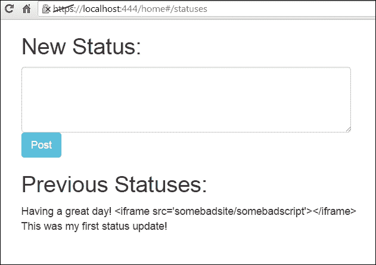

# 第十一章 安全

在我们开始本章之前，绝对必要指出一件事——尽管安全是本书最后一章的主题，但它不应该是应用程序开发的最终步骤。在开发任何 Web 服务时，安全性应该在每一步骤中得到重视。通过在设计时考虑安全性，您可以限制应用程序启动后进行自上而下的安全审计的影响。

话虽如此，这里的意图是指出一些更大更猖獗的安全漏洞，并探讨我们如何使用标准的 Go 和一般安全实践来减轻它们对我们的 Web 服务的影响。

当然，Go 提供了一些出色的安全功能，它们被伪装成纯粹的良好编程实践。使用所有包和处理所有错误不仅有助于养成良好的习惯，而且还有助于确保应用程序的安全。

然而，没有一种语言可以提供完美的安全性，也无法阻止你自己给自己惹麻烦。事实上，最具表现力和实用性的语言往往使这变得尽可能容易。

在开发自己的设计与使用现有包（就像我们在整本书中所做的那样）之间也存在很大的权衡，无论是用于身份验证、数据库接口还是 HTTP 路由或中间件。前者可以提供快速解决方案，并减少错误和安全漏洞的曝光。

通过构建自己的应用程序，还可以提供一些安全性，但对安全更新的迅速响应以及整个社区的目光都胜过一个较小的闭源项目。

在本章中，我们将看到：

+   处理安全目的的错误日志记录

+   防止暴力尝试

+   记录身份验证尝试

+   输入验证和注入缓解

+   输出验证

最后，我们将看一些生产就绪的框架，以了解它们处理 API 和 Web 服务集成以及相关安全性的方式。

# 处理安全目的的错误日志记录

在通往安全应用程序的道路上，关键的一步是使用全面的日志记录。您拥有的数据越多，就越能分析潜在的安全漏洞，并了解应用程序的使用方式。

即使如此，“记录所有”方法可能有些难以利用。毕竟，如果你有所有的干草，找到其中的针可能会特别困难。

理想情况下，我们希望将所有错误记录到文件，并具有将其他类型的一般信息（例如与用户和/或 IP 地址相关的 SQL 查询）分隔的能力。

在下一节中，我们将看一下记录身份验证尝试，但仅在内存/应用程序的生命周期中，以便检测暴力尝试。更广泛地使用日志包可以让我们保持对这些尝试的更持久的记录。

创建日志输出的标准方法是简单地设置一般日志`Logger`的输出，就像这样：

```go
dbl, err := os.OpenFile("errors.log", os.O_CREATE | os.RDWR | os.O_APPEND, 0666)
  if err != nil {
    log.Println("Error opening/creating database log file")
  }
defer dbl.Close()

log.SetOutput(dbl)
```

这使我们能够指定一个新文件，而不是我们默认的`stdout`类，用于记录我们的数据库错误，以便以后分析。

然而，如果我们想要为不同的错误（例如数据库错误和身份验证错误）创建多个日志文件，我们可以将它们分成单独的记录器：

```go
package main

import (
  "log"
  "os"
)

var (
  Database       *log.Logger
  Authentication *log.Logger
  Errors         *log.Logger
)

func LogPrepare() {
  dblog, err := os.OpenFile("database.log", os.O_CREATE|os.O_APPEND|os.O_WRONLY, 0666)
  if err != nil {
    log.Println(err)
  }
  authlog, err := os.OpenFile("auth.log", os.O_CREATE|os.O_APPEND|os.O_WRONLY, 0666)
  if err != nil {
    log.Println(err)
  }
  errlog, err := os.OpenFile("errors.log", os.O_CREATE|os.O_APPEND|os.O_WRONLY, 0666)
  if err != nil {
    log.Println(err)
  }

  Database = log.New(dblog, "DB:", log.Ldate|log.Ltime)
  Authentication = log.New(authlog, "AUTH:", log.Ldate|log.Ltime)
  Errors = log.New(errlog, "ERROR:", log.Ldate|log.Ltime|log.Lshortfile)
}
```

在这里，我们使用特定格式为我们的日志文件实例化单独的记录器：

```go
func main() {
  LogPrepare()

  Database.Println("Logging a database item")
  Authentication.Println("Logging an auth attempt item")
  Errors.Println("Logging an error")

}
```

通过以这种方式为应用程序的各个元素构建单独的日志，我们可以分而治之地进行调试过程。

关于记录 SQL，我们可以利用`sql.Prepare()`函数，而不是使用`sql.Exec()`或`sql.Query()`在执行之前保留对查询的引用。

`sql.Prepare()`函数返回一个`sql.Stmt`结构，而查询本身，由变量 query 表示，不会被导出。但是，您可以在日志文件中使用结构的值本身：

```go
  d, _ := db.Prepare("SELECT fields FROM table where column=?")
  Database.Println(d)
```

这将在日志文件中留下查询的详细账户。为了获得更多细节，IP 地址可以附加到`Stmt`类以获取更多信息。

将每个交易查询存储到文件中可能会对性能产生影响。将其限制为修改数据的查询和/或短时间内将允许您识别安全性潜在问题。

### 注意

有一些第三方库可以进行更强大和/或更漂亮的记录。我们最喜欢的是 go-logging，它实现了多种输出格式、分区调试桶和具有吸引人的格式的可扩展错误。您可以在[`github.com/op/go-logging`](https://github.com/op/go-logging)上阅读更多信息，或通过`go get github.com/op/go-logging`命令下载文档。

# 防止暴力破解尝试

也许是绕过任何给定系统安全性的最常见、最低级别的尝试是暴力破解方法。

从攻击者的角度来看，这是有道理的。如果应用程序设计者允许无限次数的登录尝试而不受惩罚，那么这个应用程序执行良好的密码创建策略的可能性就很低。

这使得它成为一个特别容易受攻击的应用程序。即使密码规则已经制定，仍然有可能使用字典攻击来获取登录权限。

一些攻击者会查看彩虹表以确定哈希策略，但这至少在某种程度上被每个帐户使用唯一的盐所缓解。

实际上，在线下时代，暴力登录攻击通常更容易，因为大多数应用程序没有流程来自动检测和锁定使用无效凭据的帐户访问尝试。他们本来可以这样做，但那么也需要有一个检索权限流程——类似于“给我发邮件我的密码”。

对于像我们的社交网络这样的服务，锁定帐户或在一定程度后暂时禁用登录是非常有意义的。

第一个是一种更激进的方法，需要直接用户操作来恢复帐户；通常，这也需要更大的支持系统。

后者是有益的，因为它通过大大减慢尝试的速度来阻止暴力破解尝试，并使大多数攻击在实际目的上变得无用，而不一定需要用户操作或支持来恢复访问。

## 知道要记录什么

在记录日志时最难的事情之一是决定你需要知道什么。有几种方法可以做到这一点，从记录所有内容到仅记录致命错误。所有这些方法都伴随着自己的潜在问题，这在很大程度上取决于错过一些数据和浏览不可能的数据之间的权衡。

我们需要考虑的第一个问题是我们应该在内存中记录什么——只有失败的身份验证或针对 API 密钥和其他凭据的尝试。

记录针对不存在用户的登录尝试也可能是明智的。这将告诉我们，有人很可能在对我们的网络服务进行不正当的操作。

接下来，我们将希望设置一个较低的阈值或登录尝试的最大次数，然后再采取行动。

让我们首先介绍一个`bruteforcedetect`包：

```go
package bruteforcedetect

import
(
)

var MaxAttempts = 3
```

我们可以直接将其设置为一个包变量，并在必要时从调用应用程序中进行修改。三次尝试可能比我们希望的一般无效登录阈值要低，特别是自动禁止 IP 的情况：

```go
type Requester struct {
  IP string
  LoginAttempts int
  FailedAttempts int
  FailedInvalidUserAttempts int
}
```

我们的`Requester`结构将维护与任何给定 IP 或主机名相关的所有增量值，包括一般的登录尝试、失败的尝试以及请求的用户实际上并不存在于我们的数据库中的失败尝试：

```go
func Init() {

}

func (r Requester) Check() {

}
```

我们不需要将其作为中间件，因为它只需要对一件事情做出反应——认证尝试。因此，关于认证尝试的存储，我们有选择。在现实环境中，我们可能希望给这个过程更长的寿命。我们可以直接将这些尝试存储到内存中、数据存储中，甚至存储到磁盘中。

然而，在这种情况下，我们将通过创建`bruteforce.Requester`结构的映射，让这些数据仅存在于应用程序的内存空间中。这意味着如果我们的服务器重新启动，我们将丢失这些尝试。同样，这意味着多个服务器设置不一定会知道其他服务器上的尝试。

这两个问题都可以通过在记录错误尝试的背后放置更少的短暂存储来轻松解决，但是为了演示的简单性，我们将保持简单。

在我们的`api.go`文件中，我们将引入`bruteforce`并在启动应用程序时创建我们的`Requesters`映射：

```go
package main

import (
…
    "github.com/nkozyra/api/bruteforce"
)

var Database *sql.DB
var Routes *mux.Router
var Format string
var Logins map[string] bruteforce.Requester
```

然后，当我们的服务器启动时，当然要将这个从空映射变成一个初始化的映射：

```go
func StartServer() {

  LoginAttempts = make(map[string] bruteforce.Requester)
OauthServices.InitServices()
```

我们现在准备开始记录我们的尝试。

如果您决定为登录尝试实现中间件，在这里进行调整，只需将这些更改放入中间件处理程序中，而不是最初调用的名为`CheckLogin()`的单独函数。

无论我们的认证发生了什么——无论是有效的用户、有效的认证；有效的用户、无效的认证；还是无效的用户——我们都希望将其添加到相应的`Requester`结构的`LoginAttempts`函数中。

我们将每个`Requester`映射绑定到我们的 IP 或主机名。在这种情况下，我们将使用 IP 地址。

### 注意

`net`包有一个名为`SplitHostPort`的函数，可以正确地从`http.Request`处理程序中的`RemoteAddr`值中分解出来，如下所示：

```go
ip,_,_ := net.SplitHostPort(r.RemoteAddr)
```

您也可以只使用整个`r.RemoteAddr`值，这可能更全面：

```go
func CheckLogin(w http.ResponseWriter, r *http.Request) bool {
  if val, ok := Logins[r.RemoteAddr]; ok {
    fmt.Println("Previous login exists",val)
  } else {
    Logins[r.RemoteAddr] = bruteforce.Requester{IP: r.RemoteAddr, LoginAttempts:0, FailedAttempts: 0, FailedValidUserAttempts: 0, }
  }

  Logins[r.RemoteAddr].LoginAttempts += 1
```

这意味着无论如何，我们都会对总数进行另一次尝试。

由于`CheckLogin()`总是会在不存在时创建映射的键，我们可以在认证流程的后面安全地对这个键进行评估。例如，在我们的`UserLogin()`处理程序中，首先调用`UserLogin()`，然后再检查提交的值：

```go
func UserLogin(w http.ResponseWriter, r *http.Request) {

  w.Header().Set("Access-Control-Allow-Origin", "*")
  fmt.Println("Attempting User Login")

  Response := UpdateResponse{}
 CheckLogin(w,r)
```

如果我们在`CheckLogin()`调用之后检查最大的登录尝试次数，我们将永远不会在某一点之后允许数据库查找。

在`UserLogin()`函数的以下代码中，我们将提交的密码的哈希与数据库中存储的密码哈希进行比较，并在不成功匹配时返回错误。让我们使用它来增加`FailedAttempts`值：

```go
  if (dbPassword == expectedPassword) {
    // ...
  } else {
    fmt.Println("Incorrect password!")
    _, httpCode, msg := ErrorMessages(401)
    Response.Error = msg
    Response.ErrorCode = httpCode
    Logins[r.RemoteAddr].FailedAttempts = Logins[r.RemoteAddr].FailedAttempts + 1
    http.Error(w, msg, httpCode)
  }
```

这只是增加了我们的一般`FailedAttempts`整数值，每个 IP 的无效登录都会增加这个值。

然而，我们还没有对此做任何处理。为了将其作为一个阻塞元素注入，我们需要在`CheckLogin()`调用之后对其进行评估，以初始化映射的哈希（如果尚不存在）：

### 提示

在前面的代码中，您可能会注意到由`RemoteAddr`绑定的可变`FailedAttempts`值在理论上可能会受到竞争条件的影响，导致不自然的增加和过早的阻塞。可以使用互斥锁或类似的锁定机制来防止这种行为。

```go
func UserLogin(w http.ResponseWriter, r *http.Request) {

  w.Header().Set("Access-Control-Allow-Origin", "*")
  fmt.Println("Attempting User Login")

if Logins[r.RemoteAddr].Check() == false {
  return
}
```

这个对`Check()`的调用可以防止被禁止的 IP 地址甚至在登录端点访问我们的数据库，这仍然可能导致额外的压力、瓶颈和潜在的服务中断：

```go
  Response := UpdateResponse{}
  CheckLogin(w,r)
  if Logins[r.RemoteAddr].Check() == false {
    _, httpCode, msg := ErrorMessages(403)
    Response.Error = msg
    Response.ErrorCode = httpCode
    http.Error(w, msg, httpCode)
    return
  }
```

为了更新我们的`Check()`方法，以防止暴力攻击，我们将使用以下代码：

```go
func (r Requester) Check() bool {
  return r.FailedAttempts <= MaxAttempts
}
```

这为我们提供了一种短暂的方式来存储有关登录尝试的信息，但是如果我们想找出某人是否只是在测试帐户名和密码，比如“guest”或“admin”，该怎么办呢？

为此，我们只需在`UserLogin()`中添加额外的检查，以查看所请求的电子邮件帐户是否存在。如果存在，我们将继续。如果不存在，我们将增加`FailedInvalidUserAttempts`。然后我们可以决定是否应该在`UserLogin()`的登录部分下降到更低的阈值：

```go
  var dbPassword string
  var dbSalt string
  var dbUID int
  var dbUserCount int
  uexerr := Database.QueryRow("SELECT count(*) from users where user_email=?",email).Scan(&dbUserCount)
  if uexerr != nil {

  }
  if dbUserCount > 0 {
    Logins[r.RemoteAddr].FailedInvalidUserAttempts = Logins[r.RemoteAddr].FailedInvalidUserAttempts + 1
  }
```

如果我们决定流量由完全失败的身份验证尝试（例如，无效用户）表示，我们还可以将该信息传递给 IP 表或我们的前端代理，以阻止流量甚至到达我们的应用程序。

# 在 Go 中处理基本身份验证

在第七章中，我们没有深入研究身份验证部分，*与其他 Web 技术合作*，基本身份验证。这是值得讨论的安全问题，特别是它可以是一种非常简单的方式，允许身份验证代替 OAuth、直接登录（带会话）或密钥。即使在后者中，完全可以利用 API 密钥作为基本身份验证的一部分。

基本身份验证最关键的方面是一个显而易见的一点——**TLS**。与涉及传递密钥的方法不同，在基本身份验证标头方法中几乎没有混淆，除了 Base64 编码之外，一切基本上都是明文。

当然，这为恶意方提供了一些非常简单的中间人机会。

在第七章中，*与其他 Web 技术合作*，我们探讨了使用共享密钥创建交易密钥并通过会话存储有效身份验证的概念。

我们可以直接从“授权”标头中获取用户名和密码或 API 密钥，并通过在我们的`CheckLogin()`调用顶部包含对该标头的检查来测量对 API 的尝试：

```go
func CheckLogin(w http.ResponseWriter, r *http.Request) {
  bauth := strings.SplitN(r.Header["Authorization"][0], " ", 2)
  if bauth[0] == "Basic" {
    authdata, err := base64.StdEncoding.DecodeString(bauth[1])
    if err != nil {
      http.Error(w, "Could not parse basic auth", http.StatusUnauthorized)
      return
    }
      authparts := strings.SplitN(string(authdata),":",2)
      username := authparts[0]
      password := authparts[1]
    }else {
      // No basic auth header
    }
```

在这个例子中，我们可以允许我们的`CheckLogin()`函数利用要么从我们的 API 发布的数据来获取用户名和密码组合、API 密钥或身份验证令牌，要么我们也可以直接从标头中摄取这些数据。

# 处理输入验证和注入缓解

如果暴力攻击是一种相当不雅的坚持练习，攻击者没有访问、输入或注入攻击则相反。在这一点上，攻击者对应用程序有一定程度的信任，即使它很小。

SQL 注入攻击可以发生在应用程序管道的任何级别，但跨站点脚本和跨站点请求伪造更多地针对其他用户，而不是应用程序，针对漏洞暴露其数据或直接将其他安全威胁带到应用程序或浏览器。

在接下来的部分中，我们将通过输入验证来检查如何保持我们的 SQL 查询安全，然后转向其他形式的输入验证以及输出验证和净化。

## 使用 SQL 的最佳实践

在使用关系数据库时存在一些非常大的安全漏洞，其中大部分都适用于其他数据存储方法。我们已经看过一些这些漏洞，比如正确和唯一地加盐密码以及使用安全会话。即使在后者中，也总是存在一些会话固定攻击的风险，这允许共享或持久共享会话被劫持。

其中一个更普遍的攻击向量，现代数据库适配器 tend to 消除的是注入攻击。

注入攻击，特别是 SQL 注入，是最常见的，但也是最可避免的漏洞之一，可以暴露敏感数据，损害问责制，甚至使您失去对整个服务器的控制。

敏锐的眼睛可能已经注意到了，但在本书的前面，我们故意在我们的`api.go`文件中构建了一个不安全的查询，可以允许 SQL 注入。

这是我们原始的`CreateUser()`处理程序中的一行：

```go
  sql := "INSERT INTO users set user_nickname='" + NewUser.Name + "', user_first='" + NewUser.First + "', user_last='" + NewUser.Last + "', user_email='" + NewUser.Email + "'"
  q, err := database.Exec(sql)
```

不言而喻，但是在几乎所有语言中，直接构造查询作为直接的 SQL 命令是不受欢迎的。

一个很好的经验法则是将所有外部生成的数据，包括用户输入、内部或管理员用户输入和外部 API 视为恶意。通过尽可能怀疑用户提供的数据，我们提高了捕捉潜在有害注入的几率。

我们的其他大部分查询都使用了参数化的`Query()`函数，该函数允许您添加与`?`标记对应的可变参数。

请记住，由于我们在数据库中存储用户的唯一盐（至少在我们的示例中），失去对 MySQL 数据库的访问权限意味着我们也失去了首次使用密码盐的安全好处。

这并不意味着在这种情况下所有账户的密码都会被暴露，但在这一点上，如果用户保持个人密码标准低劣，那么直接获取用户的登录凭据只有在利用其他服务方面才有用，也就是说，在服务之间共享密码。

# 验证输出

通常情况下，输出验证的概念似乎很陌生，特别是当数据在输入端进行了消毒时。

保留值的发送方式，并且仅在输出时对其进行消毒可能是有道理的，但这增加了这些值在传递给 API 消费者时可能未经消毒的几率。

有两种主要方式可以将有效负载传递给最终用户，一种是存储攻击，我们作为应用程序在服务器上保留向量，另一种是反射攻击，其中一些代码通过其他方法附加，例如包含有效负载的电子邮件消息。

API 和 Web 服务有时特别容易受到不仅**XSS**（**跨站脚本攻击**的缩写）的影响，还有**CSRF**（**跨站请求伪造**的缩写）。

我们将简要讨论这两种情况以及我们可以在 Web 服务中限制它们的有效性的方法。

## 防止 XSS 攻击

每当我们处理用户输入，以便稍后将其转换为其他用户消费的输出时，我们都需要警惕跨站脚本攻击或跨站请求伪造在生成的数据有效负载中的问题。

这不仅仅是输出验证的问题。这也应该在输入阶段进行处理。然而，我们的输出是我们在一个用户的任意文本和另一个用户消费该文本之间的最后防线。

传统上，最好通过以下假设性的恶意代码片段来说明这一点。用户通过`POST`请求击中我们的`/api/statuses`端点，经过选择的任何方法进行身份验证，并发布以下状态：

```go
url -X POST -H "Authorization: Basic dGVzdDp0ZXN0" -H "Cache-Control: no-cache" -H "Postman-Token: c2b24964-c12d-c183-dd7f-5c1365f5ae81" -H "Content-Type: multipart/form-data; boundary=----WebKitFormBoundary7MA4YWxkTrZu0gW" -F "status=Having a great day! <iframe src='somebadsite/somebadscript'></iframe>" https://localhost/api/statuses
```

如果像我们的界面示例一样呈现在模板中，那么使用 Go 的模板引擎将自动减轻这个问题。

让我们看看前面的示例数据在我们界面的用户配置文件页面上是什么样子：



`html/template`包会自动转义 HTML 输出，以防止代码注入，并且需要覆盖以允许任何 HTML 标签原样输入。

然而，作为 API 提供者，我们对消费应用程序语言的类型以及对输入的消毒的支持或关注是中立的。

转义数据的责任是需要考虑的问题，也就是说，您的应用程序提供给客户端的数据是否应该预先经过消毒，或者是否应该附带有关消毒数据的使用说明？在几乎所有情况下，答案都是第一种选择，但根据您的角色和数据类型，情况可能有所不同。另一方面，在某些情况下（例如 API），在前端取消消毒数据意味着可能需要以多种方式重新格式化数据。

在本章的前面部分，我们向您展示了一些输入验证技术，用于允许或禁止某些类型的数据（如字符、标签等），您可以将这些技术应用到诸如`/statuses`之类的端点。

然而，更合理的做法是允许这些数据；但是，在将其保存到数据库/数据存储或通过 API 端点返回之前对其进行清理。以下是我们可以使用`http/template`包来执行这两种操作的方法。

首先，当我们通过`/api/statuses`端点接受数据时，我们可以利用`html/template`中的一个或多个函数来防止某些类型的数据被存储。这些函数如下：

+   `template.HTMLEscapeString`: 这将对 HTML 标签进行编码，并将生成的字符串呈现为非 HTML 内容

+   `template.JSEscapeString()`: 这将对字符串的 JavaScript 特定部分进行编码，以防止正确呈现

为了简化通过 HTML 输出的目的，我们可以只需对我们的数据应用`HTMLEscapeString()`，这将禁用任何 JavaScript 调用的执行：

```go
func StatusCreate(w http.ResponseWriter, r *http.Request) {

  Response := CreateResponse{}
  UserID := r.FormValue("user")
  Status := r.FormValue("status")
  Token := r.FormValue("token")
  ConsumerKey := r.FormValue("consumer_key")

  Status = template.HTMLEscapeString(Status)
```

这使得数据在输入（`StatusCreate`）端进行转义。如果我们想要添加 JavaScript 转义（正如前面所述，可能并不需要），它应该在 HTML 转义之前进行，如下所示：

```go
  Status = template.JSEscapeString(Status)
  Status = template.HTMLEscapeString(Status)
```

如果我们希望在输入端不进行转义，而是在输出端进行转义，那么可以在相应的状态请求 API 调用中进行相同的模板转义调用，比如`/api/statuses`：

```go
func StatusRetrieve(w http.ResponseWriter, r *http.Request) {
  var Response StatusResponse
  w.Header().Set("Access-Control-Allow-Origin", "*")
  loggedIn := CheckLogin(w, r)
  if loggedIn {

  } else {
    statuses,_ := Database.Query("select * from user_status where user_id=? order by user_status_timestamp desc",Session.UID)
    for statuses.Next() {

      status := Status{}
      statuses.Scan(&status.ID, &status.UID, &status.Time, &status.Text)
      status.Text = template.JSEscapeString(status.Text)
      status.Text = template.HTMLEscapeString(status.Text)
      Response.Statuses = append(Response.Statuses, status)
  }
```

如果我们想要尝试检测并记录尝试将特定 HTML 元素传递到输入元素中，我们可以为 XSS 尝试创建一个新的日志记录器，并捕获与`<script>`元素、`<iframe>`元素或其他任何元素匹配的任何文本。

这可以是一个像标记器或更高级的安全包一样复杂，也可以是一个像正则表达式匹配一样简单，我们将在接下来的示例中看到。首先，我们将查看我们日志设置中的代码：

```go
var (
  Database       *log.Logger
  Authentication *log.Logger
  Errors         *log.Logger
  Questionable *log.Logger
)
```

我们初始化代码中的更改如下：

```go
  questlog, err := os.OpenFile("injections.log", os.O_CREATE|os.O_APPEND|os.O_WRONLY, 0666)
  if err != nil {
    log.Println(err)
  }
  Questionable = log.New(questlog, "XSS:", log.Ldate|log.Ltime)

```

然后，在我们应用程序的`StatusCreate`处理程序中进行以下更改：

```go
  isinject, _ := regexp.MatchString("<(script|iframe).*",Status)
  if isinject  {

  }
```

通过正则表达式以这种方式检测标签既不是绝对可靠的，也不是本意。请记住，我们将在输入端或输出端对数据进行清理，因此如果我们可以通过这种方法捕捉到尝试，它将为我们提供一些关于对我们应用程序的潜在恶意尝试的见解。

如果我们想要更符合 Go 语言的习惯和更全面，我们可以简单地对文本进行清理并将其与原始文本进行比较。如果两个值不匹配，我们可以推断出 HTML 已被包含。

这意味着我们将对无害的 HTML 标签（如粗体标签或表格标签）进行转义。

# 在 Go 中使用服务器端框架

在详细介绍如何从头开始构建 Web 服务时，如果我们不至少触及集成或专门使用一些现有框架，那就不够周全了。

虽然通过插入这样一个框架来获得与从头开始设计一个框架相同的体验是不可能的，但出于实际目的，当您想要启动一个项目时，通常没有理由重新发明轮子。

Go 语言有一些现成的、成熟的 Web/HTML 框架，但也有一些特别为 Web 服务设计的值得注意的框架，其中一些提供了你可能期望看到的一些交付方法和额外的钩子。

根据某些标准，可以将 Gorilla 描述为一个框架；然而，正如其名称所暗示的那样，它有点基础。

无论您使用现有框架还是选择构建自己的框架（无论是出于经验还是出于完全定制业务需求），您都应该考虑做一些

我们将简要地看一下这些框架中的一些，以及它们如何简化小型基于 Web 的项目的开发。

## Tiger Tonic

Tiger Tonic 是一个专门面向 API 的框架，因此我们将在本节中首先提到它。它采用了一种非常符合 Go 语言习惯的方式来开发 JSON Web 服务。

响应主要是以 JSON 格式为主，多路复用应该与 Gorilla 引入的风格非常相似。

Tiger Tonic 还提供了一些高质量的日志记录功能，允许您将日志直接导入 Apache 格式进行更详细的分析。最重要的是，它以一种方式处理中间件，允许根据中间件本身的结果进行一些条件操作。

### 注意

您可以在[`github.com/rcrowley/go-tigertonic`](https://github.com/rcrowley/go-tigertonic)了解更多关于 Tiger Tonic 的信息，或使用`go get github.com/rcrowley/go-tigertonic`命令下载文档。

## Martini

Web 框架 Martini 是相对年轻的 Go 语言中较受欢迎的 Web 框架之一，这在很大程度上是因为它在设计上与`Node.js`框架 Express 和流行的 Ruby-on-Rails 框架 Sinatra 相似。

Martini 还与中间件非常搭配，以至于它经常被专门用于这个目的。它还带有一些标准的中间件处理程序，比如`Logger()`用于处理登录和退出的日志记录，`Recovery()`用于从 panic 中恢复并返回 HTTP 错误。

Martini 是为大量网络项目构建的，可能包括比简单的网络服务更多的内容；然而，它是一个非常全面的框架，值得一试。

### 注意

您可以在[`github.com/go-martini/martini`](https://github.com/go-martini/martini)了解更多关于 Martini 的信息，或使用`go get github.com/go-martini/martini`命令下载文档。

## Goji

与 Martini 相比，Goji 框架是非常简约和精简的。Goji 的主要优势在于其非常快速的路由系统，额外垃圾收集的开销低，以及强大的中间件集成。

Goji 使用 Alice 作为中间件，我们在前面的章节中简要提到过。

### 注意

您可以在[`goji.io/`](https://goji.io/)了解更多关于 Goji 微框架的信息，并使用`go get github.com/zenazn/goji`和`go get github.com/zenazn/goji/web`命令下载它。

## Beego

Beego 是一种更复杂的框架类型，已经迅速成为 Go 项目中较受欢迎的 Web 框架之一。

Beego 有许多功能，可以为网络服务提供便利，尽管其附加功能主要用于渲染网页。该框架配备了自己的会话、路由和缓存模块，并包括一个实时监控过程，允许您动态分析项目。

### 注意

您可以在[`beego.me/`](http://beego.me/)了解更多关于 Beego 的信息，或使用`go get github.com/astaxie/beego`命令下载它。

# 总结

在本章的最后，我们看了如何尽可能地使我们的网络服务免受常见的安全问题，并研究了如何在发生违规时减轻问题的解决方案。

随着 API 在受欢迎程度和范围上的扩展，确保用户及其数据的安全至关重要。

我们希望您已经（并将能够）利用这些安全最佳实践和工具来提高应用程序的整体可靠性和速度。

虽然我们的主要项目——社交网络——绝不是一个完整或全面的项目，但我们已经分解了这样一个项目的各个方面，以演示路由、缓存、身份验证、显示、性能和安全性。

如果您希望继续扩展项目，请随意增加、分叉或克隆[`github.com/nkozyra/masteringwebservices`](https://github.com/nkozyra/masteringwebservices)上的示例。我们很乐意看到该项目继续作为演示 Go 中与网络服务和 API 相关的功能和最佳实践。
