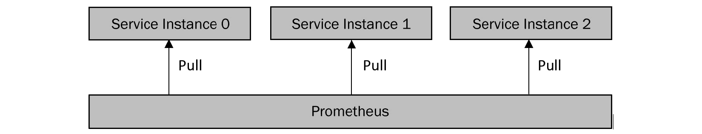
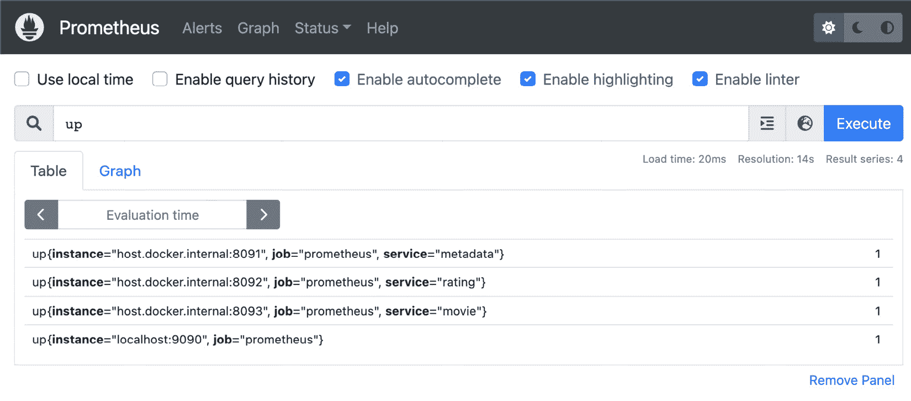
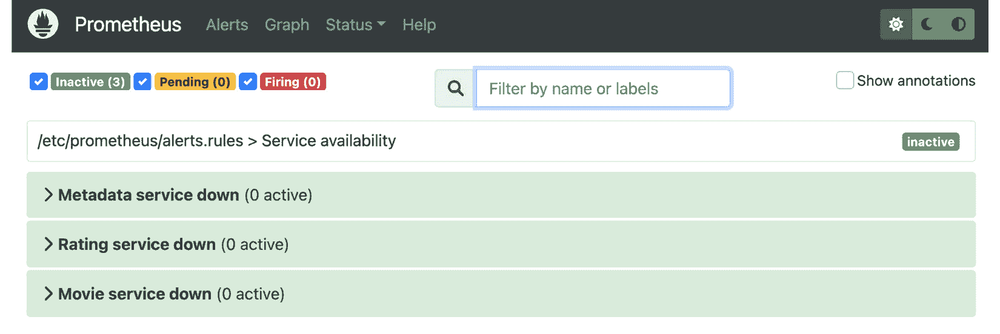
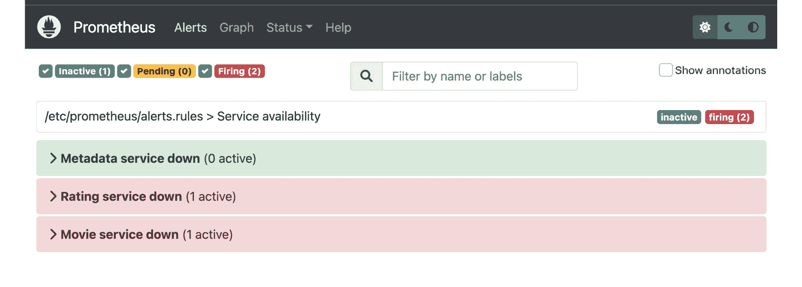
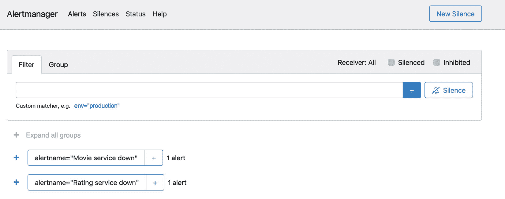

# 第十二章：设置服务警报

在上一章中，我们描述了各种类型的服务遥测数据，例如日志、指标和跟踪，并说明了如何收集它们以解决服务性能问题。

在本章中，我们将说明如何通过为我们的微服务设置警报来使用遥测数据自动检测事件。您将学习收集哪些类型的服务指标，如何定义各种事件的条件，以及如何使用流行的监控和警报工具 Prometheus 为您的微服务建立完整的警报管道。

我们将涵盖以下主题：

+   警报基础

+   Prometheus 简介

+   为我们的微服务设置 Prometheus 警报

+   警报最佳实践

现在，我们将继续概述警报基础。

# 技术要求

为了完成本章，您需要 Go 1.11 或更高版本。您还需要 Docker 工具，您可以在 https://www.docker.com/下载。

您可以在 GitHub 上找到本章的代码示例：[`github.com/PacktPublishing/microservices-with-go/tree/main/Chapter12`](https://github.com/PacktPublishing/microservices-with-go/tree/main/Chapter12)。

# 警报基础

没有微服务可以不发生事件；即使您有一个稳定、高度测试和良好维护的服务，它仍然可能遇到各种类型的问题，例如以下：

+   **资源限制**：运行服务的宿主可能会遇到高 CPU 利用率或内存或磁盘空间不足。

+   **网络拥塞**：服务可能会在其依赖项中突然增加负载或降低性能。这可能会限制其处理传入请求或以预期性能水平运行的能力。

+   **依赖失败**：您的服务所依赖的其他服务或库可能会遇到各种问题，影响您的服务执行。

这些问题可能是自解决的。例如，较慢的网络吞吐量可能是由于临时维护或网络设备重启而引起的暂时性问题。许多其他类型的问题，我们称之为事件，需要工程师采取一些行动来减轻。

为了减轻事件，首先，我们需要检测它。一旦问题已知，我们可以通知工程师或执行自动化操作，例如自动部署回滚或应用程序重启。在本章中，我们将描述结合事件检测和通知的**警报技术**。这项技术可用于自动化对各种类型微服务问题的响应。

警报背后的关键原则非常简单，可以总结如下：

+   要设置警报，开发者定义**警报条件**。

+   警报条件基于遥测数据（最常见的是指标）并以查询的形式定义。

+   每个定义的警报条件都会定期评估，例如每分钟一次。

+   如果满足警报条件，将执行相关的操作（例如，向工程师发送电子邮件或短信）。

为了说明警报是如何工作的，想象一下，你的某个服务正在发出一个名为 `active_user_count` 的指标，该指标报告了特定时刻的活跃用户数量。让我们假设，如果我们想得到通知，活跃用户数量突然降至零，我们会收到通知。这种情况很可能会表明我们的服务发生了某些事件，除非我们用户太少（为了简单起见，我们将假设我们的系统应该始终有一些活跃用户）。

使用伪代码，我们可以以下述方式定义我们的用例的警报条件：

```go
active_user_count == 0
```

一旦满足警报条件，警报软件将根据其配置检查应触发的操作。假设我们已经配置了我们的警报以触发电子邮件通知，它将发送电子邮件并包含任何必要的元数据。元数据将包括有关刚刚发生的事件的信息，以及如果提供，减轻该事件的步骤。

我们将在本章后面提供一些警报配置的例子。现在，我们将专注于一些实际用例，为你提供一些为你的服务设置警报的想法。

## 警报用例

有许多用例，你需要设置自动警报。在本节中，我们将提供一些常见的例子，这些例子可以作为你的参考点。

在我们之前提到的 *Google SRE* 书籍中，在 *第十章* 中，有一个关于监控的**四个黄金信号**的定义，这些信号可以用来监控各种类型的应用，从微服务到数据处理管道。这些信号为服务警报提供了很好的基础，因此让我们来回顾一下它们，并描述如何使用每个信号来提高你的服务可靠性：

+   **延迟**：延迟是处理时间的衡量，例如处理 API 请求、Kafka 消息或任何其他操作的持续时间。它是系统性能的主要指标——当它变得过高时，系统开始影响其调用者，造成网络拥塞。你应该通常跟踪你的主要操作（如提供关键功能的 API 端点）的延迟。

+   **流量**：流量衡量的是你的系统负载，例如你的微服务在当前时刻接收到的请求数量。基于流量的指标示例是 API 请求速率，以每秒请求数量来衡量。测量流量对于确保你有足够的容量来处理系统请求至关重要。

+   **错误**：错误通常被测量为**错误率**，即失败操作与总操作之间的比率。测量错误率对于确保你的服务保持运行至关重要。

+   **饱和度**：饱和度通常衡量您资源的利用率，如 RAM 或磁盘使用率、CPU 或 I/O 负载。您应该跟踪饱和度，以确保您的服务不会因资源不足而意外失败。

这四个黄金信号可以帮助您为您的服务和关键操作（如您的 API 主端点）建立监控和警报。让我们提供一些实际例子来帮助您理解一些常见的警报用例。

首先，让我们从可以跨所有端点或按端点测量的 API 警报的常见信号开始：

+   **API 客户端错误率**：由于客户端错误而失败的请求与所有请求的比率

+   **API 服务器错误率**：由于服务器错误而失败的请求与所有请求的比率

+   **API 延迟**：处理请求所需的时间

现在，让我们提供一些测量系统饱和度的信号例子：

+   **CPU 利用率**：您的 CPU 在 0%（未使用/空闲）到 100%（完全使用，无额外容量）的范围内被使用的程度。

+   **内存利用率**：已使用内存与总内存的比率。

+   **磁盘利用率**：已使用磁盘空间的百分比。

+   **打开文件描述符**：文件描述符通常用于处理网络请求、文件读写和其他 I/O 操作。每个进程通常都有打开文件描述符的数量限制，所以如果您的服务达到一个关键限制（基于您的操作系统设置），您的服务可能无法处理请求。

让我们也提供一些其他要监控的信号的例子：

+   **服务崩溃**：一般建议不要容忍任何服务崩溃，因为它们通常表明应用程序错误或问题，如内存不足错误。

+   **失败的部署**：您可以使用它来自动检测失败的部署并发出表示失败的指标，从而创建自动警报。

现在我们已经覆盖了一些常见的警报用例，让我们继续介绍 Prometheus 的概述，我们将使用它来设置我们的微服务警报。

# Prometheus 简介

在*第十一章*中，我们提到了一个流行的开源警报和监控工具 Prometheus，它可以收集服务指标并根据指标数据设置自动警报。在本节中，我们将演示如何使用 Prometheus 为我们的微服务设置警报。

让我们总结一下我们从*第十一章*学到的关于 Prometheus 的知识：

+   Prometheus 允许我们以时间序列的形式收集和存储服务指标。

+   有三种类型的指标——计数器、直方图和仪表。

+   要查询指标数据，Prometheus 提供了一种名为 PromQL 的查询语言。

+   可以使用名为 Alertmanager 的工具配置服务警报。

指标可以通过两种不同的方式从服务实例导入 Prometheus：

+   **抓取**：Prometheus 从服务实例中读取指标。

+   **推送**：服务实例通过一个专用服务，即 Prometheus Pushgateway，将指标发送到 Prometheus。

抓取是设置 Prometheus 指标数据摄取的推荐方式。每个服务实例都需要暴露一个端点以提供指标，Prometheus 负责拉取数据并将其存储以供进一步查询，如下所示：



图 12.1 – Prometheus 抓取模型

让我们提供一个服务实例对 Prometheus 抓取请求的响应示例。假设你添加了一个名为`/metrics`的单独 HTTP API 端点，并以下列格式返回最新的服务实例指标：

```go
active_user_count 755
api_requests_total_count 18900
api_requests_getuser_count 500
```

在此示例中，服务实例以键值对的形式报告了三个指标，其中键定义了时间序列名称，值定义了当前时刻时间序列的值。一旦 Prometheus 调用`/metrics`端点，服务实例应提供一个只包含之前响应中未包含的时间序列的新数据集。

一旦 Prometheus 收集了指标，它们就可以使用一种称为 PromQL 的 Prometheus 特定语言进行查询。基于 PromQL 的查询可以用于通过 Prometheus UI 分析时间序列数据，或者使用 Alertmanager 设置自动警报。例如，以下查询返回所有`active_user_count`时间序列的值及其标签：

```go
active_user_count
```

你可以使用额外的查询过滤器，例如`active_user_count`指标，你只能请求具有特定标签值的时间序列：

```go
active_user_count{service="rating-ui"}
```

警报条件通常定义为返回布尔结果的表达式。例如，要定义活动用户计数降至零时的警报条件，你会使用以下带有`==`运算符的 PromQL 查询：

```go
active_user_count == 0
```

PromQL 语言提供了一些其他类型的时间序列匹配器，例如`quantile`，可用于执行各种聚合。以下查询示例可以用来检查中值`api_request_latency`值是否超过`1`：

```go
api_request_latency{quantile="0.5"} > 1
```

你可以通过阅读其网站上的官方文档来熟悉 PromQL 语言的其它方面：[`prometheus.io/docs/prometheus/latest/querying/basics/`](https://prometheus.io/docs/prometheus/latest/querying/basics/)。现在，让我们探讨如何使用 Prometheus 警报工具 Alertmanager 设置警报。

Alertmanager 是 Prometheus 的一个独立组件，允许我们配置警报和通知以检测各种类型的事件。Alertmanager 通过读取提供的配置并定期查询 Prometheus 时间序列数据来运行。以下是一个 Alertmanager 配置的示例：

```go
groups:
- name: Availability alerts
  rules:
  - alert: Rating service down
    expr: service_availability{service="rating"} == 0
    for: 3m
    labels:
      severity: page
    annotations:
      title: Rating service availability down
      description: No available instance of the rating service.
```

在我们的配置示例中，我们设置了一个警报，当具有 `service="rating"` 标签的 `service_availability` 指标值等于 `0` 并且持续 `3` 分钟或更长时间时，将触发一个 PagerDuty 事件来通知值班工程师有关该问题。

Alertmanager 的其他一些功能包括通知分组、通知重试和警报抑制。为了说明 Prometheus 和 Alertmanager 在实际中的应用，让我们描述如何为上一章中提到的示例微服务设置它们。

# 为我们的微服务设置 Prometheus 警报。

在本节中，我们将说明如何使用 Prometheus 和其警报扩展 Alertmanager 为我们在上一章中创建的服务设置服务警报。你将学习如何暴露服务指标以供收集，如何设置 Prometheus 和 Alertmanager 以聚合和存储多个服务的指标，以及如何定义和处理服务警报。

我们的高级方法如下：

1.  为我们的服务设置 Prometheus 指标报告。

1.  安装 Prometheus 并配置它从我们在上一章中创建的三个示例服务中抓取数据。

1.  使用 Alertmanager 配置服务可用性警报。

1.  通过触发警报条件并运行 Alertmanager 来测试我们的警报。

让我们首先说明如何将我们的服务与 Prometheus 集成。为此，我们需要通过暴露一个将提供最新指标给 Prometheus 的端点来向我们的服务添加一个指标收集。

首先，我们需要将 Prometheus 配置添加到我们的服务中。在每个服务目录中，更新 `cmd/config.go` 文件为以下内容：

```go
package main
type config struct {
    API        apiConfig        `yaml:"api"`
    Jaeger     jaegerConfig     `yaml:"jaeger"`
    Prometheus prometheusConfig `yaml:"prometheus"`
}
type apiConfig struct {
    Port int `yaml:"port"`
}
type jaegerConfig struct {
    URL string `yaml:"url"`
}
type prometheusConfig struct {
    MetricsPort int `yaml:"metricsPort"`
}
```

我们的新配置允许我们指定指标收集端点的服务端口。在每一个 `configs/base.yaml` 文件中，添加以下块：

```go
prometheus:
  metricsPort: 8091
```

我们已准备好更新我们的服务，以便它们可以开始报告指标。通过在每个服务的 `main.go` 文件中添加以下导入来更新每个服务的 `main.go` 文件：

```go
    "github.com/uber-go/tally"
    "github.com/uber-go/tally/prometheus"
```

在 `main` 函数的任何部分，添加以下代码：

```go
    reporter := prometheus.NewReporter(prometheus.Options{})
    _, closer := tally.NewRootScope(tally.ScopeOptions{
        Tags:           map[string]string{"service": "metadata"},
        CachedReporter: reporter,
    }, 10*time.Second)
    defer closer.Close()
    http.Handle("/metrics", reporter.HTTPHandler())
    go func() {
        if err := http.ListenAndServe(fmt.Sprintf(":%d", cfg.Prometheus.MetricsPort), nil); err != nil {
            logger.Fatal("Failed to start the metrics handler", zap.Error(err))
        }
    }()
    counter := scope.Tagged(map[string]string{
        "service": "metadata",
    }).Counter("service_started")
    counter.Inc(1)
```

在我们刚刚添加的代码中，我们初始化了 `tally` 库来收集和报告我们提到的指标数据，这些数据在本书的*第十一章*中有所提及。我们使用了一个内置的 Prometheus 报告器，该报告器使用 Prometheus 时间序列格式实现指标数据收集，并暴露了一个 HTTP 端点以允许 Prometheus 收集我们的数据。

让我们测试新添加的端点。重启元数据服务，并在浏览器中打开 `http://localhost:8091/metrics` 来尝试访问新端点。你应该会得到类似的响应：

```go
# HELP go_gc_duration_seconds A summary of the pause duration of garbage collection cycles.
# TYPE go_gc_duration_seconds summary
go_gc_duration_seconds{quantile="0"} 0
go_gc_duration_seconds{quantile="0.25"} 0
...
```

指标处理程序的响应包括 Go 运行时数据，例如当前时刻的 goroutine 数量、Go 库版本以及许多其他有用的指标。

现在，我们已准备好设置 Prometheus 警报。在我们的项目 `src` 目录内，创建一个名为 `configs` 的目录，并添加一个包含以下内容的 `prometheus.yaml` 文件：

```go
global:
  scrape_interval: 15s
  scrape_timeout: 10s
  evaluation_interval: 15s
alerting:
  alertmanagers:
  - follow_redirects: true
    enable_http2: true
    scheme: http
    timeout: 10s
    api_version: v2
    static_configs:
    - targets:
      - host.docker.internal:9093
```

此外，将以下配置添加到文件中：

```go
rule_files:
- alerts.rules
scrape_configs:
- job_name: prometheus
  honor_timestamps: true
  scrape_interval: 15s
  scrape_timeout: 10s
  metrics_path: /metrics
  scheme: http
  follow_redirects: true
  enable_http2: true
  static_configs:
  - targets:
    - localhost:9090
  - targets:
    - host.docker.internal:8091
    labels:
      service: metadata
  - targets:
    - host.docker.internal:8092
    labels:
      service: rating
  - targets:
    - host.docker.internal:8093
    labels:
      service: movie
```

让我们描述我们刚刚添加的配置。我们将抓取间隔设置为`15`秒，并提供了一组抓取指标数据的目标，包括我们每个服务的地址。你可能注意到我们在每个目标定义中使用的是`host.docker.internal`网络地址——我们将使用 Docker 运行 Prometheus，而`host.docker.internal`地址将允许它访问我们新添加的运行在 Docker 之外的端点。

注意，我们在`static_configs`块内提供了一个静态的服务地址列表。我们故意这样做是为了说明最简单的抓取方法，即当 Prometheus 知道每个服务实例的地址时。在一个动态环境中，服务实例可以被添加或删除，你需要使用 Prometheus 与一个服务注册表，如 Consul 一起使用。Prometheus 为 Consul 注册的服务提供了内置的抓取指标支持：你可以在 Consul 抓取配置中定义，而不是使用`static_configs`：

```go
    consul_sd_configs:
    - server:  host.docker.internal:8500
      services:
        - <SERVICE_NAME>
```

接下来，我们将演示如何抓取静态的服务实例列表；在阅读本章后，你可以尝试设置基于 Consul 的 Prometheus 抓取作为额外的练习。让我们为我们的服务添加警报规则。在新建的`configs`目录内，创建一个名为`alerts.rules`的文件，并将以下内容添加到其中：

```go
groups:
- name: Service availability
  rules:
  - alert: Metadata service down
    expr: up{service="metadata"} == 0
    labels:
      severity: warning
    annotations:
      title: Metadata service is down
      description: Failed to scrape {{ $labels.service }}. Service possibly down.
  - alert: Rating service down
    expr: up{service="rating"} == 0
    labels:
      severity: warning
    annotations:
      title: Metadata service is down
      description: Failed to scrape {{ $labels.service }} service on {{ $labels.instance }}. Service possibly down.
  - alert: Movie service down
    expr: up{service="movie"} == 0
    labels:
      severity: warning
    annotations:
      title: Metadata service is down
      description: Failed to scrape {{ $labels.service }} service on {{ $labels.instance }}. Service possibly down.
```

我们刚刚添加的文件包含了我们每个服务的警报定义。每个警报定义都包括 Prometheus 将检查的表达式，以评估是否应该触发相关的警报。

现在，我们已经准备好安装并运行 Prometheus 来测试我们的警报功能。在我们的项目`src`目录内，运行以下命令以使用新创建的配置运行 Prometheus：

```go
docker run \
    -p 9090:9090 \
    -v configs:/etc/prometheus \
    prom/prometheus
```

如果一切顺利，你应该可以通过打开`http://localhost:9090/`来访问 Prometheus UI。在初始屏幕上，你会看到一个搜索输入框，你可以使用它来访问我们服务发出的 Prometheus 指标。在搜索输入框中输入`up`并点击**执行**以访问指标：



图 12.2 – Prometheus 指标搜索

你可以前往`alerts.rules`文件：



图 12.3 – Prometheus 警报视图

如果所有三个服务都在运行，所有三个相关的警报都应该被标记为**不活跃**。我们很快就会回到**警报**页面；现在，让我们继续并设置 Alertmanager，以便我们可以为我们的服务触发一些警报。

在我们的`configs`目录内，包括 Prometheus 配置，添加一个名为`alertmanager.yml`的文件，内容如下：

```go
global:
  resolve_timeout: 5m
route:
  repeat_interval: 1m
  receiver: 'email'
receivers:
- name: 'email'
  email_configs:
  - to: 'your_email@gmail.com'
    from: 'your_email@gmail.com'
    smarthost: smtp.gmail.com:587
    auth_username: 'your_email@gmail.com'
    auth_identity: 'your_email@gmail.com'
    auth_password: 'your_password'
```

更新我们刚刚创建的文件中的电子邮件配置，以便 Alertmanager 可以为我们的警报发送一些电子邮件。

现在，运行以下命令以启动 Alertmanager：

```go
docker run -p 9093:9093 -v <PATH_TO_CONFIGS_DIR>:/etc/alertmanager prom/alertmanager --config.file=/etc/alertmanager/alertmanager.yml
```

不要忘记将`<PATH_TO_CONFIGS_DIR>`占位符替换为包含新添加的`alertmanager.yml`文件的`configs`目录的完整本地路径。

现在，让我们通过手动停止评分和电影服务来模拟警报条件。一旦您这样做，打开 Prometheus UI 中的**警报**页面；您应该看到两个警报都是**触发**的：



图 12.4 – 触发 Prometheus 警报

您可以通过访问`http://localhost:9093`来访问 Alertmanager UI。

如果在 Prometheus 中触发警报，您也应该在 Alertmanager UI 中看到它们：



图 12.5 – Alertmanager UI

如果您正确配置了 Alertmanager，您应该会收到一封电子邮件，地址是您在配置中提供的。如果您没有收到电子邮件，请检查 Alertmanager 的 Docker 日志 – 使用双因素电子邮件认证的用户可能会收到启用通知的额外说明。

如果一切顺利 – 恭喜你，你已经设置了服务警报！我们故意没有涵盖 Alertmanager 的许多功能 – 它包括许多超出本章范围的配置设置。如果您想了解更多关于它的信息，请查看官方文档[`prometheus.io/docs`](https://prometheus.io/docs)。

现在，让我们进入下一节，我们将提供一些设置服务警报的最佳实践，这应该有助于提高您的服务可靠性。

# 警报最佳实践

通过阅读本节，您将获得的知识应该有助于建立您服务的新的警报流程。如果您正在使用一些既定的警报流程，它还将帮助您改进现有的警报。

在最有价值的最佳实践中，我会强调以下几项：

+   （规则配置中的`for`值）。

+   **包含运行手册引用**：对于每个警报，确保您有一个运行手册，为接收警报的值班工程师提供明确的指示。为每个警报拥有准确且最新的运行手册有助于减少事件缓解时间，并在所有工程师之间共享相关知识。

+   **确保定期审查警报配置**：确保警报配置准确的最佳解决方案是使其易于访问和审查。其中一种最简单的方法是将警报配置作为您代码库的一部分，这样所有警报配置都很容易审查。定期检查您的警报，以确保所有重要场景都得到覆盖，以及确保没有过时的警报。

此列表仅包含一些最佳实践，旨在提高你的服务警报能力。如果你对这个主题感兴趣，我强烈建议你阅读《Google SRE》书的相关章节，包括来自 [`sre.google/sre-book/monitoring-distributed-systems/`](https://sre.google/sre-book/monitoring-distributed-systems/) 的 *监控分布式系统* 章节。

这总结了服务警报的简要概述。现在，让我们总结本章内容。

# 摘要

在本章中，我们讨论了服务可靠性工作中最重要的方面之一——警报。你学习了如何使用 Prometheus 工具和 `tally` 库设置服务指标收集，使用 Alertmanager 工具设置服务警报，以及将这些组件连接起来创建一个端到端的服务警报管道。

本章内容总结了我们从可靠性和服务遥测主题中学习到的内容，来自 *第十章* 和 *第十一章*。通过收集遥测数据并使用警报工具建立通知机制，我们可以快速检测各种服务问题，并在需要缓解这些问题时及时收到通知。

在下一章中，我们将继续介绍 Go 开发的某些高级方面，包括系统分析和仪表板。

# 进一步阅读

要了解更多关于本章所涉及的主题，请查看以下资源：

+   *从时间序列数据中进行实用警报*：[`sre.google/sre-book/practical-alerting/`](https://sre.google/sre-book/practical-alerting/)

)

+   *监控分布式系统*：[`sre.google/sre-book/monitoring-distributed-systems/`](https://sre.google/sre-book/monitoring-distributed-systems/)

)

+   Prometheus 文档：[`prometheus.io/docs/introduction/overview/`](https://prometheus.io/docs/introduction/overview/)

)

+   *消除劳动强度*：[`sre.google/workbook/eliminating-toil/`](https://sre.google/workbook/eliminating-toil/)

)
