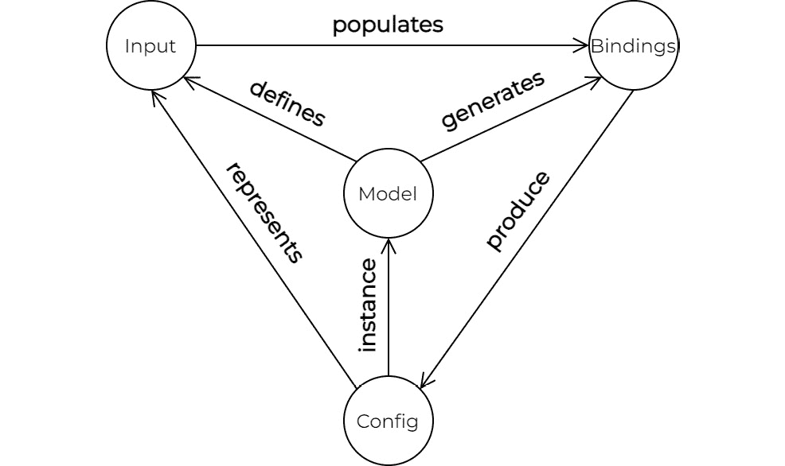
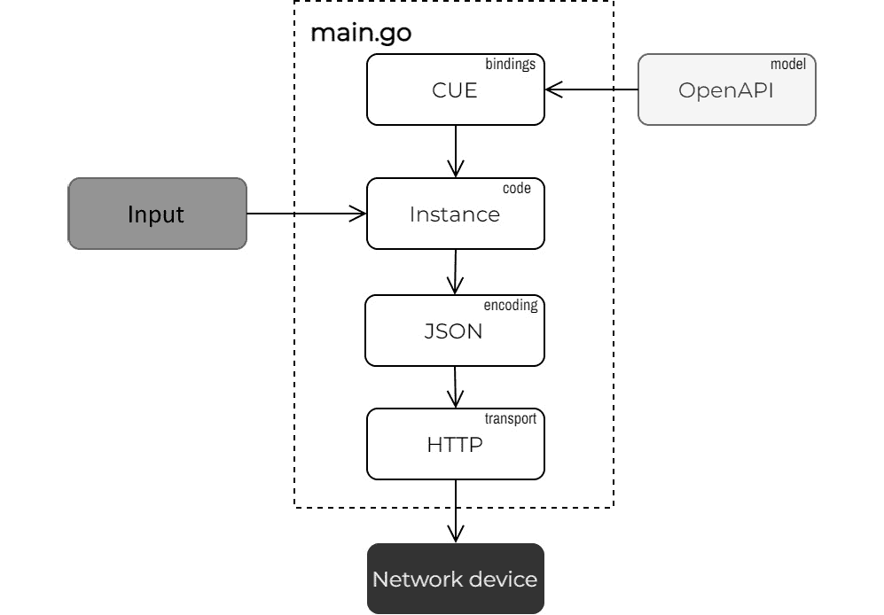
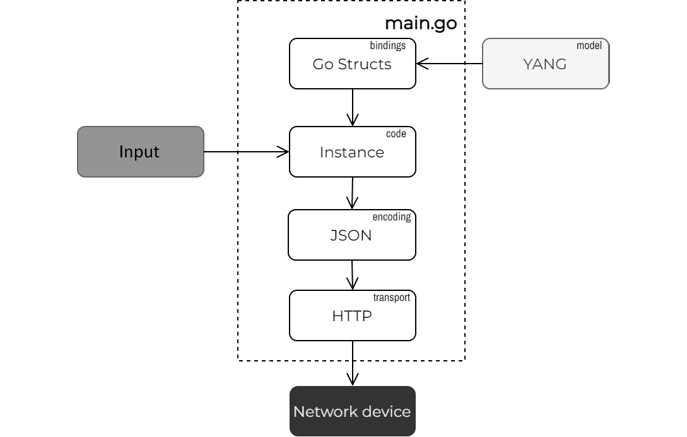
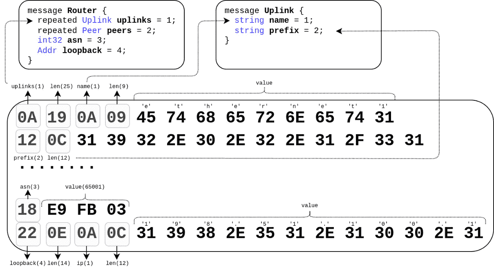
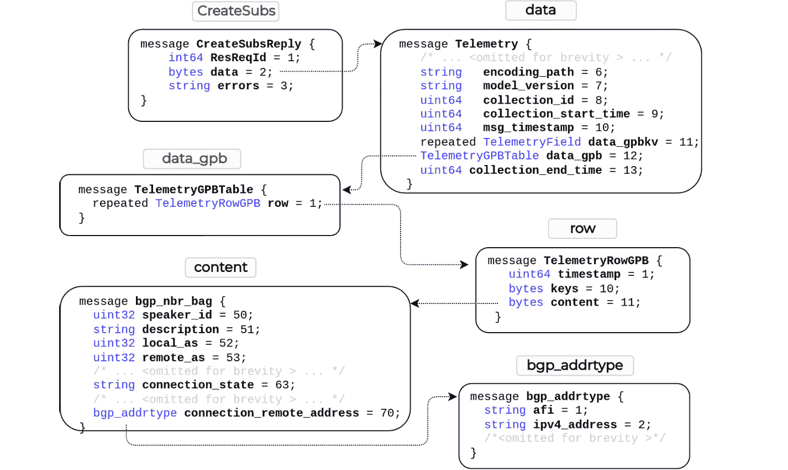
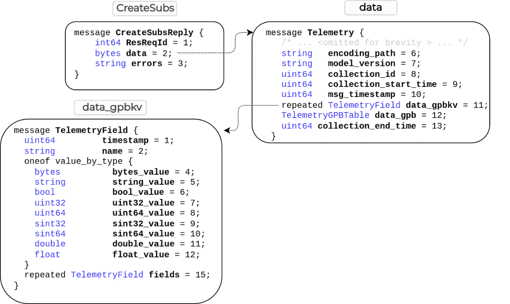

# 第八章：网络 API

随着我们构建、部署和运营网络的方式不断发展，新的协议和接口正在出现，以简化机器之间的通信——这是网络自动化的主要推动力。在本章和接下来的章节中，我们将探讨一些这些新功能，并探索如何在 Go 编程语言的环境中利用它们。

网络的**命令行界面**（**CLI**）是我们，网络工程师，几十年来用于操作和管理网络设备的方式。随着我们朝着更程序化的网络管理方法发展，仅仅依赖于更快的 CLI 命令执行可能不足以大规模部署网络自动化解决方案。

没有强大基础解决方案是脆弱且不稳定的。因此，在可能的情况下，我们更倾向于基于结构化数据和机器友好的**应用程序编程接口**（**API**）来构建网络自动化项目。这些接口的目标用例不是直接的人机交互，因此你可以依赖 Go 在远程 API 调用和本地用户界面之间进行转换。

当我们谈论 API 时，我们通常指的是构成 API 开发者体验的不同事物，这些是你评估 API 时需要考虑的：

+   一组定义客户端和服务器之间交互规则的**远程过程调用**（**RPC**）——至少包括创建、获取、更新和删除的标准操作集。

+   交换的结构和数据类型——产品供应商可以使用 YANG 或 OpenAPI 等数据模型规范语言来定义这一点。

+   包裹模型数据的底层协议，您可以将它序列化为标准格式之一，如 XML 或 JSON，并在客户端和服务器之间传输——这可能是 SSH，或者更常见的是 HTTP。

在网络领域，API 景观中还有一个维度决定了模型规范文档的来源。虽然每个网络供应商都可以自由编写自己的数据模型，但有两个供应商无关的模型来源——IETF 和 OpenConfig——努力提供一种供应商中立的配置和监控网络设备的方式。由于 API 生态系统的这种可变性，不可能涵盖所有协议和标准，因此在本章中，我们只涵盖了一小部分网络 API，这些 API 是根据可用性、实用性和有用性选择的：

+   我们将从 OpenAPI 开始，它是更广泛的基础设施领域中最为普遍的 API 规范标准之一。

+   接下来，我们将转向 JSON-RPC，它使用供应商特定的 YANG 模型。

+   之后，我们将展示一个基于 RFC 标准的 HTTP 协议的示例，称为 RESTCONF。

+   最后，我们将探讨如何利用**协议缓冲区**（**protobuf**）和 gRPC 与网络设备进行交互并流式传输遥测数据。

在本章中，我们将仅关注这些网络 API，因为其他内容超出了范围。最引人注目的是缺席的**网络配置协议**（**NETCONF**）——这是最古老的网络 API 之一，最初由 IETF 于 2006 年定义。我们跳过 NETCONF 主要是因为我们在本章使用的某些 Go 包中缺乏对 XML 的支持。尽管 NETCONF 今天仍在使用，并提供了相关的功能，如不同的配置数据存储、配置验证和网络范围内的配置事务，但在未来，它可能会被运行在 HTTP 和 TLS 之上的技术所取代，如 RESTCONF、gNMI 和各种专有网络 API。

# 技术要求

你可以在本书的 GitHub 仓库中找到本章的代码示例（参考*进一步阅读*部分），在`ch08`文件夹下。

重要提示

我们建议你在虚拟实验室环境中执行本章的 Go 程序。有关先决条件和构建它的说明，请参阅附录。

# API 数据建模

在我们查看任何代码之前，让我们回顾一下什么是数据建模，它的关键组件是什么，以及它们之间的关系。虽然我们在这个解释中关注的是模型驱动 API 的配置管理方面，但类似的规则和假设也适用于涉及状态数据检索和验证的工作流程。

配置管理工作流程的主要目标是把一些输入转换成一个结构符合数据模型的序列化数据负载。这个输入通常是面向用户的数据，它有自己的结构，可能只包含配置值总数的一小部分。但这个输入与结果配置有一对一的关系，这意味着重新运行相同的流程应该会产生相同的一组 RPCs，具有相同的负载和相同的网络设备上的配置状态。

所有这一切的中心是一个数据模型——一个文本文档，描述了（配置）数据负载的分层结构和值类型。这份文档成为所有潜在客户的合同——只要他们以正确的格式发送数据，服务器就应该能够理解并解析它。这份合同是双向的，因此当客户端从服务器请求一些信息时，它可以期望以预定的格式接收它。

下面的图展示了模型驱动配置管理工作流程的主要组件及其关系：



图 8.1 – 数据建模概念

到目前为止，我们已经讨论了一个模型、其输入以及产生的配置。直到现在，我们还没有提到的是 *绑定*。我们使用这个术语来指代一组广泛的工具和库，它们可以帮助我们以编程方式生成最终的配置数据负载，也就是说，不依赖于一系列文本模板或手动构建这些数据负载，这两者我们都认为在任何网络自动化工作流程中都是反模式。我们根据数据模型生成这些绑定，它们代表了模型的程序性视图。它们还可能包括几个辅助函数，用于将数据结构序列化和反序列化到预期的输出格式之一，例如 JSON 或 protobuf。我们将在本章的大部分内容中讨论和交互绑定，因为它们成为编程语言内部数据模型的主要接口。

现在我们已经介绍了一些理论，是时候将其付诸实践了。在接下来的部分，我们将探讨 OpenAPI 模型以及一种你可以实例化和验证它们的方法。

# OpenAPI

在更广泛的基础设施景观中，HTTP 和 JSON 是机器到机器通信中常用的两种标准。大多数基于 Web 的服务，包括公共和私有云，都使用这些技术的组合来公开其外部 API。

OpenAPI 规范允许我们定义和消费 RESTful API。它让我们能够描述对应的负载的启用 HTTP 路径、响应和 JSON 架构。它作为 API 提供者和其客户端之间的合同，以允许更稳定和可靠的 API 消费者体验，并通过版本控制实现 API 的进化。

我们在网络上并不广泛使用 OpenAPI，可以说这是出于历史原因。YANG 及其协议生态系统早于 OpenAPI，网络操作系统的变化速度也没有你想象的那么快。但我们在网络设备中经常发现 OpenAPI 的支持——SDN 控制器、监控和配置系统或 **域名系统** (**DNS**)、**动态主机配置协议** (**DHCP**) 和 **IP 地址管理** (**IPAM**) 产品。这使得 OpenAPI 对于任何网络自动化工程师来说是一项有价值的技能。

在 *第六章* 和 *第七章* 中，我们通过一个示例了解了如何与 Nautobot 的外部基于 OpenAPI 的接口交互。我们使用了一个基于 Nautobot OpenAPI 规范的开源代码生成框架生产的 Go 包。在使用自动代码生成工具时，需要注意的一点是，它们依赖于 OpenAPI 规范的某个版本。如果你的 API 规范版本不同（今天有九个不同的 OpenAPI 版本；请参阅 *进一步阅读* 部分），工具可能不会生成 Go 代码。因此，我们想要探索一种替代方法。

在本节中，我们将配置 NVIDIA 的 Cumulus Linux 设备（`cvx`），该设备具有基于 OpenAPI 的 HTTP API，使用**配置统一执行**（**CUE**；参见**进一步阅读**部分）——一个开源的**领域特定语言**（**DSL**），用于定义、生成和验证结构化数据。

CUE 的主要用户界面是 CLI，但它也支持一流的 Go API，因此我们将专注于如何在 Go 代码中完全与之交互，并在适当的地方提供相应的 shell 命令。

下一个图展示了我们将讨论的 Go 程序的高级概述：



图 8.2 – 使用 OpenAPI 数据模型

## 数据建模

从图表的顶部开始，我们首先需要生成可以用来生成配置网络设备的数据结构的 CUE 代码。

虽然 CUE 可以导入现有的结构化数据并生成 CUE 代码，但要达到代码组织最优化的点可能需要几次迭代。对于这里展示的示例，从头开始编写此代码要快得多。结果位于`ch08/cue/template.cue`文件中（参见**进一步****阅读**部分）。

重要提示

本书不会涵盖 CUE 语法或其任何核心概念和原则，而是将专注于其 Go API。有关该语言的更多详细信息，请参阅 CUE 的官方文档，该文档在**进一步****阅读**部分链接。

CUE 类似于 JSON，受到 Go 的强烈影响。它允许您通过引用定义数据结构并在不同的数据结构之间映射值。因此，CUE 中的数据生成成为一项数据转换练习，具有严格的值类型和模式验证。以下是前面提到的`template.cue`文件的一个片段，它定义了三个顶级对象，用于接口、路由和 VRF 配置：

```go
package cvx
import "network.automation:input"
interface: _interfaces
router: bgp: {
    _global_bgp
}
vrf: _vrf
_global_bgp: {
    "autonomous-system": input.asn
    enable:              "on"
    "router-id":         input.loopback.ip
}
_interfaces: {
    lo: {
        ip: address: "\(input.LoopbackIP)": {}
        type: "loopback"
    }
    for intf in input.uplinks {
        "\(intf.name)": {
            type: "swp"
            ip: address: "\(intf.prefix)": {}
        }
    }
}
/* ... omitted for brevity ... */
```

重要提示

您可以参考 CUE 的**引用和可见性**教程（在**进一步阅读**部分链接），了解输出值、引用以及下划线使用的方法。

此文件引用了一个名为`input`的外部 CUE 包，它为前面输出中的数据模型提供了所需的数据输入。这种数据模板及其输入的分离允许您分别分发这些文件，并且它们可能来自不同的来源。CUE 提供保证，无论您遵循什么顺序组装这些文件，结果始终相同。

## 数据输入

现在，让我们看看我们如何定义和提供前面数据模型的输入。我们使用与*第六章*、*配置管理*和*第七章*、*自动化框架*中使用的相同数据结构，在 YAML 文件（`input.yaml`）中，对于`cvx`实验室设备如下所示：

```go
# input.yaml
asn: 65002
loopback: 
  ip: "198.51.100.2"
uplinks:
  - name: "swp1"
    prefix: "192.0.2.3/31"
peers:
  - ip: "192.0.2.2"
    asn: 65001
```

使用 CUE，我们可以通过构建相应的对象并引入约束来验证这些输入数据是否正确，例如，一个有效的 ASN 范围或 IPv4 前缀格式。CUE 允许你直接在模式定义中定义额外的值，无论是通过硬编码默认值（`input.VRFs`）还是引用同一上下文中的其他值（`input.LoopbackIP`）：

```go
package input
import (
    "net"
)
asn: <=65535 & >=64512
loopback: ip: net.IPv4 & string
uplinks: [...{
    name:   string
    prefix: net.IPCIDR & string
}]
peers: [...{
    ip:  net.IPv4 & string
    asn: <=65535 & >=64512
}]
LoopbackIP: "\(loopback.ip)/32"
VRFs: [{name: "default"}]
```

在示例程序的主函数中，我们使用`importInput`辅助函数读取输入 YAML 文件并生成相应的 CUE 文件：

```go
import "cuelang.org/go/cue/load"
func main() {
    err := importInput()
    /* ... <continues next > ... */
}
```

程序将生成的文件保存为本地目录中的`input.cue`。这个函数的实现细节并不重要，因为你可以通过命令行使用`cue import input.yaml -p input`执行相同的操作。

在这个阶段，我们可以验证我们的输入是否符合前面显示的模式和约束。例如，如果我们把`input.yaml`中的`asn`值设置在预期范围之外，CUE 就会捕获并报告这个错误：

```go
ch08/cue$ cue eval network.automation:input -c
asn: invalid value 10 (out of bound >=64512):
    ./schema.cue:7:16
    ./input.cue:3:6
```

## 设备配置

现在我们已经准备好配置我们的网络设备。我们通过将`cvx`包中定义的模板编译成具体的 CUE 值来生成最终的配置实例。我们分三步完成这项工作。

首先，我们加载本地目录中所有的 CUE 文件，指定包含模板的包名（`cvx`）：

```go
func main() {
    /* ... <continues from before > ... */
    bis := load.Instances([]string{"."}, &load.Config{
        Package: "cvx",
    })
    /* ... <continues next > ... */
}
```

第二步，我们将所有加载的文件编译成一个 CUE 值，这解决了所有导入并将输入与模板结合：

```go
func main() {
    /* ... <continues from before > ... */
    ctx := cuecontext.New()
    i := ctx.BuildInstance(instances[0])
    if i.Err() != nil {
        msg := errors.Details(i.Err(), nil)
        fmt.Printf("Compile Error:\n%s\n", msg)
    }
    /* ... <continues next > ... */
}
```

最后，我们验证是否可以解析所有引用，并且输入提供了所有必需的字段：

```go
func main() {
    /* ... <continues from before > ... */
    if err := i.Validate(
        cue.Final(),
        cue.Concrete(true),
    ); err != nil {
        msg := errors.Details(err, nil)
        fmt.Printf("Validate Error:\n%s\n", msg)
    }
    /* ... <continues next > ... */
}
```

一旦我们知道 CUE 值是具体的，我们就可以安全地将它序列化为 JSON 并发送到`cvx`设备。`sendBytes`函数的主体实现了我们在*第六章*“配置管理”中讨论的三阶段提交过程：

```go
func main() {
    /* ... <continues from before > ... */
    data, err := e.MarshalJSON()
    // check error
    if err := sendBytes(data); err != nil {
        log.Fatal(err)
    }
    log.Printf("Successfully configured the device")
}
```

你可以在本书 GitHub 仓库的`ch08/cue`目录（参考*进一步阅读*部分）中找到完整的程序（参考*进一步阅读*部分）。该目录包括带有数据模板和输入模式的完整 CUE 文件以及输入 YAML 文件。该程序的正常执行应该产生如下输出：

```go
ch08/cue$ go run main.go
main.go:140: Created revisionID: changeset/cumulus/2022-05-25_20.56.51_KF9A
{
  "state": "apply",
  "transition": {
    "issue": {},
    "progress": ""
  }
}
main.go:69: Successfully configured the device
```

请记住，尽管我们在这章中关注 CUE 的 Go API，但你也可以使用 CUE CLI（可执行二进制文件）执行相同的操作集。这甚至包括三阶段提交以提交和应用`cvx`配置。使用内置的 CUE 脚本语言，你可以定义任何任务序列，例如进行 HTTP 调用或检查和解析响应。你可以将这些操作或任务保存到特殊的*工具*文件中，它们将自动在`cue`二进制文件中可用。你可以在`ch08/cue`的 readme 文档中了解更多信息，并在该书的 GitHub 仓库的`ch08/cue/cue_tool.cue`文件中找到示例源代码（参考*进一步阅读*部分）。

CUE 在我们刚刚描述的应用场景之外还有许多用途，不同的开源项目如 **Istio** 和 **dagger.io**（参考 *进一步阅读* 部分）已经采用了它并在其产品中使用。我们鼓励您探索本书涵盖之外的其他 CUE 用例，以及类似的配置语言如 **Jsonnet** 和 **Dhall**（参考 *进一步阅读* 部分）。

我们已经介绍了几种与 OpenAPI 提供者交互的不同方式。在本章的剩余部分，我们将专注于基于 YANG 的 API。我们将介绍的第一个是诺基亚的 JSON-RPC 接口实现。

# JSON-RPC

JSON-RPC 是一种轻量级协议，您可以使用它来在客户端和服务器之间交换结构化数据。它可以在不同的传输协议上工作，但我们将仅关注 HTTP。尽管 JSON-RPC 是一种标准，但它只定义了顶级 RPC 层，而有效载荷和操作则保持对每个实现的特定性。

在本节中，我们将展示如何使用诺基亚特定的 YANG 模型来配置我们实验室拓扑中的 srl 设备，因为 SR Linux 支持通过 JSON-RPC 发送和接收 YANG 有效载荷（参考 *进一步阅读* 部分）。

我们将尽量避免手动构建 YANG 数据有效载荷或依赖传统的文本模板方法。一些 YANG 模型的巨大规模，以及模型偏差和增强，使得手动构建有效载荷变得不可能。为了大规模地完成这项工作，我们需要依赖一种程序化的方法来构建配置实例和检索状态数据。这就是我们使用 openconfig/ygot（YANG Go 工具）（参考 *进一步阅读* 部分）的地方——一套从一组 YANG 模型自动生成代码的工具和 API。

在高层次上，示例程序的结构与 *OpenAPI* 部分中的类似。*图 8.3* 展示了本节中我们将要审查的程序的基本构建块：



图 8.3 – 使用 YANG 数据模型

我们将首先将自动生成的 Go 绑定与输入数据结合起来，构建一个配置实例来配置 `srl` 设备。

## 代码生成

从前面图表的顶部开始，第一步是从一组诺基亚的 YANG 模型生成相应的 Go 代码（参考 *进一步阅读* 部分）。我们将仅使用诺基亚 YANG 模型的一个子集来生成绑定，以配置我们所需要的，即 L3 接口、BGP 和路由重分发。这样，我们保持生成的 Go 包的大小小，并限制在我们的特定用例中。

很遗憾，除了阅读和理解 YANG 模型或从现有配置中逆向工程它们之外，没有通用的规则来确定您需要的模型列表。幸运的是，诺基亚开发了一个 YANG 浏览器（参考 *进一步阅读* 部分），它包括一个模式匹配搜索，可以突出显示相关的 XPaths，并帮助您找到正确的 YANG 模型集。

一旦我们确定了需要的模型，我们就可以使用 ygot 生成器工具根据它们构建一个 Go 包。我们不会描述这个工具的所有标志，因为 ygot 的官方文档（参考 *进一步阅读* 部分）涵盖了它们。不过，我们想强调我们将使用的重要选项：

+   `generate_fakeroot`: 这将所有生成的 Go 数据结构封装在一个名为 `Device` 的顶级 *模拟* 根数据结构中，以将所有模块连接到一个共同的层次结构中。因为没有 YANG 模型定义了一个适用于所有设备的通用根顶级容器，网络设备只需在根 (`/`) 处添加它们支持的 YANG 模块。`ygot` 通过这个 *模拟* 根容器表示根。

+   `path`: 此标志帮助 `ygot` 查找并解决任何 YANG 数据模型导入。

自动生成 `srl` 包并将其放置在我们使用的 `./pkg/srl/` 目录的完整命令如下：

```go
ch08/json-rpc$ go run \
  github.com/openconfig/ygot/generator \
    -path=yang \
    -generate_fakeroot -fakeroot_name=device \
    -output_file=pkg/srl/srl.go \
    -package_name=srl \
    yang/srl_nokia/models/network-instance/srl_nokia-bgp.yang \
    yang/srl_nokia/models/routing-policy/srl_nokia-routing-policy.yang \
    yang/srl_nokia/models/network-instance/srl_nokia-ip-route-tables.yang
```

由于前面的命令有几个标志，可能需要记住它们的确切集合，以便将来可以重复构建。一个替代方案是将它们包含在一个代码构建工具中，例如 make。另一个更符合 Go 习惯的选项是使用 `//go:generate` 指令将其包含在源代码中，正如您在 `ch08/json-rpc/main.go` 文件中看到的那样（参考 *进一步阅读* 部分）。因此，您可以使用此命令反复生成相同的 `srl`：

```go
ch08/json-rpc$ go generate ./...
```

## 构建配置

现在我们已经构建了一个基于 YANG 的 Go 包，我们可以创建一个程序实例来表示我们想要的配置状态，并填充它。我们所有这些操作都在 Go 中完成，利用通用编程语言的全部灵活性。

例如，我们可以将配置程序设计为一组方法，输入模型作为接收器参数。在读取和解析输入数据后，我们创建一个空的 *模拟* 根设备，我们迭代地扩展它，直到构建包含所有我们想要配置的相关值的完整 YANG 实例。

使用根设备的好处是我们不需要担心单个路径。我们可以将有效载荷发送到 `/`，假设生成的 YANG 树层次结构从根开始：

```go
import (
  api "json-rpc/pkg/srl"
)
// Input Data Model
type Model struct {
  Uplinks  []Link `yaml:"uplinks"`
  Peers    []Peer `yaml:"peers"`
  ASN      int    `yaml:"asn"`
  Loopback Addr   `yaml:"loopback"`
}
func main() {
  /* ... <omitted for brevity > ... */
  var input Model
  d.Decode(&input)
  device := &api.Device{}
  input.buildDefaultPolicy(device)
  input.buildL3Interfaces(device)
  input.buildNetworkInstance(device)
  /* ... <continues next (main) > ... */
}
```

上述代码在输入上调用三个方法。让我们聚焦于 `buildNetworkInstance` 方法，它负责 L3 路由配置。此方法是我们定义 *网络实例* 的地方，它是用于 **VPN 路由和转发**（**VRF**）实例和 **虚拟交换实例**（**VSIs**）的常用抽象。我们从顶级根设备创建一个新的网络实例，以确保我们将其附加到 YANG 树的顶部：

```go
func (m *Model) buildNetworkInstance(dev *api.Device) error {
  ni, err := dev.NewNetworkInstance(defaultNetInst)
  /* ... <continues next (buildNetworkInstance) > ... */
}
```

在下一个代码片段中，我们将所有上行链路和环回接口移动到新创建的网络实例中，通过将每个子接口定义为默认网络实例的子项来实现：

```go
func (m *Model) buildNetworkInstance(dev *api.Device) error {
  // ... <continues from before (buildNetworkInstance) > 
  links := m.Uplinks
  links = append(
    links,
    Link{
      Name:   srlLoopback,
      Prefix: fmt.Sprintf("%s/32", m.Loopback.IP),
    },
  )
  for _, link := range links {
    linkName := fmt.Sprintf("%s.%d", link.Name,
                            defaultSubIdx)
    ni.NewInterface(linkName)
  }
  /* ... <continues next (buildNetworkInstance) > ... */
}
```

接下来，我们通过手动填充 BGP 结构并将其附加到 `default` 网络实例的 `Protocols.Bgp` 字段来定义全局 BGP 设置：

```go
func (m *Model) buildNetworkInstance(dev *api.Device) error {
  // ... <continues from before (buildNetworkInstance) > 
  ni.Protocols =
  &api.SrlNokiaNetworkInstance_NetworkInstance_Protocols{
    Bgp: 
    &api.
    SrlNokiaNetworkInstance_NetworkInstance_Protocols_Bgp{
      AutonomousSystem: ygot.Uint32(uint32(m.ASN)),
      RouterId:         ygot.String(m.Loopback.IP),
      Ipv4Unicast: 
      &api. 
SrlNokiaNetworkInstance_NetworkInstance_Protocols_Bgp_Ipv4Unicast{
        AdminState: api.SrlNokiaBgp_AdminState_enable,
      },
    },
  }
  /* ... <continues next (buildNetworkInstance) > ... */
}
```

配置的最后部分是 BGP 邻居。我们遍历输入数据模型中定义的对等体列表，并在我们之前设置的 BGP 结构下添加一个新的条目：

```go
func (m *Model) buildNetworkInstance(dev *api.Device) error {
  // ... <continues from before (buildNetworkInstance) > 
  ni.Protocols.Bgp.NewGroup(defaultBGPGroup)
  for _, peer := range m.Peers {
    n, err := ni.Protocols.Bgp.NewNeighbor(peer.IP)
    // check error
    n.PeerAs = ygot.Uint32(uint32(peer.ASN))
    n.PeerGroup = ygot.String(defaultBGPGroup)
  }
  /* ... <continues next (buildNetworkInstance) > ... */
}
```

当我们完成填充 Go 结构时，我们确保所有提供的值都是正确的，并且符合 YANG 约束。我们可以通过在父容器上调用 `Validate` 方法来完成此操作：

```go
func (m *Model) buildNetworkInstance(dev *api.Device) error {
    /* ... <continues from before (buildNetworkInstance) > ... */
    if err := ni.Validate(); err != nil {
        return err
    }
    return nil
}
```

## 设备配置

一旦我们用所有输入值填充了 YANG 模型实例，下一步就是将其发送到目标设备。我们通过几个步骤来完成此操作：

1.  我们使用 `ygot` 辅助函数从当前的 YANG 实例生成一个映射。此映射已准备好根据 RFC7951 中定义的规则序列化为 JSON。

1.  我们使用标准的 `encoding/json` 库构建一个单一的 JSON-RPC 请求，该请求使用我们的配置更改更新整个 YANG 树。

1.  使用标准的 `net/http` 包，我们将此请求发送到 `srl` 设备：

    ```go
    func main() {
    ```

    ```go
        /* ... <continues from before (main) > ... */
    ```

    ```go
        v, err := ygot.ConstructIETFJSON(device, nil)
    ```

    ```go
        // check error
    ```

    ```go
        value, err := json.Marshal(RpcRequest{
    ```

    ```go
            Version: "2.0",
    ```

    ```go
            ID:      0,
    ```

    ```go
            Method:  "set",
    ```

    ```go
            Params: Params{
    ```

    ```go
                Commands: []*Command{
    ```

    ```go
                    {
    ```

    ```go
                        Action: "update",
    ```

    ```go
                        Path:   "/",
    ```

    ```go
                        Value:  v,
    ```

    ```go
                    },
    ```

    ```go
                },
    ```

    ```go
            },
    ```

    ```go
        })
    ```

    ```go
        // check error
    ```

    ```go
        req, err := http.NewRequest(
    ```

    ```go
            "POST",
    ```

    ```go
            hostname,
    ```

    ```go
            bytes.NewBuffer(value),
    ```

    ```go
        )
    ```

    ```go
        resp, err := client.Do(req)
    ```

    ```go
         // check error
    ```

    ```go
        defer resp.Body.Close()
    ```

    ```go
        if resp.StatusCode != http.StatusOK {
    ```

    ```go
            log.Printf("Status: %s", resp.Status)
    ```

    ```go
        }
    ```

您可以在本书 GitHub 仓库的 `ch08/json-rpc` 目录中找到配置 srl 设备的完整程序（参考 *进一步阅读* 部分）。要运行它，请 `cd` 到此文件夹并运行以下命令：

```go
ch08/json-rpc$ go run main.go
2022/04/26 13:09:03 Successfully configured the device
```

此程序仅验证我们成功执行了 RPC；它尚未检查以确认它是否产生了预期的效果，我们将在本章后面讨论。与大多数基于 HTTP 的协议一样，单个 RPC 是一个单一的事务，因此您可以假设目标设备已应用了更改，只要您收到成功的响应。值得一提的是，一些 JSON-RPC 实现具有更多的会话控制功能，允许多阶段提交、回滚和其他功能。

在下一节中，我们将采取类似的方法配置网络设备，基于其 YANG 模型，但将引入一些变化以展示 OpenConfig 模型和 RESTCONF API。

# RESTCONF

IETF 设计 RESTCONF 作为基于 HTTP 的 NETCONF 替代方案，它提供对包含 YANG 模型数据的概念数据存储的 **创建、读取、更新和删除**（**CRUD**）操作。它可能缺少一些 NETCONF 功能，例如不同的数据存储、排他性配置锁定以及批量和回滚操作，但具体支持的和不支持的功能取决于实现和网络设备的功能。话虽如此，由于它使用 HTTP 方法并支持 JSON 编码，RESTCONF 减少了外部系统集成和与网络设备互操作入门的障碍。

RESTCONF 通过 HTTP 方法支持一组标准的 CRUD 操作：POST、PUT、PATCH、GET 和 DELETE。RESTCONF 使用 YANG XPath 转换为类似 REST 的 URI 来构建 HTTP 消息，并在消息体中传输有效负载。尽管 RESTCONF 支持 XML 和 JSON 编码，但我们将仅关注后者，其编码规则定义在 RFC7951 中。我们将使用 Arista 的 EOS 作为测试设备，在启动实验室拓扑时，其 RESTCONF API 已启用。

我们在本节中创建的程序结构与 *图 8**.3* 中所示的 JSON-RPC 示例相同。

## 代码生成

代码生成过程几乎与我们在 *JSON-RPC* 部分遵循的过程相同。我们使用 openconfig/ygot（请参阅 *进一步阅读* 部分）从 EOS 支持的一组 YANG 模型生成一个 Go 包。但在继续之前，有一些值得注意的差异需要提及：

+   我们使用的是供应商中立的 OpenConfig 模型，而不是特定于供应商的 YANG 模型，这些模型 Arista EOS 支持。

+   当使用 openconfig/ygot（请参阅 *进一步阅读* 部分）生成 Go 代码时，您可能会遇到在同一个命名空间中定义了多个模型的情况。在这种情况下，您可以使用 `-exclude_modules` 标志忽略特定的 YANG 模型，而无需从配置的搜索路径中删除其源文件。

+   我们通过移除包含 `list` 节点的 YANG 容器来启用 OpenConfig 路径压缩，以优化生成的 Go 代码。有关更多详细信息，请参阅 `ygen` 库设计文档（*进一步阅读*）。

+   我们还展示了另一种方法，其中我们不生成一个 *假* 的根设备。因此，我们无法在一个 RPC 中应用所有更改。相反，我们必须进行多个 HTTP 调用，每个调用都有自己的唯一 URI 路径。

在我们能够生成 Go 代码之前，我们需要确定支持的 Arista YANG 模型集（请参阅 *进一步阅读* 部分），并将它们复制到 `yang` 目录中。我们使用以下命令从该模型列表生成 `eos` Go 包：

```go
ch08/restconf$ go run github.com/openconfig/ygot/generator \
  -path=yang \
  -output_file=pkg/eos/eos.go \
  -compress_paths=true \
  -exclude_modules=ietf-interfaces \
  -package_name=eos \
  yang/openconfig/public/release/models/bgp/openconfig-bgp.yang \
  yang/openconfig/public/release/models/interfaces/openconfig-if-ip.yang \
  yang/openconfig/public/release/models/network-instance/openconfig-network-instance.yang \
  yang/release/openconfig/models/interfaces/arista-intf-augments-min.yang
```

由于我们在 *JSON-RPC* 部分描述的原因，我们也可以使用以下命令将此命令嵌入到 Go 源代码中，以生成相同的 Go 包：

```go
ch08/restconf$ go generate ./...
```

## 构建配置

在这个例子中，我们不会在一个单独的 HTTP 调用中应用所有更改，这样我们就可以向您展示如何更新 YANG 树的特定部分，而不会影响其他无关的部分。在前一节中，我们通过使用`Update`操作来解决这个问题，该操作将我们发送的配置与设备上现有的配置合并。

但在某些情况下，我们希望避免*合并*行为，并确保只有我们发送的配置存在于设备上（声明式管理）。为此，我们本可以导入所有现有的配置，并确定我们想要保留或替换的部分，然后再向目标设备发送新的配置版本。相反，我们通过一系列 RPC 创建一个针对 YANG 树特定部分的配置。

为了简化 RESTCONF API 调用，我们创建了一个特殊的`restconfRequest`类型，它包含一个 URI 路径和要发送到设备的相应有效载荷。`main`函数从解析数据模型的输入和准备一个变量以存储一组 RESTCONF RPC 开始：

```go
type restconfRequest struct {
    path    string
    payload []byte
}
func main() {
    /* ... <omitted for brevity > ... */
    var input Model
    err = d.Decode(&input)
    // check error
    var cmds []*restconfRequest
    /* ... <continues next > ... */
}
```

与 JSON-RPC 示例一样，我们通过一系列方法调用构建所需的配置实例。这次，每个方法返回一个包含足够详细信息以构建 HTTP 请求的`restConfRequest`：

```go
func main() {
    /* ... <continues from before > ... */ 
    l3Intfs, err := input.buildL3Interfaces()
    // check error
    cmds = append(cmds, l3Intfs...)
    bgp, err := input.buildBGPConfig()
    // check error
    cmds = append(cmds, bgp)
    redistr, err := input.enableRedistribution()
    // check error
    cmds = append(cmds, redistr)
    /* ... <continues next > ... */
}
```

让我们检查这些方法之一，它可以从我们的输入创建一个 YANG 配置。`enableRedistribution`方法生成一个配置，以在直接连接的表和用于识别重分布源和目标的 BGP `TableConnection`结构之间启用重分布：

```go
const defaultNetInst = "default"
func (m *Model) enableRedistribution() (*restconfRequest, error) {
    netInst := &api.NetworkInstance{
        Name: ygot.String(defaultNetInst),
    }
    _, err := netInst.NewTableConnection(
        api.OpenconfigPolicyTypes_INSTALL_PROTOCOL_TYPE_DIRECTLY_CONNECTED,
        api.OpenconfigPolicyTypes_INSTALL_PROTOCOL_TYPE_BGP,
        api.OpenconfigTypes_ADDRESS_FAMILY_IPV4,
    )

    /* ... <omitted for brevity > ... */
    value, err := ygot.Marshal7951(netInst)
    // check error
    return &restconfRequest{
        path: fmt.Sprintf(
            "/network-instances/network-instance=%s",
            defaultNetInst,
        ),
        payload: value,
    }, nil
}
```

*图 8**.3* 中的其余代码显示了本节中我们审查的程序的基本构建块。

## 设备配置

一旦我们准备好了所有必要的 RESTCONF RPC，我们就可以将它们发送到设备。我们遍历每个`restconfRequest`，并将其传递给一个辅助函数，捕获任何返回的错误。

`restconfPost`辅助函数有足够的代码来使用`net/http`包构建一个 HTTP 请求并将其发送到`ceos`设备：

```go
const restconfPath = "/restconf/data"
func restconfPost(cmd *restconfRequest) error {
  baseURL, err := url.Parse(
    fmt.Sprintf(
      "https://%s:%d%s",
      ceosHostname,
      defaultRestconfPort,
      restconfPath,
    ),
  )
  // return error if not nil
  baseURL.Path = path.Join(restconfPath, cmd.path)
  req, err := http.NewRequest(
    "POST",
    baseURL.String(),
    bytes.NewBuffer(cmd.payload),
  )
  // return error if not nil
  req.Header.Add("Content-Type", "application/json")
  req.Header.Add(
    "Authorization",
    "Basic "+base64.StdEncoding.EncodeToString(
      []byte(
        fmt.Sprintf("%s:%s", ceosUsername, ceosPassword),
      ),
    ),
  )
  client := &http.Client{Transport: &http.Transport{
        TLSClientConfig: 
          &tls.Config{
            InsecureSkipVerify: true
          },
      }
  }
  resp, err := client.Do(req)
  /* ... <omitted for brevity > ... */
}
```

您可以在本书 GitHub 仓库的`ch08/restconf`目录中找到完整的程序（参考*进一步阅读*部分）。从运行实验室拓扑结构的宿主机上运行它应该会产生与这个类似的输出：

```go
ch08/restconf$ go run main.go
2022/04/28 20:49:16 Successfully configured the device
```

在这个阶段，我们应该已经完全配置了我们的实验室拓扑结构中的所有三个节点。尽管如此，我们还没有确认我们所做的一切是否达到了预期的效果。在下一节中，我们将通过状态验证的过程，并展示如何使用网络 API 来完成这一过程。

# 状态验证

在本章的最后三个部分中，我们在验证配置更改是否产生预期效果之前就推动了设备配置。这是因为我们需要所有设备配置完毕后才能验证产生的收敛操作状态。现在，随着所有来自 *OpenAPI*、*JSON-RPC* 和 *RESTCONF* 部分的代码示例在实验室拓扑结构上执行，我们可以验证我们是否实现了配置意图——在所有三个设备的回环 IP 地址之间建立端到端可达性。

在本节中，我们将使用本章前面使用的相同协议和建模语言来验证每个实验室设备是否可以在其 GitHub 仓库的 `ch08/state` 目录（参考 *进一步阅读* 部分）中看到其他两个实验室设备的回环 IP 地址。接下来，我们将检查一个使用 Arista 的 cEOS (`ceos`) 实验室设备的单个示例。

## 操作状态建模

当我们谈论网络元素的操作状态时，需要注意 YANG 操作状态 IETF 草案（参考 *进一步阅读* 部分）中描述的已应用状态和导出状态之间的区别。前者指的是当前活动的设备配置，应该反映操作员已经应用的内容。后者是一组只读值，由设备的内部操作产生，例如 CPU 或内存利用率，以及与外部元素（如数据包计数器或 BGP 邻居状态）的交互。尽管在我们谈论操作状态时没有明确提及，但除非我们明确说明，否则假设我们指的是导出状态。

从历史上看，在 YANG 中对设备的操作状态进行建模的方法有很多：

+   你可以选择将所有内容都包含在一个顶级容器中，或者从独立的 `state` 数据存储中读取，与用于配置管理的 `config` 容器/数据存储完全不同。

+   另一种方法是为每个 YANG 子树创建一个独立的 `state` 容器，与 `config` 容器并列。这正是 YANG 操作状态 IETF 草案（参考 *进一步阅读* 部分）所描述的。

根据你使用的方法，你可能需要调整构建 RPC 请求的方式。例如，`srl` 设备需要一个对 `state` 数据存储的显式引用。我们在下一个代码示例中展示了另一种方法，即从 YANG 子树中检索一部分，并从中提取相关的状态信息。

值得注意的是，OpenAPI 对其模型的结构和组成要求不那么严格，状态可能来自树的不同部分，或者根据实现需要特定的查询参数来引用操作数据存储。

## 操作状态处理

配置管理工作流程通常涉及处理一些输入数据以生成特定于设备的配置。这是一个常见的流程，我们经常用它来展示 API 的功能。但还有一个同样重要的流程，涉及操作员从网络设备检索状态数据，然后处理和验证这些数据。在这种情况下，信息流的方向是从网络设备到客户端应用程序。

在本章的开头，我们讨论了配置管理工作流程，因此现在我们想要提供一个关于状态检索工作流程的高级概述：

1.  我们首先查询一个远程 API 端点，该端点由一组 URL 和 HTTP 查询参数表示。

1.  我们收到一个带有附加二进制有效载荷的 HTTP 响应。

1.  我们将这个有效载荷反序列化到一个遵循设备数据模型的 Go 结构体中。

1.  在这个结构体内部，我们查看可以提取和评估的状态的相关部分。

以下是从`ch08/state`程序（参考*进一步阅读*部分）中的代码片段，这是该工作流程的具体示例。程序结构遵循我们在*第六章*的*状态验证*部分中描述的相同模式，即*配置管理*。因此，在本章中，我们只聚焦于最相关的部分——`GetRoutes`函数，该函数连接到`ceos`设备并检索其路由表的内容。

它首先使用设备特定的登录信息构建一个 HTTP 请求：

```go
func (r CEOS) GetRoutes(wg *sync.WaitGroup) {
  client := resty.NewWithClient(&http.Client{
    Transport: &http.Transport{
      TLSClientConfig: &tls.Config{
        InsecureSkipVerify: true},
    },
  })
  client.SetBaseURL("https://" + r.Hostname + ":6020")
  client.SetBasicAuth(r.Username, r.Password)
  resp, err := client.R().
    SetHeader("Accept", "application/yang-data+json").
    Get(fmt.Sprintf("/restconf/data/network-instances/network-instance=%s/afts", "default"))
  /* ... <continues next > ... */
}
```

代码示例中的**抽象转发表**（**AFT**）是 FIB（路由）表的 OpenConfig 表示，GET API 调用检索默认**虚拟路由和转发**（**VRF**）路由表的 JSON 表示。

接下来，我们创建一个与查询的 YANG 树部分相对应的 Go 结构体实例，并将其传递给`Unmarshal`函数进行反序列化。结果 Go 结构体现在为默认 FIB 中的每个条目都有一个`Ipv4Entry`值，我们将这些前缀列表存储在`out`切片中：

```go
import eosAPI "restconf/pkg/eos"
func (r CEOS) GetRoutes(wg *sync.WaitGroup) {
  /* ... <continues from before > ... */
  response := &eosAPI.NetworkInstance_Afts{}
  err := eosAPI.Unmarshal(resp.Body(), response)
  // process error
  out := []string{}
  for key := range response.Ipv4Entry {
    out = append(out, key)
  }
  /* ... <omitted for brevity > ... */
  go checkRoutes(r.Hostname, out, expectedRoutes, wg)
}
```

在这个例子中，我们导入了在本章*RESTCONF*部分自动生成的`eos`包（`restconf/pkg/eos`），它位于本程序根目录之外。为此，我们在本程序的`go.mod`文件（`ch08/state/go.mod`；参考*进一步阅读*部分）中添加了`replace restconf => ../restconf/`指令。

对于剩余的实验室设备，我们遵循类似的状态检索工作流程。唯一的区别在于我们用于反序列化的 YANG 路径和基于模型的 Go 结构体。您可以在本书 GitHub 仓库的`ch08/state`目录（参考*进一步阅读*部分）中找到完整的程序代码。

在本章中，我们介绍了基于 HTTP 版本 1.1 的网络 API，这些 API 使用常见的编码格式，如 JSON。尽管 HTTP 仍然非常流行，并且这种情况不太可能很快改变，但它有其自身的局限性，这些局限性可能在大型部署中显现出来。HTTP 1.1 是一种基于文本的协议，这意味着它在网络上的效率不高，其客户端-服务器起源使其难以适应双向流。该协议的下一个版本 HTTP/2，克服了这些缺点。HTTP/2 是 gRPC 框架的传输协议，我们将在下一节中对其进行研究。

# gRPC

网络自动化打开了一扇直到最近似乎关闭或至少阻止网络工程师重用在其他领域取得成功的技术的门，例如微服务或云基础设施。

网络设备管理中最新的进展之一是引入了 gRPC。我们可以使用这个高性能 RPC 框架进行各种网络操作，从配置管理到状态流和软件管理。但性能并不是 gRPC 吸引人的唯一因素。就像 YANG 和 OpenAPI 应用程序一样，gRPC 在不同的编程语言中自动生成客户端和服务器存根，这使得我们能够围绕 API 创建一个工具生态系统。

在本节中，我们将介绍以下主题，以帮助您更好地理解 gRPC API：

+   Protobuf

+   gRPC 传输

+   定义 gRPC 服务

+   使用 gRPC 配置网络设备

+   使用 gRPC 从网络设备中流式传输遥测数据

## Protobuf

gRPC 使用 protobuf 作为其 **接口定义语言** (**IDL**)，允许您在可能用不同编程语言编写的远程软件组件之间共享结构化数据。

在使用 protobuf 时，第一步是创建一个 protobuf 文件来建模您要序列化的信息。此文件包含一个 *消息* 列表，定义了交换数据的结构和类型。

如果以本书中一直使用的输入数据模型为例，并将其编码在 `.proto` 文件中，它看起来可能像这样：

```go
message Router {
  repeated Uplink uplinks = 1;
  repeated Peer peers = 2;
  int32 asn = 3;
  Addr loopback = 4; 
}
message Uplink {
    string name = 1;
    string prefix = 2;
}
message Peer {
    string ip = 1;
    int32 asn = 2;
}
message Addr {
  string ip = 1;
}
```

每个字段都有一个显式的类型和一个唯一的序列号，用于在包含的消息中标识它。

在工作流程的下一步，就像 OpenAPI 或 YANG 一样，是为 Go（或任何其他编程语言）生成绑定。为此，我们使用 protobuf 编译器 protoc，它生成包含数据结构和访问和验证不同字段的方法的源代码：

```go
ch08/protobuf$ protoc --go_out=. model.proto
```

上述命令将绑定保存在单个文件中，`pb/model.pb.go`。您可以查看此文件的 内容，以了解您可以使用哪些结构和函数。例如，我们自动获得这个 `Router` 结构体，这是我们之前必须手动定义的：

```go
type Router struct {
  Uplinks  []*Uplink 
  Peers    []*Peer   
  Asn      int32     
  Loopback *Addr
}
```

Protobuf 以类似于路由协议编码 **类型-长度-值**（**TLVs**）的二进制格式编码一系列键值对。但它不是为每个字段发送键名和声明的类型，而是只发送字段编号作为键，并将其值附加到字节流的末尾。

与 TLVs 一样，Protobuf 需要知道每个值的长度才能成功编码和解码消息。为此，Protobuf 在 8 位键字段中编码了一个线类型，以及来自 `.proto` 文件的字段编号。以下表格显示了可用的线类型：

| **类型** | **含义** | **用途** |
| --- | --- | --- |
| 0 | 可变长整型 | int32、int64、uint32、uint64、sint32、sint64、bool、枚举 |
| 1 | 64 位 | fixed64、sfixed64、double |
| 2 | 长度限定 | 字符串、字节、嵌入的消息、打包的重复字段 |
| 5 | 32 位 | fixed32、sfixed32、float |

表 8.1 – Protobuf 线类型

这生成了一个密集的消息（输出小），CPU 可以比 JSON 或 XML 编码的消息更快地处理。缺点是生成的消息在其原生格式下不可读，并且只有当您有消息定义（proto 文件）以找出每个字段的名称和类型时才有意义。

### 线路上的 Protobuf

要查看 protobuf 在二进制格式中的样子，最简单的方法是将它保存到一个文件中。在我们的 GitHub 仓库中，我们在 `ch08/protobuf/write` 目录中有一个示例（参考 *进一步阅读* 部分），该示例读取一个示例 `input.yaml` 文件，并填充从我们之前讨论的 `.proto` 文件生成的数据结构。然后我们序列化并将结果保存到我们命名为 `router.data` 的文件中。您可以使用以下命令执行此示例：

```go
ch08/protobuf/write$ go run protobuf
```

您可以通过使用 `hexdump -C router.data` 命令查看生成的 protobuf 消息的内容。如果我们为了方便将一些字节分组并参考 proto 定义文件，我们可以理解这些数据，如下所示：



图 8.4 – Protobuf 编码的消息

为了让您了解 protobuf 编码的效率，我们包含了一些编码相同数据的 JSON 文件。`router.json` 文件是一个紧凑的（无空格）JSON 编码。第二个版本，称为 `router_ident.json`，具有相同的 JSON 有效负载，但缩进并添加了额外的空格，这可能会在从文本模板生成 JSON 或在网络传输数据之前使用 *pretty print* 函数时发生：

```go
ch08/protobuf$ ls -ls router* | awk '{print $6, $10}'
108 router.data
454 router_indent.json
220 router.json
```

JSON 和 protobuf 之间的差异非常明显，并且在传输和编码/解码大型数据集时可能会变得非常重要。

现在我们已经了解了一些关于 gRPC 数据编码的基础知识，我们可以继续了解用于传输这些消息的协议。

## gRPC 传输

除了高效的二进制编码和允许更简单的帧来序列化你的数据——与换行符分隔的纯文本相比——gRPC 框架还试图尽可能高效地在网络上交换这些消息。

虽然你一次只能处理一个请求/响应消息的 HTTP/1.1，但 gRPC 利用 HTTP/2 在相同的 TCP 连接上多路复用并行请求。HTTP/2 的另一个好处是它支持头部压缩。*表 8.2*显示了不同 API 使用的各种传输方法：

| **API** | **传输** | **RPC/方法** |
| --- | --- | --- |
| NETCONF | SSH | get-config，edit-config，commit，lock |
| RESTCONF | HTTP | GET，POST，DELETE，PUT |
| gRPC | HTTP/2 | 单一请求，服务器流式传输，客户端流式传输，双向流式传输 |

表 8.2 – API 比较表

与较老的网络 API 相比，gRPC 不仅允许你进行单一或单个请求，还支持全双工流式传输。客户端和服务器可以同时流式传输数据，因此你不再需要绕过传统客户端-服务器交互模式的限制。

## 定义 gRPC 服务

gRPC 使用 Protobuf 在文件中定义静态类型的服务和消息，我们可以使用它来生成客户端和服务器应用程序的代码。gRPC 抽象了底层的传输和序列化细节，使开发者能够专注于其应用程序的业务逻辑。

一个 gRPC 服务是一组接受和返回 protobuf 消息的 RPC。在以下输出中，你可以看到 Cisco IOS XR 的 proto 文件`ems_grpc.proto`的片段（参见*进一步阅读*部分）。该文件定义了一个名为`gRPCConfigOper`的 gRPC 服务，具有几个 RPC 来执行一组标准的配置管理操作：

```go
syntax = "proto3";
service gRPCConfigOper {
  rpc GetConfig(ConfigGetArgs) returns(stream ConfigGetReply) {};

  rpc MergeConfig(ConfigArgs) returns(ConfigReply) {};

  rpc DeleteConfig(ConfigArgs) returns(ConfigReply) {};

  rpc ReplaceConfig(ConfigArgs) returns(ConfigReply) {};
  /* ... <omitted for brevity > ... */
  rpc CreateSubs(CreateSubsArgs) returns(stream CreateSubsReply) {};
}
```

除了配置管理操作之外，这个 Cisco IOS XR protobuf 定义还包括一个流式遥测订阅（`CreateSubs`）RPC。请求和响应的消息格式也是`ems_grpc.proto`文件的一部分（参见*进一步阅读*部分）。例如，要调用遥测订阅 RPC，客户端必须发送一个`ConfigArgs`消息，服务器（路由器）应该回复一系列`CreateSubsReply`消息。

与 NETCONF 不同，其中`telemetry.proto`（参见*进一步阅读*部分）：

```go
syntax = "proto3";
service OpenConfigTelemetry {
  rpc telemetrySubscribe(SubscriptionRequest) returns (stream OpenConfigData) {}
  /* ... <omitted for brevity > ... */
  rpc getTelemetryOperationalState(GetOperationalStateRequest) returns(GetOperationalStateReply) {}
  rpc getDataEncodings(DataEncodingRequest) returns (DataEncodingReply) {}
}
```

这正是 OpenConfig 社区通过定义供应商无关的服务来解决的问题，例如 gNMI（`gnmi.proto`；参见*进一步阅读*部分），我们将在下一章中探讨：

```go
service gNMI {
  rpc Capabilities(CapabilityRequest) returns (CapabilityResponse);
  rpc Get(GetRequest) returns (GetResponse);
  rpc Set(SetRequest) returns (SetResponse);
  rpc Subscribe(stream SubscribeRequest) returns (stream SubscribeResponse);
}
```

现在，让我们看看如何使用 Go 来使用这些 RPC。

## 使用 gRPC 配置网络设备

在我们的示例程序中，我们使用名为`gRPCConfigOper`的服务中的`ReplaceConfig` RPC 配置一个 IOS XR 设备。你可以在这个书的 GitHub 仓库的`ch08/grpc`目录中找到这个程序的完整源代码（参考*进一步阅读*部分）。你可以使用以下命令在 Cisco 的 DevNet 沙盒中对测试设备执行此程序：

```go
ch08/grpc$ go run grpc
```

按照本章中使用的相同的配置管理工作流程，我们将首先为以下 gRPC 服务生成代码：

```go
service gRPCConfigOper { 
  rpc ReplaceConfig(ConfigArgs) returns(ConfigReply) {};
}
message ConfigArgs {
  int64 ReqId = 1;
  string yangjson = 2;
  bool   Confirmed = 3;
  uint32  ConfirmTimeout = 4;
}
```

当与基于 gRPC 的网络 API 一起工作时，有一件事需要记住，它们可能不会原生地以 protobuf 模式定义完整的数据树。在先前的示例中，一个字段定义了一个名为`yangjson`的字符串，它期望一个基于 YANG 的 JSON 有效负载，并没有进一步探索那个“字符串”里面可能是什么。携带基于 YANG 的 JSON 有效负载是我们也在 JSON-RPC 和 RESTCONF 示例中做的事情。在某种意义上，gRPC 在这个示例中充当了一个薄的 RPC 包装器，与 JSON-RPC 没有太大区别。我们仍然在使用基于 YANG 的数据结构进行配置管理的工作。

由于我们现在同时使用 gRPC 和 YANG 模式，我们必须使用`protoc`与`ygot`一起生成它们各自的绑定。我们运行`protoc`命令从`ch08/grpc/proto`（参考*进一步阅读*部分）中的 proto 定义生成代码，并使用`ygot`从一组 OpenConfig YANG 模型生成代码。你可以在`ch08/grpc/generate_code`文件中找到确切的命令集（参考*进一步* *阅读*部分）。

在我们能够连接到目标设备之前，我们需要收集运行程序所需的所有信息，因此我们重用*第六章*中*配置管理*部分的数据结构来存储这些数据：

```go
type Authentication struct {
  Username string
  Password string
}
type IOSXR struct {
  Hostname string
  Authentication
}
type xrgrpc struct {
  IOSXR
  conn *grpc.ClientConn
  ctx  context.Context
}
```

我们通过填充访问凭证和处理设备配置输入来启动程序的`main`函数，就像书中其他示例中一样：

```go
func main() {
  iosxr := xrgrpc{
    IOSXR: IOSXR{
      Hostname: "sandbox-iosxr-1.cisco.com",
      Authentication: Authentication{
        Username: "admin",
        Password: "C1sco12345",
      },
    },
  }
  src, err := os.Open("input.yml")
  // process error
  defer src.Close()
  d := yaml.NewDecoder(src)
  var input Model
  err = d.Decode(&input)
  /* ... <continues next > ... */
}
```

接下来，我们使用来自`grpc/pkg/oc`包的`ygot` Go 绑定来准备`yangjson`有效负载。我们以与本章*JSON-RPC*部分中展示的相同方式在`buildNetworkInstance`方法中构建 BGP 配置。一旦`oc.Device`结构体完全填充，我们就将其序列化为 JSON 字符串：

```go
func main() {
  /* ... <continues from before > ... */
  device := &oc.Device{}
  input.buildNetworkInstance(device)
  payload, err := ygot.EmitJSON(device,
  &ygot.EmitJSONConfig{
    Format: ygot.RFC7951,
    Indent: "  ",
    RFC7951Config: &ygot.RFC7951JSONConfig{
      AppendModuleName: true,
    },
  })
  /* ... <continues next > ... */
}
```

为了简化与目标设备的交互，我们围绕 gRPC API 创建了一个薄的包装器。我们为`xrgrpc`类型定义了一些方法接收器，实现了诸如初始连接建立和删除或替换 RPC 等功能。这就是我们连接和替换目标设备配置的方式：

```go
func main() {
  /* ... <continues from before > ... */
  iosxr.Connect()
  defer router.conn.Close()
  iosxr.ReplaceConfig(payload)
  /* ... <continues next > ... */ 
}
```

仔细查看`ReplaceConfig`方法，我们可以看到如何调用所需的 RPC。我们动态生成一个随机 ID，并用我们在几步之前用`ygot`生成的基于 YANG 的 JSON 有效负载填充`ConfigArg`消息。内部的`ReplaceConfig`方法是`protoc`命令为我们自动生成的：

```go
func (x *xrgrpc) ReplaceConfig(json string) error {
  // Random int64 for id
  id := rand.Int63()
  // 'g' is the gRPC stub.
  g := xr.NewGRPCConfigOperClient(x.conn)
  // We send 'a' to the router via the stub.
  a := xr.ConfigArgs{ReqId: id, Yangjson: json}
  // 'r' is the result that comes back from the target.
  r, err := g.ReplaceConfig(x.ctx, &a)
  // process error
  return nil
}
```

在这种情况下，我们发送的配置有效负载是一个字符串 blob，但如果我们目标设备支持，我们也可以使用 protobuf 对内容字段进行编码。这就是我们将通过流式遥测示例来检查的内容。

## 使用 gRPC 从网络设备流式传输遥测数据

gRPC 流式传输功能允许网络设备通过持久的 TCP 连接连续（流式）或按需（轮询）发送数据。我们将继续使用我们之前开始的相同程序，并重用我们设置的相同连接来配置一个网络设备以订阅遥测流。

尽管我们初始化了与 Cisco IOS XR 设备的连接，但数据现在流向相反的方向。这意味着我们需要能够解码我们接收到的信息，并且有两种不同的方法来做这件事。

一旦我们配置了设备，我们就请求它流式传输所有 BGP 邻居的操作状态。在第一种场景中，我们将讨论你拥有 BGP 邻居协议定义以解码你收到的消息的情况。然后，我们将检查一个不太高效的选项，其中不需要协议定义。

### 使用 Protobuf 解码 YANG 定义的数据

我们使用`CreateSubs` RPC 来订阅遥测流。我们需要提交我们想要流式传输的订阅 ID，并在`gpb`（用于 protobuf）或`gpbkv`（我们将在本章末尾探讨的选项）之间选择一个编码选项。以下输出显示了此 RPC 及其消息类型的协议定义：

```go
service gRPCConfigOper { 
  rpc CreateSubs(CreateSubsArgs) returns(stream CreateSubsReply) {};
}
message CreateSubsArgs {
  int64 ReqId = 1;
  int64 encode = 2;
  string subidstr = 3;
  QOSMarking qos = 4;
  repeated string Subscriptions = 5;
}
message CreateSubsReply {
  int64 ResReqId = 1;
  bytes data = 2;
  string errors = 3;
}
```

与程序配置部分类似，我们创建一个辅助函数来提交对路由器的请求。主要区别在于现在回复是一个数据流。我们将`CreateSubs`的结果存储在一个我们称为`st`的变量中。

对于数据流，gRPC 为我们提供了`Recv`方法，该方法会阻塞，直到它收到一条消息。为了在主线程中继续处理，我们在一个单独的 goroutine 中运行一个匿名函数，该函数调用自动生成的`GetData`方法。此方法返回我们收到的每条消息的`data`字段，并将其通过一个通道（`b`）发送回主 goroutine：

```go
func (x *xrgrpc) GetSubscription(sub, enc string) (chan []byte, chan error, error) {
  /* ... <omitted for brevity > ... */

  // 'c' is the gRPC stub.
  c := xr.NewGRPCConfigOperClient(x.conn)
  // 'b' is the bytes channel where telemetry is sent.
  b := make(chan []byte)
  a := xr.CreateSubsArgs{
        ReqId: id, Encode: encoding, Subidstr: sub}
  // 'r' is the result that comes back from the target.
  st, err := c.CreateSubs(x.ctx, &a)
  // process error
  go func() {
    r, err := st.Recv()
    /* ... <omitted for brevity > ... */
    for {
      select {
      /* ... <omitted for brevity > ... */
      case b <- r.GetData():
      /* ... <omitted for brevity > ... */
      }
    }
  }()
  return b, e, err
}
```

`data`字段，以及我们在通道`b`中接收到的数据，由我们需要解码的字节数组组成。我们知道这是一个流式遥测消息，因此我们使用其协议生成的代码来解码其字段。*图 8**.5*展示了我们如何通过遵循协议文件定义来获取 BGP 状态信息的一个示例：



图 8.5 – Protobuf 遥测消息（protobuf）

在主 goroutine 中，我们监听`GetSubscription`通道返回的内容，并对我们收到的每个消息进行迭代。我们将接收到的数据解包到`Telemetry`消息中。在这个时候，我们可以访问一般遥测数据，因此我们可以使用自动生成的函数来访问一些字段，例如时间戳和编码路径：

```go
func main() {
  /* ... <omitted for brevity > ... */
  ch, errCh, err := router.GetSubscription("BGP", "gpb")
  // process error

  for msg := range ch {
    message := new(telemetry.Telemetry)
    proto.Unmarshal(msg, message)

    t := time.UnixMilli(int64(message.GetMsgTimestamp()))
    fmt.Printf(
      "Time: %v\nPath: %v\n\n",
      t.Format(time.ANSIC),
      message.GetEncodingPath(),
    )
    /* ... <continues next > ... */
  }
}
```

随后，我们提取`data_bgp`字段的内容以访问使用 protobuf 编码的 BGP 数据。Cisco IOS XR 按行列出项目，因此对于每一个，我们将内容解包到自动生成的`BgpNbrBag`数据结构中，从这里我们可以访问 BGP 邻居的所有操作信息。这样，我们获取了 BGP 对等方的连接状态和 IPv4 地址，并将其打印到屏幕上：

```go
func main() {
  for msg := range ch {
    /* ... <continues from before > ... */  
    for _, row := range message.GetDataGpb().GetRow() {
      content := row.GetContent()
      nbr := new(bgp.BgpNbrBag)
      err = proto.Unmarshal(content, nbr)
      if err != nil {
        fmt.Printf("could decode Content: %v\n", err)
        return
      }
      state := nbr.GetConnectionState()
      addr := nbr.GetConnectionRemoteAddress().Ipv4Address
      fmt.Println("  Neighbor: ", addr)
      fmt.Println("  Connection state: ", state)
    }
  }
}
```

如果你无法访问 BGP 消息定义（proto 文件），gRPC 仍然可以使用 protobuf 表示字段，但必须为每个字段添加名称和值类型，以便接收端可以解析它们。这就是我们接下来要检查的内容。

### Protobuf 自描述消息

虽然自描述消息在某种程度上抵消了 protobuf 的作用，因为它发送了不必要的数据，但我们在这里提供了一个示例，以对比在这种情况下如何解析消息：



图 8.6 – Protobuf 自描述遥测消息（JSON）

遥测头是相同的，但是当你选择`gpbkv`作为编码格式时，Cisco IOS XR 会在`data_bgpkv`字段中发送数据：

```go
func main() {
  for msg := range ch {
    message := new(telemetry.Telemetry)
    err := proto.Unmarshal(msg, message)
    /* ... <omitted for brevity > ... */
    b, err := json.Marshal(message.GetDataGpbkv())
    check(err)
    j := string(b)
    // https://go.dev/play/p/uyWenG-1Keu
    data := gjson.Get(
      j,
      "0.fields.0.fields.#(name==neighbor-address).ValueByType.StringValue",
    )
    fmt.Println("  Neighbor: ", data)
    data = gjson.Get(
      j,
      "0.fields.1.fields.#(name==connection-state).ValueByType.StringValue",
    )
    fmt.Println("  Connection state: ", data)
  }
}
```

到目前为止，你有一个大型的 JSON 文件，你可以使用你偏好的 Go 包来导航。在这里，我们使用了`gjson`。为了测试这个程序，你可以重新运行我们之前描述的相同程序，并添加一个额外的标志来启用自描述的键值消息：

```go
ch08/grpc$ go run grpc -kvmode=true
```

虽然这种方法可能看起来不那么复杂，但你不仅会牺牲性能优势，而且由于事先不知道 Go 数据结构，它为错误和打字错误打开了空间，它阻止了你利用大多数 IDE 的自动完成功能，并且使你的代码不那么明确。所有这些都对代码开发和故障排除产生了负面影响。

# 摘要

在本章中，我们探讨了使用 API 和 RPC 与网络设备交互的不同方法。贯穿本章的一个共同主题是对于任何交换的数据都有一个模型。尽管网络社区已经接受 YANG 作为建模网络配置和操作状态数据的标准语言，但不同网络供应商之间的实现差异仍然阻碍了其广泛采用。

在下一章中，我们将探讨 OpenConfig 如何通过定义一组供应商中立的模型和协议来尝试增加声明性配置和模型驱动管理及操作的采用。

# 进一步阅读

+   该书的 GitHub 仓库：[`github.com/PacktPublishing/Network-Automation-with-Go`](https://github.com/PacktPublishing/Network-Automation-with-Go)

+   OpenAPI 版本：[`swagger.io/specification/#appendix-a-revision-history`](https://swagger.io/specification/#appendix-a-revision-history)

+   CUE: [`cuelang.org/`](https://cuelang.org/)

+   `ch08/cue/template.cue`: [`github.com/PacktPublishing/Network-Automation-with-Go/blob/main/ch08/cue/template.cue`](https://github.com/PacktPublishing/Network-Automation-with-Go/blob/main/ch08/cue/template.cue)

+   CUE 的 *引用和可见性* 教程：[`cuelang.org/docs/tutorials/tour/references/`](https://cuelang.org/docs/tutorials/tour/references/)

+   `ch08/cue` 目录：[`github.com/PacktPublishing/Network-Automation-with-Go/blob/main/ch08/cue`](https://github.com/PacktPublishing/Network-Automation-with-Go/blob/main/ch08/cue)

+   `ch08/cue/cue_tool.cue`: [`github.com/PacktPublishing/Network-Automation-with-Go/blob/main/ch08/cue/cue_tool.cue`](https://github.com/PacktPublishing/Network-Automation-with-Go/blob/main/ch08/cue/cue_tool.cue)

+   Istio: [`istio.io/`](https://istio.io/)

+   dagger.io: [`dagger.io/`](https://dagger.io/)

+   Jsonnet: [`github.com/google/go-jsonnet`](https://github.com/google/go-jsonnet)

+   Dhall: [`github.com/philandstuff/dhall-golang`](https://github.com/philandstuff/dhall-golang)

+   JSON-RPC: [`documentation.nokia.com/srlinux/SR_Linux_HTML_R21-11/SysMgmt_Guide/json-interface.html`](https://documentation.nokia.com/srlinux/SR_Linux_HTML_R21-11/SysMgmt_Guide/json-interface.html)

+   openconfig/ygot: https://github.com/openconfig/ygot

+   诺基亚的 YANG 模型：[`github.com/nokia/srlinux-yang-models`](https://github.com/nokia/srlinux-yang-models)

+   YANG 浏览器：[`yang.srlinux.dev/v21.6.4/`](https://yang.srlinux.dev/v21.6.4/)

+   ygot 的官方文档：[`github.com/openconfig/ygot#introduction`](https://github.com/openconfig/ygot#introduction)

+   `ch08/json-rpc/main.go` 文件：[`github.com/PacktPublishing/Network-Automation-with-Go/blob/main/ch08/json-rpc/main.go`](https://github.com/PacktPublishing/Network-Automation-with-Go/blob/main/ch08/json-rpc/main.go)

+   `ch08/json-rpc` 目录：[`github.com/PacktPublishing/Network-Automation-with-Go/blob/main/ch08/json-rpc`](https://github.com/PacktPublishing/Network-Automation-with-Go/blob/main/ch08/json-rpc)

+   `yget` 库的设计文档：[`github.com/openconfig/ygot/blob/master/docs/design.md#openconfig-path-compression`](https://github.com/openconfig/ygot/blob/master/docs/design.md#openconfig-path-compression)

+   Arista YANG 模型：[`github.com/aristanetworks/yang`](https://github.com/aristanetworks/yang)

+   `ch08/restconf` 目录：[`github.com/PacktPublishing/Network-Automation-with-Go/tree/main/ch08/restconf`](https://github.com/PacktPublishing/Network-Automation-with-Go/tree/main/ch08/restconf)

+   `ch08/state` 目录: [`github.com/PacktPublishing/Network-Automation-with-Go/tree/main/ch08/state`](https://github.com/PacktPublishing/Network-Automation-with-Go/tree/main/ch08/state)

+   IETF 草案: [`datatracker.ietf.org/doc/html/draft-openconfig-netmod-opstate-01`](https://datatracker.ietf.org/doc/html/draft-openconfig-netmod-opstate-01)

+   `ch08/state` 程序: [`github.com/PacktPublishing/Network-Automation-with-Go/tree/main/ch08/state`](https://github.com/PacktPublishing/Network-Automation-with-Go/tree/main/ch08/state)

+   `ch08/state/go.mod`: [`github.com/PacktPublishing/Network-Automation-with-Go/blob/main/ch08/state/go.mod`](https://github.com/PacktPublishing/Network-Automation-with-Go/blob/main/ch08/state/go.mod)

+   `ch08/protobuf/write` 目录: [`github.com/PacktPublishing/Network-Automation-with-Go/tree/main/ch08/protobuf/write`](https://github.com/PacktPublishing/Network-Automation-with-Go/tree/main/ch08/protobuf/write)

+   `ems_grpc.proto`: [`github.com/nleiva/xrgrpc/blob/master/proto/ems/ems_grpc.proto`](https://github.com/nleiva/xrgrpc/blob/master/proto/ems/ems_grpc.proto)

+   `telemetry.proto`: [`github.com/Juniper/jtimon/blob/master/telemetry/telemetry.proto`](https://github.com/Juniper/jtimon/blob/master/telemetry/telemetry.proto)

+   `gnmi.proto`: [`github.com/openconfig/gnmi/blob/master/proto/gnmi/gnmi.proto`](https://github.com/openconfig/gnmi/blob/master/proto/gnmi/gnmi.proto)

+   `ch08/grpc/proto`: [`github.com/PacktPublishing/Network-Automation-with-Go/tree/main/ch08/grpc/proto`](https://github.com/PacktPublishing/Network-Automation-with-Go/tree/main/ch08/grpc/proto)

+   `ch08/grpc/generate_code`: [`github.com/PacktPublishing/Network-Automation-with-Go/blob/main/ch08/grpc/generate_code`](https://github.com/PacktPublishing/Network-Automation-with-Go/blob/main/ch08/grpc/generate_code)
