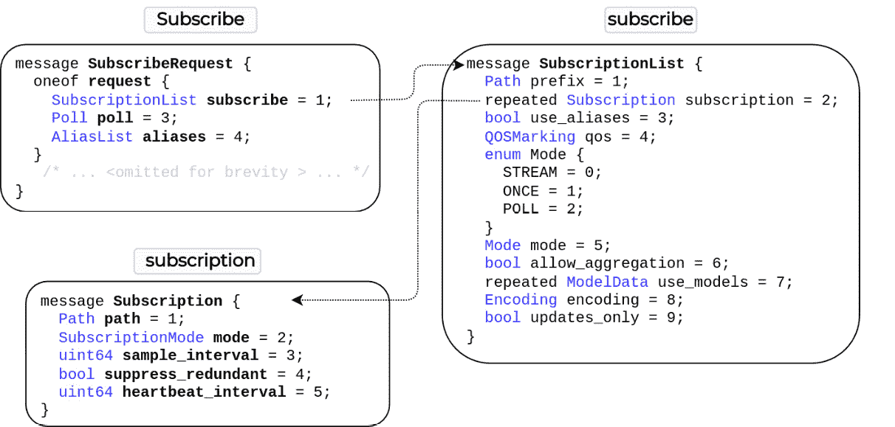
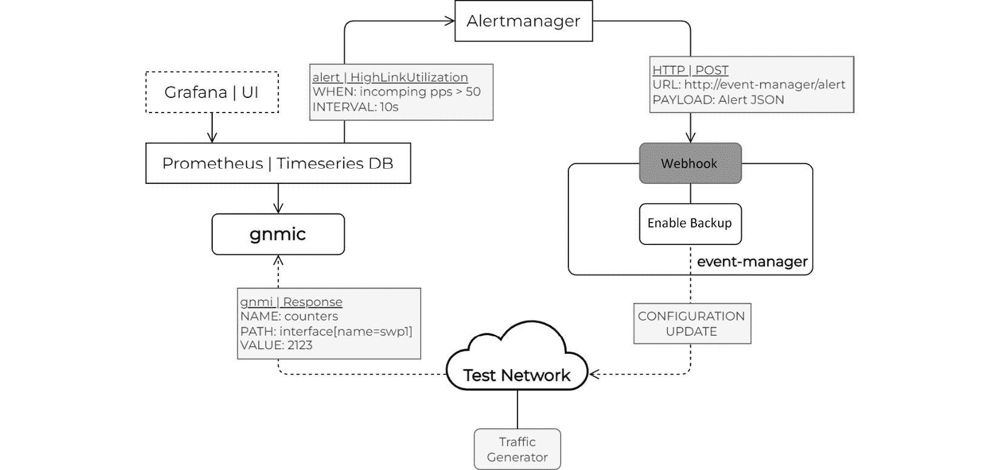
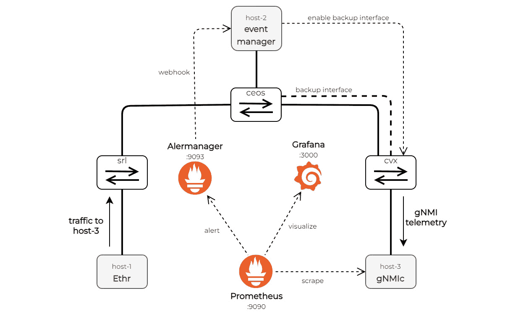
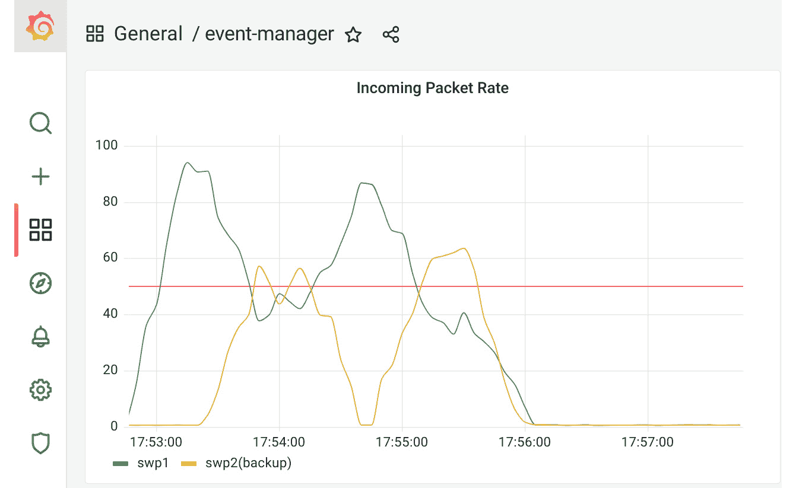

# 第九章：OpenConfig

OpenConfig 是由一群网络运营商组成的团体（参见*进一步阅读*部分），他们有一个共同的目标，即简化我们管理和操作网络的方式。他们欢迎任何运营生产网络的成员加入，并且最近开始接受来自多个厂商的贡献，当这些厂商实现相同的功能（他们希望将其包含在 YANG 模型中）时。

他们的初始重点是创建一套基于现场常见操作用例和要求的厂商中立 YANG 数据模型。这后来扩展到包括用于在网络上配置、流式遥测、执行操作命令和操作转发条目的厂商中立**远程过程调用**（**RPCs**）（参见*进一步阅读*）。在本章中，我们将主要关注 OpenConfig RPCs，因为我们已经在*第八章*，*网络 API*中介绍了 YANG 数据模型。

与其他类似倡议相比，OpenConfig 的一个独特之处在于，它们不仅公开工作在规范上，还编写了实现这些规范的开放源代码，帮助您与符合 OpenConfig 的设备交互。他们大多数项目都是用 Go 编写的，包括但不限于 ygot、gNxI 工具、gNMI 收集器、gNMI CLI 实用程序、gNMI 测试框架、gRPC 隧道和 IS-IS LSDB 解析（参见*进一步阅读*）。我们鼓励您探索这些项目，特别是我们在这本书中没有涵盖的项目，因为它们针对广泛的网络相关应用。

在撰写本文时，OpenConfig 包括四个 gRPC 服务：

+   **gRPC 网络管理接口**（**gNMI**）：用于流式遥测和配置管理

+   **gRPC 网络操作接口**（**gNOI**）：用于在网络上执行操作命令

+   **gRPC 路由信息库接口**（**gRIBI**）：允许外部客户端在网络元素上注入路由条目

+   **gRPC 网络安全接口**（**gNSI**）：用于保护访问符合网络设备的底层基础设施服务

在以下章节中，我们将检查以下常见的操作任务：

+   设备配置，使用 gNMI 的`Set` RPC，在实验室拓扑结构中的两个节点之间正确标记主备接口

+   使用`Subscribe` RPC 进行流式遥测，其中 Go 程序对 gNMI 遥测流做出反应，以对网络进行更改

+   网络操作，使用 gNOI 的`Traceroute` RPC 的`traceroute`示例，以检查网络中的所有转发路径是否按预期工作

# 技术要求

您可以在本书的 GitHub 存储库中找到本章的代码示例（参见*进一步阅读*），在`ch09`文件夹中。

重要提示

我们建议您在虚拟实验室环境中执行本章中的 Go 程序。请参阅附录以获取先决条件和构建完全配置的网络拓扑结构的说明。

在下一节中，我们将讨论的第一个示例是使用 Go 来配置网络设备 gNMI。

# 设备配置

在*第六章* *配置管理*中，我们讨论了在网络上应用所需的配置状态。网络工程师通常需要登录到网络设备以提供新服务、建立新连接或删除过时的配置。我们在同一章节中介绍了配置网络设备（如 SSH 或 HTTP）的不同传输选项，并在*第八章* *网络 API*中添加了 gRPC 作为另一个选项。

我们简要介绍了使用数据建模语言（如 YANG）来建模网络设备配置，这样我们就可以从使用半结构化供应商特定 CLI 语法配置网络，转变为与网络交换结构化数据以改变其配置状态的模式。

OpenConfig 定义了一个专门用于配置管理的 gRPC 服务，称为 gNMI。它的目标是提供一个任何供应商都可以实现的通用 gRPC protobuf 定义，同时保留他们现有的专有 gRPC 服务。

gNMI 的 protobuf 定义如下：

```go
service gNMI {
   rpc Capabilities(CapabilityRequest) returns (CapabilityResponse);
   rpc Get(GetRequest) returns (GetResponse);
   rpc Set(SetRequest) returns (SetResponse);
   rpc Subscribe(stream SubscribeRequest) returns (stream SubscribeResponse);
}
```

gNMI 特别通过`Set` RPC 提供配置管理功能，您可以使用它来对目标节点进行更改。gNMI 规范（见*进一步阅读*）对所有可用的 gNMI RPCs 有详细的文档。在本节中，我们将重点关注`Set`。

## Set RPC

`Set` RPC 允许您更改目标网络设备的状态。您通过发送一个编码了您想要进行的所有更改的`SetRequest`消息来实现这一点。

您可以使用`SetRequest`消息的专用字段在目标设备的单个事务中更新、替换或删除数据树中的值。这意味着除非目标可以应用所有指定的更改，否则它必须全部回滚并返回到其先前状态。以下 protobuf 定义显示了您在`SetRequest`消息中可用的选项：

```go
message SetRequest {
   Path prefix = 1;
   repeated Path delete = 2;
   repeated Update replace = 3;
   repeated Update update = 4;
   repeated gnmi_ext.Extension extension = 5;
}
```

在`SetRequest`中称为`Path`的字段编码了一个 YANG 数据树路径。值得注意的是，gNMI 不仅限于使用 OpenConfig YANG 模型；它同样适用于供应商定义的 YANG 模型。gNMI 将数据树路径描述为一系列`PathElem`（路径元素）。每一个都是具有名称的数据树节点，并且可能与之关联一个或多个属性（键）：

```go
message Path {
  string origin = 2;
  repeated PathElem elem = 3;
  string target = 4;
}
message PathElem {
  string name = 1;
  map<string, string> key = 2;
}
```

例如，`/interfaces/interface[name=Ethernet2]/config/description` 路径允许您在目标设备上的 `Ethernet2` 接口上设置描述。在这种情况下，唯一具有属性的节点是 `interface`，它需要一个 `name`。要配置该接口中本地 VLAN 的 IPv4 地址，您可以使用如下路径：`/interfaces/interface[name=Ethernet2]/subinterfaces/subinterface[index=0]/ipv4/addresses/address[ip=192.0.2.2]`。在这种情况下，您需要添加 `subinterface` 索引，因为接口可能在不同子接口上有 IP 地址。

一旦您已识别数据路径，您需要构建包含您要在目标设备上设置的新值的内容，这是一个 YANG 模式的数据实例。您只需要 `replace` 和 `update`。对于 `delete`，路径就足够告诉目标设备从配置中删除什么。

用于发送 `replace` 或 `update` 的值的 `Update` 消息包含一个 `Path` 和 `TypedValue` 对。后者允许您以不同的格式编码内容：

```go
message Update {
  Path path = 1;
  TypedValue val = 3;
  uint32 duplicates = 4;
}
message TypedValue {
  oneof value {
    string string_val = 1;
    int64 int_val = 2;
    uint64 uint_val = 3;
    bool bool_val = 4;
    bytes bytes_val = 5;
    double double_val = 14;
    ScalarArray leaflist_val = 8;
    google.protobuf.Any any_val = 9;
    bytes json_val = 10;
    bytes json_ietf_val = 11;
    string ascii_val = 12;
    bytes proto_bytes = 13;
  }
}
```

值可以是字符串，例如接口描述 `PRIMARY: TO -> CVX:swp1`，或者 JSON 值，用于描述接口的 IPv4 地址，例如 `{"config":{"ip":"192.0.2.2","prefix-length":31}}`。

## 使用 gNMI 配置网络接口

本章的虚拟实验室拓扑，您可以通过从本书 GitHub 仓库的根目录运行 `make lab-full` 来启动它，其中 `ceos` 和 `cvx` 之间有两个连接。它们已经配置了 IPv4 地址，但没有描述来让您识别这些接口的角色，即它们是主链路还是备份链路：


图 9.1 – ceos 和 cvx 之间的双链路

在下一个示例中，我们通过 gNMI 在 `ceos` 端的这些接口上添加描述。为此，我们使用 gNMIc 包（`karimra/gnmic/api`）。我们选择 gNMIc 而不是官方的 gNMI 包（`openconfig/gnmi`），因为它对开发者更友好，并且是更高层次的。它允许我们方便地将 gNMI 路径编码为字符串，而不是 Go 数据结构，正如 gNMIc 文档（见 *进一步阅读*）所述。您可以在本书 GitHub 仓库的 `ch09/gnmi` 目录中找到此示例的代码（见 *进一步阅读*）。

gNMIc 包含一个 `NewTarget` 函数，用于创建新的 gNMI 目标设备。在下面的示例中，我们将此函数封装在 `createTarget` 方法中：

```go
func (r Router) createTarget() (*target.Target, error) {
      return api.NewTarget(
           api.Name("gnmi"),
           api.Address(r.Hostname+":"+r.Port),
           api.Username(r.Username),
           api.Password(r.Password),
           api.Insecure(r.Insecure),
      )
}
```

代码的第一步是从 YAML 文件（`input.yml`）中读取连接详情以创建此目标设备：

```go
# input.yml
- hostname: clab-netgo-ceos
  port: 6030
  insecure: true
  username: admin
  password: admin
```

我们将所有目标设备存储在`Routers`数据结构中。在我们的案例中，我们只有一个设备（`clab-netgo-ceos`），但连接细节是一个列表，所以如果我们想的话，可以添加更多设备。现在，有了目标数据，我们使用`CreateGNMIClient`方法设置到目标设备（`clab-netgo-ceos:6030`）的底层 gRPC 连接：

```go
func main() {
  /* ... <omitted for brevity > ... */
  for _, router := range inv.Routers {
    tg, err := router.createTarget()
    // process error

    ctx, cancel := context.WithCancel(
    context.Background())
    defer cancel()

    err = tg.CreateGNMIClient(ctx)
    // process error
    defer tg.Close()
  /* ... <continues next > ... */
}
```

连接建立后，我们现在可以发送`Set`请求。另一个 YAML 文件（`api-ceos.yml`）包含每个请求的参数列表：`prefix`、`encoding`、`path`和`value`。当你想要缩短路径长度时，可以添加`prefix`。在我们的 Go 程序中，我们将这个参数列表保存到`info`切片中：

```go
# api-ceos.yml
- prefix: "/interfaces/interface[name=Ethernet2]"
  encoding: "json_ietf"
  path: '/subinterfaces/subinterface[index=0]/ipv4/addresses/address[ip=192.0.2.2]'
  value: '{"config":{"ip":"192.0.2.2","prefix-length":31}}'
- prefix: ""
  encoding: "json_ietf"
  path: '/interfaces/interface[name=Ethernet2]/config/description'
  value: 'PRIMARY: TO -> CVX:swp1''
## ... <omitted for brevity > ... ##
```

最后一步是遍历`info`切片，使用`NewSetRequest`函数构建一个`Set`请求，并使用`Set`方法将其发送到目标设备：

```go
func main() {
  /* ... <continues from before > ... */
    for _, data := range info {
      setReq, err := api.NewSetRequest(
              api.Update(
                    api.Path(data.Prefix+data.Path),
                    api.Value(data.Value, data.Encoding)),
      )
      // process error

      configResp, err := tg.Set(ctx, setReq)
      // process error
      fmt.Println(prototext.Format(configResp))
    }
  }
}
```

在这里，`NewSetRequest`只有一个`Update`消息，但你可以在单个请求中包含多个消息。

运行此示例时，你会得到以下输出：

```go
ch09/gnmi$ go run main.go 
response: {
  path: {
    elem: {
      name: "interfaces"
    }
    elem: {
      name: "interface"
      key: {
        key: "name"
        value: "Ethernet2"
      }
    }
    elem: {
      name: "subinterfaces"
    }
    elem: {
      name: "subinterface"
      key: {
        key: "index"
        value: "0"
      }
    }
    elem: {
      name: "ipv4"
    }
    elem: {
      name: "addresses"
    }
    elem: {
      name: "address"
      key: {
        key: "ip"
        value: "192.0.2.2"
      }
    }
  }
  op: UPDATE
}
timestamp: 1660148355191641746
response: {
  path: {
    elem: {
      name: "interfaces"
    }
    elem: {
      name: "interface"
      key: {
        key: "name"
        value: "Ethernet2"
      }
    }
    elem: {
      name: "config"
    }
    elem: {
      name: "description"
    }
  }
  op: UPDATE
}
timestamp: 1660148355192866023
## ... <omitted for brevity > ... ##
```

你在终端屏幕上看到的是`SetResponse`消息，包含操作的`path`、`response`和`timestamp`值：

```go
message SetResponse {
  Path prefix = 1;
  repeated UpdateResult response = 2;
  int64 timestamp = 4;
  repeated gnmi_ext.Extension extension = 5;
}
```

如果你现在连接到`ceos`设备，你将看到其运行配置中的以下内容：

```go
interface Ethernet2
   description PRIMARY: TO -> CVX:swp1
   no switchport
   ip address 192.0.2.2/31
!
interface Ethernet3
   description BACKUP: TO -> CVX:swp2
   no switchport
   ip address 192.0.2.4/31
!
```

配置网络设备是大多数网络工程师花费大量时间进行的一些重复性任务之一，因此自动化此过程具有很好的投资回报潜力。

OpenConfig 工作组多年的工作，该工作组发布了官方的 gNMI 包（`openconfig/gnmi`），为其他开源包和库（如 gNMIc (`karimra/gnmic`) 和 pyGNMI (`akarneliuk/pygnmi`））的出现设定了路径，围绕这些供应商中立的 gRPC 服务建立社区，以推动我们网络中一致的自动化实践。

在下一节中，我们将介绍另一个增强网络可见性能力的 OpenConfig gRPC 服务。

# 流式遥测

传统上，网络工程师依赖于**简单网络管理协议**（**SNMP**）从网络设备收集状态信息。设备使用**抽象语法表示法一**（**ASN.1**）的二进制格式编码此信息，并将其发送到接收器，通常是收集器或**网络管理系统**（**NMS**）。后者会使用**管理信息库**（**MIBs**）之一来解码接收到的信息并将其存储在本地以供进一步处理。

这是我们几十年来进行网络监控的方式，但这种方法仍有改进的空间：

+   有限数量的供应商中立数据模型意味着即使是基本的东西也需要独特的 MIBs，你可能需要每次进行主要网络操作系统升级时都更新它们。

+   MIBs 使用 ASN.1 子集定义的符号，这不是结构值的最佳方式。它没有列表或键值对的概念。相反，您必须使用索引值和额外的查找表来实现这些。

+   SNMP 使用 UDP 作为其传输协议，以避免给收集器带来额外负担。这意味着您可能会完全错过一些事件，在遥测数据流中留下盲点。

+   由于 SNMP 主要依赖于轮询，我们只能看到聚合值，可能会错过重要的状态转换。

+   SNMP 通常不记录值变化的时间戳。收集者只能根据收集时间推断时间。

gNMI 通过一个专门的`Subscribe` RPC 提供了一种新的网络监控方法。至少，它提供了与 SNMP 相同的性能，但更进一步，使协议更加功能丰富和灵活：

+   最大的改进之一是遥测流。现在，您可以连续接收来自网络设备的操作 YANG 树中的任何值，这使您能够更好地了解所有状态转换及其时间戳。

+   您可以选择只在有变化时接收遥测数据，而不是周期性传输。

+   多亏了底层的 gRPC 传输，gNMI 支持拨入和拨出连接方法，并使用可靠的 HTTP/2 协议传递消息。

+   OpenConfig 定义了描述网络设备操作状态的供应商中立 YANG 模型，这使得客户端能够以标准管道解析和处理来自不同供应商的接收数据。

重要提示

即使有流式遥测，也不一定为每个计数器增量提供更新。网络设备有本地进程，它们定期轮询内部数据存储以获取最新的指标或统计信息，例如接口数据包计数器，然后将这些信息提供给它们的 gNMI 进程。因此，您接收到的数据的实时性不仅取决于您获取流消息的频率，还取决于内部轮询的频率。尽管如此，您仍然可能会看到最相关的系统事件，例如 BGP 状态转换，否则您可能会错过这些事件。

这些功能只是 gNMI 能力的一部分。gNMI 规范（见*进一步阅读*）可以作为所有 gNMI 协议功能的良好参考。接下来，我们将检查遥测服务的 gNMI protobuf 消息，以帮助您了解它是如何工作的。

## 订阅 RPC

gNMI 定义了一个单独的 RPC 来订阅遥测流。网络设备接收一个或多个`SubscribeRequest`消息，并以一系列`SubscribeResponse`消息进行响应：

```go
service gNMI {
     rpc Subscribe(stream SubscribeRequest) returns (stream SubscribeResponse);
}
```

gNMI 客户端有多种选项来控制他们的遥测订阅。以下图显示了`SubscribeRequest`消息的组成，突出了这些选项之一：



图 9.2 – gNMI 订阅 protobuf 消息

控制遥测订阅的最基本方法是指定 `Path` 和 `SubscriptionMode`：

+   **Path**：引用您想要监控的 YANG 树的部分。您可以订阅任何内容，从整个设备状态到单个叶值。它遵循 gNMI 路径约定（见 *进一步阅读*）。

+   **SubscriptionMode**：确定是否在更改时发送遥测或定期发送：

    ```go
    enum SubscriptionMode {
    ```

    ```go
         TARGET_DEFINED = 0;
    ```

    ```go
         ON_CHANGE      = 1;
    ```

    ```go
         SAMPLE         = 2;
    ```

    ```go
    }
    ```

作为回报，网络设备会向您发送包含以下信息的响应消息流：

+   **TypedValue**：最重要的字段，包含实际的遥测值

+   **Path**：值的完整 gNMI 路径，用于标识唯一的 YANG 叶节点

+   **timestamp**：帮助您按正确顺序安排和处理接收到的数据，或找出值最后一次更改的时间，对于那些不经常更改的值：

    ```go
    message Notification {
    ```

    ```go
         int64 timestamp = 1;
    ```

    ```go
         Path prefix = 2;
    ```

    ```go
         string alias = 3;
    ```

    ```go
         repeated Update update = 4;
    ```

    ```go
         repeated Path delete = 5;
    ```

    ```go
         bool atomic = 6;
    ```

    ```go
    }
    ```

    ```go
    message Update {
    ```

    ```go
         Path path = 1;
    ```

    ```go
         TypedValue val = 3;
    ```

    ```go
         uint32 duplicates = 4;
    ```

    ```go
    }
    ```

我们只是触及了 `Subscribe` RPC 的表面。您可以通过查看 `gnmi.proto` 文件来查看完整的 protobuf 消息集，并阅读 gNMI 规范的遥测部分（见 *进一步阅读*）以更好地了解协议提供的功能和特性。以下是一些您可以了解的功能，我们在这本书中没有涉及：

+   gNMI 允许您轮询或获取遥测值的即时一次性（`ONCE`）快照。

+   一些网络设备可以在单个 `SubscribeResponse` 中发送多个 `Update` 消息。这以降低时间戳准确性为代价，因为所有传输的值只有一个时间戳。

+   如果您不希望看到每个单独的值，您可以允许网络设备聚合这些值。

+   对于不同 YANG 模型定义的值，您可以指定您希望使用的定义。

重要提示

与 OpenConfig YANG 模型一样，具体实现的功能集因供应商而异。

## 使用 gNMI 的流式遥测处理管道

要从符合 gNMI 的网络设备接收或收集数据，您可以使用来自官方 gNMI 仓库的 Go gNMI 客户端实现（见 *进一步阅读*）。另一种选择是 gNMIc（见 *进一步阅读*），它建立在官方 gNMI 客户端之上，并提供了更多功能，例如数据转换和对北向接口的广泛支持。

gNMIc 可以作为网络设备和 **时间序列数据库**（**TSDB**）或消息队列之间的链接，因为它可以将接收到的遥测数据转换为流行的开源项目（如 Prometheus、InfluxDB、NATS 和 Kafka）可以理解的格式。您可以将 gNMIc 作为命令行工具与网络设备交互，或作为守护进程，订阅遥测数据并将其发布到消息队列或数据库。

## 事件管理器示例程序

让我们通过一个原始事件管理器应用程序的实现来检查遥测处理管道的一个示例。该程序的目标是通过临时启用备份接口来重新分配传入流量，以应对增加的包速率。以下图显示了遥测处理管道的高级架构，并包括以下主要组件：

+   作为守护进程运行的 gNMIC 进程，收集和处理网络遥测数据

+   存储收集的遥测数据的 TSDB（Prometheus）

+   AlertManager（见 *进一步阅读*）处理从 Prometheus 收到的警报并触发外部事件

+   一个实现事件管理器业务逻辑的 Go 程序：



图 9.3 – 事件管理器应用程序

你可以从本书 GitHub 仓库的根目录使用 `make gnmic-start` 启动这些组件（见 *进一步阅读*）。此命令启动 gNMIc 守护进程，并使用 `docker-compose` 启动 Prometheus、Grafana 和 AlertManager。这些应用程序现在与我们的测试实验室拓扑一起运行，并通过标准网络接口与之交互：



图 9.4 – 事件管理器拓扑

我们使用本书 GitHub 仓库（见 *进一步阅读*）中 `topo`-`full/workdir/` 目录的一系列文件配置了这些应用程序（见 *进一步阅读*）。这些文件被挂载到各自的容器中，正如我们在 Containerlab 的配置文件（`topo.yml` – 见 *进一步阅读*）或 Docker Compose 的配置文件（`docker-compose.yml` – 见 *进一步阅读*）中定义的那样。以下是这些应用程序在我们设置中扮演的角色简要描述：

+   gNMIc 守护进程在测试拓扑的 `Host-3` 上运行。它订阅来自 `cvx` 设备的遥测数据，并将其作为 Prometheus 风格的指标暴露出来。我们在 `gnmic.yaml` 文件中管理这些设置，该文件看起来像这样：

    ```go
    targets:
    ```

    ```go
     "clab-netgo-cvx:9339":
    ```

    ```go
        username: cumulus
    ```

    ```go
        password: cumulus
    ```

    ```go
    subscriptions:
    ```

    ```go
      counters:
    ```

    ```go
        target: netq
    ```

    ```go
        paths:
    ```

    ```go
          - /interfaces
    ```

    ```go
        updates-only: true
    ```

    ```go
    outputs:
    ```

    ```go
      prom-output:
    ```

    ```go
        type: prometheus
    ```

    ```go
        listen: ":9313"
    ```

+   你可以在 `prometheus.yml` 文件中找到 Prometheus 配置值。我们将其配置为每 2 秒抓取 gNMIc 端点，并将收集的数据存储在其 TSDB 中：

    ```go
    scrape_configs:
    ```

    ```go
      - job_name: 'event-trigger'
    ```

    ```go
        scrape_interval: 2s
    ```

    ```go
        static_configs:
    ```

    ```go
          - targets: ['clab-netgo-host-3:9313']
    ```

+   同一个配置文件还包括对警报定义文件（称为 `alert.rules`）和 AlertManager 连接细节的引用：

    ```go
    rule_files:
    ```

    ```go
      - 'alert.rules'
    ```

    ```go
    alerting:
    ```

    ```go
      alertmanagers:
    ```

    ```go
      - scheme: http
    ```

    ```go
        static_configs:
    ```

    ```go
        - targets:
    ```

    ```go
          - "alertmanager:9093"
    ```

+   在 `alert.rules` 文件中，我们定义了一个名为 `HighLinkUtilization` 的单个警报。每 10 秒，Prometheus 检查传入的包速率是否超过了每 30 秒间隔 50 个包的预定义阈值，如果是，则触发警报并将其发送到 AlertManager：

    ```go
    groups:
    ```

    ```go
    - name: thebook
    ```

    ```go
      interval: 10s
    ```

    ```go
      rules:
    ```

    ```go
      - alert: HighLinkUtilization
    ```

    ```go
        expr: rate(interfaces_interface_state_counters_in_pkts[30s]) > 50
    ```

    ```go
        for: 0m
    ```

    ```go
        labels:
    ```

    ```go
          severity: warning
    ```

    ```go
        annotations:
    ```

    ```go
          summary: Transit link {{ $labels.interface_name }} is under high load
    ```

    ```go
          description: "Transit link {{ $labels.interface_name }} is under high load LABELS = {{ $labels }}"
    ```

    ```go
          value: '{{ $value }}'
    ```

+   AlertManager 有自己的配置文件，称为 `alertmanager.yml`，它控制如何从 Prometheus 聚合和路由传入的警报。在我们的案例中，我们只有一个警报类型，所以我们只需要一个路由。我们将默认的聚合计时器降低以实现更快的反应时间，并指定发送这些警报的 webhook URL：

    ```go
    route:
    ```

    ```go
      receiver: 'event-manager'
    ```

    ```go
      group_wait: 5s
    ```

    ```go
      group_interval: 10s
    ```

    ```go
    receivers:
    ```

    ```go
      - name: 'event-manager'
    ```

    ```go
        webhook_configs:
    ```

    ```go
        - url: http://clab-netgo-host-2:10000/alert
    ```

+   事件管理程序解析警报并切换备份接口以重新平衡进入`cvx`设备的流量。其行为相当静态，因此我们不需要为其配置配置文件。

事件管理程序实现了一个标准的网络服务器，它监听传入的请求并将它们调度到处理函数。在这里，我们解码接收到的 Prometheus 警报并根据其状态调用`toggleBackup`函数：

```go
func alertHandler(w http.ResponseWriter, req *http.Request) {
  log.Println("Incoming alert")
  var alerts Alerts
  err := json.NewDecoder(req.Body).Decode(&alerts)
  // process error

  for _, alert := range alerts.Alerts {
    if alert.Status == "firing" {
      if err := toggleBackup(alert.Labels.InterfaceName, "permit"); err != nil {
        w.WriteHeader(http.StatusInternalServerError)
        return
      }
      continue
    }

    if err := toggleBackup(alert.Labels.InterfaceName, "deny"); err != nil {
      w.WriteHeader(http.StatusInternalServerError)
      return
    }
  }
  w.WriteHeader(http.StatusOK)
}
```

我们在`cvx`和`ceos`设备之间有两个*上行链路*，我们默认只使用其中一个。备份上行链路执行 BGP ASN 预置位，并且只有当我们宣布更具体或分解的前缀时才接收流量。`toggleBackup`函数通过在 IP 前缀列表（在`cvx`上）切换允许/拒绝语句来实现这一点，从而启用或禁用 BGP 分解行为：

```go
var (
  backupRules = map[string][]int{
    "swp1": {10, 20},
  }
)

func toggleBackup(intf string, action string) error {
  log.Printf("%s needs to %s backup prefixes",
              intf, action)
  ruleIDs, ok := backupRules[intf]
  // process error

  var pl PrefixList
  pl.Rules = make(map[string]Rule)
  for _, ruleID := range ruleIDs {
    pl.Rules[strconv.Itoa(ruleID)] = Rule{
      Action: action,
    }
  }

  var payload nvue
  payload.Router.Policy.PrefixLists = map[string]PrefixList{
    plName: pl,
  }

  b, err := json.Marshal(payload)
  // process error

  return sendBytes(b)
}
```

最终的`sendBytes`函数使用我们在*第六章*“配置管理”中讨论的三阶段提交过程应用构建的配置。

## 可视化数据

您可以使用`admin`作为用户名/密码连接到运行在`:3000`的本地 Grafana 实例，以测试完整的由遥测驱动的管道。这个 Grafana 实例预先集成了 Prometheus 作为其数据源，并包含一个预构建的`event-manager`仪表板，该仪表板绘制了进入`cvx`链接到`ceos`的入包速率。

从本书 GitHub 仓库的根目录运行`make traffic-start`（见*进一步阅读*）以在实验室拓扑中生成流量。所有流量最初都应通过`cvx`和`ceos`之间的主连接（`swp1`）流动。

接下来，我们想要启动事件管理器应用程序，以便我们可以在两个连接之间进行流量负载均衡。为此，请在`host-2`容器内运行事件管理器 Go 应用程序。这相当于以下代码片段中我们执行的命令：

```go
$ sudo ip netns exec clab-netgo-host-2 /usr/local/go/bin/go run ch09/event-manager/main.go
AlertManager event-triggered webhook
2022/08/01 21:51:13 Starting web server at 0.0.0.0:10000
```

打开一个新的终端窗口或标签页，再次运行`make traffic-start`，但使用`DURATION`变量增加流量生成周期，从默认的`60s`。例如，以下命令将生成 2 分钟的流量：

```go
$ DURATION=2m make traffic-start
```

这可以帮助您看到流量重新平衡的长期影响。日志应显示流量速率已触发警报，并且应用程序已实施纠正措施：

```go
$ sudo ip netns exec clab-netgo-host-2 /usr/local/go/bin/go run ch09/event-manager/main.go
AlertManager event-triggered webhook
2022/08/01 21:51:13 Starting web server at 0.0.0.0:10000
ch09/event-manager/main.go
2022/08/01 21:53:10 Incoming alert
2022/08/01 21:53:10 swp1 needs to permit backup prefixes
2022/08/01 21:53:10 Created revisionID: changeset/cumulus/2022-08-01_21.53.10_ASP0
{
  "state": "apply",
  "transition": {
    "issue": {},
    "progress": ""
  }
}
2022/08/01 21:54:00 Incoming alert
2022/08/01 21:54:00 swp1 needs to deny backup prefixes
2022/08/01 21:54:00 Created revisionID: changeset/cumulus/2022-08-01_21.54.00_ASP2
{
  "state": "apply",
  "transition": {
    "issue": {},
    "progress": ""
  }
}
2022/08/01 21:54:00 swp2 needs to permit backup prefixes
2022/08/01 21:54:00 Could not find a backup prefix for swp2
2022/08/01 21:54:20 Incoming alert
2022/08/01 21:54:20 swp2 needs to deny backup prefixes
2022/08/01 21:54:20 Could not find a backup prefix for swp2
2022/08/01 21:54:30 Incoming alert
2022/08/01 21:54:30 swp1 needs to permit backup prefixes
2022/08/01 21:54:30 Created revisionID: changeset/cumulus/2022-08-01_21.54.30_ASP4
{
  "state": "apply",
  "transition": {
    "issue": {},
    "progress": ""
  }
}
2022/08/01 21:55:20 Incoming alert
2022/08/01 21:55:20 swp1 needs to deny backup prefixes
2022/08/01 21:55:20 Created revisionID: changeset/cumulus/2022-08-01_21.55.20_ASP6
{
  "state": "apply",
  "transition": {
    "issue": {},
    "progress": ""
  }
}
```

我们进行的所有三个测试都应该得到一个看起来相似的图表：



图 9.5 – 事件管理器可视化

流式遥测是一种强大的功能，您可以将其适应各种商业用例。然而，这些用例中的大多数都是特定于操作网络环境的，因此很难提出一套适用于每个网络的*杀手级应用*。因此，了解如何在代码中实现所需业务逻辑非常重要，这正是我们在本章中试图向您展示的。

在下一节中，我们将介绍另一个可以用于自动化操作任务的 OpenConfig gRPC 服务。

# 网络操作

在前面的章节中，我们探讨了 OpenConfig 管理接口如何处理两个常见的网络自动化用例：配置管理和操作状态收集。这两个任务本身就可以让您在网络自动化之旅中走得很远，但还有一些常见的操作任务不属于这两个类别。

要自动化网络操作的各个方面，我们需要执行诸如网络设备重启、软件生命周期管理和计数器及邻接重置等任务。通常，您会将这些活动作为交互式 CLI 工作流程的一部分来执行，其中包含假设有人工操作员参与过程的提示和警告。这使得这些任务的自动化成为一项重大任务，因为我们不得不求助于屏幕抓取，这增加了这些任务已经很高的风险。

为了应对这些挑战，OpenConfig 提出了一种新的 gRPC API，旨在抽象出交互式命令，并以标准、供应商中立的方式公开这些网络操作能力。

### gNOI

gNOI 定义了一系列 gRPC 服务，这些服务涵盖了广泛的网络操作用例。每个服务代表一组操作和一系列动作，下表包含了一些示例，以帮助您了解 gNOI 试图解决的问题：

| **服务** | **描述** | **RPC 示例** |
| --- | --- | --- |
| OS | NOS 包管理 | 安装、激活和验证 |
| 文件 | 文件操作 | 获取、传输、放置和删除 |
| L2 | L2 协议操作 | 清除邻居发现和清除 LLDP 接口 |
| 证书 | 证书管理 | 轮换、安装、生成 CSR 和撤销证书 |
| 系统 | 系统操作 | Ping、Traceroute、重启和时间 |

表 9.1 – gNOI 用例示例

一些 RPC 是一次性的，有即时响应，一些同步响应直到完成或取消，还有一些是异步工作的。

gNOI GitHub 仓库（见*进一步阅读*）protobuf 文件包含每个服务的最新动作列表。在撰写本文时，这是`system.proto`文件的顶级定义（见*进一步阅读*）：

```go
service System {
     rpc Ping(PingRequest) returns (stream PingResponse) {}
     rpc Traceroute(TracerouteRequest) returns (stream TracerouteResponse) {}
     rpc Time(TimeRequest) returns (TimeResponse) {}
     rpc SetPackage(stream SetPackageRequest) returns (SetPackageResponse) {}
     rpc SwitchControlProcessor(SwitchControlProcessorRequest)
       returns (SwitchControlProcessorResponse) {}
     rpc Reboot(RebootRequest) returns (RebootResponse) {}
     rpc RebootStatus(RebootStatusRequest) returns (RebootStatusResponse) {}
     rpc CancelReboot(CancelRebootRequest) returns (CancelRebootResponse) {}
     rpc KillProcess(KillProcessRequest) returns (KillProcessResponse) {}
}
```

本书不涵盖所有 gNOI RPC。相反，我们只关注其中一个，并包括围绕它构建的一个示例程序。

## Traceroute RPC

大多数，如果不是所有，网络工程师都熟悉`traceroute`命令。这是探索一对网络端点之间转发路径的常用方法。当您从网络设备的交互式 shell 中运行`traceroute`时，终端会在您的屏幕上打印结果。在 gNOI 中，`traceroute`是通过带有负载中的`TracerouteRequest`消息的 RPC 请求执行的操作，结果是`TracerouteResponse`消息的流（一个或多个）：

```go
service System {
     rpc Traceroute(TracerouteRequest) returns (stream TracerouteResponse) {}
```

与`traceroute`命令行参数和标志一样，请求消息允许您指定选项，例如源地址、最大跳数以及是否执行反向 DNS 查找：

```go
message TracerouteRequest {
     string source = 1;      // Source addr to ping from.
     String destination = 2; // Destination addr to ping.
     Uint32 initial_ttl = 3; // Initial TTL. (default=1)
     int32 max_ttl = 4;      // Maximum number of hops. 
     Int64 wait = 5;         // Response wait-time (ns).
     Bool do_not_fragment = 6;  
     bool do_not_resolve = 7;
     /* ... <omitted for brevity > ... */
}
```

每个响应消息包括单个测量周期的结果，包括跳数、往返时间和从探测回复中提取的响应地址：

```go
message TracerouteResponse {
     /* ... <omitted for brevity > ... */
     int32 hop = 5;          // Hop number. required.
     string address = 6;     // Address of responding hop. 
     string name = 7;        // Name of responding hop.
     int64 rtt = 8;          // Round trip time in nanoseconds.
     /* ... <omitted for brevity > ... */
}
```

现在，让我们看看如何使用 Go 语言使用 gNOI 接口的示例。

## 路径验证应用程序

在本章的流式遥测部分，我们探讨了实现一个事件管理应用程序，该应用程序可以根据通过主接口的流量是否超过预定义阈值来启用或禁用备份链路。我们使用 Grafana 绘制了两个接口的流量速率，以确认应用程序按预期工作。

在涉及复杂工作流的实际自动化用例中，依赖于视觉线索并不总是正确的做法。理想情况下，我们需要一种程序化的方式来验证备份链路是否真正工作。我们在下一个代码示例中使用 gNOI `Traceroute` RPC 来检查这一点。目标是探索不同的网络路径，并确认我们正在通过备份接口转发一些流量流。您可以在本书 GitHub 仓库的`ch09/gnoi-trace`目录中找到本节的代码示例（见*进一步阅读*）。

我们首先设置一个与`ceos`虚拟网络设备的 gRPC 会话，并为 gNOI `System`服务创建一个新的 API 客户端：

```go
var target = "clab-netgo-ceos:6030"
import (
     "google.golang.org/grpc"
     "github.com/openconfig/gnoi/system"
)
func main() {
     conn, err := grpc.Dial(target, grpc.WithInsecure())
     // process error
     defer conn.Close()
     sysSvc := system.NewSystemClient(conn)
     ctx, cancel := context.WithCancel(context.Background())
     defer cancel()
  /* ... <continues next > ... */
}
```

接下来，我们创建一个`sync.WaitGroup`来协调运行到不同目的地的 traceroute 的所有 goroutine。这些 goroutine 通过`traceCh`通道将收集到的结果发送回`main` goroutine。对于编码为`string`的每个 traceroute 目的地，traceroute 结果包括每个网络跳的响应 IP 地址列表。

为了使以下步骤中比较 IP 地址列表更容易，我们使用`deckarep/golang-set`（`mapset`）第三方包将它们存储为集合，因为 Go 语言在标准库中没有原生实现集合。我们将跳数隐式地编码为`[]mapset.Set`数组中的索引：

```go
var destinations = []string{
           "203.0.113.251",
           "203.0.113.252",
           "203.0.113.253",
}
func main() {
     /* ... <continues from before > ... */
     var wg sync.WaitGroup
     wg.Add(len(destinations))
     traceCh := make(chan map[string][]mapset.Set,
                            len(destinations))
  /* ... <continues next > ... */
}
```

每个 goroutine 运行一个 traceroute，我们只指定`TracerouteRequest`消息的源和目的字段，其余选项保留为默认值。当我们收到响应时，我们将结果存储在`route`切片中。当 traceroute 停止时，即当错误类型为`io.EOF`时，我们通过`traceCh`通道发送累积的响应并调用`wg.Done`：

```go
var source = "203.0.113.3"

func main() {
  /* ... <continues from before > ... */
  for _, dest := range destinations {
    go func(d string) {
      defer wg.Done()
      retryMax := 3
      retryCount := 0

    START:
      response, err := sysSvc.Traceroute(ctx,
                        &system.TracerouteRequest{
                                 Destination: d,
                                 Source: source,
      })
      // process error

      var route []mapset.Set
      for {
        resp, err := response.Recv()
        if errors.Is(err, io.EOF) {
        // end of stream, traceroute completed
          break
        }
        // process error

        // timed out, restarting the traceroute
        if int(resp.Hop) > len(route)+1 {
          if retryCount > retryMax-1 {
            goto FINISH
          }
          retryCount += 1
          goto START
        }

        // first response
        if len(route) < int(resp.Hop) {
          route = append(route, mapset.NewSet())
        }

        // subsequent responses
          route[resp.Hop-1].Add(resp.Address)
        }

    FINISH:
      traceCh <- map[string][]mapset.Set{
               d: route,
             }
    }(dest)
  }
  wg.Wait()
  close(traceCh)
  /* ... <continues next > ... */
}
```

由于网络设备具有默认的控制平面安全设置，这些设置可能会限制它们处理代码中的每个`goto`语句以重试 traceroute，以防我们对于任何一跳没有获取到任何信息。`START`和`FINISH`是我们用来实现这种重试逻辑的两个标签，后者在我们尝试多次后没有获取到结果时作为回退情况。

一旦我们完成了所有 traceroute 请求，我们就可以处理和分析结果。为了简化代码逻辑，我们首先将数据转换为存储一个跳数与每个 traceroute 目标的一组 IP 地址之间的映射：

```go
func main() {
  /* ... <continues from before > ... */
  routes := make(map[int]map[string]mapset.Set)

  for trace := range traceCh {
    for dest, paths := range trace {
      for hop, path := range paths {
        if _, ok := routes[hop]; !ok {
          routes[hop] = make(map[string]mapset.Set)
        }
        routes[hop][dest] = path
      }
    }
  }
  /* ... <continues next > ... */
}
```

最后，我们可以遍历每个跳数并检查不同 traceroute 目标的一组响应 IP 地址之间是否存在差异，这意味着数据包走过了不同的路径。如果我们检测到这种情况，我们将在屏幕上打印出来：

```go
func main() {
  /* ... <continues from before > ... */
  for hop, route := range routes {
    if hop == len(routes)-1 {
      continue
    }
    found := make(map[string]string)
    for myDest, myPaths := range route {
      for otherDest, otherPaths := range route {
        if myDest == otherDest {
          continue
        }
        diff := myPaths.Difference(otherPaths)
        if diff.Cardinality() == 0 {
          continue
        }

        v, ok := found[myDest]
        if ok && v == otherDest {
          continue
        }

        log.Printf("Found different paths at hop %d", hop)
        log.Printf("Destination %s: %+v", myDest, myPaths)
        log.Printf(
                "Destination %s: %+v",
                        otherDest,
                        otherPaths,
                        )
        found[otherDest] = myDest
      }
    }
  }
  log.Println("Check complete")
}
```

您可以从`ch09/gnoi-trace`文件夹运行此程序。请确保`lab-full`首先启动并运行。您应该看到以下输出：

```go
ch09/gnoi-trace$ go run main.go
2022/06/26 16:51:10 Checking if routes have different paths
2022/06/26 16:51:16 Missed at least one hop in 203.0.113.251
2022/06/26 16:51:16 retrying 203.0.113.251
2022/06/26 16:51:17 Check complete
```

使用`make traffic-start`生成流量，然后再次运行此程序。在另一个标签页中，同时从`clab-netgo-host-2`主机运行事件管理器应用程序以激活备份链路：

```go
$ DURATION=2m make traffic-start
docker exec -d clab-netgo-cvx systemctl restart hsflowd
docker exec -d clab-netgo-host-3 ./ethr -s
docker exec -d clab-netgo-host-1 ./ethr -c 203.0.113.253 -b 900K -d 2m -p udp -l 1KB
docker exec -d clab-netgo-host-1 ./ethr -c 203.0.113.252 -b 600K -d 2m -p udp -l 1KB
docker exec -d clab-netgo-host-1 ./ethr -c 203.0.113.251 -b 400K -d 2m -p udp -l 1KB
$ sudo ip netns exec clab-netgo-host-2 /usr/local/go/bin/go run ch09/event-manager/main.go
AlertManager event-triggered webhook
2022/09/14 21:02:57 Starting web server at 0.0.0.0:10000
2022/09/14 21:02:58 Incoming alert
2022/09/14 21:02:58 swp1 needs to permit backup prefixes
2022/09/14 21:02:58 Created revisionID: changeset/cumulus/2022-09-14_21.02.58_S4SQ
{
  "state": "apply",
  "transition": {
    "issue": {},
    "progress": ""
  }
}
2022/09/14 21:03:40 Incoming alert
2022/09/14 21:03:40 swp1 needs to deny backup prefixes
2022/09/14 21:03:40 Created revisionID: changeset/cumulus/2022-09-14_21.03.40_S4SS
{
  "state": "apply",
  "transition": {
    "issue": {},
    "progress": ""
  }
}
2022/09/14 21:03:40 swp2 needs to permit backup prefixes
2022/09/14 21:03:40 Could not find a backup prefix for swp2
2022/09/14 21:04:10 Incoming alert
2022/09/14 21:04:10 swp1 needs to permit backup prefixes
2022/09/14 21:04:10 Created revisionID: changeset/cumulus/2022-09-14_21.04.10_S4SV
{
  "state": "apply",
  "transition": {
    "issue": {},
    "progress": ""
  }
}
2022/09/14 21:04:10 swp2 needs to deny backup prefixes
2022/09/14 21:04:10 Could not find a backup prefix for swp2
```

程序的输出将如下所示：

```go
ch09/gnoi-trace$ go run main.go
2022/09/14 21:03:29 Checking if routes have different paths
2022/09/14 21:03:34 Missed at least one hop in 203.0.113.253
2022/09/14 21:03:34 retrying 203.0.113.253
2022/09/14 21:03:34 Found different paths at hop 0
2022/09/14 21:03:34 Destination 203.0.113.252: Set{192.0.2.5}
2022/09/14 21:03:34 Destination 203.0.113.253: Set{192.0.2.3}
2022/09/14 21:03:34 Found different paths at hop 0
2022/09/14 21:03:34 Destination 203.0.113.251: Set{192.0.2.5}
2022/09/14 21:03:34 Destination 203.0.113.253: Set{192.0.2.3}
2022/09/14 21:03:34 Found different paths at hop 0
2022/09/14 21:03:34 Destination 203.0.113.253: Set{192.0.2.3}
2022/09/14 21:03:34 Destination 203.0.113.252: Set{192.0.2.5}
2022/09/14 21:03:34 Check complete
```

最后的输出显示，`203.0.113.252/32`和`203.0.113.251/32`遵循的路径与`203.0.113.253/32`遵循的路径不同（主链路）。这是因为事件管理器将`.252`和`.251`从主要的`203.0.113.250/30`前缀中分离出来。现在，我们知道备份链路正在按预期工作，因为它正在为这两个 IP 地址传输流量。

从历史上看，网络供应商没有动力创建供应商中立的 API 和数据模型，因为这不允许他们与竞争对手区分开来。虽然像互联网工程任务组（IETF）这样的标准机构为网络行业制定标准，但他们不能总是影响供应商实际实施的内容。此外，一些供应商可能仍然认为技术锁定是一种有效的保持现有客户群的方法。

与此相反，网络运营商的 OpenConfig 社区更有能力影响网络供应商采用供应商独立的数据模型和 API。OpenConfig 的采用率在模型和功能覆盖方面仍然相对较低，但是，只要 OC 参与者继续推动更多，覆盖范围将会增加，这将反过来推动更广泛的网络社区采用。

即使在今天，OpenConfig 也提供了一种供应商中立的网络任务执行方式，包括配置管理、监控和操作。在本章中，我们展示了两个最流行的接口，gNMI 和 gNOI，忽略了较少使用的 gRIBI，它超出了本书的范围。我们希望本章提供了足够的工具和工作流程示例，您可以使用 Go 来消费和与 OpenConfig 兼容的设备交互。

# 摘要

在本章中，通过介绍流式遥测，我们开始探索网络监控的世界，这对于企业来说是一项关键任务。观察网络整体状态以及收集和处理数据平面信息的能力，对于确定网络的健康状况都至关重要。在下一章中，我们将探讨一些具体的网络监控任务和用例，并学习 Go 语言如何帮助我们自动化这些任务。

# 进一步阅读

+   网络运营商：[`www.openconfig.net/about/participants/`](https://www.openconfig.net/about/participants/)

+   操作转发条目：[`github.com/openconfig/gribi/blob/master/doc/motivation.md#grpc-service-for-rib-injection`](https://github.com/openconfig/gribi/blob/master/doc/motivation.md#grpc-service-for-rib-injection)

+   gNMI 收集器：[`github.com/openconfig/gnmi/tree/master/cmd/gnmi_collector`](https://github.com/openconfig/gnmi/tree/master/cmd/gnmi_collector)

+   gNMI CLI 工具：[`github.com/openconfig/gnmi/tree/master/cmd/gnmi_cli`](https://github.com/openconfig/gnmi/tree/master/cmd/gnmi_cli )

+   gNMI 测试框架：[`github.com/openconfig/gnmitest`](https://github.com/openconfig/gnmitest )

+   gRPC 隧道：[`github.com/openconfig/grpctunnel`](https://github.com/openconfig/grpctunnel )

+   IS-IS LSDB 解析：[`github.com/openconfig/lsdbparse`](https://github.com/openconfig/lsdbparse )

+   Ygot：[`github.com/openconfig/ygot`](https://github.com/openconfig/ygot )

+   gNxI 工具：[`github.com/google/gnxi`](https://github.com/google/gnxi )

+   书籍的 GitHub 仓库：[`github.com/PacktPublishing/Network-Automation-with-Go`](https://github.com/PacktPublishing/Network-Automation-with-Go )

+   gNMI 规范：[`github.com/openconfig/reference/blob/master/rpc/gnmi/gnmi-specification.md`](https://github.com/openconfig/reference/blob/master/rpc/gnmi/gnmi-specification.md)

+   gNMIc 文档：[`gnmic.kmrd.dev/user_guide/golang_package/intro/#set-request`](https://gnmic.kmrd.dev/user_guide/golang_package/intro/#set-request)

+   gNMI 路径约定：[`github.com/openconfig/reference/blob/master/rpc/gnmi/gnmi-path-conventions.md`](https://github.com/openconfig/reference/blob/master/rpc/gnmi/gnmi-path-conventions.md )

+   gNMI 仓库：[`github.com/openconfig/gnmi`](https://github.com/openconfig/gnmi )

+   gNMIc：[`gnmic.kmrd.dev/`](https://gnmic.kmrd.dev/ )

+   AlertManager：[`prometheus.io/docs/alerting/latest/alertmanager/`](https://prometheus.io/docs/alerting/latest/alertmanager/ )

+   `full/workdir/`：[`github.com/PacktPublishing/Network-Automation-with-Go/tree/main/topo-full/workdir`](https://github.com/PacktPublishing/Network-Automation-with-Go/tree/main/topo-full/workdir )

+   `topo.yml`：[`github.com/PacktPublishing/Network-Automation-with-Go/blob/main/topo-full/topo.yml`](https://github.com/PacktPublishing/Network-Automation-with-Go/blob/main/topo-full/topo.yml )

+   `docker-compose.yml`：[`github.com/PacktPublishing/Network-Automation-with-Go/blob/main/ch09/docker-compose.yml`](https://github.com/PacktPublishing/Network-Automation-with-Go/blob/main/ch09/docker-compose.yml )

+   gNOI GitHub 仓库：[`github.com/openconfig/gnoi`](https://github.com/openconfig/gnoi )

+   `system.proto` 文件：[`github.com/openconfig/gnoi/blob/master/system/system.proto`](https://github.com/openconfig/gnoi/blob/master/system/system.proto)
