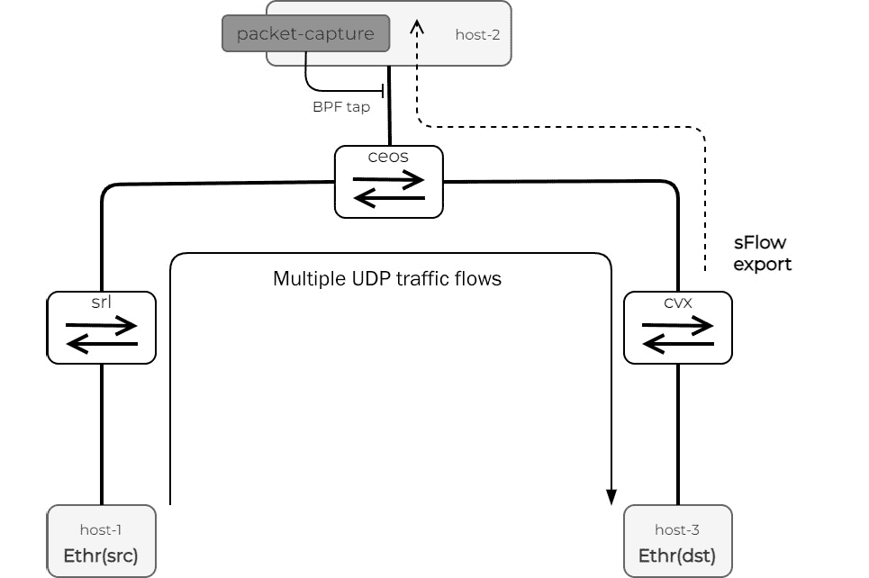
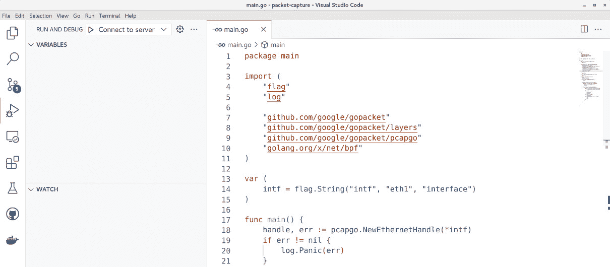
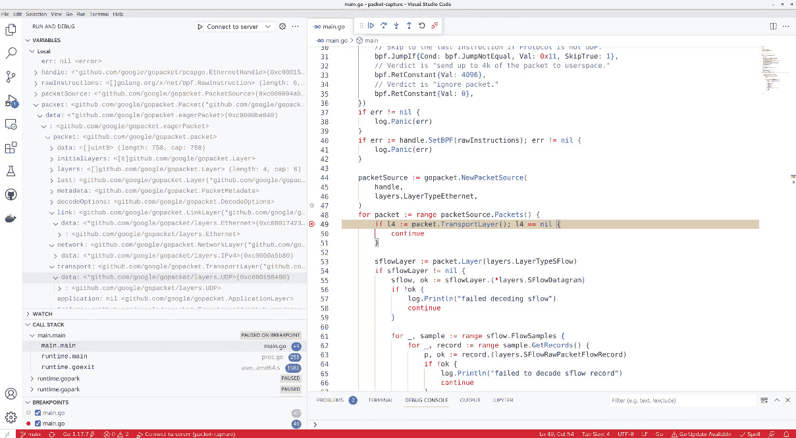
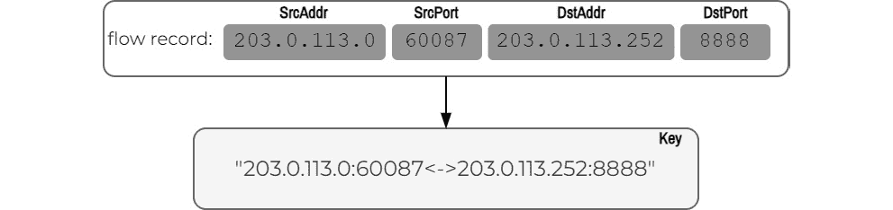
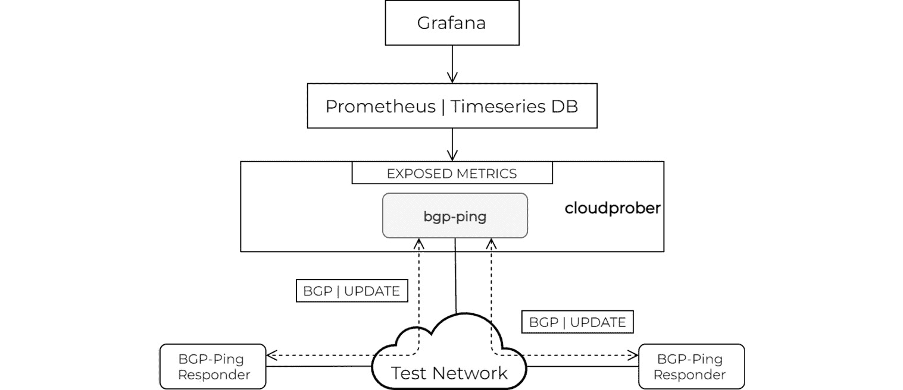
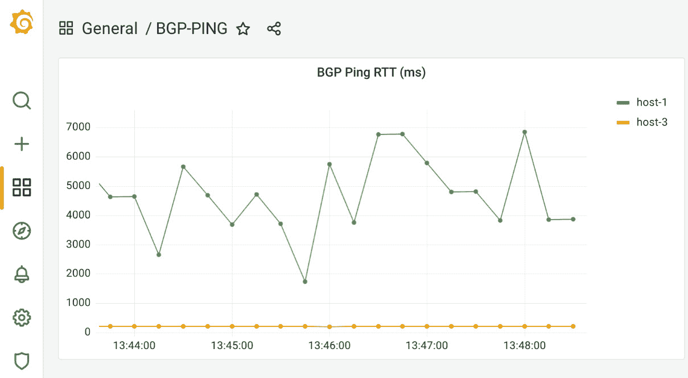
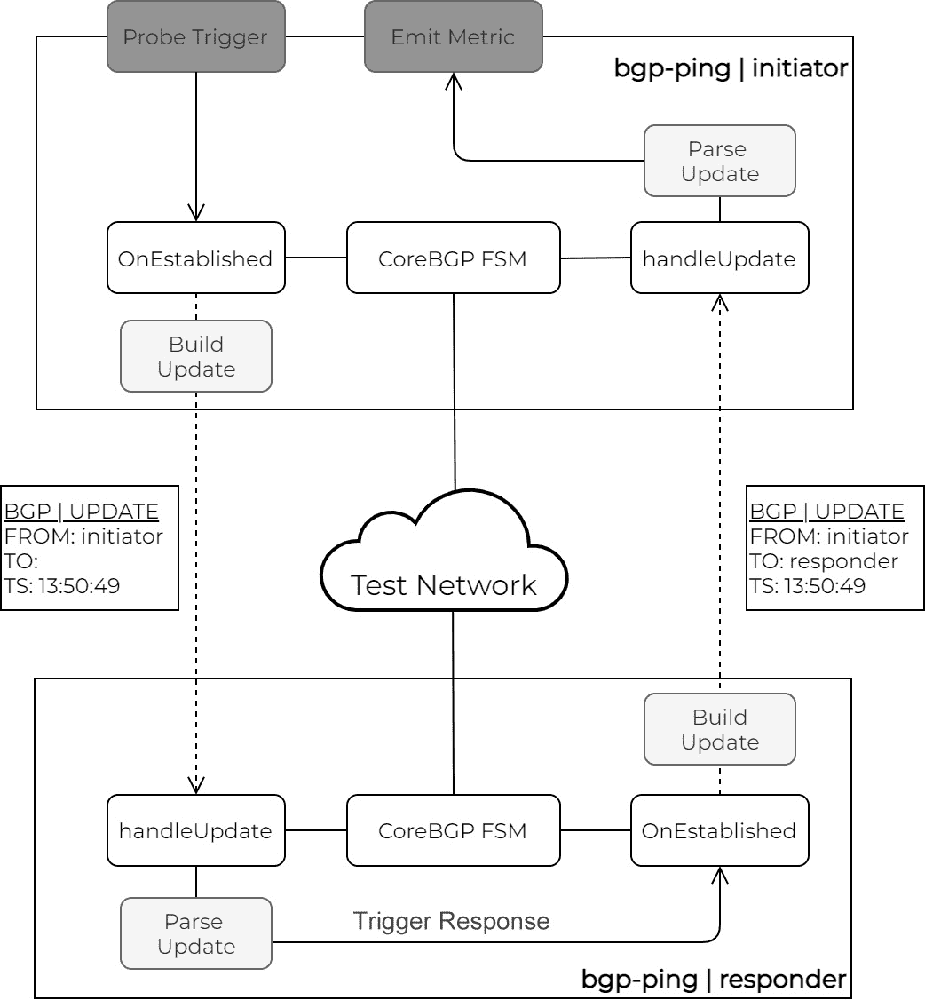
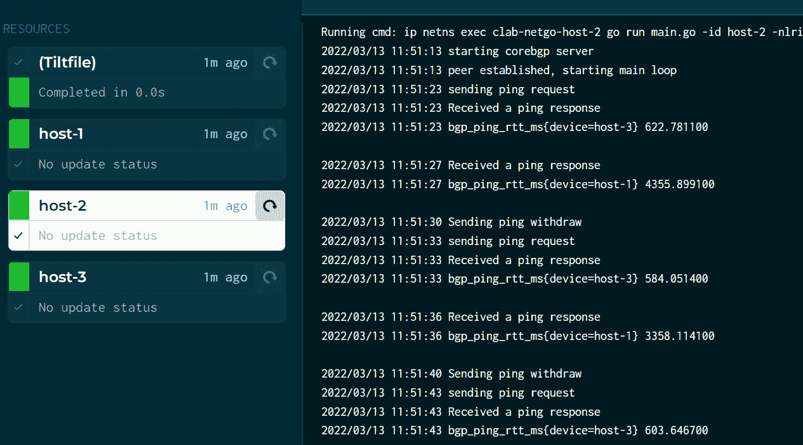

# 第十章：网络监控

尽管配置管理很受欢迎，但我们实际上花在监控网络上的时间比配置它们的时间更多。随着网络变得越来越复杂，新的封装层和 IP 地址转换，我们理解网络是否正确运行以使我们能够满足客户**服务级别协议**（**SLAs**）的能力变得越来越困难。

在云基础设施领域工作的工程师提出了“可观察性”这个术语，指的是通过观察系统的外部输出来推理系统内部状态的能力。用网络术语来说，这可能包括通过日志和状态遥测收集的被动监控或使用分布式探测、数据处理和可视化的主动监控。

所有这些的最终目标是减少**平均修复时间**（**MTTR**），遵守客户服务级别协议（**SLAs**），并转向主动问题解决。Go 语言是这类任务中非常受欢迎的选择语言，在本章中，我们将探讨一些可以帮助您进行网络监控的工具、包和平台。以下是本章的要点：

+   我们将通过查看如何使用 Go 语言捕获和解析网络数据包来探索流量监控。

+   接下来，我们将探讨如何处理和汇总数据平面遥测数据，以获取对当前网络行为的有意义见解。

+   我们展示了如何使用主动探测来衡量网络性能，以及如何生成、收集和可视化性能指标。

我们将故意避免讨论基于 YANG 的遥测，因为我们已经在*第八章*“网络 API”和*第九章*“OpenConfig”中介绍过了。

在本章中，我们还没有涉及的一个领域，我们希望在本章中简要讨论的是开发者体验。随着我们编写更多的代码，维护现有软件成为我们日常运营的重要部分。我们将在本章的每个部分介绍一个工具，承认我们只是触及了表面，这个主题可能是一整本书的主题。最后，我们并不力求提供一个全面概述所有工具的概述，只是想给您一个在生产环境中开发 Go 代码可能感觉如何的印象。

# 技术要求

您可以在本书的 GitHub 仓库中找到本章的代码示例（见*进一步阅读*部分），在`ch10`文件夹下。

重要提示

我们建议您在虚拟实验室环境中执行本章中的 Go 程序。有关先决条件和如何构建完全配置的网络拓扑结构的说明，请参阅*附录*。

在下一节中，我们将讨论的第一个示例将探讨 Go 中的数据包捕获和解析功能。

# 数据平面遥测处理

网络活动，如容量规划、计费或**分布式拒绝服务**（**DDoS**）攻击监控，需要了解通过网络流过的流量。我们可以提供此类可见性的方法之一是部署数据包采样技术。前提是，以足够高的速率，只捕获随机采样的数据包子集，以建立一个对整体网络流量模式的良好理解。

虽然是硬件对数据包进行采样，但软件将它们聚合为流并导出。NetFlow、sFlow 和**IP 流信息导出**（**IPFIX**）是我们用于此目的的三个主要协议，它们定义了有效负载的结构以及每个采样数据包应包含哪些元数据。

任何遥测处理流程的第一步是信息摄取。在我们的上下文中，这意味着接收和解析数据平面遥测数据包以提取和处理流记录。在本节中，我们将探讨如何借助`google/gopacket`包（见*进一步阅读*）捕获和处理数据包。

## 数据包捕获

在*第四章*“使用 Go 的 TCP/IP 网络”，我们讨论了如何使用 Go 标准库中的`net`包构建 UDP ping 应用程序。虽然我们可能应该采取类似的方法来构建 sFlow 收集器，但我们将为下一个示例做些不同的事情。

我们没有设计一个数据平面遥测收集器，而是将我们的应用程序设计为接入现有的遥测数据包流，假设拓扑中的网络设备正在将它们发送到网络中某个位置的现有收集器。这允许你在不改变现有遥测服务配置的情况下，仍然能够捕获和处理遥测流量。当你需要一个可以直接在网络上运行、按需使用且持续时间短的透明工具时，你可以使用这样的程序。

在测试实验室拓扑中，`cvx`节点运行一个代理，使用 sFlow 协议导出采样指标。sFlow 流量流向`host-2`，在那里它被示例应用程序使用 tap 拦截：



图 10.1 – sFlow 应用程序

为了向您展示`google/gopacket`包的数据包捕获功能，我们使用`pcapgo`拦截所有 sFlow 数据包——这是 Linux 中流量捕获 API 的本地 Go 实现。尽管它比其对应的`pcap`和`pfring`包功能较少，但`pcapgo`的好处是它不依赖于任何外部 C 库，并且可以在任何 Linux 发行版上本地运行。

在本书 GitHub 仓库的`ch10/packet-capture`文件夹中，您可以在`packet-capture`程序的第一部分中设置一个新的`af_packet`套接字处理程序，使用`pcapgo.NewEthernetHandle`函数，并传递要监控的接口名称：

```go
import (
     "github.com/google/gopacket/pcapgo"
)
var (
     intf = flag.String("intf", "eth0", "interface")
)
func main() {
     handle, err := pcapgo.NewEthernetHandle(*intf)
     /* ... <continues next > ... */
}
```

在这一点上，`handle`为我们提供了对`eth0`接口上所有数据包的访问权限。

## 数据包过滤

尽管我们可以通过接口捕获所有数据包，但为了实验的目的，我们将包括一个如何在 Go 中使用**伯克利数据包过滤器（BPF**）程序过滤我们捕获的流量的示例。

首先，我们使用`tcpdump`命令的`-d`选项以可读格式生成一个编译后的包匹配代码，用于过滤 IP 和 UDP 数据包：

```go
$ sudo tcpdump -p -ni eth0 -d "ip and udp"
(000) ldh      [12]
(001) jeq      #0x800           jt 2    jf 5
(002) ldb      [23]
(003) jeq      #0x11            jt 4    jf 5
(004) ret      #262144
(005) ret      #0
```

然后，我们将前面的每个指令转换为来自`golang.org/x/net/bpf`包的相应`bpf.Instruction`。我们将这些指令组装成一组`[]bpf.RawInstruction`，它们可以加载到 BPF 虚拟机中：

```go
import (
  "golang.org/x/net/bpf"
)

func main() {
/* ... <continues from before > ... */

  rawInstructions, err := bpf.Assemble([]bpf.Instruction{
    // Load "EtherType" field from the ethernet header.
    bpf.LoadAbsolute{Off: 12, Size: 2},
    // Skip to last instruction if EtherType isn't IPv4.
    bpf.JumpIf{Cond: bpf.JumpNotEqual, Val: 0x800,
                    SkipTrue: 3},
    // Load "Protocol" field from the IPv4 header.
    bpf.LoadAbsolute{Off: 23, Size: 1},
    // Skip to the last instruction if Protocol is not UDP.
    bpf.JumpIf{Cond: bpf.JumpNotEqual, Val: 0x11,
                    SkipTrue: 1},
    // "send up to 4k of the packet to userspace."
    bpf.RetConstant{Val: 4096},
    // Verdict is "ignore packet and return to the stack."
    bpf.RetConstant{Val: 0},
  })

  handle.SetBPF(rawInstructions)
  /* ... <continues next > ... */
}
```

我们可以将结果附加到我们之前创建的`EthernetHandle`函数上，作为数据包过滤器，以减少应用程序接收到的数据包数量。

总结来说，我们将匹配`0x800`以太网类型和`0x11`IP 协议的所有数据包复制到用户空间进程，其中我们的 Go 程序运行，而所有其他数据包，包括我们匹配的数据包，将继续通过网络堆栈。这使得这个程序对任何现有的流量流都是完全透明的，并且你可以使用它而无需更改 sFlow 代理的配置。

## 数据包处理

内核发送到用户空间的所有数据包都通过`PacketSource`类型在 Go 应用程序中变得可用，我们通过将我们创建的`EthernetHandle`函数与一个以太网数据包解码器相结合来构建这个类型：

```go
func main() {
  /* ... <continues from before > ... */
     packetSource := gopacket.NewPacketSource(
           handle,
           layers.LayerTypeEthernet,
     )
     /* ... <continues next > ... */
}
```

这个`PacketSource`结构通过 Go 通道发送每个接收和解码的数据包，这意味着我们可以使用`for`循环逐个迭代它们。在这个循环内部，我们使用`gopacket`来匹配数据包层并提取关于 L2、L3 和 L4 网络头部的信息，包括特定于协议的细节，如 sFlow 有效负载：

```go
func main() {
  /* ... <continues from before > ... */
  for packet := range packetSource.Packets() {
    sflowLayer := packet.Layer(layers.LayerTypeSFlow)
    if sflowLayer != nil {
      sflow, ok := sflowLayer.(*layers.SFlowDatagram)
      if !ok {
        continue
      }

      for _, sample := range sflow.FlowSamples {
        for _, record := range sample.GetRecords() {
          p, ok := record.(layers.SFlowRawPacketFlowRecord)
          if !ok {
            log.Println("failed to decode sflow record")
            continue
          }

          srcIP, dstIP := p.Header.
            NetworkLayer().
            NetworkFlow().
            Endpoints()
          sPort, dPort := p.Header.
            TransportLayer().
            TransportFlow().
            Endpoints()
          log.Printf("flow record: %s:%s <-> %s:%s\n",
            srcIP,
            sPort,
            dstIP,
            dPort,
          )
        }
      }
     }
  }
}
```

使用`gopacket`专门进行 sFlow 解码的好处是它可以基于采样数据包的头部解析并创建另一个`gopacket.Packet`。

## 生成流量

为了测试这个 Go 应用程序，我们需要在实验室拓扑中生成一些流量，以便`cvx`设备可以生成关于它的 sFlow 记录。在这里，我们使用`microsoft/ethr` – 一个基于 Go 的流量生成器，它提供与`iperf`相当的用户体验和功能。它可以生成和接收固定量的网络流量并测量带宽、延迟、丢失和抖动。在我们的情况下，我们只需要它生成一些低流量的流量流，通过实验室网络触发数据平面流量采样。

`packet-capture`应用程序从现有的 sFlow 流量中提取，解析和提取流记录，并在屏幕上打印这些信息。要测试程序，从本书 GitHub 存储库的根目录运行`make capture-start`（参见*进一步阅读*）：

```go
$ make capture-start
docker exec -d clab-netgo-cvx systemctl restart hsflowd
docker exec -d clab-netgo-host-3 ./ethr -s
docker exec -d clab-netgo-host-1 ./ethr -c 203.0.113.253 -b 900K -d 60s -p udp -l 1KB
docker exec -d clab-netgo-host-1 ./ethr -c 203.0.113.252 -b 600K -d 60s -p udp -l 1KB
docker exec -d clab-netgo-host-1 ./ethr -c 203.0.113.251 -b 400K -d 60s -p udp -l 1KB
cd ch10/packet-capture; go build -o packet-capture main.go
docker exec -it clab-netgo-host-2 /workdir/packet-capture/packet-capture
2022/02/28 21:50:25  flow record: 203.0.113.0:60087 <-> 203.0.113.252:8888
2022/02/28 21:50:25  flow record: 203.0.113.0:60087 <-> 
203.0.113.252:8888
2022/02/28 21:50:27  flow record: 203.0.113.0:40986 <-> 203.0.113.252:8888
2022/02/28 21:50:29  flow record: 203.0.113.0:60087 <-> 203.0.113.252:8888
2022/02/28 21:50:29  flow record: 203.0.113.0:49138 <-> 203.0.113.251:8888
2022/02/28 21:50:30  flow record: 203.0.113.0:60087 <-> 203.0.113.252:8888
2022/02/28 21:50:30  flow record: 203.0.113.0:49138 <-> 203.0.113.251:8888
```

正如承诺的那样，在我们进入下一节之前，让我们回顾本章的第一个*开发者体验*工具。

# Go 程序调试

阅读和推理现有代码库是一项费力的任务，随着程序的成熟和演变，这变得更加困难。这就是为什么在学习新语言时，至少对调试过程有一个基本理解非常重要。调试允许我们在预定义的位置停止程序的执行，并逐行通过代码，同时检查内存中的变量和数据结构。

在以下示例中，我们使用 Delve 调试我们刚刚运行的 `packet-capture` 程序。在您开始之前，您需要通过 `make traffic-start` 在实验室拓扑中生成一些流量：

```go
$ make traffic-start
docker exec -d clab-netgo-cvx systemctl restart hsflowd
docker exec -d clab-netgo-host-3 ./ethr -s
docker exec -d clab-netgo-host-1 ./ethr -c 203.0.113.253 -b 900K -d 60s -p udp -l 1KB
docker exec -d clab-netgo-host-1 ./ethr -c 203.0.113.252 -b 600K -d 60s -p udp -l 1KB
docker exec -d clab-netgo-host-1 ./ethr -c 203.0.113.251 -b 400K -d 60s -p udp -l 1KB
```

Delve 二进制文件已在 `host` 实验室容器中预先安装，因此您可以使用 `docker exec -it` 命令连接到 `host-2` 容器，并使用 `dlv debug` 命令启动 Delve shell：

```go
$ docker exec -it clab-netgo-host-2 bash
root@host-2:/# cd workdir/ch10/packet-capture/
root@host-2:/workdir/packet-capture# dlv debug main.go
```

一旦进入 `dlv` 交互式 shell，您可以使用不同的内置命令来控制程序的执行（您可以使用 `help` 查看命令列表的完整列表）。在 `main.go` 的第 49 行设置断点，并运行程序直到我们收到第一个数据包：

```go
(dlv) break main.go:49
Breakpoint 1 set at 0x5942ce for main.main() ./main.go:49
(dlv) continue
> main.main() ./main.go:49 (hits goroutine(1):1 total:1) (PC: 0x5942ce)
    44:    packetSource := gopacket.NewPacketSource(
    45:      handle,
    46:      layers.LayerTypeEthernet,
    47:    )
    48:    for packet := range packetSource.Packets() {
=>  49:      if l4 := packet.TransportLayer(); l4 == nil {
    50:        continue
    51:      }
    52:  
    53:      sflowLayer := packet.Layer(layers.LayerTypeSFlow)
    54:      if sflowLayer != nil {
```

当执行在断点处停止时，您可以使用 `locals` 命令检查局部变量：

```go
(dlv) locals
err = error nil
handle = ("*github.com/google/gopacket/pcapgo.EthernetHandle")(0xc000162200)
rawInstructions = []golang.org/x/net/bpf.RawInstruction len: 6, cap: 6, [...]
packetSource = ("*github.com/google/gopacket.PacketSource")(0xc00009aab0)
packet = github.com/google/gopacket.Packet(*github.com/google/gopacket.eagerPacket) 0xc0000c3c08
```

您可以在屏幕上打印变量内容，如下面的 `packet` 变量示例所示：

```go
(dlv) print packet
github.com/google/gopacket.Packet(*github.com/google/gopacket.eagerPacket) *{
  packet: github.com/google/gopacket.packet {
    data: []uint8 len: 758, cap: 758, [170,193,171,140,219,204,170,193,171,198,150,242,8,0,69,0,2,232,40,71,64,0,63,17,18,182,192,0,2,5,203,0,113,2,132,19,24,199,2,212,147,6,0,0,0,5,0,0,0,1,203,0,113,129,0,1,134,160,0,0,0,39,0,2,...+694 more],
    /* ... < omitted > ... */
    last: github.com/google/gopacket.Layer(*github.com/google/gopacket.DecodeFailure) ...,
    metadata: (*"github.com/google/gopacket.PacketMetadata")(0xc0000c6200),
    decodeOptions: (*"github.com/google/gopacket.DecodeOptions")(0xc0000c6250),
    link: github.com/google/gopacket.LinkLayer(*github.com/google/gopacket/layers.Ethernet) ...,
    network: github.com/google/gopacket.NetworkLayer(*github.com/google/gopacket/layers.IPv4) ...,
    transport: github.com/google/gopacket.TransportLayer(*github.com/google/gopacket/layers.UDP) ...,
    application: github.com/google/gopacket.ApplicationLayer nil,
    failure: github.com/google/gopacket.ErrorLayer(*github.com/google/gopacket.DecodeFailure) ...,},}
```

文本导航和输出的详细程度可能对初学者来说有些吓人，但幸运的是，我们有其他可视化选项。

## 从 IDE 进行调试

如果在控制台中调试不是您的首选选项，那么大多数流行的 **集成开发环境**（**IDE**）都提供某种形式的 Go 调试支持。例如，Delve 与 **Visual Studio Code**（**VSCode**）集成，您也可以为其配置远程调试。

虽然您可以通过不同的方式设置 VSCode 的远程调试，但在本例中，我们在 `headless` 模式下手动在容器中运行 Delve，同时指定监听传入连接的端口：

```go
$ docker exec -it clab-netgo-host-2 bash 
root@host-2:/# cd workdir/ch10/packet-capture/
root@host-2:/workdir/ch10/packet-capture#  dlv debug main.go --listen=:2345 --headless --api-version=2
API server listening at: [::]:2345
```

现在，我们需要告诉 VSCode 如何连接到远程 Delve 进程。您可以通过在 `main.go` 文件旁边的 `.vscode` 文件夹中包含一个 JSON 配置文件来实现这一点。以下是一个示例文件，您可以在本书 GitHub 仓库的 `ch10/packet-capture/.vscode/launch.json` 中找到：

```go
{
	"version": "0.2.0",
	"configurations": [
        {
            "name": "Connect to server",
            "type": "go",
            "request": "attach",
            "mode": "remote",
            "remotePath": "/workdir/ch10/packet-capture",
            "port": 2345,
            "host": "ec2-3-224-127-79.compute-1.amazonaws.com",  
        },
    ]
}
```

您需要将 `host` 值替换为实验室运行的位置，然后从 Go 程序的根目录启动 VSCode 实例（`code ch10/packet-capture`）：



图 10.2 – VSCode 开发环境

在 VSCode 中，现在您可以点击左侧菜单中的调试图标，进入 **运行和调试**，在那里您应该看到读取前面 JSON 配置文件的 **连接到服务器** 选项。点击绿色箭头以连接到远程调试进程。

在此阶段，您可以在调试过程在容器内运行的同时，在 VSCode **用户界面**（**UI**）中导航并检查局部变量：



图 10.3 – VSCode 调试

在下一节中，我们将探讨如何通过聚合收集和处理的网络平面遥测数据来增加其价值，并生成最高带宽消费者的报告。

# 网络平面遥测聚合

在收集和解析数据平面遥测数据后，我们需要考虑接下来如何处理这些数据。由于数据流数量庞大且缺乏任何有意义的上下文，直接查看原始数据并不总是有帮助。因此，遥测处理管道中的下一个逻辑步骤是数据增强和聚合。

遥测增强是指根据某些外部信息源，为每个数据流添加额外元数据的过程。例如，这些外部源可以提供公共 IP 与其来源国家或 BGP ASN 之间的关联，或者私有 IP 与其聚合子网或设备标识之间的关联。

另一种可以帮助我们解释和推理所收集遥测数据的技巧是聚合。我们可以根据 IP 前缀边界或流元数据（如 BGP ASN）将不同的流记录组合起来，以帮助网络操作员得出有意义的见解并创建数据的高级视图。

您可以使用开源组件构建整个遥测处理管道，并使用互联网上可用的现成示例（见*进一步阅读*），但迟早您可能需要编写一些代码以满足特定的业务需求。在下一节中，我们将处理一个需要聚合网络平面遥测数据以更好地了解网络流量模式的场景。

## 主要通信者

在没有长期遥测存储的情况下，获取最高带宽消费者的即时快照可能非常有帮助。我们将此应用程序称为*主要通信者*，它通过显示基于相对接口带宽利用率排序的网络流列表来工作。

让我们通过一个实现此功能的 Go 应用程序示例来了解一下。

### 探索遥测数据

在我们的`top-talkers`应用程序中，我们使用`netsampler/goflow2`收集 sFlow 记录，这是一个专门设计用于收集、增强和保存 sFlow、IPFIX 或 NetFlow 遥测数据的包。该包摄取原始协议数据并生成标准化（协议无关）的流记录。默认情况下，您可以将这些标准化记录保存到文件或发送到 Kafka 队列。在我们的案例中，我们将它们存储在内存中以便进一步处理。

为了在内存中存储流记录，我们将接收到的每个流记录的最相关字段保存到用户定义的数据结构中，我们称之为`MyFlow`：

```go
type MyFlow struct {
     Key         string
     SrcAddr     string `json:"SrcAddr,omitempty"`
     DstAddr     string `json:"DstAddr,omitempty"`
     SrcPort     int    `json:"SrcPort,omitempty"`
     DstPort     int    `json:"DstPort,omitempty"`
     Count       int    // times we've seen this flow sample
}
```

此外，我们创建一个流键，作为源和目标端口及 IP 地址的连接，以唯一标识每个流：



图 10.4 – 流量键

为了帮助我们计算最终结果，我们创建了一个我们称之为`topTalker`的另一个数据结构，它有两个字段：

+   `flowMap`：一个用于存储`MyFlow`类型流集合的映射。我们使用我们创建的键来索引它们。

+   `Heap`：一个辅助数据结构，用于跟踪最频繁出现的流量：

    ```go
    type Heap []*MyFlow
    ```

    ```go
    type topTalker struct {
    ```

    ```go
         flowMap map[string]*MyFlow
    ```

    ```go
         heap    Heap
    ```

    ```go
    }
    ```

由于我们使用高级 sFlow 包（`goflow2`），我们不需要担心设置 UDP 监听器或接收和解码数据包，但我们需要告诉`goflow2`报告流量记录的格式（`json`）并指向一个自定义传输驱动程序（`tt`），该驱动程序确定在 sFlow 包标准化接收到的流量记录之后如何处理数据：

```go
import (
  "github.com/netsampler/goflow2/format"
  "github.com/netsampler/goflow2/utils"
)
func main() {
     tt := topTalker{
           flowMap: make(map[string]*MyPacket),
           heap:    make(Heap, 0),
     }
     formatter, err := format.FindFormat(ctx, "json")
     // process error
     sSFlow := &utils.StateSFlow{
           Format:    formatter,
           Logger:    log.StandardLogger(),
           Transport: &tt,
     }
     go sSFlow.FlowRoutine(1, hostname, 6343, false)
}
```

前一个代码片段中的`utils.StateSFlow`类型的`Transport`字段接受任何实现了`TransportInterface`接口的类型。该接口期望一个方法（`Send()`），其中可以发生所有丰富和聚合操作：

```go
type StateSFlow struct {
     Format    format.FormatInterface
     Transport transport.TransportInterface
     Logger    Logger
     /* ... < other fields > ... */
}
type TransportInterface interface {
     Send(key, data []byte) error
}
```

`Send`方法接受两个参数，一个表示 sFlow 数据报的源 IP，另一个包含实际的流量记录。

### 遥测处理

在我们的`Send`方法实现（以满足`TransportInterface`接口）中，我们首先解析输入的二进制数据，并将其反序列化为`MyFlow`数据结构：

```go
func (c *topTalker) Send(key, data []byte) error {
     var myFlow MyFlow
     json.Unmarshal(data, &myFlow)
     /* ... <continues next > ... */
}
```

考虑到 sFlow 可以捕获双向的数据包，我们需要确保两个流都计入内存中的同一流量记录。这意味着创建一个特殊的流量键，满足以下两个条件：

+   它必须与同一流的所有入站和出站数据包相同。

+   它必须对所有双向流量是唯一的。

我们通过在构建双向流量键时对源和目标 IP 进行排序来完成这项工作，如下面的代码片段所示：

```go
var flowMapKey = `%s:%d<->%s:%d`
func (c *topTalker) Send(key, data []byte) error {
  /* ... <continues from before > ... */
  ips := []string{myFlow.SrcAddr, myFlow.DstAddr}
  sort.Strings(ips)
  var mapKey string
  if ips[0] != myFlow.SrcAddr {
    mapKey = fmt.Sprintf(
      flowMapKey,
      myFlow.SrcAddr,
      myFlow.SrcPort,
      myFlow.DstAddr,
      myFlow.DstPort,
    )
  } else {
    mapKey = fmt.Sprintf(
      flowMapKey,
      myFlow.DstAddr,
      myFlow.DstPort,
      myFlow.SrcAddr,
      myFlow.SrcPort,
    )
  }
  /* ... <continues next > ... */
}
```

使用一个唯一键表示流的双向，我们可以在映射（`flowMap`）中保存它以存储在内存中。对于每个接收到的流量记录，`Send`方法执行以下检查：

+   如果这是我们第一次看到这个流量，那么我们就把它保存在地图上，并将计数器设置为`1`。

+   否则，我们通过将计数器增加一个来更新流量：

```go
func (c *topTalker) Send(key, data []byte) error {
  /* ... <continues from before > ... */
    myFlow.Key = mapKey
    foundFlow, ok := c.flowMap[mapKey]
    if !ok {
          myFlow.Count = 1
          c.flowMap[mapKey] = &myFlow
          heap.Push(&c.heap, &myFlow)
          return nil
    }
    c.heap.update(foundFlow)
    return nil
} 
```

现在，为了按顺序显示顶级对话者，我们需要对保存的流量记录进行排序。在这里，我们使用 Go 标准库中的`container/heap`包。它实现了一个排序算法，提供 O(log n)（对数）上界保证，这意味着它可以非常高效地进行数据添加和删除操作。

要使用此包，你只需要教它如何比较你的项目。当你添加、删除或更新元素时，它会自动对它们进行排序。在我们的例子中，我们想要对保存为`MyFlow`数据类型的流量记录进行排序。我们定义`Heap`为指向`MyFlow`记录的指针列表。`Less()`方法指示`container/heap`包根据存储我们已看到流量记录次数的`Count`字段比较两个`MyFlow`元素：

```go
type Heap []*MyFlow
func (h Heap) Less(i, j int) bool {
     return h[i].Count > h[j].Count
}
```

现在，我们有一个内存中的流记录存储，其元素根据它们的`Count`进行排序。我们现在可以遍历`Heap`切片，并在屏幕上打印其元素。与之前的`gopacket`示例一样，我们使用`ethr`生成具有不同吞吐量的三个 UDP 流，以获得一致的排序输出。您可以使用`make top-talkers-start`在拓扑中触发这些流：

```go
Network-Automation-with-Go $ make top-talkers-start
docker exec -d clab-netgo-cvx systemctl restart hsflowd
docker exec -d clab-netgo-host-3 ./ethr -s
docker exec -d clab-netgo-host-1 ./ethr -c 203.0.113.253 -b 900K -d 60s -p udp -l 1KB
docker exec -d clab-netgo-host-1 ./ethr -c 203.0.113.252 -b 600K -d 60s -p udp -l 1KB
docker exec -d clab-netgo-host-1 ./ethr -c 203.0.113.251 -b 400K -d 60s -p udp -l 1KB
```

然后，在`host-2`容器（`clab-netgo-host-2`）内部使用`go run main.go`运行 Top-talkers Go 应用程序，以获取实时 Top-talkers 表：

```go
$ cd ch10/top-talkers; sudo ip netns exec clab-netgo-host-2 /usr/local/go/bin/go run main.go; cd ../../
Top Talkers
+---+-------------------+--------------------+------
| # | FROM              | TO                 | PROTO 
+---+-------------------+--------------------+------
| 1 | 203.0.113.253:8888 | 203.0.113.0:48494 | UDP | 
| 2 | 203.0.113.252:8888 | 203.0.113.0:42912 | UDP | 
| 3 | 203.0.113.251:8888 | 203.0.113.0:42882 | UDP | 
+---+-------------------+--------------------+------
```

注意，由于流量量低、随机数据包采样和测试持续时间有限，你的结果可能会有所不同，但在多次测试迭代后应该收敛到类似的分布。

## 测试 Go 程序

代码测试是任何生产软件开发过程中的一个重要部分。良好的测试覆盖率可以提高应用程序的可靠性，并增加对软件开发后期阶段引入的错误的容忍度。Go 通过其标准库中的`testing`包和内置的命令行工具`go test`提供了对测试的原生支持。由于 Go 工具中内置了测试覆盖率，因此很少看到用于测试 Go 代码的第三方包。

表格驱动测试是 Go 中最受欢迎的测试方法之一。其思想是将测试用例描述为自定义数据结构的切片，每个提供每个测试用例的输入和预期结果。将测试用例编写为表格使得创建新场景、考虑边界情况以及解释现有代码行为变得更加容易。

我们可以通过构建一组针对我们用于排序流记录的堆实现表格测试，来测试我们刚刚审查的`top-talkers`示例代码的一部分。

让我们创建一个包含单个测试函数的测试文件，`main_test.go`：

```go
package main
import (
     "container/heap"
     "testing"
)
func TestHeap(t *testing.T) {
  // code tests
}
```

`_test.go`文件名后缀和`Test<Name>`函数前缀都是命名约定，允许 Go 检测测试代码并在二进制编译期间排除它。

我们设计每个测试用例都包含所有相关信息，包括以下内容：

+   用于错误消息的名称：

+   一组由它们的起始计数和结果位置描述的唯一流：

    ```go
    type testFlow struct {
    ```

    ```go
         startCount   int
    ```

    ```go
         timesSeen    int
    ```

    ```go
         wantPosition int
    ```

    ```go
         wantCount    int
    ```

    ```go
    }
    ```

    ```go
    type testCase struct {
    ```

    ```go
         name  string
    ```

    ```go
         flows map[string]testFlow
    ```

    ```go
    }
    ```

根据前面的定义，我们创建一个针对不同输入和输出值组合的测试套件，以尽可能覆盖尽可能多的非重复场景：

```go
 var testCases = []testCase{
  {
    name: "single packet",
    flows: map[string]testFlow{
      "1-1": {
        startCount:   1,
        timesSeen:    0,
        wantPosition: 0,
        wantCount:    1,
      },
    },
  },{
    name: "last packet wins",
    flows: map[string]testFlow{
      "2-1": {
        startCount:   1,
        timesSeen:    1,
        wantPosition: 1,
        wantCount:    2,
      },
      "2-2": {
        startCount:   2,
        timesSeen:    1,
        wantPosition: 0,
        wantCount:    3,
      },
    },
  },
```

我们在`TestHeap`函数的主体中将所有这些内容结合起来，在这个函数中，我们遍历所有测试用例。对于每个测试用例，我们设置其前提条件，将所有流推入堆中，并更新它们的`timeSeen`计数次数：

```go
func TestHeap(t *testing.T) {
     for _, test := range testCases {
           h := make(Heap, 0)
           // pushing flow on the heap
           for key, f := range test.flows {
                      flow := &MyFlow{
                           Count: f.startCount,
                           Key:   key,
                      }
                      heap.Push(&h, flow)
                      // updating packet counts
                      for j := 0; j < f.timesSeen; j++ {
                           h.update(flow)
                      }
           }
     /* ... <continues next > ... */
}
```

一旦我们更新了所有流，我们就根据最高的计数，逐个从堆中移除它们，并检查结果位置和计数是否与我们描述的测试用例中的相符。如果出现不匹配，我们将使用测试包注入的`*testing.T`类型生成错误消息：

```go
func TestHeap(t *testing.T) {
  /* ... < continues from before > ... */
  for i := 0; h.Len() > 0; i++ {
                f := heap.Pop(&h).(*MyFlow)
                tf := test.flows[f.Key]
                if tf.wantPosition != i {
                           t.Errorf(
                             "%s: unexpected position for packet key %s: got %d, want %d", test.name, f.Key, i, tf.wantPosition)
                }
                if tf.wantCount != f.Count {
                           t.Errorf(
                                 "%s: unexpected count for packet key %s: got %d, want %d", test.name, f.Key, f.Count, tf.wantCount)
                }
           }
}
```

到目前为止，我们只讨论了数据平面遥测，这是至关重要的，但不是网络监控的唯一元素。在下一节中，我们将通过构建一个完整的端到端遥测处理管道来探索网络控制平面遥测。

# 测量控制平面性能

大多数网络工程师熟悉`ping`、`traceroute`和`iperf`等工具，用于验证网络数据平面的连通性、可达性和吞吐量。同时，控制平面性能通常是一个黑盒，我们只能假设我们的网络重新收敛需要多长时间。在本节中，我们旨在通过构建控制平面遥测解决方案来解决这个问题。

现代控制平面协议，如 BGP，从 IP 路由到 MAC 地址和流定义分发大量信息。随着我们网络规模的扩大，控制平面状态的变化率也在增加，用户、虚拟机和应用程序不断在不同位置和网络段之间移动。因此，了解我们的控制平面性能如何对于解决网络问题和采取任何预防措施至关重要。

下一个代码示例涵盖了我们所构建的遥测处理管道，用于监控实验室网络的控制平面性能。其核心是一个特殊的`bgp-ping`应用程序，允许我们测量 BGP 更新的往返时间。在这个解决方案中，我们利用以下 Go 包和应用程序的功能：

+   `jwhited/corebgp`：一个可插入的 BGP 有限状态机实现，允许您为不同的 BGP 状态运行任意操作。

+   `osrg/gobgp`：Go 中最受欢迎的 BGP 实现之一；我们用它来编码和解码 BGP 消息。

+   `cloudprober/cloudprober`：一个灵活的分布式探测和监控框架。

+   `Prometheus`和`Grafana`：一个流行的监控和可视化软件栈。



图 10.5 – 遥测管道架构

要启动整个设置，您可以从本书 GitHub 仓库的根目录运行`make bgp-ping-start`（参见*进一步阅读*）：

```go
Network-Automation-with-Go $ make bgp-ping-start
cd ch10/bgp-ping; go build -o bgp-ping main.go
docker exec -d clab-netgo-host-3 /workdir/bgp-ping/bgp-ping -id host-3 -nlri 100.64.0.2 -laddr 203.0.113.254 -raddr 203.0.113.129 -las 65005 -ras 65002 -p
docker exec -d clab-netgo-host-1 /workdir/bgp-ping/bgp-ping -id host-1 -nlri 100.64.0.0 -laddr 203.0.113.0 -raddr 203.0.113.1 -las 65003 -ras 65000 -p
docker exec -d clab-netgo-host-2 /cloudprober -config_file /workdir/workdir/cloudprober.cfg
cd ch10/bgp-ping; docker-compose up -d; cd ../../
Creating prometheus ... done
Creating grafana    ... done
http://localhost:3000
```

前一个输出的最后一行显示了您可以使用它来访问部署的 Grafana 实例的 URL，其中`username`和`password`都使用`admin`：



图 10.6 – BGP ping 仪表板

此实例有一个预先创建的名为`BGP-Ping`的仪表板，该仪表板绘制了 BGP 往返时间的图表（以毫秒为单位）。

重要的是要注意，路由协议收敛和性能的问题远不止更新传播时间。其他重要因素可能包括由于暂时性事件引起的更新 churn 或 **转发信息库**（**FIB**）编程时间。在这个例子中，我们关注单一维度的指标，但在现实中，您可能还想考虑其他性能指标。

# 测量 BGP 更新传播时间

与标准的`ping`类似，`bgp-ping`应用程序通过发送和接收探测消息工作。发送者将探测嵌入 BGP 更新消息并发送给其 BGP 邻居。我们将探测编码为自定义的 BGP 可选传递属性，这使得它可以在整个网络中透明地传播，直到它到达`bgp-ping`响应者之一。

`bgp-ping`响应者识别这个自定义传递属性并将其反射回发送者。这给发送者提供了一个度量网络中 BGP 更新传播延迟的量，然后将其报告给外部度量消费者或打印在屏幕上。

由于`bgp-ping`应用程序需要与真实的 BGP 堆栈进行互操作，至少它必须实现`Open`消息的初始交换来协商 BGP 会话功能，然后是周期性的`Keepalive`消息交换。我们还需要做以下事情：

1.  由不同事件触发的发送 BGP 更新消息。

1.  编码和解码自定义 BGP 属性。

让我们看看如何使用开源 Go 包和应用程序来实现这些要求。

## 事件驱动的 BGP 状态机

我们使用 CoreBGP (`jwhited/corebgp`) 与对等体建立 BGP 会话，并保持其活跃状态直到关闭。这为我们提供了刚刚讨论的`Open`和`Keepalive`消息。

受到流行的 DNS 服务器 CoreDNS 的启发，CoreBGP 是一个可以通过事件驱动插件扩展的最小化 BGP 服务器。

在实践中，你通过构建自定义的`Plugin`接口实现来扩展初始功能。该接口定义了可以在 BGP **有限状态机**（**FSM**）的某些点上实现用户定义行为的不同方法：

```go
type Plugin interface {
     GetCapabilities(...) []Capability
     OnOpenMessage(...) *Notification
     OnEstablished(...) handleUpdate
     OnClose(...)
}
```

对于`bpg-ping`应用程序，我们只需要发送和接收 BGP 更新消息，因此我们专注于实现以下两种方法：

+   `OnEstablished`：发送 BGP 更新消息。

+   `handleUpdate`：我们使用这个函数来处理接收到的更新，识别 ping 请求，并发送响应消息。

以下图显示了该应用程序的主要功能模块：



图 10.7 – BGP Ping 设计

让我们从检查 BGP 更新处理逻辑（`handleUpdate`）开始代码概述。由于我们的目标是解析和处理 BGP ping 探测，我们可以确保在代码早期就丢弃任何其他 BGP 更新。对于接收到的每个 BGP 更新消息，我们检查是否有任何 BGP 属性具有我们创建的用于表示探测或 ping 的自定义`bgpPingType`传递属性。我们使用`continue`语句静默忽略没有此属性的 BGP 更新：

```go
import bgp "github.com/osrg/gobgp/v3/pkg/packet/bgp"
const (
     bgpPingType = 42
)
func (p *plugin) handleUpdate(
     peer corebgp.PeerConfig,
     update []byte,
) *corebgp.Notification {

     msg, err := bgp.ParseBGPBody(
           &bgp.BGPHeader{Type: bgp.BGP_MSG_UPDATE},
           update,
     )
     // process error
     for _, attr := range msg.Body.
                    (*bgp.BGPUpdate).PathAttributes {
           if attr.GetType() != bgpPingType {
                      continue
           }
     /* ... <continues next > ... */
}
```

一旦我们确定这是一条 BGP ping 消息，我们处理两种可能的情况：

+   如果它是一个`bgpPingType`路径属性。

+   如果是`OnEstablished`函数：

```go
func (p *plugin) handleUpdate(
  peer corebgp.PeerConfig,
  update []byte,
) *corebgp.Notification {
    /* ... < continues from before > ... */
    source, dest, ts, err := parseType42(attr)
    // process error
    sourceHost := string(bytes.Trim(source, "\x00"))
    destHost := string(bytes.Trim(dest, "\x00"))
    /* ... <omitted for brevity > ... */

    // if src is us, may be a response. id = router-id
    if sourceHost == *id {
      rtt := time.Since(ts).Nanoseconds()
      metric := fmt.Sprintf(
        "bgp_ping_rtt_ms{device=%s} %f\n",
        destHost,
        float64(rtt)/1e6,
      )

    p.store = append(p.store, metric)
 return nil
    }

    p.pingCh <- ping{source: source, ts: ts.Unix()}
    return nil
}
```

发送 BGP 更新的事件驱动逻辑位于 `OnEstablished()` 方法中，该方法包含一个三路选择语句，用于监听 Go 通道上的触发器，代表 `bgp-ping` 应用程序的三个不同状态：

+   响应由来自 `handleUpdate` 函数的请求触发的 ping 请求

+   由外部信号触发的新的 ping 请求

+   在探测周期结束时发送计划中的撤回消息：

```go
func (p *plugin) OnEstablished(
  peer corebgp.PeerConfig,
  writer corebgp.UpdateMessageWriter,
) corebgp.UpdateMessageHandler {
  log.Println("peer established, starting main loop")
  go func() {
    for {
      select {
      case pingReq := <-p.pingCh:
        // Build the ping response payload
        bytes, err := p.buildUpdate(
                      type42PathAttr,
                      peer.LocalAddress,
                      peer.LocalAS,
        )
        // process error
        writer.WriteUpdate(bytes)
        /* ... < schedule a withdraw > ... */

      case <-p.probeCh:
        // Build the ping request payload
        bytes, err := p.buildUpdate(
                      type42PathAttr,
                      peer.LocalAddress,
                      peer.LocalAS,
        )
        // process error
        writer.WriteUpdate(bytes)
        /* ... < schedule a withdraw > ... */

      case <-withdraw.C:
        bytes, err := p.buildWithdraw()
        // process error
        writer.WriteUpdate(bytes)
      }
    }
  }()
  return p.handleUpdate
}
```

CoreBGP 的一个缺点是它不包含自己的 BGP 消息解析器或构建器。它发送任何可能混淆或甚至导致标准 BGP 堆栈崩溃的原始字节，因此始终要小心使用。

现在，我们需要一种解析和构建 BGP 消息的方法，这正是我们可以使用另一个名为 `GoBGP` 的 Go 库的地方。

## 编码和解码 BGP 消息

GoBGP 是一个完整的 BGP 堆栈，支持大多数 BGP 地址族和功能。然而，由于我们已经在使用 CoreBGP 进行 BGP 状态管理，所以我们限制 GoBGP 的使用仅限于消息编码和解码。

例如，每当我们需要构建一个 BGP 撤回更新消息时，我们调用一个辅助函数（`buildWithdraw`），该函数使用 GoBGP 构建消息。GoBGP 允许我们只包含相关信息，例如 **网络层可达性信息**（**NLRI**）列表，同时它负责填充其余字段，如类型、长度，并构建一个语法正确的 BGP 消息：

```go
func (p *plugin) buildWithdraw() ([]byte, error) {
     myNLRI := bgp.NewIPAddrPrefix(32, p.probe.String())
     withdrawnRoutes := []*bgp.IPAddrPrefix{myNLRI}
     msg := bgp.NewBGPUpdateMessage(
           withdrawnRoutes,
           []bgp.PathAttributeInterface{},
           nil,
     )
     return msg.Body.Serialize()
}
```

这里是使用 GoBGP 解析 CoreBGP 收到的消息的另一个示例。我们取一个字节数组，并使用 `ParseBGPBody` 函数将其反序列化为 GoBGP 的 `BGPMessage` 类型：

```go
func (p *plugin) handleUpdate(
     peer corebgp.PeerConfig,
     update []byte,
) *corebgp.Notification {
     msg, err := bgp.ParseBGPBody(
           &bgp.BGPHeader{Type: bgp.BGP_MSG_UPDATE},
           update,
     )
     // process error
     if err := bgp.ValidateBGPMessage(msg); err != nil {
           log.Fatal("validate BGP message ", err)
     }
```

您现在可以进一步解析此 BGP 消息以提取各种路径属性和 NLRIs，正如我们在 `handleUpdate` 函数的早期概述中所看到的。

## 收集和公开指标

`bgp-ping` 应用程序可以作为独立进程运行，并在屏幕上打印结果。我们还想能够将我们的应用程序集成到更通用的系统监控解决方案中。为此，它需要以标准格式公开其测量结果，以便外部监控系统可以理解。

您可以通过添加一个网络服务器并发布您的指标以供外部消费者使用来实现此功能，或者您可以使用现有的工具来代表您的应用程序收集和公开指标。一个执行此操作的工具有 Cloudprober，它支持自动化和分布式探测和监控，并提供与多个外部探测的原生 Go 集成。

我们通过 `serverutils` 包将 `bgp-ping` 应用程序与 Cloudprober 集成，该包允许您通过 `-c` 标志在 `bgp-ping` 上交换探测请求和回复，它期望所有探测触发器都来自 Cloudprober，并在 `ProbeReply` 消息中发送其结果：

```go
func main() {
  /* ... < continues from before > ... */
  probeCh := make(chan struct{})
  resultsCh := make(chan string)

  peerPlugin := &plugin{
              probeCh: probeCh,
            resultsCh: resultsCh,
  }

  if *cloudprober {
    go func() {
      serverutils.Serve(func(
        request *epb.ProbeRequest,
        reply *epb.ProbeReply,
      ) {
        probeCh <- struct{}{}
        reply.Payload = proto.String(<-resultsCh)
        if err != nil {
          reply.ErrorMessage = proto.String(err.Error())
        }
      })
    }()
  }
}
```

Cloudprober 应用程序本身作为一个预编译的二进制文件运行，并且需要最少的配置来告诉它关于 `bgp-ping` 应用程序及其运行时选项的信息：

```go
probe {
  name: "bgp_ping"
  type: EXTERNAL
  targets { dummy_targets {} }
  timeout_msec: 11000
  interval_msec: 10000
  external_probe {
    mode: SERVER
    command: "/workdir/bgp-ping/bgp-ping -id host-2 -nlri 100.64.0.1 -laddr 203.0.113.2 -raddr 203.0.113.3 -las 65004 -ras 65001 -c true"
  }
}
```

所有测量结果都由 Cloudprober 自动以大多数流行的云监控系统可以理解的形式发布。

## 存储和可视化指标

在这个控制平面遥测处理管道的最后一个阶段是指标存储和可视化。Go 是这些系统的非常流行的选择，包括 Telegraf、InfluxDB、Prometheus 和 Grafana。

当前遥测处理示例包括 Prometheus 和 Grafana 及其相应的配置文件和预构建仪表板。以下配置片段将 Prometheus 指向本地 Cloudprober 实例，并告诉它每 10 秒抓取所有可用的指标：

```go
scrape_configs:
  - job_name: 'bgp-ping'
    scrape_interval: 10s
    static_configs:
      - targets: ['clab-netgo-host-2:9313']
```

虽然我们在这里讨论的并不多，但构建有意义的仪表板和警报与进行测量一样重要。分布式系统可观察性是一个大话题，在现有的书籍和在线资源中得到了广泛覆盖。现在，我们将停止在 Grafana 仪表板上看到数据可视化，但不想暗示绝对值的连续线性图就足够了。很可能会想，为了做出任何合理的假设，你希望以聚合分布的形式呈现你的数据，并随着时间的推移监控其异常值，因为这会更好地表明系统压力的增加，并可能作为采取任何进一步行动的触发器。

# 开发分布式应用程序

构建一个分布式应用程序，例如 `bgp-ping`，可能是一项重大任务。单元测试和调试可以帮助发现和修复许多错误，但这些过程可能很耗时。在某些情况下，当应用程序有不同的组件时，迭代开发你的代码可能需要一些手动编排。例如，构建二进制文件和容器镜像、启动软件过程、启用日志记录和触发事件，现在是你需要同步和重复对所有包含你的应用程序的组件进行操作的事情。

本章我们将介绍的最后一种开发者体验工具是专门为解决上述问题而设计的。Tilt 帮助开发者自动化手动步骤，并且它与容器和编排平台（如 Kubernetes 或 Docker Compose）具有原生集成。你只需告诉它要监控哪些文件，它就会自动重建你的二进制文件，替换容器镜像，并重启现有进程，同时在一个屏幕上显示所有应用程序的输出日志。

它通过读取一个包含有关构建内容和如何构建的指令的特殊 `Tiltfile` 来工作。以下是一个 `Tiltfile` 的片段，它自动在一个宿主容器内启动一个 `bgp-ping` 进程，并在检测到 `main.go` 的更改时重启它：

```go
local_resource('host-1',
  serve_cmd='ip netns exec clab-netgo-host-1 go run main.go -id host-1 -nlri 100.64.0.0 -laddr 203.0.113.0 -raddr 203.0.113.1 -las 65003 -ras 65000 -p',
  deps=['./main.go'])
```

完整的 `Tiltfile` 为我们实验室网络中的另外两个主机提供了两个更多资源。你可以使用 `sudo tilt up` 启动应用程序的所有三个部分：

```go
Network-Automation-with-Go $ cd ch10/bgp-ping
Network-Automation-with-Go/ch10/bgp-ping $ sudo tilt up
Tilt started on http://localhost:10350/
```

Tilt 具有控制台（文本）和 Web UI，您可以使用它来查看所有资源的日志：



图 10.8 – Tilt

对 `bgp-ping` 应用程序的源代码的任何更改都会触发所有受影响资源的重启。通过自动化大量手动步骤和汇总日志，这个工具可以简化任何分布式应用程序的开发过程。

# 摘要

这就结束了关于网络监控的章节。我们只触及了几个选定的主题，并承认本章的主题过于广泛，无法在这本书中涵盖。然而，我们希望我们已经提供了足够多的资源、指南和想法，以便您继续探索网络监控，因为它是网络工程学科中最活跃和积极增长的一个领域。

# 进一步阅读

+   书籍的 GitHub 仓库：[`github.com/PacktPublishing/Network-Automation-with-Go`](https://github.com/PacktPublishing/Network-Automation-with-Go)

+   `google/gopacket` 包：[`github.com/google/gopacket`](https://github.com/google/gopacket)

+   `gdb` 文档：[`go.dev/doc/gdb`](https://go.dev/doc/gdb)

+   `vscode-go`: [`code.visualstudio.com/docs/languages/go`](https://code.visualstudio.com/docs/languages/go)

+   `ch10/packet-capture/.vscode/launch.json`: [`github.com/PacktPublishing/Network-Automation-with-Go/blob/main/ch10/packet-capture/.vscode/launch.json`](https://github.com/PacktPublishing/Network-Automation-with-Go/blob/main/ch10/packet-capture/.vscode/launch.json)

+   带有可使用示例的开源组件：[`github.com/netsampler/goflow2/tree/main/compose/kcg`](https://github.com/netsampler/goflow2/tree/main/compose/kcg)

+   CoreBGP 文档：[`pkg.go.dev/github.com/jwhited/corebgp#section-readme`](https://pkg.go.dev/github.com/jwhited/corebgp#section-readme)
