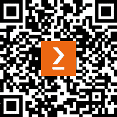

# 前言

系统编程是软件工程中的一个关键知识领域。对于想要编写与操作系统紧密交互的效率高、低级代码的专业人士来说，尤为重要。"使用 Go 的系统编程基础"旨在指导您掌握使用 Go 进行系统编程所需的原则和实践。本书涵盖了从基本系统编程概念到高级技术的广泛主题，为应对现实世界的系统编程挑战提供了一个全面的工具包。

# 本书面向对象

本书专为具有编程基础知识的软件工程师、架构师和开发者量身定制，他们希望深化对系统设计的了解。本书非常适合在工作中解决复杂设计问题或仅仅对通过低级编程提升技能感兴趣的人。需要具备编程概念的基础理解，并至少掌握一种编程语言的经验。

# 本书涵盖内容

*第一章*，*为什么选择 Go？*，概述了 Go 构建高效和高性能系统软件的适用性，为您提供利用 Go 进行系统级开发所需的知识和技能。本章涵盖了 Go 的并发模型、网络和 I/O、低级控制、系统调用、跨平台支持和工具，为构建健壮的系统程序提供了实用的见解和示例。

*第二章*，*刷新并发与并行*，概述了 Go 编程语言中 Goroutines、数据竞争、通道及其相互作用的核心理念。理解这些原则对于实现高效的并发、管理共享资源以及确保有效的 goroutine 间通信至关重要。

*第三章*，*理解系统调用*，概述了系统调用及其实际应用。您将学习如何创建符号链接、解除文件链接以及操作文件名路径。您还将更好地理解 Go 中的 package OS 和 syscall，并学习如何开发和测试 CLI 程序。

*第四章*，*文件和目录操作*，概述了在 Go 中处理文件系统的方法，重点关注检测不安全权限、计算目录大小和识别重复文件。

*第五章*，*与系统事件一起工作*，提供了使用 Go 构建高级和高效系统工具的全面见解，重点关注任务调度、文件监控、进程管理和分布式锁定。

*第六章*，*理解进程间通信中的管道*，探讨了`mkfifo`中的管道概念，以及管道如何与其他程序交互。

*第七章*, *Unix 套接字*，提供了对 UNIX 套接字如何工作、它们的类型以及在 UNIX 和类似 Linux 等 UNIX 操作系统上在 IPC 中作用的了解。 

*第八章*, *内存管理*，专注于垃圾回收背后的机制和策略。我们将探讨 Go 垃圾回收的演变，堆栈和堆内存分配的区别，以及高效内存管理的先进技术。

*第九章*, *性能分析*，涵盖了 Go 应用程序的关键优化技术，包括逃逸分析、基准测试、CPU 分析器和内存分析器。它解释了如何通过逃逸分析提高内存使用，通过基准测试测量和比较代码性能，通过 CPU 分析器识别热点，以及使用内存分析器检测内存泄漏。

*第十章*, *网络编程*，深入探讨了 Go 网络编程的迷人世界。网络对于系统编程至关重要，Go 提供了处理网络通信的强大原语。通过探索 TCP、HTTP 和相关的其他协议，你将获得创建健壮网络应用程序所需的技能。

*第十一章*, *遥测*，深入探讨如何利用行业工具实施有效的遥测实践。从日志到跟踪和指标，你将探索监控应用程序所需的工具和指南。

*第十二章*, *分发您的应用程序*，探讨了使用 Go 模块、持续集成和发布策略分发应用程序的关键概念和实际应用。

*第十三章*, *综合项目* *- 分布式缓存*，指导你完成综合项目。该项目将使用 Go 构建具有 Memcached 或 Redis 等功能的分布式缓存系统。它将涵盖分片策略、驱逐策略、一致性模型和技术选择，同时导航每个决策带来的权衡。

*第十四章*, *高效编码实践*，探讨了 Go 编程中高效资源管理的原则和技术，特别是专注于避免可能导致性能问题和阻碍整体效率的常见陷阱。它深入探讨了使用 Go 标准库优化资源使用的复杂性，为寻求提高 Go 应用程序有效性的开发者提供策略。

*第十五章*, *系统编程保持敏锐*，提供了一个基于真实案例研究的 Go 系统编程的持续学习路径。通过了解 Go 在实际应用程序中的应用，你可以将这些经验应用到自己的项目中。

*附录*，*硬件自动化*，探讨了如何利用各种工具使用 USB 驱动器和蓝牙设备自动化日常任务并监控外围事件。通过了解如何自动化这些流程，您将节省宝贵的时间并提高日常生活中的生产力。

# 要充分利用本书

您需要了解 Golang 的基础知识。

| **软件** | **操作系统要求** |
| --- | --- |
| Golang (1.16+) | Windows, macOS, 或 Linux（最好是 Linux） |

**如果您正在使用本书的数字版，我们建议您亲自输入代码或从本书的 GitHub 仓库（下一节中提供链接）获取代码。这样做将帮助您避免与代码的复制和粘贴相关的任何潜在错误**。

# 下载示例代码文件

您可以从 GitHub 下载本书的示例代码文件 [`github.com/PacktPublishing/System-Programming-Essentials-with-Go`](https://github.com/PacktPublishing/System-Programming-Essentials-with-Go)。如果代码有更新，它将在 GitHub 仓库中更新。

我们还有其他来自我们丰富的图书和视频目录的代码包，可在 [`github.com/PacktPublishing/`](https://github.com/PacktPublishing/) 获取。查看它们吧！

# 使用的约定

本书使用了多种文本约定。

`文本中的代码`：表示文本中的代码单词、数据库表名、文件夹名、文件名、文件扩展名、路径名、虚拟 URL、用户输入和 Twitter 账号。以下是一个示例：“最后，更新 `main` 函数以创建具有指定容量的缓存并测试 TTL 和 LRU 功能。”

代码块设置如下：

```go
func main() {
    cache := NewCache(5) // Setting capacity to 5 for LRU
    cache.startEvictionTicker(1 * time.Minute)
}
```

任何命令行输入或输出都应如下编写：

```go
go run main.go -port=:8080 -peers=http://localhost:8081
```

提示或重要注意事项

看起来像这样。

# 联系我们

我们欢迎读者的反馈。

**一般反馈**：如果您对本书的任何方面有疑问，请通过电子邮件发送至 customercare@packtpub.com，并在邮件主题中提及书名。

**勘误**：尽管我们已经尽一切努力确保内容的准确性，但错误仍然可能发生。如果您在这本书中发现了错误，我们将不胜感激，如果您能向我们报告，请访问 [www.packtpub.com/support/errata](http://www.packtpub.com/support/errata) 并填写表格。

**盗版**：如果您在互联网上发现我们作品的任何形式的非法副本，如果您能提供位置地址或网站名称，我们将不胜感激。请通过电子邮件发送至 copyright@packt.com 并附上材料的链接。

**如果您有兴趣成为作者**：如果您在某个领域有专业知识，并且您有兴趣撰写或为本书做出贡献，请访问 [authors.packtpub.com](http://authors.packtpub.com)。

# 分享您的想法

一旦您阅读了《使用 Go 的系统编程基础》，我们非常乐意听到您的想法！请[点击此处直接进入此书的亚马逊评论页面](https://packt.link/r/1837634130)并分享您的反馈。

您的评论对我们和科技社区非常重要，并将帮助我们确保我们提供高质量的内容。

# 下载本书的免费 PDF 副本

感谢您购买本书！

您喜欢在路上阅读，但无法携带您的印刷书籍到处走？

您的电子书购买是否与您选择的设备不兼容？

别担心，现在每购买一本 Packt 书籍，你都可以免费获得该书的 DRM 免费 PDF 版本。

在任何地方、任何设备上阅读。直接从您最喜欢的技术书籍中搜索、复制和粘贴代码到您的应用程序中。

优惠远不止于此，您还可以获得独家折扣、时事通讯和每日免费内容的访问权限。

按照以下简单步骤获取优惠：

1.  扫描二维码或访问以下链接



[`packt.link/free-ebook/9781837634132`](https://packt.link/free-ebook/9781837634132)

1.  提交您的购买证明

1.  就这些！我们将直接将您的免费 PDF 和其他优惠发送到您的邮箱。

# 第一部分：简介

在这部分，我们将探讨使用 Go 进行系统编程的基础知识。您将了解管理并发和确保高效跨平台开发的最佳实践。本节将更深入地探讨为什么 Go 是构建高性能系统软件的强大选择，以及如何利用其功能来支持现实世界场景。

本部分包含以下章节：

+   *第一章*，*为什么选择 Go？*

+   *第二章*，*刷新并发与并行*
