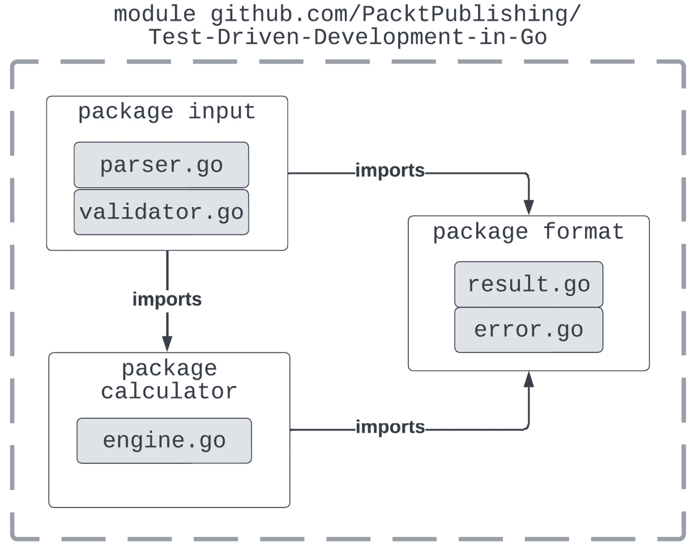
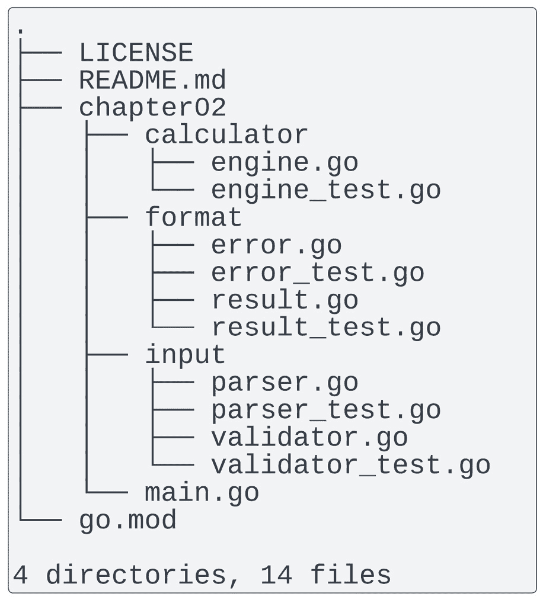
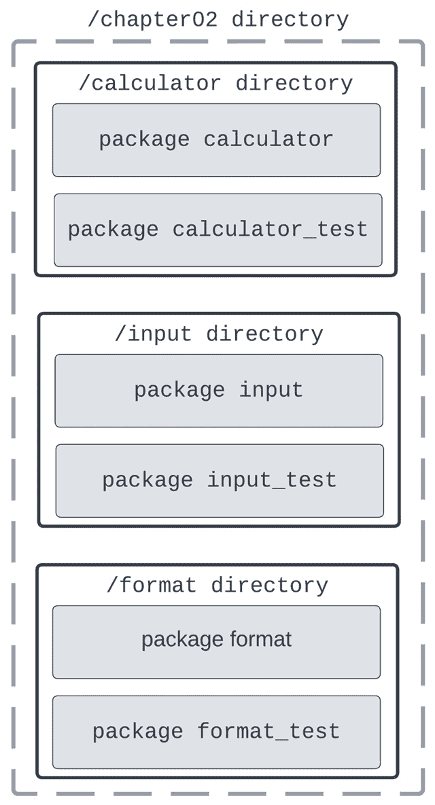
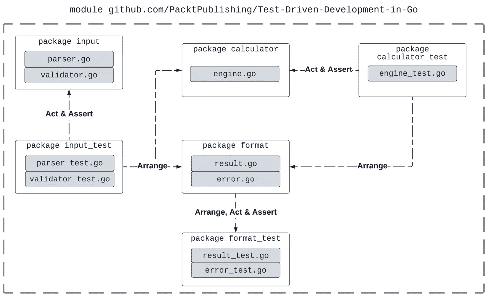
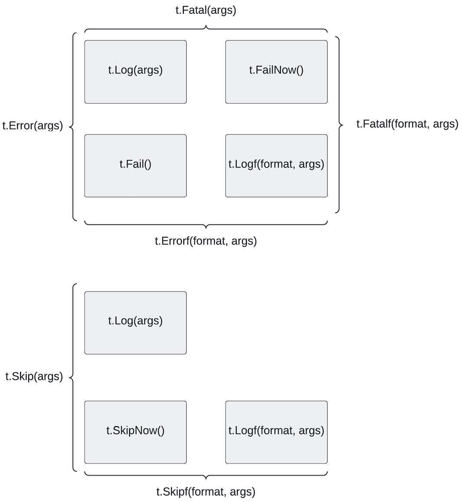
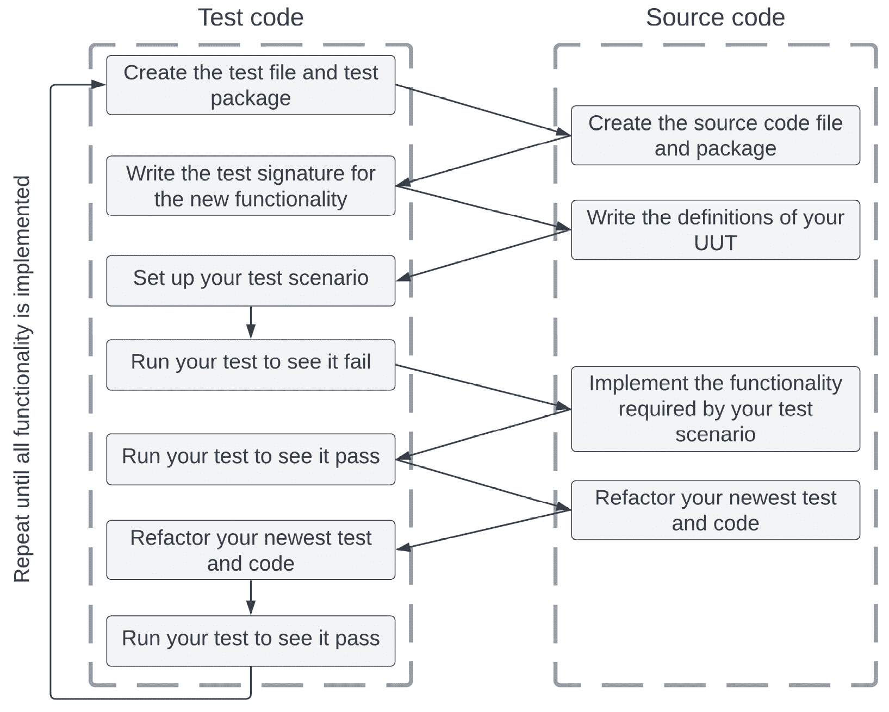
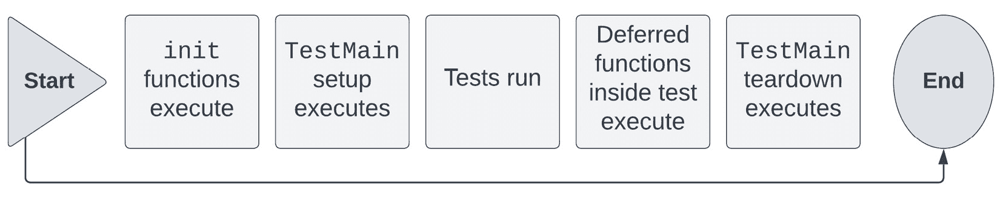
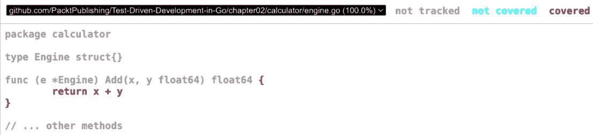

# 第二章：单元测试要素

在上一章中，我们学习了使用 TDD 编写测试与代码的迭代过程，以及它如何适应**敏捷项目管理方法**。我们介绍了**红、绿、重构方法**，它要求频繁地在源代码和测试代码之间切换。

当刚开始使用 TDD 时，遵循编写代码的既定流程可能看起来像是一种人为的工作方式，但随着实践，它很快就会变得自然而然。在本章中，我们将学习所有必要的 Go 基础知识，以便开始将我们所学的一切应用到实践中。我们将开始使用 Go 的`testing`包编写单元测试，重点关注测试编写语法和过程。本章将使我们能够亲身体验到目前为止所探索的所有概念。

正如我们在*第一章*“掌握测试驱动开发”中看到的**测试金字塔**，**单元测试**是最多的。它们用于验证单个单元的功能，在隔离状态下。我们将通过实现单元测试来开始我们对 TDD 和 Go 测试的探索。

Go 编程语言是由谷歌团队创建的，旨在让开发者能够编写简单而高效的软件，他们认为在当时他们所拥有的工具无法实现这一点。这种简洁的原则贯穿于整个语言，包括其测试编写和运行功能。

Go 标准库提供了`testing`包，它为我们编写自动化测试提供了必需的功能。测试只是满足某些约定和签名的函数，这使得开发者能够使用与编写源代码相同的策略和机制来编写代码。

Go 工具链提供了一个单一的`go test`命令来运行我们定义的所有测试。这个简单而强大的命令还提供了运行基准测试的功能，我们可以用它来检查给定组件的性能。

在本章中，我们将涵盖以下主要内容：

+   作为**被测试单元**（**UUT**）的 Go 包

+   使用 Go 测试包的基本原理

+   测试设置和清理

+   将测试分组为包含子测试的套件

+   测试与基准测试之间的区别

# 技术要求

您需要安装**Go 版本 1.19**或更高版本才能运行本章中的代码示例。安装过程在官方 Go 文档[`go.dev/doc/install`](https://go.dev/doc/install)中有描述。

本书包含的代码示例在[`github.com/PacktPublishing/Test-Driven-Development-in-Go/chapter02`](https://github.com/PacktPublishing/Test-Driven-Development-in-Go/chapter02)上公开提供。

# 被测试单元

在*第一章*《掌握测试驱动开发》中，我们讨论了使用**安排-行动-断言**（**AAA**）模式测试的结构。我们还简要提到了安排步骤设置了**被测试单元**（**UUT**）及其依赖项。然后测试会执行并验证 UUT 的功能。

在 Go 中，源代码被组织成包和模块。我们将首先探讨这些是什么以及它们是如何工作的，然后看看测试文件如何融入这个结构。对包的强大功能的深入了解将为我们考虑不仅*如何*编写测试，还要*测试什么*奠定基础。

## 模块和包

如果你已经使用 Go 有一段时间了，你可能熟悉 Go 的**模块系统**，该系统在**Go 1.13**中被引入作为默认的依赖管理解决方案。撰写本文时的最新 Go 版本是**版本 1.19**，因此模块系统已经是一段时间的标准解决方案了。

### 模块

**模块**是一组一起分发和发布的包。模块的名称应该代表其功能，以及在哪里可以找到它。Go 工具链为 GitHub 和 Bitbucket 等流行的代码托管解决方案提供支持，并可以发出从它们的版本控制系统下载依赖项的正确请求。

模块通过在项目目录的根目录放置一个`go.mod`文件来声明。可以通过运行带有模块路径参数的`go mod init`命令来初始化一个新的模块。我们可以通过在终端中运行以下命令来初始化所有代码示例的模块：

```go
$ go mod init "github.com/PacktPublishing/Test-Driven-Development-in-Go"
```

我们提供的模块路径与 GitHub 仓库路径相同。生成的文件只包含两行——一行是模块路径，另一行是所需的 Go 版本：

```go
module github.com/PacktPublishing/Test-Driven-Development-in-Go
go 1.19
```

通常，`go.mod`文件包含以下属性：

+   模块路径

+   项目所需的 Go 版本

+   在构建项目时需要导入的任何外部依赖项

由于我们的项目目前是空的，我们的模块文件没有指定任何外部依赖。标准库的包不需要声明为依赖项。一旦在模块的源代码中使用，此文件将自动更新依赖项。

生成的 go.mod 文件

`go.mod`文件是自动生成的，但不是只读的。然而，作为一个经验法则，你应该避免手动编辑`go.mod`文件。通常，开发者只编辑它来更改版本号，而不是手动更改其条目。你也可以随时使用`go mod init`命令重新创建它。

### 包

虽然模块是捆绑和发布项目的绝佳方式，但如果它们没有任何内部组织或层次结构，大多数生产系统几乎不可能维护或理解。这就是 Go 包发挥作用帮助我们提供这种急需的结构的地方。

Go 源代码组织到 `package` 关键字中。然后，源文件中定义的所有名称都添加到声明的包中。

回顾简单终端计算器示例，见*第一章*，“掌握测试驱动开发”，我们可以为它指定一个包和源代码结构，如图*2**.1*所示：



图 2.1 – 简单终端计算器的模块、包和源文件

模块包含三个包，每个包都包含专门的功能：

+   `input` 包包含输入解析和验证功能。它依赖于 `calculator` 和 `format` 包。

+   `calculator` 包包含所有计算引擎逻辑，为计算器提供的所有操作提供功能。它依赖于 `format` 包。

+   `format` 包包含结果和错误的格式化逻辑。它不依赖于我们现有的任何包。

包命名很重要

包名应该能够代表它们提供的功能，以便其他代码可以引用它们。包名应该简短且描述性强。当与它们提供的类型和函数名称一起使用时，它们也应该是有意义的。

`format` 包位于我们的包层次结构的底部，我们可以立即定义它及其结果格式化功能。查看其 `result.go` 源文件的内容，我们可以看到其简单的定义：

```go
package format
func Result(expression string, result float64) string {
  // implementation code
  return ""
}
```

此包定义了一个 `Result` 函数，该函数输出给定表达式的格式化字符串和结果。我们添加了返回空字符串，以确保代码在准备开始使用 TDD 进行实现之前可以编译。`error.go` 文件以类似的方式定义，为了简洁起见，已省略。

更详细地查看计算器引擎，`engine.go` 源文件的内容可以开始如下：

```go
package calculator
type Engine struct {}
func(e *Engine) Add(x, y float64) float64{
  // implementation code
return 0
}
// ... method declarations
```

我们从 `package calculator` 定义开始，将源文件及其所有定义添加到 `calculator` 包中。然后，我们创建一个 `Engine` 类型，它将包含计算器的所有依赖项。在这些几行之后，我们可以开始定义引擎需要提供的所有操作的方法。`Engine` 类型的 `Add` 方法是加法操作定义的一个示例。

那些细心的读者会注意到类型、方法和函数都是以大写字母定义的。这使得它们成为**导出名称**。

包外的可见性

只有包导出的名称在定义的包外部可见。与其它语言不同，Go 中没有可见性修饰符。在 `format` 和 `calculator` 包的代码示例中，我们需要它们的功能在各自的包外部可用，这就是为什么它们被导出并且以大写字母定义的原因。

一个包可以通过使用 `import` 关键字声明对另一个包的依赖。然后我们可以通过使用包名和**点操作符**（**.**）来限定它们，从而引用导入包的变量、类型和函数。

除了某些例外情况，每个目录只能有一个单个包名。新 `input` 包的声明也将需要创建一个新的目录。具有对 `Engine` 类型依赖的 `Parser` 的声明看起来如下：

```go
package input
import "github.com/PacktPublishing/Test-Driven-Development-in-Go/chapter02/calculator"
type Parser struct {
  engine *calculator.Engine
  validator *Validator
}
func (p *Parser) ProcessExpression(expr string) (*string, error) {
  // implementation code
}
// ... method declarations
```

`Parser` 被声明为 `package input` 的一部分。`Parser` 类型需要 `Calculator` 类型的功能，因此它导入了 `calculator` 包。如前所述，对 `calculator.Engine` 的引用是通过其提供的包和点操作符来限定的。这使编译器知道引用的类型来自导入的包，而不是当前包。

突出的导入路径由三部分组成：

+   包所属的模块：[github.com/PacktPublishing/Test-Driven-Development-in-Go](http://github.com/PacktPublishing/Test-Driven-Development-in-Go)

+   从模块根目录开始的子目录路径：`chapter02`

+   导入包的名称：`calculator`

## Go 包的力量

包是 Go 中的一个强大且核心的概念。它们允许开发者执行以下操作：

+   **分组组件**：当命名得当，包提供了一种简单的方法来理解、唯一分组和记录具有相同功能的多组件。

+   **封装代码**：由于只有导出方法对外部代码可见，因此包是 Go 中最重要的封装机制。它们为开发者提供了对包外部可用的精确控制。

+   **重用代码**：包为我们提供了模块化，通过提供用户导入的方式，使我们能够在多个地方重用代码。利用当前模块外部的代码的能力允许开发者共享相同的解决方案，而不必重新发明轮子。

+   **轻松管理依赖项**：Go 的模块系统遵循**语义版本控制**（**SemVer**），它使用三个主要数字来管理导入的依赖项：主版本、次要版本和补丁版本。这允许开发者将依赖项固定到特定版本，并且可以轻松地知道何时需要升级到较新版本。

现在我们已经了解了模块和包的基本原理，让我们将注意力转向测试在代码库及其包中的位置。请注意，`Engine`和`Parser`自定义类型的方法还没有实现任何代码：这是因为测试驱动开发（TDD）的全部内容就是先编写测试！

将包作为 API

由于它们的封装和模块化特性，包使得开发者能够使用与设计外部 API 时类似的技术来构建和结构化他们的代码，通过选择他们想要提供给外部用户的签名和函数。

## 测试文件命名和放置

与其他编程语言不同，在 Go 语言中，测试文件与源代码位于同一目录下。所有测试文件都必须以`_test.go`后缀结尾。Go 的测试运行器会扫描代码库中的这些测试文件并相应地运行它们。测试运行器是 Go 工具链的一部分，可以通过`go test`命令调用。

*图 2.2* 展示了迄今为止讨论的简单终端计算器的目录结构：



图 2.2 – 简单终端计算器的目录结构

本章将要讨论的所有代码都可以在对应本书的专用仓库的`chapter02`目录中找到。然后，在这个目录内部，我们有三个进一步的目录，分别是`format`、`calculator`和`input`，每个目录都包含其源代码文件和相应的测试文件。

测试文件命名

虽然测试文件需要以`_test.go`后缀结尾，但与相应源代码文件匹配的名称并不强制执行。然而，强烈建议您使用源文件名，然后添加测试后缀。这将确保在按字典顺序排序时，两个文件保持在一起。

源文件和测试文件直接相邻，位于同一目录下，这使得开发者在练习测试驱动开发（TDD）时，在编写实现代码和测试代码之间切换变得更加容易。一些编辑工具甚至可以通过键盘快捷键完成这项操作！

## 额外的测试包

尽管测试文件与相应的源文件具有相同的名称，并且位于同一目录下，但包结构会讲述一个不同的故事。我们之前提到，除了一些例外，每个目录只能声明一个包。测试文件就是这些例外之一。

测试文件允许声明一个额外的测试包，与源文件包匹配，并在其后添加`_test`。从可见性的角度来看，这个测试包与其他任何包相同，并且需要导入它希望访问的包。它也只会访问其导入包的导出名称。

将测试包作为推荐实践

在 Go 中，没有强制使用专用`_test`包，但这是推荐的。只要可能，你应该在专用测试包中声明你的测试。

*图 2.3*描述了简单终端计算器中测试包的独立定义：



图 2.3 – 简单计算器的包和目录结构

专用测试包与源包位于同一目录下，实现了源代码和测试代码的完全分离。使用专用测试包有以下优点：

+   **防止脆弱的测试**：仅允许访问导出功能，不会让测试代码看到包的内部，例如状态变量，否则会导致结果不一致。

+   **分离测试和核心包依赖**：测试包允许测试导入所需的任何依赖，而不会将这些依赖添加到核心包中。在实践中，测试代码通常会拥有自己的专用验证器和功能，我们不希望这些对生产代码可见。测试包是一种无缝保证分离的方式。

+   **允许开发者与自己的包集成**：我们之前提到，包允许开发者将内部代码构建成小的 API。从专用测试包编写测试可以让开发者看到与外部接口集成的简便性，确保代码可维护。

*图 2.4*显示了更新后的模块、包、源文件和测试文件，现在使用的是`_test`包：



图 2.4 – 简单终端计算器的模块、包、源文件和测试文件

让我们用我们从*第一章*，“掌握测试驱动开发”中了解到的 AAA 模式来描述包之间的依赖关系。**安排**和**断言**步骤在 UUT 上执行，并且方便地在相应命名的包中定义：

+   `format`包没有对其他包的依赖。因此，`format_test`包在`format`包上执行所有三个步骤。

+   `calculator`包依赖于`format`包。因此，`calculator_test`包安排了来自`format`包的依赖。然后，它在`calculator`包上执行操作和断言步骤。

+   最后，`input`包依赖于`calculator`和`input`包。因此，`input_test`包安排了由`calculator`和`input`包提供的`input`包的依赖。

本节为您介绍了 Go 模块系统，并讨论了如何在整体代码库中放置和命名测试。现在，让我们看看如何在 Go 中实现测试。

# 使用测试包

标准库提供了`testing`包，其中包含我们编写和运行测试所需的要素。在本节中，我们将探讨如何使用它，并开始应用它，以便我们可以为我们的简单终端计算器示例编写测试。

## 测试包

`testing` 包为测试 Go 代码提供支持。所有测试代码都必须导入它，因为这是与测试运行器交互的方式。乍一看，`testing` 包似乎非常简单，但它与 Go 的语言设计相匹配。包应该小巧、专注，并且依赖项有限。这应该使它们能够通过相对简单的测试库轻松进行测试。

这里有一些我们将使用的重要类型，来自`testing`库：

+   `testing.T`：所有测试都必须使用此类型与测试运行器交互。它包含声明失败测试、跳过测试和并行运行测试的方法。在本节中，我们将查看并开始使用这些方法。

+   `testing.B`：类似于测试运行器，此类型是 Go 的**基准测试**运行器。它具有失败测试、跳过测试和并行运行基准测试的相同方法。基准测试是特殊类型的测试，用于验证代码的性能，而不是其功能。我们将在本章后面探索基准测试。

+   `testing.F`：此类型用于设置和运行`testing.T`类型，以提供测试运行功能。模糊测试是特殊类型的测试，使用随机输入来查找代码中的边缘情况和错误。我们将在*第十章*，*测试边缘情况*中进一步探索模糊测试。

测试包在所有测试中使用

`testing`包必须由所有测试导入，因为这是与 Go 的测试运行器交互的唯一方式。如前所述，测试文件名必须以`_test.go`后缀结尾，但只有使用`testing`包的测试才会运行。测试还必须满足标准测试签名，这将在下一节*使用测试包*中解释。

现在，让我们更详细地看看`testing.T`类型，因为它将是本章探索的重点。

*图 2**.5* 总结了我们将要讨论的一些方法：



图 2.5 – testing.T 类型的日志记录、失败和跳过方法

它公开了以下用于日志记录、跳过和失败测试的方法，这些方法非常重要：

+   `t.Log(args)`：在测试执行完毕后，将给定的参数打印到错误日志中。

+   `t.Logf(format, args)`: 它与 `t.Log` 方法的功能相同，但允许在打印之前格式化参数。

+   `t.Fail()`: 这将当前测试标记为失败但继续执行直到结束。

+   `t.FailNow()`: 这将当前测试标记为失败并立即停止当前测试的执行。下一个测试将在继续套件时运行。

+   `t.Error(args)`: 这与调用 `t.Log(args)` 和 `t.Fail()` 等效。此方法使得将错误记录到错误日志并标记当前测试为失败变得方便。

+   `t.Errorf(format, args)`: 这与调用 `t.Logf(format, args)` 和 `t.Fail()` 等效。此方法使得在单个调用中失败一个测试、格式化和打印错误行变得方便。

+   `t.Fatal(args)`: 这与调用 `t.Log(args)` 和 `t.FailNow()` 等效。此方法使得在单个调用中失败测试并打印错误行变得方便。

+   `t.Fatalf(format, args)`: 这与调用 `t.Logf(format, args)` 和 `t.FailNow()` 等效。此方法使得在单个方法调用中失败测试并打印错误行变得方便。

+   `t.SkipNow()`: 这将当前测试标记为跳过并立即停止其执行。注意，如果测试已经被标记为失败，则它保持失败状态，而不是跳过。

+   `t.Skip(args)`: 这与调用 `t.Log(args)`，然后调用 `t.SkipNow()` 等效。此方法使得在单个调用中跳过测试并打印错误行变得方便。

+   `T.Skipf(format, args)`: 这与调用 `t.Logf(format, args)`，然后调用 `t.SkipNow()` 等效。此方法使得在单个调用中跳过测试、格式化和打印错误行变得方便。

通常，开发者在编写测试时使用前面提供的便利方法，而不是显式调用 `t.Fail()`、`t.FailNow()` 或 `t.SkipNow()`。从现在开始，我们将开始编写测试代码时使用它们。

另一件你可能想知道的事情是 `testing` 包是否提供任何断言功能。它不提供任何内置断言，因此我们需要自己比较值。我们将在 *第三章*，*Mocking 和断言框架* 中进一步探讨第三方断言库。

## 测试签名

`testing` 包用于编写单元测试，这些测试放在它们自己的测试文件中。Go 测试是满足以下签名的函数：

```go
func TestName(t *testing.T) {
  // implementation
}
```

此测试签名突出了 Go 测试的以下要求：

+   测试是名称以 `Test` 开头的导出函数。

+   测试名称可以有一个附加后缀，指定测试覆盖的内容。后缀也必须以大写字母开头，正如我们在测试签名中看到的 `Name` 所指定的那样，它同时作为测试名称。

+   测试必须接受一个`*testing.T`类型的单个参数。正如我们迄今为止所解释的，这将是如何测试与测试运行器交互的方式。您可以随意命名测试参数，但 Go 开发者通常使用`t`来表示它。

+   测试不得有返回类型。

Go 测试只是函数

正如我们所看到的，测试只是满足特定签名的函数。Go 测试工具扫描代码库中`_test.go`文件中的这些特殊函数，并相应地运行它们。

在这些测试函数内部，我们可以使用 AAA 模式定义和实现我们的测试代码。您应该保持测试范围的小型化，更倾向于编写多个测试，而不是编写一个大型、可能脆弱的测试。

就像包名一样，测试名称非常重要，因此我们需要给予它们一些特别的考虑。拥有有效命名的测试可以为开发者带来一些重要的优势：

+   **文档和理解**：一套有效命名的测试将帮助新来者理解特定代码应该如何工作。由于它们易于更改，它们还允许您在多种条件下探索代码的行为。

+   **重构支持**：测试名称设定了测试的意图；然后，其实施简单地执行它。一旦代码被重构，测试实现可能会改变，但测试的意图，通过其名称传达，仍然保持不变。命名良好的测试可以支持代码重构，这可能会需要更改测试实现/执行。我们将在*第七章* *Go 中的重构*中进一步讨论代码重构策略。

+   **一致性**：在整个代码库中为测试命名和结构设置一个标准，将使您更容易了解预期内容，减少阅读代码时的认知负荷。

除了我们刚刚看到的特殊签名之外，Go 不强制执行任何其他命名标准。Go 社区的一致意见是，它们应该是易于理解和简洁的。Go 标准库将测试与它们测试的函数名称（UUT）相关联。测试名称简单地遵循`TestUnitUnderTest`结构。例如，对`Add`函数的测试将被命名为`TestAdd`。

另一种常见的方法是使用**行为驱动开发**（**BDD**）风格的命名方法。我们将在*第五章* *执行* *集成测试*中详细探讨 BDD 测试。

在这种命名方法中，测试名称遵循`TestUnitUnderTest_PreconditionsOrInputs_ExpectedOutput`的结构。例如，如果测试一个函数，测试将被命名为`TestAdd_TwoNegativeNumbers_NegativeResults`，如果它测试两个负数相加。

虽然 BDD 风格的命名模式更加精确，但它违背了 Go 的核心原则——简洁性。我们将使用更简单的方法：将测试命名为其 UUT（单元待测）的名称。我们将在本章后面看到如何使用子测试实现额外的精确性，包括前置条件和预期输出。

## 运行测试

Go 工具链中的一个命令是 `go test` 命令。我们之前提到过，它是 Go 的测试运行器，我们将使用它来执行测试。我们将在本节中更详细地介绍如何使用它。

在 `_test.go` 文件中，测试运行器会特别处理三种类型的函数：

+   `Test`。我们在本节中详细介绍了测试函数。

+   `Benchmark`。我们将在本章的**测试与基准测试的区别**部分介绍这些内容。

+   `Example`。这些内容超出了本书的讨论范围。

测试运行器将寻找以 `_test.go` 结尾的文件，将它们构建成自己的包，然后将它们链接到测试二进制文件中。

`go test` 命令的输出将打印出已执行测试的所有测试失败到标准输出。你可以添加一个 `–v` 标志，它是详细输出的简称，以使其打印出所有测试的名称和执行时间，包括通过测试。

测试将按字典顺序执行和输出。以下是我们的 `engine_test.go` 的输出，其中包含在 `engine.go` 中实现的计算器操作的测试：

```go
$ go test ./...
=== RUN   TestAdd
    engine_test.go:7: Add(2,3) incorrect, got: 2, want: 5.
--- FAIL: TestAdd (0.00s)
FAIL
exit status 1
FAIL    github.com/PacktPublishing/Test-Driven-Development-in-Go/chapter02/calculator   0.278s
```

测试失败在输出中以 `FAIL` 关键字标记，任何错误消息都会打印到标准输出。在我们的例子中，我们有一个失败的测试：`TestAdd`。正如我们在上一节中看到的，我们可以使用 `testing.T` 类型提供的各种方法来打印信息性错误消息并使测试失败，我们可以在所有测试的测试签名参数中访问它。

在测试输出的末尾，我们可以看到整个测试运行的输出结果以及运行时间。我们还可以看到每个测试的运行时间。

测试运行器支持两种运行模式：

+   当命令没有包指定时，它将构建并运行当前目录中的所有测试。这被称为 `go test –v`。

+   当命令有包指定时，它将构建并运行所有匹配特定包参数的测试。这被称为**包列表模式**。开发者通常在大型项目中使用此模式运行测试，因为使用本地目录模式在目录之间切换并运行每个目录中的测试可能会很繁琐。

我们可以通过提供以下属性轻松指定要运行的测试：

+   `go test engine_test` 将从项目目录中的任何位置运行 `engine_test` 包中的测试。

+   `go test ./...` 将运行项目中的所有测试，无论从哪里运行。

+   `go test ./chapter02` 将运行当前路径下 `chapter02` 子目录中的所有测试，但不会遍历到更深的嵌套目录。

+   `–run` `go test –run "^engine"` 将运行以单词 `engine` 开头的所有包。也可以在测试名称旁边提供子目录路径。

+   `–run` `go test –run TestAdd` 将仅运行指定的测试。也可以在测试名称旁边提供子目录路径。

Go 测试运行器可以缓存成功的测试结果，以避免在代码未更改的情况下重新运行测试而浪费资源。在本地目录模式下运行时，默认禁用缓存成功的测试结果，但在包列表模式下启用。

如您所见，触发包列表模式的 `go test –v ./...` 命令的输出，将缓存的结果在其对应输出行上标记为 `(cached)`：

```go
$ go test -v ./... === RUN   TestAdd
    engine_test.go:7: Add(2,3) incorrect, got: 2, want: 5.
--- FAIL: TestAdd (0.00s)
FAIL
FAIL    github.com/PacktPublishing/Test-Driven-Development-in-Go/chapter02/calculator   0.112s
=== RUN   TestParser
--- PASS: TestParser (0.00s)
PASS
ok      github.com/PacktPublishing/Test-Driven-Development-in-Go/chapter02/input        (cached)
FAIL
```

注意，只有成功的测试运行可以被缓存。测试失败将每次运行，直到通过，此时它们可以被缓存。

## 编写测试

到目前为止，我们已经检查了包的结构，测试文件如何融入其结构，以及熟悉了 Go 的测试包和测试签名。现在，让我们将我们所学的一切应用到实践中。

在我们了解如何在 Go 中测试代码之后，我们可以通过更具体的步骤来扩展 **红、绿、重构** 方法。*图 2.6* 显示了 Go 中针对新功能扩展的 TDD 流程：



图 2.6 – Go 中扩展的 TDD 流程

我们可以用以下步骤来描述测试编写过程：

1.  `_test.go` 文件对应于您将在新目录中实现的测试。这将确保您有一个地方可以开始编写测试代码，同时编写实现代码。如前所述，虽然 Go 不强制使用外部测试包，但您应该尽可能使用它。

1.  `.go` 文件会立即编译。此时，您将开始反思您代码的结构，就像我们在本章开头的简单终端计算器中所做的那样。

1.  **为新功能编写测试签名**：在测试文件中，您可以创建新的测试，以您将要测试的 UUT 命名。测试签名还将要求您导入测试包，为您编写测试代码做好准备。

1.  **编写您的 UUT 定义**：在您之前为空的源文件中，编写您打算测试的自定义类型、方法和函数的定义。这将使您能够确定 UUT 的签名或 API，然后相应地构建测试。正如我们在本章开头的简单终端计算器中所做的那样，根据您的方法签名返回空值或零值，以确保您的代码可以编译。

1.  **设置您的测试场景**：从最简单的测试用例开始，使用 AAA 方法编写测试，调用您 UUT 之前定义的签名。这也是我们创建签名并返回占位符值以使代码编译的原因。

1.  在您新包的目录中执行`go test`命令。

1.  **实现测试场景所需的功能**：回到您的 UUT，编写足够的代码来满足您最新的测试场景。这可能需要更改一些您的占位符代码。

1.  执行`go test`命令。您的新测试现在应该通过。

1.  **重构最新的测试和代码**：寻找您可以改进源代码和测试代码的地方。改进应该是频繁且小的，所以请确保花时间审查您的代码。

1.  **运行测试以查看它通过**：在重构后，您的新测试应该继续通过。

1.  重复所有这些步骤，直到所有功能都实现。您将根据需要定义 UUT 签名和测试，从最简单的功能开始，逐步推进。

如预期的那样，TDD 过程需要在源代码和测试代码之间进行频繁的更改。测试运行应该首先失败，然后在我们实现和重构源代码时通过。

## 用例 – 实现计算器引擎

让我们使用我们建立的工作习惯来编写和实现我们在`engine.go`中定义的计算器功能。这也会给我们一些使用`testing`包的实践经验。

### 第一步 – 创建测试文件和测试包

正如我们在*图 2.2*中看到的，我们将创建一个名为`calculator`的目录，我们将放置相应的计算器引擎文件。

我们将创建`engine_test.go`测试文件并声明外部`calculator_test`包：

```go
package calculator_test
```

到目前为止，测试文件只包含一行，并且没有编译错误。

### 第二步 – 创建源代码文件和包

在同一目录中，我们必须创建`engine.go`文件并声明计算器包，该包与已声明的外部测试包相匹配：

```go
package calculator
```

到目前为止，源代码文件也只包含一行，并且没有编译错误。

### 第三步 – 为新功能编写测试签名

我们将从测试和实现计算器的加法功能开始，因为这个函数最简单。在`engine_test.go`文件中，添加一个与 Go 测试签名对应的新测试，并导入`testing`包：

```go
package calculator_test
import "testing"
func TestAdd(t *testing.T) {
}
```

如其名称和包所示，我们将测试`calculator`包的`Add`函数或方法。仅仅这几行代码，我们已经有了一个很好的指示，这个测试将涵盖什么。这是一个非常强大的机制。

### 第四步 – 编写您的 UUT 的定义

在这里，我们将把待测单元（UUT）的存根定义添加到源文件中，以便我们可以在新编写的代码中调用它们。虽然这稍微偏离了编写没有对应测试代码的代码，但它将使我们更容易在任何代码编辑器中从测试代码中引用代码。在`engine.go`文件中，我们必须为`Engine`自定义类型和`Add`方法添加存根：

```go
package calculator
type Engine struct {}
func(e *Engine) Add(x, y float64) float64{
  return 0
}
```

我们返回一个虚拟值`0`以确保代码可以继续编译。

### 第 5 步 – 设置你的测试场景

回到测试代码，我们将向`TestAdd`函数添加一个简单的测试场景，该函数目前为空。在`engine_test.go`文件中，我们将添加使用 AAA 模式编写的测试代码，如每个步骤对应的注释所示：

```go
package calculator_test
import (
  "testing"
  "github.com/PacktPublishing/Test-Driven-Development-in-Go/chapter02/calculator"
)
func TestAdd(t *testing.T) {
  // Arrange
  e := calculator.Engine{}
  // Act
  got := e.Add(2.5,3.5)
  //Assert
  if got != 6.0 {
    t.Errorf("Add(%.2f,%.2f) incorrect, got: %.2f, want:
      %.2f", 2.5, 3.5, got, 6.0)
  }
}
```

在安排步骤中，`TestAdd`创建了一个`calculator.Engine`实例，这需要在测试文件中导入计算器包。

在行为步骤中，我们在创建的`Engine`实例上调用`Add`方法，并传递我们将在此步骤中使用的两个输入。

最后，在断言步骤中，我们使用`if`语句比较实际值和预期值，并在它们不匹配时使用`t.Errorf`调用测试失败。

### 第 6 步 – 运行测试以查看是否失败

从一个失败的测试开始对于 TDD 哲学非常重要，因为它确保我们的测试实际上正在运行并且不会错误地通过。我们可以运行我们的测试：

```go
$ go test -run TestAdd ./chapter02/calculator -v
--- FAIL: TestAdd (0.00s)
    engine_test.go:20: Add(2.50,3.50) incorrect, got: 0.00, want: 6.00
FAIL
exit status 1
FAIL    github.com/PacktPublishing/Test-Driven-Development-in-Go/chapter02/calculator   0.198s
```

测试失败了，并且我们的信息性错误消息被打印到终端。由于我们的方法目前只返回虚拟值，测试预期会失败。至此，我们已经完成了红、绿、重构方法中的**红**阶段。

### 第 7 步 – 实现测试场景所需的函数

在放置失败的`TestAdd`之后，现在是时候实现使其通过所需的函数了。在`engine.go`文件中，我们必须将`Add`方法更改为移除返回的虚拟值：

```go
func(e *Engine) Add(x, y float64) float64{
  return x + y
}
```

`Add`方法现在将使用输入参数并返回它们的加法结果。

### 第 8 步 – 运行测试以查看是否通过

正如在第 6 步 – 运行测试以查看是否失败中一样，我们将运行测试：

```go
$ go test -run TestAdd ./chapter02/calculator -v 
=== RUN   TestAdd
--- PASS: TestAdd (0.00s)
ok      github.com/PacktPublishing/Test-Driven-Development-in-Go/chapter02/calculator   0.109s
```

测试现在通过了，并且我们已经验证了我们的代码满足测试要求。至此，我们已经完成了红、绿、重构方法中的**绿**阶段。

### 第 9 步 – 重构你的最新测试和代码

这一步不一定发生。我们可以通过提取变量来改进我们的测试代码，这些变量允许我们清理测试代码，消除我们重复硬编码值的需求：

```go
func TestAdd(t *testing.T) {
  // Arrange
  e := calculator.Engine{}
  x, y := 2.5,3.5
  want := 6.0
  // Act
  got := e.Add(x,y)
  //Assert
  if got != want {
    t.Errorf("Add(%.2f,%.2f) incorrect, got: %.2f, want: %.2f",             x, y, got, want)
 }
}
```

在安排部分，我们现在声明了三个变量用于我们的输入和预期输出。我们在整个测试中使用这些变量，将它们传递给 UUT 以及格式化的错误消息。

### 第 10 步 – 重新运行测试以查看是否通过

正如在第 8 步 – 运行测试以查看是否通过中一样，我们必须运行测试：

```go
$ go test -run TestAdd ./chapter02/calculator -v 
=== RUN   TestAdd
--- PASS: TestAdd (0.00s)
ok      github.com/PacktPublishing/Test-Driven-Development-in-Go/chapter02/calculator   0.196s
```

测试现在通过了，并且我们已经验证了我们的重构没有破坏任何已实现的功能。至此，我们已经完成了红、绿、重构方法中的**重构**阶段。

这些步骤现在可以重复用于简单终端计算器的所有其他操作。你可以继续实现它们，这将使你能够在 Go 中使用 TDD 进行实践。接下来，我们将探讨如何通过测试设置和清理来简化我们的测试编写过程。

# 测试设置和清理

我们通过利用外部测试包和`testing.T`类型编写了我们的第一个测试和源代码示例。这对于我们的简单示例来说效果很好，但随着我们开始增加测试并编写更多测试，重复相同的测试设置和清理可能会变得繁琐。在本节中，我们将探讨`testing`包为我们提供的功能，以简化这一过程。

## 测试主方法

`TestMain`. 这是一个经常被低估的功能，但在设置和清理代码方面提供了极大的灵活性。这个测试的签名如下：

```go
func TestMain(m *testing.M) {
  // implementation
}
```

与其他测试不同，这个测试的名称是固定的，它接受`*testing.M`类型作为其唯一参数，而不是像其他测试那样接受`*testing.T`。一旦你覆盖了它，这个方法中的代码将为你提供更多控制测试运行的方式。`TestMain`方法将在本包中的其他任何测试之前运行。

每个包一个`TestMain`函数

由于在包内部名称需要唯一，你将只能在每个包中定义一个`TestMain`函数。你应该注意，这个方法将控制给定包中所有测试的运行方式，而不仅仅是给定文件中的测试。

`testing.M`类型比`testing.T`类型小得多，它公开了一个名为`Run()`的方法，允许我们运行给定包中的测试，并返回一个退出代码。

这个函数的使用很简单：

```go
func TestMain(m *testing.M) {
  // setup statements
  setup()
  // run the tests
  e := m.Run()
  // cleanup statements
  teardown()
  // report the exit code
  os.Exit(e)
}
```

以下代码示例概述了一个简单的配方：

1.  `TestMain`**签名**：在你的测试文件中写下正确的测试名称和签名。一般来说，你应该尽可能将这个定义放在文件的开头部分。

1.  `setup()`函数和调用它而不是直接将代码写入测试函数中。这将有助于提高测试文件的可读性。所有这些语句将在测试执行之前运行。

1.  `Run()`和将此函数返回的退出值保存在一个变量中，在我们的代码示例中命名为`e`。此时，测试将运行，退出值将报告测试是否失败。

1.  `Run()`方法。我还建议创建一个名为`teardown`的单独函数，而不是直接将代码写入`TestMain`代码块中。所有这些语句将在测试执行后运行。

1.  `os.Exit`函数。如果你忘记在主函数中添加这部分，你的测试运行器可能会报告错误。

我们在我们的计算器示例中实现了相同的配方，在`engine_test.go`文件中定义了`TestMain`函数和`TestAdd`：

```go
func TestMain(m *testing.M) {
  // setup statements
  setup()
  // run the tests
  e := m.Run()
  // cleanup statements
  teardown()
  // report the exit code
  os.Exit(e)
}
func setup() {
  log.Println("Setting up.")
}
func teardown() {
  log.Println("Tearing down.")
}
```

`setup()`和`teardown()`函数只是简单地打印两行到终端。运行测试会显示以下输出：

```go
$ go test -run TestAdd ./chapter02/calculator -v 
2022/08/14 11:02:51 Setting up.
=== RUN   TestAdd
--- PASS: TestAdd (0.00s)
PASS
2022/08/14 11:02:51 Tearing down.
ok      github.com/PacktPublishing/Test-Driven-Development-in-Go/chapter02/calculator   0.345s
```

从测试输出中我们可以看到，设置和拆解日志行是在测试运行输出之前和之后打印的。

## 初始化函数

你可以使用的第二个选项来确保测试设置正确运行是使用`init`函数。在单元测试中，通常不需要拆解逻辑，只需要设置逻辑。在这些情况下，如果你只是想确保在测试之前运行某些逻辑，你可能想选择比`TestMain`更简单的方法。

与`TestMain`方法不同，`init`函数并不特别限制于测试代码。`init`函数的签名如下：

```go
func init() {
  // implementation
}
```

`init`函数的名称是固定的，它不接受任何参数。这个函数将在任何主函数之前被调用，无论这个主函数是在源代码中还是在特殊的测试运行程序主函数中。

每个包中可以有多个初始化函数

与其他名称不同，每个包允许有多个`init`函数。然而，你应该注意，它们都会在主运行程序之前被调用。当在同一个文件中定义多个`init`函数时，它们会按照定义顺序运行。另一方面，当它们在多个文件中定义时，它们会按照文件名的字典顺序运行。

我们将在`engine_test.go`文件中定义一个`init`函数，与`TestMain`和`TestAdd`一起：

```go
func init() {
  log.Println("Init setup.")
}
```

`init()`函数只是简单地打印另一行到终端。运行测试会显示以下输出：

```go
$ go test -run TestAdd ./chapter02/calculator -v 
2022/08/14 11:57:38 Init setup.
2022/08/14 11:57:38 Setting up.
=== RUN   TestAdd
--- PASS: TestAdd (0.00s)
PASS
2022/08/14 11:57:38 Tearing down.
ok      github.com/PacktPublishing/Test-Driven-Development-in-Go/chapter02/calculator   0.252s
```

从测试运行输出中我们可以看到，`init`设置是在`TestMain`设置之前运行的。在执行任何其他代码之前，`init`函数中定义的日志行被打印出来。

## 延迟函数

我们可以利用`init`函数，这是一个不仅存在于测试代码中的结构。

在 Go 中，使用`defer`语句声明延迟函数。一旦应用于函数调用，该函数将在周围函数调用完成后执行，无论是成功还是使用 panic。例如，我们可以这样延迟拆解函数：

```go
defer teardown()
```

延迟函数定义

我们可以将`defer`语句应用于命名函数或内联定义的**匿名函数**。在 Go 中，将延迟函数定义在封装函数的顶部是惯例。这将确保在发生错误并停止延迟之前，函数将被延迟。

我们迄今为止看到的方法由 Go 语言构造组成，但它们在定义时可能会变得繁琐，并且有创建包级更改的缺点。延迟函数为我们提供了细粒度的控制，只对调用它们的测试进行更改。然而，缺点是我们需要记住将它们添加到每个测试中，并且我们只能使用这种方法进行拆卸，而不是设置逻辑。在开始编写更多测试时，你应该权衡每种机制的优势和劣势。

让我们修改`engine_test.go`文件中的`TestAdd`函数，添加一个延迟函数，同时保持该测试文件中已定义的`TestMain`和`init`函数不变：

```go
func TestAdd(t *testing.T) {
  defer func ()  {
  log.Println("Deferred tearing down.")
}()
  // Arrange
  e := calculator.Engine{}
  x, y := 2.5, 3.5
  want := 6.0
  // Act
  got := e.Add(x, y)
  //Assert
  if got != want {
    t.Errorf("Add(%.2f,%.2f) incorrect, got: %.2f, want:
      %.2f", x, y, got, want)
  }
}
```

延迟函数只是简单地打印另一条日志行到终端。运行测试会显示以下输出：

```go
$ go test -run TestAdd ./chapter02/calculator -v 
2022/08/14 12:25:49 Init setup.
2022/08/14 12:25:49 Setting up.
=== RUN   TestAdd
2022/08/14 12:25:49 Deferred tearing down.
--- PASS: TestAdd (0.00s)
PASS
2022/08/14 12:25:49 Tearing down.
ok      github.com/PacktPublishing/Test-Driven-Development-in-Go/chapter02/calculator   0.215s
```

如我们从测试运行输出中可以看到，延迟拆卸调用是在`TestMain`函数的拆卸步骤之前执行的。这是由于延迟函数的调用顺序所致。

*图 2**.7*展示了所有我们查看的设置和拆卸机制将执行的顺序总结：



图 2.7 – 设置和拆卸机制的顺序总结

顺序验证了我们通过终端输出看到的内容：

1.  测试是通过`go test`命令启动的，因为我们迄今为止已经习惯了这样运行它们。

1.  `init`函数在测试的临时主程序之前执行。

1.  一旦测试准备就绪要执行，`TestMain`函数开始，并执行其设置函数。

1.  然后，通过从`TestMain`中调用`m.Run()`来运行测试。

1.  一旦所有测试都已运行，测试范围内定义的延迟函数将被执行。

1.  一旦测试及其函数退出，`TestMain`函数的拆卸函数将被执行。

1.  最后，测试以从`m.Run()`调用返回的退出值结束。

当我们开始考虑编写更大规模的测试时，我们还需要一种方法来根据更小的测试范围和不同的场景来分离测试。在下一节中，我们将看到如何使用**子测试**来实现这一点。

# 使用子测试操作

在 TDD（测试驱动开发）中，测试范围应该小，结果应该易于理解。我们在*第一章*中探讨了 TDD 的最佳实践，即*掌握测试驱动开发*。为了实现这些最佳实践，我们需要在测试场景之间进行分离。

让我们考虑一下我们迄今为止一直在使用的`TestAdd`函数的例子。它目前测试的是两个正数的相加，但我们将扩展它以涵盖负数输入。根据我们迄今为止的知识，我们有两种选择：

1.  `TestAdd` **用于验证新场景**：这种方法会使断言步骤变长，但它有重用先前步骤的优势。

1.  `TestAdd`本身，但它有一个缺点，那就是我们必须重新定义和重新执行现有测试的安排和执行步骤。

如果我们选择第二个选项，我们就必须给新的测试取一个不同的名字。我们将命名为`TestAdd_Negative`，以表明在这个测试中将测试负输入。然而，这并不符合现有`TestAdd`函数的命名规范，因此我们必须将现有测试重命名为`TestAdd_Positive`。正如预期的那样，运行测试将在不同的行上输出结果：

```go
$ go test -run "^TestAdd" ./chapter02/calculator -v 
=== RUN   TestAdd_Positive
--- PASS: TestAdd_Positive (0.00s)
=== RUN   TestAdd_Negative
--- PASS: TestAdd_Negative (0.00s)
PASS
ok      github.com/PacktPublishing/Test-Driven-Development-in-Go/chapter02/calculator   0.266s
```

我们希望有一个小型的自包含测试，但继续定义新的测试会很麻烦，可能需要为每个新的边缘情况或测试场景更改现有测试的名称。Go 为我们提供了一个更优雅的解决方案来解决这个问题，我们将在下一节中介绍。

## 实现子测试

`testing.T`类型提供了`Run(name string, f func(t *testing.T)) bool`方法，它接受两个参数：

+   一个`string`类型的名称参数

+   一个接受单个`*testing.T`类型参数的函数

一旦传递给`Run`方法，测试运行器将作为当前测试的子测试运行该函数，允许我们创建具有各自分离的测试层次结构。由于封装测试和子测试共享同一个`testing.T`实例，子测试的失败将导致封装测试失败。这种行为使我们能够根据需要创建多层测试层次结构。以添加正负输入作为测试场景为例，我们可以重构`TestAdd`以利用子测试的力量：

```go
func TestAdd(t *testing.T) {
  // Arrange
  e := calculator.Engine{}
  actAssert := func(x, y, want float64) {
  // Act
  got := e.Add(x, y)
  //Assert
  if got != want {
    t.Errorf("Add(%.2f,%.2f) incorrect, got: %.2f, want:
      %.2f", x, y, got, want)
  }
}
  t.Run("positive input", func(t *testing.T) {
    x, y := 2.5, 3.5
    want := 6.0
    actAssert(x, y, want)
  })
  t.Run("negative input", func(t *testing.T) {
    x, y := -2.5, -3.5
    want := -6.0
    actAssert(x, y, want)
  })
}
```

我们创建一个`actAssert`函数，该函数接受输入和预期输出作为参数。这个函数将执行执行和断言步骤，而无需重复它们。然后，我们使用之前看到的`t.Run`方法创建两个子测试。每个子测试的名称都表明它将覆盖什么场景。运行测试将产生以下结果：

```go
$ go test -run "^TestAdd" ./chapter02/calculator -v 
=== RUN   TestAdd
=== RUN   TestAdd/positive_input
=== RUN   TestAdd/negative_input
--- PASS: TestAdd (0.00s)
    --- PASS: TestAdd/positive_input (0.00s)
    --- PASS: TestAdd/negative_input (0.00s)
PASS
ok      github.com/PacktPublishing/Test-Driven-Development-in-Go/chapter02/calculator   0.195s
```

如我们从输出中看到的那样，子测试嵌套在封装测试之下。通过利用子测试，我们现在有了一个方便的方式来创建共享安排步骤的测试，同时也可以轻松地扩展更多场景，而无需重命名测试。

我们将在*第四章*，“构建高效测试套件”中讨论相关的技术**表格驱动测试**，它利用子测试的力量。

## 代码覆盖率

现在我们已经知道了如何编写覆盖不同场景的测试以及如何运行它们，我们可以看看我们的**代码覆盖率**。正如我们从*第一章*，“掌握测试驱动开发”，这个重要指标衡量了你的代码中有多少百分比被测试执行。

`go test` 命令有一个 `–cover` 标志，它计算给定包的代码覆盖率配置文件。它还提供了通过传递文件路径给 `-coverprofile` 标志将配置文件保存到文件中的可能性。然后我们将看到如何查看这些保存的覆盖率配置文件。

让我们为我们的计算器运行它：

```go
$ go test -run "^TestAdd" ./chapter02/calculator -cover -v 
=== RUN   TestAdd
=== RUN   TestAdd/positive_input
=== RUN   TestAdd/negative_input
--- PASS: TestAdd (0.00s)
    --- PASS: TestAdd/positive_input (0.00s)
    --- PASS: TestAdd/negative_input (0.00s)
PASS
coverage: 100.0% of statements
ok      github.com/PacktPublishing/Test-Driven-Development-in-Go/chapter02/calculator   0.113s
```

此命令在运行所有测试后打印出覆盖率百分比。我们目前测量到的覆盖率是 100%，因为我们的 `Add` 函数非常简单。

现在，让我们使用 `go test ./chapter02/calculator -coverprofile=calcCover.out` 命令将代码覆盖率配置文件保存到文件中。这将创建当前目录下的 `calcCover.out` 文件。我们可以使用 Go 工具链中的另一个工具来可视化查看此文件。运行 `go tool cover -html=calcCover.out` 将在浏览器中打开一个新窗口以可视化显示覆盖率配置文件。

*图 2.8* 显示了我们的覆盖率配置文件的视觉表示，它显示 `Add` 方法被测试覆盖：



图 2.8 – 保存配置文件的视觉表示

这涵盖了我们需要了解的所有基本知识，以便开始使用 TDD 编写 Go 测试。最后我们需要解决的是如何编写和使用基准测试。

# 测试与基准之间的区别

本章我们将探讨的最后一个概念是 `testing.B` 类型。它们的签名与测试非常相似：

```go
func BenchmarkName(b *testing.B) {
  // implementation
}
```

签名突出了 Go 基准测试的以下要求：

+   基准测试是名称以 `Benchmark` 开头的导出函数。

+   基准测试的名称可以有一个额外的后缀，用于指定测试覆盖的内容。后缀也必须以大写字母开头，正如我们在 `Name` 中看到的那样。

+   基准测试必须接受一个 `*testing.B` 类型的单个参数。正如我们迄今为止所解释的，这将是如何测试与测试运行器交互的方式。你可以随意命名测试参数，但 Go 开发者通常使用 `b` 来表示它。

+   基准测试不能有返回类型。

基准测试是 Go 性能分析的重要工具

测试验证程序的函数性，而基准测试验证代码的性能。你应该在测试策略中使用两者。

可以使用 `go test` 命令运行基准测试，但我们必须通过 `–bench` 标志告诉运行器我们感兴趣的是基准测试。我们必须提供一个正则表达式来匹配我们想要运行的包。我们可以使用以下命令运行当前目录下所有包的基准测试：

```go
go test -bench. .
```

`testing.B` 类型还可以访问记录错误和指示测试失败，就像我们在 `testing.T` 类型的介绍中看到的那样：`b.Error`、`b.Errorf`、`b.Fatal` 和 `b.Fatalf`。就像测试一样，基准测试位于测试文件中，这些文件必须具有 `_test.go` 后缀才能被 Go 测试运行器检测到。

让我们在 `engine_test.go` 文件中为我们的 `Add` 函数编写一个基准测试：

```go
func BenchmarkAdd(b *testing.B) {
  e := calculator.Engine{}
  // run the Add function b.N times
  for i := 0; i < b.N; i++ {
    e.Add(2, 3)
  }
}
```

`BenchmarkAdd`示例通过循环将`Add`函数的参数运行`b.N`次。Go 的测试运行器控制`N`的值，并将增加它，直到它满意所测量的数值是稳定的。

与所有性能测试一样，你应该小心在本地机器上运行基准测试。根据你的计算机正在处理的内容，你可能会测量一些较大的测量变化。

现在，我们运行基准测试以查看以下输出：

```go
$ go test -bench. ./ chapter02/calculator -v 
pkg: github.com/PacktPublishing/Test-Driven-Development-in-Go/chapter02/calculator
cpu: IntelI Core(TM) i5-8279U CPU @ 2.40GHz
BenchmarkAdd-8          1000000000               0.2684 ns/op
PASS
ok      github.com/PacktPublishing/Test-Driven-Development-in-Go/chapter02/calculator   0.408s
```

基准测试运行的输出突出了以下内容：

+   基准测试的名称：`BenchmarkAdd`

+   运行基准测试所使用的 CPU 核心数，作为测试名称的后缀：`8`

+   基准测试执行了多少次：`1000000000`

+   单个测试迭代平均耗时，以纳秒为单位：`0.2684 ns/op`

我们的功能非常简单，这就是为什么它的运行时间非常低。我们将在*第八章*，*测试* *微服务架构*中探索更复杂的基准测试示例。

# 摘要

在本章中，我们涵盖了所有我们将需要开始使用 Go 进行 TDD 的单元测试基本知识。我们首先介绍了 Go 模块和包，以及测试文件放置的位置以及它们如何声明额外的测试包。你了解了 Go 的`testing`包中最重要的一些方法，并开始使用它编写一些简单的单元测试。然后，我们探讨了通过使用设置和清理函数来减少代码重复的方法，以及如何使用子测试更好地组织测试。最后，我们学习了如何编写和运行基准测试，这是任何测试策略的重要组成部分。

在*第三章*，*模拟和断言框架*中，我们将编写更复杂的测试，这些测试需要依赖项。我们将探讨一些流行的框架，并开始使用它们编写更接近真实世界示例的测试。

# 问题

回答以下问题以测试你对本章知识的掌握：

1.  在 Go 中，模块和包之间有什么区别？

1.  附加测试包是什么？使用它的优点有哪些？

1.  测试签名的要求是什么？

1.  子测试是什么？你如何创建它们？

1.  什么是基准测试？你如何编写一个？

# 进一步阅读

要了解更多关于本章所涵盖的主题，请查看以下资源：

+   测试包的官方文档可在[`pkg.go.dev/testing`](https://pkg.go.dev/testing)找到

+   《单元测试的艺术》，由 Roy Osherove 撰写，由 Manning Publications 出版

+   《Go 程序分析》可在 Go 博客上找到：[`go.dev/blog/pprof`](https://go.dev/blog/pprof)
