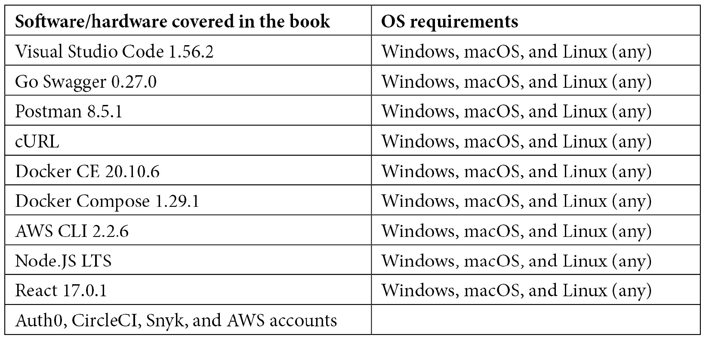

# 前言

Gin 是一个用于在 Go 中构建 Web 应用程序和微服务的高性能 HTTP 网络框架。本书旨在通过实际示例教你 Gin 框架的方方面面。

你将从探索 Gin 框架的基础开始，然后逐步构建一个真实的 RESTful API。在这个过程中，你将学习如何编写自定义中间件，理解路由机制，以及如何绑定用户数据和验证传入的 HTTP 请求。本书还展示了如何使用 MongoDB 等 NoSQL 数据库进行大规模的数据存储和检索，以及如何使用 Redis 实现缓存层。接下来，你将了解如何使用 OAuth 2 和 JWT 等身份验证协议来保护并测试你的 API 端点。后续章节将指导你如何在服务器端渲染 HTML 模板，并使用 React 网络框架构建前端应用程序以消费 API 响应。此外，你将在 **Amazon Web Services** (**AWS**) 上部署你的应用程序，并在 Kubernetes 上进行扩展。最后，你将学习如何使用 CI/CD 管道自动化部署过程，以及如何使用 Prometheus 和 ELK 堆栈在生产环境中调试 Gin 应用程序。

在阅读完这本 Gin 书籍之后，你将能够从头开始设计、构建和部署一个使用 Gin 框架的生产级分布式应用程序。

# 这本书面向谁

这本书是为那些熟悉 Go 语言并希望学习使用 Gin 框架进行 REST API 设计和开发的 Go 开发者而编写的。

# 这本书涵盖的内容

*第一章*，*开始使用 Gin*，提供了对 Gin 框架是什么、如何工作以及其特性的基础理解。它还提供了设置 Go 运行时和 Gin "Hello World" 示例的指南。

*第二章*，*设置 API 端点*，涵盖了从头开始构建完整的 RESTful API 以及如何使用 OpenAPI 生成其文档。

*第三章*，*使用 MongoDB 管理数据持久性*，说明了如何使用 MongoDB 等 NoSQL 数据库进行大规模的数据存储和检索。它还涵盖了如何使用 Redis 优化 API 响应时间。

*第四章*，*构建 API 身份验证*，专注于遵循的最佳实践和建议，以保护 API 端点。它演示了包括 JWT、Auth0 和会话 cookie 在内的身份验证协议的使用。

*第五章*，*在 Gin 中提供静态 HTML*，展示了如何使用 Gin RESTful API 作为后端构建一个 **单页应用程序** (**SPA**)，以及如何使用 Gin 渲染 HTML 模板和构建一个自包含的 Web 应用程序。

*第六章*, *扩展 Gin 应用*，展示了如何使用 Docker 和 RabbitMQ 来提高 Gin 分布式 Web 应用的性能和可扩展性。

*第七章*, *测试 Gin HTTP 路由*，探讨了如何使用 Docker 运行自动化测试。这包括运行 Go 单元测试和集成测试，以及使用 Snyk 检查安全漏洞。

*第八章*, *在 AWS 上部署应用*，演示了如何在 AWS EC2 支持的云服务器上部署 Gin 分布式应用，以及如何在 Kubernetes 上对其进行扩展以应对重负载。

*第九章*, *实现 CI/CD 流水线*，介绍了我们应该遵循的 CI/CD 实践来自动化 Gin 应用的构建、测试和部署。它还涵盖了如何使用代码即流水线的方法通过 CircleCI 实现这些实践。

*第十章*, *捕获 Gin 应用指标*，进一步展示了如何轻松地诊断和监控生产环境中运行的 Gin 应用。

# 为了充分利用本书

本书适用于在 Linux、macOS 或 Windows 上工作的人。您需要安装 Go 并拥有 AWS 账户。您还需要 Git 来克隆本书提供的源代码仓库。同样，您应具备 Go 语言的基本知识。为了充分利用本书，需要具备 Go 编程语言的入门级知识。

尽管这些是基本要求，但我们在需要时将引导您完成安装。



**如果您使用的是本书的数字版，我们建议您亲自输入代码或通过 GitHub 仓库（下一节中提供链接）访问代码。这样做将帮助您避免与代码的复制和粘贴相关的任何潜在错误。**

最后，请记住，本书的目的不是取代在线资源，而是旨在补充它们。因此，您显然需要互联网访问才能通过提供的链接完成阅读体验。

# 下载示例代码文件

您可以从 GitHub 下载本书的示例代码文件：[`github.com/PacktPublishing/Building-Distributed-Applications-in-Gin`](https://github.com/PacktPublishing/Building-Distributed-Applications-in-Gin)。如果代码有更新，它将在现有的 GitHub 仓库中更新。

我们还有其他丰富的书籍和视频的代码包，可在[`github.com/PacktPublishing/`](https://github.com/PacktPublishing/)找到。查看它们吧！

# 下载彩色图像

我们还提供了一份包含本书中使用的截图/图表彩色图像的 PDF 文件。您可以从这里下载：[`static.packt-cdn.com/downloads/9781801074858_ColorImages.pdf`](https://static.packt-cdn.com/downloads/9781801074858_ColorImages.pdf)。

# 使用的约定

本书中使用了多种文本约定。

`TestIndexHandler`：表示文本中的代码单词、数据库表名、文件夹名、文件名、文件扩展名、路径名、虚拟 URL、用户输入和 Twitter 昵称。以下是一个示例：“要编写单元测试，从`main_test.go`开始，并定义一个返回 Gin 路由器实例的方法。”

代码块设置如下：

```go
pm.test("More than 10 recipes", function () { 
   var jsonData = pm.response.json(); 
   pm.expect(jsonData.length).to.equal(10) 
}); 
```

任何命令行输入或输出都按照以下方式编写：

```go
$ go tool cover -html=coverage.out 
```

**粗体**：表示新术语、重要单词或您在屏幕上看到的单词。例如，菜单或对话框中的单词在文本中显示如下。以下是一个示例：“点击**启动**并分配一个密钥对或创建一个新的 SSH 密钥对。然后点击**创建实例**。”

小贴士或重要提示

看起来是这样的。

# 联系我们

我们欢迎读者的反馈。

`customercare@packtpub.com`.

**勘误表**：尽管我们已经尽最大努力确保内容的准确性，但错误仍然可能发生。如果您在这本书中发现了错误，我们将不胜感激，如果您能向我们报告，我们将不胜感激。请访问 www.packtpub.com/support/errata，选择您的书籍，点击勘误表提交表单链接，并输入详细信息。

`copyright@packt.com`，并附有材料链接。

**如果您有兴趣成为作者**：如果您在某个领域有专业知识，并且您有兴趣撰写或为书籍做出贡献，请访问 authors.packtpub.com。

# 分享您的想法

一旦您阅读了《使用 Gin 构建分布式应用程序》，我们很乐意听听您的想法！请访问[`packt.link/r/1801074852`](https://packt.link/r/1801074852)为这本书提供反馈。

您的评论对我们和科技社区都很重要，并将帮助我们确保我们提供高质量的内容。
