# 第二章：设置 API 端点

在上一章中，我们学习了如何构建我们的第一个 Gin 网络应用程序。在这一章中，我们将从头开始构建一个完整的 RESTful API。在这个过程中，我们将探索 HTTP 方法和高级路由功能。我们还将介绍如何编写 OpenAPI 规范以及如何生成 API 文档。

在本章中，我们将介绍以下主题：

+   探索 API 功能

+   实现 HTTP 路由

+   编写 OpenAPI 规范

到本章结束时，你将熟悉 Gin 的路由机制、HTTP 方法和数据验证。

# 技术要求

为了跟随本章内容，你需要以下内容：

+   一台装有 Golang 版本 1.15.6 的笔记本电脑（Windows、Linux 或 macOS），以便您可以轻松执行提供的命令

+   对 RESTful API 和 Go 编程语言的一般理解

本章的代码包托管在 GitHub 上，网址为[`github.com/PacktPublishing/Building-Distributed-Applications-in-Gin/tree/main/chapter02`](https://github.com/PacktPublishing/Building-Distributed-Applications-in-Gin/tree/main/chapter02)

# 探索 API 功能

为了说明如何构建 RESTful API，我们将构建一个烹饪应用程序。我们将介绍如何使用 Gin 框架集成、部署和测试应用程序。该应用程序将执行以下操作：

+   显示用户提交的食谱，包括它们的成分和说明。

+   允许任何人发布新的食谱。

应用程序架构和流程如下所示：

![图 2.1 – 食谱应用程序架构]

![img/B17115_02_01.jpg]

图 2.1 – 食谱应用程序架构

架构由一个使用 Gin 框架编写的微服务和用于数据持久性的数据库组成。该微服务通过 HTTP 协议公开 RESTful API 来管理食谱。

注意

在本书的后续章节中，我们将介绍如何使用 React 网络框架构建前端应用程序，以便我们可以消费 RESTful API。

在我们开始之前，我们需要创建一个 GitHub 仓库，代码源将存储在那里。为了在 Git 分支中组织代码，我们将使用 GitFlow 模型。这种方法包括以下分支：

+   **master**：这个分支对应于当前的生产代码。除了热修复之外，您不能直接提交。可以使用 Git 标签来标记 master 分支中的所有提交，并使用版本号（例如，为了使用语义版本控制约定[`semver.org/`](https://semver.org/)，它有三个部分：主要版本、次要版本和补丁版本，因此版本 1.2.3 的主要版本是 1，次要版本是 2，补丁版本是 3）。

+   **preprod**：这是一个发布分支，是生产的镜像。在它们合并到 master 分支之前，可以用来测试在 develop 分支上开发的全部新功能。

+   **develop**：这是开发集成分支，包含最新的集成开发代码。

+   **feature/X**：这是一个正在开发的个人功能分支。每个新功能都位于自己的分支中，并且通常是为最新的开发分支创建的。

+   **hotfix/X**：当你需要在生产代码中解决问题时，你可以使用 hotfix 分支并为 master 分支打开一个拉取请求。这个分支基于 master 分支。

以下架构说明了 GitFlow 方法：

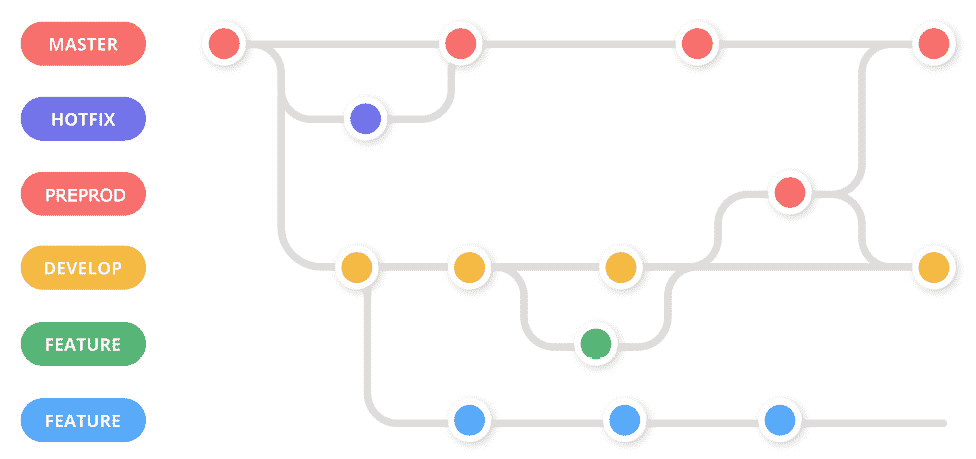

图 2.2 – GitFlow 模型 – 主要分支

一旦创建了 GitHub 仓库，克隆它到你的 Go 工作区，并创建三个主要分支，分别称为`develop`、`preprod`和`master`。这将帮助你组织项目并将开发中的代码与运行在生产中的代码隔离开。这种分支策略是 GitFlow 工作流程分支模型的简化版本（不要忘记将 GitHub URL 替换为你的仓库链接）：

```go
git clone https://github.com/mlabouardy/recipes-api.git 
cd recipes-api 
touch README.md 
git checkout -b preprod 
git push origin preprod 
git checkout –b develop 
git push origin develop
```

这将创建一个名为`recipes-api`的新目录。让我们通过执行以下命令将此目录作为模块的根目录。这将使我们能够使用`go.mod`和`go.sum`文件来管理项目依赖项：

```go
go mod init
```

在 VSCode 上打开项目文件夹，创建一个包含以下代码的`main.go`文件。`main`函数将初始化一个新的 Gin 路由器，并通过调用我们的 Gin 实例的`Run()`方法在端口`8080`上运行一个 HTTP 服务器：

```go
package main
import "github.com/gin-gonic/gin"
func main() {
   router := gin.Default()
   router.Run()
}
```

注意

确保使用`go get`命令安装`gin`包。请参阅上一章以获取逐步指南。

将更改推送到 Git 远程仓库。目前，我们将直接将更改推送到`develop`分支。我们将在下一节学习如何打开拉取请求：

```go
git add .
git commit –m "boilerplate"
git push origin develop
```

更新后的仓库应如下所示：

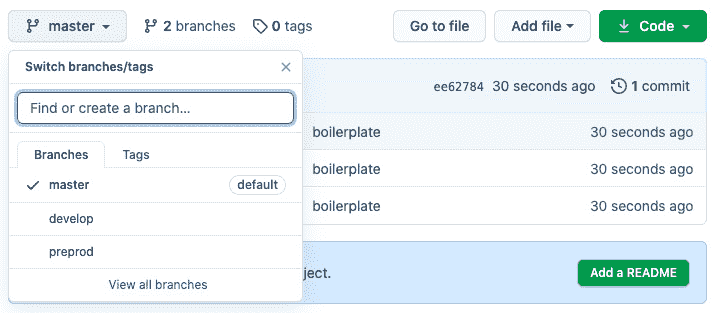

图 2.3 – GitHub 分支

注意

如果你正在与一组开发者合作，你需要在从 GitHub 克隆项目后，使用`go mod download`命令来安装所需的依赖项。

在下一小节中，我们将看到如何定义数据模型。

## 定义数据模型

在深入研究路由定义之前，我们需要定义一个将保存有关食谱信息的模型。我们可以通过定义一个 Go 结构体来创建我们的模型。此模型将包含食谱的属性/字段。在`main.go`文件中声明以下结构体：

```go
type Recipe struct {
   Name         string    `json:"name"`
   Tags         []string  `json:"tags"`
   Ingredients  []string  `json:"ingredients"`
   Instructions []string  `json:"instructions"`
   PublishedAt  time.Time `json:"publishedAt"`
}
```

我们的`Recipe`模型是自我解释的。每个食谱都应该有一个名称、一个配料清单、一个指令或步骤列表，以及一个发布日期。此外，每个食谱属于一组类别或标签（例如，纯素、意大利菜、糕点、沙拉等），以及一个 ID，这是在数据库中区分每个食谱的唯一标识符。我们还将使用反引号注释指定每个字段的标签；例如，`` `json:"NAME"` ``。这允许我们在将它们作为响应发送时将每个字段映射到不同的名称，因为 JSON 和 Go 有不同的命名约定。

一旦定义了结构体，就将更改推送到基于`develop`分支的新分支：

```go
git checkout -b feature/datamodel
git add main.go
git commit -m "recipe data model"
git push origin feature/datamodel
```

一旦将这些更改推送到您的仓库，`feature/datamodel`将与`develop`分支合并：

![图 2.4 – GitHub 拉取请求]

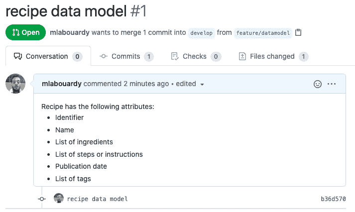

图 2.4 – GitHub 拉取请求

将更改合并到`develop`分支并删除`feature/datamodel`分支：

![图 2.5 – 将拉取请求合并到 develop 分支]

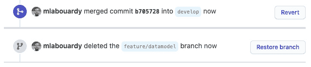

图 2.5 – 将拉取请求合并到 develop 分支

在定义了数据模型之后，我们可以查看路由处理器的定义。API 将公开各种端点。现在让我们看看它们。

## HTTP 端点

以下表格显示了我们可以使用的 HTTP 端点列表：

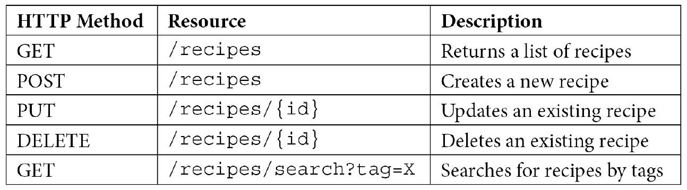

现在，我们将建立我们 API 的端点。我们将通过在`main`函数中创建所有端点来设置这些端点。每个端点都需要一个单独的函数来处理请求。我们将在`main.go`文件中定义它们。

注意

在下一章中，我们将介绍如何根据标准的 Go 布局来构建 Go 项目。

# 实现 HTTP 路由

在本节中，我们将创建处理 POST、GET、PUT 和 DELETE HTTP 请求的功能处理器。所以，让我们直接进入正题。

## POST /recipes

首先，让我们实现负责创建新食谱的端点。在`/recipes`资源上创建一个 POST 方法。然后，为该路径定义一个`NewRecipeHandler`方法。`main.go`文件可能看起来像这样：

```go
package main
import (
   "time"
   "github.com/gin-gonic/gin"
)
type Recipe struct {
  ID           string    `json:"id"`
  Name         string    `json:"name"`
  Tags         []string  `json:"tags"`
  Ingredients  []string  `json:"ingredients"`
  Instructions []string  `json:"instructions"`
  PublishedAt  time.Time `json:"publishedAt"`
}
func NewRecipeHandler(c *gin.Context) {
}
func main() {
   router := gin.Default()
   router.POST("/recipes", NewRecipeHandler)
   router.Run()
}
```

在编写`NewRecipeHandler`方法的代码之前，我们需要定义一个名为`recipes`的全局变量来存储食谱列表。这个变量将临时使用，并在下一章中用数据库替换。为了初始化`recipes`变量，我们可以使用`init()`方法，该方法将在应用程序启动时执行：

```go
var recipes []Recipe
func init() {
   recipes = make([]Recipe, 0)
}
```

在这里，我们将定义 `NewRecipeHandler` 背后的逻辑。`c.ShouldBindJSON` 函数将传入的请求体序列化到 `Recipe` 结构体中，然后使用名为 `xid` 的外部包分配一个唯一的标识符。接下来，它使用 `time.Now()` 函数分配一个发布日期，并将食谱添加到食谱列表中，这将将其保留在内存中。如果请求体无效，则处理程序将返回一个错误（400 状态码）。否则，处理程序将返回 200 状态码：

```go
func NewRecipeHandler(c *gin.Context) {
   var recipe Recipe
   if err := c.ShouldBindJSON(&recipe); err != nil {
       c.JSON(http.StatusBadRequest, gin.H{
          "error": err.Error()})
       return
   }
   recipe.ID = xid.New().String()
   recipe.PublishedAt = time.Now()
   recipes = append(recipes, recipe)
   c.JSON(http.StatusOK, recipe)
}
```

在前面的代码中，我们使用了内置的状态码常量，如 `http.StatusOK` 和 `http.StatusBadRequest`，而不是硬编码的 HTTP 状态码。我们还将响应类型设置为 JSON。

在运行应用程序之前，我们需要下载用于生成唯一 ID 的 `xid` 包：

```go
go get github.com/rs/xid
```

新的依赖项将自动添加到 `go.sum` 和 `go.mod` 文件中。按照以下方式运行服务器：

```go
go run main.go
```

将在端口 `8080` 上部署一个 HTTP 服务器：

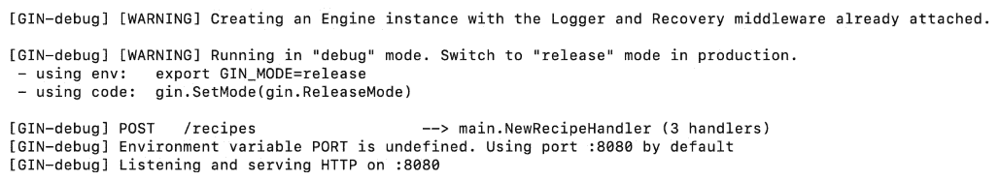

图 2.6 – Gin 服务器日志

为了测试它，使用 Postman 客户端在 http://localhost:8080/recipes 上发送 POST 请求，请求体中包含以下 JSON：

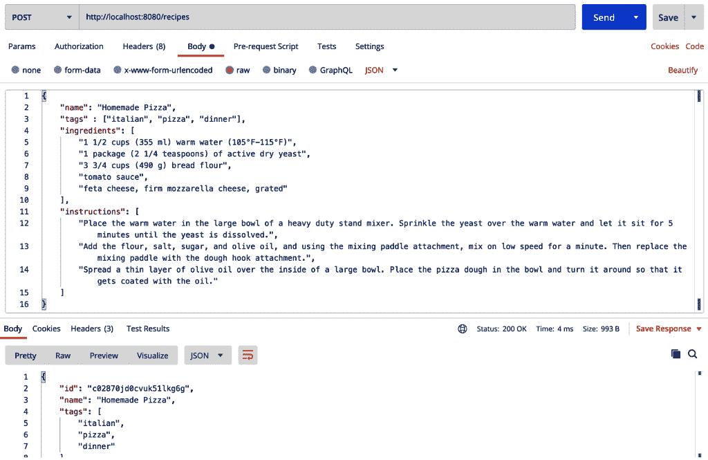

图 2.7 – 使用 Postman 客户端发送 POST 请求

上述命令将食谱添加到食谱数组中，并返回带有分配的 ID 和发布日期的食谱。

Postman 的另一个替代方案是使用 `cURL` 命令。使用以下 `cURL` 命令，后跟 JSON 文档，使用 `POST` 动词：

```go
curl --location --request POST 'http://localhost:8080/recipes' \
--header 'Content-Type: application/json' \
--data-raw '{
   "name": "Homemade Pizza",
   "tags" : ["italian", "pizza", "dinner"],
   "ingredients": [
       "1 1/2 cups (355 ml) warm water (105°F-115°F)",
       "1 package (2 1/4 teaspoons) of active dry yeast",
       "3 3/4 cups (490 g) bread flour",
       "feta cheese, firm mozzarella cheese, grated"
   ],
   "instructions": [
       "Step 1.",
       "Step 2.",
       "Step 3."
   ]
}' | jq -r
```

注意

`jq` 工具 [`stedolan.github.io/jq/`](https://stedolan.github.io/jq/) 用于以 JSON 格式格式化响应体。它是一个功能强大的命令行 JSON 处理器。

随着 POST 端点按预期工作，我们可以将代码更改推送到一个新的功能分支：

```go
git checkout -b feature/new_recipe
git add .
git commit -m "new recipe endpoint"
git push origin feature/new_recipe
```

一旦提交，请发起一个拉取请求，将 `feature/new_recipe` 分支与 `develop` 分支合并：

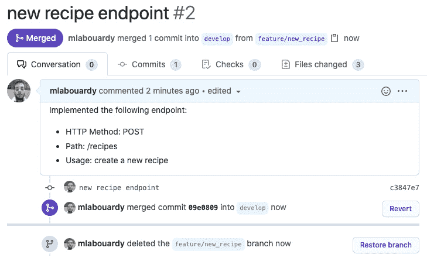

![图 2.8 – 将新食谱端点功能分支合并到 develop 分支一旦更改已合并，请确保删除功能分支。现在，`POST /recipes` 端点已创建，我们可以实现一个 `GET /recipes` 端点，以列出使用 `POST/recipes` 端点添加的所有食谱。## GET /recipes 与之前的端点类似，在 `/recipes` 资源上注册一个 `GET` 方法并附加 `ListRecipesHandler`。当在 `/recipes` 资源上接收到传入的 GET 请求时，将调用该函数。代码很简单；它使用 `c.JSON()` 方法将 `recipes` 数组序列化为 JSON：```gofunc ListRecipesHandler(c *gin.Context) {   c.JSON(http.StatusOK, recipes)}func main() {   router := gin.Default()   router.POST("/recipes", NewRecipeHandler)   router.GET("/recipes", ListRecipesHandler)   router.Run()}```使用 `go run main.go` 命令重新部署应用程序：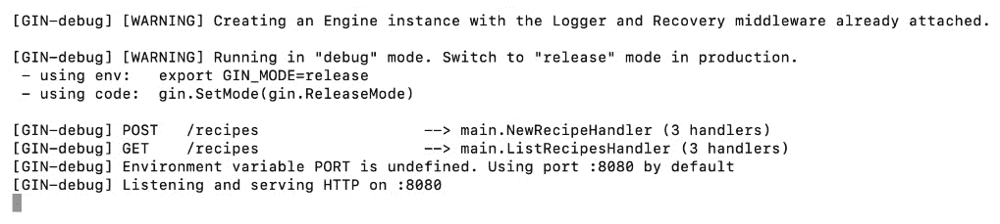

![图 2.9 – 暴露 GET 端点要测试端点，向 `http://localhost:8080/recipes` 发起 GET 请求。这里，将返回一个空数组：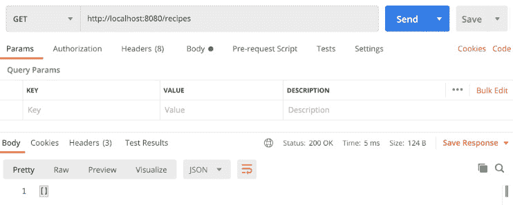

图 2.10 – 获取食谱列表

相应的 `cURL` 命令如下：

```go
curl -s --location --request GET 'http://localhost:8080/recipes' \
--header 'Content-Type: application/json'
```

空数组是由于 `recipes` 变量仅在应用程序运行时可用。在下一章中，我们将介绍如何将 RESTful API 连接到数据库，如 MongoDB 以实现数据持久性。但到目前为止，我们可以在启动应用程序时通过在 `init()` 方法中放置初始化代码来初始化 `recipes` 数组。

加载机制将基于一个包含我预先创建的食谱列表的 JSON 文件。完整的列表可在本书的 GitHub 仓库中找到：

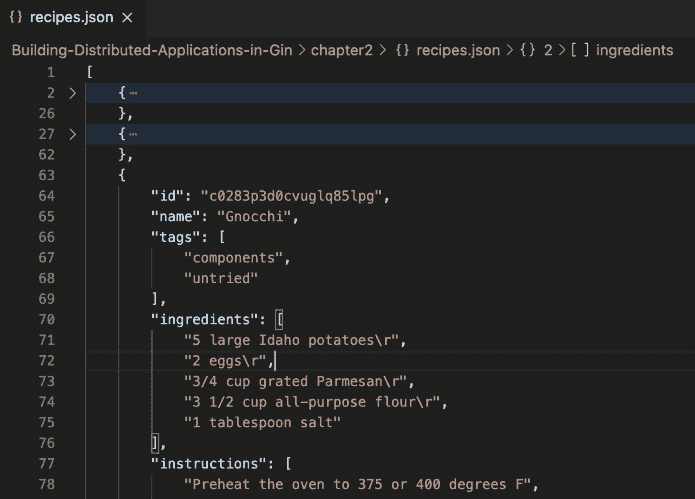

图 2.11 – 食谱列表的 JSON 格式

我们将使用 `ioutil.ReadFile()` 方法读取 JSON 文件，然后使用以下代码片段将其内容转换为食谱数组：

```go
func init() {
   recipes = make([]Recipe, 0)
   file, _ := ioutil.ReadFile("recipes.json")
   _ = json.Unmarshal([]byte(file), &recipes)
}
```

不要忘记在重新运行应用程序并发出对 `/recipes` 端点的 GET 请求之前导入 `encoding/json` 和 `io/ioutil`。这次，将以 JSON 格式返回食谱列表：

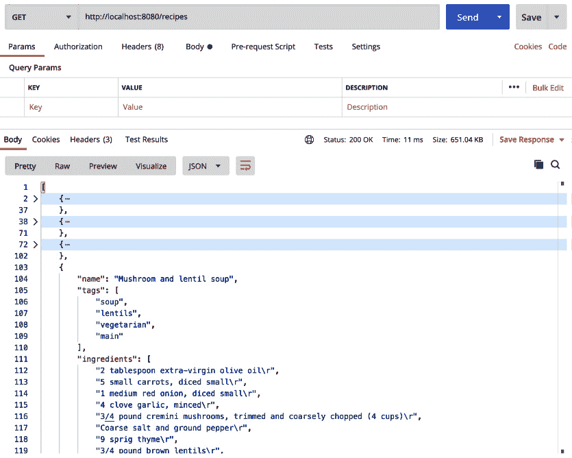

图 2.12 – GET /recipes 返回食谱列表

您可以使用 `curl` 和 `jq` 命令来计算请求返回的食谱数量：

```go
curl -s -X GET 'http://localhost:8080/recipes' | jq length
```

`recipes.json` 文件包含 492 个食谱；因此，HTTP 请求应返回 492 个食谱：

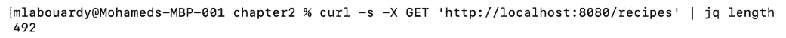

图 2.13 – 使用 jq 计算 JSON 项

通过创建以下命令创建一个新的功能分支并将新端点代码提交到 Git：

```go
git checkout -b feature/fetch_all_recipes
git add .
git commit -m "list recipes endpoint"
git push origin feature/fetch_all_recipes
```

一旦更改已推送，创建一个拉取请求并将分支合并到 `develop`：

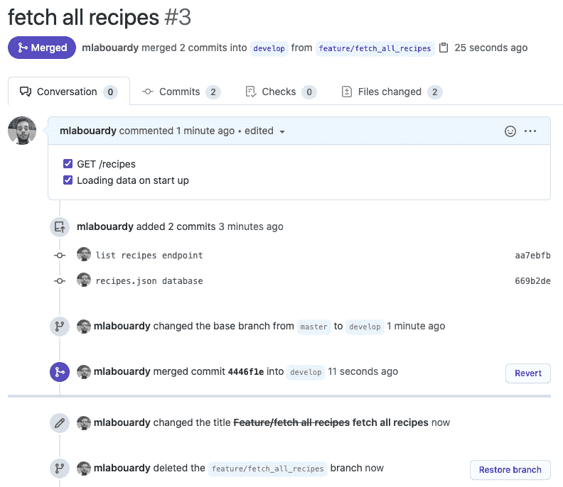

图 2.14 – 将食谱列表端点功能分支合并到 develop 分支

## PUT /recipes/{id}

要更新现有食谱，我们将使用带有路径查询参数 ID 的 `PUT` 动词，该参数代表要更新的食谱的标识符。在主函数内部注册 `/recipes/:id` 资源的端点：

```go
router.PUT("/recipes/:id", UpdateRecipeHandler)
```

`UpdateRecipeHandler` 端点的处理代码如下片段提供。它使用 `c.Param()` 方法从请求 URL 中获取食谱 ID，将请求体转换为 `Recipe` 结构体，并遍历食谱列表，寻找要更新的食谱。如果没有找到，则发送带有 404 代码错误的错误消息；否则，使用请求体中的新值更新食谱：

```go
func UpdateRecipeHandler(c *gin.Context) {
   id := c.Param("id")
   var recipe Recipe
   if err := c.ShouldBindJSON(&recipe); err != nil {
       c.JSON(http.StatusBadRequest, gin.H{
          "error": err.Error()})
       return
   }
   index := -1
   for i := 0; i < len(recipes); i++ {
       if recipes[i].ID == id {
           index = i
       }
   }
   if index == -1 {
       c.JSON(http.StatusNotFound, gin.H{
          "error": "Recipe not found"})
       return
   }
   recipes[index] = recipe
   c.JSON(http.StatusOK, recipe)
}
```

重新启动服务器，然后发出 POST 请求以创建新食谱。为了说明更新端点的工作原理，我们将创建一个 margherita 食谱的以下示例 JSON：

```go
{
   "name": "Homemade Pizza",
   "tags" : ["italian", "pizza", "dinner"],
   "ingredients": [
       "pizza dough",
       "tomato sauce",
       "olive oil",
       "7 ounces fresh mozzarella cheese, cut into 
        1/2-inch cubes",
       "5 - 6 large fresh basil leaves"
   ],
   "instructions": []
}
```

为了测试它，再次使用 Postman 客户端，在 `http://localhost:8080/recipes` 上发出一个新的 POST 请求，使用此 JSON 文档：

![图 2.15 – 添加新食谱]

![图片 B17115_02_15.jpg]

图 2.15 – 添加新食谱

将创建 `Homemade Pizza` 食谱，并且您将收到新食谱的 ID（在我们的示例中，它是 `c2inb6q3k1kc2p0uqetg`）。假设我们想更新食谱并将其更改为 `Shrimp scampi pizza`。这次，我们可以使用 `PUT` 方法并提供食谱的 ID 作为 `path` 参数：

![图 2.16 – 更新现有食谱]

![图片 B17115_Figure_2.16.jpg]

图 2.16 – 更新现有食谱

请求将返回 200 状态码。为了验证更改是否生效，我们可以使用 `GET /recipes` 端点：

![图 2.17 – 验证更改是否应用于食谱]

![图片 B17115_Figure_2.17.jpg]

图 2.17 – 验证更改是否应用于食谱

将新端点推送到一个新的功能分支，并将分支合并到 `develop`：

```go
git checkout -b feature/update_recipe
git add .
git commit -m "update recipe endpoint"
git push origin feature/update_recipe
```

## DELETE /recipes/{id}

要删除食谱，我们需要在我们的主函数中注册 `DELETE` HTTP 路由，如下所示：

```go
router.DELETE("/recipes/:id", DeleteRecipeHandler)
```

`DeleteRecipeHandler` 函数的代码将从请求参数中获取目标食谱 ID 并遍历食谱列表。如果没有找到匹配的食谱，将使用 404 状态码发送 `"Recipe not found"` 错误消息。否则，将使用数组上的食谱索引并基于索引删除食谱：

```go
func DeleteRecipeHandler(c *gin.Context) {
   id := c.Param("id")
   index := -1
   for i := 0; i < len(recipes); i++ {
       if recipes[i].ID == id {
           index = i
       }
   }
   if index == -1 {
       c.JSON(http.StatusNotFound, gin.H{
          "error": "Recipe not found"})
       return
   }
   recipes = append(recipes[:index], recipes[index+1:]...)
   c.JSON(http.StatusOK, gin.H{
      "message": "Recipe has been deleted"))
}
```

要测试删除端点，请使用 Postman 客户端或在终端会话中发出 `cURL` 命令：

```go
curl -v -sX DELETE http://localhost:8080/recipes/c0283p3d0cvuglq85log | jq -r
```

如果目标食谱存在，则它将被删除，并且您将看到返回成功消息：

![图 2.18 – 删除食谱]

![图片 B17115_02_18.jpg]

图 2.18 – 删除食谱

否则，将返回错误消息：

![图 2.19 – 如果找不到食谱，将返回错误 404 信息]

![图片 B17115_02_19.jpg]

图 2.19 – 如果找不到食谱，将返回错误 404 信息

再次，将更改存储在功能分支中，并将其合并到 `develop`：

```go
git checkout -b feature/delete_recipe
git add .
git commit -m "delete recipe endpoint"
git push origin feature/delete_recipe
```

## GET /recipes/search

最后一个端点允许用户根据标签或关键词搜索食谱：

```go
router.GET("/recipes/search", SearchRecipesHandler)
```

`SearchRecipesHandler` 处理器代码片段如下（不要忘记导入 `strings`）：

```go
func SearchRecipesHandler(c *gin.Context) {
   tag := c.Query("tag")
   listOfRecipes := make([]Recipe, 0)
   for i := 0; i < len(recipes); i++ {
       found := false
       for _, t := range recipes[i].Tags {
           if strings.EqualFold(t, tag) {
               found = true
           }
       }
       if found {
           listOfRecipes = append(listOfRecipes, 
              recipes[i])
       }
   }
   c.JSON(http.StatusOK, listOfRecipes)
}
```

HTTP 处理器使用 `c.Query` 方法获取查询参数中给出的标签值。

您可以通过在 [`localhost:8080/recipes/search?tag=italian`](http://localhost:8080/recipes/search?tag=italian) 发出 GET 请求来测试端点，查找意大利食谱：

![图 2.20 – 使用查询参数搜索食谱]

![图片 B17115_02_20.jpg]

图 2.20 – 使用查询参数搜索食谱

最后，通过创建一个新的功能分支将搜索端点代码推送到远程仓库：

```go
git checkout -b feature/search_recipe
git add .
git commit -m "search recipe by tag"
git push origin feature/search_recipe
```

注意

在每次提交之前，请确保运行 `go mod tidy` 命令以确保你的 `go.mod` 和 `go.sum` 文件干净且准确。

到目前为止，我们已经介绍了如何使用 Gin 框架在 Golang 中构建 RESTful API。然而，如果没有有意义的 API 文档，用户将无法使用它。

文档应该成为你开发周期的一部分，以帮助你维护可扩展的 API。这就是为什么在下一节中，我们将探讨如何使用 **OpenAPI 规范**（**OAS**）。

# 编写 OpenAPI 规范

OpenAPI 规范（以前称为 Swagger 规范）是一种 API 描述格式或 API 定义语言。它允许你描述一个 API，包括以下信息：

+   关于 API 的一般信息

+   可用的路径和操作（HTTP 方法）

+   每个操作的预期输入（查询或路径参数、请求体等）和响应（HTTP 状态码、响应体等）

从现有的 API 中找到一种简单的方法来生成 OpenAPI 定义可能具有挑战性。好消息是 Swagger 工具可以帮助你轻松完成这项任务。

## 安装 Go Swagger

要开始，请从官方指南 [`goswagger.io/install.html`](https://goswagger.io/install.html) 安装 `go-swagger` 工具或从 GitHub [`github.com/go-swagger/go-swagger/releases`](https://github.com/go-swagger/go-swagger/releases) 下载二进制文件。在撰写本书时，最新稳定版本是 v0.25.0：

![Figure 2.21 – Go Swagger binary – latest release]

![img/B17115_02_21.jpg]

![Figure 2.21 – Go Swagger binary – latest release]

确保将其添加到 `PATH` 环境变量中。然后，运行以下命令以验证安装：

```go
go-swagger version
```

之前的命令应该显示以下输出：

![Figure 2.22 – Go Swagger version]

![img/B17115_02_22.jpg]

图 2.22 – Go Swagger 版本

现在，是时候为食谱 API 编写我们的 OpenAPI 规范了。

注意

`go-swagger` 的一个替代方案是 `swag` ([`github.com/swaggo/swag`](https://github.com/swaggo/swag)). 这个工具可以将 Go 注释转换为 Swagger 文档。

## Swagger 元数据

我们将首先使用 `swagger:meta` 注解提供一些关于 API 的基本信息。这个注解有以下属性：

![img/02.jpg]

在 `main` 包的顶部添加以下注释：

```go
// Recipes API
//
// This is a sample recipes API. You can find out more about the API at https://github.com/PacktPublishing/Building-Distributed-Applications-in-Gin.
//
//  Schemes: http
//  Host: localhost:8080
//  BasePath: /
//  Version: 1.0.0
//  Contact: Mohamed Labouardy 
// <mohamed@labouardy.com> https://labouardy.com
//
//  Consumes:
//  - application/json
//
//  Produces:
//  - application/json
// swagger:meta
package main
```

这些注释包括 API 的描述、版本、基本 URL 等内容。还有更多字段可以包含（完整列表可在 [`goswagger.io/use/spec/meta.html`](https://goswagger.io/use/spec/meta.html) 找到）。

为了生成 OpenAPI 规范，我们将使用`swagger`命令行工具。CLI 将解析`main.go`文件。如果解析器遇到与 Swagger 注释或任何支持的标签匹配的注释，它将生成相应的规范块。

在您的终端中，运行以下命令以生成`spec`文件：

```go
swagger generate spec –o ./swagger.json
```

此命令将生成 JSON 格式的规范。您也可以通过添加`.yml`或`.yaml`扩展名来生成 YAML 格式的规范。

生成的`swagger.json`文件内容如下：

```go
{
"consumes": [
   "application/json"
],
"produces": [
   "application/json"
],
"schemes": [
   "http"
],
"swagger": "2.0",
"info": {
   "description": "This is a sample recipes API. You can 
    find out more about the API at https://github.com/PacktPublishing/Building-Distributed-Applications-in-Gin.",
   "title": "Recipes API",
   "contact": {
     "name": "Mohamed Labouardy",
     "url": "https://labouardy.com",
     "email": "mohamed@labouardy.com"
   },
   "version": "1.0.0"
},
"host": "localhost:8080",
"basePath": "/",
"paths": {}
} 
```

Swagger 命令行的另一个酷炫功能是其内置的 UI。您可以使用以下命令在本地加载生成的规范到 Swagger UI 中：

```go
swagger serve ./swagger.json
```

UI 将在端口`http://localhost:49566`上公开：

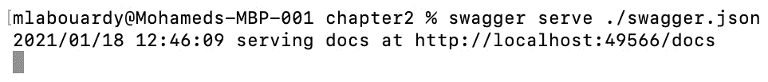

图 2.23 – 在 UI 中加载 Swagger 规范

如果您将浏览器指向该 URL，您应该会看到基于 Redoc 模板的 UI。UI 有两种风味 – Redoc 和 Swagger UI：

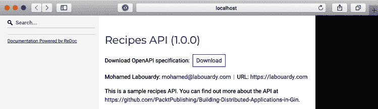

图 2.24 – 带有 Redoc 风格的 Swagger

如果您是 Swagger UI 的粉丝，可以使用以下命令将 flavor 标志设置为`swagger`：

```go
swagger serve -F swagger ./swagger.json
```

这次，API 规范将由 Swagger UI 提供：


图 2.25 – Swagger UI 模式

注意

您还可以使用 Swagger 在线编辑器([`editor.swagger.io/`](https://editor.swagger.io/))来编辑和加载您的 OpenAPI 规范文件。

接下来，我们将为列出配方端点定义一个`swagger:operation`。该注释具有以下属性：

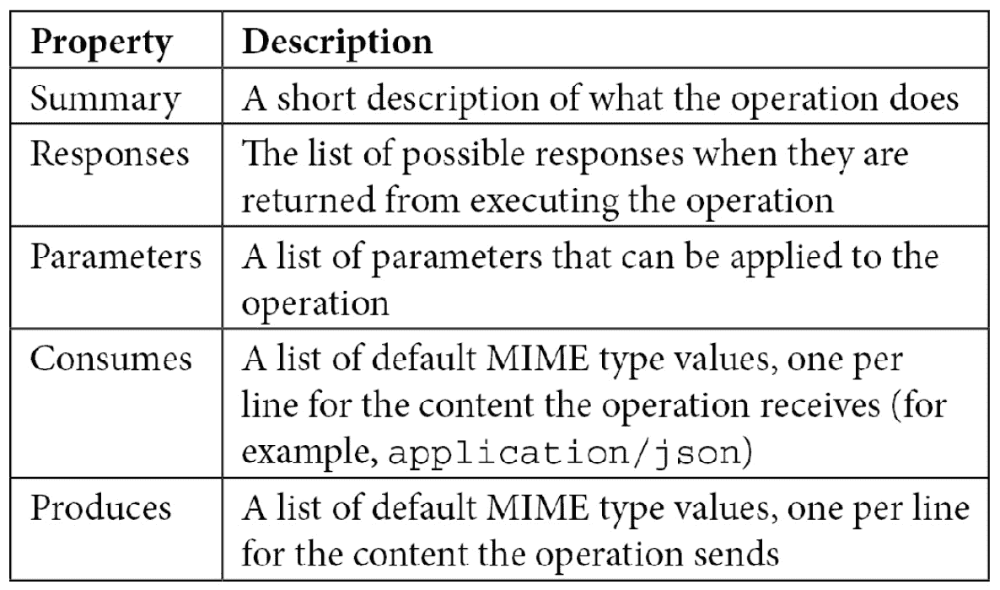

您可以在[`github.com/OAI/OpenAPI-Specification/blob/master/versions/2.0.md#operationObject`](https://github.com/OAI/OpenAPI-Specification/blob/master/versions/2.0.md#operationObject)找到所有属性。

如下所示，注释`ListRecipesHandler`函数。该注释接受 HTTP 方法、路径模式和操作 ID 作为参数：

```go
// swagger:operation GET /recipes recipes listRecipes
// Returns list of recipes
// ---
// produces:
// - application/json
// responses:
//     '200':
//         description: Successful operation
func ListRecipesHandler(c *gin.Context) {
   c.JSON(http.StatusOK, recipes)
}
```

对于每个操作，您可以在`responses`部分中描述与 HTTP 状态代码（200、404 等）匹配的 HTTP 响应。对于此端点，当响应`GET /recipes`时，我们只会返回 200 成功代码。`description`字段解释了此响应的含义。

使用 Swagger CLI 生成规范并重新加载`swagger.json`。这次，将添加`GET /recipes`操作：


图 2.26 – 添加新的 Swagger 操作

为`PUT /recipes/{id}`端点定义另一个 Swagger 操作。类似于之前的操作，我们可以根据处理响应代码定义响应。我们还可以在`parameters`部分中将 ID 定义为`path`参数。此外，还可以提供可选的描述，如下所示：

```go
// swagger:operation PUT /recipes/{id} recipes updateRecipe
// Update an existing recipe
// ---
// parameters:
// - name: id
//   in: path
//   description: ID of the recipe
//   required: true
//   type: string
// produces:
// - application/json
// responses:
//     '200':
//         description: Successful operation
//     '400':
//         description: Invalid input
//     '404':
//         description: Invalid recipe ID
func UpdateRecipeHandler(c *gin.Context) {}
```

重新生成 `swagger.json` 文件并重新加载 Swagger UI：

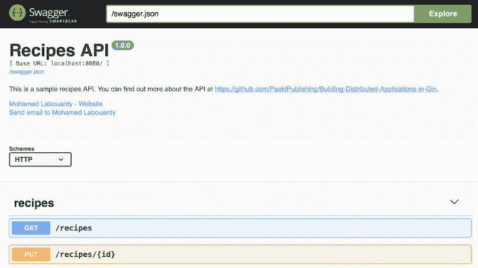

图 2.27 – Swagger 中的 PUT 操作

定义剩下的操作。你应该有类似以下的内容：

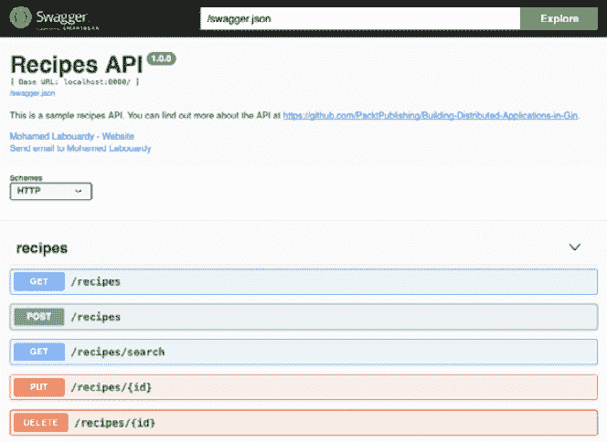

图 2.28 – 食谱 API 操作

通过这样，你已经学到了 OpenAPI 规范的基础。

由于 OpenAPI 规范文件是一个简单的 JSON 文件，它可以在任何源代码管理工具（SCM）中共享和管理，就像应用程序源代码一样。使用以下命令将 `spec` 文件提交到 GitHub：

```go
git checkout -b feature/openapi
git add .
git commit -m "added openapi specs"
git push origin feature/openapi
```

更新后的存储库将如下所示：

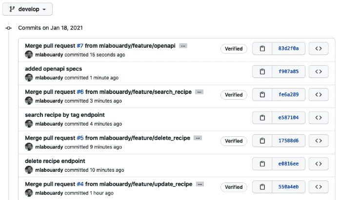

图 2.29 – 在 GitHub 上存储 OpenAPI 规范

# 摘要

在本章中，你学习了如何使用 Gin 框架从头开始构建 RESTful API。我们还介绍了如何使用 Gin 数据绑定和验证方法验证传入的 HTTP 请求。然后，我们介绍了 OpenAPI 规范，并学习了如何从现有的 API 中生成它。你现在应该熟悉暴露 HTTP 方法（GET、POST、DELETE、PUT 等）以处理 HTTP 请求。

在下一章中，我们将使用 MongoDB 作为 NoSQL 数据库来管理 API 的数据持久性。

# 问题

1.  什么是 GitFlow 策略？

1.  我们如何在 Go 中定义数据模型？

1.  我们如何在 Gin 中验证 POST 请求的正文？

1.  定义一个可以通过 ID 获取一个食谱的 API 端点。

1.  使用 OpenAPI 定义新食谱端点的正文参数。

# 进一步阅读

+   *实践 RESTful API 设计模式和最佳实践*，由 Harihara Subramanian，Pethuru Raj，Packt 出版

+   *使用 GIT(Flow) Jenkins, Artifactory, Sonar, ELK, JIRA [视频]*，由 Nand Venegalla，Packt 出版
