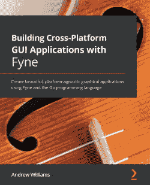

Packt.com

订阅我们的在线数字图书馆，全面访问超过 7,000 本书和视频，以及行业领先的工具，帮助您规划个人发展并推进职业生涯。更多信息，请访问我们的网站。

# 为什么订阅？

+   使用来自 4,000 多位行业专业人士的实用电子书和视频，节省学习时间，多花时间编码

+   通过为您量身定制的技能计划提高您的学习效果

+   每月免费获得一本电子书或视频

+   完全可搜索，便于轻松访问关键信息

+   复制粘贴、打印和收藏内容

您知道 Packt 为每本书提供电子书版本，并提供 PDF 和 ePub 文件吗？您可以在 packt.com 升级到电子书版本，并且作为印刷书客户，您有权获得电子书副本的折扣。有关更多信息，请联系我们 `customercare@packtpub.com`。

在 www.packt.com，您还可以阅读一系列免费技术文章，订阅各种免费通讯，并享受 Packt 书籍和电子书的独家折扣和优惠。

# 您可能还会喜欢的其他书籍

如果您喜欢这本书，您可能对 Packt 的其他书籍也感兴趣：

][https://www.packtpub.com/product/building-cross-platform-gui-applications-with-fyne/9781800563162]

**使用 Fyne 构建跨平台 GUI 应用程序**

Andrew Williams

ISBN: 9781800563162

+   精通 GUI 开发的历史以及 Fyne 和 Golang 编程语言如何使其更加容易

+   探索 Fyne 工具包的架构以及提供的各种模块

+   发现如何使用最佳实践测试和构建 Fyne 应用程序

+   构建五个完整的应用程序并将它们部署到您的设备上

+   通过扩展小部件和主题来自定义您应用程序的设计

+   理解数据的分离和展示方式，以及如何测试和构建展示动态数据的应用程序

![包含文本、橙色、截图、标志的图片]

描述自动生成](img/Hands-On_High_Performance_with_Go.png)][https://www.packtpub.com/product/hands-on-high-performance-with-go/9781789805789]

**Go 高性能实战**

Bob Strecansky

ISBN: 9781789805789

+   使用集群和作业队列有效地组织和操作数据

+   探索常用的 Go 数据结构和算法

+   在 Go 中编写匿名函数以构建可重用应用程序

+   通过配置文件和跟踪 Go 应用程序来减少瓶颈并提高效率

+   专注于性能部署、监控和迭代 Go 程序

+   深入了解 Go 中的内存管理以及 CPU 和 GPU 并行性

# Packt 正在寻找像您这样的作者

如果你有兴趣成为 Packt 的作者，请访问 authors.packtpub.com 并今天申请。我们已经与成千上万的开发者和技术专业人士合作，就像你一样，帮助他们将见解分享给全球科技社区。你可以提交一个一般性申请，申请我们正在招募作者的特定热门话题，或者提交你自己的想法。

# 分享你的想法

现在你已经完成了*《使用 Gin 构建分布式应用》*，我们非常想听听你的想法！如果你在亚马逊购买了这本书，请访问[`packt.link/r/1801074852`](https://packt.link/r/1801074852)获取这本书的信息，并在你购买它的网站上分享你的反馈或留下评论。

你的评论对我们和科技社区都非常重要，这将帮助我们确保我们提供的是高质量的内容。
