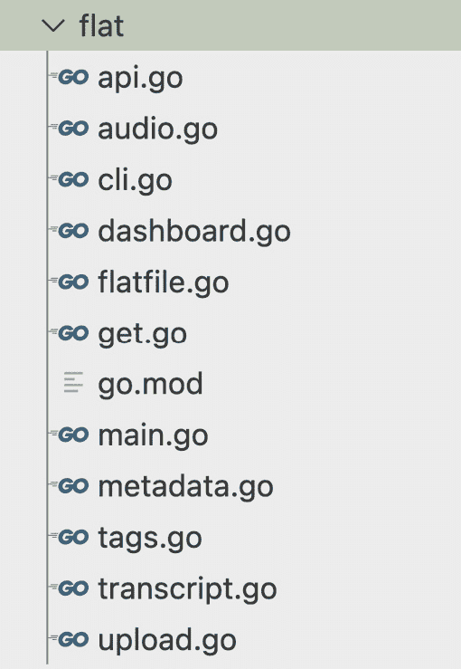
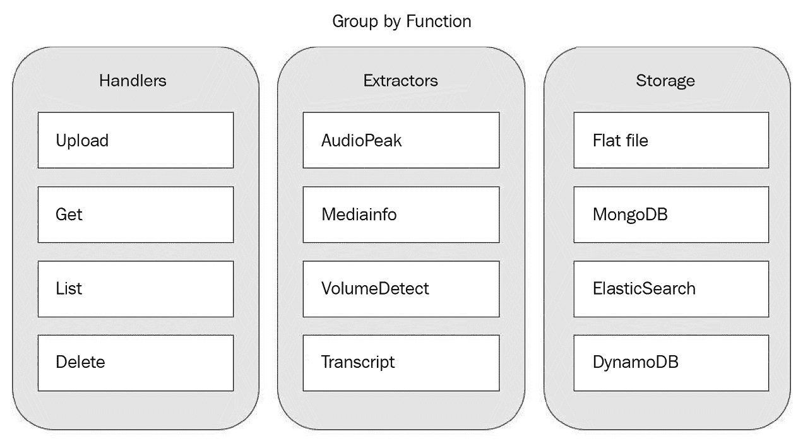
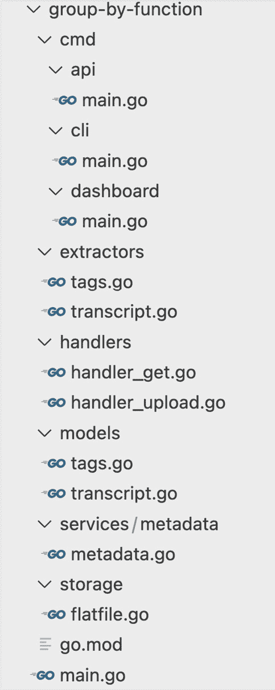
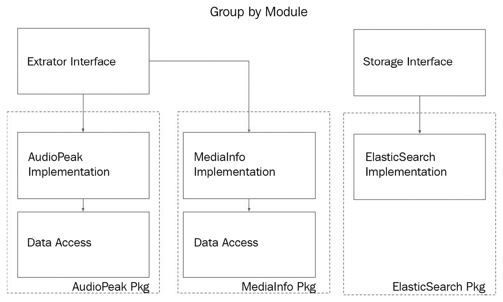
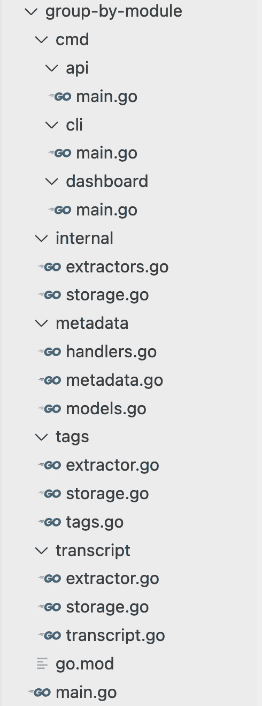
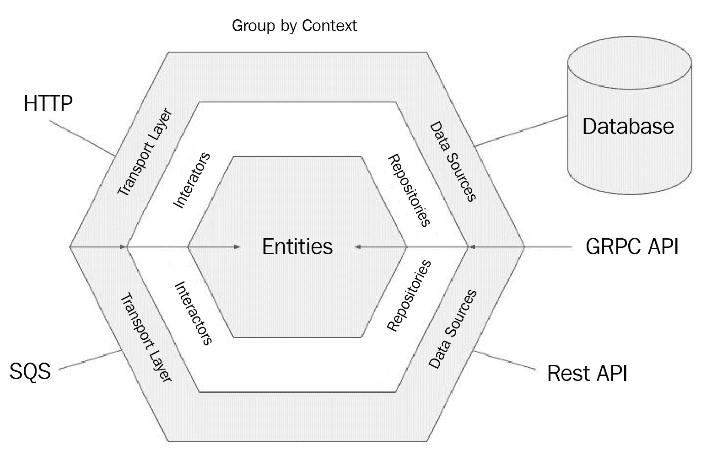
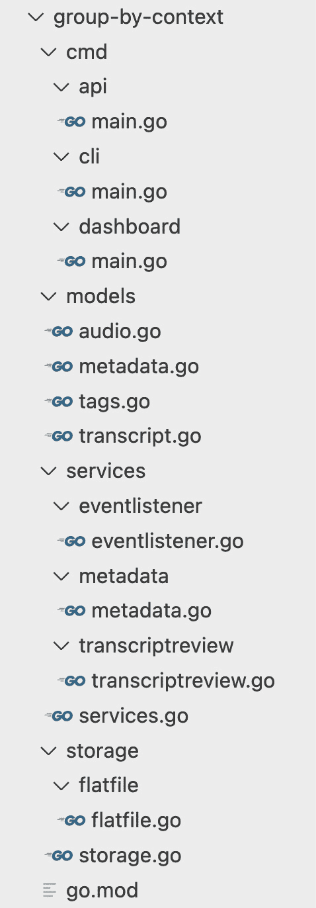
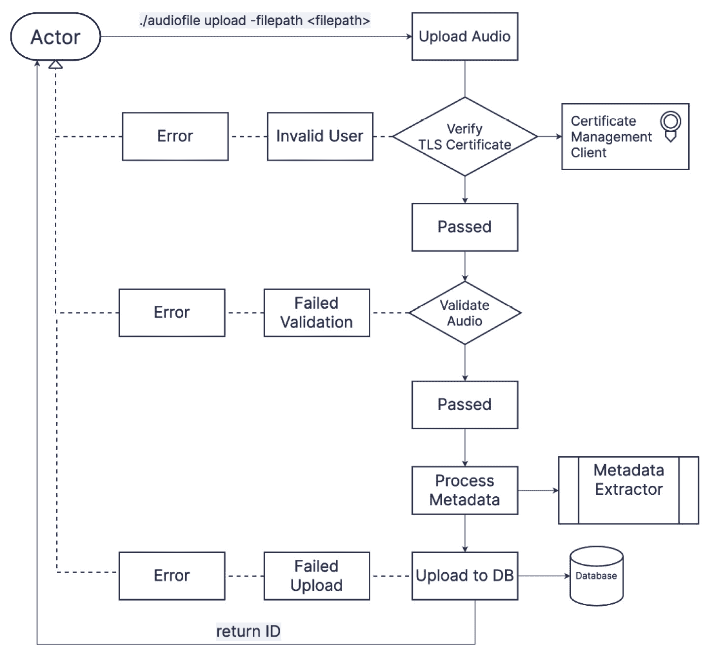
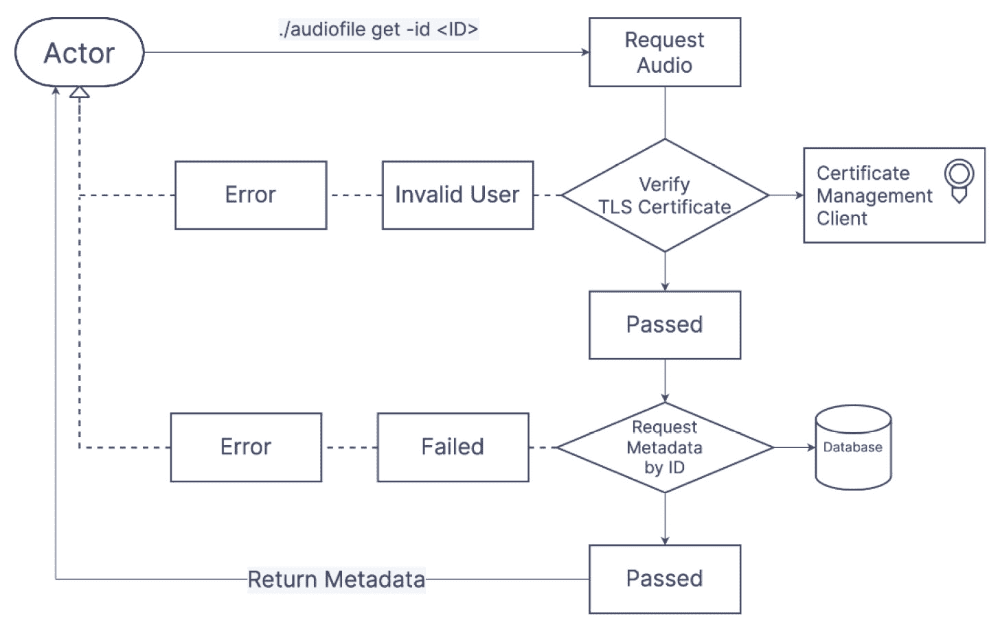
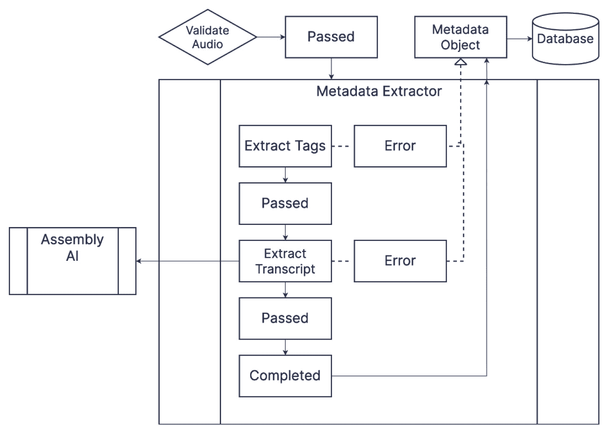

# 第二章：为 CLI 应用程序结构化 Go 代码

编程就像任何其他创造性过程一样。它从一张白纸开始。不幸的是，当面对一张白纸并且对从头开始编程应用的经验有限时，可能会产生怀疑——如果您不知道如何开始，可能会觉得这根本不可能。

本章是关于创建新应用程序的第一步指南，从一些最流行的代码结构方式开始，描述每种方式，权衡它们的优缺点。讨论了领域驱动设计，因为这也可以影响应用程序的最终结构。

一个*音频元数据 CLI 应用程序*的例子让我们了解一些现实世界的用例或需求可能看起来是什么样子。学习如何定义应用程序的用例和需求是确保项目成功并且满足所有相关方需求的繁琐但必要的步骤。

到本章结束时，您将学会构建基于您特定用例和需求的应用程序所需的所有技能。

本章将涵盖以下主题：

+   适用于健壮应用的常用程序布局

+   确定用例和需求

+   结构化音频元数据 CLI 应用程序

# 技术要求

您可以在 GitHub 上找到程序布局示例：[`github.com/PacktPublishing/Building-Modern-CLI-Applications-in-Go/tree/main/Chapter02/Chapter-2`](https://github.com/PacktPublishing/Building-Modern-CLI-Applications-in-Go/tree/main/Chapter02/Chapter-2)。

# 适用于健壮应用的常用程序布局

在您的编程旅程中，您可能会遇到许多不同的应用程序结构。对于 Go 来说，没有标准的编程布局。然而，鉴于所有这些自由，结构的选择必须谨慎做出，因为它将决定我们是否理解并且知道如何维护我们的应用程序。理想的应用程序结构也将是简单、易于测试，并且直接反映业务设计和代码的工作方式。

在选择 Go 应用程序的结构时，使用您的最佳判断。不要随意选择。听取上下文中的建议，并学会为您的选择辩护。没有理由过早地选择结构，因为随着时间的推移，您的代码会演变，某些结构更适合小型应用程序，而其他结构更适合中型到大型应用程序。

## 程序布局

让我们深入了解到目前为止为 Go 语言开发的常见和新兴的结构模式。理解每个选项将帮助您为您的下一个应用程序选择最佳的设计结构。

### 平面结构

这是开始时最简单的结构，也是当你开始一个应用程序、只有少量文件并且仍在了解需求时最常见的情况。将平面结构演变为模块化结构要容易得多，因此最好在开始时保持简单，并在项目增长时再进行分区。

让我们来看看这种结构的优点和缺点：

+   **优点**:

    +   对于小型应用程序和库来说非常好

    +   没有循环依赖

    +   它更容易重构为模块化结构

+   **缺点**:

    +   随着项目的增长，这可能会变得复杂和无序

    +   任何东西都可以被其他任何东西访问和修改

+   **示例**

+   如其名称所示，所有文件都位于根目录中，呈平面结构。没有层次结构或组织，当文件数量较少时，这种结构效果很好：



图 2.1 – 平面代码结构的示例

随着你的项目增长，有几种不同的方式可以对你的代码进行分组以保持其组织性，每种方式都有其优点和缺点。

### 按功能分组代码

代码根据其相似功能进行分离。例如，在*Go REST API*项目中，Go 文件通常根据处理器和模型进行分组。

让我们来看看这种结构的优点和缺点：

+   **优点**:

    +   容易将代码重构为其他模块化结构

    +   容易组织

    +   它阻止了全局状态

+   **缺点**:

    +   共享变量或功能可能没有明确的位置可以存放

    +   初始化发生的位置可能不清楚

为了减轻可能出现的任何混淆，最好遵循 Go 的最佳实践。如果你选择从项目根目录的`main.go`文件初始化应用程序。这种结构，正如其名称所暗示的，是根据功能来分离代码的。以下图示是按功能分组和可能落入这些不同类别的代码类型的示例：



图 2.2 – 按功能分组的示例

+   **示例**：以下是一个遵循按功能分组结构的文件夹组织示例。类似于示例分组，与处理器相关的文件夹包含每种类型处理器的代码，与提取器相关的文件夹包含每种特定提取类型的代码，存储也按类型组织：



图 2.3 – 按功能分组结构的示例

### 按模块分组

不幸的是，这种架构风格的标题有点冗余。为了澄清，按模块分组意味着创建单独的包，每个包都服务于一个功能，并包含完成这些功能所需的所有内容：

+   **优点**:

    +   它更容易维护

    +   开发速度更快

    +   存在低耦合和高内聚

+   **缺点**:

    +   它复杂且难以理解

    +   它必须有严格的规则才能保持良好的组织

    +   它可能会导致包方法名称的重复

    +   可能不清楚如何组织聚合功能

    +   可能会出现循环依赖

以下是如何按模块分组包的视觉表示。在以下示例中，代码根据提取器接口的实现进行分组：



图 2.4 – 模块分组的视觉表示

+   **示例**

+   以下是一个示例，说明如何在特定的模块文件夹中组织代码。在以下示例中，提取、存储和定义类型、标签、转录和其他元数据的代码存储在单个定义的文件夹中：



图 2.5 – 基于模块结构的示例

### 基于上下文分组

这种结构通常由项目开发的领域或特定主题驱动。在开发者和领域专家之间通信中使用的通用领域语言通常被称为通用语言。它有助于开发者理解业务，并帮助领域专家理解变化的技術影响。

**六边形架构**，也称为**端口**和**适配器**，是一种流行的领域驱动设计架构，在概念上将应用程序的功能区域划分为多个层次。这些层次之间的边界是接口，也称为端口，它们定义了它们如何相互通信，适配器存在于层次之间。在这个分层架构中，外层只能与内层通信，反之则不行：

+   **优点**:

    +   业务团队成员和开发者之间的沟通增加

    +   当业务需求变化时，它具有灵活性

    +   它易于维护

+   **缺点**:

    +   它需要领域专业知识，并且开发者在实施之前必须首先理解业务

    +   由于它需要更长的初始开发时间，因此成本较高

    +   它不适合短期项目

以下提供了一个典型的六边形结构的视觉表示。箭头指向内部实体，以区分外层可以访问内层，但反之则不行：



图 2.6 – 六边形架构的视觉表示

+   **示例**：以下是一个按上下文组织的文件夹结构。具有单个业务功能的服务被分别放入各自的文件夹中：



图 2.7 – 基于上下文结构的示例

这就总结了 Go 应用程序的不同类型的组织结构。对于你的应用程序来说，不一定有一个正确或错误的文件夹结构可以使用；然而，业务结构、项目大小以及你的总体偏好可能会在最终决策中发挥作用。这是一个重要的决定，所以在继续之前要仔细思考！

## 常见文件夹

无论选择哪种结构，现有的 Go 项目中通常都有一些命名文件夹。遵循这种模式将有助于维护者和未来的开发者更好地理解应用程序：

+   `cmd` 文件夹是应用程序的主要入口点。目录名称与应用程序名称匹配。

+   `pkg` 文件夹包含可能被外部应用程序使用的代码。尽管关于这个文件夹的有用性存在争议，但 `pkg` 是明确的，明确性使得理解变得清晰。我之所以支持只保留这个文件夹，是因为它的清晰性。

+   `internal` 文件夹包含私有代码和库，这些代码和库不能被外部应用程序访问。

+   `vendor` 文件夹包含应用程序的依赖项。它是由 `go mod vendor` 命令创建的。除非你正在创建一个库，否则通常不会将其提交到代码仓库；然而，有些人觉得有一个备份会更安全。

+   `api` 文件夹通常包含应用程序的 *REST API* 代码。它也是 Swagger 规范、模式定义文件和协议定义文件的地方。

+   `web` 文件夹包含特定的网络资源和应用程序组件。

+   `configs` 文件夹包含配置文件，包括任何 `confd` 或 `consul-template` 文件。

+   `init` 文件夹包含任何系统初始化（启动）和进程管理（停止/启动）脚本以及监督配置。

+   `scripts` 文件夹包含执行各种构建、安装、分析和操作的脚本。将这些脚本分离出来将有助于保持 **makefile** 小而整洁。

+   `build` 文件夹包含用于打包和持续集成的文件。任何云、容器或打包配置和脚本通常存储在 `/build/package` 文件夹下，而持续集成文件存储在 `build/ci` 下。

+   `deployments` 文件夹存储与系统和容器编排相关的配置和模板文件。

+   `test` 文件夹或把测试文件直接放在代码文件旁边。这是一个个人偏好的问题。

注意

无论你的项目结构中包含哪些文件夹，使用清楚地表明包含内容的文件夹名称。这将帮助当前和未来的项目维护者和开发者找到他们需要的东西。有时，确定包的最佳名称可能会有困难。避免过度使用的术语，如 *util*、*common* 或 *script*。将包名格式化为全部小写，不要使用 `snake_case` 或 `camelCase`，并考虑包的功能责任，找到一个反映它的名称。

所述的所有上述常见文件夹和结构模式都适用于构建 CLI 应用程序。根据 CLI 是否是现有应用程序的新功能，你可能正在继承现有的结构。如果存在一个现有的`cmd`文件夹，那么最好在该文件夹下定义一个 CLI 的入口，并使用一个标识 CLI 应用程序的文件夹名称。如果是一个新的 CLI 应用程序，从扁平结构开始，并从那里发展成模块化结构。从上述示例中，你可以看到扁平结构如何随着应用程序扩展到提供更多功能而自然增长。

# 确定用例和需求

在构建 CLI 应用程序之前，你需要对应用程序的目的和职责有一个概念。应用程序的目的可以定义为一种总体描述，但为了开始实施，有必要将目的分解为用例和需求。用例和需求的目标是围绕应用程序应该做什么进行有效讨论，结果是每个人都对将要构建的内容有一个共同的理解，并且随着应用程序的发展继续这些讨论。

## 用例

**用例**是记录项目功能性需求的一种方式。对于 CLI 来说，这一步通常是在从内部或外部业务客户那里收集了一些高级需求后由工程师处理的。在技术实施之前，对应用程序的目的有一个清晰的了解并记录用例是很重要的，因为用例本身不会包含任何特定于实现的术语或关于界面的细节。在与客户讨论需求的过程中，可能会出现与实现相关的话题。理想情况下，最好将对话引导回用例需求，一次处理一个问题，并专注于与正确的人进行正确的讨论。结果产生的用例将反映应用程序的目标。

## 需求

**需求**文档记录了系统在执行用例时所有非功能性约束。尽管系统可以在不满足这些非功能性需求的情况下仍然工作，但结果可能无法满足用户或消费者的期望。以下是一些常见的需求类别，接下来将逐一详细讨论：

+   **安全**

安全需求确保敏感信息得到安全传输，并且应用程序遵守安全的编码标准和最佳实践。

一些示例安全需求包括以下内容：

+   从日志中排除与会话和系统相关的敏感数据

+   删除未使用的账户

+   应用程序中没有使用默认密码

+   **容量**

容量需求处理应用程序必须处理以实现生产目标的数据量大小。确定今天的存储需求以及您的应用程序如何随着增加的容量需求而扩展。以下是一些容量需求的例子：

+   日志存储空间需求

+   几个并发用户可以在任何给定时间使用该应用程序

+   可以传递到应用程序中的数据量的限制

+   **兼容性**

兼容性需求确定了应用程序正常运行所需的最小硬件和操作系统要求。以下是一些例子，包括在安装要求中声明以下内容：

+   所需的架构

+   所有兼容和非兼容的硬件

+   CPU 和内存需求

+   **可靠性和可用性**

可靠性和可用性需求定义了在完全或部分故障期间会发生什么，并设定了您应用程序可访问性的标准。以下是一些例子：

+   每个交易或时间框架允许的最小失败次数

+   为您的应用程序定义可访问时间

+   **可维护性** **和可管理性**

可维护性需求决定了当发现错误或需要新功能时，应用程序可以被修复或增强的难易程度。可管理性需求决定了管理员管理应用程序的难易程度。以下是一些可维护性需求的例子：

+   必须快速检测错误并在适当的时间内修复

+   应用程序应与最新的硬件和操作系统版本保持兼容

+   **可扩展性**

可扩展性需求决定了您的应用程序在还能按预期运行的最高工作量。这主要受两个因素驱动：早期的软件决策和基础设施。扩展可以是横向的或纵向的，其中横向扩展涉及向系统中添加更多节点，而纵向扩展意味着向机器添加更多内存或更快的 CPU。以下是一些例子：

+   几个并发连接的用户可以使用该应用程序并得到预期的结果

+   每毫秒的交易数量是有限的

+   **可用性**

可用性需求决定了用户体验的质量。以下是一些简单的例子：

+   当用户做错事时，应用程序帮助引导用户使用正确的操作

+   帮助和文档告知用户使用新参数和标志

+   在长时间操作期间，用户可以了解其进度

+   **性能**

性能需求决定了应用程序的响应性。这包括以下内容：

+   用户等待特定操作完成的最低所需时间

+   对用户操作的响应性

+   **环境**

环境需求决定了系统预期将在哪些环境中运行。以下是一些例子：

+   必须设置的所需环境变量

+   需要与应用程序一起安装的第三方软件的依赖性

通过花时间定义用例和需求，所有相关人员都将获得清晰的画面，并对应用程序的目的和功能有一个共同的理解。共同的理解将导致一个在多个方面受益的产品，我们现在将讨论这些。

## 用例和需求的不利因素和优势

通过用例和需求映射功能性和非功能性需求可以极大地提高应用程序的结果。

确定用例和需求的一些不利因素：

+   由于需求需要时间来正确定义，这会减慢开发过程

+   用例和需求可能会随时间变化

接下来，我们有一些确定用例和需求的优势：

+   它提供了最佳的可能结果

+   与你的团队进行问题解决讨论确定潜在问题、误用或误解

+   它定义了应用程序的目标、未来目标和估计成本

+   你可以对每个需求进行优先级排序

目标是获得一种清晰度，帮助开发者专注于以最少的不确定性解决问题。与团队一起确定应用程序目标所花费的有益讨论和协作时间是过程中必要的方面，这些方面可以在定义用例和需求的同时实现。

## CLI 的用例、图表和需求

让我们讨论一个理论场景，以说明如何为 CLI 构建用例和图表。假设有一家大型音频公司，有一个团队完全专注于元数据提取。这个团队向他们的客户和同一音频公司内的其他内部团队提供音频元数据。目前，他们有一个可供公司内部网络中任何人使用的 API，但一个运维团队请求一个 CLI 工具。运维团队认识到围绕 CLI 应用程序快速构建脚本的益处，这可能为团队开辟新的创新机会。

现有的面向客户的 API 用例应与 CLI 相似，因为实现和用户界面不是文档的一部分。考虑一下元数据团队面向内部的 CLI 用例。为了记录，我们将对它们进行编号，并取前几个用例作为例子：

1.  上传音频

1.  请求元数据

1.  提取元数据

1.  将语音转换为文本

1.  请求语音到文本的转录本

1.  在存储中列出音频元数据

1.  在存储中搜索音频元数据

1.  从存储中删除音频

为了记录，我们将对它们进行编号，并取前三个用例作为例子。

### 用例 1 – 上传音频

一个经过身份验证的操作团队成员可以通过提供文件路径来上传音频。上传过程将自动将上传保存到存储并触发音频处理以提取元数据，并且应用程序将响应一个唯一的 ID，用于请求元数据。

这个用例可以被分解成一些常见的组件：

+   **行动者**是最终用户。这可以定义为人类或另一个机器过程。在这个示例用例中，主要行动者是操作团队成员，但由于团队希望使用此 CLI 进行脚本编写，另一个机器过程也是一个行动者。

+   **前提条件**是必须发生以使用例发生的陈述。在这个例子中，成员必须在任何用例成功运行之前进行身份验证。*图 2**.8*中的前提条件由指向**验证 TLS 证书**的实线箭头表示，它通过**证书管理客户端**确认用户已通过身份验证。

+   `upload`命令。此用例触发另一个用例，即内部提取音频文件元数据并将其保存到存储的*用例 3，提取元数据*。这由**元数据提取器**过程框表示。

+   当一切按预期进行，没有异常或错误时，**基本流程**被激活。在*图 2**.8*中，基本流程是一条实线。用户上传音频，并最终返回一个 ID 作为响应。成功！

+   **替代流程**显示了基本流程的变体，其中发生错误或异常。在*图 2**.8*中，替代流程是一条虚线。用户上传音频，但发生错误 – 例如，*用户无效*或*音频文件不存在*。

注意

使用用例图通过实线表示基本流程，虚线表示替代流程来展示上传音频的用例。



图 2.8：使用元数据 CLI 上传音频的用例图

与图(*图 2**.8*）一起，我们可以将用例完全写出来如下：

+   **用例 1 –** **上传音频**：

    +   **名称**：上传音频。

    +   **描述**：**行动者**通过提供文件路径上传音频。应用程序返回一个唯一的 ID，用于请求音频元数据。行动者代表操作团队成员或另一个机器过程。

    +   **前提条件**：行动者必须经过身份验证。在*图 2.8*中，这由从**上传音频**框到**验证 TLS** **证书**菱形的实线表示。

    +   **触发**：**行动者**在传递有效文件路径作为标志时触发上传命令 – 在*图 2.8*中，指向**行动者**到**上传音频**的箭头。

+   **基本流程**：

行动者通过 CLI 运行`upload`命令 – 在*图 2**.8*中，指向**行动者**到**上传音频**的箭头：**

1.  一旦**前提条件**得到验证，音频将被验证。在*图 2.8*中，这通过**验证音频**框表示。

1.  在*图 2.8*中，验证后的音频移动到**处理元数据**步骤，这涉及到提取元数据，这通过指向**元数据提取器**过程框的箭头表示。

1.  验证后的音频移动到**上传音频**的下一个步骤，将音频保存到**数据库**（**DB**），在*图 2.8*中由**上传到数据库**框表示。

1.  在*图 2.8*中，**返回 ID**框表示从数据库返回的**ID**，稍后传递给**参与者**。

+   **备选流程**:

    1.  **未认证用户的错误**: 当 TLS 证书失败时，错误返回给参与者。

        +   **最终用例**: 在*图 2.8*中，如果用户无效，错误返回，如虚线从**无效用户**到**错误**框，然后箭头回到**参与者**。

    1.  **无效音频的错误**: 当音频未能通过验证过程时，错误返回给参与者。

        +   **最终用例**: 在*图 2.8*中，如果音频无效，错误返回给参与者，如**验证失败**到**错误**框，然后箭头回到**参与者**。

    1.  **将验证后的音频上传到存储时出错**: 当音频上传到数据库失败时，错误返回给参与者。

    +   **最终用例**: 在*图 2.8*中，从**上传到数据库**返回的虚线连接到**失败上传**，然后箭头回到**参与者**的**错误**框。

### 用例 2 - 请求元数据

操作团队成员的认证成员可以通过提供`get`命令检索音频元数据，将输出请求的音频元数据，匹配的 ID，以指定的格式（纯文本或 JSON）。

注意

请求音频用例的用例图用实线表示基本流程，用虚线表示备选流程。



图 2.9：请求元数据用例的使用情况图

在手头有先前的图（*图 2.9*）的情况下，让我们进入以下用例：

**用例 2 - 请求元数据**:

+   **名称**: 请求元数据。

+   `get`命令并提供音频的**ID**。应用程序将以纯文本或 JSON 格式输出请求的音频元数据。

+   **前提条件**: **参与者**必须经过认证。在*图 2.9*中，这通过从**请求音频**框到**验证 TLS** **证书**菱形的实线表示。

+   `get`命令并传入**ID**作为参数-在*图 2.9*中，指向**请求音频**框的箭头。

注意，在先前的用例 1 中使用了不同的格式级别 - 在整个章节中对所有用例保持一致？

**基本流程**

1.  演员在 CLI 中运行`get`命令。在*图 2.9*中，基本流程由实线表示，并从指向**演员**到**请求** **音频**框的箭头开始。

1.  一旦**前提条件**得到验证，音频元数据就通过其**ID**从数据库中检索。在*图 2.9*中，这由连接**通过**到**请求通过 ID 获取元数据**到**数据库**的实线表示。

1.  **数据库**成功返回元数据。在*图 2.9*中，这由连接**请求通过 ID 获取元数据**到**通过**框的线表示。

1.  最后，格式化的元数据返回给**演员**。在*图 2.9*中，这由连接**通过**到**演员**的实线表示。

**备选流程**

1.  **未认证用户的错误**：当 TLS 证书失败时，向演员返回错误。

    +   **最终用途**：在*图 2.9*中，如果用户无效，则返回错误，如从**无效用户**框到**错误**框然后返回到**演员**的虚线所示。

1.  **未找到错误**：如果没有匹配的元数据与**ID**相匹配，则返回错误。

+   **最终用途**：在*图 2.9*中，流程由从**失败**框到**错误**框的虚线和然后返回到**演员**的箭头表示。

### 用例 3 – 提取元数据

由**上传音频**触发，从音频文件中提取元数据，包括标签和文本数据，并将其放置在存储中。

注意

请求音频的用例图用实线表示基本流程，用虚线表示备选流程。



图 2.10：处理元数据的用例图

考虑到前面的图（*图 2.10*），让我们进入匹配的用例：

+   **用例 3 –** **提取元数据**：

    +   **名称**：提取元数据

    +   **描述**：元数据提取过程包括提取特定的元数据，包括专辑、艺术家、年份和语音到文本转录，并将其存储在存储中的元数据对象中。

    +   **前提条件**：验证过的音频

    +   **触发器**：上传音频

+   **基本流程**：

    1.  一旦满足**前提条件**，**元数据提取器**过程提取标签并将数据存储在元数据对象上。在*图 2.10*中，这由成功验证的音频，从**通过**框到**元数据提取器**过程框，然后从**提取标签**框到**通过**框的实线表示。

    1.  接下来，提取文本。在*图 2.10*中，这由从**通过**框到**提取文本**框再到下一个**通过**框的实线表示。

    1.  元数据提取完成并更新元数据对象。在*图 2.10*中，这一步由从**通过**框到**完成**的实线和连接到**元数据对象**的实线表示。

    1.  元数据对象被存储。在 *图 2**.10* 中，这由从 **元数据对象** 到 **数据库** 的实线表示。

+   **备选流程**：

注意，上述两个用例中“结束用例”的格式不同 - 检查并确保章节中所有用例的一致性

1.  **提取标签数据错误**：在 *图 2**.10* 中，这由从 **提取标签** 到 **错误** 的虚线表示。

    +   **在元数据对象上存储错误**：在 *图 2.10* 中，这由从 **错误** 到 **元数据对象** 的虚线表示。

    +   **结束用例**：在 *图 2.10* 中，这由从 **元数据对象** 到 **数据库** 的实线表示。

1.  **提取转录错误**：在提取转录元数据时发生错误。在 *图 2**.10* 中，这由从 **提取转录** 到 **错误** 的虚线表示。

+   **在元数据对象上存储错误**：在 *图 2.10* 中，这由从 **错误** 到 **元数据对象** 的虚线表示。

+   **结束用例**：在 *图 2.10* 中，这是从 **元数据对象** 到 **数据库** 的实线。

为了理解概念，没有必要为每个用例编写完整的文档。通常，由用例描述的功能性要求由利益相关者审查，并讨论以确保达成一致。

## 元数据 CLI 的要求

考虑到我们处理所有音频元数据的内部团队的理论场景，内部团队和他们的客户之间可能还会请求和定义一些非功能性要求。例如，这些要求可能包括以下内容：

+   应用程序必须在 Linux、macOS 和 Windows 上运行

+   当音频上传时返回的 ID 必须立即返回

+   应用程序必须明确指出用户误用应用程序并上传了除音频以外的文件类型

对于这个元数据 CLI 应用程序，可能有更多可能的要求，但最重要的是理解什么是要求，如何形成自己的要求，以及它与用例的不同。用例和要求可以分解为阶段以获得更多粒度，特别是对于可扩展性。应用程序会随着时间的推移而增长，并且某些功能将被添加以匹配不断增长的要求。为了参考早期的 CLI 指南，“先原型设计，后优化”，最好的做法是先让应用程序运行起来，然后再进行优化。根据遇到的问题类型，无论是处理速度慢、无法支持大量并发用户，还是无法处理每分钟的特定数量的交易，您需要以不同的方式解决这些问题。例如，在优化并发使用时可以进行负载测试，或者使用内存缓存与数据库一起优化每分钟处理的交易数量。

在定义用例和需求的同时，可以并行构建您应用程序的简单原型。

# 结构化音频元数据 CLI 应用程序

构建 CLI 应用程序的第一步是创建文件夹结构，但如果您不是从头开始，请确定 CLI 应用程序可能添加的位置。假设音频元数据 API 应用程序的现有结构是使用领域驱动架构构建的。为了了解其结构，让我们将应用程序的构建块进行分类。

## 限界上下文

**限界上下文**为实体和对象带来了更深的含义。在我们的元数据应用程序中，消费者使用 API 搜索音频转录。操作团队希望使用 CLI 搜索音频元数据。API 消费者可能对元数据和音频转录都感兴趣，但其他团队可能更关注音频转录的结果。每个团队都为元数据带来了不同的上下文。然而，由于标签、专辑、艺术家、标题和转录都被视为元数据，它们可以封装在一个单一实体中。

## 语言

用于区分不同上下文的**语言**被称为**通用语言**。因为团队对不同的术语有不同的理解，这种语言有助于以所有相关方都同意的术语描述应用程序。

对于元数据应用程序，术语**元数据**包括从音频中提取的所有数据，包括转录，**元数据提取**是从音频中提取技术元数据和转录的过程。术语**用户**指代更大组织内部团队中的任何成员，而术语**音频**指代在特定长度限制内的任何录音。

## 实体和值对象

**实体**是由语言定义的对象模型。值对象是存在于实体中的字段。例如，元数据 CLI 的主要实体是音频和元数据。元数据是音频实体中的一个值对象。此外，每种提取类型可能都是元数据实体中的一个值对象。此音频元数据 CLI 应用程序的实体和值对象列表包括以下内容：

+   音频

+   元数据

+   标签

+   转录

## 聚合

**聚合**是指两个独立实体的合并。假设在音频公司的元数据团队中，用户希望对转录进行更正，这主要是由人工智能处理的。尽管转录可能达到 95%的准确率，但有一个审阅团队可以对转录进行更正，以达到 99-100%的准确率。元数据应用程序中可能需要两个微服务，一个是元数据提取，另一个是转录审阅。可能需要一个新聚合的实体：**TranscriptionReview**。

## 服务

术语服务是通用的，所以这特别指的是业务领域的服务。在元数据应用程序的情况下，领域服务是从音频中提取元数据的元数据服务以及允许用户添加更正的转录审查服务。

## 事件

在领域驱动设计的背景下，事件是领域特定的，并通知同一领域内的其他进程其发生。在这种情况下，当用户上传音频时，他们会立即收到一个 ID。然而，元数据提取过程在幕后被触发，而不是不断地轮询请求元数据命令或端点以检索元数据对象的状态，可以向事件监听服务发送一个事件。CLI 可以有一个命令，持续监听处理完成。

## 仓库

仓库是领域或实体对象的集合。仓库有添加、更新、获取和删除对象的责任。它使聚合成为可能。仓库在领域层中实现，因此不应了解特定的数据库或存储 – 在领域内，仓库只是一个接口。在这种情况下，这个元数据应用程序的仓库可以有不同的实现 – MongoDB、ElasticSearch 或平面文件。

## 创建结构

理解特定于音频元数据 CLI 的领域驱动设计组件，我们可以开始构建特定于元数据 CLI 的文件夹结构。以下是一个示例布局：

```go
/Users/username/go/src/github.com/audiocompany/audiofile
   |--cmd
   |----api
   |----cli
   |--extractors
   |----tags
   |----transcript
   |--internal
   |----interfaces
   |--models
   |--services
   |----metadata
   |--storage
   |--vendor
```

### 主要文件夹

每个文件夹如下：

+   `cmd`：命令文件夹是音频元数据项目中两个不同应用程序的主要入口点：API 和 CLI。

+   `extractors`：此文件夹将包含从音频中提取元数据的包。尽管这个提取器列表会增长，但我们可以从几个提取器包开始：`tags`和`transcript`。

+   `models`：此文件夹将包含所有领域实体的结构。要包含的主要实体是音频和元数据。每个提取器也可能有自己的数据模型，可以存储在这个文件夹中。

+   `services`：在我们的前一次讨论中定义了三个服务 – 元数据（提取）服务、转录审查服务以及一个事件监听服务，该服务将监听处理事件并输出通知。现有和新服务都存在于这个文件夹中。

+   `storage`：存储的接口和个别实现都存在于这个文件夹中。

# 摘要

在本章中，我们学习了如何根据业务领域的独特需求创建新应用程序的结构。我们探讨了应用程序最流行的文件夹结构以及每种结构的优缺点，以及如何编写用例和非功能性需求的文档。

虽然这一章提供了一个示例布局和该示例中存在的文件夹，但请记住，这是一个更发达项目的示例。开始时要简单，始终使用扁平结构，但随着你继续构建，开始组织你的未来文件夹结构。只需记住，你的代码结构需要时间。罗马不是一天建成的。

在讨论了这些主题之后，我们接着讨论了一个假设的现实世界例子，即一家完全专注于音频元数据的团队的公司。随后，我们讨论了一些 CLI 提供的潜在用例，这将是一个快速高效的现有 API 的替代方案。

最后，我们讨论了一种文件夹结构，它可以满足 CLI 和 API 音频元数据应用程序的需求。在*第三章* *构建音频元数据 CLI* 中，我们将构建包含模型、接口和实现的文件夹结构，以使 CLI 应用程序工作。这标志着本章节关于如何结构化你的 Go CLI 应用程序的结束！希望这能帮助你开始。

# 问题

1.  如果你想与外部应用程序或用户共享包，这些包通常会驻留在哪个常见的文件夹中？

1.  在端口和适配器，或六边形架构中，端口和适配器是什么？

1.  对于列出音频，在一个现实世界的例子中，你将如何定义这个用例的参与者、前提条件和触发器？

# 答案

1.  `pkg`文件夹包含可能被外部应用程序使用的代码。

1.  在六边形架构中，端口是接口，适配器是实现。端口允许架构的不同层之间进行通信，而适配器提供实际的实现。

1.  参与者是操作团队成员或任何 CLI 用户。用例的前提是用户必须首先进行身份验证。该用例由 API 的/list 端点（用于元数据服务）或运行列出音频的 CLI 命令触发。

# 进一步阅读

+   Kat Zein – *如何结构化你的 Go 应用* 来自 2018 年的 GopherCon ([`www.youtube.com/watch?v=oL6JBUk6tj0`](https://www.youtube.com/watch?v=oL6JBUk6tj0)) – 一场关于 Go 应用程序最常见文件夹结构的精彩演讲
