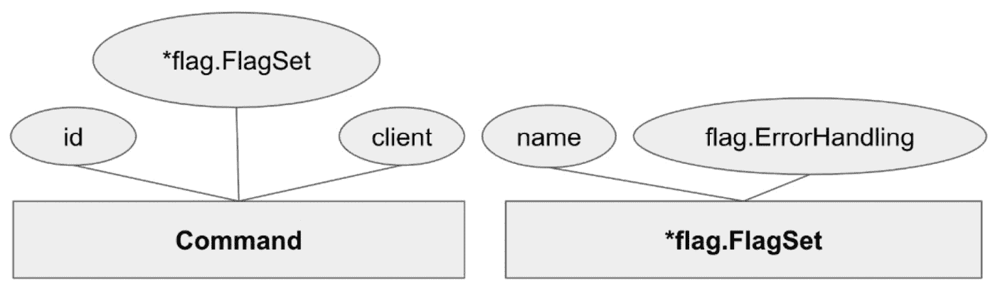
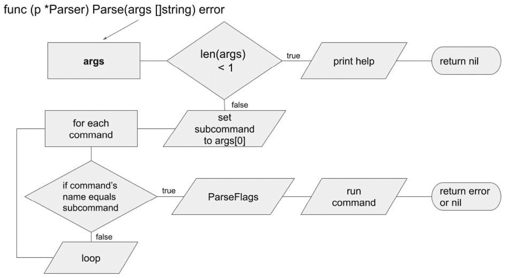
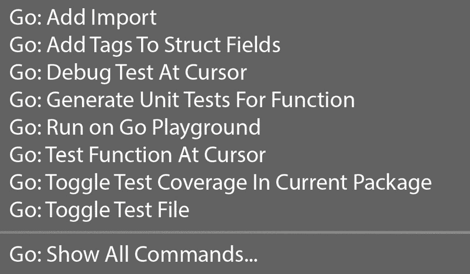

# 3

# 构建音频元数据 CLI

*动手学习* 是最好的学习方法之一。因此，在本章中，我们将从头到尾构建一些示例音频元数据 CLI 用例。代码可在网上找到，可以与本章一起或独立探索。鼓励你分叉 GitHub 仓库并玩弄代码，添加新的用例和测试，因为这些是在下一章深入探讨如何改进 CLI 之前学习的好方法。

尽管本章中的示例并非基于空代码库构建——它是基于现有的 REST API 构建的——但值得注意的是，命令的实现并不一定依赖于 API。这只是一个示例，并鼓励你在本章中发挥想象力，思考如果不依赖 API，命令应该如何实现。本章将提供一个实验性的代码库，你将学习以下主题：

+   定义组件

+   实现用例

+   测试和模拟

# 技术要求

下载以下代码以进行跟随：

[`github.com/PacktPublishing/Building-Modern-CLI-Applications-in-Go/tree/main/Chapter03/audiofile`](https://github.com/PacktPublishing/Building-Modern-CLI-Applications-in-Go/tree/main/Chapter03/audiofile)

安装最新版本的 VS Code 并带有最新的 Go 工具。

# 定义组件

以下是我们音频元数据 CLI 的文件夹结构。在上一个章节中描述了该结构中的主要文件夹。在这里，我们将进一步详细说明每个文件夹包含的内容，以及从上到下存在的文件和代码：

```go
   |--cmd
   |----api
   |----cli
   |------command
   |--extractors
   |----tags
   |----transcript
   |--internal
   |----interfaces
   |--models
   |--services
   |----metadata
   |--storage
   |--vendor
```

## cmd/

如前所述，在*第二章*的“*为 CLI 应用程序结构化 Go 代码*”部分中，在“*常用程序布局以构建健壮应用程序*”一节中，`cmd` 文件夹是项目不同应用程序的主要入口点。

## cmd/api/

位于 `cmd/api/` 文件夹中的 `main.go` 文件将开始在本地机器上运行音频元数据 API。它接受一个可选的端口号标志，默认为 `8000`，并将端口号传递到 `services` 方法中的 `Run` 方法，以启动元数据服务：

```go
package main
import (
    metadataService "audiofile/services/metadata"
    "flag"
    "fmt"
)
func main() {
    var port int
    flag.IntVar(&port, "p", 8000, "Port for metadata
      service")
    flag.Parse()
    fmt.Printf("Starting API at http://localhost:%d\n",
      port)
    metadataService.Run(port)
}
```

我们使用了 `flag` 包，该包实现了简单的命令行标志解析。可以定义不同的标志类型，例如 `String`、`Bool` 和 `Int`。在先前的示例中，定义了一个 `-p` 标志来覆盖默认端口 `8000`。在定义所有标志之后调用 `flag.Parse()` 来解析行到定义的标志。使用 Go 的 `flag` 包允许通过几种语法方法将标志传递给命令。无论哪种方式，`8080` 的值都将被解析：

```go
-p=8080
-p 8080  // this works for non-boolean flags only
```

有时，一个标志不需要参数，仅凭它本身就足以让代码知道确切要做什么：

```go
-p
```

可以对传递的标志采取行动，但变量将在定义时包含默认值`8000`。

要从项目的根目录启动 API，请运行`go run cmd/api/main.go`，你将看到以下输出：

```go
audiofile go run cmd/api/main.go
Starting API at http://localhost:8000
```

## cmd/cli/

在`cmd/cli/`文件夹中的这个`main.go`文件运行 CLI，像许多其他 CLI 一样，这个 CLI 将通过调用它来利用 API。由于 CLI 需要 API 运行才能工作，因此请在单独的终端或后台首先运行 API。`cmd/cli/main.go`文件包含以下代码：

```go
package main
import (
    "audiofile/internal/command"
    "audiofile/internal/interfaces"
    "fmt"
    "net/http"
    "os"
)
func main() {
    client := &http.Client{}
    cmds := []interfaces.Command{
        command.NewGetCommand(client),
        command.NewUploadCommand(client),
        command.NewListCommand(client),
    }
    parser := command.NewParser(cmds)
    if err := parser.Parse(os.Args[1:]); err != nil {
        os.Stderr.WriteString(fmt.Sprintf("error: %v",
          err.Error()))
        os.Exit(1)
    }
}
```

在`main.go`文件中，命令被添加到`interface`类型的`Command`切片中。每个命令被定义并添加：

```go
command.NewGetCommand(client),
command.NewUploadCommand(client),
command.NewListCommand(client),
```

每个命令都接受一个`client`变量，一个默认的`http.Client`，作为参数来使用，以便向音频元数据 API 端点发送 HTTP 请求。传递`client`命令允许它轻松地进行模拟测试，我们将在下一节中讨论。

然后，将命令传递给`NewParser`方法，该方法创建一个指向`command.Parser`的指针：

```go
parser := command.NewParser(cmds)
```

这个`Parse`函数通过`os.Args[1:]`参数值接收应用程序名称之后的全部参数。例如，假设命令行如下调用：

```go
 ./audiofile-cli upload -filename recording.m4v
```

然后，第一个参数`os.Args[0]`返回以下值：

```go
 audiofile-cli
```

为了进一步解释，让我们看看`Command`结构体及其中的字段：



图 3.1 – 命令结构体和 flag.FlagSet 实体

让我们看看图中所示的`GetCommand`结构体：

```go
type GetCommand struct {
    fs *flag.FlagSet
    client interfaces.Client
    id string
}
```

每个命令都有一个标志集，其中包含命令的名称、错误处理、客户端和 ID。

Go 程序的参数存储在`os.Args`切片中，它是一组字符串的集合。正在运行的可执行文件名称存储在`os.Args`切片的第一个元素中（即`os.Args[0]`），而传递给可执行文件的参数存储在后续元素中（`os.Args[1:]`）。

当你看到代码`parser.Parse(os.Args[1:])`时，这意味着你正在将命令行参数的其余部分传递给`parse.Parse`函数，跳过了第一个参数（程序名称）。在这种情况下，除了程序名称之外的所有命令行参数都将传递给该函数。

这意味着当我们传递`os.Args[1:]`时，我们正在将程序名称之后的全部参数传递给`parse.Parse`：

```go
 upload –filename recording.m4v
```

`Parse`函数接收一个字符串列表`args`，并返回一个`error`类型。该函数将命令行参数转换为可执行命令。

让我们结合以下流程图来逐步分析代码：

+   它检查参数是否少于 1 个。如果是这样，`help()`返回`nil`。

+   如果切片中至少有一个项目，则`Args[0]`被分配给子命令。这显示了用户的命令。

+   函数随后遍历`Parser`结构体的`p.commands`属性。它通过执行`Name()`方法来检查每个命令的名称，并与`subcommand`变量进行比较。

+   如果找到匹配项，则函数使用`args[1:]`的其余`args`切片执行命令的`ParseFlags`方法。最后，函数运行命令并返回结果。

+   如果没有找到匹配项，则方法使用`fmt.Errorf`函数返回一个未知子命令错误信息。

实质上，代码从命令行参数中查找并执行一个命令。然后，运行匹配的命令。



图 3.2 – 解析方法的流程图

对于每个 API 端点都存在一个命令。例如，`UploadCommand`将调用`/upload`端点，`ListCommand`将调用`/list`端点，而`GetCommand`将调用 REST API 的`/get`端点。

在`Parse`方法中，检查`args`的长度。如果没有传递任何参数，则打印帮助信息，程序返回`nil`：

```go
audiofile ./audiofile-cli
usage: ./audiofile-cli <command> [<args>]
These are a few Audiofile commands:
    get      Get metadata for a particular audio file by id
    list     List all metadata
    upload   Upload audio file
```

## cmd/cli/command

在`cmd/cli/command`文件夹中，有与每个 audiofile API 端点匹配的命令。在下一节中，我们将编写`upload`、`list`和`get`命令以实现上一章中描述的几个用例。而不是在这里定义这些命令中的任何一个的代码，我将提供一个用于定义满足`Command`接口的随机命令的结构：

```go
package command
import (
    "github.com/marianina8/ audiofile/internal/cli"
    "github.com/marianina8/ audiofile/internal/interfaces"
    "flag"
    "fmt"
)
func NewRandomCommand(client interfaces.Client)
    *RandomCommand {
    gc := &RandomCommand{
        fs: flag.NewFlagSet("random",
           flag.ContinueOnError),
        client: client,
    }
    gc.fs.StringVar(&gc.flag, "flag", "", "string flag for
      random command")
    return gc
}
type RandomCommand struct {
    fs *flag.FlagSet
    flag string
}
func (cmd *RandomCommand) Name() string {
    return cmd.fs.Name()
}
func (cmd *RandomCommand) ParseFlags(flags []string) error {
    return cmd.fs.Parse(flags)
}
func (cmd *RandomCommand) Run() error {
    fmt.Println(rand.Intn(100))
    return nil
}
```

`upload`、`get`和`list`命令遵循相同的结构，但构造函数和`Run`方法的实现不同。

此外，在`cmd/cli/command`文件夹中，还有一个结构类型的解析器，它具有解析参数、将它们与命令匹配以及解析子命令之后找到的任何标志的方法。`NewParser`函数创建一个`Parser`结构的新实例。它接受一个类型为`[]interfaces.Command`的切片作为输入，并返回一个指向`Parser`结构的指针。此初始化方法提供了一种轻松设置具有一组所需命令的结构的方法。以下是在`parser.go`文件内的代码：

```go
package command
import (
    "github.com/marianina8/audiofile/internal/interfaces"
    "fmt"
)
type Parser struct {
    commands []interfaces.Command
}
func NewParser(commands []interfaces.Command) *Parser {
    return &Parser{commands: commands}
}
func (p *Parser) Parse(args []string) error {
    if len(args) < 1 {
        help()
        return nil
    }
    subcommand := args[0]
    for _, cmd := range p.commands {
        if cmd.Name() == subcommand {
            cmd.ParseFlags(args[1:])
            return cmd.Run()
        }
    }
    return fmt.Errorf("Unknown subcommand: %s", subcommand)
}
```

代码检查传递给`Parse`方法的参数数量。如果参数数量少于 1，则调用来自单独的`help.go`文件的`help`函数以打印帮助文本，指导用户正确使用：

```go
func help() {
    help := `usage: ./audiofile-cli <command> [<flags>]
These are a few Audiofile commands:
    get      Get metadata for a particular audio file by id
    list     List all metadata
    upload   Upload audio file
    `
    fmt.Println(help)
}
```

## extractors/

此文件夹包含不同音频元数据的提取器实现。在这种情况下，存在用于`tags`和`transcript`实现的子文件夹。

## extractors/tags

`tags`包在`extractors/tags`文件夹中实现。标签元数据可能包括标题、专辑、艺术家、作曲家、流派、发行年份、歌词以及任何附加注释。代码可在 GitHub 仓库中找到，并使用`github.com/dhowden/tag` Go 包。

## extractors/transcript

`transcript`包在`extractors/transcript`文件夹中实现。与其他提取包一样，代码可以在 GitHub 仓库中找到。然而，转录分析由第三方 API AssemblyAI 处理，需要 API 密钥，该密钥可以设置为本地的`ASSEMBLY_API_KEY`。

## internal/interfaces

`internal/interfaces`文件夹包含应用程序使用的接口。它包括`Command`和`Storage`接口。接口为开发者提供了一种创建满足相同接口规范的多种类型的方式，这允许在应用程序的设计中具有灵活性和模块化。`storage.go`文件定义了存储接口：

```go
package interfaces
import (
    "audiofile/models"
)
type Storage interface {
    Upload(bytes []byte, filename string) (string, string,
      error)
    SaveMetadata(audio *models.Audio) error
    List() ([]*models.Audio, error)
    GetByID(id string) (*models.Audio, error)
    Delete(id string, tag string) error
}
```

前面的接口满足所有可能的用例。具体的实现可以在`storage`文件夹中定义。如果你选择在配置中定义存储类型，你可以轻松地更换实现，并从一种存储类型切换到另一种。在这个例子中，我们定义了平面文件存储，并为每个方法实现了一个实现来满足接口。

首次在`cmd/cli/main.go`文件中使用，`Command`接口在`internal/interfaces/command.go`文件中通过以下代码定义：

```go
type Command interface {
   ParseFlags([]string) error
   Run() error
   Name() string
}
```

注意`cmd/cli/command/`文件夹中的每个命令是如何实现前面提到的接口的。

## models/

`models`文件夹包含在不同应用程序之间共享的结构。为`audiofile`应用程序定义的第一个结构是`Audio`：

```go
type Audio struct {
    Id       string
    Path     string
    Metadata Metadata
    Status   string
    Error    []error
}
```

`Id`变量包含唯一的`Audio`文件。该路径存储了音频文件的本地副本。`Metadata`变量包含从音频文件中提取的数据。在以下示例中，存储了标签和语音到文本的转录数据：

```go
type Metadata struct {
    Tags         Tags         `json:"tags"`
    Transcript   string       `json:"transcript"`
}
```

不必了解每种提取类型的结构。最重要的是主要实体类型`Audio`及其值字段`Metadata`。

## services/metadata

尽管可以在`services`文件夹中实现多个服务，但我们目前只使用了一个 API 服务，即音频元数据服务。`metadata.go`文件中只存在一个方法，即`CreateMetadataServer`方法，它在`metadata`包中被调用，以及`Run`方法，它在`cmd/api/main.go`文件中被调用。此文件还包含了`MetadataService`的结构：

```go
type MetadataService struct {
    Server *http.Server
    Storage interfaces.Storage
}
```

`CreateMetadataService`接受一个参数，即`int`类型的端口，用于定义在本地主机上运行的服务器端口。它还接受一个参数`storage`，它是`Storage`接口的一个实现。声明 API 服务器每个端点的处理程序也被定义。此函数返回`MetadataService`的指针：

```go
func CreateMetadataService(port int, storage
   interfaces.Storage) *MetadataService {
    mux := http.NewServeMux()
    metadataService := &MetadataService{
        Server: &http.Server{
            Addr:    fmt.Sprintf(":%v", port),
            Handler: mux,
        },
        Storage: storage,
    }
    mux.HandleFunc("/upload",
      metadataService.uploadHandler)
    mux.HandleFunc("/request",
      metadataService.getByIDHandler)
    mux.HandleFunc("/list", metadataService.listHandler)
    return metadataService
}
```

`Run`方法接受一个参数`port`，该参数由`p`标志的值或默认值`8000`定义，调用`CreateMetadataService`方法，并通过在服务器上调用`ListenAndServer`方法来启动服务器。启动 API 时出现的任何错误将立即返回：

```go
func Run(port int) {
    flatfileStorage := storage.FlatFile{}
    service:= CreateMetadataService(port, flatfileStorage)
    err := service.Server.ListenAndServe()
    if err != nil {
        fmt.Println("error starting api: ", err)
    }
}
```

每个处理器的实现将在下一节中讨论，当处理一些用例时。

## storage/

在`storage`文件夹中，有`flatfile.go`文件，它实现了一种将元数据本地存储到本地磁盘上按 ID 组织的平面文件的方法。由于这超出了 CLI 关注的范围，本书将不讨论代码实现。然而，你可以在 GitHub 仓库中查看代码。

## vendor/

`vendor`目录包含所有直接和间接依赖。

# 实现用例

记得上一章中定义的用例吗？让我们尝试实现其中的一些：

+   UC-01 上传音频

+   UC-02 请求元数据

## 上传音频

在本用例中，经过身份验证的用户通过提供设备上文件的存储位置来上传音频文件，目的是提取其元数据。在底层，上传过程将保存本地副本并在音频文件上运行元数据提取过程。立即返回音频文件的唯一 ID。

在我们开始实现此用例之前，让我们考虑一下上传命令可能的样子。假设我们已经确定了以下最终的命令结构：

```go
./audiofile-cli upload -filename <filepath>
```

由于`/cmd/cli/main.go`已经定义，我们只需确保`upload`命令存在并满足`command`接口，包括`ParseFlags`、`Run`和`Name`方法。在`internal/command`文件夹中，我们在`command`包内的`upload.go`文件中定义了`upload`命令：

```go
package command
import (
    "github.com/marianina8/audiofile/internal/interfaces"
    "bytes"
    "flag"
    "fmt"
    "io"
    "io"
    "mime/multipart"
    "net/http"
    "os"
    "path/filepath"
)
func NewUploadCommand(client interfaces.Client)
    *UploadCommand {
    gc := &UploadCommand{
        fs:     flag.NewFlagSet("upload",
                  flag.ContinueOnError),
        client: client,
    }
    gc.fs.StringVar(&gc.filename, "filename", "", "full
      path of filename to be uploaded")
    return gc
}
type UploadCommand struct {
    fs       *flag.FlagSet
    client   interfaces.Client
    filename string
}
func (cmd *UploadCommand) Name() string {
    return cmd.fs.Name()
}
func (cmd *UploadCommand) ParseFlags(flags []string)
  error {
    if len(flags) == 0 {
        fmt.Println("usage: ./audiofile-cli
          upload -filename <filename>")
        return fmt.Errorf("missing flags")
    }
    return cmd.fs.Parse(flags)
}
func (cmd *UploadCommand) Run() error {
    // implementation for upload command
    return nil
}
```

`NewUploadCommand`方法通过为`upload`命令定义一个新的标志集来实现我们期望的命令结构：

```go
flag.NewFlagSet("upload", flag.ContinueOnError)
```

此方法调用将字符串`upload`传递到方法的`name`参数和标志。`flag.ErrorHandling`参数中的`ContinueOnError`定义了如果解析标志时发生错误，应用程序应该如何反应。处理解析错误的不同选项，大多数都是自我解释的，包括以下内容：

+   `flag.ContinueOnError`

+   `flag.ExitOnError`

+   `flag.PanicOnError`

现在我们已经定义并添加了`upload`命令，我们可以测试它。在测试过程中，你会看到`upload`命令运行无误，但立即退出且没有响应。现在，我们准备实现`upload`命令的`Run`方法。

当我们最初开始为 audiofile 应用程序实现 CLI 时，API 已经存在。我们讨论了 API 如何启动和运行`MetadataServer`，该服务器处理对一些现有端点的请求。对于此用例，我们关注的是`http://localhost/upload`端点。

考虑到这一点，让我们深入了解这个 REST API 上传端点的文档，这样我们就可以确切地知道如何构造`curl`命令。

### 上传音频

为了上传音频，我们需要知道如何与 API 通信以处理某些任务。以下是设计请求以处理上传音频所需的具体细节：

+   `POST`

+   `http://localhost/upload`

+   `Content-Type: multipart/form-data`

+   `键 ("file") 值 (bytes) 文件名的基础名(base)`

确保 API 正在运行，然后使用`curl`测试端点。立即返回上传文件的 ID：

```go
curl --location --request POST 'http://localhost/upload' \
--form 'file=@"recording.mp3"'
8a6dc954-d6df-4fc0-882e-14eb1581d968%
```

在成功测试了 API 端点之后，我们可以在`UploadCommand`的`Run`方法中编写 Go 代码，以实现与之前`curl`命令相同的功能。

现在可以定义新的`Run`方法。该方法提供传递给`upload`命令的作为标志参数的文件名，并将该文件的字节保存到`http://localhost/upload`端点的 multipart 表单`POST`请求中：

```go
func (cmd *UploadCommand) Run() error {
    if cmd.filename == "" {
        return fmt.Errorf("missing filename")
    }
    fmt.Println("Uploading", cmd.filename, "...")
    url := "http://localhost/upload"
    method := "POST"
    payload := &bytes.Buffer{}
    multipartWriter := multipart.NewWriter(payload)
    file, err := os.Open(cmd.filename)
    if err != nil {
        return err
    }
    defer file.Close()
    partWriter, err := multipartWriter
      .CreateFormFile("file", filepath.Base(cmd.filename))
    if err != nil {
        return err
    }
    _, err = io.Copy(partWriter, file)
    if err != nil {
        return err
    }
    err = multipartWriter.Close()
    if err != nil {
        return err
    }
    client := cmd.client
    req, err := http.NewRequest(method, url, payload)
    if err != nil {
        return err
    }
    req.Header.Set("Content-Type",
      multipartWriter.FormDataContentType())
    res, err := client.Do(req)
    if err != nil {
        return err
    }
    defer res.Body.Close()
    body, err := io.ReadAll(res.Body)
    if err != nil {
        return err
    }
    fmt.Println("Audiofile ID: ", string(body))
    return err
}
```

第一个 CLI 命令`upload`已经实现！让我们实现另一个用例，通过 ID 请求元数据。

## 请求元数据

在请求元数据用例中，认证用户通过音频文件的 ID 请求音频元数据。在底层，请求元数据的过程将在平面文件存储实现中搜索与音频文件对应的`metadata.json`文件，并将其内容解码到`Audio`结构体中。

在实现请求元数据用例之前，让我们考虑请求元数据的命令将是什么样子。最终的命令结构将如下所示：

```go
./audiofile-cli get -id <ID>
```

为了简化，`get`是请求元数据的命令。让我们定义新的`get`命令，并在`/cmd/cli/main.go`中确认当应用程序运行时它存在于可识别的命令列表中。定义`get`命令的结构与第一个命令`upload`类似：

```go
package command
import (
    "github.com/marianina8/audiofile/internal/interfaces"
    "bytes"
    "flag"
    "fmt"
    "io"
    "net/http"
    "net/url"
)
func NewGetCommand(client interfaces.Client) *GetCommand {
    gc := &GetCommand{
        fs:     flag.NewFlagSet("get",
                  flag.ContinueOnError),
        client: client,
    }
    gc.fs.StringVar(&gc.id, "id", "", "id of audiofile
      requested")
    return gc
}
type GetCommand struct {
    fs     *flag.FlagSet
    client interfaces.Client
    id     string
}
func (cmd *GetCommand) Name() string {
    return cmd.fs.Name()
}
func (cmd *GetCommand) ParseFlags(flags []string) error {
    if len(flags) == 0 {
        fmt.Println("usage: ./audiofile-cli get -id <id>")
        return fmt.Errorf("missing flags")
    }
    return cmd.fs.Parse(flags)
}
func (cmd *GetCommand) Run() error {
    // implement get command
    return nil
}
```

`NewGetCommand`方法通过为`get`命令定义一个新的标志集`flag.NewFlagSet("get", flag.ContinueOnError)`来实现我们想要的命令结构。此方法接收方法参数`name`中的字符串`get`和`flag.ErrorHandling`参数中的`flag.ContinueOnError`。

让我们深入查阅这个 REST API 的 get 端点文档，以便我们确切知道如何构造 curl 命令。

### 请求元数据

为了请求音频元数据，我们需要知道如何与 API 通信以处理此任务。以下是设计音频元数据请求所需的相关细节：

+   `GET`

+   `http://localhost/get`

+   `id` – 音频文件 ID

确保 API 正在运行，然后使用`curl`测试`get`端点。立即以 JSON 格式返回请求的音频文件的元数据。这些数据可以以不同的格式返回，我们可以添加一个额外的标志来决定返回元数据的格式：

```go
curl --location --request GET
'http://localhost/request?id=270c3952-0b48-4122-bf2a-
 e4a005303ecb'
{audiofile metadata in JSON format}
```

在确认 API 端点按预期工作后，我们可以在`GetCommand`的`Run`方法中编写 Go 代码，以实现与之前的`curl`命令相同的功能。现在可以定义新的`Run`方法：

```go
func (cmd *GetCommand) Run() error {
    if cmd.id == "" {
        return fmt.Errorf("missing id")
    }
    params := "id=" + url.QueryEscape(cmd.id)
    path := fmt.Sprintf("http://localhost/request?%s",
      params)
    payload := &bytes.Buffer{}
    method := "GET"
    client := cmd.client
    req, err := http.NewRequest(method, path, payload)
    if err != nil {
        return err
    }
    resp, err := client.Do(req)
    if err != nil {
        return err
    }
    defer resp.Body.Close()
    b, err := io.ReadAll(resp.Body)
    if err != nil {
        fmt.Println("error reading response: ",
          err.Error())
        return err
    }
    fmt.Println(string(b))
    return nil
}
```

现在请求元数据用例已经实现，让我们编译代码并测试前几个 CLI 命令：`upload` 用于上传和处理音频元数据，以及 `get` 用于通过音频文件 ID 请求元数据。

给 CLI 起一个更具体的名字，`audiofile-cli`，然后运行以下命令来生成构建：

```go
go build -o audiofile-cli cmd/cli/main.go
```

# 测试 CLI

现在我们已经成功构建了 CLI 应用程序，我们可以进行一些测试以确保它正在正常工作。我们可以测试我们创建的命令，然后编写适当的测试以确保未来的更改不会破坏当前的功能。

## 手动测试

要上传音频文件，我们将运行以下命令：

```go
./audiofile-cli upload -filename audio/beatdoctor.mp3
```

结果正如预期：

```go
Uploading audio/beatdoctor.mp3 ...
Audiofile ID:  8a6a8942-161e-4b10-bf59-9d21785c9bd9
```

现在我们有了音频文件 ID，我们可以立即获取元数据，这些元数据将在每次提取过程更新后发生变化。请求元数据的命令如下：

```go
./audiofile-cli get -id=8a6a8942-161e-4b10-bf59-
9d21785c9bd9
```

结果是填充的 `Audio` 结构体，以 JSON 格式呈现：

```go
{
    "Id": "8a6a8942-161e-4b10-bf59-9d21785c9bd9",
    "Path": "/Users/marian/audiofile/8a6a8942-161e-4b10-
    bf59-9d21785c9bd9/beatdoctor.mp3",
    "Metadata": {
        "tags": {
            "title": "Shot In The Dark",
            "album": "Best Bytes Volume 4",
            "artist": "Beat Doctor",
            "album_artist": "Toucan Music (Various
              Artists)",
            "genre": "Electro House",
            "comment": "URL: http://freemusicarchive.org/
            music/Beat_Doctor/Best_Bytes_Volume_4/
            09_beat_doctor_shot_in_the_dark\r\nComments:
            http://freemusicarchive.org/\r\nCurator: Toucan
            Music\r\nCopyright: Attribution-NonCommercial
            3.0 International: http://creativecommons.org/
            licenses/by-nc/3.0/"
        },
        "transcript": "This is Sharon."
    },
    "Status": "Complete",
    "Error": null
}
```

结果正如预期。然而，并非所有传入 CLI 的音频都会返回相同的数据。这只是一个例子。有些音频可能没有任何标签，如果你没有设置带有 AssemblyAI API 密钥的 `ASSEMBLYAI_API_KEY` 环境变量，转录将被跳过。理想情况下，API 密钥不应作为环境变量设置，因为它们很容易泄露，但这是一个临时的选项。在 *第四章* *构建 CLIs 的流行框架* 中，你将了解 Viper，这是一个与 Cobra CLI 框架完美搭配的配置库。

## 测试和模拟

现在，我们可以开始编写一些单元测试。在 `main.go` 文件中，有一个解析传递给应用程序的参数的根函数。使用 VS Code 和 Go 支持的扩展，你可以右键单击一个函数并看到一个用于生成单元测试的选项，**Go: Generate Unit Tests** **For Function**。



图 3.3 –VS Code 中 Go 选项菜单的截图

在 `commands` 包中选择 `Parse` 函数，然后点击选项在 `parser_test.go` 文件内生成以下表驱动的单元测试，我们可以看到解析功能的测试函数：

```go
func TestParser_Parse(t *testing.T) {
    type fields struct {
        commands []interfaces.Command
    }
    type args struct {
        args []string
    }
    tests := []struct {
        name    string
        fields  fields
        args    args
        wantErr bool
    }{
        // TODO: Add test cases.
    }
    for _, tt := range tests {
        t.Run(tt.name, func(t *testing.T) {
            p := &Parser{
                commands: tt.fields.commands,
            }
            if err := p.Parse(tt.args.args); (err != nil)
              != tt.wantErr {
                t.Errorf("Parser.Parse() error = %v,
                  wantErr %v", err, tt.wantErr)
            }
        })
    }
}
```

这为我们提供了一个很好的模板，我们可以根据方法中使用的不同参数和标志组合来实现一些测试。在运行测试时，我们不希望客户端调用 REST 端点，因此我们模拟客户端并伪造响应。我们都在 `parser_test.go` 文件中完成这些操作。由于每个命令都接受一个客户端，我们可以轻松地模拟接口。这是通过以下代码在文件中完成的：

```go
type MockClient struct {
    DoFunc func(req *http.Request) (*http.Response, error)
}
func (m *MockClient) Do(req *http.Request) (*http.Response,
    error) {
    if strings.Contains(req.URL.String(), "/upload") {
        return &http.Response{
            StatusCode: 200,
            Body:       io.NopCloser
              (strings.NewReader("123")),
        }, nil
    }
    if strings.Contains(req.URL.String(), "/request") {
        value, ok := req.URL.Query()["id"]
        if !ok || len(value[0]) < 1 {
             return &http.Response{
    StatusCode: 500,
    Body: io.NopCloser(strings.NewReader("url param 'id' is 
    missing")),
    }, fmt.Errorf("url param 'id' is missing")
        }
        if value[0] != "123" {
            return &http.Response{
                StatusCode: 500,
                Body:       io.NopCloser
               (strings.NewReader("audiofile id does not
                 exist")),
            }, fmt.Errorf("audiofile id does not exist")
        }
        file, err := os.ReadFile("testdata/audio.json")
        if err != nil {
            return nil, err
        }
        return &http.Response{
            StatusCode: 200,
            Body:       io.NopCloser
              (strings.NewReader(string(file))),
        }, nil
    }
    return nil, nil
}
```

`MockClient` 接口由 `http.DefaultClient` 满足。`Do` 方法被模拟。在 `Do` 方法中，我们检查哪个端点被调用（`/upload` 或 `/get`）并返回模拟响应。在上一个示例中，对 `/upload` 端点的任何调用都返回一个 `OK` 状态和一个字符串，`123`，表示音频文件的 ID。对 `/get` 端点的调用检查作为 URL 参数传递的 ID。如果 ID 与 `123` 的音频文件 ID 匹配，则模拟客户端将返回一个包含响应体中音频 JSON 的成功响应。如果请求的 ID 不是 `123`，则返回一个状态码为 500 的错误消息，指出 ID 不存在。

现在模拟客户端已经完成，我们在 `Parse` 函数的单元测试中为每个命令，`upload` 和 `get`，填写成功和失败的情况：

```go
func TestParser_Parse(t *testing.T) {
    mockClient := &MockClient{}
    type fields struct {
        commands []interfaces.Command
    }
    type args struct {
        args []string
    }
```

`tests` 变量包含一个数组，其中包含测试名称、可用的字段或命令、可能传递到命令行应用程序的字符串参数，以及一个 `wantErr` 布尔值，该值根据我们是否期望在测试中返回错误而设置。让我们逐一过一下每个测试：

```go
   tests := []struct {
        name    string
        fields  fields
        args    args
        wantErr bool
    }{
```

第一次测试，名为 `upload – failure – does not exist`，模拟以下命令：

```go
./audiofile-cli upload -filename doesNotExist.mp3
```

文件名 `doesNotExist.mp3` 是一个在根文件夹中不存在的文件。在 `upload` 命令的 `Run()` 方法中打开文件。这就是错误发生的地方，输出是一个错误消息，`file does not exist`：

```go
        {
            name: "upload - failure - does not exist",
            fields: fields{
                commands: []interfaces.Command{
                    NewUploadCommand(mockClient),
                },
            },
            args: args{
                args: []string{"upload", "-filename",
                  "doesNotExist.mp3"},
            },
            wantErr: true, // error = open
              doesNotExist.mp3: no such file or directory
        },
```

命名为 `upload – success – uploaded` 的测试检查文件成功上传到存储的情况，并返回一个音频文件 ID 作为响应。为了使这个测试能够运行，`command` 包中有一个 `testdata` 文件夹，其中包含一个用于测试的小型音频文件，模拟以下命令：

```go
./audiofile-cli upload -filename testdata/exists.mp3
```

此文件成功打开并发送到 `/upload` 端点。模拟客户端的 `Do` 函数看到请求是到 `/upload` 端点，并发送一个 `OK` 状态，以及响应体中的音频文件 ID `123` 和没有错误。这与 `wantErr` 的值 `false` 匹配：

```go
        {
            name: "upload - success - uploaded",
            fields: fields{
                commands: []interfaces.Command{
                    NewUploadCommand(mockClient),
                },
            },
            args: args{
                args: []string{"upload", "-filename", "
                  testdata/exists.mp3"},
            },
            wantErr: false,
        },
```

上传后，我们现在可以 *获取* 与音频文件相关的元数据。下一个测试用例 `get – failure – id does not exist` 测试对不存在音频文件 ID 的请求。我们不是传递 `123`，即存在的音频文件 ID，而是传递一个不存在的 ID，通过 CLI 模拟以下命令：

```go
./audiofile-cli get -id 567
```

`wantErr` 设置为 `true`，我们得到了预期的错误，`audiofile id does not exist`。来自 `/request` 端点的响应在响应体中返回错误消息。

```go
        {
            name: "get - failure - id does not exist",
            fields: fields{
                commands: []interfaces.Command{
                    NewGetCommand(mockClient),
                },
            },
            args: args{
                args: []string{"get", "-id", "567"},
            },
            wantErr: true, // error = audiofile id does not
              exist
        },
```

测试名为 `get – success – requested` 的测试检查 `get` 命令是否成功检索到一个存在的音频文件的 ID。传入的 ID 是 `"123"`，在模拟客户端中，您可以看到当特定的 ID 传入请求时，API 端点返回一个 200 成功代码，并带有音频文件元数据的正文。

这可以通过以下命令来模拟：

```go
./audiofile-cli get -id 123
        {
            name: "get - success - requested",
            fields: fields{
                commands: []interfaces.Command{
                    NewGetCommand(mockClient),
                },
            },
            args: args{
                args: []string{"get", "-id", "123"},
            },
            wantErr: false,
        },
    }
```

以下代码遍历之前描述的 `tests` 数组，为每个测试传递命令参数，并检查最终的 `wantErr` 值是否与预期错误匹配：

```go
    for _, tt := range tests {
        t.Run(tt.name, func(t *testing.T) {
            p := &Parser{
                commands: tt.fields.commands,
            }
            if err := p.Parse(tt.args.args); (err != nil)
              != tt.wantErr {
                t.Errorf("Parser.Parse() error = %v,
                  wantErr %v", err, tt.wantErr)
            }
        })
    }
}
```

要运行这些测试，请在仓库中输入以下命令：

```go
go test ./cmd/cli/command -v
```

这将执行所有前面的测试并打印以下输出：

```go
--- PASS: TestParser_Parse (0.06s)
    --- PASS: TestParser_Parse/upload_-_failure_-
    _does_not_exist (0.00s)
    --- PASS: TestParser_Parse/upload_-_success_-_uploaded
    (0.06s)
    --- PASS: TestParser_Parse/get_-_failure_-
    _id_does_not_exist (0.00s)
    --- PASS: TestParser_Parse/get_-_success_-_requested
    (0.00s)
PASS
ok      github.com/marianina8/audiofile/cmd/cli/command
(cached)
```

测试所有命令的成功和失败情况是很重要的。尽管这只是一个入门示例；可以添加更多测试用例。例如，在前一章中，我们详细讨论了上传用例。您可以测试大文件是否超过限制，或者传入 `upload` 命令的文件是否是音频文件。在当前实现的状态下，大文件可以成功上传。由于这并不是我们想要的，我们可以修改 `UploadCommand` 的 `Run` 方法，在调用 `/upload` 端点的请求之前检查文件的大小。然而，这只是一个示例，希望它能给您一个关于如何构建 CLI 的想法，以及它是如何与现有的 API 一起构建的。

# 摘要

在本章中，我们通过构建音频元数据 CLI 的示例，逐一分析了构成该 CLI 的不同组件。通过分析这些组件，我们确定了 CLI 的结构以及文件的结构，无论是作为现有代码库的一部分还是作为新的 CLI。

我们学习了如何实现 CLI 的前两个主要用例，即上传音频和获取音频元数据。关于命令结构的详细信息让您了解到了在不使用任何额外解析包的情况下如何构建命令。您还学习了如何实现一个用例，测试您的 CLI，以及模拟客户端接口。

尽管本章为您提供了构建 CLI 的想法，但一些命令，如嵌套子命令和标志组合可能会变得复杂。在下一章中，我们将讨论如何使用一些流行的框架来帮助解析复杂的命令，并提高 CLI 开发过程的整体效率。您将看到这些框架如何指数级地加快新 CLI 的开发速度！

# 问题

1.  使用存储接口的好处是什么？如果您要使用不同的存储选项，替换当前的平面文件存储实现会有多容易？

1.  参数和标志之间的区别是什么？在以下现实世界的示例中，什么可以被视为参数或标志？

    ```go
    ./audiofile-cli upload -filename music.mp3
    ```

1.  假设您想为用户在没有传递任何参数或标志的情况下运行 `get` 命令创建一个额外的测试：

    ```go
    ./audiofile-cli get
    ```

`tests` 数组中添加一个额外的条目会是什么样子？

# 答案

1.  接口在编写模块化代码时对我们有益，这种代码是解耦的，并且减少了代码库不同部分之间的依赖。由于我们有一个接口，替换实现就变得容易得多。在现有代码中，你会在 `metadata` 包的 `Run` 方法中替换实现类型。

1.  在这个例子中：

    ```go
     ./audiofile-cli upload -filename music.mp3
    ```

`upload`、`-filename` 和 `music.mp3` 都被视为参数。然而，标志是特定参数，它们通过特定的语法进行特别标记。在这种情况下，`-filename` 是一个标志。

1.  当用户在未传递任何参数或标志的情况下运行 `get` 命令时，一个额外的测试看起来会是这样：

    ```go
         {
            name: "get - failure - missing required id flag",
            fields: fields{
                commands: cmds,
            },
            args: args{
                args: []string{"get"},
            },
            wantErr: true,
         },
    ```
