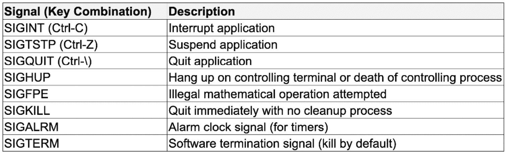

# 定义命令行过程

命令行应用程序的核心能力是处理用户输入并返回一个结果，这个结果要么用户可以轻松理解，要么其他进程可以将其作为标准输入读取。在*第一章*《理解 CLI 标准》中，我们讨论了命令行应用程序的解剖结构，但本章将详细探讨其解剖结构的每个方面，分解不同类型的输入：子命令、参数和标志。此外，还将讨论其他输入：`stdin`、信号和控制字符。

正如命令行应用程序可以接收许多类型的输入一样，处理数据的方法也有很多。本章不会让你失望——每种输入类型的处理示例将会随后提供。

最后，了解如何以人类和计算机都容易理解的方式返回结果，无论是成功时的数据还是失败时的错误，同样重要。

本章将介绍如何为每个最终用户输出数据以及 CLI 成功的最佳实践。我们将涵盖以下主题：

+   接收输入和用户交互

+   处理数据

+   返回结果输出并定义最佳实践

# 技术要求

为了轻松跟随本章中的代码，你需要做以下事情：

下载以下代码：[`github.com/PacktPublishing/Building-Modern-CLI-Applications-In-Go/tree/main/Chapter05/application`](https://github.com/PacktPublishing/Building-Modern-CLI-Applications-In-Go/tree/main/Chapter05/application)

# 接收输入和用户交互

通过命令行应用程序接收输入的主要方法是通过其子命令、参数和选项，也称为`stdin`、信号和控制字符。在本节中，我们将分解每种不同的输入类型以及何时以及如何与用户交互。

## 定义子命令、参数和标志

在我们开始描述主要输入类型之前，让我们重申一下解释每种输入类型在可预测性和熟悉性方面的通用位置的架构模式。在**Cobra 框架文档**中有对这种模式的出色描述。这是最好的解释之一，因为它将结构比作自然语言，就像说话和写作一样，语法需要正确解释：

```go
APPNAME NOUN VERB –ADJECTIVE
```

注意

**参数**是名词，**命令或子命令**是动词。像任何修饰语一样，**标志**是形容词，并添加描述。

注意

大多数其他编程语言建议使用两个连字符而不是一个。Go 是独特的，因为单连字符和双连字符与内部标志包等价。然而，需要注意的是，Cobra CLI 标志区分单连字符和双连字符，其中单连字符用于短形式标志，双连字符用于长形式标志。

在前面的例子中，命令和参数，或 `NOUN VERB`，也可以按 `VERB NOUN` 的顺序排列。然而，`NOUN VERB` 更常用。使用对你有意义的：

```go
APPNAME ARGUMENT <COMMAND | SUBCOMMANDS> --FLAG
```

你可能会遇到命令行解析器的限制。然而，如果可能的话，使参数、标志和子命令的顺序无关。现在，让我们更详细地定义每个部分，并使用 **Cobra** 创建一个利用每种输入类型的命令。

### 命令和子命令

在非常基本层面上，命令是对命令行应用程序给出的特定指令。在我们刚才看到的模式中，这些是动词。想想我们自然说话的方式。如果我们与狗交谈，我们会给它下达命令，比如“*roll over*”、“*speak*”或“*stay*”。由于你定义了应用程序，你可以选择动词来定义指令。然而，在选择命令（和子命令）时，最重要的是记住名称要清晰且一致。

模糊性会给新用户带来很多压力。假设你有两个命令：`yarn update` 和 `yarn upgrade`。对于一个第一次使用 `yarn` 的开发者来说，你认为这些命令的不同之处是否清晰？清晰至关重要。这不仅使你的应用程序更容易使用，而且还能让开发者感到安心。

当你对应用程序有一个广泛的了解时，你可以直观地确定在定义命令时更清晰、更简洁的语言。如果你的应用程序感觉有点复杂，你可以利用子命令进行简化，并在可能的情况下，为命令和子命令使用熟悉的单词。

让我们以 **Docker** 应用程序为例，说明子命令是如何明确定义的。Docker 有以下一系列管理命令：

+   `container` 用于管理容器

+   `image` 用于管理镜像

你会注意到，当你运行 `docker` `container` 或 `docker` `image` 时，会打印出用法，以及一系列子命令，你也会注意到，这两个命令中使用了几个子命令。它们保持一致。

Docker 的用户知道，动作（例如 `ls`、`rm` 或 `inspect`）与主题（例如 `image` 或 `container`）相关。命令遵循预期的模式 `"APPNAME ARGUMENT COMMAND"` – `docker` `image` `ls` 和 `docker` `container` `ls` 也是如此。请注意，`docker` 也使用了熟悉的 Unix 命令 – `ls` 和 `rm`。始终在可能的情况下使用熟悉的命令。

使用 Cobra CLI，让我们创建两个命令，其中一个作为另一个的子命令。以下是我们要添加的第一个命令：

```go
cobra-cli add command
command created at /Users/marian/go/src/github.com/
  marianina8/application
```

然后，添加子命令：

```go
cobra-cli add subcommand
subcommand created at /Users/marian/go/src/github.com/
  marianina8/application
```

然后，通过修改默认行以在 `commandCmd` 上运行 `AddCommand` 来将其创建为子命令：

```go
func init() {
    commandCmd.AddCommand(subcommandCmd)
}
```

Cobra CLI 使得创建命令及其子命令变得极其简单。现在，当使用子命令调用命令时，我们得到确认子命令已被调用的信息：

```go
./application command subcommand
subcommand called
```

现在，让我们了解参数。

### 参数

参数是名词——被命令作用的对象。它们位于命令的位置，通常位于命令之前。顺序不是严格的；只需在整个应用程序中保持顺序的一致性即可。然而，第一个参数是应用程序名称。

对于针对多个文件或多个输入字符串的操作，多个参数是可以接受的。以 `rm` 命令和删除多个文件为例。例如，`rm arg1.txt arg2.txt arg3.txt` 将对命令之后列出的多个文件（通过删除）进行操作。允许在合理的地方使用通配符。如果用户想要删除当前目录中的所有文本文件，那么 `rm *.txt` 的例子也应该可以工作。现在，考虑 `mv` 命令，它需要两个参数，用于源文件和目标文件。`mv old.txt new.txt` 的例子将把源文件 `old.txt` 移动到目标文件 `new.txt`。通配符也可以与这个命令一起使用。

注意

对于不同的事情有多个参数可能意味着需要重新思考您构建命令的方式。这也可能意味着您可以使用标志来代替。

再次强调，熟悉对您有利。如果有标准名称，请使用它，您的用户会感谢您。以下是一些常见参数的例子：`history`、`tag`、`volume`、`log` 和 `service`。

让我们修改子命令生成的 `Run` 字段，以识别并打印出其参数：

```go
Run: func(cmd *cobra.Command, args []string) {
    if len(args) == 0 {
        fmt.Println("subcommand called")
    } else {
        fmt.Println("subcommand called with arguments: ",
          args)
    }
},
```

现在，当我们用参数运行相同的子命令时，以下输出将被打印出来：

```go
  ./application command subcommand argument1 argument2
subcommand called with arguments:  [argument1 argument2]
```

有趣的是，标志可以为参数提供更多的清晰度。一般来说，它确实需要更多的输入，但标志可以使正在发生的事情更加清晰。另一个额外的优点是，如果您决定更改接收输入的方式，添加或删除标志比修改现有命令（这可能会破坏某些东西）要容易得多。

### 标志

标志是形容词，为动作或命令添加描述。它们是有名称的参数，可以用不同的方式表示，带有或不带有用户指定的值：

+   A `-h`)

+   A `--help`)

+   A `--file audio.txt`, 或 `–-file=audio.txt`)

拥有所有标志的全长版本很重要——单个字母仅适用于常用标志。如果您为所有可用的标志使用单个字母，则可能有多个标志以相同的字母开头，并且这个单个字母对多个标志来说在直观上是有意义的。这可能会造成混淆，因此最好不要使单字母标志列表过于杂乱。

单字母标志也可以连接在一起。例如，考虑`ls`命令。你可以运行`ls -l -h -F`或`ls -lhF`，结果是一样的。显然，这取决于所使用的命令行解析器，但由于 CLI 应用程序通常允许你连接单字母标志，因此允许这样做是个好主意。

最后，标志的顺序通常不是严格的，所以用户运行`ls –lhF`、`ls –hFl`或`ls –Flh`，结果都是相同的。

作为示例，我们可以在根命令中添加一些标志，一个本地和一个持久，这意味着它对命令及其所有子命令都可用。在`commandCmd`中，在`init()`函数内，以下这些行正是这样做的：

```go
commandCmd.Flags().String("localFlag", "", "a local string
  flag")
commandCmd.PersistentFlags().Bool("persistentFlag", false,
  "a persistent boolean flag")
```

在`commandCmd`的`Run`字段中，我们添加以下这些行：

```go
localFlag, _ := cmd.Flags().GetString("localFlag")
if localFlag != "" {
    fmt.Printf("localFlag is set to %s\n", localFlag)
}
```

在`subcommandCmd`的`Run`字段中，我们也添加以下这些行：

```go
persistentFlag, _ := cmd.Flags().GetBool("persistentFlag")
fmt.Printf("persistentFlag is set to %v\n", persistentFlag)
```

现在，当我们编译代码并再次运行它时，我们可以测试这两个标志。请注意，有几种传递标志的方式，在两种情况下，结果都是相同的：

```go
  ./application command --localFlag=”123”
command called
localFlag is set to 123
  ./application command --localFlag “123”
command called
localFlag is set to 123
```

持久标志，尽管在`commandCmd`级别定义，但在`subcommandCmd`中可用，并且当标志缺失时，使用默认值：

```go
  ./application command subcommand
subcommand called
persistentFlag is set to false
  ./application command subcommand --persistentFlag
subcommand called
persistentFlag is set to true
```

现在，我们已经介绍了接收 CLI 输入的最常见方法：命令、参数和标志。接下来要介绍的方法包括管道、信号和控制字符，以及直接的用户交互。让我们现在深入探讨这些内容。

## 管道

在 Unix 中，管道将一个命令行应用程序的标准输出重定向到另一个命令行应用程序的标准输入。它由`|`字符表示，它组合了两个或多个命令。一般结构是`cmd1 | cmd2 |cmd3 | .... | cmdN`，`cmd1`的标准输出是`cmd2`的标准输入，依此类推。

创建一个简单的命令行应用程序，只做一件事并且做得很好，遵循 Unix 哲学。它简化了单个 CLI 的复杂性，因此你会看到许多可以将它们通过管道连接在一起的不同应用程序的示例。以下是一些示例：

+   `cat file.txt | grep "word" | sort`

+   `sort list.txt | uniq`

+   `find . -type f –name main.go | grep audio`

作为示例，让我们创建一个从常见应用程序接收标准输入的命令。让我们称它为`piper`：

```go
cobra-cli add piper
piper created at /Users/marian/go/src/github.com/
  marianina8/application
```

对于新创建的`piperCmd`的`Run`字段，添加以下这些行：

```go
reader := bufio.NewReader(os.Stdin)
s, _ := reader.ReadString('\n')
fmt.Printf("piped in: %s\n", s)
```

现在，使用一些管道输入编译并运行`piper`命令：

```go
  echo “hello world” | ./application piper
piper called
piped in: hello world
```

现在，假设你的命令有一个标准输出被写入一个损坏的管道；内核将引发一个`SIGPIPE`信号。这被作为命令行应用程序的输入接收，然后可以输出有关损坏管道的错误。除了从内核接收信号外，其他信号，如`SIGINT`，可以由按下控制字符键组合（如*Ctrl + C*）来中断应用程序的用户触发。这只是信号和控制字符的一种类型，但将在下一节中讨论更多。

## 信号和控制字符

正如其名所示，信号是通过向命令行应用程序发出信号来通过信号传递特定和可操作输入的另一种方式。有时，这些信号可能来自内核，或者来自按下控制字符键组合的用户，从而触发发送给应用程序的信号。有两种不同类型的信号：

+   `SIGBUS`、`SIGFPE`和`SIGSEGV`。

+   `SIGHUP`、`SIGINT`、`SIGQUIT`和`SIGPIPE`。

注意

一些信号，如`SIGKILL`和`SIGSTOP`，可能不会被程序捕获，因此使用`os/signal`包进行自定义处理不会影响结果。

在信号方面有很多深入讨论的内容，但主要观点是它们只是接收输入的另一种方法。我们将专注于数据是如何被命令行应用程序接收的。以下是一个表格，解释了一些最常用的信号、控制字符组合及其描述：



图 5.1 – 信号及其相关键组合和描述的表格

以下是在`rootCmd`中添加的两个函数调用，用于在接收到`SIGINT`或`SIGTSTP`信号时优雅地退出您的应用程序。现在调用`rootCmd`的`Execute`函数看起来是这样的：

```go
func Execute() {
    SetupInterruptHandler()
    SetupStopHandler()
    err := rootCmd.Execute()
    if err != nil {
        os.Exit(1)
    }
}
```

`SetupInterruptHandler`代码如下：

```go
func SetupInterruptHandler() {
    c := make(chan os.Signal)
    signal.Notify(c, os.Interrupt, syscall.SIGINT)
    go func() {
        <-c
        fmt.Println("\r- Wake up! Sleep has been
          interrupted.")
        os.Exit(0)
    }()
}
```

类似地，`SetupStopHandler`代码如下：

```go
func SetupStopHandler() {
    c := make(chan os.Signal)
    signal.Notify(c, os.Interrupt, syscall.SIGTSTP)
    go func() {
        <-c
        fmt.Println("\r- Wake up! Stopped sleeping.")
        os.Exit(0)
    }()
}
```

现在，我们需要一个命令来中断或停止应用程序。让我们使用 Cobra CLI 并添加一个`sleep`命令：

```go
  cobra-cli add sleep
sleep created at /Users/marian/go/src/github.com/
  marianina8/application
```

`sleepCmd`的`Run`字段被更改为运行一个无限循环，打印出一些 Z（`Zzz`），直到信号中断`sleep`命令并唤醒它：

```go
Run: func(cmd *cobra.Command, args []string) {
    fmt.Println("sleep called")
    for {
        fmt.Println("Zzz")
        time.Sleep(time.Second)
    }
},
```

通过运行`sleep`命令然后使用*Ctrl + C*，我们得到以下输出：

```go
  ./application sleep
sleep called
Zzz
Zzz
- Wake up!  Sleep has been interrupted.
- Wake up!  Stopped sleeping.
```

再次尝试，但现在使用*Ctrl + Z*，我们得到以下输出：

```go
  ./application sleep
sleep called
Zzz
Zzz
Zzz
- Wake up!  Stopped sleeping.
```

您可以使用信号来优雅地中断或退出您的应用程序，或者在警报触发时采取行动。虽然命令、参数和标志是命令行应用程序最常见类型的输入，但考虑处理这些信号输入以创建更健壮的应用程序是很重要的。如果一个终端挂起并且收到`SIGHUP`信号，您的应用程序可以保存最后状态的信息并在必要时处理清理。在这种情况下，虽然这种情况并不常见，但同样重要。

## 用户交互

虽然您的用户输入可以是命令、参数和标志的形式，但用户交互更多的是用户与应用程序之间的来回交互。假设用户错过了一个特定子命令所需的标志，您的应用程序可以提示用户并通过标准输入接收该标志的值。有时，而不是使用更标准的命令、参数和标志的输入，可以构建一个交互式命令行应用程序。

一个交互式 CLI 会提示输入，然后通过 `stdin` 接收输入。在 Go 中有一些有用的包用于构建交互式和可访问的提示。在以下示例中，我们将使用 [`github.com/AlecAivazis/survey`](https://github.com/AlecAivazis/survey) 包。使用 `survey` 包有多种提示输入的有趣方式。一个 `survey` 命令会询问需要存储在变量中的问题。让我们将其定义为 `qs`，一个 `*survey.Question` 类型的切片：

```go
var qs = []*survey.Question{}
```

`survey` 可以提示用户输入不同类型的数据，如以下所示：

+   **简单** **文本输入**

在非常基本的层面上，用户可以接收基本的文本输入：

```go
{
    Name: "firstname",
    Prompt: &survey.Input{Message: "What is your first
      name?"},
    Validate: survey.Required,
    Transform: survey.Title,
},
Output:
  ? What is your first name?
```

+   **建议选项**

此终端选项允许您为提示问题提供用户建议：

```go
{
    Name: "favoritecolor",
    Prompt: &survey.Select{
    Message: "What's your favorite color?",
    Options: []string{"red", "orange", "yellow",
      "green", "blue", "purple", "black", "brown",
        "white"},
    Default: "white",
},
Output:
? What is your favorite color? [tab for suggestions]
```

按下 *Tab* 键将显示可用选项：

```go
? What is your favorite color? [Use arrows to
  navigate, enter to select, type to complement
    answer]
red
orange
yellow
green
blue
purple
black
brown
white
```

+   **输入** **多行**

在接收输入时，有时按下 *Return* 键会立即将接收到的任何文本直接作为输入传递给程序。利用 `survey` 包允许您在接收输入之前输入多行：

```go
{
    Name: "story",
    Prompt: &survey.Multiline{
    Message: "Tell me a story.",
    },
},
Output:
? Tell me a story [Enter 2 empty lines to finish]
A long line time ago in a faraway town, there lived a
  princess who lived in a castle far away from the
    city.  She was always sleeping, until one day…
```

+   **保护** **密码输入**

为了保护数据隐私，在输入个人信息时，`survey` 包会将字符替换为 `*` 符号：

```go
{
    Name: "secret",
    Prompt: &survey.Password{
    Message: "Tell me a secret",
    },
},
Output:
? Tell me a secret: ************
```

+   **确认** **是** **或** **否**

用户可以对命令提示符简单地回答是或否：

```go
{
    Name: "good",
    Prompt: &survey.Confirm{
    Message: "Are you having a good day?",
    },
},
Output:
? Are you having a good day? (Y/n)
```

现在，让我们看看如何从复选框选项中选择。

+   **从复选框选项中选择**

在垂直复选框选项中可以选择多个选项。使用上下箭头导航选项，使用空格键选择：

```go
{
    Name: "favoritepies",
    Prompt: &survey.MultiSelect{
    Message: "What pies do you like:",
    Options: []string{"Pumpkin", "Lemon Meringue",
      "Cherry", "Apple", "Key Lime", "Pecan", "Boston
        Cream", "Rhubarb", "Blackberry"},
    },
},
Output:
? What pies do you like: [Use arrows to move, space to
select, <right> to all, <left> to none, type to
filter]
> [ ] Pumpkin
  [ ] Lemon Meringue
  [ ] Cherry
  [ ] Apple
  [ ] Key Lime
  [ ] Pecan
….
```

使用以下方式创建一个新的 `survey` 命令：

`cobra-cli` `add survey`

`surveyCmd` 的 `Run` 字段创建一个结构体，用于接收所有问题的答案：

```go
Run: func(cmd *cobra.Command, args []string) {
    fmt.Println("survey called")
    answers := struct {
        FirstName string
        FavoriteColor string
        Story string
        Secret string
        Good bool
        FavoritePies []string
    }{}
```

然后 `Ask` 方法接收问题 `qs`，并将所有问题的答案接收到一个指向 `answers` 结构体的指针中：

```go
    err := survey.Ask(qs, &answers)
    if err != nil {
        fmt.Println(err.Error())
        return
    }
```

最后，结果将被打印出来：

```go
    fmt.Println("*********** SURVEY RESULTS ***********")
    fmt.Printf("First Name: %s\n", answers.FirstName)
    fmt.Printf("Favorite Color: %s\n",
        answers.FavoriteColor)
    fmt.Printf("Story: %s\n", answers.Story)
    fmt.Printf("Secret: %s\n", answers.Secret)
    fmt.Printf("It's a good day: %v\n", answers.Good)
    fmt.Printf("Favorite Pies: %s\n", answers.FavoritePies)
},
```

测试 `survey` 命令，我们得到以下结果：

```go
  ./application survey
survey called
? What is your first name? Marian
? What's your favorite color? white
? Tell me a story.
I went to the dodgers game last night and
they lost, but I still had fun!
? Tell me a secret ********
? Are you having a good day? Yes
? What pies do you prefer: Pumpkin, Lemon Meringue, Key
    Lime, Pecan, Boston Cream
*********** SURVEY RESULTS ***********
First Name: Marian
Favorite Color: white
Story: I went to the dodgers game last night and
they lost, but I still had fun!
Secret: a secret
It's a good day: true
Favorite Pies: [Pumpkin Lemon Meringue Key Lime Pecan
    Boston Cream]
```

虽然这些示例只是 `survey` 包提供的许多输入提示中的一部分，但您可以访问 GitHub 页面查看所有可能选项的示例。玩弄提示让我想起了早期基于文本的角色扮演游戏，它们使用它们来提示玩家的角色。在了解了多种不同类型的输入后，无论是基于用户的、来自内核的，还是来自其他管道应用程序的，让我们讨论如何处理这些传入的数据。

# 处理数据

`123`，我们可以通过利用 `strconv` 包的 `Atoi` 方法进行类型检查，该方法将 ASCII 字符串转换为整数：

```go
val, err := strconv.Atoi("123")
```

如果字符串值无法转换，因为它不是整数的字符串表示，则会抛出错误。如果字符串是整数的表示，则整数值将存储在 `val` 变量中。

`strconv`包可用于检查、转换许多其他类型，包括布尔值、浮点值和`uint`值等。

另一方面，标志可以具有预定义的类型。在 Cobra 框架中，使用的是`pflag`包，它只是标准 go `flag`包的扩展。例如，当定义一个标志时，您可以将其明确定义为`String`、`Bool`、`Int`或自定义类型。如果将前面的`123`值作为`Int`标志读取，可以使用以下代码行定义：

```go
var intValue int
flag.IntVar(&intValue, "flagName", 123, "help message")
```

这同样适用于`String`和`Bool`标志。您甚至可以使用`Var`方法创建具有自定义、特定接口的标志：

```go
var value Custom
flag.Var(&value, "name", "help message")
```

确保`Custom`结构满足`pflag`包内定义的以下接口，以用于自定义标志：

```go
// (The default value is represented as a string.)
type Value interface {
    String() string
    Set(string) error
    Type() string
}
```

我将`Custom`结构定义为以下内容：

```go
type Custom struct {
    Value string
}
```

因此，`Set`方法简单地定义为以下内容：

```go
func (c *Custom) Set(value string) error {
    c.Value = value
    return nil
}
```

将值传递给标志由`flag: --name="custom value"`处理。然后使用`String`方法打印值：

```go
fmt.Println(cmd.Flag("name").Value.String())
```

它看起来是这样的：

```go
custom value
```

除了传递可以转换为不同类型的字符串值之外，通常还会传递一个指向文件的路径。有多种从文件中读取数据的方法。让我们列出每种方法，以及处理这种读取文件方式的方法，以及每种方法的优缺点：

+   `os.ReadFile`方法读取整个文件并返回其内容。在遇到**文件结束**（**EOF**）时不会出错：

    ```go
    func all(filename string) {

        content, err := os.ReadFile(filename)

        if err != nil {

            fmt.Printf("Error reading file: %s\n", err)

            return

        }

        fmt.Printf("content: %s\n", content)

    }
    ```

+   **优点**：性能更快

+   **缺点**：在较短时间内消耗更多内存

+   `file.Read`方法以预定的缓冲区大小读取缓冲区，并返回字节，这些字节在转换为字符串后可以打印。与`ioutil.ReadFile`方法不同，从缓冲区读取`file.Read`会在达到 EOF 时出错：

    ```go
    func chunk(file *os.File) {

        const size = 8 // chunk size

        buff := make([]byte, size)

        fmt.Println("content: ")

        for {

            // read content to buffer of size, 8 bytes

            read8Bytes, err := file.Read(buff)

            if err != nil {

                if err != io.EOF {

                    fmt.Println(err)

                }

                break

            }

            // print content from buffer

            fmt.Println(string(buff[:read8Bytes]))

        }
    ```

+   **优点**：易于实现，消耗内存少

+   **缺点**：如果选择的块不正确，可能会导致结果不准确，比较或分析数据时复杂性增加，以及潜在的错误传播。

+   `split`函数。`scanner.Text()`方法读取到下一个分隔每个扫描的标记——在以下示例中，是逐行。最后，`scanner.Scan()`在遇到 EOF 时不会返回错误：

    ```go
    func line(file *os.File) {

        scanner := bufio.NewScanner(file)

        lineCount := 0

        for scanner.Scan() {

            fmt.Printf("%d: %s\n", lineCount,

              scanner.Text())

            lineCount++

        }

        if err := scanner.Err(); err != nil {

            fmt.Printf("error scanning line by line:

                %s\n", err)

        }

    }
    ```

+   **优点**：易于实现——一种直观的数据读取和输出方式。

+   **缺点**：处理非常大的文件可能会导致内存限制。如果数据不适合逐行处理，增加的复杂性可能会导致结果不准确。

+   `Split`函数，将`bufio.ScanWords`传递给`Split`函数。这样就会定义每个单词之间的标记，并在每个标记之间进行扫描。再次强调，以这种方式扫描不会在 EOF 处遇到错误：

    ```go
    func word(file *os.File) {

        scanner := bufio.NewScanner(file)

        scanner.Split(bufio.ScanWords)

        wordCount := 0

        for scanner.Scan() {

            fmt.Printf("%d: %s\n", wordCount,

                scanner.Text())

          wordCount++

        }

        if err := scanner.Err(); err != nil {

            fmt.Printf("error scanning by words: %s\n",

                err)

        }

    }
    ```

+   **优点**：易于实现——一种直观的数据读取和输出方式

+   **缺点**：对于大文件来说，效率低下且耗时。如果数据不适合逐词处理，增加的复杂性可能会导致结果不准确。

选择处理从文件接收到的数据的方式取决于用例。此外，主要有三种数据处理类型：批量、在线和实时。

如您从名称中可以猜到的，批量处理收集或分批收集的类似任务，然后同时运行它们。在线处理需要互联网连接以到达 API 端点，以完全处理数据并返回结果。实时处理是在极短的时间内执行数据，数据被即时输出。

需要特定类型处理的不同用例的示例各不相同。银行交易、计费和报告通常使用批量处理。

在幕后使用 API 的 CLI 通常会需要互联网访问来处理在线处理。当及时性至关重要时，会使用实时处理，通常在制造业、欺诈检测和计算机视觉工具中。

一旦数据被处理，结果必须返回给用户或接收进程。在下一节中，我们将讨论返回输出的细节和定义返回数据的最佳实践。

# 返回结果输出和定义最佳实践

当从进程返回输出时，了解您返回数据给谁或什么非常重要。返回可读性强的输出至关重要。然而，为了确定您是否将数据返回给人类或机器，请检查您是否正在写入 TTY。还记得 TTY 吗？您可以参考*第一章*，*理解 CLI 标准*，其中我们讨论了 CLI 界面的历史和 TTY 术语，即电传打字机或电传打字机。

如果写入 TTY，我们可以检查`stdout`文件描述符是否指向一个终端，并根据结果更改输出。

让我们检查以下代码块，该代码块检查`stdout`文件描述符是否正在写入 TTY：

```go
if fileInfo, _ := os.Stdout.Stat(); (fileInfo.Mode() &
    os.ModeCharDevice) != 0 {
    fmt.Println("terminal")
} else {
    fmt.Println("not a terminal")
}
```

让我们在名为`tty`的命令的`Run`方法中使用以下命令调用它：

```go
./application tty
```

然后，输出如下：

```go
terminal
```

然而，如果我们通过调用`./application tty > file.txt`将输出管道到一个文件，那么文件的内容如下：

```go
not a terminal
```

当然，当向人类返回输出时添加彩色 ASCII 文本是有意义的，但对于机器处理输出来说，这通常是无用的且是额外信息。

在编写输出时，始终将人类放在首位，特别是在可用性的方面。然而，如果机器可读的输出不影响可用性，那么输出机器可读的输出。由于文本流是 Unix 中的通用输入，程序通常通过管道链接在一起。输出通常是文本行，程序也期望以文本行作为输入。用户应该期望编写可以轻松使用 `grep` 搜索的输出。你无法确定输出将被发送到何处，以及哪些其他进程可能正在消耗输出。始终检查输出是否发送到终端，如果不是，则为另一个程序打印。然而，如果使用机器可读的输出会破坏可用性，但人类可读的输出又不能被另一个机器进程轻松处理，则默认使用人类可读的输出，并定义 `–plain` 标志以将此输出显示为机器可读的输出。以表格格式整洁的文本行可以轻松与 `grep` 和 `awk` 集成。这使用户可以选择定义输出的格式。

除了定义针对人类和机器的输出之外，通常还会添加一个标志来定义返回数据的特定格式。当请求以 JSON 格式返回数据时，使用 `–json` 标志，而请求 XML 格式时使用 `–xml` 标志。有一个 Unix 工具 `jq` 可以与程序的 JSON 输出集成。实际上，这个工具可以操作任何以 JSON 格式返回的数据。Unix 生态系统中的许多工具都利用了这一点，你也可以这样做。

从历史上看，由于许多较老的 Unix 程序是为脚本或其他程序编写的，通常在成功时不会返回任何输出。这可能会使用户感到困惑。不能总是假设成功，因此显示输出是理想的。没有必要详细说明，所以保持简明扼要且信息丰富。如果需要，定义一个 `–quit`（或 `–q`）标志可以抑制不必要的信息。

有时，CLI 可以跟踪状态。例如 `git status`。这些信息需要对用户透明，因为它经常可以确认预期改变状态的预期结果。用户通过了解状态，可以理解他们可能的下一步行动。

这些后续步骤中的一些也可能被建议给用户。事实上，向用户提供建议是理想的，因为这会给人一种被引导的感觉，而不是在野外独自使用一个新的 CLI 应用程序。当用户第一次与 CLI 互动时，最好让学习体验类似于一个引导冒险。让我们以 GitHub 的 CLI 为例，快速给出一个例子。考虑当你需要将主分支合并到当前分支时。合并后，有时会出现冲突，当你在 `git status` 中检查时，CLI 会引导你：

```go
On branch {branch name}
Your branch and 'origin/{branch name}' have diverged
And have 1 and 1 different commits each, respectively.
    (use "git pull" to merge the remote branch into yours)
You have unmerged paths.
    (fix conflicts and run "git commit")
    (use "git merge –abort" to abort the merge)
Unmerged paths:
    (use "git add <file>..." to mark resolution)
             Both modified:     merge.json
```

注意

响应会提醒用户当前的分支和状态，以及建议用户可以采取的不同选项。并非所有 CLI 都处理状态，但当你这么做时，最好让它广为人知，并为用户提供清晰的下一步路径。

如果有任何与远程服务器的通信，文件的读取或写入（除了缓存），或任何跨越程序内部边界的其他操作，都要将这些操作通知用户。我喜欢 HomeBrew 的 CLI 上的`install`命令。当你使用`brew install`安装应用程序时，幕后发生的事情非常清晰。

当正在下载或创建文件时，会明确指出：

```go
==> Downloading https://ghcr.io/v2/homebrew/core/dav1d/manifests/1.0.0
###########################################################
############# 100.0%
```

看看如何使用哈希标签来指定进度——它们以增加信息密度的这种方式使用 ASCII 字符。我喜欢`Cellar`文件夹中文件旁边的冰镇啤酒图标。这会让你想到啤酒地窖中存在的所有酿酒配方。**表情符号**价值千言万语。

当引发错误时，文本以红色显示，目的是唤起紧迫感和警觉性。如果使用颜色，必须有意为之。绿色的失败或红色的成功对用户来说都是令人困惑的。我确信，就像利用 ASCII 艺术来增加信息密度一样，颜色也有同样的目的。绿色的成功不容易被误认为是失败，反之亦然。确保通过不频繁使用颜色来使重要信息突出。过多的颜色会使任何东西都难以突出。

然而，虽然颜色可能会让一些人兴奋，但它会惹恼其他人。可能有无数个原因让某人想在 CLI 中禁用颜色。无论出于什么原因继续在黑白世界中前行，都有特定的时候不应该使用颜色：

+   当将数据管道传输到另一个程序时

+   当设置`NO_COLOR`环境变量时

+   当`TERM`环境变量设置为`dumb`时

+   当传递`–no-color`标志时

+   当你的应用的`MYAPP_NO_COLOR`环境变量被设置时

如果我们不允许使用颜色，那么动画也不允许！好吧，我不会告诉你该怎么做，只是让你亲自试试——通过`stdout`将动画管道传输到文件。我敢打赌！你可能会得到一些很棒的 ASCII 艺术，但它会显得很忙，难以理解数据。目标是清晰。使用 ASCII 艺术、颜色意图和动画来增加信息密度，我们最终需要明白我们需要使用所有人都理解清晰的文字。从第一次使用你的 CLI 的用户的角度考虑你的措辞。用你的话引导用户。

至于打印日志输出，只有在详细模式下才这么做，详细模式由`–verbose`标志和简写的`–v`表示。不要使用`stderr`文件描述符作为日志文件。

如果 CLI 一次输出大量文本，例如 `git diff`，则使用分页器。谢天谢地。这使得逐页查看输出以审查差异变得容易得多，而不是一次性接收所有文本。这只是 GitHub 为其用户提供非常周到 CLI 的许多方式之一。

最后，让错误突出显示——如果发生错误，使用红色文本或红色 *x* 表情符号来增加理解。如果颜色被禁用，那么使用文本来传达已发生错误，并提供下一步的建议——而且，更好的是，通过电子邮件或网站提供支持途径。

# 摘要

在本章中，你学习了关于命令行进程的知识——接收输入、处理数据和返回输出。已经讨论了最流行的不同类型输入：从 **子命令**、**参数**和**标志**到**信号**和**控制字符**。

我们创建了一个交互式调查来收集用户的输入，并讨论了数据处理。我们还学习了如何处理的第一步：转换参数字符串数据，转换和检查类型，接收来自键入和自定义标志的数据，最后，从文件中读取数据。

我们还简要介绍了不同类型处理的不同类型：批量、在线和实时处理。最终，用例将引导你了解你需要什么样的输入，以及是否需要在批量、通过互联网或实时运行任务。

返回输出与接收输出一样重要，甚至更重要！这是你为用户提供更愉快体验的机会。现在，你首先是为人类开发，你有机会站在他们的立场上。

你希望以何种方式接收数据，让你感到放心，理解失败以及下一步该做什么，以及在哪里找到帮助？并非所有进程都能成功运行，所以至少让用户感到他们正在通往成功的道路上。在 *第二部分*，*第六章*，*调用外部进程，处理错误和超时*，我们将更详细地讨论命令行进程，重点关注外部进程以及如何有效地处理超时和错误，并将它们传达给用户。

# 问题

1.  对于 CLI 程序，是参数或标志更受欢迎？为什么？

1.  哪个快捷键组合可以中断计算机进程？

1.  可以添加到你的 CLI 的哪个标志来将输出修改为纯文本输出，以便可以轻松地与 `grep` 和 `awk` 等工具集成？

# 答案

1.  对于 CLI 程序，标志更受欢迎，因为它们使得添加或删除功能变得容易得多。

1.  *Ctrl +* *C*.

1.  `–plain` 标志可以添加到输出中，以删除任何不必要的数据。

# 进一步阅读

+   什么是 TTY？(https://unix.stackexchange.com/questions/4126/what-is-the-exact-difference-between-a-terminal-a-shell-a-tty-and-a-con/4132#4132)

+   NO_COLOR (https://no-color.org/)

+   *12 Factor CLI* *Apps* (https://medium.com/@jdxcode/12-factor-cli-apps-dd3c227a0e46)
