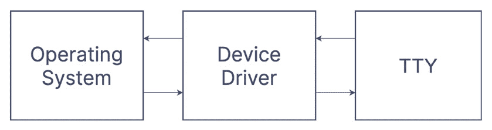
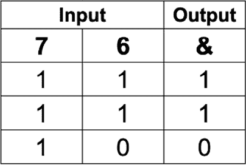
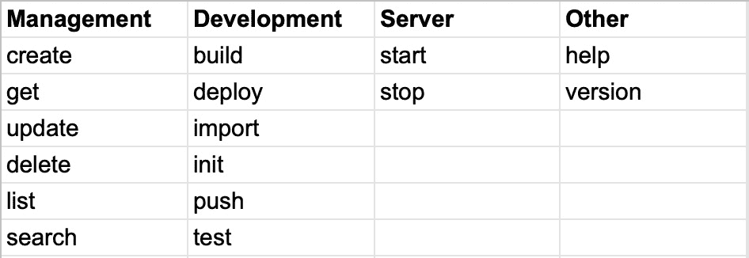
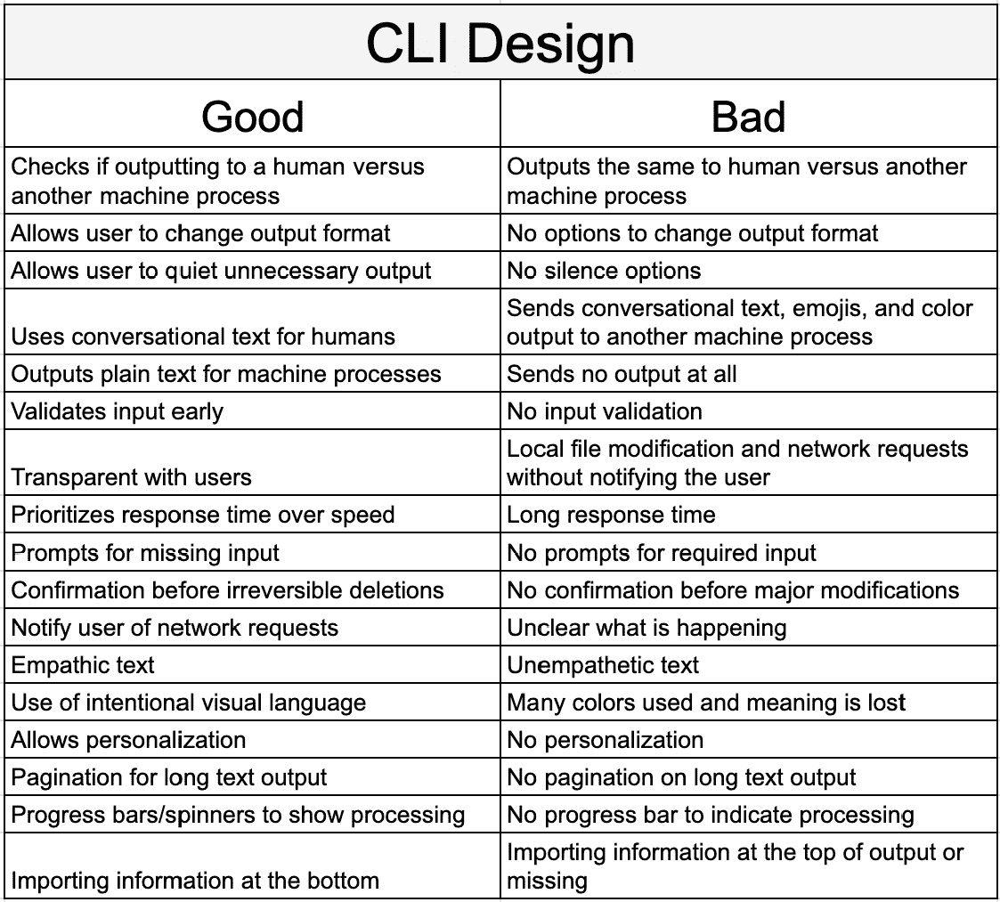

# 8

# 为人类与机器构建

在开发你的命令行应用程序时考虑你的最终用户会使你成为一个更有同理心的开发者。不仅要考虑你对某些**命令行界面**（**CLIs**）行为的感受，还要考虑你如何改进自己和他人体验。可用性方面有很多内容，不可能全部压缩在一个章节中，所以我们建议你阅读*进一步*阅读部分中建议的文章和书籍。

当你构建命令行界面时，首先要考虑的是，尽管它将主要用于人类，但它也可以在脚本中调用，你的程序输出可以被用作其他应用程序的输入，例如**grep**或**awk**。在本章中，我们将介绍如何为两者构建以及如何判断你是在输出给一个还是另一个。

第二点是使用 ASCII 艺术来增加信息密度。无论你是以表格形式输出数据，还是添加颜色或表情符号，目的都是让信息以终端用户能够快速理解的方式从终端中跳出来。

最后，一致性也增加了用户界面的清晰度。当你的 CLI 在不同命令和子命令的标志名称和位置参数中使用一致性时，用户在导航 CLI 时可以更有信心。到本章结束时，你可能会在构建 CLI 时有更多的考虑，并会被提示进行可用性改进。在本章中，我们将涵盖以下主题：

+   为人类与机器构建

+   使用 ASCII 艺术增加信息密度

+   保持命令行界面的一致性

# 技术要求

你需要有一个 Unix 操作系统来理解并运行本章中分享的示例。

你也可以在 GitHub 上找到代码示例：[`github.com/PacktPublishing/Building-Modern-CLI-Applications-in-Go/tree/main/Chapter08`](https://github.com/PacktPublishing/Building-Modern-CLI-Applications-in-Go/tree/main/Chapter08)。

# 为人类与机器构建

CLI 有着悠久的历史，它们的交互是为其他程序和机器量身定制的。它们的设计更类似于程序内的函数，而不是图形界面。正因为如此，许多 Unix 程序今天仍然基于它们将与另一个程序交互的假设运行。

然而，如今，CLI 更多地被人类使用，而不是其他机器，尽管它们仍然携带过时的交互设计。是我们为它们的主要用户——人类构建 CLI 的时候了。

在本节中，我们将比较以机器为先的设计与以人为先的设计，并学习如何检查你是否正在向 TTY 输出。正如我们可以从 *第一章* 中回忆起的，*理解 CLI 标准*，**TTY** 是 **TeleTYpewriter** 的缩写，它演变成了与大型主机交互的输入和输出设备。在当今世界，操作系统的桌面环境，或简称为 **OSs**，提供了一个终端窗口。这个终端窗口是一个虚拟的电传打字机。它们通常被称为 **伪电传打字机**，或简称为 **PSY**。这也表明另一端是一个人类，而不是一个程序。

## 它是 TTY 吗？

首先，让我们了解设备。**设备**可以是硬盘、RAM 磁盘、DVD 播放器、键盘、鼠标、打印机、磁带驱动器，到 TTY 等。**设备驱动程序**提供了操作系统和设备之间的接口；它提供了一个操作系统理解和接受的 API。



图 8.1 – 显示通过设备驱动程序从操作系统到 TTY 设备的通信的图

在基于 Unix 的操作系统上，有两个主要的设备驱动程序：

+   **块** – 硬盘、RAM 磁盘和 DVD 播放器等设备的接口

+   **字符** – 键盘、鼠标、打印机、磁带驱动器、TTY 等的接口

如果你检查标准输入、**stdin** 或标准输出、**stdout** 是一个 **字符** 设备，那么你可以假设你正在从人类接收输入或将输出发送给人类。

### 在 Unix 或 Linux 操作系统中它是 TTY 吗？

在终端中，如果你输入 `tty` 命令，它将输出连接到 **stdin** 的文件名。实际上，这是终端窗口的编号。

让我们在 Unix 终端窗口中运行这个命令，看看结果是什么：

```go
mmontagnino@Marians-MacBook-Pro marianina8 % tty
/dev/ttys014
```

有一个简短的静默，`-s`，标志可以用来抑制输出。然而，应用程序仍然返回一个退出码：

+   退出码 0 – 标准输入来自 TTY

+   退出码 1 – 标准输入不是来自 TTY

+   退出码 2 – 无效参数的语法错误

+   退出码 3 – 写入错误

在 Unix 中，在命令后跟 `&&` 表示第二个命令只有在第一个命令成功运行，退出码为 0 时才会执行。所以，让我们尝试这段代码来看看我们是否在 TTY 中运行：

```go
mmontagnino@Marians-MacBook-Pro marianina8 % tty -s && echo "this is a tty"
this is a tty
```

由于我们在终端中运行了这些命令，结果是 `this is` `a tty`。

### 在 Unix 或 Linux 操作系统中程序化检查

有几种方法可以编程地做到这一点。我们可以使用位于 `Chapter-8/isatty.go` 文件中的代码：

```go
func IsaTTY() {
  fileInfo, _ := os.Stdout.Stat()
  if (fileInfo.Mode() & os.ModeCharDevice) != 0 {
    fmt.Println("Is a TTY")
  } else {
    fmt.Println("Is not a TTY")
  }
}
```

之前的代码使用以下代码从标准输出，**stdout**，文件中获取文件信息：

```go
fileInfo, _ := os.Stdout.Stat()
```

然后，我们检查 `fileInfo.Mode()` 和 `os.ModeCharDevice` 之间的位运算，`&` 的结果。位运算符 `&` 如果两个操作数中都有该位，则将其复制到结果中。

让我们举一个非常简单的例子：在真值表中 `7&6`。`7` 的值用二进制 `111` 表示，`6` 的值用 `110` 表示。



图 8.2 – 显示 & 操作计算的真值表

`&` 操作检查每个位，并判断它们是否相同，如果是，则进位一个位，或 1。如果位不同，则不进位，或 0。结果值是 `110`。

现在，在我们的更复杂的例子中，以下代码 `fileInfo.Mode() & os.ModeCharDevice` 在 `fileInfo.Mode()` 和 `os.ModeCharDevice` 之间执行位运算。让我们看看当代码的标准输出连接到终端时，这个操作看起来像什么：

| **是** **一个 TTY** |
| --- |
| 代码 | 值 |
| `fileInfo.Mode()` | `Dcrw--w----` |
| `os.ModeCharDevice` | `c---------` |
| `fileInfo.Mode()` `&` `os.ModeCharDevice` | `c---------` |
| (`fileInfo.Mode()` `&` `os.ModeCharDevice`) `!= 0` | `TRUE` |

图 8.3 – 当标准输出连接到 TTY 时，代码与其值的相邻

在 *图 8**.3 中，标准输出的文件模式由 `fileInfo.Mode()` 方法调用定义；其值是 `os.ModeDevice`，`os.ModeCharDevice`，`stdin` 对 `os.ModCharDevice`，我们看到相同的位被进位，结果不等于零，因此 `(fileInfo.Mode() & os.ModeCharDevice) != 0` 是 **true**，设备是一个 TTY。

如果输出被管道传输到另一个进程，这段代码会是什么样子？让我们看看：

| **不是** **一个 TTY** |
| --- |
| 代码 | 值 |
| `fileInfo.Mode()` | `prw-rw----` |
| `os.ModeCharDevice` | `c---------` |
| `fileInfo.Mode()` `&` `os.ModeCharDevice` | `----------` |
| (`fileInfo.Mode()` `&` `os.ModeCharDevice`) `!= 0` | `FALSE` |

图 8.4 – 当标准输出未连接到 TTY 时，代码与其值的相邻

现在标准输出的值是 `os.ModeNamedPipe`，`os.ModeCharDevice`，我们看到没有位被复制，因此 `(fileInfo.Mode() & os.ModeCharDevice) != 0` 是 **false**，设备不是一个 TTY。

### 在任何操作系统上编程检查

我们建议使用一个已经为检查更大集合的操作系统确定代码的包，以检查标准输出是否发送到 TTY。我们发现最受欢迎的包是 [github.com/mattn/go-isatty](https://github.com/mattn/go-isatty)，我们在 `Chapter-8/utils/isatty.go` 文件中使用了它：

```go
package utils
import (
  "fmt"
  "os"
  isatty "github.com/mattn/go-isatty"
)
func IsaTTY() {
  if isatty.IsTerminal(os.Stdout.Fd()) ||  isatty.
     IsCygwinTerminal(os.Stdout.Fd()) {
    fmt.Println("Is a TTY")
  } else {
    fmt.Println("Is not a TTY")
  }
}
```

现在我们知道了我们是输出到一个 TTY，这表明另一端有一个人，而不是 TTY，我们可以相应地调整我们的输出。

## 为机器设计

如前所述，CLI 最初是为机器设计的。了解设计另一个程序的确切含义很重要。虽然我们希望将我们的应用程序调整为以人为中心的设计，但有时我们需要以可以轻松传递给`grep`或`awk`命令的方式输出，因为其他应用程序会期望接收纯文本或 JSON 文本的流。

用户可能会以许多意想不到的方式使用您的 CLI。其中一些方式通常是在 bash 脚本中，将您的命令的输出作为输入传递给另一个应用程序。如果您的应用程序，正如它应该做的那样，首先以人类可读的格式输出，那么当标准输入未连接到 TTY 终端时，它也需要以机器可读的格式输出。在后一种情况下，请确保任何颜色和 ASCII 艺术，例如进度条，都被禁用。文本应该是单行表格数据，可以轻松地与`grep`和`awk`工具集成。

此外，当需要时，为用户提供几个持久标志，以便以机器可读的输出格式输出也很重要：

+   `--plain`，用于输出每行一个数据记录的纯文本

+   `--json`，用于输出可以传递到 curl 命令的 JSON 文本

+   `--quiet`、`-q`或`--silent`、`-s`，用于抑制非必要输出

当不影响可用性时，提供纯文本。在其他情况下，提供可选的前置标志，使用户能够轻松地将输出传递到另一个应用程序的输入。

## 为人类设计

现代的命令行应用程序是为其主要消费者——人类设计的。这可能会看似使界面复杂化，因为需要考虑的因素更多。数据的输出方式和数据返回的速度可能会影响用户对您的 CLI 的质量和鲁棒性的感知。我们将讨论一些关键的设计领域：

+   对话成为常态

+   同理心

+   个性化

+   视觉语言

让我们更详细地探讨每一个方面，以便我们能够完全理解这对以人为中心的设计有何影响。

### 对话成为常态

由于您的 CLI 将响应人类而不是另一个程序，因此交互应该像对话一样流畅。将您的应用程序视为 CLI 使用的指南，也会让用户感到更加自在。

当用户运行命令而缺少重要的标志或参数时，则您的应用程序可以提示这些值。提示或调查是包括提问和从用户那里接收答案的对话式来回流程的方式。然而，提示不应成为必需的，因为标志和参数应该是命令的可选选项。我们将在*第十章*“使用提示和终端仪表板进行交互”中更详细地讨论提示。

如果您的应用程序包含状态，则类似于`git`提供的`status`命令并通知用户任何命令更改状态的方式，传达当前状态。同样，如果您的应用程序提供工作流程，通常由一系列命令定义，那么您可以建议运行下一个命令。

在与用户沟通时，简洁很重要。就像在对话中一样，如果我们用过多的无关信息混淆我们的语言，人们可能会对我们的意图感到困惑。通过传达重要信息，但保持简短，我们的用户将快速获得最重要的信息。

上下文很重要。如果您在与最终用户而不是开发者沟通，这会有所不同。在这种情况下，除非您处于详细模式，否则没有必要输出只有开发者才能理解的内容。

如果用户正在执行任何危险的操作，请请求确认，并将确认级别与命令可能引发的危险级别相匹配：

+   `delete`命令，不需要确认

+   如果不是`delete`命令，则提示确认

+   **适度**：

    +   示例：删除目录、远程资源或无法轻易撤销的大批量修改

    +   确认：

        +   提示确认。

        +   提供一个**dry run**操作。**dry run**操作用于查看操作的结果，而实际上不对数据进行任何修改。*   `–confirm="name-of-resource"`使其仍然可脚本化

通常，我们希望让用户越来越难以执行更难的事情。这是一种引导用户避免任何意外的方法。

任何用户输入都应该尽早进行验证，以防止发生不必要的坏事情。确保返回的错误对传递了坏数据的用户是可理解的。

在对话中，必须确保任何机密信息得到保护。确保任何密码都得到保护，并为用户提供安全的方法提交他们的凭证。例如，仅考虑通过文件接受敏感数据。您可以提供一个`–password-file`标志，允许用户通过标准输入传递文件或数据。这种方法为传递秘密数据提供了一种隐蔽的方法。

在对话中保持透明。任何超出程序边界的操作都应明确说明。这包括读取或写入用户未作为参数传递的文件，除非这些文件在缓存中存储内部状态。这还可能包括与远程服务器通信时的任何操作。

最后，响应时间比速度更重要。在 100 毫秒内向用户打印一些内容。如果您正在发起网络请求，请在请求之前打印一些内容，这样就不会看起来像应用程序挂起或出现故障。这将使您的应用程序对最终用户看起来更健壮。

让我们回顾我们的音频元数据 CLI 项目。在*第八章*的`audiofile`仓库中，我们将进行一些更改以创建可能缺失的对话流程。

#### 示例 1：当标志缺失时提示信息

使用 Cobra CLI，如果需要标志，当命令调用时如果标志缺失，它会自动返回错误。根据本节中提到的某些指南，而不是仅仅返回错误，让我们提示缺失的数据。在*第八章*的`audiofile`代码中，在`utils/ask.go`文件中，我们使用调查包[github.com/AlecAivazis/survey/v2](https://github.com/AlecAivazis/survey/v2)创建了两个函数，如下所示：

```go
func AskForID() (string, error) {
  id := ""
  prompt := &survey.Input{
    Message: "What is the id of the audiofile?",
  }
  survey.AskOne(prompt, &id)
  if id == "" {
    return "", fmt.Errorf("missing required argument: id")
  }
  return id, nil
}
func AskForFilename() (string, error) {
  file := ""
  prompt := &survey.Input{
    Message: "What is the filename of the audio to upload
      for metadata extraction?",
    Suggest: func(toComplete string) []string {
      files, _ := filepath.Glob(toComplete + "*")
      return files
    },
  }
  survey.AskOne(prompt, &file)
  if file == "" {
    return "", fmt.Errorf("missing required argument:
      file")
  }
  return file, nil
}
```

当检查传递的标志和值是否仍然为空时，现在可以调用这两个函数。例如，在`cmd/get.go`文件中，我们检查`id`标志的值，如果它仍然为空，则提示用户输入`id`：

```go
id, _ := cmd.Flags().GetString("id")
if id == "" {
  id, err = utils.AskForID()
  if err != nil {
    return nil, err
  }
}
```

运行此命令会给用户以下体验：

```go
mmontagnino@Marians-MBP audiofile % ./bin/audiofile get
? What is the id of the audiofile?
```

类似地，在`cmd/upload.go`文件中，我们检查文件名标志的值，如果它仍然为空，则提示用户输入文件名。因为提示允许用户深入查看建议的文件，所以我们现在得到了以下体验：

```go
mmontagnino@Marians-MBP audiofile % ./bin/audiofile upload
? What is the filename of the audio to upload for metadata extraction? [tab for suggestions]
```

然后，按 Tab 键以显示建议并揭示下拉菜单：

```go
mmontagnino@Marians-MBP audiofile % ./bin/audiofile upload
? What is the filename of the audio to upload for metadata extraction? audio/beatdoctor.mp3 [Use arrows to move, enter to select, type to continue]
 audio/algorithms.mp3
> audio/beatdoctor.mp3
 audio/nightowl.mp3
```

提供提示有助于引导用户并让他们了解如何运行命令。

#### 示例 2：确认删除

另一种帮助用户安全使用 CLI 并防止他们犯错误的方法是在进行危险操作时请求用户确认。尽管在明确的删除操作中这样做不是必需的，但我们创建了一个可以在任何类型的危险情况下使用、带有可配置信息的确认函数。该函数位于`utils/confirm.go`文件中：

```go
func Confirm(confirmationText string) bool {
  confirmed := false
  prompt := &survey.Confirm{
    Message: confirmationText,
  }
  survey.AskOne(prompt, &confirmed)
  return confirmed
}
```

#### 示例 3：在网络请求时通知用户

在发出任何 HTTP 请求之前，通知用户有助于他们了解正在发生的事情，特别是如果请求挂起或变得无响应。我们在每个命令的网络请求之前添加了一条消息。`get`命令现在在客户端运行`Do`方法之前有以下一行：

```go
fmt.Printf("Sending request: %s %s %s...\n",
           http.MethodGet, path, payload)
resp, err := client.Do(req)
if err != nil {
  return nil, err
}
```

### 同理心

您可以对命令行应用程序进行一些简单的修改，以体现对用户的同理心：

+   帮助：

    +   提供帮助文本和文档

    +   建议命令

    +   以可理解的方式重写错误

+   邀请用户反馈和错误提交

在*第九章*《开发的同理心一面》中，我们将探讨您可以通过帮助文本、文档、广泛的支持以及为用户提供轻松提供反馈和提交错误的方式，帮助用户走向成功的方法。

#### 示例 1：提供命令建议

当用户误输入命令时，Cobra CLI 会提供一些同情。让我们看看以下示例，其中用户将 `upload` 错误地输入为 `upolad`：

```go
mmontagnino@Marians-MacBook-Pro audiofile % ./bin/audiofile upolad
Error: unknown command "upolad" for "audiofile"
Did you mean this?
        upload
Run 'audiofile --help' for usage.
```

#### 示例 2 – 提供一种轻松提交错误报告的方式

在 *第九章*“开发的同理心方面”，我们定义了一个错误命令，该命令将启动默认浏览器并导航到 GitHub 仓库的新问题页面以提交错误报告：

```go
mmontagnino@Marians-MacBook-Pro audiofile % ./bin/audiofile bug --help
Bug opens the default browser to start a bug report which will include useful system information.
Usage:
  audiofile bug [flags]
Examples:
audiofile bug
```

#### 示例 3：使用错误的打印用法命令

假设用户在运行搜索命令时没有输入要搜索的值。CLI 应用程序将提示用户输入要搜索的值。如果用户没有传入值，CLI 将输出命令的正确用法：

```go
mmontagnino@Marians-MacBook-Pro audiofile % ./bin/audiofile search
?  What value are you searching for?
Error: missing required argument (value)
Usage:
  audiofile search [flags]
Flags:
  -h, --help           help for search
      --json           return json format
      --plain          return plain format
      --value string   string to search for in metadata
```

### 个性化

通常，使默认设置对大多数用户来说都是正确的，但同时也允许用户通过 CLI 个性化他们的体验。配置给用户一个机会来个性化他们的 CLI 体验，使其更加符合他们的需求。

#### 示例 1：使用 Viper 的技术配置

以 `audiofile` 为例，让我们使用 Viper 创建一个简单的配置设置，使用户能够根据他们的喜好更改任何默认设置。我们创建的配置是为 API 和 CLI 应用程序。对于 API，我们定义了 `configs/api.json` 文件，其中包含以下内容：

```go
{
  "api": {
    "port": 8000
  }
}
```

API 将始终在执行的地方本地执行。然后，对于 CLI，我们定义了一个类似的简单文件，`configs/cli.json`，包含以下内容：

```go
{
  "cli": {
    "hostname": "localhost",
    "port": 8000
  }
}
```

如果 API 在具有不同端口号的外部主机上运行，则可以在配置中修改这些值。为了使 CLI 指向新的主机名，我们需要更新 CLI 命令中的任何引用以使用配置中的值。例如，在 `cmd/get.go` 文件中，路径被定义为：

```go
path := fmt.Sprintf("http://%s:%d/request?%s",
    viper.Get("cli.hostname"), viper.GetInt("cli.port"),
    params)
```

为了初始化这些值并在配置中缺少任何必需的值时提供默认值，我们运行定义在 `cmd/root.go` 中的 `Configure` 函数：

```go
func Configure() {
  viper.AddConfigPath("./configs")
  viper.SetConfigName("cli")
  viper.SetConfigType("json")
  viper.ReadInConfig()
  viper.SetDefault("cli.hostname", "localhost")
  viper.SetDefault("cli.port", 8000)
}
```

在 `cmd/api.go` 文件中存在类似的代码，用于收集一些相同的信息。现在，如果用户想要更改主机名、日志级别或端口号，只需修改一个配置文件。

#### 示例 2：环境变量配置

假设有一个特定于应用程序的环境变量，允许用户定义要使用的前景色和背景色。这个环境变量可以命名为 `AUDIOFILE_COLOR_MODE`。再次使用 Viper 配置，可以使用前景色和背景色文本来覆盖默认设置。虽然这在我们 CLI 中没有实现，但 Viper 配置可能看起来如下：

```go
{
  "cli": {
    "colormode": {
      "foreground": "white",
      "background": "black",
    }
  }
}
```

#### 示例 3：存储位置

有时，用户希望某些输出，例如日志，存储在特定区域。在 Viper 中提供详细信息可以允许覆盖默认值。再次强调，这目前还没有在我们的 CLI 中实现，但如果我们在配置中提供此选项，它可能看起来像这样：

```go
{
  "api": {
    "local_storage": "/Users/mmontagnino/audiofile"
  }
}
```

任何其他新的配置值都可以用类似的方法添加。提供配置应用程序的能力是个性化的起点。想想你有多少种方式可以配置你的 CLI：颜色设置、禁用提示或 ASCII 艺术、默认格式化等等。

### 分页

当你输出大量文本时，请使用分页器，但要注意，有时实现可能会出错。

#### Unix 或 Linux 的分页

在 Unix 或 Linux 机器上，你可以使用`less`命令进行分页。使用合理的选项集调用`less`命令，如`less -FIRX`，如果内容适合单屏，则不会发生分页，搜索时忽略大小写，启用颜色和格式，当`less`退出时内容保持在屏幕上。我们将在下一节输出表格数据时使用这个例子，作为准备，在`utils`包中，我们添加以下文件：`pager_darwin.go`和`pager_linux.go`，包含一个`Pager`函数。然而，在我们的情况下，我们只使用`-r`标志，因为我们想继续在表格中显示颜色：

```go
func Pager(data string) error {
  lessCmd := exec.Command("less", "-r")
  lessCmd.Stdin = strings.NewReader(data)
  lessCmd.Stdout = os.Stdout
  lessCmd.Stderr = os.Stderr
  err := lessCmd.Run()
  if err != nil {
    return err
  }
  return nil
}
```

#### Windows 的分页

在 Windows 机器上，我们使用`more`命令。在`utils`包中，我们添加了`pager_windows.go`文件，并跟随一个`Pager`函数：

```go
func Pager(data string) error {
    moreCmd := exec.Command("cmd", "/C", "more")
    moreCmd.Stdin = strings.NewReader(data)
    moreCmd.Stdout = os.Stdout
    moreCmd.Stderr = os.Stderr
    err := moreCmd.Run()
    if err != nil {
        return err
    }
    return nil
}
```

现在，你已经知道了如何在三个主要操作系统上处理输出分页。当你输出大量数据以便用户轻松滚动时，这也会帮助用户。

### 视觉语言

根据数据，用户可能更容易以纯文本、表格格式或 JSON 格式查看它。请记住，使用`-plain`或`-json`标志为用户提供选项，以他们喜欢的格式返回数据。

注意

有时，为了使所有数据都显示在用户的窗口中，某些行可能被包裹在单元格中。这将破坏脚本。

有许多视觉提示可以显示给用户，以增加信息密度。例如，如果某件事情需要很长时间，可以使用进度条并提供剩余时间的估计。如果成功或失败，利用颜色代码为用户提供额外的信息层次。

我们现在知道如何确定我们是通过终端输出给人类还是输出给另一个应用程序，因此了解这些差异使我们能够适当地输出数据。让我们继续到下一节，讨论一些有趣的例子，通过 ASCII 可视化提供数据以增加信息密度。

# 使用 ASCII 艺术增加信息密度

如本节标题所述，您可以使用 ASCII 艺术来增加信息密度。例如，运行`ls`命令会以用户易于用眼睛扫描和理解的方式显示文件权限。同样，在教科书学习时使用荧光笔实际突出显示一句话或一组单词，可以使某些短语显得更加重要。在本节中，我们将讨论一些 ASCII 艺术的常见用途，以增加共享信息重要性的理解。

## 使用表格显示信息

向用户展示数据最清晰的方式可能是以表格格式。就像`ls`格式一样，在表格格式中，模式更容易跳出来。有时记录可能包含比屏幕宽度更长的数据，行会自动换行。这可能会破坏依赖于每行一个记录的脚本。

让我们以我们的音频文件为例，而不是返回 JSON 输出，而是使用该包以整洁的方式返回数据，以表格形式。我们可以保留返回 JSON 输出的能力，以便当用户决定使用`–json`标志要求它时使用。

使用`pterm`包以表格形式输出数据的最简单方法是使用默认表格。在模型旁边，目前存在一个`JSON()`方法，它将接受结构并将其以 JSON 格式输出。同样，我们在结构指针上添加了一个`Table()`方法。在`models/audio.go`文件中，我们添加以下代码用于表头：

```go
var header = []string{
  "ID",
  "Path",
  "Status",
  "Title",
  "Album",
  "Album Artist",
  "Composer",
  "Genre",
  "Artist",
  "Lyrics",
  "Year",
  "Comment",
}
```

这定义了音频表的表头。然后我们添加一些代码将`audio`结构体转换为行：

```go
func row(audio Audio) []string {
  return []string{
    audio.Id,
    audio.Path,
    audio.Status,
    audio.Metadata.Tags.Title,
    audio.Metadata.Tags.Album,
    audio.Metadata.Tags.AlbumArtist,
    audio.Metadata.Tags.Composer,
    audio.Metadata.Tags.Genre,
    audio.Metadata.Tags.Artist,
    audio.Metadata.Tags.Lyrics,
    strconv.Itoa(audio.Metadata.Tags.Year),
    strings.Replace(audio.Metadata.Tags.Comment, "\r\n",
        "", -1),
  }
}
```

现在我们使用`pterm`包从表头行和将音频项转换为行的函数创建表格。`Audio`和`AudioList`结构体的`Table()`方法定义如下：

```go
func (list *AudioList) Table() (string, error) {
  data := pterm.TableData{header}
  for _, audio := range *list {
    data = append(
      data,
      row(audio),
    )
  }
  return pterm.DefaultTable.WithHasHeader()
     .WithData(data).Srender()
}
func (audio *Audio) Table() (string, error) {
  data := pterm.TableData{header, row(*audio)}
  return pterm.DefaultTable.WithHasHeader().WithData(data).
    Srender()
}
```

本例中的所有数据都是按每行一个记录输出的。如果您决定使用不同的实现方式，并且您的代码不是这种情况，请确保添加`–plain`标志作为可选标志，一旦调用，它将按行打印一个记录。这样做将确保脚本不会在命令输出时中断。无论如何，根据数据的大小和终端的大小，您可能会注意到数据会自动换行，这可能难以阅读。如果您正在运行 Unix，请运行`tput rmam`命令从`terminal.app`中删除行换行，然后运行`tput smam`将行换行添加回来。在 Windows 上，您可以在控制台属性下找到设置。无论如何，这应该会使查看表格数据变得更容易！

如果表格中返回了大量的数据，那么添加分页对于提高可用性很重要。如上一节所述，我们在 `utils` 包中添加了一个 `Pager` 函数。让我们修改代码，使其检查数据是否被输出到终端，如果是，则使用 `Pager` 函数分页数据。在 `utils/print.go` 文件中的 `Print` 函数内，对 JSON 格式的数据进行分页，例如如下所示：

```go
if jsonFormat {
    if IsaTTY() {
        err = Pager(string(b))
        if err != nil {
            return b, fmt.Errorf("\n paging: %v\n ", err)
        }
    } else {
        return b, fmt.Errorf("not a tty")
    }
}
```

如果输出返回到终端，那么我们进行分页，否则我们返回带有错误的字节数，通知调用函数它不是一个终端。例如，`cmd/list.go` 文件调用了前面的 `Print` 函数：

```go
formatedBytes, err := utils.Print(b, jsonFormat)
if err != nil {
    fmt.Fprintf(cmd.OutOrStdout(), string(formatedBytes))
}
```

当它收到错误时，它就只将字符串值打印到标准输出。

## 使用表情符号进行澄清

一图胜千言。只需添加一个表情符号，就能分享如此多的信息。例如，想想那个简单的绿色勾选框，，它在 Slack 或 GitHub 上经常被用来表示批准。然后，还有相反的情况，一个红色的叉号，，用来表示出了问题。

表情符号是存在于 UTF-8（Unicode）字符集中的字母，它涵盖了世界上几乎所有的字符和符号。有一些网站会分享这个 Unicode 表情符号映射。访问 `https://unicode.org/emoji/charts/full-emoji-list.html` 来查看完整的字符列表。

### 示例 1 – 成功操作的绿色勾选标记

在我们的音频文件中，我们将表情符号添加到 `upload` 命令的输出中。在文件顶部，我们添加了表情符号常量及其 UTF-8 字符代码：

```go
const (
  checkMark = "\U00002705"
)
```

然后，我们在以下输出中使用它：

```go
fmt.Println(checkMark, " Successfully uploaded!")
fmt.Println(checkMark, " Audiofile ID: ", string(body))
```

在重新编译和运行之后运行上传命令，可以看到表情符号紧邻输出，表示上传成功。绿色的勾选标记确保用户一切按预期运行，没有错误：

```go
 Successfully uploaded!
 Audiofile ID: b91a5155-76e9-4a70-90ea-d659c66d39e2
```

### 示例 2 – 搜索操作中的放大镜

当用户在没有 `--value` 标志的情况下运行搜索命令时，我们也以类似的方式添加了一个放大镜，。新的提示符看起来像这样：

```go
?  What value are you searching for?
```

### 示例 3 – 错误信息的红色

如果有无效操作或错误信息，你还可以添加一个红色的叉号来表示出了问题：

```go
 Error message!
```

表情符号不仅为你的 CLI 增加了趣味性，而且非常有价值。这个小表情符号是另一种增加信息密度并将重要观点传达给用户的方式。

## 有意使用颜色

添加颜色可以突出显示对最终用户重要信息。不过，不要过度使用；如果你经常使用多种不同的颜色，那么任何东西都很难显得重要。所以，要适量使用，但也要有目的性。

对于错误来说，一个明显的颜色选择是红色，而对于成功则是绿色。一些软件包使向 CLI 添加颜色变得容易。在我们的示例中，我们将使用的一个这样的软件包是 `https://github.com/fatih/color`。

在 audiofile 中，我们查看了一些可以集成颜色的示例。例如，我们刚刚列出的表格的 ID。我们导入库，然后使用它来改变`ID`字段的颜色：

```go
var IdColor = color.New(color.FgGreen).SprintFunc()
func row(audio Audio) []string {
  return []string{
    IdColor(audio.Id),
    ...
  }
}
```

在`utils/ask.go`文件中，我们定义了一个`error`函数，该函数可以在三个询问提示中使用。

```go
var (
  missingRequiredArumentError =
    func(missingArg string) error {
    return fmt.Errorf(errorColor(fmt.Sprintf("missing
      required argument (%s)", missingArg)))
  }
)
```

`fmt.Errorf`函数接收`errorColor`函数，该函数定义在新的`utils/errors.go`文件中：

```go
package utils
import "github.com/fatih/color"
var errorColor = color.New(color.BgRed,
  color.FgWhite).SprintFunc()
```

一起，我们重新编译代码并尝试再次运行它，故意省略命令中所需的标志。我们看到命令出错，并以红色背景和白色前景打印错误，这些由`color.BgRed`和`color.FgWhite`值定义。有许多添加颜色的方法。在我们使用的`color`包中，前缀`Fg`代表前景，前缀`Bg`代表背景。

有意使用颜色，您将能够轻松地将最重要的信息视觉上传递给最终用户。

## 旋转器和进度条

旋转器和进度条表示命令仍在处理中；唯一的区别是进度条可以直观地显示进度。由于在应用程序中构建并发是常见的，您也可以同时显示多个进度条。想想 Docker CLI 经常同时显示多个文件下载的情况。这有助于用户理解正在发生某些事情，进度正在取得，没有停滞不前。

### 示例 1 – 播放音乐时的旋转器

您可以将旋转器添加到 Golang 项目的不同方式。在 audiofile 项目中，我们将展示使用`github.com/pterm/pterm`包快速添加旋转器的方法。在 audiofile 项目中，对于每个操作系统的特定播放命令，我们添加一些代码来启动和停止旋转器。以`play_darwin.go`为例：

```go
func play(audiofilePath string) error {
    cmd := exec.Command("afplay", audiofilePath)
    if err := cmd.Start(); err != nil {
        return err
    }
    spinnerInfo := &pterm.SpinnerPrinter{}
    if utils.IsaTTY() {
        spinnerInfo, _ = pterm.DefaultSpinner.Start("Enjoy the 
          music...")
    }
    err := cmd.Wait()
    if err != nil {
        return err
    }
    if utils.IsaTTY() {
        spinnerInfo.Stop()
    }
    return nil
}
```

对任何音频文件运行`play`命令将显示以下输出：

```go
▀ Enjoy the music... (3m54s)
```

在上一行中很难捕捉到旋转器，但黑色盒子在音乐播放时在圆形中旋转。

### 示例 2 – 上传文件时的进度条

接下来，在`upload`命令中，我们可以展示代码来显示上传文件的进度。由于 API 仅使用本地平面文件存储，上传速度非常快，以至于很难看到进度条的变化，但您可以在每次增加之间添加一些`time.Sleep`调用，以便更逐渐地显示进度。在`cmd/upload.go`文件中，我们添加了几个语句来创建进度条，并随着标题更新来增加进度：

```go
p, _ := pterm.DefaultProgressbar.WithTotal(4).WithTitle("Initiating upload...").Start()
```

这第一行初始化进度条，然后要更新进度条，以下行被使用：

```go
pterm.Success.Println("Created multipart writer")
p.Increment()
p.UpdateTitle("Sending request...")
```

注意，当我们首次定义进度条时，我们调用了 `WithTotal` 方法，它接受总步数。这意味着对于每次调用 `p.Increment()` 的步骤，进度条会前进 25% 或总步数的 100 分之 1。当运行旋转器时，添加可视化器以让用户知道应用程序目前正在运行可能需要一些时间的命令是很好的：

```go
Process response... [4/4] ███████████             65% | 5s
```

进度条为用户提供了一个快速的可视化，显示了命令的执行进度。对于任何需要很长时间执行且可以明显分为多个步骤的命令来说，这是一个很好的视觉指示器。再次强调，除非输出被显示在终端或 TTY 上，否则不应显示旋转器或进度条。确保在输出进度条或旋转器之前添加对 TTY 的检查。

## 禁用颜色

有多种原因可能导致 CLI 中禁用颜色。其中一些原因包括：

+   标准输出或标准错误管道未连接到 TTY 或交互式终端。有一个例外。如果 CLI 在 CI 环境中运行，例如 Jenkins，那么通常支持颜色，建议保持颜色开启。

+   `NO_COLOR` 或 `MYAPP_NO_COLOR` 环境变量被设置为 true。这可以定义并设置为禁用检查它的所有程序的颜色，或者专门为您的程序禁用颜色。

+   `TERM` 环境变量被设置为 dumb。

+   用户传递了 `–no-color` 标志。

您的用户中可能有一部分是色盲。允许用户交换一种颜色为另一种颜色是考虑您用户基础中这一特定部分的一个好方法。这可以在配置文件或应用程序中完成。允许他们指定一种颜色，然后用首选颜色覆盖它，这再次允许用户自定义 CLI。这种自定义将为用户提供更好的体验。

在您的应用程序中包含 ASCII 艺术可以增加信息密度——这是一个易于帮助用户理解一些重要信息的视觉指示器。它增加了清晰度和简洁性。现在让我们讨论一种通过一致性使您的 CLI 更直观的方法。

# 在 CLI 之间保持一致性

了解命令行语法、标志和环境变量需要 upfront 成本，但如果程序在各方面保持一致，则长期来看会带来效率上的回报。例如，终端约定已经深深地印在我们的指尖上。通过遵循现有的模式来重用这些约定，有助于使 CLI 更直观和可预测。这正是使用户高效的原因。

有时候，现有的模式会破坏可用性。如前所述，许多 Unix 命令默认不返回任何输出，这可能会让新接触终端或 CLI 的人感到困惑。在这种情况下，为了提高可用性，打破这种模式是可以接受的。

在维护与更大社区中的 CLIs 的一致性时，需要考虑一些特定主题，但也要在应用程序内部保持一致：

+   命名

+   位置参数与标志参数

+   标志命名

+   使用方法

## 命名

使用一致的命令、子命令和标志名称，以帮助用户直观地了解你的命令行应用程序。一些现代命令行应用程序，如 AWS 命令行应用程序，将使用 Unix 命令以保持一致性。例如，看看这个 AWS 命令：

```go
aws s3 ls s3://mybucket --summarize
```

之前的命令使用`ls`命令列出`S3`存储桶中的`S3`对象。在 CLI 中重用 shell 命令之外，使用常见且非模糊的命令名称很重要。以下是一些可以按类型逻辑分组的例子：



表 8.1 – 按类型分组命令示例

这些是 CLIs 中的常见名称。你也可以考虑集成一些常见的 Unix 命令：

+   `cp`（复制）

+   `ls`（列出）

+   `mv`（移动）

这些常见的命令名称从一系列模糊或独特的名称中消除了混淆。一个常见的混淆是更新和升级命令之间的区别。最好使用其中一个，因为保留两个只会让用户感到困惑。此外，对于经常使用的命令名称，也要遵循这些流行命令的标准缩写。例如：

+   `-v`, `--version`

+   `-h`, `--help`

+   `-a`, `--all`

+   `-p`, `--port`

而不是列出所有示例，只需考虑一些你常用的最常见命令行应用程序。想想哪些命令名称在整体上具有一致性。这将不仅有利于你的应用程序，而且有利于整个命令行应用程序社区，因为随着进一步标准的巩固。

## 位置参数与标志参数

保持参数及其位置的一致性很重要。例如，在 AWS CLI 中，`s3`参数始终紧随其后：

```go
aws s3 ls s3://<target-bucket>
aws s3 cp <local-file> <s3-target-location>/<local-file>
```

特定参数的一致位置将建立一个用户会直观遵循的清晰模式。

如果标志（我们之前提到的），在一个命令中可用，它们也可以在另一个命令中使用，前提是它们是有意义的。而不是为每个命令更改标志名称，保持命令之间的连贯性。对子命令也做同样的事情。让我们看看 GitHub CLI 的一些例子：

```go
gh codespace list --json
gh issue list –json
```

GitHub CLI 在不同命令中保持列表子命令的一致性，并重用具有相同行为的`–json`标志。

注意

必要参数通常作为位置参数而不是标志参数更好。

## 标志命名

不仅在不同命令中保持参数位置和标志名称的一致性很重要，而且在命名上也要保持一致。例如，有一些标志可以用驼峰式命名，`–camelCase`，蛇形命名，`--SnakeCase`，或者用连字符，`--flag-with-dashes`。在应用程序中保持标志命名的连贯性也很重要！

## 使用方法

在前面的章节中，我们讨论了命令的语法以及如何通过一致的架构定义应用程序：**名词-动词**或**动词-名词**。保持结构的一致性也有助于设计出更加直观。

当构建你的命令行应用程序时，如果你考虑如何在不同程序和应用程序内部保持一致性，你将创建一个更加直观且易于学习的命令行应用程序，让你的用户感到自然地得到支持。

# 摘要

在本章中，你学习了一些在为机器或人类构建时需要考虑的具体要点。机器喜欢简单的文本，并对从其他应用程序返回的数据有一定的期望。机器的输出有时会破坏可用性。首先为人类设计，我们讨论了如何使用一些流行的标志（如`--json`，`--plain`和`--silence`）在需要时轻松切换到机器友好的输出。

一个可用的设计需要很多工作，我们讨论了一些你可以提高你的命令行界面（CLI）可用性的方法——从有目的地使用颜色，以表格形式输出数据，分页浏览长文本，以及保持一致性。上述所有元素都将帮助用户在使用你的 CLI 时感到更加舒适和有指导性，这是我们想要实现的主要目标之一。我们可以用一个简短的表格来总结一个好的 CLI 设计与一个不好的 CLI 设计之间的区别：



图 8.5 – 好的与不好的 CLI 设计

在下一章（*第九章**Chapter 9*），*开发的同理心方面*，我们将继续讨论如何通过增加同理心来为人类开发。

# 问题

1.  在脚本中，哪些常见的标志可以与命令行应用程序一起使用，以保持输出稳定？

1.  你应该检查哪个标志来查看最终用户是否不想在终端中设置颜色？以及可以使用哪个常见的标志来禁用输出中的颜色？

1.  考虑到可能会有两个具有相似名称的命令，以及这如何增加歧义。你在 CLI 的使用经验中遇到过哪些歧义的命令？

# 进一步阅读

+   *《反 Mac 界面》*[*The Anti-Mac* *Interface*:](https://www.nngroup.com/articles/anti-mac-interface/)[`www.nngroup.com/articles/anti-mac-interface/`](https://www.nngroup.com/articles/anti-mac-interface/)

+   *《人性化的界面：设计交互式系统的新方向》* by Jef Raskin

# 答案

1.  `--json`和`--plain`标志保持数据一致性并降低破坏脚本的风险。

1.  要么是`TERM=dumb`，`NO_COLOR`，要么是`MYAPP_NO_COLOR`环境变量。禁用颜色的最常见标志是`–no-color`标志。

1.  更新与升级常常被混淆，以及名称和主机。
