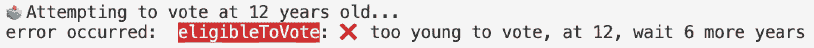
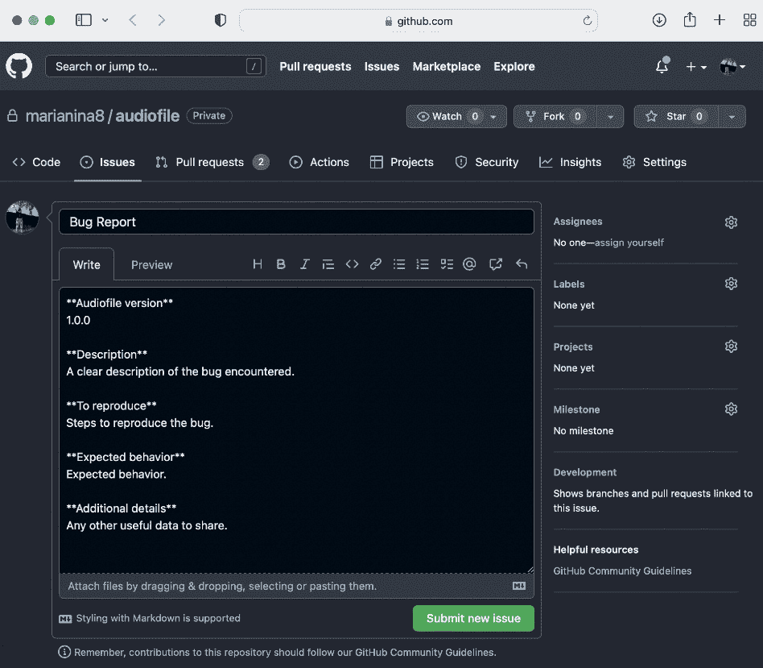
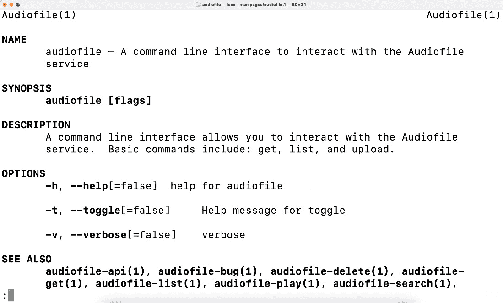

# 第九章：开发的同理心方面

同理心最近成为了一个热门话题，它与软件的关系也不例外。本章将讨论如何使用同理心来开发更好的 CLI。以同理心驱动的 CLI 开发会考虑到所编写的输出和错误以及它们可能给用户带来的清晰度和信心。采用同理心方法的书面文档还为用户提供了一种轻松上手的方式，而当用户需要时，帮助和支持也随时可用。

本章将给出如何以用户易于理解的方式重写错误的示例，不仅使错误发生更加清晰，还包括如何以及在哪里（通过调试和回溯信息）提供，这些可以通过`--verbose`标志和详细的日志来实现。为用户提供日志非常重要，当讨论调试和回溯信息时，这种实现将被描述。用户还可以通过手册页、每个命令的使用示例、同理心编写的文档以及快速轻松提交在应用程序中遇到的 bug 的方式来感到更加放心。

将同理心方法应用到应用程序的许多不同领域以及你的生活中，这不仅是一种自我关爱，也是一种对他人的关爱。希望这些建议能帮助你创建一个能够满足用户视角并给他们带来安心感的 CLI。具体来说，本章将涵盖以下主题：

+   将错误重写为人类可读格式

+   提供调试和回溯信息

+   无障碍的 bug 提交

+   帮助、文档和支持

# 技术要求

这是本章的要求：

+   一个 Unix 操作系统，以便理解和运行本章中共享的示例

+   你也可以在 GitHub 上找到代码示例：[`github.com/PacktPublishing/Building-Modern-CLI-Applications-in-Go/tree/main/Chapter09`](https://github.com/PacktPublishing/Building-Modern-CLI-Applications-in-Go/tree/main/Chapter09)

# 将错误重写为人类可读格式

错误可能会成为用户的一大挫折点，因为它们可能会打乱用户的原始计划。然而，如果你能尽可能地使这个过程不那么痛苦，用户会非常感激。在本节中，我们将讨论一些在发生错误时减轻用户痛苦的方法，并提供一些创建更好的错误信息和避免一些常见错误指南。创建清晰且有帮助的错误信息往往被忽视，但它们对最佳用户体验有着非常重大的影响。

想想你在使用命令行界面（CLI）时的一些主观体验以及你遇到的一些错误。这是一个思考如何改进自己使用 CLI 时的体验的机会，同时也为他人考虑。

## 编写错误信息的指南

在编写错误信息时，以下是一些有用的指南：

+   **具体化**：针对实际发生的任务定制信息。如果任务需要输入凭证或最终命令来完成工作流程，这个错误信息至关重要。最好的体验包括指定确切的问题并提供解决问题的方法。具体的指导有助于用户保持参与并愿意进行更正。

+   **提醒用户另一端有真人**：一个通用的错误信息可能会让大多数用户听起来非常技术化和令人生畏。通过重新编写错误信息，你可以使它们更有用，不那么令人生畏。同情你的用户，并确保你不会责怪用户，这可能会特别令人沮丧。通过理解、友好地交流，并且字面和比喻上都使用相同的语言，鼓励用户是非常重要的！你用的词在对话中听起来怎么样？

+   **保持轻松愉快**：保持轻松愉快的语气可以帮助在发生错误时缓解紧张情绪，但要注意！在某些情况下，这可能会使情况变得更糟——尤其是如果这是一个关键任务。用户不希望感到被嘲笑。无论如何，无论是否有幽默感，错误信息仍然应该是信息性的、清晰的和礼貌的。

+   **让它变得简单**：这需要你做更多的工作，但最终绝对值得。提供清晰的下一步操作或要运行的命令，以解决问题并帮助用户回到他们最初想要做的事情上。有了有用的建议，用户至少可以看到穿过树林的道路，并知道下一步该做什么。

+   **考虑最佳位置**：在输出错误信息时，最好将它们放置在用户首先会看的地方。在 CLI 的情况下，最可能是在输出的末尾。

+   **合并错误**：如果有多个错误信息，尤其是相似的信息，将它们分组在一起。这样看起来会比反复重复相同的错误信息要好得多。

+   **使用图标和文本优化错误信息**：通常，重要信息被放置在输出的末尾，但如果屏幕上有任何红色文本，用户通常会注意到那里。鉴于颜色的力量，要谨慎使用，并有目的地使用。

+   **考虑大小写和标点符号**：不要全部大写或使用多个感叹号。还要考虑一致性——你的错误信息是否以大写字母开头？如果它们被输出到日志中，错误可能全部以小写字母开头。

## 装饰错误

在错误信息中添加额外的信息和上下文是一个非常重要的步骤。具体任务失败的原因是什么？这有助于用户了解发生了什么。提供采取行动以解决问题的方法也将帮助用户感到更有支持感，并愿意继续前进。

首先，有几种方法可以装饰你的错误信息以提供更多信息。你可以使用`fmt.Errorf`函数：

```go
func Errorf(format string, a ...interface{}) error
```

使用这个函数，你可以打印出带有任何附加上下文的错误字符串。以下是在`Chapter-9`仓库中的`errors/errors.go`文件中的一个示例：

```go
birthYear := -1981
err := fmt.Errorf("%d is negative\nYear can't be negative", birthYear)
if birthYear < 0 {
    fmt.Println(err)
} else {
    fmt.Printf("Birth year: %d\n", birthYear)
}
```

下一种装饰错误的方法是使用`errors.Wrap`方法。该方法完全定义如下：

```go
func Wrap(err error, message string) error
```

它返回一个错误，在方法调用点注释`err`的消息和堆栈跟踪。如果`err`是`nil`，则`Wrap`函数也返回`nil`。

在`wrapping()`函数中，我们展示了这一点：

```go
func wrapping() error {
    err := errors.New("error")
    err1 := operation1()
    if err1 != nil {
        err1 = errors.Wrap(err, "operation1")
    }
    err2 := operation2()
    if err != nil {
        err2 = errors.Wrap(err1, "operation2")
    }
    err3 := operation3()
    if err != nil {
        err3 = errors.Wrap(err2, "operation3")
    }
    return err3
}
```

注意，前面的错误被包裹到下一个错误中，依此类推，直到返回最终错误。`wrapping()`函数返回的错误输出如下。为了清晰起见，我已经移除了较长的路径：

```go
error
.../errors.wrapping
        .../errors/errors.go:73
.../errors.Examples
        .../errors/errors.go:39
main.main
        .../main.go:6
runtime.main
        /usr/local/go/src/runtime/proc.go:250
runtime.goexit
        /usr/local/go/src/runtime/asm_amd64.s:1594
operation1
.../errors.wrapping
        .../errors/errors.go:76
.../errors.Examples
        .../errors/errors.go:39
main.main
        .../main.go:6
runtime.main
        /usr/local/go/src/runtime/proc.go:250
runtime.goexit
        /usr/local/go/src/runtime/asm_amd64.s:1594
operation2
.../errors.wrapping
        .../errors/errors.go:80
.../errors.Examples
        .../errors/errors.go:39
main.main
        .../main.go:6
runtime.main
        /usr/local/go/src/runtime/proc.go:250
runtime.goexit
        /usr/local/go/src/runtime/asm_amd64.s:1594
operation3
.../errors.wrapping
        .../errors/errors.go:84
.../errors.Examples
        .../errors/errors.go:39
main.main
        .../main.go:6
runtime.main
        /usr/local/go/src/runtime/proc.go:250
runtime.goexit
        /usr/local/go/src/runtime/asm_amd64.s:1594
```

注意，`operation1`、`operation2`和`operation3`的错误都包裹在原始`error`实例之下。

因为`wrapping()`函数将错误与堆栈跟踪和消息一起注释，所以调用`New()`或`Wrap()`方法时，调用`wrapping()`函数的行会打印出错误消息，随后是堆栈跟踪。

## 自定义错误

创建自定义错误允许你将你认为对用户有价值的信息存储在错误中，以便在打印时，所有信息都可在单个结构体中找到。首先，你需要考虑错误结构：

```go
type error interface {
    Error() string
}
```

简单地创建任何实现`Error() string`方法的类型。考虑一下你想要存储在自定义错误结构体中的数据，这可能对用户有用，甚至对你作为开发者进行调试也有用。这可能包括错误发生的方法名称、错误的严重性或错误的类型。在`Chapter-9`仓库的`errors.go`文件中，我提供了一些示例。为了简化，只向`customError`结构体添加了一个额外的字段`Task`：

```go
type customError struct {
    Task string
    Err error
}
```

这里定义了满足先前接口的`Error()`方法。为了好玩，我们使用了上一章中使用的`github.com/fatih/color`颜色页面以及一个表情符号（一个红色的十字标记）与错误消息一起：

```go
func (e *customError) Error() string {
    var errorColor = color.New(color.BgRed,
        color.FgWhite).SprintFunc()
    return fmt.Sprintf("%s: %s %s", errorColor(e.Task),
        crossMark, e.Err)
}
```

现在，我们可以演示如何在`eligibleToVote`函数中使用这个自定义错误：

```go
func eligibleToVote(age int) error {
    fmt.Printf("%s Attempting to vote at %d years
        old...\n", votingBallot, age)
    minimumAge := 18
    err := &customError{
        Task: " eligibleToVote",
    }
    if age < minimumAge && age > 0 {
        years := minimumAge - age
        err.Err = fmt.Errorf("too young to vote, at %d,
            wait %d more years", age, years)
        return err
    }
    if age < 0 {
        err.Err = fmt.Errorf("age cannot be negative: %d",
            age)
        return err
    }
    fmt.Println("Voted.", checkMark)
    return nil
}
```

注意，这里有多个错误，错误最初在函数顶部定义，只设置了`Task`字段。对于每个发生的错误，然后设置`Err`字段并返回。在`Examples`方法中，我们使用以下行调用函数：

```go
birthYear = 2010
currentYear := 2022
age := currentYear - birthYear
err = eligibleToVote(age)
if err != nil {
    fmt.Println("error occurred: ", err)
}
```

当前面的代码运行时，会输出以下错误：



图 9.1 – 投票错误截图

创建自定义错误有 plenty of 其他方法，但以下是一些可以考虑添加到自定义错误中的内容：

+   用于日志记录的错误严重性

+   任何可能对指标有价值的资料

+   错误类型，这样你可以在错误发生时轻松过滤掉任何意外的错误

## 编写更好的错误消息

现在我们知道了如何添加更多细节到错误信息中，让我们回顾一下`audiofile` CLI，并使用本节前面提到的指南重写我们的错误信息，使其更加人性化。在仓库中，对于这个特定的分支，我已经添加了额外的错误信息，以便用户或开发者更好地理解错误发生的位置以及原因。

由于`audiofile` CLI 与`audiofile` API 交互，存在可以处理和重写的 HTTP 响应。在`utils/http.go`文件中存在一个`CheckResponse`函数，它执行以下操作：

```go
func CheckResponse(resp *http.Response) error {
    if resp != nil {
        if resp.StatusCode != http.StatusOK {
            switch resp.StatusCode {
            case http.StatusInternalServerError:
                return fmt.Errorf(errorColor("retry the command 
                  later"))
            case http.StatusNotFound:
                return fmt.Errorf(errorColor("the id cannot be 
                  found"))
            default:
                return fmt.Errorf(errorColor(fmt.
                  Sprintf("unexpected response: %v", resp.
                  Status)))
            }
        }
        return nil
    } else {
        return fmt.Errorf(errorColor("response body is nil"))
    }
}
```

考虑在您自己的 CLI 中扩展这一点，它可能也会与 REST API 交互。您可以检查您喜欢的任何响应并将它们重写为命令返回的错误。

在`audiofile` CLI 的先前版本中，如果将`id`参数传递给`get`或`delete`命令，如果 ID 未找到，则不会返回任何内容。然而，通过返回`http.StatusNotFound`响应并添加额外的错误装饰，之前会静默错误并返回无数据的命令现在可以返回一些有用的信息：

```go
mmontagnino@Marians-MacBook-Pro audiofile % ./bin/audiofile get --id 1234
Sending request: GET http://localhost:8000/request?id=1234 ...
Error:
  checking response: the id cannot be found
Usage:
  audiofile get [flags]
Flags:
  -h, --help        help for get
      --id string   audiofile id
      --json        return json format
```

我们甚至可以通过额外建议如何查找 ID 来提升等级。潜在的做法是要求用户运行`list`命令以确认 ID。另一件事，类似于我们处理 HTTP API 请求的状态码的方式，是检查从本地命令返回的错误。无论是命令未找到还是命令缺少可执行权限，你都可以使用开关来处理在启动或运行命令时可能发生的潜在错误。这些潜在错误可以使用更用户友好的语言类似地重写。

# 提供调试和跟踪信息

调试和跟踪信息主要对您或其他开发者有用，但它也可以帮助您的最终用户与您分享有价值的信息，以帮助调试在您的代码中发现的潜在问题。有几种不同的方式可以提供这些信息。调试和跟踪信息主要输出到日志文件，通常，添加一个`verbose`标志将打印此输出，这通常是被隐藏的。

## 日志数据

由于调试数据通常位于日志文件中，让我们讨论如何在命令行应用程序中包含日志，并确定与日志相关的级别——`info`、`error`和`debug`级别的严重性。在这个例子中，让我们使用一个简单的日志包来演示这一点。有几个不同的流行结构化日志包，包括以下：

+   Zap ([`github.com/uber-go/zap`](https://github.com/uber-go/zap))—由 Uber 开发的快速结构化日志记录器

+   ZeroLog ([`github.com/rs/zerolog`](https://github.com/rs/zerolog))—专注于 JSON 格式的快速简单日志记录器

+   Logrus ([`github.com/sirupsen/logrus`](https://github.com/sirupsen/logrus))—一个为 Go 提供结构化日志记录和 JSON 格式输出选项的日志记录器（目前处于维护模式）

虽然 `logrus` 是一个非常受欢迎的日志记录器，但有一段时间没有更新了，所以我们选择使用 `zap`。一般来说，选择一个积极维护的开源项目是一个有希望的想法。

## 初始化一个日志记录器

回到 `audiofile` 项目，让我们添加一些用于调试目的的日志记录。在我们 `audiofile` 仓库中运行的第一件事是：

```go
go get -u go.uber.org/zap
```

它将获取更新的 Zap 日志记录器依赖项。之后，我们可以在项目的 Go 文件中开始引用导入。在 `utils` 目录下，我们添加一个 `utils/logger.go` 文件来定义一些初始化 Zap 日志记录器的代码，该代码在 `main` 函数中被调用：

```go
package utils
import (
    "go.uber.org/zap"
)
var Logger *zap.Logger
var Verbose *zap.Logger
func InitCLILogger() {
    var err error
    var cfg zap.Config
    config := viper.GetStringMap("cli.logging")
    configBytes, _ := json.Marshal(config)
    if err := json.Unmarshal(configBytes, &cfg); err != nil {
        panic(err)
    }
    cfg.EncoderConfig = encoderConfig()
    err = createFilesIfNotExists(cfg.OutputPaths)
    if err != nil {
        panic(err)
    }
    cfg.Encoding = "json"
    cfg.Level = zap.NewAtomicLevel()
    Logger, err = cfg.Build()
    if err != nil {
        panic(err)
    }
    cfg.OutputPaths = append(cfg.OutputPaths, "stdout")
    Verbose, err = cfg.Build()
    if err != nil {
        panic(err)
    }
    defer Logger.Sync()
}
```

虽然不是必需的，但我们在这里定义了两个日志记录器。一个是 `Logger` 日志记录器，它将输出到配置文件中定义的输出路径，另一个是详细模式的 `Verbose` 日志记录器，它将输出到标准输出和之前定义的输出路径。两者都使用 `*zap.Logger` 类型，这在类型安全和性能至关重要的场合使用。Zap 还提供了一个糖化日志记录器，当性能是可取的但不是关键时使用。`SugarLogger` 也允许结构化日志记录，但除此之外，还支持 `printf` 风格的 API。

在这个仓库的 `Chapter-9` 分支版本中，我们将一些通用的 `fmt.Println` 或 `fmt.Printf` 输出替换为可以在 `verbose` 模式下显示的日志。此外，我们在打印信息时区分了 `Info` 级别和 `Error` 级别。

以下代码使用 Viper 从配置文件中读取，该文件已被修改以包含一些额外的日志记录器配置：

```go
{
    "cli": {
        "hostname": "localhost",
        "port": 8000,
        "logging": {
            "level": "debug",
            "encoding": "json",
            "outputPaths": [
                "/tmp/log/audiofile.json"
            ]
        }
    }
}
```

在前面的配置中，我们设置了 `level` 和 `encoding` 字段。我们选择 `debug` 级别，以便将调试和错误语句输出到日志文件。对于 `encoding` 值，我们选择了 `json`，因为它提供了一个标准的结构，可以使得每个字段都有标签，从而更容易理解错误信息。编码器配置也在同一 `utils/logger.go` 文件中定义：

```go
func encoderConfig() zapcore.EncoderConfig {
    return zapcore.EncoderConfig{
        MessageKey: "message",
        LevelKey: "level",
        TimeKey: "time",
        NameKey: "name",
        CallerKey: "file",
        StacktraceKey: "stacktrace",
        EncodeName: zapcore.FullNameEncoder,
        EncodeTime: timeEncoder,
        EncodeLevel: zapcore.LowercaseLevelEncoder,
        EncodeDuration: zapcore.SecondsDurationEncoder,
        EncodeCaller: zapcore.ShortCallerEncoder,
    }
}
```

由于 `InitCLILogger()` 函数在 `main` 函数中被调用，所以两个 `Logger` 和 `Verbose` 日志记录器将可用于任何命令中使用。

## 实现一个日志记录器

让我们看看我们如何有效地开始使用这个日志记录器。首先，我们知道在详细模式中，我们将记录所有数据并输出给用户。我们在 `cmd/root.go` 文件中将 `verbose` 标志定义为持久标志。这意味着 `verbose` 标志不仅可在根级别使用，而且对于添加到其中的每个子命令也是可用的。在该文件的 `init()` 函数中，我们添加了以下行：

```go
rootCmd.PersistentFlags().BoolP("verbose", "v", false, "verbose")
```

现在，而不是在`verbose`标志被调用时检查每个错误并在返回之前打印出错误，我们创建了一个简单的函数，它可以重复用于检查，也可以返回错误值。在`utils/errors.go`文件中，我们定义以下函数以供重用：

```go
func Error(errString string, err error, verbose bool) error {
    errString = cleanup(errString, err)
    if err != nil {
        if verbose {
            // prints to stdout also
            Verbose.Error(errString)
        } else {
            Logger.Error(errString)
        }
        return fmt.Errorf(errString)
    }
    return nil
}
```

以一个命令为例，比如`delete`命令，它展示了如何调用此功能：

```go
var deleteCmd = &cobra.Command{
    Use: "delete",
    Short: "Delete audiofile by id",
    Long: `Delete audiofile by id. This command removes the
        entire folder containing all stored metadata`,
```

命令的大部分代码通常位于`Run`或`RunE`方法中，该方法接收`cmd`变量，一个`*cobra.Command`实例，以及`args`变量，它包含一个`strings`切片中的参数。在每种方法非常早期的时候，我们创建客户端并提取我们可能需要的任何标志——在这个例子中，是`verbose`、`silence`和`id`标志：

```go
    RunE: func(cmd *cobra.Command, args []string) error {
        client := &http.Client{
            Timeout: 15 * time.Second,
        }
        var err error
          silence, _ := cmd.Flags().GetBool("silence")
        verbose, _ := cmd.Flags().GetBool("verbose")
        id, _ := cmd.Flags().GetString("id")
        if id == "" {
            id, err = utils.AskForID()
            if err != nil {
                return utils.Error("\n %v\n try again and
                    enter an id", err, verbose)
            }
        }
```

接下来，我们构建我们发送给`HTTP`客户端的请求，它使用`id`值：

```go
        params := "id=" + url.QueryEscape(id)
        path := fmt.Sprintf("http://%s:%d/delete?%s",
            viper.Get("cli.hostname"),
            viper.GetInt("cli.port"), params)
        payload := &bytes.Buffer{}
        req, err := http.NewRequest(http.MethodGet,
            path, payload)
        if err != nil {
            return utils.Error("\n %v\n check configuration
                to ensure properly configured hostname and
                port", err, verbose)
        }
```

我们检查在创建请求时是否有任何错误，这很可能是配置错误的结果。接下来，我们记录请求，以便我们了解任何与外部服务器的通信：

```go
        utils.LogRequest(verbose, http.MethodGet, path,
            payload.String())
```

我们将通过客户端的`Do`方法执行请求，如果请求未成功则返回错误：

```go
        resp, err := client.Do(req)
        if err != nil {
            return utils.Error("\n %v\n check configuration
                to ensure properly configured hostname and
                port\n or check that api is running", err,
                verbose)
        }
        defer resp.Body.Close()
```

在请求之后，我们检查响应并读取`resp.Body`，即响应体，如果响应成功。如果不成功，将返回并记录错误消息：

```go
        err = utils.CheckResponse(resp)
        if err != nil {
            return utils.Error("\n checking response: %v",
            err, verbose)
        }
        b, err := ioutil.ReadAll(resp.Body)
        if err != nil {
            return utils.Error("\n reading response: %v
                \n ", err, verbose)
        }
        utils.LogHTTPResponse(verbose, resp, b)
```

最后，我们检查响应是否返回`success`字符串，这表明删除成功。然后将结果打印给用户：

```go
        if strings.Contains(string(b), "success") && !silence {
            fmt.Printf("\U00002705 Successfully deleted
                audiofile (%s)!\n", id)
        } else {
            fmt.Printf("\U0000274C Unsuccessful delete of
                audiofile (%s): %s\n", id, string(b))
        }
        return nil
    },
}
```

你会看到每当遇到错误时都会调用`utils.Error`函数。你还会看到几个其他的日志函数：`utils.LogRequest`和`utils.LogHTTPResponse`。第一个，`utils.LogRequest`，被定义为将请求记录到标准输出、日志文件或两者：

```go
func LogRequest(verbose bool, method, path, payload string) {
    if verbose {
        Verbose.Info(fmt.Sprintf("sending request: %s %s
            %s...\n", method, path, payload))
    } else {
        Logger.Info(fmt.Sprintf("sending request: %s %s
            %s...\n", path, path, payload))
    }
}
```

第二个，`utils.LogHTTPResponse`，同样将前一个请求的响应记录到标准输出、日志文件或两者：

```go
func LogHTTPResponse(verbose bool, resp *http.Response, body []byte) {
    if verbose && resp != nil {
        Verbose.Info(fmt.Sprintf("response status: %s,
            body: %s", resp.Status, string(body)))
    } else if resp != nil {
        Logger.Info(fmt.Sprintf("response status: %s, body:
            %s", resp.Status, string(body)))
    }
}
```

现在这个记录器已经为所有的`audiofile`命令实现，让我们试一试，看看现在命令有了`verbose`标志输出调试数据时输出是什么样子：

## 尝试详细模式以查看堆栈跟踪

重新编译项目后，我们使用无效的 ID 运行`delete`命令，并传递`verbose`命令：

```go
./bin/audiofile delete --id invalidID --verbose
{"level":"info","time":"2022-11-06 21:21:44","file":"utils/logger.go:112","message":"sending request: GET http://localhost:8000/delete?id=invalidID ...\n"}
{"level":"error","time":"2022-11-06 21:21:44","file":"utils/errors.go:17","message":"checking response: \u001b[41;37mthe id cannot be found\u001b[0m","stacktrace":"github.com/marianina8/audiofile/utils.Error\n\t/Users/mmontagnino/Code/src/github.com/marianina8/audiofile/utils/errors.go:17\ngithub.com/marianina8/audiofile/cmd.glob..func2\n\t/Users/mmontagnino/Code/src/github.com/marianina8/audiofile/cmd/delete.go:54\ngithub.com/spf13/cobra.(*Command).execute\n\t/Users/mmontagnino/Code/src/github.com/marianina8/audiofile/vendor/github.com/spf13/cobra/command.go:872\ngithub.com/spf13/cobra.(*Command).ExecuteC\n\t/Users/mmontagnino/Code/src/github.com/marianina8/audiofile/vendor/github.com/spf13/cobra/command.go:990\ngithub.com/spf13/cobra.(*Command).Execute\n\t/Users/mmontagnino/Code/src/github.com/marianina8/audiofile/vendor/github.com/spf13/cobra/command.go:918\ngithub.com/marianina8/audiofile/cmd.Execute\n\t/Users/mmontagnino/Code/src/github.com/marianina8/audiofile/cmd/root.go:21\nmain.main\n\t/Users/mmontagnino/Code/src/github.com/marianina8/audiofile/main.go:11\nruntime.main\n\t/usr/local/go/src/runtime/proc.go:250"}
Error: checking response: the id cannot be found
Usage:
  audiofile delete [flags]
Flags:
  -h, --help        help for delete
      --id string   audiofile id
Global Flags:
  -v, --verbose   verbose
```

使用`verbose`标志，打印出调试语句，当发生错误时，堆栈跟踪也会输出。这对于用户与开发者共享以调试出了什么问题的重要数据。现在，让我们学习如何给用户提交错误报告的选项：

# 无需努力的错误提交

让我们使用 Cobra 生成器创建一个`bug`命令，让用户可以向`audiofile` CLI 的开发者提交问题：

```go
cobra-cli add bug
bug created at /Users/mmontagnino/Code/src/github.com/marianina8/audiofile
```

现在我们已经创建了`bug`命令，将`Run`字段更改为提取应用程序的详细信息并使用已添加和准备好的数据启动网络浏览器，以便用户只需添加一些额外细节即可完成提交：

```go
var bugCmd = &cobra.Command{
    Use: "bug",
    Short: "Submit a bug",
    Long: "Bug opens the default browser to start a bug
        report which will include useful system
        information.",
    RunE: func(cmd *cobra.Command, args []string) error {
        if len(args) > 0 {
            return fmt.Errorf("too many arguments")
        }
        var buf bytes.Buffer
        buf.WriteString(fmt.Sprintf("**Audiofile
            version**\n%s\n\n", utils.Version()))
        buf.WriteString(description)
        buf.WriteString(toReproduce)
        buf.WriteString(expectedBehavior)
        buf.WriteString(additionalDetails)
        body := buf.String()
        url := "https://github.com/marianina8/audiofile/issues/new?title=Bug Report&body=" + url.QueryEscape(body)
        // we print if the browser fails to open
        if !openBrowser(url) {
            fmt.Print("Please file a new issue at https://github.com/marianina8/audiofile/issues/new using this template:\n\n")
        fmt.Print(body)
        }
        return nil
    },
}
```

传递给`buf.WriteString`方法的字符串定义在同一文件`cmd/bug.go`中的命令之外，但一旦命令运行，完整的模板体如下所示：

```go
**Audiofile version**
1.0.0
**Description**
A clear description of the bug encountered.
**To reproduce**
Steps to reproduce the bug.
**Expected behavior**
Expected behavior.
**Additional details**
Any other useful data to share.
```

调用`./bin/audiofile bug`命令会启动浏览器打开 GitHub 仓库中的新问题页面：



图 9.2 – 浏览器打开到新问题的截图

从浏览器窗口中打开新问题页面；CLI 的版本会被自动填充，然后用户可以用自己的文本替换描述、复现步骤、预期行为和其他步骤的默认文本。

# 帮助、文档和支持

创建一个能够体谅用户的 CLI 的一部分是提供足够的帮助和文档，以及支持各种用户。幸运的是，Cobra CLI 框架支持从 Cobra 命令的短字段和长字段生成帮助，以及生成 man 页面。然而，将同情心融入 CLI 的扩展文档可能需要几种技术。

## 生成帮助文本

到目前为止，已经有很多创建命令的例子了，但为了重申，命令结构和在帮助中显示的字段是 Cobra 命令中的字段。让我们来看一个好例子：

```go
var playCmd = &cobra.Command{
    Use: "play",
    Short: "Play audio file by id",
    Long: `Play audio file by id using the default audio
        player for your current system`,
    Example: `./bin/audiofile play –id
        45705eba-9342-4952-8cd4-baa2acc25188`,
    RunE: func(cmd *cobra.Command, args []string) error {
        // code
    },
}
```

确保你只提供命令的简短和长描述以及一个或几个示例，你就是在提供一些帮助文本，至少可以让用户开始使用该命令。运行此命令将显示以下输出：

```go
audiofile % ./bin/audiofile play --help
Play audio file by id using the default audio player for your current system
Usage:
  audiofile play [flags]
Examples:
  ./bin/audiofile play –id 45705eba-9342-4952-8cd4-baa2acc25188
Flags:
  -h, --help        help for play
      --id string   audiofile id
Global Flags:
  -v, --verbose   verbose
```

一个简单的命令不需要太多的解释，所以这些就足够帮助用户了解如何使用。

## 生成 man 页面

在`audiofile`仓库中，我们添加了一些额外的代码来为现有的命令和`Makefile`中的命令生成 man 页面，以便快速运行代码来完成这项工作。在仓库中存在一个新程序，定义在`documentation/main.go`下：

```go
import (
    "log"
    "github.com/marianina8/audiofile/cmd"
    "github.com/spf13/cobra/doc"
)
func main() {
    header := &doc.GenManHeader{
        Title: "Audiofile",
        Source: "Auto generated by marianina8",
    }
    err := doc.GenManTree(cmd.RootCMD(), header, "./pages")
    if err != nil {
        log.Fatal(err)
    }
}
```

我们传递`root`命令并在`./pages`目录中生成页面。在`Makefile`中添加`make pages`命令会在调用时创建 man 页面：

```go
manpages:
    mkdir -p pages
    go run documentation/main.go
```

在终端中，如果你运行`make manpages`然后通过运行`man pages/audiofile.1`来检查新页面是否存在，你会看到为`audiofile` CLI 生成的 man 页面：



图 9.3 – 终端中 audiofile man 页面的截图

你还可以看到在`pages`目录中，为添加到`root`命令的所有命令都创建了一个单独的 man 页面。

## 将同情心融入你的文档

当用户到达你的文档时，他们可能已经遇到了问题并且感到沮丧或困惑。你的文档需要考虑到这一点，并展现出对用户情况的了解。

虽然可能感觉文档编写会从其他开发领域消耗大量时间和精力，但它对你的命令行应用程序的未来至关重要。

在过去几年中，出现了一个新术语，*同理心倡导*，它与技术文档有关。这个术语是由技术及 UX 作家、同理心倡导者 Ryan Macklin 提出的。这个术语用来描述一个以同理心和现实中对人类情感的尊重为中心的技术传播子领域。它可以被视为与用户沟通方式的框架。因为很多人会阅读你的文档，我们知道其中包含了各种各样的脑化学、生活经验和最近的事件。同理心倡导是解决这个美好挑战的一种方法。

Macklin 提出了基于同理心倡导的七个哲学文档技巧。这些原则受到了 UX、创伤心理治疗、神经生物学、游戏设计以及文化和语言差异等学科的启发。让我们讨论这些原则及其为何有效：

+   **运用视觉叙事**—人类大脑很容易抓住故事，视觉用户可以从视觉中受益。然而，这迫使开发者思考不同类型的可访问性：视觉、认知、运动等。讲述故事迫使作者思考结构。另一方面，密集且冗长的文本是**可访问性敌对的**。作为备注，这个想法并不适用于每个人。

+   **使用摘要**—使用**tl;dr**（代表**too long, don’t read**，即“太长，不读”）、总结行或横幅为疲惫和压力山大的读者提供一个简短的解释，这些读者从认知成本较低的选择中受益。完成高水平智力所需的认知任务需要认知粘合剂。认知粘合剂需要能量，因此提供摘要将为那些已经处于低能量状态的用户提供低成本选项。

+   **提供时间框架**—一般来说，不确定性会创造**恶性空白**，而在未知的时间框架中逗留会引发强烈的情绪反应。提供时间框架可以帮助稳定空白。如果服务器端出现故障、上传到服务器或完成特定任务的通用时间，都可以提供时间框架。

+   **包含短视频**—这对于一些阅读理解有困难的用户来说是一个很好的替代方案。通常，年轻观众习惯于视频，当你将视频拆分成单个主题时，较短的播放时间可以提供安慰。安慰是一种强大的调节情绪的方式。然而，视频也有一些陷阱——主要是，视频需要更多的时间和能量来制作。

+   **减少截图**—提供截图可能会有帮助，但只有在用户界面可能令人困惑时。仅提供足够的信息让用户自己弄清楚一些事情，有助于培养认知粘性。否则，被视觉信息轰炸会伤害到每个人。

+   **重新思考 FAQ**—与其传统的问答，不如将文档拆分为单范围文档。提供具体的标题，避免过度承诺。

+   **选择你的战斗**—不是每一场战斗都值得打；尽你所能，选择你的战斗。你做的事情并不一定适合每个人——在过程中学习。毕竟，倡导同理心是自我关怀的另一种方式。

希望这些描述同理心倡导哲学的原理能帮助你重新思考你在文档中使用的词语。当你编写文档时，要考虑你的词语可能如何影响处于恐慌或挫败状态的人。还要考虑你如何帮助那些即将放弃或缺乏完成任务能量的用户取得成功。

# 摘要

在本章中，你学习了具体步骤来使你的命令行应用程序更具同理心。从错误处理、调试和回溯信息、轻松的错误提交，到技术沟通中的同理心倡导，你学到了在应用程序中应用的技术和同理心技能。

现在错误可以用颜色重写，从屏幕上跳出来，并装饰上提供用户关于错误发生的确切位置以及可能需要做什么来解决问题的额外信息。当错误看起来无法解决时，用户可以运行带有`--verbose`标志的相同命令，查看详细日志，这些日志可能包含追踪错误可能发生位置的必要的服务器请求和响应，直到代码的行。

如果遇到错误，新增的`bug`命令允许用户从终端直接启动一个新的浏览器，直接打开 GitHub 新问题提交表单中的新模板。

最后，通过采取同理心方法来弥合技术文档和用户视角之间的差距。在编写文档时使用同理心框架的几个哲学原则已被讨论。

# 问题

1.  你可以使用哪两种常见方法来装饰你的错误？

1.  在 Zap 和 Logrus 日志记录器之间，你为什么选择 Zap？

1.  什么是同理心倡导？

# 进一步阅读

+   *同理心* *倡导*：[`empathyadvocacy.org`](https://empathyadvocacy.org)

+   *编写文档*：[`www.writethedocs.org`](https://www.writethedocs.org)

# 答案

1.  `fmt.Errorf(format string, a ...any) error 或 errors.Wrap(err error, message string) error`。

1.  Zap 更快，并且正在积极维护。

1.  同理心倡导是技术交流的一个子领域，它以同理心和现实中对人类情感的尊重为核心。它可以被视为一种编写技术文档的方式框架，以及为具有不同背景和可访问性的多种类型人群写作的解决方案。
