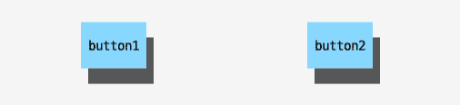

# 提示和终端仪表板的交互性

提高用户体验的一种强大方式是将交互性与提示或终端仪表板集成。提示很有用，因为它们在请求输入的同时创建了一种对话式的方法。仪表板很有用，因为它们允许开发者从 ASCII 字符创建图形界面。通过仪表板创建的图形界面可以产生强大的视觉提示，使用户能够导航不同的命令。

本章将给出如何从一系列提示中构建用户调查问卷以及终端仪表板的示例 – 不论是学习 Termdash 库、设计原型还是将其应用于音频文件命令行界面。

交互性很有趣。它是一种更人性化和富有同理心的命令行界面方法。然而，如果你不是输出到终端，请记住禁用交互性。本章将涵盖调查问卷的基础知识，并深入探讨终端仪表板。到本章结束时，你将拥有创建自己的调查问卷或仪表板所需的一切。我们将涵盖以下内容：

+   使用提示引导用户

+   设计一个有用的终端仪表板

+   实现终端仪表板

# 技术要求

+   你需要 Unix 操作系统来理解并运行本章中共享的示例

+   在[`github.com/mum4k/termdash`](https://github.com/mum4k/termdash)获取`termdash`包

+   在[`github.com/go-survey/survey`](https://github.com/go-survey/survey)获取调查问卷包

+   你也可以在 GitHub 上找到代码示例[`github.com/PacktPublishing/Building-Modern-CLI-Applications-in-Go/tree/main/Chapter10`](https://github.com/PacktPublishing/Building-Modern-CLI-Applications-in-Go/tree/main/Chapter10)

# 使用提示引导用户

有许多简单提示用户的方法，但如果你想要创建一个可以检索信息的完整调查问卷，使用各种不同的提示 – 文本输入、多选、单选、多行文本、密码等 – 使用现有的库来处理这些可能很有用。让我们使用`survey`包创建一个通用的客户调查问卷。

为了展示如何使用这个包，我将创建一个可以提示用户不同类型输入的调查问卷：

+   **文本输入** – 例如，电子邮件地址

+   **选择** – 例如，用户对命令行界面的体验

+   **多选** – 例如，遇到的任何问题

+   **多行** – 例如，开放式的反馈

在`Chapter-10`仓库中，已经编写了一个调查问卷来处理这四个提示。问题存储在`qs`变量中，定义为`*survey.Question`的切片：

```go
questions := []*survey.Question{
    {
        Name: "email",
        Prompt: &survey.Input{
          Message: "What is your email address?"
   },
        Validate: survey.Required,
        Transform: survey.Title,
    },
    {
        Name: "rating",
        Prompt: &survey.Select{
            Message: "How would you rate your experience with 
                     the CLI?",
            Options: []string{"Hated it", "Disliked", "Decent", 
                             "Great", "Loved it"},
       },
    },
    {
        Name: "issues",
            Prompt: &survey.MultiSelect{
            Message: "Have you encountered any of these 
                     issues?",
            Options: []string{"audio player issues", "upload 
                             issues", "search issues", "other 
                             technical issues"},
        },
    },
    {
        Name: "suggestions",
        Prompt: &survey.Multiline{
            Message: "Please provide any other feedback or 
                     suggestions you may have.",
        },
    },
}
```

我们需要一个`answers`结构体来存储所有来自提示的结果：

```go
results := struct {
    Email string
    Rating string
    Issues []string
    Suggestions string
}{}
```

最后，询问问题和存储结果的方法：

```go
err := survey.Ask(questions, &results)
if err != nil {
    fmt.Println(err.Error())
    return
}
```

现在我们已经创建了调查问卷，我们可以尝试一下：

```go
mmontagnino@Marians-MacBook-Pro Chapter-10 % go run main.go
? What is your email? mmontagnino@gmail.com
? How would you rate your experience with the CLI? Great
? Have you encountered any of these issues? audio player issues, search issues
? Please provide any other feedback or suggestions you may have. [Enter 2 empty lines to finish]I want this customer survey embedded into the CLI and email myself the results!
```

提示用户是集成交互到您的命令行应用程序的一种简单方法。然而，还有更多丰富多彩和有趣的方式来与您的用户交互。在下一节中，我们将详细讨论终端仪表板，`termdash`包，以及如何模拟和实现终端仪表板。

# 设计一个有用的终端仪表板

命令行界面不必局限于文本。使用**termdash**，一个流行的 Golang 库，你可以构建一个终端仪表板，为用户提供一个用户界面，以直观地查看进度、警报、文本等。在整洁布局的仪表板中放置色彩丰富的组件可以增加信息密度，并以非常用户友好的方式向用户展示大量信息。在本节中，我们将了解这个库以及不同的布局选择和组件选项。在本章末尾，我们将设计一个可以在我们的**音频文件**命令行界面中实现的终端仪表板。

## 了解 Termdash

Termdash 是一个 Golang 库，它提供了一个可定制的、跨平台的基于终端的仪表板。在项目的 GitHub 页面上，一个有趣且多彩的演示展示了在动态布局中演示的所有可能的组件。从演示中，你可以看到你可以打造一个豪华的仪表板。要做到这一点，你需要了解如何布局仪表板，如何与键盘和鼠标事件交互，添加组件，以及如何通过对齐和颜色进行微调来调整外观。在本节中，我们将分解 Termdash 界面的层以及可以组织其中的组件。

Termdash 仪表板由四个主要层组成：

+   终端层

+   基础设施层

+   容器层

+   小部件层

让我们深入了解每一个。

### 终端层

将仪表板的终端层想象成一个存在于缓冲区内的 2D 单元格网格。每个单元格包含一个 ASCII 或 Unicode 字符，可以选择自定义前景色、文本颜色、背景色或单元格内非字符空间的颜色。鼠标和键盘的交互也发生在这一层。

可以使用两个终端库在终端的单元格级别进行交互：

+   **tcell**：受**termbox**启发，并有许多新的改进

+   **termbox**：不再受支持，尽管它仍然是一个选项

以下示例将使用`tcell`包与终端进行交互。首先，创建一个新的`tcell`实例以通过终端 API 进行交互：

```go
terminalLayer, err := tcell.New()
if err != nil {
   return err
}
defer terminalLayer.Close()
```

注意，在这个例子中，`tcell`有两个方法：`New`和`Close`。`New`用于创建一个新的`tcell`实例以与终端交互，而`Close`用于关闭终端。在创建后立即延迟关闭对`tcell`的访问是一个好的实践。尽管没有将选项传递给`New`方法，但还有一些可选的方法可以调用：

+   `ColorMode` 在初始化终端时设置颜色模式

+   `ClearStyle` 在清除终端时设置前景色和背景色

初始化单元格到 `ColorMode` 以访问所有 256 种可用的终端颜色的示例可能如下所示：

```go
terminalLayer, err := tcell.New(tcell.ColorMode(terminalapi.ColorMode256))
if err != nil {
   return err
}
defer terminalLayer.Close()
```

默认情况下，`ClearStyle` 如果未设置特定的 `ClearStyle`，将使用 `ColorDefault`。这个 `ColorDefault` 通常是指终端模拟器的默认前景色和背景色，通常是黑色和白色。要将终端设置为在清除时使用黄色前景色和海军蓝背景色，可以通过以下方式修改接受选项切片的 `New` 方法：

```go
terminalLayer, err := tcell.New(tcell.ColorMode(terminalapi.ColorMode256), tcell.ClearStyle(cell.ColorYellow, cell.ColorNavy))
if err != nil {
   return err
}
defer terminalLayer.Close()
```

现在我们已经创建了一个新的 `tcell`，它使我们能够访问终端 API，让我们讨论下一层——基础设施。

### 基础设施层

终端仪表板的基础设施提供了结构的组织。基础设施层的主要元素包括对齐、线型和 Termdash。

#### 对齐

对齐由 `align` 包提供，该包提供两种对齐选项——`align.Horizontal`，它包括预定义的 `left`、`center` 和 `right` 值，以及 `align.Vertical`，它具有预定义的 `top`、`middle` 和 `bottom` 值。

#### 线型

线型定义了在终端上绘制框或边框时线条的样式。

该包通过 `LineStyle` 暴露了可用的选项。`LineStyle` 类型代表遵循 Unicode 选项的样式。

#### Termdash

Termdash 为开发者提供了主要入口点。其最重要的目的是启动和停止仪表板应用程序，控制屏幕刷新，处理任何运行时错误，并订阅和监听键盘和鼠标事件。`termdash.Run` 方法是启动 Termdash 应用程序的最简单方式。终端可能运行直到上下文过期，键盘快捷键被调用或超时。开始使用仪表板的最简单方法是以下最小代码示例，它为终端层创建了一个新的 `tcell`，并创建了一个新的 `termdash` 包，我们将在下一节中深入了解。我们使用 2 分钟的过期时间创建上下文，然后调用 `termdash` 包的 `Run` 方法：

```go
if terminalLayer, err := tcell.New()
if err != nil {
   return err
}
defer terminalLayer.Close()
containerLayer, err := container.New(terminalLayer)
if err != nil {
   return err
}
ctx, cancel := context.WithTimeout(context.Background(), 1*time.Second)
defer cancel()
if err := termdash.Run(ctx, terminalLayer, containerLayer); err != nil {
   return err
}
```

在前面的代码示例中，仪表板将运行直到上下文过期，即 60 秒。

为您的终端仪表板进行屏幕重绘或刷新可以通过几种方式完成：基于周期的、基于时间的重绘或手动触发的重绘。只能使用一种方法，因为使用一种方法意味着忽略另一种方法。除此之外，每次发生输入事件时，屏幕都会刷新。`termdash.RedrawInterval` 方法是一个选项，可以传递给 `Run` 方法，告诉仪表板应用程序在特定间隔内重绘或刷新屏幕。`Run` 方法可以通过每 5 秒刷新一次的选项进行修改：

```go
termdash.Run(ctx, terminalLayer, containerLayer, termdash.RedrawInterval(5*time.Second))
```

仪表板也可以通过控制器重新绘制，这可以通过手动触发。此选项意味着仪表板只绘制一次，与 `Run` 方法不同，用户保持对主 goroutine 的控制。以下是一个示例代码，使用之前定义的 `tcell` 和 `container` 变量，可以传递给一个新的控制器以手动绘制：

```go
termController, err := termdash.NewController(terminalLayer, containerLayer)
if err != nil {
    return err
}
defer termController.Close()
if err := termController.Redraw(); err != nil {
    return fmt.Errorf("error redrawing dashboard: %v", err)
}
```

Termdash API 提供了一个 `termdash.ErrorHandler` 选项，它告诉仪表板如何优雅地处理错误。如果没有为错误处理器提供实现，仪表板将在所有运行时错误上崩溃。错误可能发生在处理或检索事件、订阅事件或容器无法绘制自身时。

错误处理器是一个回调方法，它接收一个错误并适当地处理该错误。它可以定义为变量，在最简单的情况下，只是打印运行时错误：

```go
errHandler := func(err error) {
   fmt.Printf("runtime error: %v", err)
}
```

当使用 `Run` 或 `NewController` 方法启动 Termdash 应用程序时，错误处理器可以作为选项通过 `termdash.ErrorHandler` 方法传递。例如，可以使用新选项修改 `Run` 方法：

```go
termdash.Run(ctx, terminalLayer, containerLayer, termdash.ErrorHandler(errHandler))
```

虽然 `NewController` 方法可以类似地进行修改：

```go
termdash.NewController(terminalLayer, containerLayer, termdash.ErrorHandler(errHandler))
```

通过 `termdash` 包，您还可以订阅键盘和鼠标事件。通常，容器和某些小部件会订阅键盘和鼠标事件。开发者也可以订阅某些鼠标和键盘事件以执行全局操作。例如，开发者可能希望在按下特定键时终端运行特定函数。`termdash.KeyboardSubscriber` 用于实现此功能。以下代码中，用户订阅了字母 `q` 和 `Q`，并通过运行代码来响应用户的键盘事件以退出仪表板：

```go
keyboardSubscriber := func(k *terminalapi.Keyboard) {
    switch k.Key {
      case 'q':
      case 'Q':
          cancel()
    }
}
if err := termdash.Run(ctx, terminalLayer, containerLayer, termdash.KeyboardSubscriber(keyboardSubscriber)); err != nil {
return fmt.Errorf("error running termdash with keyboard subscriber: %v", err)
}
```

另一个选项是使用 `termdash.MouseSubscriber` 调用 `Run` 方法以监听鼠标事件。同样，以下代码可以在仪表板内点击鼠标按钮时执行随机操作：

```go
mouseClick := func(m *terminalapi.Mouse) {
    switch m.Button {
        case mouse.ButtonRight:
        // when the left mouse button is clicked - cancel
        cancel()
        case mouse.ButtonLeft:
        // when the left mouse button is clicked
        case mouse.ButtonMiddle:
        // when the middle mouse button is clicked
    }
}
if err := termdash.Run(ctx, terminalLayer, containerLayer, termdash.MouseSubscriber(mouseClick)); err != nil {
    return fmt.Errorf("error running termdash with mouse subscriber: %v", err)
}
```

### 容器层

容器层提供了仪表板布局、容器样式、键盘焦点以及边距和填充的选项。它还提供了一个在容器内放置小部件的方法。

从之前的示例中，我们看到使用 `container.New` 函数调用一个新的容器。我们将提供一些如何组织容器以及使用不同布局设置容器的示例。

有两种主要的布局选项：

+   二叉树

+   网格布局

**二叉树布局**将容器组织成一个二叉树结构，其中每个容器是树中的一个节点，除非为空，否则可能包含两个子容器或一个小部件。子容器可以进一步按照相同的规则分割。有两种分割方式：

+   `container.SplitHorizontal` 方法，将创建由 `container.Top` 和 `container.Bottom` 指定的顶部和底部子容器

+   `container.SplitVertical`方法将创建由`container.Left`和`container.Right`指定的左右子容器

`container.SplitPercent`选项指定了在垂直或水平分割容器时使用的容器分割百分比。当未指定分割百分比时，默认使用 50%。以下是一个使用所有描述的方法的简单二叉树布局示例：

```go
    terminalLayer, err := tcell.New(tcell.ColorMode(terminalapi.ColorMode256),
        tcell.ClearStyle(cell.ColorYellow, cell.ColorNavy))
    if err != nil {
        return fmt.Errorf("tcell.New => %v", err)
    }
    defer terminalLayer.Close()
leftContainer := container.Left(
container.Border(linestyle.Light),
)
rightContainer :=
container.Right(
container.SplitHorizontal(
container.Top(
container.Border(linestyle.Light),
),
container.Bottom(
container.SplitVertical(
     container.Left(
     container.Border(linestyle.Light),
     ),
     container.Right(
     container.Border(linestyle.Light),
     ),
     ),
      ),
    )
)
containerLayer, err := container.New(
terminalLayer,
container.SplitVertical(
leftContainer,
rightContainer,
container.SplitPercent(60),
),
)
```

注意我们是如何在分割终端为容器时进行钻取的。首先，我们垂直分割终端，将其分为左右两部分。然后，我们将右侧部分水平分割。右下角的水平分割部分再次垂直分割。运行此代码将呈现以下仪表板：


图 10.1 – 显示使用二叉布局分割容器的仪表板

注意到左侧的容器占据了整个宽度的约 60%。其他分割没有定义百分比，占据了容器的一半。

仪表板的另一种选项是使用**网格布局**，它将布局组织成行和列。与二叉树布局不同，网格布局需要一个网格构建器对象。然后，将行、列或小部件添加到网格构建器对象中。

列是通过`grid.ColWidthPerc`函数定义的，该函数定义了一个具有父宽度指定百分比的列，或者通过`grid.ColWidthPercWithOpts`定义，这是一个允许开发者在表示列时额外指定选项的替代方案。

行是通过`grid.RowHeightPerc`函数定义的，该函数定义了一个具有父高度指定百分比的行，或者通过`grid.RowHeightPercWithOpts`定义，这是一个允许开发者在表示行时额外指定选项的替代方案。

要在网格布局中添加小部件，请使用`grid.Widget`方法。以下是一个使用`grid`包实现的布局的简单示例。代码使用了所有相关方法，并在每个单元格中添加了一个省略号文本小部件：

```go
    t, err := tcell.New()
    if err != nil {
        return fmt.Errorf("error creating tcell: %v", err)
    }
    rollingText, err := text.New(text.RollContent())
    if err != nil {
        return fmt.Errorf("error creating rolling text: %v", 
          err)
    }
    err = rollingText.Write("...")
    if err != nil {
        return fmt.Errorf("error writing text: %v", err)
    }
    builder := grid.New()
    builder.Add(
        grid.ColWidthPerc(60,
            grid.Widget(rollingText,
                container.Border(linestyle.Light),
            ),
        ),
    )
    builder.Add(
        grid.RowHeightPerc(50,
            grid.Widget(rollingText,
                container.Border(linestyle.Light),
            ),
        ),
    )
    builder.Add(
        grid.ColWidthPerc(20,
            grid.Widget(rollingText,
                container.Border(linestyle.Light),
            ),
        ),
    )
    builder.Add(
        grid.ColWidthPerc(20,
            grid.Widget(rollingText,
                container.Border(linestyle.Light),
            ),
        ),
    )
    gridOpts, err := builder.Build()
    if err != nil {
        return fmt.Errorf("error creating builder: %v", err)
    }
    c, err := container.New(t, gridOpts...)
```

运行代码会生成以下仪表板：


图 10.2 – 显示使用网格布局创建的容器的仪表板

注意到列宽百分比等于 100%；任何超过这个值都会导致编译错误。

还有一个动态布局的选项，允许你在仪表板上切换不同的布局。使用`container.ID`选项，你可以通过一些文本标识一个容器，这可以在以后被引用，以便使用`container.Update`方法动态更新哪个容器：

```go
    t, err := tcell.New()
    if err != nil {
        return fmt.Errorf("error creating tcell: %v", err)
    }
    defer t.Close()
    b1, err := button.New("button1", func() error {
        return nil
    })
    if err != nil {
        return fmt.Errorf("error creating button: %v", err)
    }
    b2, err := button.New("button2", func() error {
        return nil
    })
    if err != nil {
        return fmt.Errorf("error creating button: %v", err)
    }
    c, err := container.New(
        t,
        container.PlaceWidget(b1),
        container.ID("123"),
    )
    if err != nil {
        return fmt.Errorf("error creating container: %v", err)
    }
    update := func(k *terminalapi.Keyboard) {
        if k.Key == 'u' || k.Key == 'U' {
            c.Update(
                "123",
                container.SplitVertical(
                    container.Left(
                        container.PlaceWidget(b1),
                    ),
                    container.Right(
                        container.PlaceWidget(b2),
                    ),
                ),
            )
        }
    }
    ctx, cancel := context.WithTimeout(context.Background(), 
      5*time.Second)
    defer cancel()
    if err := termdash.Run(ctx, t, c, termdash.
       KeyboardSubscriber(update)); err != nil {
        return fmt.Errorf("error running termdash: %v", err)
    }
```

在此代码中，容器 ID 设置为`123`。最初，小部件只包含一个按钮。`update`方法将单个按钮替换为垂直分割的容器，左侧有一个按钮，右侧有另一个按钮。运行此代码时，按下 *u* 键将在布局上运行`update`。

原始布局显示单个按钮：


图 10.3 – 显示单个按钮的布局

按下 *u* 或 *U* 键后，布局会更新：



图 10.4 – 再次按下 u 键后的两个按钮布局

容器层可以通过使用外边距和填充设置进一步配置。外边距是容器边框外的空间，而填充是容器边框内侧与其内容之间的空间。以下图像提供了外边距和填充的最佳视觉表示：


图 10.5 – 外边距和填充

外边距和填充可以使用绝对值或相对值设置。绝对外边距可以使用以下选项设置：

+   `container.MarginTop`

+   `container.MarginRight`

+   `container.MarginBottom`

+   `container.MarginLeft`

绝对填充可以使用以下选项设置：

+   `container.PaddingTop`

+   `container.PaddingRight`

+   `container.PaddingBottom`

+   `container.PaddingLeft`

外边距和填充的相对值以百分比设置。外边距和填充的顶部和底部百分比值相对于容器的高度：

+   `container.MarginTopPercent`

+   `container.MarginBottomPercent`

+   `container.PaddingTopPercent`

+   `container.PaddingBottomPercent`

外边距和填充的右侧和左侧百分比值相对于容器的宽度：

+   `container.MarginRightPercent`

+   `container.MarginLeftPercent`

+   `container.PaddingRightPercent`

+   `container.PaddingLeftPercent`

容器内的另一种定位形式是对齐。以下是从对齐 API 中可用的方法，用于在容器内对齐内容：

+   `container.AlignHorizontal`

+   `container.AlignVertical`

让我们在一个简单的例子中将所有这些放在一起，这个例子扩展了二叉树代码示例：

```go
b, err := button.New("click me", func() error {
    return nil
})
if err != nil {
    return err
}
leftContainer :=
container.Left(
     container.Border(linestyle.Light),
           container.PlaceWidget(b),
           container.AlignHorizontal(align.HorizontalLeft),
     )
rightContainer :=
         container.Right(
             container.SplitHorizontal(
                 container.Top(
                    container.Border(linestyle.Light),
                    container.PlaceWidget(b),
                    container.AlignVertical(align.VerticalTop),
                 ),
                 container.Bottom(
                   container.SplitVertical(
                        container.Left(
                          container.Border(linestyle.Light),
                               container.PlaceWidget(b),
                               container.PaddingTop(3),
                               container.PaddingBottom(3),
                               container.PaddingRight(3),
                               container.PaddingLeft(3),
                         ),
                         container.Right(
                           container.Border(linestyle.Light),
                             container.PlaceWidget(b),
                             container.MarginTop(3),
                             container.MarginBottom(3),
                             container.MarginRight(3),
                             container.MarginLeft(3),
                        ),
                    ),
                ),
           ),
                )
containerLayer, err := container.New(
        terminalLayer,
        container.SplitVertical(
            leftContainer,
            rightContainer,
            container.SplitPercent(60),
        ),
    )
```

结果布局如下所示：


图 10.6 – 显示按钮不同对齐方式、不同外边距和填充的容器

您也可以定义一个键来使用`container.KeyFocusNext`和`container.KeyFocusPrevious`选项将焦点切换到下一个或上一个容器。

### 小部件层

在之前的几个例子中，我们展示了将小部件放置在网格或二叉树容器布局中的代码，并且还自定义了对齐、边距和填充。然而，除了简单的按钮或文本之外，还有不同的小部件选项，GitHub 页面上的演示展示了每个选项的示例：


图 10.7 – 显示仪表板中所有小部件的 Termdash 示例截图

让我们通过一段代码片段快速演示每个小部件的创建方法。要将每个小部件添加到容器中，只需使用之前用于简单文本和按钮示例的`container.PlaceWidget`方法。让我们来看几个其他示例：柱状图、饼图和仪表。有关其他小部件的详细代码，请访问非常详细的 termdash 维基百科并查看演示页面。

#### 柱状图

以下是一些创建带有相对于`max`值的单个值的柱状图小部件的示例代码：

```go
    barChart, err := barchart.New()
    if err != nil {
        return err
    }
    values := []int{20, 40, 60, 80, 100}
    max := 100
    if err := barChart.Values(values, max); err != nil {
        return err
    }
```

上述代码创建了一个新的`barchart`实例，并添加了值，一个`int`的切片，以及最大`int`值。生成的终端仪表板看起来如下：


图 10.8 – 柱状图示例

更改`values`和`max`变量的值以查看图表的变化。条的颜色也可以根据个人喜好进行修改。

#### 饼图

饼图，或进度圆图表，表示进度的完成。以下是一些创建饼图以显示百分比的示例代码：

```go
    greenDonut, err := donut.New(
        donut.CellOpts(cell.FgColor(cell.ColorGreen)),
        donut.Label("Green", cell.FgColor(cell.ColorGreen)),
    )
    if err != nil {
        return err
    }
    greenDonut.Percent(75)
```

上述代码创建了一个带有标签和前景色设置为绿色的`donut`新实例。生成的终端仪表板看起来如下：


图 10.9 – 75%的绿色饼图

再次提醒，颜色可以根据个人喜好进行修改，并且请记住，由于 Termdash 提供动态刷新，数据可以自动更新并重绘，这使得它非常适合显示进度。

#### 仪表

仪表，或进度条，是衡量完成量的另一种方式。以下是一些展示如何创建进度仪表的示例代码：

```go
    progressGauge, err := gauge.New(
        gauge.Height(1),
        gauge.Border(linestyle.Light),
        gauge.BorderTitle("Percentage progress"),
    )
    if err != nil {
        return err
    }
    progressGauge.Percent(75)
```

此代码创建了一个带有轻边框、标题和`1`选项的仪表的新实例。百分比，就像饼图一样，是 75%。生成的终端仪表板看起来如下：


图 10.10 – 75%进度的仪表

如前所述，由于动态重绘，这是显示进度更新的另一个绝佳选择。

现在我们已经展示了如何在终端仪表板中包含不同的小部件的示例，让我们使用这些小部件草拟一个设计，我们可以在稍后将其实现到我们的音频文件命令行界面中。假设我们想在终端仪表板中构建一个音乐播放器。以下是一个示例布局：


图 10.11 – 终端仪表板布局

这个布局可以通过二进制布局轻松创建。音乐库列表部分可以从带有编号标识符的歌曲列表生成，这些标识符可以在文本输入部分使用，通过 ID 选择歌曲。与输入 ID 相关的任何错误信息将直接显示在其下方。如果输入正确，所选歌曲部分将显示带有歌曲标题的滚动 ASCII 文本，并且元数据部分将显示所选歌曲的文本元数据。点击播放按钮将开始播放所选歌曲，而停止按钮将停止播放。接下来，我们将进入下一个部分，我们将使这个终端仪表板成为现实。

# 实现终端仪表板

当创建终端仪表板时，你可以将其创建为一个独立的独立应用程序，或者作为一个从命令行应用程序调用的命令。在我们的特定示例中，对于播放器终端仪表板，我们将调用仪表板，当调用`./bin/audiofile player`命令时。

首先，从音频文件的根存储库中，我们需要使用`cobra-cli`创建命令：

```go
cobra-cli add player
Player created at /Users/mmontagnino/Code/src/github.com/marianina8/audiofile
```

现在，我们可以创建代码来生成终端仪表板，该代码在`player`命令的`Run`字段中调用。记住，终端仪表板由四个主要层组成：终端、基础设施、容器和小部件。就像一幅画一样，我们将从基础层开始：终端。

## 创建终端层

你需要做的第一件事是创建一个提供对任何输入和输出的访问的终端。Termdash 有一个`tcell`包用于创建基于`tcell`的新终端。许多终端默认只支持 16 种颜色，但其他更现代的终端可以支持多达 256 种颜色。以下代码特别创建了一个具有 265 色模式的新的终端。

```go
t, err := tcell.New(tcell.ColorMode(terminalapi.ColorMode256))
```

创建终端层之后，我们接着创建基础设施层。

## 创建基础层

基础层处理终端设置、鼠标和键盘事件以及容器。在我们的终端仪表板播放器中，我们想要处理几个任务：

+   退出信号的键盘事件

+   运行终端仪表板，该仪表板订阅了此键盘事件

让我们编写代码来处理终端仪表板所需的这两个功能。

### 订阅键盘事件

如果我们想监听键事件，我们创建一个键盘订阅者来指定要监听的键：

```go
quitter := func(k *terminalapi.Keyboard) {
    if k.Key == 'q' || k.Key == 'Q' {
        ...
    }
}
```

现在我们已经定义了一个键盘订阅者，我们可以将其用作 termdash 的`Run`方法的输入参数。

### 运行终端

当运行终端时，你需要终端变量、容器以及键盘和鼠标订阅者，以及定时重绘间隔和其他选项。以下代码运行了我们创建的基于`tcell`的终端和`quitter`键盘订阅者，该订阅者监听*q*或*Q*键事件以退出应用程序：

```go
if err := termdash.Run(ctx, t, c, termdash.KeyboardSubscriber(quitter), termdash.RedrawInterval(100*time.Millisecond)); err != nil {
    panic(err)
}
```

将作为第三个参数传递给 `termdash.Run` 方法的 `c` 变量是容器。现在让我们定义容器。

## 创建容器层

在创建容器时，查看布局的更大图景然后逐步缩小范围是有帮助的。例如，当你第一次查看计划布局时，你会看到最大的部分是由左右垂直分割组成的。


图 10.12 – 初始垂直分割

当我们开始定义容器时，我们会逐渐通过更具体的信息进行钻取，但我们将从以下内容开始：

+   **垂直分割（左侧）** – 音乐库

+   **垂直分割（右侧）** – 所有其他小部件

最终的代码反映了这一钻取过程。由于我们保持左侧垂直分割作为音乐库，我们通过左侧的容器进行钻取，始终从较大的容器开始，并在其中添加较小的容器。


图 10.13 – 右侧垂直空间的水平分割

接下来是一个水平分割，它将左侧垂直分割分为以下几部分：

+   **水平分割（顶部）30%** – 文本输入、错误信息和滚动歌曲标题文本

+   **水平分割（底部）70%** – 元数据和播放/停止按钮

让我们将顶部水平分割再次水平分割：

+   **水平分割（顶部）30%** – 文本输入和错误信息

+   **水平分割（底部）70%** – 滚动歌曲标题文本


图 10.14 – 顶部水平空间的水平分割

我们将之前顶部部分水平分割成分离的文本输入和错误信息：

+   **水平分割（顶部）60%** – 文本输入

+   **水平分割（底部）40%** – 错误信息


图 10.15 – 顶部水平空间的水平分割

现在，让我们钻入右侧垂直容器初始水平分割的底部 70%。让我们将其分割成两个水平部分：

+   **水平分割（顶部）80%** – 元数据部分

+   **水平分割（底部）20%** – 按钮部分（播放/停止）


图 10.16 – 底部水平空间的水平分割

最后，我们需要钻取到的是底部水平分割，我们将将其垂直分割：

+   **垂直分割（左侧）50%** – 播放按钮

+   **垂直分割（右侧）50%** – 停止按钮


图 10.17 – 底部水平空间的垂直分割

整个布局通过容器代码分解显示了这一钻取过程 – 我已经添加了注释，以供参考小部件将被放置的位置：

```go
c, err := container.New(
    t,
    container.SplitVertical(
        container.Left(), // music library
        container.Right(
            container.SplitHorizontal(
                container.Top(
                    container.SplitHorizontal(
                        container.Top(
                            container.SplitHorizontal(
                                container.Top(), // text input
                                container.Bottom(), // error 
                                                    msgs
                                container.SplitPercent(60),
                            ),
                        ),
                        container.Bottom(), // rolling song 
                                            title
                        container.SplitPercent(30),
                    ),
                ),
                container.Bottom(
                    container.SplitHorizontal(
                        container.Top(), // metadata
                        container.Bottom(
                            container.SplitVertical(
                                container.Left(), // play 
                                                  button
                                container.Right(), // stop 
                                                   button
                            )
                        ),
                        container.SplitPercent(80),
                    ),
                ),
                container.SplitPercent(30),
            ),
        ),
    ),
)
```

接下来，让我们创建小部件并将它们放置在适当的容器中，以最终完成终端仪表板。

## 创建小部件层

回到原始布局，所有我们需要实现的不同小部件都一目了然：

+   音乐库列表

+   输入文本

+   错误信息

+   滚动文本 – 选中歌曲（艺术家名称下的标题）

+   元数据

+   播放按钮

+   停止按钮

到目前为止，我已经知道列表中每个项目应该使用哪个小部件。然而，如果你还没有决定，现在是时候确定每个项目最适合使用的 Termdash 小部件了：

+   文本：

    +   音乐库列表

    +   错误信息

    +   滚动文本 – 选中歌曲（艺术家名称下的标题），元数据

+   文本输入：

    +   输入字段

+   按钮：

    +   播放按钮

    +   停止按钮

让我们至少创建每种类型的一个作为例子。完整的代码可在`Chapter10` GitHub 仓库中找到。

### 为音乐库列表创建文本小部件

音乐库列表将接受音频列表并在一个将列出歌曲索引（旁边是标题和艺术家）的区域内打印文本。我们使用以下函数定义此小部件：

```go
func newLibraryContent(audioList *models.AudioList) (*text.Text, error) {
    libraryContent, err := text.New(text.RollContent(), text.
      WrapAtWords())
    if err != nil {
        panic(err)
    }
    for i, audiofile := range *audioList {
        libraryContent.Write(fmt.Sprintf("[id=%d] %s by %s\n", 
          i, audiofile.Metadata.Tags.Title, audiofile.Metadata.
          Tags.Artist))
    }
    return libraryContent, nil
}
```

函数在`Run`函数字段中调用，如下所示：

```go
libraryContent, err := newLibraryContent(audioList)
```

错误信息和元数据项也是文本小部件，所以我们将省略这些代码示例。接下来，我们将创建输入文本。

### 创建一个用于设置当前歌曲 ID 的输入文本小部件

输入文本部分是用户输入音乐库部分显示的歌曲 ID 的地方。输入文本在以下函数中定义：

```go
func newTextInput(audioList *models.AudioList, updatedID chan<- int, updateText, errorText chan<- string) *textinput.TextInput {
    input, _ := textinput.New(
        textinput.Label("Enter id of song: ", cell.
          FgColor(cell.ColorNumber(33))),
        textinput.MaxWidthCells(20),
        textinput.OnSubmit(func(text string) error {
            // set the id
            // set any error text
        return nil
    }),
    textinput.ClearOnSubmit(),
    )
    return input
}
```

### 创建一个按钮以开始播放与输入 ID 关联的歌曲

最后一种小部件是按钮。我们需要两种不同的按钮，但以下代码是为播放按钮编写的：

```go
func newPlayButton(audioList *models.AudioList, playID <-chan int) (*button.Button, error) {
    playButton, err := button.New("Play", func() error {
        stopTheMusic()
        }
        go func() {
        if audiofileID <= len(*audioList)-1 && audiofileID >= 0 {
        pID, _ = play((*audioList)[audiofileID].Path, false, 
                     true)
        }}()
        return nil
    },
    button.FillColor(cell.ColorNumber(220)),
    button.GlobalKey('p'),
    )
    if err != nil {
        return playButton, fmt.Errorf("%v", err)
    }
    return playButton, nil
}
```

+   函数在`Run`函数字段中调用：

```go
playButton, err := newPlayButton(audioList, playID)
```

+   一旦所有小部件都创建好了，它们将按照以下代码行放置在容器中的适当位置：

```go
container.PlaceWidget(widget)
```

+   一旦小部件被放置在容器中，我们可以使用以下命令运行终端仪表板：

```go
./bin/audiofile player
```

+   神奇的是，玩家终端仪表板出现了，我们可以选择一个 ID 进入并播放一首歌：


图 10.18 – 音频文件播放终端仪表板

+   哇！我们已经创建了一个终端仪表板，可以在我们的音频文件库中播放音乐。虽然你可以通过命令行应用程序的`get`和`list`命令查看元数据，并通过`play`命令播放音乐，但新的播放终端仪表板允许你以更用户友好的方式查看音频文件库中的内容。

# 摘要

在本章中，你学习了如何创建一个包含不同交互提示和包含各种小部件的终端仪表板的调查。这些只是可以激发你自己在命令行应用程序中交互性的例子。

调查示例向您展示了如何使用各种不同类型的提示；您可以提示用户他们的用户体验，但如您在音频文件 CLI 中看到的，您也可以仅提示缺失信息。这些提示可以在代码中需要提示的地方输入，或者将它们串联在一系列其他问题中，从而为您的用户提供更全面的调查。

玩家终端仪表板为您提供了一个如何为命令行界面创建终端仪表板的示例。考虑您的用户将通过命令行界面发送或检索的数据类型，并让这些数据类型引导您设计更直观的界面。

# 问题

1.  创建终端层使用什么方法？

1.  在容器内放置小部件使用什么方法？

1.  二进制布局和网格布局之间的区别是什么？

# 答案

1.  `tcell.New()`

1.  `container.PlaceWidget(widget)`

1.  网格布局允许您将容器分割成水平行和垂直列。二进制布局允许您水平或垂直分割子容器。

# 进一步阅读

+   《大数据仪表板宝典：使用真实世界商业场景可视化您的数据》由 Wexler、Shaffer 和 Cotgreave 著

# 第四部分：为不同平台构建和分发

本书本部分主要介绍如何使用 Docker 和 GoReleaser 构建、测试和分发您的 CLI 应用程序。它首先解释了构建和测试的重要性，以及如何使用布尔逻辑的构建标签创建有针对性的构建和测试，以在每个新功能中进一步稳定您的项目。本部分还涵盖了 Go 的强大功能——交叉编译，它允许您为不同的操作系统和架构编译应用程序。容器化的好处也得到了探讨，重点是 Docker 容器用于测试和分发应用程序。最后，我们讨论了如何结合使用 GoReleaser 和 GitHub Actions 来自动化 CLI 应用程序作为 Homebrew 公式的发布，这使得 MacOS 用户只需一个命令就可以轻松找到并安装您的软件。

本部分包含以下章节：

+   *第十一章*，*自定义构建和测试 CLI 命令*

+   *第十二章*，*跨平台交叉编译*

+   *第十三章*，*使用容器进行分发*

+   *第十四章*，*使用 GoReleaser 将 Go 二进制文件发布为 Homebrew 公式*
