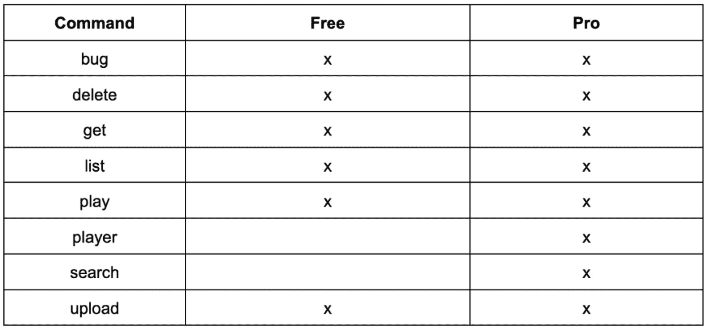
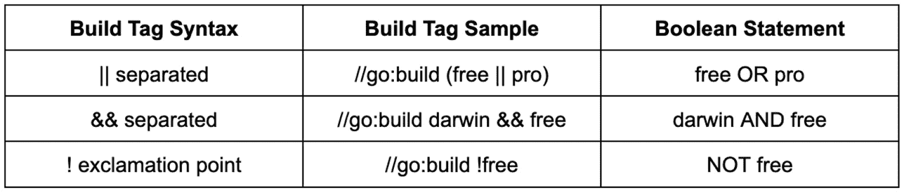

# 11

# 自定义构建和测试 CLI 命令

对于任何 Golang 应用程序，您都需要构建和测试。然而，随着项目和用户基础的扩大，这变得越来越重要。使用布尔逻辑的构建标签使您能够创建有针对性的构建和测试，并随着每个新功能的推出进一步稳定您的项目。

在对构建标签及其使用方法有更深入的理解之后，我们将使用一个真实世界的示例，即音频文件 CLI，来集成（免费和专业）级别并启用分析功能。

构建标签不仅在构建时用作输入，在测试时也用作输入。我们将在本章的后半部分专注于测试。我们将具体学习如何模拟 CLI 使用的 HTTP 客户端，在本地配置测试，为单个命令编写测试，并运行它们。在本章中，我们将详细介绍以下主题：

+   构建标签是什么？您如何使用它们？

+   使用标签进行构建

+   测试 CLI 命令

# 技术要求

+   为了理解并运行本章中分享的示例，您需要一个 Unix 操作系统。

+   您还可以在 GitHub 上找到代码示例：[`github.com/PacktPublishing/Building-Modern-CLI-Applications-in-Go/tree/main/Chapter11/audiofile`](https://github.com/PacktPublishing/Building-Modern-CLI-Applications-in-Go/tree/main/Chapter11/audiofile)

# 构建标签是什么？您如何使用它们？

**构建标签**是代码文件在构建过程中应包含的指示符。在 Go 中，它们由任何源文件顶部或接近顶部的单行定义，而不仅仅是 Go 文件。它们必须位于包声明之前，并后跟一个空白行。它们具有以下语法：

```go
//go:build [tag]
```

这一行只能在文件中定义一次。如果有多个定义，将会生成错误。然而，当使用多个标签时，它们会通过布尔逻辑进行交互。在*第七章*“为不同平台开发”中，我们简要介绍了标签及其逻辑。处理不同平台开发的另一种方法是使用一系列的`if-else`语句来检查运行时的操作系统。另一种方法是将在文件名中包含操作系统。例如，如果文件名以`_windows.go`结尾，我们指示编译器在构建`windows`时仅包含此文件。

标签可以帮助在编译不同操作系统时分离代码，使用`$GOOS`和`$GOARCH`。操作系统和架构的有效组合可以在以下位置找到：[`go.dev/doc/install/source#environment`](https://go.dev/doc/install/source#environment)。

除了针对平台外，构建标签还可以定制以分离功能代码或集成测试。通常，集成标签会收到一个特定的标签，因为它们通常需要更长的时间来运行。将单元测试与集成测试分离，在测试您的应用程序时增加了控制级别。

这些构建约束组合使用时，可以强大地编译您代码的不同版本。如前所述，它们使用布尔逻辑一起评估。表达式包含使用 `||`、`&&` 和 `!` 运算符以及括号组合的构建标签。要了解更多关于构建约束的信息，请在您的终端中运行以下命令：

```go
go help buildconstraint
```

例如，以下构建标签将文件约束为在满足 `linux` 或 `openbsd` 标签、满足 `amd64` 且 `cgo` 不满足时构建：

```go
//go:build (linux  || openbsd) && amd64 && !cgo
```

在您的终端中运行 `go env` 命令，以查看在构建应用程序时哪些标签会自动满足。您将看到目标操作系统（`$GOOS`）、架构（`$GOARCH`）以及如果操作系统是 Unix 或 Unix-like，则会显示 `unix`。`cgo` 字段由 `CGO_ENABLED` 环境变量、每个 Go 主要版本的术语以及通过 `–tags` 标志提供的任何附加标签决定。

如前所述，您可以根据代码文件顶部的标签创建自己的专业版和免费版，例如 `//go:build pro` 或 `//go:build free`。集成测试文件可以标记为 `//go:build int`。无论您如何想要自定义构建，都可以利用标签和布尔逻辑来实现。现在，在下一节中，让我们在我们的代码中使用标签来完成这项工作。

# 如何利用构建标签

如前所述，我们可以使用构建标签根据操作系统和架构来分离构建。在音频文件存储库中，我们已经在以下文件中这样做，这些文件与 `play` 和 `bug` 命令相关联。对于 `bug` 命令，我们有以下文件：

+   `bug_darwin.go //` 仅在 Darwin 系统上构建

+   `bug_linux.go //` 仅在 Linux 系统上构建

+   `bug_windows.go //` 仅在 Windows 平台上构建

这些文件中的每一个都包含一个针对目标平台专门编写的函数。文件后缀具有与构建标签类似的功能。您可以选择与确切平台和架构匹配的文件后缀。然而，当您想要针对多个平台和架构时，更倾向于使用构建标签。在文件内部，是匹配的构建标签，例如，在 `bug_darwin.go` 文件中，文件顶部如下所示：

```go
//go:build darwin
```

由于我们已经在整个存储库中设置了这些构建标签，以针对需要的目标平台，让我们探索一些其他利用构建标签的方法。

## 创建专业版、免费版和开发版

假设命令行界面利用构建标签来创建对应用程序功能的不同访问级别。这可能适用于管理员或基本级别用户，或者根据权限级别进行限制，但如果是针对外部客户的 CLI，则可能是您应用程序的专业版和免费版。

首先，重要的是决定每个版本将有哪些命令可用。让我们以音频文件应用程序为例来尝试一下：



表 11.1 – 包含在免费或专业级别的命令列表

让我们也包括一个开发版本；这仅仅允许 API 在本地运行。在实际场景中，应用程序将被配置为调用公共 API，并且存储可以在数据库中完成。这为我们提供了另一个创建构建标签的理由。

现在，让我们使用构建标签来区分免费、专业和开发版本。开发版本构建标签放置在`cmd/api.go`文件的顶部，使得只有指定了`dev`标签时 API 命令才可用：

```go
//go:build dev
```

然后，区分专业版本的标签如下：

```go
//go:build !free && pro
```

如前所述，有几个文件已经具有构建标签以针对平台。此构建标签意味着该文件将在免费、专业和开发版本中可用：

```go
//go:build darwin
```

前面的构建标签利用布尔逻辑声明，当定义了`darwin`和`free`标签时，该文件应包含在构建过程中。

让我们用布尔逻辑语法示例来分解这里的标签：




表 11.2 – 布尔逻辑示例

构建标签内包含的布尔逻辑将允许开发者为任何平台和版本的组合进行构建。

## 添加构建标签以启用 pprof

利用构建标签的另一种方法是启用 API 服务的分析。`pprof`是一个用于可视化和分析分析数据的工具。该工具读取`proto`或协议缓冲区格式的样本集合，然后创建有助于可视化和分析数据的报告。此工具可以生成文本和图形报告。

注意

要了解更多关于如何使用此工具的信息，请访问[`pkg.go.dev/net/http/pprof`](https://pkg.go.dev/net/http/pprof)。

对于这个案例，我们将定义一个名为`pprof`的构建标签，以适当地匹配其使用。在`services/metadata/metadata.go`文件中，我们定义了用于从通过命令行界面上传的音频文件中提取信息的元数据服务。`CreateMetadataService`函数创建元数据服务并定义所有与匹配处理程序匹配的端点。为了启用分析，我们将添加以下新的代码块：

```go
if profile {
    mux.HandleFunc("/debug/pprof/", pprof.Index)
    mux.HandleFunc("/debug/pprof/{action}", pprof.Index)
    mux.HandleFunc("/debug/pprof/symbol", pprof.Symbol)
}
```

在文件顶部，输入之后，我们将定义它所依赖的变量：

```go
var (
    profile = false
)
```

然而，我们需要某种方法来将`profile`变量设置为`true`。为此，我们创建了一个新文件：`services/metadata/pprof.go`。此文件包含以下内容：

```go
//go:build profile && (free || pro)
package metadata
func init() {
    profile = true
}
```

如您所见，无论构建`free`、`pro`还是`dev`版本，如果将`profile`构建标签作为标签输入添加，则`init`函数将被调用以将`profile`变量设置为`true`。现在，我们有了另一种使用构建标签的方法——设置作为功能标志的布尔变量。现在我们已经更改了必要的文件以包含构建标签，让我们将这些作为构建命令的输入。

# 带标签的构建

到目前为止，我们已经使用`Makefile`构建了我们的应用程序，其中包含以下特定于构建 Darwin 应用程序的命令：

```go
build-darwin:
    go build -tags darwin -o bin/audiofile main.go
    chmod +x bin/audiofile
```

对于 Darwin 构建，我们还可以构建一个免费版和专业版以及配置文件版以启用`pprof`。

## 构建免费版

要为 Darwin 操作系统构建一个`free`版本，我们需要修改前面的`make`命令并创建一个新的命令：

```go
build-darwin-free:
    go build -tags "darwin free" -o bin/audiofile main.go
    chmod +x bin/audiofile
```

在`build-darwin-free`命令中，我们传递了两个构建标签：`darwin`和`free`。这将包括如`bug_darwin.go`和`play_darwin.go`等文件，这些文件在 Go 文件顶部包含以下行：

```go
//go:build darwin
```

类似地，当构建`pro`版本时，文件也会被包含在构建中。

## 构建专业版

要为 Darwin 操作系统构建一个`pro`版本，我们需要添加一个新的`build`命令：

```go
build-darwin-pro:
    go build -tags "darwin pro" -o bin/audiofile main.go
    chmod +x bin/audiofile
```

在`build-darwin-pro`命令中，我们传递了两个构建标签：`darwin`和`pro`。

## 在专业版上启用 pprof 的构建

要构建一个启用了`pprof`的`pro`版本，我们需要添加以下`build`命令：

```go
build-darwin-pro-profile:
    go build -tags "darwin pro profile" -o bin/audiofile main.go
    chmod +x bin/audiofile
```

在`build-darwin-pro-profile`命令中，我们传递了三个构建标签：`darwin`、`pro`和`profile`。这将包括`services/metadata/pprof.go`文件，该文件包含文件顶部的以下行：

```go
//go:build profile
```

类似地，当为免费版构建时，文件也会被包含在构建中。

到目前为止，我们已经了解了构建标签是什么，如何在代码中使用构建标签的不同方式，以及最后如何使用构建标签构建针对特定用途的应用程序。具体来说，虽然构建标签可以用来定义不同级别的功能（免费版与专业版），但你也可以使用构建标签启用性能分析或其他调试工具。现在我们已经了解了如何为不同的目标构建我们的命令行应用程序，接下来让我们学习如何测试我们的 CLI 命令。

# 测试 CLI 命令

在构建你的命令行应用程序时，围绕它构建测试也很重要，这样你可以确保应用程序按预期工作。通常需要做一些事情，包括以下内容：

1.  模拟 HTTP 客户端

1.  处理测试配置

1.  为每个命令创建测试

我们将回顾音频文件仓库中*第十一章*中存在的每个步骤的代码。

## 模拟 HTTP 客户端

要模拟 HTTP 客户端，我们需要创建一个接口来模拟客户端的`Do`方法，以及一个返回此接口的函数，这个接口既满足真实客户端也满足模拟客户端。

在`cmd/client.go`文件中，我们编写了一些代码来处理所有这些：

```go
type AudiofileClient interface {
    Do(req *http.Request) (*http.Response, error)
}
var (
    getClient = GetHTTPClient()
)
func GetHTTPClient() AudiofileClient {
    return &http.Client{
        Timeout: 15 * time.Second,
    }
}
```

我们现在可以轻松地通过将`getClient`变量替换为一个返回模拟客户端的函数来创建一个模拟客户端。如果你查看每个命令的代码，它会使用`getClient`变量。例如，`upload.go`文件使用以下行调用`Do`方法：

```go
resp, err := getClient.Do(req)
```

当应用程序运行时，这返回具有 15 秒超时的实际 HTTP 客户端。然而，在每次测试中，我们将 `getClient` 变量设置为模拟的 HTTP 客户端。

被模拟的 HTTP 客户端设置在 `cmd/client_test.go` 文件中。首先，我们定义类型：

```go
type ClientMock struct {
}
```

然后，为了满足之前定义的 `AudiofileClient` 接口，我们实现了 `Do` 方法：

```go
func (c *ClientMock) Do(req *http.Request) (*http.Response, error) {
```

一些请求，包括 `list`、`get` 和 `search` 端点，将返回存储在 `cmd/testfiles` 文件夹下 JSON 文件中的数据。我们读取这些文件并将它们存储在相应的字节切片中：`listBytes`、`getBytes` 和 `searchBytes`：

```go
listBytes, err := os.ReadFile("./testfiles/list.json")
if err != nil {
    return nil, fmt.Errorf("unable to read testfile/list.json")
}
getBytes, err := os.ReadFile("./testfiles/get.json")
if err != nil {
    return nil, fmt.Errorf("unable to read testfile/get.json")
}
searchBytes, err := os.ReadFile("./testfiles/search.json")
if err != nil {
    return nil, fmt.Errorf("unable to read testfile/search.json")
}
```

从这些文件中读取的数据用于响应中。由于 `Do` 方法接收请求，我们可以为每个请求端点创建一个 switch case，然后单独处理响应。你可以创建更详细的 case 来处理错误，但在这个例子中，我们只返回成功的 case。对于第一个 case，即 `/request` 端点，我们返回 `200 OK`，但响应体中也包含从 `getBytes` 获取的字符串值。你可以在 `./testfiles/get.json` 文件中看到实际数据：

```go
    switch req.URL.Path {
         case "/request":
             return &http.Response{
                 Status:  "OK",
                 StatusCode: http.StatusOK,
                 Body: ioutil.NopCloser(bytes.NewBufferString(string(getBytes))),
      ContentLength: int64(len(getBytes)),
      Request: req,
      Header: make(http.Header, 0),
  }, nil
```

对于 `/upload` 端点，我们返回 `200 OK`，但响应体中也包含 `"123"` 字符串值：

```go
         case "/upload":
             return &http.Response{
                 Status:  "OK",
                 StatusCode: http.StatusOK,
      Body: ioutil.NopCloser(bytes.NewBufferString("123")),
      ContentLength: int64(len("123")),
      Request: req,
      Header: make(http.Header, 0),
   }, nil
```

对于 `/list` 端点，我们返回 `200 OK`，但响应体中也包含从 `listBytes` 获取的字符串值。你可以在 `./testfiles/list.json` 文件中看到实际数据：

```go
        case "/list":
            return &http.Response{
                Status:  "OK",
                StatusCode: http.StatusOK,
                Body: ioutil.NopCloser(bytes.
                      NewBufferString(string(listBytes))),
                      ContentLength: int64(len(listBytes)),
                      Request: req,
                      Header: make(http.Header, 0),
 }, nil
```

对于 `/delete` 端点，我们返回 `200 OK`，但响应体中也包含 `"成功删除音频，id: 456"`：

```go
        case "/delete":
            return &http.Response{
                Status:  "OK",
                StatusCode: http.StatusOK,
                Body: ioutil.NopCloser(bytes.
                      NewBufferString("successfully deleted 
                        audio with id: 456")),
                      ContentLength: int64(len("successfully 
                                     deleted audio with id: 
                                     456")),
                      Request: req,
                      Header: make(http.Header, 0),
}, nil
```

对于 `/search` 端点，我们返回 `200 OK`，但响应体中也包含从 `searchBytes` 获取的字符串值。你可以在 `./testfiles/search.json` 文件中看到实际数据：

```go
        case "/search":
            return &http.Response{
                Status:  "OK",
                StatusCode: http.StatusOK,
                Body: ioutil.NopCloser(bytes.
                NewBufferString(string(searchBytes))),
                ContentLength: int64(len(list searchBytes 
                Bytes)),
                Request: req,
                Header: make(http.Header, 0),
}, nil
}
return &http.Response{}, nil
}
```

最后，如果请求路径与 `switch` 语句中的任何端点都不匹配，则返回空响应。

## 处理测试配置

我们在 `cmd/root_test.go` 文件中处理测试配置：

```go
var Logger *zap.Logger
var Verbose *zap.Logger
func ConfigureTest() {
    getClient = &ClientMock{}
    viper.SetDefault("cli.hostname", "testHostname")
    viper.SetDefault("cli.port", 8000)
    utils.InitCLILogger()
}
```

在 `ConfigureTest` 函数中，我们将 `getClient` 变量设置为 `ClientMock` 类型的指针。因为当调用命令时检查 `viper` 配置值，所以我们为 CLI 的主机名和端口设置了随机测试值作为默认值。最后，在这个文件中，常规日志记录器 `Logger` 和详细日志记录器 `Verbose` 都被定义，然后通过 `utils.InitCLILogger()` 方法调用进行初始化。

## 为命令创建测试

现在我们已经设置了模拟客户端、配置和日志记录器，让我们为命令创建一个测试。在我深入到每个测试的代码之前，重要的是要提到每个测试开始时重复使用的代码行：

```go
ConfigureTest()
```

前一节讨论了这个函数的细节，但它为每个状态准备了一个模拟客户端、默认配置值和初始化的日志记录器。在我们的示例中，我们使用了`testing`包，它为 Go 中的自动化测试提供支持。它被设计为与`go test`命令一起使用，该命令执行代码中定义的任何函数，格式如下：

```go
func TestXxx(*testing.T)
```

`Xxx`可以用任何其他东西替换，但第一个字符需要是大写。这个名字本身用来识别正在执行的测试类型。我不会逐一介绍每个测试，只举三个作为例子。要查看所有测试，请访问本章的音频文件仓库。

### 测试 bug 命令

测试`bug`命令的函数定义在这里。它接受一个参数，即指向`testing.T`类型的指针，并符合上一节中定义的函数格式。让我们分析一下代码：

```go
func TestBug(t *testing.T) {
    ConfigureTest()
    b := bytes.NewBufferString("")
    rootCmd.SetOut(b)
    rootCmd.SetArgs([]string{"bug", "unexpected"})
    err := rootCmd.Execute()
    if err != nil {
        fmt.Println("err: ", err)
    }
    actualBytes, err := ioutil.ReadAll(b)
    if err != nil {
        t.Fatal(err)
    }
    expectedBytes, err := os.ReadFile("./testfiles/bug.txt")
    if err != nil {
        t.Fatal(err)
    }
    if strings.TrimSpace(string(actualBytes)) != strings.
       TrimSpace(string(expectedBytes)) {
        t.Fatal(string(actualBytes), "!=", 
          string(expectedBytes))
    }
}
```

在这个函数中，我们首先定义输出缓冲区`b`，稍后我们可以从中读取以与预期输出进行比较。我们使用`SetArgs`方法设置参数并传递一个意外的参数。命令通过`rootCmd.Execute()`方法执行，实际结果从缓冲区中读取并保存到`actualBytes`变量中。预期的输出存储在`./testfiles/bug.txt`文件中，并读取到`expectedBytes`变量中。我们比较这些值以确保它们相等。由于我们传递了一个意外的参数，因此打印出命令用法。这个测试被设计为通过；然而，如果修剪后的字符串不相等，则测试失败。

### 测试获取命令

测试`get`命令的函数定义在这里。同样，函数定义符合`go test`命令可以识别的格式。记住模拟客户端和`get`命令调用`/request`端点。响应体包含在`./testfiles/get.json`文件中找到的值。让我们分析一下代码：

```go
func TestGet(t *testing.T) {
    ConfigureTest()
    b := bytes.NewBufferString("")
    rootCmd.SetOut(b)
```

我们传递以下参数来模拟`audiofile get –id 123 –``json`调用：

```go
    rootCmd.SetArgs([]string{"get", "--id", "123", "--json"})
```

我们使用前面的参数执行 root 命令：

```go
    err := rootCmd.Execute()
    if err != nil {
        fmt.Println("err: ", err)
    }
```

我们从`rootCmd`的执行中读取实际的数据输出并将其存储在`actualBytes`变量中：

```go
    actualBytes, err := ioutil.ReadAll(b)
    if err != nil {
        t.Fatal(err)
    }
```

我们从`./``testfiles/get.json`文件中读取预期的数据输出：

```go
    expectedBytes, err := os.ReadFile("./testfiles/get.json")
    if err != nil {
        t.Fatal(err)
    }
```

然后，将`actualBytes`和`expectedBytes`的数据反序列化到`models.Audio`结构体中，然后进行比较：

```go
    var audio1, audio2 models.Audio
    json.Unmarshal(actualBytes, &audio1)
    json.Unmarshal(expectedBytes, &audio2)
    if !(audio1.Id == audio2.Id &&
    audio1.Metadata.Tags.Album == audio2.Metadata.Tags.Album &&
    audio1.Metadata.Tags.AlbumArtist == audio2.Metadata.Tags.AlbumArtist &&
    audio1.Metadata.Tags.Artist == audio2.Metadata.Tags.Artist &&
    audio1.Metadata.Tags.Comment == audio2.Metadata.Tags.Comment &&
    audio1.Metadata.Tags.Composer == audio2.Metadata.Tags.Composer &&
    audio1.Metadata.Tags.Genre == audio2.Metadata.Tags.Genre &&
    audio1.Metadata.Tags.Lyrics == audio2.Metadata.Tags.Lyrics &&
    audio1.Metadata.Tags.Year == audio2.Metadata.Tags.Year) {
        t.Fatalf("expected %q got %q", string(expectedBytes), string(actualBytes))
    }
}
```

这个测试被设计为成功，但如果数据不符合预期，则测试失败。

### 测试上传命令

测试`upload`命令的函数定义在这里。同样，函数定义符合`go test`命令可以识别的格式。记住模拟客户端和`upload`命令调用`/upload`端点，带有包含`"123"`值的模拟响应体。让我们分析一下代码：

```go
func TestUpload(t *testing.T) {
    ConfigureTest()
    b := bytes.NewBufferString("")
    rootCmd.SetOut(b)
    rootCmd.SetArgs([]string{"upload", "--filename", "list.
                   go"})
    err := rootCmd.Execute()
    if err != nil {
        fmt.Println("err: ", err)
    }
    expected := "123"
    actualBytes, err := ioutil.ReadAll(b)
    if err != nil {
        t.Fatal(err)
    }
    actual := string(actualBytes)
    if !(actual == expected) {
        t.Fatalf("expected \"%s\" got \"%s\"", expected, 
                actual)
    }
}
```

`rootCmd`的参数被设置为模拟以下命令调用：

```go
audiofile upload –filename list.go
```

文件类型和数据没有经过验证，因为那是在 API 端进行的，这里进行了模拟。然而，由于我们知道响应体包含 `123` 值，我们将期望变量设置为 `123`。然后，包含命令执行输出的 `actual` 值随后与期望值进行比较。测试被设计为成功，但如果值不相等，则测试失败。

我们已经讨论了如何测试 CLI Cobra 命令的几个示例。现在，你可以通过模拟自己的 HTTP 客户端并为每个单独的命令创建测试来为你的 CLI 创建自己的测试。我们在这个章节中没有这样做，但了解构建标签也可以用来区分不同类型的测试是很有用的——例如，集成测试和单元测试。

## 运行测试

要测试你的命令，你可以运行 `go test` 并传递一些额外的标志：

+   `-v` 用于详细模式

+   `-tags` 用于指定你想要特别针对的任何文件

在我们的测试中，我们只想针对 `pro` 构建标签，因为这将涵盖所有命令。我们添加了两个额外的 `Makefile` 命令，一个用于以详细模式运行测试，另一个则不是：

```go
test:
  go test ./... -tags pro
test-verbose:
  go test –v ./... -tags pro
```

在从终端保存 `Makefile` 之后，你可以执行以下命令：

```go
make test
```

预期的输出如下：

```go
go test ./cmd -tags pro
ok      github.com/marianina8/audiofile/cmd
```

我们现在知道如何利用构建标签来运行测试。这应该是运行你自己的 CLI 测试所需的所有工具。

# 摘要

在这一章中，你学习了构建标签是什么以及如何用于不同的目的。构建标签可以用来生成不同级别的构建，分离我们的特定测试，或者添加调试功能。你还学习了如何生成带有你添加到文件顶部的构建标签的构建，以及如何利用标签的布尔逻辑来快速确定文件是否会被包含。

你还学习了如何使用 Golang 的默认 `testing` 包来测试你的 Cobra CLI 命令。一些必要的工具也被包括在内，比如学习如何模拟 HTTP 客户端。结合构建标签，你现在不仅可以使用标签构建目标应用程序，还可以使用相同的标签运行测试以针对特定的测试。在下一章，*第十二章*，*跨平台交叉编译*，我们将学习如何使用这些标签并为不同的主要操作系统编译：`darwin`、`linux` 和 `windows`。

# 问题

1.  构建标签在 Golang 文件中的位置在哪里，语法是什么？

1.  用于 `go build` 和 `go test` 的哪个标志用于传递构建标签？

1.  你可以在集成测试的 Golang 文件上放置哪个构建标签，以及如何使用该标签运行 `go test`？

# 答案

1.  它位于文件顶部，在包声明之前，后面跟着一个单独的空行。语法是：`//``go:build [tag]`。

1.  `–tags` 标志用于传递 `go build` 和 `go test` 方法中的构建标签。

1.  你可以在任何集成测试文件顶部添加`//go:build int`构建标签，然后修改测试文件以运行此命令：`go test ./cmd -tags "pro int"`。

# 进一步阅读

+   在[`pkg.go.dev/go/build`](https://pkg.go.dev/go/build)了解更多关于`build`包的信息，在[`pkg.go.dev/testing`](https://pkg.go.dev/testing)了解更多关于`testing`包的信息。
