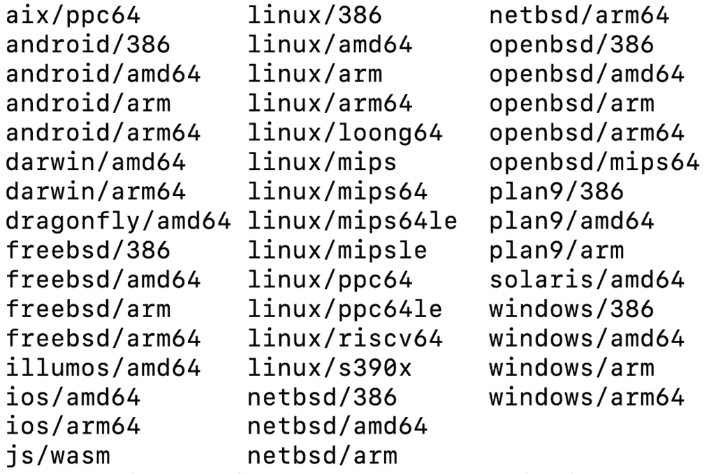
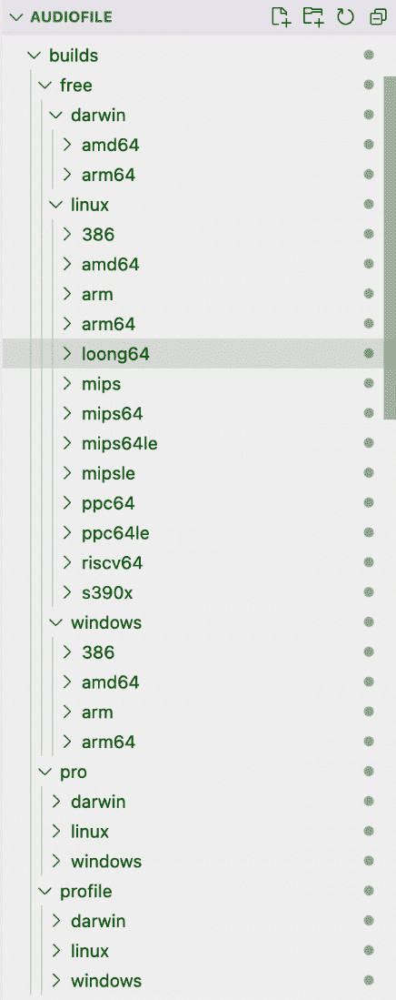

# 12

# 跨不同平台的交叉编译

本章向用户介绍了 Go 在不同平台之间的交叉编译，这是 Go 的一个强大功能。尽管存在构建自动化工具，但了解如何进行交叉编译在必要时进行调试和定制时提供了基本知识。本章将解释 Go 可以编译的不同操作系统和架构，以及如何确定需要哪些。在您的环境中安装 Go 之后，有一个命令 `go env`，您可以通过它查看所有与 Go 相关的环境变量。我们将讨论用于构建的两个主要变量：`GOOS` 和 `GOARCH`。

我们将给出如何为每个主要操作系统（Linux、macOS 和 Windows）构建或安装应用程序的示例。您将学习如何根据您的环境和每个主要操作系统的可用架构确定 Go 的操作系统和架构设置。

本章以一个示例脚本结束，用于自动化跨不同操作系统和架构的交叉编译。提供了一个在 Darwin、Linux 或 Windows 环境上运行的脚本。在本章中，我们将详细介绍以下主题：

+   手动编译与构建自动化工具

+   使用 `GOOS` 和 `GOARCH`

+   为 Linux、macOS 和 Windows 编译

+   编写脚本以编译多个平台

# 技术要求

+   您还可以在 GitHub 上找到代码示例：[`github.com/PacktPublishing/Building-Modern-CLI-Applications-in-Go/tree/main/Chapter12/audiofile`](https://github.com/PacktPublishing/Building-Modern-CLI-Applications-in-Go/tree/main/Chapter12/audiofile)

# 手动编译与构建自动化工具

在*第十四章* *使用 GoReleaser 将您的 Go 二进制文件作为 Homebrew 公式发布* 中，我们将深入了解一个出色的开源工具 **GoReleaser**，它可以自动化构建和发布 Go 二进制文件的过程。尽管它功能强大且有用，但了解如何手动编译您的 Go 代码至关重要。您会看到，并非所有项目都可以使用 GoReleaser 进行构建和发布。例如，如果您的应用程序需要独特的构建标志或依赖项，手动编译可能是必要的。此外，了解如何手动编译您的代码对于在构建过程中可能出现的任何问题至关重要。本质上，像 GoReleaser 这样的工具可以使过程更加顺畅，但掌握手动编译过程对于确保您的 **命令行界面 (CLI) 应用程序可以在各种场景下构建和发布**至关重要。

# 使用 GOOS 和 GOARCH

在开发你的命令行应用程序时，通过尽可能地为多个平台开发来最大化受众是很重要的。然而，你也可能只想针对特定的操作系统和架构。在过去，将应用程序部署到与开发平台不同的平台上要困难得多。实际上，在 macOS 平台上开发并在 Windows 机器上部署涉及到设置一个 Windows 构建机器来构建二进制文件。工具需要同步，还有其他需要考虑的因素，使得协作测试和分发变得繁琐。

幸运的是，Golang 通过直接将支持多个平台的功能构建到语言的工具链中解决了这个问题。如在第 *7 章* 和 *第十一章* 中讨论的，*为不同的平台开发* 和 *自定义构建和测试 CLI 命令*，我们学习了如何编写平台无关的代码，并使用 `go build` 命令和构建标签来针对特定的操作系统和架构。你也可以使用环境变量来针对操作系统和架构。

首先，了解哪些操作系统和架构可用于分发是很好的。为了找出这些信息，在你的终端中运行以下命令：

```go
go tool dist list
```

列表以以下格式输出：`GOOS`/`GOARCH`。`GOOS` 是一个本地环境变量，用于定义要编译的操作系统，代表 `GOARCH`，发音为“戈-arch”，是一个本地环境变量，用于定义要编译的架构，代表**Go 架构**。



图 12.1 – 支持的操作系统和架构列表

你也可以使用 `–json` 标志调用前面的命令来查看更多详细信息。例如，对于 `linux/arm64`，你可以从 `"CgoSupported"` 字段中看到它由 `Cgo` 支持，但也可以看到它是一个一级的 `GOOS/GOARCH` 对，由 `"FirstClass"` 字段指示：

```go
{
"GOOS": "linux",
"GOARCH": "arm64",
"CgoSupported": true,
"FirstClass": true
},
```

一级端口具有以下属性：

+   发布被损坏的构建所阻塞

+   提供官方的二进制文件

+   安装有文档说明

接下来，通过在你的终端中运行以下命令来确定你的本地操作系统和架构设置：

```go
go env GOOS GOARCH
```

目前，在我的 macOS 机器上运行此命令，具有 AMD64 架构，得到以下输出：

```go
darwin
amd64
```

第一个环境变量 `GOOS` 被设置为 `darwin`，第二个环境变量 `GOARCH` 被设置为 `amd64`。我们现在知道了在 Go 环境中 `GOOS` 和 `GOARCH` 是什么，可能的值，以及你的机器上设置了哪些值。让我们学习如何使用这些环境变量。

你可以使用这两个环境变量进行编译。让我们生成一个构建来针对 `darwin/amd64` 端口。你可以通过设置 `GOOS` 或 `GOARCH` 环境变量，然后运行 `go build` 命令，或者更具体地说，与 `build` 命令一起运行：

```go
GOOS=darwin GOARCH=amd64 go build
```

让我们用音频文件 CLI 来尝试这个命令，并学习如何为三个主要操作系统：Linux、macOS 和 Windows 编译。

# 编译 Linux、macOS 和 Windows

有几种不同的方式来编译我们的命令行应用程序以适应不同的操作系统，我们将逐一介绍这些示例。首先，你可以通过构建或安装你的应用程序来编译：

+   `–o`（输出）标志

+   `$GOPATH/bin` 文件夹或 `$GOBIN` 如果已设置，将缓存所有非主包，这些包被导入到 `$GOPATH/pkg` 文件夹

## 使用标签构建

在我们之前的章节 *第十一章*，*自定义构建和测试 CLI 命令*，我们学习了如何专门为 macOS 或 Darwin 操作系统构建。为了更好地理解如何使用 `build` 命令，我们运行 `go build –help` 来查看用法：

```go
mmontagnino@Marians-MacBook-Pro audiofile % go build -help
usage: go build [-o output] [build flags] [packages]
Run 'go help build' for details
```

运行 `go help build` 将会显示可用的构建标志。然而，在这些示例中，我们只使用了 `tags` 标志。在 `Makefile` 中，我们已经有以下命令：

```go
build-darwin-free:
    go build -tags "darwin free" -o bin/audiofile main.go
    chmod +x bin/audiofile
build-darwin-pro:
    go build -tags "darwin pro" -o bin/audiofile main.go
    chmod +x bin/audiofile
build-darwin-pro-profile:
    go build -tags "darwin pro profile" -o bin/audiofile main.go
    chmod +x bin/audiofile
```

在这些命令中，我们编译应用程序并将其输出到 `bin/audiofile` 文件名。为了指定 Darwin 操作系统，我们传递 Darwin 构建标签来指定与 Darwin 操作系统相关的文件。我们需要修改输出文件到一个指定 Darwin 的文件夹，但也要为其他具体细节，比如免费版与专业版，因为我们将为其他操作系统和级别构建。让我们修改这些。

### 使用标签构建 Darwin 操作系统应用程序

编译 Darwin 操作系统应用程序的新 `Makefile` 命令现在如下所示：

```go
build-darwin-free:
    go build -tags "darwin free" -o builds/free/darwin/audiofile main.go
    chmod +x builds/free/darwin/audiofile
build-darwin-pro:
    go build -tags "darwin pro" -o builds/pro/darwin/audiofile main.go
    chmod +x builds/pro/darwin/audiofile
build-darwin-pro-profile:
    go build -tags "darwin pro profile" -o builds/profile/darwin/audiofile main.go
    chmod +x builds/profile/darwin/audiofile
```

我们已经将 `bin/audiofile` 输出替换为更具体的内容。Darwin 的免费版现在输出到 `builds/free/darwin/audiofile`，专业版输出到 `builds/pro/darwin/audiofile`，配置文件版输出到 `builds/profile/darwin/audiofile`。让我们继续下一个操作系统，Linux。

我们可以为 Linux 和 Windows 做同样的事情，如下所示：

```go
build-linux-free:
    go build -tags "linux free" -o builds/free/linux/audiofile main.go
    chmod +x builds/free/linux/audiofile
build-linux-pro:
   go build -tags "linux pro" -o builds/pro/linux/audiofile main.go
   chmod +x builds/pro/linux/audiofile
build-linux-pro-profile:
   go build -tags "linux pro profile" -o builds/profile/linux/audiofile main.go
   chmod +x builds/profile/linux/audiofile
build-windows-free:
    go build -tags "windows free" -o builds/free/windows/ audiofile.exe main.go
build-windows-pro:
    go build -tags "windows pro" -o builds/pro/windows/audiofile.exe main.go
build-windows-pro-profile:
    go build -tags "windows pro profile" -o builds/profile/windows/audiofile.exe main.go
```

免费版的 Windows 版本输出到 `builds/free/windows/audiofile.exe`，专业版的 Windows 版本输出到 `builds/pro/windows/audiofile.exe`，而 Windows 配置文件版本输出到 `builds/profile/windows/audiofile.exe`。现在，假设我们不想逐个运行这些命令，因为有很多命令需要运行！我们可以编写一个命令来使用标签构建所有版本。

### 使用标签构建适用于所有操作系统的应用程序

让我们添加一个新的 `Makefile` 命令来构建所有操作系统。基本上，我们写一个命令来调用所有其他命令：

```go
build-all: build-darwin-free build-darwin-pro build-darwin-pro-profile build-linux-free build-linux-pro build-linux-pro-profile build-windows-free build-windows-pro build-windows-pro-profile
```

让我们尝试通过终端运行这个命令：

```go
make build-all
```

如果您正在运行 Darwin，您将看到以下输出：

```go
mmontagnino@Marians-MacBook-Pro audiofile % make build-all
go build -tags "darwin free" -o builds/free/darwin/audiofile main.go
chmod +x builds/free/darwin/audiofile
go build -tags "darwin pro" -o builds/pro/darwin/audiofile main.go
chmod +x builds/pro/darwin/audiofile
go build -tags "darwin pro profile" -o builds/profile/darwin/audiofile main.go
chmod +x builds/profile/darwin/audiofile
go build -tags "linux free" -o builds/free/linux/audiofile main.go
# internal/goos
/usr/local/go/src/internal/goos/zgoos_linux.go:7:7: GOOS redeclared in this block
        /usr/local/go/src/internal/goos/zgoos_darwin.go:7:7: other declaration of GOOS
/usr/local/go/src/internal/goos/zgoos_linux.go:9:7: IsAix redeclared in this block
        /usr/local/go/src/internal/goos/zgoos_darwin.go:9:7: other declaration of IsAix
/usr/local/go/src/internal/goos/zgoos_linux.go:10:7: IsAndroid redeclared in this block
...
/usr/local/go/src/internal/goos/zgoos_linux.go:17:7: too many errors
make: *** [build-linux-free] Error 2
```

我已经删除了部分错误信息；然而，最重要的信息是 `GOOS redeclared in this block`。当操作系统被设置但与 `GOOS` 环境变量冲突时，会出现此错误信息。例如，失败的命令使用了操作构建标签来指定 Linux 构建：

```go
go build -tags "linux free" -o builds/free/linux/audiofile main.go
```

然而，在我的 macOS 终端中运行 `go env | grep GOOS` 显示了 `GOOS` 环境变量的值：

```go
GOOS="darwin"
```

让我们修改构建命令，以设置 `GOOS` 环境变量，使其与基于构建标签的输出类型相匹配。

## 使用 GOOS 环境变量进行构建

Linux 构建已被修改，通过在 `build` 命令之前添加 `GOOS=linux` 来设置 `GOOS` 环境变量：

```go
build-linux-free:
    GOOS=linux go build -tags "linux free" -o builds/free/linux/audiofile main.go
    chmod +x builds/free/linux/audiofile
build-linux-pro:
    GOOS=linux go build -tags "linux pro" -o builds/pro/linux/audiofile main.go
    chmod +x builds/pro/linux/audiofile
build-linux-pro-profile:
    GOOS=linux go build -tags "linux pro profile" -o builds/profile/linux/audiofile main.go
    chmod +x builds/profile/linux/audiofile
```

Windows 构建已被修改，通过在 `build` 命令之前添加 `GOOS=windows` 来设置 `GOOS` 环境变量：

```go
build-windows-free:
    GOOS=windows go build -tags "windows free" -o builds/free/windows/audiofile.exe main.go
build-windows-pro:
    GOOS=windows go build -tags "windows pro" -o builds/pro/windows/audiofile.exe main.go
build-windows-pro-profile:
    GOOS=windows go build -tags "windows pro profile" -o builds/profile/windows/audiofile.exe main.go
```

现在，让我们再次尝试 `build-all` 命令。它运行成功，并且我们可以通过在 repo 中运行 `find –type –f ./builds` 来查看 `build` 命令生成的所有文件：

```go
mmontagnino@Marians-MacBook-Pro audiofile % find ./builds -type f
./builds/pro/linux/audiofile
./builds/pro/darwin/audiofile
./builds/pro/windows/audiofile.exe
./builds/free/linux/audiofile
./builds/free/darwin/audiofile
./builds/free/windows/audiofile.exe
./builds/profile/linux/audiofile
./builds/profile/darwin/audiofile
./builds/profile/windows/audiofile.exe
```

## 使用 GOARCH 环境变量进行构建

单个操作系统可以关联许多不同的架构值。我们不会为每个架构创建一个命令，而是从仅一个示例开始：

```go
build-darwin-amd64-free:
    GOOS=darwin GOARCH=amd64 go build -tags "darwin free" -o builds/free/darwin/audiofile main.go
    chmod +x builds/free/darwin/audiofile
```

此示例指定了操作系统，`GOOS` 环境变量为 `darwin`，然后是架构，`GOARCH` 环境变量为 `amd64`。

如果为每个主要操作系统的每个架构创建一个 `build` 命令，将会产生太多的命令。我们将把这个留到本章最后部分的脚本中。

## 使用标签和 GOOS 环境变量进行安装

+   如前所述，另一种编译您的命令行应用程序的方法是通过安装它。`install` 命令编译应用程序，就像 `go build` 命令一样，但还额外包含将编译后的应用程序移动到 `$GOPATH/bin` 文件夹或 `$GOBIN` 值的步骤。要了解更多关于 `install` 命令的信息，我们运行以下 `go install –help` 命令：

```go
mmontagnino@Marians-MacBook-Pro audiofile % go install -help
usage: go install [build flags] [packages]
Run 'go help install' for details
```

+   构建时使用的标志对于安装也是可用的。再次强调，我们只会使用 `tags` 标志。让我们首先在 macOS 系统上运行 `install` 命令：

```go
go install -tags "darwin pro" github.com/marianina8/audiofile
```

然而，在我的 macOS 终端中运行 `go env | grep GOPATH` 显示了 `GOOS` 环境变量的值：

```go
mmontagnino@Marians-MacBook-Pro audiofile % go env | grep GOPATH
GOPATH="/Users/mmontagnino/Code"
```

确认音频文件 CLI 可执行文件存在于 `$GOPATH/bin` 或 `/Users/mmontagnino/Code/bin` 文件夹中。

如前所述，我们可以使用构建标签根据操作系统和架构来分离构建。在音频文件仓库中，我们已经在以下文件中这样做，这些文件与 `play` 和 `bug` 命令相关联。对于 `bug` 命令，我们有以下文件。现在，既然我们已经了解了如何使用构建标签和 `GOOS` 环境变量，让我们在 `Makefile` 中添加一些 `install` 命令。

### Darwin 操作系统的 install 命令

Darwin 操作系统的 `install` 命令包括传递特定的标记，包括 `darwin`，以及由标记定义的级别，以安装：

```go
install-darwin-free:
    go install -tags "darwin free" github.com/marianina8/audiofile
install-darwin-pro:
    go install -tags "darwin pro" github.com/marianina8/audiofile
install-darwin-pro-profile:
    go install -tags "darwin pro profile" github.com/marianina8/audiofile
```

### Linux 操作系统的安装命令

Linux 操作系统的 `install` 命令包括传递特定的标记，包括 `linux`，以及要安装的软件包。为了确保命令不会因为冲突的 `GOOS` 设置而出错，我们将匹配的环境变量 `GOOS` 设置为 `linux`：

```go
install-linux-free:
    GOOS=linux go install -tags "linux free" github.com/marianina8/audiofile
install-linux-pro:
    GOOS=linux go install -tags "linux pro" github.com/marianina8/audiofile
install-linux-pro-profile:
    GOOS=linux go install -tags "linux pro profile" github.com/marianina8/audiofile
```

### Windows 操作系统的安装命令

Windows 操作系统的 `install` 命令包括传递特定的标记，包括 `windows`，以及要安装的软件包。为了确保命令不会因为冲突的 `GOOS` 设置而出错，我们将匹配的环境变量 `GOOS` 设置为 `windows`：

```go
install-windows-free:
    GOOS=windows go install -tags "windows free" github.com/marianina8/audiofile
install-windows-pro:
    GOOS=windows go install -tags "windows pro" github.com/marianina8/audiofile
install-windows-pro-profile:
    GOOS=windows go install -tags "windows pro profile" github.com/marianina8/audiofile
```

请记住，对于您的 `Makefile`，如果您在自己的账户下分叉了仓库，您需要更改软件包的位置。运行您需要的操作系统的 `make` 命令，并通过检查 `$GOPATH/bin` 或 `$GOBIN` 文件夹来确认应用程序已安装。

## 使用标记和 GOARCH 环境变量进行安装

尽管许多不同的架构值可以与单个操作系统相关联，但让我们从一个使用 `GOARCH` 环境变量的安装示例开始：

```go
install-linux-amd64-free:
    GOOS=linux GOARCH=amd64 go install -tags "linux free" github.com/marianina8/audiofile
```

此示例指定了操作系统，`GOOS` 环境变量为 `linux`，然后是架构，`GOARCH` 环境变量为 `amd64`。我们不会为每一对操作系统和架构创建命令，再次，我们将此保存为本章最后部分的脚本中。

# 编译多个平台的脚本

我们已经学习了使用 `GOOS` 和 `GOARCH` 环境变量以及使用构建标记编译操作系统的几种不同方法。`Makefile` 可能会很快填满所有不同的 `GOOS`/`GOARCH` 对组合，如果您想要为更多特定的架构生成构建，脚本可能提供更好的解决方案。

## 创建用于在 Darwin 或 Linux 中编译的 bash 脚本

让我们先创建一个 bash 脚本。让我们称它为 `build.sh`。要创建文件，我只需输入以下内容：

```go
touch build.sh
```

前一个命令在文件不存在时创建文件。文件扩展名是 `.sh`，虽然添加它不是必需的，但它清楚地表明该文件是 bash 脚本类型。接下来，我们想要编辑它。如果使用 `vi`，请使用以下命令：

```go
vi build.sh
```

否则，使用您选择的编辑器编辑文件。

### 添加 shebang

bash 脚本的第一行被称为 **shebang**。它是一个字符序列，指示程序加载器的第一条指令。它定义了在读取或解释脚本时要运行的解释器。以下是要使用 bash 解释器的第一行指示：

```go
#!/bin/bash
```

shebang 由几个元素组成：

+   `#!` 指示程序加载器加载代码的解释器

+   `/bin/bash` 表示 bash 或解释器的位置

这些是不同解释器的典型 shebang：

| **解释器** | **Shebang** |
| --- | --- |
| Bash | `#!/``bin/bash` |
| Bourne shell | `#!/``bin/sh` |
| Powershell | `#!/``user/bin/pwsh` |
| 其他脚本语言 | `#!/``user/bin/env <解释器>` |

表 12.1 – 不同解释器的 shebang 行

### 添加注释

要向您的 bash 脚本添加注释，只需用 `#` 符号和井号开始注释，然后是注释文本。这些文本可以由您和其他开发者使用，以记录可能仅从代码本身难以理解的信息。它也可以只是添加一些有关脚本使用、作者等信息。

### 添加打印行

在 bash 文件中，要打印行，只需使用 `echo` 命令。这些打印行将帮助您了解应用程序在其运行过程中的确切位置。有目的地使用这些行，它们将为您和您的用户提供一些有用的见解，甚至可以使调试更容易。

### 添加代码

在 bash 脚本中，我们将为每个操作系统和架构对生成所有不同的构建标签的构建。让我们首先看看 Darwin 可用的架构值：

```go
go tool dist list | grep darwin
```

返回的值如下：

```go
darwin/amd64
darwin/arm64
```

让我们使用以下代码生成所有架构的不同 Darwin 构建 – 免费版、专业版和配置文件版：

```go
# Generate darwin builds
darwin_archs=(amd64 arm64)
for darwin_arch in ${darwin_archs[@]}
do
    echo "building for darwin/${darwin_arch} free version..."
    env GOOS=darwin GOARCH=${darwin_arch} go build -tags free -o builds/free/darwin/${darwin_arch}/audiofile main.go
    echo "building for darwin/${darwin_arch} pro version..."
    env GOOS=darwin GOARCH=${darwin_arch} go build -tags pro -o builds/pro/darwin/${darwin_arch}/audiofile main.go
    echo "building for darwin/${darwin_arch} profile version..."
    env GOOS=darwin GOARCH=${darwin_arch} go build -tags profile -o builds/profile/darwin/${darwin_arch}/audiofile main.go
done
```

接下来，让我们用 Linux 做同样的事情，首先获取可用的架构值：

```go
go tool dist list | grep linux
```

返回的值如下：

```go
linux/386        linux/mips64le
linux/amd64    linux/mipsle
linux/arm        linux/ppc64
linux/arm64    linux/ppc64le
linux/loong64    linux/riscv64
linux/mips        linux/s390x
linux/mips64
```

让我们使用以下代码生成所有架构的不同 Linux 构建 – 免费版、专业版和配置文件版：

```go
# Generate linux builds
linux_archs=(386 amd64 arm arm64 loong64 mips mips64 mips64le mipsle ppc64 ppc64le riscv64 s390x)
for linux_arch in ${linux_archs[@]}
do
    echo "building for linux/${linux_arch} free version..."
    env GOOS=linux GOARCH=${linux_arch} go build -tags free -o builds/free/linux/${linux_arch}/audiofile main.go
    echo "building for linux/${linux_arch} pro version..."
    env GOOS=linux GOARCH=${linux_arch} go build -tags pro -o builds/pro/linux/${linux_arch}/audiofile main.go
    echo "building for linux/${linux_arch} profile version..."
    env GOOS=linux GOARCH=${linux_arch} go build -tags profile -o builds/profile/linux/${linux_arch}/audiofile main.go
done
```

接下来，让我们用 Windows 做同样的事情，首先获取可用的架构值：

```go
go tool dist list | grep windows
```

返回的值如下：

```go
windows/386
windows/amd64
windows/arm
windows/arm64
```

最后，让我们使用以下代码生成所有架构的不同 Windows 构建 – 免费版、专业版和配置文件版：

```go
# Generate windows builds
windows_archs=(386 amd64 arm arm64)
for windows_arch in ${windows_archs[@]}
do
    echo "building for windows/${windows_arch} free version..."
    env GOOS=windows GOARCH=${windows_arch} go build -tags free -o builds/free/windows/${windows_arch}/audiofile.exe main.go
    echo "building for windows/${windows_arch} pro version..."
    env GOOS=windows GOARCH=${windows_arch} go build -tags pro -o builds/pro/windows/${windows_arch}/audiofile.exe main.go
    echo "building for windows/${windows_arch} profile version..."
    env GOOS=windows GOARCH=${windows_arch} go build -tags profile -o builds/profile/windows/${windows_arch}/audiofile.exe main.go
done
```

这里是来自 Darwin/macOS 或 Linux 终端的运行代码：

```go
./build.sh
```

我们可以检查是否已生成可执行文件。完整的列表相当长，并且它们已被组织在以下嵌套文件夹结构中：

```go
/builds/{level}/{operating-system}/{architecture}/{audiofile-executable}
```



图 12.2 – 从构建 bash 脚本生成的文件夹截图

如果在 Windows 上运行，例如，生成这些构建的脚本可能需要不同。如果您在 Darwin 或 Linux 上运行应用程序，请尝试运行构建脚本并查看生成的构建。您现在可以与其他在平台不同的用户共享这些构建。接下来，我们将创建一个 PowerShell 脚本来生成在 Windows 上运行的相同构建。

## 在 Windows 中创建 PowerShell 脚本

让我们从创建一个 PowerShell 脚本开始。让我们将其命名为 `build.ps1`。在 PowerShell 中输入以下命令以创建文件：

```go
notepad build.ps1
```

前面的命令会在文件不存在时创建文件。文件扩展名是 `.ps1`，这表示文件是 PowerShell 脚本类型。接下来，我们想要编辑它。你可以使用记事本或其他你选择的编辑器。

与 bash 脚本不同，PowerShell 脚本不需要 shebang。要了解更多关于如何编写 PowerShell 脚本的信息，你可以在此处查看文档：[`learn.microsoft.com/en-us/powershell/`](https://learn.microsoft.com/en-us/powershell/)。

### 添加注释

要为你的 PowerShell 脚本添加注释，只需在注释文本前加上一个 `#` 符号和货币符号。

### 添加打印行

在 PowerShell 文件中，要打印行，只需使用 `Write-Output` 命令：

```go
Write-Output "building for windows/amd64..."
```

输出写作将帮助你确切了解你的应用程序在其运行过程中的位置，使调试更容易，并给用户一种正在运行的感觉。完全没有输出不仅无聊，而且对用户没有任何沟通。

### 添加代码

在 PowerShell 脚本中，我们将为每个操作系统和架构对生成所有不同的构建标签。让我们先通过 Windows 命令查看 Darwin 可用的架构值：

```go
PS C:\Users\mmontagnino\Code\src\github.com\marianina8\audiofile> go tool dist list | Select-String darwin
```

使用 `Select-String` 命令，我们可以只返回包含 `darwin` 的值。这些值被返回：

```go
darwin/amd64
darwin/arm64
```

我们可以为 Linux 运行一个类似的命令：

```go
PS C:\Users\mmontagnino\Code\src\github.com\marianina8\audiofile> go tool dist list | Select-String linux
```

以及一个 Windows 的命令：

```go
PS C:\Users\mmontagnino\Code\src\github.com\marianina8\audiofile> go tool dist list | Select-String windows
```

在前面的部分中返回了相同的值，所以我不需要打印它们。然而，既然我们已经知道如何为每个操作系统获取架构，我们就可以添加代码来生成所有操作系统的构建。

生成 Darwin 构建的代码如下：

```go
# Generate darwin builds
$darwin_archs="amd64","arm64"
foreach ($darwin_arch in $darwin_archs)
{
    Write-Output "building for darwin/$($darwin_arch) free version..."
    $env:GOOS="darwin";$env:GOARCH=$darwin_arch; go build -tags free -o .\builds\free\darwin\$darwin_arch\audiofile main.go
    Write-Output "building for darwin/$($darwin_arch) pro version..."
    $env:GOOS="darwin";$env:GOARCH=$darwin_arch; go build -tags pro -o .\builds\pro\darwin\$darwin_arch\audiofile main.go
    Write-Output "building for darwin/$($darwin_arch) profile version..."
    $env:GOOS="darwin";$env:GOARCH=$darwin_arch; go build -tags profile -o .\builds\profile\darwin\$darwin_arch\audiofile main.go
}
```

生成 Linux 构建的代码如下：

```go
# Generate linux builds
$linux_archs="386","amd64","arm","arm64","loong64","mips","mips64","mips64le","mipsle","ppc64","ppc64le","riscv64","s390x"
foreach ($linux_arch in $linux_archs)
{
    Write-Output "building for linux/$($linux_arch) free version..."
    $env:GOOS="linux";$env:GOARCH=$linux_arch; go build -tags free -o .\builds\free\linux\$linux_arch\audiofile main.go
    Write-Output "building for linux/$($linux_arch) pro version..."
    $env:GOOS="linux";$env:GOARCH=$linux_arch; go build -tags pro -o .\builds\pro\linux\$linux_arch\audiofile main.go
    Write-Output "building for linux/$($linux_arch) profile version..."
    $env:GOOS="linux";$env:GOARCH=$linux_arch; go build -tags profile -o .\builds\profile\linux\$linux_arch\audiofile main.go
}
```

最后，生成 Windows 构建的代码如下：

```go
# Generate windows builds
$windows_archs="386","amd64","arm","arm64"
foreach ($windows_arch in $windows_archs)
{
    Write-Output "building for windows/$($windows_arch) free version..."
    $env:GOOS="windows";$env:GOARCH=$windows_arch; go build -tags free -o .\builds\free\windows\$windows_arch\audiofile.exe main.go
    Write-Output "building for windows/$($windows_arch) pro version..."
    $env:GOOS="windows";$env:GOARCH=$windows_arch; go build -tags pro -o .\builds\pro\windows\$windows_arch\audiofile.exe main.go
    Write-Output "building for windows/$($windows_arch) profile version..."
    $env:GOOS="windows";$env:GOARCH=$windows_arch; go build -tags profile -o .\builds\profile\windows\$windows_arch\audiofile.exe main.go
}
```

每个部分为三个主要操作系统之一和所有可用的架构生成一个构建。要从 PowerShell 运行脚本，只需运行以下脚本：

```go
./build.ps1
```

每个端口的输出如下：

```go
building for $GOOS/$GOARCH [free/pro/profile] version...
```

检查 `builds` 文件夹以查看所有成功生成的端口。完整的列表相当长，并且它们已经被组织在以下嵌套文件夹结构中：

```go
/builds/{level}/{operating-system}/{architecture}/{audiofile-executable}
```

现在，我们可以从 PowerShell 脚本中生成所有操作系统和架构的构建，该脚本可以在 Windows 上运行。如果你运行任何主要操作系统——Darwin、Linux 或 Windows——你现在可以为你的平台或任何希望使用你的应用程序的其他人生成构建。

# 摘要

在本章中，你学习了 `GOOS` 和 `GOARCH` 环境变量是什么，以及如何使用它们，以及如何使用构建标签来根据操作系统、架构和级别自定义构建。这些环境变量帮助你了解你正在构建的环境，并可能理解为什么构建可能在其他平台上执行时遇到问题。

编译应用程序有两种方式——构建或安装。在本章中，我们讨论了如何构建或安装应用程序以及它们之间的区别。每个命令都提供了相同的标志，但我们讨论了如何使用`Makefile`在各个主要操作系统上构建或安装。然而，这也显示了`Makefile`可以变得多么庞大！

最后，我们学习了如何创建一个简单的脚本，在 Darwin、Linux 或 Windows 上运行，以生成所有主要操作系统的所有构建。你学习了如何编写 bash 和 PowerShell 脚本以生成构建。在下一章第十三章《使用容器进行分发》中，我们将学习如何在由不同操作系统镜像创建的容器上运行这些编译后的应用程序。最后，在第十四章第十四章《使用 GoReleaser 将 Go 二进制文件作为 Homebrew 公式发布》中，你将探索自动化构建和发布 Go 二进制文件到各种操作系统和架构所需的工具。通过学习如何使用 GoReleaser，你可以显著加快发布和部署应用程序的过程。这样，你可以专注于开发新功能和处理错误，而不是陷入构建和编译过程。最终，使用 GoReleaser 可以节省你宝贵的时间和精力，你可以将这些时间用于使你的应用程序更加出色。

# 问题

1.  哪些 Go 环境变量定义了操作系统和架构？

1.  使用一流端口构建可以获得哪些额外的安全性？

1.  在 Linux 上，你会运行什么命令来找到 Darwin 操作系统的端口号？

# 答案

1.  `GOOS`是 Golang 操作系统，而`GOARCH`是 Golang 架构值。

1.  为什么一流端口更安全有几个原因：发布被损坏的构建阻止，提供官方的二进制文件，以及安装有文档说明。

1.  `go tool dist list |` `grep darwin`.

# 进一步阅读

+   在[`go.dev/doc/tutorial/compile-install`](https://go.dev/doc/tutorial/compile-install)了解更多关于编译的信息

+   在[`pkg.go.dev/cmd/go`](https://pkg.go.dev/cmd/go)了解更多关于 Go 环境变量的信息
