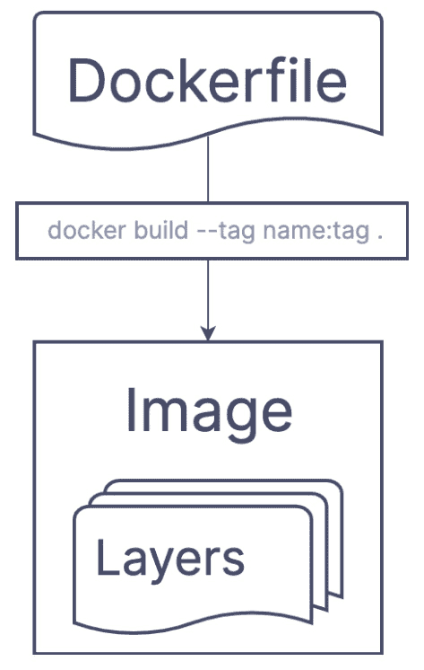
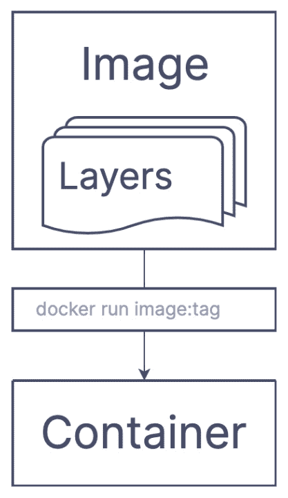
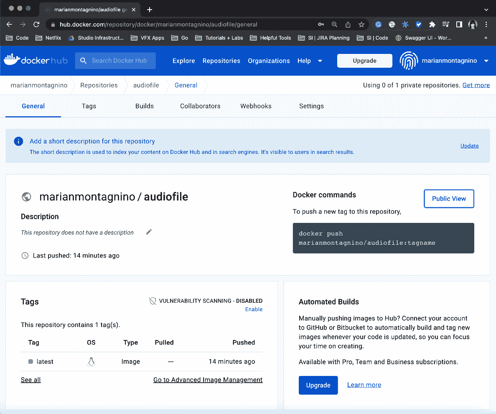
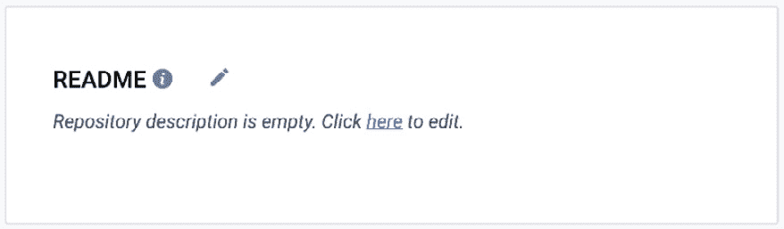
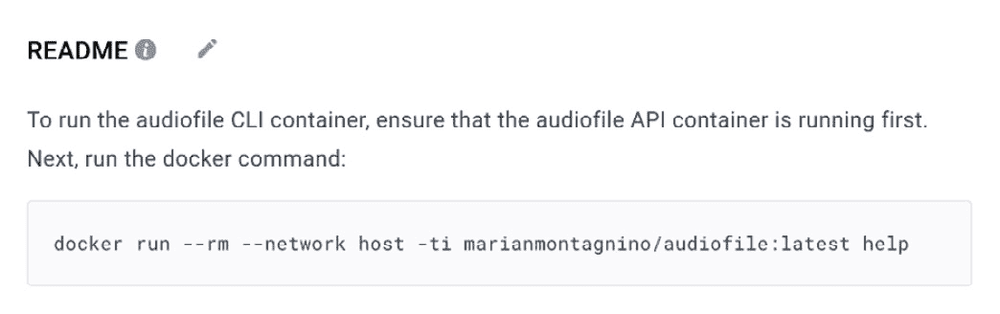

# 使用容器进行分发

在本章中，我们将探讨容器化的世界，并检查为什么你应该使用 Docker 容器来测试和分发你的应用程序的许多原因。术语*容器化*指的是一种软件打包风格，它使得在任何环境中部署和运行变得简单。首先，我们将通过一个可以构建成镜像并作为容器运行的应用程序来介绍 Docker 的基础知识。然后，我们将回到我们的 audiofile 应用程序，作为一个更高级的例子，学习如何创建多个可以组合和一起运行的 Docker 容器。这些例子不仅让你理解了用于运行容器的基本标志，还展示了如何使用映射的网络堆栈、卷和端口来运行容器。

我们还解释了如何使用 Docker 容器进行集成测试，这增加了你的信心，因为坦白说，模拟 API 响应只能覆盖这么多。单元测试和集成测试的良好组合不仅提供了覆盖率，还提供了整体系统工作的信心。

最后，我们将讨论采用 Docker 的一些不利因素。考虑管理容器化应用程序的复杂性增加，以及在单个主机上运行多个容器的额外开销。Docker 作为一个外部依赖项本身可能就是一个不利因素。本章将帮助你确定何时以及何时不使用容器来处理你的应用程序。

到本章结束时，你将深刻理解如何利用 Docker 容器以及它们如何可能帮助你开发、测试和部署工作流程。你将能够将你的应用程序容器化，使用 Docker 进行测试，并通过 Docker Hub 发布。具体来说，我们将涵盖以下主题：

+   为什么使用容器？

+   使用容器进行测试

+   使用容器进行分发

# 技术要求

对于本章，你需要做以下事情：

+   在[`www.docker.com/products/docker-desktop/`](https://www.docker.com/products/docker-desktop/)下载并安装 Docker Desktop

+   安装 Docker Compose 插件

你也可以在 GitHub 上找到代码示例：[`github.com/PacktPublishing/Building-Modern-CLI-Applications-in-Go/tree/main/Chapter13`](https://github.com/PacktPublishing/Building-Modern-CLI-Applications-in-Go/tree/main/Chapter13)

# 为什么使用容器？

首先，让我们谈谈什么是容器。**容器**是一个标准化的软件单元，它通过将应用程序的代码及其所有依赖项打包成一个单一的封装，允许程序从一个计算环境快速且可靠地传输到另一个环境。简单来说，容器允许您将所有依赖项打包到一个容器中，以便它可以在任何机器上运行。容器彼此隔离，并捆绑自己的系统库和设置，因此它们不会与其他容器或宿主系统冲突。这使得它们成为**虚拟机**（**VMs**）的轻量级和便携式替代品。流行的容器化工具包括**Docker**和**Kubernetes**。

## 从容器中获益

让我们分析一下在 Go 项目中使用容器的部分好处：

+   **便携性**：容器使得在不同环境中保持行为一致性成为可能，降低了错误和不兼容的可能性。

+   **隔离性**：它们提供了一定程度的与宿主系统和其他容器的隔离，这提高了它们的安全性并减少了冲突的可能性。

+   **轻量级**：与虚拟机相比，容器更小，启动速度更快，这提高了它们的运行效率。

+   **可伸缩性**：它们可以轻松地进行扩展或缩减，从而实现有效的资源利用。例如，如果您为应用程序使用容器，那么您可以在多个服务器上部署运行应用程序的多个相同容器。

+   **版本控制**：容器可以进行版本控制，这使得在需要时简单地回滚到早期迭代变得简单。

+   **模块化**：由于容器可以单独创建和管理，因此它们易于更新和维护。

+   **经济高效**：通过减少运行应用程序所需的系统数量，容器可以帮助您在基础设施和维护方面节省资金。

容器使得创建和运行命令行应用程序变得简单且可靠。无论宿主机的配置如何，这意味着应用程序始终以相同的方式进行构建和运行。通过在容器镜像中包含所有必要的依赖项和运行时环境，容器显著简化了跨不同操作系统的应用程序开发和部署。最后，容器使得复制开发环境变得简单，使得多个开发人员或团队能够在同一领域内协作，同时确保应用程序在各种环境中统一开发和执行。

此外，使用容器使得将应用程序与**持续集成和持续部署**（**CI/CD**）管道集成变得更加简单。由于所有必要的依赖项都存在于容器镜像中，因此管道可以更可靠、更轻松地构建和运行应用程序，从而消除了配置管道宿主机开发环境的需要。

最后，使用容器实现的隔离环境的稳定性是另一个好处，这使得在保证应用程序按预期运行的同时，更容易分发您的命令行应用程序。用户不再需要为应用程序配置环境，这使得容器，虽然轻量级，成为在各种环境和平台间分发的好方法。

如您所清晰看到的，有许多情况下容器可以证明是有用的，包括命令行应用程序开发和测试！现在，让我们讨论一下您可能不想使用容器的情况。

## 不使用容器的决定

虽然容器通常很有帮助，但在某些情况下，它们可能不是最佳选择：

+   **高性能计算**：由于它们造成的额外开销，高性能计算和其他需要直接访问宿主机系统资源的任务可能不适合容器。

+   **需要高安全级别**：容器共享宿主机的内核，可能不会提供与虚拟机（VM）一样多的隔离。如果您的负载需要高安全级别，VM 可能是一个更好的选择。

+   **忽视容器原生特性**：如果您不打算使用任何用于扩展、滚动更新、服务发现和负载均衡的内置特性，您可能看不到使用容器的优势。

+   **不灵活的应用程序**：如果一个应用程序需要非常特定的操作系统环境才能正常运行，那么它可能甚至无法容器化，因为支持的操作系统和平台有限。

+   **团队惯性**：如果您或您的团队不愿意学习容器和容器编排，那么将难以引入新的工具。

然而，重要的是要注意，这些情况并不总是如此，并且有一些解决方案可用，包括使用虚拟机（VM）、容器编排平台特定的安全特性、专门的容器运行时如**gVisor**或**Firecracker**，以及其他。

在以下示例和接下来的章节中，我们将使用 Docker 来展示开始使用 Docker 以及如何用它来创建一个用于测试和分发的一致性环境是多么容易。

在`Chapter-13` GitHub 仓库中，我们介绍了一个构建镜像和运行容器的非常简单的示例。`main.go`文件很简单：

```go
func main() {
    var helloFlag bool
    flag.BoolVar(&helloFlag, "hello", false, "Print 'Hello,
      World!'")
    flag.Parse()
    if helloFlag {
        fmt.Println("Hello, World!")
    }
}
```

向构建的应用程序传递`hello`标志将会打印出`"Hello, World!"`。

## 构建简单的 Docker 镜像

首先，软件可以被打包成一个**镜像**，这是一个小型、自包含的可执行文件，包含程序的源代码、库、配置文件、运行时和环境变量。镜像是容器的基本构建块，用于创建和运行它们。

让我们为这个非常简单的应用程序构建一个 Docker 镜像。为此，我们需要创建一个`Dockerfile`，当您运行命令行 Docker 命令时，它将自动被识别，或者创建一个具有`.dockerfile`扩展名的文件，这将需要`–f`或`--file`标志来传递文件名。

Dockerfile 包含构建 Docker 镜像的指令，如下所示图所示。每个指令在镜像中创建一个新的层。这些层被组合起来创建最终的镜像。您可以在 Dockerfile 中放置许多不同类型的指令。例如，您可以告诉 Docker 将文件复制到基镜像中，设置环境变量，运行命令，并指定在容器初始化时要运行的可执行文件：



图 13.1 – Dockerfile 通过构建命令转换为具有层的图像的视觉表示

对于我们的基础镜像，让我们访问 Docker Hub 网站[`hub.docker.com`](https://hub.docker.com)，并搜索 Go `v1.19`的官方 Golang Docker 基础镜像。我们看到我们可以使用带有标签`1.19`的`golang`镜像。`FROM`指令是 Dockerfile 的第一行，它设置要使用的基镜像：

```go
FROM golang:1.19
```

然后，复制所有文件：

```go
COPY . .
```

构建`hello` `world`应用程序：

```go
RUN go build main.go
```

最后，运行应用程序时传递`hello`标志：

```go
CMD ["./main", "--hello"]
```

总的来说，Dockerfile 包含了前面的指令和一些用`#`作为行首字符的描述性注释。

要从 Dockerfile 构建 Docker 镜像，我们调用`docker build`命令。该命令采用以下语法：

```go
docker build [options] path| url | -
```

当运行时，该命令执行以下操作：

+   读取 Dockerfile 中指定的指令并按顺序执行

+   每个指令在镜像中创建一个新的层，最终的镜像将它们全部组合起来

+   使用指定的或生成的名称标记新镜像，并且可选地使用`name:tag`格式标记

`options`参数可以用来向命令传递不同的选项，这可以包括构建时变量、目标等。`path | url | -`参数指定 Dockerfile 的位置。

让我们尝试从为我们的 hello world 应用程序创建的 Dockerfile 构建这个镜像。在存储库的根目录下运行以下命令：

`docker build --``tag hello-world:latest`

运行命令后，你应该看到类似以下输出：

```go
[+] Building 2.4s (8/8) FINISHED
=> [internal] load build definition from Dockerfile          0.0s
=> => transferring dockerfile: 238B                          0.0s
=> [internal] load .dockerignore                             0.0s
=> => transferring context: 2B                               0.0s
=> [internal] load metadata for docker.io/library/golang:1.19 1.2s
=> [internal] load build context                             0.0s
=> => transferring context: 2.25kB                           0.0s
=> CACHED [1/4] FROM docker.io/library/golang:1.19@sha256:bb9811fad43a7d6fd217324 0.0s
=> [2/4] COPY . .                                            0.0s
=> [3/4] RUN go build main.go                                1.0s
=> exporting to image                                        0.1s
=> => exporting layers                                       0.0s
=> => writing image sha256:91f97dc0109218173ccae884981f700c83848aaf524266de20f950   0.0s
=> => naming to docker.io/library/hello-world:latest         0.0s
```

从输出大约一半的位置开始，您会看到镜像的层被构建，最后以标记为`hello-world:latest`的最终镜像结束。

您可以通过在终端运行以下命令来查看现有的镜像：

```go
% docker images
REPOSITORY         TAG        IMAGE ID        CREATED        SIZE
hello-world    latest    91f97dc01092    18 minutes ago  846MB
```

现在我们已经成功构建了这个简单 hello world 应用程序的 Docker 镜像，让我们继续在容器中运行它。

## 运行一个简单的 Docker 容器

当您运行 Docker 容器时，Docker Engine 会从一个现有的镜像创建一个新的运行实例。这个容器存在于一个具有自己的文件系统、网络接口和进程空间的隔离环境中。然而，镜像是创建或运行容器的一个必要起点。

注意

当容器运行时，它可以对文件系统进行更改，例如创建或修改文件。然而，这些更改不会保存在镜像中，当容器停止时将会丢失。如果您想保存这些更改，可以使用`docker commit`命令为容器创建一个新的镜像。

要从镜像创建和运行 Docker 容器，我们调用`docker run`命令。该命令采用以下语法：

`docker run [options] image[:tag] [command] [arg...]`

`docker run`命令检查镜像是否本地存在；如果不存在，则从 Docker Hub 拉取。然后 Docker Engine 从这个镜像创建一个新的容器，应用所有层或指令。我们在这里将其分解：



图 13.2 – 使用 run 命令创建容器的图像可视化

如前所述，当调用`docker run`时，以下步骤会发生：

1.  Docker 检查请求的镜像是否本地存在；如果不存在，则从注册表，如 Docker Hub 检索它。

1.  从镜像中，它创建了一个新的容器。

1.  它启动容器并执行 Dockerfile 指令中指定的命令。

1.  它将终端连接到容器的进程，以便显示命令的任何输出。

`options`参数可以用来向命令传递不同的选项，这可以包括端口映射、设置环境变量等。`image[:tag]`参数指定用于创建容器的镜像。最后，`command`和`[arg...]`参数用于指定在容器内运行的任何命令。

在我们调用`docker run`命令的每个示例中，我们传递`--rm`标志，这告诉 Docker 在退出时自动删除容器。这将避免您意外地留下许多停止的容器在后台占用大量空间。

尝试从我们为 hello world 应用程序创建的`hello-world:latest`镜像运行一个镜像。在存储库的根目录下运行以下命令，并查看文本输出：

```go
% docker run --rm hello-world:latest
Hello, World!
```

我们做到了！一个简单的 Dockerfile 用于简单的 hello world 应用程序。在接下来的两个部分中，我们将回到 audiofile 命令行应用程序示例，并使用构建镜像和运行容器的新技能进行测试和分发。

# 使用容器进行测试

到目前为止，在我们的命令行应用程序之旅中，我们已经构建了测试并模拟了服务输出。除了在任意主机机器上运行测试的一致性和隔离环境之外，使用容器的好处是你可以使用它们来运行集成测试，这为你的应用程序提供了更可靠的测试覆盖率。

## 创建集成测试文件

我们创建了一个新的`integration_test.go`文件来处理集成测试的配置和执行，但我们不希望它与所有其他测试一起运行。为了指定其独特性，让我们用`int`标签标记它，代表集成。在文件的顶部，我们添加以下构建标签：

```go
//go:build int && pro
```

我们包含`pro`构建标签，因为我们正在测试所有可用的功能。

## 编写集成测试

首先，让我们编写`ConfigureTest()`函数来为我们的集成测试做准备：

```go
func ConfigureTest() {
    getClient = &http.Client{
        Timeout: 15 * time.Second,
    }
    viper.SetDefault("cli.hostname", "localhost")
    viper.SetDefault("cli.port", 8000)
    utils.InitCLILogger()
}
```

在前面的代码中，你可以看到我们使用的是实际客户端，而不是当前在单元测试中使用的模拟客户端。我们使用`viper`来设置 API 的 hostname 和 port，将其连接到本地的`8000`端口。最后，我们初始化日志文件，以避免在日志记录时出现任何恐慌。

对于集成测试，让我们使用一个特定的工作流程：

1.  **上传音频**：首先，我们想要确保在本地存储中存在一个音频文件。

1.  **通过 ID 获取音频**：从上一步，我们可以检索返回的音频文件 ID，并使用它从存储中检索音频元数据。

1.  **列出所有音频**：我们列出所有音频元数据，并确认之前上传的音频存在于列表中。

1.  **通过值搜索音频**：根据我们知道的描述中存在的元数据搜索已上传的音频。

1.  **通过 ID 删除音频**：最后，通过从*步骤 1*中检索到的 ID 删除我们最初上传的音频文件。

顺序是特定的，因为工作流程中的后续步骤依赖于第一步。

集成测试类似于单元测试，但传递给实际文件的路径，并调用实际的 API。在`integration_tests.go`文件中存在一个`TestWorkflow`函数，它按照之前列出的顺序调用命令。由于代码与单元测试相似，让我们只概述前两个命令调用，然后直接进入使用 Docker 执行集成测试！

在测试任何方法之前，通过调用`ConfigureTest`函数来配置集成测试：

```go
ConfigureTest()
fmt.Println("*** Testing upload ***")
b := bytes.NewBufferString("")
rootCmd.SetOut(b)
rootCmd.SetArgs([]string{"upload", "--filename",
  "../audio/algorithms.mp3"})
err := rootCmd.Execute()
if err != nil {
    fmt.Println("err: ", err)
}
uploadResponse, err := ioutil.ReadAll(b)
if err != nil {
    t.Fatal(err)
}
id := string(uploadResponse)
if id == "" {
    t.Fatalf("expected id returned")
}
```

在前面的代码中，我们随后使用`rootCmd`调用`upload`命令，并将文件名设置为`../audio/algorithms.mp3`。我们执行命令，并将响应作为字节切片读取回来，然后将其转换为字符串并存储在`id`变量中。这个`id`变量随后用于后续的测试。我们运行`get`命令，并传入相同的`id`变量来检索之前上传的音频文件的元数据：

```go
fmt.Println("*** Testing get ***")
rootCmd.SetArgs([]string{"get", "--id", id, "--json"})
err = rootCmd.Execute()
if err != nil {
    fmt.Println("err: ", err)
}
getResponse, err := ioutil.ReadAll(b)
if err != nil {
    t.Fatal(err)
}
var audio models.Audio
json.Unmarshal(getResponse, &audio)
if audio.Id != id {
    t.Fatalf("expected matching audiofile returned")
}
```

我们继续以类似的方式测试 `list`、`search` 和 `delete` 命令，并确保每次都返回具有匹配 `id` 变量的特定元数据。当测试完成后，我们尝试运行集成测试。如果没有本地运行的 API，运行以下命令将失败得非常惨烈：

```go
go test ./cmd -tags "int pro"
```

在我们再次尝试之前，让我们构建一个 Dockerfile 来在容器环境中运行 API。

## 编写 Dockerfile

在现实世界中，我们的 API 可能托管在一些外部网站上。然而，我们目前运行在 `localhost`，在容器中运行它将使用户能够轻松地在任何机器上运行它。在本节中，我们将创建两个 Dockerfile：一个用于 CLI，另一个用于 API。

### 编写 API Dockerfile

首先，我们将创建一个 `api.Dockerfile` 文件来包含构建镜像和运行容器以运行 audiofile API 的所有指令：

```go
FROM golang:1.19
# Set the working directory
WORKDIR /audiofile
# Copy the source code
COPY . .
# Download the dependencies
RUN go mod download
# Expose port 8000
EXPOSE 8000
# Build the audiofile application with the pro tag so all
# features are available
RUN go build -tags "pro" -o audiofile main.go
RUN chmod +x audiofile
# Start the audiofile API
CMD ["./audiofile", "api"]
```

让我们构建这个镜像。`–f` 标志允许你指定要使用的 `api.Dockerfile` 文件，而 `–t` 标志允许你命名和标记镜像：

```go
% docker build -f api.Dockerfile -t audiofile:api .
```

命令执行后，你可以运行 `docker images` 命令来确认其创建：

```go
% docker images
REPOSITORY        TAG        IMAGE ID        CREATED        SIZE
audiofile      api         12afba7f3fb7        9 minutes ago  1.75GB
```

现在我们看到镜像已成功构建，让我们运行容器并测试它！

运行以下命令来运行容器：

```go
% docker run -p 8000:8000 --rm audiofile:api
Starting API at http://localhost:8000
Press Ctrl-C to stop.
```

如果 API 启动成功，你会看到前面的输出。我们在主机内的容器中运行了 audiofile API。记住，任何命令都会检查指向在 `home` 目录下创建的 `audiofile` 目录的平面文件存储。除非我们提交更改，否则上传、处理并存储在容器内的任何音频文件都不会被保存。由于我们只是在运行集成测试，所以这不会是必要的。

注意

`docker run` 命令中的 `–p` 标志允许你指定主机和容器之间的端口映射。语法是 `-p host_port:container_port`。这会将主机的端口映射到容器的端口。

在另一个终端中，让我们再次运行集成测试并查看它们通过：

```go
% go test ./cmd -tags "int pro"
ok      github.com/marianina8/audiofile/cmd     0.909s
```

成功！我们现在已经运行了连接到容器内 audiofile API 的集成测试。

### 编写 CLI Dockerfile

现在，为了在容器中运行 CLI 集成测试，我们将创建一个 `cli.Dockerfile` 文件。它将包含构建镜像和运行容器以进行集成测试的所有指令：

```go
FROM golang:1.19
# Set the working directory
WORKDIR /audiofile
# Copy the source code
COPY . .
# Download the dependencies
RUN go mod download
# Execute `go test -v ./cmd -tags int pro` when the
# container is running
CMD ["go", "test", "-v", "./cmd", "-tags", "int pro"]
```

前面的注释解释了每条指令，但让我们分解 Docker 指令：

1.  将基础镜像指定为 `golang:1.19` 并从中拉取。

1.  将工作目录设置为 `/audiofile`。

1.  将所有源代码复制到工作目录中。

1.  下载所有 Go 依赖项。

1.  执行 `go test –v ./cmd -tags` `int pro`。

让我们构建这个镜像：

```go
% docker build -f cli.Dockerfile -t audiofile:cli .
```

然后，在确保 `audiofile:api` 容器已经运行的情况下，运行 `audiofile:cli` 容器：

```go
% docker run --rm --network host audiofile:cli
```

你会看到集成测试运行成功。

注意

`docker run` 命令中的 `--network host` 标志用于将容器连接到主机的网络堆栈。这意味着容器将能够访问主机的网络接口、IP 地址和端口。如果容器运行任何服务，请小心安全。

现在，我们已经为 API 和 CLI 创建了两个容器，但与其在两个独立的终端中分别单独运行每个容器，不如使用 `docker-compose.yml` 文件，通过单个 `stop/start` 命令启动和停止整个应用程序。

### 编写 Docker Compose 文件

在 `docker-compose.yml` Docker Compose 文件中，我们定义了需要运行的容器，同时指定了我们之前通过 `docker run` 命令的标志设置的任何参数：

```go
version: '3'
services:
  cli:
    build:
      context: .
      dockerfile: cli.Dockerfile
    image: audiofile:cli
    network_mode: host
    depends_on:
      - api
  api:
    build:
      context: .
      dockerfile: api.Dockerfile
    image: audiofile:api
    ports:
    - "8000:8000"
```

让我们来解释前面的文件。首先，定义了两个服务：`cli` 和 `api`。在每个服务下面是一组类似的键：

+   `build` 键用于指定 Dockerfile 的上下文和位置。

+   `context` 键用于指定查找 Dockerfile 的位置。两者都设置为 `.`，这告诉 Docker Compose 服务在当前目录中查找。

+   `dockerfile` 键允许我们指定 Dockerfile 的名称——在本例中，为 `cli` 服务指定 `cli.Dockerfile`，为 `api` 服务指定 `api.Dockerfile`。

+   `image` 键允许我们给镜像命名和打标签。

对于 `cli` 服务，我们添加了一些额外的键：

+   `network_mode` 键用于指定服务的网络模式。当它设置为 `host` 时，就像 `cli` 服务一样，这意味着使用主机机器的网络堆栈（就像调用 `docker run` 时使用的 `–network host` 标志）。

+   `depends_on` 键允许我们指定服务的运行顺序。在这种情况下，`api` 服务必须首先运行

+   对于 `api` 服务，还有一个额外的键：

+   `ports` 键用于指定主机机器和容器之间的端口映射。其语法是 `host_port:container_port`，类似于调用 `docker run` 命令时使用的 `–p` 或 `--publish` 标志。

现在我们已经完成了 Docker Compose 文件，我们只需一个简单的命令 `docker-compose up` 就可以在容器化环境中运行集成测试：

```go
% docker-compose up
[+] Running 3/2
 Network audiofile_default  Created                        0.1s
 Container audiofile-api-1  Created                        0.0s
 Container audiofile-cli-1  Created                        0.0s
Attaching to audiofile-api-1, audiofile-cli-1
audiofile-api-1  | Starting API at http://localhost:8000
audiofile-api-1  | Press Ctrl-C to stop.
audiofile-cli-1  | === RUN   TestWorkflow
audiofile-cli-1  | --- PASS: TestWorkflow (1.14s)
…
audiofile-cli-1  | ok   github.com/marianina8/audiofile/cmd     1.163s
```

现在，无论你在哪个平台上运行容器，在容器内运行测试的结果都将保持一致。集成测试提供了更全面的测试，因为它将捕获从命令到 API 到文件系统再到命令的端到端流程中可能存在的错误。因此，我们可以通过确保我们的 CLI 和 API 作为整体更加稳定和可靠来提高我们的信心。在下一节中，我们将讨论如何使用容器分发 CLI 应用程序。

# 使用容器进行分发

在容器内运行 CLI 而不是直接在主机上运行有许多优势。利用容器使得程序的设置和安装更加容易。如果应用程序需要大量难以安装的依赖项或库，这可能很有帮助。此外，无论用于构建程序的编程语言或工具是什么，采用容器可以提供更可靠和统一的方法进行分发。使用容器作为分发方法可以成为大多数可以在 Linux 环境中运行的应用程序的灵活解决方案，尽管可能存在特定语言的替代方案。最后，对于不熟悉 Go 语言但已在机器上安装了 Docker 工具箱的开发者来说，通过容器进行分发将非常有用。

## 构建作为可执行程序运行的镜像

要构建一个可以作为可执行程序运行的镜像，我们必须在镜像上创建一个`ENTRYPOINT`指令来指定主可执行程序。让我们创建一个新的 Dockerfile，名为`dist.Dockerfile`，其中包含以下指令：

```go
FROM golang:1.19
# Set the working directory
WORKDIR /audiofile
# Copy the source code
COPY . .
# Download the dependencies
RUN go mod download
# Expose port 8000
EXPOSE 8000
# Build the audiofile application with the pro tag so all
# features are available
RUN go build -tags "pro" -o audiofile main.go
# Start the audiofile API
ENTRYPOINT ["./audiofile"]
```

由于这些说明与前面章节中解释的其他 Dockerfile 大致相同，我们不会进行详细说明。需要注意的是`ENTRYPOINT`指令，它指定`./audiofile`作为主可执行程序。

我们可以使用以下命令构建此镜像：

```go
% docker build -f dist.Dockerfile -t audiofile:dist .
```

在确认镜像成功构建后，我们现在可以运行容器并将其作为可执行程序进行交互。

## 将容器作为可执行程序进行交互

要将容器作为可执行程序进行交互，您可以通过在 Docker 中使用`ENTRYPOINT`命令配置容器以使用交互式 TTY（终端）。`-i`和`–t`选项分别代表*交互式*和*TTY*，当这两个标志一起使用时，您可以在类似终端的环境中与`ENTRYPOINT`命令进行交互。请记住首先启动 API。现在，让我们看看当我们运行`audiofile:dist`镜像的容器时它将如何显示：

```go
% docker run --rm --network host -ti audiofile:dist help
A command line interface allows you to interact with the Audiofile service.
Basic commands include: get, list, and upload.
Usage:
  audiofile [command]
Available Commands:
...
Use "audiofile [command] --help" for more information about a command.
```

只需在`docker run`命令的末尾键入`help`，就会将`help`作为输入传递给主可执行程序或`ENTRYPOINT`：`./audiofile`。正如预期的那样，帮助文本被输出。

`docker run`命令使用了一些额外的命令；`–network host`标志使用主机的网络堆栈为容器，而`–rm`命令告诉 Docker 在容器退出时自动删除它。

您可以通过将`help`一词替换为其他命令的名称来运行任何命令。例如，要运行`upload`，请运行以下命令：

```go
% docker run --rm --network host -ti audiofile:dist upload –filename audio/algorithms.mp3
```

你现在可以通过容器与命令行应用程序交互，传递命令，而无需担心它是否会根据主机机器有所不同。如前所述，任何文件系统更改或上传的文件，如前所述的文件，在容器退出时都不会保存。有一种方法可以运行 API，使得本地文件存储映射到容器路径。

## 将主机机器映射到容器文件路径

如前所述，你可以将主机机器路径映射到 Docker 容器文件路径，以便从容器内部访问主机计算机上的文件。这有助于诸如给容器访问数据卷或应用程序配置文件等情况。

`-v`或`—volume`选项可以在执行容器时将主机机器路径转换为容器路径。此标志的语法是`host path:container path`。例如，`docker run -v /app/config:/etc/config imageName:tag`命令将用于将主机机器的`/app/config`目录映射到容器的`/etc/config`目录。

记住这一点至关重要，即主机路径和容器路径都必须在容器执行之前存在于容器镜像中。如果它不在容器镜像中，你必须在使用容器之前构建容器路径。

如果你深入研究运行在本地主机上的 audiofile API，你会看到平面文件存储被映射到主机`home`目录下的`/audiofile`文件夹。在我的 macOS 实例中，如果我想在 Docker 容器中运行 audiofile API，但又能从容器内部读取、访问或上传数据到平面文件存储，那么我需要将`HOME`目录下的`audiofile`目录映射到适当的位置。这个`docker run`命令就可以做到：

```go
docker run -p 8000:8000 --rm -v $HOME/audiofile:/root/audiofile  audiofile:api
```

首先运行前面的命令，然后运行 CLI 容器，或者修改`docker-compose.yml`文件的 API 服务以包含以下内容：

```go
    volumes:
      - "${HOME}/audiofile:/root/audiofile"
```

无论哪种方式，当你运行用于集成测试或作为可执行文件的容器时，你将与容器内映射到`/root/audiofile`目录的本地存储进行交互。如果你一直在尝试使用 audiofile CLI 上传目录，那么当你启动容器并运行`list`命令时，你会看到现有的元数据而不是返回一个空列表。

将主机路径映射到容器是你在指导用户如何使用 audiofile 应用程序时可以与他们分享的选项。

## 通过多阶段构建减少图像大小

通过运行`docker images`命令，您会看到构建的一些镜像相当大。为了减小这些镜像的大小，您可能需要重写您的 Dockerfile 以使用多阶段构建。**多阶段构建**是一个将构建过程分割成多个阶段的过程，在这个过程中可以从最终镜像中删除不必要的依赖项、工件和配置。这对于构建大型应用程序的镜像特别有用，因为您可以在部署时间和基础设施成本上节省。

单阶段和多阶段构建之间的一个区别是多阶段构建允许您使用多个`FROM`语句，每个语句定义构建过程的新阶段。您可以选择性地复制来自一个阶段或另一个阶段的工件或构建，允许您取所需并丢弃其余部分，本质上允许您删除任何不必要的部分并清理空间。

让我们考虑`dist.Dockerfile`文件并重写它。在我们的多阶段构建过程中，让我们定义我们的阶段：

+   **阶段 1**：构建我们的应用程序

+   **阶段 2**：复制可执行文件，暴露端口，并创建入口点

首先，我们创建一个新的文件，`dist-multistage.Dockerfile`，包含以下指令：

```go
# Stage 1
FROM golang:1.19 AS build
WORKDIR /audiofile
COPY . .
RUN go mod download
RUN go build -tags "pro" -o audiofile main.go
# Stage 2
FROM alpine:latest
COPY --from=build /audiofile/audiofile .
EXPOSE 8000
ENTRYPOINT ["./audiofile"]
```

在*阶段 1*中，我们复制所有代码文件，下载所有依赖项，然后构建应用程序——基本上与`dist.Dockerfile`中的原始指令相同，但没有`EXPOSE`和`ENTRYPOINT`指令。需要注意的是，我们已将阶段命名为`build`，如下行所示：

```go
FROM golang:1.19 AS build
```

在*阶段 2*中，我们仅从`build`阶段复制编译的二进制文件，不复制其他任何内容。为此，我们运行以下指令：

```go
COPY --from=build /audiofile/audiofile .
```

该命令允许我们从上一个阶段，即`build`阶段，将文件或目录复制到当前阶段。`--from=build`选项指定了要复制文件的阶段名称。`/audiofile/audiofile`是`build`阶段中文件的路径，命令末尾的`.`指定了目标目录，即当前阶段的根目录。

让我们尝试构建它，并将新大小与原始大小进行比较：

```go
REPOSITORY TAG            IMAGE ID        CREATED        SIZE
audiofile    dist            1361cbc7be3e    2 minutes ago    1.78GB
audiofile     dist-multistage    ab5640f99ef2    5 minutes ago    24MB
```

这是个很大的差异！使用多阶段构建可以帮助您节省部署时间和基础设施成本，所以花时间使用此过程编写 Dockerfile 绝对是值得的。

## 分发您的 Docker 镜像

有许多方法可以使您的 Docker 镜像对他人可用。**Docker Hub**，一个公共注册表，您可以在此处发布您的镜像并使其对他人易于访问，是一个流行的替代方案。另一种替代方案是使用**GitHub Packages**来存储和分发您的 Docker 镜像以及其他类型的包。还有其他基于云的注册表，如**Amazon Elastic Container Registry**（**ECR**）、**Google Container Registry**（**GCR**）和**Azure Container Registry**（**ACR**），它们提供额外的服务，例如图像扫描（例如，用于操作系统漏洞）和签名。

在存储镜像的仓库的 README 文件中提供如何使用你的镜像和运行容器的说明是一个好主意。对使用你的镜像感兴趣的人将能够轻松地获取有关如何检索镜像、使用镜像运行容器以及其他相关信息的说明。

发布 Docker 镜像有多个优点，包括简单分发、版本控制、部署、协作和可扩展性。你的镜像可以迅速且方便地分发给其他人，使得其他人能够轻松地使用和操作你的应用程序。版本控制帮助你跟踪多个版本的镜像，以便在必要时可以回滚到早期版本。易于部署允许你在几乎不需要修改的情况下将应用程序部署到多个环境。通过注册表共享镜像有助于与其他开发者进行项目协作。通过使用相同的镜像创建所需数量的容器，可扩展性变得简单，这使得扩展你的应用程序变得容易。

在本章中，我们将以我们的 audiofile CLI 项目为例，将镜像发布到 Docker Hub。

### 发布你的 Docker 镜像

要将镜像发布到 Docker Hub，你首先需要在网站上创建一个账户。一旦你有了账户，你可以登录并创建一个新的仓库来存储你的镜像。之后，你可以使用 Docker 命令行工具登录到你的 Docker Hub 账户，用仓库名称标记你的镜像，并将镜像推送到仓库。以下是你将使用的命令示例：

```go
docker login --username=your_username
docker tag your_image your_username/your_repository:your_tag
docker push your_username/your_repository:your_tag
```

1.  让我们用我们的 audiofile API 和 CLI 镜像试一试。首先，我将使用我的用户名和密码登录：

    ```go
    % docker login --username=marianmontagnino

    Password:

    Login Succeeded

    Logging in with your password grants your terminal complete access to your account.

    For better security, log in with a limited-privilege personal access token. Learn more at https://docs.docker.com/go/access-tokens/
    ```

1.  接下来，我将标记我的 CLI 镜像：

    ```go
     % docker tag audiofile:dist  marianmontagnino/audiofile:latest
    ```

1.  最后，我将镜像发布到 Docker Hub：

    ```go
    % docker push marianmontagnino/audiofile:latest

    The push refers to repository [docker.io/marianmontagnino/audiofile]

    c0f557e70e4f: Pushed

    98f8be277d74: Pushed

    6c199763ccbe: Pushed

    8f2f7ffa843f: Pushed

    10bb928a2e24: Pushed

    f1ce3f3654c3: Mounted from library/golang

    3685241d2bbb: Mounted from library/golang

    dddbac67c6fa: Mounted from library/golang

    85f9ebffaf4d: Mounted from library/golang

    72235aad06ad: Mounted from library/golang

    5d37ad02a8e2: Mounted from library/golang

    ea8ab45f064e: Mounted from library/golang

    latest: digest: sha256:b7b3f58da01d360fc1a3f2e2bd617a44d3f7be d6b6625464c9d787b8a71ead2e size: 2851
    ```

让我们在 Docker Hub 上确认以确保容器存在：



图 13.3 – Docker Hub 网站截图，显示带有最新标记的 audiofile 镜像

在存储镜像的仓库的 README 文件中包含运行容器的说明是一个好主意。这使得想要使用该镜像的人能够轻松地学习如何拉取镜像并正确运行容器。以下是我们之前上传的 audiofile CLI 镜像的示例说明：

要运行 audiofile CLI 容器，请确保 audiofile API 容器首先运行。然后，运行 `docker` 命令：

```go
% docker run --rm --network host -ti marianmontagnino/audiofile:latest help
```

你会看到输出帮助文本。让我们更新 Docker Hub 仓库上的说明。

### 更新 README 文件

从存储我们镜像的 Docker Hub 仓库（在这个例子中，是 audiofile 仓库），我们可以滚动到页面底部查看一个 **README** 部分：



图 13.4 – Docker Hub 仓库中 README 部分的截图

点击**此处**编辑仓库描述。添加我们之前讨论的说明，然后点击**更新**按钮：



图 13.5 – 更新后的 README 部分的截图

按照这些说明，类似地将音频文件 API 镜像发布到你的 Docker Hub 仓库。现在，这些镜像已存在于 Docker Hub 的公共仓库中，可供分享和分发给其他用户。

## 依赖于 Docker

用户必须在他们的计算机上安装 Docker，这是利用 Docker 部署 CLI 的一个主要缺点。然而，如果你的程序有复杂的依赖项或设计用于在多个平台上运行，这个 Docker 依赖项可能更容易处理。使用 Docker 可以帮助避免许多库的问题以及与各种系统设置的意外交互。

# 摘要

在本章中，我们已经进入了容器化的领域，并探讨了利用 Docker 容器为你的应用程序提供众多优势。解释了创建和运行简单 Docker 镜像和容器的基础知识，以及使用我们的 audiofile 应用程序的一些更复杂的实例，该应用程序需要构建多个可以一起组合和运行的容器。

显然，利用 Docker 进行集成测试可以提高你对整个系统的信任度，我们讨论了如何使用 Docker Compose 运行集成测试。

同时，我们也承认了 Docker 的一些缺点，例如维护容器化应用程序的复杂性增加，单个主机上运行多个容器的额外负担，以及 Docker 本身的依赖性。

总体而言，本章已经为你提供了强大的知识，了解何时为命令行应用程序利用 Docker 容器进行测试和分发。现在，你可以确保应用程序在任何主机机器上都能一致运行。然而，是否决定外部依赖和一定程度的复杂性带来的好处超过弊端，这取决于你。

在下一章，*第十四章*，*使用 GoReleaser 将 Go 二进制文件作为 Homebrew 公式发布*，我们将把分发提升到新的水平。我们将使你的应用程序在官方 Homebrew 仓库中可用，以进一步增加你应用程序的分发。

# 问题

1.  哪个命令用于从镜像创建并运行一个容器？

1.  哪个`docker run`标志用于将主机机器路径附加到容器路径？

1.  哪个 Docker 命令用于查看所有已创建的容器？

# 进一步阅读

+   由*肖恩·P·凯恩*和*卡尔·马蒂亚斯*所著的*Docker：运行起来：在生产中可靠地发送容器*

+   由*拉法尔·莱斯科*所著的*使用 Docker 和 Jenkins 进行持续交付：大规模交付软件*

+   《Docker 实战》由*Jeff Nickoloff*和*Stephen Kuenzli*合著

# 答案

1.  `docker` `run`命令。

1.  `-v`或`--volume`标志用于在执行期间将主机机器路径附加到容器路径。

1.  `docker ps`或`docker` `container ls`。
