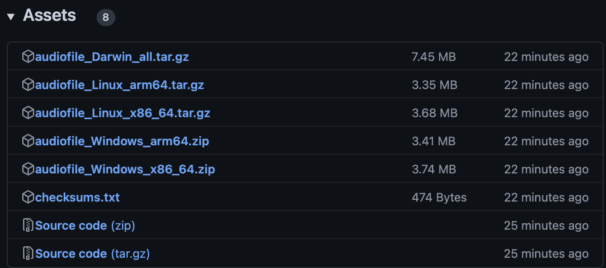

# 使用 GoReleaser 将你的 Go 二进制文件作为 Homebrew 公式发布

在本章中，我们将探讨 GoReleaser 和 GitHub Actions 以及它们如何协同使用来自动化将 Go 二进制文件作为 Homebrew 公式发布的过程。首先，我们将探讨 **GoReleaser**，这是一个流行的开源工具，它简化了 Go 二进制文件的创建、测试和分发。我们将探讨其各种配置和选项，以及它是如何与 GitHub Actions 一起工作的。

在此之后，我们将探讨 **GitHub Actions**，这是一个 CI/CD 平台，允许你自动化软件开发工作流程并与其他工具（如 GoReleaser）集成。我们将探讨如何使用它来确保构建、测试和部署的一致性和可靠性。

在我们掌握这两个工具之后，我们将专注于触发发布、创建 Homebrew tap 以及与 Homebrew 集成以实现简单的安装和测试。**Homebrew** 是一个流行的 macOS 包管理器，可以用于轻松安装和管理你的 CLI 应用程序。将你的软件发布到 Homebrew 不仅简化了 macOS 用户安装过程，还让你能够接触到更广泛的受众。你可以接触到一群喜欢使用包管理器安装程序的 macOS 开发者和消费者，例如 Homebrew。用户只需一条命令就可以快速找到并安装你的软件，这提高了其可用性和可访问性。这可以帮助你接触到比以往更大的受众，并提高你程序的可见性、使用率和采用率。

到本章结束时，你将牢固掌握如何结合 GoReleaser 和 GitHub Actions 来创建一个自动化和高效发布流程，包括发布到 Homebrew。有了这些知识，你将能够根据你的具体需求定制自己的工作流程。以下将涵盖以下主题：

+   GoReleaser 工作流程

+   触发发布

+   使用 Homebrew 安装和测试

# 技术要求

对于本章，你需要执行以下操作：

+   你也可以在 GitHub 上找到代码示例，地址为 [`github.com/PacktPublishing/Building-Modern-CLI-Applications-in-Go/tree/main/Chapter14/audiofile`](https://github.com/PacktPublishing/Building-Modern-CLI-Applications-in-Go/tree/main/Chapter14/audiofile)

+   一个 GitHub 账户

+   在 [`goreleaser.com/install/`](https://goreleaser.com/install/) 安装 GoReleaser 工具

# GoReleaser 工作流程

发布软件可能是一个漫长且具有挑战性的过程，尤其是对于有多个依赖项和平台的工程项目。除了节省时间外，自动化发布过程可以降低人为错误的可能性，并确保发布可靠且有效。GoReleaser 是 Go 开发者自动化发布过程的一个流行选择。然而，也有其他选择，如 CircleCI、GitLab CI 和 GitHub Actions，每个都有其特定的优点和功能。在本节中，我们将探讨自动化发布流程的优点，并更详细地查看其中的一些选择，特别是 GoReleaser 和 GitHub Actions。

与其他替代方案相比，GoReleaser 在以下方面脱颖而出：

+   **易于使用**：设置简单直观，使开发者能够轻松开始使用发布自动化。他们的 CLI 可以快速初始化带有默认配置的仓库，通常可以即插即用。

+   **平台支持**：支持包括主要操作系统和云服务在内的各种操作系统。

+   **每个步骤的定制**：程序员可以在发布过程的每个步骤中进行定制，包括构建、测试和发布到各种平台。

+   **发布工件**：可以生成各种发布工件，包括 Debian 软件包、Docker 镜像和二进制文件。

+   **多功能性**：与 CI/CD 管道（如 GitHub Actions）结合使用，使开发者能够完全自动化他们的发布流程。

+   **开源**：程序员可以访问 GoReleaser 项目的源代码，并根据他们的需求对其进行修改。

+   **社区支持**：GoReleaser 拥有庞大且活跃的用户群，这使得开发者能够轻松地为项目做出贡献并找到他们问题的答案。

虽然使用 GoReleaser 有许多好处，但也有一些原因可能需要考虑不使用 GoReleaser 进行您的项目：

+   **依赖 GitHub**：如果您更喜欢使用不同的工具或工作流程，这可能不是最佳选择。

+   **特定平台要求**：虽然 GoReleaser 支持许多流行的操作系统或云服务提供商，但您可能需要一个不受支持的平台。

+   **复杂的发布需求**：虽然每个步骤都允许定制，但 GoReleaser 可能不足以灵活地满足您特定的复杂程度。

总之，虽然市场上还有其他选择，但请选择适合您特定用例的工具。我们确实认为 GoReleaser 是用于 audiofile CLI 用例的一个很好的工具，所以让我们继续。

## 定义工作流程

分析了使用 GoReleaser 的优缺点后，让我们首先概述整体流程，然后更详细地探讨每个阶段：

1.  配置您的项目以使用 GoReleaser。

1.  配置 GitHub Actions。

1.  设置您的 GitHub 仓库。

1.  为 GitHub Actions 设置您的 GitHub 令牌。

1.  标记并推送代码。

可能更直观的是通过视觉来查看，这就是我们试图实现的目标：


图 14.1 – 使用 GitHub Actions 和 GoReleaser 的发布流程

现在我们对工作流程有了大致的了解，让我们更深入地了解每个步骤，我们将探索如何使用 GoReleaser 与 GitHub Actions 结合，并学习如何自动化自己的发布。

### 配置你的项目以使用 GoReleaser

安装 GoReleaser 工具后，你现在可以初始化你的 CLI 仓库。在这种情况下，我们将通过执行以下命令来初始化 audiofile CLI 项目仓库的根目录：

```go
goreleaser init
```

你应该注意到已经生成了一个新文件：`goreleaser.yml`。在检查文件之前，我们可以通过执行以下命令来运行一个仅限本地的发布，以确认配置没有问题：

```go
goreleaser release --snapshot --clean
```

命令的输出为你提供了一个关于发布过程中所有步骤的清晰概念。我们将在下一节“触发发布”中详细介绍这些步骤。在输出的最后，你应该看到一个表示发布成功的消息，类似于以下内容：

```go
  • release succeeded after 10s
```

虽然默认配置成功了，但我们需要更深入地查看配置设置，并相应地修改和添加以定制我们的发布过程。首先，让我们一起查看默认的`.goreleaser.yaml`文件，并对其进行分解。

#### 全局钩子

在文件的最顶部，我们看到一些默认的全局钩子。`before`字段允许你在发布过程开始之前指定要运行的哪些自定义脚本：

```go
before:
  hooks:
    - go mod tidy
    - go generate ./...
```

在前面的例子中，我们配置了自动化在发布过程之前运行`go mod tidy`和`go generate ./...`命令。然而，你可能运行执行以下任务的脚本：

+   更新项目中代码的版本号

+   生成变更日志

+   运行自动化测试以确保你的代码按预期工作

+   构建你的项目和创建发布工件

+   将更改推送到你的版本控制系统

你可以从 GoReleaser 中的`before`钩子部分调用的脚本可以是用任何语言编写的，只要它们可以从命令行执行。例如，你可能用 Go、Python、Bash 或任何支持 shell 执行的其它语言编写脚本。

#### 构建和环境变量

接下来，我们看到一些默认构建和一些环境变量已设置。`builds`字段允许你确定由`GOOS`字段定义的操作系统组合、由`GOARCH`字段定义的架构以及由`GOARM`字段定义的架构模式。它还允许你添加额外的字段，例如`env`字段，该字段允许你为构建设置环境变量。还可以定义的其他方面包括二进制文件、标志、钩子和更多：

```go
builds:
  - env:
    - CGO_ENABLED=0
  goos:
    - linux
    - windows
    - darwin
```

在默认配置中存在的先前的例子中，我们定义了环境变量 `CGO_ENABLED` 为 `0`，然后配置构建过程为 Linux、Windows 和 Darwin 操作系统生成二进制文件。

注意

`env` 字段可以在全局级别设置，以便在发布过程的各个阶段都可以使用环境变量，或者它可以在构建上下文中指定，例如在先前的例子中。

最终配置需要进行一些额外的修改，例如指定一些额外的架构，`amd64` 和 `arm64`，以及在钩子之前移除 `go generate ./...`，这是不必要的。此外，我们还通过设置构建标志为 `pro` 和 `dev` 来修改了 `builds` 字段：

```go
flags:
  - -tags=pro dev
```

虽然您可以在 `builds` 字段下设置许多其他选项，但我们将不会在本节中介绍它们。我们鼓励您查看 [`goreleaser.com/customization/builds/`](https://goreleaser.com/customization/builds/) 上可用的完整自定义列表。

#### 归档

接下来，我们查看一些默认的 `archives` 设置。在 GoReleaser 中，有一个 `README` 文件和一个 `LICENSE` 文件。目标是把应用程序的关键组件打包到一个文件中，从而使其更容易分发和部署。默认配置将 `archives` 字段设置为以下内容：

```go
archives:
  - format: tar.gz
    name_template: >-
      {{ .ProjectName }}_
      {{- title .Os }}_
      {{- if eq .Arch "amd64" }}x86_64
      {{- else if eq .Arch "386" }}i386
      {{- else }}{{ .Arch }}{{ end }}
      {{- if .Arm }}v{{ .Arm }}{{ end }}
  format_overrides:
  - goos: windows
    format: zip
```

在 `archives` 字段的先前默认设置中，您可以看到默认的归档格式是 `tar.gz`，适用于所有操作系统，除非 `GOOS` 设置为 Windows。在这种情况下，归档格式是 `zip`。文件的名称由一个模板定义。要了解更多关于 GoReleaser 命名模板的信息，请访问 [`goreleaser.com/customization/templates/`](https://goreleaser.com/customization/templates/)，因为有许多字段可以自定义归档的名称。让我们至少回顾一下 `naming_template` 字段中使用的键：

+   `.ProjectName` – 项目名称。如果未设置，GoReleaser 将使用包含 Go 项目的目录名称。在我们的例子中，它是 `audiofile`。

+   `.Os` – `GOOS` 的值。

+   `.Arch` – `GOARCH` 的值。

+   `.Arm` – `GOARM` 的值。

现在我们已经了解了这些模板键的含义，让我们假设我们为我们的 audiofile CLI 项目生成一个归档，用于 Linux，架构为 `amd64`。归档文件的名称将是 `audiofile_Linux_x86x64.tar.gz`。

#### 校验和

GoReleaser 自动创建并包含一个名为 `project 1.0.0 checksums.txt` 的文件，其中包含发布包。您可以通过 `naming_template` 生成 `checksum` 文件的名称。然而，在我们的配置中，`checksum` 字段的默认值仅仅是 `checksums.txt`：

```go
checksum:
  name_template: 'checksums.txt'
```

定义一个 `checksum` 文件很重要，因为它有助于确保正在分发的数据的完整性。`checksum` 文件包含一个独一无二的代码，可用于验证下载的文件是否与原始文件相同。如果没有提供 `checksum` 文件，发布文件在下载过程中可能会被修改或损坏。这可能导致您的应用程序出现不可预测的行为，并为您的用户带来问题。为了避免这种情况，始终在您的发布中提供 `checksum` 文件，以便每个人都知道他们正在获取您产品的正确版本。

#### 快照

GoReleaser 配置文件中的 `snapshot` 字段指定发布是“快照”还是稳定发布。**快照**是软件项目的非生产版本，可供测试和反馈使用。

如果 `snapshot` 字段设置为 `true`，则生成的发布工件将被标记为快照。这意味着版本号将附加 `-SNAPSHOT` 后缀，并且发布将不会发布到任何远程仓库，例如 GitHub Releases。如果 `snapshot` 字段设置为 `false` 或未提供，则发布被视为稳定版本，并正常发布。与之前的两个字段 `archives` 和 `checksum` 一样，`snapshot` 字段也有一个 `name_template` 可以使用：

```go
snapshot:
  name_template: "{{ incpatch .Version }}-next"
```

如果未设置，则默认版本为 `0.0.1`。基于之前的模板，快照的名称将是 `0.0.1-next`。`incpatch`，根据 GoReleaser 文档，它会增加给定版本的补丁，同时附带说明，如果它不是一个语义版本，则会引发恐慌。`major.minor.patch` 用于传达软件发布中变化的级别。

#### 更新日志

`changelog` 字段定义了您项目更新日志文件的路径。更新日志文件包含对软件项目所做的所有更改、改进和错误修复的列表，通常按版本组织。

目标是记录这些更改，以便用户和开发者可以轻松地发现特定版本中的新内容。更新日志还有助于调试和支持，因为它记录了开发过程。让我们看看 `changelog` 字段的默认配置：

```go
changelog:
  sort: asc
  filters:
    exclude:
      - '^docs:'
      - '^test:'
```

在前面的配置块中，我们定义了更新日志生成过程的行为。使用 `sort` 字段，我们指定了更新日志条目应显示的顺序，在这种情况下，为 `asc`，即升序。`filters` 字段使用 `exclude` 子字段指定了与要排除的提交匹配的正则表达式列表。要查看 `changelog` 字段的所有可用选项，请访问 `https://goreleaser.com/customization/changelog/`。

因此，现在我们已经完成了对默认 GoReleaser 配置的分析，让我们确定我们想要考虑添加的内容。

#### 发布

GoReleaser 配置中的以下代码块规定，如果 Git 仓库中存在任何更改，它将自动生成一个预发布版本。预发布版本将包含一个带有预发布后缀的版本号，例如 `1.0.0-beta.1`：

```go
release:
  prerelease: auto
```

这个自动化过程为开发者提供了一个方便的方式来创建用于测试目的的软件的早期版本。通过利用预发布版本，他们可以快速轻松地收集对最新更改的反馈，并在向公众发布最终版本之前进行任何必要的修改。

#### 通用二进制

想象一下只有一个文件可以在操作系统的多个架构上工作，例如在配备 M1 或 Intel 芯片的 macOS 机器上安装的安装程序。这就是 **通用二进制**，也称为 **胖二进制**。您不需要为不同的架构分别拥有单独的二进制文件，而只需一个可以在两者上工作的通用二进制文件。这使得开发者将软件推广到不同的平台变得更加方便，并且用户只需下载一个文件，就可以在他们的系统上运行它，而无需担心兼容性问题：

```go
universal_binaries:
  - replace: true
```

我们通过添加 `universal_binaries` 字段并将 `replace` 值设置为 `true` 来告诉 GoReleaser 使用通用二进制。

#### Brews

`brews` 字段允许开发者指定创建和发布 Homebrew 作为其发布过程的一部分的详细信息。让我们看看我们对 audiofile CLI 项目的配置中以下添加的内容：

```go
brews:
  -
  name: audiofile
  homepage: https://github.com/marianina8
  tap:
    owner: marianina8
    name: homebrew-audiofile
  commit_author:
    name: marianina8
```

至少让我们定义一下这些字段在 Homebrew 创建和发布过程中的定义。一个 **tap 仓库** 是一个包含一个或多个公式文件的 GitHub 仓库，这些文件定义了如何在 Homebrew 上安装特定的软件包。请注意，虽然 tap 仓库在配置中定义，但将在 *步骤 3*，*设置您的* *GitHub 仓库* 中创建：

+   `name` – 默认为项目名称，audiofile。

+   `homepage` – 您的 CLI 应用程序的首页。默认为空，但将其设置为您的 GitHub 仓库名称。

+   `tap` – 定义将公式发布到的 GitHub/GitLab 仓库。`owner` 字段是仓库的所有者。`name` 字段是仓库的名称。

+   `commit_author` – 这是提交到仓库时显示的 Git 作者。默认为 `goreleaserbot`，但在我们的情况下，我们将其设置为我们的 GitHub 昵称。

您可以在 [`goreleaser.com/customization/homebrew/`](https://goreleaser.com/customization/homebrew/) 查看所有可用的 `brew` 字段自定义选项。

接下来是下一步！

### 配置 GitHub Actions

在本节中，我们将了解 GitHub Actions 以及它们如何与 GoReleaser 工具集成。首先，**GitHub Actions**，如您所回忆的那样，是一个 CI/CD 工具，但准备好这个，它还有一个令人难以置信的功能，允许您在发生特定事件时在您的仓库中启动任何您喜欢的代码的执行！您可能已经知道了这一点，但对于那些现在才知道的人来说，新的机会之门正在打开。让我们讨论 GitHub Actions 的主要组件：

+   **事件**：任何 GitHub 事件，例如推送代码、创建新分支、打开 PR（拉取请求）或评论问题。事件会触发工作流。

+   **运行者**：运行者是一个在由事件触发时开始执行工作流的进程。运行者与任务之间存在一对一的关系。

+   `/.github/workflows`目录。

+   **乔布斯**：一份工作是一系列任务的集合。一个任务可能是一个脚本或另一个 GitHub 动作。

+   **动作**：一个动作就是一个任务。一些任务可能执行复杂任务，例如将 Go 包发布到 Homebrew，或者简单的任务，例如设置环境变量。

以下图表可能有助于说明 GitHub Actions 四个主要组件之间的关系：


图 14.2 – 事件、运行者、工作流、任务和动作之间的关系

现在我们已经掌握了 GitHub Actions 的概念，让我们看看我们如何将事件，例如推送标签，触发 GoReleaser 任务，它为我们执行将 Go 包发布到 Homebrew 的复杂任务。首先，我们需要创建配置文件。从仓库的根目录开始，执行以下操作：

1.  创建一个名为`.github`的文件夹。

1.  在`.github`文件夹内创建一个子文件夹，命名为`workflows`。

1.  创建一个`release.yml`文件。

GoReleaser 网站在他们的网站上提供了 GitHub Actions 的默认配置，网址为[`goreleaser.com/ci/actions/`](https://goreleaser.com/ci/actions/)。您可以从他们的网站复制并粘贴以获得良好的起点。我们将进行一些修改，但在我们这样做之前，让我们一起浏览默认配置。让我们从讨论 GitHub Actions `release.yml`文件中存在的字段开始。

#### 在

Github Actions 仓库中的`on`字段指定了触发工作流的事件。它可以是单个事件或多个事件。让我们浏览一些事件：

+   `Push`：`push`字段用于告诉动作触发推送。例如，这可以自定义以指定推送到分支或标签。此字段的语法定义如下：

`on.push.<branches|tags|branches-ignore|tags-ignore>.<paths|paths-ignore>`

+   使用`branches`过滤器包含特定的分支名称，使用`branches-ignore`过滤器排除某些分支名称。记住，不要在同一个工作流事件中使用`branches`和`branches-ignore`。

+   使用 `tags` 过滤器来包含特定的标签名称，使用 `tags-ignore` 来排除某些标签名称。再次提醒，不要在同一个工作流程中同时使用 `tags` 和 `tags-ignore`！显然，如果那样做，工作流程将不会运行。

+   `paths` 和 `paths-ignore` 字段可以用来指定特定路径内是否有代码变更。这些字段的值可以设置为使用 `*` 和 `**` 通配符字符的 glob 模式。`paths` 和 `paths-ignore` 过滤器允许您控制哪些路径被包含或排除在路径模式匹配之外。

+   `Pull request`：`pull_request` 字段用于告诉动作触发一个拉取请求。和前面的字段一样，我们可以指定 `branches` 过滤器来包含特定的分支名称或 `branches-ignore` 过滤器来排除分支名称。同样，`paths` 和 `paths-ignore` 字段也可以设置。`branches` 和 `branches-ignore` 字段也接受 glob 模式。

+   `event_name`：`event_name` 字段定义了将触发工作流程执行的活动类型。在 GitHub 中，有可以从多个活动触发的事件。包含此字段的全定义事件的语法如下：

`on.<事件名>.types`

可用的可用事件列表相当长，包括我们之前提到的两个事件，`push` 和 `pull_request`，还包括 `check_run`、`label`、`release` 以及更多。

GitHub Actions 可以做很多事情，所以为了查看自定义 `on` 字段的所有选项，请访问 [`docs.github.com/en/actions/using-workflows/workflow-syntax-for-github-actions`](https://docs.github.com/en/actions/using-workflows/workflow-syntax-for-github-actions)。

现在我们已经对 GitHub Actions 有了一个很好的理解，让我们看看默认配置并看看它为 `on` 字段设置了什么：

```go
on:
  push:
    # run only against tags
    tags:
    - '*'
```

完美！这正是我们所需要的。前面的代码块指定了由标签推送触发的工作流程运行。

#### 权限

`permissions` 字段用于定义 GitHub Actions 工作流程对您 GitHub 仓库内各种资源的访问级别。本质上，它帮助您控制工作流程在仓库内可以做什么和不能做什么。让我们看看 `permissions` 字段的默认配置：

```go
permissions:
  contents: write
  # packages: write
  # issues: write
```

最后两行被注释掉了，但我们仍然可以讨论它们。在前面的代码中，指定了三种权限类型：`contents`、`packages` 和 `issues`。由于这些权限都设置为 `write`，但后两个被注释掉了，因此我们将工作流程权限限制为对仓库的 `contents: write`。根据 GoReleaser 的文档，`contents:write` 权限是上传存档作为 GitHub 发布或发布到 Homebrew 所必需的。

如果您想将 Docker 镜像推送到 GitHub，您需要启用 `packages: write` 权限。如果您使用里程碑关闭容量，您需要启用 `issues: write` 权限。

#### 作业

`jobs` 字段定义了组成您工作流程的各个任务。它基本上是工作流程的蓝图，定义了每个作业以及它们将按何种顺序执行。让我们看看我们配置文件中设置的默认值：

```go
jobs:
  goreleaser:
    runs-on: ubuntu-latest
    steps:
      - uses: actions/checkout@v3
        with:
          fetch-depth: 0
      - run: git fetch --force --tags
      - uses: actions/setup-go@v3
        with:
          go-version: '>=1.20.0'
          cache: true
      - uses: goreleaser/goreleaser-action@v4
        with:
          distribution: goreleaser
          version: latest
          args: release --clean
        env:
          GITHUB_TOKEN: ${{ secrets.GITHUB_TOKEN }}
```

现在，让我们澄清前面的代码。在 `jobs` 字段下只定义了一个名为 `goreleaser` 的作业，该作业按照以下顺序定义了以下步骤：

1.  `actions/checkout@v3` 动作用于从您的 GitHub 仓库检出代码。`fetch-depth` 参数设置为 `0`，这确保了从仓库中获取所有分支和标签。

1.  `git fetch --force --tags` 命令，该命令从 Git 仓库获取所有标签。

1.  `actions/setup-go@v3` 动作用于设置 Go 环境。`go-version` 参数设置为 `>=1.20.0`，指定此作业所需的 Go 的最低版本。`cache` 参数设置为 `true`，告诉 GitHub Actions 缓存 Go 环境，加快此作业后续运行的执行速度。

1.  `goreleaser/goreleaser-action@v4` 动作用于使用 GoReleaser 发布代码。`distribution` 参数设置为 `goreleaser`，指定要使用的分发类型。`version` 参数设置为 `latest`，指定要使用的 GoReleaser 的最新版本。`args` 参数设置为 `release --clean`，指定在执行发布时传递给 GoReleaser 的命令行参数。

我们需要修改默认配置的唯一修改是修改 `goreleaser/goreleaser-action` 步骤的 `with.version` 字段。当前默认值设置为 `latest`。让我们将其替换为 `${{ env.GITHUB_REF_NAME }}`。环境变量 `env.GITHUB_REF_NAME` 由 GitHub 自动设置，代表当前 Git 引用的分支或标签名称。

最后的注意事项，在配置文件的底部，设置了环境变量，以便在 `goreleaser` 运行时使用。必须将 `secrets.GITHUB_TOKEN` 替换为 `secrets.PUBLISHER_TOKEN`。此令牌将在发布到我们的其他仓库，即 Homebrew tap 仓库时使用。我们已经完成了 GitHub Actions 的配置，因此现在我们可以继续下一步。

### 设置您的 GitHub 仓库

如果您一直在跟随 audiofile CLI 仓库，那么该仓库已经在 GitHub 上存在。然而，如果您正在同时创建自己的 CLI 应用程序，现在就是确保该仓库存在于 GitHub 上的时间。

除了将您的 CLI 应用程序的仓库推送到 GitHub 之外，我们还需要创建在 GoReleaser 配置文件中先前定义的 Homebrew tap 仓库。将 Homebrew `homebrew/core` 仓库推送到他们的计算机上。

让我们按照创建新的 Homebrew tap 仓库的步骤进行：

1.  登录 GitHub [`github.com`](https://github.com)。

1.  从您的 GitHub 仪表板点击**新建仓库**按钮。

1.  输入仓库详细信息。在我们的例子中，输入名称，homebrew-audiofile，这与我们在 GoReleaser 配置中设置的名称相匹配。确保将仓库设置为`Public`。

1.  通过点击**创建** **仓库**按钮来创建仓库。

1.  将仓库克隆到您的本地机器。

目前没有理由添加任何文件。一旦我们运行发布过程，GoReleaser 工具会将公式推送到这个仓库，但首先，我们需要创建一个令牌来使用。

### 设置 GitHub Token 以用于操作

为了使 GoReleaser 和 GitHub Actions 工作流程正常工作，我们需要创建一个 GitHub 令牌和操作秘密。

要创建 GitHub 令牌，点击您的用户菜单并选择**设置**选项：


图 14.3 – 选择设置选项的用户菜单

一旦您进入**设置**页面，滚动菜单以查看最后一个选项，**开发者设置**。当您选择**开发者设置**时，您现在应该能在左侧菜单中看到**个人访问令牌**选项。


图 14.4 – 带有生成新令牌选项的开发者设置页面

点击**生成新令牌**按钮。如果您设置了双因素认证，可能需要再次进行身份验证，但之后您应该会被路由到**新个人访问令牌（经典）**页面。从该页面，按照以下步骤创建您的 GitHub 令牌：

1.  为`audiofile`输入一个值，因为这个值将被用于 audiofile CLI 项目。

1.  在**选择范围**部分，选择**repo**。这将赋予它运行针对您仓库的操作的权限。然后，滚动到页面底部并点击**生成** **令牌**按钮。


图 14.5 – 生成令牌后个人访问令牌页面

1.  复制生成的令牌（在先前的屏幕截图中被遮挡）。

1.  返回到您的 CLI 仓库；在我们的例子中，我们返回到了[`github.com/marianina8/audiofile`](https://github.com/marianina8/audiofile)。

1.  点击**设置**。

1.  从左侧菜单中，点击**秘密和变量**，这将展开显示更多选项。点击**操作**选项。

1.  点击屏幕右上角的**新建仓库秘密**。


图 14.6 – 操作秘密和变量页面

1.  从模板中的`env.GITHUB_TOKEN`值设置为`secrets.PUBLISHER_TOKEN`。将`PUBLISHER_TOKEN`值输入到**名称**字段。

1.  将你在*步骤 3*中复制的秘密粘贴到**秘密**字段中。

1.  点击**添加秘密**按钮。

1.  确认秘密现在存在于你的**动作秘密和变量**页面。


图 14.7 – 显示新创建的 PUBLISHER_TOKEN 的存储库秘密

现在发布者令牌已经设置好，让我们继续到最后一步。

# 触发发布

现在，GoReleaser 和 GitHub Actions 的配置文件已经设置好，用于更改存储库的访问权限的发布者令牌也已创建并共享，我们准备通过工作流程的下一步来触发发布：标记并推送代码。在我们这样做之前，让我们回顾一下当你触发 goReleaser 作业时会发生什么：

+   **准备**：GoReleaser 检查配置文件，验证环境，并设置必要的环境变量

+   **构建**：构建 Go 可执行文件，并为多个平台（如 Windows、Linux 和 macOS）编译

+   **版本控制**：根据现有版本和用户的配置生成新的版本号

+   **创建发布工件**：为每个平台生成发布工件，例如 tarball、deb/rpm 软件包和 zip 文件

+   **创建 Git 标签**：为发布创建一个新的 Git 标签，用于将来引用发布

+   **上传工件**：将生成的发布工件上传到指定的位置，例如 GitHub 发布、文件服务器或云存储服务

+   **更新 Homebrew 公式**：如果你使用 Homebrew，它将更新 Homebrew 公式以反映新发布

+   **通知利益相关者**：如果设置好，GoReleaser 可以通过电子邮件、Slack 或 webhook 等多种渠道通知利益相关者关于新发布的消息

注意，前面的步骤可能根据 GoReleaser 使用的特定配置和插件而有所不同。继续前进，让我们通过标记的推送来触发它。

## 标记并推送代码

在这一点上，确保你已经将所有代码更改推送到你的 CLI 项目的远程存储库：

1.  使用适当的版本标记你的 CLI。对于我们的 CLI 项目，在 audiofile 存储库中，我们运行以下 Git 命令：

    ```go
    git tag -a v0.1 -m "Initial deploy"
    ```

1.  现在将标签推送到存储库。这应该会触发 GitHub Actions 的执行：

    ```go
    git push origin v0.1
    ```

1.  访问 CLI 存储库，你将注意到文件列表顶部出现一个黄色点：


图 14.8 – 显示黄色点的存储库

1.  点击黄色点，将出现一个弹出窗口。要查看 GoReleaser 进程的详细信息，请点击**详细信息**链接：


图 14.9 – goReleaser 进程的详细信息弹出窗口

1.  点击 **详情** 链接将带您到一个页面，您可以观看 GoReleaser 工作流程通过每个任务的进度：


图 14.10 – goreleaser 作业中的任务及其进度列表

1.  一旦成功完成，从 CLI 存储库中，点击页面右侧 **发布** 部分下列出的标签。从那里，您将看到变更日志和 **资产** 列表：



图 14.11 – 由 goreleaser 作业生成的资产列表

看起来所有构建都已成功生成和归档，并且作为 **发布** 页面上的资产可用。如果它能成功通过 Homebrew 安装呢？为了最终确认，让我们跳到下一节。

# 使用 Homebrew 安装和测试

由于 GoReleaser 作业运行成功，我们应该能够使用 Homebrew 安装 CLI 应用程序。让我们首先告诉 Homebrew 使用我们为公式创建的存储库：

```go
brew tap marianina8/audiofile
```

您应该看到以下输出，这是来自上一个命令的：

```go
==> Tapping marianina8/audiofile
Cloning into '/opt/homebrew/Library/Taps/marianina8/homebrew-audiofile'...
remote: Enumerating objects: 6, done.
remote: Counting objects: 100% (6/6), done.
remote: Compressing objects: 100% (4/4), done.
remote: Total 6 (delta 0), reused 3 (delta 0), pack-reused 0
Receiving objects: 100% (6/6), done.
Tapped 1 formula (13 files, 6.3KB).
```

如我们所知，添加存储库会将 Homebrew 公式列表扩展。接下来，让我们尝试安装 audiofile CLI：

```go
brew install marianina8/audiofile/audiofile
```

您应该看到以下输出，这是为应用程序安装生成的：

```go
==> Fetching marianina8/audiofile/audiofile
==> Downloading https://github.com/marianina8/audiofile/releases/download/v0.2/audiofile_Darwin_all.tar.gz
==> Downloading from https://objects.githubusercontent.com/github-production-release-asset-2e65be/483881004/ccc2302f-a4a5-454a
######################################################################## 100.0%
==> Installing audiofile from marianina8/audiofile
  /opt/homebrew/Cellar/audiofile/0.2: 4 files, 19.2MB, built in 3 seconds
==> Running `brew cleanup audiofile`...
Disable this behaviour by setting HOMEBREW_NO_INSTALL_CLEANUP.
Hide these hints with HOMEBREW_NO_ENV_HINTS (see `man brew`).
```

现在，为了最后的测试，让我们运行 `audiofile` 命令并查看输出：


图 14.12 – 由 Homebrew 安装的 audiofile 命令的输出

现在，让我们尝试一些命令；首先，让我们在一个终端窗口中启动 API：

```go
mmontagnino@Marians-MacBook-Pro audiofile % audiofile api
Starting API at http://localhost:8000
Press Ctrl-C to stop.
```

在另一个终端中，让我们通过调用以下命令来运行播放器：

```go
audiofile player
```

您应该看到以下内容：


图 14.13 – audiofile 播放器

我们已经能够使用 Homebrew 软件包管理器安装并测试 audiofile，以确认其工作良好。这标志着我们关于使用 GoReleaser 将 Go 二进制文件作为 Homebrew 公式发布的章节结束。虽然 Homebrew 只是一个软件包管理器，但您可以为 **GoFish**（一个跨平台系统软件包管理器，允许用户在 Linux 和 Windows 上轻松安装应用程序）遵循类似的过程。结合使用，您将能够扩大您的用户群，并使您的用户能够轻松安装和更新您的 CLI 应用程序。

# 摘要

在本章中，我们更深入地探讨了 GoReleaser 和 GitHub Actions 如何协同工作，使发布 CLI 应用程序变得轻而易举。首先，我们了解了 GoReleaser，这是一个方便的工具，可以轻松构建、测试和部署 Go 二进制包。我们讨论了默认配置文件，并介绍了一些你可以进行简单调整以适应你需求的修改。然后，我们探讨了 GitHub Actions 以及如何将其与 GoReleaser 集成。

到本章结束时，我们已很好地理解了如何使用这些工具创建一个无缝且高效的发布过程，包括在 Homebrew 上发布。通过 Homebrew 发布可以打开接触更多喜欢使用包管理器的用户的可能性。

# 问题

1.  `before`钩子在何时运行？有`after`钩子吗？

1.  GitHub 中的 `PUBLISHER_TOKEN` 令牌用于什么？

1.  你可以在拉取请求上触发 GitHub Action 工作流程吗？

# 进一步阅读

+   GoReleaser 文档可以在 [`goreleaser.com/`](https://goreleaser.com/) 找到

+   GitHub Actions 文档可以在 [`docs.github.com/en/actions`](https://docs.github.com/en/actions) 找到

+   Homebrew 文档可以在 [`docs.brew.sh/`](https://docs.brew.sh/) 找到

# 答案

1.  `before`钩子字段指定了在发布过程之前运行的脚本。是的，尽管本章没有讨论，但还有`after`钩子！

1.  `PUBLISHER_TOKEN` GitHub 令牌在 `release.yml` 文件中设置为环境变量，该文件定义了 GitHub Actions 发布工作流程。该令牌在 GitHub 中配置，以允许 GitHub Actions 访问仓库，从而使 `goreleaser` 作业能够将 Homebrew 公式发布到 `homebrew-audiofile` 仓库。

1.  是的，在本章描述的许多其他触发器中，拉取请求也可以触发 GitHub Action 工作流程。
