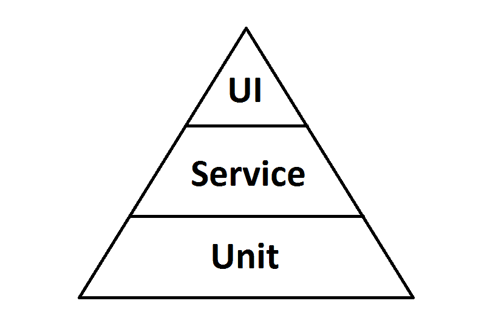
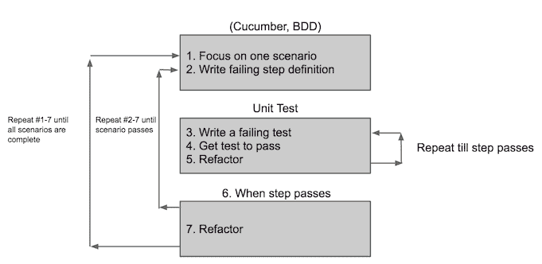
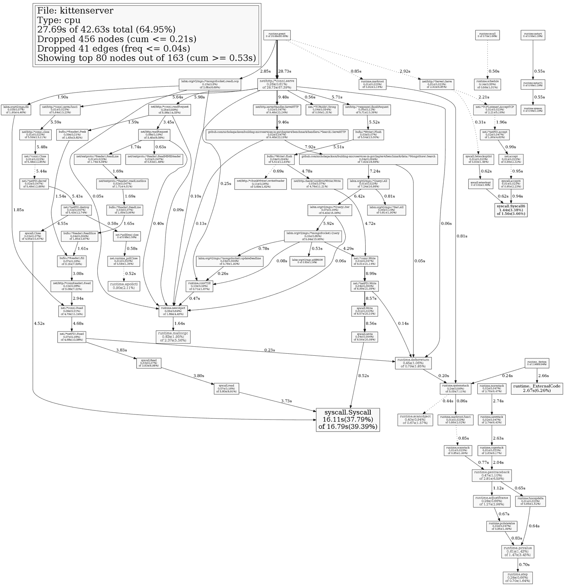

# 第四章：测试

当你试图定义什么是测试时，你会得到各种各样的答案，我们中的许多人直到被有缺陷的软件烧伤或试图更改没有测试的复杂代码库时，才真正理解测试的全部好处。

当我试图定义测试时，我得到了以下定义：

“良好的夜晚睡眠的艺术是知道你不会因为支持电话而被吵醒，以及在不断变化的市场中能够自信地更改你的软件所带来的安心感。”

好吧，所以我试图讲一个笑话，但这个概念是正确的。没有人喜欢调试糟糕的代码，确实，没有人喜欢系统失败时带来的压力。从质量第一的咒语开始可以缓解许多这些问题。

在过去的 20 年里，像 TDD 这样的技术已经变得司空见惯。在某些情况下，它并不像我希望的那样普遍，但至少人们现在在谈论测试了。在某种程度上，我们要感谢敏捷联盟：

逐步释放的原则提供了显著的商业效益；然而，频繁地逐步释放的缺点（或从你的观点来看是好处）是，你不能再在发布到市场之前花上三个月的时间运行回归测试套件。

在我的办公室里，上下文切换是最大的抱怨之一。没有人喜欢放下手头的工作去调查可能是由他们或甚至是一个同事几个月或几年前完成的工作中的问题。我们希望向前推进；为了确保我们能这样做，我们必须确保我们之前交付的内容符合规格，并且质量足够高以满足客户的要求。

我还提到了定义上的变化，而变化的最大问题之一是担心你正在进行的更改可能会对系统的另一部分产生不良影响。这种影响适用于微服务，也适用于大型单体系统。

如果我告诉你，易于测试的代码的副作用可能是编写得很好的代码，这种代码松散耦合并且具有正确的抽象？

然而，测试并不仅仅是关于开发者的：确实需要有人从代码库中分离出来进行手动测试。这种探索性测试可以揭示缺失的需求或错误的假设。本身，这是一个专业领域，远远超出了本书的范围，所以我们将会集中讨论你应该进行的测试类型。

# 测试金字塔

Mike Cohn 因在其书籍《成功实施敏捷》中创造了测试金字塔的概念而受到赞誉。这个概念是，你运行成本最低（最快）的测试，即单元测试，位于金字塔的底部；服务级别集成测试位于此之上，而在金字塔的顶端，你放置完整的端到端测试，这是成本最高的元素。因为这是一个金字塔，随着你向上移动金字塔，测试的数量会减少。



在自动化测试的早期，所有的测试都是在金字塔的顶端完成的。虽然从质量角度来看这确实有效，但它意味着调试有问题的区域的过程将会极其复杂且耗时。如果你很幸运，可能会出现完全失败的情况，这可以通过堆栈跟踪来追踪。如果你不幸，那么问题可能是行为上的；即使你完全了解系统，你也可能需要翻阅数千行代码并手动重复操作来重现失败。

# 从外向内开发

在编写测试时，我喜欢遵循一个称为从外向内开发的过程。在从外向内开发中，你首先几乎在金字塔的顶端编写测试，确定你正在工作的故事的功能，然后为这个故事编写一些失败的测试。然后你开始实现单元测试和代码，这开始让行为测试的各个步骤通过。



这个初始规范也成为了你系统的活文档。我们将在本章后面更详细地介绍如何创建它，但大多数情况下，它是以**Gherkin**这样的语言编写的，并且是由一个包含领域专家（如产品所有者、开发人员和测试专家）的团队共同定义的。Gherkin 背后的意图是创建一个每个人都理解的全局语言。这种普遍使用的语言使用具有特殊意义的动词和名词，几乎总是特定于领域，但也应该对外部人员是可理解的。

```go
Feature: As a user when I call the search endpoint, I would like to receive a list of kittens

```

功能是敏捷环境中由产品所有者拥有的故事。然后功能被分解为场景，这些场景更详细地说明了代码必须具备的、可接受的特性。

```go
Scenario: Invalid query
 Given I have no search criteria 
 When I call the search endpoint 
 Then I should receive a bad request message 

```

当我们稍后进入 BDD 部分时，我们将更深入地探讨这个问题；我们还将查看一个用于编写和执行 Cucumber 规范的 Go 框架。现在，然而，我将通过向您展示如何在 Go 中编写优秀的单元测试来打破“自外向内”开发规则。我们即将学习的概念在我们开始研究 BDD 时将非常有用，因此我认为最好我们先了解它们。像前面的章节一样，在阅读本章时，手头有源代码会很有用；您可以从以下位置克隆代码：[`github.com/building-microservices-with-go/chapter4.git`](https://github.com/building-microservices-with-go/chapter4.git)

# 单元测试

我们的单元测试直接到底层的金字塔。这本书从未打算成为 TDD 的教程，有太多更好的地方可以学习。然而，我们将查看 Go 中内置的测试框架。在我们这样做之前，让我们先提醒自己由 Bob Martin 叔叔在他的书《Clean Code》中定义的三个测试定律：

+   **第一定律**：在你编写失败的单元测试之前，你不得编写生产代码

+   **第二定律**：你不得编写超过足够失败的单元测试，不编译即视为失败

+   **第三定律**：你不得编写超过足够通过当前失败的测试的生产代码

在 Go 中对微服务进行测试的最有效方法之一不是陷入通过 HTTP 接口执行所有测试的陷阱。我们需要开发一种模式，避免为测试我们的处理程序创建物理 Web 服务器，创建这种测试的代码运行速度慢，编写起来极其繁琐。我们需要做的是将我们的处理程序及其内部的代码作为单元测试来测试。这些测试将比通过 Web 服务器进行测试运行得更快，如果我们考虑覆盖率，我们将在执行请求到运行服务器的 Cucumber 测试中测试处理程序的连接，这总体上为我们提供了代码的 100%覆盖率。

`main.go`

```go
  10 func main() { 
  11   err := http.ListenAndServe(":2323", &handlers.SearchHandler{}) 
  12   if err != nil { 
  13     log.Fatal(err) 
  14   } 
  15 } 

```

你将在主函数中看到我们将处理程序拆分到一个单独的包中。以这种方式拆分代码允许我们单独测试这些处理程序，所以让我们继续为我们的`SearchHandler`编写一些单元测试。

习惯上，我们将在与它们所属的包相同的文件夹中定义我们的测试文件，并将它们命名为它们要测试的文件名，后面跟`_test`。在我们的例子中，我们将为位于`handlers/search.go`文件中的`SearchHandler`编写一些测试；因此，我们的测试文件将被命名为`handlers/search_test.go`。

测试方法的签名看起来像这样：

```go
func TestXxx(*testing.T) 

```

测试名称必须有一个特定的名称，以`Test`开头，然后紧接着是一个大写字母或数字。因此，我们不能将我们的测试命名为`TestmyHandler`，但我们可以将其命名为`Test1Handler`或`TestMyHandler`。

再次，借鉴 Uncle Bob 的智慧，我们需要像对待生产代码中的方法名称一样仔细考虑我们的测试名称。

我们将要编写的第一个测试是验证请求中是否已发送搜索条件，其实现将如下所示：

```go
   9 func TestSearchHandlerReturnsBadRequestWhenNoSearchCriteriaIsSent(t *testing.T) { 
  10   handler := SearchHandler{} 
  11   request := httptest.NewRequest("GET", "/search", nil) 
  12   response := httptest.NewRecorder() 
  13 
  14   handler.ServeHTTP(response, request) 
  15 
  16   if response.Code != http.StatusBadRequest { 
  17     t.Errorf("Expected BadRequest got %v", response.Code) 
  18   } 
  19 } 

```

`net/http/httptest`包为我们提供了两个出色的方便方法`NewRequest`和`NewResponse`，如果你熟悉单元测试的概念，那么其中一个基本原理是隔离依赖。我们经常用 Mock 或 Spies 替换依赖项，这样我们就可以在不执行依赖项中的代码的情况下测试我们的代码的行为。这两个函数使我们能够做到这一点；它们生成依赖对象的 Mock 版本`http.Request`和`http.ResponseWriter`。

# httptest.NewRequest

我们需要特别注意的第一行是第**11**行：`net/http/httptest`包为我们提供了一些方便的方法。`NewRequest`方法返回一个传入的服务器请求，然后我们可以将其传递给我们的`http.Handler`：

```go
func NewRequest(method, target string, body io.Reader) *http.Request 

```

我们可以向方法和方法的目标传递参数，目标可以是路径或绝对 URL。如果我们只传递一个路径，那么`example.com`将用作我们的主机设置。最后，我们可以提供一个`io.Reader`文件，它将对应于请求的主体；如果我们不传递 nil 值，则`Request.ContentLength`被设置。

# httptest.NewRecorder

在第**12**行，我们正在创建一个`ResponseRecorder`类型：这将是我们传递给处理器的`ResponseWriter`实例。因为处理器没有返回函数来验证正确操作，我们需要检查已经写入输出的内容。`ResponseRecorder`类型是`http.ResponseWriter`的一个实现，它正是这样做的：它记录我们所做的所有更改，以便稍后可以对它进行断言。

```go
type ResponseRecorder struct { 
         Code      int           // the HTTP response code from WriteHeader 
         HeaderMap http.Header   // the HTTP response headers 
         Body      *bytes.Buffer // if non-nil, the bytes.Buffer to append written data to 
         Flushed   bool 
         // contains filtered or unexported fields 
 } 

```

我们需要做的只是调用`ServeHTTP`方法，并带上我们的模拟请求和响应，然后断言我们得到了正确的结果。

Go 没有像 RSpec 或 JUnit 那样的断言库。我们将在本章后面部分查看第三方框架，但到目前为止，让我们专注于标准包。

在第**16**行，我们正在检查从处理器返回的响应代码是否等于预期的代码`http.BadRequest`。如果不是，那么我们就调用测试框架上的 Errorf 方法。

**ErrorF**

```go
func (c *T) Errorf(format string, args ...interface{}) 

```

`Errorf`函数接受一个格式字符串的参数和一个可变数量的参数列表；在调用`Fail`之前，它内部调用`Logf`方法。

如果我们通过运行命令`go test -v -race ./...`来运行我们的测试，我们应该看到以下输出：

```go
=== RUN   TestSearchHandlerReturnsBadRequestWhenNoSearchCriteriaIsSent
--- FAIL: TestSearchHandlerReturnsBadRequestWhenNoSearchCriteriaIsSent (0.00s)
 search_test.go:17: Expected BadRequest got 200
 FAIL
 exit status 1
 FAIL    github.com/nicholasjackson/building-microservices-in-
 go/chapter5/handlers    0.016s

```

`-v` 标志将以详细模式打印输出，并且它还会打印出应用程序写入输出的所有文本，即使测试成功。

`-race` 标志启用了 Go 的竞态检测器，它可以检测并发问题中的错误。当两个 Go 线程同时访问同一个变量，并且至少有一个访问是写入时，就会发生数据竞争。竞态标志会给你的测试运行增加一点开销，所以我建议你将其添加到所有执行中。

使用 `-./...` 作为我们的最终参数允许我们在当前文件夹以及子文件夹中运行所有测试，这使我们免去了手动构建要测试的包或文件列表的麻烦。

现在我们有一个失败的测试，我们可以继续编写实现来使测试通过：

```go
 18   decoder := json.NewDecoder(r.Body) 
 19   defer r.Body.Close() 
 20 
 21   request := new(searchRequest) 
 22   err := decoder.Decode(request) 
 23   if err != nil { 
 24     http.Error(rw, "Bad Request", http.StatusBadRequest) 
 25     return 
 26   } 

```

当我们重新运行测试时，我们可以看到它们已经成功：

```go
=== RUN   TestSearchHandlerReturnsBadRequestWhenNoSearchCriteriaIsSent
--- PASS: TestSearchHandlerReturnsBadRequestWhenNoSearchCriteriaIsSent (0.00s)
PASS
ok      github.com/nicholasjackson/building-microservices-in-go/chapter5/handlers    1.022s

```

这个输出很棒；但如果将空字符串传递给请求被视为失败呢？是时候写另一个测试了：

```go
  23 func TestSearchHandlerReturnsBadRequestWhenBlankSearchCriteriaIsSent(t *testing.T) { 
  24   handler := SearchHandler{} 
  25   data, _ := json.Marshal(searchRequest{}) 
  26   request := httptest.NewRequest("POST", "/search", bytes.NewReader(data)) 
  27   response := httptest.NewRecorder() 
  28 
  29   handler.ServeHTTP(response, request) 
  30 
  31   if response.Code != http.StatusBadRequest { 
  32     t.Errorf("Expected BadRequest got %v", response.Code) 
  33   } 
  34 } 

```

这个测试与上一个非常相似；唯一的区别是我们正在将一些 JSON 传递到请求体中。虽然这个测试会正确失败，但我们应该从 Uncle Bob 那里吸取教训，对这个测试进行重构以使其更易于阅读：

```go
  21 func TestSearchHandlerReturnsBadRequestWhenBlankSearchCriteriaIsSent(t *testing.T) { 
  22   r, rw, handler := setupTest(&searchRequest{}) 
  23 
  24   handler.ServeHTTP(rw, r) 
  25 
  26   if rw.Code != http.StatusBadRequest { 
  27     t.Errorf("Expected BadRequest got %v", rw.Code) 
  28   } 
  29 } 

```

我们已经重构了测试，添加了一个共享于两个测试的设置方法，其背后的意图是保持我们的测试专注于三个核心领域：

+   设置

+   执行

+   断言

重复代码的糟糕测试可能比糟糕的代码更糟糕：你的测试应该是清晰、易于理解的，并且包含你会在生产代码中添加的相同关注。

现在，如果测试失败，我们可以继续更新我们的代码来实现这个功能：

```go
23 if err != nil || len(request.Query) < 1 { 
24     http.Error(rw, "Bad Request", http.StatusBadRequest) 
25     return 
26   } 

```

我们需要做的只是对 `if` 语句进行简单的修改。随着我们的系统复杂性增加，我们发现更多关于构成无效搜索查询的情况，我们将将其重构为单独的方法；但，目前，这是我们使测试通过所需的最小修改。

# 依赖注入和模拟

为了使返回 `Search` 处理器项的测试通过，我们需要一个数据存储。无论我们是在数据库中实现数据存储还是在简单的内存存储中实现，我们都不想在实际的数据存储上运行我们的测试，因为我们将会检查数据存储和我们的处理器。因此，我们需要管理处理器上的依赖，以便在测试中替换它们。为此，我们将使用一种称为依赖注入的技术，我们将通过传递依赖项到处理器而不是在内部创建它们来实现这一点。

这个方法允许我们在测试处理器时用存根或模拟来替换这些依赖，这样我们就可以控制依赖的行为并检查调用代码对此的反应。

在我们做任何事情之前，我们需要创建我们的依赖。在我们的简单示例中，我们将创建一个内存数据存储，它有一个单独的方法：

```go
Search(string) []Kitten 

```

要用模拟替换类型，我们需要将我们的处理器修改为依赖于代表我们的数据存储的接口。然后我们可以用实际的数据存储或存储的模拟实例来交换，而无需更改底层代码：

```go
 type Store interface { 
     Search(name string) []Kitten 
 } 

```

我们现在可以继续创建这个实现的代码。由于这是一个简单的示例，我们将将小猫的列表硬编码为一个切片，并且搜索方法将只从匹配作为参数给出的标准的小猫名称的切片中进行选择。

好的，太棒了；我们现在已经创建了数据存储，所以让我们看看我们将如何修改我们的处理器以接受这个依赖项。这很简单：因为我们创建了一个实现了 `ServeHTTP` 方法的结构体，我们只需将我们的依赖项添加到这个结构体上：

```go
 Search { 
     Store data.Store 
 } 

```

注意我们是如何使用接口的引用而不是具体类型，这允许我们将这个对象与实现存储接口的任何东西进行交换。

现在，回到我们的单元测试：我们希望确保，当我们用搜索字符串调用 `ServeHTTP` 方法时，我们正在查询数据存储并返回其中的小猫。

要做到这一点，我们将创建数据存储的模拟实例。我们可以自己创建模拟；然而，Matt Ryer 有一个非常好的包，他碰巧也是 Packt 的作者。Testify ([`github.com/stretchr/testify.git`](https://github.com/stretchr/testify.git)) 有一个功能齐全的模拟框架，带有断言。它还有一个用于测试测试中对象相等性的优秀包，并消除了我们不得不编写的许多样板代码。

在数据包中，我们将创建一个名为 `mockstore.go` 的新文件。这个结构将是我们的数据存储模拟实现：

```go
5 // MockStore is a mock implementation of a datastore for testing purposes 
6 type MockStore struct { 
7   mock.Mock 
8 } 
9 
10 //Search returns the object which was passed to the mock on setup 
11 func (m *MockStore) Search(name string) []Kitten { 
12   args := m.Mock.Called(name) 
13 
14   return args.Get(0).([]Kitten) 
15 } 

```

在第 **6** 行，我们定义了我们的 `MockStore` 对象。这没有什么不寻常的，除了你会注意到它嵌入了 `mock.Mock` 类型。嵌入 Mock 将给我们 `mock.Mock` 结构体上的所有方法。

当我们编写搜索方法的实现时，我们首先调用 `Called` 方法，并传递发送到 `Search` 的参数。内部，模拟包正在记录这个方法被调用以及传递了什么参数，这样我们就可以稍后针对它编写断言：

```go
 args := m.Mock.Called(name) 

```

最后，我们返回 `args.Get(0).(Kitten)`。当我们调用 `Called` 方法时，模拟返回我们设置中提供的参数列表。我们将这些参数转换为我们的输出类型，并返回给调用者。让我们快速看一下测试方法，看看它是如何工作的。

第 **57** 行是测试设置的开始。我们首先要做的是创建我们的 `MockStore` 实例。然后，我们将这个实例设置为 `Search` 处理器的依赖项。如果我们回溯到文件的第 **38** 行，你会看到我们在 `mockStore` 上调用 `On` 方法。`On` 方法是模拟的设置方法，其签名如下：

```go
func (c *Call) On(methodName string, arguments ...interface{}) *Call 

```

如果我们不使用参数`Search`调用`On`方法，那么当我们调用代码中的`Search`方法时，测试将抛出一个异常，表示`Search`已被调用但尚未设置。我喜欢使用模拟而不是简单的存根的一个原因就是这种能力，可以断言一个方法已被调用，并且我们可以明确地规定代码被测试可以表现出的行为。这样我们可以确保我们没有做那些输出未经测试的工作。

在我们的例子中，我们设置的条件是，当`Search`方法使用参数`Fat Freddy's Cat`被调用时，我们希望返回一个包含小猫的数组。

假设我们在数据存储上调用`Search`方法，并传递 HTTP 响应中发送的查询。以这种方式使用断言是一种方便的技术，因为它允许我们测试不愉快的路径，例如当数据存储可能由于内部错误或其他原因而无法返回数据时。如果我们试图使用集成测试来测试这个，可能会很难说服数据库按需失败。

为什么不花五分钟作为一个小练习，然后继续编写这段代码来完成？

所有这些都工作了吗？如果没有，别担心，你只需查看示例代码，看看你哪里出了错，但我希望这个过程是有用的。你可以看到，你可以通过两层测试来采取一种有节制的做法，从而产生一个可工作的应用程序。这些测试现在是你的安全网：无论何时你更改代码以添加新功能，你都可以确信你没有无意中破坏了某些东西。

# 代码覆盖率

代码覆盖率是一个很好的指标，可以确保你编写的代码有足够的覆盖率。

获取测试覆盖率的最简单方法是在执行测试时使用`-cover`选项：

```go
go test -cover ./...  

```

如果我们在示例代码根目录中运行这段代码，我们会看到以下输出：

```go
$go test -cover ./...
? github.com/building-microservices-with-go/chapter4 [no test files]
ok github.com/building-microservices-with-go/chapter4/data 0.017s coverage: 20.0% of statements
ok github.com/building-microservices-with-go/chapter4/features 0.018s coverage: 0.0% of statements [no tests to run]
ok github.com/building-microservices-with-go/chapter4/handlers 0.018s coverage: 100.0% of statements

```

现在我们处理器的样子看起来很漂亮：我们对这个包的覆盖率达到了 100%。然而，我们的数据包只报告了 20%的覆盖率。在我们对此过于担忧之前，让我们看看我们正在尝试测试的内容。

如果我们首先检查`datastore.go`文件，这只是一个接口，因此没有测试文件；然而，`memorystore.go`有。这个文件对这个文件的测试覆盖率达到了 100%。让我们失望的文件是我们的模拟类和我们的 MongoDB 实现。

现在我对模拟类型不太关心，但 Mongo 存储是一个有趣的问题。

由于依赖于 MongoDB，这种类型将非常难以测试。我们可以创建 Mongo 包的模拟实现来测试我们的代码，但这可能比实现更复杂。然而，在这个类中，我们有一些关键区域可能会出错。考虑第**26**行：

```go
c := s.DB("kittenserver").C("kittens") 

```

这行代码从数据库`kittenserver`中检索集合`kittens`。如果我们在这里犯了一个简单的拼写错误，那么我们的应用程序将无法工作。我们不希望等到代码进入生产环境后才发现这个问题。我们也不想手动测试这个，因为在更大的应用程序中，这可能会非常耗时。集成测试确实是我们的 Cucumber 测试大放异彩的地方。如果你还记得，我们正在编写一些非常高级的端到端测试，以确保我们的 API 输入产生正确的输出。因为这是针对实际数据库运行的，如果我们犯了这样的错误，那么它就会被捕捉到。所以，虽然 Go 覆盖率报告显示我们没有覆盖，但这是因为我们有更高层次的测试，Go 测试没有查看，所以我们是有覆盖的。我们可能遇到问题的核心区域是省略了第**23**行。

如果我们在打开数据库后没有关闭连接，我们将泄漏连接；过一段时间后，我们可能会发现我们无法再打开另一个，因为连接池已经耗尽。没有简单的方法来测试这个问题，但是，然而，有一种方法可以在部署后捕捉到这个问题。当我们查看第七章中的日志和监控 Chapter 7，*日志和* *监控*时，我们将看到我们如何将这些信息暴露出来，以帮助我们确保我们的生产系统正常运行。

# 行为驱动开发

**行为驱动开发**（**BDD**）是一种通常由名为**Cucumber**的应用框架执行的技术。它是由丹·诺斯（Dan North）开发的，旨在在开发人员和产品所有者之间建立一个共同的基础。从理论上讲，应该可以使用 BDD 对系统的完整覆盖进行测试；然而，由于这将创建大量运行缓慢的测试，这不是最佳方法。我们应该做的是定义我们系统的边界，并且我们可以将粒度留给我们的单元测试。

在我们的“三个朋友”小组中，我们讨论特性的各个方面以及它的基本质量，并开始编写场景。

**悲伤路径**

```go
Scenario: User passes no search criteria    
  Given I have no search criteria 
  When I call the search endpoint 
  Then I should receive a bad request message 

```

**快乐路径**

```go
Scenario: User passes valid search criteria    
  Given I have valid search criteria 
  When I call the search endpoint 
  Then I should receive a list of kittens 

```

这些场景是一个非常简单的例子，但我认为你可以理解，当与非技术人员使用这种语言时，提出这些描述将会非常直接。从自动化的角度来看，我们接下来要做的就是编写与每个`Given`、`When`和`Then`语句相对应的步骤。

对于这本书，我们将探讨 GoDog 框架，它允许我们使用 Go 实现步骤定义。我们首先需要安装应用程序，你可以通过运行以下命令来完成：`fgo get github.com/DATA-DOG/godog/cmd/godog`

如果我们查看`features/search.feature`，我们可以看到我们已经实现了这个功能和场景。

如果我们在创建特性之前运行 `godog ./` 命令来运行这些测试，我们应该看到以下错误信息：

```go
Feature: As a user when I call the search endpoint, I would like to receive a list of kittens

Scenario: Invalid query                       
# features/search.feature:4
 Given I have no search criteria
 When I call the search endpoint
 Then I should receive a bad request message

Scenario: Valid query                     
# features/search.feature:9
 Given I have valid search criteria
 When I call the search endpoint
 Then I should receive a list of kittens

2 scenarios (2 undefined)
6 steps (6 undefined)
321.121µs

```

您可以使用这些片段为未定义的步骤实现步骤定义：

```go
func iHaveNoSearchCriteria() error { 
    return godog.ErrPending 
} 

func iCallTheSearchEndpoint() error { 
    return godog.ErrPending 
} 

func iShouldReceiveABadRequestMessage() error { 
    return godog.ErrPending 
} 

func iHaveAValidSearchCriteria() error { 
    return godog.ErrPending 
} 

func iShouldReceiveAListOfKittens() error { 
    return godog.ErrPending 
} 

func FeatureContext(s *godog.Suite) { 
    s.Step(`^I have no search criteria$`, iHaveNoSearchCriteria) 
    s.Step(`^I call the search endpoint$`, iCallTheSearchEndpoint) 
    s.Step(`^I should receive a bad request message$`, iShouldReceiveABadRequestMessage) 
    s.Step(`^I have a valid search criteria$`, iHaveAValidSearchCriteria) 
    s.Step(`^I should receive a list of kittens$`, iShouldReceiveAListOfKittens) 
} 

```

有用的是，这为我们执行步骤提供了模板；一旦我们实现这一点并重新运行命令，我们会得到不同的消息：

```go
Feature: As a user when I call the search endpoint, I would like to receive a list of kittens

 Scenario: Invalid query                       # search.feature:4
 Given I have no search criteria             # search_test.go:6 -> github.com/nicholasjackson/building-microservices-in-go/chapter5/features.iHaveNoSearchCriteria
 TODO: write pending definition
 When I call the search endpoint
 Then I should receive a bad request message

 Scenario: Valid query                     # search.feature:9
 Given I have a valid search criteria    # search_test.go:18 -> github.com/nicholasjackson/building-microservices-in-go/chapter5/features.iHaveAValidSearchCriteria
 TODO: write pending definition
 When I call the search endpoint
 Then I should receive a list of kittens

 2 scenarios (2 pending)
 6 steps (2 pending, 4 skipped)
 548.978µs  

```

我们现在可以开始填写那些应该失败的步骤的详细信息，因为我们还没有编写代码。

我们可以使用纯 Go 实现我们的代码，这使我们能够使用任何接口和包。看看与 `iCallTheSearchEndpoint` 方法对应的示例：

```go
23 func iCallTheSearchEndpoint() error { 
24   var request []byte 
25 
26   response, err = http.Post("http://localhost:2323", "application/json", bytes.NewReader(request)) 
27   return err 
28 } 
29 
30 func iShouldReceiveABadRequestMessage() error { 
31   if response.StatusCode != http.StatusBadRequest { 
32     return fmt.Errorf("Should have recieved a bad response") 
33   } 
34 
35   return nil 
36 } 

```

现在我们实现了一些测试，我们应该运行 Cucumber 测试，因为一些步骤应该通过。为了测试系统，我们需要启动我们的主要应用程序；我们可以将主函数拆分出来成为一个 `StartServer` 函数，这个函数可以直接从 Cucumber 中调用。然而，这忽略了我们在主函数中忘记调用 `StartServer` 的事实。因此，最好的方法是使用 Cucumber 测试从外部测试整个应用程序。

要做到这一点，我们将在 `features/search_test.go` 文件中添加几个新的函数：

```go
59 func FeatureContext(s *godog.Suite) { 
60   s.Step(`^I have no search criteria$`, iHaveNoSearchCriteria) 
61   s.Step(`^I call the search endpoint$`, iCallTheSearchEndpoint) 
62   s.Step(`^I should receive a bad request message$`, iShouldReceiveABadRequestMessage) 
63   s.Step(`^I have a valid search criteria$`, iHaveAValidSearchCriteria) 
64   s.Step(`^I should receive a list of kittens$`, iShouldReceiveAListOfKittens) 
65 
66   s.BeforeScenario(func(interface{}) { 
67     startServer() 
68     fmt.Printf("Server running with pid: %v", server.Process.Pid) 
69   }) 
70 
71   s.AfterScenario(func(interface{}, error) { 
72     server.Process.Kill() 
73   }) 
74 } 
75 
76 var server *exec.Cmd 
77 
78 func startServer() { 
79   server = exec.Command("go", "run", "../main.go") 
80   go server.Run() 
81   time.Sleep(3 * time.Second) 
82 } 

```

在第 **66** 行，我们正在使用 `godog` 上的 `BeforeScenario` 方法：这允许我们在场景开始之前运行一个函数。我们会用这个来清理数据存储中的任何数据，但在我们的简单示例中，我们只是将要启动应用程序服务器。在本章的后面部分，我们将查看一个更复杂的示例，该示例使用 Docker Compose 启动包含我们的服务器和数据库的容器堆栈。

`startServer` 函数会启动一个新的进程来运行 `go run ../main.go`。我们必须在 `gofunc` 中运行这个命令，因为我们不希望测试被阻塞。第 **81** 行包含一个短暂的暂停，以查看我们的服务器是否已启动。实际上，我们应该检查 API 的健康端点，但现在这已经足够了。

行 **71** 将在场景结束后执行并拆解我们的服务器。如果我们不这样做，那么下次我们尝试启动服务器时将会失败，因为进程已经运行并且绑定到了端口。

让我们继续运行我们的 Cucumber 测试，输出应该看起来像这样：

```go
Feature: As a user when I call the search endpoint, I would like to receive a list of kittens
 Server running with pid: 91535
 Scenario: Invalid query                       # search.feature:4
 Given I have no search criteria             # search_test.go:17 -> github.com/building-microservices-with-go/chapter4/features.iHaveNoSearchCriteria
 When I call the search endpoint             # search_test.go:25 -> github.com/building-microservices-with-go/chapter4/features.iCallTheSearchEndpoint
 Then I should receive a bad request message # search_test.go:32 -> github.com/building-microservices-with-go/chapter4/features.iShouldReceiveABadRequestMessage
 Server running with pid: 91615
 Scenario: Valid query                     # search.feature:9
 Given I have a valid search criteria    # search_test.go:40 -> github.com/building-microservices-with-go/chapter4/features.iHaveAValidSearchCriteria
 Do not have a valid criteria
 When I call the search endpoint
 Then I should receive a list of kittens

 --- Failed scenarios:

 search.feature:10

 2 scenarios (1 passed, 1 failed)
 6 steps (3 passed, 1 failed, 2 skipped)
 6.010954682s
 make: *** [cucumber] Error 1  

```

完美！我们正在取得进展，一些步骤现在正在通过，其中一个特性正在通过。我们现在可以继续完成这些测试，但首先，我们需要看看我们如何使用 Docker Compose 来测试真实数据库。

# 使用 Docker Compose 进行测试

到目前为止，这是一个相对简单的实现，但作为一个现实世界的例子，它并不特别有用。你找到自己只包含三个项目的内存数据存储的情况将会非常罕见。通常情况下，你将使用一个功能数据库。当然，真实数据库和我们的代码之间的集成需要测试；我们需要确保数据存储的连接是正确的，并且我们发送给它的查询是有效的。

要做到这一点，我们需要启动一个真实数据库，而为了做到这一点，我们可以使用 Docker-Compose，因为它是一种启动依赖项的绝佳方式。

在我们的示例文件 `docker-compose.yml` 中，我们有以下内容：

```go
version: '2' 
services: 
  mongodb: 
    image: mongo 
    ports: 
      - 27017:27017 

```

当我们运行 `docker-compose up` 命令时，我们将下载 MongoDB 的镜像并启动一个实例，在本地主机上暴露这些端口。

现在，我们需要在我们的项目中创建一个新的结构体，该结构体将实现存储接口。然后我们可以对真实数据库执行命令，而不是使用模拟或简单的内存存储。

`MongoStore` 的实现相当直接。查看 `data/monogstore.go` 文件，你会看到我们有两个未在接口中定义的额外方法，即：

```go
DelleteAllKittens 
InsertKittens 

```

这些内容在这里是因为我们需要它们来设置我们的功能测试。

如果我们查看我们的文件 `features/search_test.go`，你会看到我们在设置中添加了对 `FeatureContext` 方法的几个额外调用。

我们首先要做的是调用 `waitForDB` 方法：因为我们无法控制我们的 Mongo 实例何时准备好接受连接，所以在启动测试之前我们需要等待它。这个过程是这样的：我们将尝试使用便利方法 `NewMongoStore` 创建一个 `MongoStore` 实例，内部它执行以下工作：

```go
10 // NewMongoStore creates an instance of MongoStore with the given connection string 
11 func NewMongoStore(connection string) (*MongoStore, error) { 
12   session, err := mgo.Dial(connection) 
13   if err != nil { 
14     return nil, err 
15   } 
16 
17   return &MongoStore{session: session}, nil 
18 } 

```

`Dial` 方法尝试连接到连接字符串中指定的 MongoDB 实例。如果连接失败，则返回错误。在我们的代码中，如果我们收到错误，我们将这个错误返回给 `NewMongoStore` 的调用者，并返回我们结构体的 nil 实例。`waitForDB` 方法通过重复尝试创建此连接直到不再收到错误来工作。为了避免在数据库尝试启动时进行垃圾邮件发送，我们每次失败尝试后都会暂停一秒钟，最多暂停 10 秒。这个方法将阻塞主 Go 线程，但这是由设计决定的，因为我们不希望在确保我们有了这个连接之前执行测试：

```go
 98 func waitForDB() { 
 99   var err error 
100 
101   for i := 0; i < 10; i++ { 
102     store, err = data.NewMongoStore("localhost") 
103     if err == nil { 
104       break 
105     } 
106     time.Sleep(1 * time.Second) 
107   } 
108 } 

```

我们还在 `BeforeScenario` 设置中添加了一些代码：我们首先要做的是清除我们的数据库，删除任何之前的测试数据。清除数据是一个极其重要的步骤，因为如果我们有任何修改数据的函数，那么在每次运行后，我们不会得到可预测的测试结果。

最后，我们将 `setupData` 方法插入到测试数据中，然后我们将继续执行测试。

在我们可以测试我们的代码之前，我们有很多事情要做，我们需要运行 docker-compose，执行我们的测试，然后停止 docker-compose。一种高效地编写此过程的方法是使用 Makefiles，Makefiles 已经存在很长时间了，并且仍然是许多应用程序的主要软件构建机制。它们允许我们在简单的文本文件中定义命令，然后通过执行**make [command]**来运行这些命令。

如果我们查看示例存储库中的 Makefile 中的 Cucumber 命令，我们可以看到我们如何编写执行测试所需的步骤。我们使用`docker-compose`启动 Mongo 实例，运行 Cucumber 测试，然后再次拆毁数据库：

```go
cucumber: 
    docker-compose up -d 
    cd features && godog ./ 
    docker-compose stop 

```

当我们在运行测试之前启动数据库时，你可能想知道为什么我们还需要`waitForDB`方法，记住 Docker 只知道主进程何时执行。进程开始和准备好接受连接之间可能会有相当大的延迟。为了运行这个，我们从命令行运行`make cucumber`，结果应该是通过 cucumber 测试：

```go
$make cucumber
docker-compose up -d
chapter4_mongodb_1 is up-to-date
cd features && godog ./
Feature: As a user when I call the search endpoint, I would like to receive a list of kittens
Server running with pid: 88200
  Scenario: Invalid query # search.feature:4
    Given I have no search criteria # search_test.go:21 -> github.com/building-microservices-with-go/chapter4/features.iHaveNoSearchCriteria
    When I call the search endpoint # search_test.go:29 -> github.com/building-microservices-with-go/chapter4/features.iCallTheSearchEndpoint
    Then I should receive a bad request message # search_test.go:40 -> github.com/building-microservices-with-go/chapter4/features.iShouldReceiveABadRequestMessage
Server running with pid: 88468
  Scenario: Valid query # search.feature:9
    Given I have a valid search criteria # search_test.go:48 -> github.com/building-microservices-with-go/chapter4/features.iHaveAValidSearchCriteria
    When I call the search endpoint # search_test.go:29 -> github.com/building-microservices-with-go/chapter4/features.iCallTheSearchEndpoint
    Then I should receive a list of kittens # search_test.go:54 -> github.com/building-microservices-with-go/chapter4/features.iShouldReceiveAListOfKittens

2 scenarios (2 passed)
6 steps (6 passed)
7.028664s
docker-compose stop
Stopping chapter4_mongodb_1 ... done

```

这部分就到这里了，我们了解到，通过一些放置得当的模式，编写一个健壮的测试套件很容易，这将让我们安心地睡个好觉，而不是半夜起床诊断一个损坏的系统。在下一节中，我们将探讨 Go 的一些出色功能，以确保我们的代码快速且优化。

# 基准测试和性能分析

Go 有两种出色的方法来分析你的代码性能。我们有基准测试和出色的 pprof。

# 基准测试

基准测试是通过多次以固定工作量执行代码来衡量代码性能的一种方法。我们在第一章中简要介绍了这种方法，*微服务简介*，我们确定`json.Marshal`方法比`json.Encode`方法慢。虽然这是一个有用的功能，但我发现很难确定我应该基准测试什么。如果我在编写算法，那么这相对简单。然而，当编写主要与数据库交互的微服务时，这要困难得多。

为了展示在 Go 中执行基准测试是多么容易，请查看`chandlers/search_bench_test.go`：

```go
  11 func BenchmarkSearchHandler(b *testing.B) { 
  12   mockStore = &data.MockStore{} 
  13   mockStore.On("Search", "Fat Freddy's Cat").Return([]data.Kitten{ 
  14     data.Kitten{ 
  15       Name: "Fat Freddy's Cat", 
  16     }, 
  17   }) 
  18 
  19   search := Search{DataStore: mockStore} 
  20 
  21   for i := 0; i < b.N; i++ { 
  22     r := httptest.NewRequest("POST", "/search", 
         bytes.NewReader([]byte(`{"query":"Fat Freddy's Cat"}`))) 
  23     rr := httptest.NewRecorder() 
  24     search.ServeHTTP(rr, r) 
  25   } 
  26 } 

```

这段代码最重要的部分隐藏在第**21**行：

```go
for n := 0; n < b.N; n++ 

```

当运行基准测试时，Go 需要多次运行以获得准确的结果。基准测试将运行的次数是基准结构体上的字段`N`。在设置这个数字之前，Go 将执行你的代码的一些迭代以获得执行时间的近似测量。

我们将使用`go test-bench -benchmem`命令执行基准测试：

```go
go test -bench=. -benchmem
BenchmarkSearchHandler-8          50000         43183 ns/op       49142 B/op          68 allocs/op
PASS
ok      github.com/building-microservices-with-go/chapter4/handlers    2.495s  

```

在这里，我们传递一个额外的标志来查看每次执行的内存分配情况。我们知道，当使用模拟运行时，我们的处理程序执行需要 43,183 纳秒或 0.043183 毫秒，并执行了 68 次内存分配。如果代码在实际运行中也能这么快，那就太好了，但我们可能需要等待几年才能看到与数据库连接的 API 达到这种速度级别。

基准测试的另一个优点是，我们可以运行它们，并输出配置文件，这些配置文件可以与 pprof 一起使用：

```go
go test -bench=. -cpuprofile=cpu.prof -blockprofile=block.prof -memprofile=mem.prof  

```

此命令的输出将给我们更多关于时间和内存消耗位置的信息，并有助于我们正确优化代码。

# 分析

当我们想查看我们程序的速度时，我们可以采用的最佳技术是分析。分析在应用程序执行时自动采样运行中的应用程序；然后我们可以将数据，如特定函数的运行时间，计算到称为配置文件的统计摘要中。

Go 支持三种不同类型的分析：

+   **CPU**：标识需要最多 CPU 时间的任务

+   **Heap**：标识负责分配最多内存的语句

+   **Blocking**：标识负责最长时间阻塞 Go 例程的操作

如果我们想在我们的应用程序中启用分析，我们可以做两件事之一：

+   在启动文件中添加`import "net/http/pprof"`

+   手动启动分析

第一个选项是最直接的。您只需将其添加到主 Go 文件的开头，如果您还没有运行 HTTP 网络服务器，就启动一个：

```go
import _ "net/http/pprof" 

go func() { 
     log.Println(http.ListenAndServe("localhost:6060", nil)) 
 }() 

```

此方法随后在您的 HTTP 服务器上的`/debug/pprof/`路径下公开各种路径，然后可以通过 URL 访问。然而，这种做法的副作用是，当这个导入语句在您的 go 文件中时，您将进行性能分析，这不仅可能会减慢您的应用程序，而且您也不希望公开这些信息供公众消费。

另一种分析方法是，在启动应用程序时通过传递一些额外的命令行标志来启动分析器：

```go
19 var cpuprofile = flag.String("cpuprofile", "", "write cpu profile to 
   file") 
20 var memprofile = flag.String("memprofile", "", "write memory profile  
   to file") 
21 var store *data.MongoStore 
22 
23 func main() { 
24   flag.Parse() 
25 
26   if *cpuprofile != "" { 
27     fmt.Println("Running with CPU profile") 
28     f, err := os.Create(*cpuprofile) 
29     if err != nil { 
30       log.Fatal(err) 
31     } 
32     pprof.StartCPUProfile(f) 
33   } 
34 
35   sigs := make(chan os.Signal, 1) 
36   signal.Notify(sigs, syscall.SIGINT, syscall.SIGTERM) 
37 
38   go func() { 
39     <-sigs 
40     fmt.Println("Finished") 
41     if *memprofile != "" { 
42       f, err := os.Create(*memprofile) 
43       if err != nil { 
44         log.Fatal(err) 
45       } 
46       runtime.GC() 
47       pprof.Lookup("heap").WriteTo(f, 0) 
48       defer f.Close() 
49     } 
50     if *cpuprofile != "" { 
51       pprof.StopCPUProfile() 
52     } 
53 
54     os.Exit(0) 
55   }() 

```

在第**26**行，我们检查是否指定了用于 CPU 分析的输出文件，如果是，我们就创建文件，然后使用`pprof.StartCPUProfile(f)`启动分析器，并传递文件引用：

```go
func StartCPUProfile(w io.Writer) error 

```

`StartCPUProfile`函数为当前进程启用 CPU 分析，并将输出缓冲到`w`。在运行时，CPU 分析器大约每秒停止应用程序 100 次并记录数据。

要分析堆分配，我们使用一个稍微不同的命令：

```go
pprof.Lookup("heap").WriteTo(f, 0) 
func Lookup(name string) *Profile 

```

`Lookup()`函数返回具有给定名称的配置文件，如果没有这样的配置文件，则可用的预定义配置文件是：

```go
goroutine    - stack traces of all current goroutines 
heap         - a sampling of all heap allocations 
threadcreate - stack traces that led to the creation of new OS threads 
block        - stack traces that led to blocking on synchronization primitives 

fuc (p *Profile) WriteTo(w io.Writer, debug int) error 

```

`WriteTo` 将配置文件输出到指定的写入位置，以 pprof 格式。如果我们设置调试标志为 `1`，那么 `WriteTo` 将在函数名称和行号上添加注释，而不是像 pprof 使用的仅十六进制地址。这些注释是为了让你能够阅读文件而无需任何特殊工具。

如果你查看 `benchmark` 文件夹中的示例代码，你会找到一个示例配置文件以及生成它的二进制文件。

我们现在可以运行 pprof 工具来检查发生了什么。为此，我们需要在命令行上运行工具，并提供一个指向执行配置文件的二进制文件的引用，以及配置文件本身：

```go
go tool pprof ./kittenserver ./cpu.prof  

```

我们可以运行的 simplest 命令是 `top`。Top 将显示在我们的应用程序执行期间消耗了最多 CPU 的函数：

```go
Entering interactive mode (type "help" for commands) 
 (pprof) top 
 24460ms of 42630ms total (57.38%) 
 Dropped 456 nodes (cum <= 213.15ms) 
 Showing top 10 nodes out of 163 (cum >= 790ms) 
       flat  flat%   sum%        cum   cum% 
    16110ms 37.79% 37.79%    16790ms 39.39%  syscall.Syscall 
     2670ms  6.26% 44.05%     2670ms  6.26%  runtime._ExternalCode 
     1440ms  3.38% 47.43%     1560ms  3.66%  syscall.Syscall6 
      900ms  2.11% 49.54%      900ms  2.11%  runtime.epollctl 
      830ms  1.95% 51.49%     2370ms  5.56%  runtime.mallocgc 
      610ms  1.43% 52.92%     1470ms  3.45%  runtime.pcvalue 
      510ms  1.20% 54.12%      510ms  1.20%  runtime.heapBitsSetType 
      470ms  1.10% 55.22%     2810ms  6.59%  runtime.gentraceback 
      470ms  1.10% 56.32%      470ms  1.10%  runtime.memmove 
      450ms  1.06% 57.38%      790ms  1.85%  runtime.deferreturn 
 (pprof) 

```

在这种情况下，主要的违规者是 `syscall.Syscall`。如果我们查阅文档，我们会发现 syscall 包包含对低级操作系统原语的接口。

单独来看，这个输出并不特别有用，所以让我们生成一个调用图，它将显示更多细节。我们可以再次使用 pprof 工具来做这件事。然而，我们首先需要安装 Graphviz。如果你使用 macOS，可以使用 brew 来安装：

```go
brew install graphviz  

```

如果你使用基于 Linux 的系统并且有 apt 软件包管理器，你可以使用它：

```go
apt-get install graphviz  

```

这个输出的样子看起来是这样的 `benchmark/cpu.png`:



这相当令人印象深刻！然而，我们可以看到 `syscall.Syscall` 以最大的字体显示，因为它消耗了最多的 CPU。如果我们从这里开始，从底部开始回溯，我们可以看到这个问题的根源似乎是我们数据存储的搜索函数。

为了更详细地查看这是在哪里发生的，我们可以使用 list 命令，然后传递我们想要进一步调查的对象或方法的名称：

```go
Entering interactive mode (type "help" for commands)
(pprof) list Search
Total: 42.63s
ROUTINE ======================== github.com//building-microservices-with-go/chapter4/data.(*MongoStore).Search in github.com/building-microservices-with-go/chapter4/data/mongostore.go
 40ms      7.92s (flat, cum) 18.58% of Total
 .         .    16:
 .         .    17:    return &MongoStore{session: session}, nil
 .         .    18:}
 .         .    19:
 .         .    20:// Search returns Kittens from the MongoDB 
                      instance which have the name name
 40ms       40ms     21:func (m *MongoStore) Search(name string) 
                        []Kitten {
 .     270ms    22:    s := m.session.Clone()
 .      10ms    23:    defer s.Close()
 .         .    24:
 .      20ms    25:    var results []Kitten
 .      70ms    26:    c := s.DB("kittenserver").C("kittens")
 .     7.30s    27:    err := c.Find(Kitten{Name: 
                              name}).All(&results)
 .         .    28:    if err != nil {
 .         .    29:        return nil
 .         .    30:    }
 .         .    31:
 .     210ms    32:    return results
 .         .    33:}
 .         .    34:
 .         .    35:// DeleteAllKittens deletes all the kittens 
                      from the datastore
 .         .    36:func (m *MongoStore) DeleteAllKittens() {
 .         .    37:    s := m.session.Clone() 

```

当我们使用搜索方法做这件事时，我们可以看到我们的大部分 CPU 周期都花在了执行对 MongoDB 的查询上。如果我们查看来自 `syscall.Syscall` 的其他路由，它显示另一个大消费者是 `http.ResponseWriter` 接口。

这个输出都是有意义的，因为我们没有在我们的 API 中做任何特别聪明的事情；它只是从数据库中检索一些数据。pprof 的好处是我们可以使用相同的命令来查询堆的使用情况。

# 摘要

在本章中，你学习了一些在 Go 中测试微服务的最佳实践方法。我们查看测试包，包括一些处理请求和响应的特殊功能。我们还探讨了使用 Cucumber 编写集成测试。

然而，确保你的代码无故障运行只是工作的一部分，我们还需要确保我们的代码性能良好，Go 也提供了一些出色的工具来管理这一点。

我总是会建议你测试你的代码，并且要虔诚地这样做。至于性能优化，这无疑是一个值得讨论的话题，你无疑已经听到过这样的评论：过早的优化是万恶之源。然而，唐纳德·克努特（Donald Knuth）的这句话被误解了很多：他并不是说在你遇到问题之前永远不要优化；他说的是你应该只优化那些真正重要的东西。有了 pprof，我们有一个简单的方法来确定什么，如果有的话，实际上才是重要的。将性能分析实践纳入你的开发流程，你将拥有更快、更高效的应用程序，性能分析也是当你试图追踪那些棘手的错误时，更好地理解你的应用程序的绝佳技术。

“程序员们浪费了大量的时间在思考或担心他们程序中非关键部分的运行速度上，当考虑到调试和维护时，这些对效率的追求有着强烈的负面影响。我们应该忘记那些小的效率，比如说 97%的时间：过早的优化是万恶之源。然而，我们不应该错过那关键的 3%的机会。”

—— 唐纳德·克努特
