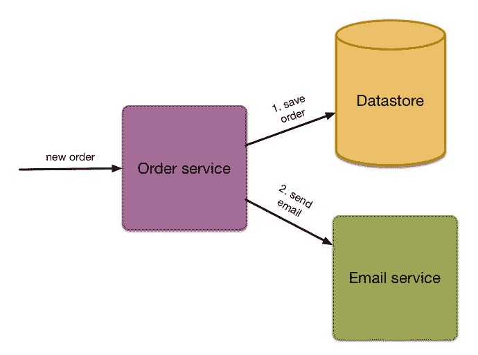
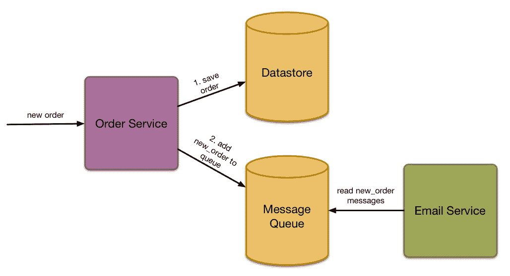
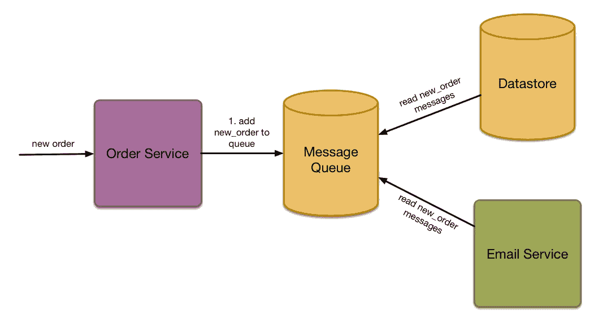
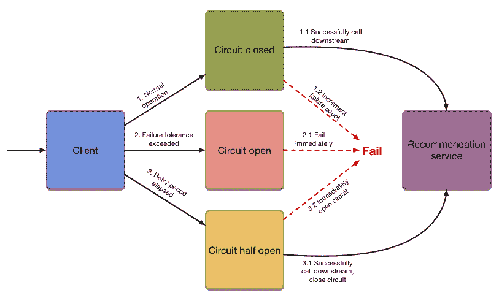
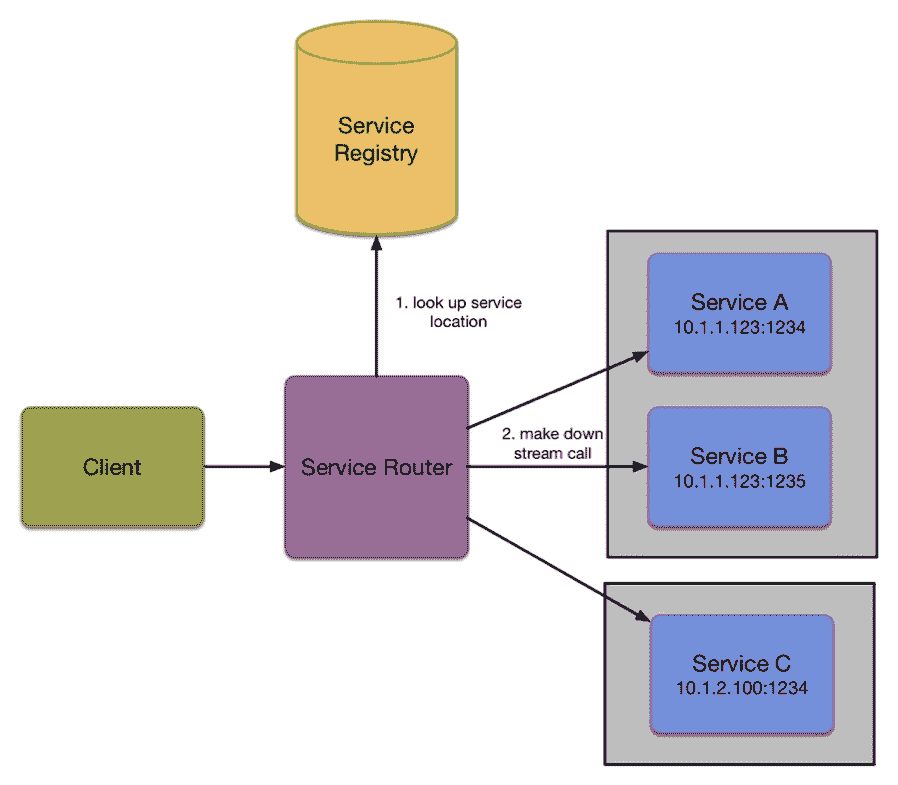
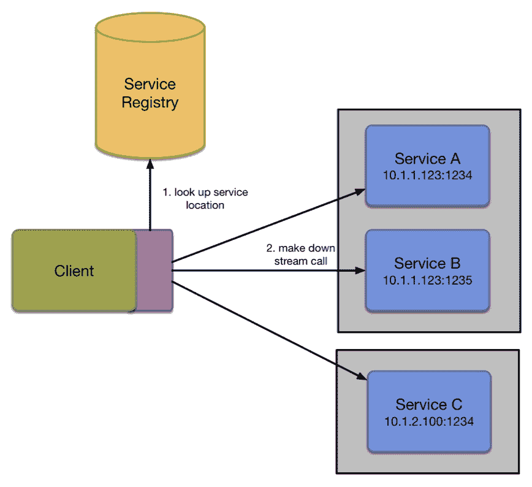
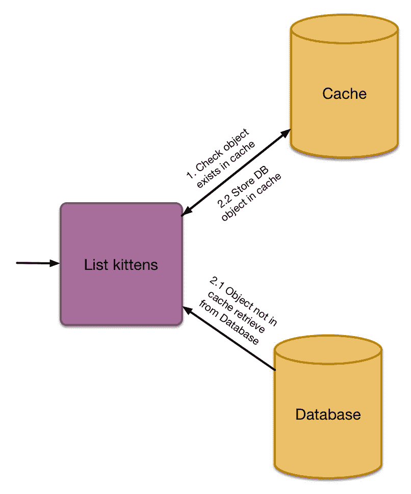

# 常见模式

在我们查看一些可以帮助你在 Go 中构建微服务的框架之前，我们应该首先看看一些可以帮助你避免失败的设计模式。

我不是在谈论像工厂或外观这样的软件设计模式，而是在谈论像负载均衡和服务发现这样的架构设计。如果你以前从未使用过微服务架构，那么你可能不会理解为什么需要这些，但我希望到本章结束时，你将有一个坚实的理解，为什么这些模式很重要，以及如何正确地应用它们。如果你已经成功部署了微服务架构，那么本章将为你提供更多关于使你的系统运行的基础模式的知识。如果你在微服务方面没有取得太多成功，那么可能你没有理解你需要我即将描述的模式。

通常，每个人都有适合的东西，我们将不仅查看核心模式，还会查看一些可以为我们做大部分繁重工作的出色开源软件。

本章中引用的示例可以在以下链接找到：[`github.com/building-microservices-with-go/chapter5.git`](https://github.com/building-microservices-with-go/chapter5.git)

# 失败设计

凡是可能出错的事情都会出错。

当我们构建微服务时，我们始终应该为失败做好准备。这有很多原因，但主要原因是云计算网络可能会出现故障，你失去了调整切换和路由的能力，如果你在数据中心运行它们，这将为你提供一个优化的系统。此外，我们倾向于构建微服务架构来自动扩展，这种扩展会导致服务以不可预测的方式启动和停止。

这对我们软件的意义在于，在讨论即将推出的功能时，我们需要提前考虑这种失败。然后我们需要从软件开始设计它，并且作为工程师，我们需要理解这些问题。

在他的书《设计数据密集型应用》中，马丁·克莱普曼提出了以下评论：

系统越大，其组件出现故障的可能性就越大。随着时间的推移，故障会被修复，新的东西会出问题，但在拥有数千个节点的系统中，合理地假设总会有东西是出故障的。如果错误处理策略只是放弃这样一个庞大的系统，那么这种方法永远不会成功。

虽然这适用于更重大的系统，但我认为，当你需要开始考虑由于连接性和依赖性导致的失败时，你的系统规模一旦达到*n+1*，这种情况就开始了。这个数字可能看起来很小，但它的相关性却非常强。考虑以下简单的系统：

您有一个简单的网站，允许您的用户（他们都是猫爱好者）注册接收其他猫爱好者的更新。更新以简单的每日电子邮件的形式提供，您希望在用户提交表单并将数据保存到数据库后发送欢迎邮件。因为您是一位优秀的微服务实践者，您已经意识到发送电子邮件不应是注册系统的责任，相反，您希望将这项任务委托给外部系统。在此期间，该服务越来越受欢迎；您确定可以通过利用 MailCo 的电子邮件 API 服务来节省时间和精力。这个服务有一个简单的 RESTful 协议，可以满足您当前的所有需求，这使您能够更快地进入市场。

下面的图表示了那个简单的微服务：



作为一位优秀的软件架构师，您为这个邮件功能定义了一个接口，它将作为实际实现的抽象。这个概念将允许您在以后快速替换 MailCo。发送电子邮件很快，所以没有必要做任何聪明的事情。我们可以在注册请求期间同步调用 MailCo。

这个应用程序看起来像是一个简单的问题，您以创纪录的时间完成了工作。该网站托管在 AWS 上，并配置了 ElasticScale，所以无论您得到什么负载，您都会安心地睡觉，不用担心网站会崩溃。

一天晚上，您的 CEO 参加了一个由新闻网络 CNN 报道的科技初创公司活动。她与记者交谈，这位记者也是一个猫爱好者，决定在明天的晚间特别报道中介绍这项服务。

兴奋得难以置信；这正是将服务推向太空的东西。您和其他工程师只是为了安心检查系统，确保自动扩展配置正确，然后吃些披萨和啤酒，观看节目。

当节目播出，您的产品向全国展示时，您可以在 Google Analytics 中看到网站上的用户数量。看起来很棒：请求时间短，云基础设施正在正常工作，这是一次完全的成功。当然，直到它不是。几分钟之后，请求排队开始上升，服务仍在扩展，但现在由于错误数量众多和交易处理时间过长，警报开始响起。越来越多的用户进入网站并尝试注册，但成功的人很少，这是您可能希望发生的最糟糕的灾难。

我不会提及 CEO 脸上的表情；你们中的许多人可能在自己的职业生涯中见过这种表情；如果没有，当你看到的时候，你就会知道我在说什么。那是一种介于愤怒、仇恨和困惑之间的表情，他们怎么会雇佣这样的笨蛋。

你不是白痴；软件是复杂的，而复杂性很容易导致错误。

因此，你开始调查这个问题，很快你就看到，尽管你的服务和数据库一直在正常运行，但瓶颈是 MailCo 的电子邮件 API。这导致了阻塞，因为你正在执行一个同步请求，所以你的服务也开始阻塞。

因此，你的辉煌时刻被一个第三方 API 的单个瓶颈击垮了。现在你理解了为什么你需要为故障做计划。让我们看看你如何可以实施故障驱动的设计模式。

# 模式

关于微服务的真相是它们并不难，你只需要理解核心软件架构模式，这些模式将帮助你成功。在本节中，我们将探讨一些这些模式以及我们如何在 Go 中实现它们。

# 事件处理

在我们的案例研究中，我们因为下游同步过程失败而失败，这阻碍了上游。我们应该问自己的第一个问题是“这个调用需要同步吗？”在发送电子邮件的情况下，答案几乎总是“不”。处理这个问题最好的方式是采取“点火后忘记”的方法；我们只需将包含邮件所有详细信息的请求添加到一个高可用队列中，这样可以保证至少一次的投递，然后继续。会有一个单独的工人在处理队列记录并将这些发送到第三方 API。

如果第三方开始出现问题，我们可以愉快地停止处理队列，而不会对我们的注册服务造成任何问题。

关于用户体验，这可能会意味着当用户点击注册按钮时，他们不会立即收到欢迎邮件。然而，电子邮件不是一个即时系统，所以一些延迟是可以预料的。你可以进一步改善用户体验：如果将项目添加到队列中返回队列的大致长度给调用系统，会怎样？当你设计故障时，你可能采取的决策是，如果队列中有超过*n*个项目，你可以向用户展示一个友好的消息，告诉他们你现在很忙，但请放心，你的欢迎邮件正在路上。

我们将在第九章“事件驱动架构”中进一步探讨这个模式的实现，但到目前为止，有几个关键概念我们需要讨论。

# 至少一次投递的事件处理

事件处理是一个模型，它允许你通过使用消息队列来解耦你的微服务。而不是直接连接到一个可能或可能不在已知位置的服务，你广播并监听存在于队列上的事件，例如 Redis、Amazon SQS、NATS.io、Rabbit、Kafka 以及一大堆其他来源。

以发送欢迎电子邮件的例子来说，我们不会直接调用下游服务的 REST 或 RPC 接口，而是将包含接收者处理此消息所需的所有详细信息的活动添加到一个队列中。

我们的消息可能看起来像：

```go
{ 
  "id": "ABCDERE2342323SDSD", 
  "queue" "registration.welcome_email", 
  "dispatch_date": "2016-03-04 T12:23:12:232", 
  "payload": { 
    "name": "Nic Jackson", 
    "email": "mail@nicholasjackson.io" 
  } 
} 

```

我们将消息加入队列，然后等待队列的确认（ACK），以告知我们消息已被接收。当然，我们不知道消息是否已送达，但收到确认应该足以让我们通知用户并继续操作。

消息队列是一个高度分布式和可扩展的系统，它应该能够处理数百万条消息，所以我们不需要担心它不可用。在队列的另一端，将有一个工作者正在监听与其相关的新的消息。当它收到这样的消息时，它会处理该消息，然后将其从队列中移除。



当然，接收服务可能无法处理消息，这可能是由于电子邮件服务直接失败或存在错误，或者可能是加入队列的消息格式不适合电子邮件服务读取。我们需要独立处理这两个问题，让我们从处理错误开始。

# 处理错误

在分布式系统中出现错误并不罕见，我们应该在软件设计中考虑这一点。在有效消息无法被处理的情况下，一个标准的方法是重试处理该消息，通常会有一个延迟。我们可以将消息连同当时发生的错误信息重新加入队列，如下面的示例所示：

```go
{ 
 "id": "ABCDERE2342323SDSD", 
 "queue" "registration.welcome_email", 
 "dispatch_date": "2016-03-04 T12:23:12:232", 
 "payload": { 
 "name": "Nic Jackson", 
 "email": "mail@nicholasjackson.io" 
 }, 
 "error": [{
   "status_code": 3343234,
   "message": "Message rejected from mail API, quota exceeded",
   "stack_trace": "mail_handler.go line 32 ...",
   "date": "2016-03-04 T12:24:01:132"
 }]
} 

```

每次我们无法处理消息时，都重要地附加错误信息，因为它提供了错误的历史记录，它还提供了我们理解尝试处理消息次数的能力，因为当我们超过这个阈值后，我们不想继续重试，我们需要将此消息移动到第二个队列，在那里我们可以用它作为诊断信息。

# 死信队列

这个第二个队列通常被称为死信队列，死信队列是特定于消息原始队列的，如果我们有一个名为`order_service_emails`的队列，那么我们会创建一个名为`order_service_emails_deadletter`的第二个队列。这样做的目的是为了我们可以检查这个队列上的失败消息，以帮助我们调试系统，如果我们不知道错误是什么，那么知道发生了错误就没有意义，因为我们已经将错误详情直接附加到消息正文中，所以我们需要的这个历史记录就在我们需要的地方。

我们可以通过邮件 API 超出配额的情况看到消息失败，我们也有错误发生的时间和日期。在这种情况下，因为我们已经超过了电子邮件提供者的配额，一旦我们解决了电子邮件提供者的问题，我们就可以将这些消息从死信队列移回到主队列，并且它们应该会正确处理。错误信息以机器可读的格式存在，使我们能够以编程方式处理死信队列，我们可以在特定时间窗口内明确选择与配额问题相关的消息。

如果由于消息负载不良，电子邮件服务无法处理消息，我们通常不会重试处理该消息，而是直接将其添加到死信队列。再次拥有这些信息使我们能够诊断为什么可能发生这个问题，这可能是由于上游服务中的合同变更尚未反映在下游服务中。如果这是失败的原因，我们就有了纠正消耗消息的电子邮件服务中合同问题的知识，然后将消息再次移回到主队列以进行处理。

# 幂等事务和消息顺序

虽然现在许多消息队列除了提供**至少一次投递**外，还提供了**最多一次投递**，但对于大量消息的高吞吐量来说，后者仍然是最佳选择。为了处理下游服务可能会接收到消息两次的事实，它需要能够在其自身逻辑中处理这种情况。确保相同消息不会被处理两次的一种方法是在事务表中记录消息 ID。当我们收到一条消息时，我们会插入一个包含消息 ID 的行，然后我们可以在收到消息时检查它是否已经被处理，以及是否需要处理该消息。

消息传递可能出现的另一个问题是，如果由于某种原因，两个相互替代的消息以错误的顺序接收，那么你可能会在数据库中得到不一致的数据。考虑这个简单的例子，前端服务允许更新用户信息的一部分，这部分信息被转发到第二个微服务。用户快速更新他们的信息两次，导致向第二个服务发送了两条消息。如果这两条消息按照发送的顺序到达，那么第二个服务将处理这两条消息，数据将处于一致状态。然而，如果它们没有按照正确的顺序到达，那么第二个服务将相对于第一个服务不一致，因为它会将旧数据保存为最新数据。一种避免这种问题的潜在方法是通过再次利用事务表，并存储消息的发送日期，除了 id 之外。当第二个服务接收到一条消息时，它不仅可以检查当前消息是否已被处理，还可以检查它是否是最新的消息，如果不是，则丢弃它。

很遗憾，没有一种解决方案可以适用于所有消息传递需求，我们需要根据服务的运行条件定制解决方案。对于你作为微服务实践者来说，你需要意识到这些条件可能存在，并将它们纳入你的解决方案设计中。

# 原子事务

在存储数据时，数据库可以是原子的：也就是说，所有操作要么都发生，要么都不发生。在微服务的分布式事务中，我们不能这样说。当我们大约十年前使用 SOAP 作为我们的消息协议时，有一个名为**Web 服务-事务**（**WS-T**）的标准的提案。这个标准旨在提供与数据库事务相同的功能，但在分布式系统中。幸运的是，SOAP 已经消失了，除非你在金融或其他处理遗留系统的行业中工作，但问题仍然存在。在我们之前的例子中，我们探讨了如何通过使用至少一次投递的消息队列来解耦数据的保存和电子邮件的发送。如果我们能够以同样的方式解决原子性问题，考虑这个例子：



我们将订单处理的两部分都分配到队列中，一个工作服务将数据持久化到数据库，另一个负责发送确认电子邮件的服务。这两个服务都会订阅相同的`new_order`消息，并在收到该消息时采取行动。分布式事务并不提供数据库中存在的同类型事务。当数据库事务的一部分失败时，我们可以回滚事务的其他部分。使用这种模式，我们只有在处理成功的情况下才会从队列中删除消息，因此当出现失败时，我们会持续重试。这给我们带来了一种最终一致的事务。我对分布式事务的看法是，如果可能的话，尽量避免使用；尽量保持你的行为简单。然而，当这种情况不可能时，这种模式可能就是适用的正确选择。

# 超时

超时是在与其他服务或数据存储进行通信时一个非常实用的模式。其理念是，你为服务器的响应设置一个限制，如果在给定时间内没有收到响应，那么你将编写业务逻辑来处理这种失败，例如重试或向上游服务发送失败消息。

超时可能是检测下游服务故障的唯一方式。然而，没有回复并不意味着服务器没有收到并处理了消息，或者它可能不存在。超时的关键特性是快速失败并通知调用者这种失败。

这是一种很好的做法，不仅从尽早向客户端返回并避免他们无限期等待的角度来看，而且从负载和容量的角度来看也是如此。你服务当前拥有的每个活动连接都是一个不能为活动客户提供服务的关系。此外，你系统的容量是无限的，维护一个连接需要许多资源，这也适用于向你发起调用的上游服务。超时是大规模分布式系统中的一个有效卫生因素，在这些系统中，许多服务的小实例通常被集群在一起以实现高吞吐量和冗余。如果这些实例中的一个出现故障，不幸的是你连接到了它，那么这可能会阻塞一个完全正常的服务。正确的方法是等待一定时间的响应，如果在这一时期内没有响应，我们应该取消调用，并尝试列表中的下一个服务。关于你的超时设置多长时间的问题没有简单的答案。我们还需要考虑网络请求中可能发生的不同类型的超时，例如，你有：

+   连接超时 - 打开到服务器的网络连接所需的时间

+   请求超时 - 服务器处理请求所需的时间

请求超时几乎总是两个中最长的时间，我建议在服务的配置中定义超时。虽然你最初可能将其设置为任意值，比如 10 秒，但在系统在生产环境中运行并积累了一定的交易时间数据集后，你可以修改这个值。

我们将使用 eapache 的`deadline`包（[`github.com/eapache/go-resiliency/tree/master/deadline`](https://github.com/eapache/go-resiliency/tree/master/deadline)），这是由 go-kit 工具包（[`gokit.io`](https://gokit.io)）推荐的。

我们将要运行的方法从 0-100 循环，并在每次循环后暂停。如果我们让函数继续到末尾，它将需要 100 秒。

使用`deadline`包，我们可以设置自己的超时，在两秒后取消长时间运行的操作：

`timeout/main.go`

```go
 24 func makeTimeoutRequest() { 
 25   dl := deadline.New(1 * time.Second) 
 26   err := dl.Run(func(stopper <-chan struct{}) error { 
 27     slowFunction() 
 28     return nil 
 29   }) 
 30 
 31   switch err { 
 32   case deadline.ErrTimedOut: 
 33     fmt.Println("Timeout") 
 34   default: 
 35     fmt.Println(err) 
 36   } 
 37 } 

```

# 退避

通常，一旦连接失败，你不想立即重试，以避免用请求淹没网络或服务器。为了允许这样做，有必要在重试策略中实现退避方法。退避算法在第一次失败后等待设定的时间，然后随着后续失败的增加而增加，直到达到最大持续时间。

在客户端调用的 API 中使用这种策略可能不是最佳选择，因为它违反了快速失败的要求。然而，如果我们有一个仅处理消息队列的工作进程，那么这可能是为您的系统添加一点保护的最佳策略。

我们将探讨`go-resiliency`包和`retrier`包。

要创建一个新的重试器，我们使用`New`函数，其签名如下：

```go
func New(backoff []time.Duration, class Classifier) *Retrier 

```

第一个参数是`Duration`数组。我们不必手动计算这个值，可以使用两个内置方法来生成这个值：

```go
func ConstantBackoff(n int, amount time.Duration) []time.Duration 

```

`ConstantBackoff`函数生成一个简单的退避策略，重试*n*次，并在每次重试之间等待给定的时间：

```go
func ExponentialBackoff(n int, initialAmount time.Duration) []time.Duration 

```

`ExponentialBackoff`函数生成一个简单的退避策略，重试*n*次，并在每次重试之间加倍时间。

第二个参数是`Classifier`。这允许我们对允许重试的错误类型和立即失败的错误类型有更多的控制。

```go
type DefaultClassifier struct{} 

```

`DefaultClassifier`类型是最简单形式：如果没有返回错误，则成功；如果有任何错误返回，则重试器进入重试状态。

```go
type BlacklistClassifier []error 

```

`BlacklistClassifier`类型根据黑名单对错误进行分类。如果错误在给定的黑名单中，它将立即失败；否则，它将重试。

```go
type WhitelistClassifier []error 

```

`WhitelistClassifier`类型与黑名单相反，它只有在给定的白名单中存在错误时才会重试。任何其他错误都将失败。

`WhitelistClassifier`可能看起来稍微复杂一些。然而，每种情况都需要不同的实现。你实施的策略与你的用例紧密相关。

# 电路断开

我们已经研究了像超时和退避这样的模式，这些模式有助于保护我们的系统在出现故障时免受级联失败的影响。然而，现在是时候介绍另一个与这对互补的模式了。断路器完全是关于快速失败，Michael Nygard 在他的书《Release It》中说：

“断路器是一种在系统处于压力下自动降低功能的方法。”

一个这样的例子可能是我们的前端示例网络应用程序。它依赖于下游服务提供与当前查看的小猫匹配的小猫搞笑图片推荐。因为这个调用与主页加载同步，所以直到成功返回推荐，服务器不会返回数据。现在你已经为失败设计了，并为这个调用引入了五秒的超时。然而，由于推荐系统存在问题，原本只需 20 毫秒的调用现在需要 5000 毫秒才能失败。每个查看小猫个人资料的用户都比平时多等了五秒；你的应用程序没有像正常那样快速处理请求和释放资源，其容量显著减少。此外，由于处理单个页面请求所需时间较长，主网站的并发连接数增加了；这正在给前端增加负载，使其开始变慢。最终的效果将是，如果推荐服务不开始响应，整个网站将面临中断。

对于这个问题，有一个简单的解决方案：你应该停止尝试调用推荐服务，将网站恢复到正常操作速度，并稍微降低个人资料页面的功能。这将产生三个效果：

+   你将恢复网站上其他用户的浏览体验。

+   你在某个领域稍微降低了用户体验。

+   在实施此功能之前，你需要与你的利益相关者进行对话，因为它对系统的业务有直接影响。

现在这个例子应该相对简单。假设推荐可以提高转化率 1%；然而，缓慢的页面加载会减少 90%。那么，降低 1%而不是 90%不是更好吗？这个例子很明确，但如果下游服务是股票检查系统，你应该接受一个可能没有库存来履行的订单吗？

错误行为不是软件工程可以独自回答的问题；业务利益相关者需要参与这个决策。事实上，我建议在规划系统设计时，将失败作为非功能性需求的一部分进行讨论，并提前决定当下游服务失败时将采取什么措施。

**那么它们是如何工作的呢？**

在正常操作中，就像你家里的电闸箱中的断路器一样，断路器是闭合的，流量正常流动。然而，一旦预定的错误阈值被超过，断路器进入开启状态，所有请求立即失败，甚至没有尝试。经过一段时间后，会允许进一步的请求，此时电路进入半开启状态，在这个状态下，任何失败都会立即返回到开启状态，无论`errorThreshold`是多少。一旦处理了一些请求且没有错误，电路再次返回到闭合状态，只有当失败次数超过错误阈值时，电路才会再次开启。

这为我们提供了更多关于为什么我们需要断路器的背景信息，但我们在 Go 中如何实现它们呢？



我们再次转向`go-resilience`包。创建断路器很简单，断路器的签名如下：

```go
func New(errorThreshold, successThreshold int, timeout time.Duration) *Breaker 

```

我们构建我们的断路器有三个参数：

+   第一个`errorThreshold`，是电路开启之前请求可以失败的最大次数

+   `successThreshold`，是在我们回到开启状态之前，在半开启状态下需要成功的请求次数

+   `timeout`，是电路在变为半开启状态之前保持开启状态的时间

运行以下代码：

```go
 11   b := breaker.New(3, 1, 5*time.Second) 
 12 
 13   for { 
 14     result := b.Run(func() error { 
 15       // Call some service 
 16       time.Sleep(2 * time.Second) 
 17       return fmt.Errorf("Timeout") 
 18     }) 
 19 
 20     switch result { 
 21     case nil: 
 22       // success! 
 23     case breaker.ErrBreakerOpen: 
 24       // our function wasn't run because the breaker was open 
 25       fmt.Println("Breaker open") 
 26     default: 
 27       fmt.Println(result) 
 28     } 
 29 
 30     time.Sleep(500 * time.Millisecond) 
 31   } 

```

如果你运行这段代码，你应该看到以下输出。在三次失败请求后，断路器进入开启状态，然后在我们五秒的间隔后，我们进入半开启状态，并被允许再次发起请求。不幸的是，这次请求失败了，我们再次进入完全开启状态，并且我们不再尝试发起调用：

```go
Timeout
Timeout
Timeout
Breaker open
Breaker open
Breaker open
...
Breaker open
Breaker open
Timeout
Breaker open
Breaker open  

```

电路断路和超时的一种更现代的实现是 Netflix 的 Hystrix 库；Netflix 当然因生产高质量的微服务架构而闻名，Hystrix 客户端也是被一次次复制的对象。

Hystrix 被描述为“一个设计用于隔离对远程系统、服务和第三方库访问点的延迟和容错库，阻止级联故障，并在故障不可避免的复杂分布式系统中实现弹性。”

([`github.com/Netflix/Hystrix`](https://github.com/Netflix/Hystrix))

对于在 Golang 中的实现，请查看优秀的包[`github.com/afex/hystrix-go`](https://github.com/afex/hystrix-go)。这是一个很好的干净实现，比实现`go-resiliency`要干净一些。`hystrix-go`的另一个好处是它会自动将指标导出到 Hystrix 仪表板或 StatsD。在第七章，*日志和监控*中，我们将了解到这一点的重要性。

我希望你能看到为什么这是一个极其简单但非常有用的模式。然而，应该提出一些问题，即当你失败时你将做什么。这些是微服务，你很少只有一个服务实例，所以为什么不重试调用，为此我们可以使用负载均衡器模式。

# 健康检查

健康检查应该是你的微服务设置的一个基本部分。每个服务都应该暴露一个健康检查端点，该端点可以被 consul 或其他服务器监控器访问。健康检查很重要，因为它们允许负责运行应用程序的过程在应用程序开始出现异常或失败时重启或终止它。当然，你必须非常小心，不要过于激进地设置这个。

你在健康检查中记录的内容完全由你决定。然而，我建议你考虑实现以下功能：

+   数据存储连接状态（一般连接状态，连接池状态）

+   当前响应时间（滚动平均）

+   当前连接

+   坏请求（运行平均）

你如何确定什么会导致不健康状态，需要成为你在设计服务时讨论的一部分。例如，无法连接到数据库意味着服务完全不可操作，它会报告不健康，并允许编排器回收容器。耗尽的连接池可能只是意味着服务在高负载下运行，虽然它不是完全不可操作，但它可能正在遭受性能下降，应该只发出警告。

对于当前的响应时间也是如此。我认为这一点很有趣：当你将服务部署到生产环境后进行负载测试，你可以构建出操作健康阈值的图像。这些数字可以存储在配置文件中，并由健康检查使用。例如，如果你知道你的服务将以 50 毫秒的延迟处理平均服务请求，对于 4,000 个并发用户；然而，当达到 5,000 个用户时，这个时间增长到 500 毫秒，因为你已经耗尽了连接池。你可以将你的服务级别协议（SLA）的上限设置为 100 毫秒；然后你将从健康检查开始报告性能下降。然而，这应该是一个基于正态分布的滚动平均值。总有可能有一个或两个请求会大大超出正常操作的标准差，你不想让这种情况扭曲你的平均值，从而导致服务报告不健康，而实际上缓慢的响应是由于上游服务网络连接缓慢，而不是你的内部状态。

当讨论健康检查时，Michael Nygard 考虑了握手模式，其中每个客户端在连接到下游服务之前都会发送一个握手请求以检查其是否能够接收请求。在正常操作条件下，这会在你的应用程序中添加大量的冗余，我认为这可能有些过度。这也意味着你正在使用客户端负载均衡，因为如果使用服务器端方法，你无法保证你握手的那个服务就是你要连接的服务。尽管如此，《Release It》这本书是在 10 年前写的，技术已经发生了很大的变化。然而，下游服务决定它是否能够处理请求的概念是有效的。为什么不先调用你的内部健康检查，然后再处理请求呢？这样，你就可以立即失败，并给客户端尝试集群中另一个端点的机会。这个调用几乎不会增加你的处理时间，因为你只是在读取健康端点的状态，而不是处理任何数据。

让我们通过查看`health/main.go`中的示例代码来了解如何实现这一点：

```go
18 func main() {
19   ma = ewma.NewMovingAverage()
20
21   http.HandleFunc("/", mainHandler)
22   http.HandleFunc("/health", healthHandler)
23
24   http.ListenAndServe(":8080", nil)
25 }

```

我们定义了两个处理器，一个用于处理路径`/`上的主要请求，另一个用于检查路径`/health`上的健康状态。

处理器实现了一个简单的移动平均值，它记录了处理器执行所需的时间。我们不是允许任何请求被处理，而是在第**30**行首先检查服务是否当前健康，这是检查当前移动平均值是否大于定义的阈值；如果服务不健康，我们返回状态码`StatusServiceUnavailable`。

```go
 27 func mainHandler(rw http.ResponseWriter, r *http.Request) {
 28   startTime := time.Now()
 29
 30   if !isHealthy() {
 31     respondServiceUnhealthy(rw)
 32     return
 33   }
 34
 35   rw.WriteHeader(http.StatusOK)
 36   fmt.Fprintf(rw, "Average request time: %f (ms)\n", ma.Value()/1000000)
 37
 38   duration := time.Now().Sub(startTime)
 39   ma.Add(float64(duration))
 40 }

```

深入查看`respondServiceUnhealty`函数，我们可以看到它不仅仅只是返回 HTTP 状态码。

```go
55 func respondServiceUnhealthy(rw http.ResponseWriter) {
56   rw.WriteHeader(http.StatusServiceUnavailable)
57
58   resetMutex.RLock()
59   defer resetMutex.RUnlock()
60
61   if !resetting {
62     go sleepAndResetAverage()
63   }
64 }

```

第**58**行和第**59**行正在获取对`resetMutex`的锁，我们需要这个锁，因为当服务不健康时，我们需要等待一段时间以给服务恢复的机会，然后重置平均值。然而，我们不希望在每次调用处理器或服务被标记为不健康时都调用这个操作，因为这可能会导致服务永远无法恢复。第**61**行的检查和变量确保了这种情况不会发生，然而，除非用互斥锁标记，否则这个变量并不安全，因为我们有多个 goroutine。

```go
63 func sleepAndResetAverage() {
64   resetMutex.Lock()
65   resetting = true
66   resetMutex.Unlock()
67
68   time.Sleep(timeout)
69   ma = ewma.NewMovingAverage()
70
71   resetMutex.Lock()
72   resetting = false
73   resetMutex.Unlock()
74 }

```

`sleepAndResetAverage`函数在重置移动平均值之前会等待一个预定的时间长度，在这段时间内，服务将不会执行任何工作，这有望给过载的服务提供恢复的时间。同样，在交互重置变量之前，我们需要获取对`resetMutex`的锁，以避免多个 goroutine 尝试访问这个变量时的竞争条件。第**69**行将移动平均值重置为 0，这意味着服务将再次能够处理工作。

这个例子只是一个简单的实现，如前所述，我们可以添加服务可用的任何指标，例如 CPU 内存、数据库连接状态，如果我们使用数据库的话。

# 限流

限流是一种模式，其中你限制一个服务可以处理的连接数，当这个阈值被超过时，返回一个 HTTP 错误代码。这个例子的完整源代码可以在文件`throttling/limit_handler.go`中找到。Go 的中间件模式在这里非常有用：我们将要做的是包装我们想要调用的处理器，但在调用处理器本身之前，我们将检查服务器是否能够满足请求。在这个例子中，为了简单起见，我们只限制处理器可以服务的并发请求数量，我们可以通过一个简单的带缓冲的通道来实现这一点。

我们的`LimitHandler`是一个非常简单的对象：

```go
  9 type LimitHandler struct { 
 10   connections chan struct{} 
 11   handler     http.Handler 
 12 } 

```

我们有两个私有字段：一个字段持有连接数，作为一个带缓冲的通道，另一个是在我们检查系统健康后将要调用的处理器。为了创建这个对象的实例，我们将使用`NewLimitHandler`函数。这个函数接受参数连接，这是我们允许在任何时候处理的连接数，以及如果成功将被调用的处理器：

```go
16 func NewLimitHandler(connections int, next http.Handler) 
   *LimitHandler { 
17   cons := make(chan struct{}, connections) 
18   for i := 0; i < connections; i++ { 
19     cons <- struct{}{} 
20   } 
21 
22   return &LimitHandler{ 
23     connections: cons, 
24     handler:     next, 
25   } 
26 } 

```

这非常直接：我们创建一个大小等于并发连接数的带缓冲通道，然后将其填充以供使用：

```go
28 func (l *LimitHandler) ServeHTTP(rw http.ResponseWriter, r 
   *http.Request) { 
29   select { 
30   case <-l.connections: 
31     l.handler.ServeHTTP(rw, r) 
32     l.connections <- struct{}{} // release the lock 
32   default: 
33     http.Error(rw, "Busy", http.StatusTooManyRequests) 
34   } 
35 } 

```

如果我们查看从第**29**行开始的`ServeHTTP`方法，我们有一个`select`语句。通道的优点在于我们可以写出这样的语句：如果我们无法从通道中检索到项目，那么我们应该向客户端返回一个忙碌的错误信息。

在这个例子中，另一个值得关注的点是测试，在对应这个例子的测试文件`throttling/limit_handler_test.go`中，我们有一个相当复杂的测试设置，用于检查当我们达到限制时，多个并发请求会返回一个错误：

```go
 14 func newTestHandler(ctx context.Context) http.Handler { 
 15   return http.HandlerFunc(func(rw http.ResponseWriter, r 
      *http.Request) { 
 16     rw.WriteHeader(http.StatusOK) 
 17     <-r.Context().Done() 
 18   }) 
 19 } 

 84 func TestReturnsBusyWhenConnectionsExhausted(t *testing.T) { 
 85   ctx, cancel := context.WithCancel(context.Background()) 
 86   ctx2, cancel2 := context.WithCancel(context.Background()) 
 87   handler := NewLimitHandler(1, newTestHandler(ctx)) 
 88   rw, r := setup(ctx) 
 89   rw2, r2 := setup(ctx2) 
 90 
 91   time.AfterFunc(10*time.Millisecond, func() { 
 92     cancel() 
 93     cancel2() 
 94   }) 
 95 
 96   waitGroup := sync.WaitGroup{} 
 97   waitGroup.Add(2) 
 98 
 99   go func() { 
100     handler.ServeHTTP(rw, r) 
101     waitGroup.Done() 
102   }() 
103 
104   go func() { 
105     handler.ServeHTTP(rw2, r2) 
106     waitGroup.Done() 
107   }() 
108 
109   waitGroup.Wait() 
110 
111   if rw.Code == http.StatusOK && rw2.Code == http.StatusOK { 
112     t.Fatalf("One request should have been busy, request 1: %v, 
        request 2: %v", rw.Code, rw2.Code) 
113   } 
114 } 

```

如果我们查看第 **87** 行，我们可以看到我们正在构建我们的新 `LimitHandler` 并传递一个模拟处理程序，如果服务器能够接受请求，这个处理程序将被调用。您可以看到，在这个处理程序的 **17** 行，我们将阻塞，直到上下文的完成通道上有项目，并且这个上下文是一个 `WithCancel` 上下文。我们需要这样做的原因是，为了测试我们的请求之一将被调用而另一个则不会，但 `LimitHandler` 将返回 `TooManyRequests`，我们需要阻塞第一个请求。为了确保我们的测试最终完成，我们在计时器块中调用上下文的取消方法，该计时器块将在十毫秒后触发。随着我们需要在 Go 线程中调用我们的处理程序以确保它们并发执行，事情开始变得有些复杂。然而，在我们做出断言之前，我们需要确保它们已经完成。这就是为什么我们在第 **96** 行设置 `WaitGroup` 的原因，并在每个处理程序完成后递减这个组。最后，我们只需在第 **109** 行阻塞，直到一切完成，然后我们可以做出断言。让我们更仔细地看看通过这个测试的流程：

1.  在第 **109** 行阻塞。

1.  同时调用 `handler.ServeHTTP` 两次。

1.  一个 `ServeHTTP` 方法立即返回 `http.TooManyRequests` 并递减等待组。

1.  调用取消上下文，允许阻塞的 `ServeHTTP` 调用返回并递减等待组。

1.  执行断言。

这个流程与从上到下线性阅读代码的顺序不同。有三个并发线程正在执行，执行流程与代码中语句的顺序不同。不幸的是，测试并发 Go 线程始终是一个复杂的问题。然而，通过执行这些步骤，我们已经为我们的 `LimitHandler` 实现了 100% 的覆盖率：

```go
PASS 
coverage: 100.0% of statements 
ok      github.com/nicholasjackson/building-microservices-in-go/chapter5/health 0.033s  

```

与仅仅限制这个处理程序中的连接数不同，我们可以实现任何我们喜欢的东西：实现记录平均执行时间或 CPU 消耗并在条件超过我们的要求时快速失败是非常简单的。确定这些要求的确切内容本身就是一个复杂的话题，您的第一个猜测很可能会出错。我们需要运行我们系统的多个负载测试，并花费时间查看端点的日志和性能统计，然后我们才能处于做出明智猜测的情况。然而，这个动作可能只是让您免于级联故障，这确实是一件好事。

# 服务发现

在单体应用中，服务通过语言级别的函数或过程调用相互调用。这种行为相对简单且可预测。然而，一旦我们意识到单体应用不适合现代软件的规模和需求，我们就转向了 SOA 或面向服务的架构。我们将这个单体分解成更小的块，这些块通常服务于特定的目的。为了解决服务间调用的问题，SOA 服务在已知固定的位置运行，因为服务器很大，通常托管在你的数据中心或数据中心租赁的机架上。这意味着它们的位置不会经常改变，IP 地址通常是静态的，即使服务器需要移动，重新配置 IP 地址也总是部署过程的一部分。

在微服务中，所有这些都发生了变化，应用程序通常在虚拟化或容器化环境中运行，其中服务的实例数量和位置可以每分钟动态变化。这使我们能够根据动态施加于它的力量来扩展我们的应用程序，但这种灵活性并非没有问题。主要问题之一是知道你的服务在哪里以便联系它们。我的一个好朋友，一位出色的软件架构师，也是这本书前言的作者，在一次他的演讲中说过：

"微服务本身很简单；构建微服务系统却很困难。"

没有合适的模式，几乎可以说是无法实现的，你很可能会在服务上线生产之前就遇到第一个问题：服务发现。

假设你有一个这样的设置：你有三个相同的服务实例 A、B 和 C。实例 A 和 B 在同一台硬件上运行，但服务 C 在一个完全不同的数据中心运行。由于 A 和 B 在同一台机器上运行，它们可以通过相同的 IP 地址访问。然而，正因为如此，它们都不能绑定到相同的端口。你的客户端应该如何弄清楚所有这些信息，以便进行简单的调用？

解决方案是服务发现和动态服务注册表的使用，如 Consul 或 Etcd。这些系统具有高度的可扩展性，并且有强一致性方法来存储服务的位置。服务在启动时向动态服务注册表注册，除了它们运行的 IP 地址和端口外，通常还会提供元数据，如服务版本或其他环境参数，这些参数可以在客户端查询注册表时使用。此外，Consul 还具有对服务进行健康检查的能力，以确保其可用性。如果服务未通过健康检查，则它在注册表中标记为不可用，并且不会被任何查询返回。

服务发现有两种主要模式：

+   服务器端发现

+   客户端发现

# 服务器端服务发现

在同一应用程序内部进行服务间调用时，服务器端服务发现，在我看来，是一种微服务反模式。这是我们用于 SOA 环境中调用服务的方法。通常，将有一个反向代理作为您服务的网关。它联系动态服务注册表，并将您的请求转发到后端服务。客户端将访问后端服务，使用子域或路径作为区分器来实现已知的 URI。

这种方法的缺点是，反向代理开始成为瓶颈。您可能能够快速扩展后端服务，但现在您需要监控和观察这些服务器。此外，这种模式引入了延迟，即使只有 20 毫秒的跳跃，这也可能轻易地消耗您 10%的容量，这意味着您在运行和维护这些服务的成本之外，还要增加 10%的成本。那么一致性如何呢？您可能会在代码中遇到两种不同的故障模式，一种是针对下游调用的内部服务，另一种是针对外部服务。这只会增加混乱。

然而，对我来说，最大的问题是您必须集中化这个故障逻辑。在本章稍后，我们将深入探讨这些模式，但我们已经指出，您的服务在某个时刻会出错，您将希望处理这个故障。如果您将这个逻辑放入反向代理，那么所有想要访问服务 A 的服务都将被同等对待，无论调用是否对成功至关重要。

在我看来，这种模式的最大问题是它从客户端抽象出所有这些知识，内部重试，并且直到成功或灾难性故障，从不让调用客户端知道发生了什么。



# 客户端服务发现

当服务器端服务发现可能适合您公开 API 的任何内部服务间通信时，我更倾向于客户端模式。这使您能够更好地控制发生故障时的情况。您可以根据具体情况在失败重试时实现业务逻辑，这也可以保护您免受级联故障的影响。

从本质上讲，这种模式与其服务器端伙伴类似。然而，客户端负责服务发现和负载均衡。您仍然需要连接到动态服务注册表以获取将要调用的服务的相关信息。这种逻辑在每个客户端本地化，因此可以针对具体情况处理故障逻辑。



# 负载均衡

当我们讨论服务发现时，我们考察了服务器端和客户端发现的概念。我个人的偏好是查看客户端进行任何内部调用，因为它允许你根据具体情况对重试逻辑有更大的控制。为什么我喜欢客户端负载均衡？多年来，服务器端发现是唯一的选择，由于性能问题，也倾向于在负载均衡器上进行 SSL 终止。这现在已经不再是必然的，当我们查看安全章节时，我们会看到这一点。在内部使用 TLS 加密连接是一个好主意。然而，关于能够进行复杂的流量分配，这只能在你有一个知识中心的情况下实现。我不确定这是否必要：理论上，随机分配最终会达到相同的效果。然而，只向特定主机发送一定数量的连接可能会有好处；但那么如何衡量健康状态呢？你可以使用第 6 层或第 7 层，但正如我们所看到的，通过使用智能健康检查，如果服务太忙，它可能会拒绝连接。

从查看断路器的示例来看，我希望你现在可以开始看到这可以为你的系统带来的潜力。那么我们如何在 Go 中实现负载均衡？

如果我们查看`loadbalancing/main.go`，我创建了一个简单的负载均衡器实现。我们通过调用`NewLoadBalancer`来创建它，该函数具有以下签名：

```go
func NewLoadBalancer(strategy Strategy, endpoints []url.URL) *LoadBalancer 

```

此函数接受两个参数：一个`strategy`，它是一个包含端点选择逻辑的接口，以及一个端点列表。

为了能够实现负载均衡器的多种策略，例如轮询、随机或更复杂的策略，如分布式统计，跨多个实例，你可以定义自己的策略，该策略具有以下接口：

```go
 10 // Strategy is an interface to be implemented by loadbalancing 
 11 // strategies like round robin or random. 
 12 type Strategy interface { 
 13   NextEndpoint() url.URL 
 14   SetEndpoints([]url.URL) 
 15 } 

NextEndpoint() url.URL 

```

这是返回特定端点的方法。它不是直接调用的，而是在你调用`GetEndpoint`方法时，`LoadBalancer`包内部调用的。这必须是一个公开方法，以便允许策略包含在`LoadBalancer`包之外的包中：

```go
SetEndpoints([]url.URL) 

```

此方法将更新`Strategy`类型，包含当前可用的端点列表。同样，这不是直接调用的，而是在你调用`UpdateEndpoints`方法时，`LoadBalancer`包内部调用的。

要使用`LoadBalancer`包，你只需用你选择的策略和端点列表初始化它，然后通过调用`GetEndpoint`，你将收到列表中的下一个端点：

```go
 56 func main() { 
 57   endpoints := []url.URL{ 
 58     url.URL{Host: "www.google.com"}, 
 59     url.URL{Host: "www.google.co.uk"}, 
 60   } 
 61 
 62   lb := NewLoadBalancer(&RandomStrategy{}, endpoints) 
 63 
 64   fmt.Println(lb.GetEndpoint()) 
 65 } 

```

在示例代码中，我们已经实现了一个简单的`RandomStrategy`。为什么不尝试构建一个应用`RoundRobinStrategy`的策略呢？

# 缓存

提高您服务性能的一种方法是通过在内存缓存或类似 Redis 的旁路缓存中缓存数据库和其他下游调用的结果，而不是每次都直接击中数据库。

缓存的设计是为了通过在快速访问的数据存储中存储预编译对象来提供巨大的吞吐量，通常基于哈希键的概念。从查看算法性能我们知道，哈希表的平均性能为 O(1)；也就是说，这是最快的。不深入探讨大 O 符号，这意味着只需要一次迭代就能在集合中找到你想要的项目。

这对您的意义是，您不仅可以减少数据库的负载，还可以减少您的基础设施成本。通常，数据库受限于可以从磁盘读取和写入的数据量以及 CPU 处理这些信息所需的时间。使用内存缓存，通过使用预聚合数据，这些数据存储在快速内存中，而不是存储在像磁盘这样的状态设备上，可以消除这种限制。您还消除了许多数据库中存在的锁定问题：一次写入可以阻塞许多读取信息。这以一致性为代价，因为您无法保证所有客户端将同时拥有相同的信息。然而，更多情况下，强一致性是数据库中被高估的属性：



考虑我们的猫咪列表。如果我们正在接收大量用户检索猫咪列表，并且每次都必须调用数据库以确保列表始终是最新的，那么这将非常昂贵，并且当数据库已经承受高负载时，可能会迅速超出其处理能力。我们首先需要问自己，是否所有这些客户端都必须同时接收更新信息，或者一秒钟的延迟是否可以接受。通常情况下，一秒钟的延迟是可以接受的，并且你从中获得的速度和成本效益远远超过了连接客户端无法在信息写入数据库后立即获得最新信息的潜在成本。

缓存策略可以根据您对一致性的要求来计算。理论上，您的缓存过期时间越长，您的成本节约就越大，但您的系统速度会降低，这是以牺牲一致性为代价的。我们已经讨论了如何设计故障以及如何实现系统的优雅降级。同样，当您规划一个功能时，您应该讨论一致性以及与性能和成本的权衡，并记录这个决定，因为这些决定将极大地帮助创建一个更成功的实现。

# 过早的优化

你可能听说过这个短语，那么这意味着你不需要在需要时才实现缓存吗？不；这意味着你应该在设计时尝试预测系统将承受的初始负载，以及随着时间的推移容量增长，正如你在考虑应用程序生命周期时一样。在创建这个设计时，你将汇集这些数据，并且你无法可靠地预测服务将运行的速度。然而，你知道缓存将比数据存储便宜；所以，如果可能的话，你应该设计使用可能的最小和最便宜的数据存储，并做出安排，以便在以后引入缓存来扩展你的服务。这样，你只做必要的实际工作来推出服务，但你在前端已经完成了设计，以便在需要扩展时扩展服务。

# 数据库或下游服务故障时的陈旧缓存

缓存通常会有一个结束日期。然而，如果你以这种方式实现缓存，即代码决定使其失效，那么如果下游服务或数据库消失，你可以避免潜在的问题。再次强调，这是回到考虑故障状态并思考什么更好：用户看到稍微过时的信息，还是错误页面？如果你的缓存已过期，对下游服务的调用将失败。但是，你总是可以选择将陈旧的缓存返回给调用客户端。在某些情况下，这比返回 50x 错误要好。

# 摘要

我们已经看到了如何使用一些相当酷的模式来使我们的微服务更加健壮，并处理不可避免的故障。我们也探讨了如何引入一个薄弱环节可以挽救整个系统免于级联故障。你应该如何以及在哪里应用这些模式应该从有根据的猜测开始，但你需要不断地查看日志和监控来确保你的观点仍然相关。在下一章中，我们将探讨一些用于在 Go 中构建微服务的出色框架，然后在第七章，*日志和监控*中，我们将探讨一些日志和监控你服务的选项和最佳实践。
