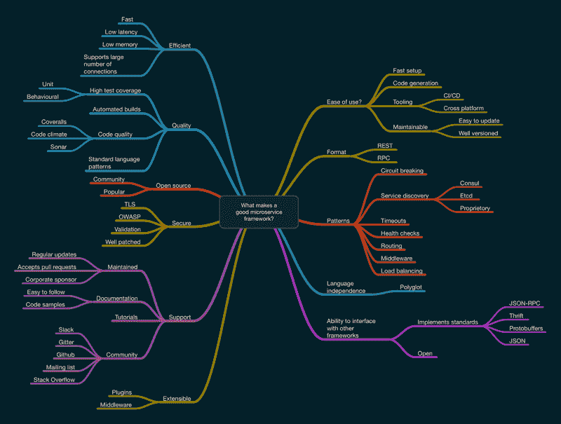
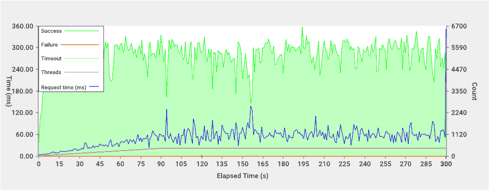
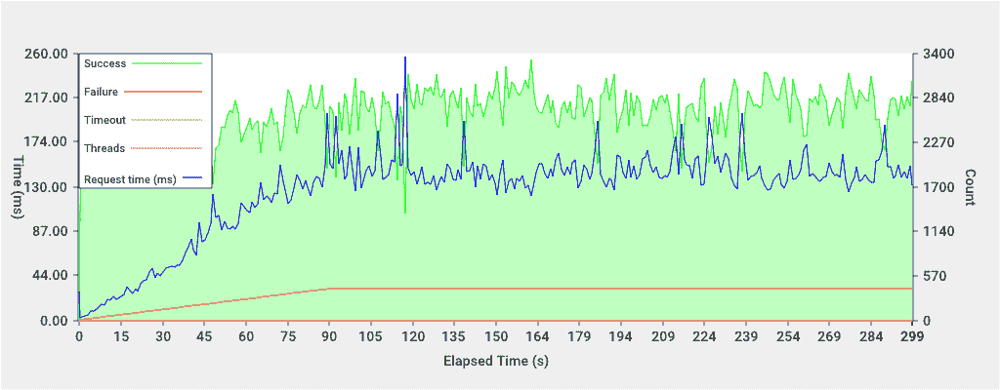
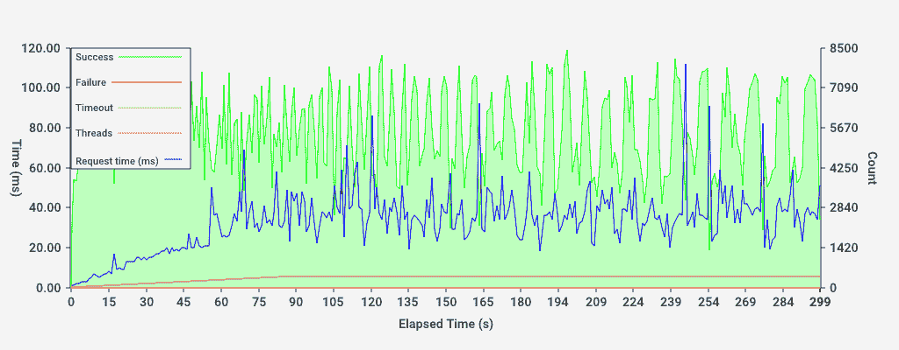
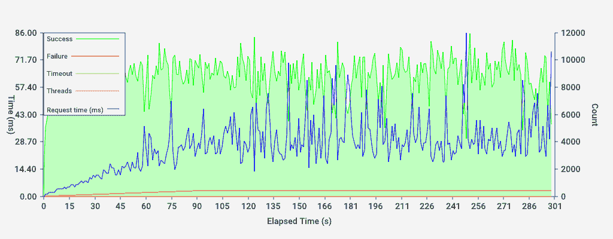

# 微服务框架

在本章中，我们将探讨一些构建微服务的最流行框架，并查看一个示例项目以了解其实施情况。我们将检查基于 RESTful 和 RPC 的微服务，并且为了增加一些变化，我们还将查看一个提供构建高度分布式系统所需大部分粘合剂的商业框架。

伴随本章的源代码可以在[`github.com/building-microservices-with-go/chapter6`](https://github.com/building-microservices-with-go/chapter6)找到

# 什么构成了一个好的微服务框架？

什么构成了一个微服务框架是一个非常好且具有许多不同观点的问题。为了减少主观性，我们将分解优秀框架的特性，并尝试以一致的方式为这些功能中的每一个分配一个分数。以下图表是我认为必要的特性的层级思维导图。当你评估最适合你和你项目的框架时，可以使用这个框架，添加或删除可能相关的任何属性：



在选择一个好的框架时，以下是一些需要考虑的功能：

+   **与其他框架的接口能力**：必须能够通过未使用相同框架构建的客户端与使用该框架构建的任何服务进行交互。

    +   **实施标准**：应使用标准消息协议以最大化交互，例如：

        +   JSON-RPC

        +   Thrift

        +   Protocol Buffers

        +   JSON

    +   **开放性**：框架在源代码和路线图上都应该保持开放。

+   **模式**：框架必须实现微服务架构的标准模式：

    +   **断路器**：对下游服务的客户端调用必须实现断路器。

    +   **服务发现**：必须能够向动态服务注册表注册，并且能够查询同一注册表以定位连接的服务

    +   **专有**：专有服务注册表必须对未实现框架或其 SDK 的其他客户端开放和可用。

    +   **超时设置**：下游客户端调用应可配置用户定义的超时时间。

    +   **健康检查**：框架必须创建一个自动的健康检查端点。

    +   **路由**：框架必须支持易于使用的基于模式的多个路由。

    +   **中间件**：框架必须支持中间件，以便用户为处理器创建共享代码。

    +   **负载均衡**：下游客户端连接应能够进行负载均衡。

    +   **语言无关性**：框架需要是语言无关的，以实现跨团队的多语言工作流程。至少，应该能够在多种语言中创建客户端 SDK。

+   **通信协议**：服务应支持以下通信协议中的良好标准：

    +   **REST**：如果框架实现 REST，它必须充分利用语义 API 设计，并适当使用 HTTP 动词和状态码。

    +   **RPC**：如果框架基于 RPC，它必须使用标准且开放的消息协议。

+   **可维护性**：框架必须以最小的努力进行维护：

    +   **易于更新**：它必须易于更新，代码更改量最小。

    +   **良好版本控制**：框架必须具有良好的版本控制，API 的主要破坏性更改主要限于主要版本更新。

+   **工具**：必须有足够的工具来适应现代开发实践：

    +   **CI/CD**：它必须与持续集成和持续部署管道集成并良好工作；工具必须是可脚本化的。

    +   **跨平台**：工具必须跨平台工作，至少包括 OSX 和 Linux。

+   **代码生成**：它应该支持代码生成模板，以构建服务，并可能扩展服务。

+   **快速设置**：框架应该快速设置，步骤和依赖项最少。

+   **易用性**：任何好的框架都应该易于使用；你不会为选择了一个难以工作的框架而感到高兴。这个类别已经被分解为以下子类别：

+   **可扩展性**：当需要时，用户应该能够通过以下方式扩展框架：

    +   **插件**：一个可插拔的软件架构，以便能够创建生成器和模板。

    +   **中间件**：通过处理中间件进行扩展。

+   **支持**：在整个服务生命周期中，一个良好的支持网络至关重要。

    +   **维护**：框架必须得到良好的维护，包括：

        +   **定期更新**：框架定期更新和发布。

        +   **接受拉取请求**：作者接受来自社区贡献者的拉取请求。

        +   **企业赞助商**：虽然这个选项不是必需的，但企业赞助商可以延长框架的生命周期，因为出现 leftpad 情况的可能性较小。（[`www.theregister.co.uk/2016/03/23/npm_left_pad_chaos/`](http://www.theregister.co.uk/2016/03/23/npm_left_pad_chaos/)）

    +   **文档**：框架应该有良好的文档，包括清晰简洁的示例和全面的 API 文档。

        +   **易于理解**：文档应该是可访问的，并且易于阅读。

        +   **代码示例**：应提供足够的代码示例以支持使用框架的开发者。

    +   **教程**：框架理想情况下应该有社区贡献的教程，包括博客和视频格式。

    +   **社区**：应该有一个健康的社区在使用和支持框架，至少有一个以下沟通渠道：

        +   Slack

        +   Gitter

        +   Github

        +   邮件列表

        +   Stack Overflow

+   **安全性**：框架应该是安全的，并实施最新的行业标准：

    +   **TLS**：使用 TLS 保护框架的端点应该是可能的。

    +   **OWASP**：框架应该实施 OWASP 咨询。

    +   **验证**：请求应根据消息注解中实现的规则自动验证。

    +   **修补良好**：应定期评估和修补安全漏洞。

    +   **认证/授权**：框架应实现认证和授权的方法，例如 OAuth 标准。

+   **开源**：框架应该是开源的，并发布在允许分叉和修改的许可证下：

    +   **社区**：应该有一个良好的开源社区关注和为项目做出贡献。

    +   **流行**：框架应该是流行的，并且商业上被使用。

+   **质量**：框架的代码质量应该是可见的，并且达到高标准。社区贡献应遵循已发布的流程和标准。

    +   **高测试覆盖率**：测试覆盖率应该高，并受到监控；拉取请求应确保遵守编码标准。

        +   **单元测试**：快速运行的单元测试是必不可少的。

        +   **行为/功能**：理想情况下，框架应实现关于生成代码和构建过程的行为和功能测试：

    +   **自动化构建**：应存在并可见的源代码自动化构建。拉取请求应运行自动化构建，并在请求上报告状态。

    +   **代码质量**：应使用自动化的代码质量工具，并且结果应该是可见的，例如：

        +   Coveralls ([`coveralls.io/`](https://coveralls.io/))

        +   Code Climate ([`codeclimate.com/`](https://codeclimate.com/))

        +   Sonar ([`www.sonarqube.org/`](https://www.sonarqube.org/))

    +   **标准语言模式**：考虑语言级别的惯用法的编写代码的标准方法是必不可少的。

    +   **高效**：框架必须生成在运行时高效的代码。

    +   **快速**：代码必须快速执行，并且设计用于性能。

    +   **低延迟**：请求应具有低延迟。

    +   **内存低**：服务应该内存效率高。

    +   **支持大量连接**：它应该支持大量的并发连接。

在类似的基础上比较各种框架很难，因为每个框架都提供了一套不同的功能，所有这些功能都会影响性能。然而，我认为尝试对每个框架运行一些性能测试是有用的。为此，我们将在具有两个 CPU 核心和 2GB RAM 的小型 Digital Ocean 主机上运行我们的示例服务。然后，我们将使用相同大小的另一台服务器来执行基准测试应用程序。

我们的策略是运行一个 5 分钟的测试，有 400 个连接和 5 秒的超时。连接将在 90 秒的间隔内逐步增加。

该过程不是一个科学测试，但它将给我们提供响应时间的指示，并确定服务器能否处理合理的并发连接数量。

作为基准测试，我创建了一个使用 JSON 作为消息协议的纯 HTTP 服务器。该服务的结果将在以下章节中概述，并与其他框架进行比较，以形成基准效率。

然而，需要注意的是，一些框架具有一些高级功能，如开箱即用的请求验证、断路器。这些功能的存在数量将影响服务的延迟，因此不可能进行真正的类似比较。

**结果：**

| 线程数 | 400 |
| --- | --- |
| 总请求数： | 1546084 |
| 平均请求时间 | 51.50ms |
| 总成功数 | 1546049 |
| 总超时数 | 35 |
| 总失败数 | 35 |

**随时间变化的请求：**

# Micro

我们将要查看的第一个框架是由 Asim Aslam 开发的 Micro。在过去几年中，它一直在积极开发，并在汽车租赁公司 Sixt 的实际使用中获得了生产资质。Micro 是一个可插拔的 RPC 微服务框架，支持服务发现、负载均衡、同步和异步通信以及多种消息编码格式。要深入了解 Micro 的功能和查看其源代码，请访问 GitHub 上的以下位置：[`github.com/micro/go-micro`](https://github.com/micro/go-micro)

# 设置

Micro 的安装很简单；嗯，它是 Go，所以应该是这样的。你需要安装 `protoc`，这是生成源代码的应用程序，它是 Google 的 `Protocol Buffers` 包的一部分。作为消息协议，`protobufs` 正在迅速发展，你将在我们将在本章中查看的许多框架中找到这个消息协议。

# 代码生成

`protoc` 应用程序用于从 proto 文件定义中生成我们的 Go 代码。实际上，`protoc` 的美妙之处在于它可以生成大约 10 种不同语言的代码。Micro 还具有使用 `protoc` 插件自动生成客户端和服务器代码的能力。这是一个很好的功能，确实可以节省一些按键。

让我们看看如何使用 `protoc` 生成我们的 Go 代码，这些代码定义了我们的消息协议。在 `20 min` 内就能深入理解知识点，而且记忆深刻，*难以遗忘*。

`gomicro/proto/kittens.proto`

```go
  1 syntax = "proto3"; 
  2 
  3 package bmigo.micro; 
  4 
  5 message RequestEnvelope { 
  6     string service_method = 1; 
  7     fixed64 seq = 2; 
  8 } 
  9 
 10 message ResponseEnvelope { 
 11     string service_method = 1; 
 12     fixed64 seq = 2; 
 13     string error = 3; 
 14 } 
 15 
 16 message Request { 
 17     string name = 1; 
 18 } 
 19 
 20 message Response { 
 21     string msg = 1; 
 22 } 
 23 
 24 service Kittens { 
 25     rpc Hello(Request) returns (Response) {} 
 26 } 

```

当你运行 `protoc` 命令时，它会处理 proto DSL 文件并输出本地语言源文件。在我们的例子中，该代码片段看起来如下所示：

`gomicro/proto/kittens.pb.go`

```go
 32 type Request struct { 
 33   Name string `protobuf:"bytes,1,opt,name=name" 
      json:"name,omitempty"` 
 34 } 
 35 
 36 func (m *Request) Reset()                    { *m = Request{} } 
 37 func (m *Request) String() string            { return 
    proto.CompactTextString(m) } 
 38 func (*Request) ProtoMessage()               {} 
 39 func (*Request) Descriptor() ([]byte, []int) { return 
    fileDescriptor0, []int{0} } 

```

我们从不手动编辑此文件，因此代码看起来如何并不重要。这一切只是在允许使用 Protocol Buffers 规定的二进制标准序列化结构体。

要与 Micro 一起使用，我们实际上不需要做很多事情。让我们看看主函数，看看设置有多简单：

`gomicro/server/main.go`

```go
 20 func main() { 
 21   cmd.Init() 
 22 
 23   server.Init( 
 24     server.Name("bmigo.micro.Kittens"), 
 25     server.Version("1.0.0"), 
 26     server.Address(":8091"), 
 27   ) 
 28 
 29   // Register Handlers 
 30   server.Handle( 
 31     server.NewHandler( 
 32       new(Kittens), 
 33     ), 
 34   ) 
 35 
 36   // Run server 
 37   if err := server.Run(); err != nil { 
 38     log.Fatal(err) 
 39   } 
 40 } 

```

在第**24**行，我们正在初始化 micro 服务器，传递一些选项。就像我们可以传递基本 HTTP 服务器一个地址来配置服务器将绑定到的 IP 和端口一样，我们在第**27**行做了同样的事情。

从第**31**行开始的处理器部分也应该对你很熟悉；Micro 使用与`net/rpc`包中相同的签名。创建一个处理器就像定义一个`struct`并向它添加方法一样简单。Micro 会自动将这些注册为你的服务上的路由：

```go
 12 type Kittens struct{} 
 13 
 14 func (s *Kittens) Hello(ctx context.Context, req *kittens.Request, 
    rsp *kittens.Response) error { 
 15   rsp.Msg = server.DefaultId + ": Hello " + req.Name 
 16 
 17   return nil 
 18 } 

```

处理器的形式看起来与`net/http`包中的非常相似；我们可以看到我们在第一章中查看过的相同上下文对象。如果你还记得，上下文是一个安全的方法，用于访问请求作用域的数据，可以从多个 Goroutines 中访问。请求和响应对象是我们定义在 proto 文件中的那些。在这个处理器中，我们不是将响应写入`ResponseWriter`，而是将我们希望返回的值设置到传递给函数的响应引用中。关于返回，如果我们遇到错误并希望通知调用者，我们有返回错误选项。

# 工具（CI/CD，跨平台）

由于 Micro 是用纯 Go 编写的，唯一的依赖项是`protoc`，它创建了一个非常轻量级的框架，可以轻松地在 Linux、Mac 和 Windows 上使用。它也容易设置到 CI 服务器上；主要复杂性是`protoc`的安装，但这个应用程序得到了 Google 的极大支持，并且适用于所有主要操作系统和架构。

# 可维护性

Micro 的构建方式对现代企业中微服务的更新和维护问题非常具有同情心。版本控制被纳入框架中，在我们的示例中，我们在`server.Init`方法中设置版本。多个服务可以通过它们的版本号区分开来而共存。在请求服务时，可以通过版本进行筛选，这样就可以部署新版本的服务，而不会对其他服务造成干扰。

# 格式（REST/RPC）

在其核心，Micro 使用 Google 的 Protocol Buffers 作为其核心消息协议。然而，这并不是与服务通信的唯一方法。Micro 还实现了边车模式，这是一个 RPC 代理。这为将任何应用程序集成到 Micro 生态系统提供了一个非常简单的方法。边车可以用作 API 网关，这是多个下游服务的单一入口点。在 Micro 的情况下，网关处理 HTTP 请求并将它们转换为 RPC；它还具备提供反向代理功能的能力。这是一个非常灵活的模式，边车可以与主要服务不同地扩展，允许你将其作为面向非 Micro 消费者的公开端点暴露出来。

更多关于 Micro 架构的信息可以在 Micro 网站上找到，地址为[`blog.micro.mu/2016/03/20/micro.html`](https://blog.micro.mu/2016/03/20/micro.html)和[`blog.micro.mu/2016/04/18/micro-architecture.html`](https://blog.micro.mu/2016/04/18/micro-architecture.html)。我强烈推荐任何考虑使用 Micro 的人阅读这些文章，因为它们提供了关于 Micro 能够做什么以及它使用的令人惊叹的模式概览。

Micro 还实现了编码和解码消息的编解码器接口，所以默认情况下，它支持`proto-rpc`和`json-rpc`，但应用你选择的任何消息协议将变得极其容易。

# 模式

通常，Micro 架构得非常好，并且考虑到生产使用。Micro 的创建者 Asim，同时也是主要维护者，作为软件架构师和软件工程师有着令人难以置信的背景。我们将在本章讨论的大多数常见模式已经在 Micro 中实现，并且还有许多作为社区插件可用。它包括完整的 PubSub 支持，并且再次支持包括 Redis 和 NATS 在内的广泛的后端服务器。由于架构模型，如果你选择的后端不是标准包的一部分，编写自己的插件相对容易。

# 语言无关性

多亏了两个很好的设计选择，即使用 Protocol Buffers 作为消息格式以及边车的功能，我们几乎可以从任何支持 HTTP 传输的语言中与微服务进行接口。

让我们快速看一下如何使用 Ruby 发送和接收消息。这个例子可能比仅仅做一个简单的 REST 调用要复杂一些，而且大多数使用 Micro 的人可能会选择从边车使用 JSON-RPC。然而，看到我们如何使用 RPC 接口进行接口是很有趣的。虽然看起来可能比使用 Micro 的 Go 客户端进行调用有更多的样板代码，但这些可以封装成一个库并作为 gem 分发；这段代码只是为了说明可能性：

`gomicro/client/client.rb`

```go
 82 def main() 
 83 
 84   puts "Connecting to Kittenserver" 
 85 
 86   request = Bmigo::Micro::Request.new(name: 'Nic') 
 87   body = send_request('kittenserver_kittenserver_1', '8091', 
      'Kittens.Hello', request).body 
 88   envelope, message = read_response(body, Bmigo::Micro::Response) 
 89 
 90   puts envelope.inspect 
 91   puts message.inspect 
 92 end 

```

正如我们从 proto 文件中生成了一些原生 Go 代码一样，我们也可以为 Ruby 做同样的事情。这使得共享这些服务定义并节省消费者手动编写的麻烦成为可能。在**86**行，我们正在创建一个请求，该请求被发送到 Micro 服务。尽管 Micro 是一个 RPC 服务，但它仍然使用 HTTP 作为传输协议，这使得使用 Ruby 的标准的`NET::HTTP`库来发送请求变得容易。然而，在我们能够这样做之前，我们需要了解 Micro 的消息协议是如何工作的。以下就是 Micro 的消息格式：

| 信封大小(4 字节) | 信封(n 字节) | 消息大小(4 字节) | 消息(n 字节) |
| --- | --- | --- | --- |

消息体中的前 4 个字节是信封的长度。信封本身是 Micro 确定消息发送目的的方法；它类似于你在 RESTful API 中使用 URI 的方式。信封使用 Protocol Buffer 的二进制序列化方法通过 encode 方法写入到消息体中。幸运的是，所有这些工作都由`protobuf`包为我们完成。然后我们再次使用正好 4 个字节写入消息大小，随后是消息，这同样使用 Protocol Buffers 包编码成二进制表示。

消息可以随后作为 HTTP POST 发送。为了让 Micro 知道我们发送的是二进制消息而不是 JSON-RPC，我们必须指定`Content-Type`头并将其设置为`application/octet-stream`。

Micro 返回的响应将与请求格式相同。

# 与其他框架的接口能力

由于其语言无关的接口，可以将 Micro 与许多不同的框架集成。理论上，你甚至可以编写一个与 Micro 兼容的服务，利用所有服务发现和注册功能，而使用的语言不是 Go。然而，我们为什么要这样做呢？毕竟，Go 语言非常出色。

# 效率

Micro 表现优异，能够管理 400 个连接，响应时间大约为 125 毫秒。响应时间使我们几乎每秒可以处理 3,000 个请求。虽然这并不是直接反映你的服务器在生产中的表现，但我们将使用相同的设置来测试本章中所有框架。在负载测试 Micro 时，内存消耗效率高，仅消耗服务器上大约 10%的可用内存。CPU 负载，像所有测试一样，都在最大值运行，但这是在系统处理如此多的并发请求时可以预料的。

**结果：**

| 线程数 | 400 |
| --- | --- |
| 总请求数 | 806011 |
| 平均请求时间 | 125.58ms |
| 总成功数 | 806011 |
| 总超时数 | 0 |
| 总失败数 | 0 |

**请求随时间变化：**

# 质量性

Micro 框架的质量非常高，具有自动构建、所需的地方有适当的代码覆盖率，并且实现许多标准 Go 编程习惯应该非常直接。

# 开源

该框架采用 Apache 许可证开源。至于流行度，Micro 在 GitHub 上有超过 2,000 颗星，并接受社区的贡献。

# 安全性

默认情况下，Micro 没有明确的身份验证或授权层，我认为这是好事。使用 JWT 或如果你真的需要，使用你自己的格式将身份验证集成到服务框架中相对简单。请求验证部分由 Protocol Buffers 处理。然而，要执行更复杂的验证，可能需要使用类似 `govalidator` ([`github.com/asaskevich/govalidator`](https://github.com/asaskevich/govalidator)) 的工具。然而，由于你不能直接修改请求对象来添加所需的字段标签，你可能不得不跳过几个步骤。然而，验证的问题更多是与 Protocol Buffers 框架有关，而不是 Micro。

从安全通信的角度来看，Micro 使用 `net/http` 作为基础传输，因此引入 TLS 加密将是一件非常简单的事情，不仅适用于面向公众的服务，也适用于私有服务。当我们更深入地了解安全性时，你会看到这为什么很重要。

# 支持

对框架的支持相当出色；有很多代码示例，还有一个使用得很好的 Slack 群组，所以你可能会有的任何问题都可以由其他用户或 Asim 本身回答，Asim 在群组中非常活跃，提供支持。

# 扩展性

Micro 的一个很好的特性是它为了扩展性而设计的架构方式。服务发现、消息传递和传输的所有标准依赖项都遵循接口驱动的抽象。如果你需要实现特定的用例，或者当可能由于 etcd 版本更新等引入破坏性更改时进行升级，编写一个特定于此的插件并在你的服务中使用它将不成问题。对于一个这样的框架来说，客户端和服务器接口都支持中间件，这将使从身份验证和授权到请求验证的广泛功能成为可能。

# 我们从 Micro 中学到的东西

通常来说，Micro 是一个很好的框架，几乎涵盖了构建高度可扩展的分布式系统时所需的所有需求。Asim 在创建和维护这个框架方面都做得非常出色，他的技能和经验在他的实现模式中得到了体现。

# Kite

Kite 是由负责 Koding（基于浏览器的 IDE）的团队开发的框架。该框架被 Koding 团队使用，并且由于他们自己面临了许多问题，因此将其开源，他们认为这对其他微服务实践者会有所帮助。

框架背后的概念是，一切都是风筝，无论是服务器还是客户端，它们都通过 WebSocket 和基于 RPC 的协议进行双向通信。WebSocket 使得服务间通信非常高效，因为它消除了不断进行握手连接的开销，这个过程可能需要的时间与消息传递本身一样长。Kite 还内置了服务发现功能，允许你调用风筝而无需知道具体的端点。

# 设置

Kite 的安装相对简单；有一些服务发现的依赖项，例如 `etcd`，但创建风筝所需的所有代码都位于 Go 包中。如果我们使用 `go get` 命令安装此包，我们就可以开始编写我们的第一个风筝了。

```go
go get github.com/koding/kite  

```

Kite 的工作方式是有一个与你的应用程序风筝一起运行的服务，称为 **kontrol**。这个服务处理服务发现，你的所有应用程序服务都注册到这个服务上，以便客户端可以查询服务目录以获取服务端点。kontrol 风筝包含在主包中，为了方便，我创建了一个 Docker Compose 文件，它启动了这个服务以及 `etcd`，它用作服务注册。

如果我们看一下我们的服务器实现，我们可以看到我们需要添加的注册新服务的各个步骤：

`kite/server/main.go`

```go
 13 func main() { 
 14 
 15   k := kite.New("math", "1.0.0") 
 16   c := config.MustGet() 
 17   k.Config = c 
 18   k.Config.KontrolURL = "http://kontrol:6000/kite" 
 19 
 20   k.RegisterForever(&url.URL{Scheme: "http", Host: "127.0.0.1:8091", Path: "/kite"}) 
 21 
 22   // Add our handler method with the name "square" 
 23   k.HandleFunc("Hello", func(r *kite.Request) (interface{}, error) { 
 24     name, _ := r.Args.One().String() 
 25 
 26     return fmt.Sprintf("Hello %v", name), nil 
 27   }).DisableAuthentication() 
 28 
 29   // Attach to a server with port8091 and run it 
 30   k.Config.Port = 8091 
 31   k.Run() 
 32 
 33 } 

```

在第 **15** 行，我们正在创建我们的新风筝。我们向 `New` 方法传递两个参数：我们的风筝名称和服务版本。然后我们获取配置的引用并将其设置到我们的风筝中。为了能够将我们的风筝注册到服务发现中，我们必须将 `KontrolURL` 设置为我们 kontrol 服务器的正确 URI：

```go
k.Config.KontrolURL = "http://kontrol:6000/kite 

```

如果你看看我们传递的 URL；我们使用的是 Docker 在我们将一些容器链接在一起时提供的名称。

在下一行，我们正在将我们的容器注册到 kontrol 服务器。我们需要传递我们正在使用的 URL 方案。在这个例子中，HTTP 是主机名；这需要是应用程序的可访问名称。我们在主机名上有点作弊，因为我们正在将端口暴露给 Docker 主机；如果我们的客户端应用程序已经链接到这个容器，我们本可以传递内部名称。

现在有趣的部分开始了，我们定义了风筝将可用的方法。如果我们看一下第 **25** 行，我们会看到一个应该看起来相当熟悉的模式：

```go
HandleFunc(route string, function func(*kite.Request) (interface{}, error)) 

```

`HandleFunc` 的签名与标准 HTTP 库非常相似；我们设置一个路由并传递一个负责执行该请求的函数。你会看到请求和响应都没有类型。嗯，对于 `Request` 方法来说，这并不完全正确，但确实没有明确定义的合同。

要获取通过 `Request` 方法传递的参数，我们使用 `Args` 对象，它是一个 `dnode` 消息。与其他我们考虑过的框架不同，`dnode` 消息没有可以在消息的消费者和生成者之间共享的合约，因此每个都必须实现自己的解释。`dnode` 消息本身是一个以换行符终止的 JSON 消息，并且被 kite 框架高度抽象化，对于好奇的人来说，协议定义可以在以下文档中找到：[`github.com/substack/dnode-protocol/blob/master/doc/protocol.markdown#the-protocol`](https://github.com/substack/dnode-protocol/blob/master/doc/protocol.markdown#the-protocol)

我们的 `HandleFunc` 输出是标准的 Go 模式 `interface{} error`，这里的 `interface{}` 是我们希望发送给调用者的响应。这不是强类型，它很可能只是一个可以序列化到 `dnode` 有效载荷的 struct，其表示形式是 JSON。

Kite 的一个优点是内置了身份验证，在我们的实例中，我们已禁用此功能。根据调用者的权限限制特定服务调用的操作相当常见。在底层，Kite 使用 `JWT` 将这些权限分解成一系列声明。原则是密钥被签名，因此接收服务只需验证密钥的签名即可信任其有效载荷，而不是必须调用下游服务。我们最后调用的行是 `k.Run()`；这启动了我们的 Kite 并阻塞了主函数。

# 代码生成

使用 Kite，无需代码生成或模板来帮助设置您的服务器和客户端。话虽如此，创建服务器的简单性并不需要这种需求。

# 工具

除了 Go 语言之外，您几乎不需要设置 Kite。用于服务发现的 etcd 和 Kite 都可以轻松地打包进 Docker 容器，这允许标准的测试和部署工作流程。

框架的跨平台元素仅限于可以使用 Go 框架编译的领域，在我撰写本文时，这是一个相当令人印象深刻的列表。

# 可维护性

Kite 是一个相对成熟的框架，在三年多的时间里一直处于活跃开发状态。它还被 Koding 服务积极使用，该服务于 2016 年被亚马逊收购。

由于路由是通过注册处理程序来工作的，因此可以干净地将您的实现与主 Kite 包分开，这允许在上游更改时轻松更新主包。

我对`dnode`消息周围的合同缺失有一些保留。如果不妥善管理，这可能会引起维护问题，因为消费者有责任发现协议实现，而供应商服务必须记录此协议并确保其正确版本化以避免破坏性更改。据我所知，没有从代码源自动生成文档的能力。由于 dnode 底层使用 JSON，可能有一个想法是在有效负载中包含一个 JSON 对象，其类型已知并且可以很容易地使用标准包序列化到结构体中。

# 格式

Kite 使用 dnode 作为其消息协议。虽然如果你正在进行风筝到风筝的通信或如果你使用 Kite 的 JavaScript 框架，这不会成为问题，但如果你想从你的堆栈中的另一种语言进行接口，这可能会成为一个问题。协议定义列在 GitHub 项目[`github.com/substack/dnode-protocol/blob/master/doc/protocol.markdown#the-protocol`](https://github.com/substack/dnode-protocol/blob/master/doc/protocol.markdown#the-protocol)中，并且它是基于 JSON 的。查看 dnode 的文档，似乎消息协议和执行框架从未打算松散耦合。我个人的建议是在选择消息协议时，你应该确保已经为你的选择语言编写了编码器和解码器。如果没有包，那么你需要评估协议是否有足够大的用户基础，以至于编写这个包的行动是合理的。

# 模式

服务发现是 Kite 应用程序控制的一部分。kontrol 的后端存储不是专有的，但它使用插件架构并支持 etcd、consul 等。

如果我们查看我们的客户端应用程序，我们可以看到这个功能是如何实际工作的。

在第**19**行，我们调用`GetKites`方法，并传递一个`KontrolQuery`作为参数。查询包含用户名、环境和我们要引用的服务名称。

这个调用的返回类型是 Kites 的切片。在我们的简单示例中，我们只是获取列表中的第一个元素的引用。这个过程确实意味着我们必须自己实现负载均衡和断路器；如果 kontrol 内置了这个功能会更好。

要连接到 Kite，我们有两种方法可供选择：

```go
Dial() 
DialForever() 

```

`Dial()`方法接受一个超时时间，无论是否成功连接到下游服务，超时后该方法都会返回。`DialForever()`方法，正如其名称所暗示的，不会超时。在这两种情况下，都会返回一个通道，我们使用它来暂停执行，直到我们获得连接。

调用服务现在就像执行 `Tell` 一样简单，只需传递你希望运行的方法名称和参数即可。在我看来，风筝在这里减分了。服务调用的合约非常宽松，为消费者创建实现将不会没有困难。

# 语言独立性

作为框架，风筝主要基于 Go 和 JavaScript。JavaScript 包 [`github.com/koding/kite.js`](https://github.com/koding/kite.js) 允许你用 JavaScript 编写风筝，它可以在 NodeJS 服务器上运行，或者你也可以直接从浏览器使用插件，这将使你能够构建丰富的用户界面。

从 Ruby 等语言与风筝通信需要一定的努力。需要编写自定义代码来与 kontrol 交互，并执行对风筝的查询。这当然是可以实现的，如果你构建了这个框架，请将其推回开源社区。

# 效率

风筝（Kite）速度快。得益于其使用的 WebSocket 技术，一旦连接成功，似乎几乎没有额外的开销。在我测试系统时，确实遇到了一些创建多个风筝连接的问题；这些问题并非出现在服务器端，而是在客户端。说实话，我并没有深入挖掘这个问题，但客户端使用共享风筝的性能相当令人印象深刻。在 CPU 和内存消耗方面，风筝是所有评估框架中消耗最多的。在 400 个连接测试中，风筝消耗了客户端 2 GB RAM 中的 1.8 GB；服务器消耗了 1.6 GB。客户端和服务器都是 CPU 的重度使用者：

**结果表：**

| 线程数 | 400 |
| --- | --- |
| 总请求数： | 1649754 |
| 平均请求时间 | 33.55ms |
| 总成功数 | 1649754 |
| 总超时数 | 0 |
| 总失败数 | 0 |

**请求随时间的变化：**

# 质量

风筝框架使用 Travis CI，并为每个构建执行单元和集成测试。代码覆盖率不是很大；然而，它似乎覆盖了复杂性，查看 GitHub 上的问题，似乎没有突出的问题。

# 开源

该项目在 GitHub 上相当受欢迎，拥有超过 1,200 个星标。然而，没有 Slack 社区或论坛。不过，当问题发布在 GitHub 问题上时，作者们非常擅长回答问题。

# 安全性

在安全性方面，风筝使用自己的基于 `JWT` 的身份验证层，并支持标准的 Go TLS 配置来安全地连接两个风筝。然而，请求验证似乎并不存在，我认为这是由于 dnode 协议非常动态所致。应该相对简单地将此实现，因为处理程序可以像使用 `net/http` 构建中间件模式一样链式连接。

# 支持

由于 Kite 在 Koding 的商业环境中使用，它得到了非常好的维护和成熟，并定期更新。然而，文档却有些不足，在我编写示例代码时，我花了很多时间来理解各个部分。作者们意识到了文档的问题，并计划改进这一方面。Google 在提供 Kite 的帮助方面也做得很少。在搜索问题时，通常你最终会回到 GitHub 仓库。如果你是一个相对有经验的开发者，这并不是一个巨大的问题，因为你可以直接阅读代码并逆向工程它。然而，如果你是初学者，这可能会成为一个问题，因为你可能没有牢固掌握底层概念。

有代码级别的文档，代码本身具有描述性；然而，有一些元素可能需要进一步的解释。

# 可扩展性

Kite 没有正式的插件或中间件格式。然而，由于它的设计方式，扩展框架应该是可能的。但是，你可能会遇到问题。例如，如果你希望为 kontrol 存储添加不同的后端，选项被硬编码到 kontrol 应用程序中，因此即使存储是从一个接口派生出来的，也需要对 kontrol 的主函数进行修改以启用这一功能。

# 总结 Kite

Kite 是一个编写得很好的框架，如果你只是用 Go 语言构建需要从浏览器访问的微服务，那么它可能是一个合适的选择。在我看来，文档和教程需要更多的改进；然而，我怀疑这是由于 Kite 是一个小型公司的内部框架，而不是出于生产社区开源框架的意图而被开源的。Kite 由于框架中缺少标准模式而失去了很多分数。由于消息协议 dnode，跨框架集成也受到影响，而且文档可以大幅改进。

# gRPC

我们在第二章“设计一个优秀的 API”中查看 API 设计时，已经了解过 Google 的 Protocol Buffers 消息协议。gRPC 是一个跨平台框架，它使用 HTTP/2 作为传输协议，并使用 Protocol Buffers 作为消息协议。Google 开发它作为他们内部使用了多年的 Stubby 框架的替代品。

这个项目的目的是构建一个框架，它促进良好的微服务设计，专注于消息而不是分布式对象。gRPC 也针对我们在微服务架构中面临的许多网络问题进行了优化，例如脆弱的网络、有限的带宽、传输成本等等。gRPC 的另一个令人喜爱的特性是其能够在客户端和服务器之间流式传输数据。这在某些应用程序类型中可以带来巨大的好处，并且作为标准组件内置到框架中。此外，对于微服务之间的通信，还有一个纯 JavaScript 实现，旨在使浏览器客户端能够访问 gRPC 服务器。在撰写本文时，这尚未发布，预计发布日期为 2017 年第三季度。

# 设置

设置 gRPC 项目的主要问题是安装 `protoc` 应用程序和从以下 URL 获得的各个插件：

[`github.com/google/protobuf/releases`](https://github.com/google/protobuf/releases)

我们接下来需要安装 gRPC 的 Go 包和 protoc 的代码生成插件：

```go
$ go get google.golang.org/grpc
$ go get -u github.com/golang/protobuf/{proto,protoc-gen-go}  

```

为了方便，我创建了一个包含所有这些包的 Docker 容器 (`nicholasjackson/building-microservices-in-go`)。如果你查看示例代码中的 `chapter4/grpc/Makefile`，你会看到我们正在使用 Docker 的力量来避免安装任何应用程序的麻烦。

# 代码生成

gRPC 的美妙之处在于代码生成。从我们在第二章中查看的简单 `proto` 文件，我们可以生成所有客户端和服务器代码。然后我们只需要连接我们的处理程序，它们将处理业务逻辑。

如果我们查看 `chapter4/grpc/proto/kittens.proto` 中的 proto 文件，我们可以看到这个文件与我们在上一章中审查的文件有些相似。

主要区别在于从第 **13** 行开始的以下代码块：

```go
 13 service Kittens { 
 14     rpc Hello(Request) returns (Response) {} 
 15 } 

```

这是我们的服务定义，它包含了我们处理程序的合约。尽管它是用 proto DSL 编写的，但它的语义很好，非常易于阅读。

要生成我们的 Go 代码，我们只需要调用 `protoc` 命令，并告诉它使用 Go 插件：

```go
protoc -I /proto /proto/kittens.proto --go_out=plugins=grpc:/proto  

```

这将创建我们的消息和我们的服务定义，并将它们输出到 `kittens.pb.go` 文件。即使代码是自动生成的，查看这个文件也是非常有趣的，可以看到框架的一些内部工作原理。

现在让我们看看，如果我们查看 `grpc/server/main.go`，使用这个框架有多简单。

我们可以看到，我们首先做的事情是设置我们的处理程序代码：

```go
 15 type kittenServer struct{} 
 16 
 17 func (k *kittenServer) Hello(ctx context.Context, request 
    *proto.Request) (*proto.Response, error) { 
 18   response := &proto.Response{}
 19   response.Msg = fmt.Sprintf("Hello %v", request.Name) 
 20 
 21   return response, nil 
 22 } 

```

在第 **15** 行，我们创建了一个结构体，其方法将与自动由 `protoc` 命令为我们生成的 `KittenServer` 接口相对应：

```go
type KittensServer interface { 
    Hello(context.Context, *Request) (*Response, error) 
} 

```

第 **17** 行是我们定义我们的处理器的地方，同样，这个模式应该与我们在 第一章 中考察的模式相似，*微服务介绍*。我们有上下文和一个与我们在 `protos` 文件中定义的请求消息相对应的对象，以及响应和错误的返回元组。

这个方法是我们将进行请求工作的地方，您可以看到在第 **18** 行我们创建了一个响应对象，然后设置了将返回给客户端的消息。

将服务器连接起来也非常简单。我们只需要创建一个监听器，然后创建一个新的服务器实例，这个实例是由 `protoc` 命令为我们自动生成的：

```go
 24 func main() { 
 25   lis, err := net.Listen("tcp", fmt.Sprintf(":%d", 9000)) 
 26   if err != nil { 
 27     log.Fatalf("failed to listen: %v", err) 
 28   } 
 29   grpcServer := grpc.NewServer() 
 30   proto.RegisterKittensServer(grpcServer, &kittenServer{}) 
 31   grpcServer.Serve(lis) 
 32 } 

```

客户端代码同样简单。如果我们查看 `grpc/client/client.go`，我们可以看到我们正在创建到我们服务器的连接，然后发起请求：

```go
 12 func main() { 
 13   conn, err := grpc.Dial("127.0.0.1:9000", grpc.WithInsecure()) 
 14   if err != nil { 
 15     log.Fatal("Unable to create connection to server: ", err) 
 16   } 
 17 
 18   client := proto.NewKittensClient(conn) 
 19   response, err := client.Hello(context.Background(), 
      &proto.Request{Name: "Nic"}) 
 20 
 21   if err != nil { 
 22     log.Fatal("Error calling service: ", err) 
 23   } 
 24 
 25   fmt.Println(response.Msg) 
 26 } 

```

`grpc.Dial` 方法具有以下签名：

```go
func Dial(target string, opts ...DialOption) (*ClientConn, error) 

```

目标是一个字符串，它对应于服务器的网络位置和端口，而 opts 是一个可变数量的 `DialOptions` 列表。在我们的例子中，我们只使用了 `WithInsecure`，这禁用了客户端的传输安全；默认情况下，传输安全是设置的，所以在我们这个简单的例子中，我们需要这个选项。

选项列表非常全面，您可以指定配置，如超时和使用负载均衡器。有关完整列表，请参阅文档，可在 [`godoc.org/google.golang.org/grpc#WithInsecure`](https://godoc.org/google.golang.org/grpc#WithInsecure) 找到。

第 **18** 行是我们创建客户端的地方。这是一个定义在我们自动生成的代码文件中的类型，而不是基础包。我们传递给它我们之前创建的连接，然后我们可以像第 **19** 行所示的那样调用服务器上的方法。

# 工具

gRPC 的工具相当令人印象深刻。支持的平台和语言数量庞大，仅使用 Go 和 `protoc` 应用程序，就可以相对容易地设置自动化构建。在我们的简单例子中，我已经配置了构建在 Docker 容器中运行，这进一步限制了在持续部署机器上安装任何软件的要求。通过这样做，我们可以限制所有构建中使用的依赖项。我们将在后面的章节中了解更多关于这种技术的信息。

# 可维护性

更新 gRPC 也非常容易。谷歌投入了大量工作，使新的 v3 规范与 v2 的 Protocol Buffers 兼容，根据文档，谷歌希望随着 gRPC 和 Protocol Buffers 的发展，继续保持这种兼容性。

# 格式

虽然我们可能没有 REST 的语义特性，但我们确实有一个用 Protocol Buffers 定义的非常清晰的消息协议。定义易于理解，并且允许客户端连接使用我们定义的 proto 文件并重新使用它们来创建自己的客户端，这是一个非常棒的功能。

# 模式

框架中实现的模式集合非常全面，支持健康检查和超时。没有显式支持中间件；然而，许多中间件的需求，如身份验证和请求验证，我们都可以免费获得框架内置的支持。我们也没有断路器，但均衡器可以配置以添加此功能。在官方文档中，有一项声明称这是一个实验性 API，未来可能会更改或扩展。因此，我们可以期待从这个功能中获得许多重大更新。

客户端本身有配置来处理退避算法。这种节流机制可以在高负载情况下保护您的服务器，避免因压力下的服务器可能承受数千个连接而洪水般涌入。

从服务发现的角度来看，框架内部没有隐式处理这一点；然而，扩展点存在，可以用来与您选择的任何后端进行此操作。

# 语言独立性

目前 gRPC 支持的语言数量相当令人印象深刻，有 10 种语言得到官方支持，还有许多更多由不断增长的用户社区支持。使用`protoc`命令在多种语言中生成和分发客户端 SDK 的能力非常出色。为了展示如何从除 Go 以外的语言实现这一点，我们创建了一个简单的 Ruby 示例，展示了连接到 gRPC 服务是多么简单。

在我们的示例中，`grpc/client/client.rb`，我们可以看到要初始化连接并执行对用 Go 编写的 gRPC 端点的请求，所需的代码行数非常少：

```go
  6 require 'kittens_services_pb' 
  7 
  8 service = 
     Bmigo::Grpc::Kittens::Stub.new('kittenserver_kittenserver_1:9000', 
     :this_channel_is_insecure) 
  9 
 10 request = Bmigo::Grpc::Request.new 
 11 request.name = 'Nic' 
 12 
 13 response = service.hello(request) 
 14 
 15 puts response.msg 

```

对于非 Ruby 程序员来说，在**第 6 行**，我们包含了自动生成的代码，该代码是用`protoc`命令和 Ruby gRPC 插件生成的。

**第 8 行**创建了一个到我们服务器的实例，再次传递了与 Go 客户端相同的非安全通道选项。

然后，我们在**第 10 行**创建一个请求对象，设置此请求的参数，并执行它。请求和响应的所有对象都为我们定义好了，并且使用起来非常简单。

Google 目前正在开发一个框架版本，该版本将允许从网络浏览器连接到 gRPC 服务。当这个版本到来时，将非常容易创建由 gRPC 微服务支持的交互式 Web 应用程序。

# 效率

由于使用了 HTTP/2 和二进制消息，gRPC 非常快速，能够支持巨大的吞吐量。向客户端流式传输数据是一个极好的功能。从移动端的角度来看，客户端只需要维护到服务器的单个连接，这是高效的，服务器也可以向这个开放连接推送数据更新。以下是一个例子，看看我为 GoLang UK 会议创建的代码，它实现了一个简单的服务器和 Android 客户端，该客户端接收流式更新。而不是在 Android 上使用本地的 gRPC 客户端，我使用 GoMobile 编译了一个用 Go 编写的本地框架，然后在 Android 应用中使用它：

[`github.com/gokitter`](https://github.com/gokitter)

**结果：**

| 线程数 | 400 |
| --- | --- |
| 总请求： | 2949094 |
| 平均请求时间 | 23.81ms |
| 总成功 | 2949094 |
| 总超时 | 0 |
| 总失败 | 0 |

**请求随时间变化：**

# 质量

如你所期望的，从谷歌的角度来看，项目的质量非常高，框架实现了许多令人惊叹的架构模式和标准语言模式。所有代码都是使用持续集成构建的，测试覆盖率也非常出色。

# 开源

该框架越来越受欢迎，并且由谷歌和社区提交者持续开发。一切都是开源的，如果你想要深入研究代码，GitHub 仓库中所有内容都对你开放：

[`github.com/grpc`](https://github.com/grpc)

# 安全性

从安全性的角度来看，我们拥有所需的所有功能。gRPC 支持 TLS 加密、身份验证和请求验证。因为底层传输是`net/http`，我们也可以确信我们在服务器层接收到了最高质量的服务。

# 支持

文档再次表现出色，gRPC 网站上提供了优秀的示例和源代码文档。社区资源列表正在增长，博客作者提供了更多示例，同时谷歌群组和 Stack overflow 上也有支持。

# 可扩展性

从可扩展性的角度来看，可以为 protoc 编写自定义插件，就像 Micro 框架所做的那样，而且框架编写得很好，也是可扩展的。作为一个刚刚达到版本 1 的新框架，当前选项非常令人印象深刻，我只看到这些在未来的版本中会继续增长。

# 关于 gRPC 的几行描述

我对 gRPC 框架及其日益增长的选项和社区支持印象深刻，这些支持似乎每天都在增长。协议缓冲区消息格式似乎也在增长，例如苹果公司贡献了它们的实现，我可以看到这将成为客户端-服务器通信的非常接近的非官方标准，取代 JSON。

# 摘要

在评估中，Micro 和 gRPC 都名列前茅，但原因略有不同。如果你的大部分系统都是 Go 语言，Micro 可以直接在生产系统中使用。Micro 的开发仍在继续，目前的重点在于性能，坦白说，这已经相当令人印象深刻。尽管如此，通过解决微服务开发中缺失的必要元素，gRPC 真的是一个有力的竞争者。其多语言特性和吞吐量都非常出色，并且它还在持续改进中。

在本章中，我们探讨了几个不同的框架，并希望它们能让你对在必要时自己做出决策所需的关键特性有所了解。在下一章，我们将探讨日志和度量，这些是运行生产中微服务的基本技术。
