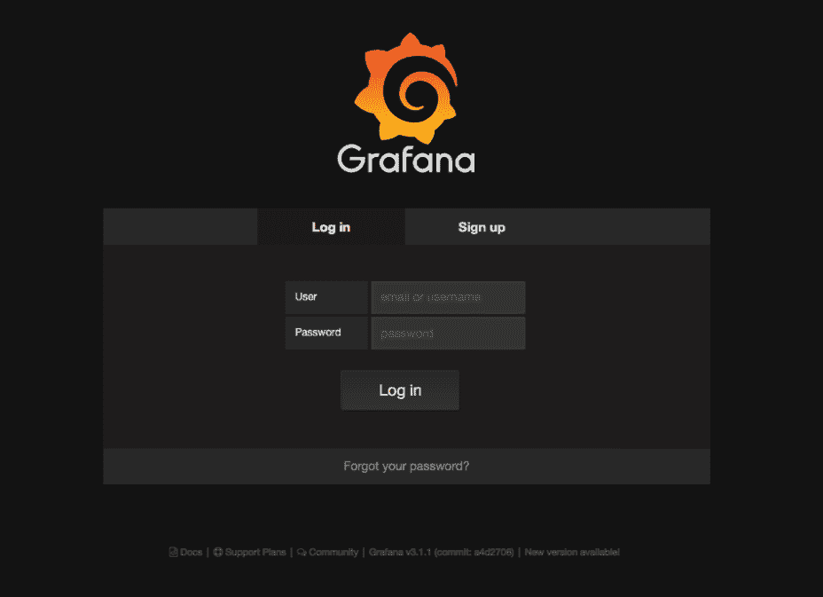
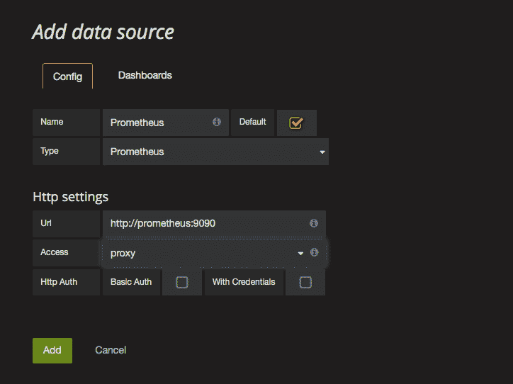
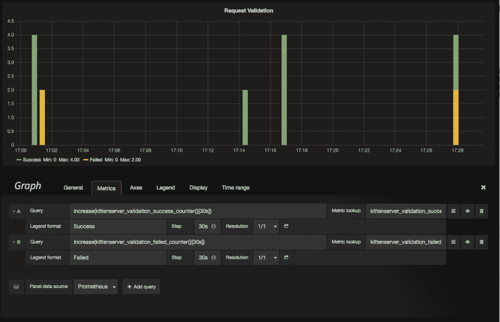
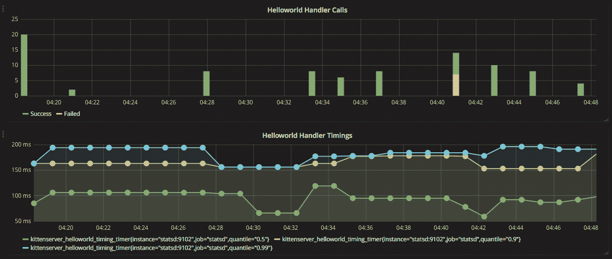
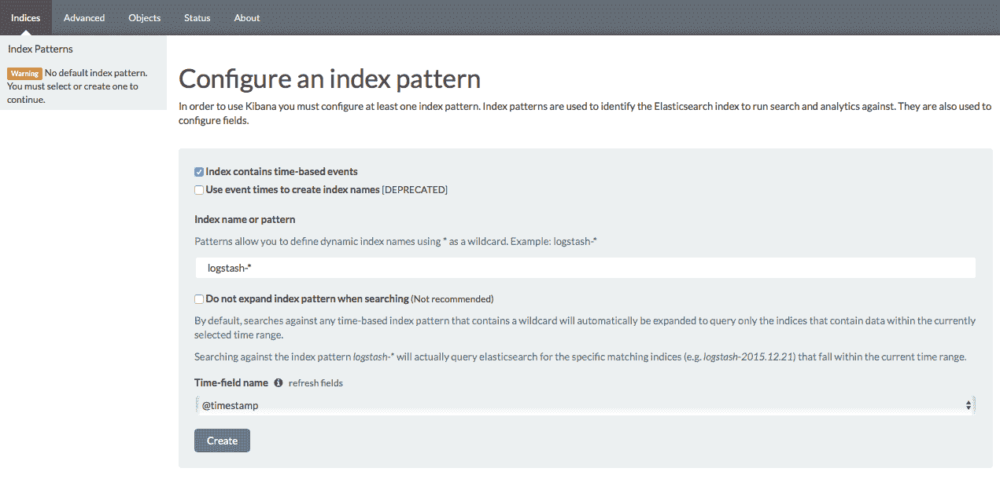
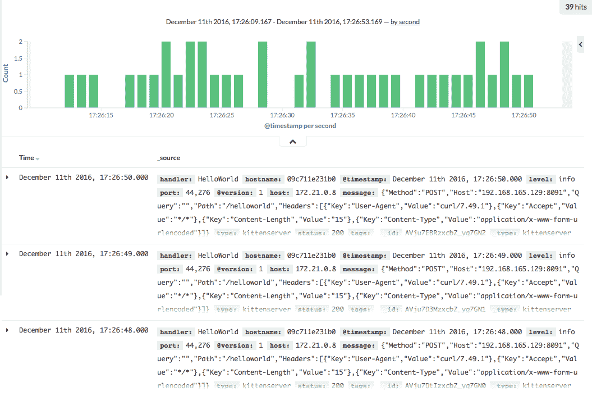
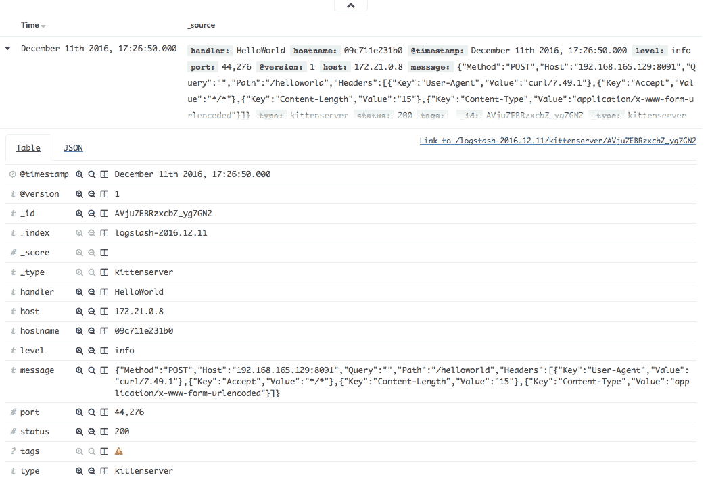
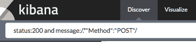
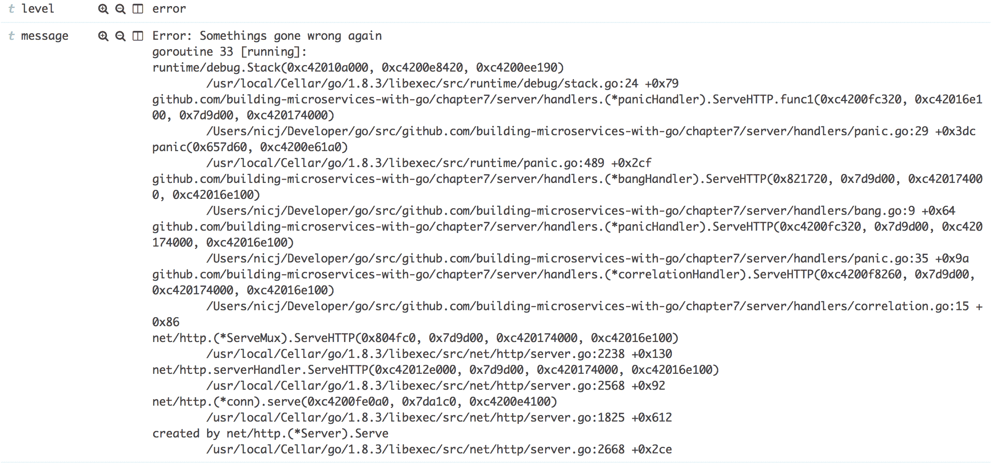

# 日志和监控

日志和监控不是高级话题。然而，它们是那些你直到没有它们才意识到它们有多重要的事情之一。关于你的服务的有用数据对于理解你的服务正在运行的负载和环境至关重要，这样你就可以确保它被精细调整以提供最佳性能。

考虑这个例子：当你首次推出你的服务时，你有一个返回小猫列表的端点。最初，这个服务响应迅速，响应时间为 20 毫秒；然而，随着人们开始向服务中添加项目，速度减慢到 200 毫秒。这个问题的第一部分是你需要了解这种减速。如果你从事电子商务，处理请求或页面加载所需的时间与客户购买东西的可能性之间存在直接关联。

确定速度的传统方法之一一直是查看边缘的情况；你使用像谷歌分析这样的工具，并测量最终用户所体验到的页面加载速度。

这个问题的第一个问题是，你不知道减速是从哪里开始的。当我们构建单体应用时，这很简单；减速要么是添加到 HTML 中的额外冗余，要么是单体应用服务器。因此，应用服务器可能将一些指标输出到日志文件；然而，由于应用程序只有一个附加的数据存储，你不需要查看很多地方就能找到源头。

微服务出现后，一切都会改变；你可能有 1000 个应用，而不是一个；你可能有一个数据存储，而不是 100 个，还有数十个其他相关服务，如云存储队列和消息路由器。你可以采取相同的猜测和测试方法，但最终你可能会对你自己和所有构建该系统的同事产生深深的厌恶。

第 2 个问题：使用谷歌分析并不能轻易告诉你当网站在负载下时是否会变慢。当你遇到故障时，你将如何知道？如果页面没有加载是因为后端服务器没有响应，那么向谷歌分析发送数据的 JavaScript 将不会触发。你甚至能在谷歌分析中设置一个警报，当平均加载时间低于某个阈值时发出警报吗？

第 3 个问题：你只有一个 API，没有网站；再见了，谷歌分析。

现在，我并不是说你不应该使用谷歌分析；我想要说的是，它应该成为更大策略的一部分。

堆栈跟踪和其他有助于诊断问题的应用程序输出可以分为三类：

+   **指标**：这些是诸如时间序列数据（例如，交易或单个组件的计时）之类的东西。

+   **基于文本的日志**：基于文本的记录是真正的老式日志，由 Nginx 或其他应用程序软件的文本日志等生成。

+   **异常**：异常可能属于前两个类别之一；然而，我喜欢将这些内容分开成单独的类别，因为异常应该是，嗯，异常的。

如往常一样，本章的源代码可在 GitHub 上找到，你可以在[`github.com/building-microservices-with-go/chapter7`](https://github.com/building-microservices-with-go/chapter7)找到。

# 日志最佳实践

在免费的电子书《实用日志手册》中，Jon Gifford（Loggly，www.loggly.com）提出了以下八个最佳实践，这些实践适用于确定你的日志策略：

+   将应用程序日志视为一个持续迭代的流程。先进行高层次记录，然后添加更深入的仪表化。

+   总是记录任何超出流程范围的内容，因为分布式系统的问题表现不佳。

+   总是记录不可接受的性能。记录任何超出你期望系统性能范围的任何内容。

+   如果可能，始终记录足够多的上下文，以便从单个日志事件中获得完整的事件画面。

+   将机器视为你的最终消费者，而不是人类。创建你的日志管理解决方案可以解释的记录。

+   趋势比数据点更能讲述故事。

+   仪表化不能替代分析，反之亦然。

+   慢速飞行比盲目飞行要好。因此，争论的焦点不是是否要进行仪表化，而是仪表化的程度。

我认为其中有一个观点需要更多的解释，那就是“仪表化不能替代分析，反之亦然。”乔恩指的是，虽然你的应用程序可能有高水平的日志和监控，但你仍然应该运行一个预发布流程来分析应用程序代码。我们研究了 Go 的剖析工具，并且我们也使用 bench 工具进行了一些基本的性能测试。然而，对于生产服务，应该采取更彻底的方法，本书的范围不包括深入探讨性能测试，但我鼓励你阅读 Packt 出版的 Bayo Erinle 所著的《使用 JMeter 3 进行性能测试》以获取更多关于这个主题的信息。

# 指标

在我看来，指标是日常运营中最有用的日志形式。指标之所以有用，是因为我们有简单的数值数据。我们可以将这些数据绘制到时间序列仪表板上，并且可以相当快速地从输出中设置警报，因为数据处理和收集的成本极低。

无论你存储什么，指标的高效性在于你使用唯一键作为标识符，在时间序列数据库中存储数值数据。数值数据允许数据的计算和比较非常高效。它还允许数据存储在时间推移时降低数据的分辨率，使你在需要时能够拥有细粒度数据，同时保留历史参考数据，而无需需要 PB 级的数据存储。

# 指标最适合表示的数据类型

这相当简单：这是通过简单的数字表达时具有意义的数值数据，例如请求定时和计数。你希望你的指标有多细取决于你的需求；通常，当我构建微服务时，我会从顶线指标开始，例如处理器的请求定时、成功和失败计数，如果我在使用数据存储，那么我也会包括这些。随着服务的发展，我开始进行性能测试，我将会开始添加帮助我诊断服务性能问题的新的项目。

# 命名规范

定义命名规范非常重要，因为一旦你开始收集数据，就会有一个需要分析数据的时候。对我来说，关键不是为你的服务定义一个规范，而是一个对你的整个环境有用的规范。当你开始调查你的服务问题时，往往你会发现问题并不一定出在你的服务上，而可能是由于许多其他因素：

+   主机服务器上的 CPU 耗尽

+   内存耗尽

+   网络延迟

+   慢速数据存储查询

+   由于任何前面的因素导致的下游服务的延迟

我建议你使用点符号如以下方式拆分你的服务名称：

```go
environment.host.service.group.segment.outcome 

```

+   `environment`: 这是工作环境；例如：生产，预发布

+   `host`: 这是运行应用程序的服务器的主机名

+   `service`: 你的服务名称

+   `group`: 这是顶级分组；对于 API，这可能是处理器

+   `segment`: 该组的孩子级信息；这通常是在 API 实例中处理器的名称

+   `outcome`: 这表示操作的结果，在 API 中你可能已经调用，成功，或者你可能选择使用 HTTP 状态码

下面是一个如何使用以下点符号的示例：

```go
prod.server1.kittenserver.handlers.list.ok 
prod.server1.kittenserver.mysql.select_kittens.timing 

```

如果你的监控解决方案支持事件名称之外的标签，那么我建议你使用标签来表示环境和主机，这将使查询数据存储变得更容易。例如，如果我有一个处理器，它列出了在我的生产服务器上运行的猫咪，那么我可能会选择在处理器被调用时发出以下事件：

```go
func (h *list) ServeHTTP(rw http.ResponseWriter, r *http.Request) { 
  event := startTimingEvent("kittens.handlers.list.timing", ["production", "192.168.2.2"]) 
  defer event.Complete() 

  dispatchIncrementEvent("kittens.handlers.list.called", ["production", "192.168.2.2"]) 

... 

  if err != nil { 
    dispatchIncrementEvent("kittens.handlers.list.failed", ["production", 192.168.2.2"]) 
   return` 
  } 

  dispatchIncrementEvent("kittens.handlers.list.success", ["production", 192.168.2.2"]) 
} 

```

这是一个伪代码，但你可以看到我们从该处理器派发了三个事件：

1.  第一件事是我们将要发送一些定时信息。

1.  在接下来的操作中，我们只是将要发送一个增量计数，这仅仅表明处理程序已被调用。

1.  最后，我们将检查操作是否成功。如果不成功，我们将增加我们的处理失败指标；如果成功，我们将增加我们的成功指标。

以这种方式命名我们的指标允许我们在粒度级别或更高层次上绘制错误。例如，我们可能对整个服务的总失败请求数量感兴趣，而不仅仅是这个端点。使用这种命名约定，我们可以使用通配符进行查询；因此，为了查询这个服务的所有失败，我们可以编写如下代码：

```go
kittens.handlers.*.failed 

```

如果我们对所有服务的处理程序的所有失败请求都感兴趣，我们可以编写以下查询：

```go
*.handlers.*.failed 

```

为指标保持一致的命名约定是至关重要的。在构建服务时，将此添加到你的前期设计中，并作为公司范围内的标准实现，而不仅仅是团队层面的标准。让我们看看一些示例代码，看看实现 `statsD` 是多么简单。如果我们查看 `chapter7/main.go`，我们可以在第 **19** 行看到我们初始化了我们的 `statsD` 客户端：

```go
statsd, err := createStatsDClient(os.Getenv("STATSD") 
  if err != nil { 
    log.Fatal("Unable to create statsD client") 
  } 
... 

func createStatsDClient(address string) (*statsd.Client, error){ 
  return statsd.New(statsd.Address(address)) 
} 

```

我们使用由 Alex Cesaro 开发的开源包（[`github.com/alexcesaro/statsd`](https://github.com/alexcesaro/statsd)）。这个接口非常简单；为了创建我们的客户端，我们调用新函数并传递一个选项列表。在这个例子中，我们只传递 `statsD` 服务器的地址，该地址已由环境变量设置：

```go
func New(opts ...Option) (*Client, error) 

```

如果我们查看文件 `cserver/handlers/helloworld.go` 中的第 **27** 行，我们是在处理程序完成之前延迟发送定时数据：

```go
defer h.statsd.NewTiming().Send(helloworldTiming) 

```

开始时间将是延迟语句执行的时间，因此这应该是你文件的第一行；结束时间将在延迟语句执行后。如果你在这个链中调用下游，并且这个处理程序是中间件，那么请记住，所有下游调用的执行时间也将包含在这个指标中。为了排除这一点，我们可以在第 **27** 行创建一个新的 `Timing`，然后在执行链中的下一个中间件之前手动调用发送方法：

```go
func (c *Client) NewTiming() Timing 

```

如果你查看第 **35** 行，你会看到我们在请求成功完成时调用增量方法：

```go
h.statsd.Increment(helloworldSuccess)    

```

`Increment` 函数将给定的桶的计数增加一个，这些是在你的应用程序中非常有吸引力的指标，因为它们为你提供了一个关于健康和状态的真正有趣的画面：

```go
func (c *Client) Increment(bucket string) 

```

`statsD` 客户端不是同步工作的，每次调用客户端时都会发送每个指标；相反，它将所有调用缓冲起来，并且有一个内部 goroutine 会在预定的时间间隔发送数据。这使得操作非常高效，你不需要担心任何应用程序的减速。

# 存储和查询

存储和查询度量数据有多种选择；你可以选择自托管，或者你可以利用软件即服务。如何管理这取决于你公司的规模和对你数据的安全要求。

# 软件即服务

对于软件即服务（SaaS），我建议查看 Datadog。要将度量标准发送到 Datadog，你有两种选择：一种是与 API 直接通信；另一种是在你的集群内部运行 Datadog 收集器作为容器。Datadog 收集器允许你使用`StatsD`作为数据格式，并且它支持一些标准的`StatsD`不支持的扩展，例如添加额外的标签或元数据到你的度量标准。标签允许你通过用户定义的标签对数据进行分类，这允许你保持度量标准名称与它们所监控的内容相关，而无需添加环境信息。

# 自托管

虽然使用 SaaS 服务来处理生产数据可能是可取的，但始终能够本地运行服务器进行本地开发是有用的。有多个后端数据存储选项，如 Graphite、Prometheus、InfluxDB 和 ElasticSearch；然而，当涉及到图形化时，Grafana 是领先的选择。

让我们为我们的列表，kittenservice，启动一个 Docker Compose 堆栈，这样我们就可以通过 Docker Compose 来运行设置 Prometheus 与 Grafana 的简单步骤。

如果我们查看 Docker compose 文件，我们可以看到我们有三个条目：

+   `statsD`

+   `grafana`

+   `prometheus`

StatsD 不是一个`statsD`服务器，而是一个`statsD`导出器；它暴露了一个端点，Prometheus 可以使用它来收集统计数据。与将度量标准推送到 Graphite 不同，Prometheus 是拉取统计数据。

Prometheus 是用于收集数据的数据库服务器。

Grafana 是我们将用于图形化我们的数据。

如果我们查看位于我们源代码库根目录的 Docker Compose 文件`docker-compose.yml`，我们会看到 Prometheus 部分需要一些特定的配置：

```go
prometheus: 
   image: prom/prometheus 
   links: 
     - statsd 
   volumes: 
     - ./prometheus.yml:/etc/prometheus/prometheus.yml 
   ports: 
     - 9090:9090 

```

我们正在挂载一个包含 Prometheus 配置的卷。让我们看看它：

```go
global: 
   scrape_interval:     15s 

 scrape_configs: 
   - job_name: 'statsd' 
     static_configs: 
       - targets: ['statsd:9102'] 

   - job_name: 'prometheus' 
     static_configs: 
       - targets: ['localhost:9090'] 

```

此配置的第一部分设置了从我们的数据源获取数据的时间间隔以及它们将被评估的时间间隔。抓取间隔的默认值为一分钟。在我们的示例中，我们将其减少，因为我们没有耐心，并且希望在向服务器发出请求后几乎立即看到我们的指标更新。然而，在实践中，我们并不真正对实时数据感兴趣。一分钟的时间延迟是可以接受的。下一部分是抓取配置；这些是我们希望导入 Prometheus 的数据的设置。第一个元素是我们的`statsD`收集器；我们将它指向在`docker-compose`文件中定义的收集器。由于我们在这两个容器之间使用了一个链接，我们可以在配置中使用链接名称。下一个项目是 Prometheus 性能指标的配置。我们不必启用它；然而，指标是至关重要的，因此监控我们的指标数据库的健康状况是有意义的。

# Grafana

为了显示这些指标，我们将使用 Grafana。如果我们通过使用`make runserver`命令启动我们的堆栈并等待服务器启动几分钟，然后我们可以执行几个 curl 到端点以开始向系统中填充数据：

```go
curl [docker host ip]:8091/helloworld -d '{"name": "Nic"}'  

```

让我们登录到 Grafana，查看我们收集的一些数据。将您的浏览器指向`[docker host ip]:3000`，您应该会看到一个登录界面。默认用户名和密码是`admin`：



登录后，我们首先想做的就是配置我们的数据源。不幸的是，似乎没有方法可以通过配置文件自动设置。如果您需要在本地机器之外的环境中配置，有一个 API；如果您需要使用这个 API 来同步数据，应该很容易编写一些代码：

[`docs.grafana.org/http_api/data_source/`](http://docs.grafana.org/http_api/data_source/)

配置数据源相对简单。我们所需做的只是选择 Prometheus 作为我们的数据类型，然后填写连接细节。您需要确保您选择代理而不是直接连接。代理会从 Grafana 服务器调用数据；直接连接将使用您的浏览器。一旦我们完成这些，让我们添加 Prometheus 服务器的默认仪表板：



如果你点击仪表板选项卡，你会看到你可以导入预创建的仪表板。这很有用，但我们想从我们的服务器创建自己的仪表板。为此，点击仪表板链接，然后选择新的仪表板。这将带你去仪表板创建页面。我们将添加一个请求的图表。所以让我们选择图形选项。在底部面板中，我们有添加我们想要显示的指标的能力；如果我们已经知道仪表板的名称，那么我们只需要在框中输入表达式：



指标查找允许我们根据名称的一部分搜索指标。如果我们在这个框中输入`kitten`，那么所有标记为 kitten 的简单 API 指标都会显示在这个框中。目前，让我们选择验证成功指标。默认情况下，这个指标是给定时间间隔内指标报告次数的总数。这就是为什么你会看到图表。虽然这可能在某些情况下很有用，但我们想看到的是显示给定期间成功的良好条形图。为此，我们可以使用许多表达式之一来分组这些数据：

```go
increase(kittenserver_helloworld_success_counter{}[30s]) 

```

这个表达式会将数据分组到 30 秒的桶中，并返回当前桶与上一个桶之间的差异。实际上，这给我们的是一个每 30 秒显示成功次数的图表。为了展示信息，条形图可能更合适，因此我们可以在显示选项卡中更改此选项。将步长设置与我们在增加表达式中设置的持续时间相同的间隔，会使图表看起来更易于阅读。现在添加第二个查询以获取 hello world 处理程序的计时。这次我们不需要将数据聚合到桶中，因为我们可以在图表上直接显示它。计时指标显示三条线，平均（四分位数，0.5），顶部 10%（四分位数，0.9），以及顶部 1%（四分位数，0.99）。一般来说，我们希望这些线非常紧密地聚集在一起，这表明我们的服务调用变化很小。尽管我们一次又一次地执行相同的操作，但我们没有在图表中看到这一点，这是由于代码中的第 149 行：

```go
time.Sleep(time.Duration(rand.Intn(200)) * time.Millisecond) 

```

我们的处理程序运行得太快，以至于无法测量< 1 ms，所以我添加了一点点随机等待，使图表更有趣：



这就是简单指标的基本知识；要记录更详细的信息，我们需要回到可靠的日志文件。从服务器中提取数据的日子已经一去不复返了，在我们高度分布的世界里，这将是一场噩梦。幸运的是，我们有像 Elasticsearch 和 Kibana 这样的工具。

# 记录

当与高度分布式的容器一起工作时，你可能会有 100 个你的应用程序实例在运行，而不是一个或两个。这意味着，如果你需要 grep 你的日志文件，你将需要在数百个文件上执行此操作，而不是仅仅在几个文件上。此外，基于 Docker 的应用程序应该是无状态的，调度器可能会在多个主机之间移动它们。这增加了管理复杂性的一层。为了避免麻烦，最好的解决方法是从一开始就不将日志写入磁盘。一个分布式的日志存储，如 ELK 堆栈，或者软件即服务平台，如 Logmatic 或 Loggly，为我们解决了这个问题，并为我们提供了关于系统健康和运行状况的绝佳洞察。至于成本，你很可能会发现，SaaS 提供商中有一个比运行和维护你的 ELK 堆栈更便宜。然而，你的安全需求可能并不总是允许这样做。在查看日志时，保留也是一个有趣的问题。我个人的偏好是只存储日志数据短时间，例如 30 天；这允许你维护诊断跟踪，这对于故障排除可能是有用的，而不必承担维护历史数据的成本。对于历史数据，一个度量平台是最好的，因为你可以以低廉的成本存储这些数据数年，这可以用来比较当前性能与历史事件。

# 使用关联 ID 进行分布式跟踪

在第二章“设计一个优秀的 API”中，我们探讨了头部`X-Request-ID`，它允许我们使用相同的 ID 标记所有针对单个请求的服务调用，这样我们就可以稍后查询它们。当涉及到调试请求时，这是一个极其重要的概念，因为它可以极大地帮助你通过查看请求树和传递给它们的参数来理解为什么一个服务可能会失败或行为异常。如果你查看`handlers/correlation.go`文件，我们可以非常简单地实现这一点：

```go
func (c *correlationHandler) ServeHTTP(rw http.ResponseWriter, r *http.Request) { 
  if r.Header.Get("X-Request-ID") == "" { 
    r.Header.Set("X-Request-ID", uuid.New().String()) 
  }

  c.next.ServeHTTP(rw, r)
}

```

当我们希望使用处理器时，它是通过中间件模式实现的，我们只需要像这样包装实际的处理器即可：

```go
http.Handle("/helloworld", handlers.NewCorrelationHandler(validation))

```

现在每次向`/helloworld`端点发出请求时，如果请求中尚未包含，`X-Request-ID`头部将附加一个随机 UUID。这是一种非常简单的方法将分布式跟踪添加到你的应用程序中，根据你的需求，你可能想了解一下 Zipkin，这是一个设计用来解决延迟问题的分布式跟踪系统，它正变得越来越流行[`zipkin.io.`](http://zipkin.io)。还有来自 DataDog、NewRelic 和 AWS X-Ray 的工具，不过深入探讨这些应用程序可能有些过于复杂。然而，请花一个小时熟悉它们的特性，因为你永远不知道何时会需要它们。

# Elasticsearch、Logstash 和 Kibana（ELK）

当涉及到日志详细数据时，Elasticsearch、Logstash 和 Kibana 几乎是行业标准。所有传统上会流式传输到日志文件的输出都存储在中央位置，你可以使用图形界面工具 Kibana 进行查询。

如果我们查看我们的 Docker Compose 文件，你会看到三个条目用于我们的 ELK 堆栈：

```go
elasticsearch: 
   image: elasticsearch:2.4.2 
   ports: 
     - 9200:9200 
     - 9300:9300 
   environment: 
     ES_JAVA_OPTS: "-Xms1g -Xmx1g" 
 kibana: 
   image: kibana:4.6.3 
   ports: 
     - 5601:5601 
   environment: 
     - ELASTICSEARCH_URL=http://elasticsearch:9200 
   links: 
     - elasticsearch 
 logstash: 
   image: logstash 
   command: -f /etc/logstash/conf.d/ 
   ports: 
     - 5000:5000 
   volumes: 
     - ./logstash.conf:/etc/logstash/conf.d/logstash.conf 
   links: 
     - elasticsearch 

```

Elasticsearch 是我们日志数据的存储库，Kibana 是我们将用于查询这些数据的应用程序，Logstash 用于从应用程序日志中读取数据并将其存储在 Elasticsearch 中。除了几个环境变量之外，唯一的配置是 logstash 配置：

```go
input { 
   tcp { 
     port => 5000 
     codec => "json" 
     type => "json" 
   } 
 } 

## Add your filters / logstash plugins configuration here 
output { 
  elasticsearch { 
    hosts => "elasticsearch:9200" 
  } 
} 

```

输入配置允许我们直接通过 TCP 将日志发送到 Logstash 服务器。这避免了写入磁盘的问题，并且 Logstash 需要读取这些文件。一般来说，TCP 可能会更快，磁盘 I/O 不是免费的，并且顺序写入日志文件引起的竞争可能会减慢你的应用程序。根据你对风险的承受能力，你可能选择使用 UDP 作为日志的传输协议。这比 TCP 快，然而，这种速度是以你不会收到数据已接收的确认，并且可能会丢失一些日志为代价的。

“我要给你讲一个关于 UDP 的笑话，但你可能听不懂。”

通常情况下，这不会造成太大的问题，除非你需要日志进行安全审计。在这种情况下，你可以为不同的日志类型配置多个输入。Logstash 有能力 grep 许多常见的日志输出格式，并将这些转换为 JSON 格式，以便由 Elasticsearch 索引。由于我们示例应用程序区域的日志已经以 JSON 格式存在，我们可以将类型设置为 JSON，Logstash 不会应用任何转换。在输出部分，我们定义了我们的数据存储库；同样，就像 Prometheus 配置一样，我们可以使用 Docker 提供的链接地址作为我们的 URI：

[`www.elastic.co/guide/en/logstash/current/configuration.html`](https://www.elastic.co/guide/en/logstash/current/configuration.html)

# Kibana

如果堆栈尚未运行，请启动它并向 Elasticsearch 发送少量数据：

```go
curl $(docker-machine ip):8091/helloworld -d '{"name": "Nic"}'  

```

现在，将你的浏览器指向 `http://192.168.165.129:5601`。如果你是第一次设置，你应该看到的第一个屏幕是提示你在 Elasticsearch 中创建新索引的屏幕。使用默认设置创建这个索引；现在，你应该会看到 Elasticsearch 可以从你的日志中索引的字段列表：



如果需要，你可以更改这些设置。然而，通常情况下，默认设置就足够了。Kibana 的屏幕相对简单。如果你切换到“发现”标签，你将能够看到一些已收集的日志：



展开其中一个条目将显示索引字段的更多详细信息：



要通过这些字段之一过滤日志，你可以在窗口顶部的搜索栏中输入过滤器。搜索条件必须以 Lucene 格式编写，因此要按状态码过滤我们的列表，我们可以输入以下查询：

```go
status: 200 

```

这个过滤器通过包含数字值`200`的`status`字段进行过滤。虽然搜索索引字段相对简单，但我们已经将大部分数据添加到`message`字段中，该字段以 JSON 字符串的形式存储：

```go
status:200 and message:/.*"Method":"POST"/ 

```

要将我们的列表过滤为仅显示`POST`操作，我们可以使用包含正则表达式搜索的查询：



正则表达式搜索项将比索引查询慢，因为每个项目都必须被评估。如果我们发现有一个特定的字段我们总是引用并且希望加快这些过滤速度，那么我们有两个选项。第一个也是最尴尬的选项是向我们的 Logstash 配置中添加一个`*grok*`部分：

[`www.elastic.co/guide/en/logstash/current/plugins-filters-grok.html#plugins-filters-grok-add\_field`](https://www.elastic.co/guide/en/logstash/current/plugins-filters-grok.html#plugins-filters-grok-add/_field)

另一个选项是在我们准备记录数据时指定这些字段。如果你查看示例代码，你会看到我们正在提取方法，并且虽然这也会进入`message`字段，但我们使用`WithFields`方法来记录这个，这将允许 Logstash 对其进行索引。如果你查看`chandlers/helloworld.go`文件的**第 37 行**，你可以看到这个操作的实际应用：

```go
serializedRequest := serializeRequest(r) 
message, _ := json.Marshal(serializedRequest) 
h.logger.WithFields(logrus.Fields{ 
  "handler": "HelloWorld", 
  "status":  http.StatusOK, 
  "method":  serializedRequest.Method, 
}).Info(string(message)) 

```

在我们的示例中，我们使用 Logrus 日志记录器。Logrus 是 Go 的一个结构化日志记录器，支持许多不同的插件。在我们的示例中，我们使用 Logstash 插件，该插件允许你将日志直接发送到 Logstash 端点，而不是将它们写入文件然后让 Logstash 拾取：

```go
56 func createLogger(address string) (*logrus.Logger, error) { 
57  retryCount := 0 
58 
59  l := logrus.New() 
60  hostname, _ := os.Hostname() 
61  var err error 
62 
63  // Retry connection to logstash incase the server has not yet come up 
64  for ; retryCount < 10; retryCount++ { 
65    hook, err := logstash.NewHookWithFields( 
66     "tcp", 
67  address, 
68  "kittenserver", 
69  logrus.Fields{"hostname": hostname}, 
70    ) 
71 
72    if err == nil { 
73      l.Hooks.Add(hook) 
74      return l, err 
75    } 
76 
77    log.Println("Unable to connect to logstash, retrying") 
78    time.Sleep(1 * time.Second) 
79  } 
80 
81  return nil, err 
82 } 

```

向 Logrus 添加插件非常简单。我们定义一个钩子，该钩子位于一个单独的包中，指定连接协议、地址、应用程序名称以及一个始终发送到日志记录器的字段集合：

```go
func NewHookWithFields(protocol, address, appName string, alwaysSentFields logrus.Fields) (*Hook, error) 

```

然后我们使用钩子方法将插件与日志记录器注册：

```go
func AddHook(hook Hook) 

```

Logrus 有许多可配置的选项，标准的 Log、Info、Debug 和 Error 日志级别将使你能够记录任何对象。然而，除非有特定的实现，否则它将使用 Go 的内置`ToString`方法。为了解决这个问题，并能够在我们的日志文件中拥有更多可解析的数据，我添加了一个简单的序列化方法，该方法将`http.Request`中的相关方法转换为 JSON 对象：

```go
type SerialzableRequest struct { 
  *http.Request 
} 

func (sr *SerialzableRequest) ToJSON() string 

```

这个示例的完整源代码可以在`chapter7/httputil/request.go`的示例代码中找到。这目前只是一个简单的实现，但如果需要可以扩展。

# 异常

Go 语言的一大优点是，标准的模式是当错误发生时应该始终处理它们，而不是将它们向上冒泡并展示给用户。话虽如此，总有意外发生的情况。这个秘诀就是了解它，并在它发生时解决问题。市场上有很多异常日志平台。然而，在我看来，我们讨论的两种技术对于追踪我们希望在 Web 应用程序中找到的少量错误已经足够了。

# 恐慌和恢复

Go 语言处理意外错误有两种优秀的方法：

+   恐慌

+   恢复

# 恐慌

内置的 panic 函数停止当前 goroutine 的正常执行。然后以正常方式运行所有延迟函数，然后程序终止：

```go
func panic(v interface{}) 

```

# 恢复

recover 函数允许应用程序管理恐慌 goroutine 的行为。当在延迟函数内部调用时，recover 停止 panic 的执行并返回传递给 panic 调用的错误：

```go
func recover() interface{} 

```

如果我们的处理程序由于某种原因发生恐慌，HTTP 服务器将恢复这个恐慌并将输出写入`std`错误。虽然如果我们本地运行应用程序，这是可以的，但它不允许我们在应用程序分布到许多远程服务器时管理错误。由于我们已经登录到 ELK 堆栈设置，我们可以编写一个简单的处理程序，它将包装我们的主要处理程序并允许捕获任何恐慌并将其转发到记录器：

```go
18 func (p *panicHandler) ServeHTTP(rw http.ResponseWriter, r *http.Request) { 
19  defer func() { 
20    if err := recover(); err != nil { 
21  p.logger.WithFields( 
22  logrus.Fields{ 
23      "handler": "panic", 
24      "status":  http.StatusInternalServerError, 
25      "method":  r.Method, 
26      "path":    r.URL.Path, 
27      "query":   r.URL.RawQuery, 
28      }, 
29  ).Error(fmt.Sprintf("Error: %v\n%s", err, debug.Stack())) 
30 
31  rw.WriteHeader(http.StatusInternalServerError) 
32   } 
33  }() 
34 
35  p.next.ServeHTTP(rw, r) 
36 }   

```

这相对简单。在行**19**中，我们延迟调用 recover。当它运行时，如果我们有一个错误消息，也就是说，有东西发生了恐慌，我们希望记录这个。就像在先前的例子中一样，我们正在向日志条目添加字段，以便 Elasticsearch 可以索引这些字段，但我们不是记录请求，而是写入错误消息。这个消息可能不会提供足够的信息，使我们能够调试应用程序，因此为了获取上下文，我们调用`debug.Stack()`：

```go
func Stack() []byte 

```

栈是 runtime/debug 包的一部分，并返回调用它的 goroutine 的格式化堆栈跟踪。你可以通过运行本章的示例代码并 curl `bang`端点来测试它：

```go
curl -i [docker host ip]:8091/bang  

```

当我们查询 Kibana 时，我们将此消息与错误信息一起写入 Elasticsearch。对于此消息，我们将看到捕获的详细信息，如下所示：



最后，我们向客户端返回状态码 500，不包含消息体。

消息应该提供足够的信息，使我们能够理解问题区域在哪里。然而，导致异常的输入将丢失，所以如果我们无法重现错误，那么可能是时候向我们的服务添加更多监控工具并重新运行了。

作为您服务应用生命周期的一部分，您应该始终努力跟踪异常。这将大大提高您在出现问题时做出反应的能力。通常情况下，我看到异常跟踪器中充满了问题，以至于团队失去了清理它们的希望并停止了尝试。当出现新的异常时，不要让您的服务以这种方式发展，而应该修复它。这样，您可以在异常上设置警报，因为您将非常有信心存在问题。

# 摘要

本章内容到此结束。日志记录和监控是一个可以根据您的特定用例和环境进行调整的话题，但我希望您已经学会了设置它的简便性。使用软件即服务（SaaS），例如 Datadog 或 Logmatic，是一种快速启动和运行的好方法，与 OpsGenie 或 PagerDuty 的警报集成将允许您在出现问题时立即收到警报。
