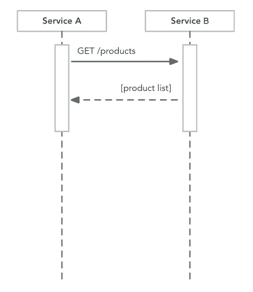
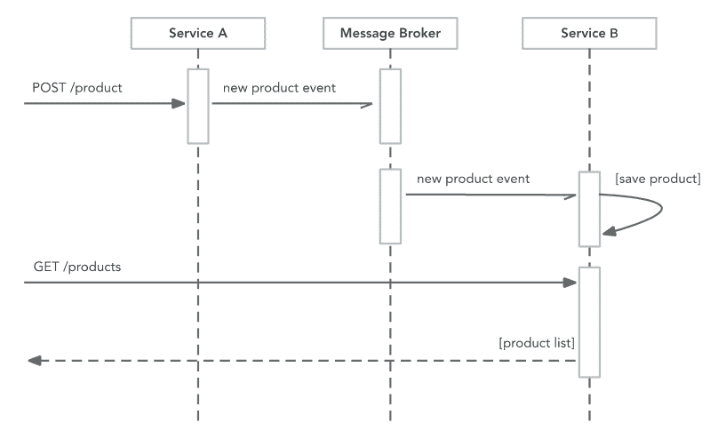
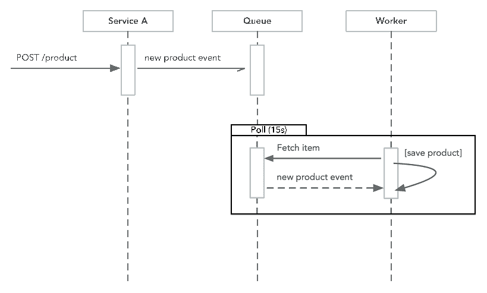
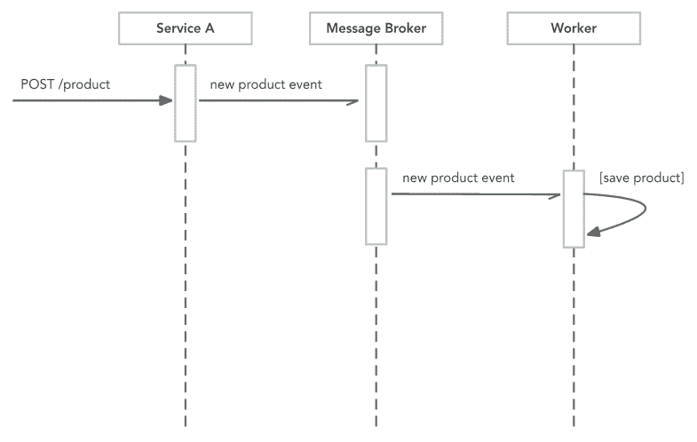
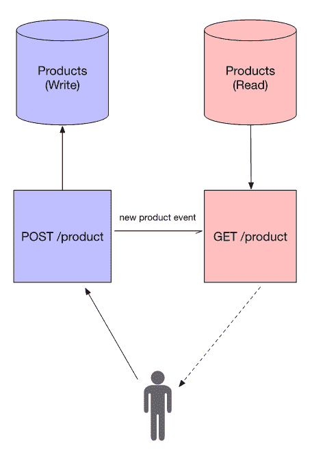

# 事件驱动架构

在过去的几章中，我们探讨了稳定性和性能方面的问题，以及你可以在代码中采用的某些模式，这些模式能够使系统更加稳定。在本章中，我们将更深入地探讨事件驱动架构。

随着你的系统不断增长，这些模式变得越来越重要；它们允许你松散地耦合你的微服务，因此你不必绑定到在单体应用中常见的相互交织的对象的相同依赖。我们将了解到，通过适当的前期设计和努力，使用事件来松散耦合系统并不一定是一个痛苦的过程。

在我们开始之前，请确保从[`github.com/building-microservices-with-go/chapter9`](https://github.com/building-microservices-with-go/chapter9)获取源代码。

# 同步处理和异步处理之间的差异

如果在同步处理消息和异步处理消息之间有选择，那么我总是会选择同步，因为它总是使应用程序更简单，组件更少，代码更容易理解，测试更容易编写，系统更容易调试。

异步处理应该是一个由需求驱动的设计决策，无论是解耦、扩展、批量处理还是基于时间的处理。**事件驱动系统**能够以比单体系统更高的水平进行扩展，其原因是由于松散耦合，代码可以水平扩展，具有更大的粒度和效率。

异步处理的一个问题是它给你的操作增加了额外的负担。我们需要创建消息队列和消息传递的基础设施，这个基础设施需要被监控和管理，即使你正在使用云提供商的功能，如 SNS/SQS 或 PubSub。

甚至有一个问题，即你是否应该实现微服务或构建单体，然而，我认为较小的代码块总是更容易部署和测试，尽管这会增加设置持续集成和硬件供应的重复性，但这是一个一次性障碍，也是值得学习的事情。我们将在下一章中探讨这一点，当我们检查持续部署和不可变基础设施时，但现在，让我们继续关注事件。

在解决了警告之后，让我们重新审视两种消息处理方式的差异。

# 同步处理

使用同步处理，所有与下游应用的通信都在进程中发生。发送一个请求，并使用相同的网络连接等待回复，而不是使用任何回调。同步处理是通信的最简单方法；当你等待答案时，下游服务正在处理请求。你必须自己管理重试逻辑，并且通常仅在需要立即回复时使用最佳。让我们看看以下描述同步处理的图示：



# 异步处理

使用异步处理，所有与下游应用的通信都在进程外发生，利用队列或消息代理作为中介。而不是直接与下游服务通信，消息被调度到队列，例如 **AWS SQS/SNS**、**Google Cloud Pub/Sub** 或 **NATS.io**。由于在这一层没有进行任何处理，唯一的延迟就是传递消息所需的时间，这非常快，也得益于这些系统的设计，消息的接受与否是你必须实现的唯一情况。重试和连接处理逻辑委托给消息代理或下游系统，因为它是消息的存储，用于归档或重放：



# 异步消息类型

异步处理通常有两种不同的形式，例如推送和拉取。你实施的策略取决于你的需求，通常一个系统会实现这两种模式。让我们来看看这两种不同的方法。

# 拉取/队列消息

拉取模式是一种优秀的设计，你可能有一个运行中的工作进程，例如调整图片大小。API 会接收请求，然后将其添加到队列以进行后台处理。工作进程或进程从队列中读取消息，逐个执行所需的工作，然后从队列中删除消息。通常还有一个队列，通常称为“死信队列”，如果工作进程因任何原因失败，则消息将被添加到死信队列。死信队列允许在增量失败或调试目的的情况下重新处理消息。让我们看看以下总结整个过程的图示：



在 Go 中实现基于队列的服务是一个相对直接的任务，让我们通过这本书附带源代码中的示例来了解一下。这个示例使用 Redis 来存储消息。Redis 是一个极快的数据库存储，虽然能够利用云服务提供商的队列而不是管理我们的基础设施是件好事，但这并不总是可能的。然而，即使我们使用云服务提供商的队列，我们即将看到的模式也容易用不同的数据存储客户端替换。如果我们考虑 `queue/queue.go` 中的示例代码的以下列表：

```go
  7 // Message represents messages stored on the queue 
  8 type Message struct { 
  9   ID      string `json:"id"` 
 10   Name    string `json:"name"` 
 11   Payload string `json:"payload"` 
 12 } 
 13 
 14 // Queue defines the interface for a message queue 
 15 type Queue interface { 
 16   Add(messageName string, payload []byte) error 
 17   AddMessage(message Message) error 
 18   StartConsuming(size int, pollInterval time.Duration, callback func(Message) error) 
 19 } 

```

我们首先定义了一个 `Message` 对象，该对象由系统使用，并定义了三个简单的参数，这些参数可以序列化为 JSON。ID 永远不是由发布者直接填充的，而是每个消息都有的一个唯一计算出的 ID。如果消费者需要一个简单的机制来确定消息是否已经被接收和处理，那么可以使用 ID。`Queue` 接口定义了三个简单的方法，如下所示：

+   `Add(messageName string, payload []byte) error`：`Add` 是一个方便的方法，用于发布一条新消息，发送者只需要提供消息的名称和一个字节数组。

+   `AddMessage(message Message) error`：`AddMessage` 执行与 `Add` 相同的功能，不同之处在于调用者需要构造一个 `Message` 类型并将其传递给该方法。`AddMessage` 的实现会自动生成 `Message struct` 中的 `ID` 字段，并覆盖任何初始的 `ID` 值。

+   `StartConsuming(size int, pollInterval time.Duration, callback func(Message) error)`: `StartConsuming` 允许订阅者从队列中检索消息。第一个参数 `size` 与批次大小相关，它是在任何一次连接中返回的。`pollInterval` 参数决定了客户端检查队列中消息的频率。当消息从队列返回时，会执行 `callback` 函数。它有一个返回参数 `error`，当它不为 `nil` 时，通知客户端处理失败，并且消息不应该从队列中移除。需要注意的一点是，`StartConsuming` 不是一个阻塞方法，在它将回调函数注册到队列后，它立即返回。

在 `queue/redis_queue.go` 的实现中定义了 `NewRedisQueue` 函数，这是一个方便的函数，用于创建我们的队列。我们使用 `github.com/adjust/rmq` 库，该库在 Redis 队列之上有一个出色的实现。在第 **27** 行，我们打开了一个连接到我们的 Redis 数据存储：

```go
 26 // NewRedisQueue creates a new RedisQueue 
 27 func NewRedisQueue(connectionString string, queueName string) (*RedisQueue, error) { 
 28   connection := rmq.OpenConnection("my service", "tcp", connectionString, 1) 
 29   taskQueue := connection.OpenQueue(queueName) 
 30 
 31   return &RedisQueue{Queue: taskQueue, name: queueName}, nil 
 32 }  

```

在第 **29** 行，我们需要打开一个连接到我们将要从中读取和写入的队列：

```go
 42 // AddMessage to the queue, generating a unique ID for the message before dispatch 
 43 func (r *RedisQueue) AddMessage(message Message) error { 
 44   serialNumber, _ := rand.Int(rand.Reader, serialNumberLimit) 
 45   message.ID = strconv.Itoa(time.Now().Nanosecond()) + serialNumber.String() 
 46 
 47   payloadBytes, err := json.Marshal(message) 
 48   if err != nil { 
 49     // handle error 
 50     return err 
 51   } 
 52 
 53   fmt.Println("Add event to queue:", string(payloadBytes)) 
 54   if !r.Queue.PublishBytes(payloadBytes) { 
 55     return fmt.Errorf("unable to add message to the queue") 
 56   } 
 57 
 58   return nil 
 59 }  

```

`Add` 方法，这是我们的接口 `Add` 方法的实现，仅仅是一个便利方法，它从给定的参数创建一个消息，然后调用 `AddMessage` 函数。`AddMessage` 函数首先为消息生成一个 ID，在这个简单的实现中，我们只是生成一个随机数并将其附加到当前时间的纳秒数上，这应该足以提供足够的唯一性，而无需检查队列。然后我们需要将消息转换为它的 JSON 表示形式，作为一个字节数组，在我们最终在第 **54** 行将消息发布到队列之前。

我们实现中的最后一部分是消费队列中消息的方法：

```go
 61 // StartConsuming consumes messages from the queue 
 62 func (r *RedisQueue) StartConsuming(size int, pollInterval time.Duration, callback func(Message) error) { 
 63   r.callback = callback 
 64   r.Queue.StartConsuming(size, pollInterval) 
 65   r.Queue.AddConsumer("RedisQueue_"+r.name, r) 
 66 } 
 67 
 68 // Consume is the internal callback for the message queue 
 69 func (r *RedisQueue) Consume(delivery rmq.Delivery) { 
 70   fmt.Println("Got event from queue:", delivery.Payload()) 
 71 
 72   message := Message{} 
 73 
 74   if err := json.Unmarshal([]byte(delivery.Payload()), &message); err != nil { 
 75     fmt.Println("Error consuming event, unable to deserialise event") 
 76     // handle error 
 77     delivery.Reject() 
 78     return 
 79   } 
 80 
 81   if err := r.callback(message); err != nil { 
 82     delivery.Reject() 
 83     return 
 84   } 
 85 
 86   delivery.Ack() 
 87 } 

```

`StartConsuming` 方法只负责将回调设置到队列实例上；然后我们调用 `StartConsuming` 和 `AddConsumer` 方法，这两个方法属于 Redis 包。在第 **65** 行，我们将回调消费者设置为队列自身使用，而不是传递到方法中的回调。将委托模式分配给内部方法允许我们从实现代码库中抽象出底层队列的实现。当检测到队列上有新消息时，会调用 `Consume` 方法，传递 `rmq.Delivery` 的实例，这是一个在 `rmq` 包中定义的接口：

```go
type Delivery interface { 
  Payload() string 
  Ack() bool 
  Reject() bool 
  Push() bool 
} 

```

我们需要做的第一件事是将作为字节数组传递的消息反序列化到我们的 `Message` 结构中。如果这失败，我们将在 `Delivery` 接口上调用 `Reject` 方法，将消息推回队列。一旦我们得到回调期望的消息格式，我们就可以执行传递给 `StartConsuming` 方法的 `callback` 函数。回调的类型如下：

```go
func(Message) error 

```

实现此方法的代码的责任是在消息处理失败时返回一个错误。返回错误允许我们的消费代码调用 `delivery.Reject()`，这将使消息留在队列中以便稍后处理。当消息成功处理时，我们传递一个 `nil` 错误，并且消费者调用 `delivery.Ack()`，这表示消息已成功处理并从队列中移除。这些操作是进程安全的；它们不应可供其他消费者使用，因此在我们有多个工作者读取队列的情况下，我们可以确保他们都在不同的列表上工作。

让我们看看一个将消息写入队列的服务实现，如果我们查看 `queue/writer/main.go` 的示例代码文件，我们可以看到这是一个非常简单的实现。这对于生产系统来说过于简单，处理程序中没有消息验证或安全性。然而，这个例子被简化到最基本的形式，以突出显示消息是如何添加到队列中的：

```go
   16 func main() { 
   17   q, err := queue.NewRedisQueue("redis:6379", "test_queue") 
   18   if err != nil { 
   19     log.Fatal(err) 
   20   } 
   21 
   22   http.HandleFunc("/", func(rw http.ResponseWriter, r 
        *http.Request) { 
   23     data, _ := ioutil.ReadAll(r.Body) 
   24     err := q.Add("new.product", data) 
   25     if err != nil { 
   26       log.Println(err) 
   27       rw.WriteHeader(http.StatusInternalServerError) 
   28       return                                                                                                                                      
   29     } 
   30   }) 
   31 
   32   http.ListenAndServe(":8080", http.DefaultServeMux) 
   33 } 

```

我们创建一个`RedisQueue`实例，并传递我们 Redis 服务器的位置和我们想要写入消息的队列名称。然后我们有一个非常简单的`http.Handler`实现；这个函数将请求体作为字节数组读取，并使用消息名称和有效载荷调用`Add`方法。然后我们在返回和关闭连接之前检查此操作的输出。

消费者实现甚至更简单，因为此代码实现了一个简单的工作者，并且没有实现任何基于 HTTP 的接口：

```go
11 func main() { 
12   log.Println("Starting worker") 
13 
14   q, err := queue.NewRedisQueue("redis:6379", "test_queue") 
15   if err != nil { 
16     log.Fatal(err) 
17   } 
18 
19   q.StartConsuming(10, 100*time.Millisecond, func(message 
queue.Message) error { 
20     log.Printf("Received message: %v, %v, %v\n", message.ID, message.Name, message.Payload) 
21 
22     return nil // successfully processed message 
23   }) 
24 
25   runtime.Goexit() 
26 } 

```

与客户端类似，我们创建我们的队列实例，然后调用带有我们请求参数和`callback`函数的`StartConsuming`方法。`callback`方法为从队列中检索到的每条消息执行，由于我们可能每 100 毫秒返回一批 10 条消息，因此此方法可能会快速连续调用，并且每次执行都在自己的`goroutine`中运行，因此在编写实现时，我们需要考虑这个细节。例如，如果我们处理消息并将它们写入数据库，那么数据库的连接数不是无限的。为了确定合适的批量大小，我们需要进行初始测试，并随后进行持续监控，以便调整应用程序以获得最佳性能。这些设置应作为参数实现，以便在硬件扩展时易于更改。

# 推送消息

有时候，你希望服务能够立即对事件做出反应，而不是使用队列。你的服务订阅从像 NATS.io 或 SNS 这样的代理接收消息。当代理收到来自另一个服务的消息时，代理会通过调用已注册的端点并发送消息副本来通知所有已注册的服务。接收者通常在收到消息后断开连接，并假设消息已正确处理。这种模式允许消息代理具有极高的吞吐量，在 NATS.io 的情况下，单个服务器实例每秒可以处理数百万条消息。如果客户端无法处理消息，则必须处理管理这种失败的逻辑。这种逻辑可能是向代理发送通知，或者消息可以被添加到死信队列以供稍后重放。



在此示例中，我们将利用 NATS.io 的力量作为我们系统的消息代理，NATS 是一个由 Go 编写的极其轻量级的应用程序，提供了惊人的性能和稳定性。查看`push/writer/main.go`，我们可以看到我们不需要编写很多代码来实现 NATS.io：

```go
 24 func main() { 
 25   var err error 
 26   natsClient, err = nats.Connect("nats://" + *natsServer) 
 27   if err != nil { 
 28     log.Fatal(err) 
 29   } 
 30   defer natsClient.Close() 
 31 
 32   http.DefaultServeMux.HandleFunc("/product", productsHandler) 
 33 
 34   log.Println("Starting product write service on port 8080") 
 35   log.Fatal(http.ListenAndServe(":8080", http.DefaultServeMux)) 
 36 } 

```

当我们开始我们的应用程序时，首先需要做的事情是通过在`nats`包上调用`Connect`函数来连接 NATS 服务器：

```go
func Connect(url string, options ...Option) (*Conn,error)

```

`url` 参数定义为字符串，需要稍作说明。虽然你可以传递单个 URL，如 `nats://server:port`，但你也可以传递以逗号分隔的服务器列表。这样做的原因是为了容错，NATS 实现了集群，在我们的简单示例中我们只有一个实例，然而，在生产环境中，你将会有多个实例以实现冗余。然后我们定义我们的 `http.Handler` 函数并暴露 `/product` 端点：

```go
 37 func productsHandler(rw http.ResponseWriter, r *http.Request) { 
 38   if r.Method == "POST" { 
 39     insertProduct(rw, r) 
 40   } 
 41 } 
 42 
 43 func insertProduct(rw http.ResponseWriter, r *http.Request) { 
 44   log.Println("/insert handler called") 
 45 
 46   data, err := ioutil.ReadAll(r.Body) 
 47   if err != nil { 
 48     rw.WriteHeader(http.StatusBadRequest) 
 49     return 
 50   } 
 51   defer r.Body.Close() 
 52 
 53   natsClient.Publish("product.inserted", data) 
 54 } 

```

处理器的实现非常直接，我们将工作委托给 `insertProduct` 函数。再次强调，在实现方面这很简短，以突出发布消息的使用；在生产环境中会有更高级别的实现来管理安全和验证。

在第 **53** 行，我们在客户端调用 `Publish` 方法；该方法具有一个极其简单的签名，包含主题和有效载荷：

```go
func (nc *Conn) Publish(subjstring, data []byte)error

```

关于主题，我们需要考虑这是订阅者将要使用的相同名称，并且它必须是唯一的，否则可能会出现意外收件人接收消息的情况，这是一个极其难以追踪的错误。NATS 的完全可配置选项在 GoDoc [`godoc.org/github.com/nats-io/go-nats`](https://godoc.org/github.com/nats-io/go-nats) 中，相当全面。

现在我们已经看到向 NATS 发布消息是多么容易，让我们看看消费它们有多简单。如果我们查看 `push/reader/main.go` 中的示例代码，我们可以看到订阅消息非常简单：

```go
 25 func main() { 
 26   var err error 
 27   natsClient, err = nats.Connect("nats://" + *natsServer) 
 28   if err != nil { 
 29     log.Fatal(err) 
 30   } 
 31   defer natsClient.Close() 
 32 
 33   log.Println("Subscribing to events") 
 34   natsClient.Subscribe("product.inserted", handleMessage) 
 35 } 
 36 
 37 func handleMessage(m *nats.Msg) { 
 38   p := product{} 
 39   err := json.Unmarshal(m.Data, &p) 
 40   if err != nil { 
 41     log.Println("Unable to unmarshal event object") 
 42     return 
 43   } 
 44 
 45   log.Printf("Received message: %v, %#v", m.Subject, p) 
 46 } 

```

再次，我们连接到 NATS 服务器，但要开始接收事件，我们在客户端调用 `Subscribe` 方法：

```go
func (nc *Conn) Subscribe(subjstring, cbMsgHandler) (*Subscription,error)

```

`Subscribe` 方法将表达对给定主题的兴趣。主题可以有通配符（部分：`*`，全部：`>`）。消息将被发送到相关的 `MsgHandler`。

如果没有提供 `MsgHandler`，则订阅是同步订阅，可以通过 `Subscription.NextMsg()` 进行轮询。

与我们的队列示例不同，我们不是轮询 NATS 服务器，而是暴露一个端点并将其注册到 NATS。当 NATS 服务器接收到一条消息时，它会尝试将其转发给所有已注册的端点。使用前一个代码示例中的实现，我们为系统上运行的每个工作进程获取消息的副本，这并不是最佳方案。我们不必自己管理这一点，可以使用 API 上的另一种方法，即 `QueueSubscribe`：

```go
func (nc *Conn) QueueSubscribe(subj, queuestring, cbMsgHandler) (*Subscription,error)

```

`QueueSubscribe` 函数在给定的主题上创建一个异步队列订阅者。具有相同队列名称的所有订阅者形成一个队列组，并且该组中只有一位成员会异步接收任何给定的消息。

签名类似于 `Subscribe` 方法，只是我们传递了一个额外的参数，即队列的名称或希望注册对给定主题感兴趣的唯一订阅者集群的名称。

现在我们已经定义了两种主要类型的异步消息，并查看每种的简单实现。让我们看看两种利用这种技术的常见模式。

# 命令查询责任分离（CQRS）

CQRS 是命令查询责任分离的缩写，这个术语归功于格雷格·杨（Greg Young）。这个概念是，你使用不同的模型来更新信息，而不是用于读取信息的模型。实施 CQRS 的两个主要原因是当模型存储与模型展示有显著差异时，以及当这种方法的背后概念是尝试创建一个针对存储优化的模型和一个针对显示优化的模型可能都无法解决这两个问题时。因此，CQRS 将这些模型分为用于展示逻辑的 **查询** 模型和用于存储和验证的 **命令** 模型。另一个好处是当我们在高性能应用程序中想要在读取和写入之间分离负载时。CQRS 模式并不是非常常见，当然也不应该到处使用，因为它确实增加了复杂性；然而，它是一个非常有用的模式，应该纳入你的工具箱中。

让我们看看以下图表：



在我们的示例代码中，我们再次利用 NATS.io 来代理消息。然而，这并不一定是必须的。拥有一个服务同时具有两个独立的读写模型是合法的设置。而不是在进程通信中使用消息代理的复杂性，也可以同样有效地使用。

查看位于 `cCQRS/product_writer/main.go` 的示例代码：

```go
 26 func init() { 
 27   flag.Parse() 
 28 
 29   schema = &memdb.DBSchema{ 
 30     Tables: map[string]*memdb.TableSchema{ 
 31       "product": &memdb.TableSchema{ 
 32         Name: "product", 
 33         Indexes: map[string]*memdb.IndexSchema{ 
 34           "id": &memdb.IndexSchema{ 
 35             Name:    "id", 
 36             Unique:  true, 
 37             Indexer: &memdb.StringFieldIndex{Field: "SKU"}, 
 38           }, 
 39         }, 
 40       }, 
 41     }, 
 42   } 
... 
 66   natsClient, err = nats.Connect("nats://" + *natsServer) 
 67   if err != nil { 
 68     log.Fatal(err) 
 69   } 
 70 } 

```

为了简单起见，这个例子使用了一个内存数据库，由 HashiCorp 编写的 `https://github.com/hashicorp/go-memdb`，大部分设置是配置这个数据存储。我们将分离我们的读取和写入数据存储，读取服务不实现任何返回产品给调用者的方法。相反，这个责任委托给第二个服务，该服务运行一个独立的数据库，甚至不同的数据模型：

```go
 84 func insertProduct(rw http.ResponseWriter, r *http.Request) { 
 85   log.Println("/insert handler called") 
 86 
 87   p := &product{} 
 88 
 89   data, err := ioutil.ReadAll(r.Body) 
 90   if err != nil { 
 91     rw.WriteHeader(http.StatusBadRequest) 
 92     return 
 93   } 
 94   defer r.Body.Close() 
 95 
 96   err = json.Unmarshal(data, p) 
 97   if err != nil { 
 98     log.Println(err) 
 99     rw.WriteHeader(http.StatusBadRequest) 
100     return 
101   } 
102 
103   txn := db.Txn(true) 
104   if err := txn.Insert("product", p); err != nil { 
105     log.Println(err) 
106     rw.WriteHeader(http.StatusInternalServerError) 
107     return 
108   } 
109   txn.Commit() 
110 
111   natsClient.Publish("product.inserted", data) 
112 } 

```

我们的处理程序首先将模型写入数据库，然后像我们的推送示例一样，向 NATS 发布包含消息负载的消息。

再次查看位于 `CQRS/product-read/main.go` 的读取服务器，我们正在设置我们的数据存储，然而，模型与读取模型不同：

+   **写入模型**：

```go
        type product struct { 
           Name       string `json:"name"` 
           SKU        string `json:"sku"` 
           StockCount int    `json:"stock_count"`                                                                                                        
        } 

```

+   **读取模型**：

```go
        type product struct { 
          Name        string `json:"name"` 
          Code        string `json:"code"` 
          LastUpdated string `json:"last_updated"` 
        } 

```

我们还定义了一个包含从 NATS 收到的事件详细信息的结构。在这个例子中，这个结构反映了写入模型；然而，这并不总是必须的：

```go
type productInsertedEvent struct { 
  Name string `json:"name"` 
  SKU  string `json:"sku"` 
} 

```

在接收到消息后，我们首先将有效载荷解码为预期的类型`productInsertedEvent`，然后将其转换为存储在数据库中的产品模型。最后，我们将信息存储在数据库中，以我们的消费者希望接收的格式创建我们的副本：

```go
112 func productMessage(m *nats.Msg) { 
113   pie := productInsertedEvent{} 
114   err := json.Unmarshal(m.Data, &pie) 
115   if err != nil { 
116     log.Println("Unable to unmarshal event object") 
117     return 
118   } 
119 
120   p := product{}.FromProductInsertedEvent(pie) 
121 
122   txn := db.Txn(true) 
123   if err := txn.Insert("product", p); err != nil { 
124     log.Println(err) 
125     return 
126   } 
127   txn.Commit() 
128 
129   log.Println("Saved product: ", p) 
130 } 

```

当用户调用`/products`端点时，他们得到的是本地缓存的副本数据，而不是存储在单独服务中的主数据。这个过程可能会引起一致性问题，因为两个数据副本最终是一致的，当我们实现 CQRS 模式时，我们需要考虑这一点。如果我们公开库存水平，那么可能不希望有最终一致性，然而，我们可以做出设计决策，当需要这个信息时，我们通过向库存端点发起同步调用牺牲性能来获取。

# 领域驱动设计

在实现事件驱动微服务时，你需要很好地掌握你的系统运作方式以及数据、交互如何从一个服务流向下一个服务。对任何复杂系统进行建模的一个有用技术是领域驱动设计。

当谈到领域驱动设计时，那么就有 Vaughn Vaughn，他的两本书《领域驱动设计精粹》和《实现领域驱动设计》扩展了 Eric Evans 的开创性工作，对于一些人来说，这些工作可能有些难以阅读。对于 DDD 的新手，我建议从《领域驱动设计精粹》开始阅读，然后转向阅读《实现领域驱动设计》。首先阅读《领域驱动设计精粹》为你提供了术语的基础，然后再深入研究这是一本相当详细的书。DDD 绝对是一个高级话题，不可能在这本书的一个章节中全面涵盖，我也不敢声称有足够的经验来写得更详细，因为 DDD 是一种通过实践学习的模式。DDD 也是一个用于更复杂的大型系统、有众多利益相关者和许多动态部件的工具。即使你不在这样的系统上工作，聚合和隔离的概念也是引人入胜的，并且适用于大多数系统。至少，继续阅读以使你在下一次架构会议中更擅长玩“流行词汇接龙”。

# 什么是 DDD？

引用 Vaughn Vernon 自己的话：

"DDD 是一套工具，帮助你设计和实现能够带来高价值的软件，无论是战略上还是战术上。你的组织不可能在所有事情上都做得最好，所以它必须谨慎选择必须精通的事情。DDD 战略开发工具帮助你和你团队做出最具竞争力的软件设计选择和业务集成决策。"

-- Vaughn Vernon

这确实是一个相当长的介绍；然而，我认为它突出了这样一个事实，即领域驱动设计（DDD）是设计软件的工具，而不是一个软件框架。在二十年前那些黑暗的日子里，软件架构师和项目经理会做出软件系统设计的决策，他们通常会提供非常详细的计划，由开发团队执行。根据我的经验，这很少是一种愉快的工作方式，而且也没有产生高质量的软件，也没有按时交付。敏捷革命提出了另一种工作方式，幸运的是，它改善了这种情况。我们现在也把自己视为软件工程师，而不是开发者，我不认为这种转变是时尚，而是由我们所看到的角色变化所驱动的。你现在扮演的角色是一个设计师、特性的谈判者、架构师、调解者，你还必须对可用的材料有全面的理解，包括对压力和应变的反应。你现在扮演的角色更像是一位传统工程师，而不是过去软件开发者所扮演的装配线工人角色。

希望这能回答你心中可能存在的疑问，即为什么在关于 Go 的书中需要学习 DDD。好吧，这本书从未被写成用来教你语言，它旨在展示你如何使用它来构建成功的微服务。

我听到很多关于 DDD 的噪音，说它是一种困难的技巧，诚实地讲，当我第一次阅读 DDD 时，我也感到同样的感觉，所有关于聚合、通用语言、领域和子领域的东西。然而，一旦我开始思考 DDD 以实现分离，并思考我过去在混乱的领域模型中遇到的问题，它就逐渐开始在我脑海中清晰起来。

# 技术债务

如果你曾经参与过单体应用的开发，你就会意识到对象之间发生的耦合和依赖，这主要发生在数据层，然而，你也经常发现代码没有正确实现，并且与另一个对象紧密绑定。当你想要改变这个系统时，问题就出现了；一个区域的变化会在另一个区域产生不期望的影响，而且只有当你幸运的时候才会如此。在做出改变之前，系统重构需要巨大的努力。通常发生的情况是，修改被强行塞入现有的代码库中，而没有进行重构，坦白说，对系统来说，把它拿到外面，绕到谷仓后面，然后在它的后脑勺卸下两颗霰弹会更仁慈一些。

不要自欺欺人，认为你会有机会做这件事；如果你曾经参与过任何真正年龄的系统，你的工作就像列宁的防腐师。当你本应该挖个坑把尸体埋掉的时候，你却花费了巨大的努力来保持尸体看起来体面。DDD 可以帮助你理解单体架构并逐步解耦它；它也是一个工具，可以防止无序的单体架构发生。让我们快速看一下技术解剖结构。

# DDD 的解剖结构

在 DDD 中，战略设计的主要部分是应用一个称为**边界上下文**的概念。边界上下文是将你的领域分割成模型的方法。通过使用称为**上下文映射**的技术，你可以通过定义团队和技术关系来整合多个边界上下文。

战术设计是在这里细化你的领域模型细节的地方。在这个阶段，我们学习如何将实体和值对象聚合在一起。

# 战略设计

在处理 DDD 时，你经常会听到的一个短语是“边界上下文”。边界上下文的概念是一个语义上下文边界，其中每个边界内的组件具有特定的含义并执行特定的事情。其中最重要的边界上下文之一是**核心域**；这是使你的组织在竞争中区别于其他所有组织的领域。我们已经提到，你不能做所有的事情，通过专注于你的核心域，这应该是你花费大部分时间的地方。

# 战术设计

从战略设计的基座出发是战术设计，再次引用 Vaughn Vernon 的话：

“战术设计就像用细刷为你的领域模型描绘更细致的细节。”

--Vaughn Vernon

在这个设计阶段，我们需要开始考虑**聚合**和**领域事件**。聚合由实体和值对象组成。值对象模拟一个不可变的整体，它没有唯一的标识符，等价性是通过比较值类型封装的属性来确定的。领域事件由聚合发布并由感兴趣的各方订阅。这种订阅可能来自同一个边界上下文，也可能来自不同的来源。

# 通用语言

在 DDD 中，通用语言这个术语指的是一个核心语言，团队中的每个人都理解正在开发的软件。完全有可能，在不同的上下文中并由不同的团队开发的组件，对于相同的术语有不同的含义。实际上，他们可能正在谈论与你的模型不同的组件。

你如何开发通用语言是一个团队将形成的活动。你不应该过分强调只使用名词来描述你的模型，你应该开始构建简单的场景。考虑我们来自测试章节的例子，我们在功能测试和集成测试中使用了 BDD。这些是你的场景；你写它们的语言是你的团队的通用语言。你应该编写这些场景，使它们对你团队有意义，而不是试图编写对整个部门都有意义的东西。

# 边界上下文

使用边界上下文的一个主要原因是，团队往往不知道何时停止将事物堆积到他们的软件模型中。随着团队添加更多功能，模型很快变得难以管理和理解。不仅如此，模型的语言开始变得模糊。当软件变得庞大且错综复杂，有许多无关的相互连接时，它开始成为所谓的*大泥球*。大泥球可能比你的传统单体更糟糕。单体本身并不是邪恶的，只是因为它们是单体的；单体之所以不好，是因为在它们内部，良好的编码标准早已被遗忘。边界上下文过大且由太多人拥有的另一个问题是，它开始变得难以使用通用语言来描述它。

# 上下文映射

当 DDD 中的两个边界上下文需要集成时，这种集成被称为上下文映射。定义这种上下文映射的重要性在于，一个定义良好的合同支持随着时间的推移进行受控的变更。在《领域驱动设计精粹》一书中，Vaughn Vernon 描述了以下不同类型的映射：

+   **伙伴关系**：当两个团队各自负责一个边界上下文，并且有一个依赖的目标集时，存在伙伴关系映射。

+   **共享内核**：共享内核由两个独立的边界上下文的交集定义，当两个团队共享一个小但共同的模式时存在。

+   **客户-供应商**：客户-供应商描述了两个边界上下文及其各自团队之间的关系。供应商是上游上下文，下游是客户。供应商必须提供客户所需的东西，两个团队必须共同规划以满足他们的期望。只要供应商仍然考虑客户的需求，这将是团队之间非常典型且实用的关系。

+   **遵从者**：当存在上游团队和下游团队，且上游团队没有动机支持下游团队的具体需求时，存在遵从者关系。而不是将上游的通用语言翻译成适合其自身需求，下游团队采用上游的语言。

+   **反腐败层**：当你连接两个系统时，这是一个标准和推荐的模型，下游团队在其通用语言和上游语言之间构建一个翻译层，从而将其与上游隔离开来。

+   **开放主机服务**：开放主机服务定义了一个协议或接口，它允许您将边界上下文作为一组服务访问。这些服务通过一个良好的文档化的 API 提供，并且易于消费。

+   **发布语言**：发布语言是一个经过良好文档化的信息交换语言，它使消费和翻译变得容易。**XML Schema**、**JSON Schema** 和基于 **RPC** 的框架，如 **Protobufs** 常常被使用。

+   **分道扬镳**：在这种情况下，通过消费各种通用语言并没有带来显著收益，团队决定在其边界上下文中生成他们的解决方案。

+   **一团糟**：现在这应该已经很明确了，这不是团队应该追求的目标；事实上，这正是 DDD 努力避免的事情。

# 软件

当我们开始使用 DDD 和面向事件架构时，我们很快就会发现自己需要一些帮助来代理我们的消息，以确保应用程序所需的至少一次和最多一次投递。我们当然可以实施我们的策略。然而，互联网上有许多开源项目为我们处理这种能力，很快我们就发现自己正在寻求利用这些项目之一。

# Kafka

Kafka 是一个分布式流平台，允许您发布和订阅记录流。它允许您以容错的方式存储文档流，并按发生顺序处理记录流。它被设计为一个快速且容错的系统，通常作为一个或多个服务器的集群运行，以实现冗余。

# NATS.io

NATS.io 是一个用 Go 编写的开源消息系统，它具有执行最多一次和至少一次投递的能力，让我们看看这意味着什么：

+   **最多一次投递**：在基本模式下，NATS 可以充当 Pub/Sub 路由器，其中监听客户端可以订阅消息主题，并将新消息推送到它们。如果一个消息没有订阅者，那么它将被发送到 `/dev/null` 并不会在系统内部存储。

+   **至少一次投递**：当需要更高层次的服务和更严格的投递保证时，NATS 可以在至少一次投递模式下运行。在这种模式下，NATS 无法作为一个独立的实体运行，需要由存储设备支持，目前支持的存储设备包括文件和内存。现在，NATS 流式传输不支持扩展和复制，这正是 Kafka 发挥优势的地方。然而，我们并不是所有都在构建像 Netflix 那样大的系统，Kafka 的配置和管理本身就是一本专著，而 NATS 可以很快地理解。

# AWS SNS/SQS

亚马逊的**简单队列服务**（**SQS**）是一种队列服务，允许发布者向队列中添加消息，这些消息随后可以被客户端消费。消息被读取并从队列中移除，使其对其他读者不再可用。

SQS 有两种不同类型，例如标准模式，它以牺牲消息可能被多次传递为代价提供最大吞吐量，以及 SQS FIFO，它确保消息只被传递一次，并且按照接收的顺序传递。然而，FIFO 队列的吞吐量大幅降低，因此其使用必须仔细考虑。

亚马逊的**简单通知服务**（**SNS**）是一种协调和管理消息队列传递的服务。SNS 代表简单通知服务；你配置一个可以发布消息的主题，然后订阅者可以注册接收通知。SNS 可以将消息传递到以下不同的协议：

+   HTTP(S)

+   Email

+   Email-JSON

+   SMS

+   AWS Lambda

+   SQS

你可能会想知道，为什么你想要将消息添加到队列中，而不是直接将消息推送给接收者？SNS 的一个问题是它只能通过 HTTP 向公开可访问的服务传递消息。如果你的内部工作者没有连接到公共互联网，并且从阅读第八章《安全》，我希望他们不是。因此，基于拉取的方法可能是你的唯一选择；从队列中读取也可能是管理大量消息流的一个更好的选择。你不需要担心 SQS（大多数时候）的可用性，也不需要为可以轮询队列的简单应用程序工作者实现 HTTP 接口。

# Google Cloud Pub/Sub

Google Cloud Pub/Sub 与 AWS SNS 非常相似，因为它是一种消息中间件，允许创建带有发布者和订阅者的主题。在撰写本文时，谷歌云上没有像 SQS 这样的正式产品。然而，使用你拥有的许多数据存储选项之一来实现这一点是非常简单的。

# 摘要

在本章中，我们探讨了使用事件解耦微服务的一些主要模式，我们还介绍了构建分布式系统的现代设计方法，即领域驱动设计（DDD）。有了合适的工具和前期设计，构建高度可扩展和维护的系统不应过于具有挑战性，你现在拥有所有使用 Go 进行此操作所需的信息。在最后一章中，我们将探讨代码的自动化构建和部署，总结你需要成为成功的微服务实践者所需的信息。
