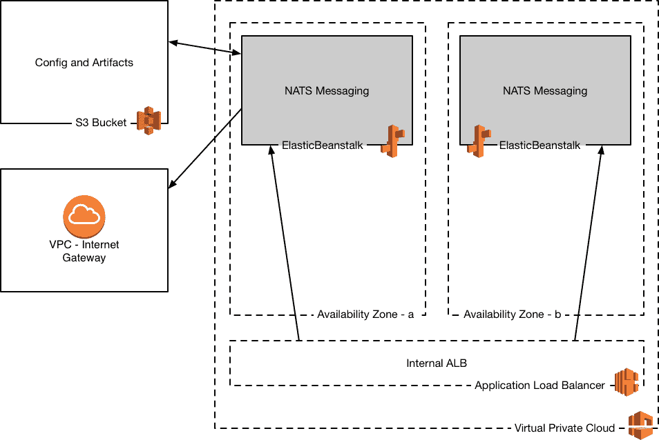
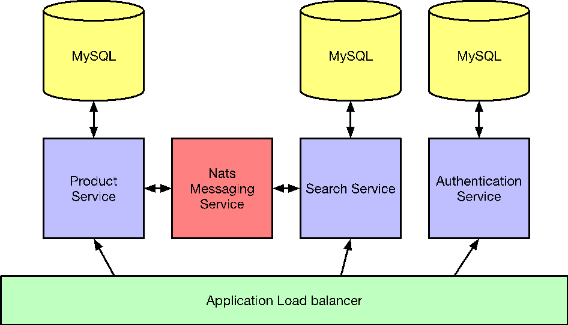
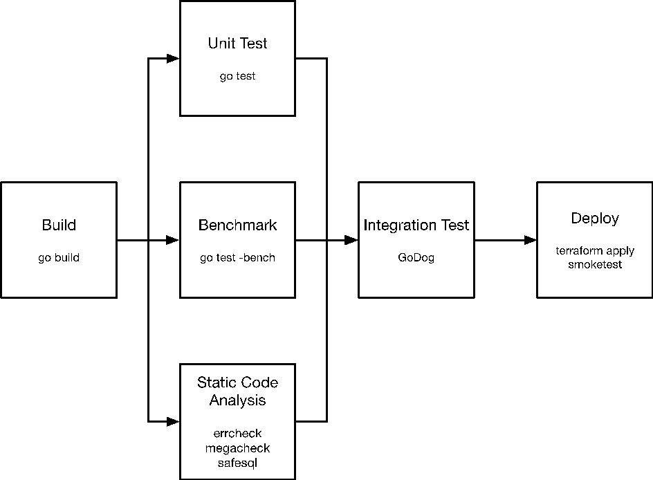
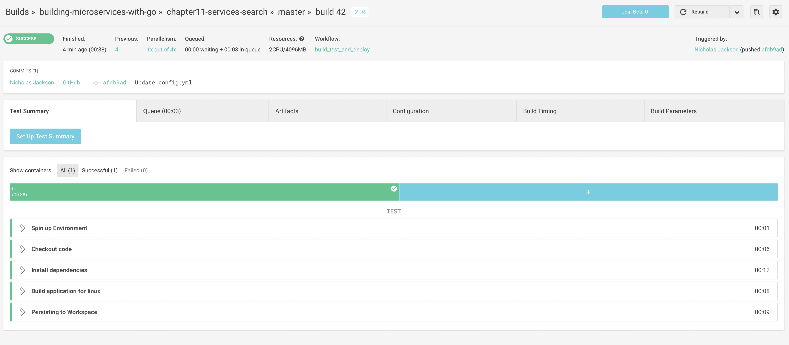
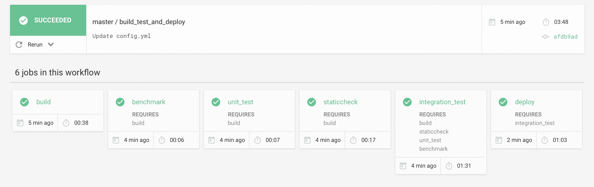

# 持续交付

到目前为止，我们已经涵盖了大量的内容，包括如何构建弹性系统以及如何保持它们的安全，但现在我们需要看看如何替换我们流程中的所有手动步骤并引入持续交付。

在本章中，我们将讨论以下概念：

+   持续交付

+   容器编排

+   不可变基础设施

+   Terraform

+   示例应用

# 什么是持续交付？

持续交付是构建和部署代码的过程，持续进行。目标是尽可能高效和有效地将代码从开发转移到生产。

在传统的或瀑布式的工作流程中，发布围绕着主要功能或更新的完成。大型企业每季度发布一次并不罕见。当我们审视这种策略的原因时，风险和努力经常被提及。发布存在风险，因为软件的信心较弱；发布需要付出努力，因为需要涉及质量保证和软件发布的操作方面的主要是手动流程。其中一部分是我们已经在第五章“常见模式”中讨论过的内容，即对质量的关注，以及可能缺乏令人满意的测试套件或可能无法自动运行的能力。第二个元素涉及到物理部署和部署后的测试过程。到目前为止，我们在这本书中并没有过多地涉及这个方面；我们在第四章“测试”中提到了 Docker。

如果我们能减少部署代码的风险和努力，你会更频繁地做吗？比如每次完成一个小的功能，或者每次修复一个错误，甚至一天好几次？我会鼓励你这样做，在本章中，我们将探讨我们需要了解的所有事情，并基于我们之前学到的所有知识来实现持续交付。

# 手动部署

手动部署最多是问题重重；即使你有一个出色的团队，事情也可能出错。团队越大，知识分布越广，对全面文档的需求就越大。在小团队中，资源有限，部署所需的时间可能会分散构建优质代码的注意力。你还会遇到一个薄弱环节；所以，当负责执行流程的人生病或度假时，你会暂停部署吗？

手动部署的问题

+   部署步骤的顺序和时间可能会出现问题

+   文档需要全面且始终更新

+   对手动测试有显著的依赖

+   存在不同的状态的应用服务器

+   由于前面的几点，手动部署经常出现持续的问题

随着系统的复杂性增加，涉及的组件更多，部署代码所需的步骤也随之增加。由于部署步骤需要按顺序执行，这个过程很快就会变成负担。考虑一下部署应用程序更新的情况，应用程序及其依赖项需要在所有应用程序服务器实例上安装。通常需要更新数据库模式，并且需要在旧应用程序和新应用程序之间进行干净的切换。即使你正在利用 Docker 的强大功能，这个过程也可能充满灾难。随着应用程序复杂性的增加，部署应用程序所需的文档也相应增加，这通常是一个薄弱环节。根据我的个人经验，在截止日期临近时，文档的更新和维护通常是首先受到影响的地方。一旦应用程序代码部署完成，我们需要测试应用程序的功能。假设应用程序是手动部署的，通常会假设应用程序也是手动测试的。测试人员需要运行测试计划（假设有测试计划）来检查系统是否处于正常工作状态。如果系统不工作，那么可能需要逆转过程回滚到之前的状态，或者需要决定热修复应用程序并再次运行标准的构建和部署周期。当这个过程纳入计划发布时，由于整个团队都在场，所以会有更多的安全性。然而，当这个过程在深夜由于事件发生时，会发生什么呢？最好的情况是，修复被部署，然而，没有更新任何文档或流程。最坏的情况是，应用程序最终处于比尝试热修复应用程序代码之前更糟糕的状态。在非工作时间，事件通常由一线响应人员执行，这通常是基础设施团队。我假设如果你没有运行持续交付，那么你也不会遵循开发者值班的做法。那么，部署所需的时间呢？整个团队抽出时间来监视部署的财务成本是多少？这个过程的动机和心理生产力成本又是多少？你有没有因为将应用程序代码部署到生产环境中的不确定性而感到压力？

持续交付消除了这些风险和问题。

# 持续交付的好处

持续交付的概念是，你计划这些问题，并投入前期工作来解决它们。自动化所有涉及步骤允许操作的连续性，并且是一个自我记录的过程。不再需要专门的人类知识，而且移除人类的额外好处是，由于过程的自动化，质量得到了提高。一旦我们有了自动化，提高了部署的质量和速度，我们就可以进一步提高水平，开始持续部署。持续交付的好处包括：

+   发布更小且更简单

+   主分支和功能分支之间的差异更小

+   部署后需要监控的区域更少

+   回滚可能更容易

+   他们更早地交付业务价值

我们开始以更小的块部署我们的代码，不再等待主要功能的完成，而是在每次提交后可能就会进行部署。这样做的主要好处是主分支和功能分支之间的差异更小，合并代码所需的时间也更少。较小的更改也创造了更少的监控区域，因此，如果出现问题，更容易将更改回滚到已知的工作状态。最重要的是，它使你能够更快地交付业务价值；无论是以错误还是新功能的形式，这种能力都比瀑布模型中可用的要早得多。

# 持续交付的方面

持续交付有几个重要的方面，其中大多数对于流程的成功至关重要。在本节中，我们将在探讨如何实现它们以构建我们自己的管道之前，先看看这些方面是什么。

持续交付的重要方面：

+   可重复性和易于设置

+   文物存储

+   测试自动化

+   集成测试自动化

+   基础设施即代码

+   安全扫描

+   静态代码分析

+   烟雾测试

+   端到端测试

+   监控 - 通过指标跟踪部署

# 可重复性和一致性

我有一点疑问，在你们职业生涯的某个时刻，你们可能已经见过这个梗：


如果你们还没有遇到过，不要担心，我确信你们会在某个时刻遇到。*在我的机器上工作*这个梗为什么这么受欢迎？会不会是因为其中包含了很多真实的元素？我确实知道我经历过，我相信你们很多人也经历过。如果我们要持续交付，也就是说尽可能频繁地交付，那么我们需要关注一致性和可重复性。

可重复性是指整个实验或研究的分析可以被复制，无论是同一研究者还是独立工作的其他人。*在我的机器上运行正常*是不被接受的。如果我们想要持续交付，那么我们需要将我们的构建过程编码化，并确保我们的软件和其他元素的依赖项要么最小化，要么得到管理。

另一件重要的事情是我们构建的一致性。我们不能花费时间去修复损坏的构建或手动部署软件，因此我们必须像对待我们的生产代码一样对待它们。如果构建失败，我们需要立即停止生产线并修复它，了解构建失败的原因，并在必要时引入新的安全措施或流程，以防止再次发生。

# 工件存储

当我们实施任何形式的持续集成时，由于构建过程，我们会产生各种工件。这些工件的范围可以从二进制文件到测试输出。我们需要考虑我们将如何存储这些数据；幸运的是，云计算为这个问题提供了许多解决方案。一种解决方案是云存储，如 AWS S3，它非常丰富，且成本较低。许多软件即服务 CI 提供商，如 Travis 和 CircleCI，也提供内置的这种功能；因此，为了利用它，我们几乎不需要做任何事情。如果我们使用 Jenkins，我们也可以利用相同的存储。云的存在意味着我们很少需要担心 CI 工件的管理。

# 测试的自动化

测试自动化是必不可少的，为了确保构建的应用程序的完整性，我们必须在持续集成平台上运行我们的单元测试。测试自动化迫使我们考虑简单且可重复的设置，需要最小化依赖项，我们只应检查代码的行为和完整性。在这一步中，我们避免集成测试，测试应在没有任何东西但`go test`命令的情况下运行。

# 集成测试的自动化

当然，我们确实需要验证我们的代码与任何其他依赖项（如数据库或下游服务）之间的集成。配置错误很容易发生，尤其是在涉及数据库语句时。集成测试的水平应该远低于单元测试的覆盖率，而且我们还需要能够在可重复的环境中运行这些测试。Docker 在这种情况下是一个出色的盟友；我们可以利用 Docker 在多个环境中运行的能力。这使得我们能够在构建服务器上执行之前，在我们的本地环境中配置和调试集成测试。同样，单元测试是成功构建的门槛，集成测试也是如此；这些测试的失败不应导致部署。

# 基础设施即代码

当我们自动化构建和部署过程时，这一步是必不可少的；理想情况下，我们不希望将代码部署到脏环境中，因为这会增加污染的风险，例如错误地 vendored 依赖项。然而，如果需要，我们也需要能够重新构建环境，而且这应该在没有实施我们之前引入的任何问题的前提下成为可能。

# 安全扫描

如果可能的话，安全扫描应该集成到管道中；我们需要尽早和经常地捕捉到 bug。无论你的服务是否面向外部，扫描它都可以确保攻击者有有限的攻击向量可以滥用。我们已经在之前的章节中讨论了模糊测试，执行这项任务所需的时间相当可观，可能不适合包含在管道中。然而，可以在不减缓部署的情况下，将安全扫描的各个方面集成到管道中。

# 静态代码分析

静态代码分析是应对应用程序中 bug 和漏洞的极其有效的工具，通常开发者会将**govet**和**gofmt**等工具作为他们 IDE 的一部分来运行。当源代码保存时，代码检查器会运行并识别源代码中的问题。在管道内运行这些应用程序同样重要，因为我们不能总是保证更改来自已经以这种方式配置的 IDE。除了节省保存时间之外，我们还可以运行静态代码分析来检测 SQL 语句的问题和代码质量的问题。这些额外的工具通常不包括在 IDE 的保存工作流程中，因此，在 CI 上运行它们以检测任何可能遗漏的问题至关重要。

# 烟雾测试

烟雾测试是我们确定部署是否成功的一种方式。我们运行一个测试，这个测试可以从简单的 curl 到更复杂的编码测试，以检查运行中的应用程序中的各种集成点。

# 端到端测试

端到端测试是对运行系统的全面检查，通常遵循用户流程测试各个部分。通常这些测试是针对整个应用程序的，而不是针对服务的局部，并且使用基于 BDD 的工具（如 cucumber）自动化。你决定将端到端测试作为部署的门槛还是并行过程，这取决于你公司对风险的承受能力。如果你相信你的单元、集成和冒烟测试有足够的覆盖率来给你带来安心，或者所讨论的服务不是核心用户旅程的关键，那么你可以决定并行运行这些测试。然而，如果所讨论的功能是核心旅程的一部分，那么你可能选择将这些测试按顺序运行，作为部署到预发布环境的门槛。即使端到端测试作为门槛运行，如果进行了任何配置更改，例如将预发布提升到生产，在宣布部署成功之前再次运行端到端测试是明智的。

# 监控

部署后，我们不应依赖用户通知我们出现问题，这就是为什么我们需要将应用程序监控与自动通知系统（如**PagerDuty**）链接起来的原因。当错误阈值超过时，监控器会触发并提醒你问题；这给你提供了回滚上一个部署或修复问题的机会。

# 持续交付流程

到目前为止，我们已经讨论了问题，以及为什么这对我们很重要。我们还研究了成功持续交付系统的组成部分，但我们是怎样为我们的应用程序实施这样一个流程的，Go 语言作为帮助我们的语言，又带来了什么？现在，让我们看看这个过程：

+   构建

+   测试

+   打包

+   集成测试

+   基准测试

+   安全测试

+   部署生产

+   冒烟测试

+   监控

# 概述

构建过程主要是开发者关注的问题，以便在他们本地机器上启动和运行，但我的建议是我们从一开始就需要考虑跨平台和跨系统的构建。我所说的跨系统构建是指，即使我们在 Macintosh 上开发，我们可能不会在 Mac 上构建发布产品。实际上，这种行为相当普遍。我们需要第三方构建我们的发布版本，并且优先在无尘室环境中构建，这样就不会受到其他构建的污染。

每个功能都应该有一个分支，每个分支都应该有一个构建。每次将应用程序代码推送到源代码库时，我们都应该触发构建，即使这些代码根本不会接近生产环境。永远不要让构建处于损坏状态是一种良好的实践，这包括分支构建。你应该在问题发生时立即处理它们；推迟这一行动可能会危及你的部署能力，而且虽然你可能不打算在冲刺结束时部署到生产环境，但你必须考虑可能发生的意外问题，例如需要更改配置或修复热补丁错误。如果构建过程处于损坏状态，那么你将无法处理即时问题，这可能导致计划中的部署延迟。

除了在每次推送到分支时自动触发构建之外，另一个重要的方面是运行夜间构建。在构建和测试之前，分支的夜间构建应该与主分支进行 rebase。这一步骤的原因是给你提供关于潜在合并冲突的早期警告。我们希望尽早捕捉到这些问题；失败的夜间构建应该是当天第一项任务。

我们在第四章“测试”中较早地讨论了 Docker，我们应该将 Docker 引入我们的构建过程。通过其容器的不变性，Docker 为我们提供了一个干净的房间环境，以确保可重复性。因为我们每次构建都是从零开始，所以我们不能依赖于预存在状态，这会导致开发环境和构建环境之间的差异。环境污染可能看似微不足道，但我职业生涯中因为一个应用程序使用了安装在机器上的依赖项，而另一个使用了不同版本而浪费在调试损坏构建上的时间是无法衡量的。

# 容器编排是什么？

简单来说，容器编排是指运行一个或多个应用程序实例的过程。想象一下我们对管弦乐队的普遍理解，一群音乐家共同合作创作音乐。你应用程序中的容器就像管弦乐队中的音乐家；你可能有一些专业容器，实例数量较少，比如打击乐手，或者你可能有很多实例，比如弦乐部分。在管弦乐队中，指挥保持一切同步，并确保相关音乐家在正确的时间演奏正确的音乐。在容器世界中，我们有一个调度器；调度器负责确保在任何时候运行的容器数量正确，并且这些容器在集群的节点上正确分布，以确保高可用性。调度器，就像指挥一样，也负责确保正确的乐器在正确的时间演奏。除了确保一组应用程序持续运行外，调度器还可以在特定时间或基于特定条件启动容器以运行临时作业。这种能力类似于在基于 Linux 的系统上由**cron**执行的操作。

# 容器编排的选项

幸运的是，今天有许多应用程序提供了编排功能，这些被分为两类：托管，如 AWS ECS 这样的 PaaS 解决方案，以及非托管，如 Kubenetes 这样的开源调度器，它们需要管理和调度器应用程序。不幸的是，没有一种适合所有情况的解决方案。你选择的选项取决于你需要的规模和应用程序的复杂程度。如果你是初创公司或者刚开始进入微服务领域，那么更托管的一端，如**Elastic Beanstalk**，将绰绰有余。如果你计划进行大规模迁移，那么你可能需要考虑一个完整的调度器。我确信的一点是，通过使用 Docker 容器化你的应用程序，你拥有这种灵活性，即使你计划进行大规模迁移，也可以从简单开始，逐步增加复杂性。我们将探讨编排和基础设施即代码的概念如何帮助我们完成这项工作。我们永远不应该忽视前期设计和长期思考，但我们也不应该让这阻止我们快速行动。就像代码基础设施可以被重构和升级一样，重要的概念是模式和强大的基础。

# 什么是不可变基础设施？

不可变性是指无法更改的状态。我们已经探讨了 Docker 以及 Docker 容器是如何成为图像的不可变实例的。然而，关于 Docker 服务器运行的硬件呢？不可变基础设施给我们带来了同样的好处——我们有一个已知的状态，并且该状态在我们整个环境中是一致的。传统上，软件会在应用服务器上升级，但这个过程往往存在问题。软件更新过程有时不会按计划进行，让操作员面临艰难的任务，试图回滚这个过程。我们也会遇到应用服务器处于不同状态的情况，需要不同的过程来升级每个服务器。如果只有两个应用服务器，更新过程可能没问题，但如果你有 200 个呢？认知负荷变得过高，以至于管理被分散到团队或多个团队，然后我们需要开始维护文档以升级每个应用程序。当我们处理裸机服务器时，通常没有其他方法来处理这种情况；配置一台机器所需的时间以天计算。随着虚拟化的发展，这种时间得到了改善，因为它使我们能够创建一个基础镜像，其中包含部分配置，然后我们可以在几分钟内配置新的实例。随着云的出现，抽象级别又提高了一层；我们甚至不再需要担心虚拟化层，因为我们有能力在几秒钟内启动计算资源。因此，云解决了硬件的过程，但关于应用程序配置的过程呢？我们是否还需要编写文档并保持其更新？实际上，我们不需要。已经创建了工具，使我们能够将基础设施和应用配置编码化。代码成为文档，因为它是代码，我们可以使用标准的版本控制系统（如 Git）对其进行版本控制。有众多工具可供选择，例如 Chef、Puppet、Ansible 和 Terraform；然而，在本章中，我们将探讨 Terraform，因为在我看来，除了是最现代的工具和最容易使用的工具之外，它还体现了不可变性的所有原则。

# Terraform

Terraform ([`terraform.io`](https://terraform.io)) 是由 HashiCorp ([`hashicorp.com`](https://hashicorp.com)) 开发的一个应用程序，它能够为多个应用程序和云提供商提供基础设施配置。

它允许您使用 HCL 语言格式编写编码化的基础设施。它实现了我们讨论过的可重复性和一致性概念，这些对于持续部署至关重要。

作为应用程序的 Terraform 是一个强大的工具，它比本书应该涵盖的内容更为广泛；然而，我们将探讨其基本工作原理，以便理解我们的演示应用程序。

我们将把我们的基础设施分成多个部分，每个微服务拥有的基础设施代码位于源代码仓库中。

在本节中，我们将仔细研究共享的基础设施和服务，以更深入地理解 Terraform 的概念。让我们看一下以下 GitHub 仓库中的示例代码：

[`github.com/building-microservices-with-go/chapter11-services-main`](https://github.com/building-microservices-with-go/chapter11-services-main)

共享基础设施包含以下组件：



+   **VPC**：这是虚拟云，它允许连接到它的所有应用程序无需经过公共互联网即可通信

+   **S3 存储桶**：这是配置和工件远程存储

+   **Elastic Beanstalk**：这是将运行 NATS.io 消息系统的 Elastic Beanstalk 应用程序，我们可以将其分布在两个可用区，这相当于数据中心，在多个区域托管应用程序为我们提供了冗余，以防区域出现故障

+   **内部 ALB**：当我们向我们的 VPC 添加其他应用程序时，为了与我们的 NATS.io 服务器通信，我们需要使用内部应用程序负载均衡器。内部 ALB 具有与外部负载均衡器相同的功能，但它仅对连接到 VPC 的应用程序可访问，不允许来自公共互联网的连接

+   **互联网网关**：如果我们需要我们的应用程序能够向其他互联网服务发起出站调用，那么我们需要附加一个互联网网关。出于安全考虑，VPC 默认没有出站连接

现在我们可以理解我们需要创建的组件，让我们看一下可以创建它们的 Terraform 配置。

# 提供者

Terraform 被分解为提供者。提供者负责理解 API 交互并暴露所选平台上的资源。在第一部分，我们将查看 AWS 的提供者配置。在以下代码中，`provider`块允许您使用您的凭据配置 Terraform 并设置 AWS 区域：

```go
provider "aws" { 
    access_key = "XXXXXXXXXXX" 
    secret_key = "XXXXXXXXXXX" 
    region = "us-west-1" 
} 

```

Terraform 中的块通常遵循之前的模式。HCL 不是 JSON；然而，它与 JSON 是互操作的。HCL 的设计是为了在机器可读和人类可读格式之间找到平衡。在这个特定的提供者中，我们可以配置一些不同的参数；然而，作为一个基本要求，我们必须设置您的`access_key`、`secret_key`和`region`。以下是对这些参数的解释：

+   `access_key`：这是 AWS 访问密钥。这是一个必需的参数；然而，它也可以通过设置`AWS_ACCESS_KEY_ID`环境变量来提供。

+   `secret_key`：这是 AWS 密钥。这是一个必需的参数；然而，它也可以通过设置`AWS_SECRET_ACCESS_KEY`环境变量来提供。

+   `region`：这是 AWS 区域。这是一个必需的参数；然而，它也可以通过设置 `AWS_DEFAULT_REGION` 环境变量来提供。

所有必需的变量都可以用环境变量替换；我们不希望将我们的 AWS 密钥提交到 GitHub，因为如果它们泄露，我们很可能会发现有人善意地启动了大量昂贵的资源来挖比特币（[`www.securityweek.com/how-hackers-target-cloud-services-bitcoin-profit`](http://www.securityweek.com/how-hackers-target-cloud-services-bitcoin-profit)）。

如果我们使用环境变量，我们就可以将这些变量安全地注入到我们的 CI 服务中，在那里它们可用于作业。查看我们的 `provider.tf` 提供者块，我们可以看到它不包含任何设置：

```go
provider "aws" { } 

```

此外，在这个文件中，您会注意到有一个名为 `terraform` 的块。这个配置块允许我们将 Terraform 状态存储在 S3 存储桶中：

```go
terraform { 
  backend "s3" { 
    bucket = "nicjackson-terraform-state" 
    key    = "chapter11-main.tfstate" 
    region = "eu-west-1" 
  } 
} 

```

状态是 `terraform` 块用来理解为模块创建的资源。每次您更改配置并运行 Terraform 的计划之一时，Terraform 都会检查状态文件以查找差异，以了解它需要删除、更新或创建的内容。关于远程状态的特殊说明是，它永远不应该被提交到 git。远程状态包含有关您的基础设施的信息，包括可能机密的详细信息，这是您绝对不希望泄露的。因此，我们可以使用远程状态，而不是在本地磁盘上保留状态；Terraform 将状态文件保存到远程后端，如 `s3`。我们甚至可以实施某些后端的锁定，以确保在任何时候只有一个配置运行。在我们的配置中，我们使用 AWS `s3` 后端，它具有以下属性：

+   `bucket`：这是存储状态的 S3 存储桶的名称。S3 存储桶是全局命名的，并且不与您的用户账户命名空间相关联。因此，此值不仅必须对您来说是唯一的，而且对 AWS 来说也必须是特定的。

+   `key`：这是存储状态的存储桶对象的密钥。这是存储桶特有的。只要这个密钥是唯一的，您就可以使用存储桶来存储多个 Terraform 配置。

+   `region`：这是 S3 存储桶所在的区域。

# Terraform 配置入口点

我们应用程序的主要入口点是 `terraform.tf` 文件。对此文件名没有规定，Terraform 是基于图的。它会递归遍历目录中所有以 `.tf` 结尾的文件，并构建依赖图。这样做是为了了解创建资源的顺序。

如果我们查看这个文件，我们会看到它由模块组成。模块是 Terraform 创建可重用基础设施代码部分或仅为了可读性而逻辑上分离事物的一种方式。它们与 Go 中的包概念非常相似：

```go
module "vpc" { 
  source = "./vpc" 

  namespace = "bog-chapter11" 
} 

module "s3" { 
  source = "./s3" 

  application_name = "chapter11" 
} 

module "nats" { 
  source = "./nats" 

  application_name        = "nats" 
  application_description = "Nats.io server" 
  application_environment = "dev" 

  deployment_bucket    = "${module.s3.deployment_bucket}" 
  deployment_bucket_id = "${module.s3.deployment_bucket_id}" 

  application_version = "1.1" 
  docker_image        = "nats" 
  docker_tag          = "latest" 

  elb_scheme   = "internal" 
  health_check = "/varz" 

  vpc_id  = "${module.vpc.id}" 
  subnets = ["${module.vpc.subnets}"] 
} 

```

让我们更深入地看看 VPC 模块。

# VPC 模块

VPC 模块在 AWS 内部创建我们的私有网络；我们不想也不需要将 NATS 服务器暴露给外部世界，因此我们可以创建一个仅允许连接到该网络的资源访问它的私有网络，如下面的代码所示：

```go
module "vpc" { 
  source = "./vpc" 

  namespace = "bog-chapter11" 
} 

```

`source` 属性是模块的位置；Terraform 支持以下来源：

+   本地文件路径

+   GitHub

+   Bitbucket

+   通用 Git、Mercurial 仓库

+   HTTP URL

+   S3 存储桶

在 `source` 属性之后，我们可以配置自定义属性，这些属性对应于模块中的变量。变量是模块的必需占位符；当它们不存在时，Terraform 在尝试运行时会报错。

`vpc/variables.tf` 文件包含以下内容：

```go
variable "namespace" { 
  description = "The namespace for our module, will be prefixed to all resources."  
} 

variable "vpc_cidr_block" { 
  description = "The top-level CIDR block for the VPC." 
  default     = "10.1.0.0/16" 
} 

variable "cidr_blocks" { 
  description = "The CIDR blocks to create the workstations in." 
  default     = ["10.1.1.0/24", "10.1.2.0/24"] 
} 

```

变量的配置与提供者的配置非常相似，它遵循以下语法：

```go
variable "[name]" { 
  [config] 
} 

```

变量有三个可能的配置选项：

+   `type`: 这是一个可选属性，用于设置变量的类型。有效的值有 `string`、`list` 和 `map`。如果没有提供值，则默认类型为 `string`。

+   `default`: 这是一个可选属性，用于设置变量的默认值。

+   `description`: 这是一个可选属性，用于为变量分配一个友好的描述。此属性的主要目的是为了记录你的 Terraform 配置文档。

变量可以在 `terraform.tfvars` 文件中显式声明，就像我们仓库根目录下的文件一样：

```go
namespace = "chapter10-bog" 

```

我们也可以通过在变量名称前缀添加 `TF_VAR_` 来设置环境变量：

```go
export TF_VAR_namespace=chapter10-bog 

```

或者，我们可以在运行 `terraform` 命令时在命令中包含变量：

```go
terraform plan -var namespace=chapter10-bog 

```

我们正在配置应用程序的命名空间和网络分配的 IP 地址块。如果我们查看包含 VPC 块的文件，我们可以看到它是如何使用的。

`vpc/vpc.tf` 文件包含以下内容：

```go
# Create a VPC to launch our instances into 
resource "aws_vpc" "default" { 
  cidr_block           = "${var.vpc_cidr_block}" 
  enable_dns_hostnames = true 

  tags { 
    "Name" = "${var.namespace}" 
  } 
} 

```

`resource` 块是 Terraform 语法的一部分，用于在 AWS 中定义资源，其语法如下：

```go
resource "[resource_type]" "[resource_id]" { 
    [config] 
} 

```

Terraform 中的资源映射到 AWS SDK 中 API 调用所需的对象。如果你查看 `cidr_block` 属性，你会看到我们正在使用 Terraform 插值语法引用变量：

```go
cidr_block = "${var.vpc_cidr_block}" 

```

插值语法是 Terraform 内部的元编程语言。它允许你操作变量和资源的输出，并使用 `${[interpolation]}` 语法定义。我们正在使用变量集合，它以前缀 `var` 开头，并引用 `vpc_cidr_block` 变量。当 Terraform 运行 `${var.vpc_cidr_block}` 时，它将被替换为变量文件中的 `10.1.0.0/16` 值。

在 AWS 中创建具有外部互联网访问的 VPC 需要四个部分：

+   `aws_vpc`: 这是一个为我们实例提供的私有网络

+   `aws_internet_gateway`: 这是一个连接到我们的 VPC 以允许互联网访问的网关

+   `aws_route`: 这是映射到网关的路由表条目

+   `aws_subnet`：这是一个我们的实例启动到的子网--我们为每个可用区域创建一个子网

这种复杂性不是 Terraform，而是 AWS。其他云提供商也有非常类似的复杂性，遗憾的是，这是不可避免的。一开始可能会觉得令人畏惧，然而，外面有一些非常棒的资源。

VPC 设置的下一个部分是配置互联网网关：

```go
# Create an internet gateway to give our subnet access to the outside world 
resource "aws_internet_gateway" "default" { 
  vpc_id = "${aws_vpc.default.id}" 

  tags { 
    "Name" = "${var.namespace}" 
  } 
} 

```

再次，我们有一个与 `aws_vpc` 块类似的格式；然而，在这个块中，我们需要设置 `vpc_id` 块，它需要引用我们在上一个块中创建的 VPC。我们还可以再次使用 Terraform 插值语法来找到这个引用，即使它尚未创建。`aws_vpc.default.id` 引用具有以下形式，这在 Terraform 的所有资源中都是通用的：

```go
 [resource].[name].[attribute] 

```

当我们在 Terraform 中引用另一个块时，它也告诉依赖关系图，引用的块需要在当前块之前创建。这样，Terraform 能够组织哪些资源可以并行设置，哪些资源有确切的顺序。当创建图时，我们不需要自己声明顺序，它会自动为我们构建这个顺序。

下一个块设置 VPC 的路由表，启用对公共互联网的出站访问：

```go
# Grant the VPC Internet access on its main route table 
resource "aws_route" "internet_access" { 
  route_table_id         = "${aws_vpc.default.main_route_table_id}" 
  destination_cidr_block = "0.0.0.0/0" 
  gateway_id             = "${aws_internet_gateway.default.id}" 
} 

```

让我们更详细地看看这个块中的属性：

+   `route_table_id`：这是我们要为要创建的新引用的路由表的引用。我们可以从 `aws_vpc` 的输出属性 `main_route_table_id` 获取它。

+   `destination_cidr_block`：这是将要连接到 VPC 的实例的 IP 范围，这些实例可以向网关发送流量。我们使用 `0.0.0.0/0` 块，允许所有连接的实例。如果需要，我们只能允许对某些 IP 范围的外部访问。

+   `gateway_id`：这是对我们之前创建的网关块的引用。

下一个块为我们引入了一个新的数据源概念。数据源允许从存储在 Terraform 外部或存储在单独的 Terraform 配置中的信息中检索或计算数据。例如，数据源可以在 AWS 中查找信息，你可以查询现有 EC2 实例的列表，这些实例可能存在于你的账户中。你也可以查询其他提供者，例如，你在 CloudFlare 中有一个 DNS 条目，你想要获取其详细信息或甚至是不同云提供商（如 Google 或 Azure）中负载均衡器的地址。

我们将使用它来检索 AWS 中的可用区域列表。当我们创建 VPC 时，我们需要在每个可用区域中创建一个子网，因为我们只配置了区域，我们没有为该区域设置可用区域。我们可以在变量部分显式配置这些；然而，这会使我们的配置更加脆弱。在可能的情况下，最好的方法是使用数据块：

```go
# Grab the list of availability zones 
data "aws_availability_zones" "available" {} 

```

配置相当简单，再次遵循常见的语法：

```go
data [resource] "[name]" 

```

我们将在 VPC 设置的最后一部分使用此信息，即配置子网；这也引入了另一个新的 Terraform 功能`count`：

```go
# Create a subnet to launch our instances into 
resource "aws_subnet" "default" { 
  count                   = "${length(var.cidr_blocks)}" 
  vpc_id                  = "${aws_vpc.default.id}" 
  availability_zone       = "${data.aws_availability_zones.available.names[count.index]}" 
  cidr_block              = "${var.cidr_blocks[count.index]}" 
  map_public_ip_on_launch = true 

  tags { 
    "Name" = "${var.namespace}" 
  } 
} 

```

让我们仔细看看`count`属性；一个`count`属性是一个特殊属性，当设置时，会创建*n*个资源实例。我们的属性值也扩展了我们在前面检查的插值语法，以引入`length`函数：

```go
# cidr_blocks = ["10.1.1.0/24", 10.1.2.0/24"] 
${length(var.cidr_blocks)} 

```

`cidr_blocks` 是一个 Terraform 列表。在 Go 中，这将是一个切片，其长度将返回列表中元素的数量。为了比较，让我们看看我们如何在 Go 中编写这个：

```go
cidrBlocks := []string {"10.1.1.0/24", "10.1.2.0/24"} 
elements := len(cidrBlocks) 

```

Terraform 中的插值语法是一个惊人的特性，允许您使用许多内置函数操作变量。插值语法的文档可以在以下位置找到：

[`www.terraform.io/docs/configuration/interpolation.html`](https://www.terraform.io/docs/configuration/interpolation.html)

我们还有使用条件语句的能力。`count`函数的一个最佳特性是，如果您将其设置为`0`，Terraform 将省略资源的创建；例如，它将允许我们编写如下内容：

```go
resource "aws_instance" "web" { 
  count = "${var.env == "production" ? 1 : 0}" 
} 

```

条件语句的语法使用三元运算符，这在许多语言中都有：

```go
CONDITION ? TRUEVAL : FALSEVAL 

```

当我们使用`count` Terraform 时，它还为我们提供了一个索引，我们可以使用它从列表中获取正确的元素。考虑我们如何在`availability_zone`属性中使用它：

```go
availability_zone = "${data.aws_availability_zones.available.names[count.index]}" 

```

`count.index`将为我们提供一个基于 0 的索引，因为`data.aws_availability_zones.available.names`返回一个列表，我们可以像切片一样访问它。让我们看看`aws_subnet`上的剩余属性：

+   `vpc_id`: 这是 VPC 的 ID，我们在前面的块中创建的，我们希望将其附加到子网

+   `availability_zone`: 这是子网的可用区名称

+   `cidr_block`: 这是地址的 IP 范围，当我们在特定的 VPC 和可用区中启动实例时，将分配给实例

+   `map_public_ip_on_launch`: 当实例创建时，我们是否应该附加一个公共 IP 地址，这是一个可选参数，并确定您的实例是否也应该有一个公共 IP 地址，除了从`cidr_block`属性分配的私有 IP 地址之外

# 输出变量

当我们在 Terraform 中构建模块时，我们经常需要引用来自其他模块的属性。模块之间存在清晰的分离，这意味着它们不能直接访问另一个模块的资源。例如，在这个模块中，我们正在创建一个 VPC，稍后我们希望创建一个附加到该 VPC 的 EC2 实例。我们无法使用即将显示的语法。

`module2/terraform.tf`文件包含以下内容：

```go
resource "aws_instance" "web" { 
# ... 
    vpc_id = "${aws_vpc.default.id}" 
} 

```

之前的例子会导致错误，因为我们试图引用在这个模块中不存在的变量，尽管它在你的全局 Terraform 配置中存在。将这些视为类似于 Go 包。如果我们有两个以下 Go 包，它们包含非导出变量：

`a/main.go`

```go
package a 

var notExported = "Some Value" 

```

`b/main.go`

```go
package b 

func doSomething() { 
    // invalid reference 
    if a.notExported == "Some Value { 
        //... 
    } 
} 

```

在 Go 中，我们当然可以通过将变量的名称 `notExported` 大写为 `NotExported` 来导出变量。要在 Terraform 中实现相同的效果，我们使用输出变量：

```go
output "id" { 
  value = "${aws_vpc.default.id}" 
} 

output "subnets" { 
  value = ["${aws_subnet.default.*.id}"] 
} 

output "subnet_names" { 
  value = ["${aws_subnet.default.*.arn}"] 
} 

```

语法现在应该开始变得熟悉了：

```go
output "[name]" { 
    value = "..." 
} 

```

然后，我们可以使用一个模块的输出作为另一个模块的输入--这是在 `terraform.tf` 文件中找到的一个例子：

```go
module "nats" { 
  source = "./nats" 

  application_name        = "nats" 
  application_description = "Nats.io server" 
  application_environment = "dev" 

  deployment_bucket    = "${module.s3.deployment_bucket}" 
  deployment_bucket_id = "${module.s3.deployment_bucket_id}" 

  application_version = "1.1" 
  docker_image        = "nats" 
  docker_tag          = "latest" 

  elb_scheme   = "internal" 
  health_check = "/varz" 

  vpc_id  = "${module.vpc.id}" 
  subnets = ["${module.vpc.subnets}"] 
} 

```

`vpc_id` 属性引用了 `vpc` 模块的输出：

```go
vpc_id  = "${module.vpc.id}" 

```

上述语句的语法如下：

```go
module.[module name].[output variable] 

```

除了让我们保持代码的简洁和清晰外，输出变量和模块引用还允许 Terraform 构建其依赖图。在这个例子中，Terraform 知道由于 `nats` 模块中存在对 `vpc` 模块的引用，它需要在 `nats` 模块之前创建 `vpc` 模块资源。这可能会感觉信息量很大，确实如此。我并没有说基础设施即代码很容易，但当我们到达这个例子的结尾时，它将开始变得清晰。将这些概念应用到创建其他资源变得相当直接，唯一的复杂性在于资源的工作方式，而不是创建该资源所需的 Terraform 配置。

# 创建基础设施

要运行 Terraform 并创建我们的基础设施，我们首先必须设置一些环境变量：

```go
$ export AWS_SECRET_ID=[your aws secret id] 
$ export AWS_SECRET_ACCESS_KEY=[your aws access key] 
$ export AWS_DEFAULT_REGION=[aws region to create resource] 

```

我们接下来需要初始化 Terraform 以引用模块和远程数据存储。我们通常只有在第一次克隆仓库或对模块进行更改时才需要执行此步骤：

```go
$ terraform init  

```

下一步是运行计划；我们使用 Terraform 中的计划命令来了解 `apply` 命令将创建、更新或删除哪些资源。它还将对我们的配置进行语法检查，而不会创建任何资源：

```go
$ terraform plan -out=main.terraform  

```

`-out` 参数将计划保存到 `main.terraform` 文件。这是一个可选步骤，但如果我们使用计划的输出运行 `apply`，我们可以确保从检查和批准 `plan` 命令的输出以来没有发生变化。然后，我们可以运行 `apply` 命令来创建基础设施：

```go
$ terraform apply main.terraform  

```

`apply` 命令的第一个参数是我们在上一步中创建的计划输出。Terraform 现在将在 AWS 中创建你的资源，这取决于你创建的资源类型，可能需要几秒钟到 30 分钟。一旦创建完成，Terraform 将将我们在 `output.tf` 文件中定义的输出变量写入 `stdout`。

我们在我们的主要基础设施项目中只覆盖了一个模块。我建议您阅读剩余的模块，并熟悉 Terraform 代码及其创建的 AWS 资源。Terraform 网站([`terraform.io`](https://terraform.io))和 AWS 网站上有优秀的文档。

# 示例应用

我们的示例应用是一个简单的分布式系统，由三个服务组成。这三个主要服务，产品、搜索和认证，依赖于一个数据库，它们使用该数据库来存储它们的状态。为了简单起见，我们使用 MySQL；然而，在实际的生产环境中，您可能希望为您的用例选择最合适的数据存储。这三个服务通过我们使用的 NATS.io 消息系统连接，该系统是一个供应商无关的系统，我们在第九章“事件驱动架构”中进行了探讨[2952a830-163e-4610-8554-67498ec77e1e.xhtml]。



为了配置此系统，我们将基础设施和源代码分解为四个独立的存储库：

+   **共享基础设施和服务** ([`github.com/building-microservices-with-go/chapter11-services-main`](https://github.com/building-microservices-with-go/chapter11-services-main))

+   **认证服务** ([`github.com/building-microservices-with-go/chapter11-services-auth`](https://github.com/building-microservices-with-go/chapter11-services-auth))

+   **产品服务** ([`github.com/building-microservices-with-go/chapter11-services-product`](https://github.com/building-microservices-with-go/chapter11-services-product))

+   **搜索服务** ([`github.com/building-microservices-with-go/chapter11-services-search`](https://github.com/building-microservices-with-go/chapter11-services-search))

单个存储库使我们能够以这种方式将应用程序分离，我们只构建和部署更改的组件。共享基础设施存储库包含用于创建共享网络和创建 NATS.io 服务器的 Terraform 配置。认证服务创建了一个基于 JWT 的认证微服务，并包含用于将服务部署到 Elastic Beanstalk 的单独的 Terraform 配置。产品服务和搜索服务存储库也各自包含一个微服务和 Terraform 基础设施配置。所有服务都配置为使用 Circle CI 构建和部署。

# 持续交付工作流程

在本章的剩余部分，我们将专注于搜索服务，因为构建管道是最复杂的。在我们的示例应用中，我们有以下步骤来构建管道：

+   编译应用程序

+   单元测试

+   基准测试

+   静态代码分析

+   集成测试

+   构建 Docker 镜像

+   部署应用程序

+   烟雾测试

许多这些步骤是独立的，可以并行运行，因此当我们构建管道时，它看起来像以下图示：



请查看[`github.com/building-microservices-with-go/chapter11-services-auth`](https://github.com/building-microservices-with-go/chapter11-services-auth)上的示例代码。我们使用 Circle CI 构建这个应用程序；然而，这些概念适用于你使用的任何平台。如果我们查看 `circleci/config.yml` 文件，我们会看到我们首先设置过程的配置，这包括选择构建执行的 Docker 容器的版本以及安装一些初始依赖项。然后我们组合作业，这些作业在工作流程中执行，并为每个作业定义各种步骤：

```go
defaults: &defaults 
  docker: 
    # CircleCI Go images available at: https://hub.docker.com/r/circleci/golang/ 
    - image: circleci/golang:1.8 

  working_directory: /go/src/github.com/building-microservices-with-go/chapter11-services-search 

  environment: 
    TEST_RESULTS: /tmp/test-results 

version: 2 
jobs: 
  build: 
    <<: *defaults 

    steps: 
      - checkout 

      - run:  
          name: Install dependencies 
          command: | 
            go get github.com/Masterminds/glide 
            glide up 

      - run: 
          name: Build application for Linux  
          command: make build_linux 

      - persist_to_workspace: 
          root: /go/src/github.com/building-microservices-with-go/ 
          paths: 
            - chapter11-services-search 

# ... 

workflows: 
  version: 2 
  build_test_and_deploy: 
    jobs: 
      - build 
      - unit_test: 
          requires: 
            - build 
      - benchmark: 
          requires: 
            - build 
      - staticcheck: 
          requires: 
            - build 
      - integration_test: 
          requires: 
            - build 
            - unit_test 
            - benchmark 
            - staticcheck 
      - deploy: 
          requires: 
            - integration_test 

```

最后，我们将这些作业组合成一个工作流程或管道。这个工作流程定义了步骤之间的关系，因为存在明显的依赖关系。

为了在我们的配置中隔离依赖项，并确保构建和测试的命令在各种过程中保持一致，这些命令已经被放置在仓库根目录下的 Makefile 中。

```go
start_stack: 
    docker-compose up -d 

circleintegration: 
    docker build -t circletemp -f ./IntegrationDockerfile .     
    docker-compose up -d 
    docker run -network chapter11servicessearch_default -w /go/src/github.com/building-microservices-with-go/chapter11-services-search/features -e "MYSQL_CONNECTION=root:password@tcp(mysql:3306)/kittens" circletemp godog ./ 
    docker-compose stop 
    docker-compose rm -f 

integration: start_stack 
    cd features && MYSQL_CONNECTION="root:password@tcp(${DOCKER_IP}:3306)/kittens" godog ./ 
    docker-compose stop 
    docker-compose rm -f 

unit: 
    go test -v -race $(shell go list ./... | grep -v /vendor/) 

staticcheck: 
    staticcheck $(shell go list ./... | grep -v /vendor/) 

safesql: 
    safesql github.com/building-microservices-with-go/chapter11-services-search 

benchmark: 
    go test -bench=. github.com/building-microservices-with-go/chapter11-services-search/handlers 

build_linux: 
    CGO_ENABLED=0 GOOS=linux go build -o ./search . 

build_docker: 
    docker build -t buildingmicroserviceswithgo/search . 

run: start_stack 
    go run main.go 
    docker-compose stop 

test: unit benchmark integration 

```

# 构建

让我们更详细地看看构建过程。在构建作业配置中，我们有三个步骤。第一步是检出仓库。作业本身被分解成步骤，其中第一个值得注意的步骤是安装依赖项。Glide 是我们仓库的包管理器，我们需要安装它以获取我们供应商包的更新。我们还需要一个 `go-junit-report` 工具包。这个应用程序允许我们将 Go 测试输出转换为 JUnit 格式，这是 Circle 所需的，以便展示某些仪表板信息。然后我们执行 `glide up` 来获取任何更新。在这个例子中，我已经将 `vendor` 文件夹检入到仓库中；然而，我没有将包锁定到特定版本。你应该设置一个最低包版本，而不是一个确切的包版本，频繁更新你的包可以让你利用开源社区中的常规发布。当然，你运行的风险是包中可能会有破坏性的更改，这种更改会破坏构建，但如前所述，最好是尽快捕捉到这个问题，而不是在你面临发布压力时处理问题。

因为我们是为生产构建，所以我们需要创建一个 Linux 二进制文件，这就是为什么我们在运行构建之前设置 `GOOS=linux` 环境变量的原因。当我们运行构建在 Circle CI 上时设置环境是多余的，因为我们已经在基于 Linux 的 Docker 容器中运行；然而，为了使我们的开发机器能够进行跨平台构建（如果它们不是基于 Linux 的），有一个共同的命令是有用的。

一旦我们构建了我们的应用程序，我们需要持久化工作区，以便其他作业可以使用它。在 Circle CI 中，我们使用特殊的步骤 `persist_to_workspace`；然而，这种能力在基于管道的工作流程中是通用的：



# 测试

我们还提到，我们需要一致性，如果我们持续部署，我们需要有一个良好的稳定的测试套件，它几乎取代了我们的所有手动测试。我并不是说没有手动测试的地方，因为探索性测试总有用途，但当我们持续部署时，我们需要自动化所有这些。即使你在流程中添加手动测试，它也更有可能作为一个与构建管道互补的异步过程运行，而不是作为它的关卡。

配置中的测试部分运行我们的单元测试，正如我们在第四章“测试”中看到的。使用以下配置，我们首先需要附加我们在构建步骤中创建的工作区。这样做的原因是我们不需要再次检出仓库。

```go
unit_test: 
    <<: *defaults 

    steps: 
      - attach_workspace: 
          at: /go/src/github.com/building-microservices-with-go 

      - run: mkdir -p $TEST_RESULTS 

      - run:  
          name: Install dependencies 
          command:  go get github.com/jstemmer/go-junit-report 

      - run:  
          name: Run unit tests 
          command: | 
            trap "go-junit-report <${TEST_RESULTS}/go-test.out > ${TEST_RESULTS}/go-test-report.xml" EXIT 
            make unit | tee ${TEST_RESULTS}/go-test.out 

      - store_test_results: 
          path: /tmp/test-results 

```

我们需要做的第二件事是安装依赖项，Circle CI 要求测试输出以 JUnit 格式呈现。为了启用这一点，我们可以获取`go-junit-report`包，它可以将我们的测试输出转换为 JUnit 格式。

要运行测试，我们必须做一些稍微不同的事情，如果我们只是运行了单元测试并将它们管道化到`go-junit-report`命令中，那么我们会丢失输出。按相反的顺序读取命令，我们运行单元测试和输出，`make unit | tee ${TEST_RESULTS}/go-test.out`；`tee`命令将输入管道化到它并写入指定的输出文件以及`stdout`文件。然后我们可以使用 trap，它在另一个命令匹配退出代码时执行命令。在我们的例子中，如果单元测试以状态码 0（正常情况）退出，那么我们执行`go-junit-report`命令。最后，我们写入测试结果以便 Circle CI 能够使用`store_test_results`步骤来解释它们。

# 基准测试

基准测试是我们 CI 管道的一个重要特性；我们需要了解我们的应用程序性能何时会下降。为此，我们将运行基准测试并使用方便的工具**benchcmp**，它比较两次测试运行。benchcmp 的标准版本仅输出两次测试运行之间的差异。虽然这对于比较来说是不错的，但它并不提供在差异在一定阈值内时使我们的 CI 作业失败的能力。为了启用这种能力，我已经分叉了 benchcmp 工具并添加了`flag-tollerance=[FLOAT]`。如果任何基准测试变化±给定的容差，那么 benchcmp 将以状态码 1 退出，允许我们失败作业并调查这种变化发生的原因。为了使这可行，我们需要保留以前的基准数据以供比较，因此我们可以使用缓存功能来存储最后运行的测试数据。

# 静态代码分析

静态代码分析是一种快速高效的方法，可以自动检查源代码中可能存在的问题。在我们的例子中，我们将运行两个不同的静态代码分析工具，第一个是由 Dominik Honnef 开发的 **megacheck**，它检查代码中常见的错误，例如标准库的误用、并发问题以及许多其他问题。

第二个是来自 Stripe 团队的 **SafeSQL**。SafeSQL 遍历我们的代码，寻找 SQL 包的使用情况。然后，它检查那些看起来有漏洞的查询，例如不正确构造的查询，这些查询可能容易受到 SQL 注入的影响。

最后，我们将检查我们的代码，包括对未处理错误的测试，例如，你有一个以下函数：

```go
func DoSomething() (*Object, error) 

```

当调用此类方法时，错误对象可以被丢弃而不被处理：

```go
obj, _ := DoSomething() 

```

未处理的错误通常在测试中而不是代码的主体中找到；然而，即使在测试中，这也可能由于未处理的行为引入错误，`errcheck` 会遍历代码寻找此类实例，并在找到时报告错误并失败构建：

```go
staticcheck: 
    <<: *defaults 

    steps: 
      - attach_workspace: 
          at: /go/src/github.com/building-microservices-with-go 

      - run: 
          name: Install dependencies 
          command: | 
            go get honnef.co/go/tools/cmd/staticcheck 
            go get github.com/stripe/safesql 

      - run: 
          name: Static language checks 
          command: make staticcheck 

      - run: 
          name: Safe SQL checks 
          command: make safesql 

        - run: 
          name: Check for unhandled errors 
          command: make errcheck 

```

静态检查调用 megacheck 检查器，该检查器运行 `staticcheck`，这是一个静态代码分析工具，有助于检测错误，Go simple 识别应该通过以更简单的方式重写来改进的源代码区域，以及 unused 识别未使用的常量、类型和函数。第一个检查器旨在发现错误；然而，其余三个关注你的应用程序生命周期管理。

清洁的代码对于无错误代码至关重要；你的代码越简单、越简单，逻辑错误的概率就越低。为什么？因为代码更容易理解，而且你花在阅读代码上的时间比写代码的时间多，所以优化可读性是有意义的。静态代码分析不应取代代码审查。然而，这些工具允许你专注于逻辑错误而不是语义。将它们集成到你的持续集成管道中，充当代码库健全性的守门人，检查运行得非常快，在我看来，这是一个必不可少的步骤。

[`github.com/dominikh/go-tools/tree/master/cmd/megacheck`](https://github.com/dominikh/go-tools/tree/master/cmd/megacheck)

来自 Stripe 团队的 SafeSQL 是一个静态代码分析工具，用于防止 SQL 注入。它试图找出对 `database/sql` 包使用不当的问题。

[`github.com/stripe/safesql`](https://github.com/stripe/safesql)

# 集成测试

然后，还有集成测试。在这个例子中，我们再次使用 GoDog BDD；然而，当我们运行在 Circle CI 上时，我们需要稍微修改我们的设置，因为 Circle 处理 Docker 安全的方式。第一步仍然是附加工作区，包括我们在前一步骤中构建的二进制文件；然后我们可以获取依赖项，这些依赖项仅是 GoDog 应用程序。`setup_remote_docker`命令从 Circle CI 请求一个 Docker 实例。当前的构建正在 Docker 容器中运行；然而，由于安全配置，我们无法访问当前构建正在运行的 Docker 主机。

```go
circleintegration: 
    docker build -t circletemp -f ./IntegrationDockerfile .     
    docker-compose up -d 
    docker run -network chapter11servicessearch_default -w /go/src/github.com/building-microservices-with-go/chapter11-services-search/features -e "MYSQL_CONNECTION=root:password@tcp(mysql:3306)/kittens" circletemp godog ./ 
    docker-compose stop 
    docker-compose rm -f 

```

在 CI 上运行的 Makefile 部分比在我们本地机器上运行时要复杂得多。我们需要这个修改，因为我们需要将源代码和安装`godog`命令复制到容器中，该容器将在与 Docker compose 启动的堆栈相同的网络上运行。当我们本地运行时，这并不是必要的，因为我们有连接到网络的能力。在 Circle CI 以及大多数其他共享的持续集成环境中，这种访问是被禁止的。

```go
FROM golang:1.8 

COPY . /go/src/github.com/building-microservices-with-go/chapter11-services-search 
RUN go get github.com/DATA-DOG/godog/cmd/godog 

```

我们构建我们的临时容器，它包含当前目录并添加了`godog`依赖。然后我们可以通过运行`docker-compose up`和`godog`命令来正常启动堆栈。

在持续交付上的集成测试在我们部署到生产环境之前是一个必不可少的关卡。我们还想能够测试我们的 Docker 镜像，以确保启动过程运行正确，并且我们已经测试了所有我们的资产。当我们查看第四章中的集成测试，“测试”时，我们只是运行了应用程序，这对于我们的开发过程来说是可以接受的——它给我们提供了质量和速度之间的快乐平衡。然而，当我们构建我们的生产镜像时，这种妥协是不可接受的，因此，我们需要对开发过程进行一些修改，以确保我们将生产镜像包含在我们的测试计划中。

# 部署

由于我们已经构建、测试并打包了所有应用程序代码，现在是时候考虑将其部署到生产环境中了。我们需要开始考虑我们的基础设施为不可变，也就是说，我们不会更改基础设施，而是替换它。这种发生的级别可以是多个。例如，我们有我们的容器调度器，它只运行容器。当我们更新我们的应用程序二进制文件时，我们是在调度器上替换容器而不是刷新其中的应用程序。容器给我们提供了一个不可变级别，另一个级别是调度器本身。为了成功进行持续交付，这个方面的设置也需要自动化，我们需要将我们的基础设施视为代码。

对于我们的应用程序，我们将基础设施拆分成单独的部分。我们有一个主要的基础设施仓库，它创建 VPC、部署使用的 S3 存储桶，并为我们的消息平台 NATS.io 创建一个 Elastic Beanstalk 实例。我们还有每个服务的 Terraform 配置。我们可以创建一个巨大的 Terraform 配置，因为 Terraform 会替换或销毁已更改的基础设施，然而，有几个原因我们不希望这样做。首先，我们希望能够将基础设施代码分解成小块，就像我们分解应用程序代码一样；第二个原因是由于 Terraform 的工作方式。为了确保状态的一致性，我们一次只能对基础设施代码运行一个操作。Terraform 在运行时获取锁，以确保您不能同时运行多次。如果我们考虑一个有多个微服务并且这些服务正在持续部署的情况，那么有一个单线程的单一部署就变得非常糟糕。当我们分解基础设施配置并将其与每个服务本地化时，这个问题就不再存在了。这个分布式配置的一个问题是，我们仍然需要一个方法来访问主仓库中的资源信息。在我们的案例中，我们在这个仓库中创建主要 VPC，我们需要详细信息来连接我们的微服务。幸运的是，Terraform 使用远程状态的概念管理得相当愉快。

```go
terraform { 
  backend "s3" { 
    bucket = "nicjackson-terraform-state" 
    key    = "chapter11-main.tfstate" 
    region = "eu-west-1" 
  } 
} 

```

我们可以配置我们的主 Terraform 配置使用远程状态，然后我们可以使用远程状态数据元素从搜索 Terraform 配置中访问它：

```go
data "terraform_remote_state" "main" { 
  backend = "s3" 

  config { 
    bucket = "nicjackson-terraform-state" 
    key    = "chapter11-main.tfstate" 
    region = "eu-west-1" 
  } 
} 

```

当构建过程中的所有前一步骤完成时，我们会自动将其部署到 AWS。这样，每次主分支构建新实例时，我们都会进行部署。

# 烟雾测试

在部署后对应用程序进行烟雾测试是持续交付中一个必不可少的步骤，我们需要确保应用程序运行正常，并且在构建和部署步骤中没有出错。在我们的例子中，我们只是检查我们能否到达健康端点。然而，烟雾测试可以像所需的那样简单或复杂。许多组织运行更详细的检查，这些检查确认了与已部署系统的核心集成是正确且正常工作的。烟雾测试是以编码测试的形式进行的，它重用了 GoDog 集成测试中的许多步骤，或者是一个专门的测试。在我们的例子中，我们只是检查搜索服务的健康端点。

```go
- run: 
          name: Smoke test 
          command: | 
            cd terraform 
            curl $(terraform output search_alb)/health 

```

在我们的应用程序中，我们可以运行这个测试，因为端点是公开的。当一个端点不是公开的，测试就会变得更加复杂，我们需要通过公开端点调用以检查集成。

端到端测试的考虑因素之一是，你需要小心不要污染生产数据库中的数据。一种补充或替代的方法是确保你的系统有广泛的日志记录和监控。我们可以设置仪表板和警报，这些仪表板和警报会主动检查用户错误。当部署后发生问题时，我们可以调查问题，并在必要时回滚到具有已知良好状态的构建的先前版本。

# 监控/警报

当应用程序运行时，我们需要确保应用程序的健康状况和状态。监控是持续部署生命周期中一个极其重要的方面。如果我们正在自动部署，我们需要了解我们的应用程序表现如何，以及这与之前的版本有何不同。我们看到了如何使用 StatsD 将关于我们服务的数据发射到后端，如 Prometheus 或像 Datadog 这样的托管应用程序。如果我们的最近部署表现出异常行为，我们会收到警报，然后我们可以采取行动来帮助确定问题的根源，必要时间歇性地回滚，或者根据服务器可能正在做更多工作来修改我们的警报。

```go
# Create a new Datadog timeboard 
resource "datadog_timeboard" "search" { 
  title       = "Search service Timeboard (created via Terraform)" 
  description = "created using the Datadog provider in Terraform" 
  read_only   = true 

  graph { 
    title = "Authentication" 
    viz   = "timeseries" 

    request { 
      q    = "sum:chapter11.auth.jwt.badrequest{*}" 
      type = "bars" 

      style { 
        palette = "warm" 
      } 
    } 

    request { 
      q    = "sum:chapter11.auth.jwt.success{*}" 
      type = "bars" 
    } 
  } 

  graph { 
    title = "Health Check" 
    viz   = "timeseries" 

    request { 
      q    = "sum:chapter11.auth.health.success{*}" 
      type = "bars" 
    } 
  } 
} 

```

再次强调，使用基础设施即代码的概念，我们可以在构建时使用 Terraform 来配置这些监控器。虽然错误对于监控很有用，但也不应忘记时间数据。错误告诉你某件事出了问题；然而，通过在服务中巧妙地使用时间信息，我们可以了解到某件事即将出错。

# 完整的工作流程

假设一切运行良好，我们应该有一个成功的构建，并且我们构建环境中的 UI 应该显示所有步骤都通过。记住我们本章开头的一个警告——当你的构建失败时，你需要将其作为首要目标来修复它；你永远不知道你什么时候会需要它。



# 摘要

在本章中，我们了解到为您的应用程序设置持续集成和部署并不一定是一项艰巨的任务，实际上，这对应用程序的健康和成功至关重要。我们基于前几章中涵盖的所有概念进行了构建，虽然最终的例子相对简单，但它包含了您可以将之应用到您应用程序中的所有组成部分，以确保您的时间用于开发新功能，而不是修复生产问题或反复且风险地部署应用程序代码。就像我们开发的各个方面一样，我们应该练习和测试这个过程。在将持续交付集成到您的生产工作流程之前，您需要确保您能够处理诸如热修复和回滚发布等问题。这项活动应在团队间完成，并且根据您对加班支持的处理流程，也应涉及任何支持人员。一个熟练且有效的部署流程让您有信心，当出现问题时，您将能够舒适且自信地处理它。

我希望通过阅读这本书，您现在对使用 Go 成功构建微服务所需的大部分内容有了更深入的理解。我无法教授的唯一一件事是您需要通过走出去并执行来自己发现的经验。我祝愿您在这段旅程中一切顺利，并且我从我的职业生涯中学到的一点是，您永远不会后悔投入时间和精力去学习这些技术。我相信您将取得巨大的成功。
