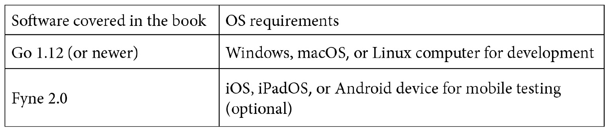

# 前言

图形用户界面的开发有着悠久的历史，导致今天形成了复杂的地形。有许多不同的方法来构建应用程序，每种方法都有其自身的优势和劣势。在这个现代世界中，我们日常生活中有如此多的不同设备，似乎没有构建许多不同的应用程序或 GUI 就无法触及整个受众。所需的技术通常是平台特定的，许多现有的技术已经跨越了几十年，留下了可以减缓新开发者和经验丰富团队步伐的遗产。

与 Go 编程语言旨在使跨所有操作系统的软件开发更容易一样，Fyne 工具包旨在以平台无关的方式赋予图形应用程序创建能力。本指南旨在帮助任何经验水平的软件工程师学习使用 Fyne 工具包构建应用程序的 API 和流程。从你的第一行 Fyne 代码到将应用程序部署到全球市场，示例和截图将引导你完成每一步。

# 本书面向对象

这本书既是为对构建原生图形应用程序感兴趣的 Go 开发者所写，也是为那些拥有特定平台 GUI 经验并寻求跨平台解决方案的人所写。假设读者对构建 Go 应用程序有一定的了解，但这并非必需。本书以 GUI 的历史开篇，为不熟悉此领域的人提供简要介绍，然后介绍了 Fyne 项目及其愿景和目标，旨在解决桌面和移动设备原生应用程序开发者面临的多项挑战。

通过代码片段和实例，各个级别的开发者都应能够成功构建他们的第一个 Fyne 应用程序。除了在您的计算机和移动设备上运行这些应用程序外，您还将了解准备和上传过程，以便将应用程序部署到应用商店和市场。

# 本书涵盖内容

*第一章*，*GUI 工具包和跨平台开发简史*，简要回顾了图形应用程序背后的历史以及用于开发它们的工具包是如何随着时间的推移而演变的。我们探讨了不同的跨平台开发方法以及为什么它很重要。到本章结束时，你将熟悉 GUI 工具包在跨平台应用程序开发中的优势和挑战。

*第二章*，*根据 Fyne 展望未来*，介绍了 Fyne 工具包及其支持所有操作系统的方法，以及受 Material Design 启发的用户界面外观和感觉。在本章中，我们将探讨 Fyne 工具包的愿景以及它是如何基于 Go 语言创建一个易于使用、跨平台的 GUI 工具包的。阅读本章后，您将了解 Fyne 旨在解决书中第一章概述的挑战，以及它如何旨在塑造未来的应用程序开发。

*第三章*，*窗口、画布和绘图*，介绍了 Fyne 工具包渲染层背后的主要 API。我们将了解如何绘制对象以及如何使用容器将它们组合起来以创建更复杂的输出。本章还涵盖了加载应用程序和管理其窗口所需的 API。我们通过一个使用图形元素和动画创建简单跨平台游戏的示例来完成本章。

*第四章*，*布局和文件处理*，在上一章中元素的手动放置基础上进行了扩展。我们将检查提供的标准布局以及它们如何组合形成复杂的用户界面结构，以及如何构建自己的布局。此外，还将涵盖文件系统抽象，它为传统文件系统和更复杂的移动数据共享方法提供标准文件访问。我们将应用所有这些知识，在章节末尾创建一个图像浏览应用程序。

*第五章*，*小部件库和主题*，介绍了 Fyne 工具包中最大的包——其小部件库。在本章中，我们将探索可用的主要小部件以及如何在构建应用程序 GUI 时使用它们。我们将了解通过主题选择如何影响它们的标准化外观和感觉，以及如何使用内置主题渲染用户偏好，如浅色或深色模式。本章通过逐步创建一个使用之前探索的许多小部件的任务管理应用程序来完成。

*第六章*，*数据绑定和存储*，探讨了帮助在 Fyne 应用程序中高效管理数据和存储的 API。我们将了解前一章中看到的小部件如何绑定到数据元素，从而避免设置和管理它们内容所需的大量代码。此外，还将展示应用程序如何管理用户偏好，以及它们如何通过数据绑定直接连接到小部件值。本章的概念通过创建一个帮助跟踪您水消耗的健康应用程序来应用。

*第七章*，*构建自定义小部件和主题*，展示了具有特定要求的应用程序如何在前几章探索的坚实基础之上构建。我们将研究开发者可以如何自定义和扩展现有小部件，或者构建完全定制的组件。我们还将看到如何加载自定义主题，以赋予应用程序更多的品牌识别度或添加自定义字体和图标。使用这些功能，我们将构建一个即时通讯用户界面，该界面显示独特的风格和自定义小部件。

*第八章*，*项目结构和最佳实践*，基于对 Go 语言有良好记录的最佳实践。我们将了解如何组织项目以保持代码整洁，并随着项目的增长促进更易于维护。我们还将探讨在用 Fyne 构建图形用户界面时，单元测试和测试驱动开发是如何成为可能并受到鼓励的。此外，在极少数需要特定平台代码的情况下，我们将看到应用程序如何调整其行为以适应不同的目标平台。

*第九章*，*资源打包和发布准备*，解释了将图形应用程序打包的过程比从命令行访问的简单二进制文件要复杂得多。在本章中，我们将了解允许 Fyne 应用与其他桌面和移动应用程序融合所需的元数据。我们还将逐步介绍打包应用程序的过程，以便它们可以被共享和安装，正如最终用户期望的平台原生应用程序那样。

*第十章*，*分发 – 应用商店及其他*，面对跨平台应用程序开发的最终挑战——分发。我们将看到应用程序是如何为公开发布做准备，以及如何与许多应用商店要求的额外数据和代码签名打包。我们将通过上传过程结束本书，包括苹果、谷歌和微软商店的上传，以及向 Unix 系统的分发。

*附录 A**，开发者工具安装*，包含了管理其他章节所需软件的平台特定步骤。本章将帮助新开发者安装构建本书示例所需的编译器和工具。

*附录 B**，移动构建工具安装*，提供了设置构建移动设备 Fyne 应用所需额外工具的文档。遵循这些步骤后，可以在本地创建 Android 和 iOS 构建。或者，开发者可以选择使用在 *附录 C* 中介绍的 fyne-cross，进行交叉编译。

*附录 C**，交叉编译*概述了设置不同操作系统构建所需的具体平台安装和配置。遵循这些步骤，开发者将能够仅使用一台计算机编译他们的 Fyne 应用程序。它还展示了如何为不希望自己详细管理工具的开发者设置 Fyne 交叉编译解决方案 fyne-cross。

# 要充分利用本书

本书假定您对 Go 语言有基本了解。如果您还不熟悉语法或概念，请在开始阅读之前考虑运行在线教程（[tour.golang.org](http://tour.golang.org)）。

要运行示例，您至少需要安装 Go 语言的 1.12 版本，以及适用于您的计算机的 C 编译器（由 Fyne 库代码要求）。如果这些都没有安装，您可以在*附录 A*，*开发者工具安装*中找到详细的步骤。我们将逐步介绍安装 Fyne 库及其支持工具的过程，这些工具在本书的整个过程中都是必需的：



要开发应用程序，您需要一个装有之前描述的开发工具的 Windows、macOS 或 Linux 计算机。要测试移动设备上的应用程序，您还需要安装 Android SDK 和/或 Xcode（用于 iOS/iPadOS）环境。有关更多信息，请参阅*附录 B*，*移动构建工具的安装*。为了进一步测试移动构建，建议您准备一个合适的移动设备。

要从本书中获得更多收益，如果您心中有一个您想要构建的应用程序项目，那就再好不过了。这样做将帮助您在不同的环境中练习示例代码，以更好地理解小部件和 API 功能。此外，这也意味着本书结尾的应用程序商店上传过程将导致您的应用程序版本发布！

**如果您正在使用本书的数字版，我们建议您通过 GitHub 仓库（下一节中提供链接）访问代码。这样做将帮助您避免与代码复制粘贴相关的任何潜在错误。**

# 下载示例代码文件

您可以从 GitHub 在[`github.com/PacktPublishing/Building-Cross-Platform-GUI-Applications-with-Fyne`](https://github.com/PacktPublishing/Building-Cross-Platform-GUI-Applications-with-Fyne)下载本书的示例代码文件。如果代码有更新，它将在现有的 GitHub 仓库中更新。

我们还有来自我们丰富的书籍和视频目录中的其他代码包，可在[`github.com/PacktPublishing/`](https://github.com/PacktPublishing/)找到。查看它们吧！

下载彩色图像

我们还提供包含本书中使用的截图/图表彩色图像的 PDF 文件。您可以从这里下载：[`static.packt-cdn.com/downloads/9781800563162_ColorImages.pdf`](https://static.packt-cdn.com/downloads/9781800563162_ColorImages.pdf)

# 使用的约定

本书使用了多种文本约定。

`文本中的代码`：表示文本中的代码单词、数据库表名、文件夹名、文件名、文件扩展名、路径名、虚拟 URL、用户输入和 Twitter 昵称。以下是一个示例：“使用基于方法的更新，`SetText()` 和 `SetIcon()` 调用将刷新小部件，可能触发前面的问题。”

代码块设置如下：

```go
const (
    serverKeyDevelopment = "DEVELOPMENT_KEY"
    serverKeyProduction  = "PRODUCTION_KEY"
)
```

任何命令行输入或输出都应按以下方式编写：

```go
$ fyne release -appVersion 1.0 -appBuild 1 -certificate "CertificateName" -profile "ProfileName"
```

当命令与 GitHub 仓库（如上所述，以及每章的顶部）中的文件或数据相关时，命令提示符将以目录名开头，如下所示：

```go
Chapter03/window$ go run main.go
```

**粗体**：表示新术语、重要单词或屏幕上看到的单词。例如，菜单或对话框中的单词在文本中显示如下。以下是一个示例：“您也可以在 **fyne_demo** 中的 **设置** 菜单中找到 **设置** 面板。”

小贴士或重要提示

显示如下。

# 联系我们

欢迎读者反馈。

`customercare@packtpub.com`。

**勘误表**：尽管我们已经尽最大努力确保内容的准确性，但错误仍然可能发生。如果您在这本书中发现了错误，我们将非常感激您能向我们报告。请访问 [www.packtpub.com/support/errata](http://www.packtpub.com/support/errata)，选择您的书籍，点击勘误表提交表单链接，并输入详细信息。

`copyright@packt.com` 并附上材料链接。

**如果您想成为一名作者**：如果您在某个领域有专业知识，并且对撰写或参与一本书籍感兴趣，请访问 [authors.packtpub.com](http://authors.packtpub.com)。

# 评论

请留下评论。一旦您阅读并使用了这本书，为何不在您购买它的网站上留下评论呢？潜在读者可以查看并使用您的客观意见来做出购买决定，Packt 可以了解您对我们产品的看法，我们的作者也可以看到他们对书籍的反馈。谢谢！

有关 Packt 的更多信息，请访问 [packt.com](http://packt.com)。
