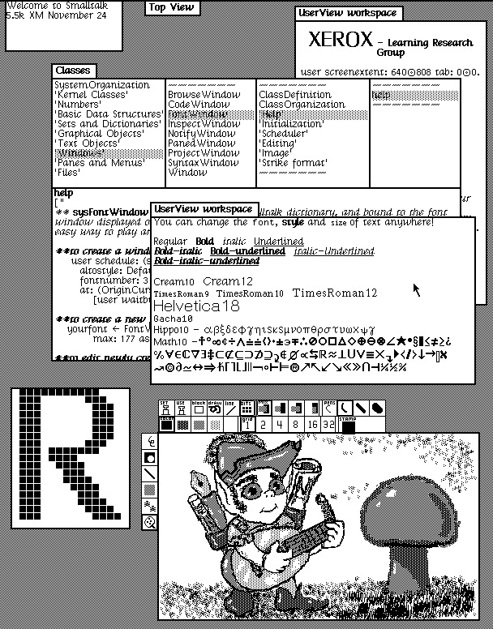
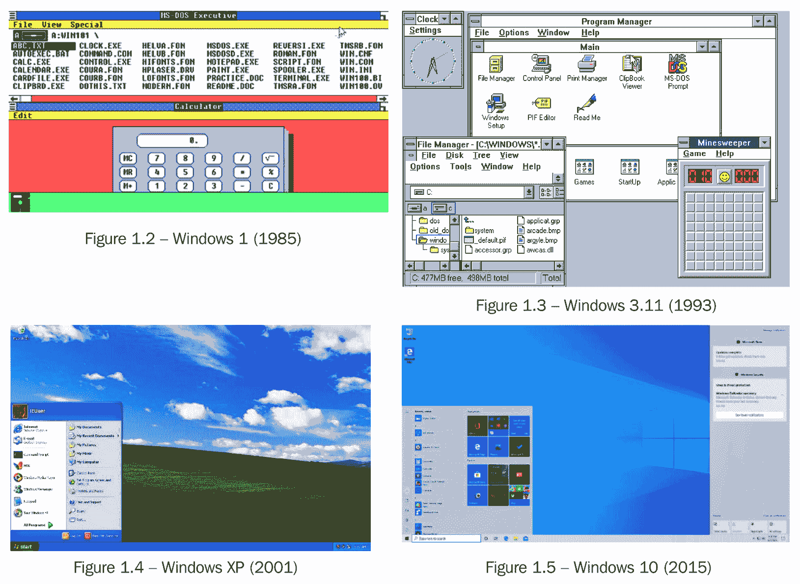
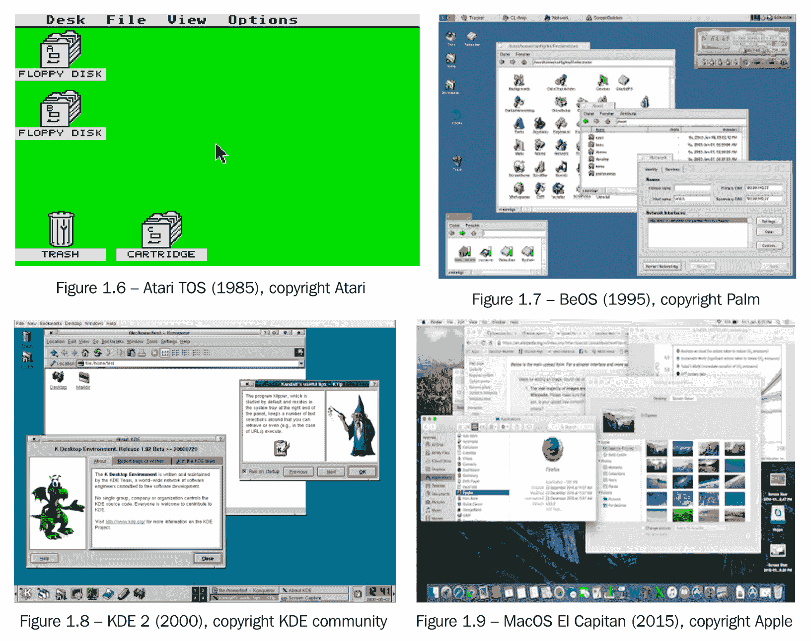
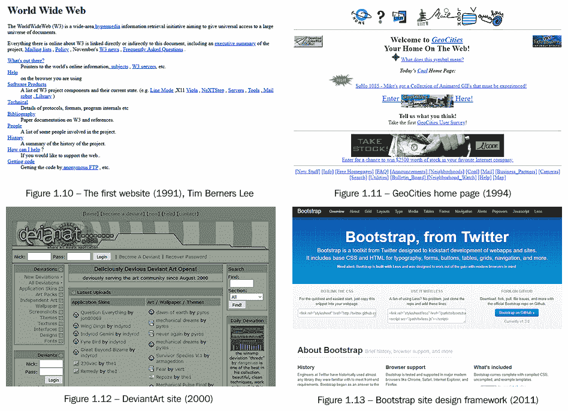

# 第一章：*第一章*：GUI 工具包和跨平台开发简史

本书旨在探讨如何轻松构建健壮且美观的图形应用程序，这些应用程序将在所有操作系统和设备上运行良好。在我们开始查看如何实现这一点的细节之前，考虑这些设备的历史以及过去 50 年图形工具包的格局非常重要。我们从回顾 GUI 应用程序的起点以及它们走了多远开始。

在本章中，您将重新了解**图形用户界面**（**GUI**），同时了解支持应用程序开发的工具包以及它们如何提供不同的跨平台开发方法。我们将探讨编写本地 GUI 以实现响应式用户体验和平台集成的优势。完成本章后，您应该熟悉图形工具包的起源和挑战，以及在这一旅程中采取的不同方法。

在本章中，我们将涵盖以下主题，以提供 GUI 工具包和跨平台开发的简要历史：

+   GUI 工具包的来源

+   它们是如何随着时间的推移而适应（或保持不变）的

+   跨平台开发的历史方法

# 理解图形用户界面的历史

在 1973 年，*帕洛阿尔托研究中心*（*施乐帕洛阿尔托研究中心*）完成了 Alto 计算机，这是第一个图形桌面计算机的商业实例。在大多数当代历史中，这是我们所理解的 GUI 的第一个实例。尽管屏幕方向和缺乏颜色使其对现代眼睛来说有些奇特，但它显然是可以识别的，并且包括许多关键组件，以及用于交互的鼠标和键盘。尽管它直到 1981 年作为*Xerox Star*才对公众普遍可用，但它显然是一个巨大的进步：

图 1.1 – Dynabook 环境桌面（1976 年；在 Alto 上运行的 Smalltalk-76）。版权 SUMIM.ST，许可 CC BY-SA 4.0

这种发展是计算机可用性的一次巨大飞跃。在此之前，所有交互都是通过文本模式的计算机屏幕和键盘或其他文本输入设备进行的。图形界面对于想要入门的新手来说更容易学习，并且允许更快地发现高级功能。尽管命令行界面仍然受到程序员和其他*专业用户*的欢迎，但 GUI 是桌面计算机兴起的最主要因素。

## 桌面计算机的普及

用户体验友好的图形环境的引入促进了台式计算机的使用显著增长。在 Alto 计算机时代，全球大约有 48,000 台台式计算机。到 2001 年，这个数字急剧增加到超过 12 亿 5 千万台个人电脑发货（[`en.wikipedia.org/wiki/History_of_personal_computers#Market_size`](https://en.wikipedia.org/wiki/History_of_personal_computers#Market_size)）。2002 年，行业庆祝了 10 亿台电脑发货（[`news.bbc.co.uk/1/hi/sci/tech/2077986.stm`](http://news.bbc.co.uk/1/hi/sci/tech/2077986.stm)），尽管最近数字有所下降（参见本章后面的*智能手机和移动应用*部分），2018 年报道的发货量不到 3 亿台（[`venturebeat.com/2019/01/10/gartner-and-idc-hp-and-lenovo-shipped-the-most-pcs-in-2018-but-total-numbers-fell/`](https://venturebeat.com/2019/01/10/gartner-and-idc-hp-and-lenovo-shipped-the-most-pcs-in-2018-but-total-numbers-fell/)）。

随着这些设备进入消费者手中，硬件变得更加强大，我们开始看到创建吸引人的用户界面的重点，以及建立或匹配时尚趋势的趋势。以下是一些重要的微软 Windows 操作系统版本：

所有屏幕截图的版权属于微软。每个图像都是在获得许可的情况下使用的。

如您在前面的屏幕截图中所见，桌面环境的每一次主要修订都为按钮、字体和其他用户界面元素带来了新的样式。这一切都由工具包控制，代表了我们在本章后面将要探讨的可用性和风格选择上的进化。

当微软在 GUI 方面取得进展时，也有许多竞争对手，其中一些可能看起来很熟悉，而另一些则有自己的独特风格；例如，以下是一些流行的系统：

1985-2015 年各种操作系统的桌面截图。每个图像都是在公平使用政策下获得必要许可后使用的。

如您从 1985 年到 2015 年各种操作系统的桌面截图中所见，外观和感觉发生了显著变化，同时保持了某种熟悉感。这些桌面系统都是为了运行多个应用程序窗口而设计的，通常围绕文档编辑、文件管理和实用程序应用。多年来，还出现了额外的软件，如游戏、照片管理和音乐播放器，但最普遍的网页浏览器直到 20 世纪 90 年代末才变得常见。互联网接入的加入开启了一个新的计算时代的转变。

## 转向网络

随着可靠互联网连接的日益普及，我们从服务器上获取的信息量开始增加，从你最喜欢的搜索引擎中的“浏览器大战”到了解更多）。

万维网最初由蒂姆·伯纳斯-李爵士在 1981 年提出，开发始于 CERN（[`home.cern`](https://home.cern)）项目（代号*ENQUIRE*）。早期的万维网在 1993 年向公众开放。作为一个任何人都可以添加的分布式系统，设计创新甚至比我们之前看到的桌面操作系统还要迅速。设计和可用性的趋势迅速赶上、超越并开始引领传统的软件开发：

网站设计趋势（通过 Web 设计博物馆）；版权属于各自所有者

互联网最初是一个提供数据访问的项目，源于对在不同计算机上获取信息可能多么困难的挫败感。最初只是简单的信息检索很快变成了更复杂信息的精致展示，然后开始成为提交或操作信息的地方。

一个简单的数据访问平台迅速发展成为一个更全面的平台，不久之后，它就成为一个完整的应用程序平台。事实上，由于基于标准的方法（由**万维网联盟**（**W3C**）监督），这成为了第一个真正跨平台开发机会之一。一个基于网络的程序可以一次性开发并供所有计算机使用——这比之前为多个平台开发的大幅进步。

通过基于网络的解决方案交付应用程序的额外好处是，你可以支持多种类型的应用程序访问底层数据或功能。一个历史上曾为用户可见的网站提供动力的基于网络的**API（应用程序编程接口**）也可以由其他设备使用。这种设计允许传统软件访问与基于网络的交付系统相同的数据，并有助于发展支持多种不同类型软件的通用架构——包括更近期的基于移动的应用程序。

## 智能手机和移动应用

在 2007 年，苹果的史蒂夫·乔布斯推出了 iPhone，这是移动计算概念的一个全新设计。尽管在此事件之前已经存在便携式*智能手机*设备多年，但引入了一个光滑的新用户界面、触摸屏输入和用于显示视频和网页内容的大屏幕，对市场产生了重大影响。竞争对手（现有和新创建的）现在正在竞相创造最适合消费者口袋的最佳用户体验。尽管早期设备宣称可以轻松浏览任何网站，但开发者很快就将内容调整为更适合这些小屏幕的展示——通常关注移动时重要的信息。

为了满足用户在这些更有限的（由硬件或互联网连接性）设备上对更复杂和更快体验的需求，诞生了*移动应用程序*的概念。这些小型的软件专门为某种类型的移动电话（Android、iPhone 和其他）设计，并通过平台的商店或市场提供。与之前出现的基于网络的解决方案相比，它们具有很大的优势，因为它们可以安装在设备上，所以运行得更快，并且专门为特定的硬件开发，从而创造更好的用户体验，并允许访问设备的高级功能（如位置检测、指纹传感器和蓝牙）。

这些原生应用提供了终极的用户体验。这些应用可以非常快（因为它们安装在设备上），适应用户（通过访问本地设置和数据），还可以与操作系统功能（如日历、语音控制和尖端硬件传感器）交互，所有这些在通过网页应用提供时都是不可能实现的。然而，它们对开发者来说有一个缺点——不仅每个平台看起来都不同，这意味着设计可能需要调整，而且它们是分别分发的，通常需要不同的编程语言来开发。现在，软件公司不再需要用一个单一的应用程序来覆盖整个世界，而是至少需要三个不同的应用程序来通过客户喜欢的设备接触他们的客户：

![iPhone 和 Android 设备展示它们的相似之处和不同之处]

![图片 04.jpg]

iPhone 和 Android 设备展示它们的相似之处和不同之处

我们将在稍后回到为多个不同的硬件平台开发时的挑战，但首先，我们将探索支撑本节中我们看到的各种技术的图形工具包。

# 探索 GUI 工具包的演变

图形用户界面（GUIs）必须像任何其他计算机程序一样进行编程，就像库是为了提供标准组件而创建的一样，GUI 工具包存在是为了支持构建应用程序的图形元素。由于存在许多不同的原因，存在许多工具包——维基百科维护着一个包含近 50 个不同项目的列表，并且还在增长，可以在[`en.wikipedia.org/wiki/List_of_widget_toolkits`](https://en.wikipedia.org/wiki/List_of_widget_toolkits)和[`en.wikipedia.org/wiki/List_of_platform-independent_GUI_libraries`](https://en.wikipedia.org/wiki/List_of_platform-independent_GUI_libraries)找到。为了理解大量选项的意义，我们将它们分为类别，首先考虑那些为特定操作系统构建的工具包。

## 特定平台工具包

每个图形操作系统或桌面环境都有其独特的外观和编程风格，因此传统上为每个平台创建了一个图形工具包。Windows 有 WinAPI（以及 WinForms 和基础类），Atari 使用 GEM 进行编程，而 BeOS 使用 Be API。为苹果产品开发的应用程序使用了各种工具包，但自从 macOS X 以来，它被称为 Cocoa（桌面使用 AppKit，移动设备使用 UIKit）。Android 设备使用自己的工具包，而其他移动平台也探索了其他选项。

Unix 和 Linux 操作系统的故事更为复杂。尽管 Motif 工具包是第一个之一，但其设计提供多种选择的事实意味着没有一种真正的*外观*或库。在 1980 年代，在 Motif 创建之前，有一个名为 OpenLook 的项目，旨在为 Unix 系统提供标准的界面外观和感觉。尽管有众多不同的设计和工具包可供选择，Unix 的主要贡献者决定统一将有助于其与 Windows 和其他桌面平台竞争。因此，在 1993 年，他们选择了 Motif 作为未来的开发。

桌面环境设计的常见特征是它经常更新，正如你可以在本章前面看到的 Microsoft Windows 的截图中所见。无论是因为时尚的变化还是可用性的进步，这些变化都是预期的，而 Motif 系统没有适应这些变化，因此创建了新的项目作为替代品。在 90 年代后期，GTK+和 Qt 项目启动，提供了更现代、更精致的用户界面。此外，Java 平台在 1995 年推出了**AWT**（**抽象窗口工具包**），所有这些都不是特定平台的，为跨平台 GUI 库开辟了新的世界。

## 跨平台工具包

在前面的子节中提到的工具包都是为了特定的平台开发的。它们随着操作系统设计的发展而发展，通常使用制造商首选的编程语言进行开发。这些挑战使得创建一个能在所有平台上工作的单一应用程序变得困难（如果不是不可能的话）。因此，创建跨平台工具包的举措需要采取不同的方法，因此开发者开始设计一个可以在不依赖于特定平台的情况下用任何支持的操作系统的编译语言编写的库。

在 20 世纪 90 年代中期，当 GTK+和 Qt 被创建时，它们分别选择了 C 和 C++（一种从 C 派生出的面向对象的语言）。这两种语言在大多数操作系统上都有广泛的采用，并且已经与一些其他工具包一起使用，从而降低了学习门槛。然而，Java 的方法却更为广泛——创建一种全新的语言，使其能够在所有这些平台上工作，并交付一个基于此的图形工具包。

操作系统和计算机制造商拥有影响技术的市场力量，随着新语言的可用性，他们能够迫使开发者走向相同的新方向（例如，苹果转向 Swift，微软转向 C#，谷歌将他们的应用程序迁移到 Dart）。然而，围绕跨平台技术构建的大型开源社区通常对其构建的语言忠诚，因此通常不会接受这样大的变化。因此，在这些项目中，某些方面可能会被遗弃，并鼓励开发者寻找新的方向，例如网络技术。

## 混合应用程序

如本章前面所述，万维网为向多个操作系统的用户提供应用程序提供了一个有吸引力的平台，同时也提供了一种构建一次应用程序并在任何计算机上运行的方法。网络浏览器提供了一个高度可定制的画布，因此，使用**层叠样式表**（**CSS**），任何基于**超文本标记语言**（**HTML**）的应用程序都可以被设计成任何设计。这种好处为网络应用程序开发带来了很多人气，甚至影响了某些原生工具包扩展其主题功能以模仿这一点。

如本章前面所述，网站是为了信息传输而设计的——最初是只读的，后来也可以发送和编辑数据。要从这里过渡到完全交互式应用程序，需要额外的编程能力，而这正是**JavaScript**的作用。自其创建以来，JavaScript 在流行度和复杂性方面都得到了增长——现在有多个包管理器来处理可用于任何 JavaScript 应用程序的数千个可用包。在这些库中，许多是用于处理应用程序交互和布局的图形工具包，就像传统的 GUI 工具包一样。在这些工具包中，目前最受欢迎的是 React、Vue.js 和 JQuery，尽管这个列表经常变化。

在开发此类基于 JS 的 Web 应用程序时，重点是用户界面（即*前端*），而完整的应用程序可能包含业务逻辑和算法，这些算法可能是 Web 应用程序的*后端*基础设施的一部分。从历史上看，这些复杂应用程序的独立部分使用不同的编程语言创建。这在大型基础设施的每个领域都有不同的要求是有意义的。然而，对于较小的应用程序或为了降低技术复杂性，使用相同的语言处理所有部分是有用的——因此创建了 Node.js 来支持应用程序的基于 JavaScript 的后端元素。

尽管通过 Web 分发具有诸多好处，但许多公司仍然希望提供一种传统的应用程序，该应用程序可以下载并安装（原因将在下一节中探讨）。为了平衡开发速度和 Web 应用程序的其他优势与开发者熟悉的传统应用程序包，创造了一种新的应用程序类型，被称为**混合应用**。这些新应用在一个标准容器中加载，就像系统上的其他任何应用程序一样，在常规窗口中加载自定义 Web 应用程序。Electron、Ionic 和 React Native 都是在这个领域工作的项目，提供基于 Web 的应用程序框架，具有不同级别的系统访问权限。

在跨平台开发图形工具包的演变过程中，我们不能忽视 Web 浏览器的普遍存在。尽管它有存在于大多数现代计算机上的好处，但它可能不是构建您产品的正确解决方案——让我们看看这些方法如何不同。

# 比较原生图形应用与 Web UI

尽管基于 Web 的应用程序可以提供诸多好处，但每个技术选择都意味着在某些领域做出权衡，因此让我们看看一些可能影响您决定是否构建原生应用程序或基于 Web 的混合应用程序的常见问题。

## 开发速度与交付

选择网络技术来构建你的应用程序的一个主要原因是开发速度。以这种方式开发的本性意味着你可以在网页浏览器中实时预览你的工作。基于浏览器的编辑器的可用性还意味着设计团队可以在不太多代码经验的情况下调整用户界面。你的 Web 应用程序的大部分内容也可以用于混合应用程序（或反之亦然），以提供高度的重用和最小的工作量来支持桌面和移动交付。

关于速度的权衡在运行时被发现——因为应用程序需要网页视图来运行代码，这会影响应用程序加载和执行的速度。每次加载混合应用程序时，它都会在窗口内创建一个网页浏览器的小版本，像网页一样加载代码并开始执行捆绑的 JavaScript。对于大多数用户来说，这可能不会慢到令人沮丧，但与本地编译的应用程序相比，可能会有明显的差异。根据选择的框架，这种模式通常也需要大量的内存——实际上，Electron 因需要大量 RAM 而闻名，最简单的应用程序仅为了显示“Hello World”就需要近 70 MB。

基于网络技术构建的应用程序的实际执行速度也可能明显较慢。由于抽象层的存在，基于网络的程序通常需要更多的时间和 CPU 周期来完成与编译的本地应用程序相同的操作（尽管像**WebGL**和**WASM**（即**Web Assembly**）这样的技术正在尝试改善这一点）。因此，如果你的应用程序可能需要大量的 CPU 资源，或者有很多动画图形，你可能希望基准测试不同的方法，以确定哪些平台能够满足你对应用程序响应速度的要求。

另一个考虑因素可能是自动更新——你是否希望你的应用程序始终运行最新版本？一些基于网络的工具包提供了下载应用程序更新并动态加载新版本的功能，而无需用户担心。这可能是一个很大的好处，但如果你的客户期望软件每天都能正常工作，直到他们选择更新它，这可能会令人沮丧。有些人也担心这种性质的应用程序可能会“回家”报告——也就是说，在更新过程中向中央服务器报告应用程序的使用情况和位置。

## 视觉风格

选择基于网络技术应用程序开发的另一个主要决策点可能是表现层（CSS）的强大功能。通过结合图像资源和样式表代码，几乎可以创建任何所需的视觉风格。对于希望为其应用程序提供完全定制外观的开发人员（或他们团队的设计师）来说，这可能是一个很好的选择。然而，值得考虑的是，你的用户将如何使用该应用程序，以及完全定制的样式是否会以任何方式阻碍可用性。

如果应用程序旨在匹配当前系统的用户界面风格，这种完全定制的优势可能会变得具有挑战性。由于渲染无限灵活，开发人员当然可以在某些系统上运行时对风格进行微调，使其看起来微妙（或显著）不同。这种调整可能需要意想不到的大量额外努力——因为每个平台在一段时间后都可能具有不同的风格。试图匹配系统风格但未能做到的 GUI 比明显遵循其自身风格指南的 GUI 更具排斥性。

因此，如果你希望与其他系统中的应用程序融为一体，可能最好避免使用混合应用程序。网络技术确实提供了一个快速开发、适应性强的跨平台应用程序平台，但这种方法也存在一些限制，也应予以考虑。

## 技术限制

使用网络技术构建的应用程序，即使是使用混合框架构建的看似系统应用程序，都在沙盒中运行。这意味着它们在访问设备和系统功能方面存在某些限制。允许访问底层功能的 JavaScript API 不断扩展以克服这些限制，但如果你的应用程序可以从非标准外围设备或集成到特定操作系统功能中受益，那么网络用户界面可能不是你的正确选择。

通信端口、不包括在典型网络 API 中的外围设备以及进程管理是应用程序的一些低级元素，这些元素默认情况下不会得到支持。此外，与桌面环境系统托盘、搜索功能和一些高级文件管理进行交互可能从 JavaScript 代码中难以访问。为了弥合这一差距，一些混合工具包允许编写和加载本地代码作为库来访问这些功能。然而，此类扩展需要用平台自己的语言（通常是 C 或 C++）编写，然后为每个支持的平台进行编译。这不仅增加了应用程序分发的复杂性；也可能损害使用网络工具提供的单一代码库应用程序设计技术。

与此相比，其他跨平台开发方法通常提供对所有支持操作系统的抽象，这样应用程序就可以一次构建，但在支持缺失的情况下，它们提供了一种直接访问底层功能的方法。这通常以语言桥接或从高级语言中加载系统库的形式出现。这可能需要使用不同的编程语言进行构建，如前面所述，但在 Web 沙盒之外的跨平台技术中，这通常不会大幅增加分发复杂性。此外，与基于嵌入式 Web 浏览器的工具包相比，找到不支持原生跨平台工具包的设备的情况要罕见得多。

如果本节中提到的某些 Web 技术跨平台开发的限制可能会影响您的应用程序，或者如果您更愿意不使用 HTML 和 JavaScript 进行编码，那么原生工具包可能是正确的选择，我们将在下一节中探讨。

# 跨平台原生工具包的选项

如本章前面所述，跨平台工具包的概念并不新颖——实际上，它们可以追溯到 20 世纪 90 年代中期，当时 GUI 发展的历史还不到 10 年。重要的是要理解，即使在原生的跨平台工具包中，也存在不同的方法，各有其优势和劣势。

## 视觉风格

跨平台工具包可以分为两种不同的视觉方法——在运行时匹配系统外观和感觉的愿望，与提供一致外观的愿望，这种外观将在所有环境中保持一致。Qt 和 GTK+工具包最初都有自己的视觉风格，增加了通过视觉主题进行控制的能力。随着时间的推移，它们开发了特定操作系统的主题，使它们能够匹配系统上其他应用程序的设计。相比之下，Java AWT 库被创建为一个代码级别的抽象，这意味着程序将使用操作系统小部件进行渲染，尽管应用程序是为没有特定平台编写的。有趣的是，在 1998 年，Sun（Java 的创造者）推出了 Swing 工具包，它提供了一种全新的外观和感觉，这种外观和感觉将在所有平台上保持一致。随着 AWT 的逐步淘汰，这个替换用户界面库逐渐获得了人气。在有趣的反转中，Sun 引入了操作系统外观类似的主题，开发者可以选择在他们的应用程序中启用（与 GTK+和 Qt 不同，这并不是用户的首选）。

## 编译与解释

定义工具包的另一个常见因素是编程语言的选择——这些可以区分编译成应用程序二进制文件的语言与作为源代码分发并在运行时解释的语言。这种区别通常与静态类型语言与动态类型语言相关联，这影响编程风格和关联 API 的设计。在静态类型编译语言中，所有变量都在编译时定义和检查。它们的类型（即它们包含或引用的内容类型）在定义中设置且不会改变。这种方法通常可以早期捕获编程错误，并可能导致健壮的代码，但可能会受到导致应用程序开发速度较慢的批评。编译的应用程序通常可以直接在构建它的计算机上运行，这意味着它不需要与应用程序一起安装支持技术。然而，为了实现这一点，应用程序通常需要为每个支持的平台进行编译——这再次导致开发时间更长，这次是为了分发任务。

相比之下，解释性语言通常被认为支持更快的开发和更快的交付。通过允许变量用于不同类型的内容，应用程序的源代码可以更短，在编程阶段出现的复杂性也更少。相反，这种简化的严格性意味着通常需要有一个更稳固的测试基础设施（通过单元测试或自动用户界面测试）来确保软件的正确性。以这种方式分发应用程序将需要安装运行时环境，以便代码可以执行（就像我们在讨论混合应用程序时看到的嵌入式网页浏览器）。对于某些操作系统，可能已经安装了解释器，而对于其他操作系统，可能需要用户安装。有趣的是，有一些编译器可用于解释性语言，允许它们像任何其他二进制应用程序一样分发，尽管存在先前的权衡，即应用程序必须为每个目标平台单独构建。

## 解释性选项

由于构建 GUI 的流行，每个主要的解释性语言都有自己的首选工具包。Java 运行时包括自己的图形例程，这意味着它可以包含定制的用户界面，即 Swing。最近，JavaFX 库是在相同的图形代码之上构建的。如前所述，Java 还包括 AWT 库，它委托给系统组件。

其他流行的编程语言运行时没有附带相同的图形组件，因此它们通常依赖于底层库。TkInter 是 Python 的标准 GUI 库，基于 Tk 库，而 Ruby 语言没有推荐标准库。语言绑定允许程序员使用解释语言创建应用程序，同时使用底层的现有小部件工具包，如 Tk、GTK+ 或 Qt，这些绑定非常受欢迎。使用这种方法，可用的选项太多，无法一一列举，但它们通常有一个缺点，即不是为语言设计的，因此编程起来可能没有专门为该语言构建的选项直观。

## 编译选项（基于 C）

如本章前面所示，GUI 开发有着悠久的历史，最流行的工具包最初都是许多年前设计的。GTK+ 和 Qt 都非常受欢迎，但它们分别是为 C 和 C++ 语言设计的。虽然这并不妨碍它们成为有效的选择，但它们对于现代程序员来说可能显得有些过时。可能部分原因就在于此，这些 GUI 框架已经为几乎所有的编程语言提供了语言绑定。然而，这也意味着你需要了解一些底层系统的工作原理，以便在开发中发挥最大效用。例如，C 库中的内存管理是一个复杂且需要手动完成的任务，大多数开发者都不愿意去担心。此外，基于 C++ 的库在底层可能有一个不同的线程模型，这可能与高级语言的方法不兼容。

对于设计了几十年的工具包，还有一个额外的考虑因素，那就是它们可能不适合现代图形计算设备的格局。屏幕，无论是在桌面、笔记本电脑还是移动设备上，现在都有各种各样的尺寸和像素密度。如果代码是基于像素大小来构建的假设，那么这可能会带来挑战，因为以前是这样的。96 **每英寸点数**（**DPI**）是一个常见的假设，这意味着高度为 96 像素的东西在显示时大约为一英寸。然而，根据当前设备，它可能从一英寸到 3/16 英寸（只有预期大小的 20%）不等，因此了解这将对应用程序设计产生什么影响非常重要。较老的工具包通常基于像素测量，其中显示被简化为一定数量的像素（1、2、3 或 4）来表示每个源像素的大小（这将是 1、4、9 或 16 像素来显示一个正方形）。如果应用程序没有仔细适应设备，使用这种方式的工具包可能会导致像素化输出。

## 编译选项（其他语言）

部分原因是旧有的基于 C/C++的 GUI 工具包的遗留问题，部分原因是新的编程语言相对于旧语言带来的好处，大多数较新的编译型语言也都有与之配套的工具包。这些更现代的工具包通常由于它们较新的设计，能够更有效地处理今天各种设备。通过转向基于矢量图像的设计，像素或位图设计带来的挑战正在被克服。矢量图像可以在任何像素密度的屏幕上以更高的质量输出。它们通过独立于输出像素定义图像元素，如线条、矩形和曲线，来实现这一点；它们仅在确定可用像素数量后才会绘制，从而在大多数输出设备上产生更高的质量。

正如我们之前所看到的，操作系统制造商经常规定使用的编程语言，并在需要时推动新版本或编程语言的采用。我们可以从苹果最近将其 UIKit 和 AppKit 框架的最新版本迁移到 Swift 这一举措中看到这一点（这种语言主要用于苹果设备，但这一趋势仍然值得关注）。微软的开发平台目前正朝着 C#的方向发展，之前曾使用过 C、C++和 Visual Basic。谷歌正在将精力投入到 Dart 编程语言和建立在它之上的 Flutter 工具包中。

其他语言，如 Go，没有官方的 GUI 工具包或小部件库。在这些情况下，我们可以看到各种项目出现，以不同的方式填补这一空白。在 Go 语言中，最活跃的项目是 andlabs UI、Fyne 和 Gio。andlabs 项目旨在使用当前系统样式——实际上，它通过简单的 Go API 包装代码来显示它们，就像之前讨论的 Java AWT 一样。Gio 是一个即时模式的 GUI 工具包，旨在尽可能地为应用程序开发者提供控制权，要求应用程序管理渲染和事件处理。Fyne 项目旨在提供一个简单易学且易于扩展的 API，无需担心渲染过程——这通常被称为*保留模式*，因为小部件状态由库管理。

# 摘要

在本章中，我们探讨了图形应用程序的历史以及推动它们发展的工具包。我们看到，在过去的半个世纪里，许多事情都发生了变化，但许多方面仍然保持不变。通过展示图形设计和技术能力的发展趋势，我们清楚地认识到，尽管这些技术在最终用户眼中正在适应和改进，但它们在拥抱开发者期望的改进速度方面可能较为缓慢。我们了解到，有众多不同的方法来支持跨平台工作的 GUI 创建，但同时也存在一些缺点。

在下一章中，我们将更深入地了解 Fyne 工具包的愿景和设计，以及为什么项目团队认为这为在任意平台上构建健壮且性能卓越的图形应用程序提供了最简单的方法。
