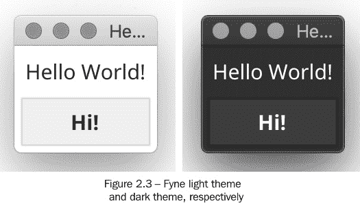

# 第二章：*第二章*：根据 Fyne 的未来

Fyne 工具包的设计基于这样一个前提，即解决*第一章*中提出的许多挑战的最好方法是对 GUI 工具包设计采取全新的方法。它旨在结合现代编程语言、Material Design 风格和简单的 API 的优点。

在本章中，我们将探讨 Fyne 项目的背景和目标，包括以下内容：

+   Fyne 及其团队的目标愿景

+   现代编程语言如何实现全新的方法？

+   它如何解决跨平台、原生应用开发的复杂性？

# 技术要求

在本章中，我们将使用 Go 代码的示例，因此您需要安装 Go 编译器——请参阅[`golang.org/doc/install`](https://golang.org/doc/install)中的说明。我们还将探讨如何将 C API 进行桥接，因此您还需要安装一个 C 编译器。C 的安装因系统而异。您可以在*附录 A*中找到详细信息，*开发者工具安装*。

本章的完整源代码可以在[`github.com/PacktPublishing/Building-Cross-Platform-GUI-Applications-with-Fyne/tree/master/Chapter02`](https://github.com/PacktPublishing/Building-Cross-Platform-GUI-Applications-with-Fyne/tree/master/Chapter02)找到。

# 从一张白纸开始

通过 GUI 开发的历史，我们看到大多数最受欢迎的工具包都是基于 C 或 C++ 语言代码。这些项目有着悠久的历史、庞大的社区和无数的开发小时数，使它们成为今天的模样。尽管它们是衡量所有其他工具包的标准，但它们存在缺点，这主要是因为它们建立在旧的设计决策之上。在本节中，我们反思为什么从头开始创建跨平台应用程序的更好体验。

## 为现代设备设计

我们今天使用的设备类型与 1980 年代和 1990 年代相比，既大不相同又更加多样化，当时最常用的工具包正在设计和构建中。今天，图形应用程序可以在台式计算机、笔记本电脑或上网本、移动设备或平板电脑、智能手机或手表形态、甚至机顶盒或智能电视上运行。这些设备类别都有不同的用户界面范式——为使用鼠标和键盘的台式计算机设计的 API 并不一定很好地适应基于触摸屏的输入、多指手势或作为主要输入设备的遥控器。为现代设备设计的输入 API 将能够提供对底层细节的适当抽象，从而关注用户的意图。通过采用这种方法，应用程序可以更好地适应消费者手中的各种设备。

随着设备尺寸的多样性，屏幕尺寸和类型也呈现出广泛的变化。现在的手机屏幕比以往任何时候都要大，但它们仍然相对较小。然而，它们包含的像素数量巨大，当我们将它们贴近脸部时，会呈现出平滑的外观。另一方面，电视屏幕非常大，但由于通常观察的距离较远，分辨率较低。即使是台式机的屏幕也发生了变化——平均尺寸增大，屏幕变得更宽，但最大的变化是像素密度呈天文数字般增长，高端显示器的像素数量是廉价设备的十倍。处理这种多样化的输出设备需要分辨率无关的渲染，这与图形工具包的起源有很大的不同，在图形工具包中，像素的大小是可以假设的。为了解决这些问题，一些工具包简单地为每个输出像素使用一个乘数。这种方法通过使用更多的像素来显示相同的原始分辨率，从而避免了应用程序变得难以阅读，但为了避免渲染出现严重像素化，需要更新应用程序。

随着智能手机的复杂性不断增长，消费者现在期望应用程序能够适应他们的位置、偏好和行为。这很大程度上得益于许多传感器的加入，每个传感器都有平台特定的 API。在良好的现代工具包中，对平台特定性的简单抽象可以显著减少开发者准备软件以适应不同平台所需的时间。

## 并行处理和 Web 服务

计算技术在过去的 50 年里取得了长足的进步，不仅是在机房和服务器机架中，也在我们的桌面上和口袋里。人们常说，我们现在口袋里的计算能力比人类首次登月时还要强大。实际上，如果考虑到智能手机的功能，这个数字可能高达 1 万倍。要容纳这么大的计算能力需要现代编程技术——这不仅仅是运行相同的代码速度更快。一个主要因素是，现代操作系统和其上的任何应用程序都能够同时计算许多事情——但要有效地做到这一点，需要理解**并行处理**的代码。进行这种调整很简单；代码必须分成足够独立的组件，以便能够同时运行。引入这种能力意味着内存不再由代码的单一部分控制，因此可能会出现意外的结果（通常称为**竞态条件**）。使用旧工具解决这些复杂问题可能非常复杂且容易出错。

到目前为止，几乎所有 GUI 工具包（包括苹果和微软的最新版本）都要求用户界面或输出图形的更改由*主线程*处理，这是任何应用程序能力的一个单一部分。这个限制要求应用程序开发者进行仔细的协调，并可能限制应用程序图形组件可用的计算能力。

应用程序中背景线程最常见的一个用途将是与远程资源通信。网络服务或网络资源不像本地计算机上的数据或与应用程序捆绑的数据那样快速访问，因此应用程序必须在处理这些较慢请求的同时管理用户输入和图形更新。大多数图形工具包和 API 的核心都专注于小部件——向用户展示界面的方式。许多工具包的设计早于我们今天所知道的云服务和基于 Web 的 API。强大的网络服务和用于通信的标准协议大大提高了基于 Web 应用程序的开发速度。相反，它们可能会使桌面上的本地图形应用程序更难，因为核心语言或标准库缺乏支持。将这些功能纳入现代编程语言正在改变这一点，现代图形工具包应该为开发者提供类似的好处。

## 为任何设备构建

在考虑设备的硬件特性和连接性质时，我们需要考虑软件如何部署到这些设备上。每个操作系统都期望应用程序以不同的格式打包和安装，并且通常有不同方式来发现和下载软件。尽管 C 和 C++语言在大多数平台上都能工作，但要为与你正在工作的不同计算机编译可能会非常复杂。对于桌面和笔记本电脑应用程序来说，这种限制并不是问题，因为公司只需购买不同类型的计算机来运行编译和打包。然而，对于移动和嵌入式设备来说，情况就复杂得多，因为它们无法从源代码编译自己的应用程序。

最近设计的编程语言包括从单一开发计算机构建不同系统的能力。尽管解释型语言一直都在做这件事，但现在你的编译应用程序（更快，无需预安装运行时环境）可以为任何设备进行**交叉编译**。除了这个功能之外，GUI 工具包必须支持准备不同格式的应用程序包，这些包可以打包二进制资产、资源和其他元数据以进行分发。虽然可以手动执行这些任务，但一个经过深思熟虑的开发者体验应该确保这实际上是自动的。

此外，许多分发平台，如应用商店和软件市场，要求一个认证过程，以确保其提供的应用程序的真实性。设置这些加密步骤通常很耗时，可能会成为希望将其作品提供给公众的新应用程序开发者的障碍。重新思考工具包及其提供的实用工具将允许在编译和打包挑战的同时解决此问题。

## 最佳实践已经发展

在评估用于开发应用程序的工具包时，可以观察到的最后一个因素可能是其最佳实践是否最新。长期以来，人们认为图形应用程序的自动化测试几乎是不可能的，这种观点在很大程度上是由于**测试驱动开发**（**TDD**）和**持续集成**（**CI**）在遗留工具包或它们使用的编程语言设计时并不常见。一个希望学习或在一个专业软件工程师团队中的开发者可能会期望现代工具支持或甚至鼓励这些实践。

C 语言（及其许多衍生语言）常因对字符串类型的处理能力弱而受到批评。事实上，正是这种缺陷导致了众多高度可见的软件漏洞和公开数据泄露。尽管并非所有较老的编程语言都存在这个问题，但它们几乎都只支持使用*拉丁字母*的简单字符串（尽管一些有附加库尝试解决这个问题）。在这种限制下，编写一个能够轻松适应软件应支持的国际世界中各种常见语言的程序是困难的。**Unicode**标准是处理国际化文本的通用方法，但这种*多字节*（使用多个字节来表示一个字母或符号）格式在引入到未设计为理解它的软件时可能会引起问题。用户和开发者现在都期望支持这些复杂的编码，因此较老工具包的缺点继续增加。

正如你所见，在开发或使用图形工具包时存在许多挑战，如果我们从头开始，这些问题是可以克服的。因此，Fyne 工具包决定这样做，但这样做需要选择使用哪种编程语言。正如我们所知，Go 被选为 Fyne——在下一节中，我们将探讨为什么它被认为是一个克服所面临挑战的好选择。

# Go 语言非常适合这个挑战

在前一节中，我们看到了许多原因说明图形工具包根植于过时的基础，以及它们所使用的语言可能限制了它们适应的机会。许多制造商正在认识到这个问题，并转向新的语言以寻找解决方案，甚至完全避免过去的挑战。苹果公司正在将所有开发迁移到 Swift 语言，尽管苹果支持的软件仅设计在他们的设备上运行。其他公司，如 Facebook，正在寻找方法将更现代的基于网络的工具适应，以创建适用于手机和桌面的原生应用程序。

无论是特定平台的技术方法还是源自解释型互联网技术的语言，都无法真正创造出令人愉悦的开发体验。我们正在寻找一个能够产生性能优异且健壮的跨平台应用程序的开发平台——这是现代应用程序开发的万能药。作为本书的作者，以及 Fyne 项目的开发者，我相信 Go 可能是支撑这种跨平台图形应用程序革命的语言。

引用 Go 经常被问及的关于这个话题的问题，请参阅 [`golang.org/doc/faq`](https://golang.org/doc/faq)。

Go 通过尝试将解释型、动态类型语言的编程便捷性与静态类型、编译型语言的效率和安全性相结合来解决这些问题。它还旨在成为现代语言，支持网络和多核计算。

在本节中，我们将探讨为什么 Go 编程语言非常适合支持新一代的图形用户界面编程。

## 简单的跨平台代码

Go 是一种语言（类似于 C、C++、Swift 以及许多其他语言），它可以在每个它支持的平台上编译成原生二进制文件。这对于图形应用程序来说非常重要，因为这是在主流计算机硬件上创建最响应和最流畅的用户界面的最佳方式。与其他流行的 GUI 开发者语言相比，Go 的突出之处在于它能够在编译时支持大量操作系统，而无需任何修改或特殊适应，就可以在每个平台上生成原生代码。这意味着基于 Go 的项目可以在任何计算机上构建，用于其他任何计算机，使用标准工具，无需复杂的构建配置或额外安装的开发者包。在撰写本文时，Go 运行的平台包括 Windows、macOS、Linux、Solaris 以及其他流行的基于 Unix 的操作系统（这基本上是所有桌面个人计算机），以及 iOS、Android 和其他基于 Linux 的移动设备（甚至通过 TinyGo 在微型嵌入式计算机上）。

Go 是一种*类型化*语言，这意味着每个变量、常量、函数参数和返回类型都必须有一个单一、已定义的类型——这导致默认情况下代码更加健壮。与一些较老的类型化语言不同，Go 通常能够推断类型，这有助于避免源代码中的信息重复（实际上，Go 的设计原则之一就是避免重复）。这些特性帮助创建了一个既快速又易于开发的语言，同时创建的软件与传统用于原生图形应用的编程语言一样稳固。

除了易于学习和易于阅读之外，Go 语言还提供了关于代码风格、文档和测试的良好沟通标准。这种标准化使得开发者更容易理解不同的项目，并减少了集成库和学习新 API 所需的时间。除了记录这些标准之外，Go 开发工具包括可以检查你的代码是否符合这些指南的实用工具。在许多情况下，它们甚至可以自动更新你的源代码文件以符合这些指南。很自然地，支持 Go 的开发环境也鼓励遵循这些指南，这使得任何加入你项目的人的学习曲线更加平缓。

除了所有 API 的源代码和文档的标准格式外，Go 语言及其社区支持和鼓励在应用程序和库中进行单元测试。编译器内置了通常与*动态*语言相关联的测试功能，这些语言需要此类检查以确保正确性。在已经强大的语言中加入有效的测试功能，可以验证代码行为，并使得其他人更容易修改代码。实际上，在流行的 Go 语言库集合中，被列入的要求之一是你的代码满足 80%的单元测试代码覆盖率指标（参见[`github.com/avelino/awesome-go`](https://github.com/avelino/awesome-go)及其贡献指南）。

## 标准库

编程语言的标准库是指由语言运行时提供的 API 集合和功能。例如，C 语言有一个非常小的标准库——作为一种为多种不同设备设计的底层语言，它能够支持的每个操作系统的功能数量是有限的。另一方面，Java 语言因其内存和启动时间较重而闻名，提供了一个庞大的标准库——包括在*第一章*中描述的 Swing GUI，*GUI 工具包和跨平台开发简史*。这是所有语言在决定是优先考虑较小的内存还是大量内置功能时都需要做出的权衡。

幸运的是，Go 语言做出了聪明的平衡，使其能够包含一个庞大的 API 库，完全支持其目标操作系统中的每一个。为此，它使用了**构建标签**，允许只包含当前（或目标）操作系统所需的代码。这对于想要为多个操作系统编写高效应用程序的开发者来说是一个巨大的优势，他们不需要为每个平台维护略有不同的版本，也不需要忍受缓慢的加载时间或大量的内存需求。

Go 的标准库包含了涵盖许多领域的强大功能，包括密码学、图像处理、文本处理（包括 Unicode）、网络、并发和网络服务集成（我们将在后续章节中介绍）。您可以在[`golang.org/pkg/#stdlib`](https://golang.org/pkg/#stdlib)上阅读完整的文档。

## 并发

如前文在 *并行性和网络服务* 部分所述，现代编程语言需要处理并发问题。不幸的是，使用 API 来管理多线程可能会增加复杂性，并使代码更难以阅读。Go 的设计者决定从一开始就将并发性纳入其中，使得管理许多执行线程变得容易，同时避免了共享内存管理的困难。基于没有这种内置并发意识的语言的 GUI 工具包已经传播了这样的观点：图形例程必须在特定的线程上执行。通过从更好的语言开始，我们可以避免这样的限制。

Go 不暴露传统的线程，而是引入了**goroutines**的概念——这些类似于轻量级线程，但增强了以支持同时运行数千个。应用程序之间通过共享内存进行通信是很常见的，但这引入了称为*竞争条件*的问题，需要更多的代码来管理访问。为了避免这种情况，Go 提供了**通道**——一种在执行线程之间通信而不引起相同问题的机制。在这个模型中，语言管理从 goroutine 到另一个 goroutine 的安全信息传输，使多线程代码整洁且易于理解。

## 网络服务

作为一种现代编程语言，Go 提供了对 HTTP 客户端、服务器和标准编码处理器的广泛支持，包括 JSON 和 XML。对于来自 C 编程背景的 GUI 开发者来说，这是一个重大的改进——当语言或其工具包被创建时，网络服务和远程资源并不常见。

由于语言级别对网络通信中使用的文本编码的支持，可以直接从 HTTP 请求中加载数据结构。这种便利性对于基于 Web 的语言（如 JavaScript 和 PHP）来说可能是标准的，但在严格类型化的语言中不使用第三方代码就能实现这一点是罕见的额外优势。

尽管这些特性使 Go 成为构建可以以高级别描述并彻底测试的复杂应用程序的优秀语言，但在需要时，也可以对操作系统执行特定平台请求。

## 高级系统访问

即使拥有功能齐全的编程语言，有时也可能会需要访问低级组件或特定平台的 API。无论是为了发送通知、从自定义设备读取数据，还是简单地调用当前操作系统的特定函数，有时可能需要访问编程语言或其标准库中未包含的功能。为了解决这一挑战，Go 提供了三条途径来处理程序的特定平台方面——syscall、CGo 和构建标签。

### 构建标签

在 Go 中，你可以根据一些称为**构建标签**的条件参数，在文件级别为特定操作系统包含部分代码。这有助于在应用程序将在某些系统上运行时调整行为，但在控制下一节中展示的特定平台 syscall 或 CGo 代码的使用方面更有益。

即使你的应用程序没有使用特定于操作系统的调用，利用条件编译也可能很有帮助。在简单情况下，Go 代码可以检查应用程序正在运行的系统以执行略微不同的代码（例如，通过检查`os.GOOS`的值，一个函数可以返回不同的值）。然而，对于更复杂的行为变化，将特定平台代码放入以特定约定命名的单独文件中（例如，`*_windows.go`在为 Microsoft Windows 构建时将被包含）或通过在文件顶部使用特殊注释（例如，`// +build linux,darwin`在 Linux 或 macOS 是目标平台时包含文件）可能很有用。

### Syscall

Go 标准库提供的包之一是`os`和`net`，以提供高级抽象，因此在使用 syscall 之前，请务必检查你所需的功能是否由其他包提供。

对这个包的典型调用可能是请求 Windows 注册表键的详细信息，或者加载 DLL（Windows 计算机上的系统库）以访问 Go 未提供的功能。在 Linux 计算机上，如果允许，你可以使用此功能读取或写入特定的内存区域，例如连接的设备。系统调用是一个非常复杂的程序，在可能的情况下，通常调用 C 函数会更简单——我们将在下一节中看到如何使用 CGo 来实现这一点。

### CGo

如果您的应用程序或您依赖的一个库出于特定原因是用 C 语言（或其衍生语言，如 C++或 Objective-C）编写的，并且您无法将其迁移到 Go，那么 CGo 是一个无价的功能。使用此功能，可以直接包含 C 代码或调用其他基于 C 的功能。重要的是要小心使用此功能——从一种语言跳转到另一种语言会有一些性能影响——但更重要的是，您需要记住关于内存管理和线程的方式，这是 Go 通常会为您管理的。

以下源代码展示了在同一文件中 C 和 Go 代码的示例，其中我们将 Go 字符串转换为 C 字符串（或者更严格地说，转换为`[]byte`）并将其传递给 C 函数。正如您所看到的，一旦不再需要，我们还需要释放传递给 C 代码的内存：

```go
package main
/*
#include <stdio.h>
#include <stdlib.h>
void print_hello(const char *name) {
    printf("Hello %s!\n", name);
}
*/
import "C"
import "unsafe"
func main() {
    cName := C.CString("World")
    C.print_hello(cName)
    C.free(unsafe.Pointer(cName))
}
```

上述代码可以像任何其他 Go 程序一样运行，如下所示：

```go
$ go run cgo.go
Hello World!
$
```

在代码片段中，您可以看到 C 代码包含在`import "C"`行上面的注释中。此代码可以位于单独的`.c`文件中，甚至可以在构建计算机上的库中（并且 Go 编译器将使用`pkgconfig`来查找所需的头文件）。当与之前的代码中的条件构建（如构建标签）结合使用时，您可以看到，在需要时可以访问特定平台的功能或遗留代码。

本节考虑了 Go 语言及其设计如何非常适合构建现代 GUI 工具包。接下来，我们将探讨 Material Design 如何为 Fyne 应用程序提供出色的美学。

# 使用 Material Design 看起来很棒

任何 GUI 工具包的关键部分都可能影响开发者的选择，以及构建的应用程序的用户吸引力，那就是整体设计语言。这种审美选择体现在颜色、字体、布局甚至图标设计中。其中一些选择很明显，而另一些则更为微妙，但结合在一起，就能产生一个可识别的应用程序外观和感觉。

新的跨平台工具包通常创建自己的设计，例如 Java 的 Swing 或 GTK+和 Qt 工具包。这些通常设计得与当时软件的外观相匹配——您可以在这些工具包中识别出 20 世纪 90 年代的桌面应用程序设计。在当前的环境下，移动应用程序的可用性和设计原则正在被适应和部署到其他领域，为传统应用程序带来了软件设计的新时代。由于在这个领域的工作，Material Design 项目非常适合旨在具有通用跨平台吸引力的应用程序设计。

材料设计的官方网站（`https://material.io`）对材料的描述如下：

材料是一个灵活的系统，包括指南、组件和工具，支持用户界面设计的最佳实践。由开源代码支持，Material 简化了设计师和开发者之间的协作，并帮助团队快速构建美观的产品。

Google 首次于 2014 年发布了基于他们之前为网站开发的新设计语言的 Material Design 指南。此后，它已被应用于其不同的网络属性，并已成为 Android 操作系统的视觉设计。这种适应性意味着组件设计已经确定了适用于所有平台的工作区域，同时也确定了可能需要为桌面计算机进行轻微调整的区域，从而减少了 Fyne 或其他使用其设计语言的跨平台工具包所需的工作。

标准组件的布局和功能因平台而异，尽管在主网站上提供了明确的推荐，但实现方式在[`material.io`](https://material.io)上有文档记录。更普遍的是，材料应用中使用的调色板和图标图形。

## 调色板

材料设计颜色围绕标准调色板进行设计。主色用于提高某些元素的重要性，例如默认按钮或焦点输入。辅助的次级颜色（可选）保留用于强调重要项目，例如浮动按钮或选中文本。Material Design 项目提供了一个基线颜色主题，可用于任何应用程序。开发者也可以选择自己的主色和次级颜色，以匹配其品牌身份或首选的美学。以下是基线调色板：

![图 2.1 – 材料设计“基准”调色板

![图片 B16820_02_01.jpg]

图 2.1 – 材料设计“基准”调色板

材料主题的醒目颜色有助于应用程序拥有干净的设计，同时传达意义和重要性。同样，材料设计提供了一套干净、清晰的图标，应在可能的情况下使用。

## 标准图标

材料图标设计得既令人愉悦又精美，涵盖了大多数现代软件的常见交互和标准项目。它们包括标准硬件、文件类型、内容操作和用户动作等主题。除了标准图标集外，还有社区提交的附加组件库，对于采用较少标准操作的应用程序可能很有用。在下面的屏幕截图中，我们可以看到一些材料设计图标：

![图 2.2 – 材料设计图标的小选集

![图片 B16820_02_02.jpg]

图 2.2 – 材料设计图标的小选集

通过遵循材料设计规范，使用 Fyne 工具包构建的任何应用程序都将从一开始就干净、易于使用，同时支持品牌身份和定制。

我们已经看到了基于 Fyne 的应用程序对最终用户的外观，但对于开发者来说，API 设计同样重要。让我们看看团队如何旨在保持这种简洁和精心制作的设计。

# 为简洁性和可维护性设计 API

令人愉悦的用户体验是任何应用程序工具包的重要目标，但 Fyne 旨在使开发体验也变得愉快。为此，API 必须精心设计，既简单易学，又可扩展以支持更复杂的应用程序。项目的模块化方法旨在支持这一点，同时每一步都易于测试。

## 语义 API

**API**（或**应用程序编程接口**）通常被定义为控制对特性和数据访问的一组函数和过程。然而，在较高层次上，Fyne 工具包旨在提供一种*语义 API*，一组定义意图而不是特性和功能的函数。通过采取这种方法，工具包能够将意义与表现分离。

例如，我们可以考虑一个简单的按钮——当屏幕上有许多按钮时，你可能希望其中一个能够突出显示，显得更重要。在一个专注于表现或样式的 API 中，你可能设置按钮颜色；在 Flutter GUI 工具包中，这会显示如下：

```go
FlatButton(color:Colors.cyan, child: Text("Tap Me"))
```

相比之下，采用语义方法的 API 将允许开发者通过按钮类型或意图字段来指示预期的差异，如下面的 Fyne 片段所示：

```go
widget.Button{Text: "Tap Me", Importance: widget.                	    HighImportance}
```

采用这种方法可以提供一个一致的 API，它描述了预期的结果而不是可能暗示这些结果的特性。它还允许当前主题确保一致的视觉风格，并避免开发者定义的代码创建难以阅读或不吸引人的图形选择。

## 模块化

当构建一个旨在跨多个不同的操作系统和计算机无缝工作的强大工具包时，采用模块化方法非常重要。这样做可以确保库的任何元素都不会对代码的其他区域做出错误的假设。不小心暴露关键区域（如图形驱动程序）的所有内部细节，可能会限制小部件只能在单个操作系统或特定图形模式下正确运行。这种技术在软件工程中被称为**关注点分离**。

在 Go 语言中，模块被称为**包**，并且它们在项目根目录下以层次结构组织。为了允许系统的不同部分进行通信，项目通常定义一组**接口**类型，这些类型描述了功能，以及某些代码可能选择遵守的依赖关系。通过加载实现这些接口的代码，应用程序或库可以将代码的独立元素组合在一起以创建完整的解决方案。每个区域只知道每个接口公开声明的功能，可以隐藏所有内部细节。这允许通过更小的部分构建和测试复杂的软件，如果出现问题，这要容易得多。

在 Fyne 中，包的使用可以在许多地方看到，最显著的是`Driver`和`Widget`接口定义的实现。Fyne 工具包中使用驱动程序使得应用程序能够在许多不同类型的计算机上运行，而无需了解或意外利用单个设备的特定细节。当应用程序启动时，正确的驱动程序将被加载来处理当前计算机运行的特定细节。正如您将在*第五章*“小部件库和主题”中看到的那样，Fyne 内部的各种小部件（以及确实可以由应用程序开发者添加的自定义小部件）都实现了`Widget`接口。所有小部件必须实现的行为为驱动程序和图形代码提供了有关其外观的信息，这意味着图形代码不需要了解小部件的任何内部细节就能在应用程序窗口中绘制它。这使得小部件开发者能够避免影响图形代码，并且确实允许其他开发者在工具包代码之外添加自定义小部件。

模块化方法的一个其他好处是代码可以在不启动标准应用程序或显示任何窗口的情况下执行。这可能不是面向用户的代码的常见要求，但对于支持应用程序的高效测试来说非常重要。

## 可测试

自动测试图形用户界面代码长期以来一直被认为是完整测试套件中最困难的一步，如果你将智能手机或移动设备添加到你的支持平台中，这会变得更加困难。每个操作系统可能需要不同的方法，可能还需要编写和维护特定的代码来运行测试套件。正如前文所述，Fyne 工具包采用的模块化方法通过不需要显示应用程序来执行测试脚本，从而承诺更容易地进行测试。

由于其模块化设计，基于 Fyne 的应用程序的绘图组件是一个小细节。小部件的主要逻辑和行为与图形输出完全分开定义。这种方法允许所有元素通过自动化交互更快、更可靠地进行测试，比加载应用程序然后使用控制鼠标和键盘（或触摸屏）硬件的测试运行器点击按钮的替代工具更快、更可靠。以下代码片段显示了如何在简单的单元测试中测试`Button`和`Entry`小部件：

```go
func TestButton_Tapped(t *testing.T) {
    tapped := false
    button := widget.NewButton("Hi", func() {
        tapped = true
    })
    test.Tap(button)
    if !tapped {
        t.Errorf("Button was not tapped")
    }
}
func TestEntry_Typed(t *testing.T) {
    entry := widget.NewEntry()
    test.Type(entry, "Hi")
    if entry.Text != "Hi" {
        t.Errorf("Text was not updated")
    }
}
```

如你所见，这两个简单的单元测试（使用标准的 Go 测试结构）能够测试在标准用户交互发生时`Button`和`Entry`小部件的行为是否符合预期。测试辅助函数`Tap`和`Type`被提供以执行这些操作，以及`test`包中的各种其他实用工具。通过这种方式构建测试套件，你可以每秒执行数千个 GUI 测试，而无需加载窗口或连接到特定的设备。实际上，这个功能支持图形应用程序的真正 TDD（测试驱动开发）。这种方法意味着在实现之前，可以设计和理解应用程序代码，从而产生更健壮的软件和更好的模块解耦，使得更多的开发者可以并行工作在一个项目上。

Fyne 工具包将确保所有元素都将正确地显示在应用程序将分发的任何设备上。其驱动程序和小部件都经过与本章前面所述相同的测试严格性。然而，有时有必要测试小部件或屏幕的实际渲染输出。在这种情况下，`test`包提供了更多可以帮助你开发的实用工具。尽管这些工具在屏幕上不可见，但 Fyne 测试代码将计算输出将如何显示，并通过`Capture()`函数将其保存到图像中。然后，测试辅助函数`AssertImageMatches`能够将此与之前保存或由设计师创建的特定输出进行比较：

```go
func TestButton_Render(t *testing.T) { 
    button := widget.NewButton("Hi", func() {}) 
    window := test.NewWindow(button)
    test.AssertImageMatches(t, "button.png", window.Canvas().    	        Capture()) 
}
```

这个代码示例确实包含了一些关于`Window`和`Canvas`的细节，这些内容我们将在*第三章*“窗口、画布和绘图”中进行讲解，但你可以看到其整体上的简洁性。代码定义了一个小部件（在这种情况下是一个`Button`小部件），然后将其添加到一个测试窗口中，该窗口随后被捕获并与一个预先存在的图像文件进行比较。测试窗口不会显示在屏幕上，甚至不会与操作系统通信——它完全加载到内存中，以模拟绘图过程。

我们已经看到良好的模块化和测试如何导致更健壮的应用程序，但这里描述的是工具包设计——开发者是否可以为自己的目的扩展功能？

## 可扩展性

Fyne 工具包的核心小部件被设计成健壮、易于使用且经过良好测试，但工具包不能包含所有可能类型的小部件。因此，工具包也需要是可扩展的，支持包含核心项目未定义的小部件——无论是作为附加库还是允许应用程序添加它们自己的自定义用户界面元素。

Fyne 项目允许以两种不同的方式包含小部件——开发者可以扩展现有的小部件（保持主要渲染的一致性，但添加新功能）或者添加他们自己的小部件。如前文在*模块化*部分所述，任何实现`Widget`接口的代码都将被解释为接口组件，并可以在任何 Fyne 应用程序中使用。在本书的后续部分，我们还将看到如何扩展现有的小部件以添加新功能或调整行为以适应特定应用程序。

由于模块化代码库基于界面设计，Fyne 应用程序可以以许多其他方式扩展。通过实现`Layout`接口，应用程序可以定义其组件的位置和大小，或者，使用 URI 接口，它可以连接到不同类型的数据资源（更多信息，请参阅*第四章*，*布局和文件处理*)。

如您所见，工具包及其 API 的设计与它所包含的功能一样重要。为了完成本章，让我们回顾一下 Fyne 项目的整体愿景。

# 对未来的展望

Fyne 项目是在对现有图形工具包和应用 API 的复杂性日益增长的批评以及它们无法适应现代设备和最佳实践的背景下创建的。该项目旨在易于使用，并选择了 Go 语言，因为它具有强大的简洁性。

Fyne 项目维基上的愿景声明([`github.com/fyne-io/fyne/wiki/Vision`](https://github.com/fyne-io/fyne/wiki/Vision))如下所述：

Fyne 的 API 旨在为开发美观、易用且轻量级的桌面和更多平台上的应用程序提供最佳方案。

由于设备类型和平台特定工具包的数量比我们最近看到的要多，要在所有平台上提供出色的原生应用程序体验变得更加困难，成本也更高。Fyne 工具包定位为解决这些挑战的解决方案，同时将现代移动应用程序的设计和用户体验学习带到所有设备上。

## 美观的应用程序

Fyne 旨在支持构建在所有平台上看起来一致的图形应用程序，而不是采用操作系统的外观和感觉。其 API 确保所有应用程序都提供精致的用户体验并渲染美观的应用程序 GUI。遵循 Material Design 指南，基于 Fyne 的应用程序将让 Android 用户感到熟悉，并与 Windows 10 的扁平用户界面美学相匹配。对于用户界面通常采用不同风格的操作系统，用户仍会为清晰的视觉设计、捆绑的图标和干净的字体感到高兴。

由于许多操作系统现在提供浅色和深色模式的选择，工具包需要相应地适应以满足用户期望。所有 Fyne 应用程序都包括浅色和深色主题，除非开发者覆盖设置，否则它将匹配当前的系统配置。当最终用户更改系统主题时，任何正在运行的 Fyne 应用程序都将更新以反映配置更改。这将在以下图像中显示，我们看到浅色和深色 Fyne 主题的外观：



## 容易学习

除了保持简洁、简单的设计外，Fyne 团队还希望确保每个人都能学会构建图形应用程序。为此，入门门槛需要低——通过简单的安装和设置，以及文档和教程的 readily 可用，以支持甚至是最没有经验的开发者。

对于之前没有使用 Go 语言的开发者来说，可以从在线导游([`tour.golang.org/`](https://tour.golang.org/))开始，然后转到 Fyne 导游，它向开发者介绍了 GUI 开发的概念以及如何开始这个项目([`tour.fyne.io/`](https://tour.fyne.io/))。更多文档可以在主要开发者网站上找到，包括入门提示、代码教程和完整的 API 参考([`developer.fyne.io/`](https://developer.fyne.io/))。

## 平台无关性

跨平台工具包在为不同平台构建时具有不同的复杂程度。有些需要不同的构建过程，而另一些则会根据设备类型加载不同的用户界面。Fyne 旨在使这些不同的目标更容易使用，并追求**平台无关性**，这意味着代码不需要了解它正在运行的设备。

对于许多初创公司来说，平台无关性在移动应用的世界中代表了一种难以达到的乌托邦。

这句话来自[`alleywatch.com.`](http://alleywatch.com.)

基于 Fyne 的应用程序代码不需要适应系统特定性，并且可以使用相同的工具集编译到任何设备上。正如我们将在本书后面看到的那样，有时需要调整以适应特定的操作系统或设备。在这些情况下，有 Go 和 Fyne API 可用以帮助。对于许多应用程序，将有可能避免任何系统特定的定制，并且过程中唯一变化的是应用程序的发行。

## 分布到所有平台

当你的应用准备发布时，需要打包并上传到一个中央位置，让用户能够找到它。不幸的是，每个操作系统都使用不同的打包格式，每个供应商都有自己的应用商店或市场。我们将在本书中多次使用的`fyne`命令行工具能够创建所有必需格式的应用程序包。应用打包后，可以在本地安装，与朋友分享，或者上传到网站进行分发。

大多数系统现在都在转向应用商店或市场模式，其中应用在制造商提供的位置可用，包括截图、免费广告和管理的安装。这里的挑战之一是每个商店都不同，每个平台的应用认证和上传过程也不同。Fyne 工具在发布过程中也提供帮助——尽可能简化流程，并确保所有商店的开发者体验一致。

# 摘要

在本章中，我们看到了如何设计一个新的图形工具包可以克服现有方法面临的许多挑战。我们探讨了 Fyne 的背景和愿景，它旨在解决这些困难，以及它如何支持在所有流行的桌面和移动设备上创建美观且性能良好的应用。我们介绍了材料设计，并看到了它如何将现代可用性原则和设计经验带到桌面以及更远的地方。通过使用`fyne`构建工具，我们看到了应用可以构建和分发到任何设备或应用商店，而无需任何平台特定的代码。

在下一章中，我们将探讨 Fyne 应用程序的基础知识，并看到其绘图能力如何使我们能够构建一个简单的游戏。

# 进一步阅读

要了解更多关于本章介绍的一些主题，你可以访问以下网站：

+   测试驱动开发：[`www.agilealliance.org/glossary/tdd/`](https://www.agilealliance.org/glossary/tdd/)

+   Go 编程语言：[`golang.org/`](https://golang.org/)

+   Go 语言中的 C 绑定：[`golang.org/cmd/cgo/`](https://golang.org/cmd/cgo/)

+   材料设计系统：[`material.io`](https://material.io)

+   Fyne 工具包开发者文档：[`developer.fyne.io/`](https://developer.fyne.io/)
