# 第四章：*第四章*：布局和文件处理

在上一章中，我们学习了 Fyne 工具包的主要绘图方面是如何组织的，以及一个应用程序如何可以直接在窗口画布上与`CanvasObject`项目交互。这些信息足以设置一个小游戏，但一旦应用程序需要展示大量信息或需要用户输入和工作流程，它们通常需要更复杂的用户界面设计。在本章中，我们将探讨应用程序用户界面的结构，包括以下内容：

+   使用内置布局算法排列`Container`项目

+   创建自定义布局算法

+   以跨所有平台（桌面和移动）的方式处理文件

基于这些知识，我们将构建一个用于浏览照片的应用程序。让我们开始吧！

# 技术要求

本章的要求与*第三章*“Windows、Canvas 和绘图”相同，即需要安装 Fyne 工具包。有关更多信息，请参阅上一章。

本章的完整源代码可以在[`github.com/PacktPublishing/Building-Cross-Platform-GUI-Applications-with-Fyne/tree/master/Chapter04`](https://github.com/PacktPublishing/Building-Cross-Platform-GUI-Applications-with-Fyne/tree/master/Chapter04)找到。

# 布局容器

如我们在上一章所见，Fyne 画布由`CanvasObject`、`Container`和`Widget`项目组成（尽管`Container`和`Widget`项目本身也是`CanvasObject`项目！）。为了能够显示多个元素，我们必须使用`Container`类型，它将多个`CanvasObject`项目（这些项目也可以是`Widget`项目或额外的`Container`项目）组合在一起。为了管理容器内每个项目的尺寸和位置，我们使用`Layout`的实现，该实现通过`container.New(layout, items)`构造函数在创建容器时传递给容器。

应用程序可能有多种方式来布局其组件，在本节中，我们将探讨实现这些不同方式的方法。然而，布局并不总是必需的，因此我们首先将探讨在什么情况下可能不需要使用布局，以及如何手动处理尺寸和位置。

## 手动布局

在我们探索布局算法之前，可以不使用布局来管理容器——这被称为`container.NewWithoutLayout(items)`。

当使用没有布局的容器时，开发者必须手动使用`Move()`和`Resize()`方法定位和调整容器内所有元素的尺寸。在这种模式下，开发者负责根据容器的当前尺寸调整位置和尺寸。

让我们看一下以下代码：

```go
square := canvas.NewRectangle(color.Black)
circle := canvas.NewCircle(color.Transparent)
circle.StrokeColor = &color.Gray{128}
circle.StrokeWidth = 5
box := container.NewWithoutLayout()(square, circle)
square.Move(fyne.NewPos(10, 10))
square.Resize(fyne.NewSize(90, 90))
circle.Move(fyne.NewPos(70, 70))
circle.Resize(fyne.NewSize(120, 120))
box.Resize(fyne.NewSize(200, 200))
```

我们刚才看到的代码设置了一个`Rectangle`项目和一个`Circle`项目，在容器内部调整它们的大小到大约一半，然后将它们定位以有少量重叠。您可以从以下图中看到，元素是按照它们传递给容器的顺序绘制的：

![Figure 4.1 – Manual layout in a container

![img/Figure_4.1_B16820.jpg]

图 4.1 – 容器中的手动布局

一旦设置，这些大小和位置将不会改变，除非我们添加更多代码来修改它们的位置。

重要提示

注意，没有发布任何调整大小的事件，因此如果您想自动调整容器大小，您应该考虑构建一个自定义布局，这在本章后面的*提供自定义布局*部分有描述。

## 使用布局管理器

从本质上讲，布局管理器与我们在前面看到的手动移动和调整大小代码相同，不同之处在于它操作的是`CanvasObject`项目列表（那些是`Container`的子项）。布局管理器有两个职责：

+   要控制每个元素的大小和位置

+   确定容器应接受的最小大小

当`Container`项目被调整大小时，它所使用的布局将被要求重新定位所有子组件。布局算法可以选择根据新大小缩放元素，或者重新定位元素。或者，它可能决定根据可用空间是更高还是更宽来流动元素或调整布局。通过这种方式，在容器上设置布局可以提供基于屏幕大小甚至设备方向的响应式用户界面。

当我们布局界面组件时，通常希望通过插入一些清晰的空间来分隔元素。这被称为*填充*，在 Fyne 中，您可以使用`theme.Padding()`函数找到标准填充大小。您可以在*第五章*，*小部件库和主题*中找到更多关于`theme`包的信息。下一节中列出的标准布局都包括元素之间的标准填充。请注意，通常，容器布局不会在外侧使用填充，因为这将由父容器或顶级容器的窗口画布提供。

使用布局的容器可以使用`container.New`函数创建：

```go
container.New(layout, items)
```

当使用具有布局的容器时，通常不需要调用`Resize`，就像我们之前做的那样，因为它将初始大小设置为至少最小大小。

## 隐藏的对象

在选择布局或自己编写布局代码时，还需要考虑的一个额外因素是对象可能并不总是可见的。一个`CanvasObject`项目可能因为以下两个原因而隐藏：

+   有一个开发者对该对象调用了`Hide()`方法。

+   它位于一个同样调用了`Hide()`的`Container`项目内部。

通常，布局算法在计算最小尺寸或布局元素时将跳过隐藏的元素。我们接下来将要看到的每个标准布局都将跳过隐藏的元素，而不是在那些项目本应出现的地方留下空白空间。

我们已经看到了布局是如何在安排应用程序组件中起作用的。为了使构建复杂用户界面尽可能简单，有标准布局可供使用，这些布局涵盖了大多数常见的用户界面排列。

# 标准布局

由于有许多标准布局算法，Fyne 工具包在`layout`包中包含了一系列标准实现。通过导入此包，您可以将这些布局应用于应用程序中的任何`Container`：

```go
import "fyne.io/fyne/layout"
```

本节将详细检查每个布局。尽管容器只能有一个布局，但嵌套在彼此内部的容器数量没有限制，因此我们将在本节末尾探讨不同布局的组合。

## MaxLayout

**MaxLayout**（或**最大布局**）是所有内置布局算法中最简单的一个。其目的是确保容器中的所有子元素都占用该容器的全部空间：


图 4.2 – MaxLayout 在容器中

这通常用于将一个元素放置在另一个元素之上，例如文本项在背景色矩形之上。当使用此布局时，列出容器元素的正确顺序很重要；每个元素都将覆盖另一个元素，因此列表中的最后一个项目将绘制在最上面：

```go
myContainer := container.New(layout.NewMaxLayout(), …)
```

## CenterLayout

**CenterLayout**在需要将指定最小尺寸的项在可用空间中水平和垂直居中时非常有用：

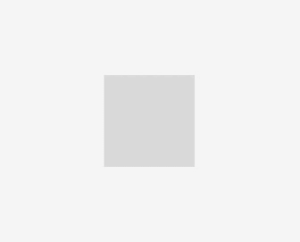

图 4.3 – CenterLayout 在项目周围添加空间

与`MaxLayout`类似，容器内的每个元素都将绘制在之前元素的上方，但大小将设置为每个元素的最小值，而不是填充可用空间：

```go
myContainer := container.New(layout.NewCenterLayout(), …)
```

## PaddedLayout

**PaddedLayout**有助于您通过主题定义的填充值插入内容。内容元素将通过所有侧面的标准填充在容器中居中，如图所示：

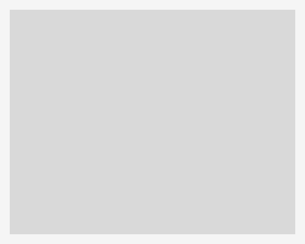

图 4.4 – PaddedLayout 在项目周围添加小空间

与`MaxLayout`类似，容器内的每个元素都将绘制在之前元素的上方，所有元素大小相同，但在此情况下略小于容器：

```go
myContainer := container.New(layout.NewPaddedLayout(), …) 
```

## BoxLayout

框布局有两种类型，`HBoxLayout`（水平布局——用于按行排列项目）和`VBoxLayout`（垂直布局——用于按列表排列项目）。每个框布局都遵循类似的算法：它创建一个线性流，其中元素被打包（水平或垂直），同时保持一致的高度或宽度。

水平框中列出的项目将宽度设置为每个元素的最小值，但将共享相同的高度，这是所有元素最小高度的最大值：

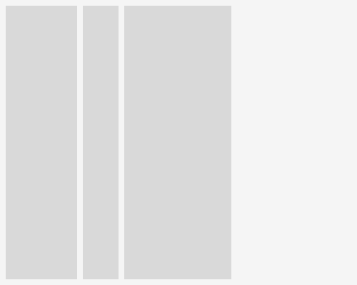

图 4.5 – HBoxLayout 在一行中对齐三个元素

垂直框中的所有项目都具有相同的宽度（所有最小宽度中的最大值），同时缩小到每个元素的最小高度：

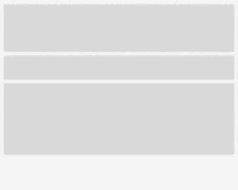

图 4.6 – VBoxLayout 在列中堆叠元素

这种方法允许不同大小的项目看起来统一，同时不会在容器中浪费任何空间。每个这些的语法如下：

```go
myContainer := container.New(layout.NewHBoxLayout(), …)
myContainer := container.New(layout.NewVBoxLayout(), …)
```

## FormLayout

**FormLayout**由表单小部件使用，但当你希望在容器中为项目添加标签时，它也可以单独使用。应该添加偶数个元素；每对中的第一个将位于左侧，尽可能窄。剩余的水平空间将由每对中的第二个占据：

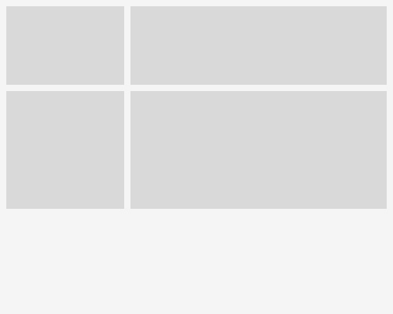

图 4.7 – FormLayout 配对项目进行标签

这里是一个使用`FormLayout`的例子（假设要添加的参数数量是偶数）：

```go
myContainer := container.New(layout.NewFormLayout(), …) 
```

## GridLayout

基本的**GridLayout**旨在将容器划分为与容器中子元素数量相等的等空间。

对于具有两列和三个子元素容器的例子，将创建第二行，但不会完全填满：

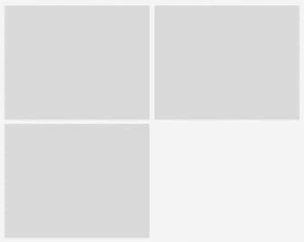

图 4.8 – 两列 GridLayout 中的三个元素

在创建网格布局时，开发者将指定要使用的列数或行数，项目将相应地排列。在每一行或每一列的末尾，布局将换行并创建一个新的布局。行数（或列数）将取决于元素的数量。例如，让我们看一下以下插图：

```go
myContainer := container.New(layout.NewGridLayoutWithColumns(2), …)
myContainer := container.New(layout.NewGridLayoutWithRows(2), …)
```

网格布局有一个额外的模式，可以帮助适应不同的输出设备。在移动设备中，当纵向持有时，通常在单列中显示项目；当横向持有时，在单行中显示。要启用此功能，请使用`NewAdaptiveGridLayout`；此构造函数的参数表示您希望在垂直排列中拥有的行数或水平排列时的列数。当移动设备旋转时，此布局将重新排列其`Container`，如下所示：

```go
myContainer := container.New(layout.NewAdaptiveGridLayout(3), …)
```

## GridWrapLayout

使用网格的另一种变体是当你希望元素在容器大小调整时自动流动到新行（例如，文件管理器或图像缩略图列表）。在这种情况下，Fyne 提供了一个网格包裹布局。在一个包裹的网格中，每个子元素都会调整到指定的大小，然后它们将按行排列，直到下一个项目无法适应，此时将为后续元素创建一个新行。

例如，这里是一个比指定大小三项更宽的网格包裹容器：

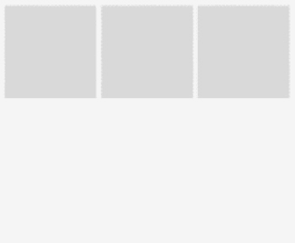

图 4.9 – GridWrapLayout 中的固定元素

GridWrapLayout 和 MinSize

需要注意的是，这种布局与其他所有布局不同，它不会检查每个项目的`MinSize`。因此，开发者应小心确保它足够大，或者包含的元素将截断其元素（如文本）以避免溢出。

这里是一个使用网格包裹布局的示例：

```go
myContainer := container.New(layout.NewGridWrapLayout(fyne.      	    NewSize(120, 120), …)
```

## BorderLayout

在安排应用程序布局中最常用的布局可能是**BorderLayout**。这种布局算法将指定元素排列在容器的顶部、底部、左侧和右侧边缘。顶部和底部的项目将调整到最小高度，但水平拉伸，左侧和右侧的项目将压缩到最小宽度并垂直扩展。容器中未指定属于任何边缘的任何元素将调整大小以填充边框内的可用空间。这通常用于将工具栏放置在顶部，页脚放置在底部，以及文件列表放置在左侧。任何你希望留空的边缘应使用 nil 代替：

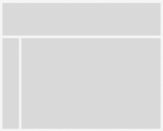

图 4.10 – 设置了顶部和左侧区域的 BorderLayout

BorderLayout 参数

注意，对于`BorderLayout`，某些元素必须指定两次——布局参数指定元素应放置的位置，但项目列表控制容器中将显示什么。如果你发现某个项目没有显示，请确保它在两个地方都进行了指定。

以下代码显示了如何设置带有`header`在顶部并将`files`定位在`content`左侧的边框容器：

```go
myContainer := container.New(layout.NewBorderLayout(header,      	    nil, files, nil), header, files, content)
```

## 组合布局

要构建更复杂的应用程序结构，你将需要在用户界面中使用多个布局。由于每个容器只有一个布局，我们通过嵌套不同的容器来实现这一点。这可以按需多次进行。例如，看看以下图示：

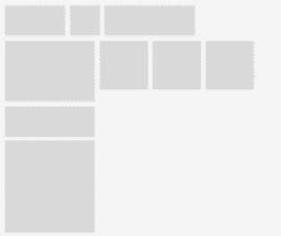

图 4.11 – 具有不同布局的多个容器

对于前面的插图，我们使用了一个容器，其中左侧面板使用`VBoxLayout`，顶部使用`HBoxLayout`，中央容器使用`GridWrapLayout`，所有这些都位于`BorderLayout`内部，如下所示：

```go
top := container.New(layout.NewHBoxLayout(), ...)
left := container.New(layout.NewVBoxLayout(), ...)
content := container.New(layout.NewGridWrapLayout(fyne.     	    NewSize(40, 40)), ...)
combined := container.New(layout.NewBorderLayout(top, nil,     	    left, nil), top, left, content)
```

## 使用容器包

所有的前例都使用了内置的 `Layout` 类型来配置 `fyne.Container` 的内容。为了帮助管理更复杂的布局配置（我们将在 *第五章*，*小部件库和主题*）中看到更多），`container` 包中有很多有用的构造函数。例如，我们可以使用 `container.NewBorder(...)` 而不是 `container.New(layout.NewBorderLayout(…)…)`，这可以使代码更清晰。

提供自定义布局

如果标准布局或它们的组合无法满足你的用户界面需求，你可以构建一个自定义布局并将其传递给容器。

任何实现了 `fyne.Layout` 接口的数据类型都可以用作 `Container` 布局。这个接口只需要实现两个方法，如下所示：

```go
// Layout defines how CanvasObjects may be laid out in a      // specified Size.
type Layout interface {
    // Layout will manipulate the listed CanvasObjects Size     	    // and Position to fit within the specified size.
    Layout([]CanvasObject, Size)
    // MinSize calculates the smallest size that will fit the   	    // listed
    // CanvasObjects using this Layout algorithm.
    MinSize(objects []CanvasObject) Size
}
```

如你所见，这个接口将早期描述的布局管理器需要确定容器的最小尺寸以及处理容器中每个元素的定位进行了编码。由于容器的内容可能会随时改变，因此传递给 `Layout` 或 `MinSize` 的 `CanvasObject` 元素切片可能会改变。因此，自定义布局应避免缓存对单个元素的引用。在某些情况下（例如我们之前看到的 `BorderLayout`），布局可能会明确持有对象引用。如果你的布局以这种方式工作，重要的是要记住，项目可能不在布局的对象切片中存在。

大多数布局在计算最小尺寸或布局时也应跳过隐藏元素。然而，有一些例外，尤其是如果元素可能会经常显示和隐藏。例如，一次只显示一个内容元素的基于标签的布局，如果隐藏的元素比当前可见的元素大，可能会导致窗口扩展。在这种情况下，如果布局在 `MinSize` 代码中考虑隐藏元素，即使它们没有在 `Layout` 中定位，这对用户来说也是有益的。

我们将创建一个编写自定义布局的简短示例：

1.  这个类型，命名为 `diagonal`，将容器中的项目定位在对角线上，从左上角到右下角。我们首先实现 `MinSize()` 来返回所有可见对象的总和（这样就有空间以对角线显示它们）：

    ```go
    type diagonal struct{}
    func (d *diagonal) MinSize(items []fyne.CanvasObject) fyne.Size {
        total := fyne.NewSize(0, 0)
        for _, obj := range items {
            if !obj.Visible() {
                continue
            }

            total = total.Add(obj.MinSize())
        }
        return total
    }
    ```

1.  然后我们添加 `Layout()` 方法，它负责实际定位每个对象。在这个版本中，我们简单地声明一个 `topLeft` 变量，并定位每个可见对象，每次定位和调整元素大小时都会向该值添加：

    ```go
    func (d *diagonal) Layout(items []fyne.CanvasObject, size fyne.Size) {
         topLeft := fyne.NewPos(0, 0)
         for _, obj := range items {
             if !obj.Visible() {
                 continue
             }
             size := obj.MinSize()
             obj.Move(topLeft)
             obj.Resize(size)
             topLeft = topLeft.Add(fyne.NewPos(size.Width,
                 size.Height))
         }
    }
    ```

1.  要将此布局应用于容器，你只需使用以下方法：

    ```go
    item1 := canvas.NewRectangle(color.Black)
    item1.SetMinSize(fyne.NewSize(35, 35))
    item2 := canvas.NewRectangle(&color.Gray{128})
    item2.SetMinSize(fyne.NewSize(35, 35))
    item3 := canvas.NewRectangle(color.Black)
    item3.SetMinSize(fyne.NewSize(35, 35))
    myContainer := container.New(&diagonal{}, item1, item2,      	    item3)
    ```

我们得到的结果是：

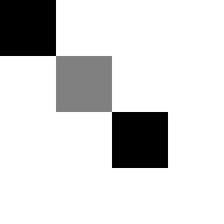

图 4.12 – 简单的对角线布局

我们看到的例子设置了一个静态布局。为每个项目设置的最低大小确定了`Container`的最低大小，它不再扩展。这个布局的改进版本将计算额外空间（容器`MinSize()`与传递给`Layout()`函数的`size`参数之间的差异）。更新后的`Layout()`函数看起来如下所示：

```go
func (d *diagonal) Layout(items []fyne.CanvasObject, size fyne.Size) {
    topLeft := fyne.NewPos(0, 0)
    visibleCount := 0
    for _, obj := range items {
        if !obj.Visible() {
            continue
        }
        visibleCount++
     }
     min := d.MinSize(items)
     extraX := (size.Width - min.Width)/visibleCount
     extraY := (size.Height - min.Height)/visibleCount
     for _, obj := range items {
         if !obj.Visible() {
             continue
         }
         size := obj.MinSize()
         size = size.Add(fyne.NewSize(extraX, extraY))
         obj.Move(topLeft)
         obj.Resize(size)
         topLeft = topLeft.Add(fyne.NewPos(size.Width, 
            size.Height))
     }
}
```

运行代码后，我们得到以下结果：

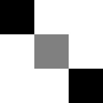

Figure 4.13 – 对角布局扩展以填充空间

使用这个更高级的代码，我们不再需要为所有项目使用最低大小来控制容器（尽管项目通常会有一个最低大小）。实际上，我们可以只调整容器的大小（或应用程序窗口）如下所示：

```go
item1 := canvas.NewRectangle(color.Black)
item2 := canvas.NewRectangle(&color.Gray{128})
item3 := canvas.NewRectangle(color.Black)
myContainer := canvas.New(&diagonal{}, item1, item2, item3)
myContainer.Resize(fyne.NewSize(120, 120))
```

现在我们已经探讨了如何布局应用程序的基础知识，我们可以开始考虑在一个真实的应用程序中实现这一点。我们将要探索的例子是一个图像浏览应用程序，它将布局图像及其元数据。然而，在我们能够做到这一点之前，我们需要了解跨平台环境下的文件处理。如果应用程序开发者假设用户将有一个与他们的开发系统匹配的文件系统或结构，那么在其他设备上可能不起作用，因此了解如何做好这一点对于确保应用程序在所有设备上都能良好运行是至关重要的。

# 跨平台文件处理

Go 标准库在其支持的平台上对文件处理提供了出色的支持。`os`包允许访问文件系统（文件和目录），以及如`filepath`之类的实用程序包，这些包有助于使用当前操作系统的语义解析和管理位置。虽然这些操作在大多数设备上可能很有用，但它们并不很好地扩展到非桌面设备，在这些设备上，传统的文件系统并不是最终用户所面对的。

以移动设备为例。iOS 和 Android 在内部都有传统的文件系统，但文件系统并不完全对设备用户开放，也不是文件数据的唯一来源。应用程序通常只能访问其自己的沙盒目录——不允许在此空间外读取和写入文件——在 iOS 上，您甚至可能需要请求特殊权限才能访问它。除此之外，用户现在还期望能够从其他来源打开数据。例如，像 Dropbox 这样的文件共享应用程序可能为用户提供文件来源，用户可能希望将其传递到您的应用程序中，但使用标准文件处理无法访问这些数据。

由于这些原因，Fyne 工具包包括一个简单的存储抽象，允许您的应用程序处理来自任何来源的数据，同时为您管理权限和安全考虑。这种交互使用**URI**的概念来替换传统的文件路径，允许应用程序在没有直接访问文件和目录的情况下运行。

## URI

文件处理抽象的核心是`fyne.URI`（此处为`http://`或`https://`。URI 可能表示文件系统对象（它将以`file://`开头），来自另一个应用程序的数据流（它可能以`content://`开头），或远程资源（例如，`sftp://`用于安全文件传输协议连接）。

与`os.File`类型类似，`fyne.URI`是对资源的引用，尽管它不会保持该资源打开，因此可以在应用程序中传递而不会出现问题。可以使用`String()`方法访问此 URI 的底层字符串表示。如果你希望将 URI 引用存储起来以供以后使用，例如在配置文件或数据库中，请使用此方法。如果你有一个 URI 字符串表示，可以使用`storage`包中的实用工具访问原始 URI 对象，如下所示：

```go
uriString := "file:///home/user/file.txt"
myUri := storage.NewURI(uriString)
```

## 读取和写入

当你不确定文件存储在哪里时访问文件比传统的`os.Open()`要复杂一些；然而，Fyne 的`storage`包提供了处理这种功能的方法。数据访问的两个主要函数是`OpenFileFromURI`和`SaveFileToURI`，如包中的摘录所示：

```go
// OpenFileFromURI loads a file read stream from a resource 	// identifier.
func OpenFileFromURI(uri fyne.URI) (fyne.URIReadCloser, error) {
     return fyne.CurrentApp().Driver().FileReaderForURI(uri)
}
// SaveFileToURI loads a file write stream to a resource      // identifier.
func SaveFileToURI(uri fyne.URI) (fyne.URIWriteCloser, error) {
     return fyne.CurrentApp().Driver().FileWriterForURI(uri)
}
```

这些函数都接受一个 URI（如前述代码所述）作为位置，在操作成功时返回`URIReadCloser`或`URIWriteCloser`，如果操作失败则返回`error`。

如其名称所示，这些返回类型实现了带有`URI()`函数的`io.ReadCloser`和`io.WriteCloser`，以查询原始资源标识符。你可能不认识这些`io`接口，但你可能已经通过`os.File`使用过它们。这种相似性意味着你可以在许多需要传递文件进行读取操作的地方使用`URIReadCloser`，或者在写入数据时使用`URIWriteCloser`。

如果你正在自行处理读取或写入操作，记得在完成后调用`Close()`方法（就像任何`io.Closer`流一样）。这通常通过在检查任何错误后调用`defer reader.Close()`来确保。以下代码展示了从 URI 读取文件的简单示例：

```go
    uri := storage.NewURI("file:///home/user/file.txt")
    read, err := storage.OpenFileFromURI(uri)
    if err != nil {
        log.Println("Unable to open file \""+uri.               	            String()+"\"", err)
        return
    }
    defer read.Close()
    data, err := ioutil.ReadAll(read)
    if err != nil {
        log.Println("Unable to read text", err)
        return
    }
    log.Println("Loaded data:", string(data))
```

## 用户文件选择

应用程序打开文件的最常见方式，至少最初，是提示用户选择他们希望打开的文件。标准的文件打开对话框可用于提供此功能。应用程序可以调用`dialog.ShowFileOpen`，这将要求用户选择一个文件（可选的文件过滤器）。所选文件将通过回调函数以`URIReadCloser`的形式返回，如前所述。如果你希望存储所选文件的引用，可以使用`URI()`方法返回标识符。以下代码展示了这一操作：

```go
dialog.ShowFileOpen(func(reader fyne.URIReadCloser, err error) {
    if err != nil { // there was an error - tell user
        dialog.ShowError(err, win)
        return
    }
    if reader == nil { // user cancelled
        return
    }
    // we have a URIReadCloser - handle reading the file
    // (remember to call Close())
    fileOpened(reader)
}, win)
```

类似地，还有 `dialog.ShowFileSave` 来启动文件写入工作流程，例如常见的 *另存为* 功能。有关对话框包的更多信息，请参阅 *第五章* 的 *对话框* 部分，*小部件库和主题*。

## ListableURI

在某些应用程序中，可能需要打开包含其他资源的资源（就像文件目录一样）。对于这些情况，还有一个类型，`fyne.ListableURI`，它提供了一个返回 `URI` 项切片的 `List()` 方法。这可以与 `dialog.ShowDirectoryOpen` 结合使用，它将返回用户选择的 `ListableURI` 位置。

让我们看看一个例子：

```go
dialog.ShowFolderOpen(func(dir fyne.ListableURI, err error) {
    if err != nil { // there was an error - tell user
        dialog.ShowError(err, win)
        return
    }
    if dir == nil { // user cancelled
        return
    }
    log.Println("Listing dir", dir.Name())
    for _, item := range dir.List() {
        log.Println("Item name", item.Name())
    }
}, win)
```

如此例所示，一旦用户做出选择，`ListableURI` 就会被传递到我们的代码中。然后我们可以使用 `range List()` 遍历目录或集合中每个项目的 URI。如果您已经有了目录的名称，则可以使用 `storage.ListerForURI(storage.NewFileURI(dirPath))`。

让我们将布局和文件处理付诸实践。现在，我们将构建一个简单的图像浏览应用程序，使用到目前为止我们所看到的一切。

# 实现图像浏览器应用程序

此应用程序将加载包含一些图像的目录，在窗口底部的状态栏中提供内容摘要，并使用大部分空间来显示每个图像。图像将以缩略图（图像的小版本）形式加载，我们将在每个缩略图下方显示图像信息。

## 创建布局

为了开始这个示例，我们将创建应用程序的布局以及将在中央网格中显示的图像项。让我们详细理解这些操作：

1.  首先，我们设置图像项。我们希望图像名称位于图像下方。虽然这可以通过手动定位实现，但如果使用 `BorderLayout`，项目对尺寸变化的响应将更加灵活。我们将在 `bottom` 位置创建一个 `canvas.Text` 元素，并使用 `canvas.Rectangle` 来表示我们稍后要加载的图像：

    ```go
    func makeImageItem() fyne.CanvasObject {
         label := canvas.NewText("label", color.Gray{128})
         label.Alignment = fyne.TextAlignCenter
         img := canvas.NewRectangle(color.Black)
         return container.NewBorder(nil, label, nil, nil,
             img)
    }
    ```

1.  对于主应用程序，我们需要创建一个网格来包含图像缩略图以及稍后定位的状态面板。对于图像网格，我们将使用 `GridWrapLayout`。这种网格布局将所有元素的大小调整为指定的尺寸，并且随着可用空间的增加，可见项目的数量也会增加。在这种情况下，用户可以通过增加窗口大小来看到更多图像。

1.  由于我们尚未加载目录，我们将伪造项目数量（通过遍历 `{1, 2, 3}` 硬编码为三个）。我们为每个项目调用 `makeImageItem` 创建一个项目列表。然后，在 `size` 参数（每个项目使用的尺寸——这是网格包装布局特有的行为）之后，将此列表传递给 `NewGridWrap`。

    ```go
    func makeImageGrid() fyne.CanvasObject {
         items := []fyne.CanvasObject{}
         for range []int{1, 2, 3} {
             img := makeImageItem()
             items = append(items, img)
         }
         cellSize := fyne.NewSize(160, 120)
         return container.NewGridWrap(cellSize, items...)
    }
    ```

1.  首先，我们将只为状态创建一个文本占位符，用于布局应用程序：

    ```go
    func makeStatus() fyne.CanvasObject {
         return canvas.NewText("status", color.Gray{128})
    }
    ```

1.  最后，我们将再次使用 `BorderLayout` 创建一个新的容器来安排状态栏在其余内容下方。通过将图像网格放置在 `BorderLayout` 的中央空间，它将填充任何可用空间：

    ```go
    func makeUI() fyne.CanvasObject {
         	status := makeStatus()
         content := makeImageGrid()
         return container.NewBorder(nil, status, nil, nil,
             content)
    }
    ```

1.  要完成应用程序，我们只需要一个简短的 `main()` 函数来加载 Fyne 应用程序并创建一个窗口，然后我们将将其调整到大于最小尺寸，以便图像网格布局可以扩展到多列：

    ```go
    func main() {
         a := app.New()
         w := a.NewWindow("Image Browser")
         w.SetContent(makeUI())
         w.Resize(fyne.NewSize(480, 360))
         w.ShowAndRun()
    }
    ```

1.  我们现在要做的就是运行组合代码：

    ```go
    Chapter04/example$ go run main.go
    ```

1.  运行此代码将显示以下窗口，准备加载一些真实数据和图像：

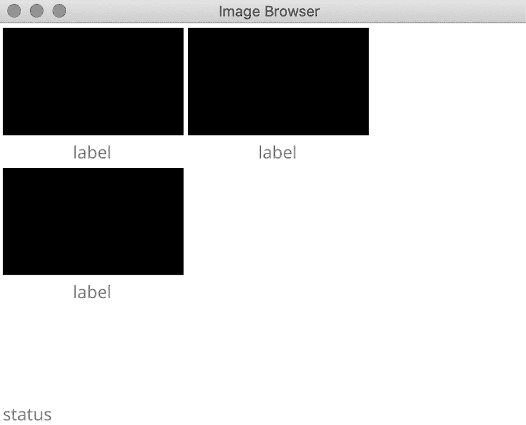

图 4.14 – 我们照片应用的基本布局

## 列出目录

在我们能够加载图像之前，我们需要确定应用程序启动时加载的是哪个目录。让我们看看完成这一点的步骤：

1.  从 `main()` 函数中，我们将调用一个新的 `startDirectory`（解析应用标志或回退到当前工作目录）并将其传递给 `makeUI()` 函数。目录路径通过调用 `ListerForURI` 和 `NewFileURI:` 转换为 `ListableURI`：

    ```go
    func startDirectory() fyne.ListableURI {
         flag.Parse()
         if len(flag.Args()) < 1 {
             cwd, _ := os.Getwd()
             list, _ := storage.ListerForURI(
                 storage.NewFileURI(cwd))
             return list
         }
        	dir, err := filepath.Abs(flag.Arg(0))
         if errr != nil {
             log.Println("Could not find directory", dir
             cwd, _ := os.Getwd
             list, _ := storage.ListerForURI(
                 storage.NewFileURI(cwd))
             return list
         }
         list, _ := storage.ListerForURI(storage.NewURI(dir))   
         return list
    }
    ```

1.  一旦 `ListableURI` 被传递到 `makeUI`，我们就可以使用 `dir.List()` 并在遍历 URIs 之前过滤图像文件。一个新的函数 `filterImages` 将接受目录列表并返回图像 URI 的切片。为此，一个小的 `isImage()` 函数将帮助过滤：

    ```go
    func isImage(file fyne.URI) bool {
         ext := strings.ToLower(file.Extension())
         return ext == ".png" || ext == ".jpg" ||
             ext == ".jpeg" || ext == ".gif"
    }
    func filterImages(files []fyne.URI) []fyne.URI {
         images := []fyne.URI{}
         for _, file := range files {
             if isImage(file) {
                 images = append(images, file)
             }
         }
         return images
    }
    ```

1.  使用代表图像的 `fyne.URI` 切片，我们可以更新状态和图像网格创建函数，以及更新图像标签以在每个图像占位符下使用 `URI.Name()`：

    ```go
    func makeImageGrid(images []fyne.URI) fyne.CanvasObject {
         items := []fyne.CanvasObject{}
         for range images {
             img := makeImageItem()
             items = append(items, img)
         }
         cellSize := fyne.NewSize(160, 120)
         return container.NewGridWrap(cellSize, items...)
    }
    func makeStatus(dir fyne.ListableURI, images []fyne.URI) fyne.CanvasObject {
         status := fmt.Sprintf("Directory %s, %d items",
             dir.Name(), len(images))
         return canvas.NewText(status, color.Gray{128})
    }
    func makeUI(dir fyne.ListableURI) fyne.CanvasObject {
         list, err := dir.List()
         if err != nil { 
             log.Println("Error listing directory", err)
         }
         images := filterImages(list)
         status := makeStatus(dir, images)
         content := makeImageGrid(images)
         return container.NewBorder(
             (nil, status, nil, nil, content)
    }
    ```

## 加载图像

现在我们来看一下将图像加载到我们应用程序中的步骤：

1.  首先，我们创建一个简单的图像加载方法，它接受一个 URI 并返回 `*canvas.Image`。然后，新的 `loadImage` 函数将用于代替占位符矩形：

    ```go
    func loadImage(u fyne.URI) fyne.CanvasObject {
         read, err := storage.OpenFileFromURI(u)
         if err != nil {
              log.Println("Error opening image", err)
              return canvas.NewRectangle(color.Black)
         }
         res, err :=
            storage.LoadResourceFromURI(read.URI())
         if err != nil {
            log.Println("Error reading image", err)
            return canvas.NewRectangle(color.Black)
         }
         img := canvas.NewImageFromResource(res)
         img.FillMode = canvas.ImageFillContain
         return img
    }
    ```

1.  `makeImage` 函数应该更新为按照以下方式传递 `URI` 项目：

    ```go
    func makeImageItem(u fyne.URI) fyne.CanvasObject {
    ```

1.  然后可以将 `makeImageItem` 函数内部创建图像的线条替换为创建的图像：

    ```go
    img := loadImage(u)
    ```

1.  在 `loadImage` 函数中，在返回 `canvas.Image` 之前，我们将 `FillMode` 从默认值（`canvas.ImageFillStretch`）更改为 `canvas.ImageFillContain`，这样图像的宽高比将被尊重，并且图像将适合可用空间：

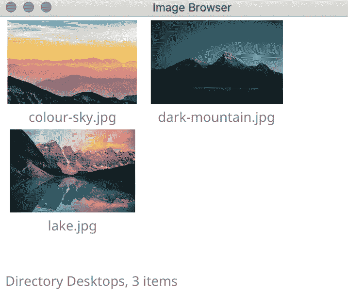

图 4.15 – 加载到布局中的图像和名称

这段代码按预期工作，如图所示，但它可能比较慢。我们在继续用户界面加载之前就加载了图像。这并不利于用户体验，所以让我们通过使用后台图像加载来改善这种情况。

## 加速应用加载

为了避免图像大小减慢用户界面的加载速度，我们需要在图像加载之前完成应用程序 UI 的构建。这被称为异步（或后台）加载，如果您的应用程序需要使用大量资源，这可能非常强大。

在后台加载所有图像的最简单方法就是启动许多 goroutine。但是，当显示大目录时，这可能会变得非常慢。相反，我们将使用单个图像加载 goroutine，一次处理一张图像。（作为一个练习，如果你感到好奇，你可以将其扩展到一次处理八张或更多的图像。）

现在我们来看看如何做到这一点：

1.  为了跟踪图像加载，我们将创建一个新的类型 `bgImageLoad`，它将引用要加载的图像的 URI 以及它应该加载到的 `*canvas.Image` 项目。我们还需要创建一个通道（我们将它命名为 `loads`），它将排队要加载的项目。我们在 `1024` 项处缓冲它，这代表了一个大目录——处理无界文件数量的实现可能需要我们更聪明一些：

    ```go
    type bgImageLoad struct {
        uri fyne.URI
        img *canvas.Image
    }
    var loads = make(chan bgImageLoad, 1024)
    ```

1.  在加载此更新版本的图像时，我们将创建一个空的 Fyne `*canvas.Image`，稍后将在其中加载图像。然后我们排队此图像 `URI` 的详细信息，以便在 goroutine 能够处理它时加载：

    ```go
    func loadImage(u fyne.URI) fyne.CanvasObject {
         img := canvas.NewImageFromResource(nil)
         img.FillMode = canvas.ImageFillContain
         loads <- bgImageLoad{u, img}
         return img
    }
    ```

1.  我们将图像加载代码移动到新的 `doLoadImage` 函数中，该函数将在后台运行。在这个版本中，我们想要做所有图像加载的慢速部分；因此，我们加载并解码图像，将其转换为用于显示的内存中的图像，并让用户界面对更新、调整大小等更加响应。

    新的函数 `doLoadImages` 将遍历所有添加到通道中的项目，并逐个调用 `doLoadImage` 来加载它们。图像加载代码将在加载原始数据后刷新图像 `CanvasObject`，因此每个项目都会在加载时出现：

    ```go
    func doLoadImage(u fyne.URI, img *canvas.Image) {
         read, err := storage.OpenFileFromURI(u)
         if err != nil {
             log.Println("Error opening image", err)
             return
         }
         defer read.Close()
         raw, _, err := image.Decode(read)
         if err != nil {
             log.Println("Error decoding image", err)
             return
         }
         img.Image = scaleImage(raw)
         img.Refresh()
    }
    func doLoadImages() {
         for load := range loads {
             doLoadImage(load.uri, load.img)
         }
    }
    ```

1.  为了确保图像已加载，我们在 `main()` 函数中启动 `doLoadImages` 作为 goroutine：

    ```go
    func main() {
    ...
         go doLoadImages()
         w.ShowAndRun()
    }
    ```

1.  最后，在前面提到的代码中，我们引用了 `scaleImage`。这意味着我们显示的每一张图像都是全尺寸图像的小版本。当浏览的目录包含非常大的图像时，这是必要的。工具包将尝试将非常大的图像画得很小，这可能会非常慢。相反，我们将图像的大小减小，以适应每个网格单元中可用的空间。我们使用了较大的数字（单元格大小的两倍），这样高密度显示仍然可以给出良好的效果。

1.  以下代码片段使用了有用的 `github.com/nfnt/resize` 包来缩放图像。尽管 Go 中的 `image` 包通常很有帮助，但它不包含高效的缩放例程。我们使用这个库并请求 `Lanczos3` 插值，这在上采样图像时提供了速度和质量之间的平衡：

    ```go
    func scaleImage(img image.Image) image.Image {
         return resize.Thumbnail(320, 240, img,
            resize.Lanczos3)
    }
    ```

    `resize.Thumbnail`函数创建一个适合指定大小的小图像，这对于我们的目的非常理想，因此我们可以避免担心宽高比和计算。

使用更新的代码将为即使是包含非常大的图像的大目录创建快速加载和响应式的用户界面。这就是我们想要的：当使用全尺寸图像时可能较慢的调整大小操作，现在变得更快了！

## 为图像元素创建自定义布局

在此示例中，标签所占用的空间可能有点浪费，因此让我们创建一个自定义布局，该布局将文本写入每个图像的底部边缘。我们将使用半透明背景使文本更易于阅读，并使用小渐变从文本背景到图像进行混合。

要构建自定义布局，我们需要定义一个类型（在本例中为`itemLayout`），该类型实现了`fyne.Layout`接口中的`MinSize`和`Layout`函数。由于背景、渐变和文本都有特殊的位置，我们将保存对这些画布对象的引用，以便稍后进行排列：

```go
type itemLayout struct {
     bg, text, gradient fyne.CanvasObject
}
func (i *itemLayout) MinSize(_ []fyne.CanvasObject) fyne.Size {
     return fyne.NewSize(160, 120)
}
func (i *itemLayout) Layout(objs []fyne.CanvasObject, size fyne.Size) {
     textHeight := float32(22)
     for _, o := range objs {
         if o == i.text {
             o.Move(fyne.NewPos(0, size.Height-textHeight))
             o.Resize(fyne.NewSize(size.Width, textHeight))
         } else if o == i.bg {
             o.Move(fyne.NewPos(0, size.Height-textHeight))
             o.Resize(fyne.NewSize(size.Width, textHeight))
         } else if o == i.gradient {
             o.Move(fyne.NewPos(0, size.Height-                	                 (textHeight*1.5)))
             o.Resize(fyne.NewSize(size.Width, textHeight/2))
         } else {
             o.Move(fyne.NewPos(0, 0))
             o.Resize(size)
         }
     }
}
```

此代码将确保我们的容器中的每个元素都定位在正确的位置。`text`和`bg`与`gradient`底部对齐，而任何其他元素（在本例中为我们的图像缩略图）将定位在布局请求填充的填充大小。

要使用此布局，我们更新`makeImageItem`函数，使其使用`&itemLayout`作为容器布局。在这个构造函数中，我们传递一个新的`canvas.Rectangle`和`canvas.Gradient`，用于实现之前描述的效果。在将图像传递给文本背景之前，并将文本元素最后传递给`NewContainerWithLayout`，这是设置这些元素绘制顺序的重要步骤：

```go
func makeImageItem(u fyne.URI) fyne.CanvasObject {
     label := canvas.NewText(u.Name(), color.Gray{128})
     label.Alignment = fyne.TextAlignCenter
     bgColor := &color.NRGBA{R: 255, G: 255, B: 255, A: 224}
     bg := canvas.NewRectangle(bgColor)
     fade := canvas.NewLinearGradient(color.Transparent,         	         bgColor, 0)
     return container.New(
         &itemLayout{text: label, bg: bg, gradient: fade},
         loadImage(u), bg, fade, label)
}
```

经过这些更改后，我们可以再次运行代码，看看我们的新布局如何使每个图像预览在相同的空间内更大，同时给应用程序增添一点风采：

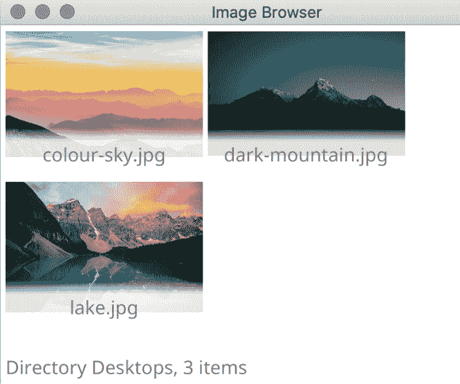

Figure 4.16 – 自定义图像及其标签的布局

最后，你可能已经注意到，包含许多图像的目录会强制窗口扩展，因此你可能希望向网格容器添加滚动。为此，我们将使用之前提到的容器包中的一个辅助工具，在图像网格容器周围添加`container.Scroll`。这只需要将`makeUI`函数的`content`创建行替换为以下内容：

```go
content := container.NewScroll(makeImageGrid(images))
```

## 更改目录

除了加载指定的目录外，我们可能希望在应用程序打开后允许用户打开不同的目录。为此，我们将使用`Window`上的`SetMainMenu`函数，该函数设置了一个结构来填充菜单栏。

使用`fyne`包中的`NewMainMenu`、`NewMenu`和`NewMenuItem`辅助函数，我们设置了一个结构，定义了点击时`chooseDirectory`的行为（我们也传递了当前窗口，以便可以从该函数中显示对话框）。以下代码被添加到`main()`函数中，在`Window.ShowAndRun()`之前：

```go
w.SetMainMenu(fyne.NewMainMenu(fyne.NewMenu("File",
    fyne.NewMenuItem("Open Directory...", func() {
        chooseDirectory(w)
    }))))
```

为了支持这个菜单操作，我们需要创建`chooseDirectory`函数。这将调用`dialog.ShowDirectoryOpen`，提示用户在他们的电脑上选择一个目录。这个功能与之前我们探索的`ShowFileOpen`调用类似，只是回调中返回的参数是`ListableURI`而不是`URIReadCloser`。使用这个参数（在检查任何错误之后），我们可以调用`makeUI`并使用这个新位置来更新我们整个应用程序的用户界面：

```go
func chooseDirectory(w fyne.Window) {
     dialog.ShowFolderOpen(func(dir fyne.ListableURI, err      	     error) {
         if err != nil {
             dialog.ShowError(err, w)
             return
         }
         w.SetContent(makeUI(dir)) // this re-loads our         	                                   // application
     }, w)
}
```

如果我们正在构建一个更复杂的应用程序，那么仅仅调用`Window.SetContent`并不是最高效的方法。在这种情况下，我们会保存对主`fyne.Container`的引用，并只更新图像网格而不是整个应用程序。然而，我们应用程序的最终版本应该看起来像以下截图：

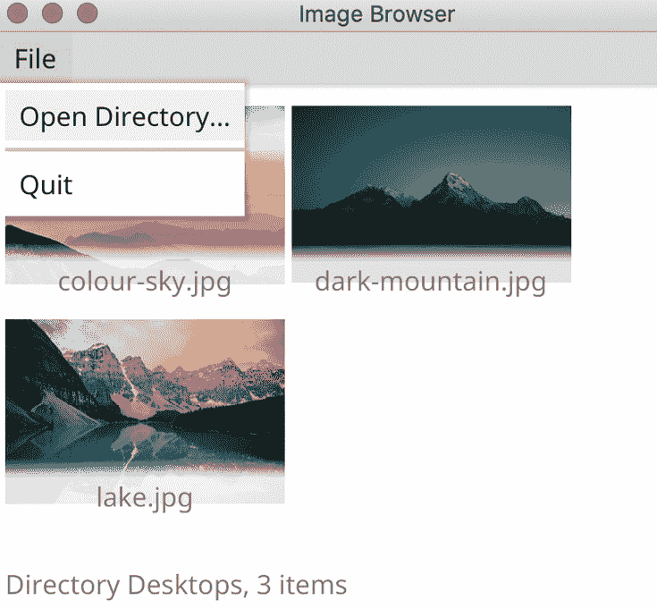

图 4.17 – 添加主菜单

注意，当在 macOS 上运行时，默认行为是在桌面菜单栏中显示菜单——这可以通过使用`no_native_menus`构建标签来覆盖，如下所示：

```go
$ go run -tags no_native_menus main.go Images/Desktop
```

# 摘要

本章详细介绍了布局的工作原理，工具包中所有内置布局的详细信息以及何时使用它们。我们还看到了如何轻松地组合多个布局，并创建了我们自己的自定义布局，为我们的图片浏览应用程序增添了一些风采。

我们还探讨了如何使用`URI`和`ListableURI`类型来调整文件处理代码以跨所有平台工作。利用这些知识，我们的图片浏览应用程序现在与所有桌面和移动平台兼容。通过了解如何布局应用程序并避免对传统文件系统的假设，你现在可以确保你的应用程序在任何支持的平台上都能正确运行，包括移动、桌面以及更多。

虽然我们只使用画布原语和布局创建了一个完整的应用程序，但使用`widget`包可以构建更复杂的应用程序，我们将在下一章中探讨。
