# *第五章*：小部件库和主题

Fyne 工具包的大部分是它的标准小部件库，它提供简单的视觉元素，管理用户输入，并处理应用程序工作流程。这些小部件处理信息和用户输入的显示方式，以及用于组织用户界面和管理标准工作流程的容器选项。Fyne 工具包附带的主题支持浅色和深色版本，两者都支持用户颜色偏好，同时适应所有用户界面元素，使其在两种模式下都看起来很棒。

在本章中，我们将探讨 Fyne 工具包中可用的所有小部件以及如何使用它们。我们将涵盖以下主题：

+   探索 Fyne Widget API 的设计

+   介绍基本小部件

+   使用集合小部件进行分组

+   使用容器小部件添加结构

+   使用常用对话框

到本章结束时，你将熟悉所有 Fyne 小部件以及主题功能如何控制它们的外观。通过组合小部件和容器，你将构建你的第一个基于 Fyne 的完整图形用户界面。

# 技术要求

本章的要求与 *第三章*，“窗口、画布和绘图”相同 - 即，你必须安装 Fyne 工具包并有一个工作的 Go 和 C 编译器。有关更多信息，请参阅上一章。

本章的完整源代码可以在[`github.com/PacktPublishing/Building-Cross-Platform-GUI-Applications-with-Fyne/tree/master/Chapter05`](https://github.com/PacktPublishing/Building-Cross-Platform-GUI-Applications-with-Fyne/tree/master/Chapter05)找到。

# 探索 Widget API 的设计

正如我们在 *第二章*，“根据 Fyne 的未来”中描述的，其 API 被设计用来传达语义意义，而不是功能列表。随后是 Widget 定义，我们添加了描述行为的 API 并隐藏了渲染的细节。所有小部件都必须实现的接口仅仅是基本 `CanvasObject` 对象（在第 *第三章*，“窗口、画布和绘图”中介绍）的扩展，它添加了一个 `CreateRenderer()` 方法。它在源代码中定义如下：

```go
// Widget defines the standard behaviors of any widget.
// This extends the CanvasObject - a widget behaves in 
// the same basic way but will encapsulate many child
// objects to create the rendered widget.
type Widget interface {
        CanvasObject
        CreateRenderer() WidgetRenderer
}
```

Fyne 使用新的 `CreateRenderer()` 方法来确定小部件的外观。没有公共 API 可以访问当前渲染器 - 相反，状态是在 `Widget` 中设置的，每个渲染器都会刷新其输出以匹配此状态。这种设计强烈鼓励 API 专注于行为和意图，而不是直接操作图形输出（这可能导致不一致或无法使用的应用程序）。

## 专注于行为

通过在组件状态和其视觉表示之间强制分离，每个`Widget`被迫公开一个 API，该 API 描述了行为或意图，而不是视觉属性或内部细节。这对于继续语义 API 的设计原则很重要，这导致了一个更简洁的 API，该 API 专注于预期结果而不是图形调整。

通常，状态的变化需要通过某种方式的`WidgetRender`更新来反映。图形表示如何变化由渲染器控制，并且通过调用`Widget.Refresh()`来触发。这种刷新通常由小部件代码处理；例如，`Button.SetText()`函数的代码如下：

```go
// SetText allows the button label to be changed
func (b *Button) SetText(text string) {
    b.Text = text
    b.Refresh()
}
```

`Refresh()`调用将排队一个请求，要求更新小部件的渲染，这将导致下一次屏幕更新时的图形更新。在某些小部件上，调用`Refresh`函数可能会引起大量的计算。如果你有很多更改要应用到小部件上，你可能不希望它在每一行后都刷新。为了帮助解决这个问题，也存在一种直接的字段访问方法，确保它不需要频繁调用。

方法与字段访问

如前所述，刷新小部件，尤其是复杂的小部件，可能很耗时，如果必须执行许多更新，用户可能会注意到轻微的延迟。如果开发者希望更新小部件的多个方面，那么（尽管可能性不大）可能一个更改会在视觉重绘之前应用，而其他更改则发生在之后。尽管将发生另一次绘制，但可能会注意到它们没有一起改变。考虑以下代码：

```go
func updateMyButton(b *widget.Button) {
    b.SetText("sometext")
    b.SetIcon(someResource)
}
```

当使用基于方法更新时，`SetText()`和`SetIcon()`调用将刷新小部件，可能会引起之前提到的轻微延迟。建议仅在需要时调用`Refresh()`；为了实现这一点，开发者可以直接访问小部件状态并手动刷新对象。这被称为**基于字段的访问**，因为我们直接更改小部件导出的字段。例如，我们可以将前面的代码重写如下：

```go
func updateMyButton(b *widget.Button) {
    b.Text = "sometext"
    b.Icon = someResource
    b.Refresh()
}
```

通过采用这种方法，我们确保`Refresh()`只被调用一次，这样所有更改的元素将同时重新绘制。这为用户提供了更平滑的结果，并且将导致更低的 CPU 使用率。

## 渲染小部件

之前提到的`CreateRenderer()`方法将返回一个新的渲染器实例，该实例定义了小部件如何在屏幕上呈现。工具包负责调用此方法，并且当小部件可见时，它将缓存结果。开发者不应直接调用此方法，因为结果将与显示的内容没有关联。

渲染器的确切生命周期是变化的，它是小部件的可见性、其父级的可见性以及窗口当前是否显示的组合。小部件的 `WidgetRenderer` 定义在其应用程序生命周期中可能被卸载。如果小部件在以后日期再次变得可见，将请求一个新的实例。如果不再需要渲染器，则将调用其 `Destroy()` 方法。小部件渲染器的完整定义如下，并已从 API 文档中提取：

```go
// WidgetRenderer defines the behavior of a widget’s
// implementation. This is returned from a widget’s main
// object through the CreateRenderer() function.
type WidgetRenderer interface {
    Layout(Size)
    MinSize() Size
    Refresh()
    Objects() []CanvasObject
    Destroy()
}
```

在 `WidgetRenderer` 定义中的前两种方法（`Layout()` 和 `MinSize()`）应该来自 *第四章*，*布局和文件处理* – 它们定义了一个容器布局。在这种情况下，容器是这个小部件，被控制的对象是用于渲染小部件的视觉组件 – 它们是从 `Objects()` 方法返回的。当需要重新绘制可见小部件时，会内部调用 `WidgetRenderer` 的 `Refresh()` 方法。

`Objects()` 方法的调用返回一个列表，其中包含渲染它所描述的小部件所需的每个 `CanvasObject`。这是从 `canvas` 包（如 `Text`、`Rectangle` 和 `Line`）中的项目切片。这些项目将使用之前描述的布局方法进行排列，以创建最终的小部件展示。每个元素的颜色匹配或与当前主题融合是很重要的。当调用 `Refresh()` 函数时，它可能是对主题更改的响应，因此在该代码中应相应地更新任何自定义值。

现在我们已经了解了小部件的工作原理，让我们看看工具包中内置了什么。

介绍基本小部件

在 Fyne（或任何 GUI 工具包）中最常用的包可能是 `widget` 包。它包含所有对大多数图形应用程序有用的标准小部件。该集合分为基本小部件（用于简单的数据显示或用户输入）和集合小部件（`List`、`Table` 和 `Tree`），用于显示大量或更复杂的数据。在本节中，我们将按字母顺序逐步查看基本小部件，以了解它们的样式以及如何将它们添加到应用程序中。

手风琴

手风琴小部件用于通过显示和隐藏项目来将大量内容适应到小区域，这样每次只能看到一个子元素。每个项目都有一个标题按钮，用于显示或隐藏其下的内容。这可以在以下图像中看到，它显示了浅色和深色主题中的手风琴小部件：

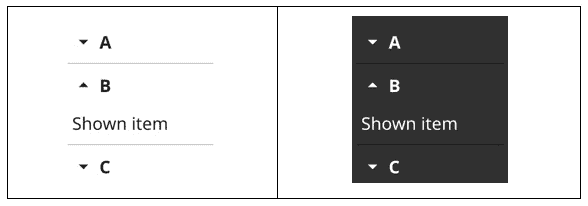

图 5.1 – 一个展开项目 B 的手风琴小部件，显示在浅色和深色主题中

要创建一个`Accordion`小部件，您必须传递一个`AccordionItem`对象列表，该列表指定了折叠中每个元素的标题和详细信息。您还可以可选地指定`Open`值，如果设置为`true`，则默认显示内容。用于创建前面`Accordion`图像的代码块如下：

```go
acc := widget.NewAccordion(
    widget.NewAccordionItem("A", widget.NewLabel("Hidden")),
    widget.NewAccordionItem("B", widget.NewLabel("Shown         	        item")),
    widget.NewAccordionItem("C", widget.NewLabel("End")),
)
acc.Items[1].Open = true
```

默认情况下，`Accordion`小部件一次只显示一个项目。要允许显示任意数量的项目，可以将`MultiOpen`字段设置为`true`。

按钮

`Button`小部件提供了一个标准的按下按钮，可以通过鼠标点击（或在触摸屏上使用轻触手势）来激活。按钮可以包含文本或图标内容，或两者兼而有之。`Button`构造函数还接受一个匿名`func`，当按钮被轻触时执行。

您可以使用`widget.NewButton`或`widget.NewButtonWithIcon`构造函数来创建一个按钮。建议尽可能使用内置的主题图标（有关更多信息，请参阅本章后面的*主题*部分），如下所示：

```go
widget.NewButtonWithIcon("Cancel", theme.CancelIcon(), func() {})
```

每个主题中的按钮如图所示：

![图 5.2 – 在亮暗主题中显示其图标的按钮

![img/Figure_5.2_B16820.jpg]

图 5.2 – 在亮暗主题中显示其图标的按钮

大多数按钮外观相同，但如果您需要让某个按钮突出，可以通过设置`Button.Importance = widget.HighImportance`来将其设置为高重要性样式，如图所示：

![图 5.3 – 在亮暗主题中的高重要性按钮

![img/Figure_5.3_B16820.jpg]

图 5.3 – 在亮暗主题中的高重要性按钮

用于表示高重要性小部件的颜色将根据主题而变化，甚至可以由用户设置。`Button.Importance`的另一个可能值是`widget.LowImportance`，这会减少显示的视觉影响，例如，通过移除前面两个图像中显示的阴影。

## 卡片

当用户界面的元素相互关联时，将它们分组在一起可能很有用。当一组项目需要标题或当许多不同的数据元素想要比简单列表更大的预览时，这很有帮助。可以将一组`Card`小部件添加到具有网格布局的`Container`中，以安排显示不同内容（如搜索结果或媒体项目的预览）的类似项目。

您可以使用`NewCard`构造函数创建一个卡片小部件，该函数接受一个标题和副标题字符串，以及一个`CanvasObject`内容参数。您还可以在构建后或通过手动创建结构体来指定`Image`字段，如下面的代码块所示：

```go
widget.NewCard("Card Title", "Subtitle",
    widget.NewLabel("Content"))
&widget.Card(Title: "Card Title",
    Subtitle: "Subtitle",
    Image: canvas.NewImageFromResource(theme.FyneIcon()))
```

您可以在以下图像中看到前面代码使用亮暗主题：

![图 5.4 – 卡片小部件在亮暗模式下的标题和图像

![img/Figure_5.4_B16820.jpg]

图 5.4 – 卡片小部件在亮暗模式下的标题和图像

在前面的代码中使用的所有字段都是可选的。对于任何标题的空字符串都将将其从显示中移除，以及空图像或内容也将将其移除（你可以在前面的图像中看到缺失的内容）。

## 复选

复选框功能由`Check`小部件提供。它有两个状态：选中状态和未选中状态（默认）。构造函数接受一个回调函数`func(bool)`，该函数将在选中状态更改时被调用，传递当前状态（`true`表示选中）。此代码如下：

```go
widget.NewCheck("Check", func(bool) {})
```

您还可以通过调用`SetChecked`方法并传递`true`（或传递`false`以将其更改回未选中）来手动设置选中状态：

```go
check.SetChecked(true)
```

在以下图像中显示了每个主题中不同的选中状态：

![Figure 5.5 – 亮色主题的复选框被选中，而暗色主题的复选框未被选中

![img/Figure_5.5_B16820.jpg]

图 5.5 – 亮色主题的复选框被选中，而暗色主题的复选框未被选中

选中指示器将适应当前主题，就像文本一样。

## 条目

文本输入主要通过`Entry`小部件添加，它提供自由文本输入。可以通过设置`Placeholder`向字段添加内容提示，并且可以直接使用`Text`字段或`SetText()`方法设置文本内容。可以使用以下构造函数之一创建条目。第一个是普通文本字段，第二个是密码输入，第三个用于多行输入（默认为 3 行）：

```go
widget.NewEntry()
widget.NewPasswordEntry()
widget.NewMultilineEntry()
```

以下图像显示了使用默认主题的标准和密码输入小部件：

![Figure 5.6 – 亮色和暗色主题下的 Entry 和 PasswordEntry 小部件

![img/Figure_5.6_B16820.jpg]

图 5.6 – 亮色和暗色主题下的 Entry 和 PasswordEntry 小部件

条目小部件还支持验证，可用于向用户提供关于当前文本的反馈。不同的状态可以在以下图像中看到：

![Figure 5.7 – 使用亮色主题的成功和失败验证状态

![img/Figure_5.7_B16820.jpg]

图 5.7 – 使用亮色主题的成功和失败验证状态

在输入时，当内容有效时，具有验证器集的条目将提供正面反馈。当用户停止编辑输入时，无效内容将显示警告。

## 文件图标

除了使用静态图标（参见本节后面的图标部分）之外，工具包还可以显示不同类型文件的适当图标。`FileIcon`小部件被创建出来，通过加载标准图标资源并在其中显示文件扩展名，使这项常见任务变得更容易。图标的大小与标准的`widget.Icon`相匹配，其图像和文本将更新以反映指定的 URI。可以通过指定文件资源的 URI 来创建`FileIcon`小部件，如下所示：

```go
file := storage.NewFileURI("images/myimage.png")
widget.NewFileIcon(file)
```

以下代码将根据当前主题渲染如下：

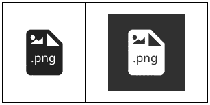

图 5.8 – 显示 PNG 图像符号和扩展的 Fileicon 小部件

`FileIcon` 小部件将根据文件类型变化其外观，设置合适的图标。

## 表单

表单小部件用于标记和布局各种输入元素。表单的每一行通常包含一个带有标签的输入元素。如果表单设置了 `OnSubmit` 或 `OnCancel` 函数，那么它将自动生成一个包含相应操作按钮的额外行。

您可以通过将 `FormItem` 对象的列表传递给 `NewForm()` 构造函数来创建一个表单，如下所示：

```go
form := widget.NewForm(
    widget.NewFormItem("Username", widget.NewEntry()),
    widget.NewFormItem("Password", widget.NewPasswordEntry()),
)
form.OnCancel = func() {
    fmt.Println("Cancelled")
}
form.OnSubmit = func() {
    fmt.Println("Form submitted")
}
```

您还可以调用 `Form.Append()` 来稍后添加元素。表单的外观将根据当前主题如下所示：

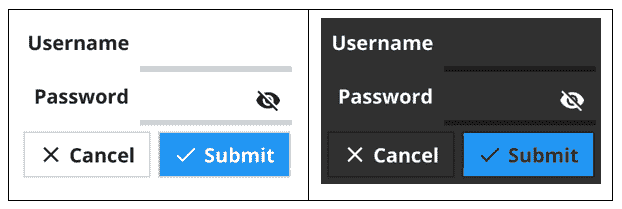

图 5.9 – 在浅色和深色主题中显示的登录表单

将输入元素分组到表单中还有一个额外的好处，那就是它可以帮助确保只有经过验证的输入才会被提交。如果任何小部件设置了验证器，那么表单将只允许在所有验证器都通过后提交。

## 超链接

在某些情况下，提供可点击的 URL 字符串以在用户的浏览器中打开网页可能会有所帮助。为此用例，有一个 `Hyperlink` 小部件，它接受一个 `URL` 参数，当它被点击时打开页面。要创建超链接小部件，我们可能需要解析一个 URL，如下面的代码片段所示：

```go
href, _ := url.Parse("https://fyne.io")
widget.NewHyperlink("fyne.io", href)
```

小部件的外观如下：

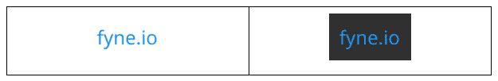

图 5.10 – 使用浅色和深色主题的超链接小部件

## 图标

虽然您可以直接将 `canvas.Image` 添加到用户界面中，但有时保持一致的大小可能很有用。`Icon` 小部件提供了这一点，加载标准资源并将其最小尺寸设置为主题定义的图标大小。图标还将更新以匹配当前主题。我们可以使用以下代码创建一个显示标准粘贴图像的图标：

```go
widget.NewIcon(theme.ContentPasteIcon())
```

以下代码将根据当前主题进行渲染：

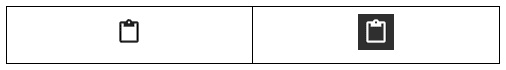

图 5.11 – 在浅色和深色主题中显示粘贴图标的图标小部件

接下来，我们将继续介绍标签小部件。

## 标签

通常建议使用 `Label` 小部件来显示文本。虽然可以使用 `canvas.Text`，但正如我们在 *第三章* 中看到的，*Windows、Canvas 和绘图*，这些元素使用开发者定义的颜色 – 在大多数用户界面中，文本匹配当前主题更可取，这正是 `Label` 小部件所处理的：

```go
widget.NewLabel("Text label")
```

每个主题中的标签小部件看起来如下：

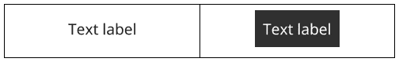

图 5.12 – 浅色和深色主题中的文本标签

此小部件还支持额外的文本格式化，如换行、自动换行和截断。包含换行符（`\n`）的字符串将被拆分为第二行并完全可见，而将`Label.Wrapping`设置为`fyne.TextWrapWord`（或`fyne.TextWrapBreak`）将自动在小部件宽度需要时添加新行。将值设置为`fyne.TextWrapTruncate`将简单地从显示中移除溢出的文本。

## 弹出菜单

`PopUpMenu`小部件对于显示上下文菜单或允许用户在内置小部件无法提供所需功能时从选项中选择非常有用。要以这种方式创建菜单，你需要一个`fyne.Menu`数据结构来描述可用的选项（这是我们用于*第三章*，*窗口、画布和绘图*，主菜单的相同结构）。在这种情况下，菜单的标题可以是空的，因为它将不会显示。

一旦定义了菜单，`ShowPopUpMenuAtPosition`实用函数就是向用户显示此菜单的最简单方法。此函数接受窗口中的绝对位置并在左上角显示菜单。与其他弹出元素一样，可以通过在显示的内容外轻触来关闭它，从而将用户返回到之前的状态。你可以使用以下代码来完成此操作：

```go
menu := fyne.NewMenu("", fyne.NewMenuItem("An item", func() {}))
pos := fyne.NewPosition(20, 20)
widget.ShowPopUpMenuAtPosition(menu, myWindow.Canvas(), pos)
```

上述代码将在窗口当前内容上方创建一个新菜单。结果如下所示：

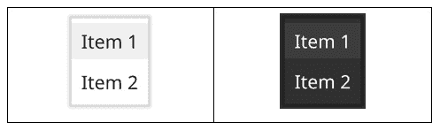


图 5.13 – 在浅色和深色主题中显示的 PopUpMenu

也可以直接在这里使用`Menu`小部件。可以使用`widget.NewMenu`构造函数渲染菜单，而不会像`PopUpMenu`那样创建覆盖层。

## ProgressBar

如果一个应用程序需要指示一个过程将需要一些时间来执行，那么你可以使用`ProgressBar`小部件。有两种变体：`widget.ProgressBar`和`widget.ProgressBarInfinite`。常规进度条显示从`Min`到`Max`（默认*0*到*1*）的当前`Value`，开发者负责在过程进行时设置值。当使用无限进度条时，没有内在值，因此输出渲染一个动画，表示活动（值的改变）在未定义的时间内。我们可以使用以下任一行来创建进度条：

```go
bar1 := widget.NewProgressBar()
bar2 := widget.NewProgressBarInfinite()
```

这两个版本的进度条看起来如下，左侧是`bar1`，右侧是`bar2`：

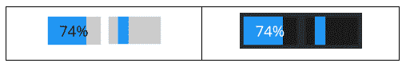


图 5.14 – 在浅色和深色主题中显示的标准和无限进度条

如果您希望为常规进度小部件添加不同的文本叠加，则可以使用`TextFormatter`字段，设置一个返回字符串值的函数。这可以根据小部件的状态或类似`加载中...`的字符串进行格式化。

## 单选按钮组

单选按钮组小部件是请求用户输入的最常见方式。结果与下一个讨论的`选择`小部件类似，但所有选项都是可见的。`RadioGroup`小部件可以通过指定将作为选项列出的字符串值片段来创建。第二个参数是一个回调函数，每次选择改变时都会执行，将新值传递给函数：

```go
widget.NewRadioGroup([]string{"Item 1", "Item 2"}, func(s string) {
    fmt.Println("Selected", s)
})
```

单选按钮组小部件在不同主题中的外观如下：

![图 5.15 – 在浅色和深色主题中显示的带有两个选项的单选按钮组，顶部被选中]

![图片 5.15 – B16820.jpg]

图 5.15– 在浅色和深色主题中显示的带有两个选项的单选按钮组，顶部被选中

## 选择

与前面的`单选按钮组`小部件类似，`选择`小部件允许用户从列表中选择一个项目。当选项列表很长或可用空间较小的时候，更常用`选择`。此小部件以显示当前值的按钮形式出现。当触摸时，将显示一个弹出菜单，列出可用的选项：

```go
widget.NewSelect([]string{"Item 1", "Item 2"}, func(s string) {
    fmt.Println("Selected", s)
})
```

`选择`小部件在不同主题中的外观如下：

![图 5.16 – 在浅色和深色主题中显示的选择小部件]

![图片 5.16 – B16820.jpg]

图 5.16 – 在浅色和深色主题中显示的选择小部件

接下来是`选择条目`小部件。

## 选择条目

`选择条目`与之前描述的`选择`小部件类似，不同之处在于它还允许用户定义选项。这可以通过提供一个带有选择样式下拉图标的`Entry`小部件来实现，该图标列出指定的选项。因为当前值可以在每次按键时改变，所以此小部件的回调配置与`Entry`类似，而不是`选择`——它不是作为构造函数中的选择更改函数传递，而是可以在小部件的`OnChanged`字段上设置：

```go
widget.NewSelectEntry([]string{"Item 1", "Item 2"})
```

`选择条目`小部件的外观如下：

![图 5.17 – 在浅色和深色主题中添加输入前的选择条目小部件]

![图片 5.17 – B16820.jpg]

图 5.17 – 在浅色和深色主题中添加输入前的选择条目小部件

接下来是`滑动条`小部件。

## 滑动条

`滑动条`小部件可用于在范围内输入一个数字，尤其是在用户可能不知道确切数字时。例如，当指定亮度或音量时，这可能很有用——数字对最终用户来说并不重要，但它有一个从`最小值`到`最大值`的明确范围。

可以通过构造函数指定`Min`和`Max`值来创建`Slider`小部件。它的默认值将被设置为最小值，并且可以通过设置`Slider.Value`来更改。还可能指定一个`Step`值，它定义了每个有效值之间的距离。如果没有定义步长，则允许在最小值和最大值之间的任何浮点值。通过指定`Step`，例如，您可以只接受整数值。在这种模式下，当用户滑动小部件时，滑块可能会从一个有效值跳到另一个有效值：

```go
widget.NewSlider(0, 100)
```

前面的代码将创建一个简单的滑动条小部件，设置为最小值，如下面的图像所示：

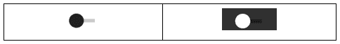

图 5.18 – 在浅色和深色主题中显示的滑动条小部件在最小值时的样子

## TextGrid

尽管前面提到的`Label`小部件提供了一些文本格式化功能，但有些应用程序需要按字符应用样式。对于代码编辑器中的语法高亮显示或显示在控制台输出上的错误行，有`TextGrid`小部件。

在`TextGrid`小部件内部，内容被分割成字符串表示中的每个字符，并且每个字符都应用了一个`TextGridStyle`。这种样式允许为每个字符或网格中的单元格指定前景和背景颜色。此外，网格的每一行都可以指定一个样式。这个样式将用于任何没有指定自己样式的单元格。如果一个单元格有字符和行样式可用，这两个样式将会合并，使得单元格上设置的前景色将采用行的背景色；除非字符样式指定了两者。

尽管允许设置特定颜色的样式存在，但还有许多语义样式定义允许代码注释意图而不是绝对颜色。最常用的样式之一是`TextGridStyleWhitespace`，它使用主题定义以柔和的颜色显示字符。使用内置样式，开发者可以将颜色定义委托给当前主题，为每个意图定义颜色。

`TextGrid`小部件还提供了技术文本显示的常用功能，包括`ShowLineNumbers`，它会在每一行的开头显示行号。`ShowWhitespace`也可以设置为 true，以在视觉上指示其他不可见的空白字符，如制表符、空格和换行符。以下代码示例说明了您可以在`TextGrid`中控制文本的一些方法：

```go
grid := widget.NewTextGridFromString(
    "TextGrid\n  Content  ")
grid.SetStyleRange(0, 4, 0, 7,
    &widget.CustomTextGridStyle{BGColor:
        &color.NRGBA{R: 64, G: 64, B: 192, A: 128}})
grid.Rows[1].Style = &widget.CustomTextGridStyle{BGColor:
        &color.NRGBA{R: 64, G: 192, B: 64, A: 128}}
grid.ShowLineNumbers = true
grid.ShowWhitespace = true
```

下面的图像显示了前面代码的结果。在这里，我们可以看到背景样式已经应用于*Grid*中使用的 4 个字母的所有单元格，并且第二行（索引 1）应用了行样式。它们还启用了行号和空白选项：

![图 5.19 – 使用 TextGrid 在浅色和深色主题下展示的样式化内容

![img/Figure_5.19_B16820.jpg]

图 5.19 – 使用 TextGrid 在浅色和深色主题下展示的样式化内容

可以使用 `SetStyle` 方法为单元格分配样式。然而，当需要将样式应用于许多符文时，开发者可以使用更高效的 `SetStyleRange` 工具方法。`SetRowStyle` 方法可以帮助设置行样式，如前图所示。

## 工具栏

如果应用程序中有许多经常访问的功能，`Toolbar` 小部件可以是一种高效展示这些选项的方法。工具栏的主要元素是 `ToolbarAction` 项目，它们是简单的图标，当点击时，会执行传递给 `NewToolbarAction` 的函数参数。要分组操作元素，可以使用 `ToolbarSeparator`，它在其左右两侧创建一个视觉分隔符。此外，可以使用 `ToolbarSpacer` 类型在操作之间创建一个间隙。这将扩展，导致其后的元素右对齐。使用一个空格将显示其左侧的项和其右侧的项。使用两个空格意味着空格之间的元素将在工具栏中居中。

要构建包含四个操作元素和一个分隔符的工具栏，我们可以使用以下代码：

```go
widget.NewToolbar(
     widget.NewToolbarAction(theme.MailComposeIcon(),
         func() {}),
     widget.NewToolbarSeparator(),
     widget.NewToolbarSpacer(),
     widget.NewToolbarAction(theme.ContentCutIcon(),
         func() {}),
     widget.NewToolbarAction(theme.ContentCopyIcon(),
         func() {}),
     widget.NewToolbarAction(theme.ContentPasteIcon(),
         func() {}),
)
```

前面的代码片段会产生以下结果。以下图像展示了它在浅色和深色主题下的样子：

![图 5.20 – 在浅色和深色主题下具有一些可能图标的工具栏小部件

![img/Figure_5.20_B16820.jpg]

图 5.20 – 在浅色和深色主题下具有一些可能图标的工具栏小部件

我们迄今为止所探讨的小部件相当标准，可以通过简单的构造函数创建，或者通过直接初始化结构体。其中一些需要回调函数，该函数可以用来通知我们何时发生了动作。

在下一节中，我们将查看一些更复杂的小部件，这些小部件旨在管理数千个子小部件。为此，我们将学习它们如何使用更多的函数参数查询大型数据集并高效地显示数据子集。

# 使用集合小部件进行分组

在本节中，我们将查看旨在高效包含主要小部件的小部件。上一节中提到的某些小部件也执行此操作，例如 `Form` 和 `Toolbar`，但**集合小部件**可以支持数千个项目（尽管它们并不是一次性都可见）。这些小部件通常用于显示大量选项或导航复杂的数据集。

由于集合小部件只显示大量数据的要求，它们被设计成一次只显示可能小部件的一小部分。为此，并保持出色的性能，它们有一个缓存机制，这使得它们的 API 比我们之前看到的小部件要复杂一些。

回调函数

这些小部件中的每一个都依赖于多个回调函数。这些函数中的第一个将提供有关小部件将要显示的数据维度（有关数据的更完整讨论，请参阅*第六章*，*数据绑定和存储*)的信息。第二个负责创建稍后将要显示的视觉元素，而第三个将数据中的项加载到先前创建的元素中。

缓存

集合小部件的性能关键在于它们如何缓存其中的重复图形元素。在集合小部件构造函数中引用的模板对象将在用户滚动小部件时被重用，以保持性能并跟上用户操作。

`列表`小部件（以及其他集合小部件）维护一个最近使用的模板元素的内部缓存，这些元素将在下一行变为可见之前应用新数据。优化数据检索以使任何接近已可见项的项能够快速加载是应用程序开发者的工作。当我们探索可用的各种集合小部件时，我们将看到这些概念的应用。首先，我们将查看列表小部件。

## 列表

`列表`小部件用于显示具有相似外观的垂直项目列表。一旦创建小部件，就可以加载相关数据，因此如果数据加载缓慢或显示复杂，这可能很有帮助。小部件将只加载和显示可见的元素，从而快速显示大型数据集的元素。

### 回调

每个集合小部件都使用回调函数来理解数据、加载模板项并在数据加载时更新它。让我们更详细地看看这些：

+   理解数据 - `长度`回调：`列表`的第一个回调函数是`长度`回调，它返回数据中的项目数量。这告诉小部件它需要管理多少行。如果数据集中添加了更多项，此值可以更新，并且下次列表刷新时，它将相应地调整。

+   加载模板 – `CreateItem` 回调：第二个回调函数用于生成一个可重复使用的图形元素，用于加载数据。这被称为 `CanvasObject`，可以是任何类型的 `Widget`、`Container` 或来自 `canvas` 包的项。小部件将根据屏幕上可见的项数多次调用此函数。在这个阶段，它们应该只包含占位符值。例如，在下面的图像中，每一行包含一个图标和一个标签，因此返回的模板可能是一个具有水平框布局的容器，以及默认图标和标签中的占位符文本。尽管用户永远不会看到占位符值，但它们很重要，因为模板的大小配置了 `List` 组件。模板项的高度将用于每一行的高度，以便当它乘以前一个长度的结果时，回调将确定列表组件的整体滚动高度。此外，模板宽度将指定 `List` 组件的最小宽度。

+   用数据填充模板 – `UpdateItem` 回调：回调三是用于将数据应用于模板单元格。它接收两个参数：要使用的数据项的索引和之前配置的 `CanvasObject` 模板。此回调的目的是使用在指定索引处应使用的数据配置项。所使用的模板将与第二个参数的返回对象相同，以便可以适当地进行类型转换。

每个集合小部件都有之前描述的模式的变体，正如我们将在本章后面的 *表格* 和 *树* 部分中看到的那样。

### 选择

集合小部件的一个额外功能是它们允许选择一个元素（通过点击）。在列表界面中，所选元素通过前导边缘的标记表示，如前图所示。要通知何时选择了一个项，你可以在 `OnSelected` 字段上设置一个 `func(ListItemID)` 回调，这将通知你哪个数据集中的项被选中。创建列表的基本代码如下：

```go
widget.NewList(
    func() int { return 3 },
    func() fyne.CanvasObject {
        icon := widget.NewIcon(theme.FileIcon())
        label := widget.NewLabel("List item x")
        return container.NewHBox(icon, label)
    },
    func(index ListItemID, template fyne.CanvasObject) {
        cont := template.(*fyne.Container)
        label := cont.Objects[1].(*widget.Label)
        label.SetText(fmt.Sprintf("List item %v", index))
    })
```

代码示例将在第二次点击后生成以下输出：

![图 5.21 – 在浅色和深色主题中选中的列表集合小部件]

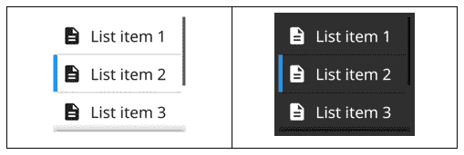

图 5.21 – 在浅色和深色主题中选中的列表集合小部件

## 表格

`Table` 小部件是 `List` 小部件的二维版本，旨在显示具有行和列维度的大型数据集。它使用与 `List` 和 `Tree` 小部件相同的缓存和回调系统。

### 回调

`Table` 小部件的回调与 `List` 的回调类似，但数据标识符传递一个行和列 `int` 来索引数据结构。这意味着 `Length` 回调现在返回 `(int, int)`。

在`Table`版本中设置新图形模板的回调（称为`CreateCell`）不接收任何参数，仅返回一个`fyne.CanvasObject`，该对象将被缓存以用于显示。此模板用于确定所有单元格的默认大小，因此请确保它有一个合理的最小尺寸。与`List`一样，您在此返回的元素将不会呈现给用户，但将用于测量和配置整体布局。

最后必需的回调是`UpdateCell`，用于将数据应用于模板元素。在`Table`小部件中，此函数传递一个数据标识符（`TableCellID`，其中包含一个`Row`和`Col`整型），它索引要应用的数据，以及`CanvasObject`模板。开发人员应在模板中填充由标识符指定的适当数据。与其他集合小部件一样，建议尽可能加载相关数据，以便当用户滚动或展开元素时，任何需要很长时间才能加载的数据都准备好显示。

### 选择

`Table`小部件支持选择单元格，如以下图像所示，在首部和边框处有标记。要通知何时选择了项目，可以在`OnSelected`字段上设置`func(TableCellID)`回调。这将通过传递标识行和列来通知您选择了数据集中的哪个项目。创建新表格的基本代码如下：

```go
widget.NewTable(
    func() (int, int) { return 3, 3 },
    func() fyne.CanvasObject {
        return widget.NewLabel("Cell 0, 0")
    },
    func(id TableCellID, template fyne.CanvasObject) {
        label := template.(*widget.Label)
        label.SetText(fmt.Sprintf("Cell %d, %d", id.Row+1,      	            id.Col+1))
    })
```

假设单元格 2, 1 被点击以获得选择，前面的代码将生成以下输出：

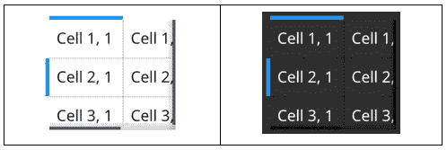

图 5.22 – 表格集合小部件在浅色和深色主题下的选择

## 树形结构

`Tree`小部件与`List`小部件非常相似，但增加了每个元素可以展开以显示其他项目的功能。这种展开用于显示层次结构，例如目录和文件、类别和项目，或者具有父子关系的其他数据。

### 回调

`Tree`小部件的回调与`List`和`Table`类似，但由于其更复杂的数据结构，简单的`Length`回调被`ChildUIDs`和`IsBranch`所取代。第一个回调将返回一个`TreeNodeID`值（可以使用常规字符串）的切片，这些值包含指定节点（作为唯一的`TreeNodeID`传入）下存在的每个项目的唯一标识符。第二个回调在传递唯一 ID 时对每个元素进行调用。如果它可以包含更多节点，则应返回`true`，否则返回`false`。

在 `Tree` 版本（称为 `CreateNode`）中设置新图形模板的回调函数接受一个布尔参数，表示这是一个分支（`true`，可以展开）还是叶子（`false`，这是树的末尾）。如果你想在树中的分支和叶子元素中使用不同的样式，这很有用。与 `List` 一样，你在这里返回的元素将不会展示给用户，而是用于测量和配置整体布局。

最后必需的回调是 `UpdateNode`。这个回调用于将数据应用到模板元素上。在 `Tree` 小部件中，这个函数传递唯一的 `TreeNodeID` 标识符、表示这是分支还是叶子模板的 `bool` 以及 `CanvasObject` 模板。开发者应使用标识符指定的适当数据填充此模板。与其他收集小部件一样，建议尽可能加载相关数据，以便当用户滚动或展开元素时，加载缓慢的数据可以准备好显示。

此外，关于管理内容所需的回调，`Tree` 小部件允许开发者设置 `OnBranchOpened` 和 `OnBranchClosed` 回调，以便他们可以跟踪树的状态变化。这两个函数都是 `func(TreeNodeID)` 类型，其中参数是数据项的唯一标识符。

### 选择

`Tree` 小部件也支持选中的节点。这通过前导边缘的标记表示，如下所示。要通知何时选中了某个项目，你可以在 `OnSelected` 字段上设置 `func(TreeNodeID)` 回调。这将通知你哪个数据集的项目被选中，同时传递唯一标识符。显示树所需的基本代码如下。第一个回调返回每个级别的子节点的唯一 ID：

```go
     func(uid TreeNodeID) []string { 
         switch uid {
         case "":
             return []string{"cars", "trains"}
         case "cars":
             return []string{"ford", "tesla"}
         case "trains":
             return []string{"rocket", "tgv"}
         }
     return ""
     },
     func(uid TreeNodeID) bool {
         return uid == "" || uid == "cars" || uid == "trains"
     },
     func(_ bool) fyne.CanvasObject {
         return widget.NewLabel("Template")
     },
     func(uid TreeNodeID, _ bool, template fyne.CanvasObject) {
         label := template.(*widget.Label)
         label.SetText(strings.Title(uid))
     })
```

上述代码将在应用中显示一个树形结构。一旦第二个元素被展开，这个树形结构将如下所示：

![图 5.23 – 展开分支的树形小部件，显示在浅色和深色主题中

![img/Figure_5.23_B16820.jpg]

图 5.23 – 展开分支的树形小部件，显示在浅色和深色主题中

本节中展示的三个收集小部件为展示大量或复杂数据提供了有用的功能。API 比标准小部件稍微复杂一些，但这允许向用户展示大量数据集；例如，通过滚动数据库中的数千条记录或显示大型文件树的部分。

我们可以使用一系列容器小部件来构建更复杂的用户界面设计并导航应用程序。我们将在下一节中了解这些内容。

# 使用容器小部件添加结构

在*第三章*，“窗口、画布和绘图”中，我们学习了如何使用 `Container` 在画布内组合多个对象。使用我们在*第四章*“布局和文件处理”中探索的布局，可以自动根据某些规则排列每个 `CanvasObject`。然而，有时应用程序可能希望项目根据用户交互出现和消失，或者具有超出其大小和位置之外的可视属性。容器小部件可以提供这些更丰富的行为。这些结构小部件可以在 `container` 包中找到，包括滚动、分组以及隐藏和显示内容的变体。让我们按字母顺序探索每个选项（选项）。

## AppTabs

`AppTabs` 容器用于控制应用程序的大面积区域，其中内容应根据当前活动进行切换。例如，这可以用于将许多图形元素放入一个小应用程序用户界面中，当一次只有子部分有用时。

标签容器中的每个标签可以包含文本和/或图标（无论使用哪种组合，所有项目都应保持一致）。每个标签都有一个相关的 `CanvasObject`（通常是一个容器），当标签被选中时将显示。这些是通过传递给 `NewAppTabs` 构造函数的 `TabItem` 对象创建的。要创建带有图标和标签的两个标签，您将使用以下代码：

```go
container.NewAppTabs(
     container.NewTabItemWithIcon("Tab1", theme.HomeIcon(),      	         tab1Screen),
     container.NewTabItemWithIcon("Tab2", theme.MailSendIcon(),  	         tab2Screen))
```

上述代码将渲染为以下容器之一：

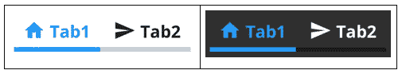

图 5.24 – 在 AppTabs 小部件中使用亮色和暗色主题的带有文本和图标的两个标签页

前面的图片显示了标签页的默认方向。然而，标签容器可以在四个边缘中的任何一个显示标签。`SetTabLocation()` 函数接受 `TabLocation` 类型中的一个；即，`TabLocationTop`、`TabLocationBottom`、`TabLocationLeading`（通常是左侧）或 `TabLocationTrailing`（在内容之后 – 通常在右侧）。下面的图片显示了标签的位置如何改变图标布局：

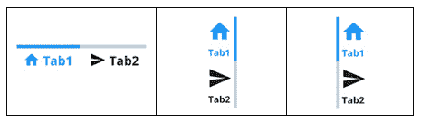

图 5.25 – 底部的标签容器，具有左侧和右侧位置

当在移动设备上运行应用程序时，在纵向模式下，预期标签位于顶部或底部。因此，位置将相应地适应 – 前导设置将在顶部显示标签，而跟随设置将标签设置在底部。如果设备旋转，则标签将移动到左侧或右侧边缘 – 为内容留出更多空间。在横向模式下，任何请求顶部位置的标签将显示在前导（左侧）边缘；底部设置将移动到跟随（右侧）边缘。

## 滚动

大多数需要滚动内容的部件都包含此功能。然而，如果您想为内容添加滚动功能，可以使用 `Scroll` 容器。通过将其他元素包裹在滚动容器中，您可以在水平和垂直维度上添加滚动条。在水平和垂直维度上滚动的构造函数是 `container.NewScroll()`。如果您只想水平滚动，也可以调用 `NewHScroll()`，或者如果您只想垂直滚动（例如列表），则可以调用 `NewVScroll()`。以下图像显示了简单标签内容的完整滚动：

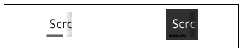

](img/Figure_5.26_B16820.jpg)

图 5.26 – 在浅色和深色主题下显示滚动条和阴影的滚动容器

如您所见，滚动容器的最小尺寸变得非常小 – 只有 32x32。如果您使用水平滚动条，则其最小高度将适合内容，而如果您使用垂直滚动条（如列表），则宽度将适应以适合内容。

## 分割

`Split` 容器为我们提供了一种整洁的方式来分隔应用程序的两个部分，当用户能够改变每个部分可用的空间量时。这可以是水平分割或垂直分割。水平分割容器显示两个元素并排，它们之间有一个分割栏。垂直分割将元素堆叠在一起，中间有一个分割栏：

```go
right := container.NewVSplit(
    widget.NewLabel("Top"), widget.NewLabel("Bottom"))
container.NewHSplit(widget.NewLabel("Line1/nLine2"), right)
```

在以下图像中，您可以看到左侧（前导）侧有 `Line1\nLine2` 的水平分割容器，右侧（跟随）侧有一个包含 `Top` 和 `Bottom` 的垂直分割：

注意

在水平模式下，前导位置（第一个参数）通常是左侧，而在垂直模式下，它将在顶部。

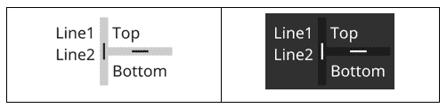

](img/Figure_5.27_B16820.jpg)

图 5.27 – 使用浅色和深色主题的水平模式和垂直模式下的 Split 小部件

分割容器允许拖动条来改变分配给分割每侧的大小。容器的最小大小将是两个内容（加上分割）的总和，除非它位于具有更多空间的父容器中，否则条将不可拖动。当有更多空间可用时，拖动条将改变额外空间分配的位置。

开发者还可以通过`Offset`字段直接手动指定比例。`0.0`的值表示分割应尽可能靠左（或向上），而`1.0`的值表示应完全靠右（或底部对齐）。如果想要保存用户的偏好设置，可以在应用程序运行时查询此值。

除了将标准小部件组合在一起以形成清晰和逻辑的用户界面外，有时显示临时信息或请求用户输入也是有用的。对于开发人员或设计师不希望在主界面中包含这些情况，我们可以使用一组标准弹出对话框。我们将在下一节中探讨这一点。

# 使用常用对话框

在用户使用应用程序的过程中，你经常会需要中断流程来展示信息、请求用户确认，或者选择文件或其他输入元素。为此目的，工具包通常提供对话框窗口，Fyne 也是如此。与打开新窗口不同，对话框将出现在当前窗口的现有内容之上（这在所有平台上都工作得很好，因为并非所有平台都能很好地管理多个窗口应用程序）。

每个对话框都有自己的构造函数（`dialog.NewXxx()`形式），用于创建稍后通过`Show()`显示的对话框。它们还提供了一个辅助函数来创建并显示它（`dialog.ShowXxx()`形式）。所有这些函数的最后一个参数是它们应该显示的窗口。所有对话框也支持在对话框关闭时设置回调。这可以通过`SetOnClosed()`方法进行配置。

在本节中，我们在学习如何为应用程序构建自定义对话框之前，查看了一下可用的不同对话框辅助工具（按字母顺序排列）。尽管这些工具将加载当前应用程序主题，但我们只为每个示例展示了一张图片。

## ColorPicker

Fyne 为应用程序提供了一种标准对话框，用于选择颜色。此功能将展示一组标准颜色、最近选择的颜色列表，以及一个高级区域，可以通过值滑块选择特定颜色，编辑**红**、**绿**和**蓝**（**RGB**）或**色调**、**饱和度**和**亮度**（**HSL**）的通道值，或者直接输入 RGB 十六进制颜色表示法。

可以通过调用`dialog.NewColorPicker()`然后使用`Show()`或简单地调用`dialog.ShowColorPicker()`来创建颜色选择器。构造函数的参数是要在顶部显示的标题和消息，一个用于颜色选择的回调函数，以及要显示其中的父窗口：

```go
dialog.ShowColorPicker("Pick a Color", "",
    func(value color.Color) {
       fmt.Println("Chose:", value)
    },
    win)
```

上述代码将加载选择器，如下所示：

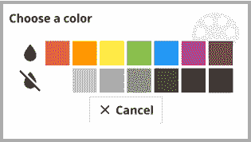

图 5.28 – 简单颜色选择器对话框

上一张图片显示了默认的简单颜色选择器。如果您希望开发者有更多的控制权，则可以提供高级功能。

## 确认

确认对话框允许您要求用户确认一个操作。除了提供此确认的标题和内容外，开发者还可以传递一个回调函数，当用户做出决定时将被调用，参数为 false 表示否定回答，为 true 表示确认。像所有对话框一样，最后一个参数是父窗口：

```go
dialog.ShowConfirm("Please Confirm", "Are you sure..?",
     func(value bool) {
         fmt.Println("Chose:", value)
     }, win)
```

如果当前加载了浅色主题，确认对话框将如下所示：

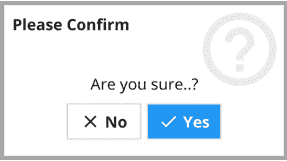

图 5.29 – 使用浅色主题的确认对话框

重要的是要记住，显示对话框并不会停止加载它的代码。用户的决定将通过回调来传达；其余的代码将继续不间断地执行。

## 文件选择

正如我们在*第四章*，“布局和文件处理”中看到的，`dialog`包可以帮助进行文件选择——选择要打开的文件或保存内容的位置。打开`fyne.URIReadCloser`或`fyne.URIWriteCloser`类型时可能会出现错误，因为这些操作可能因多种原因而失败：

```go
dialog.ShowFileOpen(func(read fyne.URIReadCloser, err error) {
     fmt.Println("User chose:", read.URI().String(), err) 
}, win) {
```

打开文件对话框如下所示：

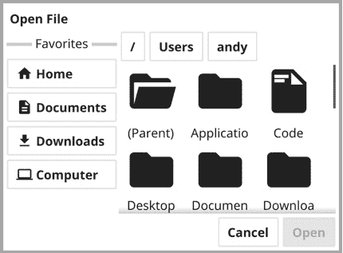

图 5.30 – 使用文件对话框选择要打开或保存的文件

文件对话框默认显示用户的主目录。这可以通过调用`SetLocation`方法来更改。由于这是一个跨平台 API，起始位置是一个`URI`而不是字符串路径。这也意味着文件对话框可以用来显示远程文件系统和其他文件数据源的内容。

以类似的方式，应用程序可以使用`dialog.ShowFileSave`方法询问写入文件的位置。也可以使用`dialog.ShowFolderOpen`来提示文件夹选择而不是文件。

## 表单

`Form` 对话框通过请求输入值来扩展确认的简单前提，除了确认结果外。`Form` 对话框可以包含各种小部件，就像在 *介绍基本小部件* 部分中的 `Form` 小部件一样。构造函数与确认对话框类似，但它接受一个额外的 `*widget.FormItem` 值切片来指定内容：

```go
dialog.ShowForm( "Form Input", "Enter", "Cancel",
     []*widget.FormItem{
         widget.NewFormItem("Enter a string...", widget.          	             NewEntry())},
     func(bool) {}, win)
```

结果将是一个包含 `widget.Entry` 字段的对话框，如下面的图像所示：

![Figure 5.31 – 使用 Entry 对话框请求用户输入值

![img/Figure_5.31_B16820.jpg]

图 5.31 – 使用 Entry 对话框请求用户输入值

## 信息

在命令行应用程序中，信息通常会写入标准输出或标准错误（通常用于错误消息）。然而，图形应用程序通常不会从命令行运行，因此用户应该看到的消息需要以不同的方式呈现。对话框包可以帮助完成这项任务。

信息对话框可以用于在信息的重要性足够高，以至于用户应该被打断查看时呈现标准消息。调用 `dialog.ShowInformation` 函数来呈现此对话框，并接受标题和消息参数。如果要呈现的信息是错误，则可以使用 `dialog.ShowError` 辅助函数，因为它接受错误类型，并将信息提取出来以显示：

```go
dialog.ShowInformation("Some Information",
    "This is a thing to know", win)
err := errors.New("a dummy error message")
dialog.ShowError(err, win)
```

信息对话框将呈现如下：

![Figure 5.32 – 浅色主题下的信息对话框

![img/Figure_5.32_B16820.jpg]

图 5.32 – 浅色主题下的信息对话框

在这些之后，我们将转向自定义对话框。

# 自定义对话框

尽管前面的对话框应该涵盖了您可能希望使用弹出对话框中断用户流程的大部分原因，但您的应用程序可能还有其他要求。为了支持这一点，您可以将任何内容插入到自定义对话框中，以确保整体布局一致。

要构建一个自定义对话框，必须将一个新的参数及其内容传递给构造函数。任何 Fyne 小部件或 `CanvasObject` 都可以用于自定义对话框，这包括容器以提供更复杂的内容。为了说明这一点，我们将使用 `TextGrid` 组件：

```go
content := widget.NewTextGrid()
content.SetText("Custom content")
content.SetStyleRange(0, 7, 0, 14,
    widget.TextGridStyleWhitespace)
dialog.ShowCustom("Custom Dialog", "Cancel", content, win)
```

上述代码将生成一个自定义对话框，如下所示：

![Figure 5.33 – 显示自定义内容（一个 TextGrid）

![img/Figure_5.33_B16820.jpg]

图 5.33 – 显示自定义内容（一个 TextGrid）

还有一个 `ShowCustomConfirm()` 版本，它提供了一个 `func(bool)` 回调，以通知开发者哪个按钮被点击。

通过探索各种小部件和对话框，我们已经看到了标准主题的外观，以及提供了浅色和深色版本。接下来，我们将探讨主题由什么组成以及如何管理和自定义它们。

# 理解主题

Fyne 工具包中的主题实现了 Material Design 的色彩方案、图标和大小/填充值。主题 API 的设计旨在确保应用程序感觉一致，并提供良好的用户体验，同时允许开发者传达身份和定制。所有 Fyne 应用程序都可以使用内置主题以浅色或深色模式显示。我们将在下一节中详细探讨这些内容。

## 内置主题

由于越来越多的操作系统支持浅色与深色桌面配色，Fyne 主题规范支持浅色和深色变体。默认情况下，每个应用程序都会附带一个内置主题，提供浅色和深色变体。这个主题在本书前面的 *介绍基本小部件* 部分中已经广泛介绍，但要了解这一切是如何结合在一起的，请查看以下 Fyne 演示应用程序的截图，该应用程序展示了小部件：

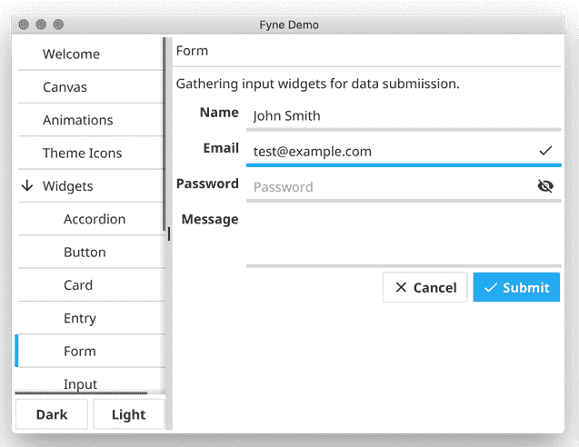

Figure 5.34 – 默认主题下的小部件集合 – 浅色变体

上一张截图显示了浅色主题下的控件演示。下一张截图显示了相同的控件，但使用了内置的深色主题：

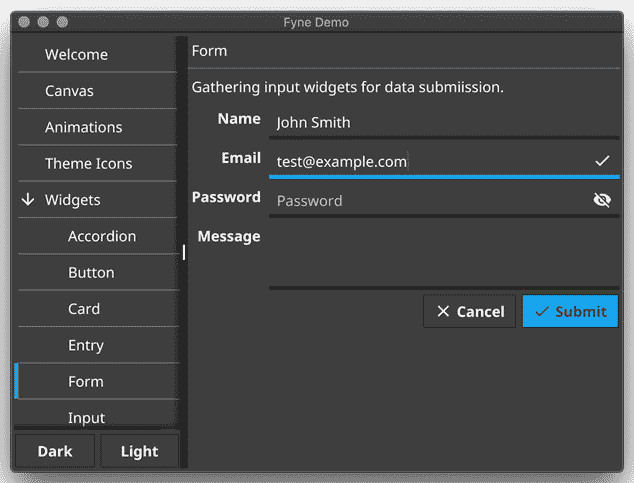

Figure 5.35 – 使用深色主题的各种小部件

如您所见，正在使用的主要颜色（主色 – 在这种情况下为蓝色）已被选择，因为它与浅色和深色主题的背景颜色对比鲜明。当使用此模型时，主题可以更改主色，同时继续支持浅色和深色用户偏好。

在大多数操作系统上，Fyne 会自动选择与当前用户偏好最匹配的主题变体。用户可以选择特定的版本，我们将在下一节中看到。

## 用户设置

如我们之前提到的，基于 Fyne 的应用程序通常会检测用户对浅色或深色主题的偏好，并相应地加载。可以通过使用 Fyne 设置应用程序或使用环境变量来设置加载哪个主题的偏好。

**fyne_settings** 应用程序，它可以配置所有基于 Fyne 的应用程序，可以运行来管理用户的设置。这包括他们的主题变体（浅色或深色），以及他们将使用的基色。使用此界面所做的任何更改都将保存以供将来使用，并将立即应用于所有打开的应用程序。您还可以从 **fyne_demo** 中的 **设置** 菜单找到 **设置** 面板：

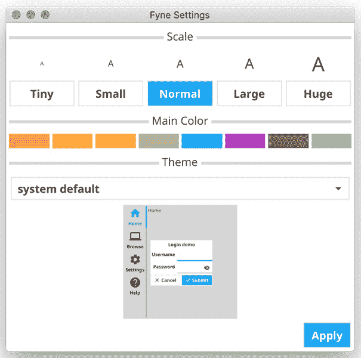

Figure 5.36 – fyne_settings 应用程序

如果您希望临时应用一个主题，或者希望一个应用程序使用不同的主题，使用环境变量可能会有所帮助。可以将 `FYNE_THEME` 环境变量设置为 *light* 或 *dark* 以指定应使用哪个变体。您可以使用类似的方式，通过使用 `FYNE_SCALE` 环境变量来覆盖默认的界面缩放。在这里，`1.0` 是标准值；较小的数字加载较小的内容，而较大的数字加载较大的内容。

## 包含的图标

如本章前面的一些小部件所示（例如，`Button` 和 `AppTabs`），主题包包括来自材料设计集合的许多图标（完整官方集合可在 [`material.io/resources/icons/`](https://material.io/resources/icons/) 找到）。

由于基于 Fyne 的应用程序的所有元素都设计为适应不同类型的显示和用户偏好，因此图像应该是基于矢量的而不是位图的。这意味着在非常小或非常大的尺寸显示时，将计算显示的确切像素以实现最佳显示，而不是从原始图像中乘以（或减少）像素数量。

幸运的是，材料设计图像以矢量格式提供，内置图标都是 **可缩放矢量图形**（**SVG**）格式。这也意味着图标可以轻松适应各种颜色，因为应用程序运行时，从而确保它们可以适应主颜色和当前主题：

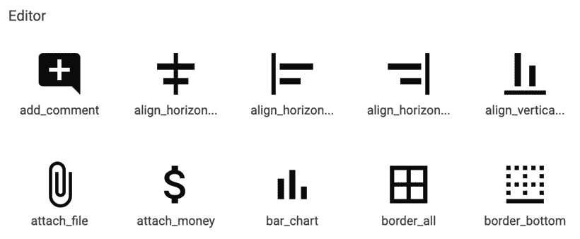


图 5.37 – 材料设计图标的选择

由于图标集是免费提供的并且非常受欢迎，因此很容易下载额外的图标并将它们添加到您的应用程序中，知道它们将与工具包的整体美学相匹配。

## 应用程序覆盖

希望偏离默认（或用户选择）主题的应用程序开发人员也在 Fyne 主题 API 中得到了照顾。在为您的应用程序指定主题之前请谨慎行事——这可能会让您的应用程序用户感到惊讶。要使用内置主题之一，但覆盖用户或系统设置有关是否使用浅色或深色变体的设置，您可以在当前的 `App` 实例上调用 `SetTheme()`，如下所示：

```go
fyne.CurrentApp().Settings().SetTheme(theme.DarkTheme())
```

或者，要强制应用程序使用内置的浅色主题，请使用以下代码：

```go
fyne.CurrentApp().Settings().SetTheme(theme.LightTheme())
```

此 API 更常用于设置自定义应用程序主题。创建自定义主题的详细信息将在 *第七章*，*构建自定义小部件和主题* 中介绍。一旦创建了主题，就可以使用 `SetTheme()` 函数加载它，并将其应用于当前应用程序。以下截图显示了一个偏离标准样式的自定义主题：

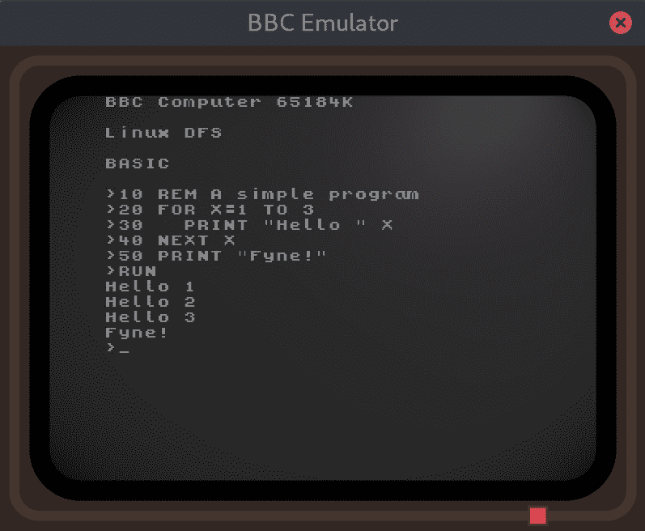


图 5.38 – 基于 Fyne 的 BBC Micro 模拟器 GUI

现在我们已经探讨了 Fyne 工具包的主要小部件和主题功能的细节，让我们构建一个简单的应用程序，将其中许多元素组合在一起。

# 实现任务列表应用程序

为了探索上一节中列出的某些小部件以及它们如何组合成一个简单的应用程序，我们将构建一个小型任务列表。此应用程序将根据完成或不完整状态显示任务列表，并允许用户编辑每个项目的详细信息。

## 设计 GUI

首先，我们将拼凑一个任务应用程序的基本用户界面。它将在应用程序的左侧包含任务列表，并在右侧包含编辑任务的组件集合。在此之上，我们将添加一个用于其他操作的工具栏。让我们开始吧：

1.  任务列表将是一个`List`小部件，当用户选择一个项目时，它会通知用户。`List`小部件将包含用于此模拟的静态内容。在这里，我们将告诉列表存在一定数量的项目（例如，`5`），以便它创建正确数量的项目来显示。每次列表调用`CreateItem`回调时，我们都会创建一个新的复选框项目。目前，我们将第三个（`UpdateItem`）方法留空，以便它只显示模板值。此代码将在简单的`makeUI`方法中创建，如下所示：

    ```go
    func makeUI() fyne.CanvasObject {
        todos := widget.NewList(func() int {
                return 5
            },
            func() fyne.CanvasObject {
                return widget.NewCheck("TODO Item x",          	                func(bool) {})
            },
            func(int, fyne.CanvasObject) {})
        ...
    }
    ```

1.  接下来，我们将创建允许我们编辑任务项的小部件。让我们创建一个`Form`小部件，它将包含我们需要的项目并提供标签。我们将使用`widget.NewFormItem`为每个项目创建一个新的行，传递`string`标签和小部件的内容作为参数。这些都是标准小部件，但我们传递的回调目前都是空的。我们将在稍后返回这些小部件以完成它们的功能。以下代码位于我们在上一部分开始的`makeUI`函数内部：

    ```go
        details := widget.NewForm(
            widget.NewFormItem("Title", widget.NewEntry()),
            widget.NewFormItem("Description",
                widget.NewMultiLineEntry()),
            widget.NewFormItem("Category",
                widget.NewSelect([]string{"Home"},
                    func(string) {})),
            widget.NewFormItem("Priority", 
                widget.NewRadioGroup([]string{"Low", "Mid",    	                "High"}, 
                    func(string){})),
            widget.NewFormItem("Due", widget.NewEntry()),
            widget.NewFormItem("Completion",
                widget.NewSlider(0, 100)),
        )
    ```

1.  我们将添加到界面中的最后一个组件是一个工具栏，它将提供访问添加任务功能的权限。为此，我们将使用`ToolbarAction`项目创建一个`widget.Toolbar`：

    ```go
        toolbar := widget.NewToolbar(
            widget.NewToolbarAction(theme.ContentAddIcon(),
                func() {}),
        )
    ```

1.  为了将这些界面元素组合在一起，我们将使用`Border`布局创建一个新的容器。工具栏将被设置为顶部项目，任务项将位于容器的左侧。我们的表单将通过传递一个未指定为位于边框上的组件来填充剩余空间。此容器将从`makeUI`函数返回，以便它可以用于显示我们的应用程序窗口：

    ```go
    return container.NewBorder(
        toolbar, nil, todos, nil, details)
    ```

1.  要运行我们的应用程序，我们只需添加常规的启动代码，该代码创建一个窗口并设置我们的内容。我们不需要指定此窗口的大小，因为内容将自然地压缩到合理的最小尺寸：

    ```go
    func main() {
        a := app.New()
        w := a.NewWindow("TODO List")
        w.SetContent(makeUI())
        w.ShowAndRun()
    }
    ```

1.  运行我们迄今为止创建的所有代码将给我们一个很好的印象，了解应用程序的外观：

    ```go
    Chapter05$ go run .
    ```

当使用 Fyne 浅色主题（通过用户偏好选项或设置`FYNE_THEME="light"`）时，应用程序应该如下所示：

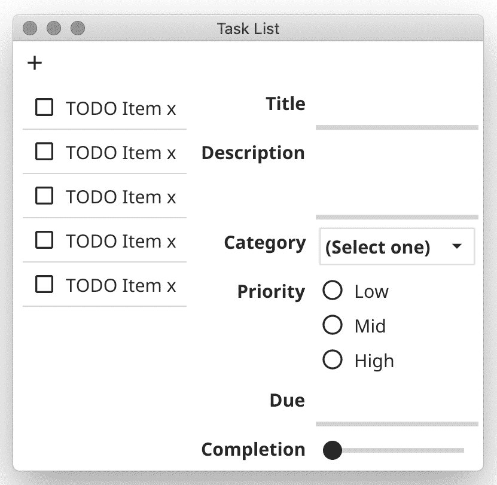


Figure 5.39 – Our task list GUI skeleton

在我们可以完成这个应用程序的功能之前，我们需要定义一个数据结构，它将保存我们正在编辑的任务信息。

## 定义数据

为了使我们的应用程序正常工作，我们需要创建一个数据结构来管理我们正在编辑的信息。让我们开始吧：

1.  首先，我们必须定义一个`task`数据结构 – 这只是简单地列出与我们在上一节中设计匹配的各种字段。不同的字段将存储在不同的类型中 – 例如，`Entry`小部件映射到`string`，我们的复选框映射到`bool`。我们将添加以下代码到一个名为`data.go`的新文件中：

    ```go
    type task struct {
        title, description string
        done               bool
        category           string
        priority           int
        due                *time.Time
        completion         float64
    }
    ```

    如你所见，我们为我们的完成`Slider`的值使用了`float64`，并且我们将把日期输入转换为`time.Time`格式。

1.  由于我们将存储许多任务，我们可以简单地创建一个任务指针的切片，但通过定义一个新的类型，我们可以将某些函数与有用的其他函数关联起来。该类型只是包装了`[]*task`切片，它将存储数据：

    ```go
    type taskList struct {
        tasks []*task
    }
    ```

1.  由于我们将根据`done`状态显示任务列表，我们应该添加两个辅助方法，根据该字段的值返回这些子列表：

    ```go
    func (l *taskList) remaining() []*task {
        var items []*task
        for _, task := range l.tasks {
            if !task.done {
                items = append(items, task)
            }
        }
        return items
    }
    func (l *taskList) done() []*task {
        var items []*task
        for _, task := range l.tasks {
            if task.done {
                items = append(items, task)
            }
        }
        return items
    }
    ```

1.  我们还将定义一些常量，有助于管理我们数据中的不同优先级。参考以下代码片段：

    ```go
    const (
        lowPriority  = 0
        midPriority  = 1
        highPriority = 2
    ) 
    ```

1.  在编写数据处理代码时，编写测试也很重要。如果你在连接到用户界面之前添加这些测试，那么错误可以更快地暴露出来。这意味着当我们添加图形测试时，发现的问题应该与我们的用户界面代码中的错误有关。创建一个名为`data_test.go`的新文件，并添加以下测试：

    ```go
    func TestTaskList_Remaining(t *testing.T) {
        item := &task{title: "Remain"}
        list := &taskList{tasks: []*task{item}}
        remain := list.remaining()
        assert.Equal(t, 1, len(remain))
        done := list.done()
        assert.Equal(t, 0, len(done))
    }
    func TestTaskList_Done(t *testing.T) {
        item := &task{title: "Done", done: true}
        list := &taskList{tasks: []*task{item}}
        remain := list.remaining()
        assert.Equal(t, 0, len(remain))
        done := list.done()
        assert.Equal(t, 1, len(done))
    }
    ```

    可以向这个项目添加更多测试 – 你可以在本书的代码仓库中找到它们，位于`Chapter05`文件夹内，网址为[`github.com/PacktPublishing/Building-Cross-Platform-GUI-Applications-with-Fyne/tree/master/Chapter05`](https://github.com/PacktPublishing/Building-Cross-Platform-GUI-Applications-with-Fyne/tree/master/Chapter05)。

1.  在本章中，我们没有探讨数据存储，所以我们只需将任务列表保存在内存中。你将在*第六章*中了解更多关于数据和偏好存储的信息，*数据绑定和存储*。由于我们的数据将在每次应用程序运行时重置，我们应该创建另一个函数，用一些将在应用程序启动时加载的内容填充数据结构，如下所示：

    ```go
    func dummyData() *taskList {
         return &taskList{
             tasks: []*task{
                 {title: "Nearly done",
                     description: `You can tick my checkbox
    and I will be marked as
    done and disappear`},
                 {title: "Functions",
                     description: `Tap the plus icon above to
    add a new task, or tap the minus
    icon to remove this one`},
             }}
    }
    ```

现在我们已经定义了数据结构和基本函数，我们可以将其连接到用户界面并完成功能。

## 选择任务

更新小部件内容的最简单方法是保留对已构造实例的引用。我们将为多个元素执行此操作，因此我们应该创建一个新的类型来处理用户界面的各种元素。创建这个结构体意味着我们可以避免大量的全局变量，这应该有助于保持代码整洁。让我们开始吧：

1.  创建一个新的结构体，并将其命名为 `taskApp`，如下所示：

    ```go
    type taskApp struct {
        data    *taskList
        visible []*task
        tasks *widget.List
        // more will be added here
    }
    ```

    该类型包括对 `*taskList` 数据结构的引用，它将保存我们的数据，并定义了一个 `*task` 类型的切片，表示当前可见的任务（调用 `taskList.remaining()` 或 `taskList.done()` 的结果）。

1.  现在，我们可以将我们的 `makeUI` 函数作为 `taskApp` 类型的成员方法，使其签名变为 `func (a *taskApp) makeUI() fyne.CanvasObject`。这样做使我们能够通过 `a.data` 访问我们之前定义的数据结构。然而，我们将使用存储在 `visible` 中的任务列表来填充我们的列表，因为它可能包含已完成或未完成的项，具体取决于其当前状态。

1.  设置列表小部件的代码现在可以使用以下代码进行更新。我们将将其引用存储在 `a.tasks` 中，而不是原始的 `todos` 变量（这样我们就可以稍后引用它）；别忘了将 `makeUI` 返回的 `todos` 引用也改为使用 `a.tasks`。我们的 `Length` 回调函数的结果只是简单地返回 `a.visible` 切片中的项目数量。尽管 `CreateItem` 回调（中间参数）不需要更改，但我们确实提供了一个最终回调的实现；即 `UpdateItem`。这个新函数从指定的索引（`i`）获取任务，并使用 `task.title` 来设置 `Check` 小部件的文本：

    ```go
        a.tasks = widget.NewList(func() int {
            return len(a.visible)
        },
        func() fyne.CanvasObject {
            return widget.NewCheck("TODO item x", func(bool) {})
        },
        func(i int, c fyne.CanvasObject) {
            check := c.(*widget.Check)
            check.Text = a.visible[i].title
            check.Refresh()
        })
    ```

1.  要看到这些更改的实际效果，我们需要设置数据源。为此，我们必须在调用 `SetContent` 之前添加一行来创建我们的虚拟数据并构建新的 `taskApp` 结构体，如下所示：

    ```go
        data := dummyData()
        tasks:= taskApp{data: data, visible: data.             	        remaining()}
        w.SetContent(tasks.makeUI())
    ```

执行这些代码更改将更新应用程序，使其反映主列表中的任务标题，如下面的屏幕截图所示：

![Figure 5.40 – Showing real task titles

![img/Figure_5.40_B16820.jpg]

图 5.40 – 显示真实任务标题

接下来，我们需要填写窗口右侧的详细信息。

## 填写详细信息

要填充应用程序的数据区域，我们需要跟踪当前任务及其应填充的小部件。让我们开始：

1.  要做到这一点，我们需要在 `taskApp` 结构体中添加一个 `current` 字段。之后，我们需要保存对每个我们为初始布局测试添加的输入元素的引用，这将需要在 `taskApp` 中添加更多字段：

    ```go
    type taskApp struct {
        data    *taskList
        visible []*task
        current *task
        tasks                   *widget.List
        title, description, due *widget.Entry
        category                *widget.Select
        priority                *widget.Radio
        completion              *widget.Slider
    }
    ```

1.  在这些准备工作就绪后，我们可以在 `makeUI` 中的 `details` 设置中完成替换，使其看起来如下所示：

    ```go
        a.title = widget.NewEntry()
        a.description = widget.NewMultiLineEntry()
        a.category = widget.NewSelect([]string{"Home"},
            func(string) {})
        a.priority = widget.NewRadio(
            []string{"Low", "Mid", "High"}, func(string) {})
        a.due = widget.NewEntry()
        a.completion = widget.NewSlider(0, 100)
        details := widget.NewForm(
            widget.NewFormItem("Title", a.title),
            widget.NewFormItem("Description", a.description),
            widget.NewFormItem("Category", a.category),
            widget.NewFormItem("Priority", a.priority),
            widget.NewFormItem("Due", a.due),
            widget.NewFormItem("Completion", a.completion),
        )
    ```

1.  一旦完成设置代码，我们可以添加一个名为 `setTask` 的新函数。这将用于更新当前任务并刷新我们在前面的代码块中创建的详细元素：

    ```go
    func (a *taskApp) setTask(t *task) {
        a.current = t
        a.title.SetText(t.title)
        a.description.SetText(t.description)
        a.category.SetSelected(t.category)
        if t.priority == midPriority {
            a.priority.SetSelected("Mid")
        } else if t.priority == highPriority {
            a.priority.SetSelected("High")
        } else {
            a.priority.SetSelected("Low")
        }
        a.due.SetText(formatDate(t.due))
        a.completion.Value = t.completion
        a.completion.Refresh()
    }
    ```

1.  为了支持这段代码，我们还将定义 `formatDate` 函数，它将我们的日期转换为字符串值。如果可选的 `date` 是 `nil`，则返回空字符串，否则使用 `dateFormat` 常量进行格式化：

    ```go
    const dateFormat = "02 Jan 06 15:04"
    func formatDate(date *time.Time) string {
        if date == nil {
            return ""
        }
        return date.Format(dateFormat)
    }
    ```

1.  在这段代码到位后，我们可以设置要在显示上呈现的第一个任务。当然，在假设可以显示一个项目之前，我们应该检查是否有任何任务。以下代码在 `main` 函数中更新：

    ```go
        w.SetContent(ui.makeUI())
        if len(data.remaining()) > 0 {
            ui.setTask(data.remaining()[0])
        }
    ```

1.  为了在用户浏览时更新我们的用户界面，我们需要添加的最后一段代码是 `List.OnSelected`。这将允许我们在列表被点击时更新显示的详细信息。一旦创建了我们的 `List`，它被设置为从 `a.tasks` 加载，只需简单地添加以下行：

    ```go
        a.tasks.OnSelected = func(id int) {
            a.setTask(a.visible[id])
        }
    ```

在所有代码到位后，我们就有一个完整的应用程序，如下面的截图所示：

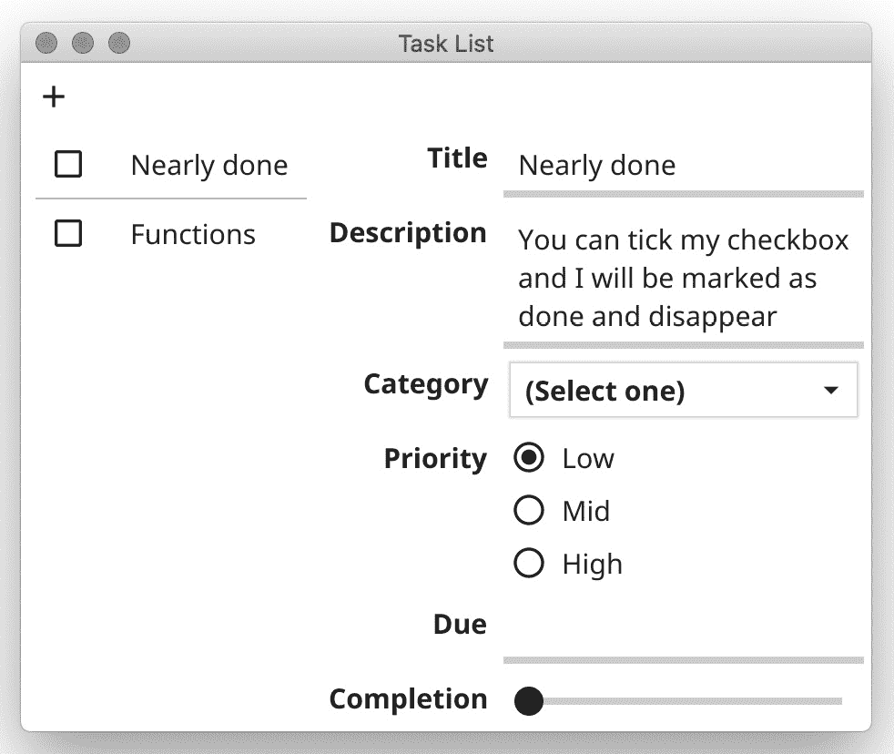

图 5.41 – 完整的用户界面

所示的所有代码都将与当前主题一起工作，这意味着当我们使用标准暗色主题时，我们可以看到相同的内容：

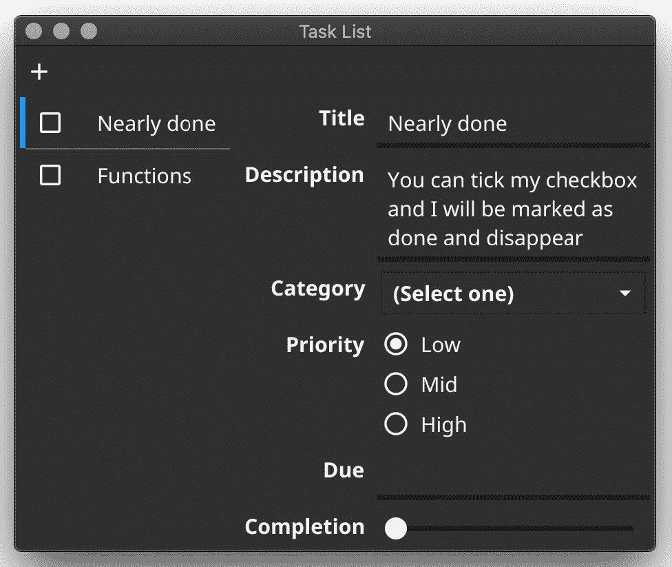


图 5.42 – 标准暗色主题下的任务用户界面

接下来，我们将处理当用户编辑任何数据时如何保存详细信息。

编辑内容

当每个输入小部件被编辑时，我们应该更新数据集。对于大多数输入来说，这是微不足道的，因为我们只需设置 `OnChanged` 回调，以便在数据更改时得到通知。让我们开始吧：

1.  在每个回调中，我们必须确保当前有一个任务被选中（以防所有任务都被删除），然后设置适当的字段。`Title` 的回调如下。注意，我们还调用 `Refresh()` 来更新任务列表，因为标题的变化应该反映在列表中：

    ```go
        a.title.OnChanged = func(text string) {
            if a.current == nil {
                return
            }
            a.current.title = text
            a.tasks.Refresh() // refresh list of titles
        }
    ```

    大多数其他回调都很相似，所以它们已被省略在此描述中 – 完整的代码可在本书的 GitHub 仓库中找到。

1.  优先级回调更新稍微复杂一些，因为我们正在将字符串表示的选择转换为数字字段。请注意，回调是一个传递给构造函数的函数：

    ```go
        a.priority = widget.NewRadio([]string{"Low", "Mid", "High"}, func(pri string) {
            if a.current == nil {
                return
            }
            if pri == "Mid" {
                a.current.priority = midPriority
            } else if pri == "High" {
                a.current.priority = highPriority
            } else {
                a.current.priority = lowPriority
            }
        })
    ```

1.  最后，我们将查看输入小部件，因为我们应该添加对日期格式的验证。为此，我们将 `Validator` 回调设置为向用户提供关于输入状态的反馈。首先，我们必须创建一个新的验证器，它可以检查日期格式，它简单地具有 `Validate(string)` `error` 函数签名（这意味着它实现了 `fyne.StringValidator`）：

    ```go
    func dateValidator(text string) error {
        _, err := time.Parse(dateFormat, text)
        return err
    }
    ```

1.  在设置了验证器之后，我们只需将其设置为 `OnChanged` 回调。在这个回调中，我们需要重新解析日期以获取输入的适当日期（如果输入为空，则跳过此步骤）：

    ```go
        a.due.Validator = dateValidator
        a.due.OnChanged = func(str string) {
            if a.current == nil {
                return
            }
            if str == "" {
                a.current.due = nil
            } else {
                date, err := time.Parse(dateFormat, str)
                if err != nil {
                    a.current.due = &date
                }
            }
        }
    ```

这是我们展示和编辑任务所需的所有代码。接下来，我们将学习如何标记任务为完成并保持列表更新。

标记任务为完成

我们接下来要添加的功能是标记任务为完成。让我们开始：

1.  因为我们在列表内部，所以需要在 `UpdateItem` 回调中设置回调为 `List`，以便能够标记正确的项目为完成：

    ```go
                check.OnChanged = func(done bool) {
                    a.visible[i].done = done
                    a.refreshData()
                }
    ```

1.  在这里，我们需要使用一个有用的 `refreshData()` 函数来更新数据列表（通过重新计算剩余的内容），然后要求 `task` 小部件刷新：

    ```go
    func (a *taskApp) refreshData() {
        // hide done
        a.visible = a.data.remaining()
        a.tasks.Refresh()
    }
    ```

    到目前为止，它功能正常。然而，当点击 `Check` 文本时，它将任务标记为完成，而不是选择它进行编辑。为了改进这一点，我们可以将文本组件移动到一个单独的 `Label` 小部件中，这将允许鼠标点击通过到列表选择逻辑。

1.  要做到这一点，我们将在模板函数中使用 `container.NewHBox` 返回一个 `Check` 和一个 `Label`。在应用更新回调中的内容时，我们需要从 `Container.Objects[]` 字段中提取小部件。否则，代码与之前类似。最终的列表实现如下：

    ```go
        a.tasks = widget.NewList(
            func() int {
                return len(a.visible)
            },
            func() fyne.CanvasObject {
                return container.NewHBox(widget.NewCheck("",
                    func(bool) {}),
                    widget.NewLabel("TODO Item x"))
            },
            func(i int, c fyne.CanvasObject) {
                task := a.visible[i]
                box := c.(*fyne.Container)
                check := box.Objects[0].(*widget.Check)
                check.Checked = task.done
                check.OnChanged = func(done bool) {
                    task.done = done
                    a.refreshData()
                }
                label := box.Objects[1].(*widget.Label)
                label.SetText(task.title)
            })
    ```

最后，我们将在工具栏中实现 `add` 按钮。

创建一个新任务

在本节中，我们将更新数据代码，以便我们可以添加新的任务。让我们开始吧：

1.  首先，我们将创建一个新的 `add()` 函数，带有 `task` 参数，并将其添加到列表的顶部：

    ```go
    func (l *taskList) add(t *task) {
        l.tasks = append([]*task{t}, l.tasks...)
    }
    ```

1.  由于数据函数通常很容易测试，我们将在 `data_test.go` 中添加另一个单元测试：

    ```go
    func TestTaskList_Add(t *testing.T) {
        list := &taskList{}
        list.add(&task{title: "First"})
        assert.Equal(t, 1, len(list.tasks))
        list.add(&task{title: "Next"})
        assert.Equal(t, 2, len(list.tasks))
        assert.Equal(t, "Next", list.tasks[0].title)
    }
    ```

    高度建议对整个用户界面进行单元测试，但这超出了本例的范围——我们将在 *第八章*，*项目结构和最佳实践*中回到这个话题。

1.  要完成添加任务的功能，我们必须在 `NewToolbarAction()` 函数中填写回调，该函数是我们第一次设置用户界面时调用的。此代码简单地创建一个新的 `task`，带有标题 `New task`，将其添加到数据中，然后重用我们为隐藏已完成任务创建的相同的 `refreshData()` 函数：

    ```go
    widget.NewToolbarAction(theme.ContentAddIcon(),
         func() {
             task := &task{title: "New task"}
             a.data.add(task)
             a.refreshData()
         }),
    ```

上述代码结束了我们的任务应用示例。我们还可以添加更多功能，但我们将将其留给你作为练习来完成。

# 概述

在本章中，我们学习了 Fyne 小部件 API 的设计，并查看了一系列标准小部件。我们看到了容器和集合小部件如何帮助我们组织和管理工作界面组件。对话框包也被探索，以展示我们如何将其与我们的应用程序一起使用，以实现常见活动的标准组件。

我们还看到了如何在工具包中实现主题，以及它们如何应用于所有小部件组件。本章演示了标准主题的浅色和深色变体，并展示了应用程序可以为自定义外观和感觉提供自己的主题。

通过构建一个任务跟踪应用程序，我们了解了内置小部件的使用情况，如何将它们布局在各种容器中，以及如何跟踪用户交互来管理一些内存中的数据。在下一章中，我们将探讨数据绑定和存储 API，这些可以帮助我们管理更复杂的数据需求。
