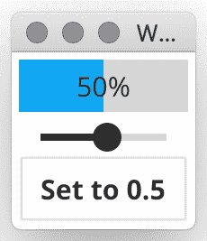
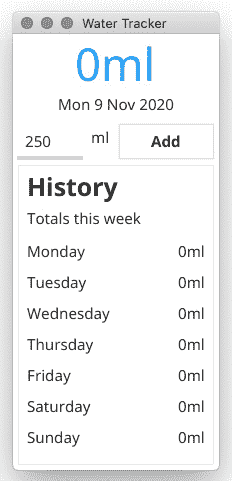
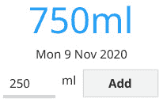
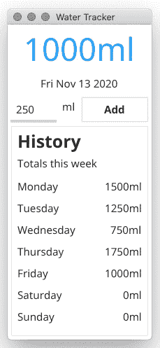

# 第六章：*第六章*：数据绑定和存储

在上一章中，我们了解到小部件可以通过应用程序代码手动控制。当我们开始查看更复杂的应用程序时，开发者通常希望显示或操作动态数据源。Fyne 工具包提供了数据和存储 API，可以自动化很多这项工作。

在本章中，我们将探讨在 Fyne 工具包内处理数据的方式。我们将涵盖以下主题：

+   将数据绑定到小部件

+   适配数据类型以显示

+   绑定复杂的数据类型

+   使用 Preferences API 存储数据

到本章结束时，我们将知道如何利用数据绑定和存储 API 创建一个帮助跟踪水消耗的应用程序。它将在本地设备上存储信息，并使用 API 探索如何最小化管理数据所需的编码。

# 技术要求

本章的要求与*第三章*，“Windows、Canvas 和绘图”相同，即您必须安装 Fyne 工具包并确保 Go 和 C 编译器正常工作。更多信息，请参阅上一章。

本章的完整源代码可以在[`github.com/PacktPublishing/Building-Cross-Platform-GUI-Applications-with-Fyne/tree/master/Chapter06`](https://github.com/PacktPublishing/Building-Cross-Platform-GUI-Applications-with-Fyne/tree/master/Chapter06)找到。

# 将数据绑定到小部件

当我们在*第五章*，“小部件库和主题”中探讨小部件时，我们看到了如何收集和展示信息。我们查看的每个小部件都是手动配置的，访问用户输入的数据（例如使用 `Entry` 小部件）需要查询小部件的状态的代码。`fyne.io/fyne/data/binding` 包提供了支持自动将小部件连接到数据源以更高效地处理这些操作的功能。

在以下章节中，我们将探讨数据绑定是什么，为什么它如此有用，以及它是如何在 Fyne API 中设计的。

## 理解数据绑定

数据绑定有许多不同的方法，定义可能因您所使用的工具包而异。一般来说，数据绑定允许图形界面组件的显示由独立的数据源控制。此外，它确保图形表示始终与更改保持最新，并且用户界面中的用户操作更改会同步回原始数据。

您可以在[`docs.microsoft.com/en-us/dotnet/desktop/wpf/data/data-binding-overview`](https://docs.microsoft.com/en-us/dotnet/desktop/wpf/data/data-binding-overview)中看到 .NET 的实现方法。Android 也提供了类似的功能，相关文档可在[`developer.android.com/topic/libraries/data-binding`](https://developer.android.com/topic/libraries/data-binding)找到。

尽管每个工具包都采取了不同的方法，但任何成功的数据绑定的基本原理都是基于独立数据对象的状态自动更新图形输出。这被称为 **单向** 绑定，通常称为 *单向数据流*。当信息来自外部源时，这对于数据显示是足够的。然而，如果你的应用程序将修改数据，则这并不足够。完整的数据绑定（**双向** 或 **双向**）确保在保持显示数据更新的同时，如果用户通过某些交互式小部件更改了表示，它也会更新源数据。

在 Fyne 工具包中完成的所有数据绑定都是双向的，这意味着每个建立的连接都可以读取或写入其连接到的数据。仅用于显示目的的小部件将不会使用写入数据的能力，但输入小部件，如输入框或滑块，会将数据更改推送到连接的绑定。每个数据绑定都有一个底层的数据源。我们将在下一节中查看支持的数据类型。

## 支持的数据类型

就像主要的 Go 语言一样，Fyne 数据 API 中的所有值都是强类型的——这意味着数据绑定具有特定的值类型。每个值都匹配一个原始 Go 类型，确保编译器可以检查这些值是否以正确的方式使用。

在撰写本文时，Fyne 数据绑定支持以下类型：

+   `Bool`: 布尔值可以是 `true` 或 `false`。此类型使用 `bool` 作为其内部存储。

+   `Float`: 浮点数值，这使用 `float64` 类型进行内部存储。

+   `Int`: 带有正数和负数的整数值，使用 `int` 类型存储。

+   `Rune`: 单个 Unicode 字符的表示，由 `rune` 类型支持。

+   `String`: Go `string` 类型的可绑定版本。

+   `List`: 与 `slice` 或 `array` 类似的映射，可以包含一个由 `int` 偏移量索引的单个类型的集合。

+   `Map`: `map` 原始类型的可绑定版本，可以按 `string` 键索引存储多种类型。

+   `Struct`: 与 `map` 类似的数据绑定，其中键代表开发者定义的 `struct` 类型的导出元素。

你使用的值类型可能由源数据决定，或者（如果你没有绑定到现有的数据源）你使用的输出小部件。我们将在本节的后面部分探讨小部件连接，但了解我们可以在需要时转换类型是有用的。我们将在 *适应显示数据类型* 部分后面探讨这一点。

当你拥有更复杂的数据，例如列表或结构体时，你仍然可以使用数据绑定 API，但需要更高级的类型，这将在后面的 *绑定复杂数据类型* 部分讨论。

现在我们已经了解了可用的数据类型，让我们看看如何通过绑定来读取和写入数据。

## 创建、读取和写入绑定数据

绑定 API 提供的基本数据类型（`Bool`、`Float`、`Int`、`Rune` 和 `String`）都提供了两个构造函数：一个用于从 Go 的零值创建新变量（使用 `New...()` 名称），另一个用于绑定到现有变量（命名为 `Bind...()`）。它还提供了 `Get()` 和 `Set()` 函数来管理数据访问。我们将使用 `Float` 类型作为示例，在下一部分详细探讨这些内容。

### NewFloat() Float

使用 `New...` 构造函数创建数据绑定将创建一个具有零值标准的新数据项。返回的对象实现了 `DataItem` 接口，从而实现了绑定。我们将在本章后面的 *监听变化* 部分更详细地探讨这一点。

### BindFloat(*float64) Float

`Bind...` 构造函数使用原始值的指针创建一个可绑定数据项。使用此函数，我们可以设置非零的默认值。此外，原始变量仍可用于在不支持数据绑定的地方获取和设置数据。在以下代码中，我们正在创建一个新的数据绑定到默认值为 `0.5` 的浮点值：

```go
f := 0.5
data := binding.BindFloat(&f)
```

返回的 `data` 变量是一个新的 `Float` 类型数据绑定，初始化为 `0.5`。如果此绑定被更改，它将新值写回 `f` 变量。

保持与源变量的同步

如果你正在绑定到数据绑定构造函数外部存在的变量，例如在之前的示例中，它也会导致绑定中的更改更新原始变量。然而，如果你直接更新变量，则必须通知数据绑定。调用 `data.Reload()` 通知数据绑定值已更改，以便它可以传播更改事件。

### Get() (float64, error)

要获取数据绑定的当前状态，只需调用 `Get()`。它将返回 Go 的原始数据类型之一的内容。对于 `Float` 绑定，这将是一个 `float64`。如果你访问此值时发生错误，则第二个参数将返回错误。虽然在这个阶段不太可能发生，但你将看到如何组合绑定来创建更复杂的情况。此调用不会产生任何额外操作。

### Set(float64) error

要更新绑定的值，你必须调用其 `Set(val)` 函数，同时传递新值（与 `Get()` 返回值一样，这是一个原始数据类型）。由于值已更改（如果新值与当前状态不同），数据绑定将通知所有已注册的代码。如果你设置值时发生错误，则不会触发绑定通知，并将返回错误。

接下来，我们将探讨如何请求对正在发生的变化的更新。

## 监听变化

数据绑定中的一个关键概念是，当值发生变化时，任何绑定到它的项目将自动更新。为此，我们需要一个机制来通知我们变化。在我们学习小部件如何自动执行此操作之前，我们将探讨此实现的实现，以便我们可以创建自己的代码，通过数据绑定保持最新。

### 使用`DataItem`接口添加监听器

任何数据绑定的核心功能是`DataItem`接口。前面显示的每个绑定数据类型（在*支持的数据类型*部分）也实现了此接口。`DataItem`的定义允许我们添加和移除监听器。每当数据项发生变化时，这些监听器都会收到通知：

```go
type DataItem interface {
    AddListener(DataListener)
    RemoveListener(DataListener)
}
```

定义显示了如何向任何数据项添加和移除监听器；这就是小部件如何得知数据何时发生变化。

当前值

当向`DataItem`添加监听器时，它将立即调用当前存储的值。这使得任何使用绑定的小部件或程序片段可以正确初始化，而无需额外的代码。

在本节中，我们了解到监听器是`DataListener`类型。我们将在下一节中更详细地探讨此类型。

### 创建一个`DataListener`

每个`DataItem`的监听者都必须实现`DataListener`接口。通过构造一个符合此定义的类型，我们可以向我们所依赖的数据项中添加监听器，并在之后移除。它被定义为如下：

```go
type DataListener interface {
    DataChanged()
}
```

如你所见，接口定义了一个单一的功能，`DataChanged()`。在大多数情况下，使用此代码的代码将只想直接提供该函数。对于这些情况，我们可以使用一个有用的构造函数，它接受一个简单的函数并返回一个`DataListener`的实例。生成的监听器可以用作`AddListener`和`RemoveListener`函数的参数。当数据更新时，它将调用指定的函数：

```go
func NewDataListener(fn func()) DataListener
```

利用这些知识，我们可以创建一个非常简单的数据绑定并监视其值的变化。我们所需做的只是使用数据绑定构造函数之一，并调用`AddListener`，传递我们创建的监听器：

```go
func main() {
     val := binding.NewString()
     callback := binding.NewDataListener(func() {
         str, _ := val.Get()
         fmt.Println("String changed to:", str)
     })
     val.AddListener(callback)
}
```

通过运行前面的代码，你会看到回调立即被触发，使用当前的字符串值（在这种情况下，空字符串，`""`）。

根据你的计算机速度，你可能在`main()`函数的末尾需要设置一个时间延迟，因为应用程序可能在数据绑定处理之前退出（例如，`time.Sleep(time.Millisecond*100)`）：

```go
Chapter06$ go run listen.go 
String changed to:
```

如前所述的代码所示，创建数据绑定并在数据更改时接收通知非常简单。我们也可以通过调用`val.Set("new data")`来触发更改，回调将再次触发。

尽管前面的代码很有用，但在 Fyne 中数据绑定的主要用途是连接小部件到数据，而无需编写将复制信息并监视更改的代码。接下来，我们将学习标准小部件如何与数据绑定一起操作。

## 使用标准小部件的数据

正如我们在前面的部分中所看到的，数据绑定 API 允许我们创建在内容更改时提供通知的值。正如你所期望的，Fyne 工具包中提供的 widgets 理解绑定，并且可以连接到它们以显示或更新数据。让我们探索如何设置它：

1.  我们首先在 `package main` 中打开一个新文件，并创建一个 `makeUI()` 函数，就像我们之前做的那样。这次，我们将通过声明一个新的浮点数作为我们的数据绑定来开始这个方法。使用 `NewFloat()` 将创建一个新的绑定，默认值为 `0.0`：

    ```go
    func makeUI() fyne.CanvasObject {
        f := binding.NewFloat()
        ...
    }
    ```

1.  接下来，我们将创建一个绑定到这个数据源的 `ProgressBar` 小部件。这个进度条简单地显示一个值，它是我们刚刚创建的 `Float` 数据类型，我们必须使用 `NewProgressBarWithData()` 构造函数：

    ```go
        prog := widget.NewProgressBarWithData(f)
    ```

1.  为了操作数据绑定，我们还想包括一个 `Slider`。正如你在 *小部件库和主题* 中所看到的，这个小部件将显示一个值，使用其当前位置，并允许通过滑动来更改值。为了建立这种连接，我们将使用 `NewSliderWithData()`，它接受额外的参数；即可以发送到数据绑定的允许的最小和最大值。然后我们必须设置 `Slider.Step` 值（滑块上每个步骤之间的间隔）为 `0.01`，以便我们可以引起精细粒度的数据变化：

    ```go
        slide := widget.NewSliderWithData(0, 1, f)
        slide.Step = 0.01
    ```

1.  除了前面的一对一和双向绑定之外，我们还可以使用一种只写的一对一绑定的版本。我们不需要以与这里连接最后两个小部件相同的方式将数据连接到小部件（因为没有必要为数据更改设置监听器）。相反，我们可以简单地创建一个 `Button`，当被点击时将写入数据绑定。在这里，我们将使用熟悉的 `NewButton()` 构造函数，并传递一个点击处理程序，该处理程序将值设置为 `0.5`：

    ```go
        btn := widget.NewButton("Set to 0.5", func() {
            _ = f.Set(0.5)
        })
    ```

1.  在我们的 `makeUI` 函数中的最后一行将返回一个容器，该容器将这些元素打包。在这种情况下，我们将使用 `container.NewVBox`，它将每个元素对齐在彼此的顶部：

    ```go
        return container.NewVBox(prog, slide, btn)
    ```

1.  为了完成这个示例，我们只需要创建一个常规的 `main()` 函数，该函数创建一个新的 `App` 实例并打开一个标题为 `Widget Binding` 的窗口。我们的 `makeUI` 函数中的内容将被添加，并且相应的窗口将出现。请参考以下代码：

    ```go
    func main() {
        a := app.New()
        w := a.NewWindow("Widget Binding")
        w.SetContent(makeUI())
        w.ShowAndRun()
    }
    ```

1.  你现在可以运行这个示例来查看这些小部件在所有绑定到同一数据源时的行为：

    ```go
    Chapter06$ go run widget.go
    ```

1.  当应用程序出现时，滑块和进度条将位于零位置。通过拖动滑块，你将更新滑块和进度条所绑定到的浮点数。结果，你会注意到进度条在移动。如果你按下**设置为** **0.5**按钮，它将值设置为**0.5**，其他小部件也将更新到中间位置，如以下截图所示：

![Figure 6.1 - 数据绑定设置为 0.5]



图 6.1 - 数据绑定设置为 0.5

在本节中，我们看到了数据绑定在处理动态数据时的好处，以及强类型 API 的约束。接下来，我们将探讨如何在不同类型之间进行转换，以便数据能够适应更广泛的各种小部件的使用。

# 适应显示数据类型

在上一节中我们讨论的示例中，我们了解到可以将相同的值绑定到不同的小部件上，因为`Slider`和`ProgressBar`都期望它们的数据为`Float`类型。然而，这些数据类型并不总是完美匹配。有时，我们需要进行转换以连接到我们希望使用的小部件。在本节中，我们将探讨如何进行转换，从如何在先前的示例中包含一个标签开始。

## 将类型格式化为字符串

在许多应用程序中，使用`Label`或其他基于字符串的显示来包含其他格式的信息是很常见的，例如`int`或`float64`。使用数据绑定，这并无不同，因此`binding`包提供了可以简化这种适应的转换函数。

为了延续先前的示例，我们可以包含一个显示`float64`值的`Label`，但要做到这一点，我们需要一个`String`绑定而不是`Float`。为了获得这个，我们可以使用绑定包中的`FloatToString`函数。像所有绑定转换函数一样，它接受一个参数，即源绑定，并返回一个正确类型的新绑定：

```go
strBind := binding.FloatToString(f)
label := widget.NewLabelWithData(strBind)
```

使用我们刚刚获得的字符串绑定，我们可以创建一个`Label`，如前一个代码片段所示。这种方法将使用默认格式渲染值。对于`Float`绑定，这将使用`"%f"`格式字符串，在用法上类似于`fmt.Printf`。如果我们想指定自己的格式，可能包括一些前导文本，我们可以使用`ToStringWithFormat`表示法来做到这一点：

```go
strBind := binding.FloatToStringWithFormat(f,
    "Value is: %0.2f")
label := widget.NewLabelWithData(strBind)
```

当使用此更新后的代码时，输出标签将包含类似于`Value` `is:` `0.50`的文本，这对你应用的用户来说可能更有意义。在指定格式时，请确保包含源类型的适当格式字符串，例如`Float`类型的`%f`或`Int`类型的`%d`。

虽然显示非字符串类型的值是迄今为止最常见的转换需求，但我们可能需要访问存储在字符串中的某些数字类型的变量。我们将在下一节中探讨这一点。

## 从字符串类型解析值

在某些情况下，你正在处理的数据可能不是你希望用于小部件的所需格式。当手动管理转换时，你可以将其作为你自己的代码的一部分来完成——简单地提取数据，转换它，然后将解析后的信息提供给小部件。然而，在使用数据绑定时，我们希望保持与源数据的直接连接，这意味着转换需要在数据绑定的链中发生。

就像在上一节中一样，也有一些方便的方法可以帮助你完成这项工作；它们的名字通常包含短语 `StringTo`。让我们通过一个例子来操作，这个例子中有一个包含 `int` 数字的 `string` 值。我们不希望在转换中包含手动代码，因此我们需要在链中包含一个转换，如下所示：

```go
val := "5"
strBind := binding.BindString(&val)
intBind := binding.StringToInt(strBind)
```

因此，我们有了 `binding.Int`，它正在读取底层的 `string` 数据源，现在可以在需要 `Int` 作为数据源的小部件中使用。

这是一个简单的例子。通常，当数字以字符串形式存储时，是因为该值包含一些非数字元素，例如一个包含尾随 `%` 符号的百分比。当字符串中有额外的格式化时，我们仍然可以通过使用转换的 `StringToIntWithFormat` 版本来达到相同的结果，如下所示：

```go
val := "5%" 
strBind := binding.BindString(&val) 
intBind := binding.StringToIntWithFormat(strBind, "%d%%")
```

注意，在格式字符串中，我们需要使用两个百分号来捕获百分号符号（`%%`）。这是由于格式字符串的工作方式，但除此之外，这个例子相当简单。调用 `intBind.Get()` 将返回 `5`（没有错误），如果 `strBind` 的值改为 `25%`，那么 `IntBind.Get()` 将返回 `25`，正如预期的那样。

在本节中，我们成功地使用了数据绑定转换函数将源数据转换为另一种类型的数据，以便在用户界面中使用。接下来，我们将学习如何确保输出（对于双向绑定）的变化传播到原始数据。

## 通过转换传播变化

在上一节提供的示例中，我们查看复杂的数据绑定链，以便将源数据转换为显示目的。这使得在不需要编写复杂转换代码的情况下使用各种与数据绑定连接的小部件变得容易得多。然而，我们需要确保呈现的数据中的变化被推回到数据源。

好消息是，在*将类型格式化为字符串*和*从字符串类型解析值*部分中展示的转换是全双工数据绑定。这意味着我们不需要添加任何额外的代码来传播数据的变化。如果建立了`IntToString`连接，那么源`Int`的变化不仅会在输出`String`中产生新的值，而且对`String`调用`Set()`将导致解析后的整数被推回到原始的`Int`绑定。当然，这取决于字符串是否正确格式化，设置无效值将不会传播变化，而是返回错误。

本节中我们探索的类型被标准小部件用于显示和管理动态数据。然而，在许多应用程序中，我们拥有更复杂的数据。在下一节中，我们将探讨如何将此类数据绑定到我们的应用程序中。

# 绑定复杂的数据类型

我们在数据绑定探索中使用的类型到目前为止仅限于 Go 原始类型的映射。这意味着它们代表具有单个元素的简单变量。对于许多应用程序，显示更复杂的数据，如列表、映射或自定义结构体将是必要的。在本节中，我们将探讨如何实现这一点，从`DataList`类型开始。

## 使用数据列表

无论您是想使用数据绑定将数据呈现给`widget.List`或`widget.RadioGroup`，还是您正在使用将传递给您的自定义小部件的绑定来建模数据，数据列表的概念都将很重要。数据绑定 API 将`DataList`定义为一个提供额外`Length`和`GetItem(int)`函数的绑定，如下所示：

```go
type DataList interface {
    DataItem
    GetItem(int) DataItem
    Length() int
}
```

这个通用定义意味着列表可以封装一个数据类型——`GetItem()`返回的`DataItem`实例可以是`String`、`Int`，甚至是另一个`DataList`。你可以使用之前的接口实现`DataList`，或者可以使用 Fyne 提供的基于类型的列表之一。`Length`方法将始终返回列表中的项目数量，而`GetItem`可以用来访问指定索引处的数据绑定（因为列表是有序的）。

列表长度的变化（通过`append`、`insert`或`remove`）将在注册在`DataList`上的任何监听器上触发回调。如果列表中某个项目的值发生变化，它将触发单个项目的更改监听器，而不是包含该列表。正因为如此，当监听器调用我们的代码时，我们可以巧妙地最小化 UI 变化的影响。在接下来的章节中，我们将使用`StringList`来管理在`List`小部件中展示的多个项目时，我们将看到这个过程是如何工作的。

### 创建一个列表

尽管列表可以包含许多不同类型的项，但它们通常都会包含相同类型的所有项，例如 `String` 或 `Float`。为此，有一些有用的构造函数，例如 `NewFloatList` 和 `BindStringList`。您可以使用 `New...List` 方法创建一个没有任何内容的空列表，或者您可以使用 `Bind...List` 函数将绑定到 Go 代码中的现有切片。例如，一个空字符串列表可能看起来如下所示：

```go
strings := binding.NewStringList()
fmt.Println("String list length:", strings.Length())
strings.Append("astring")
fmt.Println("String list length:", strings.Length())
val, _ := strings.GetValue(0)
fmt.Println("String at 0:", val)
```

运行此代码将显示以下输出：

```go
String list length: 0
String list length: 1
String at 0: astring
```

在这里，您可以看到标准列表提供了额外的 `GetValue` 和 `SetValue` 方法，以便像标准单一绑定一样访问值。还有匹配的 `Get` 和 `Set` 方法，允许您更改整个列表。这使我们能够使用原始类型在已知列表类型时访问和操作数据。我们还可以使用数据绑定的存储切片以相同的方式进行操作：

```go
src := []string{"one"}
strings := binding.BindStringList(&src) 
fmt.Println("String list length:", strings.Length()) 
strings.Append("astring") 
fmt.Println("String list length:", strings.Length()) 
val, _ := strings.GetValue(0)
fmt.Println("String at 0:", val)
```

运行此代码将产生以下输出：

```go
String list length: 1
String list length: 2
String at 0: one
```

现在我们已经创建了一个列表绑定，我们可以使用它来在使用 `DataList` 绑定的小部件中显示数据，例如 `widget.List`。

### 显示列表

我们通常使用数据列表的最常见方式是通过 `List` 小部件。当使用数据绑定来管理列表小部件时，它将自动添加与数据长度相匹配的行。当长度变化时，它会增长或缩小。此外，列表中的数据项可以绑定到列表中的项，这意味着如果数据值被更新，列表将自动更新。请参考以下代码：

```go
l := widget.NewListWithData(strings,
     func() fyne.CanvasObject {
         return widget.NewLabel("placeholder")
     },
     func(item binding.DataItem, obj fyne.CanvasObject) {
         text := obj.(*widget.Label)
         text.Bind(item.(binding.String))
     })
```

如您所见，我们使用 `NewListWithData` 构造函数在 `List` 小部件中设置数据绑定。第一个参数 `DataList` 替换了在常规 `List` 构造函数中使用的 `Length` 函数。第二个参数，设置模板项的函数保持不变。最后一个参数的回调用于更新项，与常规列表类似，但第一个参数现在是一个 `DataItem` 而不是 `ListItemID`。我们可以通过调用 `Bind()` 并传递已转换为 `binding.String` 强类型的 `DataItem` 来保持 `Label` 的 `Text` 值最新。以这种方式应用绑定将实现标准 API，因此我们不必担心缓存如何影响此功能。

管理不同类型的列表是可能的，只要你在每次访问时小心地将 `DataItem` 转换为正确的绑定类型。这超出了本章的范围。在下一节中，你将了解如何将这种技术应用于数据映射，它通常包含许多不同类型的值。

## 使用数据映射

在数据绑定的上下文中，数据映射与 Go 的 `map` 类型非常相似，其中 `string` 键映射到 `DataItem` 类型；例如，`map[string]binding.DataItem`。`DataMap` 的定义与 `DataList` 类似，但它使用 `string` 键来标识子元素，而不是使用 `int` ID。它不使用返回列表长度的 `Length()` 方法，而是需要一个 `Keys()` 函数，该函数返回一个包含数据集中所有键的字符串切片。要找到数据中的项目数量，你可以简单地调用 `len(DataMap.Keys())`：

```go
type DataMap interface {
     DataItem
     GetItem(string) (DataItem, error)
     Keys() []string
}
```

当向 `DataMap` 添加或从其中移除项目时，其监听器将被触发。如果某个项目的值发生变化，它将触发单个项目的更改监听器，而不是所有 DataMap 监听器（如前一小节中提到的列表中的项目）。由于映射通常包含许多不同类型的数据，因此使用标准 API 创建映射与创建列表略有不同，我们现在将看到这一点。当然，任何实现了 `DataMap` 接口类型的都可以用于映射数据绑定，但通常使用提供的实现会更简单。

在接下来的几节中，我们将通过创建一个 `DataMap` 并设置其值来探索如何使用它，然后再描述它们如何用于显示。

### 创建数据映射

与 `DataList` 不同，`DataMap` 在 Fyne 中没有特定类型的实现。由于映射通常包含许多不同类型的数据，因此只有一个映射实现将 `string` 键映射到 `interface{}` 值。这可以通过在内存中创建一个新的映射，或者通过使用 `map[string]interface{}` 类型签名绑定到现有的 `map` 来创建。首先，让我们看看如何创建一个新的映射；以下代码使用 `binding.NewUntypedMap()` 构造函数创建一个新的映射并添加一些值：

```go
values := binding.NewUntypedMap()
fmt.Println("Map size:", len(values.Keys())) 
"_ = values.SetValue("akey", 5)
fmt.Println("Map size:", len(values.Keys())) 
val, _ := values.GetValue("akey")
fmt.Println("Value at akey:", val)
```

执行前面的代码将产生以下输出：

```go
Map size: 0
Map size: 1 
Value at akey: 5
```

我们可以再次执行相同的操作，但这次通过使用现有的数据源，利用 `binding.BindUntypedMap()` 来实现，如下所示：

```go
src := map[string]interface{}{"akey": "before"}
values := binding.BindUntypedMap(&src)
fmt.Println("Map size:", len(values.Keys()))
_ = values.SetValue("newkey", 5)
fmt.Println("Map size:", len(values.Keys()))
val, _ := values.GetValue("akey")
fmt.Println("Value at akey:", val) 
```

执行前面的代码将产生以下输出：

```go
Map size: 1
Map size: 2
Value at akey: before
```

之前的示例没有检查数据类型，但如果你确定一个键的类型，你可以执行类似于列表中的类型断言。例如 `values.GetItem("key").(Float)` 会返回一个与存储在指定键处的 float64 类型的 float 数据绑定。现在让我们看看如何使用它来显示。

### 显示映射

在编写本文时，没有内置的小部件使用 `DataMap` 绑定类型。它主要的作用是允许你的应用程序在单个绑定类型中维护多个数据绑定。

预计 `Form` 和 `Table` 小部件将在不久的将来添加对数据绑定的支持。你可以在开发者网站上查看最新的 API 更新，网址为 [`developer.fyne.io/api/widget.html`](https://developer.fyne.io/api/widget.html)。

在我们离开本节之前，我们将探索一个最后的技巧——将自定义 `struct` 映射到 `DataMap`。

## 将结构体映射到数据绑定

在填充 `DataMap` 中的数据时，常见的方法之一是使用 `struct` 类型。在这种情况下，有一组字段，其中名称映射到值（正如我们在本书中已经多次看到的）。正如你所看到的，这个定义与我们在上一节中看到的映射非常匹配。为了节省大量的手动代码，数据绑定 API 提供了一种简单的方法，可以从现有的结构变量自动创建 `DataMap`。

就像任何其他的 `binding.Bind...` 方法一样，我们传递一个变量的指针，它返回绑定后的数据类型。在这种情况下，Fyne 代码将使用每个 `struct` 字段的名称作为映射的键，值将被设置为该 `struct` 的变量。为了能够在一个 `struct` 中绑定一个字段，它必须是一个导出字段（名称必须以大写字母开头）。以下代码演示了这一原则：

```go
type person struct {
     Name string
     Age int
}
src := person{Name: "John Doe", Age: 21}
values := binding.BindStruct(&src)
fmt.Println("Map size:", len(values.Keys()))
name, _ := values.GetValue("Name")
fmt.Println("Value for Name:", name)
age, _ := values.GetValue("Age")
fmt.Println("Value for Age:", age)
```

运行前面的代码将产生以下输出：

```go
Map size: 2 
Value for name: John Doe 
Value for age: 21
```

正如你所看到的，键和值都按预期工作，但有一个好处，即小部件可以观察对数据的更改并保持其显示更新。

现在我们已经探讨了数据绑定如何轻松处理动态数据的显示方式，我们将看看如何使用 Preferences API 存储用户生成数据。

# 使用 Preferences API 存储数据

对于应用程序来说，存储大量信息是一个常见的需求，例如用户配置选项、当前输入字段的内容以及打开文件的历史记录。使用文件来存储这些信息将需要额外的代码来格式化信息以便存储；使用数据库将需要额外的服务器或应用程序的依赖项。为了帮助解决这个问题，Fyne 提供了一个类似于 iOS 和 Android 开发者使用的 **Preferences** API。

存储为 Fyne 预设的数据可以通过任何使用特定字符串标识符（称为 **键**）的应用程序代码访问。每个存储的 **值** 都有特定的类型，因此开发者不需要处理任何转换或类型检查。任何时间数据发生变化，它都会被保存以供将来使用。

在本节中，我们将学习如何使用 Preferences API 管理数据，并了解我们如何避免手动管理用户数据。

## 获取和设置值

每个支持的类型（见下一节）都提供了函数，以便我们可以获取和设置该类型的数据。我们将通过使用字符串来探索这一点。要使用字符串读取或写入数据，我们可以使用 `String()` 函数；要写入一个值，我们可以使用 `SetString()`。

要访问首选项，我们可以使用`App.Preferences()`。如果您无法访问加载应用程序的`App`实例，可以使用`fyne.CurrentApp().Preferences()`代替，它将返回相同的引用。然而，还有一个额外要求——每个应用程序必须声明一个唯一的标识符，用于存储。为此，我们必须将`app.New()`构造函数更改为`app.NewWithID()`，传递一个合适的唯一标识符。通常，唯一 ID 将是反向 DNS 格式，并且必须与您在分发时使用的标识符匹配（有关更多详细信息，请参阅*第九章*，*打包资源和准备发布*）。例如，您可以使用`com.example.myapp`进行测试目的。

以下代码片段设置了一个具有（相对）唯一标识符的应用程序并访问标准首选项：

```go
func main() {
    a := app.NewWithID("com.example.preferences")
    key := "demokey"
    a.Preferences().SetString(key, "somevalue")
    val := a.Preferences().String(key)
    fmt.Println("Value is:", val)
}
```

我们可以将前面的代码插入到常规的`main()`函数中（对于更完整的列表，请参阅*实现水消耗跟踪器*部分）。请注意，我们使用单个`string`值作为键——这有助于我们避免在每次访问时输入键时出错。运行它将产生以下输出：

```go
Value is: somevalue
```

这个快速示例演示了字符串访问，但我们还可以使用其他类型。我们将在下一节中查看其中的一些。

## 支持的类型

使用所展示的字符串方法，可以存储任何类型的数据，但 API 旨在帮助我们避免以这种方式格式化和解析数据的复杂性。因此，Fyne 首选项代码支持不同类型。在撰写本文时，支持的类型如下：

+   `bool`：存储简单的布尔值（`true`或`false`）。

+   `float`：需要浮点数值的数字可以使用`float`存储。

+   `int`：对于整数，使用`int`函数。

+   `string`：正如我们之前所使用的，简单的`string`值。

这些类型遵循我们在前面的代码中看到的相同命名约定。例如，您可以使用`SetInt()`设置整数或使用`Bool()`获取布尔值。

通过使用 Go 语义，如果没有之前存储任何项，返回的值将具有零值。使用回退值可以设置不同的默认值。

## 回退值

对于那些属性默认值不应是 Go 定义的标准零值（0）的情况，每个`Get...`函数都有一个`WithFallback`版本；例如，`StringWithFallback()`。

如果我们将前面的示例中的代码更改为仅使用获取和回退方法，我们可以看到它们是如何工作的：

```go
    key := "anotherkey"
    val := a.Preferences().String(key)
    fmt.Println("Value is:", val)
    val = a.Preferences().StringWithFallback(key, "missing")
    fmt.Println("Value is:", val)
```

运行此版本的代码将产生以下输出：

```go
Value is: 
Value is: missing
```

使用这些方法，我们可以处理具有合理默认值的数据，并保存应用程序未来运行的更改。有时，我们可能需要删除旧数据；我们也可以做到这一点。

## 删除旧数据

存储用户数据很重要，但能够在请求时删除它也同样重要。为此，首选项 API 提供了一个名为`RemoveValue`的最终方法，它将执行此操作。

通过将以下代码添加到我们之前的示例末尾，设置的值将被清除，这意味着在下次运行时，如果应用再次启动，你将看到默认值：

```go
    fmt.Println("Removing")
    a.Preferences().RemoveValue(key)
    val = a.Preferences().String(key)
    fmt.Println("Value is:", val)
```

之前的代码在完成时也会打印出值，确保项目已被从首选项中移除。将本节中的所有代码一起运行将产生以下输出：

```go
Chapter06$ go run preferences.go
Value is: 
Value is: missing
Value is: somevalue
Removing
Value is:
```

通过这样，我们已经看到了如何轻松地存储和访问在应用中使用的数据元素。然而，当我们将它与我们本章开头看到的绑定数据 API 结合使用时，首选项 API 变得更加强大。

## 首选项绑定

在本章前面我们关注的`binding`包中，我们可以创建连接到首选项存储而不是常规变量的数据绑定。这为我们提供了巨大的好处，即每次值设置触发时，它都会被存储，当应用再次启动时，将加载之前的值。

要访问此功能，我们可以使用以`BindPreference`开头命名的函数，例如`BindPreferenceString()`。本节前面列出了支持的首选项 API 的每种类型都有一个函数。这些方法都接受一个字符串参数，这是我们之前代码片段中使用的键字符串。希望继续使用首选项 API 的代码可以像以前一样继续使用，但使用这些数据绑定确保新值直接推送到绑定连接的小部件。从首选项绑定返回的绑定使用与其他数据绑定 API 相同的类型，因此你可以通过`Get()`方法获取首选项项的`string`值，正如你所期望的那样：

```go
data := binding.BindPreferenceString("demokey",                  	    a.Preferences())
val, _ = data.Get()
fmt.Println("Bound value:", val)
```

之前的代码将通过数据绑定框架访问相同的首选项值，这使得保持小部件与用户首选项同步变得容易。输出将如下所示：

```go
Chapter06$ go run preferences.go
Bound value: somevalue
```

这些绑定也可以像之前的定义一样链式连接，这意味着你可以通过以下方式获取一个整数首选项值的`String`绑定：

```go
binding.IntToString(binding.BindPreferenceInt("mykey", p))
```

也可能存在多个小部件，连接到多个数据绑定，所有这些小部件都读取和写入相同的首选项值。如果你使用相同的键为多个绑定创建首选项，那么当值发生变化时，它们都将保持最新。我们将在下面的示例中看到这一点。

通过这样，我们已经探讨了数据绑定和偏好 API，以及它们如何单独或共同大大减少管理应用数据所需的代码量。让我们利用这些知识来实现一个示例应用，帮助我们追踪日常的水消耗。

# 实现水消耗追踪器

在本章中我们探讨的 API 对于大多数应用都有帮助。为了了解我们如何将偏好存储添加到简单的应用中，我们将探讨另一个示例项目。这次，我们将创建一个可以追踪一周内水消耗的追踪器。

## 构建用户界面

在我们开始使用数据绑定 API 之前，我们将构建基本用户界面。目标是把今天的总数以大字体显示在窗口的顶部，日期显示在下面。我们将接着添加用于向当前总数添加水的控件。在这之下，我们将添加另一个部分，显示当前周的数据。让我们开始吧：

1.  我们将像往常一样，首先定义一个`makeUI`函数，该函数构建用户界面。首先，我们将定义一个用于显示总数的标签，将其字体设置为`42`点，居中对齐，并使用`theme`主色调：

    ```go
    func makeUI() fyne.CanvasObject {
        label := canvas.NewText("0ml", theme.PrimaryColor())
        label.TextSize = 42
        label.Alignment = fyne.TextAlignCenter
    ```

1.  现在，我们需要创建另一个用于显示日期的常规标签：

    ```go
        date := widget.NewLabel("Mon 9 Nov 2020")
        date.Alignment = fyne.TextAlignCenter
    ```

1.  接下来的几个元素添加了控制功能，这些功能支持向当前的水消耗值添加数值。这可以是一个简单地添加特定数字（例如，*250 ml*）的按钮，但为了更灵活，我们将允许用户指定一个数值。为此，我们将创建一个预先填充为`250`的`Entry`字段。然后，我们将在其后添加一个辅助的`ml`标签，并定义一个新的按钮，标签为`Add`，稍后将对这个按钮进行操作：

    ```go
        amount := widget.NewEntry()
        amount.SetText("250")
        input := container.NewBorder(nil, nil,
            nil, widget.NewLabel("ml"), amount)
        add := widget.NewButton("Add", func() {})
    ```

1.  在定义历史布局之前，我们定义了一个有用的`historyLabel`函数。这个函数将创建一个新的标签，简单地包含`0ml`并将其右对齐。这里的数据将稍后添加。

    ```go
    func historyLabel() fyne.CanvasObject {
        num := widget.NewLabel("0ml")
        num.Alignment = fyne.TextAlignTrailing
        return num
    } 
    ```

1.  我们将要添加的最后内容元素是历史信息。在这种情况下，我们可以使用一个两列的网格容器来构建这个。在左侧，我们将显示一周中的某一天，而在右侧，我们将显示一个用于值的标签：

    ```go
        history := container.NewGridWithColumns(2,
            widget.NewLabel("Monday"), historyLabel(),
            widget.NewLabel("Tuesday"), historyLabel(),
            widget.NewLabel("Wednesday"), historyLabel(),
            widget.NewLabel("Thursday"), historyLabel(),
            widget.NewLabel("Friday"), historyLabel(),
            widget.NewLabel("Saturday"), historyLabel(),
            widget.NewLabel("Sunday"), historyLabel(),
        )
    ```

1.  为了从这个函数返回界面构建的结果，我们可以创建一个新的垂直框。在这个框内，我们必须堆叠总数`label`、`date`、一个对齐`input`和`add`按钮的水平网格，以及最后包含历史内容的`Card`小部件，以及一个标题。

    ```go
        return container.NewVBox(label, date,
            container.NewGridWithColumns(2, input, add),
            widget.NewCard("History", "Totals this week",
                history))
    }
    ```

1.  为了使这个示例运行，我们必须创建典型的`main()`函数。这次，我们希望它创建一个标题为`Water Tracker`的窗口，并将`makeUI()`返回的内容显示出来：

    ```go
    func main() {
        a := app.New()
        w := a.NewWindow("Water Tracker")
        w.SetContent(makeUI())
        w.ShowAndRun()
    }
    ```

1.  我们现在可以从命令行以通常的方式运行这个示例：

    ```go
    Chapter06/example$ go run main.go
    ```

运行前面的命令应该会显示以下界面（当使用浅色主题时）：



图 6.2 – 空的用户界面

这个界面看起来很合适，但它目前还没有做任何事情。在下一节中，我们将通过将`total`标签绑定到一个可以使用**添加**按钮增加的值来开始创建一些功能。

## 将数据绑定到 UI

为了开始使用户界面具有功能，我们将使用数据绑定，以便应用程序的标题部分管理一个代表一天内消耗了多少水的单个整数值。按照以下步骤操作：

1.  首先，我们需要声明一个新的绑定变量，其类型为`binding.Int`。我们必须在`makeUI`函数的开始处添加以下行：

    ```go
        total := binding.NewInt()
    ```

1.  接下来，我们将添加按钮点击处理的实现。为了执行数字增加，我们必须用以下函数替换旧的`func() {}`函数：

    ```go
        func() {
             inc, err := strconv.Atoi(amount.Text)
             if err != nil {
                 log.Println("Failed to parse integer:" +
                     amount.Text)
                 return
             }
             current, _ = total.Get()
             _ = total.Set(current + inc)
        }
    ```

    这将通过调用`Get()`来解析`amount.` `Text`字段中的整数并将其添加到总数中。它是通过调用`Get()`找到当前值，然后调用`Set()`并应用增量来完成的。

1.  接下来，我们想在标签中显示整数值，使用基于我们已创建的`Int`函数的`String`绑定：

    ```go
        totalStr := binding.IntToStringWithFormat(total,  	        "%dml")
    ```

1.  现在我们已经使用`canvas.Text`定义了我们的大号彩色文本，我们必须绑定这些值。然而，没有有用的`WithData`构造函数，因此我们必须手动应用绑定值。让我们创建一个新的`DataListener`，当值发生变化时将被调用。在回调内部，我们设置文本并请求刷新：

    ```go
        totalStr.AddListener(binding.NewDataListener(
             func() { 
                 label.Text, _ = totalStr.Get() 
                 label.Refresh() 
             }))
    ```

1.  经过这些更改后，我们可以运行应用程序以查看实际效果：

    ```go
    Chapter06/example$ go run main.go
    ```

当加载时，用户界面看起来是一样的，但当我们点击**添加**按钮时，总数值将更新，增加的数值等于输入字段中的数值：



图 6.3 – 显示一个绑定值

如果你退出这个版本的程序并再次打开它，你会注意到值被忘记了。我们可以通过使用偏好设置 API 来修复这个问题，我们现在就会这么做。

## 使用偏好设置存储

为了在应用程序启动之间记住值，我们可以使用偏好设置 API。这允许我们存储值，而无需管理文件访问或数据库。在本节中，我们将把我们的数据绑定连接到偏好设置 API，以便在数据更改时自动记住数据。按照以下步骤操作：

1.  要能够存储偏好设置，我们需要为每个数据项分配一个键。在这个例子中，每个数字代表一天的总数，因此我们将使用日期来识别存储的项目。我们需要一个新的函数`dateKey`，它将从任何给定的时间格式化一个字符串：

    ```go
    func dateKey(t time.Time) string {
        return t.Format("2006-01-02") // YYYY-MM-DD
    }
    ```

1.  为了能够使用偏好设置 API，我们需要确保我们的应用程序有一个唯一的标识符。为此，我们将使用`app.NewWithID`而不是`app.New`。ID 应该是全局唯一的。然后，我们需要检索应用程序的`Preferences`实例并将其传递到我们的`makeUI`函数中，以便它可以在绑定中使用：

    ```go
    a := app.NewWithID("com.example.watertracker")
    pref := a.Preferences()
    w.SetContent(makeUI(pref)
    ```

1.  接下来，我们将更新`Int`绑定，使其能够访问偏好设置而不是在内存中创建一个新的值。我们将更新`makeUI`，使其接受一个偏好设置实例，然后更改我们的绑定创建，使其使用`BindPreferenceInt`。这个构造函数需要它需要访问的值的键（这是由我们创建的`dateKey`函数生成的）以及要使用的偏好设置实例：

    ```go
    func makeUI(p fyne.Preferences) fyne.CanvasObject {
    total := binding.BindPreferenceInt(
        dateKey(time.Now()), p)
    ```

1.  由于我们正在完成 app 的顶部部分，我们也应该设置正确的日期。只需更改标签构造函数，使其传递一个格式化的日期字符串，如下所示：

    ```go
    date := widget.NewLabel(time.Now().Format(
        "Mon Jan 2 2006"))
    ```

如果你再次运行 app，你会看到相同的界面（带有更正的日期显示）。如果你向今天的总数添加一些值然后重新启动 app，你会注意到这个值被记住了。

这样，我们就完成了 app 的基本功能，但历史字段仍然是空的。基于之前的功能，我们可以显示之前几天的存储值。

添加历史记录

在主数据绑定代码工作正常后，我们可以将类似的功能添加到历史面板中。我们将访问每周每一天的偏好设置值，并更新`historyLabel`函数以访问它。让我们看看如何：

1.  历史面板最复杂的部分是日期处理。我们需要找出代表一周开始的那一天。由于一天中的时间通常并不重要（此代码中没有考虑夏令时），我们只需操作日期部分。使用`Time.Weekday()`，我们可以找出是星期几，然后从这里开始。Go 的`time`包期望星期日是一周的第一天，因此我们需要通过减去 6 天来找到星期一。对于其他所有日期，我们减去从星期一开始的天数（`24 * time.Hour`）。以下代码将使我们能够找到第一个历史元素的日期：

    ```go
    func dateForMonday() time.Time {
        day := time.Now().Weekday()
        if day == time.Sunday {
            return time.Now().Add(-1 * time.Hour * 24 * 6)
        }
        daysSinceMonday := time.Duration(day - 1)
        dayLength := time.Hour * 24
        return time.Now().Add(-1 * dayLength *
            daysSinceMonday) // Monday is day 1
    }
    ```

1.  接下来，我们必须更新`historyLabel`函数，添加所讨论的那天的日期，以及要使用的偏好设置引用。基于此，我们可以生成我们的`dateKey`，就像我们为总存储所做的那样，并将一个`Int`值绑定到偏好设置上。然后，我们创建另一个使用相同格式的字符串转换，但在这个例子中，我们可以简单地使用`NewLabelWithData`构造函数：

    ```go
    func historyLabel(date time.Time, p fyne.Preferences) fyne.CanvasObject {
        data := binding.BindPreferenceInt(dateKey(date), p)
        str := binding.IntToStringWithFormat(data, "%dml")
        num := widget.NewLabelWithData(str)
        num.Alignment = fyne.TextAlignTrailing
        return num
    }
    ```

1.  现在，我们可以更新历史面板的详细信息。首先，我们计算当前周开始时的星期一的日期，然后设置一个用于天长度的辅助器，这并不属于 Go `time`包的一部分。对于每个历史元素，我们通过自周一开始增加天数来传递每天的日期：

    ```go
    weekStart := dateForMonday()
    dayLength := time.Hour * 24
    history := container.NewGridWithColumns(2,
        widget.NewLabel("Monday"),
            historyLabel(weekStart, p),
        widget.NewLabel("Tuesday"),
            historyLabel(weekStart.Add(dayLength), p),
        widget.NewLabel("Wednesday"),
            historyLabel(weekStart.Add(dayLength*2), p),
        widget.NewLabel("Thursday"),
            historyLabel(weekStart.Add(dayLength*3), p),
        widget.NewLabel("Friday"),
            historyLabel(weekStart.Add(dayLength*4), p),
        widget.NewLabel("Saturday"),
            historyLabel(weekStart.Add(dayLength*5), p),
        widget.NewLabel("Sunday"),
            historyLabel(weekStart.Add(dayLength*6), p),
    )
    ```

1.  通过运行这个最终版本的 app，我们将看到它更新了历史面板中的今天值：

    ```go
    Chapter06/example$ go run main.go
    ```

更新后的代码将加载我们之前拥有的相同界面，但现在，你会看到按下**添加**按钮将更新历史面板中的当前日期：



图 6.4 – 我们完成的水量追踪应用

你将看到这个应用程序在一周内的历史记录，如前一个截图所示。如果你想编辑数据，你可以直接修改首选项文件。首选项文件的位置取决于你的操作系统。更多信息请参阅[`developer.fyne.io/tutorial/preferences-api`](https://developer.fyne.io/tutorial/preferences-api)。

# 摘要

在本章中，我们探讨了 Fyne 中可用于管理和存储数据的各种 API。我们探讨了数据绑定的概念，并了解了它如何帮助保持用户界面更新，同时减少我们需要编写的代码量。

我们随后查看了 Preferences API，它允许我们在应用启动之间持久化用户数据。当与数据绑定代码结合使用时，这不会带来额外的复杂性。通过利用这些功能，我们实现了一个示例应用，用于管理跟踪用水量的数据，并将其存储在我们的本地设备上，以便第二天使用。

有了这些，我们已经涵盖了 Fyne 工具包中最常见的标准小部件和功能。有时，一个应用程序可能需要包含在内的小部件或功能。为了支持这一点，工具包允许我们扩展内置组件。我们将在下一章中探讨这一点。
