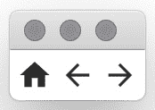
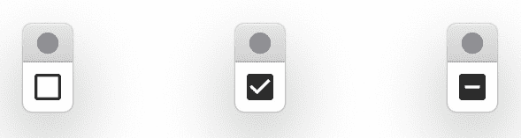
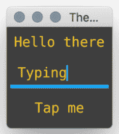
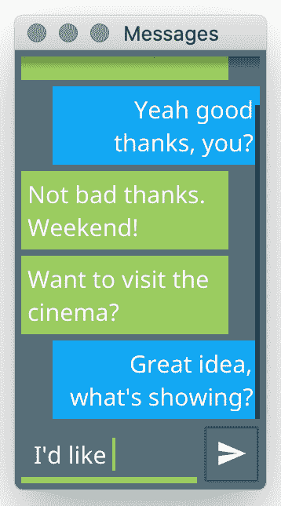

# *第七章*：构建自定义小部件和主题

在前几章中，我们看到了许多作为 Fyne 工具包一部分的功能。然而，许多应用程序将受益于作为标准不包括的组件或功能。为了能够支持易于使用的工具包 API 并同时支持附加功能，Fyne 工具包提供了在常规小部件旁边使用自定义代码的能力。

在本章中，我们将探讨如何在 Fyne 应用程序中使用自定义数据，以及如何通过代码或加载自定义主题来添加自定义样式。

在本章中，我们将涵盖以下主题：

+   扩展现有小部件

+   从头创建组件

+   添加自定义主题

在本章结束时，我们将看到如何利用自定义小部件和主题功能来创建一个展示可用于各种即时通讯协议的对话历史的应用程序。它将展示如何使新小部件补充标准集，以及如何使自定义主题为应用程序增添一些个性。

# 技术要求

本章与*第三章*、“Windows、Canvas 和绘图”的要求相同：您需要安装 Fyne 工具包并拥有一个有效的 Go 和 C 编译器。更多信息，请参阅上一章。

本章的完整源代码可以在[`github.com/PacktPublishing/Building-Cross-Platform-GUI-Applications-with-Fyne/tree/master/Chapter07`](https://github.com/PacktPublishing/Building-Cross-Platform-GUI-Applications-with-Fyne/tree/master/Chapter07)找到。

# 扩展现有小部件

我们在*第五章*“小部件库和主题”中探讨的标准小部件都具有最小的 API 来定义常用功能。为了支持添加更高级的功能，应用程序开发者可以扩展每个 Fyne 小部件。在本节中，我们将看到如何通过覆盖现有功能或添加新行为来增强小部件。

如以下图所示，扩展小部件以及自定义小部件都可以与标准小部件和画布对象一起包含在容器中：

![图 7.1 – 扩展和自定义小部件可以与标准元素一起使用

![img/Figure_7.1_B16820.jpg]

图 7.1 – 扩展和自定义小部件可以与标准元素一起使用

扩展小部件将嵌入现有小部件并提供替换或增强的功能。我们将在本章后面看到，自定义小部件实现了完整的`Widget`接口，因此不受标准小部件设计的限制。

构建自定义小部件提供了更多的灵活性；然而，它需要更多的代码。相反，我们将从学习如何扩展现有小部件以添加我们自己的功能开始。一旦我们理解了如何扩展现有小部件，我们将在“从头创建组件”部分了解更多关于自定义组件的内容。

## 覆盖小部件函数

我们将探索如何扩展现有小部件的第一种方式是通过覆盖它的一些功能。这通常是通过嵌入一个小部件并创建一个与 Fyne 调用它的签名相同的方法来完成的，本质上是用我们自己的方法替换了内置方法。在采取这种方法时，通常希望在处理了我们的覆盖之后执行原始功能。为此，我们的扩展小部件可以从我们自己的方法中调用原始方法。

为了说明这一点，我们将创建一个扩展的 `Entry` 小部件，当 `submitEntry` 被触发时执行一个动作，并将代码放入 `submitentry.go` 中，如下所示：

1.  我们首先创建一个新的结构体，它将定义我们的自定义类型，命名为 `submitEntry`。在里面，我们添加一个匿名字段，`widget.Entry`，这意味着我们将继承 `Entry` 小部件的所有字段和功能。注意，这并不是一个指针：

    ```go
    type submitEntry struct {
        widget.Entry
    }
    ```

1.  接下来，我们创建一个构造函数，`newSubmitEntry`。这一步不是严格必要的，但我们必须调用 `ExtendBaseWidget()`，因此这样的函数通常是最佳方法。我们需要将新小部件作为参数传递给 `ExtendBaseWidget`，以便工具包代码知道我们正在提供对嵌入小部件的替换：

    ```go
    func newSubmitEntry() *submitEntry {
        e := &submitEntry{}
        e.ExtendBaseWidget(e)
        return e
    }
    ```

1.  然后，我们可以添加我们自己的、覆盖的功能。在这种情况下，我们替换了 `TypedKey` 方法，该方法在按下键（物理或虚拟）以触发事件时被调用。如果我们想拦截字符，我们会使用 `TypedRune`。在我们的方法中，我们检查键是否为 `KeyReturn`，如果是，我们执行一个自定义动作。如果按下任何其他键，我们调用嵌入的 `Entry` 小部件的 `TypedKey` 函数（传递相同的 `KeyEvent`），这确保了我们的小部件继续作为文本输入工作：

    ```go
    func (s *submitEntry) TypedKey(k *fyne.KeyEvent) {
        if k.Name == fyne.KeyReturn {
            log.Println("Submit data", s.Text)
            s.SetText("")
            return
        }
        s.Entry.TypedKey(k)
    }
    ```

1.  最后，我们创建了一个常规的 `main` 函数。在这种情况下，我们只需将内容设置为我们的新 `submitEntry` 小部件：

    ```go
    func main() {
        a := app.New()
        w := a.NewWindow("Submit Entry")
        w.SetContent(newSubmitEntry())
        w.ShowAndRun()
    }
    ```

1.  我们现在可以使用 `go run` 命令运行示例：

    ```go
    Chapter07$ go run submitentry.go
    ```

你将看到一个包含看起来像常规输入小部件的窗口，但如果你在输入时按下 **回车** 键，你将在控制台看到一个日志消息，内容将被清除：


图 7.2 – `submitEntry` 结构体看起来像是一个常规的 `widget.Entry`

我们已经看到了如何覆盖小部件的现有函数，但也可以添加新功能，正如我们将在下一节学习如何创建可点击图标时看到的那样。

## 添加新行为

开发者可以通过在嵌入类型周围实现新的处理程序来扩展现有小部件的另一种方式是添加新功能。在这个例子中，我们将创建一个可点击图标。这个扩展的`widget.Icon`将像按钮一样只有一个图标，但它不包括常规按钮的边框或点击动画（在某些情况下可能不希望有）。我们从这个例子开始创建`tapicon.go`，并按描述进行操作：

1.  我们再次从一个自定义结构体开始，该结构体嵌入现有的小部件，这次是一个`widget.Icon`。与之前一样，这不应该是一个指针类型。在这个结构体中，我们还将包括一个`func()`来存储当图标被点击时应运行的回调：

    ```go
    type tapIcon struct {
        widget.Icon
        tap func()
    }
    ```

1.  我们再次创建一个构造函数，主要是为了确保调用`ExtendBaseWidget`。我们将传递一个`fyne.Resource`到这个函数中，该资源指定要显示的图标，以及一个`func()`，当图标被点击时将调用它。资源被传递到原始图标中，因为它仍然将处理渲染：

    ```go
    func newTapIcon(res fyne.Resource, fn func()) *tapIcon {
         i := &tapIcon{tap: fn}
         i.Resource = res
         i.ExtendBaseWidget(i)
         return i
    }
    ```

1.  要添加可点击功能，我们只需实现`fyne.Tappable`接口，该接口需要一个方法，即`Tapped()`，它接受一个`*PointEvent`参数。我们只需在这个函数内部执行之前保存的回调，只要设置了回调即可：

    ```go
    func (t *tapIcon) Tapped(_ *fyne.PointEvent) {
         if t.tap == nil {
             return
         }
         t.tap()
    }
    ```

1.  对于这个演示，我们将创建一个基本的用户界面，其中包含我们的三个`tapIcon`实例，模拟来自应用程序的首页、后退和下一项导航元素。为此，我们创建一个新的`makeUI`函数，将它们在水平框中排列：

    ```go
    func makeUI() fyne.CanvasObject {
        return container.NewHBox(
            newTapIcon(theme.HomeIcon(), func() {
                log.Println("Go home")
            }),
            newTapIcon(theme.NavigateBackIcon(), func() {
                log.Println("Go back")
            }),
            newTapIcon(theme.NavigateNextIcon(), func() {
                log.Println("Go forward")
            }),
        )
    }
    ```

1.  为了完成这个示例，我们创建一个新的`main`函数，该函数将窗口内容设置为`makeUI()`调用的结果：

    ```go
    func main() {
        a := app.New()
        w := a.NewWindow("Navigate")
        w.SetContent(makeUI())
        w.ShowAndRun()
    }
    ```

1.  现在，我们可以运行整个示例，以查看操作中的结果小部件：

    ```go
    Chapter07$ go run tapicon.go
    ```

    当应用程序运行时，您将看到一个类似于以下窗口，它渲染图标。您可以点击它们，并在这样做时看到日志输出。我们只是重新创建了没有额外边框、填充和点击动画的按钮小部件：



图 7.3 – 水平框中的可点击图标

我们已经探讨了扩展现有小部件的一些不同方法，但有时我们想要创建一些完全新的东西。在这些情况下，我们可以从头开始构建一个小部件，这就是我们接下来要做的。

# 从头创建组件

与我们在上一节中通过扩展现有小部件来构建新组件不同，我们可以从头开始构建。任何实现了`fyne.Widget`接口的组件都可以用作 Fyne 应用程序中的小部件。为了简化开发，有一个`widget.BaseWidget`定义，我们可以从它继承。让我们首先定义一个新的小部件的行为——三态复选框。

定义小部件行为

Fyne 小部件的 API 基于行为而不是外观。因此，为了开始我们的小部件开发，我们将定义我们的三态复选框可以采取的状态以及用户如何与之交互。我们将创建`threestate.go`并开始编码：

1.  首先，我们必须定义一个新类型`CheckState`，它将保存我们新复选框小部件的三个不同状态。由于我们正在构建一个可重用组件，导出所需的类型，如`CheckState`及其定义的各种状态，是一个好主意。`iota`的使用定义了第一个索引，后续状态将从该值递增：

    ```go
    type CheckState int
    const (
        CheckOff CheckState = iota
        CheckOn
        CheckIndeterminate
    )
    ```

1.  然后我们定义新组件的核心，将其命名为`ThreeStateCheck`，并设置它从`widget.BaseWidget`继承基本小部件行为。使用`BaseWidget`是可选的，但它可以节省一些编码工作。我们添加一个名为`State`的字段，它将保存检查小部件的当前状态：

    ```go
    type ThreeStateCheck struct {
        widget.BaseWidget
        State CheckState
    }
    ```

1.  接下来，我们为这个新类型创建一个构造函数。与之前的示例一样，我们需要调用`ExtendBaseWidget`；在这种情况下，我们继承的基本功能已经正确设置：

    ```go
    func NewThreeStateCheck() *ThreeStateCheck {
        c := &ThreeStateCheck{}
        c.ExtendBaseWidget(c)
        return c
    }
    ```

1.  此类型行为的最后一个元素是其对触摸事件的响应能力。我们设置了一个`Tapped`处理程序，就像我们在上一节中对可触摸图标所做的那样。这次，我们将旋转此小部件的三个状态，如果上一个状态是`CheckIndeterminate`，则将其包裹到`CheckOff`：

    ```go
    func (c *ThreeStateCheck) Tapped(_ *fyne.PointEvent) {
        if c.State == CheckIndeterminate {
            c.State = CheckOff
        } else {
            c.State++
        }
        c.Refresh()
    }
    ```

这就是我们定义这个新小部件行为所需编写的全部内容。然而，因为它是一个新组件（而不是现有小部件的扩展），我们必须定义它的渲染方式，这将在接下来的内容中完成。

实现渲染细节

为了使新小部件完整，它还必须定义其渲染方式。这需要一个实现`fyne.WidgetRenderer`的新类型，正如我们将在下面实现的那样。这个新类型必须从小部件实现中的`CreateRenderer`函数返回，正如你将在下面的代码中看到的。这个渲染器将使用三个复选框图标之一——两个内置在 Fyne 主题中，第三个我们将在此代码库中提供。请注意，像这样的额外资源应该捆绑以供分发，这将在*第九章*中详细讨论，*捆绑资源和准备发布*部分，在*捆绑资产*节中：

1.  要开始渲染器定义，我们创建一个名为`threeStateRender`的新类型；这个类型不应该被导出，因为渲染器细节是私有的。这将持有它所渲染的`ThreeStateCheck`的引用，以及一个将显示我们检查小部件所使用的三个图标之一的`canvas.Image`：

    ```go
    type threeStateRender struct {
        check *ThreeStateCheck
        img   *canvas.Image
    }
    ```

1.  就像我们定义容器布局一样，我们需要定义小部件渲染器元素的尺寸和位置。在这个例子中，我们将简单地指定我们的复选框图标应设置为 `theme.IconInlineSize`，以与其他小部件保持一致。我们将其定义为我们的 `MinSize` 并在需要定义 `Layout` 时使用相同的值来调整小部件的尺寸：

    ```go
    func (t *threeStateRender) MinSize() fyne.Size {
        return fyne.NewSize(theme.IconInlineSize(),
           theme.IconInlineSize())
    }
    func (t *threeStateRender) Layout(_ fyne.Size) {
        t.img.Resize(t.MinSize())
    }
    ```

1.  为了完成我们的渲染器，我们还必须定义额外的方法：`Destroy` 方法（当此渲染器不再需要时调用），`Objects` 方法（返回图形元素列表），以及 `Refresh` 方法（如果状态发生变化时调用）。这些方法相对简单——大多数都是空的，而 `Refresh` 方法只是简单地调用一个新定义的 `updateImage` 方法，该方法将在下一步定义：

    ```go
    func (t *threeStateRender) Destroy() {
    }
    func (t *threeStateRender) Objects() []fyne.CanvasObject {
        return []fyne.CanvasObject{t.img}
    }
    func (t *threeStateRender) Refresh() {
        t.updateImage()
    }
    ```

1.  确保小部件是最新的关键是选择当前状态的正确图像。我们通过一个新的 `updateImage` 方法来完成这项工作，如下面的代码所示：

    ```go
    func (t *threeStateRender) updateImage() {
        switch t.check.State {
        case CheckOn:
             t.img.Resource = theme.CheckButtonCheckedIcon()
        case CheckIndeterminate:
             res, _ := fyne.LoadResourceFromPath(
                 "indeterminate_check_box-24px.svg")
             t.img.Resource = theme.NewThemedResource(res)
        default:
             t.img.Resource = theme.CheckButtonIcon()
        }
        t.img.Refresh()
    }
    ```

    它只是检查状态并选择一个要显示的资源。在正常状态下，我们可以使用主题内置的图标，但对我们新的不确定状态，我们必须加载自己的资源。正如我们在此节前面提到的，资产应该被打包，但我们将更详细地探讨这一点，在*第九章*，*打包资源和准备发布*。

1.  编写 `WidgetRenderer` 的最后一部分是从我们创建的小部件上定义的 `CreateRenderer` 方法返回它：

    ```go
    func (c *ThreeStateCheck) CreateRenderer()
        fyne.WidgetRenderer {
            r := &threeStateRender{check: c, img: 
                &canvas.Image{}}
            r.updateImage()
            return r
    }
    ```

在这个方法中，我们设置渲染器并传递一个 `canvas.Image` 实例，它可以使用该实例来显示。然后我们调用之前定义的 `updateImage` 方法，以确保初始状态正确渲染：

1.  要运行这个演示，我们只需要添加一个常规的 `main` 函数。这次，我们将内容设置为单个三态复选框，使用 `NewThreeStateCheck()`：

    ```go
    func main() {
        a := app.New()
        w := a.NewWindow("Three State")
        w.SetContent(NewThreeStateCheck())
        w.ShowAndRun()
    }
    ```

1.  我们现在可以使用 `go run` 命令像往常一样运行代码：

    ```go
    Chapter07$ go run threestate.go 
    ```

运行应用程序将显示图 7.4 中的第一个窗口。点击图标将使复选框旋转到图中所示的三个状态：

![图 7.4 – 我们自定义复选框的三个状态]



图 7.4 – 我们自定义复选框的三个状态

我们现在已经探讨了扩展小部件以添加新行为和创建全新组件的各种方法。正如您从本章到目前为止的图中可以看到，它们看起来都很相似，因为它们尊重当前的主题。在下一节中，我们将看到如何使用自定义主题进行全局样式更改。

添加自定义主题

为了给应用程序带来一些个性风格或品牌识别，定义一个自定义主题可能很有用。这是一个强大的功能，但应谨慎使用。颜色的选择可能会显著影响文本元素和图标的可读性。此外，Fyne 应用程序的用户可以自由选择亮色和暗色模式，因此您的主题应尽可能反映这一选择。

开发者可以通过两种方式创建自定义主题——要么从头开始定义一个新主题并实现`Theme`接口，要么从标准主题继承。每种方法都有其优点，因此我们将探讨两种方法，首先从创建全新的主题开始。

## 实现主题接口

Fyne 中的所有主题都是通过实现`fyne.Theme`接口（就像任何小部件都将实现`fyne.Widget`一样）来提供的。该接口要求我们提供四个方法，用于查找主题的详细信息。这些方法如下：

```go
type Theme interface {
     Color(ThemeColorName, ThemeVariant) color.Color
     Font(TextStyle) Resource
     Icon(ThemeIconName) Resource
     Size(ThemeSizeName) float32
}
```

如您所猜，这些方法返回主题提供的颜色、大小、图标和字体。四个签名各不相同，但含义如下：

+   `颜色`: 颜色查找使用两个参数：第一个是请求的颜色名称（我们将在稍后进行更多探讨）和第二个是`ThemeVariant`。在撰写本文时，有两种变体：`theme.VariantLight`和`theme.VariantDark`。这允许主题适应亮色和暗色模式，尽管这样做是可选的。

+   `大小`: 此查找仅接受大小名称参数。它是`ThemeSizeName`常量之一，例如`theme.SizeNamePadding`或`theme.SizeNameText`。

+   `字体`: 此查找以`TextStyle`作为查找参数。主题可以选择为各种样式返回哪种字体，例如`TextStyle{Bold: true}`用于粗体。主题还应检查`Italic`和`Monospaced`字段。未来版本可能会添加其他选项。

+   `图标`: 最后一种方法允许主题在需要时提供自定义图标。参数是图标资源的名称，返回的资源可以是 PNG、JPEG 或 SVG 格式的图像。通常建议您在返回 SVG 文件时使用`theme.NewThemedResource`，以便它能够适应主题变体。

`颜色`方法是这些方法中最复杂的，因为它预期（但不要求）根据传入的`ThemeVariant`返回不同的值。大多数主题颜色在用户从亮色模式切换到暗色模式时可能会发生变化；您可以在标准主题中看到这一点。然而，并非所有颜色都会变化。由于用户可以挑选他们喜欢的首选颜色，因此通常在两种模式下保持这种一致性。

为了管理`ThemeColourName`和`ThemeSizeName`的各种值，`theme`包提供了常量集合，命名为`theme.ColorNameXxx`、`theme.SizeNameXxx`和`theme.IconNameXxx`。一个完整的主题应该为这些常量中的每一个返回一个合适的值。在撰写本文时，大小常量是`SizeNamePadding`、`SizeNameScrollBar`、`SizeNameScrollBarSmall`、`SizeNameText`和`SizeNameInlineIcon`。

颜色列表很长，并且随着新主题功能的添加可能会增长。目前所需列表如下：

+   `ColorNameBackground`

+   `ColorNameButton`

+   `ColorNameDisabledButton`

+   `ColorNameDisabled`

+   `ColorNameFocus`

+   `ColorNameForeground`

+   `ColorNameHover`

+   `ColorNamePlaceHolder`

+   `ColorNamePrimary`

+   `ColorNameScrollBar`

+   `ColorNameShadow`

虽然建议为列出的每种颜色和大小实现一个返回值（该值适应请求的变体），但随着时间的推移可能会添加新的项目，你的主题可能不知道。为了帮助适应这些情况，可以指定主题扩展了内置的主题（它将始终有合适的颜色可用）。我们将在下一节中探讨这一点。

## 提供标准主题的定制

在某些情况下，应用程序开发者可能希望只修改主题的某些颜色元素，例如引入他们自己的主色以匹配他们的公司品牌。为了支持这一点，你可以实现一个部分主题，并要求它将任何未定义的项目委托给作为 Fyne 一部分提供的默认主题。为此，你可以部分实现一个主题，并调用`theme.DefaultTheme()`方法来提供标准值。这也可以用来在应用程序中更改字体，例如，同时保留颜色为标准。

让我们看看一个简单的主题定制，它希望所有文本都使用等宽字体，并且希望这些文本是橙色。我们将在一个新的文件`theme.go`中开始，如下所示：

1.  要实现`Theme`接口，我们需要定义一个新的类型。现在我们将使用一个空的`struct`：

    ```go
    type myTheme struct {
    }
    ```

1.  要始终使用等宽字体，我们可以实现`Font`函数并返回任何请求的默认字体资源：

    ```go
    func (t *myTheme) Font(fyne.TextStyle) fyne.Resource {
        return theme.DefaultTextMonospaceFont()
    }
    ```

1.  然后，我们希望指定文本应该是橙色。为此，我们实现`Color`方法，并在名称为`Colors.Text`时返回这个自定义值。由于我们不提供浅色和深色不同的值，我们可以忽略`ThemeVariant`参数。通过将所有其他颜色委托给`theme.DefaultTheme()`，我们将指定应使用默认主题的值：

    ```go
    func (t *myTheme) Color(n fyne.ThemeColorName, v fyne.ThemeVariant) color.Color {
         if n == theme.ColorNameForeground {
             return &color.NRGBA{0xff, 0xc1, 0x07, 0xff}
         }
         return theme.DefaultTheme().Color(n, v)
    }
    ```

1.  我们没有大小考虑，但我们必须实现这个方法。我们只需简单地返回默认主题的值，以便使用当前的大小：

    ```go
    func (t *myTheme) Size(n fyne.ThemeSizeName) int {
        return theme.DefaultTheme().Size(n)
    }
    ```

1.  类似地，我们需要提供一个空的`Icon`函数，它将返回默认主题的图标。

    ```go
    func (t *myTheme) Icon(n fyne.ThemeIconName)
        fyne.Resource {
        return theme.DefaultTheme().Icon(n)
    }
    ```

1.  为了能够展示主题，我们创建了一个简单的界面，包含一个`Label`、`Entry`和一个`Button`。下面的`makeUI`函数将这些元素以垂直框的形式返回：

    ```go
    func makeUI() fyne.CanvasObject {
        return container.NewVBox(
            widget.NewLabel("Hello there"),
            widget.NewEntry(),
            widget.NewButton("Tap me", func() {}),
        )
    }
    ```

1.  最后，我们创建一个`main`函数来加载并运行我们的应用程序。注意这次我们调用了`App.Settings().SetTheme`，这将设置一个新主题，如下面的代码所示：

    ```go
    func main() {
        a := app.New()
        a.Settings().SetTheme(&myTheme{})
        w := a.NewWindow("Theme")
        w.SetContent(makeUI())
        w.ShowAndRun()
    }
    ```

1.  我们现在可以像往常一样运行此应用程序，或者指定深色主题，如下所示：

    ```go
    Chapter07$ FYNE_THEME=dark go run theme.go
    ```

现在我们可以看到我们自定义主题的结果。所有文本都是等宽的，并且是明亮的橙色！



图 7.5 – 使用自定义主题

现在我们已经看到了如何通过特定的应用程序主题和自定义小部件来增强 Fyne 应用程序界面，我们将在一个示例应用程序中将它们结合起来。这次，我们将构建一个聊天应用界面。

# 实现聊天应用用户界面

图形应用程序的一个常见例子，尤其是在移动环境中，是消息应用。尽管现在有许多消息应用，但它们通常共享彩色文本框的设计，这些文本框可以滚动回过去。它们也通常是左对齐或右对齐（带有一些填充以强调），以区分传入的消息和发出的消息。在这个例子中，我们将实现消息组件以这种方式显示文本，并应用自定义主题以赋予应用一个身份。

## 创建消息小部件

我们从用于显示单个消息的消息小部件开始。每条消息都将有一个文本正文和发送消息的人的名字。使用发送者的名字，我们可以确定这条消息是发出的。首先，我们定义一个自定义的`Widget`类型，它将在新的文件`message.go`中保存这些数据：

1.  要创建一个自定义小部件，我们定义一个新的类型，命名为`message`，它扩展了`widget.BaseWidget`。我们添加了自己的字段，`text`和`from`，它们将保存我们的小部件状态：

    ```go
    type message struct {
        widget.BaseWidget
        text, from string
    }
    ```

1.  我们还将在这个例子中使用一些常量值——`myName`是我们将用于发出消息的名字。显然，在一个真正的应用中，这将是用户设置。`messageIndent`是一个值，它决定了在我们的消息输出中会出现多少左或右的空间，以对齐传入和发出的消息：

    ```go
    const (
        myName        = "Me"
        messageIndent = 20
    )
    ```

1.  与本章前面的示例一样，我们创建了一个有用的构造函数，用于设置自定义小部件并确保调用`ExtendBaseWidget`：

    ```go
    func newMessage(text, name string) *message {
        m := &message{text: text, from: name}
        m.ExtendBaseWidget(m)
        return m
    }
    ```

1.  在我们的自定义消息小部件中，大部分工作都与它的定位和样式相关，因此渲染器是我们必须做大部分工作的地方。我们首先定义一个自定义渲染器类型，`messageRender`。没有标准的渲染器类型可以扩展，但我们将想要保存它所渲染的`message`小部件的引用（以防我们需要读取其状态）。我们还添加了`Rectangle`作为背景和将显示我们的文本的`Label`：

    ```go
    type messageRender struct {
        msg *message
        bg  *canvas.Rectangle
        txt *widget.Label
    }
    ```

1.  `Widget`（或任何`CanvasObject`）的一个重要部分是知道其最小尺寸。这决定了布局如何在屏幕上打包内容。我们的尺寸因使用换行文本而变得复杂——可用宽度将改变高度。我们创建了一个辅助方法`messageMinSize`，它将返回可用宽度下的实际最小尺寸，然后我们从其中减去`messageIndent`以创建最终显示中的间隙（使其更清晰地区分传入和发出的消息）：

    ```go
    func (r *messageRender) messageMinSize(s fyne.Size)
        fyne.Size {
        fitSize := s.Subtract(fyne.NewSize(messageIndent,
            0))
        r.txt.Resize(fitSize.Max(r.txt.MinSize()))
        return r.txt.MinSize()
    }
    ```

1.  现在我们知道了文本所需的空间，我们可以实现`MinSize`方法。我们将`messageIndent`添加到宽度中，以便保留水平空间：

    ```go
    func (r *messageRender) MinSize() fyne.Size {  
        itemSize := r.messageMinSize(r.msg.Size())  
        return itemSize.Add(fyne.NewSize(messageIndent, 0)) 
    }
    ```

1.  我们渲染器的主要逻辑是`Layout`方法。它必须在`Widget`内调整文本和背景矩形的尺寸和位置。所有位置都是相对于我们的小部件的左上角位置：

    ```go
    func (r *messageRender) Layout(s fyne.Size) {
        itemSize := r.messageMinSize(s)
        itemSize = itemSize.Max(fyne.NewSize(
            s.Width-messageIndent, s.Height))
        bgPos := fyne.NewPos(0, 0)
        if r.msg.from == myName {
            r.txt.Alignment = fyne.TextAlignTrailing
            r.bg.FillColor = theme.PrimaryColorNamed(
                theme.ColorBlue)
            bgPos = fyne.NewPos(s.Width-itemSize.Width, 0)
        } else {
            r.txt.Alignment = fyne.TextAlignLeading
            r.bg.FillColor = theme.PrimaryColorNamed(
                theme.ColorGreen)
        }
        r.txt.Move(bgPos)
        r.bg.Resize(itemSize)
        r.bg.Move(bgPos)
    }
    ```

    在计算文本内容加上填充的完整大小后，我们设置此组件的图形细节。如果是发出的消息，我们将内容右对齐并设置为`蓝色`；否则，我们将其设置为绿色。然后，将计算出的尺寸和位置应用于元素。

1.  为了完成渲染器，我们必须实现剩余的方法。这些方法大多为空，因为此示例没有使用动态数据。`Objects`方法返回应该按绘制顺序包含的每个元素，因此背景必须在文本之前：

    ```go
    func (r *messageRender) BackgroundColor() color.Color {
        return color.Transparent
    }
    func (r *messageRender) Destroy() {
    }
    func (r *messageRender) Objects() []fyne.CanvasObject {
        return []fyne.CanvasObject{r.bg, r.txt}
    }
    func (r *messageRender) Refresh() { 
    }
    ```

1.  完成此小部件的最后一个函数是将`Widget`与`WidgetRenderer`链接起来的方法。我们传入将要绘制的画布对象，以避免稍后重新创建它们：

    ```go
    func (m *message) CreateRenderer() fyne.WidgetRenderer {
        text := widget.NewLabel(m.text)
        text.Wrapping = fyne.TextWrapWord
        return &messageRender{msg: m,
            bg: &canvas.Rectangle{}, txt: text}
    }
    ```

这完成了自定义组件，但在我们可以测试它之前，我们需要创建将使用它们的用户界面。我们首先创建一个消息小部件列表。

列出消息

要创建用户界面的其余部分，我们将创建一个新的文件`main.go`，并添加标准组件。首先，我们创建一个消息列表：

1.  使用我们之前创建的`newMessage`函数，创建一个消息列表非常简单。我们只需创建一个`VBox`容器，并传递一个使用该辅助函数创建的`message`小部件列表。显然，在一个完整的应用程序中，这将使用某种外部数据源：

    ```go
    func loadMessages() *fyne.Container {
        return container.NewVBox(
            newMessage("Hi there, how are you doing?",         	            "Jim"),
            newMessage("Yeah good thanks, you?", myName),
            newMessage("Not bad thanks. Weekend!", "Jim"),
            newMessage("Want to visit the cinema?", "Jim"),
            newMessage("Great idea, what's showing?",          	            myName),
        )
    }
    ```

1.  我们可以实施一个简单的`main`函数来展示我们到目前为止的进度。这将有助于稍后当完整用户界面准备好运行时。对于这个版本，我们只需将窗口内容设置为从`loadMessages()`返回的列表。我们给窗口一个合理的尺寸并显示它：

    ```go
    func main() {
        a := app.New()
        w := a.NewWindow("Messages")
        w.SetContent(loadMessages())
        w.Resize(fyne.NewSize(160, 280))
        w.ShowAndRun()
    }
    ```

1.  我们现在可以运行消息列表来查看当前的工作：

    ```go
    Chapter07/example$ go run .
    ```

结果是一个按发送者对齐的消息列表，并显示适当的颜色。这可以在以下图中看到：

![Figure 7.6 – Our messaging list in the default theme

![img/Figure_7.6_B16820.jpg]

图 7.6 – 默认主题下的我们的消息列表

这完成了消息列表（我们将在下一节中添加一个滚动容器）。我们还应该添加一个输入部分来发送新的消息，我们也将这样做。

完成用户界面

消息列表看起来很棒，但我们希望能够发送新的消息。让我们看看如何实现这一点：

1.  为了添加剩余的用户界面元素，我们创建了一个新的函数`makeUI`，并首先添加`loadMessages`列表：

    ```go
    func makeUI() fyne.CanvasObject {
        list := loadMessages()
        …
    }
    ```

1.  然后，我们创建一个包含用于捕获文本的`Entry`和用于发送消息的`Send`按钮的页脚：

    ```go
        msg := widget.NewEntry()
        send := widget.NewButtonWithIcon("",
            theme.MailSendIcon(), func() {
            list.Add(newMessage(msg.Text, myName))
            msg.SetText("")
        })
        input := container.NewBorder(nil, nil, nil, send,
            msg)
    ```

    从前面的代码中，我们可以看到，通过在本章早期使用`submitEntry`，您也可以支持在按回车键时发送消息的功能。按钮点击处理程序将创建一个新的消息小部件并将其添加到列表中，这将刷新。然后它将重置我们的`Entry`中的文本。我们返回一个名为`input`的`Container`，适当地定位这些元素。

1.  最后，对于这个函数，我们返回一个新的`Border`容器，将输入行定位在底部，并使用剩余的空间显示消息列表。我们还添加了一个`Scroll`容器围绕列表，以便它可以包含比屏幕上显示更多的数据：

    ```go
        return container.NewBorder(nil, input, nil, nil, 
            container.NewVScroll(list))
    ```

1.  要使用这段新代码，我们更新`main`函数，将其从调用`loadMessages()`改为调用`makeUI()`：

    ```go
        w.SetContent(makeUI())
    ```

1.  现在，我们可以再次运行应用程序以查看完整的界面，如下所示：

    ```go
    Chapter07/example$ go run .
    ```

1.  这次，我们可以使用末尾的输入框来添加一条新消息。在图 7.7 中，我们添加了一条**如何...**的消息：

![图 7.7 – 默认主题下的我们的消息应用

![img/Figure_7.7_B16820.jpg]

图 7.7 – 默认主题下的我们的消息应用

这完成了我们的应用程序功能，但我们可以通过应用自定义主题使其更加有趣。

使用自定义主题添加一些风格

Fyne 应用程序的默认外观设计得既清晰又吸引人，但某些应用程序可能希望应用更多的身份或设计风格。我们将为我们的消息应用做这件事，从一个新的文件`theme.go`开始：

1.  我们首先定义一个新的类型来表示我们的主题。它不需要管理任何状态或从其他结构体继承，因此我们创建了一个空的结构体：

    ```go
    type myTheme struct {
    }
    ```

1.  这个自定义主题的主要目的是为某些元素返回不同的`Color`。我们首先调整`Background`颜色以显示蓝色灰度的浅色或深色版本，这取决于当前用户的设置（称为`ThemeVariant`）。在这个函数的末尾返回默认主题的查找，以表明我们没有为其他颜色提供自定义选项：

    ```go
    func (m *myTheme) Color(n fyne.ThemeColorName,
         v fyne.ThemeVariant) color.Color {
         switch n {
         case theme.ColorNameBackground:
             if v == theme.VariantLight {
                 return &color.NRGBA{0xcf, 0xd8, 0xdc, 0xff}
             }
             return &color.NRGBA{0x45, 0x5A, 0x64, 0xff}
         }
         return theme.DefaultTheme().Color(n, v)
    }
    ```

1.  我们还将为聚焦元素提供自定义颜色。我们将以下代码插入到上一段代码段中的`switch`语句中。显然，如果您愿意，可以提供更多自定义选项：

    ```go
        case theme.ColorNameFocus:
             return &color.NRGBA{0xff, 0xc1, 0x07, 0xff}
    ```

1.  在此示例中，我们不希望提供自定义大小值或字体，但如果你想要的话可以返回自定义值（如之前在“添加自定义主题”部分所示）。我们需要实现这些方法，但我们将返回默认主题查找，以便使用标准值：

    ```go
    func (m *myTheme) Size(n fyne.ThemeSizeName) int {
         return theme.DefaultTheme().Size(n)
    }
    func (m *myTheme) Font(n fyne.TextStyle) fyne.Resource {
         return theme.DefaultTheme().Font(n)
    }
    func (m *myTheme) Icon(n fyne.ThemeIconName) fyne.Resource { 
         return theme.DefaultTheme().Icon(n)
    }
    ```

1.  要将此主题应用到我们的应用中，我们使用 `App.Settings.SetTheme()`。这应该在 `main()` 函数调用 `ShowAndRun()` 之前执行：

    ```go
        a.Settings().SetTheme(&myTheme{})
    ```

1.  再次运行此代码，我们可以看到完成的工作：

    ```go
    Chapter07/example$ go run .
    ```

1.  我们将看到自定义主题被加载。在图 7.8 中，它以 `FYNE_THEME=dark` 运行，以表明我们的自定义主题适用于亮暗模式：



图 7.8 – 使用我们刚刚编写的暗黑模式主题

我们看到了如何实现自定义小部件和主题来构建一个吸引人的消息用户界面。实际通过你喜欢的聊天协议发送和接收消息的任务留给读者作为练习！

# 摘要

在本章中，我们看到了如何以各种方式偏离标准组件和内置主题。我们探讨了现有小部件如何扩展和适应，以及如何从头开始构建我们自己的组件。我们还看到了如何创建自定义主题，以及我们如何通过主题扩展将我们的自定义修改应用到默认主题中。

借助这些知识，我们创建了一个混合了标准和自定义组件的应用程序。我们通过小部件的渲染器添加了一些视觉增强，但还通过定义自定义主题创建了进一步的定制。通过本章中的代码，我们学习了如何自定义单个元素和小部件，以及如何使用主题 API 在自定义和标准小部件上应用视觉更改。

这使我们结束了对 Fyne 工具包 API 及其功能的探索。在接下来的章节中，我们将看到如何创建和管理 GUI 应用程序，以及最佳实践如何帮助构建易于维护的健壮软件。我们还将了解到应用程序可以准备分发，甚至可以上传到平台应用商店和市场。在下一章中，我们将探讨项目结构方面的最佳实践，以及如何保持不断增长的 GUI 应用程序的健壮性和可维护性。
