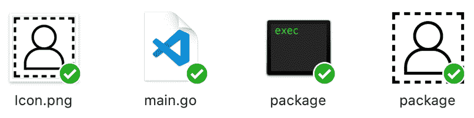
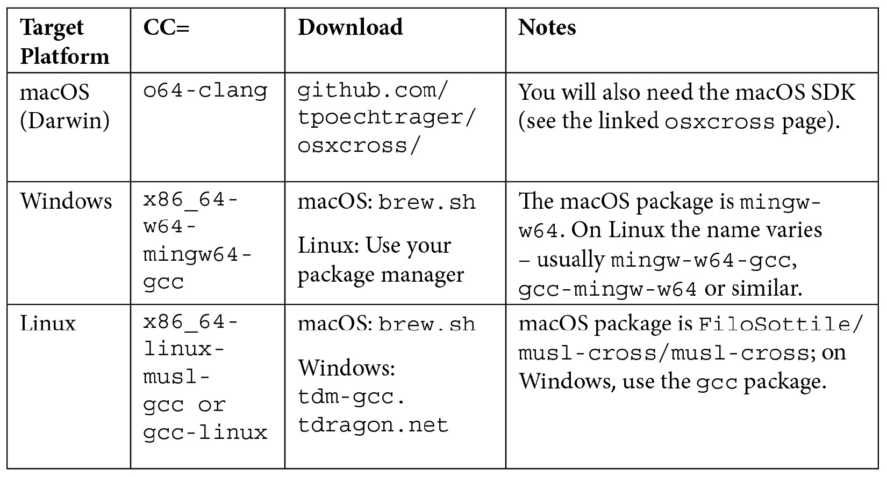
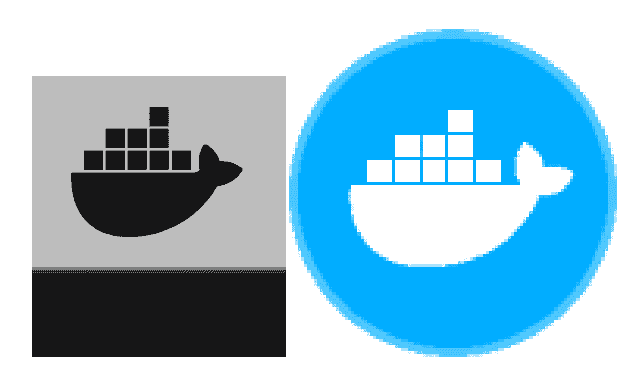

# *第九章*：资源打包和准备发布

Go 应用程序以其构建简单的应用程序二进制文件而闻名，这使得它们易于安装。然而，图形应用程序所需的附加数据可能会使这一过程变得具有挑战性，并导致了复杂的包格式以及安装器的引入。Fyne 提供了一种替代解决方案，允许应用程序在大多数平台上再次以单个文件的形式分发。

完成应用程序的打包需要元数据和额外的构建步骤来准备分发文件。这一步骤允许应用程序与系统原生应用程序一起安装到本地系统或开发设备上，我们将在本章中研究这一点。

我们将逐步介绍应用程序在运行时所需的各个文件。我们将涵盖以下主题：

+   如何在您的应用程序中包含额外的文件

+   检查常见的**用户体验**（**UX**）错误以改进您的 GUI

+   准备分发应用程序

+   在您的计算机或开发移动设备上安装

在本章的结尾，您将在您的计算机和智能手机上安装应用程序进行实际测试。

# 技术要求

本章与*第三章*，*Windows、画布和绘图*的要求相同：需要安装 Fyne 工具包，并且 Go 和 C 编译器正常工作。有关更多信息，请参阅该章节。

对于部署到 Android 设备，您需要安装 Android SDK 和 NDK（请参阅*附录 B*，*移动构建工具的安装*）。要为 iOS 设备构建，您还需要在您的 Macintosh 计算机上安装 Xcode（由于许可原因，需要 Mac）。

本章的完整源代码可以在[`github.com/PacktPublishing/Building-Cross-Platform-GUI-Applications-with-Fyne/tree/master/Chapter09`](https://github.com/PacktPublishing/Building-Cross-Platform-GUI-Applications-with-Fyne/tree/master/Chapter09)找到。

# 资产打包

Go 应用程序设计为从单个二进制文件运行。这意味着它们可以轻松分发，并且不依赖于安装脚本。不幸的是，这种好处给开发者带来了成本——我们不能像网络或移动应用程序开发者那样（以及我们在开发过程中所做的那样）依赖于应用程序中找到的资源。为了确保我们的应用程序符合这种设计，我们必须将任何所需的资产嵌入到应用程序二进制文件中。这包括字体、图像以及任何其他应用程序正常运行所需的静态内容。

Fyne 工具包为使用 Fyne 构建的任何应用程序提供了打包资源的工具。使用此工具的好处是它为每个嵌入的资源生成`fyne.Resource`定义，这使得将嵌入的资产传递到各种 Fyne API 变得容易。实际上，这个打包工具是项目`fyne`命令行工具中的一个命令，本书中的许多示例都使用了这个命令。该命令可以通过单个`go get`命令安装，如下所示：

```go
Chapter09/bundle$ go get fyne.io/fyne/cmd/fyne
```

`bundle`命令简单地将文件系统中的资产转换为 Go 源代码，然后可以将其编译成应用程序。这意味着编译后的应用程序将包含资产，因此当应用程序运行时不需要依赖文件系统中的资产。`bundle`命令是`fyne`可执行文件的一部分，它将嵌入的文件作为其主要参数。它将结果打印到系统输出，因此我们使用控制台重定向（`>`）将生成的 Go 源代码发送到合适的文件，如下面的代码片段所示：

```go
Chapter09/bundle$ ls
data
Chapter09/bundle$ fyne bundle data/demo.svg > bundled.go
Chapter09/bundle$ ls
bundled.go    data
Chapter09/bundle$
```

文件生成后，我们可以使用创建的符号（类型为`*fyne.StaticResource`，实现了`fyne.Resource`接口）来引用它。这可以像任何其他资源一样使用，因此我们可以以下面的方式将其加载为图像：

```go
image := canvas.NewImageFromResource(resourceDemoSvg) 
```

生成的变量名可能不适合您的使用，但可以通过添加额外的命令参数来更改。例如，如果您想导出这个新符号，可以通过添加`-name Demo`参数来指定一个以大写字母开头的简单名称，如下所示：

```go
Chapter09/bundle$ fyne bundle -name Demo data/demo.svg > bundled.go
```

前面的命令管理单个资产的包含，但大多数应用程序需要包含许多资产。让我们看看如何添加多个资源。

## 包含多个资产

在前面的示例中，我们打包了一个包含所有必需头文件的单一文件，以便将打包文件变成一个完整的 Go 源文件。要以这种方式打包多个文件，我们需要为每个资产创建一个新的打包文件。这可能不是最佳选择，因此打包工具包括一个`-append`参数，可以用来向同一个打包文件添加更多资产。

要打包第二个文件，我们使用这个新参数并将控制台重定向符号更改为追加版本（`>>`）。例如，我们可以将`demo2.svg`添加到同一个打包输出中：

```go
Chapter09/bundle$ fyne bundle data/demo.svg > bundled.go
Chapter09/bundle$ fyne bundle -append data/demo2.svg >> bundled.go
```

生成的`bundle.go`文件将包含两个定义，`resourceDemoSvg`和`resourceDemo2Svg`。

以这种方式，您可以嵌入许多资源，但需要为每个资源添加额外的命令，这可能会很耗时且容易出错。相反，我们可以使用单个命令将目录中的所有资产打包在一起。为此，我们只需使用目录路径而不是文件名，使用与第一个打包相同的语法。以下目录打包的结果将生成与之前显示的两个文件命令相同的输出：

```go
Chapter09/bundle$ fyne bundle data > bundled.go
```

如您所见，使用单个命令嵌入大量数据可以非常强大。生成的文件（`bundle.go`）应该添加到您的版本控制中，这样其他开发者就不必运行此命令。

为了支持这一点，当资产位于单独的目录中时，简单的配置效果最好。因此，除了在 *第八章* 中讨论的文件结构，*项目结构和最佳实践*，通常还会在将利用嵌入式资产的代码旁边添加 `data` 目录。

然而，当资产更新时，开发者可能不会记得要使用的命令，因此我们将简要地看看如何自动化这个过程。

## 自动化捆绑命令

Go 编译器有一个有用的 `generate` 子命令，可以用来处理资源，例如我们在这个部分捆绑的资产。为了使用这个工具，我们在我们的源文件之一（而不是生成的文件，因为这个文件将被覆盖）中添加了一个 `//go:generate` 头文件。

在这个简单的示例中，我们添加了一个名为 `main.go` 的新文件，它仅仅是为了包含这个头文件（通常情况下，已经存在一个文件）。在这个文件中，我们在包名之前添加了一行头文件，告诉 Go 如何生成我们的资源。

```go
//go:generate fyne bundle -o bundled.go data
package main
```

你可以看到，我们之前调用命令的方式发生了变化——添加了一个 `-o` 参数，后面跟着我们想要输出的名称。这是引入的，因为在 `generate` 命令中，我们不能使用之前使用的命令行重定向工具。该参数具有相同的效果——它指定了输出应该发送到哪个文件。因此，当我们运行 `go generate` 时，我们会看到与手动捆绑数据目录相同的结果。如下所示：

```go
Chapter09/bundle$ ls
data    main.go
Chapter09/bundle$ go generate
Chapter09/bundle$ ls
bundled.go data    main.go
```

使用前面的工具，我们已经准备了一个没有资产文件的应用程序工作，这使得它更容易分发。在我们开始打包之前，我们还应该检查 Fyne 工具包是否有其他对我们应用程序的建议。

# 检查 UI 提示

由于 Fyne 是基于 **Material Design** 原则构建的，因此可以参考其关于如何使用某些组件的推荐，以及如何组合元素以实现良好的用户体验。

Fyne 工具包中内置了 **提示** 的概念。这些是关于应用程序如何进行更改以提供改进的用户界面的建议。

我们将通过创建一个简单的示例标签容器应用程序来开始探索这些提示可以提供什么。这个代码片段将把两个标签加载到标签容器中（`makeTabs()` 函数）。然后我们包含一个 `main()` 函数，该函数将加载一个新的应用程序，创建一个窗口，并将标签设置为它的内容。然后函数以通常的方式运行我们的应用程序，如下所示：

```go
package main
import (
    "fyne.io/fyne/app"
    "fyne.io/fyne/container"
    "fyne.io/fyne/theme"
    "fyne.io/fyne/widget"
)
func makeTabs() *container.AppTabs {
    return container.NewAppTabs(
        container.NewTabItemWithIcon("Home",theme.HomeIcon(),
            widget.NewLabel("Tab 1")),
        container.NewTabItem("JustText",
            widget.NewLabel("Tab 2")),
    )
}
func main() {
    a := app.New()
    w := a.NewWindow("Tabs hints")
    w.SetContent(makeTabs())
    w.ShowAndRun()
}
```

有了这段代码，我们可以像平常一样运行它。然而，这次我们将传递额外的 `-tags hints` 参数来启用建议：

```go
Chapter09/hints$ go run -tags hints .
```

当运行时，您将看到如图*图 9.1*所示的应用程序：

![Figure 9.1 – The Tabs app looks like it’s working correctly

![img/Figure_9.1_B16820.jpg]

图 9.1 – 标签应用程序看起来运行正确

在应用程序的外观方面，实际上并没有太多惊喜，但如果您检查打印到命令行中的应用程序输出，您将注意到很多我们之前没有看到的内容。您可能会看到以下类似的内容（它可能基于使用的 Fyne 版本而有所不同）：

```go
Chapter09/hints$ go run -tags hints .
2020/10/07 14:06:08 Fyne hint:  Applications should be
 created with a unique ID using app.NewWithID()
2020/10/07 14:06:08   Created at:
 .../Chapter09/hints/main.go:18
2020/10/07 14:06:08 Fyne hint:  TabContainer items should all
 have the same type of content (text, icons or both)
2020/10/07 14:06:08   Created at:
 .../Chapter09/hints/main.go:11
```

如您在前面的输出中看到的，有两行被标记为`Fyne 提示`。这些每一行都是新建议的开始。每个实例之后的行有助于显示提示在代码中的位置（为了清晰起见，路径部分已被删除）。前面的提示告诉我们以下信息：

+   我们的应用程序缺少某些功能正常工作所需的唯一 ID – 如果您阅读了*第六章*，*数据绑定和存储*，您可能已经了解了`appID`。我们将在本章后面的*元数据、图标和应用程序 ID*部分进一步讨论这个问题。

+   我们创建的标签容器混合了多种标签样式；一个有图标，另一个没有。我们可以通过向`JustText`标签添加图标或删除`Home`标签图标来解决这个问题。

如您所见，检查您应用程序的提示可能会有所帮助。通过这样做建议的小改动可以导致用户体验的改善，或者解决尚未遇到的问题。

当我们的应用程序现在准备好打包时，我们需要考虑它在应用名称、图标和其他元数据方面的展示方式。

# 选择元数据、图标和应用程序 ID

在我们开始创建应用程序发布的技术细节之前，有一些先决条件需要考虑。应用程序的名称现在可能已经确定，但您有出色的描述吗？您知道如何以吸引潜在用户注意的方式阐述您软件的关键特性吗？您（或您的设计团队）是否创建了一个令人难忘且能体现其功能的优秀应用程序图标？

如果您不会通过管理渠道分发您的应用程序，例如应用商店或平台包管理器，您应该考虑您的目标受众将如何发现应用程序。关于**搜索引擎优化**（**SEO**）的讨论和信息在网上有很多，关于**应用商店优化**（**ASO**）的内容也在不断增加，所以我们在这里不会详细介绍。在当前的软件环境中，很明显，您应用程序的可发现性和记忆性现在比以往任何时候都更重要。最重要的三个方面是应用程序的图标和描述，以及它在每个商店中使用的唯一标识符。我们将首先探讨应用程序图标的细节。

## 应用程序图标

选择图标可能是准备发布应用程序最重要的单个部分。它需要让人印象深刻，并且能够唤起一些关于软件用途的想法。一个优秀的图标在显示为大或小尺寸时都应该看起来很好，而且通常应该避免使用过多的细节，或者只用于设计的不重要方面。确保你的图标以高分辨率创建；使用矢量格式是可取的（例如，**SVG**），但如果你正在使用位图格式（例如，**PNG**），那么 1024 x 1024 像素是图标在广泛设备上看起来很棒的最小要求。同时，考虑透明度的使用也很重要——根据你希望分发的平台，这可能或可能不被推荐。大多数桌面系统允许使用形状图标，但并非所有都允许半透明区域，iOS 则完全不允许透明度，而 Android 则鼓励使用透明度。

花些时间查看你预期应用程序将在其中使用的每个操作系统或桌面环境中的流行或常见图标。你能否成功地匹配你的图标风格与它们中的每一个？这些系统的用户是否期望特定的形状或风格？可能最好，或者必要的是，为不同的平台创建不同的图形版本。这样做没有问题，并且可以通过在后面章节中学习的构建命令传递不同的图标来实现。

本章后面的打包命令允许指定图标；然而，如果你想为你的应用程序设置一个默认图标，只需将其命名为`Icon.png`或`Icon.svg`。

## 描述你的应用程序

在这个发展阶段，你可能已经开始吸引你的受众并了解他们喜欢软件的哪些方面，以及目标用户是谁。如果没有，那么不要害怕——只需注意，现在是考虑如何让你的描述和支持材料最能吸引新用户的时候。无论是通过网络搜索引擎还是应用市场，你使用的文本对于说服任何人安装你的应用程序至关重要。除了应用程序的名称和其主要功能外，确保你考虑了它如何为你的用户带来好处。你期望他们在寻找你构建的解决方案时尝试完成哪些任务？不用担心让这段文字太长，但尽量包括这些重要观点。

如何具体发布您的应用程序将在*第十章*中进一步讨论，*分发 – 应用商店及其他*，但无论您打算通过在线商店还是简单的网站发布应用程序，在继续发布流程之前，确保您已经完成了元数据是很明智的。我们在这里准备的信息将嵌入我们创建的包中，并且它与本章及以后将使用的分发元数据保持一致性非常重要。用户的信任可能会迅速丧失，例如，如果应用程序图标与预览不匹配，可能会引起担忧。请记住，描述应与名称和图标相匹配，以便用户安装后能快速识别。

## 应用标识符（appID）

正如我们在 *检查 UI 提示* 部分中看到的，每个 Fyne 应用程序在某个时候都需要一个唯一标识符。如果您已经使用了首选项或存储 API，那么这可能已经设置好了；然而，如果您还没有，那么您需要在此时选择 app ID，因为它对于在许多操作系统上打包您的应用程序是必需的。

应用标识符用于唯一识别此软件；除了是全球唯一的，它永远不能改变。意外更改它可能会导致用户丢失数据，也可能意味着不会向现有软件用户发送更新，所以现在选择一个，并确保它保持一致。

选择您独特 ID 的常规方案是使用反向 DNS 表示法。这种格式对与 Java 或 Android 包或苹果的 **统一类型标识符**（**UTI**）工作过的开发者来说很熟悉。该格式基于每个开发者、公司或产品都有一个网站或主页地址，可以用作其工作的命名空间的假设。当应用这种分组时，可以使用附加信息来识别软件组件，使其成为全球唯一标识符。反向 DNS 的 *反向* 部分对于排序和搜索很有用，这就是为什么它在软件组件管理中变得流行。

通用格式如下：

```go
<extension>.<domain name>.<optional categories>.<app name>
```

因此，按照这种格式，一个名为 `myco.com` 的公司，在其 `productivity` 软件类别中发布名为 `tasks` 的产品时，可能会使用以下 app ID：

```go
com.myco.productivity.tasks
```

在初始反向域名之后的字符串内容可以是您选择的任何内容；添加类别或另一个标识符很常见。然而，不建议添加版本号，因为这个字符串必须在其软件生命周期内保持相同，以避免之前描述的一些潜在问题。

如果你没有为你的应用程序创建网站，你可以选择使用它存储的位置。即使你将来移动位置，这也没有关系，因为这只是一个标识符——如果你确实移动了存储库位置，请确保保持它不变。例如，存储在 GitHub 上的用户`dummyUser`的教程应用程序可能采用以下应用程序 ID——请注意，域名中有一个第三元素以保持全球唯一性：

```go
com.github.dummyUser.tutorial
```

现在我们已经整理好元数据，我们可以开始打包我们的应用程序，然后将其安装到我们的测试设备上。

# 打包应用程序（桌面和移动）

要整合前面章节中准备好的元数据，我们需要执行*打包*阶段。这将从标准的 Go 应用程序二进制文件中提取所需数据，并根据操作系统的具体情况进行附加或嵌入。由于每个平台都需要不同的数据格式并产生不同的结果文件结构，我们再次使用`fyne`工具来处理细节。

## 为你的当前计算机打包

要从 Fyne 项目创建包，我们使用`fyne package`命令。默认情况下，这将创建适用于当前操作系统的应用程序包或可执行文件。在 macOS 上运行时，这将创建一个`.app`包；在 Windows 上，它将是一个`.exe`文件（带有附加的元数据）；在 Linux 上，它创建一个`.tar.gz`文件，可以用来安装应用程序。

你也可以使用`-os`参数为不同的系统构建，我们将在本章后面探讨这一点。

在打包之前，确认你的应用程序使用`go build`命令成功构建是一个好主意。当你的应用程序准备就绪时，只需执行`fyne package`命令，它将处理你的应用程序和元数据以创建适合平台的输出。例如，在 macOS 计算机上你会看到以下内容：

```go
Chapter09/package$ ls
Icon.png main.go
Chapter09/package$ go build .
Chapter09/package$ ls
Icon.png main.go  package
Chapter09/package$ fyne package
Chapter09/package$ ls
Icon.png    main.go     package     package.app
```

你可以看到`go build`命令创建了一个常规的二进制文件，而`fyne package`创建了一个应用程序包。在 macOS Finder 中打开时，你可以看到图标是如何应用到输出应用程序包上的：



图 9.2 – macOS 构建的文件图标

如果你在 Linux 计算机上运行相同的命令，你会看到以下内容：

```go
Chapter09/package$ ls
Icon.png main.go
Chapter09/package$ go build .
Chapter09/package$ ls
Icon.png main.go  package
Chapter09/package$ fyne package
Chapter09/package$ ls
Icon.png    main.go     package     package.tar.gz
```

要了解如何安装我们刚刚构建的应用程序，你可以跳转到*安装你的应用程序*部分。然而，如果你想要为移动设备准备构建，请继续阅读，因为我们将接下来进行这一操作。

## 为移动设备打包

由于移动应用程序不能在设备上创建，它们必须从桌面计算机打包，然后安装到移动设备上。我们使用与前面章节相同的工具，并添加`-os`参数指定`ios`或`android`作为目标系统。

由于移动应用程序需要应用 ID 来构建，我们还必须传递与本章前面*应用程序标识符（appID）*部分中讨论的唯一标识符一起的`appID`参数。

在为 iOS 或 Android 设备打包之前，您需要安装 Xcode 或 Android 开发者工具（在*附录 B**，移动构建工具的安装*中更详细地讨论）。

在 macOS 计算机上安装了 Xcode（由于苹果的许可限制），您可以使用以下命令构建 iOS 应用程序：

```go
$ fyne package -os ios -appID com.example.myapp .
```

要构建 Android 应用程序包（`.apk`），请使用以下命令：

```go
$ fyne package -os android -appID com.example.myapp .
```

现在您已经准备好了应用程序包或二进制文件，我们将看到如何在您的桌面和移动设备上简单地安装您的应用程序。

# 安装您的应用程序

如果您只想在计算机或开发设备上安装桌面应用程序，则可以使用有用的`install`子命令。`install`工具有两种模式，首先是在当前计算机上安装，其次是在已设置为开发模式的移动设备上安装。

## 在您当前的计算机上安装

要将您的应用程序安装到您当前的计算机并使其系统范围内可用，您可以简单地执行以下操作：

```go
$ fyne install -icon myapp.png
```

图标文件是将应用程序安装到桌面所需的最小元数据。如果您想避免每次都传递`-icon`参数，只需将文件重命名为`Icon.png`，它将默认使用。一旦应用程序安装完成，您将在计算机的程序列表中看到它，并显示适当的图标。

## 在移动设备上安装

在这个阶段，如果设备已设置为开发模式，我们可以将应用程序安装到移动设备上。

注意

开发配置可能很复杂，并且超出了本书的范围。

您可以在[`help.apple.com/xcode/mac/current/#/dev5a825a1ca`](https://help.apple.com/xcode/mac/current/#/dev5a825a1ca)上阅读有关 iOS 设备的更多信息。

对于 Android 设备，您可以在[`developer.android.com/studio/debug/dev-options`](https://developer.android.com/studio/debug/dev-options)上阅读文档。

使用已启用开发的移动设备，可以通过传递`-os`参数作为`android`或`ios`来使用相同的安装命令进行安装。例如，要将生成的`.apk`文件安装到您的 Android 设备上，请使用以下命令：

```go
$ fyne install -os android -appID com.example.myid -icon myapp.png
```

如您所见，对于移动应用程序安装，我们需要额外的`appID`元数据值。这个值被传递到我们在上一节中探讨的`package`命令中。如果包是最新的，这个值可能不是必需的，但通常出于谨慎考虑最好还是传递它。

因此，你可以看到在当前计算机或连接的移动设备上安装应用程序非常简单。为了实现这一点，Fyne 工具实际上进行了交叉编译（这意味着为不同类型的计算机编译）。现在让我们更详细地了解一下它是如何工作的。

# 轻松交叉编译

能够编译不同于当前计算机的操作系统或架构的能力被称为 **交叉编译**。我们在上一节中看到它被用于从桌面计算机打包和安装移动应用。通过交叉编译，我们还可以从一台计算机为其他类型的桌面构建应用程序，例如使用 Windows 构建 macOS 应用程序。

这可以通过两种方式完成。首先，我们将看到熟悉特定平台编译的开发者如何使用他们的常规工具为多个平台构建。之后，我们将探讨 `fyne-cross` 工具以及它是如何通过使用 Docker 镜像来管理编译而隐藏所有复杂性的。

## 使用已安装的工具链

当采用传统的交叉编译方法时，计算机将需要为开发者想要支持的每个平台和架构添加一个额外的 **工具链**。这提供了编译图形和系统集成代码的能力，通常包括一个 C 编译器和链接器。每个工具链的安装方式取决于当前的操作系统以及目标工具链。各种安装的详细信息可在 *, 交叉编译* 中找到。

在安装了工具链之后，构建过程就像常规的 Go 交叉编译一样，你需要指定 `GOOS` 和 `GOARCH` 环境变量来指定目标操作系统和架构。然而，我们还需要指定 `CGO_ENABLED=1`（以便启用 C 集成）以及一个指定要使用哪个工具链编译器的 `CC` 环境变量。

最常用编译器和要使用的 `CC` 环境变量的简要总结如下（更多信息请参阅 *, 交叉编译*）：



表 9.1 – 各桌面平台下载、备注和 CC 环境

在安装了适当的编译器和库之后，我们可以继续到构建阶段。对于每个目标操作系统，你需要设置正确的环境变量并运行这些步骤。建议先为单个平台构建，然后在更改到下一个配置之前，为每个平台完成包装步骤。这是因为一个平台的发布二进制文件可能会覆盖另一个（例如，当编译时，macOS 和 Linux 的二进制文件具有相同的名称）。

要查看这是如何工作的，我们将在 macOS 计算机上启动一个终端，并编译和打包当前 macOS 系统的应用程序，然后是 Windows 和 Linux。你可以使用任何项目；以下示例使用本章早些时候的打包示例。让我们看看结果如何：

1.  首先，我们检查应用程序是否正在为当前系统正确构建。对于我们的 macOS 主机计算机，这将创建一个 `package.app` 文件，因为我们正在构建的应用程序名为 `package`：

    ```go
    $ ls
    Icon.png main.go
    $ fyne package
    $ ls
    Icon.png    main.go     package     package.app
    ```

    在继续之前，我们应该删除任何临时文件，因为我们只是进行测试，所以也可以删除我们创建的打包应用：

    ```go
    $ rm -r package.app package
    ```

1.  接下来，我们将为 Microsoft Windows 进行构建。如前表所述，这需要使用 Homebrew 或其他包管理器安装 `mingw-w64` 包。安装后，我们可以设置环境变量，包括将 `CC` 设置为指定编译器。命令将如下所示：

    ```go
    package.exe file as well as a .syso temporary file (this is what Windows builds use to bundle metadata – it can normally be ignored). Before packaging for Linux, we will remove these files:

    ```

    删除 `package.exe` 和 `fyne.syso`

    ```go

    ```

1.  从 macOS 准备 Linux 构建需要更多的工作。首先，你需要安装编译器工具链，这是 Homebrew 中的 `FiloSottile/musl-cross/musl-cross` 包。安装此包后，你需要找到并安装适合 Linux 开发的合适的 X11 和 OpenGL 包（这里的详细信息将根据你构建的 Linux 计算机而变化；更详细的信息可以在 *, 交叉编译* 中找到）。一旦所有这些都安装好了，你就可以像之前使用 Windows 命令一样执行 Linux 构建，但使用适当的 `CC` 变量：

    ```go
    $ GOOS=linux CC=x86_64-linux-musl-gcc CGO_ENABLED=1 fyne package
    $ ls
    Icon.png    main.go     package     package.tar.gz
    ```

因此，你可以看到，从单个开发计算机构建所有不同的平台是可能的。

然而，这涉及到大量的包安装和配置。为了避免这种复杂性，有一个有用的工具，`fyne-cross`，它打包了所需的文件以简化交叉编译。

对于前面的每个构建，如果我们想针对例如 32 位计算机进行构建，同时在我们 64 位桌面上构建，我们也可以指定一个 `GOARCH` 变量。同样，指定 ARM 架构允许我们为树莓派计算机编译。

注意，iOS 和 Android 目标不使用传统的工具链

为移动目标构建的能力由特定平台的发展包提供（例如，Xcode 或 Android SDK）。这意味着你可以避免手动编译器配置，但需要使用 `fyne` 包而不是传统的 `go build` 过程。

## 使用 `fyne-cross` 工具

`fyne-cross` 工具是为了为 Fyne 工具包提供一个简单的交叉编译方法而创建的。它利用 Docker 容器来打包所有构建工具，这样开发者就不必手动安装它们，就像我们在上一节中所做的那样。你可以在[`github.com/fyne-io/fyne-cross`](https://github.com/fyne-io/fyne-cross)上了解更多关于这个项目的信息。

使用 `fyne-cross`，您可以在命令行上简单地指定您想要构建的平台，该工具将设置开发环境并按请求构建包。`platform` 参数类似于我们之前使用的 `-os` 参数。

要能够安装和使用此工具，我们需要的只是我们现有的 Go 编译器和 `fyne-cross` 的安装。

在此示例中，我们有一个 macOS 计算机为 Linux 构建应用程序（这是前一个章节中复杂的配置）：

1.  首先，我们必须安装 Docker。最简单的方法是下载并从他们的网站运行桌面安装程序，网址为 [`docs.docker.com/get-started/`](https://docs.docker.com/get-started/)。不幸的是，这不支持 Linux，因此您需要使用您的包管理器安装 Docker 引擎（通常在名为 `docker` 的软件包中）。

1.  要运行 `fyne-cross`，Docker 应用必须正在运行。如果您使用 Docker Desktop，您应该在系统托盘中看到图标（见 *Figure 9.3* 中的左侧图标）。如果它没有运行，只需使用其启动图标（*Figure 9.3* 中的右侧图标）打开应用程序即可：

    

    Figure 9.3 – The Docker running symbol and app icon

    如果在 Linux 上运行，请确保根据您特定发行版的文档启动服务。

1.  要安装 `fyne-cross` 工具，我们使用 `go get` 命令的版本，它将把它与其他基于 Go 的应用程序一起安装到 `~/go/bin/` 目录中：

    ```go
    $ go get github.com/fyne-io/fyne-cross
    ```

1.  接下来，我们发出运行 `fyne-cross` 的命令。基本构建需要一个参数，即我们想要为哪个操作系统构建，因此对于 Linux，我们只需调用以下命令：

    ```go
    $ fyne-cross linux
    [i] Target: linux/amd64
    [i] Cleaning target directories...
    [√] "bin" dir cleaned: /.../Chapter09/package/fyne-cross/bin/linux-amd64
    [√] "dist" dir cleaned: /.../Chapter09/package/fyne-cross/dist/linux-amd64
    [√] "temp" dir cleaned: /.../Chapter09/package/fyne-cross/tmp/linux-amd64
    [i] Checking for go.mod: /.../Chapter09/package/go.mod
    [i] go.mod not found, creating a temporary one...
    Unable to find image 'fyneio/fyne-cross:base-latest' locally
    base-latest: Pulling from fyneio/fyne-cross 
    (downloads lots of stuff)
    [√] Binary: /.../Chapter09/package/fyne-cross/bin/linux-amd64/package
    [i] Packaging app...
    [√] Package: /.../Chapter09/package/fyne-cross/dist/linux-amd64/package.tar.gz
    ```

1.  一旦完成（第一次运行将花费一些时间，因为需要下载 Docker 镜像），我们应该看到为我们创建了预期的包：

    ```go
    $ ls fyne-cross/dist/linux-amd64
    package.tar.gz
    ```

如您所见，`fyne-cross` 工具能够为其他难以编译的系统创建应用程序包。

对支持列表（在撰写本文时）中的任何操作系统和平台进行的构建包括以下内容：

+   `darwin/amd64`

+   `darwin/386`

+   `freebsd/amd64`

+   `linux/amd64`

+   `linux/386`

+   `linux/arm`

+   `linux/arm64`

+   `windows/amd64`

+   `windows/386`

+   `android`

+   `ios`

    注意

    iOS 编译仅在 macOS 计算机上受支持。您需要从 Apple App Store 下载并安装 Xcode。这是 Apple 许可证的限制，不幸的是无法绕过。

如果您能够安装 Docker，这可能是为不同计算机构建的更简单方法。

# 摘要

在本章中，我们看到了将应用程序从源代码运行到打包文件准备分发所涉及的步骤。我们看到了可用的技术和工具，可以帮助使应用程序可移植，以及 Fyne 工具包如何提供改进 UX 的提示。

我们还探索了交叉编译的世界以及如何为不同的操作系统创建应用程序包。正如本章所示，您可以将您的开发计算机设置为构建所有受支持的平台；然而，我们发现这可能会很复杂。`fyne-cross`工具被引入作为一种解决这种复杂性并使为众多潜在目标系统打包构建变得简单的方法。

在下一章中，我们将探讨如何分发这些文件。我们将探讨您如何与测试人员共享打包文件，以及如何准备适用于应用商店和市场上传所需的认证包。
