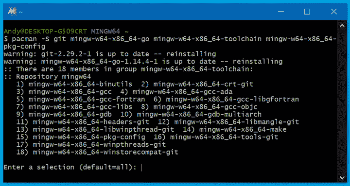

# *附录 A*：开发者工具安装

在准备运行本书中的代码示例之前，您需要安装 **Go** 编译器和 **C** 编译器（以支持 **CGo**）。如果您还没有设置这些，本附录将指导您完成安装。

# 在 Apple macOS 上安装

许多开发者工具（包括 **Git**）作为 **Xcode** 包的一部分安装。如果您还没有为其他开发工作安装 Xcode，您可以从 **Mac App Store** 免费下载它，网址为 [apps.apple.com/app/xcode/id497799835](http://apps.apple.com/app/xcode/id497799835)。

安装完成后，您还应该设置命令行工具。为此，转到 Xcode 菜单 | `xcode-select`。如果工具已经安装，这将正常执行。如果没有，您将提示运行安装，如下面的截图所示：


图 11.1 – 当未安装开发者工具时的安装对话框

除了这些工具之外，您还需要安装 Go。您可以从 [golang.org/dl](http://golang.org/dl) 下载下载包。从那里，点击特色下载链接以获取 Apple macOS，然后运行下载的安装程序包。您可能需要关闭任何打开的 **Terminal** 窗口以更新环境变量。

# 在 Microsoft Windows 上安装

配置 Windows 的开发环境可能很复杂，因为默认情况下安装的工具不多。因此，有多个设置选项，包括使用外部工具和包（如 **MSYS2**、**MinGW** 和 **Windows Subsystem for Linux**）。然而，探索这些内容超出了本书的范围。

以下步骤展示了如何使用 MSYS2 开始运行，它提供了一个为 Fyne 开发设置的专用命令行应用程序。让我们开始吧：

1.  您需要从 [www.msys2.org](http://www.msys2.org) 下载安装程序。您应该根据您的计算机架构选择 32 位（`i686`）或 64 位（`x86_64`）版本。

1.  下载完成后，运行安装程序，它将在您的计算机上下载基本包，包括包管理器（`pacman`）。

1.  安装完成后，您将有机会启动 **MSYS Command Prompt** – **请勿接受此选项**，因为这不是我们想要运行的版本。

1.  完成后，打开您选择安装应用程序的目录，并运行 `mingw64.exe` 应用程序。这是预先配置了 Windows 编译知识的命令行。现在我们可以使用包管理器来安装 Go 和 Git，以及 C 编译器工具链和 `pkg-config`（CGo 用于查找包）：

    ```go
    $ pacman -S git mingw-w64-x86_64-go mingw-w64-x86_64-toolchain mingw-w64-x86_64-pkg-config
    ```

    此前述命令将提供安装许多软件包的选项，这正是我们想要的。只需按*回车*或*Enter*键即可安装这些依赖项：



图 11.2 – 运行已安装的 Mingw64 终端以安装额外软件包

注意，前面的终端提示表示**MINGW64**。如果您看到**MSYS2**或其他提示，那么您打开了错误的终端应用程序。

一旦安装了这些软件包，您将拥有完整的开发环境。默认的 Go 主目录路径将是`C:/Users/<username>/go`，尽管您应该考虑将`C:/Users/<username>/go/bin`添加到您的`%PATH%`环境变量中。

在 Linux 上安装

在 Linux 上设置先决软件应仅需要安装适合您发行版的正确软件包。`git`软件包将提供源代码控制工具，而 Go 语言应包含在`go`或`golang`软件包中。此外，CGo 需求意味着`gcc`软件包也必须存在。安装这些软件包将为运行本书中的示例提供必要的命令。您可能需要将`~/go/bin`添加到您的`PATH`环境变量中，以便能够运行 Go 安装的工具。

Linux 有各种不同的包管理器，每个包管理器对软件包的命名约定略有不同，以及不同的命令。以下命令是安装每个最受欢迎的发行版所需软件包的示例。某些平台需要安装额外的库头文件或依赖项，这些依赖项在需要时已包含在内：

+   **Arch Linux**: **sudo pacman -S go gcc xorg-server-devel**

+   **Fedora**: **sudo dnf install golang gcc libXcursor-devel libXrandr-devel mesa-libGL-devel libXi-devel libXinerama-devel libXxf86vm-devel**

+   **Solus**: **sudo eopkg it -c system.devel golang mesalib-devel libxrandr-devel libxcursor-devel libxi-devel libxinerama-devel**

+   **Ubuntu / Debian**: **sudo apt-get install golang gcc libgl1-mesa-dev xorg-dev**

+   **Void Linux**: **sudo xbps-install -S go base-devel xorg-server-devel libXrandr-devel libXcursor-devel libXinerama-devel**

使用上述命令后，您将在计算机上准备好完整的 Fyne 开发环境。
