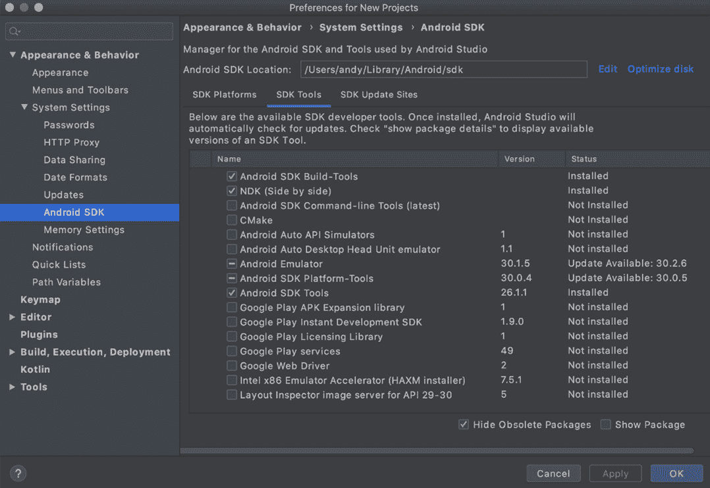

# *附录 B*：安装移动构建工具

由于移动应用程序的编译方式，它们在测试或安装到设备上时需要额外的工具和包。在本附录中，我们将学习如何设置 **iOS** 和 **Android** 开发的附加组件。

# 准备 Android

要为 Android 开发应用程序，我们需要额外的开发工具。开发过程与本书早期章节中看到的过程相同，您的应用程序同样可以使用相同的 Fyne API – 只是构建/打包阶段有所不同。以下是我们需要遵循的必要步骤：

1.  首先，您需要安装 Android SDK。最简单的方法是安装**Android Studio**，它可在[developer.android.com/studio](http://developer.android.com/studio)找到。点击该网站上的**下载**按钮，并按照您电脑类型的安装说明进行操作。

1.  安装完成后，您还需要安装 `sdkmanager` 应用程序。

1.  加载完成后，选择 **SDK Tools** 以查看可用的完整工具列表。在这里，您需要检查**NDK**选项（有时称为**并行**）和**Android SDK Tools**，如果它们未被选中。点击**应用**按钮，包将被安装，如下所示：

    ](img/Figure_12.1_B16820.jpg)

    图 12.1 – Android SDK 管理器（显示已安装必要的 SDK 工具和 NDK）

1.  一旦设置完成，您应该能够使用以下命令之类的命令为您的 Android 手机或平板电脑构建任何 Fyne 应用程序：

    ```go
    .apk file that can be installed using the Android tools available to you, the adb install command, or the fyne install command.
    ```

也可以使用 `fyne-cross` 进行 Android 打包，如*附录 C**：交叉编译*所示。

# 准备 iOS 和 iPadOS

为 **Apple** 移动设备构建应用程序与在 macOS（桌面计算机）上编译应用程序略有不同。首先，由于许可限制，这必须在 Apple Macintosh 计算机上完成（**iMac**、**MacBook Pro**等）。

其次，您必须安装 Xcode 工具（对于桌面应用程序创建来说这有些可选）。最后，如果您想在物理设备上进行测试或将应用程序分发到商店，您需要注册 **Apple 开发者计划**，这需要每年支付一定的费用。

Xcode 的安装描述在*附录 A**：开发者工具安装*中的 *Apple macOS* 部分。如果您之前已经进行过 iOS 开发，那么这些设置可能已经完成。

接下来，你需要拥有一个苹果开发者账户。如果你还没有注册，你可以在 [developer.apple.com/programs/enroll/](http://developer.apple.com/programs/enroll/) 上注册。这需要支付年费，如果你发布了应用程序但未能续订会员资格，它们将被从商店中移除。一旦注册，你应该遵循文档来设置**开发者证书**并将你的设备添加到账户设备列表中，以便你可以使用它们进行测试。一旦添加，你需要创建一个**配置文件**——一个通用的通配符配置文件就足够用于一般开发。

一旦完成这些步骤，你应该能够使用以下命令为你的苹果手机或平板电脑构建任何 Fyne 应用程序：

```go
$ fyne package -os ios -appID com.example.myapp
```

成功执行前面的命令将创建一个可以安装到你的设备上进行测试的 `.ipa` 文件。这个过程在*第九章*，*打包资源和准备发布*中有更详细的说明。
