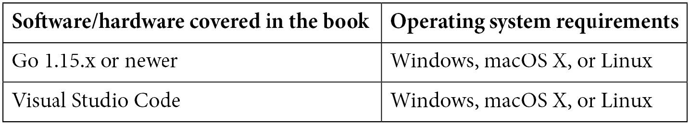

# 前言

如果 JavaScript 或 C#可以在微控制器上运行，那么 Go 可以做得更好。虽然标准 Go 会产生巨大的二进制文件，但 TinyGo 产生的二进制文件可以适应最小的设备。为什么你应该选择 Go 进行微控制器和**Wasm**（即**WebAssembly**）编程？我最喜欢的理由是 Go 易于学习、易于阅读和易于编写。此外，Go 附带了一个功能强大的标准库，它松散耦合且具有强大的并发能力。

如果你喜欢 Go 这门语言，那么这本书适合你。完成这本书后，你将拥有构建你梦想中的所有微控制器项目所需的所有工具和知识。此外，作为额外的福利，你将能够使用 Wasm 构建仪表板和家庭控制应用，用于你的家庭自动化项目。所有这些都可以使用 TinyGo 实现。

如果你之前从未使用过微控制器，这里有几个你尝试它的理由：

+   如果你已经是一名程序员，看到代码影响现实世界的设备是一件很酷的事情。完成一个项目并最终看到电机转动、LED 闪烁、蜂鸣器响起等，这种感觉真的很棒。

+   随着你熟悉不同的总线系统、协议、硬件接口等，你将不断学习新事物，并更深入地理解计算机的一般工作原理。

+   当你玩微控制器时，可能性几乎是无限的。你不受市场上可用产品的限制，因为你完全可以自己构建一切。

+   你可以学习如何编写小型、高效的程序来告诉微控制器你想要它做什么。这也有助于你成为更优秀的开发者。

+   你可以参与酷炫的项目，并与志同道合的伟大社区取得联系。

# 这本书适合谁阅读

如果你是一名想要编程低功耗设备（如 Arduino UNO 和 Arduino Nano IoT 33）或硬件的 Go 开发者，或者如果你是一名想要在浏览器中用 Go 编程的同时扩展你对使用 WebAssembly 的知识点的 Go 开发者，那么这本书适合你。对通过 DIY 项目学习 TinyGo 感兴趣的 Go 爱好者程序员也会发现这本实用指南很有用。

# 这本书涵盖了什么内容

*第一章*，*开始使用 TinyGo*，将教你如何设置 TinyGo 并编译你的第一个程序！

*第二章*，*构建交通灯控制系统*，将教你构建一个包含行人信号灯和按钮的交通灯控制系统；你将学习如何在 TinyGo 中使用 Goroutines。

*第三章*，*使用键盘构建安全锁*，探讨了如何利用 4x4 键盘和伺服电机构建一个在输入正确密码时打开的锁。

*第四章*，*构建植物浇水系统*，解释了如何使用不同类型的传感器构建自动植物浇水系统，这样您就不再需要手动浇水植物了！

*第五章*，*构建无接触式洗手计时器*，探讨了使用四位七段显示器和超声波距离传感器来识别附近物体的移动，以启动一个计时器，告诉我们洗手是否足够长时间。

*第六章*，*使用 I2C 和 SPI 接口构建用于通信的显示器*，通过让您使用使用 I2C 和 SPI 总线的显示器来解释**集成电路间**（**I2C**）和**串行外围接口**（**SPI**）的概念。到本章结束时，您将了解如何在 TinyGo 中使用不同类型的显示器。

*第七章*，*在 TinyGo Wasm 仪表板上显示天气警报*，您将构建并托管一个 Wasm 应用程序，该应用程序显示从通过 Wi-Fi 发送的 Arduino Nano 33 IoT 传感器数据。

*第八章*，*通过 TinyGo Wasm 仪表板自动化和监控您的家庭*，解释了如何使用 Wasm 仪表板控制和监控您家中的设备。

*第九章*，*附录–"Go"向前进*，涵盖了之前章节中没有涉及的一些概念。

# 要充分利用本书

所有代码示例都已使用 Go 1.16.2 在 Ubuntu 上测试，但它们也将与 Go 的未来版本和其他操作系统兼容。本书中一直使用 Visual Studio Code 作为编辑器，但也可以使用任何其他编辑器。



**如果您使用的是本书的数字版，我们建议您亲自输入代码或通过 GitHub 仓库（下一节中提供链接）访问代码。这样做将帮助您避免与代码复制和粘贴相关的任何潜在错误。**

我很乐意在社交媒体上看到您阅读本书后构建的项目。请自由地使用以下标签在 Twitter 上标记我：`@Nooby_Games`。

# 下载示例代码文件

您可以从 GitHub 下载本书的示例代码文件，网址为[`github.com/PacktPublishing/Creative-DIY-Microcontroller-Projects-with-TinyGo-and-WebAssembly`](https://github.com/PacktPublishing/Creative-DIY-Microcontroller-Projects-with-TinyGo-and-WebAssembly)。如果代码有更新，它将在现有的 GitHub 仓库中更新。

我们还有其他来自我们丰富的图书和视频目录的代码包，可在[`github.com/PacktPublishing/`](https://github.com/PacktPublishing/)找到。去看看吧！

# 代码在行动

本书的相关操作视频可以在[`bit.ly/3cYZOh4`](https://bit.ly/3cYZOh4)查看。

# 下载彩色图像

我们还提供了一份包含本书中使用的截图/图表彩色图像的 PDF 文件。您可以从这里下载：[`static.packt-cdn.com/downloads/9781800560208_ColorImages.pdf`](https://static.packt-cdn.com/downloads/9781800560208_ColorImages.pdf) (_ColorImages.pdf_)。

# 使用的约定

本书中使用了多种文本约定。

`文本中的代码`: 表示文本中的代码单词、数据库表名、文件夹名、文件名、文件扩展名、路径名、虚拟 URL、用户输入和 Twitter 昵称。以下是一个示例：“当我们收到命令的开始时，我们将所有后续字符追加到`commandBuffer`。”

代码块设置如下：

```go
data, err := uart.ReadByte()
if err != nil {
      println(err.Error())
}
```

当我们希望您注意代码块中的特定部分时，相关的行或项目会设置为粗体：

```go
func main() {
      blocker := make(chan bool, 1)
     <-blocker
     println("this gets never printed")
}
```

任何命令行输入或输出都按照以下方式编写：

```go
tinygo flash –target=arduino-nano33 Chapter06/tinygame/main.go
```

**粗体**: 表示新术语、重要单词或屏幕上看到的单词。例如，菜单或对话框中的单词在文本中显示如下。以下是一个示例：“值相当稳定，为**37888**。”

小贴士或重要提示

看起来像这样。

# 联系我们

我们欢迎读者的反馈。

**一般反馈**: 如果您对本书的任何方面有疑问，请在邮件主题中提及书名，并通过 mailto:customercare@packtpub.com 与我们联系。

**勘误**: 尽管我们已经尽一切努力确保内容的准确性，但错误仍然可能发生。如果您在这本书中发现了错误，我们将不胜感激，如果您能向我们报告这一点。请访问[www.packtpub.com/support/errata](http://www.packtpub.com/support/errata)，选择您的书籍，点击勘误提交表单链接，并输入详细信息。

**盗版**: 如果您在互联网上以任何形式遇到我们作品的非法副本，如果您能提供位置地址或网站名称，我们将不胜感激。请通过 mailto:copyright@packt.com 与我们联系，并提供材料的链接。

**如果您有兴趣成为作者**: 如果您在某个主题上具有专业知识，并且您有兴趣撰写或为书籍做出贡献，请访问[authors.packtpub.com](http://authors.packtpub.com)。

# 评论

请留下评论。一旦您阅读并使用了这本书，为什么不在您购买它的网站上留下评论呢？潜在读者可以查看并使用您的客观意见来做出购买决定，Packt 可以了解您对我们产品的看法，我们的作者可以查看他们对书籍的反馈。谢谢！

如需了解更多关于 Packt 的信息，请访问[packt.com](http://packt.com)。
