# *第一章*：TinyGo 入门

在我看来，Go 语言易于学习、易于阅读、易于编写。该语言没有过多的花哨特性，而是注重简洁。内置的并发性、快速的编译时间、高执行性能和丰富的标准库使它成为一款出色的语言。这就是为什么我想带您从非常基础的高级 Go 程序开始，深入到利用 TinyGo 全部功能的微控制器。

在本章中，我们将设置 TinyGo，并学习如何在 VS Code 和其他编辑器中实现代码补全。完成这些后，我们将查看 Arduino UNO 及其技术规格。我们将比较 TinyGo 与 Go，并讨论 TinyGo 相较于其他微控制器语言的特殊之处。在本章结束时，我们将编写、编译、部署和运行我们的第一个 TinyGo 程序在真实的微控制器上。涵盖所有这些主题后，您将学会如何在微控制器上编写、构建和运行程序。

在本章中，我们将涵盖以下主要内容：

+   理解 TinyGo 是什么

+   设置 TinyGo

+   理解 IDE 集成

+   Arduino UNO

+   查看事物的 Hello World

# 技术要求

为了继续，您需要具备以下条件：

+   必须安装 Go

+   必须设置 GOPATH

+   必须安装 Git

+   Arduino Uno，最好是 Rev3 版本，但您也可以使用其他 Arduino Uno 板

您可以在此 GitHub 仓库中找到本章的所有代码示例：[`github.com/PacktPublishing/Creative-DIY-Microcontroller-Projects-with-TinyGo-and-WebAssembly/tree/master/Chapter01`](https://github.com/PacktPublishing/Creative-DIY-Microcontroller-Projects-with-TinyGo-and-WebAssembly/tree/master/Chapter01)

本章的“代码在行动”视频可以在此处找到：[`bit.ly/3mLFCCJ`](https://bit.ly/3mLFCCJ)

# 理解 TinyGo 是什么

TinyGo 是一个独立编写的*编译器*，拥有其*自己的运行时实现*。它旨在用于微控制器编程、**WebAssembly**（**WASM**）和 CLI 工具。TinyGo 大量使用 LLVM 基础设施来优化和编译代码，使其成为微控制器可以理解的二进制文件。

TinyGo 的第一个版本（v0.1）于 2019 年 2 月 1 日在 GitHub 上发布。从那时起，该项目迅速实现了许多功能，并且从未停止为更多微控制器、传感器、显示屏和其他设备添加支持。

2020 年 2 月 2 日，TinyGo 宣布它现在正式成为谷歌赞助的项目。这对整个项目来说是一个巨大的进步。

## TinyGo 的工作原理

TinyGo 编译器与其他语言相比，在将 Go 源代码转换为机器代码时使用不同的步骤。虽然我们不会深入细节，但让我们看一下编译器管道的概述：

1.  我们编写 Go 源代码。

1.  此源代码被转换为 Go **SSA**（**静态单赋值**）。

1.  TinyGo 编译器包将 Go SSA 转换为 LLVM IR。

1.  LLVRM IR 中的初始化代码由 TinyGo 的 `interp` 包解释。这一步优化了全局变量、常量等。

1.  结果随后通过一些 LLVM 优化过程（如 `string` 到 `[]byte` 优化）进行优化。

1.  结果随后再次由 LLVM 优化器优化。

1.  然后，编译器包进行了一些修正。

1.  最后一步，LLVM 创建机器代码。

如果现在听起来很复杂，请不要担心——我们不需要关心这个过程。TinyGo 会为我们完成所有这些。现在让我们看看与 Go 相比，TinyGo 有哪些特殊之处。

## 将 TinyGo 与 Go 比较

TinyGo 可以编译一些 Go 程序，但不是全部。让我们看看一个可以被两者编译的例子。让我们用 Go 编写一个简单的 Hello World 程序——构建它并检查其大小：

1.  这是我目前能想到的最简单的 Hello World 程序：

    ```go
    package main
    func main() {
        print("Hello World\n")
    }
    ```

    它不需要像 `fmt` 这样的外部包来打印行。

1.  我将在 Ubuntu 20.01 操作系统上使用 Go 1.15.2。要检查您当前安装的 Go 版本，请使用 `go version` 命令：

    ```go
    $ go version
    go version go1.15.2 linux/amd64
    ```

1.  我们使用 `go build` 命令构建程序：

    ```go
    $ go build ./ch1/hello-world/
    ```

1.  现在我们使用 `ls –l` 命令来检查大小：

    ```go
    $ ls -l
    -rwxrwxr-x 1 tobias tobias 1231780 Okt  4 19:31 hello-world
    ```

因此，程序有 1,231,780 字节，即 1.23178 兆字节。对于一个只有 4 行代码的程序来说，这相当大。

注意

`ls` 命令并非在所有操作系统上都有。如果您想自己检查大小，您需要使用您操作系统上可用的工具。

二进制文件的大小在您尝试时可能会有所不同，因为 Go 团队继续优化编译器。

此外，为其他操作系统构建时，二进制文件的大小也可能不同。

现在让我们检查相同程序的大小，但这次使用 TinyGo 编译。由于 TinyGo 不支持为 Windows 构建二进制文件，我负责编译，所以我们只需比较大小即可：

1.  我使用以下命令构建二进制文件：

    ```go
    tinygo build command has a syntax that is similar to the Go build command. 
    ```

1.  然后，我使用 `ls –l` 命令检查了大小，就像我们之前做的那样：

    ```go
    $ ls -l
    -rwxrwxr-x 1 tobias tobias 1231780 Okt  4 19:31 hello-world
    -rwxrwxr-x 1 tobias tobias   21152 Okt  4 19:39 hello-world-tiny
    ```

我们看到，我们的 Hello World 程序的 TinyGo 版本大小仅为 Go 编译器生成的尺寸的一小部分。TinyGo 版本仅为 21,152 字节，大约是 0.021152 兆字节。与 Go 程序相比，TinyGo 程序小了 58 倍。这是一个巨大的差异。如果您仍然想亲自测试，您可以在设置 TinyGo 后进行。

我们现在已经了解到 TinyGo 可以编译一些 Go 程序，但不能编译所有。我们还了解到，用 TinyGo 编译的程序非常小。在下一节中，我们将了解为什么 TinyGo 不能编译所有 Go 程序，以及 TinyGo 提供了哪些 Go 没有的特性。

### 支持的语言特性

TinyGo 支持 Go 语言的一部分特性，但并不是所有特性都支持。Goroutines 和 channels 在大多数微控制器上工作。对于大多数类型，反射是支持的。虽然切片是支持的，但在处理映射时可能会遇到一些问题。只有某些类型的字符串、整数、指针以及包含前述类型的结构体或数组是支持的。所以，总的来说，TinyGo 支持了 Go 语言的大部分特性。

### 支持的标准包

标准库的大部分内容也在 TinyGo 中得到支持。然而，截至编写本文时，`net`和`crypto`包的大部分内容仍然无法编译。这意味着，如果你导入它们，你会得到编译错误。

你可以在这里查找当前支持的标准化包列表：[`tinygo.org/lang-support/stdlib/`](https://tinygo.org/lang-support/stdlib/)。

注意

支持表中的一项“是”并不意味着一个包中的每个函数在 TinyGo 中实际上都是可用的。一些函数仍然可能引起编译错误。

### 易失性操作

易失性操作可以用来读写内存映射寄存器。这些寄存器中的值在多次读取之间可能会改变，而编译器并不知道这一点。编译器对这些操作的效果一无所知，因此它们被称为易失性。

Go 没有易失性运算符，这就是为什么 TinyGo 提供了一个**易失性包**。在大多数情况下，我们不需要易失性操作，因为这些操作被机器包抽象掉了。

### 内联汇编

**汇编语言**（**ASM**）是一种专门为特定处理器架构设计的语言。这是因为汇编依赖于机器代码指令集。TinyGo 的设备特定包提供了汇编包。

这使得我们能够在 Go 程序中使用内联汇编代码，这在标准 Go 中是不可能的。

### 堆内存分配

**堆**是内存中动态分配和释放发生的地方。因此，当我们的应用程序想要保留内存的一部分时，它会与堆进行通信以保留内存。这部分内存将被标记为正在使用。由于微控制器上的空间相当有限，垃圾回收既昂贵又慢，TinyGo 试图优化堆内存分配。结果是，通常，对象可以被静态分配而不是动态分配。

### 垃圾回收

垃圾回收是释放内存的过程。因此，当你的应用程序不再需要之前请求的内存部分时，这部分内存会被标记为未使用（空闲）。

为了这个目的，TinyGo 实现了自己的垃圾回收变体。TinyGo 使用保守的标记/清除垃圾回收，这里的保守意味着垃圾回收器（**GC**）不知道什么是指针，什么不是指针。GC 过程分为两个部分：

+   **Mark**：在标记阶段，gc 将对象标记为可达。

+   **Sweep**：在清扫阶段，gc 通过将不可达对象的区域标记为空闲来释放内存。这些释放的区域可以随后被重新用于分配新对象。

我们现在已经知道了 TinyGo 是什么，以及 TinyGo 和 Go 之间存在的差异。我们还学习了 Heap、GC 和 volatile 包是什么。下一步的逻辑步骤是继续设置 TinyGo，我们将在下一节中完成。

# 设置 TinyGo

在以下链接中，您可以按照 Linux、macOS、Windows 和 Docker 的快速入门指南安装 TinyGo 及其所有依赖项：[`tinygo.org/getting-started/`](https://tinygo.org/getting-started/)。

由于这些指南涵盖了重要部分，我将仅涵盖基于 x64 架构的快速入门部分，并且仅针对基于 Debian 的操作系统的 Linux，如 Ubuntu。

在开始设置之前，我们首先要检查 TinyGo 的最新版本。为此，请访问[`github.com/tinygo-org/tinygo/releases`](https://github.com/tinygo-org/tinygo/releases)并检查最新发布版本。现在，请将此信息记录下来或记住它，因为我们稍后会用到。

## 在 Linux 上安装

以下步骤涵盖了在基于 Debian 的 Linux 发行版上安装 TinyGo：

1.  我们使用以下命令从 GitHub 下载`deb`包，并使用`dpkg`进行安装：

    ```go
    wget https://github.com/tinygo-org/tinygo/releases/download/v0.15.0/tinygo_0.15.0_amd64.deb
    sudo dpkg -i tinygo_0.15.0_amd64.deb
    ```

    您可以将路径和文件名中的版本与您之前找到的最新发布版本进行交换。

1.  现在我们必须将 TinyGo 添加到`GOPATH`中。您可以使用以下命令：

    ```go
    GOPATH by editing your .profile or .netrc file.
    ```

1.  下一步是验证安装。使用`tinygo version`命令验证 TinyGo 是否已成功安装：

    ```go
    $ tinygo version
    tinygo version 0.15.0 linux/amd64 (using go version go1.15.2 and LLVM version 10.0.1)
    ```

1.  AVR 依赖项：由于我们将在前几章中使用 Arduino UNO，我们需要安装一些额外的依赖项。我们通过以下命令来完成：

    ```go
    sudo apt-get install gcc-avr
    sudo apt-get install avr-libc
    sudo apt-get install avrdude
    ```

安装这些依赖项后，我们现在可以在基于 AVR 的板卡上编译，例如 Arduino UNO。

如果您使用 Fedora、Arch Linux 或其他发行版，请遵循以下安装指南：[`tinygo.org/getting-started/linux/`](https://tinygo.org/getting-started/linux/)。

## 在 Windows 上安装

在本节中，我们将学习如何在 Windows 上安装 TinyGo。在本节之后，我们还将学习如何安装依赖项，这些依赖项是烧录 Arduino UNO 所必需的。

非常重要的注意事项

您无法使用 TinyGo 创建 Windows 二进制程序。您仍然可以编译和烧录针对微控制器和 WebAssembly 目标的程序。

您可能希望直接在**Windows Subsystem for Linux**（**WSL**）中安装并使用 TinyGo。WSL 是我推荐给 Windows 用户的方案。

要在不使用 WSL 的情况下在 Windows 上安装 TinyGo，我推荐使用 Scoop，这是一个 Windows 的命令行安装程序。请确保您已安装 PowerShell 5（或更高版本）和.NET Framework 4.5（或更高版本）。为此，请按照以下步骤操作：

1.  使用以下命令为您的当前用户账户启用 PowerShell：

    ```go
    Set-ExecutionPolicy RemoteSigned -scope CurrentUser
    ```

1.  现在运行以下命令以下载 Scoop：

    ```go
    iwr -useb get.scoop.sh | iex
    ```

1.  您可以使用以下命令安装 TinyGo：

    ```go
    scoop install tinygo
    ```

1.  现在要验证安装是否成功，请使用以下命令：

    ```go
    tinygo version
    ```

    输出应该看起来像以下这样：

    ```go
    tinygo version 0.15.0 windows/amd64 (using go version go1.15.3 and LLVM version 10.0.1)
    ```

    实际的 TinyGo 和 Go 版本可能不同。

1.  AVR 依赖项：为了能够编译和刷写 Arduino UNO 等基于 AVR 的微控制器的程序，我们需要安装一个 AVR 8 位工具链。您可以在以下位置找到下载链接：[`www.microchip.com/mplab/avr-support/avr-and-arm-toolchains-c-compilers`](https://www.microchip.com/mplab/avr-support/avr-and-arm-toolchains-c-compilers)。

    扩展您的 `%PATH%` 并确保 `bin` 文件夹被包含在内：

1.  接下来，下载并安装 Windows 的 GNU Make。您可以在以下位置找到 GNU Make：[`gnuwin32.sourceforge.net/packages/make.htm`](http://gnuwin32.sourceforge.net/packages/make.htm)。

1.  作为最后一步，您需要下载并安装 `avrdude`。`avrdude` EXE 也必须位于您的 `%PATH%` 中。您可以在以下位置下载 AVR Dude：[`download.savannah.gnu.org/releases/avrdude/`](http://download.savannah.gnu.org/releases/avrdude/)。您要找的文件名为 `avrdude-6.3-mingw32.zip`。

如果您遇到有关 `avr` 设置的问题或不知道如何配置环境变量，您可能想查看以下指南：[`fab.cba.mit.edu/classes/863.16/doc/projects/ftsmin/windows_avr.html`](https://fab.cba.mit.edu/classes/863.16/doc/projects/ftsmin/windows_avr.html)。

WSL 安装

也可以直接在 **Windows Subsystem for Linux**（**WSL**）上安装 TinyGo。只需遵循 Linux 部分，即可完成此操作。

## macOS 安装

macOS 安装

1.  我们将使用 Homebrew 来 `安装 tinygo`。只需使用以下两个命令：

    ```go
    brew tap tinygo-org/tools
    brew install tinygo
    ```

1.  简单地运行 `tinygo version` 命令以验证安装：

    ```go
    $ tinygo version
    tinygo version 0.15.0 darwin/amd64 (using go version go1.15 and LLVM version 10.0.1)
    ```

1.  让我们快速查看以下步骤，以安装编译 AVR 基于微控制器程序（如我们在本书的前几章中将使用的 Arduino UNO）所需的附加要求：

    ```go
    brew tap osx-cross/avr
    brew install avr-gcc
    brew install avrdude
    ```

## Docker 安装

可以直接使用 Docker 镜像来编译我们的程序。然而，使用 Docker 镜像无法刷写程序。

简单地使用以下命令下载镜像：

```go
docker pull tinygo/tinygo:0.15.0
```

注意

实际的 TinyGo 版本可能不同。使用我们在开始本节时进行的检查中获取的最新 TinyGo 版本。

这里是一个构建程序的示例调用：

```go
docker run -v $GOPATH:/go -e "GOPATH=/go" tinygo/tinygo:0.15.0 tinygo build -o /go/src/github.com/myuser/myrepo/wasm.wasm -target wasm --no-debug /go/src/github.com/myuser/myrepo/wasm-main.go
```

我们现在已经成功设置了 TinyGo，并安装了所有编译和刷写到 Arduino UNO 微控制器所需的附加要求。此外，我们需要的所有 WebAssembly 东西也已设置好。下一步是在我们开始编写微控制器的第一个程序之前设置 IDE 集成。

# 理解 IDE 集成

拥有一个设置得当的 IDE 真是件好事，因为我们能从中受益于代码补全、功能性代码审查等功能。这样，我们就不必调查每个想要调用的函数的源代码或文档。

在本节中，我们将探讨将 TinyGo 集成到 VS Code、Goland 和其他编辑器中的过程。这使得我们可以选择我们偏好的任何编辑器来使用。

## VS Code 集成

VS Code 提供了一个扩展系统，这使得将 Go 和 TinyGo 工具集集成到 IDE 中变得容易。我们将安装提供 Go 编程语言支持的 Go 扩展。之后，我们将安装提供 TinyGo 支持的 TinyGo 扩展。

### Go 扩展

我们将使用以下步骤通过 **扩展** 视图安装 Go 扩展：

1.  通过点击 **扩展** 图标或按 *Ctrl* + *Shift* + *X* 来打开 **扩展** 视图。

1.  搜索 **Go**。

1.  选择列表中的第一个条目，它被称为 **Go**，由 Google 的 Go 团队提供。

1.  点击以下截图中的 **安装** 按钮：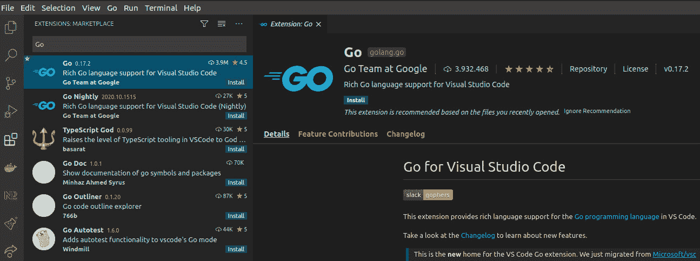

    图 1.1 – 从扩展视图安装

1.  首次安装扩展后，可能会提示您安装更多依赖项。通过点击 **安装** 按钮进行安装。如果没有提示，您也可以通过按 *Ctrl* + *Shift* + *P* 并输入以下命令来安装所有依赖项：

    ```go
    Go: install
    ```

1.  选择 **Go: 安装/更新工具** 命令，然后按 *Enter*：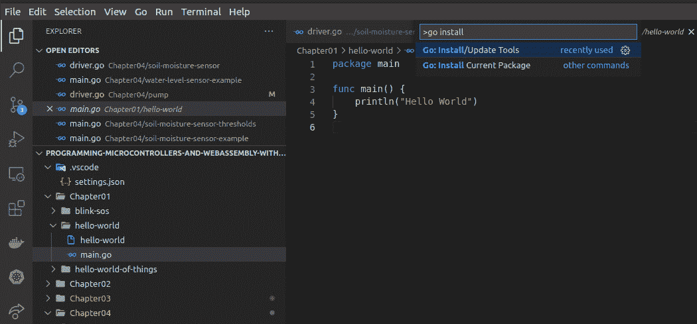

    图 1.2 – 执行安装/更新工具命令

1.  现在通过在左侧勾选复选框来选择所有依赖项，然后点击 **确定**：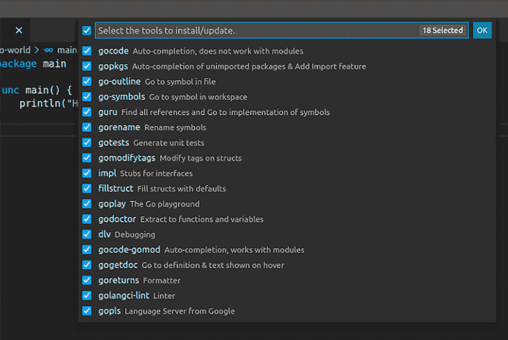

    图 1.3 – 选择所有依赖项

1.  VS Code 现在将安装所有依赖项，完成后应会打印以下消息：

    ```go
    All tools successfully installed. You are ready to Go :).
    ```

接下来，我们将看到 VS Code 中的 TinyGo 集成。

### TinyGo 扩展

TinyGo 在 VS Code 中的集成非常简单，因为有一个 TinyGo 扩展，我们只需要安装它。让我们快速浏览以下步骤：

1.  通过点击 **扩展** 图标或按 *Ctrl* + *Shift* + *X* 来打开 **扩展** 视图。

1.  搜索 **TinyGo**。

1.  选择列表中的第一个条目，它被称为 **TinyGo**，由 TinyGo 团队提供。

1.  点击以下截图中的 **安装** 按钮：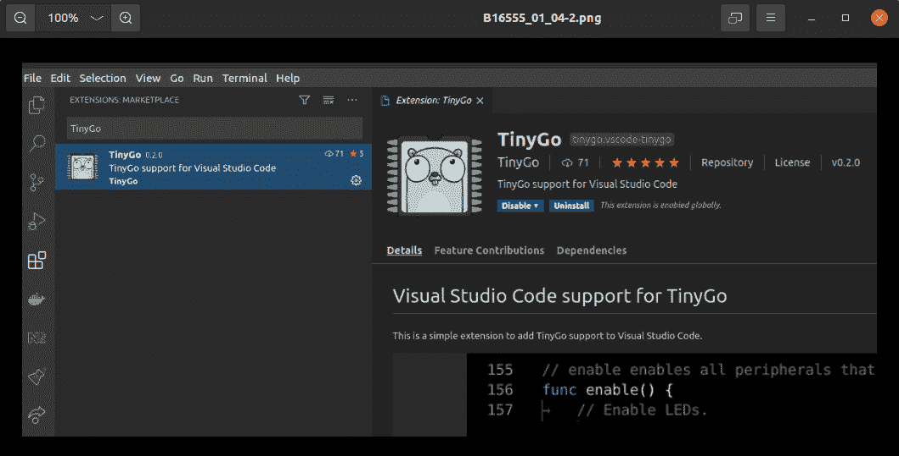

    图 1.4 – 显示 TinyGo 扩展的扩展视图

1.  我们还没有完成扩展的安装。我们需要使用另一个命令来配置我们想要构建的目标。按 *Ctrl* + *Shift* + *P*，输入 `TinyGo target`，然后按 *Enter*。

1.  现在，搜索`arduino`并按*Enter*键，正如我们在以下截图中所见：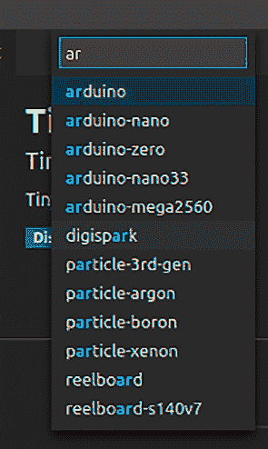

    图 1.5 – 目标选择弹出窗口

1.  VS Code 将打开一个弹出窗口，告诉您它需要重新加载窗口。通过点击**重新加载**来完成此操作：

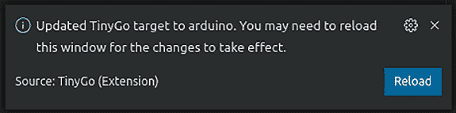

图 1.6 – 弹出窗口请求重新加载窗口

好的，我们现在已经安装了扩展，并选择了一个目标。但是，它内部是如何工作的？这个扩展的唯一功能是在当前项目的`vs code settings.json`中设置`go.toolsEnvVars`变量。

这可能看起来像以下示例：

```go
{
   "go.toolsEnvVars": {
     "GOROOT": "/home/user/.cache/tinygo/goroot-go1.14-f930d5b
         5f36579e8cbf1f-syscall",
     "GOFLAGS": "-tags=cortexm,baremetal,linux,arm,nrf51822,
         nrf51,nrf,microbit,tinygo,gc.conservative,scheduler.
         tasks"
 }
}
```

有时会出现类似于以下截图的弹出窗口。不要点击**更新工具**；只需关闭它。

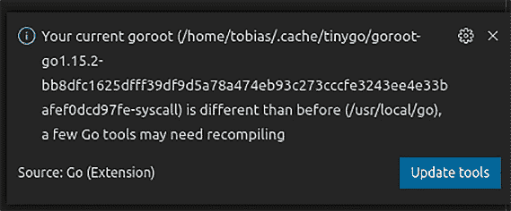

图 1.7 – 弹出窗口请求更新工具

如果您正在使用 VS Code，恭喜您，您已完成设置，准备开始使用！接下来的几节将解释如何在其他编辑器中设置 IDE 集成。

## 通用 IDE 集成

您可能会想知道，IDE 集成是如何与 TinyGo 一起工作的？嗯，我们只需要配置标准的 Go 工具，特别是**gopls 语言**服务器。

TinyGo 有自己的标准库实现，并提供额外的库，例如机器包。gopls 语言服务器需要知道在哪里查找这些包。这就是为什么我们需要为这个项目设置一个`GOROOT`。

TinyGo 大量使用编译器标志。这些标志在编译时用于确定哪些文件必须包含在构建中，正如我们在以下截图中所见：

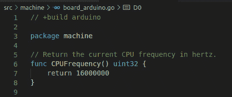

图 1.8 – 来自 TinyGo 源代码的 board_arduino.go 文件显示构建标志

因此，基本上，我们通过在本地设置这些环境变量将 TinyGo 集成到 IDE 中。

我们不必猜测`GOROOT`和`GOFLAGS`的正确值。TinyGo 提供了一个用于此目的的命令。假设我们想要为 Arduino 设置正确的标志，我们可以通过以下命令来查找：

```go
tinygo info arduino
```

这将打印以下结果：

```go
LLVM triple:       avr-unknown-unknown
GOOS:              linux
GOARCH:            arm
build tags:        avr baremetal linux arm atmega328p atmega avr5 arduino tinygo gc.conservative scheduler.none
garbage collector: conservative
scheduler:         none
cached GOROOT:     /home/tobias/.cache/tinygo/goroot-go1.15.2-bb8dfc1625dfff39df9d5a78a474eb93c273cccfe3243ee4e33bafef0dcd97fe-syscall
```

输出的重要部分是`build`标签和`缓存的 GOROOT`。

既然我们已经知道了所需信息的来源，我们就可以配置我们想要使用的任何 IDE。

## 设置 Goland

我们现在已经了解到我们必须设置`GOROOT`和`build`标签，我们也可以在 Goland 中配置集成。

从以下截图中的`tinygo info`命令设置`GOROOT`：

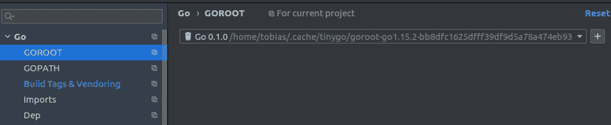

图 1.9 – Goland 中的 GOROOT 配置

下一步是设置`build`标签。您可以在**构建标签和供应商**下找到它们。将这些标签添加到**自定义标签**字段中：

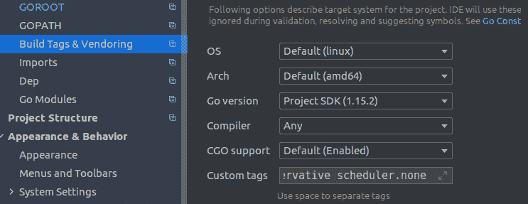

图 1.10 – Goland 中的自定义标签配置

注意

每次您想要为另一个微控制器编程时，都必须手动更改**自定义标签**。

## 集成任何编辑器

如果您已安装标准 Go 工具，您可以使用任何其他编辑器，例如 Vim 或 Nano，以便您获得 IDE 支持。由于其他编辑器可能缺少配置文件，我们可以通过在启动时传递它们环境变量来解决这个问题。

在以下示例中，我们首先设置环境变量，然后启动 VS Code 实例：

```go
 export GOFLAGS=-tags=avr,baremetal,linux,arm,atmega328p,atmega,avr5,arduino,tinygo,gc.conservative,scheduler.none; code
```

您可以将代码调用更改为任何其他程序，例如 `vim` 或 `nano`。在 Windows 系统上，调用可能略有不同。

既然我们已经知道如何为 TinyGo 配置任何 IDE，我们将继续学习关于 Arduino UNO 的内容。

# Arduino UNO

Arduino UNO 是最受欢迎的板之一。它由一个 8 位 ATmega328P 微控制器供电，截至本书编写时，有大量源自原始 Arduino UNO 板的衍生产品。让我们在以下小节中更好地了解它。

## 了解技术规格

如您在以下表中看到的，ATmega328P 只有 16 MHz 和 32 KB 闪存。标准 Go 生成大约 1.2 MB 的 Hello World 程序，甚至无法适应这个微控制器。因此，我们在非常有限的硬件上工作，但您将看到这足以构建惊人的项目。

这里简要地看看 Arduino UNO 的技术规格：

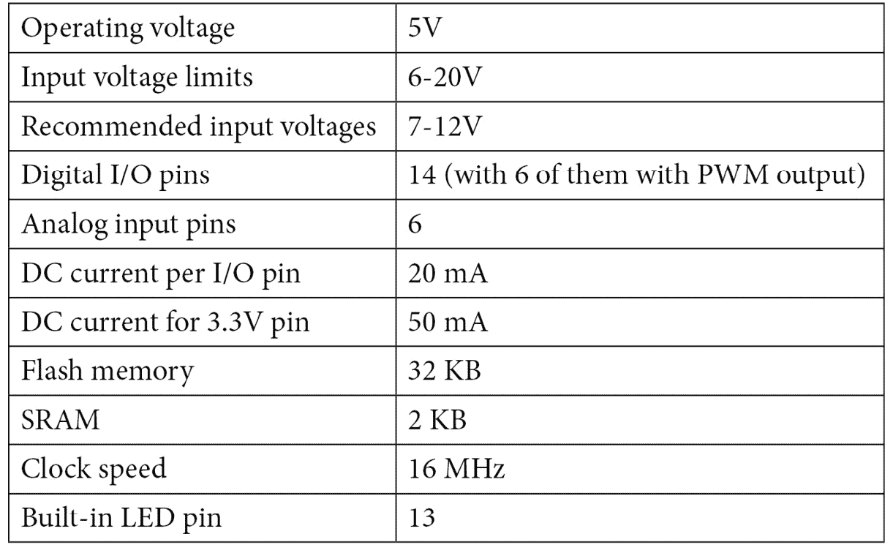

表 1.1 – 技术规格

注意

考虑每个 I/O 引脚的直流电流上限为 20 mA。您不应超过此限制，以防止损坏您的微控制器。

让我们看看引脚图。

## 探索引脚图

**引脚图**基本上是引脚的映射。我们将使用我们在 Arduino UNO 上构建的所有项目的这些引脚的描述。我们需要它来正确布线我们的组件。

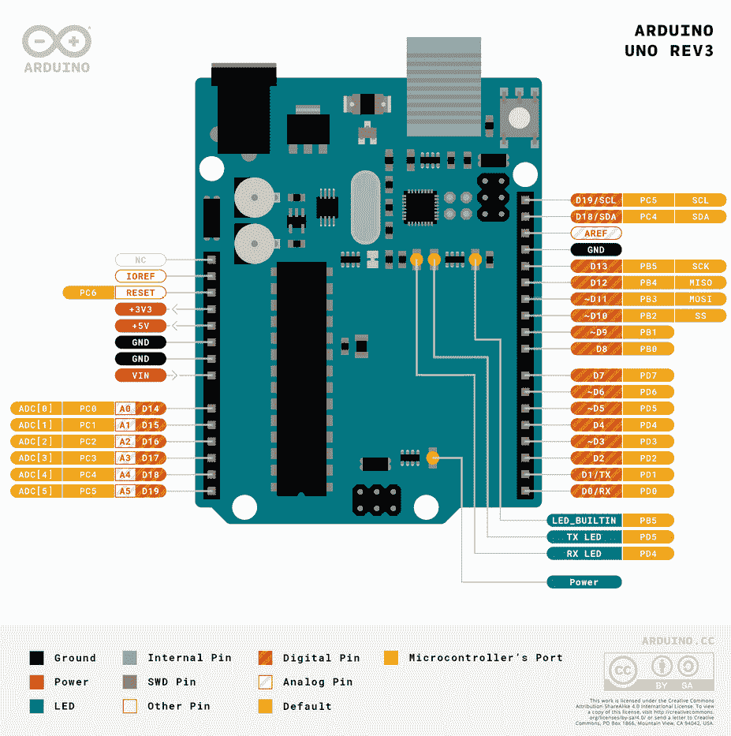

图 1.11 – Arduino UNO REV3 引脚图

既然我们已经了解了一些关于 Arduino UNO 的基本信息，让我们继续编写我们的第一个程序。

# 检查事物的 Hello World

Hello World 程序是开始学习一门新编程语言的典型方式。与普通 Hello World 程序相比，微控制器上的 Hello World 程序看起来略有不同。我们将编写一个 Hello World 程序来使内置 LED 闪烁。让我们开始吧！

## 准备要求

要开始使用我们的程序，我们需要以下内容：

+   Arduino UNO

+   一根 USB 线连接到您的电脑

## 准备项目

严格按照以下步骤进行您的项目：

1.  在您的项目根目录下创建一个名为 `ch1` 的新文件夹。

1.  在文件夹内，我们需要创建一个名为 `hello-world-of-things` 的文件夹，并在其中创建一个新的 `main.go` 文件。

1.  你的结构现在应该如下所示：

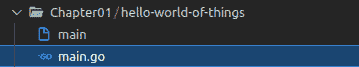

图 1.12 – 项目结构

现在我们已经准备好了我们的项目，我们可以继续编写我们的第一个程序。

## 编程微控制器

我们将让板载 LED 闪烁。这是我们最容易开始的例子。我们使用的例子是受 TinyGo 源代码中的 *Blinky 示例* 启发，该示例也被用作事物世界问候的展示。让我们仔细地过一遍每个步骤：

1.  声明 `main` 包：

    ```go
    package main
    ```

1.  导入 `machine` 和 `time` 包：

    ```go
    import (
        "machine"
        "time"
    )
    ```

1.  添加一个 `main` 函数：

    ```go
    func main() {
    ```

1.  初始化一个名为 `led` 的变量，其值为 `machine.LED`：

    ```go
        led := machine.LED
    ```

1.  将 `led` 引脚配置为输出引脚：

    ```go
        led.Configure(machine.PinConfig{Mode: machine.
        PinOutput})
    ```

1.  声明一个无限循环：

    ```go
        for {
    ```

1.  将 `led` 设置为 `Low` 以确保不向 LED 提供电压：

    ```go
        led.Low()
    ```

1.  将 `sleep` 设置为 `300` 毫秒，即 LED 关闭的时间：

    ```go
        time.Sleep(time.Millisecond * 300)
    ```

1.  将 `led` 设置为 `High` 以给 LED 提供电压，使其发光：

    ```go
        led.High()
    ```

1.  将 `Sleep` 设置为 `300` 毫秒，这是 LED 亮的时间：

    ```go
        time.Sleep(time.Millisecond * 300)
    ```

1.  关闭 `for` 循环：

    ```go
    }
    ```

1.  `main` 函数的闭合花括号：

    ```go
    }
    ```

`machine` 包提供了引脚映射的常量，并提供了一些与所使用的微控制器直接相关的函数。

我们必须在给 LED 提供电压和再次断电之间等待一定的时间，这样我们才能看到闪烁。

将引脚配置为输出意味着我们告诉微控制器我们只将通过此引脚发送信号。我们也可以将引脚配置为输入，这样我们就可以从引脚读取状态。

## 闪存程序

如果你在 Linux、macOS 或使用 Windows WSL，闪存程序是一个简单的命令。

简单地将你的 Arduino UNO 连接到任何 USB 端口并执行以下命令：

```go
tinygo flash --target=arduino ch1/hello-world-of-things/main.go
```

`tinygo flash` 命令至少需要以下参数：

+   `--target`，该命令将微控制器设置为闪存：

+   `main.go` 文件的路径

你的输出应该如下所示：

```go
avrdude: AVR device initialized and ready to accept instructions 
Reading | ################################################## | 100% 0.00s 
avrdude: Device signature = 0x1e950f (probably m328p)
avrdude: NOTE: "flash" memory has been specified, an erase cycle will be performed
         To disable this feature, specify the -D option.
avrdude: erasing chip
avrdude: reading input file "/tmp/tinygo208327574/main.hex"
avrdude: writing flash (558 bytes): 
Writing | ################################################## | 100% 0.10s 
avrdude: 558 bytes of flash written
avrdude: verifying flash memory against /tmp/tinygo208327574/main.hex:
avrdude: load data flash data from input file /tmp/tinygo208327574/main.hex:
avrdude: input file /tmp/tinygo208327574/main.hex contains 558 bytes
avrdude: reading on-chip flash data: 
Reading | ################################################## | 100% 0.08s 
avrdude: verifying ...
avrdude: 558 bytes of flash verified 
avrdude done.  Thank you.
```

如你所见，在我的例子中，闪存到 Arduino UNO 的代码只使用了 558 字节的内存。

恭喜你，你已经成功使用 TinyGo 在 Arduino UNO 上编写、构建和闪存了你的第一个程序。

## 使用 TinyGo Playground

你现在没有 Arduino UNO？你可以使用 **TinyGo Playground** 测试代码。TinyGo Playground 利用 WebAssembly 模拟少量板的行为，例如 Arduino Nano IoT 33 和 Arduino UNO。它还可以为 Arduino Nano IoT 33 编译程序。但请记住，TinyGo Playground 中的行为可能与真实硬件不同。

你可以在 [`play.tinygo.org/`](https://play.tinygo.org/) 找到 TinyGo Playground。

# 摘要

我们已经学习了 TinyGo 实际上是什么，它与标准 Go 有何不同，我们获得了关于 Arduino UNO 本身的基本知识，如何设置 TinyGo，如何设置 IDE 集成，最后，我们将我们的第一个程序写入并烧录到真实硬件上，并用我们的代码使 LED 闪烁。这不是一个有趣的开始吗？

我们将在下一章构建一个交通灯控制器系统。

# 问题

1.  哪个命令可以用来找出用于 IDE 集成的所需环境变量值？

1.  哪个命令可以用来将程序烧录到微控制器上？

1.  为什么在给 LED 供电或从 LED 取电时，我们必须让电路休眠一段时间？

1.  你会如何让 LED 以摩尔斯电码闪烁 S-O-S？
