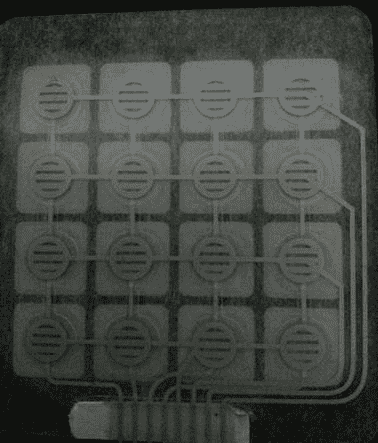

# *第三章*：使用键盘构建安全锁

在上一章中，我们学习了如何使用 LED、GPIO 端口和电阻，以及如何处理输入和输出。在本章中，我们将使用键盘构建一个安全锁。我们可以在键盘上输入一个密码，触发伺服电机解锁锁。这将通过将项目分解成单独的步骤并在本章末尾将其全部组合来实现。

在完成本章内容后，我们将了解如何将信息写入串行端口以及如何监控这些信息。这是一种轻松调试应用程序的好方法。然后，我们将编写自己的 4x4 键盘驱动程序，在我们的情况下，它可以作为密码输入使用。这个 4x4 键盘也可以用作控制器输入，或者作为启动程序不同部分的输入。在完成这些后，我们将编写控制伺服电机的逻辑。伺服电机可以用作锁机制，也常用于遥控飞机。最后，我们将有一个项目，可以设置密码，输入密码，如果输入正确，则触发伺服电机。

在本章中，我们将涵盖以下主要主题：

+   向串行端口写入

+   监控串行端口

+   监控键盘输入

+   编写驱动程序

+   寻找 TinyGo 的驱动程序

+   控制伺服电机

+   使用键盘构建安全锁

# 技术要求

为了在微控制器上调试程序，我们需要以下组件：

+   一块 Arduino Uno

+   一个 4x4 膜式键盘

+   一个 SG90 伺服电机

+   一个红色 LED

+   一个绿色 LED

+   14 根跳线

+   两个 220 欧姆电阻

+   一块面包板

您可以在 GitHub 上找到本章的代码：[`github.com/PacktPublishing/Creative-DIY-Microcontroller-Projects-with-TinyGo-and-WebAssembly/tree/master/Chapter03`](https://github.com/PacktPublishing/Creative-DIY-Microcontroller-Projects-with-TinyGo-and-WebAssembly/tree/master/Chapter03)

本章的“代码在行动”视频可以在以下链接找到：[`bit.ly/3uN9OAf`](https://bit.ly/3uN9OAf)

# 向串行端口写入

在微控制器上调试程序的一个简单方法是向串行端口写入消息。您可以使用此技术来调试程序，例如打印当前步骤或传感器值。

让我们编写一个小程序来看看如何向串行端口写入。我们首先在项目目录中创建一个名为`Chapter03`的新文件夹，然后在这个新目录内创建另一个名为`writing-to-serial`的新目录。现在我们需要创建一个新的`main.go`文件并插入一个空的`main()`函数。文件夹结构现在应该如下所示：


图 3.1 – 向串行端口写入的文件夹结构

现在，请按照以下步骤操作：

1.  我们打印单词`starting`后跟一个空格，然后打印单词`program`后跟一个`\n`：

    ```go
    print("starting ")
    print("program\n")
    ```

1.  我们无限循环，打印`Hello World`并暂停一秒钟：

    ```go
    for {
      println("Hello World")
      time.Sleep(1 * time.Second)
    }
    ```

1.  现在，使用以下命令将程序烧录到您的微控制器中：

    ```go
    print just writes the text to the serial port and does not insert a character for a newline.`println` adds a character for a newline.
    ```

好的，我们现在在控制器上有一个程序，它会将文本打印到串行端口。我们已经了解了一种非常方便的方法，可以将调试日志插入到我们的程序中。在下一节中，我们将学习如何从计算机上的串行端口读取数据。

# 监控串行端口

当我们向串行端口写入调试日志或其他消息时，我们需要一种方便的方式来监控这些日志。在所有操作系统上监控串行端口的一个简单方法是使用 PuTTY。

让我们先看看如何在各种平台上安装 PuTTy：

+   `apt`。我们可以使用以下命令来安装它：

    ```go
    tar.gz here: https://www.chiark.greenend.org.uk/~sgtatham/putty/latest.html
    ```

+   `brew`。我们可以使用以下命令来安装它：

    ```go
    brew install Putty
    ```

+   `.msi`文件。

由于我们现在已经安装了 PuTTY，现在是时候监控我们的串行端口了：

1.  确保上一节中的程序已经烧录到您的微控制器中，并且 USB 线已经插入。

1.  下一步是启动 PuTTY。一旦 PuTTY 启动，点击**会话**并选择**串行**作为**连接类型**。这应该看起来像以下截图：

    图 3.2 – PuTTy 配置

1.  现在我们必须选择串行线路。在 Windows 上，这通常是`/dev/ttyACM0`或`/dev/ttyUSB0`。

1.  由于我们现在已经成功配置了会话，我们可以保存此配置。为此，将`Microcontroller`作为名称并点击**保存**。这应该看起来像以下截图：

    图 3.3 – PuTTy 保存配置

1.  由于我们现在已经保存了配置，我们可以在每次想要监控串行端口时重用它。现在从列表中选择**微控制器**并点击**打开**按钮：

    图 3.4 – PuTTy 微控制器会话已选择

1.  点击**打开**按钮后，将打开一个新窗口，显示我们程序的输出。它应该看起来类似于以下截图：


图 3.5 – PuTTy 程序输出

现在我们已经学会了如何监控我们程序的输出。接下来，我们将学习如何使用 4x4 键盘并监控按键。

# 监控键盘输入

在本节中，我们将从 4x4 键盘读取输入并将按下的按钮打印到串行端口。由于 TinyGo 没有为此键盘提供驱动程序，我们将看看如何创建一个驱动程序。这将帮助您理解这个过程，并且当您需要使用其他不受支持的硬件时，您可以使用这些知识。

作为这个练习的一部分，我还遵循了将其添加到 TinyGo 代码库的过程，并且它应该在未来得到支持。我们将从学习如何连接键盘开始。然后我们将继续编写驱动程序，然后我们将简要地看看如何将新驱动程序添加到 TinyGo。

## 构建电路

我们首先组装电路。我们需要一个 4x4 键盘和八根跳线。虽然我们可以使用跳线直接将键盘连接到 Arduino 端口，但我们将通过面包板进行连接。我们将在接下来的章节中添加更多组件。按照以下步骤正确连接键盘：

1.  将引脚 *D3* 连接到 *A32*。

1.  将引脚 *D4* 连接到 *A31*。

1.  将引脚 *D5* 连接到 *A30*。

1.  将引脚 *D6* 连接到 *A29*。

1.  将引脚 *D7* 连接到 *A28*。

1.  将引脚 *D8* 连接到 *A27*。

1.  将引脚 *D9* 连接到 *A26*。

1.  将引脚 *D10* 连接到 *A25*。

1.  将 *E32* 与键盘上的 *0* 号引脚连接。

1.  将 *E31* 与键盘上的 *1* 号引脚连接。

1.  将 *E30* 与键盘上的 *2* 号引脚连接。

1.  将 *E29* 与键盘上的 *3* 号引脚连接。

1.  将 *E28* 与键盘上的 *4* 号引脚连接。

1.  将 *E27* 与键盘上的 *5* 号引脚连接。

1.  将 *E26* 与键盘上的 *6* 号引脚连接。

1.  将 *E25* 与键盘上的 *7* 号 P 引脚连接。

完成这些后，您的电路应类似于以下截图：


图 3.6 – 键盘电路 – 图片来自 Fritzing

我们现在已经正确地连接了键盘。在我们继续编写代码之前，我们需要了解 4x4 键盘是如何工作的。

## 理解 4x4 键盘的工作原理

观察键盘，我们发现它基本上由 **四行** 组成，每行有 **四列**。键盘共有八个引脚。前四个引脚用于行，剩下的四个用于列。为了确定哪个键被按下，我们只需找到按下键在 4x4 坐标系统中的位置。

例如，按钮 **1** 的坐标是 0,0（行 0，列 0），而按钮 **D** 的坐标是 3,3（行 3，列 3）。

在键盘的内部电路中，行与列相连。当按钮被按下时，电路闭合。当电路闭合时，电流流动，这就是我们可以在引脚上读取的信号。由于键盘没有直接连接到 GND 和 VCC，我们需要为键盘提供电源。这就是为什么将使用四个引脚作为输入，四个作为输出引脚。

我已经拆解了这样一个 4x4 键盘，以提供内部电路的视觉：



图 3.7 – 键盘内部电路

如我们所知，我们基本上只需要检查这个 4x4 坐标系统中的每个坐标是否处于正确状态，然后我们可以继续编写代码。

# 编写驱动程序

由于我们希望有可重用的代码，我们将为键盘编写一个驱动程序包。驱动程序将提供一个易于使用的接口，同时隐藏更复杂的实现逻辑。这样做，我们可以在以后的工程中简单地重用这个包，甚至超出本书的范围。官方 TinyGo 驱动程序通常提供一个类似于构造函数的函数来创建驱动程序的新实例，以及一个 `Configure` 函数来处理初始化。我们也将提供类似的 API。

就像我们之前的工程一样，我们将在 `Chapter03` 文件夹内创建一个名为 `controlling-keypad` 的新文件夹。然后，我们将在 `main.go` 文件中创建一个空的 `main` 函数。此外，我们还需要创建一个名为 `keypad` 的新文件夹，并创建一个名为 `driver.go` 的新文件，然后命名包为 `keypad`。现在，您的项目结构应该如下所示：


图 3.8 – 编写驱动程序的工程结构

我们将逻辑分为以下五个部分：

+   `Driver` 变量

+   `Configure`

+   `GetIndices`

+   `GetKey`

+   `main`

让我们了解每个部分。

## 驱动变量

在我们的 `Driver` 结构体内部，我们需要一些变量。按照以下步骤设置它：

1.  定义一个新的名为 `Driver` 的结构体：

    ```go
    type Driver struct {
    ```

1.  我们需要一个 `inputEnabled` 变量来去抖动按键：

    ```go
       inputEnabled bool
    ```

1.  `lastColumn` 和 `lastRow` 用于保存上次按键的位置：

    ```go
       lastColumn int
       lastRow int
    ```

1.  我们需要一个 `machine.Pin` 数组来存储列引脚：

    ```go
       columns [4]machine.Pin
    ```

1.  我们需要一个 `machine.Pin` 数组来存储行引脚：

    ```go
       rows [4]machine.Pin
    ```

1.  我们使用映射将键值映射到索引（位置）：

    ```go
       mapping [4][4]string
    }
    ```

现在我们将初始化引脚和 `Driver` 变量。

## Configure

首先创建一个名为 `Configure` 的空函数，该函数接受八个 `machine.Pin` 函数作为参数，并且是 `Driver` 的指针接收器。这应该看起来像以下代码片段：

```go
func (keypad *Driver)Configure(r4, r3, r2, r1, c4, c3, c2 ,c1 machine.Pin) {}
```

下一步是将初始化逻辑放入此函数中。为此，请按照以下步骤操作：

1.  使用 PinInputPullup 配置初始化列引脚。内部上拉电阻将使列保持在 5 V，直到按键被按下，然后我们可以将其作为输入读取：

    ```go
    inputConfig := machine.PinConfig{Mode: machine.
                   PinInputPullup}
    outputConfig := machine.PinConfig{Mode: machine.
                    PinOutput}
    c4.Configure(inputConfig)
    c3.Configure(inputConfig)
    c2.Configure(inputConfig)
    c1.Configure(inputConfig)
    ```

1.  将列引脚添加到 `columns` 数组中。这样做之后，我们就可以通过循环遍历所有列：

    ```go
    keypad.columns = [4]machine.Pin{c4, c3, c2, c1}
    ```

1.  使用 `PinOutput` 配置初始化行引脚：

    ```go
    outputConfig := machine.PinConfig{Mode: machine.
                    PinOutput}
    r4.Configure(outputConfig)
    r3.Configure(outputConfig)
    r2.Configure(outputConfig)
    r1.Configure(outputConfig)
    ```

1.  将所有行引脚添加到行数组中。这样我们就可以通过循环遍历所有行：

    ```go
    keypad.rows = [4]machine.Pin{r4, r3, r2, r1}
    ```

1.  使用键值初始化映射。我们将映射按下的列和行索引以获取正确的键值：

    ```go
    keypad.mapping = [4][4]string{
        {"1", "2", "3", "A"},
        {"4", "5", "6", "B"},
        {"7", "8", "9", "C"},
        {"*", "0", "#", "D"},
    }
    ```

1.  初始化 `inputEnabled`、`lastColumn` 和 `lastRow`：

    ```go
    keypad.inputEnabled = true
    keypad.lastColumn = -1
    keypad.lastRow = -1
    ```

这是我们初始化程序与键盘通信所需的一切。

## GetIndices

现在我们只需要遍历数组和列，找到按下的键。我们首先创建一个名为 `GetIndices` 的新函数，该函数返回两个整数，并且是一个指向 `Driver` 的指针接收器。这应该看起来像以下代码片段：

```go
func (keypad *Driver) GetIndices() (int, int){}
```

现在，按照以下步骤实现函数逻辑：

1.  遍历所有行：

    ```go
    for rowIndex := range keypad.rows {
    ```

1.  将当前的 `rowPin` 设置为 `Low`。我们需要这样做，因为我们正在使用内部的 `rowPin` 设置为 `High`：

    ```go
    rowPin := keypad.rows[rowIndex]
    rowPin.Low()
    ```

1.  遍历所有列：

    ```go
    for columnIndex := range keypad.columns {
    ```

1.  获取当前的 `columnPin`：

    ```go
    columnPin := keypad.columns[columnIndex]
    ```

1.  检查当前的 `columnPin` 是否被按下，并在接受输入时执行逻辑。禁用接受输入并保存当前列和行，然后返回索引：

    ```go
    if !columnPin.Get() && keypad.inputEnabled {
      keypad.inputEnabled = false
      keypad.lastColumn = columnIndex
      keypad.lastRow = rowIndex
      return keypad.lastRow, keypad.lastColumn
    }
    ```

1.  如果之前的键不再被按下，请再次接受输入：

    ```go
    if columnPin.Get() &&
        columnIndex == keypad.lastColumn &&
        rowIndex == keypad.lastRow &&
        !keypad.inputEnabled {
        keypad.inputEnabled = true
    }}
    ```

1.  将 `rowPin` 再次设置为 `High` 并关闭外部循环：

    ```go
    rowPin.High()
    }
    ```

1.  如果没有按键被按下，则返回 `–1, -1` 并关闭函数：

    ```go
    return -1, -1
    }
    ```

调用此函数将告诉我们按下的键在坐标系中的位置。如果您想更详细地了解上拉和下拉电阻，请查看以下链接：[`www.electronics-tutorials.ws/logic/pull-up-resistor.html`](https://www.electronics-tutorials.ws/logic/pull-up-resistor.html)。

## GetKey

接下来，我们将创建一个函数来检查按下的键的索引并将索引映射到键值。为此，我们从一个名为 `GetKey` 的空函数开始，该函数返回一个字符串，并且是一个指向 `Driver` 的指针接收器。这应该看起来像以下代码片段：

```go
func (keypad *Driver) GetKey() string {}
```

在此函数内部，我们只是调用 `GetIndices` 方法，检查是否按下了按钮，如果按下了按钮，我们就以字符串的形式返回键值。这看起来像以下代码：

```go
    row, column := keypad.GetIndices()
        if row == -1 && column == -1 {
              return ""
    }
    return keypad.mapping[row][column]
```

现在，只缺少 `main` 逻辑。让我们看看下一个！

## main

我们调用初始化逻辑并无限循环以检查按下的键。以下步骤展示了如何操作：

1.  初始化 `keypadDevice`：

    ```go
    keypadDevice := keypad.Driver{}
    keypadDevice.Configure(machine.D3, machine.D4, machine.
        D5, machine.D6, machine.D7, machine.D8, machine.D9, 
        machine.D10)
    ```

1.  现在，无限循环，检查按键，如果按下了键就打印值：

    ```go
    for {
      key := keypadDevice.GetKey()
      if key != "" {
        println("Button: ", key)
      }
    }
    ```

太好了！这就完成了。现在我们可以烧录程序并监控输出。使用以下命令烧录程序：

```go
tinygo flash –target=arduino Chapter03/controlling-keypad/main.go
```

现在，打开 PuTTy 并在按键盘上的键时监控串行输出。输出应该类似于以下截图：


图 3.9 – PuTTy 中的按键输出

太好了，我们已经成功编写了自己的驱动程序来监控键盘上的按钮按下！

在下一节中，我们将学习在哪里找到用于外围硬件的 TinyGo 驱动程序。我们还将查看向 TinyGo 驱动程序存储库贡献的过程。

# 寻找 TinyGo 的驱动程序

截至写作时，TinyGo 支持 53 种设备。我们刚刚编写的，我将要贡献给 TinyGo 的驱动程序将支持 54 种设备。但我们如何找到我们想要使用的设备的驱动程序呢？答案是简单的：有一个用于此目的的仓库。您可以在[`github.com/tinygo-org/drivers`](https://github.com/tinygo-org/drivers)找到它。

在下一章中，我们将学习如何在使用不同类型的显示器时使用此类驱动程序。

## 为 TinyGo 贡献驱动程序

TinyGo 社区非常欢迎所有贡献。如果您为设备开发了一个驱动程序并希望将其贡献给 TinyGo，您可以遵循以下简单步骤：

1.  提出一个问题并解释您想添加的内容以及您计划如何实现它。

1.  分叉仓库。

1.  基于 dev 分支创建一个新的分支。

1.  提交一个 pull request。

您可以在以下链接中找到贡献指南：[`github.com/tinygo-org/drivers/blob/release/CONTRIBUTING.md`](https://github.com/tinygo-org/drivers/blob/release/CONTRIBUTING.md)。

总的来说，我对 TinyGo 社区的个人经历极为积极。他们非常礼貌，并且会帮助您解决任何问题。我没有遇到过社区无法给我提供有用答案的问题。不要害怕在问题中或在 Gophers slack 的 TinyGo 频道中提问。

注意

请不要在任何官方 TinyGo 渠道（如 Slack 或 GitHub）中提出与此书直接相关的问题。如果您对此书有任何问题，可以在配套的 GitHub 仓库中提出问题或给我发送电子邮件。

如我们所知，如何使用键盘和在哪里找到驱动程序，我们可以继续我们的安全锁的下一部分。

# 控制伺服电机

由于我们现在能够读取键盘的输入，要构建一个安全锁所缺少的是某种类型的电机。为此，我们将使用 SG90 伺服电机。截至写作时，Arduino Uno 上的定时不够准确，无法完全控制 SG90 伺服电机，但这对我们用例来说不是问题。我们只是将伺服器向一个方向移动，即顺时针方向。此外，目前还没有 SG90 伺服电机的官方驱动程序，因此我们将编写自己的驱动程序！

## 理解 SG90 伺服电机

SG90 伺服电机由**脉冲宽度调制**（**PWM**）控制。基本上，SG90 在一个 50 赫兹的周期内读取输入。在这个周期内，我们可以通过设置一定时间的信号来告诉伺服电机调整到一定的角度。这个信号的长度被称为*占空比*。在占空比之后，我们等待剩余的周期。根据占空比（**脉冲宽度**），SG90 将调整其角度。

SG90 可以调整到以下三个位置：

+   使用 1.5 毫秒脉冲旋转 0 度（中心）。

+   使用 2 毫秒脉冲旋转+90 度（右侧）。

+   使用 1 毫秒脉冲旋转-90 度（左侧）。

通过对脉冲宽度大小进行一些数学运算，也可以将伺服电机调整到这个范围内的所有角度，但我们的示例中不需要这样做。

SG90 通常有三根线：

+   黑色/棕色用于地线

+   红色用于 VCC

+   橙色/黄色用于 PWM 信号

## 构建电路

我们将在上一个示例的基础上进行构建。我们只需按照以下步骤添加伺服电机：

1.  将 Arduino Uno 的 5V 端口连接到电源总线上的正线。

1.  将 Arduino Uno 的 GND 端口连接到电源总线上的地线。

1.  将 SG90 的 GND 线连接到电源总线上的地线。

1.  将 SG90 的 VCC 线连接到电源总线上的正线。

1.  将 SG90 的 PWM 线连接到 Arduino Uno 的*D11*引脚。

我们现在的电路应该看起来像下面的截图：


图 3.10 – 键盘和伺服电机

很好。在我们开始编程之前，我们应该了解一些关于 Arduino Uno 上的 PWM 引脚的知识。只有 GPIO 端口中的六个引脚能够进行 PWM。这些引脚被标记为**~**符号。

注意

在 Arduino Uno 上，你可以使用*D3*、*D5*、*D6*、*D9*、*D10*和*D11*引脚进行 PWM。

## 编写伺服控制逻辑

我们需要在`Chapter03`文件夹内创建一个名为`controlling-servo`的新文件夹。接下来，在新的文件夹内创建一个名为`main.go`的新文件，并插入一个空的`main`函数。此外，我们还需要在`servo`包内创建一个名为`servo`的新文件夹，并包含一个名为`driver.go`的新文件。我们的项目结构现在应该看起来如下：


图 3.11 – 伺服控制逻辑的项目结构

注意

PWM 目前正在重做。在未来的处理中，PWM 设备将更加简单。它现在也由硬件 PWM 而不是模拟 PWM 行为来处理。你可以在以下 pull request 中查看进度：[`github.com/tinygo-org/tinygo/pull/1121`](https://github.com/tinygo-org/tinygo/pull/1121)。

我们现在正在构建的驱动器的主要目的是教我们 PWM 实际上是如何工作的，并且将在所有不是基于 8 位 AVR 架构的微控制器上运行得更好，例如 Arduino Uno 上的 ATmega328P。这是因为尽管 TinyGo 的 AVR 支持正在随着每个版本的发布而不断改进，但它仍然是实验性的。一旦之前提到的 PR 被合并，我建议使用基于该硬件 PWM 支持的驱动器来控制伺服电机。

也请注意，截至写作之时，当伺服电机到达最右侧位置时，你需要手动将其重置。

在`driver.go`文件中，我们需要按照以下步骤来让我们的伺服电机旋转一点：

1.  声明包级别的常量用于占空比和`rightRemainingPeriod`：

    ```go
    const centerDutyCycle = 1500 * time.Microsecond
    const centerRemainingPeriod = 18500 * time.Microsecond
    const leftDutyCycle = 2000 * time.Microsecond
    const leftRemainingPeriod = 18000 * time.Microsecond
    const rightDutyCycle = 1000 * time.Microsecond
    const rightRemainingPeriod = 19000 * time.Microsecond
    ```

1.  创建一个名为`Driver`的新结构体，它有一个`machine.Pin`成员：

    ```go
    type Driver struct {
        pin machine.Pin
    }
    ```

1.  定义一个名为 `Configure` 的新空函数，它接受 `machine.Pin` 作为参数，并且是 `Driver` 的指针接收器：

    ```go
    func (servo *Driver) Configure(pin machine.Pin) {}
    ```

1.  将引脚配置为输出：

    ```go
        servo.pin = pin
        servo.pin.Configure(machine.PinConfig{Mode: machine.
        PinOutput})
    ```

1.  循环四次，仅将电机旋转约 30 度：

    ```go
    for position := 0; position <= 4; position++ {
    ```

1.  设置占空比的信号，将其拉低，然后睡眠剩余的周期：

    ```go
        servo.pwm.Pin.High()
        time.Sleep(rightDutyCycle)
        servo.pwm.Pin.Low()
        time.Sleep(rightRemainingPeriod)
    }
    ```

在我们能够尝试我们的库之前，我们需要编写一个小型的示例程序。为此，将以下片段放入控制 `servo` 文件夹内的 `main.go` 文件中：

```go
func main() {
    servo := servo.Driver{}
    servo.Configure(machine.D11)
    servo.Right()
}
```

现在我们只需要通过以下命令闪烁程序来尝试该程序：

```go
tinygo flash –target=arduino Chapter03/controlling-servo/main.go
```

恭喜，这是我们第一次使用代码移动某个东西。既然我们已经学会了如何稍微旋转伺服电机以及如何从键盘读取输入，下一步就是将所有这些整合在一起。

一旦 PWM 的重构合并到上游并发布在 TinyGo 版本中，你就不想再使用之前的驱动程序了。为此，我们创建了一个新的驱动程序，它使用硬件 PWM 而不是模拟行为。所以继续创建一个名为 `servo-pwm` 的新文件夹，并在其中创建一个新的 `driver.go` 文件。然后按照以下步骤实现更好的驱动程序：

1.  我们定义了周期，为 20.000 微秒，并创建了一个新的 `Device` 结构体，如下所示：

    ```go
    const period = 20e6
    type Device struct {
        pwm machine.PWM
        pin machine.Pin
        channel uint8
    }
    ```

1.  下一步是添加一个构造函数，如下所示：

    ```go
    func NewDevice(timer machine.PWM, pin machine.Pin) *Device {
        return &Device{
            pwm: timer,
            pin: pin,
        }
    }
    ```

1.  现在我们配置 PWM 接口。我们需要设置周期并获取输出引脚的通道：

    ```go
    func (d *Device) Configure() error {
        err := d.pwm.Configure(machine.PWMConfig{
            Period: period,
        })
        if err != nil {
            return err
        }
        d.channel, err = d.pwm.Channel(machine.Pin(d.pin))
            if err != nil {
                return err}
        return nil
    }
    ```

1.  现在我们添加一些函数，让我们能够设置伺服电机的位置。我们以参数的形式传入占空比的微秒数，如下所示：

    ```go
    func (d *Device) Right() {
        d.setDutyCycle(1000)
    }
    func (d *Device) Center() {
        d.setDutyCycle(1500)
    }
    func (d *Device) Left() {
        d.setDutyCycle(2000)
    }
    ```

1.  作为最后一步，我们控制通道的占空比：

    ```go
    func (d *Device) setDutyCycle(cycle uint64) {
        value := uint64(d.pwm.Top()) * cycle / (period / 
        1000)
        d.pwm.Set(d.channel, uint32(value))
    }
    ```

让我们尝试一下 `Set` 函数的工作原理。为此，我们查看文档，因为该函数在那里解释得非常清楚：


图 3.12 – pwm.Set()文档

现在，让我们也创建一个使用新驱动程序的替代示例程序。为此，在 `Chapter03` 文件夹内创建一个名为 `controlling-servo-pwm` 的新文件夹，并将以下代码放入 `main` 函数中：

```go
servo := servopwm.NewDevice(machine.Timer1, machine.D9)
err := servo.Configure()
if err != nil {
    for {
        println("could not configure servo:", err.Error())
        time.Sleep(time.Second)
}
}
for {
    servo.Left()
    time.Sleep(time.Second)
    servo.Center()
    time.Sleep(time.Second)
    servo.Right()
    time.Sleep(time.Second)
}
```

在前面的例子中，我们使用了 `machine.Timer1`，因为 `Timer1` 是一个 16 位定时器，可以与 `machine.D9` 引脚一起使用。`Timer0` 和 `Timer2` 是用于其他 PWM 引脚的 8 位定时器。

优秀！我还添加了使用基于硬件 PWM 的驱动器而不是我们在前面代码中使用的软件模拟驱动器的替代实现，用于本章所有后续项目。您可以在 GitHub 仓库的`Chapter03`文件夹中找到它们。我强烈建议使用这个伺服电机驱动器的实现，而不是我们最初创建的那个，因为这个实现与我们在第一个项目中编写的软件模拟 PWM 驱动器相比，在 Arduino UNO 上工作得更好。实现 PWM 接口的软件模拟仍然是理解 PWM 内部工作原理的好方法。我还为本章的最终项目实现了一个替代程序，该程序使用硬件 PWM 伺服电机驱动器。如果您无法构建使用新驱动器的项目，那么 PWM 重构尚未进入 TinyGo 发布分支。但我非常确信，这个特性将在今年（2021 年）发布。

# 使用键盘构建安全锁

我们现在知道如何从键盘读取输入以及如何控制伺服电机。我们将使用这些知识来构建一个安全锁，当通过键盘输入正确的密码时，该锁会打开。因为我们编写了控制伺服电机和从键盘读取数据的库，所以我们只需要编写检查密码并点亮 LED 的逻辑。我们将让红色 LED 在每次按键时闪烁。当我们输入错误的密码时，我们将红色 LED 点亮 3 秒。当我们输入正确的密码时，我们将绿色 LED 点亮 3 秒并触发伺服电机。

## 构建电路

我们将重用本章前几节中构建的电路。因为我们已经有了连接好的伺服电机和键盘，我们只需要添加 LED 和电阻。

要构建最终电路，请按照以下步骤操作：

1.  将 Arduino Uno 的 GND 端口与电源总线上的 GND 通道连接。

1.  将红色 LED 的阴极放置在*G7*，阳极放置在*G8*。

1.  将绿色 LED 的阴极放置在*G11*，阳极放置在*G12*。

1.  使用跳线将*F7*与电源总线上的地连接。

1.  使用跳线将*F11*与电源总线上的地连接。

1.  使用 220 欧姆电阻将*D8*与*F8*连接。

1.  使用 220 欧姆电阻将*D12*与*F12*连接。

1.  使用跳线将 Arduino Uno 的*D12*引脚与*A12*连接。

1.  使用跳线将 Arduino Uno 的*D13*引脚与*A8*连接。

现在我们的电路应该看起来像以下屏幕截图中的电路：


图 3.13 – 键盘、伺服电机和 LED 电路

## 编写逻辑

由于我们已经成功连接了电路，我们现在可以开始编写程序的逻辑。我们首先在`Chapter03`文件夹内创建一个名为`safety-lock-keypad`的新文件夹，并在新文件夹内创建一个包含空`main`函数的新`main.go`文件。我们的项目结构现在应该如下所示：


图 3.14 – 安全锁程序的项目结构

由于我们可以重用我们的库，我们只需关注实际的密码逻辑。要实现逻辑，请使用以下步骤：

1.  导入`keypad`和`servo`驱动程序。然后，您需要调整路径以匹配您的`Gopath`中的包路径：

    ```go
    "https://github.com/PacktPublishing/Creative-DIY-Microcontroller-Projects-with-TinyGo-and-WebAssembly/tree/master/Chapter03/keypad"
    "https://github.com/PacktPublishing/Creative-DIY-Microcontroller-Projects-with-TinyGo-and-WebAssembly/tree/master/Chapter03/servo"
    ```

1.  在`main`函数内部，我们首先初始化`keypadDriver`：

    ```go
    keypadDriver := keypad.Driver{}
    keypadDriver.Configure(machine.D2, machine.D3, machine.
        D4, machine.D5, machine.D6, machine.D7, machine.D8, 
        machine.D9)
    ```

1.  现在，我们初始化`servoDriver`：

    ```go
    servoDriver := servo.Driver{}
    servoDriver.Configure(machine.D11)
    ```

1.  初始化一个新的`outPutConfig`：

    ```go
    outPutConfig := machine.PinConfig{Mode: machine.
                    PinOutput}
    ```

1.  初始化两个 LED：

    ```go
    led1 := machine.D12
    led1.Configure(outPutConfig)
    led2 := machine.D13
    led2.Configure(outPutConfig)
    ```

1.  使用值`133742`初始化密码：

    ```go
    const passcode = "133742"
    ```

1.  使用空字符串作为值初始化一个名为`enteredPasscode`的新变量：

    ```go
    enteredPasscode := ""
    ```

1.  读取键盘输入：

    ```go
    for {
        key := keypadDriver.GetKey()
    ```

1.  检查是否按下了键，并将按下的键打印到串行端口，同时将按下的键追加到`enteredPasscode`变量中：

    ```go
        if key != "" {
            println("Button: ", key)
            enteredPasscode += key
    ```

1.  点亮红色 LED 以提供视觉反馈并关闭`if`语句：

    ```go
            led2.High()
            time.Sleep (time.Second / 5)
            led2.Low()
    }
    ```

1.  检查`enteredPasscode`的长度是否与`passcode`相同：

    ```go
        if len(enteredPasscode) == len(passcode) {
    ```

1.  如果`enteredPasscode`与`passcode`值匹配，将`Success`打印到串行端口，重置`enteredPasscode`并触发伺服电机：

    ```go
        if enteredPasscode == passcode {
            println("Success") 
            enteredPasscode = ""
            servoDriver.Right()
    ```

1.  点亮绿色 LED 以提供成功的视觉反馈，并使用`else`处理错误的密码情况：

    ```go
            led1.High()
            time.Sleep(time.Second * 3)
            led1.Low()
    } else {
    ```

1.  将`Fail`和输入的密码打印到串行端口，这有助于我们在调试程序时，并重置`enteredPasscode`：

    ```go
            println("Fail")
            println("Entered Password: ", enteredPasscode)
            enteredPasscode = ""
    ```

1.  点亮红色 LED 以提供失败的视觉反馈，并关闭`else`和`if`情况：

    ```go
            led2.High()
            time.Sleep(time.Duration(time.Second * 3))
            led2.Low()
    }
    }
    ```

1.  睡眠`50`毫秒并关闭`for`循环。这有助于消除按键抖动：

    ```go
    time.Sleep(50 * time.Millisecond)
    }
    ```

太好了，我们现在已经在本章中编写了最终项目的完整逻辑。现在使用以下命令烧录程序：

```go
tinygo flash –target=arduino Chapter03/safety-lock-keypad/main.go
```

由于我们现在已经成功烧录了程序，打开 PuTTy 并打开通过加载您的保存配置文件的**微控制器**串行会话。现在输入一个随机密码以让程序失败。红色 LED 应该亮起 3 秒，PuTTy 中的输出应该如下截图所示：


图 3.15 – 错误输入

现在，让我们尝试正确的密码，所以输入`133742`作为密码。输出现在应该类似于以下截图：


图 3.16 – 正确输入

优秀，我们已经成功构建了一个接受密码并在输入正确密码时触发伺服电机的电路。

你可以找到一个使用新重构的 PWM 的替代实现：[`github.com/PacktPublishing/Creative-DIY-Microcontroller-Projects-with-TinyGo-and-WebAssembly/blob/master/Chapter03/safety-lock-keypad-pwm/main.go`](https://github.com/PacktPublishing/Creative-DIY-Microcontroller-Projects-with-TinyGo-and-WebAssembly/blob/master/Chapter03/safety-lock-keypad-pwm/main.go)

# 摘要

在本章中，我们学习了如何向串行端口发送消息以及如何配置 PuTTy 来监控串行端口上的消息。然后，我们利用这些知识通过我们编写的驱动程序在键盘上输出按键操作。在这个过程中，我们学习了如何为目前没有官方驱动程序的设备编写驱动程序，并且了解了 TinyGo 的驱动程序仓库的贡献过程。

然后，我们学习了如何控制伺服电机，并编写了一个库来实现这一功能。作为最后一步，我们将本章学到的所有知识结合起来，构建了一个接受密码来打开锁的安全锁。如果你想要构建一个门锁或飞行控制系统，其中需要控制伺服电机，这些知识将非常有用。键盘也可以用作游戏手柄，其中你使用按键作为输入。作为额外奖励，我们还编写了两个可以在完成本书后重用于所有未来项目的驱动程序。

在下一章中，我们将学习如何使用 ADC 引脚读取传感器值，如何在值中找到阈值，如何控制泵，以及如何使用继电器和蜂鸣器。

# 问题

1.  在了解了我们用于键盘的坐标系之后，3 号键的坐标是什么？

1.  在我们的最终项目中，我们检查了当达到正确的密码长度时输入是否正确。你将如何修改代码，使其在按下按键编号时检查密码是否正确？
